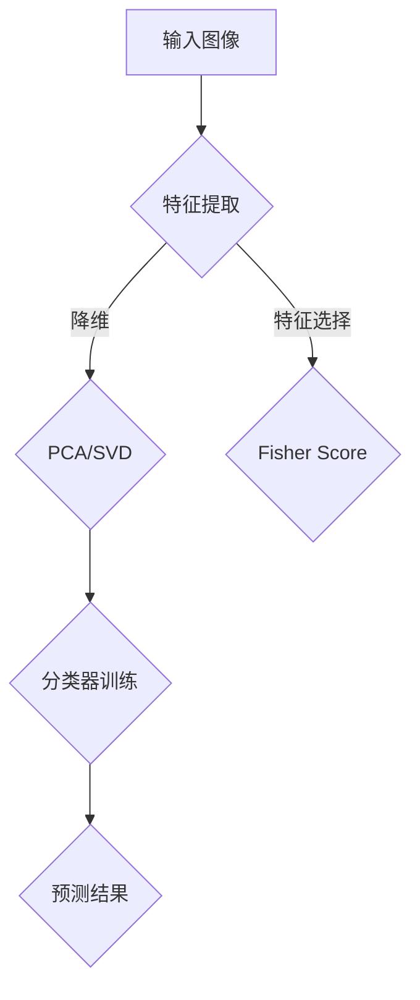
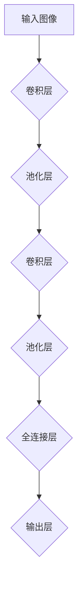
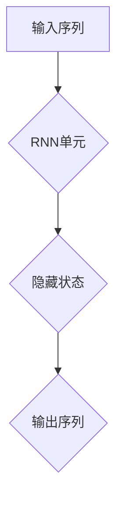
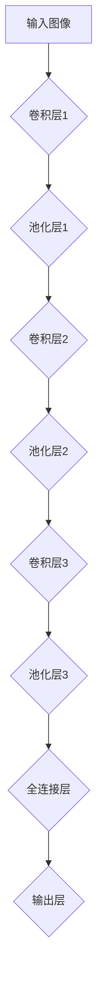
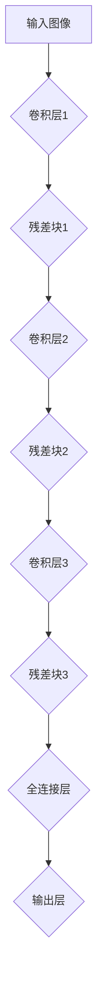
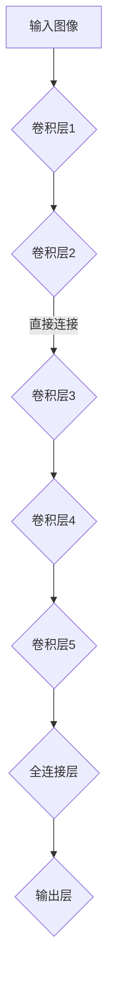
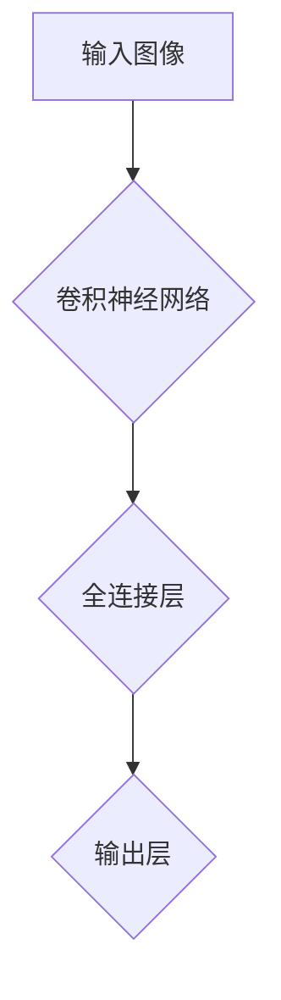

                 

# 图像分类原理与代码实例讲解

> 关键词：图像分类、深度学习、卷积神经网络、数据预处理、模型优化、案例实战

> 摘要：本文将详细探讨图像分类的基本原理和关键算法，并通过实际案例讲解如何使用深度学习工具（如Keras、TensorFlow、PyTorch）进行图像分类任务。文章将包括数学模型、神经网络架构、优化算法等方面的深入分析，同时提供详细的代码实例和实战指导。

### 目录大纲

1. **图像分类概述**
2. **图像分类算法原理**
   1. 基础概念与联系
   2. 核心算法原理讲解
   3. 数学模型和数学公式
   4. 图像分类工具与库
3. **图像分类实战**
4. **高级图像分类技术**
5. **图像分类的挑战与未来趋势**
6. **附录：图像分类相关资源**

---

## 第一部分：图像分类基础理论

### 图像分类概述

图像分类（Image Classification）是指将图像分配到预定义的类别中。它是计算机视觉领域的一个重要任务，广泛应用于目标检测、图像识别、医疗影像分析、自动驾驶等场景。

#### 定义与重要性

- **定义**：图像分类是指根据图像的视觉特征将其划分为不同的类别。
- **重要性**：图像分类是计算机视觉的基础任务，是实现其他高级视觉任务（如目标检测、图像分割、人脸识别）的前提。

#### 应用场景

- **医疗影像分析**：例如，利用图像分类技术对医学影像进行自动诊断，如癌症筛查。
- **自动驾驶**：车辆需要识别道路上的行人、车辆、交通标志等。
- **人脸识别**：应用于安全监控、社交媒体认证等。
- **图像搜索引擎**：自动分类和标签图像，帮助用户快速找到相关图片。

#### 历史发展

- **传统图像分类**：早期基于手工设计的特征，如SIFT、HOG等。
- **深度学习时代**：随着深度学习的兴起，卷积神经网络（CNN）在图像分类任务中取得了显著成果。

### 图像分类算法原理

#### 基础概念与联系

图像分类涉及多个关键概念：

1. **特征提取**：从图像中提取有用的特征，用于后续分类。
2. **降维**：通过降维技术减少特征数量，提高计算效率。
3. **分类算法**：对提取的特征进行分类，常用的有SVM、KNN、神经网络等。

**Mermaid流程图：**



#### 核心算法原理讲解

##### 深度学习基础

- **神经网络**：神经网络是由大量相互连接的简单计算单元组成的计算模型，可用于数据拟合和特征学习。
- **深度学习**：深度学习是神经网络的一种，通过增加网络层数来提取图像的深层特征。

##### 卷积神经网络（CNN）原理

卷积神经网络（CNN）是深度学习中专门用于图像处理的模型。其主要特点包括：

1. **卷积层**：通过卷积操作提取图像的特征。
2. **池化层**：用于减小特征图的尺寸，降低计算量。
3. **全连接层**：将卷积层和池化层提取的特征进行分类。

**CNN架构示意图：**



##### RNN与循环神经网络

循环神经网络（RNN）是用于处理序列数据的神经网络，适用于图像分类中的时间序列数据。

**RNN架构示意图：**



##### 传统机器学习算法

- **支持向量机（SVM）**：通过寻找最优超平面将图像分类。
- **K最近邻（KNN）**：基于相似度原则，将图像分类到最近的类别中。

#### 数学模型和数学公式

图像分类涉及多个数学模型和公式，以下是一些关键的数学概念：

1. **拉格朗日函数**：用于优化问题的数学工具。
2. **反向传播算法**：用于计算神经网络中权重和偏置的梯度。
3. **梯度下降法**：用于优化神经网络的参数。

**LaTeX格式数学公式示例：**

$$ J(\theta) = -\frac{1}{m} \sum_{i=1}^{m} [y^{(i)} \log(a^{(i)}_1) + (1 - y^{(i)}) \log(1 - a^{(i)}_1)] $$

#### 图像分类工具与库

在图像分类任务中，常用的工具和库包括：

- **OpenCV**：用于图像处理和特征提取。
- **TensorFlow**：用于构建和训练深度学习模型。
- **PyTorch**：提供了灵活的深度学习框架，易于实现和调试。
- **Keras**：是一个基于TensorFlow和Theano的深度学习库，提供了简洁高效的API。

## 第二部分：图像分类实战

### 项目实战：图像分类案例

在本部分，我们将通过几个实际案例，展示如何使用深度学习工具进行图像分类。

#### 开发环境搭建

在开始之前，我们需要搭建一个合适的开发环境，以下是常用的环境配置步骤：

1. **安装Python**：确保安装了最新版本的Python（推荐Python 3.7以上版本）。
2. **安装TensorFlow**：使用pip命令安装TensorFlow库。

```bash
pip install tensorflow
```

3. **安装其他依赖库**：如NumPy、Pandas等。

```bash
pip install numpy pandas
```

#### 数据预处理

图像分类任务通常需要对数据进行预处理，包括数据清洗、数据增强、归一化等。以下是一个简单的数据预处理步骤：

1. **数据清洗**：去除损坏或不完整的图像。
2. **数据增强**：通过旋转、缩放、裁剪等方式增加数据多样性。
3. **归一化**：将图像数据缩放到相同的范围，如[0, 1]。

```python
import numpy as np

# 加载数据
images = np.load('images.npy')
labels = np.load('labels.npy')

# 数据增强
import imgaug as ia
import imgaug.augmenters as iaa

augmenter = iaa.Sequential([
    iaa.Fliplr(0.5), # 随机左右翻转
    iaa.Affine(translate_percent={'x': (-0.2, 0.2), 'y': (-0.2, 0.2)}, scale={"x": (0.8, 1.2), "y": (0.8, 1.2)}, rotate=(-25, 25), shear=(-8, 8)]
])

augmented_images = augmenter.augment_images(images)

# 归一化
images_normalized = augmented_images / 255.0
```

#### 模型构建与训练

接下来，我们使用Keras构建一个简单的卷积神经网络进行图像分类：

```python
from tensorflow.keras.models import Sequential
from tensorflow.keras.layers import Conv2D, MaxPooling2D, Flatten, Dense, Dropout

# 构建模型
model = Sequential([
    Conv2D(32, (3, 3), activation='relu', input_shape=(128, 128, 3)),
    MaxPooling2D(pool_size=(2, 2)),
    Conv2D(64, (3, 3), activation='relu'),
    MaxPooling2D(pool_size=(2, 2)),
    Flatten(),
    Dense(128, activation='relu'),
    Dropout(0.5),
    Dense(10, activation='softmax')
])

# 编译模型
model.compile(optimizer='adam', loss='categorical_crossentropy', metrics=['accuracy'])

# 训练模型
model.fit(images_normalized, labels, epochs=10, batch_size=64)
```

#### 模型评估与优化

训练完成后，我们需要对模型进行评估，并根据评估结果进行优化：

```python
# 评估模型
loss, accuracy = model.evaluate(images_normalized, labels)

print(f"Test loss: {loss}")
print(f"Test accuracy: {accuracy}")

# 优化模型
# 可以通过调整模型结构、参数、训练策略等来提高模型性能。
```

#### 源代码实现与代码解读

以下是完整的源代码实现，并对关键部分进行了解释：

```python
import tensorflow as tf
from tensorflow.keras.preprocessing.image import ImageDataGenerator

# 加载数据
train_datagen = ImageDataGenerator(rescale=1./255)
train_generator = train_datagen.flow_from_directory(
        'data/train',
        target_size=(128, 128),
        batch_size=64,
        class_mode='categorical')

# 构建模型
model = Sequential([
    Conv2D(32, (3, 3), activation='relu', input_shape=(128, 128, 3)),
    MaxPooling2D(pool_size=(2, 2)),
    Conv2D(64, (3, 3), activation='relu'),
    MaxPooling2D(pool_size=(2, 2)),
    Flatten(),
    Dense(128, activation='relu'),
    Dropout(0.5),
    Dense(10, activation='softmax')
])

# 编译模型
model.compile(optimizer='adam',
              loss='categorical_crossentropy',
              metrics=['accuracy'])

# 训练模型
model.fit(
      train_generator,
      steps_per_epoch=100,
      epochs=10)

# 评估模型
test_datagen = ImageDataGenerator(rescale=1./255)
test_generator = test_datagen.flow_from_directory(
        'data/test',
        target_size=(128, 128),
        batch_size=64,
        class_mode='categorical')

test_loss, test_acc = model.evaluate(
      test_generator,
      steps Per Epoch=50)

print('Test accuracy:', test_acc)
```

### 实战案例

在本部分，我们将通过三个具体案例，展示如何使用不同的深度学习框架进行图像分类。

#### 案例一：使用Keras进行猫狗分类

以下是一个简单的猫狗分类案例，使用Keras框架构建模型：

```python
from tensorflow.keras.models import Sequential
from tensorflow.keras.layers import Conv2D, MaxPooling2D, Flatten, Dense, Dropout
from tensorflow.keras.preprocessing.image import ImageDataGenerator

# 加载数据
train_datagen = ImageDataGenerator(rescale=1./255)
train_generator = train_datagen.flow_from_directory(
        'data/train',
        target_size=(128, 128),
        batch_size=64,
        class_mode='binary')

# 构建模型
model = Sequential([
    Conv2D(32, (3, 3), activation='relu', input_shape=(128, 128, 3)),
    MaxPooling2D(pool_size=(2, 2)),
    Conv2D(64, (3, 3), activation='relu'),
    MaxPooling2D(pool_size=(2, 2)),
    Flatten(),
    Dense(128, activation='relu'),
    Dropout(0.5),
    Dense(1, activation='sigmoid')
])

# 编译模型
model.compile(optimizer='adam',
              loss='binary_crossentropy',
              metrics=['accuracy'])

# 训练模型
model.fit(
      train_generator,
      epochs=10)

# 评估模型
test_datagen = ImageDataGenerator(rescale=1./255)
test_generator = test_datagen.flow_from_directory(
        'data/test',
        target_size=(128, 128),
        batch_size=64,
        class_mode='binary')

test_loss, test_acc = model.evaluate(
      test_generator,
      steps Per Epoch=50)

print('Test accuracy:', test_acc)
```

#### 案例二：使用TensorFlow进行面部表情分类

以下是一个面部表情分类的案例，使用TensorFlow框架构建模型：

```python
import tensorflow as tf
from tensorflow.keras.layers import Conv2D, MaxPooling2D, Flatten, Dense, Dropout
from tensorflow.keras.preprocessing.image import ImageDataGenerator

# 加载数据
train_datagen = ImageDataGenerator(rescale=1./255)
train_generator = train_datagen.flow_from_directory(
        'data/train',
        target_size=(128, 128),
        batch_size=64,
        class_mode='categorical')

# 构建模型
model = tf.keras.Sequential([
    Conv2D(32, (3, 3), activation='relu', input_shape=(128, 128, 3)),
    MaxPooling2D(pool_size=(2, 2)),
    Conv2D(64, (3, 3), activation='relu'),
    MaxPooling2D(pool_size=(2, 2)),
    Flatten(),
    Dense(128, activation='relu'),
    Dropout(0.5),
    Dense(7, activation='softmax')
])

# 编译模型
model.compile(optimizer='adam',
              loss='categorical_crossentropy',
              metrics=['accuracy'])

# 训练模型
model.fit(
      train_generator,
      epochs=10)

# 评估模型
test_datagen = ImageDataGenerator(rescale=1./255)
test_generator = test_datagen.flow_from_directory(
        'data/test',
        target_size=(128, 128),
        batch_size=64,
        class_mode='categorical')

test_loss, test_acc = model.evaluate(
      test_generator,
      steps Per Epoch=50)

print('Test accuracy:', test_acc)
```

#### 案例三：使用PyTorch进行手写数字识别

以下是一个手写数字识别的案例，使用PyTorch框架构建模型：

```python
import torch
import torchvision
import torchvision.transforms as transforms
import torch.nn as nn
import torch.optim as optim

# 加载数据
transform = transforms.Compose([transforms.ToTensor(), transforms.Normalize((0.5, 0.5, 0.5), (0.5, 0.5, 0.5))])

trainset = torchvision.datasets.MNIST(root='./data', train=True, download=True, transform=transform)
trainloader = torch.utils.data.DataLoader(trainset, batch_size=64, shuffle=True)

testset = torchvision.datasets.MNIST(root='./data', train=False, download=True, transform=transform)
testloader = torch.utils.data.DataLoader(testset, batch_size=64, shuffle=False)

# 构建模型
class Net(nn.Module):
    def __init__(self):
        super(Net, self).__init__()
        self.conv1 = nn.Conv2d(1, 20, 5)
        self.conv2 = nn.Conv2d(20, 50, 5)
        self.fc1 = nn.Linear(4 * 4 * 50, 500)
        self.fc2 = nn.Linear(500, 10)

    def forward(self, x):
        x = F.max_pool2d(F.relu(self.conv1(x)), 2)
        x = F.max_pool2d(F.relu(self.conv2(x)), 2)
        x = x.view(-1, 4 * 4 * 50)
        x = F.relu(self.fc1(x))
        x = F.dropout(x, training=False)
        x = self.fc2(x)
        return F.log_softmax(x, dim=1)

model = Net()

# 编译模型
optimizer = optim.SGD(model.parameters(), lr=0.01, momentum=0.5)
criterion = nn.CrossEntropyLoss()

# 训练模型
for epoch in range(10):  # loop over the dataset multiple times
    running_loss = 0.0
    for i, data in enumerate(trainloader, 0):
        inputs, labels = data
        optimizer.zero_grad()
        outputs = model(inputs)
        loss = criterion(outputs, labels)
        loss.backward()
        optimizer.step()
        running_loss += loss.item()
        if i % 2000 == 1999:    # print every 2000 mini-batches
            print('[%d, %5d] loss: %.3f' %
                  (epoch + 1, i + 1, running_loss / 2000))
            running_loss = 0.0

print('Finished Training')

# 评估模型
correct = 0
total = 0
with torch.no_grad():
    for data in testloader:
        images, labels = data
        outputs = model(images)
        _, predicted = torch.max(outputs.data, 1)
        total += labels.size(0)
        correct += (predicted == labels).sum().item()

print('Accuracy of the network on the 10000 test images: %d %%' % (100 * correct / total))
```

## 第三部分：高级图像分类技术

### 深度学习在图像分类中的应用

随着深度学习的快速发展，许多先进的神经网络架构被提出，并在图像分类任务中取得了显著成果。以下是几种常用的深度学习架构：

#### 卷积神经网络（CNN）

卷积神经网络（CNN）是图像分类任务中最常用的深度学习模型。它通过多个卷积层、池化层和全连接层提取图像的特征，并最终进行分类。

**CNN架构示意图：**



#### 残差网络（ResNet）

残差网络（ResNet）通过引入残差块，解决了深度神经网络中的梯度消失问题。它通过跳过部分网络层，将输入直接传递到下一层，从而提高模型的训练效果。

**ResNet架构示意图：**



#### DenseNet

DenseNet通过在每个层之间添加直接连接，使得信息在神经网络中更有效地流动。它通过逐层聚合特征，提高了模型的表示能力。

**DenseNet架构示意图：**



#### 端到端学习

端到端学习是指将整个图像分类任务视为一个整体，通过训练神经网络直接从原始图像中提取特征并进行分类。这种方法简化了特征提取和分类的过程，提高了模型的性能。

**端到端学习示意图：**



### 图像分类的挑战与未来趋势

尽管深度学习在图像分类任务中取得了显著成果，但仍然面临着一些挑战：

1. **数据增强**：数据增强是提高模型性能的重要手段，但过度的数据增强可能导致模型过拟合。
2. **迁移学习**：迁移学习通过利用预训练模型，可以加快新任务的训练速度，但如何选择合适的预训练模型仍是一个挑战。
3. **联邦学习**：联邦学习是一种在分布式环境中训练模型的方法，可以有效保护用户隐私，但如何在保证模型性能的同时提高训练效率仍需进一步研究。

未来，图像分类技术将在以下几个方面取得突破：

1. **模型压缩**：通过模型压缩技术，降低模型的复杂度，提高模型在移动设备和嵌入式系统上的部署能力。
2. **实时处理**：提高图像分类的实时处理能力，以满足自动驾驶、实时监控等应用的需求。
3. **跨模态学习**：结合图像分类和其他模态（如声音、文本）的信息，提高模型的泛化能力。

### 图像分类算法性能评估指标

为了评估图像分类算法的性能，常用的指标包括：

1. **准确率（Accuracy）**：分类正确的样本数占总样本数的比例。
2. **召回率（Recall）**：分类正确的正样本数占总正样本数的比例。
3. **精确率（Precision）**：分类正确的正样本数占总分类为正样本数的比例。
4. **F1值（F1 Score）**：精确率和召回率的调和平均值。
5. **ROC曲线**：用于评估分类器的分类能力，曲线下的面积（AUC）越大，表示分类器性能越好。

### 优化方法与算法改进

为了进一步提高图像分类算法的性能，可以采用以下优化方法：

1. **超参数调优**：通过调整学习率、批量大小等超参数，提高模型的训练效果。
2. **正则化技术**：如L1正则化、L2正则化，可以减少模型过拟合的风险。
3. **集成学习**：通过集成多个模型，提高分类的稳定性和准确性。
4. **对抗训练**：通过对抗样本训练模型，提高模型对噪声和异常样本的鲁棒性。

## 附录：图像分类相关资源

### 开源代码与数据集

- **ImageNet**：最大的公开图像数据集，包含了数百万个标注图像。
- **CIFAR-10/100**：包含10个和100个类别的图像数据集。
- **Keras Datasets**：提供了多个常见的数据集，如MNIST、Fashion-MNIST等。

### 在线教程与学习资源

- **深度学习教程**：吴恩达的深度学习课程，提供了详细的视频讲解和练习项目。
- **PyTorch文档**：PyTorch官方文档，涵盖了从入门到进阶的全面内容。
- **TensorFlow教程**：TensorFlow官方文档，提供了丰富的教程和示例代码。

### 参考文献与推荐书籍

- Goodfellow, I., Bengio, Y., & Courville, A. (2016). *Deep Learning*.
- Simonyan, K., & Zisserman, A. (2014). *Very Deep Convolutional Networks for Large-Scale Image Recognition*.
- LeCun, Y., Bengio, Y., & Hinton, G. (2015). *Deep Learning*.

---

本文介绍了图像分类的基本原理、关键算法、实战案例以及高级技术，通过详细的讲解和代码实例，帮助读者深入了解图像分类领域的最新进展和应用。同时，本文还提供了丰富的参考资料和在线学习资源，供读者进一步学习。希望本文能对您在图像分类任务中的研究和实践有所帮助。

