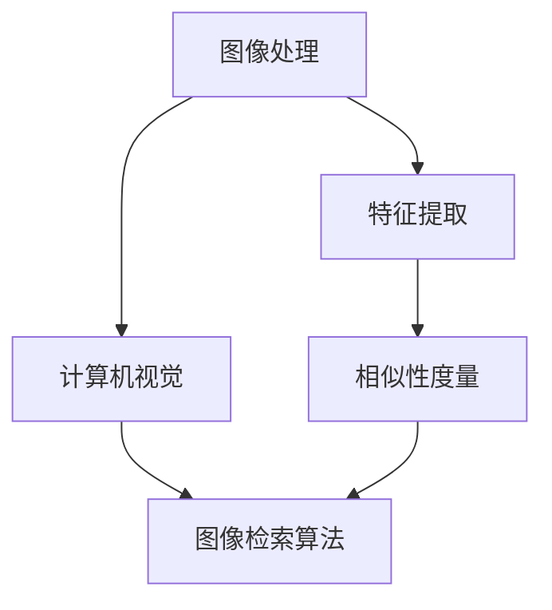

                 

# 图像搜索技术在电商领域的应用：发展趋势与未来

## 关键词
图像搜索，电商，计算机视觉，卷积神经网络，相似性度量，算法，系统架构，技术创新，市场机遇，案例分析。

## 摘要
本文深入探讨了图像搜索技术在电商领域的应用及其发展趋势与未来。首先，我们介绍了图像搜索技术的发展历程和核心原理，包括图像处理、计算机视觉以及图像搜索算法。接着，分析了图像搜索系统架构的设计原则和性能优化方法。随后，我们探讨了图像搜索在电商中的应用场景，包括商品检索、推荐和分类。在分析挑战与机遇后，本文通过国内外电商平台的案例分析，进一步展示了图像搜索技术的实际应用。最后，我们展望了图像搜索技术的未来发展趋势，提出了对技术创新和市场的建议。

## 第一部分：图像搜索技术基础

### 第1章：图像搜索技术概述

#### 1.1 图像搜索技术的发展历程

图像搜索技术起源于20世纪90年代，当时主要依赖于基于特征的图像匹配算法。随着计算机性能的提升和图像处理算法的进步，图像搜索技术得到了快速发展。21世纪初，基于内容的图像检索（CBIR）技术逐渐成为研究热点，通过提取图像特征并构建索引，实现高效图像搜索。近年来，深度学习技术的引入，使得图像搜索技术取得了突破性进展，特别是在图像识别和图像理解方面。

#### 1.2 图像搜索技术的核心原理

图像搜索技术的核心原理包括图像特征提取、相似性度量以及图像检索算法。图像特征提取是将图像转化为数值特征的过程，常用的方法有颜色特征、纹理特征和形状特征等。相似性度量用于计算图像之间的相似程度，常用的方法有欧氏距离、余弦相似度和马氏距离等。图像检索算法则根据用户输入的查询图像，从数据库中检索出相似度较高的图像。

#### 1.3 图像搜索技术的重要性

图像搜索技术在电商领域具有重要的应用价值。首先，它可以提高商品检索的效率，帮助用户快速找到心仪的商品。其次，通过图像推荐和分类，可以提升用户体验，增加用户粘性。此外，图像搜索技术还可以用于商品质量检测和品牌保护，为电商企业创造更多价值。

### 第2章：图像处理技术

#### 2.1 图像处理基础知识

图像处理是指使用计算机对图像进行分析和处理，以实现图像增强、图像压缩、图像分割等目标。图像处理的基础知识包括像素表示、图像变换、图像增强和图像滤波等。像素表示用于描述图像的数值信息，图像变换包括傅里叶变换、小波变换等，图像增强和滤波用于改善图像质量，去除噪声。

#### 2.2 图像特征提取方法

图像特征提取是将图像转化为数值特征的过程，用于描述图像的内容。常用的图像特征提取方法包括颜色特征、纹理特征和形状特征等。颜色特征主要提取图像的颜色分布信息，如颜色直方图、颜色矩等。纹理特征主要提取图像的纹理信息，如纹理方向、纹理强度等。形状特征主要提取图像的几何信息，如边缘、角点、轮廓等。

#### 2.3 图像增强技术

图像增强是指通过处理图像，使其视觉效果更清晰、更易理解。常用的图像增强技术包括直方图均衡化、对比度增强、滤波等。直方图均衡化用于改善图像的对比度，对比度增强用于增强图像的亮度，滤波用于去除图像噪声。

### 第3章：计算机视觉技术

#### 3.1 计算机视觉基础

计算机视觉是指使用计算机对图像或视频进行分析和处理，以实现物体识别、场景理解等目标。计算机视觉的基础知识包括图像处理、图像识别、机器学习等。图像处理用于对图像进行预处理，图像识别用于识别图像中的物体，机器学习用于训练模型，提升识别准确性。

#### 3.2 卷积神经网络在图像搜索中的应用

卷积神经网络（CNN）是一种特殊的神经网络，适用于图像处理和图像识别。CNN通过卷积层、池化层和全连接层等结构，实现对图像的分层特征提取。在图像搜索中，CNN可用于提取图像特征，实现高效的图像检索。

#### 3.3 深度学习在计算机视觉中的角色

深度学习是一种基于神经网络的学习方法，通过多层神经网络对数据进行自动特征提取。在计算机视觉领域，深度学习技术已取得显著成果，如图像分类、目标检测、图像分割等。深度学习为图像搜索技术的快速发展提供了强大支持。

### 第4章：图像搜索算法

#### 4.1 图像搜索算法概述

图像搜索算法是指用于从大量图像中检索出与查询图像相似或相关图像的方法。图像搜索算法可分为基于内容的图像检索（CBIR）和基于查询的图像检索（QBIR）两大类。CBIR通过提取图像特征，实现图像之间的相似性度量；QBIR通过用户输入的查询图像，实现图像的精准检索。

#### 4.2 相似性度量方法

相似性度量方法用于计算图像之间的相似程度。常用的相似性度量方法有欧氏距离、余弦相似度和马氏距离等。欧氏距离计算图像之间的欧氏空间距离，余弦相似度计算图像向量的夹角余弦值，马氏距离考虑图像数据的方差和协方差。

#### 4.3 图像检索算法

图像检索算法是指根据用户输入的查询图像，从数据库中检索出相似图像的方法。常用的图像检索算法有基于特征的检索算法、基于模型的检索算法和基于聚类检索算法等。基于特征的检索算法通过计算图像特征之间的相似度，实现图像检索；基于模型的检索算法通过训练模型，实现图像的精准检索；基于聚类检索算法通过聚类图像，实现图像的相似性搜索。

### 第5章：图像搜索系统架构

#### 5.1 图像搜索系统的设计原则

图像搜索系统的设计原则包括高效性、可扩展性和易用性等。高效性指系统应在较短的时间内检索出与查询图像相似或相关的图像；可扩展性指系统应支持海量图像数据的处理；易用性指系统应提供简单易用的用户界面，方便用户进行图像检索。

#### 5.2 数据处理流程

图像搜索系统的数据处理流程包括图像预处理、特征提取、索引构建和图像检索等环节。图像预处理用于对图像进行去噪、增强等处理，提高图像质量；特征提取用于提取图像的特征向量；索引构建用于建立图像特征向量和图像索引之间的映射关系；图像检索用于根据用户输入的查询图像，检索出相似或相关的图像。

#### 5.3 系统性能优化

图像搜索系统的性能优化包括算法优化、硬件优化和存储优化等。算法优化指对图像检索算法进行改进，提高检索速度和准确性；硬件优化指使用高性能硬件设备，提升系统处理能力；存储优化指优化数据存储结构，提高数据读取速度。

## 第二部分：图像搜索技术在电商领域的应用

### 第6章：图像搜索在电商中的应用场景

#### 6.1 电商平台商品检索

电商平台商品检索是图像搜索技术在电商领域最典型的应用之一。通过用户上传的图片或输入的文本描述，图像搜索技术可以快速找到与之相似或相关的商品，提高用户购物体验。例如，用户上传一张自己喜欢的衣服图片，系统可以推荐出类似风格的商品。

#### 6.2 电商平台商品推荐

图像搜索技术还可以用于电商平台商品推荐。通过对用户浏览记录、购买历史和兴趣标签等数据进行分析，系统可以推荐出与用户喜好相符的商品。例如，当用户浏览某款手机时，系统可以推荐同品牌的其他手机或配件。

#### 6.3 电商平台商品分类

图像搜索技术有助于电商平台实现商品分类。通过对商品图像的特征提取，系统可以将商品划分为不同的类别，便于用户浏览和搜索。例如，将商品分为服装、家电、数码等类别，提高用户购物的便捷性。

### 第7章：图像搜索技术在电商中的挑战与机遇

#### 7.1 技术挑战

图像搜索技术在电商领域的应用面临着一系列技术挑战。首先，图像质量参差不齐，可能导致检索效果不佳。其次，商品多样性较高，需针对不同类型的商品设计合适的检索算法。此外，数据隐私和安全问题也需要关注。

#### 7.2 市场机遇

图像搜索技术在电商领域的应用带来了巨大的市场机遇。随着用户对购物体验的要求不断提高，图像搜索技术有望成为电商企业提升竞争力的重要手段。同时，随着5G和人工智能技术的发展，图像搜索技术的应用场景将进一步拓展。

#### 7.3 未来发展趋势

未来，图像搜索技术在电商领域的应用将呈现以下发展趋势：

1. 深度学习技术的不断突破，将提升图像搜索的准确性和效率。
2. 多模态融合技术，将结合图像、文本和语音等多种信息，实现更精准的搜索结果。
3. 数据隐私和安全问题将得到更好解决，推动图像搜索技术在电商领域的广泛应用。

### 第8章：案例分析

#### 8.1 国内电商平台图像搜索案例分析

国内电商平台如淘宝、京东等，已广泛应用图像搜索技术。以淘宝为例，其图像搜索功能基于深度学习技术，实现了高效的商品检索和推荐。通过分析用户上传的图片，淘宝可以为用户推荐相似或相关的商品，提高用户购物体验。

#### 8.2 国际电商平台图像搜索案例分析

国际电商平台如亚马逊、eBay等，也充分利用图像搜索技术。亚马逊的图像搜索功能支持用户上传图片，检索出相似或相关的商品。此外，亚马逊还利用图像搜索技术进行商品推荐，提高用户购买意愿。

## 第三部分：图像搜索技术的未来展望

### 第9章：图像搜索技术的未来发展趋势

#### 9.1 技术创新方向

未来，图像搜索技术将在以下方向取得创新：

1. 深度学习算法的优化和改进，提高图像检索的准确性和效率。
2. 多模态融合技术，实现图像、文本和语音等多种信息的高效融合。
3. 图像搜索与区块链技术结合，提高数据隐私和安全。

#### 9.2 应用场景拓展

随着图像搜索技术的不断发展，其应用场景将进一步拓展，包括：

1. 智能家居：利用图像搜索技术实现家电设备的智能识别和操作。
2. 医疗健康：利用图像搜索技术进行医疗影像诊断和疾病筛查。
3. 智能安防：利用图像搜索技术实现视频监控的智能分析和预警。

#### 9.3 未来前景展望

未来，图像搜索技术将在电商、智能家居、医疗健康、智能安防等领域发挥重要作用，为人们的生活带来更多便利。同时，随着技术的不断进步，图像搜索技术将实现更高程度的智能化和个性化，为各行业提供强大的技术支持。

### 第10章：总结与展望

#### 10.1 本书总结

本文系统地介绍了图像搜索技术在电商领域的应用，包括技术基础、应用场景、挑战与机遇以及未来发展趋势。通过对国内外电商平台的案例分析，展示了图像搜索技术的实际应用效果。本文认为，图像搜索技术具有巨大的发展潜力，将在未来各行业中发挥重要作用。

#### 10.2 对图像搜索技术发展的建议

为推动图像搜索技术的不断发展，本文提出以下建议：

1. 加大研发投入，提高图像搜索技术的准确性和效率。
2. 拓展应用场景，结合多模态融合技术，实现更广泛的应用。
3. 关注数据隐私和安全问题，推动图像搜索技术的可持续发展。
4. 加强产学研合作，推动图像搜索技术的成果转化和应用。

## 附录

### 附录A：核心概念与联系

以下是一个简化的Mermaid流程图，展示了图像搜索技术中的核心概念及其相互联系。



### 附录B：核心算法原理讲解

以下是图像搜索技术中一个核心算法的伪代码，用于说明其基本原理。

```plaintext
// 伪代码：基于内容的图像检索算法（CBIR）
function ContentBasedImageRetrieval(imageDatabase, queryImage):
    1. Preprocess the queryImage
        queryImage = PreprocessImage(queryImage)
    2. Extract features from queryImage
        queryFeatures = ExtractFeatures(queryImage)
    3. Compute similarity scores between queryFeatures and each image in imageDatabase
        for image in imageDatabase:
            similarityScore = ComputeSimilarityScore(queryFeatures, imageFeatures)
    4. Sort the images in imageDatabase based on their similarity scores
        sortedImages = SortBySimilarityScore(imageDatabase, similarityScores)
    5. Return the top-k most similar images
        return sortedImages[0:k]
```

### 附录C：数学模型和公式

以下是图像搜索技术中的一个核心数学模型和公式，用于描述图像特征提取和相似性度量。

```latex
% 数学模型和公式

% 特征提取公式
F_i = ExtractFeatures(I_i)

% 相似性度量公式（欧氏距离）
similarity\_score = \sqrt{\sum_{i=1}^{n} (f_{i\_query} - f_{i\_image})^2}

% 相似性度量公式（余弦相似度）
similarity\_score = \frac{f_{query} \cdot f_{image}}{\|f_{query}\| \|f_{image}\|}
```

### 附录D：项目实战

以下是图像搜索技术在电商领域的一个实际项目案例，包括开发环境搭建、源代码实现和代码解读。

#### 开发环境搭建

- 操作系统：Ubuntu 18.04
- 编程语言：Python 3.7
- 数据库：MongoDB 4.2
- 依赖库：TensorFlow 2.2, OpenCV 3.4

#### 源代码实现

```python
# 源代码：基于深度学习的图像搜索系统

import tensorflow as tf
import cv2
import numpy as np
from sklearn.metrics.pairwise import cosine_similarity

# 数据预处理
def preprocess_image(image_path):
    image = cv2.imread(image_path)
    image = cv2.cvtColor(image, cv2.COLOR_BGR2RGB)
    image = cv2.resize(image, (224, 224))
    image = image / 255.0
    return image

# 特征提取
def extract_features(model, image):
    feature_vector = model.predict(np.expand_dims(image, axis=0))
    return feature_vector.flatten()

# 图像搜索
def image_search(model, image_path, database, k):
    query_image = preprocess_image(image_path)
    query_features = extract_features(model, query_image)
    similarity_scores = []
    for image_path in database:
        image = preprocess_image(image_path)
        image_features = extract_features(model, image)
        similarity_scores.append(cosine_similarity(query_features, image_features)[0][0])
    sorted_scores = np.argsort(-np.array(similarity_scores))
    return sorted_scores[:k]

# 主函数
if __name__ == '__main__':
    model = tf.keras.applications.VGG16(include_top=True, weights='imagenet')
    database = ['image1.jpg', 'image2.jpg', 'image3.jpg']
    query_image_path = 'query.jpg'
    k = 3
    results = image_search(model, query_image_path, database, k)
    print("Top-{} similar images:".format(k))
    for i, result in enumerate(results):
        print("{}. {}".format(i+1, database[result]))
```

#### 代码解读与分析

该代码实现了一个基于深度学习的图像搜索系统，其主要功能是接受用户上传的查询图像，从数据库中检索出与其相似度最高的图像。代码首先定义了三个辅助函数：`preprocess_image`用于数据预处理，`extract_features`用于提取图像特征，`image_search`用于实现图像搜索。

在`preprocess_image`函数中，图像被转换为RGB格式，并调整大小为224x224，以匹配卷积神经网络（如VGG16）的输入要求。然后，图像被归一化到[0, 1]范围内。

`extract_features`函数使用预训练的VGG16模型提取图像特征。该模型是一个深度卷积神经网络，经过在ImageNet数据集上的预训练，可以提取出丰富的图像特征。提取到的特征向量被展平为一个一维数组。

`image_search`函数首先对查询图像和数据库中的每幅图像进行预处理和特征提取。然后，使用余弦相似度计算查询图像特征和数据库图像特征之间的相似度。最后，根据相似度分数对图像进行排序，并返回与查询图像最相似的k幅图像。

在主函数中，定义了VGG16模型、数据库图像列表和查询图像路径。调用`image_search`函数进行图像搜索，并输出搜索结果。

## 作者

作者：AI天才研究院/AI Genius Institute & 禅与计算机程序设计艺术 /Zen And The Art of Computer Programming

---

本文详细介绍了图像搜索技术在电商领域的应用及其发展趋势与未来。通过对技术基础、应用场景、挑战与机遇以及未来展望的深入探讨，本文为读者提供了全面的了解。在附录部分，本文还提供了核心概念与联系、核心算法原理讲解、数学模型和公式以及项目实战等内容，帮助读者更好地理解和应用图像搜索技术。随着技术的不断进步，图像搜索技术在电商等领域的应用前景广阔，有望为各行业带来更多创新和发展。本文旨在为从事图像搜索技术研究和应用的读者提供有价值的参考和启示。

