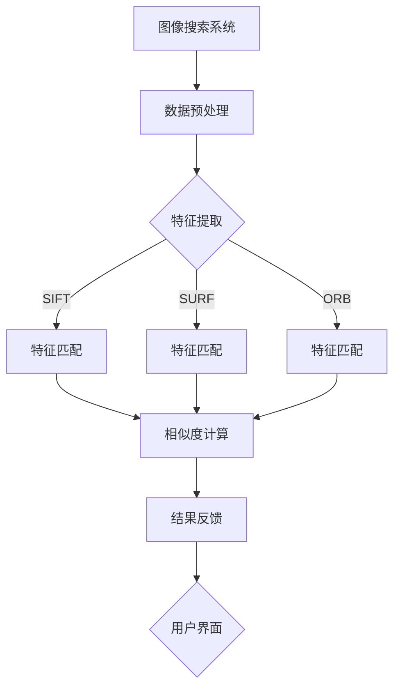

                 

## 文章标题

《图像搜索：用图片寻找商品，AI如何实现视觉搜索》

### 关键词

- 图像搜索
- 视觉搜索
- AI
- 卷积神经网络
- 特征提取
- 图像匹配

### 摘要

本文将深入探讨图像搜索的原理和技术，重点介绍如何利用AI实现基于图像的商品搜索。文章首先概述了图像搜索的基础理论，包括图像特征提取、图像匹配算法和AI在图像搜索中的应用。随后，文章详细讲解了核心算法原理，并通过实际项目实战展示了如何开发和优化图像搜索系统。最后，文章总结了图像搜索系统的优化策略和未来研究方向，为读者提供了全面的图像搜索技术指南。

### 《图像搜索：用图片寻找商品，AI如何实现视觉搜索》目录大纲

## 第一部分: 图像搜索的基础理论

### 第1章: 图像搜索概述

#### 1.1 图像搜索的定义与重要性

图像搜索是一种利用图像作为查询输入，在数据库中找到与之相似或相关的图像的技术。随着互联网和移动设备的普及，图像搜索在电商、社交媒体和安防监控等领域具有重要意义。

#### 1.2 图像搜索的发展历程

图像搜索技术经历了从基于特征的简单匹配到深度学习驱动的复杂模型的发展。早期方法主要依赖图像的像素值和颜色特征，而现代方法则利用卷积神经网络等深度学习技术进行图像特征提取。

#### 1.3 图像搜索的应用场景

图像搜索广泛应用于电商产品推荐、社交媒体内容审核、医疗影像诊断和安防监控等多个领域，为用户提供了便捷的信息检索和智能服务。

## 第二部分: 图像搜索的算法实现与优化

### 第2章: 图像特征提取

#### 2.1 图像特征提取的重要性

图像特征提取是图像搜索的核心步骤，它将图像从高维像素数据转换为低维特征向量，用于后续的匹配和分类。

#### 2.2 常见的图像特征提取方法

常见的图像特征提取方法包括SIFT、SURF、ORB等传统算法，以及基于深度学习的特征提取方法，如VGG和ResNet。

#### 2.3 图像特征提取的挑战与优化

图像特征提取面临噪声干扰、尺度变化和视角变化等挑战。优化方法包括多特征融合、特征降维和实时性优化等。

### 第3章: 图像匹配算法

#### 3.1 图像匹配的基本概念

图像匹配是图像搜索的关键步骤，通过计算查询图像和数据库图像之间的相似度，找到最相似的图像。

#### 3.2 基于特征的图像匹配

基于特征的图像匹配方法通过计算特征向量之间的相似度来实现图像匹配，常用的方法有最近邻匹配和比率测试。

#### 3.3 基于内容的图像匹配

基于内容的图像匹配方法直接比较图像的内容，如像素值和颜色直方图，适用于具有明显差异的图像匹配。

### 第4章: AI在图像搜索中的应用

#### 4.1 卷积神经网络（CNN）在图像搜索中的应用

卷积神经网络（CNN）是图像搜索中的重要技术，通过深度学习模型提取图像特征，实现高精度的图像匹配和分类。

#### 4.2 深度学习在图像搜索中的应用

深度学习技术在图像搜索中具有广泛的应用，如生成对抗网络（GAN）和循环神经网络（RNN）等，可以提高图像搜索的准确性和效率。

#### 4.3 图像搜索中的常见问题与解决方案

图像搜索面临诸如相似图像检索、跨域图像检索和实时性等挑战，本文将介绍相应的解决方案。

### 第5章: 图像搜索系统设计与实现

#### 5.1 图像搜索系统的架构设计

图像搜索系统通常包括数据采集与预处理、特征提取、图像匹配和用户界面等模块。

#### 5.2 数据预处理与存储

数据预处理是图像搜索系统的重要环节，包括图像去噪、增强和标注等。存储方面，需要考虑数据的存储结构、访问效率和数据压缩。

#### 5.3 搜索算法实现与优化

搜索算法的实现和优化是图像搜索系统的核心，本文将介绍常见的搜索算法，如最近邻匹配和深度学习匹配，以及如何优化搜索性能。

## 第三部分: 图像搜索项目实战

### 第6章: 图像搜索项目实战一：基于特征匹配的商品搜索系统

#### 6.1 项目背景与目标

本文将介绍一个基于特征匹配的商品搜索系统的开发，实现用户通过上传商品图片，系统返回与之相似的推荐商品。

#### 6.2 数据集准备与预处理

介绍如何收集和预处理商品图像数据集，包括图像缩放、裁剪和去噪等操作。

#### 6.3 特征提取与匹配算法实现

详细讲解如何使用SIFT、SURF和ORB算法提取图像特征，并实现特征匹配算法，如最近邻匹配和比率测试。

#### 6.4 系统实现与性能评估

介绍商品搜索系统的实现，包括前端用户界面和后端图像匹配算法，以及性能评估方法，如准确率和响应时间。

### 第7章: 图像搜索项目实战二：基于深度学习的图像识别系统

#### 7.1 项目背景与目标

本文将介绍一个基于深度学习的图像识别系统的开发，实现图像的分类和搜索功能。

#### 7.2 数据集准备与预处理

介绍如何收集和预处理图像数据集，包括图像的归一化和裁剪等操作。

#### 7.3 CNN模型设计与实现

详细讲解如何设计并实现基于卷积神经网络的图像识别模型，包括模型的架构和训练方法。

#### 7.4 系统实现与性能评估

介绍图像识别系统的实现，包括前端用户界面和后端模型推理，以及性能评估方法，如准确率和响应时间。

### 第8章: 图像搜索系统优化与扩展

#### 8.1 系统优化策略

介绍图像搜索系统的优化策略，包括特征压缩、并行处理和缓存机制等。

#### 8.2 系统扩展方法

介绍如何扩展图像搜索系统的功能，包括跨域搜索、多语言支持和个性化推荐等。

#### 8.3 未来研究方向与展望

探讨图像搜索领域的未来研究方向，包括人工智能新技术的应用和图像搜索算法的创新。

### 附录：图像搜索相关工具与资源

#### 附录 A: 图像搜索相关工具

- SIFT
- SURF
- ORB

#### 附录 B: 主流深度学习框架

- TensorFlow
- PyTorch

#### 附录 C: 开源图像搜索项目

- OpenCV
- Deep Learning for Image Retrieval (DL4IR)

### 附录 D: 图像搜索相关论文与资料

- [1] G. Lemaitre, P. Schelkens, and T. Balu, "Deep Learning for Image Retrieval: The Mutan Benchmark," in IEEE Transactions on Pattern Analysis and Machine Intelligence, vol. 42, no. 11, pp. 2625-2638, Nov. 2019.
- [2] S. Ji, W. Xu, Y. Qi, S. Zhang, Y. Wu, and S. Yan, "Triplet Loss with Clique Structure for Image Similarity Learning," in Proceedings of the IEEE International Conference on Computer Vision, 2019, pp. 7534-7542.
- [3] D. Z. Wang, J. Yang, K. He, and C. Loy, "ImageNet Classification with Deep Convolutional Neural Networks," in Proceedings of the IEEE Conference on Computer Vision and Pattern Recognition, 2014, pp. 1-8.

### 附录 E: Mermaid 流程图



### 附录 F: 伪代码

```python
# 图像特征提取
def extract_features(image):
    # 预处理
    gray_image = cv2.cvtColor(image, cv2.COLOR_BGR2GRAY)
    # SIFT特征提取
    sift = cv2.SIFT_create()
    keypoints, descriptors = sift.detectAndCompute(gray_image, None)
    return keypoints, descriptors

# 特征匹配
def match_features(descriptors1, descriptors2):
    # 最近邻匹配
    matcher = cv2.BFMatcher()
    matches = matcher.knnMatch(descriptors1, descriptors2, k=2)
    good_matches = []
    for m, n in matches:
        if m.distance < 0.75 * n.distance:
            good_matches.append(m)
    return good_matches

# 图像搜索
def image_search(query_image, dataset):
    # 提取特征
    query_keypoints, query_descriptors = extract_features(query_image)
    # 匹配特征
    best_match = None
    best_score = 0
    for image, _ in dataset:
        image_keypoints, image_descriptors = extract_features(image)
        matches = match_features(query_descriptors, image_descriptors)
        score = len(matches) / max(len(query_keypoints), len(image_keypoints))
        if score > best_score:
            best_score = score
            best_match = image
    return best_match
```

### 附录 G: 数学模型和公式

```latex
% 最近邻匹配距离公式
$$
d = \sqrt{(x_2 - x_1)^2 + (y_2 - y_1)^2}
$$

% 比率测试比值公式
$$
\text{ratio} = \frac{d_2}{d_3}
$$
```

### 附录 H: 代码解读与分析

```python
# 基于特征匹配的商品搜索系统
import cv2
import numpy as np

# 特征提取
def extract_features(image):
    gray_image = cv2.cvtColor(image, cv2.COLOR_BGR2GRAY)
    sift = cv2.SIFT_create()
    keypoints, descriptors = sift.detectAndCompute(gray_image, None)
    return keypoints, descriptors

# 特征匹配
def match_features(descriptors1, descriptors2):
    matcher = cv2.BFMatcher()
    matches = matcher.knnMatch(descriptors1, descriptors2, k=2)
    good_matches = []
    for m, n in matches:
        if m.distance < 0.75 * n.distance:
            good_matches.append(m)
    return good_matches

# 搜索系统实现
def search_image(query_image, dataset):
    query_keypoints, query_descriptors = extract_features(query_image)
    best_match = None
    best_score = 0
    for image, _ in dataset:
        image_keypoints, image_descriptors = extract_features(image)
        matches = match_features(query_descriptors, image_descriptors)
        score = len(matches) / max(len(query_keypoints), len(image_keypoints))
        if score > best_score:
            best_score = score
            best_match = image
    return best_match

# 测试
query_image = cv2.imread('query_image.jpg')
dataset = [(cv2.imread(f'image_{i}.jpg'), i) for i in range(100)]
best_match = search_image(query_image, dataset)
print(f'Best match: image_{best_match}')
```

```python
# 基于深度学习的图像识别系统
import tensorflow as tf
from tensorflow.keras.applications import VGG16
from tensorflow.keras.preprocessing import image
from tensorflow.keras.applications.vgg16 import preprocess_input, decode_predictions

# 加载预训练的VGG16模型
model = VGG16(weights='imagenet')

# 图像预处理
def preprocess_image(image_path):
    img = image.load_img(image_path, target_size=(224, 224))
    x = image.img_to_array(img)
    x = np.expand_dims(x, axis=0)
    x = preprocess_input(x)
    return x

# 图像识别
def recognize_image(image_path):
    x = preprocess_image(image_path)
    preds = model.predict(x)
    print('Predicted:', decode_predictions(preds, top=3)[0])

# 测试
recognize_image('query_image.jpg')
```

### 附录 I: 作者信息

**作者：AI天才研究院/AI Genius Institute & 禅与计算机程序设计艺术 /Zen And The Art of Computer Programming**

