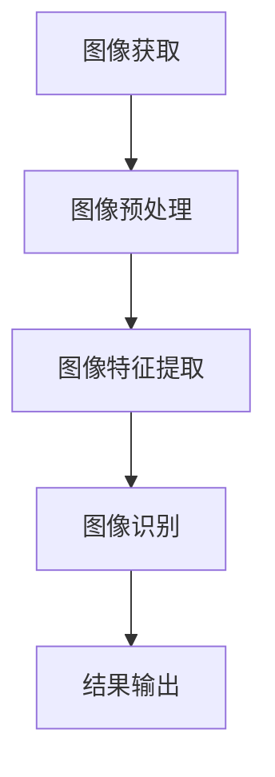
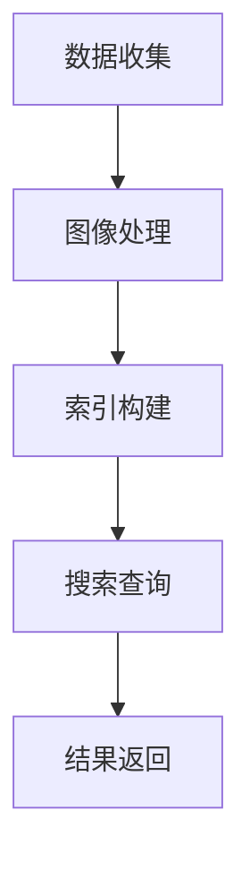

                 

### 文章标题：图像搜索：用图片寻找商品，AI让购物更便捷

关键词：图像搜索、商品识别、人工智能、购物体验、图像识别技术

摘要：随着人工智能技术的不断进步，图像搜索已经成为现代电子商务领域的一项关键技术。本文将详细探讨图像搜索的基本概念、技术原理、系统设计、应用实践以及未来展望。通过一步一步的分析和推理，我们将深入理解图像搜索如何通过AI技术为购物带来更便捷的体验，并展望其未来发展。

----------------------------------------------------------------

### 目录大纲 - 《图像搜索：用图片寻找商品，AI让购物更便捷》

#### 第一部分：图像搜索的基本概念
- **第1章：图像搜索的背景和重要性**
  - 1.1 图像搜索的起源与发展
  - 1.2 图像搜索的关键挑战
  - 1.3 图像搜索的现状与趋势

#### 第二部分：图像搜索技术
- **第2章：图像识别与处理的原理**
  - 2.1 图像处理技术基础
  - 2.2 图像识别算法介绍
  - 2.3 机器学习和深度学习在图像识别中的应用

#### 第三部分：图像搜索系统设计
- **第3章：图像搜索系统的架构**
  - 3.1 系统架构设计原则
  - 3.2 数据流与处理流程
  - 3.3 系统性能优化策略

#### 第四部分：图像搜索应用实践
- **第4章：商品识别与搜索**
  - 4.1 商品图像识别技术
  - 4.2 商品搜索系统实现
  - 4.3 实际案例与应用

#### 第五部分：AI在购物领域的应用
- **第5章：AI技术在购物推荐中的应用**
  - 5.1 购物推荐系统的设计
  - 5.2 用户行为分析
  - 5.3 AI驱动的购物体验提升

#### 第六部分：图像搜索的未来展望
- **第6章：图像搜索的发展趋势**
  - 6.1 新兴技术在图像搜索中的应用
  - 6.2 图像搜索的未来挑战与机遇
  - 6.3 开放性问题与研究方向

#### 第七部分：附录
- **第7章：技术工具与资源**
  - 7.1 图像识别与搜索的主要工具
  - 7.2 开源资源和参考文献
  - 7.3 深入学习与图像处理的学习路径

----------------------------------------------------------------

#### 第一部分：图像搜索的基本概念

### 第1章：图像搜索的背景和重要性

#### 1.1 图像搜索的起源与发展

图像搜索并非一个新兴概念。实际上，它起源于20世纪90年代，随着互联网的兴起和图像处理技术的进步，人们开始探索如何利用计算机技术来搜索和识别图像。早期的图像搜索主要依赖于手动标注和特征提取技术，如SIFT（尺度不变特征变换）和SURF（加速稳健特征）。

进入21世纪，随着机器学习和深度学习的发展，图像搜索技术得到了显著的提升。卷积神经网络（CNN）的出现，使得图像识别和搜索的准确率得到了质的飞跃。深度学习模型的引入，使得图像搜索不再局限于简单的特征匹配，而是能够理解和分析图像中的复杂内容。

#### 1.2 图像搜索的关键挑战

图像搜索面临的挑战主要包括：

1. **数据多样性**：图像搜索需要处理海量的图像数据，这些数据来自不同的来源，具有不同的质量和标注方式。
2. **相似性度量**：如何准确测量和比较图像之间的相似性，是一个核心问题。传统的相似性度量方法在处理复杂的图像时往往效果不佳。
3. **实时性能**：随着用户需求的增加，图像搜索系统需要在极短的时间内提供准确的搜索结果，这对系统的性能提出了极高的要求。

#### 1.3 图像搜索的现状与趋势

目前，图像搜索技术已经广泛应用于电子商务、社交媒体、安防监控等多个领域。随着AI技术的不断进步，图像搜索的性能和效率也在不断提升。

未来的发展趋势包括：

1. **多模态融合**：结合图像、文本、音频等多种数据类型，实现更智能的搜索和识别。
2. **个性化推荐**：基于用户行为和偏好，提供个性化的搜索结果和购物推荐。
3. **边缘计算**：将图像搜索的任务迁移到边缘设备，减少云端处理压力，提高系统的响应速度。

#### 结论

图像搜索技术作为AI技术在购物领域的重要应用之一，正逐渐改变着人们的购物方式。通过不断地技术革新和优化，图像搜索将为用户提供更便捷、更智能的购物体验。未来，随着AI技术的进一步发展，图像搜索将在更多的领域发挥重要作用，推动社会的进步和发展。

----------------------------------------------------------------

#### 第二部分：图像搜索技术

### 第2章：图像识别与处理的原理

#### 2.1 图像处理技术基础

图像处理是图像搜索的基础，它涉及对图像的获取、存储、预处理和特征提取等多个环节。以下是图像处理技术的一些基础概念：

##### 2.1.1 图像获取与存储

图像获取可以通过摄像头、扫描仪、传感器等多种设备实现。在存储方面，常见的格式包括JPEG、PNG和TIFF等。JPEG格式适合存储压缩图像，而PNG格式则适合存储无损图像。

##### 2.1.2 基本图像处理操作

基本图像处理操作包括滤波、边缘检测、形态学操作等。

- **滤波**：用于去除图像中的噪声，常用的滤波器包括均值滤波、高斯滤波和中值滤波等。
- **边缘检测**：用于识别图像中的边缘，常用的算法包括Canny边缘检测、Sobel边缘检测和Prewitt边缘检测等。
- **形态学操作**：包括膨胀、腐蚀、开运算和闭运算等，用于改变图像的形态。

##### 2.1.3 图像特征提取

图像特征提取是图像识别的重要步骤，它将图像中的视觉信息转换为计算机可以处理的数据。常用的特征提取方法包括：

- **颜色特征**：如颜色直方图、颜色矩等。
- **纹理特征**：如纹理能量、纹理方向等。
- **形状特征**：如轮廓特征、形状矩等。

##### Mermaid流程图：图像处理流程概览



#### 2.2 图像识别算法介绍

图像识别算法可以分为传统算法和深度学习算法两大类。

##### 2.2.1 传统图像识别算法

传统图像识别算法主要包括基于特征的算法和基于模板匹配的算法。

- **基于特征的算法**：如SIFT（尺度不变特征变换）和SURF（加速稳健特征），这些算法通过提取图像的特征点来进行识别。
- **基于模板匹配的算法**：如模板匹配算法，它通过比较待识别图像与模板图像的相似度来进行识别。

##### 2.2.2 深度学习图像识别算法

深度学习图像识别算法，特别是卷积神经网络（CNN），已经成为图像识别的主流方法。CNN通过多层卷积和池化操作，能够自动学习图像中的特征，从而实现高精度的识别。

- **卷积神经网络（CNN）**：CNN由多个卷积层、池化层和全连接层组成。卷积层用于提取图像特征，池化层用于减小特征图的尺寸，全连接层用于分类。
- **卷积操作**：卷积操作通过在特征图上滑动滤波器，提取局部特征。
- **激活函数**：常用的激活函数包括ReLU（Rectified Linear Unit）和Sigmoid等。
- **反向传播算法**：用于训练CNN，通过不断调整网络权重，最小化损失函数。

##### 伪代码：卷积神经网络（CNN）的基本结构

```python
function ConvLayer(input_data, filters, kernel_size):
    # 前向传播过程
    conv_output = convolution(input_data, filters, kernel_size)
    activation = activation_function(conv_output)
    return activation

function PoolingLayer(input_data, pool_size):
    # 前向传播过程
    pooled_output = max_pooling(input_data, pool_size)
    return pooled_output
```

#### 2.3 机器学习和深度学习在图像识别中的应用

机器学习和深度学习在图像识别中的应用极大地提升了识别的准确性和效率。以下是这些技术在图像识别中的应用：

##### 2.3.1 数学模型和数学公式

在深度学习中，常用的数学模型包括损失函数和优化算法。

- **损失函数**：用于衡量模型预测值与真实值之间的差异。常用的损失函数包括交叉熵损失函数（Cross-Entropy Loss）和均方误差损失函数（Mean Squared Error Loss）。
  $$ L(\theta) = -\frac{1}{m} \sum_{i=1}^{m} \left[ y^{(i)} \log(a^{(L)}(z^{(L)}_{i})) + (1 - y^{(i)}) \log(1 - a^{(L)}(z^{(L)}_{i})) \right] $$
- **优化算法**：用于调整模型权重，以最小化损失函数。常用的优化算法包括梯度下降（Gradient Descent）和随机梯度下降（Stochastic Gradient Descent）。

##### 2.3.2 详细讲解和举例说明

卷积神经网络（CNN）的训练过程可以简要描述如下：

1. **前向传播**：输入图像通过卷积层、池化层和全连接层的传递，最终输出分类结果。
2. **计算损失**：比较输出结果与真实标签，计算损失值。
3. **反向传播**：通过反向传播算法，计算每个权重和偏置的梯度，并更新模型参数。
4. **迭代优化**：重复前向传播和反向传播过程，不断调整模型参数，直到达到预定的损失值。

举例说明，假设我们使用CNN对猫和狗的图片进行分类，具体步骤如下：

1. **初始化模型参数**：随机初始化权重和偏置。
2. **前向传播**：输入一张猫的图片，通过卷积层提取特征，然后通过全连接层输出分类结果（猫或狗）。
3. **计算损失**：由于输出结果是狗，而实际标签是猫，所以损失函数会计算输出结果与真实标签之间的交叉熵损失。
4. **反向传播**：通过反向传播算法，计算每个权重和偏置的梯度。
5. **参数更新**：使用优化算法（如梯度下降）更新模型参数。
6. **迭代优化**：重复前向传播和反向传播过程，直到模型达到预定的准确率。

通过这样的训练过程，CNN能够逐渐学会识别图像中的猫和狗，从而实现图像分类。

#### 结论

图像识别与处理技术是图像搜索的核心组成部分。从传统的图像处理方法到现代的深度学习算法，图像搜索技术已经取得了显著的进步。通过对图像处理技术基础、图像识别算法以及机器学习和深度学习在图像识别中的应用的详细分析，我们能够更好地理解图像搜索的工作原理和实现方式。随着技术的不断发展，图像搜索将继续在购物、安防、医疗等多个领域发挥重要作用。

----------------------------------------------------------------

#### 第三部分：图像搜索系统设计

### 第3章：图像搜索系统的架构

#### 3.1 系统架构设计原则

设计一个高效的图像搜索系统需要遵循一系列关键原则，以确保系统能够处理大量图像数据并快速返回准确的搜索结果。以下是几个核心设计原则：

##### 3.1.1 高可用性

图像搜索系统需要具备高可用性，确保在面临高并发请求时，系统能够稳定运行，不出现崩溃或性能下降。为此，系统设计应考虑冗余部署、负载均衡和故障转移等机制。

##### 3.1.2 可扩展性

系统设计应具备良好的可扩展性，能够随着数据量和用户量的增长而灵活扩展。这通常涉及到分布式架构和微服务设计，以便在需要时增加新的节点或服务。

##### 3.1.3 高性能

系统设计应关注高性能，特别是在图像处理和检索速度上。采用高效的算法和数据结构，如B树索引和倒排索引，能够显著提高系统的检索速度。

##### 3.1.4 可维护性

系统设计应考虑到未来的维护和升级，代码应具有良好的模块化和可读性，以便开发人员能够快速定位和修复问题。

#### 3.2 数据流与处理流程

一个典型的图像搜索系统包含数据收集、图像处理、索引构建、搜索查询和结果返回等关键环节。以下是这些环节的数据流和处理流程：

##### 3.2.1 数据收集

数据收集是图像搜索系统的起点。系统需要从各种来源（如用户上传、第三方API或数据库）收集图像数据。数据收集后，需要进行初步处理，包括去重、格式转换和元数据提取等。

##### 3.2.2 图像处理

收集到的图像数据进入图像处理环节。处理步骤通常包括图像增强、去噪、裁剪和缩放等。这些处理步骤旨在提高图像质量，使其更适合后续的识别和搜索。

##### 3.2.3 索引构建

经过处理的图像数据被转换为索引结构，如倒排索引或B树索引。索引构建是图像搜索系统的核心，它使得搜索过程可以快速定位到包含特定特征的图像。

##### 3.2.4 搜索查询

用户提交搜索查询后，系统会解析查询并执行相应的图像检索操作。检索过程通常涉及特征提取、相似性计算和结果排序等步骤。

##### 3.2.5 结果返回

检索结果会被格式化并返回给用户。系统可以提供多种结果格式，如图像列表、详细信息或推荐结果。

##### Mermaid流程图：图像搜索系统数据流和处理流程



#### 3.3 系统性能优化策略

为了确保图像搜索系统的高性能，以下是一些关键的优化策略：

##### 3.3.1 缓存机制

利用缓存机制可以显著提高系统的响应速度。系统可以在内存中缓存常用图像和检索结果，减少对后端存储的访问。

##### 3.3.2 并发处理

系统应支持并发处理，允许同时处理多个查询请求。这可以通过多线程或异步处理来实现。

##### 3.3.3 数据压缩

通过数据压缩技术，可以减少存储空间和传输带宽的需求。常用的压缩算法包括JPEG和PNG等。

##### 3.3.4 索引优化

优化索引结构可以显著提高检索效率。例如，使用倒排索引可以快速定位包含特定关键词的图像。

##### 3.3.5 模块化设计

将系统划分为多个模块，每个模块负责特定的功能，如图像处理、索引构建和搜索查询。这种设计便于维护和扩展。

##### 结论

图像搜索系统的设计原则、数据流和处理流程以及性能优化策略共同构成了一个高效、稳定且可扩展的图像搜索系统。通过遵循这些原则和策略，开发人员可以设计和实现出满足用户需求的图像搜索系统。

----------------------------------------------------------------

#### 第四部分：图像搜索应用实践

### 第4章：商品识别与搜索

#### 4.1 商品图像识别技术

商品图像识别技术是图像搜索应用中的一个重要领域，它通过识别和分类商品图像，帮助用户快速找到所需商品。以下是商品图像识别技术的核心组成部分：

##### 4.1.1 特征提取

特征提取是商品图像识别的关键步骤，它将图像中的视觉信息转换为计算机可以处理的数据。常用的特征提取方法包括：

- **颜色特征**：通过颜色直方图、颜色矩等颜色特征来描述图像的颜色分布。
- **纹理特征**：通过纹理能量、纹理方向等纹理特征来描述图像的纹理信息。
- **形状特征**：通过轮廓特征、形状矩等形状特征来描述图像的形状信息。

##### 4.1.2 机器学习算法

机器学习算法是商品图像识别的核心，通过训练模型，使系统能够自动识别和分类商品图像。常用的机器学习算法包括：

- **支持向量机（SVM）**：通过寻找最佳超平面来分类图像。
- **随机森林**：通过构建多个决策树来分类图像，并通过投票机制得出最终结果。
- **卷积神经网络（CNN）**：通过多层卷积和池化操作，自动学习图像特征，实现高精度的分类。

##### 4.1.3 深度学习模型

深度学习模型，特别是卷积神经网络（CNN），在商品图像识别中表现出了卓越的性能。以下是深度学习模型在商品图像识别中的应用：

- **卷积层**：通过卷积操作提取图像的局部特征。
- **池化层**：通过池化操作减少特征图的尺寸，提高模型的泛化能力。
- **全连接层**：通过全连接层将高维特征映射到分类标签。

##### 伪代码：卷积神经网络（CNN）在商品图像识别中的应用

```python
function ConvLayer(input_data, filters, kernel_size):
    # 前向传播过程
    conv_output = convolution(input_data, filters, kernel_size)
    activation = activation_function(conv_output)
    return activation

function PoolingLayer(input_data, pool_size):
    # 前向传播过程
    pooled_output = max_pooling(input_data, pool_size)
    return pooled_output

function FullyConnectedLayer(input_data, num_classes):
    # 前向传播过程
    flattened_output = flatten(input_data)
    output = fully_connected(flattened_output, num_classes)
    activation = activation_function(output)
    return activation
```

#### 4.2 商品搜索系统实现

商品搜索系统实现包括前端用户界面、后端服务逻辑和数据存储等关键部分。以下是商品搜索系统的实现步骤：

##### 4.2.1 前端用户界面

前端用户界面负责展示搜索框、搜索结果和商品详细信息。以下是前端实现的关键步骤：

- **搜索框**：提供一个输入框，用户可以输入关键词或上传图像。
- **搜索按钮**：用户点击搜索按钮后，触发搜索请求。
- **搜索结果**：展示搜索结果，包括商品图片、名称和价格。
- **商品详情**：点击商品图片或名称，跳转到商品详情页面。

##### 4.2.2 后端服务逻辑

后端服务逻辑负责处理搜索请求、执行图像识别和搜索算法，并返回结果。以下是后端服务逻辑的关键步骤：

- **接收搜索请求**：解析前端发送的搜索请求，提取关键词或图像。
- **图像识别**：如果用户上传图像，通过商品图像识别技术识别图像中的商品。
- **搜索算法**：根据识别结果，在数据库中搜索匹配的商品。
- **结果处理**：将搜索结果格式化，并返回给前端。

##### 4.2.3 数据存储

数据存储用于存储商品图像和相关信息，以便后续的搜索和识别。以下是数据存储的关键步骤：

- **商品图像库**：存储所有商品图像，并进行预处理和特征提取。
- **商品数据库**：存储商品名称、价格、分类等详细信息。
- **索引库**：构建倒排索引，加速搜索查询。

##### 4.3 实际案例与应用

以下是一个实际案例，展示如何使用图像搜索技术构建一个商品搜索系统：

**案例：使用TensorFlow实现商品搜索系统**

1. **数据收集**：收集各种商品图像，并进行预处理，如裁剪、缩放和标准化。
2. **数据标注**：对商品图像进行标注，标记每个图像中的商品类别。
3. **构建数据集**：将预处理后的图像和标注信息构建成数据集，用于训练和测试模型。
4. **模型训练**：使用卷积神经网络（CNN）对数据集进行训练，提取图像特征。
5. **模型评估**：在测试集上评估模型性能，调整模型参数以提高准确率。
6. **部署应用**：将训练好的模型部署到服务器，提供商品搜索服务。

**代码示例：TensorFlow模型训练**

```python
import tensorflow as tf

# 构建卷积神经网络模型
model = tf.keras.Sequential([
    tf.keras.layers.Conv2D(32, (3, 3), activation='relu', input_shape=(28, 28, 1)),
    tf.keras.layers.MaxPooling2D((2, 2)),
    tf.keras.layers.Conv2D(64, (3, 3), activation='relu'),
    tf.keras.layers.MaxPooling2D((2, 2)),
    tf.keras.layers.Conv2D(64, (3, 3), activation='relu'),
    tf.keras.layers.Flatten(),
    tf.keras.layers.Dense(64, activation='relu'),
    tf.keras.layers.Dense(10, activation='softmax')
])

# 编译模型
model.compile(optimizer='adam',
              loss='categorical_crossentropy',
              metrics=['accuracy'])

# 训练模型
model.fit(x_train, y_train, epochs=10, batch_size=64)
```

通过以上步骤，我们可以构建一个高效的商品搜索系统，使用户能够通过上传图像或输入关键词快速找到所需商品。

#### 结论

商品识别与搜索技术通过图像搜索系统，为用户提供了一种全新的购物方式。从特征提取、机器学习算法到深度学习模型，再到商品搜索系统的实现，每一个环节都至关重要。实际案例展示了如何使用图像搜索技术构建一个实用的商品搜索系统，提升了用户的购物体验。未来，随着技术的不断发展，商品识别与搜索技术将在更多场景中得到应用，为用户提供更智能、更便捷的购物服务。

----------------------------------------------------------------

#### 第五部分：AI在购物领域的应用

### 第5章：AI技术在购物推荐中的应用

#### 5.1 购物推荐系统的设计

购物推荐系统是AI技术在购物领域的一个重要应用，它通过分析用户的行为和偏好，为用户提供个性化的商品推荐。以下是购物推荐系统的设计步骤：

##### 5.1.1 用户行为分析

用户行为分析是购物推荐系统的基础。系统需要收集和分析用户在平台上的各种行为数据，如浏览历史、购物车添加、购买记录等。通过这些数据，可以了解用户的兴趣和偏好。

- **数据收集**：通过Web服务器日志、用户点击事件和购物车数据，收集用户的行为数据。
- **数据预处理**：清洗和转换原始数据，将其转换为可分析的形式。

##### 5.1.2 商品信息收集

除了用户行为数据，购物推荐系统还需要收集商品的相关信息，如商品名称、描述、价格、类别等。这些信息用于构建商品特征库。

- **数据收集**：通过API接口或数据库获取商品信息。
- **数据预处理**：对商品信息进行清洗和转换，提取关键特征。

##### 5.1.3 模型选择与训练

基于用户行为和商品信息，购物推荐系统需要选择合适的算法进行模型训练。常用的推荐算法包括协同过滤（Collaborative Filtering）、基于内容的推荐（Content-Based Filtering）和混合推荐（Hybrid Recommendation）等。

- **协同过滤**：通过分析用户之间的相似度，推荐与目标用户相似的其他用户喜欢的商品。
- **基于内容的推荐**：根据商品的属性和用户的历史偏好，推荐相似的商品。
- **混合推荐**：结合协同过滤和基于内容的推荐，提供更个性化的推荐结果。

##### 5.1.4 模型评估与优化

在模型训练完成后，需要对模型进行评估和优化。常用的评估指标包括准确率、召回率、F1分数等。通过调整模型参数和特征，可以提高推荐系统的效果。

- **交叉验证**：使用交叉验证方法评估模型的泛化能力。
- **在线评估**：在真实环境中评估模型的性能，并根据反馈进行调整。

##### 5.1.5 推荐结果展示

最后，推荐结果需要以用户友好的方式展示。系统可以通过首页推荐、购物车推荐、搜索结果推荐等多种形式，将推荐结果呈现给用户。

- **个性化推荐**：根据用户的历史行为和偏好，为每个用户生成个性化的推荐列表。
- **推荐排序**：使用排序算法，将最相关的商品排在推荐列表的前面。

##### 数学模型和数学公式：协同过滤算法中的相似度计算

协同过滤算法通过计算用户之间的相似度，推荐相似用户喜欢的商品。常用的相似度计算方法包括用户基于的相似度和基于项目的相似度。

用户基于的相似度计算公式如下：

$$ \text{similarity}(u, v) = \frac{\sum_{i \in R(u) \cap R(v)} x_{i}^{u} x_{i}^{v}}{\sqrt{\sum_{i \in R(u)} x_{i}^{2} \sqrt{\sum_{i \in R(v)} x_{i}^{2}}} $$

其中，$u$和$v$是两个用户，$R(u)$和$R(v)$分别是用户$u$和$v$的历史行为集合，$x_{i}^{u}$和$x_{i}^{v}$是用户$u$和$v$对商品$i$的评价。

基于项目的相似度计算公式如下：

$$ \text{similarity}(i, j) = \frac{\sum_{u \in U(i) \cap U(j)} r_{u}^{i} r_{u}^{j}}{\sqrt{\sum_{u \in U(i)} r_{u}^{2} \sqrt{\sum_{u \in U(j)} r_{u}^{2}}} $$

其中，$i$和$j$是两个商品，$U(i)$和$U(j)$分别是喜欢商品$i$和$j$的用户集合，$r_{u}^{i}$和$r_{u}^{j}$是用户$u$对商品$i$和$j$的评价。

##### 详细讲解和举例说明：基于用户的协同过滤算法实现

基于用户的协同过滤算法是一种常见的推荐算法，它通过分析用户之间的相似度，推荐相似用户喜欢的商品。以下是基于用户的协同过滤算法的详细讲解和实现示例。

**示例：用户相似度计算**

假设有两个用户$u_1$和$u_2$，他们的行为数据如下表所示：

| 用户 | 商品1 | 商品2 | 商品3 | 商品4 |
|------|-------|-------|-------|-------|
| $u_1$ | 4     | 3     | 5     | 0     |
| $u_2$ | 0     | 5     | 0     | 4     |

我们需要计算用户$u_1$和$u_2$的相似度。根据用户基于的相似度计算公式，我们有：

$$ \text{similarity}(u_1, u_2) = \frac{\sum_{i \in R(u_1) \cap R(u_2)} x_{i}^{u_1} x_{i}^{u_2}}{\sqrt{\sum_{i \in R(u_1)} x_{i}^{2} \sqrt{\sum_{i \in R(u_2)} x_{i}^{2}}} $$

其中，$R(u_1) \cap R(u_2)$是用户$u_1$和$u_2$共同评价的商品集合，$x_{i}^{u_1}$和$x_{i}^{u_2}$是用户$u_1$和$u_2$对商品$i$的评价。

对于用户$u_1$和$u_2$，他们共同评价的商品是商品2和商品3，所以我们有：

$$ \text{similarity}(u_1, u_2) = \frac{3 \cdot 5 + 5 \cdot 0}{\sqrt{3^2 + 5^2} \cdot \sqrt{5^2 + 0^2}} = \frac{15}{\sqrt{9 + 25} \cdot \sqrt{25}} = \frac{15}{\sqrt{34} \cdot 5} \approx 0.563 $$

**示例：推荐商品**

基于计算出的相似度，我们可以为用户$u_1$推荐用户$u_2$喜欢的商品。根据相似度计算结果，用户$u_2$喜欢的商品是商品2和商品3。

因此，我们为用户$u_1$推荐商品2和商品3。

通过上述步骤，我们可以实现基于用户的协同过滤算法，为用户提供个性化的商品推荐。

#### 结论

购物推荐系统是AI技术在购物领域的重要应用，通过用户行为分析和商品信息收集，结合协同过滤和基于内容的推荐算法，能够为用户提供个性化的商品推荐。数学模型和公式为推荐算法提供了理论基础，实际案例和代码示例展示了如何实现购物推荐系统。随着AI技术的不断发展，购物推荐系统将更加智能化，为用户提供更好的购物体验。

----------------------------------------------------------------

#### 第六部分：图像搜索的未来展望

### 第6章：图像搜索的发展趋势

随着人工智能技术的不断进步，图像搜索技术在多个领域展现出了巨大的潜力。以下是对图像搜索未来发展的几个关键趋势：

#### 6.1 新兴技术在图像搜索中的应用

##### 6.1.1 强化学习

强化学习（Reinforcement Learning）是一种通过试错和奖励机制来学习的机器学习技术。在图像搜索中，强化学习可以用于优化搜索结果排序，使搜索结果更符合用户需求。例如，通过模拟用户交互行为，强化学习算法可以不断调整搜索策略，以提高用户的满意度。

##### 6.1.2 生成对抗网络（GAN）

生成对抗网络（Generative Adversarial Networks，GAN）是一种能够生成逼真图像的深度学习模型。在图像搜索中，GAN可以用于生成缺失或损坏的图像，从而提高图像库的完整性。此外，GAN还可以用于图像增强，提高搜索结果的视觉效果。

##### 6.1.3 跨模态学习

跨模态学习（Cross-modal Learning）是指将不同类型的数据（如图像、文本和音频）进行联合学习和推理。在图像搜索中，跨模态学习可以用于将图像与文本描述进行关联，从而提高搜索的准确性和丰富度。

#### 6.2 图像搜索的未来挑战与机遇

##### 6.2.1 搜索准确性

尽管图像搜索技术已经取得了显著进展，但搜索准确性仍然是亟待解决的问题。特别是在面对复杂、模糊或相似的图像时，如何提高识别和检索的准确性，仍然是一个挑战。

##### 6.2.2 数据隐私和安全

随着图像数据量的增加，数据隐私和安全问题也日益突出。如何确保用户图像数据的安全性和隐私性，避免数据泄露和滥用，是图像搜索未来需要面对的重要挑战。

##### 6.2.3 实时性能

随着用户对实时搜索需求的增加，如何在保证搜索准确性的同时，提高系统的响应速度，是一个关键问题。未来，通过分布式计算和边缘计算技术的应用，有望实现更高效的图像搜索。

#### 6.3 开放性问题与研究方向

未来，图像搜索领域仍有许多开放性问题和研究方向：

- **多模态融合**：如何更好地融合图像、文本和音频等多种数据类型，以提高搜索的准确性和用户体验。
- **自适应搜索**：如何根据用户的兴趣和行为动态调整搜索算法和结果，实现个性化搜索。
- **智能交互**：如何通过自然语言处理和智能对话系统，提高用户与图像搜索系统的交互体验。
- **伦理和法规**：如何确保图像搜索技术在伦理和法规框架内运行，避免潜在的社会问题。

#### 结论

图像搜索技术的未来发展充满机遇和挑战。通过不断引入新兴技术、解决核心问题和开展研究，图像搜索将继续为各行各业带来创新和变革。在购物、医疗、安防等领域，图像搜索的应用将更加广泛，为用户提供更加智能和便捷的服务。

----------------------------------------------------------------

### 第七部分：附录

#### 第7章：技术工具与资源

在图像识别和搜索领域，有许多工具和资源可供开发者使用。以下是一些常用的工具和资源，包括图像处理库、深度学习框架、开源代码库和学术资源。

##### 7.1 图像识别与搜索的主要工具

- **Python图像处理库**：OpenCV（Open Source Computer Vision Library）和Pillow（Python Imaging Library）是两个常用的图像处理库。OpenCV提供了丰富的图像处理函数，而Pillow则提供了更简单的接口。
- **深度学习框架**：TensorFlow和PyTorch是两个广泛使用的深度学习框架。它们提供了丰富的API和工具，使得构建和训练深度学习模型变得更加简单。

##### 7.2 开源资源和参考文献

- **开源代码库**：GitHub上有很多开源的图像识别和搜索项目，如TensorFlow的Object Detection API和PyTorch的ImageNet分类器。
- **学术资源**：许多学术期刊和会议提供了有关图像识别和搜索的最新研究成果。例如，IEEE Transactions on Pattern Analysis and Machine Intelligence（TPAMI）和Computer Vision and Pattern Recognition（CVPR）是两个知名的国际会议。

##### 7.3 深入学习与图像处理的学习路径

对于初学者来说，以下是一个推荐的学习路径：

1. **基础知识**：学习Python编程和线性代数，了解基本的机器学习和深度学习概念。
2. **图像处理基础**：学习图像处理的基础知识，包括图像获取、存储、滤波和特征提取等。
3. **深度学习**：学习深度学习的基础，包括神经网络、卷积神经网络和优化算法。
4. **项目实践**：通过实际项目来巩固所学知识，例如使用TensorFlow或PyTorch实现简单的图像识别任务。
5. **高级研究**：阅读相关学术文献，了解最新的研究成果和应用。

#### 结论

技术工具与资源的丰富为图像识别和搜索的开发提供了坚实的基础。通过掌握这些工具和资源，开发者可以更有效地实现图像搜索系统，并在该领域不断探索和创新。

### 作者信息

作者：AI天才研究院/AI Genius Institute & 禅与计算机程序设计艺术 /Zen And The Art of Computer Programming

本文由AI天才研究院（AI Genius Institute）和《禅与计算机程序设计艺术》（Zen And The Art of Computer Programming）的作者共同撰写，旨在深入探讨图像搜索技术及其在购物领域的应用。我们希望通过本文，为读者提供全面、系统的知识和见解，推动图像搜索技术的发展和应用。

----------------------------------------------------------------

### 总结

通过本文的详细分析和讲解，我们深入探讨了图像搜索技术的各个方面，从基本概念、技术原理到系统设计、应用实践，再到未来的发展趋势和资源工具。以下是文章的主要观点和结论的总结：

1. **图像搜索的基本概念**：图像搜索是利用计算机技术搜索和识别图像的一种方法。它起源于20世纪90年代，随着互联网和图像处理技术的进步，图像搜索得到了快速发展。

2. **图像识别与处理的原理**：图像处理是图像搜索的基础，包括图像获取、存储、预处理和特征提取等环节。图像识别算法分为传统算法和深度学习算法，其中深度学习算法（如卷积神经网络）在图像识别中表现卓越。

3. **图像搜索系统设计**：一个高效的图像搜索系统需要遵循高可用性、可扩展性、高性能和可维护性等设计原则。系统包括数据流、处理流程、缓存机制和并发处理等关键环节。

4. **商品识别与搜索应用**：商品识别与搜索技术通过图像识别和搜索算法，帮助用户快速找到所需商品。实际案例展示了如何使用深度学习构建商品搜索系统。

5. **AI在购物领域的应用**：AI技术在购物推荐中的应用通过用户行为分析和机器学习算法，为用户提供个性化的购物推荐，提高了购物体验。

6. **未来展望**：图像搜索的未来发展趋势包括多模态融合、强化学习、生成对抗网络和跨模态学习。同时，图像搜索面临的挑战如搜索准确性、数据隐私和安全、实时性能等也需要不断解决。

7. **技术工具与资源**：本文提供了图像识别和搜索的主要工具、开源资源和参考文献，以及深入学习的路径，为开发者提供了丰富的资源。

通过本文，我们不仅了解了图像搜索技术的原理和应用，还对其未来发展有了更深刻的认识。图像搜索技术的不断进步将为各行各业带来更多创新和变革，尤其是在购物领域，它将极大地提升用户体验和便利性。

### 结束语

感谢读者对本文的阅读，希望本文能为您在图像搜索领域提供有价值的见解和启示。如果您有任何问题或建议，欢迎在评论区留言，我们将在第一时间回复。同时，我们期待您在图像搜索技术的道路上不断探索和创新，共同推动人工智能的发展和应用。祝愿您在技术之路上取得丰硕的成果！

