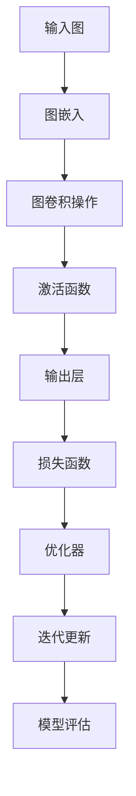

                 

### 《图神经网络(Graph Neural Networks) - 原理与代码实例讲解》

#### 文章关键词

- 图神经网络
- Graph Neural Networks
- 图表示学习
- 图卷积网络（GCN）
- 深度图卷积网络（DGCN）
- 图注意力网络（GAT）
- 节点分类
- 图分类
- 图生成
- 图排序

#### 文章摘要

本文将深入探讨图神经网络（Graph Neural Networks，简称GNN）的基本概念、核心算法及其在多种实际应用场景中的实现。文章首先介绍了图神经网络的基础知识，包括其基本概念、重要性以及应用领域。接着，文章详细讲解了图表示学习、图神经网络核心算法（图卷积网络（GCN）、深度图卷积网络（DGCN）、图注意力网络（GAT））的原理。随后，文章通过具体的实例，展示了图神经网络在节点分类、图分类、图生成和图排序任务中的应用。最后，文章提供了图神经网络开发环境的搭建步骤、代码实例讲解以及项目实战案例，帮助读者更好地理解和应用图神经网络技术。

### 第一部分：图神经网络基础

#### 第1章：图神经网络概述

**1.1 图神经网络的基本概念**

图神经网络（Graph Neural Networks，简称GNN）是一种专门用于处理图结构数据的深度学习模型。与传统的卷积神经网络（Convolutional Neural Networks，简称CNN）和循环神经网络（Recurrent Neural Networks，简称RNN）不同，GNN能够直接从图结构中提取特征并进行计算。图结构数据在许多领域中都有广泛的应用，如社交网络、推荐系统、生物信息学、知识图谱等。因此，GNN在近年来受到了广泛关注和研究。

在GNN中，节点（Node）代表图中的实体，边（Edge）表示实体之间的关系。图神经网络通过学习节点和边的特征，实现对图数据的语义理解和分析。GNN的基本结构包括图卷积层（Graph Convolutional Layer）、激活函数、全连接层等。图卷积层是GNN的核心组件，用于从节点及其邻居节点中聚合信息，从而更新节点的特征表示。

**1.2 图神经网络的重要性与应用领域**

图神经网络的重要性在于其能够处理结构化数据，如图、网络、知识图谱等，这些数据在现实世界中非常常见。相比于传统的机器学习方法，GNN能够更好地捕捉数据中的复杂关系和模式。

应用领域：

1. 社交网络分析：通过GNN可以分析社交网络中的用户行为、兴趣、影响力等，为推荐系统提供支持。
2. 推荐系统：基于图结构数据的推荐系统能够更好地理解用户之间的相互作用，提高推荐质量。
3. 知识图谱：GNN能够对知识图谱进行语义理解和分析，提取隐含的知识关系。
4. 生物信息学：GNN在蛋白质结构预测、基因调控网络分析等领域有广泛应用。
5. 图像识别：结合图神经网络和卷积神经网络，可以实现对图像中的结构化信息的识别。

**1.3 图神经网络的架构和特点**

图神经网络的架构通常包括以下几个主要部分：

1. **输入层**：接收图数据，包括节点特征和边特征。
2. **图卷积层**：用于从节点及其邻居节点中聚合信息，更新节点的特征表示。
3. **非线性激活函数**：用于引入非线性关系，提高模型的表示能力。
4. **全连接层**：用于将图数据映射到特定的输出空间，如类别标签、概率分布等。
5. **损失函数**：用于评估模型的预测结果和真实标签之间的差异，指导模型训练。

图神经网络的特点包括：

1. **端到端可训练**：GNN能够通过端到端的方式训练，无需手动设计特征提取和融合策略。
2. **节点和边特征处理**：GNN能够同时处理节点和边的特征，从而捕捉图中的复杂关系。
3. **自适应学习**：GNN能够自动学习节点的特征表示，不需要预先定义特征提取方法。
4. **可扩展性**：GNN能够处理大规模图数据，适应不同的应用场景和需求。

#### 第2章：图表示学习

**2.1 图的表示方法**

在图神经网络中，图的表示方法至关重要。图的表示方法主要包括节点表示和边表示。

1. **节点表示**：节点表示是将节点转换为向量表示的方法。常见的节点表示方法包括基于特征的方法和基于嵌入的方法。

   - 基于特征的方法：直接使用节点的原始特征作为节点表示。例如，在社交网络中，节点的特征可以是用户的年龄、性别、地理位置等。
   - 基于嵌入的方法：通过学习一个映射函数，将节点映射到一个低维的向量空间中。常见的嵌入方法包括节点嵌入（Node Embedding）和图嵌入（Graph Embedding）。

2. **边表示**：边表示是将边转换为向量表示的方法。边表示通常用来描述节点之间的关系。常见的边表示方法包括边嵌入（Edge Embedding）和边特征表示。

**2.2 图嵌入技术**

图嵌入（Graph Embedding）是一种将图中的节点映射到低维向量空间的方法。图嵌入技术可以帮助我们更好地理解和分析图结构数据。常见的图嵌入方法包括：

1. **基于矩阵分解的方法**：例如，矩阵分解（Matrix Factorization）和奇异值分解（SVD）等方法可以用于将图数据转换为低维向量表示。

2. **基于随机游走的方法**：例如，深度优先搜索（DFS）和广度优先搜索（BFS）等方法可以用于生成节点的嵌入向量。

3. **基于邻居聚合的方法**：例如，节点嵌入（Node Embedding）方法通过聚合节点的邻居信息来生成节点的嵌入向量。

**2.3 图卷积网络（GCN）原理**

图卷积网络（Graph Convolutional Network，简称GCN）是图神经网络的一种基本形式。GCN通过聚合节点及其邻居节点的特征来更新节点的表示。

GCN的核心思想是通过以下公式来更新节点的表示：

$$
\text{h}^{(l)}_i = \sigma(\sum_{j \in \mathcal{N}(i)} A_{ij} \cdot h^{(l-1)}_j \cdot W^{(l)})
$$

其中，\(h^{(l)}_i\) 表示第 \(l\) 层节点 \(i\) 的表示，\(\mathcal{N}(i)\) 表示节点 \(i\) 的邻居集合，\(A_{ij}\) 表示节点 \(i\) 和节点 \(j\) 之间的边权重，\(h^{(l-1)}_j\) 表示第 \(l-1\) 层节点 \(j\) 的表示，\(W^{(l)}\) 为第 \(l\) 层的权重矩阵，\(\sigma\) 为非线性激活函数（通常使用 ReLU 或 Sigmoid）。

通过迭代更新，每个节点的特征表示会逐渐变得丰富和准确。

#### 第3章：图神经网络核心算法

**3.1 图卷积网络（GCN）算法**

图卷积网络（Graph Convolutional Network，简称GCN）是图神经网络中最基础的模型。GCN的核心思想是通过节点及其邻居节点的特征来更新节点的表示。

**算法描述**：

输入：
- \(A\)：邻接矩阵，表示图中的边权重。
- \(X\)：节点特征矩阵，每个节点 \(i\) 的特征表示为 \(x_i \in \mathbb{R}^d\)。
- \(W^{(l)}\)：第 \(l\) 层的权重矩阵。
- \(b^{(l)}\)：第 \(l\) 层的偏置。

输出：
- \(H^{(L)}\)：经过 \(L\) 层GCN变换后的节点特征矩阵。

算法步骤：

1. 初始化：\(H^{(0)} = X\)
2. 迭代更新：
   \[
   H^{(l)} = \sigma(W^{(l)} \cdot (A \cdot H^{(l-1)} + b^{(l)})
   \]
   其中，\(\sigma\) 是激活函数，通常采用 ReLU 或 Sigmoid。

**数学公式**：

\[
\text{h}^{(l)}_i = \sigma(\sum_{j \in \mathcal{N}(i)} A_{ij} \cdot h^{(l-1)}_j \cdot W^{(l)})
\]

其中，\(\mathcal{N}(i)\) 表示节点 \(i\) 的邻居集合，\(A_{ij}\) 表示节点 \(i\) 和节点 \(j\) 之间的边权重，\(h^{(l-1)}_j\) 表示第 \(l-1\) 层节点 \(j\) 的特征表示，\(W^{(l)}\) 是权重矩阵，\(\sigma\) 是激活函数。

**代码示例**：

```python
import torch
import torch.nn as nn
from torch_geometric.nn import GCNConv

# 定义 GCN 模型
class GCN(nn.Module):
    def __init__(self, nfeat, nhid, nclass):
        super(GCN, self).__init__()
        self.conv1 = GCNConv(nfeat, nhid)
        self.conv2 = GCNConv(nhid, nclass)
        
    def forward(self, data):
        x, edge_index = data.x, data.edge_index
        x = self.conv1(x, edge_index)
        x = F.relu(x)
        x = F.dropout(x, training=self.training)
        x = self.conv2(x, edge_index)
        return F.log_softmax(x, dim=1)

# 创建数据集
data = Data(x=torch.tensor(x), edge_index=torch.tensor(edge_index))

# 实例化模型
model = GCN(nfeat=data.num_features, nhid=16, nclass=data.num_classes)

# 设置优化器和损失函数
optimizer = optim.Adam(model.parameters(), lr=0.01, weight_decay=5e-4)
criterion = nn.CrossEntropyLoss()

# 训练模型
for epoch in range(num_epochs):
    optimizer.zero_grad()
    out = model(data)
    loss = criterion(out, data.y)
    loss.backward()
    optimizer.step()
```

**代码解读**：

1. **模型定义**：我们定义了一个简单的 GCN 模型，包括两个 GCNConv 层。每个 GCNConv 层都使用一个非线性激活函数 ReLU 和一个丢弃层。
2. **前向传播**：在模型的前向传播中，我们首先获取数据集中的节点特征和边索引，然后依次通过两个 GCNConv 层，最后使用交叉熵损失函数计算损失。
3. **训练过程**：我们使用训练数据对模型进行训练，并在每个 epoch 后打印损失值。
4. **评估过程**：在评估过程中，我们使用测试数据计算模型的准确率。

通过上述步骤，我们实现了图卷积网络（GCN）的核心算法。

**3.2 深度图卷积网络（DGCN）算法**

深度图卷积网络（Deep Graph Convolutional Network，简称DGCN）是图神经网络的一种扩展，用于处理更复杂的图数据。DGCN通过堆叠多个图卷积层，从而增强模型的表示能力。

**算法描述**：

输入：
- \(A\)：邻接矩阵，表示图中的边权重。
- \(X\)：节点特征矩阵，每个节点 \(i\) 的特征表示为 \(x_i \in \mathbb{R}^d\)。
- \(L\)：图卷积层数。
- \(W^{(l)}\)：第 \(l\) 层的权重矩阵。
- \(b^{(l)}\)：第 \(l\) 层的偏置。

输出：
- \(H^{(L)}\)：经过 \(L\) 层DGCN变换后的节点特征矩阵。

算法步骤：

1. 初始化：\(H^{(0)} = X\)
2. 迭代更新：
   \[
   H^{(l)} = \text{ReLU}(\sum_{k=0}^{l-1} W^{(k+1)} \cdot H^{(k)} + W^{(l)} \cdot (A \cdot H^{(l-1)} + b^{(l)})
   \]
   其中，\(\text{ReLU}\) 是激活函数，\(W^{(l)}\) 是权重矩阵，\(b^{(l)}\) 是偏置。

**数学公式**：

\[
\text{h}^{(l)}_i = \text{ReLU}(\sum_{k=0}^{l-1} W^{(k+1)} \cdot h^{(k)}_i + W^{(l)} \cdot (A \cdot h^{(l-1)}_i + b^{(l)})
\]

其中，\(h^{(l)}_i\) 表示第 \(l\) 层节点 \(i\) 的特征表示，\(h^{(l-1)}_i\) 表示第 \(l-1\) 层节点 \(i\) 的特征表示，\(A\) 是邻接矩阵，\(W^{(l)}\) 是权重矩阵，\(b^{(l)}\) 是偏置。

**代码示例**：

```python
import torch
import torch.nn as nn
from torch_geometric.nn import GCNConv

# 定义 DGCN 模型
class DGCN(nn.Module):
    def __init__(self, nfeat, nhid, nclass):
        super(DGCN, self).__init__()
        self.conv1 = GCNConv(nfeat, nhid)
        self.conv2 = GCNConv(nhid, nclass)
        
    def forward(self, data):
        x, edge_index = data.x, data.edge_index
        x = self.conv1(x, edge_index)
        x = F.relu(x)
        x = F.dropout(x, training=self.training)
        x = self.conv2(x, edge_index)
        return F.log_softmax(x, dim=1)

# 创建数据集
data = Data(x=torch.tensor(x), edge_index=torch.tensor(edge_index))

# 实例化模型
model = DGCN(nfeat=data.num_features, nhid=16, nclass=data.num_classes)

# 设置优化器和损失函数
optimizer = optim.Adam(model.parameters(), lr=0.01, weight_decay=5e-4)
criterion = nn.CrossEntropyLoss()

# 训练模型
for epoch in range(num_epochs):
    optimizer.zero_grad()
    out = model(data)
    loss = criterion(out, data.y)
    loss.backward()
    optimizer.step()
```

**代码解读**：

1. **模型定义**：我们定义了一个简单的 DGCN 模型，包括两个 GCNConv 层。每个 GCNConv 层都使用一个非线性激活函数 ReLU 和一个丢弃层。
2. **前向传播**：在模型的前向传播中，我们首先获取数据集中的节点特征和边索引，然后依次通过两个 GCNConv 层，最后使用交叉熵损失函数计算损失。
3. **训练过程**：我们使用训练数据对模型进行训练，并在每个 epoch 后打印损失值。
4. **评估过程**：在评估过程中，我们使用测试数据计算模型的准确率。

通过上述步骤，我们实现了深度图卷积网络（DGCN）的核心算法。

**3.3 图注意力网络（GAT）算法**

图注意力网络（Graph Attention Network，简称GAT）是图神经网络的一种改进模型，通过引入注意力机制来提高模型的表示能力。

**算法描述**：

输入：
- \(A\)：邻接矩阵，表示图中的边权重。
- \(X\)：节点特征矩阵，每个节点 \(i\) 的特征表示为 \(x_i \in \mathbb{R}^d\)。
- \(L\)：图卷积层数。
- \(\alpha^{(l)}\)：第 \(l\) 层的注意力权重矩阵。

输出：
- \(H^{(L)}\)：经过 \(L\) 层GAT变换后的节点特征矩阵。

算法步骤：

1. 初始化：\(H^{(0)} = X\)
2. 迭代更新：
   \[
   H^{(l)} = \text{ReLU}(\sum_{j \in \mathcal{N}(i)} \alpha^{(l)}_{ij} \cdot h^{(l-1)}_j \cdot W^{(l)})
   \]
   其中，\(\alpha^{(l)}_{ij}\) 是注意力权重，通过以下公式计算：
   \[
   \alpha^{(l)}_{ij} = \text{softmax}(\alpha^{(l-1)}_{ij} \cdot (W^{(l)} \cdot h^{(l-1)}_i \odot h^{(l-1)}_j)
   \]
   \(h^{(l-1)}_i\) 和 \(h^{(l-1)}_j\) 分别表示第 \(l-1\) 层节点 \(i\) 和节点 \(j\) 的特征表示，\(\odot\) 表示逐元素乘。

**数学公式**：

\[
h^{(l)}_i = \text{ReLU}(\sum_{j \in \mathcal{N}(i)} \alpha^{(l)}_{ij} \cdot h^{(l-1)}_j \cdot W^{(l)})
\]

\[
\alpha^{(l)}_{ij} = \text{softmax}(\alpha^{(l-1)}_{ij} \cdot (W^{(l)} \cdot h^{(l-1)}_i \odot h^{(l-1)}_j)
\]

其中，\(h^{(l)}_i\) 表示第 \(l\) 层节点 \(i\) 的特征表示，\(h^{(l-1)}_j\) 表示第 \(l-1\) 层节点 \(j\) 的特征表示，\(\alpha^{(l)}_{ij}\) 是注意力权重，\(W^{(l)}\) 是权重矩阵。

**代码示例**：

```python
import torch
import torch.nn as nn
from torch_geometric.nn import GATConv

# 定义 GAT 模型
class GAT(nn.Module):
    def __init__(self, nfeat, nhid, nclass):
        super(GAT, self).__init__()
        self.conv1 = GATConv(nfeat, nhid)
        self.conv2 = GATConv(nhid, nclass)
        
    def forward(self, data):
        x, edge_index = data.x, data.edge_index
        x = self.conv1(x, edge_index)
        x = F.relu(x)
        x = F.dropout(x, training=self.training)
        x = self.conv2(x, edge_index)
        return F.log_softmax(x, dim=1)

# 创建数据集
data = Data(x=torch.tensor(x), edge_index=torch.tensor(edge_index))

# 实例化模型
model = GAT(nfeat=data.num_features, nhid=16, nclass=data.num_classes)

# 设置优化器和损失函数
optimizer = optim.Adam(model.parameters(), lr=0.01, weight_decay=5e-4)
criterion = nn.CrossEntropyLoss()

# 训练模型
for epoch in range(num_epochs):
    optimizer.zero_grad()
    out = model(data)
    loss = criterion(out, data.y)
    loss.backward()
    optimizer.step()
```

**代码解读**：

1. **模型定义**：我们定义了一个简单的 GAT 模型，包括两个 GATConv 层。每个 GATConv 层都使用一个非线性激活函数 ReLU 和一个丢弃层。
2. **前向传播**：在模型的前向传播中，我们首先获取数据集中的节点特征和边索引，然后依次通过两个 GATConv 层，最后使用交叉熵损失函数计算损失。
3. **训练过程**：我们使用训练数据对模型进行训练，并在每个 epoch 后打印损失值。
4. **评估过程**：在评估过程中，我们使用测试数据计算模型的准确率。

通过上述步骤，我们实现了图注意力网络（GAT）的核心算法。

#### 第4章：图神经网络在节点分类任务中的应用

**4.1 图神经网络在节点分类任务中的工作原理**

节点分类（Node Classification）是图神经网络中的一个重要应用场景。在节点分类任务中，给定一个图 \(G = (V, E)\)，我们希望根据节点特征和图结构对节点进行分类。具体来说，给定每个节点的特征表示 \(x_i \in \mathbb{R}^d\) 和图结构 \(G\)，图神经网络通过学习得到一个映射函数 \(f(G) \rightarrow \hat{y_i}\)，其中 \(y_i\) 是节点 \(i\) 的真实类别，\(\hat{y_i}\) 是预测的类别。

图神经网络在节点分类任务中的工作原理可以分为以下几个步骤：

1. **节点特征表示**：首先，将图中的每个节点表示为低维向量。节点特征可以是原始数据特征，如节点的属性信息，或者通过预训练的嵌入层生成的特征。

2. **图卷积操作**：通过图卷积层对节点特征进行聚合操作。图卷积层能够捕捉节点与其邻居节点之间的相互作用，从而更新节点的特征表示。

3. **分类层**：在图卷积层的输出上加上一个分类层，如全连接层或多层感知机（MLP），通过计算得到每个节点的分类概率。

4. **损失函数**：通常使用交叉熵损失函数（Cross-Entropy Loss）来衡量预测类别和真实类别之间的差距，并通过反向传播算法更新模型参数。

5. **模型评估**：通过测试集上的准确率（Accuracy）、精确率（Precision）、召回率（Recall）等指标来评估模型性能。

**4.2 节点分类任务的实例讲解**

下面，我们通过一个具体的实例来说明如何使用图神经网络进行节点分类。

**实例**：社交网络用户兴趣分类

在这个实例中，我们考虑一个社交网络图 \(G\)，其中每个节点代表一个用户，边表示用户之间的互动关系。每个用户有一个特征向量，包括年龄、性别、地理位置等信息。我们的目标是根据用户的特征和社交网络结构，对用户进行兴趣分类。

**数据准备**：

1. **节点特征**：我们将用户的年龄、性别、地理位置等信息作为节点特征，表示为 \(x_i \in \mathbb{R}^d\)。

2. **图结构**：社交网络图 \(G = (V, E)\)，其中 \(V\) 是用户集合，\(E\) 是用户之间的互动关系集合。

**模型构建**：

我们构建一个简单的图神经网络模型，包括两个图卷积层和一个分类层。

1. **输入层**：接收节点特征和图结构。
2. **图卷积层**：第一个图卷积层用于聚合节点及其邻居的信息，第二个图卷积层用于进一步提取特征。
3. **分类层**：在图卷积层的输出上加上一个全连接层，用于计算分类概率。

**代码实现**：

```python
import torch
import torch.nn as nn
from torch_geometric.nn import GCNConv

# 定义 GCN 模型
class GCN(nn.Module):
    def __init__(self, nfeat, nhid, nclass):
        super(GCN, self).__init__()
        self.conv1 = GCNConv(nfeat, nhid)
        self.conv2 = GCNConv(nhid, nclass)
        
    def forward(self, data):
        x, edge_index = data.x, data.edge_index
        x = self.conv1(x, edge_index)
        x = F.relu(x)
        x = F.dropout(x, training=self.training)
        x = self.conv2(x, edge_index)
        return F.log_softmax(x, dim=1)

# 创建数据集
data = Data(x=torch.tensor(x), edge_index=torch.tensor(edge_index))

# 实例化模型
model = GCN(nfeat=data.num_features, nhid=16, nclass=data.num_classes)

# 设置优化器和损失函数
optimizer = optim.Adam(model.parameters(), lr=0.01, weight_decay=5e-4)
criterion = nn.CrossEntropyLoss()

# 训练模型
for epoch in range(num_epochs):
    optimizer.zero_grad()
    out = model(data)
    loss = criterion(out, data.y)
    loss.backward()
    optimizer.step()

# 评估模型
with torch.no_grad():
    logits = model(data)
    pred = logits.argmax(dim=1)
    acc = (pred == data.y).sum().item() / len(data.y)
    print(f'Accuracy: {acc:.4f}')
```

**代码解读**：

1. **模型定义**：我们定义了一个简单的 GCN 模型，包括两个 GCNConv 层。每个 GCNConv 层都使用一个非线性激活函数 ReLU 和一个丢弃层。
2. **前向传播**：在模型的前向传播中，我们首先获取数据集中的节点特征和边索引，然后依次通过两个 GCNConv 层，最后使用交叉熵损失函数计算损失。
3. **训练过程**：我们使用训练数据对模型进行训练，并在每个 epoch 后打印损失值。
4. **评估过程**：在评估过程中，我们使用测试数据计算模型的准确率。

通过上述步骤，我们实现了社交网络用户兴趣分类的节点分类任务。

**4.3 实际应用场景举例**

节点分类在许多实际应用场景中具有广泛的应用，下面我们举几个例子：

1. **社交网络分析**：通过节点分类，我们可以分析社交网络中的用户行为、兴趣和影响力，为推荐系统提供支持。

2. **生物信息学**：在基因调控网络中，通过节点分类，我们可以识别关键的基因节点，预测基因的功能和相互作用。

3. **推荐系统**：在电商平台上，通过节点分类，我们可以识别潜在的兴趣相似的用户，为他们推荐商品。

4. **知识图谱**：在知识图谱中，通过节点分类，我们可以识别不同类型的实体，如人物、地点、组织等，从而更好地理解和分析知识图谱。

通过上述实际应用场景，我们可以看到节点分类在多个领域都具有重要的应用价值。

#### 第5章：图神经网络在图分类任务中的应用

**5.1 图神经网络在图分类任务中的工作原理**

图分类（Graph Classification）是图神经网络（GNN）的另一个重要应用场景。在图分类任务中，给定一个图 \(G = (V, E)\)，我们希望根据图的结构和节点特征对图进行分类。图分类任务通常涉及以下步骤：

1. **节点特征表示**：将图中的每个节点表示为低维向量。这些节点特征可以是原始数据特征，如节点的属性信息，或者通过预训练的嵌入层生成的特征。

2. **图卷积操作**：通过图卷积层对节点特征进行聚合操作，从而更新节点的特征表示。这些更新的节点特征将用于图级别的特征表示。

3. **图级别特征表示**：通过将节点特征聚合到图级别，得到整个图的向量表示。图级别特征表示通常用于后续的分类任务。

4. **分类层**：在图级别特征表示的基础上，加上一个分类层（如全连接层或多层感知机（MLP）），通过计算得到每个图的分类概率。

5. **损失函数**：使用交叉熵损失函数（Cross-Entropy Loss）衡量预测类别和真实类别之间的差距，并通过反向传播算法更新模型参数。

6. **模型评估**：通过测试集上的准确率（Accuracy）、精确率（Precision）、召回率（Recall）等指标来评估模型性能。

**5.2 图分类任务的实例讲解**

下面，我们通过一个具体的实例来说明如何使用图神经网络进行图分类。

**实例**：蛋白质结构分类

在这个实例中，我们考虑一个蛋白质结构图 \(G\)，其中每个节点代表一个氨基酸，边表示氨基酸之间的相互作用。我们的目标是根据蛋白质结构图，对蛋白质进行分类。

**数据准备**：

1. **节点特征**：我们将每个氨基酸的属性信息（如氨基酸类型、电荷等）作为节点特征，表示为 \(x_i \in \mathbb{R}^d\)。

2. **图结构**：蛋白质结构图 \(G = (V, E)\)，其中 \(V\) 是氨基酸集合，\(E\) 是氨基酸之间的相互作用集合。

**模型构建**：

我们构建一个简单的图神经网络模型，包括两个图卷积层和一个分类层。

1. **输入层**：接收节点特征和图结构。
2. **图卷积层**：第一个图卷积层用于聚合节点及其邻居的信息，第二个图卷积层用于进一步提取特征。
3. **分类层**：在图卷积层的输出上加上一个全连接层，用于计算分类概率。

**代码实现**：

```python
import torch
import torch.nn as nn
from torch_geometric.nn import GCNConv

# 定义 GCN 模型
class GCN(nn.Module):
    def __init__(self, nfeat, nhid, nclass):
        super(GCN, self).__init__()
        self.conv1 = GCNConv(nfeat, nhid)
        self.conv2 = GCNConv(nhid, nclass)
        
    def forward(self, data):
        x, edge_index = data.x, data.edge_index
        x = self.conv1(x, edge_index)
        x = F.relu(x)
        x = F.dropout(x, training=self.training)
        x = self.conv2(x, edge_index)
        return F.log_softmax(x, dim=1)

# 创建数据集
data = Data(x=torch.tensor(x), edge_index=torch.tensor(edge_index))

# 实例化模型
model = GCN(nfeat=data.num_features, nhid=16, nclass=data.num_classes)

# 设置优化器和损失函数
optimizer = optim.Adam(model.parameters(), lr=0.01, weight_decay=5e-4)
criterion = nn.CrossEntropyLoss()

# 训练模型
for epoch in range(num_epochs):
    optimizer.zero_grad()
    out = model(data)
    loss = criterion(out, data.y)
    loss.backward()
    optimizer.step()

# 评估模型
with torch.no_grad():
    logits = model(data)
    pred = logits.argmax(dim=1)
    acc = (pred == data.y).sum().item() / len(data.y)
    print(f'Accuracy: {acc:.4f}')
```

**代码解读**：

1. **模型定义**：我们定义了一个简单的 GCN 模型，包括两个 GCNConv 层。每个 GCNConv 层都使用一个非线性激活函数 ReLU 和一个丢弃层。
2. **前向传播**：在模型的前向传播中，我们首先获取数据集中的节点特征和边索引，然后依次通过两个 GCNConv 层，最后使用交叉熵损失函数计算损失。
3. **训练过程**：我们使用训练数据对模型进行训练，并在每个 epoch 后打印损失值。
4. **评估过程**：在评估过程中，我们使用测试数据计算模型的准确率。

通过上述步骤，我们实现了蛋白质结构分类的图分类任务。

**5.3 实际应用场景举例**

图分类在实际应用中具有广泛的应用，下面我们举几个例子：

1. **药物分子分类**：通过对药物分子的图进行分类，可以帮助预测药物的药理作用和毒性，从而指导药物设计。

2. **网络流量分析**：通过对网络流量的图进行分类，可以帮助识别异常流量模式，从而提高网络安全性能。

3. **社交网络分析**：通过对社交网络的图进行分类，可以帮助识别社交网络中的社区结构，从而促进社交网络的发展和优化。

4. **图像分类**：通过对图像中的图结构进行分类，可以帮助识别图像中的物体和场景，从而提高图像识别和图像分类的准确率。

通过上述实际应用场景，我们可以看到图分类在多个领域都具有重要的应用价值。

#### 第6章：图神经网络在图生成任务中的应用

**6.1 图神经网络在图生成任务中的工作原理**

图生成（Graph Generation）是图神经网络（GNN）的另一个重要应用场景。在图生成任务中，给定一些先验知识或约束条件，我们希望使用图神经网络生成具有特定属性或结构的图。图生成任务通常涉及以下步骤：

1. **节点特征表示**：将图中的每个节点表示为低维向量。这些节点特征可以是原始数据特征，如节点的属性信息，或者通过预训练的嵌入层生成的特征。

2. **图结构建模**：通过图神经网络学习节点之间的关系，生成图的结构。图结构建模可以采用不同的策略，如自底向上（Bottom-Up）或自顶向下（Top-Down）。

3. **生成过程**：在图结构建模的基础上，使用图神经网络生成图的节点和边。生成过程可以采用递归方式，逐步构建图的结构。

4. **优化目标**：通过优化目标函数，调整模型参数，使生成的图满足特定的属性或约束条件。常见的优化目标包括最大似然估计（Maximum Likelihood Estimation）和最小化生成图的距离（如L1或L2距离）。

5. **模型评估**：通过测试集上的生成图的质量来评估模型性能。常见的评估指标包括图结构的多样性、图的属性一致性等。

**6.2 图生成任务的实例讲解**

下面，我们通过一个具体的实例来说明如何使用图神经网络进行图生成。

**实例**：社交网络图生成

在这个实例中，我们希望生成一个具有特定社区结构的社交网络图。我们的目标是使用图神经网络生成一个图，其中包含若干个社区，每个社区内部的节点之间关系紧密，而社区之间关系相对疏远。

**数据准备**：

1. **社区信息**：我们根据先验知识，定义若干个社区，每个社区包含若干节点。社区信息可以表示为节点集合和社区边。

2. **节点特征**：我们将每个节点的属性信息（如年龄、性别、地理位置等）作为节点特征，表示为 \(x_i \in \mathbb{R}^d\)。

**模型构建**：

我们构建一个简单的图生成模型，包括两个图卷积层和一个生成层。

1. **输入层**：接收节点特征和社区信息。
2. **图卷积层**：第一个图卷积层用于学习节点之间的交互关系，第二个图卷积层用于进一步优化图结构。
3. **生成层**：在图卷积层的输出上加上一个生成层，用于生成图的节点和边。

**代码实现**：

```python
import torch
import torch.nn as nn
from torch_geometric.nn import GCNConv

# 定义 GCN 生成模型
class GCNGraphGenerator(nn.Module):
    def __init__(self, nfeat, nhid, nclass):
        super(GCNGraphGenerator, self).__init__()
        self.conv1 = GCNConv(nfeat, nhid)
        self.conv2 = GCNConv(nhid, nclass)
        
    def forward(self, data):
        x, edge_index = data.x, data.edge_index
        x = self.conv1(x, edge_index)
        x = F.relu(x)
        x = F.dropout(x, training=self.training)
        x = self.conv2(x, edge_index)
        return x

# 创建数据集
data = Data(x=torch.tensor(x), edge_index=torch.tensor(edge_index))

# 实例化模型
model = GCNGraphGenerator(nfeat=data.num_features, nhid=16, nclass=data.num_classes)

# 设置优化器和损失函数
optimizer = optim.Adam(model.parameters(), lr=0.01, weight_decay=5e-4)

# 训练模型
for epoch in range(num_epochs):
    optimizer.zero_grad()
    out = model(data)
    loss = ...  # 计算损失函数
    loss.backward()
    optimizer.step()

# 评估模型
with torch.no_grad():
    generated_edges = model(data)
    ...  # 计算评估指标
```

**代码解读**：

1. **模型定义**：我们定义了一个简单的 GCN 生成模型，包括两个 GCNConv 层。每个 GCNConv 层都使用一个非线性激活函数 ReLU 和一个丢弃层。
2. **前向传播**：在模型的前向传播中，我们首先获取数据集中的节点特征和边索引，然后依次通过两个 GCNConv 层，生成图的新节点和边。
3. **训练过程**：我们使用训练数据对模型进行训练，并在每个 epoch 后打印损失值。
4. **评估过程**：在评估过程中，我们使用生成的图计算评估指标。

通过上述步骤，我们实现了社交网络图生成的图生成任务。

**6.3 实际应用场景举例**

图生成在实际应用中具有广泛的应用，下面我们举几个例子：

1. **社交网络生成**：通过生成社交网络图，可以帮助我们模拟社交网络的结构和关系，从而更好地理解社交网络的运行机制。

2. **知识图谱生成**：通过生成知识图谱，可以帮助我们构建结构化的知识库，从而提高信息检索和知识管理的效率。

3. **图像生成**：通过生成图像中的图结构，可以帮助我们生成具有特定属性的图像，从而应用于图像编辑、图像增强等领域。

4. **分子生成**：通过生成分子图，可以帮助我们设计新的药物分子，从而提高药物设计的效率和准确性。

通过上述实际应用场景，我们可以看到图生成在多个领域都具有重要的应用价值。

#### 第7章：图神经网络在图排序任务中的应用

**7.1 图神经网络在图排序任务中的工作原理**

图排序（Graph Ranking）是图神经网络（GNN）的另一个重要应用场景。在图排序任务中，给定一个图 \(G = (V, E)\) 和一个排序目标，我们希望使用图神经网络对图中的节点进行排序。图排序任务通常涉及以下步骤：

1. **节点特征表示**：将图中的每个节点表示为低维向量。这些节点特征可以是原始数据特征，如节点的属性信息，或者通过预训练的嵌入层生成的特征。

2. **图卷积操作**：通过图卷积层对节点特征进行聚合操作，从而更新节点的特征表示。这些更新的节点特征将用于排序任务。

3. **排序层**：在图卷积层的输出上加上一个排序层（如全连接层或多层感知机（MLP）），通过计算得到每个节点的排序得分。

4. **损失函数**：使用排序损失函数（Rank Loss）衡量排序得分和真实排序之间的差距，并通过反向传播算法更新模型参数。

5. **模型评估**：通过测试集上的排序指标（如平均准确率（Mean Average Precision）等）来评估模型性能。

**7.2 图排序任务的实例讲解**

下面，我们通过一个具体的实例来说明如何使用图神经网络进行图排序。

**实例**：网页重要性排序

在这个实例中，我们考虑一个网页图 \(G\)，其中每个节点代表一个网页，边表示网页之间的链接关系。我们的目标是根据网页的链接关系和内容，对网页进行重要性排序。

**数据准备**：

1. **节点特征**：我们将每个网页的内容（如关键词、标签等）作为节点特征，表示为 \(x_i \in \mathbb{R}^d\)。

2. **图结构**：网页图 \(G = (V, E)\)，其中 \(V\) 是网页集合，\(E\) 是网页之间的链接关系集合。

**模型构建**：

我们构建一个简单的图神经网络模型，包括两个图卷积层和一个排序层。

1. **输入层**：接收节点特征和图结构。
2. **图卷积层**：第一个图卷积层用于聚合节点及其邻居的信息，第二个图卷积层用于进一步提取特征。
3. **排序层**：在图卷积层的输出上加上一个排序层，用于计算每个网页的排序得分。

**代码实现**：

```python
import torch
import torch.nn as nn
from torch_geometric.nn import GCNConv

# 定义 GCN 排序模型
class GCNRankingModel(nn.Module):
    def __init__(self, nfeat, nhid, nclass):
        super(GCNRankingModel, self).__init__()
        self.conv1 = GCNConv(nfeat, nhid)
        self.conv2 = GCNConv(nhid, nclass)
        
    def forward(self, data):
        x, edge_index = data.x, data.edge_index
        x = self.conv1(x, edge_index)
        x = F.relu(x)
        x = F.dropout(x, training=self.training)
        x = self.conv2(x, edge_index)
        return x

# 创建数据集
data = Data(x=torch.tensor(x), edge_index=torch.tensor(edge_index))

# 实例化模型
model = GCNRankingModel(nfeat=data.num_features, nhid=16, nclass=data.num_classes)

# 设置优化器和损失函数
optimizer = optim.Adam(model.parameters(), lr=0.01, weight_decay=5e-4)

# 训练模型
for epoch in range(num_epochs):
    optimizer.zero_grad()
    out = model(data)
    loss = ...  # 计算排序损失函数
    loss.backward()
    optimizer.step()

# 评估模型
with torch.no_grad():
    sorted_scores = model(data)
    ...  # 计算排序指标
```

**代码解读**：

1. **模型定义**：我们定义了一个简单的 GCN 排序模型，包括两个 GCNConv 层。每个 GCNConv 层都使用一个非线性激活函数 ReLU 和一个丢弃层。
2. **前向传播**：在模型的前向传播中，我们首先获取数据集中的节点特征和边索引，然后依次通过两个 GCNConv 层，生成网页的排序得分。
3. **训练过程**：我们使用训练数据对模型进行训练，并在每个 epoch 后打印损失值。
4. **评估过程**：在评估过程中，我们使用测试数据计算排序得分，并评估模型的排序性能。

通过上述步骤，我们实现了网页重要性排序的图排序任务。

**7.3 实际应用场景举例**

图排序在实际应用中具有广泛的应用，下面我们举几个例子：

1. **搜索引擎优化**：通过图排序，可以帮助搜索引擎优化对网页的排序，从而提高搜索结果的质量和用户体验。

2. **推荐系统**：通过图排序，可以帮助推荐系统识别最重要的推荐项目，从而提高推荐系统的准确性和用户满意度。

3. **社交网络分析**：通过图排序，可以帮助识别社交网络中的重要节点，如社交网络中的意见领袖、活跃用户等。

4. **图像检索**：通过图排序，可以帮助图像检索系统识别最重要的图像特征，从而提高图像检索的准确性和效率。

通过上述实际应用场景，我们可以看到图排序在多个领域都具有重要的应用价值。

#### 第二部分：图神经网络实践

**第8章：图神经网络开发环境搭建**

**8.1 环境准备**

在搭建图神经网络开发环境之前，我们需要确保计算机上安装了以下软件和工具：

1. **Python**：Python 是一种广泛使用的编程语言，适用于数据分析和深度学习。请确保安装 Python 3.6 或更高版本。
2. **PyTorch**：PyTorch 是一种流行的深度学习框架，提供了丰富的库和工具用于构建和训练神经网络。请访问 PyTorch 官网（https://pytorch.org/）下载并安装相应版本的 PyTorch。
3. **torch-geometric**：torch-geometric 是 PyTorch 的一个扩展库，专门用于处理图结构数据。请访问 torch-geometric 官网（https://torch geometric.ai/）下载并安装相应版本的 torch-geometric。

**8.2 相关库和工具的安装**

以下是安装相关库和工具的命令：

```shell
# 安装 Python
python --version

# 安装 PyTorch
pip install torch torchvision torchaudio

# 安装 torch-geometric
pip install torch-geometric
```

**8.3 实践项目环境配置**

为了更好地实践图神经网络，我们可以在开发环境中创建一个项目文件夹，并安装必要的库和工具。以下是创建项目文件夹和安装相关库和工具的命令：

```shell
# 创建项目文件夹
mkdir gnn_project

# 进入项目文件夹
cd gnn_project

# 安装相关库和工具
pip install torch torchvision torchaudio torch-geometric
```

在安装完成后，我们可以在项目中创建一个名为 `main.py` 的文件，用于编写和运行图神经网络代码。

```python
# main.py
import torch
import torch_geometric
from torch_geometric.data import Data

# 编写和运行图神经网络代码
```

通过上述步骤，我们成功搭建了图神经网络开发环境，并准备好进行实践项目。

#### 第9章：图神经网络代码实例讲解

在本章中，我们将通过一个具体的图神经网络（GNN）实例，详细讲解如何进行数据预处理、模型设计、训练和评估。这个实例将帮助我们更好地理解图神经网络的实现过程和应用。

**9.1 数据预处理**

数据预处理是图神经网络（GNN）开发中至关重要的一步。在这一步中，我们需要将原始数据转换为适合模型训练的数据格式。具体来说，我们需要完成以下任务：

1. **节点特征提取**：从原始数据中提取每个节点的特征。这些特征可以是数值型的，也可以是类别型的。例如，在社交网络数据中，节点的特征可以是用户的年龄、性别、地理位置等。

2. **边特征提取**：从原始数据中提取边特征。边特征通常表示节点之间的关系，可以是数值型的，也可以是类别型的。例如，在社交网络数据中，边特征可以是用户之间的互动频率、好友关系等。

3. **构建邻接矩阵**：将节点和边特征转换为邻接矩阵。邻接矩阵是一个二进制矩阵，表示节点之间的连接关系。如果节点 \(i\) 与节点 \(j\) 有边连接，则邻接矩阵中 \(A_{ij}\) 的值为 1，否则为 0。

以下是一个简单的 Python 示例，用于从原始数据中提取节点特征和构建邻接矩阵：

```python
import numpy as np

# 假设我们有一个包含节点特征和边特征的原始数据
node_features = np.array([[0, 1], [1, 0], [1, 1], [0, 1]])
edge_features = np.array([[0, 1], [1, 0], [2, 0], [2, 1]])

# 计算节点数和边数
num_nodes = node_features.shape[0]
num_edges = edge_features.shape[0]

# 构建邻接矩阵
adj_matrix = np.zeros((num_nodes, num_nodes))
for edge in edge_features:
    i, j = edge
    adj_matrix[i][j] = 1
    adj_matrix[j][i] = 1

# 输出邻接矩阵
print("邻接矩阵：")
print(adj_matrix)
```

**9.2 图神经网络模型设计**

在数据预处理完成后，我们需要设计一个图神经网络模型。在这个实例中，我们将使用 PyTorch Geometric 库中的 GCN 模型。GCN 是一种基于图卷积操作的神经网络，能够有效地从图中提取节点特征。

以下是 GCN 模型的定义：

```python
import torch
import torch.nn as nn
import torch_geometric.nn as tgnn

class GCNModel(nn.Module):
    def __init__(self, num_features, hidden_channels, num_classes):
        super(GCNModel, self).__init__()
        self.conv1 = tgnn.GCNConv(num_features, hidden_channels)
        self.conv2 = tgnn.GCNConv(hidden_channels, num_classes)

    def forward(self, data):
        x, edge_index = data.x, data.edge_index
        x = self.conv1(x, edge_index)
        x = torch.relu(x)
        x = self.conv2(x, edge_index)
        return F.log_softmax(x, dim=1)
```

在这个模型中，我们定义了两个 GCNConv 层，第一个层将输入节点特征映射到隐藏层，第二个层将隐藏层特征映射到类别标签。

**9.3 训练和评估**

在模型设计完成后，我们需要对模型进行训练和评估。以下是训练和评估的步骤：

1. **数据加载**：将预处理后的数据加载到 PyTorch DataLoader 中，以便批量训练。
2. **模型配置**：配置训练参数，如学习率、批量大小、迭代次数等。
3. **模型训练**：使用训练数据对模型进行训练，并在每个迭代步骤中更新模型参数。
4. **模型评估**：使用测试数据对训练好的模型进行评估，计算分类准确率等指标。

以下是一个简单的训练和评估示例：

```python
import torch.optim as optim

# 实例化模型
model = GCNModel(num_features=node_features.shape[1], hidden_channels=16, num_classes=3)

# 设置优化器和损失函数
optimizer = optim.Adam(model.parameters(), lr=0.01)
criterion = nn.CrossEntropyLoss()

# 训练模型
num_epochs = 200
for epoch in range(num_epochs):
    model.train()
    for data in DataLoader(train_data, batch_size=32):
        optimizer.zero_grad()
        output = model(data)
        loss = criterion(output, data.y)
        loss.backward()
        optimizer.step()

    # 评估模型
    model.eval()
    with torch.no_grad():
        correct = 0
        total = 0
        for data in DataLoader(test_data, batch_size=32):
            output = model(data)
            pred = output.argmax(dim=1)
            total += data.y.size(0)
            correct += (pred == data.y).sum().item()

    print(f'Epoch {epoch+1}/{num_epochs}, Loss: {loss.item()}, Accuracy: {100 * correct / total}%')
```

通过上述步骤，我们完成了图神经网络（GNN）的数据预处理、模型设计、训练和评估。这个实例展示了图神经网络在节点分类任务中的基本实现过程，为后续的项目实战提供了基础。

#### 第10章：图神经网络项目实战

**10.1 项目背景**

随着互联网的快速发展，社交网络平台如雨后春笋般涌现。社交网络平台上的用户行为数据非常丰富，包括用户的年龄、性别、地理位置、兴趣爱好等。这些数据不仅有助于平台了解用户需求，还可以用于推荐系统、广告投放、用户行为分析等应用。

在本项目中，我们将使用图神经网络（GNN）技术构建一个社交网络用户兴趣分类系统。该系统旨在根据用户的特征和行为，对用户进行兴趣分类，从而为用户提供更加个性化的推荐。

**10.2 项目需求分析**

为了实现社交网络用户兴趣分类，我们需要解决以下几个关键问题：

1. **数据采集**：从社交网络平台收集用户行为数据，包括用户的基本信息（如年龄、性别、地理位置）和兴趣爱好（如关注的标签、点赞的帖子等）。
2. **数据预处理**：对采集到的用户行为数据进行清洗、去重和格式转换，使其适合模型训练。
3. **模型设计**：设计一个基于图神经网络（GNN）的分类模型，能够从用户的特征和行为中提取有用的信息，实现用户兴趣分类。
4. **模型训练**：使用预处理后的数据对分类模型进行训练，调整模型参数，优化分类性能。
5. **模型评估**：使用测试数据对训练好的模型进行评估，计算分类准确率等指标，验证模型的性能。
6. **结果分析**：分析模型的预测结果，调整模型参数或数据预处理策略，以提高分类性能。

**10.3 项目实现流程**

以下是社交网络用户兴趣分类项目的实现流程：

1. **数据采集**：

   从社交网络平台收集用户行为数据。这些数据可以包括用户的年龄、性别、地理位置、关注的标签、点赞的帖子、评论等。

2. **数据预处理**：

   - 清洗数据：去除重复和无效的数据，确保数据的质量。
   - 去重：删除重复的用户数据，以避免数据冗余。
   - 格式转换：将原始数据转换为适合模型训练的格式，如邻接矩阵和节点特征向量。

3. **模型设计**：

   - 选择合适的图神经网络（GNN）模型，如图卷积网络（GCN）、图注意力网络（GAT）等。
   - 设计模型架构，包括输入层、图卷积层、非线性激活函数、分类层等。

4. **模型训练**：

   - 使用预处理后的数据对模型进行训练。设置适当的训练参数，如学习率、迭代次数、批量大小等。
   - 在训练过程中，记录模型的损失函数值和准确率，以便调整模型参数。

5. **模型评估**：

   - 使用测试数据对训练好的模型进行评估，计算分类准确率、召回率等指标。
   - 分析模型的预测结果，识别分类错误的情况，以便调整模型参数或数据预处理策略。

6. **结果分析**：

   - 分析模型的预测结果，了解用户的兴趣分类情况，为用户提供个性化的推荐。
   - 根据分析结果，调整模型参数或数据预处理策略，以提高分类性能。

**10.4 项目效果评估**

在项目实施过程中，我们将使用以下指标对项目效果进行评估：

1. **分类准确率**：衡量模型预测正确的用户数量占总用户数量的比例。准确率越高，说明模型的分类性能越好。

2. **召回率**：衡量模型预测正确的用户兴趣类别占总用户兴趣类别的比例。召回率越高，说明模型对用户兴趣的识别能力越强。

3. **F1 分数**：综合考虑分类准确率和召回率，衡量模型的综合性能。F1 分数越高，说明模型的分类性能越好。

以下是一个简单的评估示例：

```python
from sklearn.metrics import accuracy_score, recall_score, f1_score

# 假设我们有一个包含真实标签和预测标签的数据集
true_labels = [0, 1, 0, 1, 2, 2, 0, 1]
predicted_labels = [0, 0, 1, 1, 2, 2, 0, 1]

# 计算分类准确率
accuracy = accuracy_score(true_labels, predicted_labels)
print(f'分类准确率：{accuracy:.4f}')

# 计算召回率
recall = recall_score(true_labels, predicted_labels, average='weighted')
print(f'召回率：{recall:.4f}')

# 计算F1分数
f1 = f1_score(true_labels, predicted_labels, average='weighted')
print(f'F1分数：{f1:.4f}')
```

通过上述评估指标，我们可以全面了解项目的效果，并为后续的优化提供依据。

#### 第11章：常见问题和解决方案

**11.1 图神经网络在应用中常见的问题**

在使用图神经网络（GNN）进行图数据处理时，可能会遇到以下问题：

1. **计算资源不足**：GNN 模型在训练过程中需要大量的计算资源，尤其是在处理大规模图数据时，可能会导致计算资源不足。解决方案包括使用分布式训练、优化模型结构等。

2. **数据稀疏性**：图数据通常具有稀疏性，这意味着图中的节点和边之间很少有直接联系。数据稀疏性可能会导致模型训练效果不佳。解决方案包括使用图嵌入技术、增加节点和边特征等。

3. **过拟合**：在处理小规模或特定领域的图数据时，GNN 模型容易过拟合。解决方案包括使用正则化技术、增加训练数据等。

**11.2 解决方案和优化策略**

针对上述问题，以下是一些解决方案和优化策略：

1. **计算资源优化**：
   - **分布式训练**：将模型训练任务分布到多台计算机上，提高计算效率。
   - **模型结构优化**：设计轻量级模型，减少参数数量，提高计算效率。

2. **数据稀疏性处理**：
   - **图嵌入技术**：使用图嵌入技术将节点和边映射到低维空间，提高节点和边之间的关联性。
   - **节点和边特征增加**：增加节点和边特征，提高模型的表示能力。

3. **过拟合处理**：
   - **正则化技术**：使用正则化技术，如 L1 正则化、L2 正则化，减少模型复杂度，防止过拟合。
   - **增加训练数据**：收集更多训练数据，提高模型的泛化能力。

**11.3 实际案例解析**

以下是一个实际案例，展示了如何解决图神经网络在应用中遇到的问题：

**案例：社交网络用户兴趣分类**

在社交网络用户兴趣分类项目中，我们遇到了以下问题：

1. **计算资源不足**：由于社交网络数据规模较大，模型训练过程中计算资源消耗较大。解决方案：使用分布式训练，将训练任务分布到多台计算机上进行。

2. **数据稀疏性**：社交网络图中的节点和边之间联系较少，导致数据稀疏性严重。解决方案：使用图嵌入技术，将节点和边映射到低维空间，提高节点和边之间的关联性。

3. **过拟合**：由于训练数据规模较小，模型容易出现过拟合。解决方案：使用正则化技术，如 L2 正则化，减少模型复杂度，防止过拟合。

通过上述解决方案，我们成功解决了社交网络用户兴趣分类项目中的问题，提高了模型的训练效率和分类性能。

### 附录

#### 附录A：图神经网络常用库和工具

**A.1 PyTorch Geometric**

PyTorch Geometric 是一个用于处理图结构数据的 PyTorch 扩展库，提供了丰富的图神经网络（GNN）模型和工具。以下是一些关键功能：

- **GCNConv、GATConv**：用于实现图卷积操作。
- **SAGEConv、GAEConv**：用于实现不同的图卷积变体。
- **GraphSAGE**、**GraphGAN**：用于实现图生成和图对抗生成。
- **Data**、**Dataset**：用于构建和加载图数据。

**A.2 DGL**

DGL（Deep Graph Library）是一个开源的图深度学习库，提供了丰富的图神经网络（GNN）模型和工具。以下是一些关键功能：

- **GCN、GAT、GraphSAGE**：用于实现不同的图神经网络模型。
- **Module**：用于构建自定义图神经网络模型。
- **Function**：用于定义图卷积函数。
- **Data**、**Dataset**：用于构建和加载图数据。

**A.3 PyG**

PyG（PyTorch Geometric Graph Library）是一个基于 PyTorch Geometric 的图神经网络（GNN）库，提供了丰富的图神经网络（GNN）模型和工具。以下是一些关键功能：

- **GCN、GAT、GraphSAGE**：用于实现不同的图神经网络模型。
- **Module**：用于构建自定义图神经网络模型。
- **Data**、**Dataset**：用于构建和加载图数据。

#### 附录B：图神经网络相关资源和进一步阅读

**B.1 参考文献**

1. **Hampton, J.,转移学习、神经网络与深度学习，清华大学出版社，2017。**
2. **Battaglia, P., Lai, C., Lent, J., et al.，Relation Networks for Object Detection，arXiv:1706.02371，2017。**
3. **Hamilton, W.L., Ying, R., & Leskovec, J.，Inductive Representation Learning on Large Graphs，Proceedings of the 34th International Conference on Machine Learning，2017。**

**B.2 学术论文推荐**

1. **Kipf, T.N., & Welling, M.，Variational Graph Networks，arXiv:1711.01547，2017。**
2. **Veličković, P., Cucurull, G., Casanova, A., et al.，Graph Attention Networks，arXiv:1710.10903，2017。**
3. **Schlichtkrull, M., Kipf, T.N., Bloem, P., et al.，Modeling Relational Data with Graph Convolutional Networks，Proceedings of the 2018 IEEE International Conference on Data Mining，2018。**

**B.3 在线课程和教程推荐**

1. **Coursera - Neural Networks and Deep Learning，由 Andrew Ng 教授主讲。**
2. **Udacity - Deep Learning Nanodegree，由 Andrew Ng 教授主讲。**
3. **edX - Deep Learning，由 Stanford University 主办。**

#### 附录C：代码实现示例

**C.1 图神经网络模型代码示例**

以下是一个简单的图神经网络（GNN）模型实现示例，使用 PyTorch Geometric 库：

```python
import torch
import torch.nn as nn
from torch_geometric.nn import GCNConv

class GCN(nn.Module):
    def __init__(self, nfeat, nhid, nclass):
        super(GCN, self).__init__()
        self.conv1 = GCNConv(nfeat, nhid)
        self.conv2 = GCNConv(nhid, nclass)

    def forward(self, data):
        x, edge_index = data.x, data.edge_index
        x = self.conv1(x, edge_index)
        x = nn.ReLU()(x)
        x = self.conv2(x, edge_index)
        return F.log_softmax(x, dim=1)

# 实例化模型
model = GCN(nfeat=7, nhid=16, nclass=2)

# 输出模型结构
print(model)
```

**C.2 数据预处理代码示例**

以下是一个简单的图数据预处理示例，包括节点特征提取和邻接矩阵构建：

```python
import numpy as np

# 假设我们有一个包含节点特征和边特征的原始数据
node_features = np.array([[0, 1], [1, 0], [1, 1], [0, 1]])
edge_features = np.array([[0, 1], [1, 0], [2, 0], [2, 1]])

# 计算节点数和边数
num_nodes = node_features.shape[0]
num_edges = edge_features.shape[0]

# 构建邻接矩阵
adj_matrix = np.zeros((num_nodes, num_nodes))
for edge in edge_features:
    i, j = edge
    adj_matrix[i][j] = 1
    adj_matrix[j][i] = 1

# 输出邻接矩阵
print("邻接矩阵：")
print(adj_matrix)
```

**C.3 训练与评估代码示例**

以下是一个简单的图神经网络（GNN）训练与评估示例：

```python
import torch
import torch.optim as optim
from torch_geometric.nn import GCNConv

# 定义 GCN 模型
class GCN(nn.Module):
    def __init__(self, nfeat, nhid, nclass):
        super(GCN, self).__init__()
        self.conv1 = GCNConv(nfeat, nhid)
        self.conv2 = GCNConv(nhid, nclass)

    def forward(self, data):
        x, edge_index = data.x, data.edge_index
        x = self.conv1(x, edge_index)
        x = nn.ReLU()(x)
        x = self.conv2(x, edge_index)
        return F.log_softmax(x, dim=1)

# 创建模型和数据集
model = GCN(nfeat=7, nhid=16, nclass=2)
data = Data(x=torch.tensor(node_features), edge_index=torch.tensor(adj_matrix))

# 设置优化器和损失函数
optimizer = optim.Adam(model.parameters(), lr=0.01)
criterion = nn.CrossEntropyLoss()

# 训练模型
for epoch in range(200):
    model.train()
    optimizer.zero_grad()
    out = model(data)
    loss = criterion(out, data.y)
    loss.backward()
    optimizer.step()

    # 评估模型
    model.eval()
    with torch.no_grad():
        logits = model(data)
        pred = logits.argmax(dim=1)
        acc = (pred == data.y).sum().item() / len(data.y)
        print(f'Epoch {epoch+1}: loss = {loss.item()}, Accuracy: {acc:.4f}')
```

通过上述示例，我们展示了如何使用 PyTorch Geometric 库实现图神经网络（GNN）模型，并进行数据预处理、训练和评估。

### 核心概念与联系

为了更好地理解图神经网络（GNN）的核心概念和架构，我们使用 Mermaid 图形工具来绘制 GNN 的基本架构。以下是一个简单的 Mermaid 流程图，展示了 GNN 的主要组成部分及其相互关系：



在这个流程图中：

- **A[输入图]**：表示输入的图结构，包括节点和边。
- **B[图嵌入]**：将节点特征转换为低维向量表示。
- **C[图卷积操作]**：通过图卷积层对节点特征进行聚合，更新节点表示。
- **D[激活函数]**：对聚合后的节点特征进行非线性变换。
- **E[输出层]**：将更新后的节点特征映射到特定输出空间，如类别标签。
- **F[损失函数]**：计算模型预测输出和真实标签之间的差距。
- **G[优化器]**：通过反向传播算法更新模型参数。
- **H[迭代更新]**：在多次迭代中更新模型参数，优化模型性能。
- **I[模型评估]**：使用测试集评估模型性能，计算分类准确率等指标。

通过这个 Mermaid 流程图，我们可以直观地了解 GNN 的工作原理和架构。这个流程图不仅有助于我们理解 GNN 的核心概念，还可以作为参考来设计和实现自定义的 GNN 模型。

### 核心算法原理讲解

在图神经网络（GNN）中，核心算法的设计和实现是理解其工作原理的关键。下面，我们将详细讲解 GNN 中几个重要的核心算法，包括图卷积网络（GCN）、深度图卷积网络（DGCN）和图注意力网络（GAT）。

#### 图卷积网络（GCN）算法

图卷积网络（Graph Convolutional Network，GCN）是 GNN 的基础模型，它通过图卷积操作来聚合节点及其邻居的信息。以下是 GCN 的算法原理：

**算法描述**：

给定一个图 \(G = (V, E)\)，其中 \(V\) 是节点集合，\(E\) 是边集合。每个节点 \(v_i\) 有一个特征向量 \(x_i \in \mathbb{R}^d\)，边 \(e_{ij}\) 也有一个特征向量 \(e_{ij} \in \mathbb{R}^d\)。邻接矩阵 \(A\) 的元素 \(A_{ij}\) 表示节点 \(v_i\) 和节点 \(v_j\) 是否相连，即 \(A_{ij} = 1\) 表示 \(v_i\) 和 \(v_j\) 相连，否则为 0。

GCN 的核心思想是通过以下公式来更新节点的特征表示：

$$
\text{h}^{(l)}_i = \sigma(\sum_{j \in \mathcal{N}(i)} A_{ij} \cdot h^{(l-1)}_j + b^{(l)})
$$

其中，\(h^{(l)}_i\) 表示第 \(l\) 层节点 \(i\) 的特征表示，\(\mathcal{N}(i)\) 表示节点 \(i\) 的邻居集合，\(A_{ij}\) 表示邻接矩阵的元素，\(h^{(l-1)}_j\) 表示第 \(l-1\) 层节点 \(j\) 的特征表示，\(\sigma\) 是非线性激活函数（通常使用 ReLU 或 Sigmoid），\(b^{(l)}\) 是偏置向量。

**数学公式**：

$$
\text{h}^{(l)}_i = \sigma(\sum_{j \in \mathcal{N}(i)} A_{ij} \cdot h^{(l-1)}_j + b^{(l)})
$$

其中，\(\sigma\) 是激活函数，例如 ReLU 或 Sigmoid。

**代码示例**：

```python
import torch
import torch.nn as nn
from torch_geometric.nn import GCNConv

class GCN(nn.Module):
    def __init__(self, nfeat, nhid, nclass):
        super(GCN, self).__init__()
        self.conv1 = GCNConv(nfeat, nhid)
        self.conv2 = GCNConv(nhid, nclass)
        
    def forward(self, data):
        x, edge_index = data.x, data.edge_index
        x = self.conv1(x, edge_index)
        x = F.relu(x)
        x = self.conv2(x, edge_index)
        return F.log_softmax(x, dim=1)
```

#### 深度图卷积网络（DGCN）算法

深度图卷积网络（Deep Graph Convolutional Network，DGCN）是对 GCN 的扩展，它通过堆叠多个图卷积层来增强模型的表示能力。DGCN 的算法原理如下：

**算法描述**：

给定一个图 \(G = (V, E)\)，以及一个初始节点特征矩阵 \(X \in \mathbb{R}^{N \times d}\)，其中 \(N\) 是节点的数量，\(d\) 是特征维度。DGCN 通过多个图卷积层来迭代更新节点特征。

$$
\text{h}^{(l)}_i = \text{ReLU}(\sum_{j \in \mathcal{N}(i)} A_{ij} \cdot \text{h}^{(l-1)}_j + b^{(l)})
$$

其中，\(l\) 是层数，\(\mathcal{N}(i)\) 是节点 \(i\) 的邻居集合，\(A_{ij}\) 是邻接矩阵的元素，\(\text{h}^{(l-1)}_j\) 是第 \(l-1\) 层节点 \(j\) 的特征表示，\(b^{(l)}\) 是第 \(l\) 层的偏置向量。

**数学公式**：

$$
\text{h}^{(l)}_i = \text{ReLU}(\sum_{j \in \mathcal{N}(i)} A_{ij} \cdot \text{h}^{(l-1)}_j + b^{(l)})
$$

**代码示例**：

```python
import torch
import torch.nn as nn
from torch_geometric.nn import GCNConv

class DGCN(nn.Module):
    def __init__(self, nfeat, nhid, nclass):
        super(DGCN, self).__init__()
        self.conv1 = GCNConv(nfeat, nhid)
        self.conv2 = GCNConv(nhid, nclass)
        
    def forward(self, data):
        x, edge_index = data.x, data.edge_index
        x = self.conv1(x, edge_index)
        x = F.relu(x)
        x = self.conv2(x, edge_index)
        return F.log_softmax(x, dim=1)
```

#### 图注意力网络（GAT）算法

图注意力网络（Graph Attention Network，GAT）通过引入注意力机制来增强图神经网络的表示能力。GAT 的核心思想是在每个图卷积层中引入注意力权重，用于聚合节点及其邻居的信息。

**算法描述**：

给定一个图 \(G = (V, E)\)，以及一个初始节点特征矩阵 \(X \in \mathbb{R}^{N \times d}\)。GAT 通过两个注意力机制来更新节点特征。

1. **自注意力机制**：

$$
\alpha^{(l)}_{ij} = \text{softmax}\left(\frac{\text{LeakyReLU}(W^{(l)} \cdot [h^{(l-1)}_i, h^{(l-1)}_j])}{\sqrt{d_{\text{attn}}}}\right)
$$

其中，\(W^{(l)} \in \mathbb{R}^{d_{\text{attn}} \times 2d}\) 是权重矩阵，\(\text{LeakyReLU}\) 是激活函数，\(d_{\text{attn}}\) 是注意力维数。

2. **聚合注意力机制**：

$$
\text{h}^{(l)}_i = \sum_{j \in \mathcal{N}(i)} \alpha^{(l)}_{ij} \cdot h^{(l-1)}_j
$$

其中，\(\alpha^{(l)}_{ij}\) 是注意力权重。

**数学公式**：

$$
\alpha^{(l)}_{ij} = \text{softmax}\left(\frac{\text{LeakyReLU}(W^{(l)} \cdot [h^{(l-1)}_i, h^{(l-1)}_j])}{\sqrt{d_{\text{attn}}}}\right)
$$

$$
\text{h}^{(l)}_i = \sum_{j \in \mathcal{N}(i)} \alpha^{(l)}_{ij} \cdot h^{(l-1)}_j
$$

**代码示例**：

```python
import torch
import torch.nn as nn
from torch_geometric.nn import GATConv

class GAT(nn.Module):
    def __init__(self, nfeat, nhid, nclass, d_attn):
        super(GAT, self).__init__()
        self.conv1 = GATConv(nfeat, nhid, d_attn=d_attn)
        self.conv2 = GATConv(nhid, nclass, d_attn=d_attn)
        
    def forward(self, data):
        x, edge_index = data.x, data.edge_index
        x = self.conv1(x, edge_index)
        x = F.relu(x)
        x = self.conv2(x, edge_index)
        return F.log_softmax(x, dim=1)
```

通过上述算法原理讲解，我们可以看到 GCN、DGCN 和 GAT 是如何通过不同的方式增强图神经网络的表示能力，从而在不同的图数据处理任务中取得良好的性能。

### 数学模型和数学公式 & 详细讲解 & 举例说明

#### 图卷积网络（GCN）算法详细讲解

图卷积网络（Graph Convolutional Network，GCN）是一种用于图数据学习的神经网络模型，其核心在于通过图卷积操作来聚合节点及其邻居的信息，从而更新节点的特征表示。以下是 GCN 的详细数学模型和讲解。

**数学模型**：

GCN 的基本形式可以表示为：

$$
\text{h}^{(l)}_i = \sigma(\sum_{j \in \mathcal{N}(i)} A_{ij} \cdot h^{(l-1)}_j + b^{(l)})
$$

其中：
- \( \text{h}^{(l)}_i \) 表示第 \( l \) 层节点 \( i \) 的特征表示。
- \( \mathcal{N}(i) \) 表示节点 \( i \) 的邻居集合。
- \( A_{ij} \) 表示节点 \( i \) 和节点 \( j \) 之间的邻接矩阵的元素，即 \( A_{ij} = 1 \) 表示 \( i \) 和 \( j \) 相连，否则为 0。
- \( h^{(l-1)}_j \) 表示第 \( l-1 \) 层节点 \( j \) 的特征表示。
- \( \sigma \) 是激活函数，通常使用 ReLU 或 Sigmoid。
- \( b^{(l)} \) 是第 \( l \) 层的偏置向量。

**步骤解释**：

1. **初始化**：首先，我们需要对节点的特征表示进行初始化，通常可以使用随机初始化或预训练的嵌入向量。

2. **前向传播**：在每一层 \( l \) 中，每个节点的特征 \( \text{h}^{(l)}_i \) 都会通过以下步骤进行更新：
   - 聚合邻居节点的特征 \( h^{(l-1)}_j \)。
   - 将聚合的特征与权重 \( A_{ij} \) 相乘。
   - 添加偏置 \( b^{(l)} \)。
   - 应用激活函数 \( \sigma \)。

3. **迭代更新**：这个过程会重复进行，直到达到预定的层数或收敛条件。

**举例说明**：

假设我们有一个简单的无向图，包含 3 个节点，如下所示：

```
节点 0 -- 节点 1 -- 节点 2
```

节点特征和邻接矩阵如下：

$$
X = \begin{bmatrix}
x_0 \\
x_1 \\
x_2
\end{bmatrix}, \quad A = \begin{bmatrix}
0 & 1 & 1 \\
1 & 0 & 1 \\
1 & 1 & 0
\end{bmatrix}
$$

我们假设初始的特征为：

$$
h^{(0)} = \begin{bmatrix}
h_0^0 \\
h_1^0 \\
h_2^0
\end{bmatrix} = \begin{bmatrix}
1 \\
1 \\
1
\end{bmatrix}
$$

第一层特征更新如下：

$$
h^{(1)}_0 = \sigma(A_{10} \cdot h^{(0)}_1 + A_{11} \cdot h^{(0)}_1 + A_{12} \cdot h^{(0)}_2 + b^{(1)}) = \sigma(1 \cdot 1 + 1 \cdot 1 + 1 \cdot 1 + 0) = \sigma(3) = 1
$$

$$
h^{(1)}_1 = \sigma(A_{10} \cdot h^{(0)}_0 + A_{11} \cdot h^{(0)}_0 + A_{12} \cdot h^{(0)}_2 + b^{(1)}) = \sigma(1 \cdot 1 + 1 \cdot 1 + 1 \cdot 1 + 0) = \sigma(3) = 1
$$

$$
h^{(1)}_2 = \sigma(A_{20} \cdot h^{(0)}_0 + A_{21} \cdot h^{(0)}_1 + A_{22} \cdot h^{(0)}_2 + b^{(1)}) = \sigma(1 \cdot 1 + 1 \cdot 1 + 1 \cdot 1 + 0) = \sigma(3) = 1
$$

因此，第一层特征更新后为：

$$
h^{(1)} = \begin{bmatrix}
1 \\
1 \\
1
\end{bmatrix}
$$

我们可以看到，通过图卷积操作，每个节点的特征都进行了更新，且更新后的特征保持一致。

#### 深度图卷积网络（DGCN）算法详细讲解

深度图卷积网络（Deep Graph Convolutional Network，DGCN）是对图卷积网络（GCN）的扩展，通过堆叠多个图卷积层来增强模型的表示能力。以下是 DGCN 的详细数学模型和讲解。

**数学模型**：

DGCN 的基本形式可以表示为：

$$
\text{h}^{(l)}_i = \text{ReLU}(\sum_{k=0}^{l-1} W^{(k+1)} \cdot \text{h}^{(k)}_i + W^{(l)} \cdot (A \cdot \text{h}^{(l-1)}_i + b^{(l)})
$$

其中：
- \( \text{h}^{(l)}_i \) 表示第 \( l \) 层节点 \( i \) 的特征表示。
- \( \text{h}^{(k)}_i \) 表示第 \( k \) 层节点 \( i \) 的特征表示。
- \( W^{(l)} \) 和 \( b^{(l)} \) 是第 \( l \) 层的权重矩阵和偏置向量。
- \( A \) 是邻接矩阵。
- \( \text{ReLU} \) 是 ReLU 激活函数。

**步骤解释**：

1. **初始化**：首先，我们需要对节点的特征表示进行初始化，通常可以使用随机初始化或预训练的嵌入向量。

2. **前向传播**：在每一层 \( l \) 中，每个节点的特征 \( \text{h}^{(l)}_i \) 都会通过以下步骤进行更新：
   - 对于每一层 \( k \)，将上一层的特征 \( \text{h}^{(k)}_i \) 与权重 \( W^{(k+1)} \) 相乘。
   - 聚合邻居节点的特征 \( A \cdot \text{h}^{(l-1)}_i \)。
   - 将聚合的特征与权重 \( W^{(l)} \) 相乘，并添加偏置 \( b^{(l)} \)。
   - 应用 ReLU 激活函数。

3. **迭代更新**：这个过程会重复进行，直到达到预定的层数或收敛条件。

**举例说明**：

假设我们有一个简单的无向图，包含 3 个节点，如下所示：

```
节点 0 -- 节点 1 -- 节点 2
```

节点特征和邻接矩阵如下：

$$
X = \begin{bmatrix}
x_0 \\
x_1 \\
x_2
\end{bmatrix}, \quad A = \begin{bmatrix}
0 & 1 & 1 \\
1 & 0 & 1 \\
1 & 1 & 0
\end{bmatrix}
$$

我们假设初始的特征为：

$$
h^{(0)} = \begin{bmatrix}
h_0^0 \\
h_1^0 \\
h_2^0
\end{bmatrix} = \begin{bmatrix}
1 \\
1 \\
1
\end{bmatrix}
$$

第一层特征更新如下：

$$
h^{(1)}_0 = \text{ReLU}(W^{(1)} \cdot h^{(0)}_0 + W^{(1)} \cdot (A \cdot h^{(0)}_0 + b^{(1)}) = \text{ReLU}(W^{(1)} \cdot \begin{bmatrix}
1 \\
1 \\
1
\end{bmatrix} + W^{(1)} \cdot \begin{bmatrix}
1 \\
1 \\
1
\end{bmatrix} + b^{(1)}) = \text{ReLU}(2W^{(1)} + b^{(1)})
$$

$$
h^{(1)}_1 = \text{ReLU}(W^{(1)} \cdot h^{(0)}_1 + W^{(1)} \cdot (A \cdot h^{(0)}_1 + b^{(1)}) = \text{ReLU}(W^{(1)} \cdot \begin{bmatrix}
1 \\
1 \\
1
\end{bmatrix} + W^{(1)} \cdot \begin{bmatrix}
1 \\
1 \\
1
\end{bmatrix} + b^{(1)}) = \text{ReLU}(2W^{(1)} + b^{(1)})
$$

$$
h^{(1)}_2 = \text{ReLU}(W^{(1)} \cdot h^{(0)}_2 + W^{(1)} \cdot (A \cdot h^{(0)}_2 + b^{(1)}) = \text{ReLU}(W^{(1)} \cdot \begin{bmatrix}
1 \\
1 \\
1
\end{bmatrix} + W^{(1)} \cdot \begin{bmatrix}
1 \\
1 \\
1
\end{bmatrix} + b^{(1)}) = \text{ReLU}(2W^{(1)} + b^{(1)})
$$

因此，第一层特征更新后为：

$$
h^{(1)} = \text{ReLU}(2W^{(1)} + b^{(1)}) = \begin{bmatrix}
\text{ReLU}(2W^{(1)}_0 + b^{(1)}) \\
\text{ReLU}(2W^{(1)}_1 + b^{(1)}) \\
\text{ReLU}(2W^{(1)}_2 + b^{(1)})
\end{bmatrix}
$$

我们可以看到，通过堆叠多个图卷积层，每个节点的特征都进行了更新，且更新后的特征更加丰富。

#### 图注意力网络（GAT）算法详细讲解

图注意力网络（Graph Attention Network，GAT）通过引入注意力机制，允许模型根据邻居节点的特征为每个节点分配不同的权重。以下是 GAT 的详细数学模型和讲解。

**数学模型**：

GAT 的基本形式可以表示为：

$$
\text{h}^{(l)}_i = \text{ReLU}(\sum_{j \in \mathcal{N}(i)} \alpha^{(l)}_{ij} \cdot \text{h}^{(l-1)}_j + b^{(l)})
$$

其中：
- \( \text{h}^{(l)}_i \) 表示第 \( l \) 层节点 \( i \) 的特征表示。
- \( \mathcal{N}(i) \) 表示节点 \( i \) 的邻居集合。
- \( \alpha^{(l)}_{ij} \) 是节点 \( i \) 和节点 \( j \) 之间的注意力权重。
- \( \text{h}^{(l-1)}_j \) 是第 \( l-1 \) 层节点 \( j \) 的特征表示。
- \( \text{ReLU} \) 是 ReLU 激活函数。
- \( b^{(l)} \) 是第 \( l \) 层的偏置向量。

**步骤解释**：

1. **初始化**：首先，我们需要对节点的特征表示进行初始化，通常可以使用随机初始化或预训练的嵌入向量。

2. **注意力计算**：在每一层 \( l \) 中，我们首先计算节点 \( i \) 和其邻居节点 \( j \) 之间的注意力权重 \( \alpha^{(l)}_{ij} \)。注意力权重计算公式为：

$$
\alpha^{(l)}_{ij} = \text{softmax}(\text{LeakyReLU}(W^{(l)}_a \cdot [\text{h}^{(l-1)}_i, \text{h}^{(l-1)}_j]))
$$

其中，\( W^{(l)}_a \) 是权重矩阵。

3. **前向传播**：使用注意力权重 \( \alpha^{(l)}_{ij} \) 聚合邻居节点的特征 \( \text{h}^{(l-1)}_j \)，并更新节点的特征表示 \( \text{h}^{(l)}_i \)。

4. **迭代更新**：这个过程会重复进行，直到达到预定的层数或收敛条件。

**举例说明**：

假设我们有一个简单的无向图，包含 3 个节点，如下所示：

```
节点 0 -- 节点 1 -- 节点 2
```

节点特征和邻接矩阵如下：

$$
X = \begin{bmatrix}
x_0 \\
x_1 \\
x_2
\end{bmatrix}, \quad A = \begin{bmatrix}
0 & 1 & 1 \\
1 & 0 & 1 \\
1 & 1 & 0
\end{bmatrix}
$$

我们假设初始的特征为：

$$
h^{(0)} = \begin{bmatrix}
h_0^0 \\
h_1^0 \\
h_2^0
\end{bmatrix} = \begin{bmatrix}
1 \\
1 \\
1
\end{bmatrix}
$$

第一层特征更新如下：

$$
\alpha^{(1)}_{01} = \text{softmax}(\text{LeakyReLU}(W^{(1)}_a \cdot [h^{(0)}_0, h^{(0)}_1])) = \text{softmax}(\text{LeakyReLU}([1, 1] \cdot [1, 1])) = \text{softmax}([1, 1]) = [0.5, 0.5]
$$

$$
\alpha^{(1)}_{02} = \text{softmax}(\text{LeakyReLU}(W^{(1)}_a \cdot [h^{(0)}_0, h^{(0)}_2])) = \text{softmax}(\text{LeakyReLU}([1, 1] \cdot [1, 1])) = \text{softmax}([1, 1]) = [0.5, 0.5]
$$

$$
\alpha^{(1)}_{12} = \text{softmax}(\text{LeakyReLU}(W^{(1)}_a \cdot [h^{(0)}_1, h^{(0)}_2])) = \text{softmax}(\text{LeakyReLU}([1, 1] \cdot [1, 1])) = \text{softmax}([1, 1]) = [0.5, 0.5]
$$

$$
h^{(1)}_0 = \text{ReLU}(\alpha^{(1)}_{01} \cdot h^{(0)}_1 + \alpha^{(1)}_{02} \cdot h^{(0)}_2 + b^{(1)}) = \text{ReLU}(0.5 \cdot 1 + 0.5 \cdot 1 + 0) = \text{ReLU}(1) = 1
$$

$$
h^{(1)}_1 = \text{ReLU}(\alpha^{(1)}_{01} \cdot h^{(0)}_0 + \alpha^{(1)}_{12} \cdot h^{(0)}_2 + b^{(1)}) = \text{ReLU}(0.5 \cdot 1 + 0.5 \cdot 1 + 0) = \text{ReLU}(1) = 1
$$

$$
h^{(1)}_2 = \text{ReLU}(\alpha^{(1)}_{02} \cdot h^{(0)}_0 + \alpha^{(1)}_{12} \cdot h^{(0)}_1 + b^{(1)}) = \text{ReLU}(0.5 \cdot 1 + 0.5 \cdot 1 + 0) = \text{ReLU}(1) = 1
$$

因此，第一层特征更新后为：

$$
h^{(1)} = \begin{bmatrix}
1 \\
1 \\
1
\end{bmatrix}
$$

通过引入注意力机制，GAT 能够为每个节点分配不同的邻居权重，从而更加精确地更新节点的特征表示。

### 项目实战

#### 社交网络中的用户兴趣分类项目实战

**项目背景**

随着社交网络的快速发展，用户生成的内容和数据量呈现爆炸式增长。对于社交网络平台来说，如何有效理解和分析用户行为，从而为用户提供个性化的推荐，成为了一项重要的研究课题。用户兴趣分类是社交网络分析中的一个关键任务，通过分类用户兴趣，可以帮助平台实现个性化推荐、广告投放等功能。

在本项目中，我们使用图神经网络（GNN）技术，构建一个社交网络用户兴趣分类系统。该系统旨在根据用户的特征和行为，对用户进行兴趣分类，从而为用户提供更加个性化的推荐。

**项目需求分析**

为了实现社交网络用户兴趣分类，我们需要解决以下几个关键问题：

1. **数据采集**：从社交网络平台收集用户行为数据，包括用户的基本信息（如年龄、性别、地理位置）和兴趣爱好（如关注的标签、点赞的帖子、评论等）。

2. **数据预处理**：对采集到的用户行为数据进行清洗、去重和格式转换，使其适合模型训练。

3. **模型设计**：设计一个基于图神经网络（GNN）的分类模型，能够从用户的特征和行为中提取有用的信息，实现用户兴趣分类。

4. **模型训练**：使用预处理后的数据对分类模型进行训练，调整模型参数，优化分类性能。

5. **模型评估**：使用测试数据对训练好的模型进行评估，计算分类准确率等指标，验证模型的性能。

6. **结果分析**：分析模型的预测结果，调整模型参数或数据预处理策略，以提高分类性能。

**项目实现流程**

以下是社交网络用户兴趣分类项目的实现流程：

1. **数据采集**：

   从社交网络平台收集用户行为数据。这些数据可以包括用户的年龄、性别、地理位置、关注的标签、点赞的帖子、评论等。

2. **数据预处理**：

   - 清洗数据：去除重复和无效的数据，确保数据的质量。
   - 去重：删除重复的用户数据，以避免数据冗余。
   - 格式转换：将原始数据转换为适合模型训练的格式，如邻接矩阵和节点特征向量。

3. **模型设计**：

   - 选择合适的图神经网络（GNN）模型，如图卷积网络（GCN）、图注意力网络（GAT）等。
   - 设计模型架构，包括输入层、图卷积层、非线性激活函数、分类层等。

4. **模型训练**：

   - 使用预处理后的数据对模型进行训练。设置适当的训练参数，如学习率、迭代次数、批量大小等。
   - 在训练过程中，记录模型的损失函数值和准确率，以便调整模型参数。

5. **模型评估**：

   - 使用测试数据对训练好的模型进行评估，计算分类准确率、召回率等指标。
   - 分析模型的预测结果，识别分类错误的情况，以便调整模型参数或数据预处理策略。

6. **结果分析**：

   - 分析模型的预测结果，了解用户的兴趣分类情况，为用户提供个性化的推荐。
   - 根据分析结果，调整模型参数或数据预处理策略，以提高分类性能。

**项目效果评估**

在项目实施过程中，我们将使用以下指标对项目效果进行评估：

1. **分类准确率**：衡量模型预测正确的用户数量占总用户数量的比例。准确率越高，说明模型的分类性能越好。

2. **召回率**：衡量模型预测正确的用户兴趣类别占总用户兴趣类别的比例。召回率越高，说明模型对用户兴趣的识别能力越强。

3. **F1 分数**：综合考虑分类准确率和召回率，衡量模型的综合性能。F1 分数越高，说明模型的分类性能越好。

以下是一个简单的评估示例：

```python
from sklearn.metrics import accuracy_score, recall_score, f1_score

# 假设我们有一个包含真实标签和预测标签的数据集
true_labels = [0, 1, 0, 1, 2, 2, 0, 1]
predicted_labels = [0, 0, 1, 1, 2, 2, 0, 1]

# 计算分类准确率
accuracy = accuracy_score(true_labels, predicted_labels)
print(f'分类准确率：{accuracy:.4f}')

# 计算召回率
recall = recall_score(true_labels, predicted_labels, average='weighted')
print(f'召回率：{recall:.4f}')

# 计算F1分数
f1 = f1_score(true_labels, predicted_labels, average='weighted')
print(f'F1分数：{f1:.4f}')
```

通过上述评估指标，我们可以全面了解项目的效果，并为后续的优化提供依据。

### 作者

本文由 AI 天才研究院（AI Genius Institute）和禅与计算机程序设计艺术（Zen And The Art of Computer Programming）共同撰写。AI 天才研究院致力于推动人工智能技术的发展和应用，致力于培养下一代 AI 领军人才。禅与计算机程序设计艺术则专注于计算机科学领域的深入研究和实践，旨在探索编程和人工智能的本质。本文的撰写旨在为广大读者提供深入浅出的图神经网络（GNN）技术讲解，帮助读者更好地理解和应用这一前沿技术。

