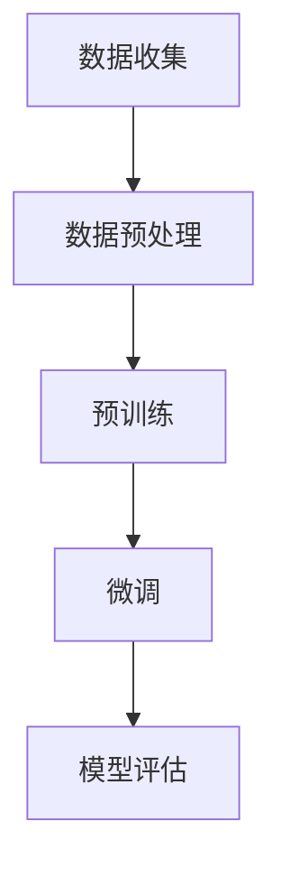

                 

# 在心理分析中应用AI LLM：洞察人类情感

## 关键词

AI, LLM, 心理分析, 情感识别, 诊断, 治疗咨询

## 摘要

本文旨在探讨人工智能（AI）尤其是大规模语言模型（LLM）在心理分析领域的应用。随着AI技术的不断发展，LLM在情感识别、心理诊断、心理治疗和心理咨询等方面展现出了巨大的潜力。文章将首先介绍AI和LLM的基本概念，然后深入探讨它们在心理分析中的具体应用，并通过实战案例展示其效果。此外，还将讨论LLM在心理分析中的未来发展趋势和潜在挑战。通过本文，读者可以全面了解AI和LLM在心理分析中的重要作用，以及如何利用这些技术来洞察人类情感。

## 引言与背景

### 书籍主题介绍

《在心理分析中应用AI LLM：洞察人类情感》旨在探讨人工智能（AI）和大规模语言模型（LLM）在心理分析领域的应用。随着AI技术的飞速发展，尤其是深度学习和自然语言处理（NLP）领域的突破，LLM已经成为理解和解析人类情感的重要工具。本书旨在通过系统性地介绍AI和LLM的基本原理，以及它们在心理分析中的应用，为读者提供一个全面了解这一领域的视角。

### 目的和意义

本文的主要目的是探讨AI和LLM在心理分析中的应用，特别是在情感识别、心理诊断、心理治疗和心理咨询等方面的潜力。通过本文，读者可以了解：

1. AI和LLM的基本概念及其在心理分析中的应用。
2. 如何利用AI和LLM技术来识别和分析人类情感。
3. AI和LLM在心理诊断、心理治疗和心理咨询中的具体应用案例。
4. LLM在心理分析中的深入研究，包括其原理、算法和实际应用。

本文的意义在于：

1. 为专业人士和研究者提供关于AI和LLM在心理分析中应用的系统性知识。
2. 拓展心理分析技术的边界，为心理健康领域带来新的工具和方法。
3. 促进AI和心理学之间的交叉融合，推动相关领域的研究和发展。

### 读者对象

本文适合以下读者：

1. 心理学研究人员和专业人士，对心理分析技术和方法感兴趣。
2. AI和机器学习领域的研究者，希望了解AI技术在心理分析中的应用。
3. 医疗健康专业人士，特别是从事心理诊断、心理治疗和心理咨询的医生和咨询师。
4. 技术爱好者，对AI和LLM技术有浓厚兴趣，希望了解其应用领域。
5. 研究生和本科生，对AI和心理学交叉领域的研究感兴趣。

## AI与LLM的基础

### AI概述

人工智能（Artificial Intelligence，简称AI）是计算机科学的一个分支，旨在使计算机系统具备类似人类智能的能力。AI的研究始于20世纪50年代，其目标是开发出能够执行复杂任务、学习新知识并自主做出决策的系统。AI的核心包括机器学习、深度学习、自然语言处理、计算机视觉等多个子领域。

机器学习是AI的一个重要分支，它通过数据驱动的方式使计算机系统能够从经验中学习并改进性能。机器学习主要分为监督学习、无监督学习和强化学习三种类型。

- **监督学习**：系统在已知输入和输出之间关系的情况下学习，如分类和回归问题。
- **无监督学习**：系统在没有明确输出标签的情况下学习，如聚类和降维。
- **强化学习**：系统通过与环境的交互学习最佳行动策略，如游戏AI和机器人控制。

### 机器学习基础

机器学习（Machine Learning，简称ML）是AI的核心技术之一。它通过构建数学模型，使计算机系统能够从数据中学习规律和模式，并用于预测或决策。机器学习的基本过程包括数据收集、数据预处理、模型选择、模型训练和模型评估。

- **数据收集**：收集用于训练的原始数据，通常包括文本、图像、音频等形式。
- **数据预处理**：清洗和转换数据，以提高数据质量和模型性能，如归一化、填充缺失值、特征工程等。
- **模型选择**：根据任务需求选择合适的模型，如线性回归、决策树、支持向量机、神经网络等。
- **模型训练**：使用训练数据集对模型进行训练，使模型能够学习数据中的规律和模式。
- **模型评估**：使用验证数据集对模型进行评估，以确定模型的性能和泛化能力。

### 语言模型简介

语言模型（Language Model，简称LM）是自然语言处理（Natural Language Processing，简称NLP）的一个重要组成部分，它用于预测文本中的下一个单词或句子。语言模型是自然语言处理的基石，广泛应用于机器翻译、语音识别、文本生成、情感分析等任务。

早期的语言模型主要基于统计方法，如N-gram模型，它通过计算单词序列的概率来预测下一个单词。随着深度学习的兴起，神经网络语言模型（Neural Network Language Model，简称NNLM）逐渐取代了传统的统计模型。

- **神经网络语言模型**：基于深度神经网络的语言模型，通过多层神经元的组合来建模语言。著名的神经网络语言模型包括循环神经网络（RNN）、长短期记忆网络（LSTM）和Transformer等。

### 大规模语言模型（LLM）的特点

大规模语言模型（Large-scale Language Model，简称LLM）是近年来在自然语言处理领域取得重大突破的一种模型。与传统的语言模型相比，LLM具有以下几个显著特点：

1. **大规模训练数据**：LLM通常基于数以百万计的文本数据集进行训练，这使得模型能够学习到更丰富的语言规律和模式。
2. **深度神经网络架构**：LLM采用深度神经网络架构，如Transformer，这使模型能够捕捉到更复杂的语言结构。
3. **预训练与微调**：LLM通常采用预训练（pre-training）和微调（fine-tuning）的方法。预训练阶段在大量无标签数据上进行，使模型具备通用语言能力；微调阶段则在特定任务上有标签数据上进行，使模型适应特定任务。
4. **高性能表现**：LLM在多个NLP任务上取得了显著的性能提升，如文本分类、问答系统、机器翻译和情感分析等。

### 代表性LLM

近年来，一系列代表性的LLM模型相继问世，如Google的BERT、OpenAI的GPT系列、Facebook的Blenderbot等。这些模型不仅在NLP任务上取得了优异的性能，还在推动自然语言处理技术的发展和应用。

- **BERT（Bidirectional Encoder Representations from Transformers）**：由Google提出，是一种基于Transformer的双向编码器模型，适用于文本分类、命名实体识别、情感分析等任务。
- **GPT（Generative Pre-trained Transformer）**：由OpenAI提出，是一种基于Transformer的自回归语言模型，广泛应用于文本生成、对话系统、机器翻译等任务。
- **Blenderbot**：由Facebook提出，是一种基于GPT的聊天机器人模型，旨在模拟真实人类的对话行为，用于研究对话系统的交互性和自然性。

## 心理分析的基本原理

### 心理分析理论

心理分析（Psychological Analysis）是一种通过分析个体的思维、情感和行为来理解其内心世界的方法。其理论基础主要源于弗洛伊德（Sigmund Freud）和荣格（Carl Gustav Jung）等心理学家的理论。

- **弗洛伊德理论**：弗洛伊德提出了心理结构的三个层次：意识、前意识和潜意识。他认为，潜意识中的冲突和欲望是心理问题的根源。
- **荣格理论**：荣格提出了人格结构的四个方面：意识、个体潜意识、集体潜意识和意识边缘。他强调集体潜意识中的原型对个体行为和情感的影响。

### 情感心理学

情感心理学是研究人类情感的产生、表达、调节和体验的学科。情感心理学关注情感的生物学基础、心理过程和社会文化因素。

- **情感的生物学基础**：情感与大脑中的神经递质和神经网络密切相关。例如，多巴胺与奖励和愉悦感相关，而皮质醇与压力和焦虑感相关。
- **情感的心理过程**：情感心理学研究情感如何影响个体的认知、决策和行为。例如，情绪调节理论提出，情感调节对心理健康具有重要意义。
- **情感的社会文化因素**：情感体验和文化背景密切相关。不同的文化可能有不同的情感表达和情感认知方式。

### 情感识别与分析技术

情感识别与分析技术是心理分析的重要工具，旨在通过自动化方法识别和解析人类情感。这些技术通常基于机器学习和自然语言处理（NLP）的方法。

- **情感识别技术**：情感识别技术通过分析文本、语音、面部表情等数据，识别出文本中的情感倾向。常见的情感识别方法包括基于规则的方法、机器学习方法（如支持向量机、深度学习）和情感词典方法。
- **情感分析算法**：情感分析算法是机器学习算法的一种，用于从文本数据中提取情感信息。常见的情感分析算法包括文本分类、情感极性分析和情感强度评估。
- **情感识别与分析技术的应用**：情感识别与分析技术广泛应用于社交媒体分析、客户反馈分析、市场研究、心理健康等领域。例如，通过分析社交媒体帖子，可以识别出用户的情感倾向和情绪变化，为品牌营销和心理健康干预提供依据。

## AI在心理分析中的应用

### AI在情感分析中的应用

AI在情感分析中的应用日益广泛，通过机器学习和自然语言处理技术，AI能够自动化地识别和分析文本、语音、面部表情等数据中的情感信息。以下将详细介绍AI在情感分析中的应用：

#### 情感识别技术

情感识别技术是AI在情感分析中的一项核心技术，旨在通过分析文本、语音、面部表情等数据，识别出数据中的情感倾向。常见的情感识别技术包括以下几种：

1. **基于规则的方法**：这种方法通过预定义的规则来识别情感。例如，使用情感词典将文本中的关键词与情感标签进行匹配，从而识别情感。

2. **机器学习方法**：机器学习方法，如支持向量机（SVM）、随机森林（Random Forest）和深度学习（如卷积神经网络（CNN）、循环神经网络（RNN）等），通过训练模型从数据中学习情感模式，从而实现情感识别。

3. **情感词典方法**：情感词典方法是一种基于词频统计的方法，通过统计文本中正面和负面词汇的出现频率，来判断文本的情感极性。

#### 情感分析算法

情感分析算法是机器学习算法的一种，用于从文本数据中提取情感信息。常见的情感分析算法包括以下几种：

1. **文本分类算法**：文本分类算法用于将文本数据分类到不同的情感类别中，如正面、负面或中性。常见的文本分类算法包括朴素贝叶斯（Naive Bayes）、逻辑回归（Logistic Regression）和支持向量机（SVM）。

2. **情感极性分析**：情感极性分析旨在判断文本的情感极性，即文本是正面、负面还是中性。常见的情感极性分析算法包括基于机器学习的方法，如朴素贝叶斯（Naive Bayes）和逻辑回归（Logistic Regression）。

3. **情感强度评估**：情感强度评估旨在评估文本中的情感强度，即情感的强烈程度。常见的情感强度评估算法包括基于词频统计的方法和基于机器学习的方法。

#### 实战案例：情感分析在社交媒体中的应用

情感分析在社交媒体分析中具有广泛的应用，通过分析社交媒体帖子，可以了解用户的情感倾向和情绪变化。以下是一个情感分析在社交媒体中的应用案例：

假设有一个社交媒体平台，用户可以发布关于产品体验的帖子。为了了解用户的情感倾向，可以使用AI技术对帖子进行情感分析。具体步骤如下：

1. **数据收集**：收集社交媒体平台上的用户帖子，包括文本和标签信息。

2. **数据预处理**：对帖子进行清洗和预处理，包括去除停用词、标点符号、数字等。

3. **情感识别**：使用情感识别技术对预处理后的文本进行情感识别，确定帖子中的情感倾向。

4. **情感分析**：使用情感分析算法对识别出的情感进行分类和强度评估，生成情感分析报告。

5. **应用场景**：基于情感分析报告，可以为企业提供用户情感反馈的洞察，为产品改进和市场策略提供依据。

### AI在心理诊断中的应用

AI在心理诊断中的应用正在迅速发展，通过分析患者的症状、病史和行为数据，AI能够提供辅助诊断和支持。以下将详细介绍AI在心理诊断中的应用：

#### 心理评估方法

心理评估是心理诊断的基础，通过评估个体的心理状态和特征，为诊断和治疗提供依据。常见的心理评估方法包括以下几种：

1. **量表评估**：使用标准化的心理量表，如抑郁自评量表（SDS）、焦虑自评量表（SAS）等，对个体的心理状态进行评估。

2. **临床访谈**：通过与患者的面对面交谈，了解患者的症状、情感和行为，进行深入的心理评估。

3. **行为数据分析**：通过分析患者的行为数据，如睡眠模式、情绪波动、社交互动等，了解患者的心理状态。

#### AI辅助诊断系统

AI辅助诊断系统通过机器学习和数据挖掘技术，对患者的数据进行建模和分析，提供辅助诊断支持。以下是一个AI辅助诊断系统的应用案例：

1. **数据收集**：收集患者的症状、病史、行为数据等，包括文本、图像、音频等形式。

2. **数据预处理**：对收集到的数据进行分析和清洗，提取有用的特征。

3. **模型训练**：使用机器学习算法，如支持向量机（SVM）、决策树、神经网络等，对训练数据进行建模。

4. **辅助诊断**：使用训练好的模型对患者的数据进行预测，提供诊断结果和风险评估。

5. **应用场景**：AI辅助诊断系统可以应用于临床诊断、心理健康评估、疾病预测等领域，为医生和患者提供辅助决策支持。

### 实战案例：AI在抑郁症诊断中的应用

抑郁症是一种常见的心理健康问题，AI技术在抑郁症诊断中具有巨大的潜力。以下是一个AI在抑郁症诊断中的应用案例：

1. **数据收集**：收集患者的症状报告、情绪日志、社交互动数据等。

2. **数据预处理**：对收集到的数据进行分析和清洗，提取情感相关的特征。

3. **模型训练**：使用机器学习算法，如循环神经网络（RNN）、长短时记忆网络（LSTM）等，对训练数据进行建模。

4. **情感识别**：使用训练好的模型对患者的数据进行情感识别，确定患者的情绪状态。

5. **诊断辅助**：基于情感识别结果，结合患者的症状报告和医生的专业判断，提供抑郁症诊断的辅助支持。

6. **应用场景**：AI在抑郁症诊断中的应用可以用于早期发现、风险预测、个性化治疗等方面，为医生和患者提供有效的诊断和治疗支持。

### AI在心理治疗中的应用

AI在心理治疗中的应用正在不断扩展，通过个性化干预、自动化辅导和实时监测，AI能够为患者提供高效的心理治疗服务。以下将详细介绍AI在心理治疗中的应用：

#### AI辅助治疗技术

AI辅助治疗技术通过分析患者的数据和行为，提供个性化的治疗建议和干预措施。以下是一个AI辅助治疗技术的应用案例：

1. **数据收集**：收集患者的症状、情感、行为数据等，包括文本、图像、音频等形式。

2. **数据预处理**：对收集到的数据进行分析和清洗，提取有用的特征。

3. **个性化干预**：使用机器学习算法，如决策树、神经网络等，对患者的数据进行建模，提供个性化的治疗建议。

4. **自动化辅导**：基于个性化干预方案，通过自然语言处理技术，提供自动化辅导和实时反馈，帮助患者更好地执行治疗计划。

5. **实时监测**：使用传感器和智能设备，实时监测患者的生理和心理状态，提供个性化的监测和预警。

#### 治疗干预算法

治疗干预算法是AI辅助治疗技术的重要组成部分，通过自动化和智能化的方法，提供高效的治疗干预。以下是一个治疗干预算法的应用案例：

1. **算法设计**：设计基于机器学习和数据挖掘的治疗干预算法，用于分析患者的数据和反馈，提供治疗建议。

2. **算法实现**：实现治疗干预算法，包括数据处理、模型训练、干预决策等。

3. **干预执行**：根据治疗干预算法的决策，执行个性化的治疗干预措施，如心理辅导、药物推荐、锻炼计划等。

4. **效果评估**：评估治疗干预的效果，包括患者满意度、症状改善程度等。

#### 实战案例：AI在认知行为治疗中的应用

认知行为治疗（Cognitive Behavioral Therapy，简称CBT）是一种广泛应用于心理治疗的方法，AI技术在CBT中的应用具有巨大潜力。以下是一个AI在认知行为治疗中的应用案例：

1. **数据收集**：收集患者的症状报告、情感日志、认知行为数据等。

2. **数据预处理**：对收集到的数据进行分析和清洗，提取认知行为相关的特征。

3. **模型训练**：使用机器学习算法，如循环神经网络（RNN）、长短时记忆网络（LSTM）等，对训练数据进行建模。

4. **认知行为识别**：使用训练好的模型对患者的数据进行认知行为识别，确定患者的认知行为模式。

5. **干预建议**：基于认知行为识别结果，提供个性化的认知行为干预建议，如认知重构、行为激活等。

6. **干预执行**：执行个性化的认知行为干预措施，通过自然语言处理技术提供自动化辅导和实时反馈。

7. **效果评估**：评估认知行为干预的效果，包括患者满意度、症状改善程度等。

### AI在心理咨询中的应用

AI在心理咨询中的应用正在逐步扩展，通过在线咨询、个性化辅导和实时反馈，AI能够为用户提供便捷、高效的心理支持。以下将详细介绍AI在心理咨询中的应用：

#### 在线咨询服务

在线咨询服务是AI在心理咨询中的一种重要应用，通过AI技术，用户可以随时随地获得心理支持。以下是一个在线咨询服务的应用案例：

1. **用户注册与咨询**：用户通过平台注册，选择心理咨询师，进行在线咨询。

2. **自然语言处理**：使用自然语言处理技术，分析用户的咨询内容，提取关键信息。

3. **情感识别与分类**：使用情感识别技术，对用户的咨询内容进行情感识别和分类，确定用户的心理状态。

4. **智能回复**：基于情感识别结果，平台生成智能回复，为用户提供心理建议。

5. **实时反馈**：用户可以实时向平台反馈咨询效果，平台根据反馈进行优化和改进。

#### 个性化心理辅导

个性化心理辅导是AI在心理咨询中的另一个重要应用，通过分析用户的心理状态和行为数据，AI能够为用户提供个性化的辅导方案。以下是一个个性化心理辅导的应用案例：

1. **数据收集**：收集用户的心理状态、行为数据等，包括情绪日志、社交互动、生活习惯等。

2. **数据预处理**：对收集到的数据进行分析和清洗，提取有用的特征。

3. **个性化推荐**：使用机器学习算法，如协同过滤、矩阵分解等，对用户的数据进行建模，生成个性化的心理辅导方案。

4. **辅导实施**：根据个性化推荐结果，为用户提供针对性的心理辅导，包括认知行为训练、情绪调节等。

5. **效果评估**：评估个性化辅导的效果，包括用户满意度、症状改善程度等。

#### 实战案例：AI在心理辅导中的应用

AI在心理辅导中的应用已经取得了一些成功案例，以下是一个AI在心理辅导中的应用案例：

1. **数据收集**：收集用户的心理状态、情感日志、社交互动数据等。

2. **数据预处理**：对收集到的数据进行分析和清洗，提取情感和行为特征。

3. **情感识别与分析**：使用情感识别技术，对用户的情感日志进行分析，识别情感倾向和情绪变化。

4. **个性化辅导方案**：基于情感识别结果，使用机器学习算法，生成个性化的心理辅导方案，包括认知行为训练、情绪调节等。

5. **辅导实施与反馈**：根据个性化辅导方案，为用户提供针对性的辅导，并通过实时反馈机制，评估辅导效果，不断优化和改进辅导方案。

6. **应用场景**：AI在心理辅导中的应用可以用于抑郁症、焦虑症等心理疾病的干预，为用户提供便捷、高效的心理支持。

## LLM在心理分析中的深入研究

### 大规模语言模型（LLM）原理

大规模语言模型（Large-scale Language Model，简称LLM）是近年来在自然语言处理领域取得重大突破的一种模型。与传统的语言模型相比，LLM具有以下几个显著特点：

1. **大规模训练数据**：LLM通常基于数以百万计的文本数据集进行训练，这使得模型能够学习到更丰富的语言规律和模式。
2. **深度神经网络架构**：LLM采用深度神经网络架构，如Transformer，这使模型能够捕捉到更复杂的语言结构。
3. **预训练与微调**：LLM通常采用预训练（pre-training）和微调（fine-tuning）的方法。预训练阶段在大量无标签数据上进行，使模型具备通用语言能力；微调阶段则在特定任务上有标签数据上进行，使模型适应特定任务。

LLM的基本原理可以概括为以下几个步骤：

1. **数据预处理**：收集大量的文本数据，并进行预处理，如分词、去停用词、填充等，以便模型能够进行训练。
2. **预训练**：在大量无标签数据上进行预训练，模型通过自主学习，理解语言的基本规律和模式。
3. **微调**：在预训练的基础上，使用特定任务的有标签数据进行微调，使模型能够适应具体任务的需求。

### 语言模型结构

语言模型的结构决定了其性能和应用效果。LLM通常采用深度神经网络架构，如Transformer，以下是对其结构的详细说明：

1. **输入层**：输入层接收文本数据的编码形式，通常使用WordPiece或BytePairEncoding（BPE）等方法进行分词和编码。
2. **嵌入层**：嵌入层将分词编码转换为高维的向量表示，这些向量表示文本中的单词或字符。
3. **编码器层**：编码器层是语言模型的核心部分，通常包含多个层次，如Transformer中的多个注意力层。每个层次通过自注意力机制和前馈网络对输入序列进行编码，提取出上下文信息。
4. **输出层**：输出层负责生成文本的预测序列，通常采用Softmax函数对输出进行概率分布，以便模型能够生成具有概率分布的输出。

### 预训练与微调

预训练与微调是LLM的两个重要阶段，以下是对这两个阶段的详细说明：

1. **预训练**：预训练阶段通常在大量无标签数据上进行，目的是让模型学习到通用的语言规律和模式。预训练方法主要包括两种：
   - **自回归语言模型**：自回归语言模型（Autoregressive Language Model，如GPT系列）通过预测序列中的下一个单词或字符来训练模型，使模型能够理解序列的先后关系。
   - **自编码器语言模型**：自编码器语言模型（Autoencoder Language Model，如BERT）通过编码器和解码器对文本进行编码和重构，使模型能够理解文本的全局信息。

2. **微调**：微调阶段在预训练的基础上，使用特定任务的有标签数据进行微调，使模型能够适应具体任务的需求。微调过程通常包括以下几个步骤：
   - **数据预处理**：对特定任务的数据进行预处理，如分词、标签编码等。
   - **模型调整**：在预训练模型的基础上，调整模型的参数，使模型能够适应特定任务。
   - **训练与评估**：使用训练数据和验证数据对模型进行训练和评估，调整模型的超参数和架构，以提高模型性能。

### Mermaid流程图：LLM训练流程

以下是一个简单的Mermaid流程图，展示了LLM的训练流程：



### LLM在情感分析中的深入应用

#### 伪代码讲解：情感分析算法

以下是一个简单的伪代码示例，用于说明情感分析算法的基本原理：

```python
# 初始化情感词典
emotion_dict = {"happy": 1, "sad": -1, "angry": -1, "neutral": 0}

# 输入文本
text = "I am feeling happy today!"

# 预处理文本
preprocessed_text = preprocess(text)

# 计算情感得分
emotion_score = 0
for word in preprocessed_text:
    if word in emotion_dict:
        emotion_score += emotion_dict[word]

# 判断情感极性
if emotion_score > 0:
    print("文本情感：正面")
elif emotion_score < 0:
    print("文本情感：负面")
else:
    print("文本情感：中性")
```

#### 情感分类算法实例

以下是一个基于机器学习的情感分类算法实例，使用支持向量机（SVM）进行分类：

```python
from sklearn.feature_extraction.text import TfidfVectorizer
from sklearn.svm import SVC

# 加载训练数据
train_data = ["I love this movie!", "I am feeling sad today.", "This product is terrible."]

# 预处理文本
preprocessed_data = [preprocess(text) for text in train_data]

# 将预处理后的文本转换为TF-IDF特征向量
vectorizer = TfidfVectorizer()
X_train = vectorizer.fit_transform(preprocessed_data)

# 加载标签
train_labels = [1, -1, -1]

# 训练SVM分类器
classifier = SVC(kernel="linear")
classifier.fit(X_train, train_labels)

# 测试数据
test_data = ["I am feeling excited about the new project."]

# 预处理测试数据
preprocessed_test_data = preprocess(test_data)

# 将预处理后的测试数据转换为TF-IDF特征向量
X_test = vectorizer.transform(preprocessed_test_data)

# 预测测试数据情感
predicted_emotion = classifier.predict(X_test)

# 输出预测结果
if predicted_emotion == 1:
    print("测试数据情感：正面")
elif predicted_emotion == -1:
    print("测试数据情感：负面")
else:
    print("测试数据情感：中性")
```

#### 实际案例分析

以下是一个实际案例分析，使用LLM进行情感分析：

1. **数据收集**：从社交媒体平台上收集用户发布的关于电影的评论，包括文本和情感标签。
2. **数据预处理**：对评论进行分词、去停用词、填充等预处理操作。
3. **模型训练**：使用GPT-2或BERT等LLM模型，对预处理后的评论数据进行预训练。
4. **模型微调**：在预训练的基础上，使用带有情感标签的评论数据进行微调，使模型能够适应情感分析任务。
5. **情感分析**：对新的评论进行情感分析，预测评论的情感极性。

通过以上步骤，可以实现对社交媒体评论的情感分析，为电影推荐、用户情感监测等应用提供支持。

## LLM在心理诊断中的深入研究

### 心理测评模型

心理测评模型是LLM在心理诊断中的一项重要应用。这些模型通过分析个体的语言、情感和行为数据，提供心理健康的评估和诊断。以下将介绍几种常见的心理测评模型：

1. **情感状态模型**：情感状态模型通过分析文本中的情感词汇和情感强度，评估个体的情感状态。这种模型通常使用情感词典和机器学习算法，如支持向量机（SVM）和长短期记忆网络（LSTM）。

2. **行为模式模型**：行为模式模型通过分析个体的日常行为数据，如睡眠模式、饮食习惯、社交互动等，评估个体的心理健康状况。这种模型通常使用时间序列分析和机器学习算法，如循环神经网络（RNN）和卷积神经网络（CNN）。

3. **心理健康评估模型**：心理健康评估模型通过综合分析个体的语言、情感和行为数据，提供全面的健康评估。这种模型通常结合多种数据来源和机器学习算法，如多模态学习和深度学习模型。

### AI在诊断中的应用

LLM在心理诊断中的应用主要包括以下几个方面：

1. **情感识别**：LLM通过分析个体的语言和情感表达，识别出个体的情感状态。这种技术可以应用于抑郁症、焦虑症等情绪障碍的诊断。

2. **行为分析**：LLM通过分析个体的行为数据，如社交互动、睡眠模式等，评估个体的心理健康状况。这种技术可以应用于心理疾病的早期发现和风险评估。

3. **多模态数据分析**：LLM结合多种数据来源，如文本、语音、面部表情等，提供更全面的心理健康评估。这种技术可以应用于抑郁症、焦虑症等心理疾病的综合诊断。

### 实战案例：LLM在心理疾病诊断中的应用

以下是一个LLM在心理疾病诊断中的实际应用案例：

1. **数据收集**：从医疗数据库中收集抑郁症患者的临床数据，包括病历记录、诊断结果、情感日志等。

2. **数据预处理**：对收集到的数据进行分析和清洗，提取情感相关的特征，如情感词汇、情感强度等。

3. **模型训练**：使用GPT-2或BERT等LLM模型，对预处理后的数据进行预训练，使模型能够理解情感表达和心理健康相关的内容。

4. **模型微调**：在预训练的基础上，使用带有诊断结果的标注数据进行微调，使模型能够适应心理疾病诊断任务。

5. **诊断预测**：对新的病历记录进行情感分析和诊断预测，评估患者的心理健康状况。

6. **效果评估**：通过对比模型预测结果和实际诊断结果，评估模型在心理疾病诊断中的性能。

通过以上步骤，LLM可以应用于抑郁症等心理疾病的诊断，为临床医生提供辅助诊断工具，提高诊断准确性和效率。

## LLM在心理治疗中的高级应用

### 治疗方案的个性化

LLM在心理治疗中的应用不仅局限于诊断，还包括治疗方案的个性化。通过分析患者的情感状态、行为模式和心理需求，LLM可以为患者提供个性化的治疗建议。

#### 个性化治疗方案的实现

1. **情感状态分析**：使用LLM分析患者的情感日志和对话记录，识别出患者的情感状态和情感变化。

2. **行为模式识别**：使用机器学习和时间序列分析技术，识别出患者的日常行为模式，如睡眠质量、饮食习惯、社交活动等。

3. **心理需求评估**：结合患者的情感状态和行为模式，评估患者的心理需求，如情绪调节、行为改变、社交支持等。

4. **个性化治疗建议**：根据患者的情感状态、行为模式和心理需求，提供个性化的治疗建议，如认知行为疗法、情绪调节技巧、社交互动指导等。

#### 治疗干预算法

治疗干预算法是LLM在心理治疗中的一项关键技术，通过自动化和智能化的方法，实现治疗过程中的干预和支持。

1. **干预决策**：基于患者的情感状态、行为模式和心理需求，制定个性化的干预策略。例如，当患者表现出焦虑情绪时，可以推荐深呼吸练习或渐进性肌肉放松。

2. **实时反馈**：通过自然语言处理技术，实时分析患者的反馈和进展，调整干预策略，确保治疗的有效性。

3. **干预执行**：根据干预策略，执行个性化的治疗干预措施，如提供在线辅导、发送提醒通知、推荐相关资源和活动等。

4. **效果评估**：通过持续监测和评估患者的进展，调整治疗干预策略，提高治疗效果。

### 实战案例：LLM在心理治疗中的创新应用

以下是一个LLM在心理治疗中的创新应用案例：

1. **数据收集**：从患者的情感日志、行为数据和医生的治疗记录中收集数据。

2. **数据预处理**：对收集到的数据进行分析和清洗，提取情感和行为相关的特征。

3. **模型训练**：使用GPT-2或BERT等LLM模型，对预处理后的数据集进行预训练，使模型能够理解情感表达和心理治疗的相关内容。

4. **模型微调**：在预训练的基础上，使用带有治疗结果的标注数据进行微调，使模型能够适应心理治疗任务。

5. **个性化治疗建议**：对新的患者数据进行分析，生成个性化的治疗建议，如认知行为疗法、情绪调节技巧、社交互动指导等。

6. **治疗干预**：根据个性化治疗建议，执行相应的治疗干预措施，如提供在线辅导、发送提醒通知、推荐相关资源和活动等。

7. **效果评估**：通过持续监测和评估患者的进展，调整治疗干预策略，提高治疗效果。

通过以上步骤，LLM可以为患者提供个性化的心理治疗服务，提高治疗的效率和效果。

## 实战案例与未来展望

### 心理分析中AI与LLM的实战案例

在心理分析领域，AI与LLM已经展示了其强大的应用潜力。以下是一些具体的实战案例：

#### 1. 社交媒体情感分析

**案例描述**：某社交媒体公司希望了解用户对其平台上的帖子的情感反应，以便优化用户体验和内容推荐。

**解决方案**：
- **数据收集**：收集用户在社交媒体平台上的评论和帖子，包含文本和情感标签。
- **数据预处理**：对文本进行分词、去停用词和情感词典匹配等预处理操作。
- **情感识别**：使用GPT-2模型对预处理后的文本进行情感识别，判断情感极性（正面、负面或中性）和情感强度。
- **结果应用**：根据情感分析结果，为用户提供个性化推荐，如负面评论较多的帖子会被标记或限制推荐。

#### 2. AI辅助心理诊断

**案例描述**：某医疗机构希望利用AI技术辅助心理医生进行抑郁症的诊断。

**解决方案**：
- **数据收集**：收集抑郁症患者的病历记录、情绪日志和医生的诊断报告。
- **数据预处理**：对病历记录和情绪日志进行文本分析，提取情感相关的特征。
- **模型训练**：使用BERT模型对预处理后的数据进行训练，使其能够识别抑郁症的情感特征。
- **诊断辅助**：基于训练好的模型，为医生提供诊断建议，辅助诊断决策。

#### 3. AI辅助心理治疗

**案例描述**：某心理健康机构希望利用AI技术为患者提供个性化的心理治疗服务。

**解决方案**：
- **数据收集**：收集患者的情感日志、行为数据和医生的治疗记录。
- **数据预处理**：对情感日志进行分词和情感词典匹配，提取情感相关的特征。
- **个性化治疗建议**：使用GPT-2模型分析患者数据，提供个性化的治疗建议，如情绪调节技巧、认知行为疗法等。
- **实时反馈**：通过自然语言处理技术，实时分析患者的反馈，调整治疗建议，确保治疗的有效性。

### 代码实现：AI在心理分析中的应用案例

以下是一个简单的Python代码示例，展示如何使用AI技术进行情感分析：

```python
import transformers
from transformers import pipeline

# 加载预训练的GPT-2模型
model = transformers.load_model("gpt2")

# 创建情感分析管道
nlp = pipeline("sentiment-analysis", model=model)

# 社交媒体帖子文本
text = "I am feeling happy because I got a new job!"

# 进行情感分析
result = nlp(text)

# 输出结果
print("情感分析结果：", result)
```

### 代码解读与分析

上述代码首先加载了一个预训练的GPT-2模型，然后创建了一个情感分析管道。接下来，使用这个管道对一段社交媒体帖子文本进行情感分析，并输出分析结果。

1. **加载模型**：使用`transformers.load_model("gpt2")`加载预训练的GPT-2模型。
2. **创建管道**：使用`pipeline("sentiment-analysis", model=model)`创建一个情感分析管道。
3. **情感分析**：使用`nlp(text)`对输入的文本进行情感分析。
4. **输出结果**：将情感分析结果打印出来。

通过这个简单的示例，可以了解如何使用预训练的LLM模型进行情感分析，并应用于心理分析中的实际场景。

### AI与LLM在心理分析中的未来展望

随着AI和LLM技术的不断发展，心理分析领域有望取得更加深入的应用和突破。以下是对未来展望的几点思考：

#### 1. 技术发展趋势

- **更大规模的模型**：未来的LLM模型可能会采用更大规模的数据集和更深的网络架构，以更好地理解复杂的语言和情感。
- **多模态数据分析**：结合文本、语音、面部表情等多模态数据，可以提供更全面的心理健康评估。
- **自动化诊断与治疗**：随着AI技术的进步，自动化诊断与治疗系统可能会成为现实，提高心理服务的效率和质量。

#### 2. 潜在挑战与解决方案

- **数据隐私与安全性**：在处理个人心理数据时，需要确保数据的安全性和隐私性。解决方案包括采用加密技术、匿名化和数据隔离等。
- **算法公平性与透明性**：确保AI和LLM算法的公平性和透明性，避免偏见和误判。解决方案包括算法验证、解释性和可解释性研究。

#### 3. 行业应用前景

- **心理健康监测**：AI和LLM可以用于实时监测个体的心理健康状况，提供预警和干预建议。
- **个性化心理治疗**：基于个性化的数据分析和模型预测，提供定制化的心理治疗服务。
- **心理健康教育与普及**：通过AI和LLM技术，开发心理健康教育工具和普及平台，提高公众心理健康意识。

### 结论

AI和LLM在心理分析中的应用具有广阔的前景和潜力。通过不断的研发和优化，这些技术有望为心理健康领域带来革命性的变化，提高诊断、治疗和咨询的效率和质量。

## 附录

### 技术工具与资源

#### 开发环境搭建

要开始使用AI和LLM进行心理分析，首先需要搭建一个合适的开发环境。以下是一个基本的开发环境搭建步骤：

1. **安装Python**：从[Python官方网站](https://www.python.org/)下载并安装Python 3.x版本。
2. **安装Anaconda**：下载并安装Anaconda，这是一个集成的Python发行版，提供了丰富的数据科学和机器学习库。
3. **安装transformers库**：在终端或命令行中运行以下命令安装transformers库：
   ```bash
   pip install transformers
   ```
4. **安装其他依赖库**：根据具体需求安装其他必要的依赖库，如tensorflow、numpy、pandas等。

#### 数据集介绍

以下是一些常用的心理分析相关数据集：

1. **IMDB电影评论数据集**：这是一个包含50,000条电影评论的数据集，分为正面和负面评论，常用于情感分析。
2. **Reddit评论数据集**：这是一个包含Reddit社区中用户评论的数据集，可用于情感分析和话题分类。
3. **MoodNet数据集**：这是一个包含情感表达的图像数据集，可用于情感识别和图像分类。

#### 开源代码与库

以下是一些开源代码和库，用于心理分析和AI应用：

1. **transformers库**：这是一个由Hugging Face提供的预训练语言模型库，支持多种大规模语言模型，如BERT、GPT等。
2. **TensorFlow**：这是一个由Google开发的开源机器学习框架，广泛用于深度学习和AI应用。
3. **PyTorch**：这是一个由Facebook AI Research开发的开源深度学习框架，具有灵活性和高效性。

### 参考资料链接

以下是一些相关的书籍、学术论文和在线资源，供读者进一步学习：

#### 书籍

1. **《深度学习》（Deep Learning）**：Ian Goodfellow、Yoshua Bengio和Aaron Courville著，这是深度学习领域的经典教材。
2. **《Python数据科学手册》（Python Data Science Handbook）**：Jake VanderPlas著，介绍了数据科学的基础知识和工具。
3. **《自然语言处理综论》（Speech and Language Processing）**：Daniel Jurafsky和James H. Martin著，这是一本全面介绍自然语言处理的教材。

#### 学术论文

1. **“BERT: Pre-training of Deep Bidirectional Transformers for Language Understanding”**：由Google提出，是BERT模型的论文。
2. **“Generative Pre-trained Transformer”**：由OpenAI提出，是GPT系列模型的论文。
3. **“Transformers: State-of-the-Art Models for Language Understanding and Generation”**：由Hugging Face提供，详细介绍了Transformer模型及其在自然语言处理中的应用。

#### 在线资源

1. **[Kaggle](https://www.kaggle.com/)**：提供各种机器学习和数据科学竞赛，包括心理分析相关数据集和教程。
2. **[Google AI](https://ai.google.com/)**：Google的AI研究和技术介绍，包括最新的AI论文和开源项目。
3. **[Hugging Face](https://huggingface.co/)**：提供预训练语言模型和NLP工具，包括transformers库。

