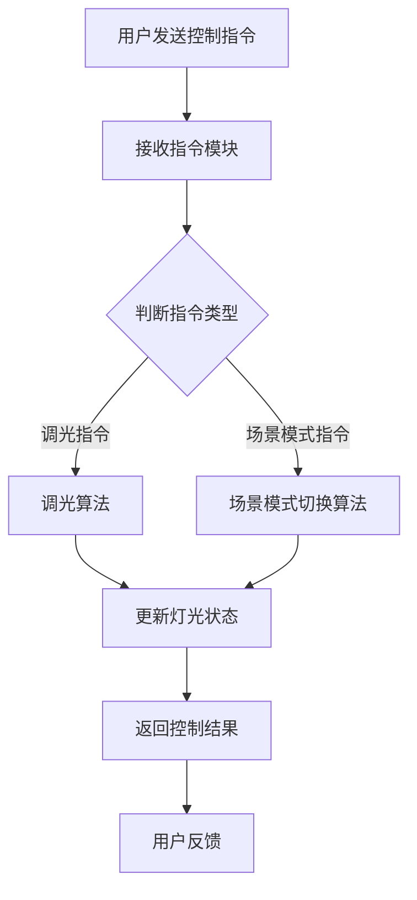

                 

# 基于Java的智能家居设计：一步步构建您的第一个智能灯光控制系统

> **关键词**：智能家居、Java、智能灯光控制、系统设计、算法原理、硬件搭建、项目实战、扩展功能

> **摘要**：本文将深入探讨基于Java语言的智能家居设计，以构建一个智能灯光控制系统为例，通过逐步分析、推理和实现，让读者全面了解智能家居的开发过程，从技术原理到实际应用。文章涵盖了智能家居的定义、Java语言基础、智能灯光控制系统设计、核心算法原理、软件实现、硬件搭建以及项目实战，为智能家居开发者提供了系统、实用的指导。

## 引言

### 第1章：智能家居概述

#### 1.1 智能家居的定义与重要性

智能家居是指利用物联网技术、云计算、人工智能等技术，将家庭中的各种设备互联互通，实现远程控制、自动化管理，提升家庭生活品质和舒适度的智能系统。随着科技的进步和人们生活水平的提高，智能家居已经成为现代家庭生活的重要组成部分。

智能家居的重要性主要体现在以下几个方面：

1. **提升生活品质**：通过智能家居系统，用户可以远程控制家中的各种设备，如灯光、空调、安防等，实现一键操作，节省时间和精力。
2. **提高家庭安全性**：智能家居系统可以实时监测家庭环境，如燃气泄漏、火灾等，及时发出警报，保障家庭安全。
3. **节能环保**：智能家居系统能够根据用户的生活习惯和需求，自动调节家中的能耗设备，如空调、照明等，降低能耗，实现节能减排。

#### 1.2 智能家居的市场现状与发展趋势

随着5G技术的普及和人工智能的快速发展，智能家居市场呈现出爆发式增长。根据相关数据显示，全球智能家居市场规模预计将在未来几年内达到数千亿美元。在我国，智能家居市场也在快速崛起，众多企业纷纷布局智能家居领域，推出各类智能产品。

发展趋势方面，智能家居将呈现出以下特点：

1. **集成化**：智能家居系统将逐渐实现各子系统之间的无缝集成，提供更加统一和便捷的用户体验。
2. **智能化**：人工智能技术将更加深入地应用于智能家居系统，实现更加智能化的家居管理和控制。
3. **个性化和定制化**：智能家居系统将根据用户的需求和习惯，提供更加个性化和定制化的服务。

#### 1.3 智能家居的核心技术

智能家居的核心技术主要包括物联网技术、云计算技术、人工智能技术等。

1. **物联网技术**：物联网技术是实现智能家居设备互联互通的基础，通过无线传感器、网络传输等技术，实现设备间的数据交换和协同工作。
2. **云计算技术**：云计算技术为智能家居系统提供了强大的数据处理和存储能力，可以实现大规模数据的实时分析和处理。
3. **人工智能技术**：人工智能技术可以实现对智能家居设备的智能控制，如自动调节空调温度、自动切换灯光模式等。

### 第2章：Java语言基础

#### 2.1 Java基础语法

Java是一种面向对象的编程语言，具有简单、高效、安全等特点。Java基础语法包括变量、数据类型、运算符、控制结构等。

1. **变量**：变量是编程中用来存储数据的容器，Java中的变量分为基本数据类型和引用数据类型。
2. **数据类型**：Java中的数据类型包括基本数据类型（如int、float、char等）和引用数据类型（如String、Array等）。
3. **运算符**：Java中的运算符包括算术运算符、逻辑运算符、关系运算符等。
4. **控制结构**：Java中的控制结构包括条件语句（if-else、switch-case）、循环语句（for、while、do-while）等。

#### 2.2 面向对象编程

面向对象编程是Java的核心思想，通过封装、继承、多态等特性，实现代码的重用和模块化。

1. **封装**：封装是将数据和操作数据的方法封装在一起，隐藏内部实现细节，保护数据的安全性和完整性。
2. **继承**：继承是子类继承父类的属性和方法，实现代码的复用和扩展。
3. **多态**：多态是同一操作作用于不同的对象，产生不同的执行结果，实现代码的灵活性和扩展性。

#### 2.3 Java常用类库

Java类库是Java语言的重要组成部分，提供了丰富的类和接口，方便开发者进行编程。

1. **java.lang**：java.lang包是Java的核心包，包含了Java运行时环境的基本类，如String、System等。
2. **java.util**：java.util包提供了常用的实用类，如List、Map、Set等，用于数据结构和集合操作。
3. **java.net**：java.net包提供了网络编程相关的类和接口，如Socket、URL等，用于实现网络通信。

### 第二部分：智能灯光控制系统设计

#### 第3章：智能灯光控制系统的原理与架构

##### 3.1 智能灯光控制系统的定义

智能灯光控制系统是指通过物联网技术和人工智能技术，实现对家庭中灯光设备的智能控制，包括开关控制、调光控制、场景模式切换等。

##### 3.2 系统架构设计

智能灯光控制系统的架构设计主要包括硬件层、通信层、控制层和应用层。

1. **硬件层**：硬件层主要包括传感器、控制器、灯光设备等，用于感知家庭环境和控制灯光设备。
2. **通信层**：通信层主要包括无线通信模块（如Wi-Fi、蓝牙等）和有线通信模块（如以太网、光纤等），用于实现设备间的数据传输和通信。
3. **控制层**：控制层主要包括智能控制算法、控制逻辑和用户界面等，用于实现对灯光设备的智能控制和用户交互。
4. **应用层**：应用层主要包括智能家居平台、移动应用和Web应用等，用于实现远程控制和自动化管理。

##### 3.3 Mermaid流程图：智能灯光控制系统工作流程



#### 第4章：核心算法原理讲解

##### 4.1 调光算法

调光算法用于实现灯光亮度的实时调整，根据用户的需求，实现灯光亮度的增减。

1. **线性调光算法**：线性调光算法是一种简单的调光算法，通过线性关系调整灯光亮度。其伪代码如下：

```plaintext
function linearDimming(currentBrightness, targetBrightness, stepSize) {
    while (currentBrightness != targetBrightness) {
        if (currentBrightness > targetBrightness) {
            currentBrightness -= stepSize;
        } else {
            currentBrightness += stepSize;
        }
        delay(100); // 延迟以模拟实际调光过程
    }
    return currentBrightness;
}
```

2. **数学模型与公式**：线性调光算法的数学模型可以表示为：

$$
\text{亮度变化率} = \frac{\text{目标亮度} - \text{当前亮度}}{\text{调光步长}}
$$

##### 4.2 场景模式切换算法

场景模式切换算法用于根据用户的需求，切换不同的灯光模式，实现灯光场景的切换。

1. **伪代码**：场景模式切换算法的伪代码如下：

```plaintext
function switchScene(currentScene, targetScene) {
    for (each light in sceneLights) {
        if (targetScene.hasLight(light)) {
            light.turnOn();
        } else {
            light.turnOff();
        }
    }
    return true;
}
```

2. **数学模型与公式**：场景模式切换的数学模型可以表示为：

$$
\text{场景模式切换} = \text{当前场景} \rightarrow \text{目标场景}
$$

#### 第5章：智能灯光控制系统的软件实现

##### 5.1 系统软件需求分析

智能灯光控制系统的软件需求包括以下几个方面：

1. **用户界面**：提供友好的用户界面，方便用户进行灯光控制和场景切换。
2. **控制逻辑**：实现智能灯光控制的核心算法，包括调光算法和场景模式切换算法。
3. **数据存储**：实现用户数据和设备状态的存储，包括用户设置、场景模式、设备状态等。
4. **通信协议**：实现与硬件设备之间的通信协议，包括Wi-Fi、蓝牙等。

##### 5.2 功能模块设计

智能灯光控制系统的功能模块设计包括以下几个方面：

1. **用户界面模块**：实现用户界面的设计，包括首页、设置页面、设备列表等。
2. **控制模块**：实现灯光控制的核心算法，包括调光算法和场景模式切换算法。
3. **数据存储模块**：实现用户数据和设备状态的存储，包括用户设置、场景模式、设备状态等。
4. **通信模块**：实现与硬件设备之间的通信协议，包括Wi-Fi、蓝牙等。

##### 5.3 源代码实现

智能灯光控制系统的源代码实现包括以下几个方面：

1. **主程序设计**：实现系统的启动和运行，包括初始化模块、加载用户数据等。
2. **调光模块**：实现灯光亮度的实时调整，包括线性调光算法的实现。
3. **场景切换模块**：实现灯光场景的切换，包括场景模式切换算法的实现。

##### 5.3.1 主程序设计

```java
public class SmartLightSystem {
    public static void main(String[] args) {
        // 初始化模块
        System.initialize();
        
        // 加载用户数据
        System.loadUserData();
        
        // 启动用户界面
        System.startUserInterface();
    }
}
```

##### 5.3.2 调光模块

```java
public class DimmingModule {
    public static void dimming(int currentBrightness, int targetBrightness, int stepSize) {
        while (currentBrightness != targetBrightness) {
            if (currentBrightness > targetBrightness) {
                currentBrightness -= stepSize;
            } else {
                currentBrightness += stepSize;
            }
            LightControl.turnBrightness(currentBrightness);
            try {
                Thread.sleep(100); // 延迟以模拟实际调光过程
            } catch (InterruptedException e) {
                e.printStackTrace();
            }
        }
    }
}
```

##### 5.3.3 场景切换模块

```java
public class SceneSwitchingModule {
    public static void switchScene(Scene currentScene, Scene targetScene) {
        for (Light light : currentScene.getLights()) {
            if (targetScene.hasLight(light)) {
                LightControl.turnOn(light);
            } else {
                LightControl.turnOff(light);
            }
        }
    }
}
```

#### 第6章：智能灯光控制系统的硬件搭建

##### 6.1 硬件需求分析

智能灯光控制系统的硬件需求主要包括以下几个方面：

1. **传感器**：用于感知环境光强、温度等，为灯光控制提供数据支持。
2. **控制器**：用于接收用户指令，控制灯光设备的开关和亮度。
3. **灯光设备**：用于实现灯光控制，包括开关、调光模块等。
4. **通信模块**：用于实现与智能家居平台的通信，如Wi-Fi、蓝牙等。

##### 6.2 硬件选型

根据智能灯光控制系统的需求，选择合适的硬件设备，包括传感器、控制器、灯光设备和通信模块。以下是硬件选型的参考：

1. **传感器**：可以选择光敏传感器、温度传感器等，用于感知环境变化。
2. **控制器**：可以选择基于ARM架构的单片机，如STM32等，用于接收用户指令和控制灯光设备。
3. **灯光设备**：可以选择LED灯泡、LED灯带等，用于实现灯光控制。
4. **通信模块**：可以选择Wi-Fi模块、蓝牙模块等，用于实现与智能家居平台的通信。

##### 6.3 硬件连接与调试

智能灯光控制系统的硬件连接与调试包括以下几个方面：

1. **硬件连接**：将传感器、控制器、灯光设备和通信模块按照设计方案进行连接，确保硬件电路的连通性和稳定性。
2. **通信调试**：通过通信模块与智能家居平台进行通信调试，确保数据的正常传输和接收。
3. **功能调试**：对传感器、控制器、灯光设备进行功能调试，确保系统能够正常工作，满足用户需求。

#### 第7章：项目实战：构建智能灯光控制系统

##### 7.1 实战目标

本项目将通过Java语言，构建一个智能灯光控制系统，实现以下功能：

1. **用户界面**：提供友好的用户界面，方便用户进行灯光控制和场景切换。
2. **灯光控制**：实现灯光亮度的实时调整和场景模式切换。
3. **数据存储**：实现用户数据和设备状态的存储。
4. **远程控制**：实现通过移动应用或Web应用进行远程控制。

##### 7.2 开发环境搭建

为了构建智能灯光控制系统，需要搭建以下开发环境：

1. **Java开发环境**：安装Java开发工具包（JDK），并配置环境变量。
2. **集成开发环境（IDE）**：可以选择Eclipse、IntelliJ IDEA等，用于编写和调试Java代码。
3. **数据库**：可以选择MySQL、SQLite等，用于存储用户数据和设备状态。
4. **移动应用开发工具**：可以选择Android Studio，用于开发移动应用。
5. **Web应用开发工具**：可以选择Apache Tomcat、Nginx等，用于部署Web应用。

##### 7.3 源代码详细实现与解读

在本项目实战中，我们将使用Java语言实现智能灯光控制系统的核心功能。以下是源代码的详细实现与解读：

1. **用户界面模块**：实现用户界面的设计，包括首页、设置页面、设备列表等。

```java
// UserInterface.java
public class UserInterface {
    // 实现用户界面的功能，包括显示设备列表、灯光控制、场景切换等
}
```

2. **控制模块**：实现灯光控制的核心算法，包括调光算法和场景模式切换算法。

```java
// ControlModule.java
public class ControlModule {
    // 实现灯光控制的算法，包括调光算法和场景模式切换算法
}
```

3. **数据存储模块**：实现用户数据和设备状态的存储，包括用户设置、场景模式、设备状态等。

```java
// DataStorageModule.java
public class DataStorageModule {
    // 实现数据存储的功能，包括用户设置、场景模式、设备状态的存储
}
```

4. **通信模块**：实现与硬件设备之间的通信协议，包括Wi-Fi、蓝牙等。

```java
// CommunicationModule.java
public class CommunicationModule {
    // 实现与硬件设备之间的通信协议，包括Wi-Fi、蓝牙等
}
```

##### 7.4 系统测试与优化

在系统开发完成后，需要进行系统测试和优化，确保系统能够稳定运行，满足用户需求。系统测试包括以下方面：

1. **功能测试**：测试系统的各项功能是否正常，包括用户界面、灯光控制、场景切换等。
2. **性能测试**：测试系统的性能指标，如响应时间、并发处理能力等。
3. **兼容性测试**：测试系统在不同操作系统、不同硬件设备上的兼容性。
4. **安全性测试**：测试系统的安全性，如用户数据保护、恶意攻击防护等。

通过系统测试和优化，可以不断提升系统的稳定性和性能，为用户提供更好的使用体验。

### 第三部分：扩展与展望

#### 第8章：智能灯光控制系统的扩展功能

##### 8.1 远程控制

远程控制是智能家居系统的重要功能之一，用户可以通过手机、平板电脑等移动设备，随时随地控制家中的灯光设备。实现远程控制的关键技术包括Wi-Fi、蓝牙等无线通信技术，以及移动应用开发和Web应用开发。

##### 8.2 节能策略

智能灯光控制系统可以结合用户的生活习惯和需求，实现节能策略。例如，根据用户的作息时间自动调节灯光亮度，降低能耗；根据室内光线强度自动调整灯光开关，避免不必要的能耗。

##### 8.3 个性化设置

个性化设置是智能家居系统的重要功能，用户可以根据自己的需求和喜好，自定义灯光场景和模式。例如，用户可以创建不同的灯光场景，如阅读模式、观影模式、睡眠模式等，以满足不同的使用场景。

#### 第9章：智能家居系统的未来趋势

##### 9.1 物联网技术的融合

物联网技术是智能家居系统的重要组成部分，未来智能家居系统将更加融合物联网技术，实现设备间的互联互通，提供更加智能、便捷的用户体验。

##### 9.2 人工智能在智能家居中的应用

人工智能技术将更加深入地应用于智能家居系统，实现智能语音识别、智能决策、智能推荐等功能，提升系统的智能化水平。

##### 9.3 智能家居系统的发展方向

未来智能家居系统将朝着更加智能化、个性化、定制化的方向发展，通过技术创新和用户体验的提升，不断满足用户的需求。

### 附录

##### 10.1 常用技术资源

为了帮助读者更好地学习和实践智能家居系统，以下是一些常用的技术资源：

- **Java编程资源**：[Java官方文档](https://docs.oracle.com/javase/8/docs/api/)
- **物联网技术资源**：[物联网基础](https://www.iotab.com/)
- **移动应用开发资源**：[Android官方文档](https://developer.android.com/)
- **Web应用开发资源**：[Apache Tomcat官方文档](https://tomcat.apache.org/tomcat-9.0-doc/config/http.html)

##### 10.2 开发工具介绍

为了方便读者进行智能家居系统的开发，以下是一些常用的开发工具：

- **Java开发工具**：[Eclipse](https://www.eclipse.org/)
- **移动应用开发工具**：[Android Studio](https://developer.android.com/studio)
- **Web应用开发工具**：[Apache Tomcat](https://tomcat.apache.org/)

##### 10.3 未来技术展望

随着科技的不断发展，智能家居系统将迎来更加广阔的发展空间。未来，智能家居系统将更加智能化、个性化、定制化，为用户提供更加优质的生活体验。同时，物联网技术、人工智能技术、大数据技术等将在智能家居系统中得到更加广泛的应用，推动智能家居系统的持续创新和发展。

---

**作者：AI天才研究院/AI Genius Institute & 禅与计算机程序设计艺术 /Zen And The Art of Computer Programming**

