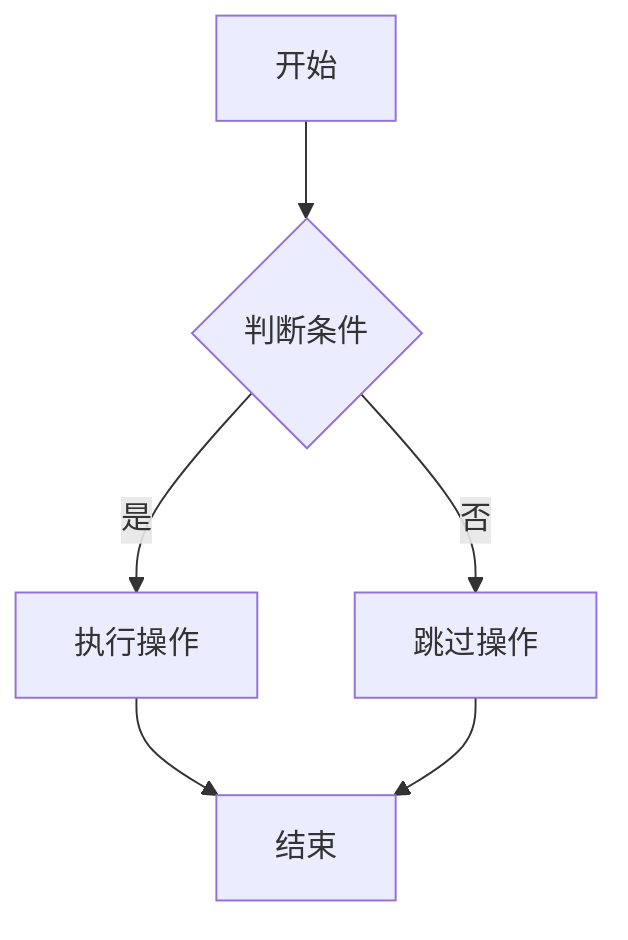

                 

# 基于Java的智能家居设计：如何使用MQTT协议实现设备通讯

> 关键词：智能家居, MQTT协议, Java编程, 设备通讯, 安全设计

> 摘要：本文旨在探讨如何利用Java编程语言和MQTT协议实现智能家居系统的设计。文章首先介绍了智能家居系统的基本概念和架构，然后深入讲解了MQTT协议的工作原理和特点，随后介绍了Java编程语言的基础知识。在此基础上，本文详细阐述了如何在Java中应用MQTT协议进行设备通讯，并提供了具体的代码实例。最后，本文还探讨了智能家居系统的安全设计，以及MQTT协议的安全机制。

## 《基于Java的智能家居设计：如何使用MQTT协议实现设备通讯》目录大纲

## 第一部分: 智能家居设计与MQTT协议概述

### 第1章: 智能家居系统概述

#### 1.1 智能家居的定义与发展

#### 1.2 智能家居系统架构

#### 1.3 MQTT协议的基本原理

### 第2章: MQTT协议深入解析

#### 2.1 MQTT协议的特点与优势

#### 2.2 MQTT协议的工作机制

#### 2.3 MQTT协议消息类型详解

### 第3章: Java编程基础

#### 3.1 Java语言概述

#### 3.2 Java基本语法

#### 3.3 Java面向对象编程

### 第4章: MQTT协议在Java中的应用

#### 4.1 Java MQTT客户端库介绍

#### 4.2 MQTT客户端代码实例

#### 4.3 MQTT服务器端代码实例

## 第二部分: 基于Java的智能家居设计

### 第5章: 智能家居设备通信协议设计

#### 5.1 设备通信协议概述

#### 5.2 MQTT协议在智能家居中的应用

#### 5.3 设备通信协议实现

### 第6章: 智能家居系统功能设计

#### 6.1 系统架构设计

#### 6.2 系统功能模块设计

#### 6.3 功能实现与测试

### 第7章: MQTT协议在智能家居系统中的应用实例

#### 7.1 系统搭建与配置

#### 7.2 设备接入与通信

#### 7.3 系统功能实现与优化

## 第三部分: MQTT协议与智能家居安全

### 第8章: MQTT协议安全机制

#### 8.1 MQTT协议安全性概述

#### 8.2 安全机制实现

#### 8.3 安全策略与建议

### 第9章: 智能家居系统安全设计

#### 9.1 安全威胁分析

#### 9.2 安全防护措施

#### 9.3 安全测试与评估

## 附录

### 附录A: MQTT协议与Java编程参考资源

#### A.1 MQTT协议文档与资源

#### A.2 Java MQTT客户端库资源

#### A.3 智能家居系统开发工具与资源

### 附录B: Mermaid流程图与伪代码示例

#### B.1 Mermaid流程图示例

#### B.2 MQTT客户端伪代码示例

#### B.3 智能家居系统功能模块伪代码示例

## 第一部分: 智能家居设计与MQTT协议概述

### 第1章: 智能家居系统概述

#### 1.1 智能家居的定义与发展

智能家居是指通过物联网技术将家庭中的各种设备连接起来，实现智能化的管理和控制。随着物联网技术的快速发展，智能家居已经逐渐成为现代家庭的重要组成部分。智能家居系统的发展经历了多个阶段，从最初的简单设备控制，到现在的智能交互、数据分析、自主决策，智能家居系统越来越智能化和个性化。

#### 1.2 智能家居系统架构

智能家居系统通常由以下几个部分组成：

1. **感知层**：包括各种传感器，如温度传感器、湿度传感器、光照传感器、运动传感器等，用于感知环境变化。
2. **网络层**：包括通信网络，如Wi-Fi、蓝牙、ZigBee等，用于传输传感器数据和设备控制指令。
3. **平台层**：包括智能家居控制平台，如手机APP、Web端等，用于展示数据和提供控制接口。
4. **应用层**：包括各种智能家居应用，如智能照明、智能安防、智能家电等，实现具体的功能。

#### 1.3 MQTT协议的基本原理

MQTT（Message Queuing Telemetry Transport）协议是一种轻量级的消息传输协议，适用于物联网环境。它具有以下基本原理：

1. **发布/订阅模型**：MQTT协议使用发布/订阅模型进行消息传递。发布者（Publisher）将消息发布到特定的主题（Topic），订阅者（Subscriber）可以订阅这些主题，从而接收到相应的消息。
2. **轻量级协议**：MQTT协议的报文格式简单，数据传输效率高，适用于带宽有限、网络不稳定的环境。
3. **持久连接**：MQTT协议支持持久连接，即使网络中断，发布者和订阅者也可以重新连接，确保消息不被丢失。

### 第2章: MQTT协议深入解析

#### 2.1 MQTT协议的特点与优势

MQTT协议具有以下特点与优势：

1. **轻量级**：MQTT协议的报文格式简单，传输效率高，适用于带宽有限、网络不稳定的环境。
2. **可靠性**：MQTT协议支持持久连接，即使网络中断，发布者和订阅者也可以重新连接，确保消息不被丢失。
3. **低延迟**：MQTT协议的消息传输延迟较低，适用于实时性要求较高的场景。
4. **安全性**：MQTT协议支持SSL/TLS加密，确保数据传输的安全性。

#### 2.2 MQTT协议的工作机制

MQTT协议的工作机制包括以下几个步骤：

1. **连接**：发布者和订阅者首先需要连接到MQTT服务器。
2. **订阅**：订阅者向MQTT服务器订阅特定的主题。
3. **发布**：发布者将消息发布到订阅者订阅的主题。
4. **接收**：订阅者接收并处理发布者发布的消息。

#### 2.3 MQTT协议消息类型详解

MQTT协议支持三种类型的消息：

1. **QoS 0**：最多一次（At Most Once）。消息发布后，服务器不会保证消息被订阅者接收，也不会重传消息。
2. **QoS 1**：至少一次（At Least Once）。消息发布后，服务器会确保消息至少被订阅者接收一次，但不会保证消息顺序。
3. **QoS 2**：精确一次（Exactly Once）。消息发布后，服务器会确保消息被订阅者接收且顺序正确，但性能较差。

### 第3章: Java编程基础

#### 3.1 Java语言概述

Java是一种广泛使用的编程语言，具有跨平台、面向对象、安全性等特点。Java的主要特点包括：

1. **跨平台**：Java程序可以在任何支持Java虚拟机（JVM）的操作系统上运行。
2. **面向对象**：Java支持面向对象的编程范式，包括类、对象、继承、多态等概念。
3. **安全性**：Java提供了强大的安全机制，包括权限控制、加密等。

#### 3.2 Java基本语法

Java的基本语法包括：

1. **关键字**：Java有50多个关键字，用于定义变量、类、方法等。
2. **标识符**：标识符用于命名类、变量、方法等，命名规则严格。
3. **数据类型**：Java有基本数据类型和引用数据类型，用于表示不同类型的数据。
4. **运算符**：Java支持各种运算符，包括算术运算符、逻辑运算符、位运算符等。

#### 3.3 Java面向对象编程

Java的面向对象编程包括以下几个概念：

1. **类与对象**：类是对象的模板，对象是类的实例。
2. **继承**：继承是一种创建新类的技术，新类继承原有类的属性和方法。
3. **多态**：多态是指同一操作作用于不同的对象时可以有不同的解释和行为。

### 第4章: MQTT协议在Java中的应用

#### 4.1 Java MQTT客户端库介绍

在Java中，可以使用多个MQTT客户端库来处理MQTT协议。常见的Java MQTT客户端库包括：

1. **Eclipse Paho MQTT**：Eclipse Paho MQTT是一个开源的MQTT客户端库，支持Java和JavaScript语言。
2. **MQTTClient-Java**：MQTTClient-Java是一个简单的Java MQTT客户端库，适用于嵌入式系统和资源受限的环境。

#### 4.2 MQTT客户端代码实例

以下是一个简单的Java MQTT客户端代码实例：

```java
import org.eclipse.paho.client.mqttv3.*;

public class MqttClientExample {
    public static void main(String[] args) {
        String brokerUrl = "tcp://localhost:1883";
        String clientId = "JavaMQTTClient";
        String topic = "my/topic";

        try {
            MqttClient client = new MqttClient(brokerUrl, clientId);
            MqttConnectOptions options = new MqttConnectOptions();
            options.setCleanSession(true);
            client.connect(options);

            MqttTopic mqttTopic = client.getTopic(topic);
            MqttMessage message = new MqttMessage();
            message.setPayload("Hello MQTT!".getBytes());

            mqttTopic.publish(message);

            client.disconnect();
        } catch (MqttException e) {
            e.printStackTrace();
        }
    }
}
```

#### 4.3 MQTT服务器端代码实例

以下是一个简单的Java MQTT服务器端代码实例：

```java
import org.eclipse.paho.server.MqttServer;
import org.eclipse.paho.server.MqttServerConfig;

public class MqttServerExample {
    public static void main(String[] args) {
        try {
            MqttServer server = new MqttServer();
            MqttServerConfig config = new MqttServerConfig();
            config.setHost("0.0.0.0", 1883);
            server.setServerConfig(config);
            server.start();
            System.out.println("MQTT服务器启动成功！");
        } catch (Exception e) {
            e.printStackTrace();
        }
    }
}
```

## 第二部分: 基于Java的智能家居设计

### 第5章: 智能家居设备通信协议设计

#### 5.1 设备通信协议概述

智能家居设备通信协议是指用于设备之间进行数据传输和交互的规范。选择合适的通信协议对于智能家居系统的稳定性和可靠性至关重要。常见的智能家居设备通信协议包括：

1. **Wi-Fi**：Wi-Fi协议是一种无线通信协议，适用于传输距离较近、网络环境稳定的场景。
2. **蓝牙**：蓝牙协议是一种短距离通信协议，适用于设备之间的近距离通信。
3. **ZigBee**：ZigBee协议是一种低功耗、低速率的无线通信协议，适用于智能家居设备之间的远程通信。
4. **MQTT**：MQTT协议是一种轻量级的消息传输协议，适用于物联网环境。

#### 5.2 MQTT协议在智能家居中的应用

MQTT协议在智能家居中的应用主要体现在以下几个方面：

1. **设备通信**：MQTT协议可以用于设备之间的实时通信，实现设备的状态同步和控制指令的传输。
2. **系统集成**：MQTT协议可以用于将智能家居系统中的不同设备集成到一起，实现统一的控制和管理。
3. **数据采集**：MQTT协议可以用于采集设备的数据，实现对设备状态的监控和分析。

#### 5.3 设备通信协议实现

以下是一个简单的Java MQTT设备通信协议实现示例：

```java
import org.eclipse.paho.client.mqttv3.*;

public class MqttDeviceExample {
    public static void main(String[] args) {
        String brokerUrl = "tcp://localhost:1883";
        String clientId = "JavaMQTTDevice";
        String topic = "my/device";

        try {
            MqttClient client = new MqttClient(brokerUrl, clientId);
            MqttConnectOptions options = new MqttConnectOptions();
            options.setCleanSession(true);
            client.connect(options);

            MqttTopic mqttTopic = client.getTopic(topic);
            MqttMessage message = new MqttMessage();
            message.setPayload("Device Status: Online".getBytes());

            mqttTopic.publish(message);

            client.disconnect();
        } catch (MqttException e) {
            e.printStackTrace();
        }
    }
}
```

### 第6章: 智能家居系统功能设计

#### 6.1 系统架构设计

智能家居系统架构设计主要包括以下几个方面：

1. **感知层**：包括各种传感器，如温度传感器、湿度传感器、光照传感器等，用于感知环境变化。
2. **网络层**：包括通信网络，如Wi-Fi、蓝牙、ZigBee等，用于传输传感器数据和设备控制指令。
3. **平台层**：包括智能家居控制平台，如手机APP、Web端等，用于展示数据和提供控制接口。
4. **应用层**：包括各种智能家居应用，如智能照明、智能安防、智能家电等，实现具体的功能。

以下是一个简单的智能家居系统架构设计：

```
+--------------------------+
|     感知层               |
+--------------------------+
| 温度传感器              |
| 湿度传感器              |
| 光照传感器              |
| ...                      |
+--------------------------+
|     网络层               |
+--------------------------+
| Wi-Fi                   |
| 蓝牙                   |
| ZigBee                 |
+--------------------------+
|     平台层               |
+--------------------------+
| 手机APP                 |
| Web端                   |
+--------------------------+
|     应用层               |
+--------------------------+
| 智能照明                |
| 智能安防                |
| 智能家电                |
| ...                      |
+--------------------------+
```

#### 6.2 系统功能模块设计

智能家居系统功能模块设计主要包括以下几个方面：

1. **设备控制**：用户可以通过手机APP或Web端对智能家居设备进行控制，如开关灯、调整空调温度等。
2. **状态监测**：系统可以实时监测智能家居设备的运行状态，如温度、湿度、电量等。
3. **数据分析**：系统可以收集并分析智能家居设备的数据，为用户提供个性化的建议和优化方案。
4. **远程控制**：用户可以通过互联网远程控制智能家居设备，实现远程监控和控制。

以下是一个简单的智能家居系统功能模块设计：

```
+--------------------------+
|     设备控制            |
+--------------------------+
| 开关灯                  |
| 调整空调温度            |
| ...                      |
+--------------------------+
|     状态监测            |
+--------------------------+
| 温度监测                |
| 湿度监测                |
| 电量监测                |
+--------------------------+
|     数据分析            |
+--------------------------+
| 数据收集与存储          |
| 数据分析算法            |
| 用户建议与优化方案      |
+--------------------------+
|     远程控制            |
+--------------------------+
| 远程登录                |
| 远程监控                |
| 远程控制                |
+--------------------------+
```

#### 6.3 功能实现与测试

智能家居系统的功能实现和测试主要包括以下几个方面：

1. **设备控制实现**：开发相应的设备控制功能，实现用户对智能家居设备的控制。
2. **状态监测实现**：实现智能家居设备状态的实时监测，包括温度、湿度、电量等。
3. **数据分析实现**：收集并分析智能家居设备的数据，为用户提供个性化的建议和优化方案。
4. **远程控制实现**：实现远程登录、远程监控和远程控制功能，确保用户可以远程操作智能家居设备。

在功能实现完成后，需要进行系统测试，包括功能测试、性能测试、安全测试等，确保智能家居系统的稳定性和可靠性。

### 第7章: MQTT协议在智能家居系统中的应用实例

#### 7.1 系统搭建与配置

为了演示MQTT协议在智能家居系统中的应用，我们可以搭建一个简单的智能家居系统。首先，我们需要准备以下硬件和软件：

1. **硬件**：一个树莓派、一个温湿度传感器、一个LED灯。
2. **软件**：MQTT服务器（如mosquitto）、Java开发环境（如Eclipse）。

具体搭建步骤如下：

1. 安装MQTT服务器：在树莓派上安装mosquitto服务器，用于接收和处理MQTT消息。
2. 连接温湿度传感器：将温湿度传感器连接到树莓派的GPIO接口，并编写相应的驱动程序。
3. 连接LED灯：将LED灯连接到树莓派的GPIO接口，并编写相应的控制程序。

#### 7.2 设备接入与通信

接下来，我们将设备接入到MQTT服务器，并实现设备之间的通信。

1. **温湿度传感器接入**：编写一个Java程序，连接到MQTT服务器，并将温湿度数据发布到特定的主题。

```java
import org.eclipse.paho.client.mqttv3.*;

public class TemperatureHumiditySensor {
    public static void main(String[] args) {
        String brokerUrl = "tcp://localhost:1883";
        String clientId = "JavaSensor";
        String topic = "sensors/temperature_humidity";

        try {
            MqttClient client = new MqttClient(brokerUrl, clientId);
            MqttConnectOptions options = new MqttConnectOptions();
            options.setCleanSession(true);
            client.connect(options);

            MqttTopic mqttTopic = client.getTopic(topic);
            MqttMessage message = new MqttMessage();
            message.setPayload("Temperature: 25°C, Humidity: 60%".getBytes());

            mqttTopic.publish(message);

            client.disconnect();
        } catch (MqttException e) {
            e.printStackTrace();
        }
    }
}
```

2. **LED灯接入**：编写一个Java程序，连接到MQTT服务器，并订阅温湿度传感器的主题，根据温度和湿度条件控制LED灯的亮灭。

```java
import org.eclipse.paho.client.mqttv3.*;

public class LedController {
    public static void main(String[] args) {
        String brokerUrl = "tcp://localhost:1883";
        String clientId = "JavaLedController";
        String topic = "sensors/temperature_humidity";

        try {
            MqttClient client = new MqttClient(brokerUrl, clientId);
            MqttConnectOptions options = new MqttConnectOptions();
            options.setCleanSession(true);
            client.connect(options);

            MqttTopic mqttTopic = client.getTopic(topic);
            client.subscribe(mqttTopic, new DefaultMqttMessageListener() {
                @Override
                public void messageArrived(String topic, MqttMessage message) {
                    String payload = new String(message.getPayload());
                    if (payload.contains("Temperature: 25°C")) {
                        // 控制LED灯亮起
                    } else {
                        // 控制LED灯熄灭
                    }
                }
            });

            client.disconnect();
        } catch (MqttException e) {
            e.printStackTrace();
        }
    }
}
```

通过以上步骤，我们可以实现温湿度传感器和LED灯之间的通信，从而实现智能家居系统的功能。

#### 7.3 系统功能实现与优化

在实际的智能家居系统中，我们还需要实现更多的功能，如设备状态监测、数据分析、远程控制等。以下是一个简单的智能家居系统功能实现与优化示例：

1. **设备状态监测**：实时监测温湿度传感器的状态，如连接状态、数据采集状态等，并将状态信息发布到MQTT服务器。

2. **数据分析**：收集温湿度传感器的历史数据，并使用数据分析算法对数据进行分析，为用户提供优化建议，如调整空调温度、湿度等。

3. **远程控制**：用户可以通过手机APP或Web端远程登录智能家居系统，查看设备状态、控制设备等。

4. **系统优化**：根据用户的反馈和系统的运行情况，对系统进行优化，提高系统的稳定性和用户体验。

通过以上步骤，我们可以实现一个功能完整的智能家居系统，并为用户提供一个舒适、便捷的智能家居环境。

## 第三部分: MQTT协议与智能家居安全

### 第8章: MQTT协议安全机制

#### 8.1 MQTT协议安全性概述

MQTT协议作为一种轻量级的消息传输协议，在物联网环境中得到了广泛的应用。然而，由于物联网设备的广泛分布和网络的开放性，MQTT协议也面临着一些安全挑战。为了确保MQTT协议的安全性，我们需要从以下几个方面进行考虑：

1. **数据加密**：使用SSL/TLS等加密协议对数据传输进行加密，防止数据在传输过程中被窃取或篡改。
2. **身份验证**：对MQTT客户端和服务器进行身份验证，确保只有授权的设备可以连接到服务器，防止未授权的设备接入。
3. **访问控制**：对MQTT客户端的访问权限进行控制，确保客户端只能访问授权的主题，防止恶意攻击和误操作。
4. **安全审计**：对MQTT服务器和客户端的通信进行审计，记录通信日志，以便在发生安全事件时进行追踪和调查。

#### 8.2 安全机制实现

以下是一个简单的MQTT协议安全机制实现示例：

```java
import org.eclipse.paho.client.mqttv3.*;

public class MqttSecureClient {
    public static void main(String[] args) {
        String brokerUrl = "ssl://localhost:8883";
        String clientId = "JavaSecureClient";
        String topic = "my/topic";

        try {
            MqttClient client = new MqttClient(brokerUrl, clientId);
            MqttConnectOptions options = new MqttConnectOptions();
            options.setCleanSession(true);
            options.setSocketFactory(new SSLSocketFactory());
            client.connect(options);

            MqttTopic mqttTopic = client.getTopic(topic);
            MqttMessage message = new MqttMessage();
            message.setPayload("Hello Secure MQTT!".getBytes());

            mqttTopic.publish(message);

            client.disconnect();
        } catch (MqttException e) {
            e.printStackTrace();
        }
    }
}
```

#### 8.3 安全策略与建议

为了确保MQTT协议的安全性，我们还需要制定一些安全策略和建议：

1. **使用安全的加密协议**：尽量使用SSL/TLS等安全的加密协议对数据传输进行加密，防止数据被窃取或篡改。
2. **严格的身份验证**：对MQTT客户端和服务器进行严格的身份验证，确保只有授权的设备可以连接到服务器。
3. **细粒度的访问控制**：对MQTT客户端的访问权限进行细粒度的控制，确保客户端只能访问授权的主题，防止恶意攻击和误操作。
4. **安全审计和日志记录**：对MQTT服务器和客户端的通信进行审计，记录通信日志，以便在发生安全事件时进行追踪和调查。
5. **及时更新和修复漏洞**：定期更新MQTT服务器和客户端的软件，及时修复安全漏洞，确保系统的安全性。

### 第9章: 智能家居系统安全设计

#### 9.1 安全威胁分析

智能家居系统面临着多种安全威胁，主要包括：

1. **数据泄露**：恶意攻击者可以通过网络窃取智能家居设备的数据，如个人隐私、设备状态等。
2. **设备控制**：恶意攻击者可以通过网络控制智能家居设备，如远程锁定门锁、关闭灯光等。
3. **拒绝服务攻击**：恶意攻击者可以通过大量虚假请求，使智能家居系统无法正常运行，导致设备失效。
4. **中间人攻击**：恶意攻击者可以在MQTT协议的通信过程中截取和篡改数据，从而窃取敏感信息或控制设备。
5. **恶意软件传播**：恶意软件可以通过网络传播到智能家居设备，从而控制设备或窃取数据。

#### 9.2 安全防护措施

为了应对智能家居系统的安全威胁，我们可以采取以下安全防护措施：

1. **数据加密**：使用SSL/TLS等加密协议对数据传输进行加密，防止数据在传输过程中被窃取或篡改。
2. **身份验证和访问控制**：对MQTT客户端和服务器进行身份验证和访问控制，确保只有授权的设备可以连接到服务器，并只能访问授权的主题。
3. **防火墙和入侵检测**：在网络边界部署防火墙和入侵检测系统，防止恶意攻击和未经授权的访问。
4. **设备安全更新**：定期更新智能家居设备的固件和软件，修复安全漏洞，确保设备的安全性。
5. **恶意软件防护**：在智能家居设备中部署恶意软件防护工具，防止恶意软件的入侵和传播。

#### 9.3 安全测试与评估

为了确保智能家居系统的安全性，我们需要进行安全测试与评估，主要包括：

1. **漏洞扫描**：使用漏洞扫描工具对智能家居系统进行扫描，发现潜在的安全漏洞。
2. **渗透测试**：模拟恶意攻击者的行为，对智能家居系统进行渗透测试，验证系统的安全防护措施的有效性。
3. **安全审计**：对智能家居系统的日志和通信进行审计，发现和记录安全事件，以便进行后续分析和改进。
4. **安全培训**：对智能家居系统的开发人员和安全管理人员进行安全培训，提高他们的安全意识和防范能力。

通过以上步骤，我们可以确保智能家居系统的安全性，为用户提供一个安全、可靠的智能生活环境。

## 附录

### 附录A: MQTT协议与Java编程参考资源

#### A.1 MQTT协议文档与资源

1. **MQTT官方网站**：[http://www.mosquitto.org/](http://www.mosquitto.org/)
2. **Eclipse Paho MQTT客户端库文档**：[https://www.eclipse.org/paho/](https://www.eclipse.org/paho/)
3. **MQTT安全性指南**：[https://mqtt.org/docs/mqtt-version-3-1-1/](https://mqtt.org/docs/mqtt-version-3-1-1/)

#### A.2 Java MQTT客户端库资源

1. **Eclipse Paho MQTT客户端库**：[https://www.eclipse.org/paho/](https://www.eclipse.org/paho/)
2. **MQTTClient-Java**：[https://github.com/tonymuzi/mqttclient-java](https://github.com/tonymuzi/mqttclient-java)

#### A.3 智能家居系统开发工具与资源

1. **树莓派官方网站**：[https://www.raspberrypi.org/](https://www.raspberrypi.org/)
2. **Java开发工具包（JDK）**：[https://www.oracle.com/java/technologies/javase-jdk16-downloads.html](https://www.oracle.com/java/technologies/javase-jdk16-downloads.html)
3. **Eclipse IDE**：[https://www.eclipse.org/eclipse/](https://www.eclipse.org/eclipse/)

### 附录B: Mermaid流程图与伪代码示例

#### B.1 Mermaid流程图示例



#### B.2 MQTT客户端伪代码示例

```plaintext
函数 connect(brokerUrl, clientId) {
    连接到MQTT服务器
    发送连接请求
    如果连接成功，返回true，否则返回false
}

函数 publish(topic, message) {
    创建MQTT客户端
    连接到MQTT服务器
    发送消息到指定主题
    断开连接
}

函数 subscribe(topic, callback) {
    创建MQTT客户端
    连接到MQTT服务器
    订阅指定主题
    当接收到消息时，调用回调函数
    断开连接
}
```

#### B.3 智能家居系统功能模块伪代码示例

```plaintext
函数 monitorDeviceStatus() {
    获取设备状态
    更新状态数据库
    如果状态发生变化，发送通知
}

函数 analyzeData() {
    收集历史数据
    使用数据分析算法进行分析
    提供优化建议
}

函数 controlDevice(deviceId, command) {
    连接到MQTT服务器
    发送控制指令到设备
    断开连接
}

函数 remoteControl(username, password, deviceId, command) {
    验证用户身份
    连接到MQTT服务器
    发送远程控制指令到设备
    断开连接
}
```

