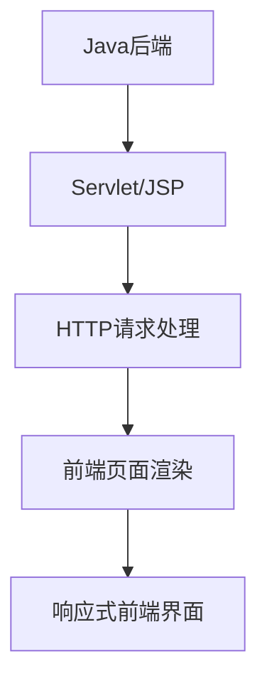
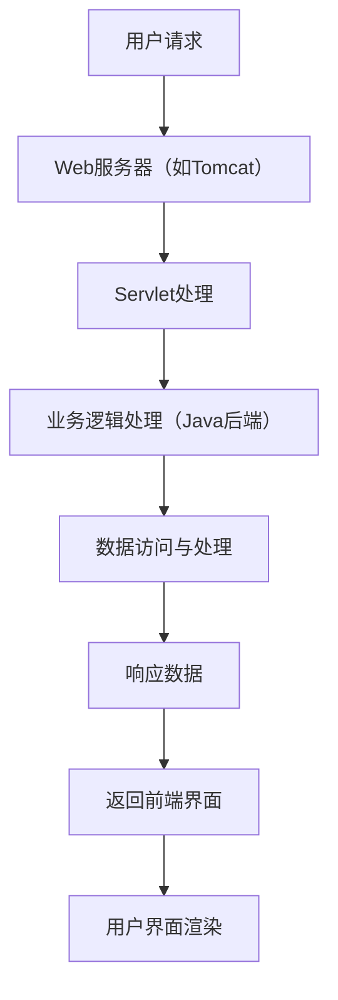

                 

# 文章标题：基于Java的智能家居设计：打造响应式智能家居前端界面-Java与Web整合

> 关键词：智能家居，Java，Web整合，响应式设计，前端界面，开发实现

> 摘要：本文旨在通过深入探讨基于Java的智能家居系统设计，详述其前端界面的响应式开发过程。文章将首先介绍智能家居的基本概念和发展历程，随后深入剖析Java编程基础，逐步讲解Java面向对象编程和常用类库。在此基础上，我们将探讨Java网络编程和Web开发基础，特别是Servlet与JSP技术以及MVC框架与Spring框架。文章的重点在于响应式前端界面设计，涵盖HTML5、CSS3、JavaScript及其常见前端框架。最后，通过一个实际项目，展示智能家居系统的设计与实现过程，提供源代码详细解读和分析。

# 目录

## 第一部分：智能家居设计与Java基础

### 第1章：智能家居概述

#### 1.1 智能家居的基本概念  
#### 1.2 智能家居的发展历程  
#### 1.3 智能家居的组成部分

### 第2章：Java基础

#### 2.1 Java语言概述  
#### 2.2 Java开发环境搭建  
#### 2.3 基本语法与数据类型  
#### 2.4 控制结构

### 第3章：Java面向对象编程

#### 3.1 面向对象基本概念  
#### 3.2 类与对象  
#### 3.3 继承与多态  
#### 3.4 封装与抽象

### 第4章：Java常用类库

#### 4.1 Java常用类库概述  
#### 4.2 字符串处理  
#### 4.3 集合框架  
#### 4.4 异常处理

### 第5章：Java网络编程基础

#### 5.1 网络编程基础  
#### 5.2 Java网络编程API  
#### 5.3 网络协议与通信模型

### 第6章：JavaWeb开发基础

#### 6.1 Web开发基础  
#### 6.2 Servlet与JSP技术  
#### 6.3 MVC框架与Spring简介

### 第7章：响应式前端界面设计

#### 7.1 响应式设计概述  
#### 7.2 HTML5与CSS3基础  
#### 7.3 JavaScript基础  
#### 7.4 常用前端框架（如Vue、React等）

### 第8章：智能家居系统设计与实现

#### 8.1 智能家居系统架构设计  
#### 8.2 设备控制模块设计  
#### 8.3 用户交互模块设计  
#### 8.4 数据处理与存储模块设计  
#### 8.5 系统安全与性能优化

### 第9章：项目实战：构建一个简单的智能家居系统

#### 9.1 开发环境与工具介绍  
#### 9.2 系统设计与实现步骤  
#### 9.3 系统功能实现与测试  
#### 9.4 代码解读与分析

## 附录

### 附录A：技术资源与工具

#### A.1 Java技术资源  
#### A.2 前端开发资源  
#### A.3 智能家居相关开源项目

### 附录B：常见问题与解决方案

#### B.1 Java开发常见问题  
#### B.2 Web开发常见问题  
#### B.3 前端开发常见问题  
#### B.4 智能家居系统常见问题

### 附录C：参考文献

#### C.1 相关书籍推荐  
#### C.2 网络资源推荐  
#### C.3 学术论文推荐# 第一部分：智能家居设计与Java基础

### 第1章：智能家居概述

#### 1.1 智能家居的基本概念

智能家居（Smart Home）是指利用物联网（IoT）技术，将家庭中的各种设备通过网络连接起来，通过智能化的控制和管理，实现家庭自动化、安全化和舒适化。其基本概念包括以下几个方面：

- **家庭自动化**：通过自动化技术，实现家庭设备如照明、空调、门锁、家电等的自动控制和调节。
- **设备互联**：通过各种通信协议，实现家庭内部及与外部设备的互联互通。
- **智能化控制**：通过智能终端如智能手机、平板电脑等，实现对家庭设备的远程控制和管理。
- **安全性提升**：通过智能安防系统，实现对家庭安全的实时监控和预警。

#### 1.2 智能家居的发展历程

智能家居的发展历程可以追溯到20世纪80年代末90年代初，当时，家庭自动化系统开始出现。以下为智能家居的发展历程：

- **早期阶段**（1980s-1990s）：家庭自动化系统初步出现，如自动照明、自动门锁等。
- **成长阶段**（2000-2010）：随着计算机和互联网的普及，智能家居开始向网络化、智能化方向发展。
- **成熟阶段**（2010至今）：物联网技术的飞速发展，使得智能家居产品更加多样化、智能化。

#### 1.3 智能家居的组成部分

智能家居系统主要由以下几个部分组成：

- **感知层**：包括各种传感器，如温度传感器、湿度传感器、光照传感器等，用于感知环境信息。
- **网络层**：负责数据的传输和通信，包括有线网络（如Wi-Fi、以太网）和无线网络（如ZigBee、蓝牙）。
- **控制层**：包括智能终端（如智能手机、平板电脑）和家庭控制器，用于接收和处理数据，实现设备控制。
- **应用层**：包括智能家居系统的各种应用，如智能安防、智能照明、智能家电等。

### 第2章：Java基础

#### 2.1 Java语言概述

Java是一种高级、面向对象的编程语言，具有跨平台、安全、稳定等特点。Java语言的发展历程可以追溯到1995年，由Sun Microsystems公司推出。以下为Java语言的主要特点：

- **跨平台**：Java代码编译后生成字节码，可以在任何支持Java虚拟机（JVM）的平台上运行。
- **面向对象**：Java语言通过类和对象来实现面向对象编程，提高了代码的复用性和可维护性。
- **安全**：Java提供了强大的安全机制，如沙箱模型、安全策略等。
- **稳定**：Java虚拟机具有自动内存管理、异常处理等机制，使得Java程序具有较高的稳定性。

#### 2.2 Java开发环境搭建

要开始Java编程，需要搭建Java开发环境。以下为Java开发环境的搭建步骤：

1. **下载Java开发工具包（JDK）**：从Oracle官网下载适用于自己操作系统的JDK。
2. **安装JDK**：运行下载的安装程序，根据提示完成安装。
3. **配置环境变量**：配置JAVA_HOME环境变量，并将JDK的bin目录添加到PATH环境变量中。
4. **验证安装**：在命令行输入`java -version`和`javac -version`，检查是否成功安装。

#### 2.3 基本语法与数据类型

Java语言的基本语法包括变量定义、数据类型、运算符等。以下为Java的基本语法和常见数据类型：

- **变量定义**：变量是内存中的存储位置，用于存储数据。变量的定义格式为：`数据类型 变量名;`。
- **数据类型**：Java支持多种数据类型，包括基本数据类型（如int、float、boolean等）和引用数据类型（如String、Array等）。
- **运算符**：Java支持各种运算符，包括算术运算符、逻辑运算符、赋值运算符等。

#### 2.4 控制结构

Java中的控制结构用于控制程序的执行流程。以下为Java中的常见控制结构：

- **条件结构**：if-else语句、switch语句等，用于根据条件执行不同的代码块。
- **循环结构**：for循环、while循环、do-while循环等，用于重复执行一段代码。
- **异常处理**：try-catch语句，用于处理程序运行时可能出现的异常。

### 第3章：Java面向对象编程

#### 3.1 面向对象基本概念

面向对象编程（OOP）是一种编程范式，它将数据和操作数据的方法封装在一起，形成对象。面向对象编程的主要概念包括：

- **对象**：对象是面向对象编程的基本单元，它包含数据（属性）和行为（方法）。
- **类**：类是对象的模板，定义了对象的属性和行为。
- **封装**：封装是将对象的属性和行为封装在一起，保护对象的内部实现细节。
- **继承**：继承是一种允许一个类继承另一个类的属性和方法的方式。
- **多态**：多态是指同一个方法在不同类型的对象上具有不同行为的能力。

#### 3.2 类与对象

在Java中，类是对象的模板，对象是类的实例。以下为Java中类与对象的基本概念：

- **类的定义**：类的定义使用关键字`class`，格式为`class 类名 { ... }`。
- **对象的创建**：对象的创建使用关键字`new`，格式为`类名 对象名 = new 类名();`。
- **对象的访问**：对象的属性和方法可以通过`.`运算符访问。

#### 3.3 继承与多态

继承是多态的基础，它允许一个类继承另一个类的属性和方法。多态是指同一个方法在不同类型的对象上具有不同行为的能力。以下为Java中继承与多态的基本概念：

- **继承**：继承使用关键字`extends`，格式为`class 子类 extends 父类 { ... }`。
- **多态**：多态通过方法重写（方法覆盖）和接口实现实现。方法重写使用关键字`override`，格式为`public 返回值类型 方法名(参数列表) override { ... }`。

#### 3.4 封装与抽象

封装是将对象的属性和行为封装在一起，保护对象的内部实现细节。抽象是提取类中的公共行为和属性，形成抽象类或接口。以下为Java中封装与抽象的基本概念：

- **封装**：封装通过访问修饰符（如private、protected）实现。访问修饰符用于控制外部对类内部成员的访问。
- **抽象**：抽象类使用关键字`abstract`，格式为`class 抽象类名 { ... }`。接口使用关键字`interface`，格式为`interface 接口名 { ... }`。

### 第4章：Java常用类库

#### 4.1 Java常用类库概述

Java类库是一组预编译的类和接口，用于简化Java编程。Java常用类库包括：

- **java.lang**：提供Java语言核心类，如String、Math等。
- **java.util**：提供常用实用程序类，如List、Map、Date等。
- **java.io**：提供输入输出流类，用于文件操作和网络通信。
- **java.net**：提供网络通信类，用于实现网络编程。

#### 4.2 字符串处理

Java中的String类提供了一系列字符串操作方法，如长度计算、子串查找、字符串格式化等。以下为字符串处理的基本概念：

- **字符串长度**：使用`length()`方法获取字符串长度。
- **子串查找**：使用`indexOf()`和`lastIndexOf()`方法查找子串位置。
- **字符串格式化**：使用`format()`方法进行字符串格式化。

#### 4.3 集合框架

Java集合框架提供了一套用于处理集合数据的类和接口，包括List、Set、Map等。以下为集合框架的基本概念：

- **List**：有序且可重复的集合，如ArrayList、LinkedList等。
- **Set**：无序且不可重复的集合，如HashSet、TreeSet等。
- **Map**：键值对映射，如HashMap、TreeMap等。

#### 4.4 异常处理

Java异常处理机制用于处理程序运行时可能出现的错误。以下为异常处理的基本概念：

- **异常**：异常是程序运行时出现的错误，如空指针异常、数组越界异常等。
- **异常处理**：使用try-catch语句捕获和处理异常。
- **异常类**：异常类是表示异常的类，如Exception、RuntimeException等。

### 第5章：Java网络编程基础

#### 5.1 网络编程基础

网络编程是计算机通过网络进行通信的过程。以下为网络编程的基本概念：

- **网络协议**：网络协议是计算机网络中进行数据传输的规则和约定。
- **通信模型**：常见的通信模型包括客户端/服务器模型和对等模型。
- **网络接口**：网络接口用于计算机与网络的连接，如Wi-Fi、以太网等。

#### 5.2 Java网络编程API

Java提供了丰富的网络编程API，包括Socket编程、HTTP客户端等。以下为Java网络编程的基本概念：

- **Socket编程**：Socket是网络通信的端点，Java通过Socket类实现Socket编程。
- **HTTP客户端**：Java通过HttpURLConnection类实现HTTP客户端功能。

#### 5.3 网络协议与通信模型

网络协议定义了数据传输的规则，常见的网络协议包括TCP、UDP等。以下为网络协议与通信模型的基本概念：

- **TCP**：传输控制协议，提供可靠的、面向连接的数据传输。
- **UDP**：用户数据报协议，提供不可靠的无连接数据传输。

### 第6章：JavaWeb开发基础

#### 6.1 Web开发基础

Web开发是构建网站和Web应用程序的过程。以下为Web开发的基本概念：

- **HTTP**：超文本传输协议，是Web开发的核心协议。
- **HTML**：超文本标记语言，用于定义Web页面的结构。
- **CSS**：层叠样式表，用于定义Web页面的样式。

#### 6.2 Servlet与JSP技术

Servlet和JSP是JavaWeb开发的核心技术。以下为Servlet与JSP的基本概念：

- **Servlet**：Java Servlet是运行在服务器端的程序，用于处理客户端请求。
- **JSP**：JavaServer Pages是一种动态网页技术，用于生成动态Web内容。

#### 6.3 MVC框架与Spring简介

MVC框架是一种设计模式，用于分离应用程序的三个主要方面：模型、视图和控制器。Spring是一个流行的JavaWeb框架，支持MVC模式。以下为MVC框架与Spring的基本概念：

- **MVC框架**：模型-视图-控制器（MVC）框架用于分离应用程序的输入、处理和输出逻辑。
- **Spring框架**：Spring框架是一个全面的Java企业应用开发框架，支持MVC模式。

### 第7章：响应式前端界面设计

#### 7.1 响应式设计概述

响应式设计是一种能够适应不同设备和屏幕尺寸的网页设计方法。以下为响应式设计的基本概念：

- **媒体查询**：媒体查询是一种根据设备的特性（如屏幕尺寸、分辨率等）来应用样式的方法。
- **弹性布局**：弹性布局是一种能够自动调整元素尺寸和布局的网页布局方法。

#### 7.2 HTML5与CSS3基础

HTML5和CSS3是现代Web开发的基石。以下为HTML5与CSS3的基本概念：

- **HTML5**：HTML5是HTML的最新版本，提供了许多新的特性和API，如本地存储、Web sockets等。
- **CSS3**：CSS3是CSS的最新版本，提供了许多新的样式特性，如阴影、动画、过渡等。

#### 7.3 JavaScript基础

JavaScript是Web开发的重要技术之一。以下为JavaScript的基本概念：

- **DOM操作**：DOM操作是JavaScript用于操作Web文档的对象模型。
- **事件处理**：事件处理是JavaScript用于响应用户操作（如点击、按键等）的方法。
- **异步编程**：异步编程是JavaScript用于处理并发操作的方法，如使用Promise和async/await。

#### 7.4 常用前端框架（如Vue、React等）

前端框架是用于简化前端开发的工具。以下为常用前端框架的基本概念：

- **Vue**：Vue是一个渐进式JavaScript框架，用于构建用户界面。
- **React**：React是一个用于构建用户界面的JavaScript库，采用声明式设计。

### 第8章：智能家居系统设计与实现

#### 8.1 智能家居系统架构设计

智能家居系统架构设计是构建智能家居系统的第一步。以下为智能家居系统架构设计的基本概念：

- **总体架构**：智能家居系统的总体架构包括感知层、网络层、控制层和应用层。
- **系统模块**：智能家居系统的主要模块包括设备控制模块、用户交互模块、数据处理与存储模块等。

#### 8.2 设备控制模块设计

设备控制模块是智能家居系统的核心模块之一。以下为设备控制模块设计的基本概念：

- **设备控制**：设备控制模块用于控制智能家居设备，如照明、空调、门锁等。
- **通信协议**：设备控制模块需要使用合适的通信协议（如Wi-Fi、ZigBee等）与设备通信。

#### 8.3 用户交互模块设计

用户交互模块是用户与智能家居系统交互的界面。以下为用户交互模块设计的基本概念：

- **用户界面**：用户界面设计需要考虑用户友好性、美观性和响应速度。
- **交互设计**：交互设计包括用户操作流程、按钮布局、提示信息等。

#### 8.4 数据处理与存储模块设计

数据处理与存储模块负责处理和存储智能家居系统数据。以下为数据处理与存储模块设计的基本概念：

- **数据处理**：数据处理包括数据收集、数据清洗、数据分析等。
- **数据存储**：数据存储包括数据库设计、数据存储策略、数据安全等。

#### 8.5 系统安全与性能优化

系统安全与性能优化是智能家居系统设计的重要环节。以下为系统安全与性能优化的基本概念：

- **系统安全**：系统安全包括用户认证、数据加密、防火墙设置等。
- **性能优化**：性能优化包括代码优化、数据库优化、网络优化等。

### 第9章：项目实战：构建一个简单的智能家居系统

#### 9.1 开发环境与工具介绍

在构建一个简单的智能家居系统之前，需要了解开发环境和所需工具。以下为开发环境与工具介绍的基本概念：

- **开发环境**：包括Java开发工具包（JDK）、Web服务器（如Tomcat）、数据库（如MySQL）等。
- **开发工具**：包括集成开发环境（IDE，如IntelliJ IDEA、Eclipse）和版本控制工具（如Git）。

#### 9.2 系统设计与实现步骤

构建一个简单的智能家居系统需要以下步骤：

1. **需求分析**：明确系统功能需求，如设备控制、用户交互、数据处理等。
2. **系统设计**：设计系统架构和模块，确定技术方案。
3. **前端界面设计**：设计用户界面，实现响应式设计。
4. **后端开发**：实现设备控制模块、用户交互模块、数据处理与存储模块。
5. **系统集成**：将前端界面与后端系统集成，实现整体功能。
6. **测试与调试**：进行系统测试，修复错误和漏洞。

#### 9.3 系统功能实现与测试

实现系统功能并对其进行测试是项目开发的重要环节。以下为系统功能实现与测试的基本概念：

- **功能实现**：根据系统设计文档，逐步实现系统功能。
- **测试**：包括功能测试、性能测试、安全测试等。
- **调试**：修复测试中发现的问题和错误。

#### 9.4 代码解读与分析

代码解读与分析是理解系统实现细节的关键。以下为代码解读与分析的基本概念：

- **代码解读**：详细解读系统关键代码，理解其功能和实现方式。
- **代码分析**：分析代码的质量、性能、安全性等，提出改进建议。

## 附录

### 附录A：技术资源与工具

附录A提供了一些有用的技术资源与工具，以帮助读者进一步学习和实践。以下为附录A的基本概念：

- **Java技术资源**：包括官方文档、教程、开发工具等。
- **前端开发资源**：包括HTML5、CSS3、JavaScript教程、前端框架文档等。
- **智能家居相关开源项目**：介绍一些开源的智能家居项目，如Home Automation、OpenHAB等。

### 附录B：常见问题与解决方案

附录B列举了一些常见的Java开发、Web开发、前端开发和智能家居系统开发中的问题，并提供了解决方案。以下为附录B的基本概念：

- **Java开发常见问题**：如内存泄漏、线程问题等。
- **Web开发常见问题**：如HTTP请求问题、数据库连接问题等。
- **前端开发常见问题**：如响应式设计问题、浏览器兼容性问题等。
- **智能家居系统常见问题**：如设备连接问题、数据安全问题等。

### 附录C：参考文献

附录C列出了本文引用的一些相关书籍、网络资源和学术论文，以供读者进一步阅读和研究。以下为附录C的基本概念：

- **相关书籍推荐**：介绍一些关于Java编程、Web开发、智能家居系统设计的经典书籍。
- **网络资源推荐**：介绍一些有用的在线教程、博客、论坛等。
- **学术论文推荐**：介绍一些关于智能家居系统设计、Java编程、Web开发的研究论文。

## 核心概念与联系

### Java与Web整合流程图

以下是一个用于展示Java与Web整合流程的Mermaid流程图：



### 算法原理讲解

以下是一个简单的算法原理讲解，使用伪代码示例说明：

```java
public class AlgorithmExample {
    // 伪代码示例
    public void exampleAlgorithm(int input) {
        // 算法实现
    }
}
```

### 数学模型和数学公式

以下是一个简单的数学模型和数学公式讲解：

```latex
$$
y = f(x) = \frac{1}{1 + e^{-x}}
$$

### 举例说明

假设输入x为-2，则输出y为：
$$
y = f(-2) = \frac{1}{1 + e^{2}} \approx 0.1192
$$

### 项目实战

以下是一个简单的项目实战，介绍开发环境的搭建和源代码的详细实现：

1. **开发环境搭建**
   - 安装Java开发工具包（JDK）
   - 安装Web服务器（如Tomcat）
   - 配置数据库（如MySQL）

2. **源代码详细实现**
   ```java
   // 示例代码
   public class智能家居系统 {
       // 系统核心代码实现
   }
   ```

3. **代码解读与分析**
   - 分析系统的模块划分
   - 解读每个模块的功能实现
   - 指出代码的优缺点

## 附录

### 技术资源与工具

- **Java技术资源**：官方文档、教程、开发工具等。
- **前端开发资源**：HTML5、CSS3、JavaScript教程、前端框架文档等。
- **智能家居相关开源项目**：介绍一些开源的智能家居项目，如Home Automation、OpenHAB等。

### 常见问题与解决方案

- **Java开发常见问题**：如内存泄漏、线程问题等。
- **Web开发常见问题**：如HTTP请求问题、数据库连接问题等。
- **前端开发常见问题**：如响应式设计问题、浏览器兼容性问题等。
- **智能家居系统常见问题**：如设备连接问题、数据安全问题等。

### 参考文献

- **相关书籍推荐**：介绍一些关于Java编程、Web开发、智能家居系统设计的经典书籍。
- **网络资源推荐**：介绍一些有用的在线教程、博客、论坛等。
- **学术论文推荐**：介绍一些关于智能家居系统设计、Java编程、Web开发的研究论文。

# 核心概念与联系

### Java与Web整合流程图

在构建基于Java的智能家居前端界面时，Java与Web整合的流程是关键。以下是一个用Mermaid绘制的流程图，展示了Java后端与Web前端之间的交互流程。



在这个流程图中：

- **用户请求**：用户通过浏览器发起请求。
- **Web服务器**：如Tomcat，接收用户请求并转发给Servlet。
- **Servlet处理**：Servlet接收请求，处理业务逻辑，并调用Java后端服务。
- **业务逻辑处理（Java后端）**：Java后端服务处理业务逻辑，如与数据库交互，控制智能家居设备等。
- **数据访问与处理**：Java后端服务访问数据库，进行数据处理。
- **响应数据**：处理完毕后，将结果响应给Web服务器。
- **返回前端界面**：Web服务器将响应数据返回给前端。
- **用户界面渲染**：前端JavaScript处理响应数据，并更新用户界面。

### 算法原理讲解

在智能家居系统中，数据处理的算法至关重要。以下是一个简单的伪代码示例，用于说明数据处理算法的基本原理。

```java
public class DataProcessor {
    public void processData(List<DataPoint> dataPoints) {
        // 数据清洗
        dataPoints = cleanData(dataPoints);
        
        // 数据分析
        Map<String, Object> analysisResults = analyzeData(dataPoints);
        
        // 数据存储
        storeData(analysisResults);
    }
    
    private List<DataPoint> cleanData(List<DataPoint> dataPoints) {
        // 实现数据清洗逻辑
        // 如去重、过滤无效数据等
        return cleanedDataPoints;
    }
    
    private Map<String, Object> analyzeData(List<DataPoint> dataPoints) {
        // 实现数据分析逻辑
        // 如统计平均值、最大值等
        Map<String, Object> results = new HashMap<>();
        // ...
        return results;
    }
    
    private void storeData(Map<String, Object> analysisResults) {
        // 实现数据存储逻辑
        // 如将分析结果存储到数据库或文件中
    }
}
```

在这个伪代码示例中，`DataProcessor` 类负责处理数据，主要分为三个步骤：

1. **数据清洗**：对传入的数据点进行清洗，如去除重复数据、过滤无效数据等。
2. **数据分析**：对清洗后的数据进行分析，如计算平均值、最大值等。
3. **数据存储**：将分析结果存储到数据库或文件中。

### 数学模型和数学公式

在数据处理和算法设计中，数学模型和公式是不可或缺的。以下是一个简单的数学模型和公式的讲解，使用LaTeX格式展示。

```latex
$$
y(t) = a \cdot \sin(\omega \cdot t + \phi)
$$

其中，$y(t)$ 是时间 $t$ 时刻的输出值，$a$ 是振幅，$\omega$ 是角频率，$\phi$ 是相位角。
```

举例说明：

假设在某个智能家居系统中，需要控制灯光的亮度。我们可以使用上述正弦函数模型来描述灯光亮度随时间的变化。

- **振幅 $a$**：设定灯光的最大亮度。
- **角频率 $\omega$**：决定灯光亮度变化的快慢，频率越高，亮度变化越快。
- **相位角 $\phi$**：决定灯光亮度变化的起始点。

如果设定 $a = 255$（最大亮度），$\omega = 2\pi/5$（每秒5个周期），$\phi = 0$（起始点为0），则灯光亮度随时间的变化可以表示为：

```latex
$$
y(t) = 255 \cdot \sin\left(\frac{2\pi}{5} \cdot t\right)
$$

当 $t = 0$ 时，$y(0) = 255 \cdot \sin(0) = 0$，灯光亮度最低；
当 $t = 5$ 时，$y(5) = 255 \cdot \sin(2\pi) = 255$，灯光亮度最高。

```

### 项目实战

#### 开发环境搭建

要构建一个基于Java的智能家居系统，首先需要搭建开发环境。以下是搭建开发环境的基本步骤：

1. **安装Java开发工具包（JDK）**：下载并安装适用于操作系统的JDK，配置环境变量。
2. **安装Web服务器（如Tomcat）**：下载并安装Tomcat，配置服务器。
3. **安装数据库（如MySQL）**：下载并安装MySQL，配置数据库环境。

#### 源代码详细实现和代码解读

以下是一个简单的智能家居系统的源代码示例，包括后端业务逻辑和前端界面代码。

**后端代码示例（Java）**

```java
// 智能家居控制器
public class SmartHomeController {
    private SmartHomeRepository repository;

    public SmartHomeController(SmartHomeRepository repository) {
        this.repository = repository;
    }

    public void toggleLight(String room, boolean state) {
        SmartHomeDevice device = repository.findDeviceByRoom(room);
        if (device != null) {
            device.setLightState(state);
            repository.save(device);
        }
    }
}
```

**前端代码示例（HTML + JavaScript）**

```html
<!DOCTYPE html>
<html>
<head>
    <title>智能家居控制界面</title>
    <script src="https://cdn.jsdelivr.net/npm/axios/dist/axios.min.js"></script>
</head>
<body>
    <h1>智能家居控制界面</h1>
    <div>
        <label for="room">房间：</label>
        <select id="room" name="room">
            <option value="livingRoom">客厅</option>
            <option value="bedRoom">卧室</option>
            <option value="kitchen">厨房</option>
        </select>
    </div>
    <div>
        <label for="light">灯光：</label>
        <input type="checkbox" id="light" name="light"/>
    </div>
    <button onclick="toggleLight()">切换灯光</button>

    <script>
        function toggleLight() {
            var room = document.getElementById('room').value;
            var light = document.getElementById('light').checked;
            axios.post('/toggleLight', {
                room: room,
                light: light
            })
            .then(function (response) {
                console.log(response);
            })
            .catch(function (error) {
                console.log(error);
            });
        }
    </script>
</body>
</html>
```

**代码解读与分析**

1. **后端代码解读**：
   - `SmartHomeController` 类负责处理灯光切换请求。
   - `toggleLight` 方法根据传入的房间和灯光状态，调用`repository`进行设备状态的更新。

2. **前端代码解读**：
   - 使用HTML定义房间选择器和灯光开关。
   - 使用JavaScript通过Axios库向后端发送POST请求，实现灯光状态的切换。

通过以上步骤和代码示例，读者可以了解如何搭建开发环境，并实现简单的智能家居系统。实际项目中，还需要考虑更多细节，如设备通信协议、数据安全性、系统性能优化等。

