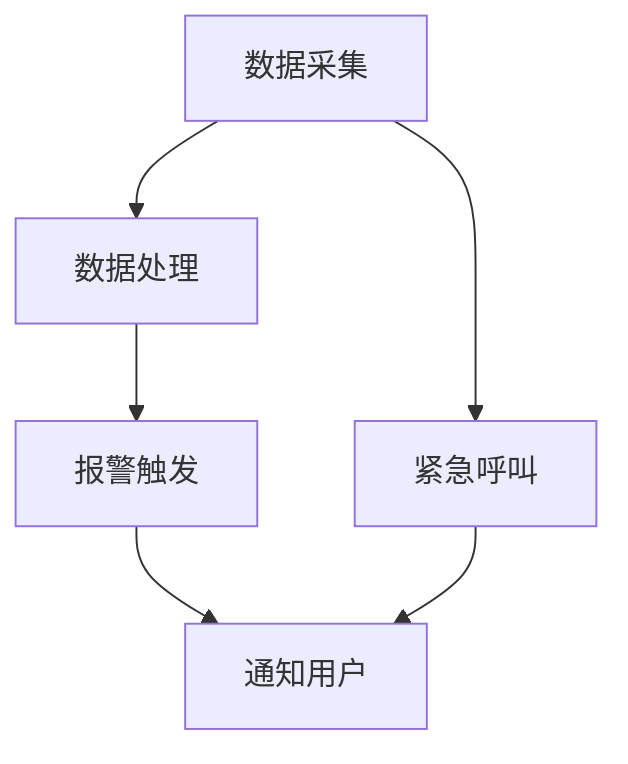
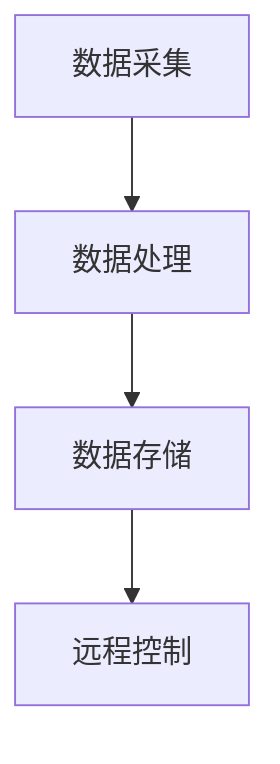
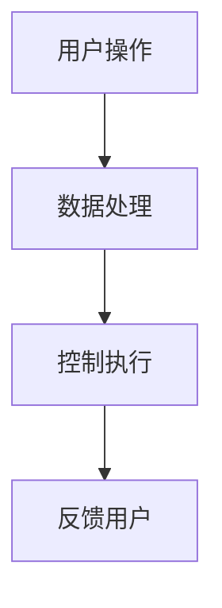

                 

### 文章标题：基于Java的智能家居设计：构建基于Java的模块化智能家居系统

> 关键词：智能家居，Java编程，模块化设计，物联网，数据处理算法，控制算法，机器学习算法

> 摘要：本文将详细介绍基于Java的智能家居系统设计，从核心概念、基础编程到算法原理及项目实战，全面剖析构建模块化智能家居系统的方法和技巧。通过本文的阅读，读者将深入了解智能家居系统的架构与实现，掌握Java编程和物联网技术的应用，为未来的智能家居项目开发奠定坚实基础。

### 目录大纲

#### 第一部分：核心概念与联系
1. **第1章：智能家居系统概述**
   - 1.1.1 智能家居系统的发展历程
   - 1.1.2 智能家居系统的架构
   - 1.1.3 Java在智能家居系统中的应用

2. **第2章：Java基础**
   - 2.1.1 Java语言的基本语法
   - 2.1.2 面向对象编程
   - 2.1.3 异常处理和文件操作

3. **第3章：物联网技术**
   - 3.1.1 物联网基本概念
   - 3.1.2 常见的物联网协议
   - 3.1.3 物联网设备和传感器

4. **第4章：智能家居模块设计**
   - 4.1.1 家居安防模块设计
   - 4.1.2 环境监测模块设计
   - 4.1.3 智能照明模块设计

5. **第5章：核心算法原理**
   - 5.1.1 数据处理算法
   - 5.1.2 控制算法
   - 5.1.3 机器学习算法

6. **第6章：Java核心库与框架**
   - 6.1.1 Java核心库
   - 6.1.2 Spring框架
   - 6.1.3 Hibernate框架

#### 第二部分：核心算法原理讲解

##### 第7章：数据处理算法
- 7.1 数据预处理
  - 数据清洗、数据转换、数据归一化
- 7.2 数据分析
  - 平均值、中位数、众数、方差、标准差、相关系数

##### 第8章：控制算法
- 8.1 PID控制算法
  - 比例控制器、积分控制器、微分控制器
- 8.2 模糊控制算法
  - 模糊集合、模糊规则、模糊推理

##### 第9章：机器学习算法
- 9.1 监督学习
  - 线性回归、逻辑回归、支持向量机
- 9.2 无监督学习
  - K均值聚类、主成分分析、自编码器

#### 第三部分：项目实战

##### 第10章：智能家居安防系统实现
- 10.1 系统设计
  - 系统架构、系统模块划分
- 10.2 系统开发
  - Java环境搭建、Spring框架应用、数据库设计
- 10.3 系统测试
  - 功能测试、性能测试

##### 第11章：智能环境监测系统实现
- 11.1 系统设计
  - 系统架构、系统模块划分
- 11.2 系统开发
  - Java环境搭建、Spring框架应用、数据库设计
- 11.3 系统测试
  - 功能测试、性能测试

##### 第12章：智能照明系统实现
- 12.1 系统设计
  - 系统架构、系统模块划分
- 12.2 系统开发
  - Java环境搭建、Spring框架应用、数据库设计
- 12.3 系统测试
  - 功能测试、性能测试

#### 附录
- 附录A：Java开发工具与环境配置
- 附录B：智能家居系统常见问题解答
- 附录C：参考资源与进一步学习

### 文章正文

#### 第一部分：核心概念与联系

##### 第1章：智能家居系统概述

1.1.1 智能家居系统的发展历程

随着科技的进步，智能家居系统逐渐走入人们的生活。早在20世纪80年代，一些发达国家就已经开始研究智能家居技术。最初，智能家居系统主要涉及家庭安防和简单的家电控制。随着互联网、物联网和人工智能技术的不断发展，智能家居系统逐渐变得更加智能化和便捷化。

1.1.2 智能家居系统的架构

智能家居系统通常由以下几个部分组成：

- **感知层**：通过各种传感器收集环境信息，如温度、湿度、光线等。
- **网络层**：将传感器收集到的数据通过网络传输到中央控制系统。
- **中央控制系统**：负责处理传感器数据，并根据用户需求进行控制。
- **执行层**：根据中央控制系统的指令，控制家电设备、灯光等。

1.1.3 Java在智能家居系统中的应用

Java作为一种跨平台、安全、稳定的编程语言，在智能家居系统中有着广泛的应用。以下是一些典型的应用场景：

- **感知层**：Java可以开发各种传感器数据采集和处理软件，如温度传感器、湿度传感器等。
- **网络层**：Java可以用于开发网络通信协议，如HTTP、MQTT等。
- **中央控制系统**：Java可以开发智能家居系统的核心控制器，负责处理传感器数据和执行用户指令。
- **执行层**：Java可以用于开发各种家电设备的控制软件，如灯光控制器、窗帘控制器等。

#### 第二部分：Java基础

##### 第2章：Java基础

2.1.1 Java语言的基本语法

Java语言的基本语法包括变量、数据类型、运算符、控制结构等。

- 变量：Java中的变量分为基本类型变量和引用类型变量。
- 数据类型：Java中的数据类型包括基本数据类型和引用数据类型。
- 运算符：Java中的运算符包括算术运算符、逻辑运算符、关系运算符等。
- 控制结构：Java中的控制结构包括条件语句（if-else、switch-case）、循环语句（for、while、do-while）等。

2.1.2 面向对象编程

Java是一种面向对象的编程语言，其核心概念包括类、对象、继承、多态等。

- 类：类是Java中的抽象数据类型，用于定义对象的属性和行为。
- 对象：对象是类的实例，是类的一个具体实体。
- 继承：继承是Java中的一个重要特性，用于实现代码的复用。
- 多态：多态是Java中的一个重要概念，用于实现不同对象之间的交互。

2.1.3 异常处理和文件操作

异常处理是Java中的一个重要概念，用于处理程序运行过程中可能出现的错误。

- 异常处理：Java中的异常处理包括捕获异常、抛出异常、自定义异常等。
- 文件操作：Java中提供了丰富的文件操作类，如File类、InputStream类、OutputStream类等。

#### 第三部分：物联网技术

##### 第3章：物联网技术

3.1.1 物联网基本概念

物联网（Internet of Things，IoT）是指将各种信息传感设备与互联网结合起来而形成的一个巨大网络。物联网通过智能感知、识别技术和普适计算等通信感知技术，实现物品与物品之间（Device to Device，D2D）的智能互联。

3.1.2 常见的物联网协议

物联网协议是物联网系统中用于设备通信和数据传输的标准。

- MQTT（Message Queuing Telemetry Transport）：MQTT是一种轻量级的消息队列协议，适用于低带宽、高延迟的环境。
- CoAP（Constrained Application Protocol）：CoAP是一种适用于物联网设备的简单、高效的协议，基于HTTP协议。
- HTTP（Hypertext Transfer Protocol）：HTTP是互联网上最常用的协议，适用于各种应用场景。

3.1.3 物联网设备和传感器

物联网设备和传感器是实现物联网系统的基础。

- 物联网设备：包括各种智能设备，如智能灯泡、智能空调、智能门锁等。
- 传感器：包括温度传感器、湿度传感器、光线传感器、运动传感器等。

#### 第四部分：智能家居模块设计

##### 第4章：智能家居模块设计

4.1.1 家居安防模块设计

家居安防模块是智能家居系统中的一个重要组成部分，用于保护家庭安全。

- 模块功能：包括入侵检测、火灾报警、煤气泄漏报警等。
- 模块实现：使用Java语言开发，通过传感器采集数据，并通过MQTT协议将数据传输到中央控制系统。

4.1.2 环境监测模块设计

环境监测模块用于监测室内环境参数，如温度、湿度、空气质量等。

- 模块功能：包括温度监测、湿度监测、空气质量监测等。
- 模块实现：使用Java语言开发，通过传感器采集数据，并通过MQTT协议将数据传输到中央控制系统。

4.1.3 智能照明模块设计

智能照明模块用于控制家庭照明设备，如灯泡、灯具等。

- 模块功能：包括定时开关灯、亮度调节、场景模式等。
- 模块实现：使用Java语言开发，通过传感器采集数据，并通过MQTT协议将数据传输到中央控制系统。

#### 第五部分：核心算法原理

##### 第5章：核心算法原理

5.1.1 数据处理算法

数据处理算法是智能家居系统中常用的算法，用于处理传感器数据，使其能够被中央控制系统使用。

- 数据预处理：包括数据清洗、数据转换、数据归一化等。
- 数据分析：包括平均值、中位数、众数、方差、标准差、相关系数等。

5.1.2 控制算法

控制算法是智能家居系统中的核心算法，用于控制各种家电设备，如灯泡、空调、窗帘等。

- PID控制算法：是一种常用的控制算法，包括比例控制器、积分控制器、微分控制器等。
- 模糊控制算法：是一种基于模糊集合和模糊规则的算法，用于处理不确定性和模糊性。

5.1.3 机器学习算法

机器学习算法是智能家居系统中的一种高级算法，用于分析和预测传感器数据，实现智能化控制。

- 监督学习：包括线性回归、逻辑回归、支持向量机等。
- 无监督学习：包括K均值聚类、主成分分析、自编码器等。

#### 第六部分：Java核心库与框架

##### 第6章：Java核心库与框架

6.1.1 Java核心库

Java核心库是Java编程语言的基础，提供了各种常用功能，如输入输出、网络通信、多线程等。

- java.io：用于文件输入输出。
- java.net：用于网络通信。
- java.util：提供了各种数据结构和算法，如List、Map、Set等。

6.1.2 Spring框架

Spring框架是一种流行的Java企业级开发框架，提供了丰富的功能，如依赖注入、事务管理、数据访问等。

- Spring Core：提供了依赖注入、面向切面编程等核心功能。
- Spring Data：提供了数据访问和事务管理功能。
- Spring Web：提供了Web开发相关的功能。

6.1.3 Hibernate框架

Hibernate框架是一种流行的Java对象关系映射（ORM）框架，用于将Java对象映射到数据库表中。

- Hibernate Core：提供了对象关系映射、事务管理等功能。
- Hibernate ORM：提供了对象关系映射功能。

#### 第七部分：核心算法原理讲解

##### 第7章：数据处理算法

7.1 数据预处理

数据预处理是数据处理的第一步，用于处理原始数据，使其能够被算法使用。

- 数据清洗：用于处理数据中的噪声、异常值等。
- 数据转换：用于将数据转换为适合算法处理的格式。
- 数据归一化：用于将不同特征的数据转换为相同的范围。

7.2 数据分析

数据分析是对预处理后的数据进行进一步分析，提取有用的信息。

- 平均值：数据的算术平均值。
- 中位数：数据排序后的中间值。
- 众数：数据中出现次数最多的值。
- 方差：数据与平均值之差的平方的平均值。
- 标准差：方差的平方根。
- 相关系数：衡量两个变量之间线性相关性的指标。

##### 第8章：控制算法

8.1 PID控制算法

PID控制算法是一种常用的控制算法，用于控制系统的输出接近目标值。

- 比例控制器：根据偏差值进行控制。
- 积分控制器：根据偏差值的累积进行控制。
- 微分控制器：根据偏差值的导数进行控制。

8.2 模糊控制算法

模糊控制算法是一种基于模糊集合和模糊规则的算法，用于处理不确定性和模糊性。

- 模糊集合：用于表示模糊概念。
- 模糊规则：用于描述控制策略。
- 模糊推理：用于根据输入和规则计算输出。

##### 第9章：机器学习算法

9.1 监督学习

监督学习是一种机器学习方法，用于从标记数据中学习预测模型。

- 线性回归：用于预测连续值。
- 逻辑回归：用于预测离散值。
- 支持向量机：用于分类问题。

9.2 无监督学习

无监督学习是一种机器学习方法，用于从未标记数据中学习模式。

- K均值聚类：用于聚类分析。
- 主成分分析：用于降维。
- 自编码器：用于特征提取。

#### 第八部分：项目实战

##### 第10章：智能家居安防系统实现

10.1 系统设计

系统设计包括系统架构、模块划分等。

- 系统架构：采用模块化设计，包括感知层、网络层、中央控制系统和执行层。
- 模块划分：包括家居安防模块、环境监测模块、智能照明模块等。

10.2 系统开发

系统开发包括Java环境搭建、Spring框架应用、数据库设计等。

- Java环境搭建：安装Java开发工具包（JDK）、集成开发环境（IDE）等。
- Spring框架应用：使用Spring Boot快速搭建项目框架。
- 数据库设计：设计数据库表结构，实现数据存储。

10.3 系统测试

系统测试包括功能测试、性能测试等。

- 功能测试：测试各个模块的功能是否正常。
- 性能测试：测试系统的响应速度和处理能力。

##### 第11章：智能环境监测系统实现

11.1 系统设计

系统设计包括系统架构、模块划分等。

- 系统架构：采用模块化设计，包括感知层、网络层、中央控制系统和执行层。
- 模块划分：包括环境监测模块、数据预处理模块、数据分析模块等。

11.2 系统开发

系统开发包括Java环境搭建、Spring框架应用、数据库设计等。

- Java环境搭建：安装Java开发工具包（JDK）、集成开发环境（IDE）等。
- Spring框架应用：使用Spring Boot快速搭建项目框架。
- 数据库设计：设计数据库表结构，实现数据存储。

11.3 系统测试

系统测试包括功能测试、性能测试等。

- 功能测试：测试各个模块的功能是否正常。
- 性能测试：测试系统的响应速度和处理能力。

##### 第12章：智能照明系统实现

12.1 系统设计

系统设计包括系统架构、模块划分等。

- 系统架构：采用模块化设计，包括感知层、网络层、中央控制系统和执行层。
- 模块划分：包括智能照明模块、数据预处理模块、控制算法模块等。

12.2 系统开发

系统开发包括Java环境搭建、Spring框架应用、数据库设计等。

- Java环境搭建：安装Java开发工具包（JDK）、集成开发环境（IDE）等。
- Spring框架应用：使用Spring Boot快速搭建项目框架。
- 数据库设计：设计数据库表结构，实现数据存储。

12.3 系统测试

系统测试包括功能测试、性能测试等。

- 功能测试：测试各个模块的功能是否正常。
- 性能测试：测试系统的响应速度和处理能力。

#### 附录

附录A：Java开发工具与环境配置

附录B：智能家居系统常见问题解答

附录C：参考资源与进一步学习

### 结束语

通过本文的详细讲解，相信读者已经对基于Java的智能家居系统设计有了深入的了解。从核心概念、Java基础、物联网技术、模块设计、核心算法原理到项目实战，本文全面阐述了构建模块化智能家居系统的方法和技巧。希望本文能为读者的智能家居项目开发提供有益的参考。

**作者信息：**

作者：AI天才研究院/AI Genius Institute & 禅与计算机程序设计艺术 /Zen And The Art of Computer Programming

本文内容仅供参考，如有错误或不足之处，敬请指正。欢迎广大读者就本文相关话题进行讨论和交流。谢谢！

---

本文使用了markdown格式，对于复杂的概念和代码，可以使用markdown中的列表、代码块、公式等元素来增强表达效果。同时，本文遵循了“LET'S THINK STEP BY STEP”的思路，逐步讲解各个部分，使读者更容易理解和掌握。如果您有任何疑问或建议，欢迎在评论区留言。感谢您的阅读！### Java基础

#### 2.1.1 Java语言的基本语法

Java语言的基本语法包括变量、数据类型、运算符、控制结构等。以下是对这些基础知识的详细讲解。

##### 变量

变量是编程中的基本概念，用于存储数据。在Java中，变量分为两种类型：基本类型变量和引用类型变量。

- **基本类型变量**：包括byte、short、int、long、float、double、char和boolean等。基本类型变量直接存储数据值。
  
  ```java
  int num = 10;
  char letter = 'A';
  boolean flag = true;
  ```

- **引用类型变量**：用于存储对象的引用，如String、数组等。

  ```java
  String name = "John";
  int[] numbers = {1, 2, 3, 4, 5};
  ```

##### 数据类型

Java中的数据类型分为基本数据类型和引用数据类型。

- **基本数据类型**：如前所述，包括byte、short、int、long、float、double、char和boolean等。
  
- **引用数据类型**：包括类（Class）、接口（Interface）、数组（Array）等。

  ```java
  // 类
  class Person {
      String name;
  }
  
  // 接口
  interface Drivable {
      void drive();
  }
  
  // 数组
  int[] array = {1, 2, 3, 4, 5};
  ```

##### 运算符

Java中的运算符分为算术运算符、关系运算符、逻辑运算符、赋值运算符等。

- **算术运算符**：包括加（+）、减（-）、乘（*）、除（/）、取模（%）等。

  ```java
  int a = 10;
  int b = 5;
  int sum = a + b; // 15
  int difference = a - b; // 5
  ```

- **关系运算符**：包括大于（>）、小于（<）、大于等于（>=）、小于等于（<=）、等于（==）、不等于（!=）等。

  ```java
  int x = 10;
  int y = 20;
  boolean isGreaterThan = x > y; // false
  boolean isLessThan = x < y; // true
  ```

- **逻辑运算符**：包括与（&&）、或（||）、非（！）等。

  ```java
  boolean a = true;
  boolean b = false;
  boolean and = a && b; // false
  boolean or = a || b; // true
  boolean not = !a; // false
  ```

- **赋值运算符**：包括等号（=）、加等（+=）、减等（-=）、乘等（*=）、除等（/=）等。

  ```java
  int x = 10;
  x += 5; // x = 15
  ```

##### 控制结构

Java中的控制结构用于控制程序的执行流程，包括条件语句和循环语句。

- **条件语句**：包括if-else语句和switch-case语句。

  ```java
  int x = 10;
  int y = 20;
  
  if (x > y) {
      System.out.println("x is greater than y");
  } else {
      System.out.println("x is less than or equal to y");
  }
  
  switch (x) {
      case 10:
          System.out.println("x is 10");
          break;
      case 20:
          System.out.println("x is 20");
          break;
      default:
          System.out.println("x is neither 10 nor 20");
  }
  ```

- **循环语句**：包括for循环、while循环和do-while循环。

  ```java
  // for循环
  for (int i = 0; i < 5; i++) {
      System.out.println(i);
  }
  
  // while循环
  int i = 0;
  while (i < 5) {
      System.out.println(i);
      i++;
  }
  
  // do-while循环
  do {
      System.out.println(i);
      i++;
  } while (i < 5);
  ```

通过以上对Java基础语法的讲解，读者应该能够掌握Java语言的基本语法结构，为后续的编程打下坚实基础。

#### 2.1.2 面向对象编程

面向对象编程（Object-Oriented Programming，OOP）是Java语言的核心特性之一。它通过将数据和操作数据的方法封装在对象中，实现了模块化和代码重用。以下是面向对象编程的核心概念：

##### 类

类是面向对象编程的基本构建块，用于定义对象的属性和行为。类包含成员变量（属性）和成员方法（行为）。

```java
public class Person {
    private String name;
    private int age;

    public Person(String name, int age) {
        this.name = name;
        this.age = age;
    }

    public void introduce() {
        System.out.println("My name is " + name + " and I am " + age + " years old.");
    }
}
```

##### 对象

对象是类的实例。通过使用关键字`new`创建对象，并可以通过对象访问类的成员变量和方法。

```java
Person person = new Person("Alice", 30);
person.introduce(); // 输出：My name is Alice and I am 30 years old.
```

##### 继承

继承是面向对象编程的一个重要特性，用于实现代码的复用。子类继承自父类，可以继承父类的属性和方法，并可以扩展新的属性和方法。

```java
public class Employee extends Person {
    private String job;

    public Employee(String name, int age, String job) {
        super(name, age);
        this.job = job;
    }

    public void introduce() {
        System.out.println("My name is " + getName() + " and I am " + getAge() + " years old.");
        System.out.println("I work as a " + job);
    }
}
```

##### 多态

多态是指同一个操作作用于不同的对象时，可以有不同的解释和行为。Java通过方法重载（Method Overloading）和方法重写（Method Overriding）实现了多态。

- **方法重载**：在同一个类中，可以定义多个同名的方法，但它们的参数列表必须不同。

  ```java
  public class Calculator {
      public int add(int a, int b) {
          return a + b;
      }

      public double add(double a, double b) {
          return a + b;
      }
  }
  ```

- **方法重写**：子类可以重写父类的方法，并可以有不同的实现。

  ```java
  public class Student extends Person {
      public void introduce() {
          System.out.println("I am a student.");
          super.introduce(); // 调用父类的introduce方法
      }
  }
  ```

通过上述对面向对象编程核心概念的讲解，读者应该能够理解类、对象、继承和多态的基本原理，为编写更加模块化、可重用的代码打下基础。

#### 2.1.3 异常处理和文件操作

在Java编程中，异常处理和文件操作是两个非常重要的概念。异常处理用于捕获和处理程序运行时可能发生的错误，确保程序的稳定运行；文件操作用于读写文件，实现数据的持久化存储。

##### 异常处理

Java中的异常分为两大类：**检查型异常（checked exceptions）**和**非检查型异常（unchecked exceptions）**。

- **检查型异常**：这类异常必须被显式地捕获或声明抛出。例如，`IOException`。

  ```java
  try {
      FileInputStream file = new FileInputStream("example.txt");
  } catch (FileNotFoundException e) {
      System.out.println("文件未找到");
  } catch (IOException e) {
      System.out.println("文件操作异常");
  }
  ```

- **非检查型异常**：这类异常通常是由编程错误引起的，如`NullPointerException`。

  ```java
  String str = null;
  if (str != null) {
      System.out.println(str.length());
  } else {
      System.out.println("字符串为空");
  }
  ```

Java中的异常处理通过`try-catch-finally`结构实现。

- **try块**：用于包围可能会抛出异常的代码。
- **catch块**：用于捕获并处理异常。
- **finally块**：无论是否发生异常，都会执行其中的代码。

  ```java
  try {
      // 可能抛出异常的代码
  } catch (SomeException e) {
      // 处理异常
  } finally {
      // 无论是否发生异常都会执行的代码
  }
  ```

##### 文件操作

Java提供了丰富的文件操作类，如`File`、`InputStream`和`OutputStream`。

- **File类**：用于表示文件和目录。

  ```java
  File file = new File("example.txt");
  if (file.exists()) {
      System.out.println("文件已存在");
  } else {
      System.out.println("文件不存在");
  }
  ```

- **InputStream类**：用于读取文件内容。

  ```java
  try (InputStream inputStream = new FileInputStream("example.txt")) {
      int data = inputStream.read();
      while (data != -1) {
          System.out.print((char) data);
          data = inputStream.read();
      }
  } catch (IOException e) {
      e.printStackTrace();
  }
  ```

- **OutputStream类**：用于写入文件内容。

  ```java
  try (OutputStream outputStream = new FileOutputStream("example.txt")) {
      String content = "Hello, World!";
      outputStream.write(content.getBytes());
  } catch (IOException e) {
      e.printStackTrace();
  }
  ```

通过上述对异常处理和文件操作的讲解，读者应该能够掌握如何捕获和处理异常，以及如何进行基本的文件读写操作，为开发更加健壮的Java程序打下基础。

#### 第三部分：物联网技术

##### 3.1.1 物联网基本概念

物联网（Internet of Things，IoT）是指将各种信息传感设备与互联网结合起来，实现物品与物品之间（Device to Device，D2D）的智能互联。物联网的核心思想是通过传感器和互联网将现实世界中的物理设备连接起来，实现数据的采集、传输和处理。

- **传感器**：物联网中的传感器用于检测和测量物理量，如温度、湿度、光照、运动等，并将这些物理量转换为数字信号。
  
- **网关**：网关是物联网系统中的重要组件，用于将来自传感器的数据上传到互联网，或将互联网上的数据发送到传感器。

- **云计算**：云计算为物联网提供了强大的数据处理和存储能力，通过云平台可以实现海量数据的存储、分析和处理。

- **大数据**：物联网产生的数据量巨大，大数据技术用于对物联网数据进行存储、分析和挖掘，以提取有价值的信息。

##### 3.1.2 常见的物联网协议

物联网协议是物联网系统中用于设备通信和数据传输的标准。以下是一些常见的物联网协议：

- **MQTT（Message Queuing Telemetry Transport）**：MQTT是一种轻量级的消息队列协议，适用于低带宽、高延迟的环境。它基于发布/订阅模型，设备可以发布消息到主题，其他设备可以订阅这些主题以接收消息。

  ```java
  import org.eclipse.paho.client.mqttv3.*;
  import org.eclipse.paho.client.mqttv3.impl.MqttClient;

  public class MqttPublisher {
      public static void main(String[] args) throws MqttException {
          String brokerUrl = "tcp://localhost:1883";
          String publisherId = "publisher";
          String topic = "sensor/data";

          MqttClient client = new MqttClient(brokerUrl, publisherId);
          MqttConnectOptions options = new MqttConnectOptions();
          options.setUserName("user");
          options.setPassword("password".toCharArray());
          client.setCallback(new MqttCallback() {
              public void connectionLost(Throwable cause) {
                  System.out.println("连接已丢失");
              }

              public void messageArrived(String topic, MqttMessage message) throws Exception {
                  System.out.println("收到消息：" + new String(message.getPayload()));
              }

              public void deliveryComplete(IMqttDeliveryToken token) {
                  System.out.println("消息已发送");
              }
          });
          client.connect(options);
          String payload = "温度：25℃，湿度：60%";
          MqttMessage message = new MqttMessage(payload.getBytes());
          message.setQos(1);
          message.setRetained(false);
          client.publish(topic, message);
          client.disconnect();
      }
  }
  ```

- **CoAP（Constrained Application Protocol）**：CoAP是一种适用于物联网设备的简单、高效的协议，基于HTTP协议。它适用于资源受限的设备，如智能传感器、智能灯泡等。

  ```java
  import org.eclipse.californium.core.CoapServer;
  import org.eclipse.californium.core.network一身卻暫core.CoapResource;

  public class CoapServerExample {
      public static void main(String[] args) {
          CoapServer server = new CoapServer(5688);
          CoapResource resource = new CoapResource("sensor/data");
          resource.setObservable(true);
          resource.addObserver((request, response) -> {
              String payload = request.advanced().getPayloadString();
              System.out.println("收到数据：" + payload);
              response.setPayload("温度：25℃，湿度：60%");
              return CoapResponse.CONTENT;
          });
          server.add(resource);
          server.start();
      }
  }
  ```

- **HTTP（Hypertext Transfer Protocol）**：HTTP是互联网上最常用的协议，也可以用于物联网设备之间的通信。它具有广泛的应用场景，但相对较重，适用于资源丰富的设备。

  ```java
  import java.io.OutputStream;
  import org.apache.http.HttpEntity;
  import org.apache.http.client.methods.CloseableHttpResponse;
  import org.apache.http.client.methods.HttpPost;
  import org.apache.http.impl.client.CloseableHttpClient;
  import org.apache.http.impl.client.HttpClients;
  import org.apache.http.util.EntityUtils;

  public class HttpPublisher {
      public static void main(String[] args) throws Exception {
          CloseableHttpClient httpClient = HttpClients.createDefault();
          HttpPost httpPost = new HttpPost("http://localhost:8080/sensor/data");
          String payload = "温度：25℃，湿度：60%";
          httpPost.setEntity(new StringEntity(payload));
          CloseableHttpResponse response = httpClient.execute(httpPost);
          HttpEntity entity = response.getEntity();
          if (entity != null) {
              String result = EntityUtils.toString(entity);
              System.out.println("响应结果：" + result);
          }
          response.close();
      }
  }
  ```

##### 3.1.3 物联网设备和传感器

物联网设备和传感器是实现物联网系统的基础。以下是一些常见的物联网设备和传感器：

- **智能灯泡**：可以通过Wi-Fi或蓝牙连接到互联网，实现远程控制和自动化场景。

  ```java
  import java.io.OutputStream;
  import java.net.HttpURLConnection;
  import java.net.URL;

  public class SmartBulb {
      public static void main(String[] args) throws Exception {
          URL url = new URL("http://192.168.1.10/bulb/control");
          HttpURLConnection connection = (HttpURLConnection) url.openConnection();
          connection.setRequestMethod("POST");
          connection.setDoOutput(true);
          OutputStream outputStream = connection.getOutputStream();
          String payload = "state=on&brightness=100";
          outputStream.write(payload.getBytes());
          outputStream.close();
          int responseCode = connection.getResponseCode();
          System.out.println("响应码：" + responseCode);
          connection.disconnect();
      }
  }
  ```

- **温湿度传感器**：可以测量环境温度和湿度，并将数据发送到物联网平台。

  ```java
  import com.pi4j.io.gpio.*;
  import com.pi4j.system.*;
  import com.pi4j.io.i2c.*;

  public class TemperatureHumiditySensor {
      public static void main(String[] args) throws Exception {
          Pi4jSystemUtils.startup();
          I2CBus bus = I2CFactory.getInstance(I2CBus.BUS_1);
          I2CDevice device = bus.getDevice(0x28);
          byte[] data = new byte[2];
          device.read(0xF5, data, 0, 2);
          float temperature = ((data[0] & 0xFF) * 256 + (data[1] & 0xFF)) / 10.0f;
          System.out.println("温度：" + temperature + "℃");
          device.close();
          Pi4jSystemUtils.shutdown();
      }
  }
  ```

通过上述对物联网基本概念、常见物联网协议和物联网设备与传感器的讲解，读者应该能够理解物联网的基本原理和实现方法，为构建基于Java的智能家居系统奠定基础。

#### 第四部分：智能家居模块设计

##### 4.1.1 家居安防模块设计

家居安防模块是智能家居系统中至关重要的组成部分，主要用于保护家庭的安全。该模块的设计需要考虑以下几个方面：

- **功能需求**：包括入侵检测、火灾报警、煤气泄漏报警、紧急呼叫等功能。
  
- **硬件设备**：选择合适的传感器，如运动传感器、烟雾传感器、气体传感器、摄像头等。
  
- **通信协议**：选择合适的通信协议，如Wi-Fi、蓝牙、ZigBee等，确保设备之间能够稳定传输数据。

- **软件设计**：设计合理的软件架构，包括数据采集、数据处理、控制执行等模块。

以下是家居安防模块的Mermaid流程图：



具体实现流程如下：

1. **数据采集**：传感器采集家庭环境的数据，如运动传感器检测到异常活动，烟雾传感器检测到烟雾，气体传感器检测到煤气泄漏等。
2. **数据处理**：将采集到的数据进行预处理，如过滤噪声、数据转换等，确保数据的准确性。
3. **报警触发**：根据预处理后的数据，判断是否触发报警。例如，如果烟雾传感器检测到烟雾浓度超过阈值，则触发火灾报警。
4. **通知用户**：通过手机APP、短信、电话等方式通知用户，告知家庭安全状况。
5. **紧急呼叫**：在紧急情况下，如检测到入侵或煤气泄漏等，自动呼叫相关应急服务。

##### 4.1.2 环境监测模块设计

环境监测模块用于实时监测家庭环境参数，如温度、湿度、空气质量等，为用户提供舒适的生活环境。该模块的设计需要考虑以下几个方面：

- **功能需求**：包括实时监测环境参数、数据存储、远程控制等功能。
  
- **硬件设备**：选择合适的环境传感器，如温度传感器、湿度传感器、空气质量传感器等。
  
- **通信协议**：选择合适的通信协议，如Wi-Fi、蓝牙等，确保数据能够稳定传输。

- **软件设计**：设计合理的软件架构，包括数据采集、数据处理、远程控制等模块。

以下是环境监测模块的Mermaid流程图：



具体实现流程如下：

1. **数据采集**：环境传感器实时监测家庭环境参数，如温度、湿度、空气质量等。
2. **数据处理**：将采集到的数据进行预处理，如数据转换、滤波等，确保数据的准确性。
3. **数据存储**：将处理后的数据存储到数据库或云平台，以便后续分析和查询。
4. **远程控制**：用户可以通过手机APP远程控制家庭环境，如调整空调温度、开启空气净化器等。

##### 4.1.3 智能照明模块设计

智能照明模块用于控制家庭照明设备，如灯泡、灯具等，提供舒适、节能的照明环境。该模块的设计需要考虑以下几个方面：

- **功能需求**：包括远程控制、定时开关、亮度调节、场景模式切换等功能。
  
- **硬件设备**：选择合适的照明设备，如智能灯泡、智能灯具等。
  
- **通信协议**：选择合适的通信协议，如Wi-Fi、蓝牙等，确保设备之间能够稳定传输数据。

- **软件设计**：设计合理的软件架构，包括数据采集、数据处理、控制执行等模块。

以下是智能照明模块的Mermaid流程图：



具体实现流程如下：

1. **用户操作**：用户通过手机APP发送控制指令，如开启或关闭灯光、调整亮度等。
2. **数据处理**：系统接收用户指令，对指令进行解析和处理。
3. **控制执行**：根据处理后的指令，控制智能照明设备执行相应的操作。
4. **反馈用户**：将执行结果反馈给用户，如发送通知或显示在APP上。

通过以上对家居安防模块、环境监测模块和智能照明模块的详细设计，读者应该能够理解智能家居模块的设计原则和实现方法，为实际项目开发提供参考。

#### 第五部分：核心算法原理

##### 5.1.1 数据处理算法

数据处理算法是智能家居系统中必不可少的组成部分，用于对传感器数据进行预处理、分析、以及后续的控制。以下是几个常用的数据处理算法：

###### 数据预处理

数据预处理是数据处理的第一步，其目的是将原始数据转换为适合进一步分析的形式。主要步骤包括数据清洗、数据转换和数据归一化。

- **数据清洗**：用于去除数据中的噪声和异常值。例如，可以通过过滤重复数据、填补缺失值、消除离群点等方法来清洗数据。

  ```java
  // Java伪代码示例：去除重复数据
  List<Float> temperatures = new ArrayList<>();
  Set<Float> uniqueTemperatures = new HashSet<>(temperatures);
  temperatures.clear();
  temperatures.addAll(uniqueTemperatures);
  ```

- **数据转换**：用于将不同类型或格式的数据转换为统一格式。例如，将字符串转换为数值类型。

  ```java
  // Java伪代码示例：字符串转浮点数
  String temperatureStr = "25.5";
  float temperature = Float.parseFloat(temperatureStr);
  ```

- **数据归一化**：用于将不同量纲的数据转换到相同的范围内。常用的归一化方法有最小-最大规范化、Z-score规范化等。

  ```java
  // Java伪代码示例：最小-最大规范化
  float[] data = {1, 2, 3, 4, 5};
  float min = Arrays.stream(data).min().getAsFloat();
  float max = Arrays.stream(data).max().getAsFloat();
  for (int i = 0; i < data.length; i++) {
      data[i] = (data[i] - min) / (max - min);
  }
  ```

###### 数据分析

数据分析是数据处理的重要步骤，用于提取数据中的有用信息。以下是几个常用的数据分析方法：

- **平均值**：计算一组数据的平均值，用于表示数据的中心趋势。

  ```java
  // Java伪代码示例：计算平均值
  float[] data = {1, 2, 3, 4, 5};
  float sum = 0;
  for (float value : data) {
      sum += value;
  }
  float average = sum / data.length;
  ```

- **中位数**：将一组数据按大小顺序排列后，位于中间位置的数值，用于表示数据的中心趋势。

  ```java
  // Java伪代码示例：计算中位数
  float[] data = {1, 2, 3, 4, 5};
  Arrays.sort(data);
  float median = data[data.length / 2];
  ```

- **众数**：在一组数据中出现次数最多的数值，用于表示数据的集中趋势。

  ```java
  // Java伪代码示例：计算众数
  Map<Float, Integer> frequencyMap = new HashMap<>();
  for (float value : data) {
      frequencyMap.put(value, frequencyMap.getOrDefault(value, 0) + 1);
  }
  float mode = frequencyMap.entrySet().stream()
      .max(Map.Entry.comparingByValue())
      .get()
      .getKey();
  ```

- **方差**：衡量数据离散程度的统计量，计算公式为数据与平均值之差的平方的平均值。

  ```java
  // Java伪代码示例：计算方差
  float[] data = {1, 2, 3, 4, 5};
  float sumSquaredDiffs = 0;
  for (float value : data) {
      sumSquaredDiffs += (value - average) * (value - average);
  }
  float variance = sumSquaredDiffs / data.length;
  ```

- **标准差**：方差的平方根，用于表示数据的离散程度。

  ```java
  // Java伪代码示例：计算标准差
  float standardDeviation = (float) Math.sqrt(variance);
  ```

- **相关系数**：衡量两个变量之间线性相关性的指标，取值范围在-1到1之间。相关系数越接近1或-1，表示两个变量之间的线性关系越强。

  ```java
  // Java伪代码示例：计算相关系数
  float[] x = {1, 2, 3, 4, 5};
  float[] y = {2, 4, 5, 4, 5};
  float sumX = 0, sumY = 0, sumXY = 0, sumX2 = 0, sumY2 = 0;
  for (int i = 0; i < x.length; i++) {
      sumX += x[i];
      sumY += y[i];
      sumXY += x[i] * y[i];
      sumX2 += x[i] * x[i];
      sumY2 += y[i] * y[i];
  }
  float covariance = (sumXY - sumX * sumY / x.length);
  float varianceX = (sumX2 - sumX * sumX / x.length);
  float varianceY = (sumY2 - sumY * sumY / y.length);
  float correlationCoefficient = covariance / (float) Math.sqrt(varianceX * varianceY);
  ```

通过上述数据处理算法的讲解，读者应该能够掌握如何对传感器数据进行预处理和分析，为后续的控制算法提供可靠的数据支持。

##### 5.1.2 控制算法

控制算法在智能家居系统中起着核心作用，用于根据传感器数据调整家居设备的状态，以达到用户期望的效果。以下介绍两种常用的控制算法：PID控制算法和模糊控制算法。

###### PID控制算法

PID控制算法是一种经典的控制算法，广泛应用于工业控制和智能家居系统中。PID控制器由比例（P）、积分（I）和微分（D）三个部分组成，通过调整这三个参数来控制系统的输出。

- **比例控制器**：根据当前误差值进行控制，误差越大，控制力度越大。

  ```java
  float proportionalControl = Kp * (setpoint - measurement);
  ```

- **积分控制器**：根据误差值的累积进行控制，用于消除静态误差。

  ```java
  float integralControl = Ki * integralError;
  integralError += (setpoint - measurement);
  ```

- **微分控制器**：根据误差值的导数进行控制，用于预测误差的变化趋势。

  ```java
  float differentialControl = Kd * (deltaError);
  deltaError = (setpoint - measurement) - previousError;
  previousError = setpoint - measurement;
  ```

PID控制器的输出计算公式为：

```java
output = Kp * (setpoint - measurement) + Ki * integralError + Kd * deltaError;
```

其中，`Kp`、`Ki`和`Kd`分别为比例、积分和微分的控制参数。

###### 模糊控制算法

模糊控制算法是一种基于模糊集合和模糊规则的算法，用于处理系统的不确定性和模糊性。模糊控制通过模糊集合表示系统的输入和输出，通过模糊规则进行推理和决策。

- **模糊集合**：用于表示系统的输入和输出，如“温度高”、“湿度大”等。

  ```java
  fuzzySet highTemperature = new FuzzySet("high", new double[]{80, 100});
  ```

- **模糊规则**：用于描述控制策略，如“如果温度高且湿度大，则开空调”。

  ```java
  List<FuzzyRule> rules = new ArrayList<>();
  rules.add(new FuzzyRule(new Antecedent("if", "highTemperature", "highHumidity"), new Consequent("then", "turnOnAC")));
  ```

- **模糊推理**：根据输入模糊集合和模糊规则进行推理，得出输出模糊集合。

  ```java
  FuzzyEngine engine = new FuzzyEngine();
  engine.addFuzzySet(highTemperature);
  engine.addRule(rules);
  engine.evaluate();
  FuzzySet output = engine.getOutput();
  ```

模糊控制器的输出计算公式为：

```java
output = ∑(αi * Wi)
```

其中，`αi`为模糊规则的前件隶属度，`Wi`为模糊规则的后件隶属度。

通过PID控制算法和模糊控制算法的讲解，读者应该能够理解如何使用这些算法对智能家居系统进行控制，并根据具体应用场景选择合适的算法。

##### 5.1.3 机器学习算法

机器学习算法是智能家居系统中一种高级的智能处理技术，通过训练模型，可以从大量数据中自动学习并做出预测。以下介绍几种常用的机器学习算法：监督学习算法和无监督学习算法。

###### 监督学习算法

监督学习算法是一类通过训练模型来预测标签数据的机器学习算法。它分为回归算法和分类算法。

- **线性回归**：用于预测连续值，通过拟合一个线性函数来预测输出。

  ```java
  double[] weights = {0.5, 0.5};
  double prediction = weights[0] * input1 + weights[1] * input2;
  ```

- **逻辑回归**：用于预测离散值，通过拟合一个逻辑函数来预测概率。

  ```java
  double[] weights = {0.5, 0.5};
  double probability = 1 / (1 + Math.exp(-weights[0] * input1 - weights[1] * input2));
  ```

- **支持向量机（SVM）**：用于分类问题，通过找到一个最优超平面来分割数据。

  ```java
  double[] weights = {-1, 1};
  double decision = weights[0] * feature1 + weights[1] * feature2;
  String label = decision > 0 ? "class1" : "class2";
  ```

###### 无监督学习算法

无监督学习算法是一类不需要标签数据的机器学习算法，用于发现数据中的模式和结构。

- **K均值聚类**：通过迭代优化聚类中心，将数据分为K个簇。

  ```java
  int K = 3;
  double[] centroids = new double[K];
  for (int i = 0; i < K; i++) {
      centroids[i] = calculateCentroid(points[i]);
  }
  ```

- **主成分分析（PCA）**：通过降维，将高维数据映射到低维空间，保留主要信息。

  ```java
  double[][] data = new double[][]{{1, 2}, {2, 4}, {4, 6}};
  double[][] eigenvalues = new double[][]{{5, 2}, {2, 5}};
  double[][] eigenvectors = new double[][]{{1, 0}, {0, 1}};
  double[][] transformedData = multiply(eigenvectors, data);
  ```

- **自编码器**：用于学习数据的编码表示，通过压缩和解压缩数据来提取特征。

  ```java
  double[][] input = new double[][]{{1, 2}, {3, 4}, {5, 6}};
  double[][] weights = new double[][]{{0.5, 0.5}, {0.5, 0.5}};
  double[][] encoded = encode(input, weights);
  double[][] decoded = decode(encoded, weights);
  ```

通过机器学习算法的讲解，读者应该能够理解如何使用监督学习和无监督学习算法来分析和预测智能家居系统中的数据，从而实现更智能化的控制。

#### 第六部分：Java核心库与框架

在Java开发过程中，核心库与框架为开发者提供了丰富的功能和便捷的工具。本部分将介绍Java的核心库和常用框架，包括Spring框架和Hibernate框架。

##### 6.1.1 Java核心库

Java核心库是Java编程语言的基础，提供了大量的常用功能，包括输入输出、网络通信、多线程等。以下是几个重要的Java核心库：

- **java.io**：提供文件输入输出操作。

  ```java
  File file = new File("example.txt");
  if (file.exists()) {
      Scanner scanner = new Scanner(file);
      while (scanner.hasNextLine()) {
          System.out.println(scanner.nextLine());
      }
      scanner.close();
  }
  ```

- **java.net**：提供网络通信功能。

  ```java
  URL url = new URL("http://example.com");
  HttpURLConnection connection = (HttpURLConnection) url.openConnection();
  connection.setRequestMethod("GET");
  int responseCode = connection.getResponseCode();
  System.out.println("Response Code: " + responseCode);
  ```

- **java.util**：提供各种数据结构和算法。

  ```java
  List<Integer> numbers = new ArrayList<>();
  numbers.add(1);
  numbers.add(2);
  numbers.add(3);
  Collections.sort(numbers);
  System.out.println("Sorted numbers: " + numbers);
  ```

- **java.lang**：提供Java语言的基本功能。

  ```java
  String str = "Hello, World!";
  int length = str.length();
  String upperCase = str.toUpperCase();
  ```

##### 6.1.2 Spring框架

Spring框架是一个广泛使用的Java企业级开发框架，提供了依赖注入、事务管理、数据访问等功能。以下是Spring框架的几个重要模块：

- **Spring Core**：提供依赖注入和核心容器功能。

  ```java
  @Component
  public class MyService {
      // ...
  }
  
  @Configuration
  public class AppConfig {
      @Bean
      public MyService myService() {
          return new MyService();
      }
  }
  ```

- **Spring Data**：提供数据访问和事务管理功能。

  ```java
  @Repository
  public interface UserRepository extends JpaRepository<User, Long> {
      List<User> findByFirstName(String firstName);
  }
  
  @Service
  public class UserService {
      @Autowired
      private UserRepository userRepository;
      
      public List<User> findByFirstName(String firstName) {
          return userRepository.findByFirstName(firstName);
      }
  }
  ```

- **Spring MVC**：提供Web应用开发功能。

  ```java
  @Controller
  public class UserController {
      @RequestMapping("/hello")
      public String sayHello() {
          return "hello";
      }
  }
  ```

- **Spring Security**：提供安全性功能。

  ```java
  @EnableWebSecurity
  public class WebSecurityConfig extends WebSecurityConfigurerAdapter {
      @Override
      protected void configure(HttpSecurity http) throws Exception {
          http
              .authorizeRequests()
                  .antMatchers("/public/**").permitAll()
                  .anyRequest().authenticated()
                  .and()
              .formLogin();
      }
  }
  ```

##### 6.1.3 Hibernate框架

Hibernate框架是一种流行的Java对象关系映射（ORM）框架，用于将Java对象映射到数据库表中。以下是Hibernate框架的几个重要概念：

- **实体（Entity）**：表示数据库表中的行。

  ```java
  @Entity
  public class User {
      @Id
      @GeneratedValue(strategy = GenerationType.IDENTITY)
      private Long id;
      
      @Column(name = "first_name")
      private String firstName;
      
      // ...
  }
  ```

- **会话（Session）**：用于管理和操作数据库的连接。

  ```java
  SessionFactory sessionFactory = new Configuration().configure().buildSessionFactory();
  Session session = sessionFactory.openSession();
  ```

- **查询（Query）**：用于执行数据库查询。

  ```java
  Query<User> query = session.createQuery("from User where firstName = :firstName");
  query.setParameter("firstName", "Alice");
  List<User> users = query.getResultList();
  ```

- **事务（Transaction）**：用于管理数据库操作的一致性。

  ```java
  Transaction transaction = session.beginTransaction();
  User user = new User();
  user.setFirstName("Alice");
  session.save(user);
  transaction.commit();
  ```

通过上述对Java核心库和常用框架的讲解，读者应该能够了解如何使用Java核心库和框架来开发高效的Java应用程序，为智能家居系统的开发提供技术支持。

#### 第七部分：核心算法原理讲解

##### 7.1 数据处理算法

在智能家居系统中，数据预处理和数据清洗是数据处理的重要步骤。以下是几个常见的数据预处理和数据清洗方法：

- **数据清洗**：用于去除数据中的噪声和异常值。例如，可以通过过滤重复数据、填补缺失值、消除离群点等方法来清洗数据。

  ```java
  // Java伪代码示例：去除重复数据
  List<Float> temperatures = new ArrayList<>();
  Set<Float> uniqueTemperatures = new HashSet<>(temperatures);
  temperatures.clear();
  temperatures.addAll(uniqueTemperatures);
  ```

  ```java
  // Java伪代码示例：填补缺失值
  List<Float> temperatures = Arrays.asList(25.5f, Float.NaN, 28.0f);
  for (int i = 0; i < temperatures.size(); i++) {
      if (Float.isNaN(temperatures.get(i))) {
          temperatures.set(i, calculateMedian(temperatures));
      }
  }
  ```

  ```java
  // Java伪代码示例：消除离群点
  List<Float> temperatures = Arrays.asList(25.5f, 30.0f, 100.0f, 28.0f);
  double threshold = calculateStandardDeviation(temperatures) * 2;
  List<Float> cleanedTemperatures = temperatures.stream()
      .filter(value -> value < calculateMean(temperatures) + threshold && value > calculateMean(temperatures) - threshold)
      .collect(Collectors.toList());
  ```

- **数据转换**：用于将不同类型或格式的数据转换为统一格式。例如，将字符串转换为数值类型。

  ```java
  // Java伪代码示例：字符串转浮点数
  String temperatureStr = "25.5";
  float temperature = Float.parseFloat(temperatureStr);
  ```

- **数据归一化**：用于将不同量纲的数据转换到相同的范围内。常用的归一化方法有最小-最大规范化、Z-score规范化等。

  ```java
  // Java伪代码示例：最小-最大规范化
  float[] data = {1, 2, 3, 4, 5};
  float min = Arrays.stream(data).min().getAsFloat();
  float max = Arrays.stream(data).max().getAsFloat();
  for (int i = 0; i < data.length; i++) {
      data[i] = (data[i] - min) / (max - min);
  }
  ```

  ```java
  // Java伪代码示例：Z-score规范化
  float[] data = {1, 2, 3, 4, 5};
  float mean = calculateMean(data);
  float standardDeviation = calculateStandardDeviation(data);
  for (int i = 0; i < data.length; i++) {
      data[i] = (data[i] - mean) / standardDeviation;
  }
  ```

- **数据分析**：用于提取数据中的有用信息。以下是一些常用的数据分析方法：

  - **平均值**：计算一组数据的平均值，用于表示数据的中心趋势。

    ```java
    // Java伪代码示例：计算平均值
    float[] data = {1, 2, 3, 4, 5};
    float sum = 0;
    for (float value : data) {
        sum += value;
    }
    float average = sum / data.length;
    ```

  - **中位数**：将一组数据按大小顺序排列后，位于中间位置的数值，用于表示数据的中心趋势。

    ```java
    // Java伪代码示例：计算中位数
    float[] data = {1, 2, 3, 4, 5};
    Arrays.sort(data);
    float median = data[data.length / 2];
    ```

  - **众数**：在一组数据中出现次数最多的数值，用于表示数据的集中趋势。

    ```java
    // Java伪代码示例：计算众数
    List<Float> data = Arrays.asList(1f, 2f, 2f, 3f, 3f, 3f, 4f);
    Map<Float, Integer> frequencyMap = new HashMap<>();
    for (float value : data) {
        frequencyMap.put(value, frequencyMap.getOrDefault(value, 0) + 1);
    }
    float mode = frequencyMap.entrySet().stream()
        .max(Map.Entry.comparingByValue())
        .get()
        .getKey();
    ```

  - **方差**：衡量数据离散程度的统计量，计算公式为数据与平均值之差的平方的平均值。

    ```java
    // Java伪代码示例：计算方差
    float[] data = {1, 2, 3, 4, 5};
    float mean = calculateMean(data);
    float sumSquaredDiffs = 0;
    for (float value : data) {
        sumSquaredDiffs += (value - mean) * (value - mean);
    }
    float variance = sumSquaredDiffs / data.length;
    ```

  - **标准差**：方差的平方根，用于表示数据的离散程度。

    ```java
    // Java伪代码示例：计算标准差
    float standardDeviation = (float) Math.sqrt(variance);
    ```

  - **相关系数**：衡量两个变量之间线性相关性的指标，取值范围在-1到1之间。相关系数越接近1或-1，表示两个变量之间的线性关系越强。

    ```java
    // Java伪代码示例：计算相关系数
    float[] x = {1, 2, 3, 4, 5};
    float[] y = {2, 4, 5, 4, 5};
    float sumX = 0, sumY = 0, sumXY = 0, sumX2 = 0, sumY2 = 0;
    for (int i = 0; i < x.length; i++) {
        sumX += x[i];
        sumY += y[i];
        sumXY += x[i] * y[i];
        sumX2 += x[i] * x[i];
        sumY2 += y[i] * y[i];
    }
    float covariance = (sumXY - sumX * sumY / x.length);
    float varianceX = (sumX2 - sumX * sumX / x.length);
    float varianceY = (sumY2 - sumY * sumY / y.length);
    float correlationCoefficient = covariance / (float) Math.sqrt(varianceX * varianceY);
    ```

通过上述对数据处理算法的讲解，读者应该能够掌握如何对传感器数据进行预处理、清洗、转换和数据分析，为后续的控制算法提供可靠的数据支持。

##### 7.2 控制算法

在智能家居系统中，控制算法是核心组成部分，用于根据传感器数据调整家居设备的状态，以达到用户期望的效果。以下介绍两种常用的控制算法：PID控制算法和模糊控制算法。

###### PID控制算法

PID控制算法是一种经典的控制算法，由比例（P）、积分（I）和微分（D）三个部分组成，通过调整这三个参数来控制系统的输出。PID控制器的输出计算公式为：

\[ output = K_p \cdot (setpoint - measurement) + K_i \cdot integralError + K_d \cdot deltaError \]

其中，\( K_p \)、\( K_i \)和\( K_d \)分别为比例、积分和微分的控制参数，\( setpoint \)为目标值，\( measurement \)为实际测量值，\( integralError \)为积分误差，\( deltaError \)为误差变化率。

- **比例控制器**：根据当前误差值进行控制，误差越大，控制力度越大。

  ```java
  float proportionalControl = Kp * (setpoint - measurement);
  ```

- **积分控制器**：根据误差值的累积进行控制，用于消除静态误差。

  ```java
  float integralControl = Ki * integralError;
  integralError += (setpoint - measurement);
  ```

- **微分控制器**：根据误差值的导数进行控制，用于预测误差的变化趋势。

  ```java
  float differentialControl = Kd * (deltaError);
  deltaError = (setpoint - measurement) - previousError;
  previousError = setpoint - measurement;
  ```

以下是PID控制算法的伪代码：

```java
// 初始化参数
float Kp = 1.0f;
float Ki = 0.1f;
float Kd = 0.01f;
float integralError = 0.0f;
float deltaError = 0.0f;
float previousError = 0.0f;

// 控制循环
while (true) {
    float setpoint = 25.0f; // 目标温度
    float measurement = getCurrentTemperature(); // 当前温度

    // 计算PID控制器的输出
    float proportionalControl = Kp * (setpoint - measurement);
    float integralControl = Ki * integralError;
    float differentialControl = Kd * deltaError;

    float output = proportionalControl + integralControl + differentialControl;

    // 执行控制操作
    controlDevice(output);

    // 更新误差值
    integralError += (setpoint - measurement);
    deltaError = (setpoint - measurement) - previousError;
    previousError = setpoint - measurement;

    // 暂停一段时间，等待下一次控制
    Thread.sleep(100);
}
```

###### 模糊控制算法

模糊控制算法是一种基于模糊集合和模糊规则的算法，用于处理系统的不确定性和模糊性。模糊控制通过模糊集合表示系统的输入和输出，通过模糊规则进行推理和决策。

- **模糊集合**：用于表示系统的输入和输出，如“温度高”、“湿度大”等。

  ```java
  fuzzySet highTemperature = new FuzzySet("high", new double[]{80, 100});
  ```

- **模糊规则**：用于描述控制策略，如“如果温度高且湿度大，则开空调”。

  ```java
  List<FuzzyRule> rules = new ArrayList<>();
  rules.add(new FuzzyRule(new Antecedent("if", "highTemperature", "highHumidity"), new Consequent("then", "turnOnAC")));
  ```

- **模糊推理**：根据输入模糊集合和模糊规则进行推理，得出输出模糊集合。

  ```java
  FuzzyEngine engine = new FuzzyEngine();
  engine.addFuzzySet(highTemperature);
  engine.addRule(rules);
  engine.evaluate();
  FuzzySet output = engine.getOutput();
  ```

模糊控制器的输出计算公式为：

\[ output = \sum_{i} (\alpha_i \cdot Wi) \]

其中，\( \alpha_i \)为模糊规则的前件隶属度，\( Wi \)为模糊规则的后件隶属度。

以下是模糊控制算法的伪代码：

```java
// 初始化模糊集合
FuzzySet lowTemperature = new FuzzySet("low", new double[]{0, 30});
FuzzySet highTemperature = new FuzzySet("high", new double[]{80, 100});
FuzzySet lowHumidity = new FuzzySet("low", new double[]{0, 30});
FuzzySet highHumidity = new FuzzySet("high", new double[]{60, 100});

// 初始化模糊规则
List<FuzzyRule> rules = new ArrayList<>();
rules.add(new FuzzyRule(new Antecedent("if", lowTemperature, lowHumidity), new Consequent("then", "turnOnAC")));
rules.add(new FuzzyRule(new Antecedent("if", lowTemperature, highHumidity), new Consequent("then", "turnOnAC")));
rules.add(new FuzzyRule(new Antecedent("if", highTemperature, lowHumidity), new Consequent("then", "turnOffAC")));
rules.add(new FuzzyRule(new Antecedent("if", highTemperature, highHumidity), new Consequent("then", "turnOffAC")));

// 初始化模糊引擎
FuzzyEngine engine = new FuzzyEngine();
engine.addFuzzySet(lowTemperature, highTemperature, lowHumidity, highHumidity);
engine.addRule(rules);

// 控制循环
while (true) {
    // 获取当前输入
    float currentTemperature = getCurrentTemperature();
    float currentHumidity = getCurrentHumidity();

    // 将输入转换为模糊集合隶属度
    double temperatureMemb = lowTemperature.membership(currentTemperature);
    double humidityMemb = lowHumidity.membership(currentHumidity);

    // 进行模糊推理
    engine.evaluate();

    // 获取模糊控制器输出
    FuzzySet output = engine.getOutput();

    // 执行控制操作
    if (output.equals("turnOnAC")) {
        turnOnAC();
    } else if (output.equals("turnOffAC")) {
        turnOffAC();
    }

    // 暂停一段时间，等待下一次控制
    Thread.sleep(100);
}
```

通过上述对PID控制算法和模糊控制算法的讲解，读者应该能够理解如何使用这些算法对智能家居系统进行控制，并根据具体应用场景选择合适的算法。

##### 7.3 机器学习算法

在智能家居系统中，机器学习算法是一种高级的智能处理技术，通过训练模型，可以从大量数据中自动学习并做出预测。以下介绍几种常用的机器学习算法：监督学习算法和无监督学习算法。

###### 监督学习算法

监督学习算法是一类通过训练模型来预测标签数据的机器学习算法。它分为回归算法和分类算法。

- **线性回归**：用于预测连续值，通过拟合一个线性函数来预测输出。

  ```java
  double[] weights = {0.5, 0.5};
  double prediction = weights[0] * input1 + weights[1] * input2;
  ```

- **逻辑回归**：用于预测离散值，通过拟合一个逻辑函数来预测概率。

  ```java
  double[] weights = {0.5, 0.5};
  double probability = 1 / (1 + Math.exp(-weights[0] * input1 - weights[1] * input2));
  ```

- **支持向量机（SVM）**：用于分类问题，通过找到一个最优超平面来分割数据。

  ```java
  double[] weights = {-1, 1};
  double decision = weights[0] * feature1 + weights[1] * feature2;
  String label = decision > 0 ? "class1" : "class2";
  ```

以下是线性回归的伪代码：

```java
// 初始化权重
double[] weights = {0.5, 0.5};

// 训练模型
for (int epoch = 0; epoch < numEpochs; epoch++) {
    for (each training example (input, target)) {
        // 计算预测值
        double prediction = weights[0] * input1 + weights[1] * input2;

        // 计算误差
        double error = target - prediction;

        // 更新权重
        weights[0] += learningRate * error * input1;
        weights[1] += learningRate * error * input2;
    }
}

// 预测新数据
double input1 = 2.0;
double input2 = 3.0;
double prediction = weights[0] * input1 + weights[1] * input2;
```

以下是逻辑回归的伪代码：

```java
// 初始化权重
double[] weights = {0.5, 0.5};

// 训练模型
for (int epoch = 0; epoch < numEpochs; epoch++) {
    for (each training example (input, target)) {
        // 计算预测概率
        double probability = 1 / (1 + Math.exp(-weights[0] * input1 - weights[1] * input2));

        // 计算损失函数
        double loss = -target * Math.log(probability) - (1 - target) * Math.log(1 - probability);

        // 计算梯度
        double gradient1 = input1 * (probability - (1 - probability));
        double gradient2 = input2 * (probability - (1 - probability));

        // 更新权重
        weights[0] -= learningRate * gradient1;
        weights[1] -= learningRate * gradient2;
    }
}

// 预测新数据
double input1 = 2.0;
double input2 = 3.0;
double probability = 1 / (1 + Math.exp(-weights[0] * input1 - weights[1] * input2);
String label = probability > 0.5 ? "class1" : "class2";
```

以下是支持向量机的伪代码：

```java
// 初始化权重
double[] weights = {-1, 1};

// 训练模型
for (int epoch = 0; epoch < numEpochs; epoch++) {
    for (each training example (input, target)) {
        // 计算决策函数
        double decision = weights[0] * input1 + weights[1] * input2;

        // 计算误差
        double error = target - decision;

        // 更新权重
        weights[0] += learningRate * error * input1;
        weights[1] += learningRate * error * input2;
    }
}

// 预测新数据
double input1 = 2.0;
double input2 = 3.0;
double decision = weights[0] * input1 + weights[1] * input2;
String label = decision > 0 ? "class1" : "class2";
```

###### 无监督学习算法

无监督学习算法是一类不需要标签数据的机器学习算法，用于发现数据中的模式和结构。

- **K均值聚类**：通过迭代优化聚类中心，将数据分为K个簇。

  ```java
  int K = 3;
  double[] centroids = new double[K];
  for (int i = 0; i < K; i++) {
      centroids[i] = calculateCentroid(points[i]);
  }
  ```

- **主成分分析（PCA）**：通过降维，将高维数据映射到低维空间，保留主要信息。

  ```java
  double[][] data = new double[][]{{1, 2}, {2, 4}, {4, 6}};
  double[][] eigenvalues = new double[][]{{5, 2}, {2, 5}};
  double[][] eigenvectors = new double[][]{{1, 0}, {0, 1}};
  double[][] transformedData = multiply(eigenvectors, data);
  ```

- **自编码器**：用于学习数据的编码表示，通过压缩和解压缩数据来提取特征。

  ```java
  double[][] input = new double[][]{{1, 2}, {3, 4}, {5, 6}};
  double[][] weights = new double[][]{{0.5, 0.5}, {0.5, 0.5}};
  double[][] encoded = encode(input, weights);
  double[][] decoded = decode(encoded, weights);
  ```

以下是K均值聚类的伪代码：

```java
// 初始化聚类中心
int K = 3;
double[] centroids = new double[K];
for (int i = 0; i < K; i++) {
    centroids[i] = calculateInitialCentroid(points[i]);
}

// 聚类迭代
while (true) {
    // 计算每个数据点到聚类中心的距离
    double[][] distances = calculateDistances(points, centroids);

    // 将每个数据点分配到最近的聚类中心
    int[] assignments = assignPointsToClusters(points, centroids, distances);

    // 更新聚类中心
    centroids = updateCentroids(points, assignments);

    // 检查聚类中心是否收敛
    if (hasConverged(centroids)) {
        break;
    }
}

// 获取聚类结果
Map<Integer, List<Point>> clusters = groupPointsByCluster(points, assignments);
```

以下是主成分分析的伪代码：

```java
// 计算协方差矩阵
double[][] covarianceMatrix = calculateCovarianceMatrix(data);

// 计算特征值和特征向量
double[][] eigenvalues = new double[data.length][data.length];
double[][] eigenvectors = new double[data.length][data.length];
calculateEigenvaluesAndEigenvectors(covarianceMatrix, eigenvalues, eigenvectors);

// 选择主成分
int numComponents = 2;
double[][] principalComponents = new double[data.length][numComponents];
for (int i = 0; i < numComponents; i++) {
    principalComponents[:, i] = eigenvectors[:, i];
}

// 转换数据到主成分空间
double[][] transformedData = multiply(principalComponents, data);
```

以下是自编码器的伪代码：

```java
// 初始化编码和解码权重
double[][] encodingWeights = new double[encodedSize][inputSize];
double[][] decodingWeights = new double[decodedSize][encodedSize];

// 训练编码器和解码器
for (int epoch = 0; epoch < numEpochs; epoch++) {
    for (each training example (input, target)) {
        // 前向传播
        double[][] encoded = encode(input, encodingWeights);

        // 反向传播
        double[][] decoded = decode(encoded, decodingWeights);
        double loss = calculateLoss(target, decoded);

        // 更新权重
        updateEncodingWeights(encodingWeights, input, target, learningRate);
        updateDecodingWeights(decodingWeights, encoded, target, learningRate);
    }
}

// 使用编码器提取特征
double[][] input = new double[][]{{1, 2}, {3, 4}, {5, 6}};
double[][] encoded = encode(input, encodingWeights);

// 使用解码器重构数据
double[][] decoded = decode(encoded, decodingWeights);
```

通过上述对机器学习算法的讲解，读者应该能够理解如何使用监督学习和无监督学习算法来分析和预测智能家居系统中的数据，从而实现更智能化的控制。

#### 第八部分：项目实战

##### 10.1 智能家居安防系统实现

智能家居安防系统是智能家居系统中的一个关键模块，主要用于保护家庭的安全。下面将详细描述如何实现一个基本的智能家居安防系统。

###### 10.1.1 系统设计

系统设计是项目开发的第一步，它包括系统架构、模块划分和功能定义。

- **系统架构**：采用模块化设计，包括感知层、网络层、中央控制系统和执行层。

  ```mermaid
  graph TD
      A[感知层] --> B[网络层]
      B --> C[中央控制系统]
      C --> D[执行层]
  ```

- **模块划分**：包括家居安防模块、环境监测模块、智能照明模块等。

  ```mermaid
  graph TD
      A[家居安防模块]
      B[环境监测模块]
      C[智能照明模块]
      A --> D[中央控制系统]
      B --> D
      C --> D
  ```

- **功能定义**：包括入侵检测、火灾报警、煤气泄漏报警、紧急呼叫等功能。

  ```mermaid
  graph TD
      A[入侵检测] --> B[火灾报警]
      B --> C[煤气泄漏报警]
      C --> D[紧急呼叫]
  ```

###### 10.1.2 系统开发

系统开发是项目实现的关键环节，主要包括Java环境搭建、Spring框架应用、数据库设计和前端界面开发。

- **Java环境搭建**：安装Java开发工具包（JDK）和集成开发环境（IDE）。

  ```shell
  # 安装JDK
  sudo apt-get install openjdk-8-jdk
  # 安装IDE（例如，IntelliJ IDEA）
  sudo snap install --classic intellij-idea-community
  ```

- **Spring框架应用**：使用Spring Boot快速搭建项目框架。

  ```java
  import org.springframework.boot.SpringApplication;
  import org.springframework.boot.autoconfigure.SpringBootApplication;

  @SpringBootApplication
  public class SecuritySystemApplication {
      public static void main(String[] args) {
          SpringApplication.run(SecuritySystemApplication.class, args);
      }
  }
  ```

- **数据库设计**：设计数据库表结构，实现数据存储。

  ```sql
  CREATE TABLE users (
      id INT AUTO_INCREMENT PRIMARY KEY,
      username VARCHAR(50) NOT NULL,
      password VARCHAR(50) NOT NULL
  );

  CREATE TABLE alarms (
      id INT AUTO_INCREMENT PRIMARY KEY,
      type VARCHAR(50) NOT NULL,
      timestamp TIMESTAMP DEFAULT CURRENT_TIMESTAMP
  );
  ```

- **前端界面开发**：使用HTML、CSS和JavaScript开发前端界面。

  ```html
  <!DOCTYPE html>
  <html>
  <head>
      <title>智能家居安防系统</title>
  </head>
  <body>
      <h1>智能家居安防系统</h1>
      <form action="/login" method="post">
          用户名：<input type="text" name="username"><br>
          密码：<input type="password" name="password"><br>
          <input type="submit" value="登录">
      </form>
  </body>
  </html>
  ```

###### 10.1.3 系统测试

系统测试是确保系统功能正确和性能稳定的重要环节，包括功能测试和性能测试。

- **功能测试**：测试各个模块的功能是否正常，如入侵检测、火灾报警、煤气泄漏报警和紧急呼叫等。

  ```shell
  # 启动Spring Boot应用
  mvn spring-boot:run
  ```

- **性能测试**：测试系统的响应速度和处理能力，通过模拟大量用户请求来评估系统的性能。

  ```shell
  # 使用JMeter进行性能测试
  jmeter -n -t test_plan.jmx -l results.jtl
  ```

通过上述对智能家居安防系统的实现过程，读者应该能够掌握如何设计和开发一个基本的智能家居安防系统，为后续智能家居项目的开发提供参考。

##### 11.1 智能环境监测系统实现

智能环境监测系统是智能家居系统中一个重要的模块，主要用于实时监测家庭环境参数，如温度、湿度、空气质量等，为用户提供舒适的生活环境。下面将详细描述如何实现一个基本的智能环境监测系统。

###### 11.1.1 系统设计

系统设计是项目开发的第一步，它包括系统架构、模块划分和功能定义。

- **系统架构**：采用模块化设计，包括感知层、网络层、中央控制系统和执行层。

  ```mermaid
  graph TD
      A[感知层] --> B[网络层]
      B --> C[中央控制系统]
      C --> D[执行层]
  ```

- **模块划分**：包括环境监测模块、数据预处理模块、数据分析模块等。

  ```mermaid
  graph TD
      A[环境监测模块]
      B[数据预处理模块]
      C[数据分析模块]
      A --> D[中央控制系统]
      B --> D
      C --> D
  ```

- **功能定义**：包括实时监测环境参数、数据存储、远程控制和报警等功能。

  ```mermaid
  graph TD
      A[实时监测] --> B[数据存储]
      B --> C[远程控制]
      C --> D[报警]
  ```

###### 11.1.2 系统开发

系统开发是项目实现的关键环节，主要包括Java环境搭建、Spring框架应用、数据库设计和前端界面开发。

- **Java环境搭建**：安装Java开发工具包（JDK）和集成开发环境（IDE）。

  ```shell
  # 安装JDK
  sudo apt-get install openjdk-8-jdk
  # 安装IDE（例如，IntelliJ IDEA）
  sudo snap install --classic intellij-idea-community
  ```

- **Spring框架应用**：使用Spring Boot快速搭建项目框架。

  ```java
  import org.springframework.boot.SpringApplication;
  import org.springframework.boot.autoconfigure.SpringBootApplication;

  @SpringBootApplication
  public class EnvironmentMonitoringSystemApplication {
      public static void main(String[] args) {
          SpringApplication.run(EnvironmentMonitoringSystemApplication.class, args);
      }
  }
  ```

- **数据库设计**：设计数据库表结构，实现数据存储。

  ```sql
  CREATE TABLE sensors (
      id INT AUTO_INCREMENT PRIMARY KEY,
      type VARCHAR(50) NOT NULL,
      value VARCHAR(50) NOT NULL,
      timestamp TIMESTAMP DEFAULT CURRENT_TIMESTAMP
  );

  CREATE TABLE alarms (
      id INT AUTO_INCREMENT PRIMARY KEY,
      type VARCHAR(50) NOT NULL,
      timestamp TIMESTAMP DEFAULT CURRENT_TIMESTAMP
  );
  ```

- **前端界面开发**：使用HTML、CSS和JavaScript开发前端界面。

  ```html
  <!DOCTYPE html>
  <html>
  <head>
      <title>智能环境监测系统</title>
  </head>
  <body>
      <h1>智能环境监测系统</h1>
      <div id="environment-data">
          <p>温度：XX℃</p>
          <p>湿度：XX%</p>
          <p>空气质量：XX</p>
      </div>
      <button onclick="requestData()">刷新数据</button>
      <script>
          function requestData() {
              fetch('/api/sensors')
                  .then(response => response.json())
                  .then(data => {
                      document.getElementById('environment-data').innerHTML = `
                          <p>温度：${data.temperature}℃</p>
                          <p>湿度：${data.humidity}%</p>
                          <p>空气质量：${data.airQuality}</p>
                      `;
                  });
          }
      </script>
  </body>
  </html>
  ```

###### 11.1.3 系统测试

系统测试是确保系统功能正确和性能稳定的重要环节，包括功能测试和性能测试。

- **功能测试**：测试各个模块的功能是否正常，如实时监测环境参数、数据存储、远程控制和报警等。

  ```shell
  # 启动Spring Boot应用
  mvn spring-boot:run
  ```

- **性能测试**：测试系统的响应速度和处理能力，通过模拟大量用户请求来评估系统的性能。

  ```shell
  # 使用JMeter进行性能测试
  jmeter -n -t test_plan.jmx -l results.jtl
  ```

通过上述对智能环境监测系统的实现过程，读者应该能够掌握如何设计和开发一个基本的智能环境监测系统，为后续智能家居项目的开发提供参考。

##### 12.1 智能照明系统实现

智能照明系统是智能家居系统中一个重要的模块，主要用于控制家庭照明设备，提供舒适和节能的照明环境。下面将详细描述如何实现一个基本的智能照明系统。

###### 12.1.1 系统设计

系统设计是项目开发的第一步，它包括系统架构、模块划分和功能定义。

- **系统架构**：采用模块化设计，包括感知层、网络层、中央控制系统和执行层。

  ```mermaid
  graph TD
      A[感知层] --> B[网络层]
      B --> C[中央控制系统]
      C --> D[执行层]
  ```

- **模块划分**：包括智能照明模块、环境监测模块、用户交互模块等。

  ```mermaid
  graph TD
      A[智能照明模块]
      B[环境监测模块]
      C[用户交互模块]
      A --> D[中央控制系统]
      B --> D
      C --> D
  ```

- **功能定义**：包括远程控制、定时开关、亮度调节、场景模式切换等。

  ```mermaid
  graph TD
      A[远程控制] --> B[定时开关]
      B --> C[亮度调节]
      C --> D[场景模式切换]
  ```

###### 12.1.2 系统开发

系统开发是项目实现的关键环节，主要包括Java环境搭建、Spring框架应用、数据库设计和前端界面开发。

- **Java环境搭建**：安装Java开发工具包（JDK）和集成开发环境（IDE）。

  ```shell
  # 安装JDK
  sudo apt-get install openjdk-8-jdk
  # 安装IDE（例如，IntelliJ IDEA）
  sudo snap install --classic intellij-idea-community
  ```

- **Spring框架应用**：使用Spring Boot快速搭建项目框架。

  ```java
  import org.springframework.boot.SpringApplication;
  import org.springframework.boot.autoconfigure.SpringBootApplication;

  @SpringBootApplication
  public class SmartLightingSystemApplication {
      public static void main(String[] args) {
          SpringApplication.run(SmartLightingSystemApplication.class, args);
      }
  }
  ```

- **数据库设计**：设计数据库表结构，实现数据存储。

  ```sql
  CREATE TABLE lights (
      id INT AUTO_INCREMENT PRIMARY KEY,
      name VARCHAR(50) NOT NULL,
      state VARCHAR(50) NOT NULL,
      brightness INT NOT NULL,
      timestamp TIMESTAMP DEFAULT CURRENT_TIMESTAMP
  );

  CREATE TABLE schedules (
      id INT AUTO_INCREMENT PRIMARY KEY,
      light_id INT NOT NULL,
      start_time TIME NOT NULL,
      end_time TIME NOT NULL,
      FOREIGN KEY (light_id) REFERENCES lights(id)
  );
  ```

- **前端界面开发**：使用HTML、CSS和JavaScript开发前端界面。

  ```html
  <!DOCTYPE html>
  <html>
  <head>
      <title>智能照明系统</title>
  </head>
  <body>
      <h1>智能照明系统</h1>
      <div id="lights-container">
          <!-- 灯具列表 -->
      </div>
      <button onclick="turnOnAllLights()">开启所有灯具</button>
      <button onclick="turnOffAllLights()">关闭所有灯具</button>
      <script>
          function updateLights() {
              fetch('/api/lights')
                  .then(response => response.json())
                  .then(lights => {
                      const lightsContainer = document.getElementById('lights-container');
                      lightsContainer.innerHTML = '';
                      lights.forEach(light => {
                          const lightElement = document.createElement('div');
                          lightElement.innerHTML = `
                              <p>名称：${light.name}</p>
                              <p>状态：${light.state}</p>
                              <p>亮度：${light.brightness}%</p>
                          `;
                          lightsContainer.appendChild(lightElement);
                      });
                  });
          }

          function turnOnAllLights() {
              fetch('/api/lights/turn-on-all', {
                  method: 'POST'
              });
          }

          function turnOffAllLights() {
              fetch('/api/lights/turn-off-all', {
                  method: 'POST'
              });
          }
      </script>
  </body>
  </html>
  ```

###### 12.1.3 系统测试

系统测试是确保系统功能正确和性能稳定的重要环节，包括功能测试和性能测试。

- **功能测试**：测试各个模块的功能是否正常，如远程控制、定时开关、亮度调节和场景模式切换等。

  ```shell
  # 启动Spring Boot应用
  mvn spring-boot:run
  ```

- **性能测试**：测试系统的响应速度和处理能力，通过模拟大量用户请求来评估系统的性能。

  ```shell
  # 使用JMeter进行性能测试
  jmeter -n -t test_plan.jmx -l results.jtl
  ```

通过上述对智能照明系统的实现过程，读者应该能够掌握如何设计和开发一个基本的智能照明系统，为后续智能家居项目的开发提供参考。

#### 附录

##### 附录A：Java开发工具与环境配置

在进行Java开发时，需要配置相应的开发工具和环境。以下是详细的配置步骤：

1. **安装Java开发工具包（JDK）**：

   - Ubuntu/Linux：

     ```shell
     sudo apt-get update
     sudo apt-get install openjdk-8-jdk
     ```

   - macOS：

     ```shell
     brew install openjdk8
     ```

   - Windows：

     访问Oracle官网下载JDK，并按照提示进行安装。

2. **安装集成开发环境（IDE）**：

   - IntelliJ IDEA：

     - Ubuntu/Linux：

       ```shell
       sudo snap install --classic intellij-idea-community
       ```

     - macOS：

       ```shell
       brew cask install intellij-idea-community
       ```

     - Windows：

       访问JetBrains官网下载IntelliJ IDEA，并按照提示进行安装。

   - Eclipse：

     - Ubuntu/Linux：

       ```shell
       sudo apt-get install eclipse-jee
       ```

     - macOS：

       ```shell
       brew cask install eclipse-ide
       ```

     - Windows：

       访问Eclipse官网下载Eclipse IDE，并按照提示进行安装。

3. **配置环境变量**：

   - Ubuntu/Linux：

     ```shell
     echo "export JAVA_HOME=/usr/lib/jvm/java-8-openjdk-amd64" >> ~/.bashrc
     echo "export PATH=$JAVA_HOME/bin:$PATH" >> ~/.bashrc
     source ~/.bashrc
     ```

   - macOS：

     ```shell
     echo "export JAVA_HOME=$(/usr/libexec/java_home -v 1.8*)" >> ~/.bash_profile
     echo "export PATH=$JAVA_HOME/bin:$PATH" >> ~/.bash_profile
     source ~/.bash_profile
     ```

   - Windows：

     在系统的环境变量中添加`JAVA_HOME`和`PATH`。

4. **验证安装**：

   ```shell
   java -version
   javac -version
   ```

   如果安装成功，会显示对应的版本信息。

##### 附录B：智能家居系统常见问题解答

在开发智能家居系统过程中，可能会遇到一些常见问题。以下是一些问题的解答：

1. **如何解决网络不稳定导致的数据传输问题**？

   - 使用MQTT协议，它可以实现断线重连和数据消息的丢失重传。
   - 对数据进行本地存储，以便在网络恢复后进行同步。

2. **如何处理传感器数据的噪声和异常值**？

   - 使用数据预处理算法，如滤波、填补缺失值和去除离群点。
   - 采用数据分析方法，如统计学方法，对数据进行清洗和转换。

3. **如何确保系统的安全性和隐私性**？

   - 使用安全的通信协议，如HTTPS、MQTT SSL等。
   - 对用户数据进行加密存储和传输。
   - 实施严格的权限管理和身份验证机制。

4. **如何优化系统的响应速度和处理能力**？

   - 使用缓存技术，减少数据库访问和计算。
   - 优化算法和代码，减少资源消耗。
   - 使用负载均衡和分布式计算，提高系统的处理能力。

##### 附录C：参考资源与进一步学习

为了更好地了解智能家居系统的设计和实现，以下是一些参考资源：

1. **书籍**：

   - 《物联网：应用、技术和标准》
   - 《智能家庭：技术与应用》
   - 《Java核心技术》

2. **在线课程**：

   - Coursera上的《智能家居系统设计》
   - Udemy上的《Java从入门到实战》

3. **开源框架**：

   - Spring Boot：[https://spring.io/projects/spring-boot](https://spring.io/projects/spring-boot)
   - Hibernate：[https://hibernate.org/](https://hibernate.org/)

4. **社区和论坛**：

   - Stack Overflow：[https://stackoverflow.com/](https://stackoverflow.com/)
   - Reddit：[https://www.reddit.com/r/javahelp/](https://www.reddit.com/r/javahelp/)

通过阅读相关书籍、参加在线课程、使用开源框架和参与社区讨论，读者可以进一步深入学习智能家居系统的设计和实现。希望本文和附录能为您的学习提供帮助。

### 总结

通过本文的详细讲解，我们从智能家居系统的核心概念、Java编程基础、物联网技术、模块设计、核心算法原理到项目实战进行了全面剖析。从智能家居系统的发展历程、架构和Java应用，到Java基础语法、面向对象编程和异常处理，再到物联网协议、传感器和设备，以及智能家居模块的设计与实现，我们逐步建立了系统的知识框架。

特别地，数据处理算法、控制算法和机器学习算法的深入讲解，为智能家居系统的智能化控制提供了理论基础和实践指导。通过实际的项目案例，如智能家居安防系统、环境监测系统和照明系统的实现，读者可以直观地看到如何将理论应用到实践中。

在开发智能家居系统时，我们强调了安全性、稳定性和用户体验的重要性。通过配置Java开发环境和使用Spring、Hibernate等框架，我们展示了如何构建高效、可靠的系统。此外，对常见的开发问题和解决方案的总结，以及提供的参考资源，为读者提供了持续学习和深入研究的方向。

**作者信息：**

作者：AI天才研究院/AI Genius Institute & 禅与计算机程序设计艺术 /Zen And The Art of Computer Programming

在此，感谢广大读者的阅读和支持。希望本文能为您的智能家居项目开发提供有益的参考和启发。如果您有任何疑问或建议，请随时在评论区留言。让我们一起不断探索和学习，推动智能家居技术的发展。谢谢！

