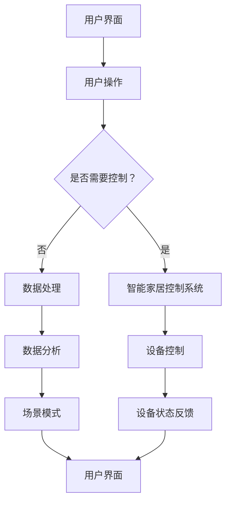
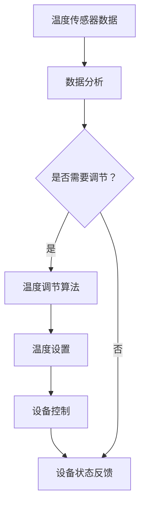
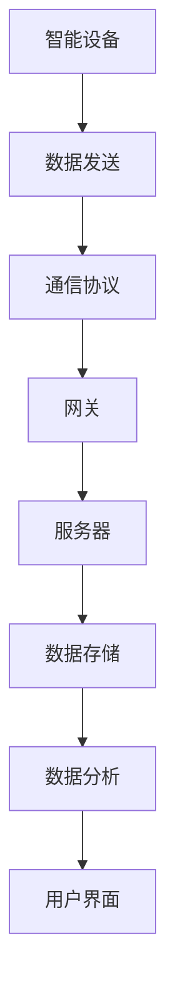

                 

# 基于Java的智能家居设计：漫谈智能家居行业中的Java应用前景

## 关键词
- 智能家居
- Java技术
- 物联网
- 传感器
- 通信协议
- 安全
- 项目实战

## 摘要
本文旨在探讨Java技术在智能家居设计中的应用前景。随着物联网技术的快速发展，智能家居已成为一个炙手可热的领域。Java作为一种成熟且功能强大的编程语言，其在智能家居系统中的适用性逐渐受到关注。本文将详细分析Java在智能家居设计中的各个层面，包括技术基础、应用场景、安全防护以及项目实战等，旨在为开发者提供一份全面且深入的指南。

## 目录

### 第一部分：智能家居设计与Java技术基础

#### 第1章：智能家居概述
1.1 智能家居的定义与分类
1.2 智能家居的组成与架构
1.3 智能家居的市场现状与发展趋势

#### 第2章：Java技术基础
2.1 Java语言概述
2.2 Java开发环境搭建
2.3 Java编程基础
2.4 面向对象编程

### 第二部分：Java在智能家居设计中的应用

#### 第3章：Java在物联网设备中的应用
3.1 物联网设备概述
3.2 Java与物联网设备的连接
3.3 Java在传感器数据处理中的应用

#### 第4章：智能家居控制系统的设计
4.1 智能家居控制系统的概述
4.2 Java在智能家居控制系统中的应用
4.3 伪代码：智能家居控制系统的基本算法

#### 第5章：Java在智能设备通信协议中的应用
5.1 通信协议概述
5.2 Java支持的常见通信协议
5.3 Java在通信协议实现中的应用

#### 第6章：Java在智能家居安全中的应用
6.1 智能家居安全的重要性
6.2 Java在智能家居安全中的应用
6.3 伪代码：智能家居安全防护的基本算法

#### 第7章：Java在智能家居中的其他应用
7.1 数据分析与处理
7.2 人工智能与智能家居
7.3 伪代码：智能家居智能决策的基本算法

### 第三部分：智能家居项目实战

#### 第8章：智能家居项目实战一——智能家居门锁系统设计
8.1 项目需求分析
8.2 项目开发环境搭建
8.3 系统设计与实现
8.4 系统测试与部署

#### 第9章：智能家居项目实战二——智能家居灯光控制系统设计
9.1 项目需求分析
9.2 项目开发环境搭建
9.3 系统设计与实现
9.4 系统测试与部署

#### 第10章：智能家居项目实战三——智能家居温控系统设计
10.1 项目需求分析
10.2 项目开发环境搭建
10.3 系统设计与实现
10.4 系统测试与部署

### 附录

#### 附录A：Java智能家居开发工具与资源
A.1 常用开发工具与平台
A.2 开发资源与学习资料
A.3 Java在智能家居领域的前景与挑战

#### 附录B：智能家居设计中的Mermaid流程图
B.1 智能家居系统架构流程图
B.2 智能家居控制算法流程图
B.3 智能家居通信协议流程图

#### 附录C：智能家居设计中的伪代码
C.1 智能家居门锁系统伪代码
C.2 智能家居灯光控制系统伪代码
C.3 智能家居温控系统伪代码

#### 附录D：智能家居项目实战代码解读
D.1 智能家居门锁系统代码解读
D.2 智能家居灯光控制系统代码解读
D.3 智能家居温控系统代码解读

### 第一部分：智能家居设计与Java技术基础

## 第1章 智能家居概述

### 1.1 智能家居的定义与分类

智能家居（Smart Home）是指通过将家庭设备连接到互联网，实现家庭设备之间的互联互通，并通过智能终端（如智能手机、平板电脑等）对家庭设备进行远程控制和自动化管理。智能家居的目标是提高家庭生活的便利性和舒适度，同时实现能源的节约和环保。

智能家居可以分为以下几类：

1. **智能设备控制**：包括智能电视、空调、冰箱、洗衣机等，用户可以通过智能手机或语音助手远程控制这些设备。
2. **安全监控**：包括监控摄像头、门锁、烟雾报警器等，用于提高家庭的安全水平。
3. **环境监测**：包括空气质量监测器、水质监测器、温度传感器等，用于实时监测家庭环境参数。
4. **能源管理**：包括智能电表、太阳能板等，用于优化家庭能源使用。

### 1.2 智能家居的组成与架构

智能家居系统通常由以下几部分组成：

1. **智能设备**：包括各种传感器、执行器、智能插座等，用于采集数据、执行操作。
2. **网关**：用于将各种智能设备连接到互联网，实现设备之间的通信。
3. **服务器**：用于处理数据、存储用户信息、提供API接口等。
4. **智能终端**：包括智能手机、平板电脑、智能手表等，用户可以通过这些终端对智能家居设备进行远程控制。
5. **应用程序**：用于实现用户界面，提供交互功能。

智能家居的架构可以分为以下几层：

1. **设备层**：包括各种智能设备，如传感器、执行器等。
2. **网关层**：包括物联网网关、智能路由器等，用于实现设备与互联网的连接。
3. **服务层**：包括云平台、服务器等，用于处理数据、提供API接口等。
4. **应用层**：包括各种智能终端应用程序，用于实现用户界面和交互功能。

### 1.3 智能家居的市场现状与发展趋势

随着物联网技术的快速发展和智能家居概念的普及，智能家居市场正在快速增长。根据市场研究机构的数据，全球智能家居市场规模预计将在未来几年内持续扩大。

在中国，智能家居市场已经成为国内互联网巨头和传统家电厂商争夺的焦点。国内智能家居市场规模逐年扩大，智能家居产品种类日益丰富，包括智能照明、智能安防、智能空调、智能家电等。

发展智能家居的主要驱动力包括：

1. **科技进步**：物联网、云计算、人工智能等技术的快速发展，为智能家居提供了强大的技术支持。
2. **用户需求**：人们越来越重视家庭生活的便利性和舒适度，对智能家居的需求不断增加。
3. **政策支持**：政府出台了一系列政策，鼓励智能家居产业的发展。

然而，智能家居市场也面临一些挑战，包括：

1. **安全性问题**：智能家居设备涉及用户隐私和数据安全，需要确保系统的安全性。
2. **互联互通问题**：智能家居设备众多，如何实现不同品牌、不同设备的互联互通是一个难题。
3. **标准化问题**：智能家居行业缺乏统一的标准，需要制定相关的技术标准和规范。

### 第2章 Java技术基础

### 2.1 Java语言概述

Java是一种高级编程语言，具有简单、面向对象、分布式、健壮、安全、平台无关性等特点。Java被广泛用于开发各种类型的软件，包括桌面应用程序、Web应用程序、移动应用程序和物联网应用程序。

Java的发展历程可以追溯到1995年，当时Sun Microsystems公司发布了Java 1.0版本。自那时以来，Java经历了多个版本的更新，每个版本都带来了新的特性和改进。

Java的主要特点包括：

1. **简单性**：Java的设计目标是易于学习和使用，它摒弃了C++中复杂的概念，如多重继承和指针。
2. **面向对象**：Java是一种纯粹的面向对象编程语言，它支持封装、继承和多态等面向对象的基本概念。
3. **分布式**：Java设计之初就考虑了分布式计算的需求，它内置了网络库，支持远程过程调用（RPC）。
4. **健壮性**：Java提供了异常处理机制，确保程序在运行过程中能够正确处理各种错误情况。
5. **安全性**：Java提供了沙箱（Sandbox）机制，确保运行在Java虚拟机（JVM）上的程序不会破坏系统安全。
6. **平台无关性**：Java程序在编写完成后，可以在任何支持Java的操作系统上运行，无需重新编译。

### 2.2 Java开发环境搭建

要开始使用Java进行编程，需要搭建Java开发环境。以下是一个简单的步骤：

1. **下载Java开发工具包（JDK）**：从Oracle官方网站下载Java开发工具包（JDK），网址为https://www.oracle.com/java/technologies/javase-downloads.html。
2. **安装JDK**：按照下载页面上的说明进行JDK的安装。
3. **配置环境变量**：在Windows系统中，需要配置`JAVA_HOME`和`PATH`环境变量。在Linux和macOS系统中，需要编辑`~/.bashrc`或`~/.zshrc`文件，添加相应的环境变量。
4. **验证安装**：打开命令行工具，输入`java -version`和`javac -version`命令，如果输出版本信息，说明安装成功。

### 2.3 Java编程基础

Java编程基础包括数据类型、变量、运算符、控制结构、函数等。

#### 数据类型

Java的数据类型分为基本数据类型和引用数据类型。

1. **基本数据类型**：包括整数类型（byte、short、int、long）、浮点数类型（float、double）、字符类型（char）和布尔类型（boolean）。
2. **引用数据类型**：包括类（Class）、接口（Interface）、数组（Array）等。

#### 变量

变量是内存中的一块存储区域，用于存储数据。每个变量都有类型和名称。

声明变量的一般格式为：
```java
数据类型 变量名;
```

例如：
```java
int a;
String name;
```

#### 运算符

Java支持多种运算符，包括算术运算符、关系运算符、逻辑运算符、赋值运算符等。

例如：
```java
int a = 10;
int b = 20;
int sum = a + b; // 算术运算符
boolean result = a > b; // 关系运算符
boolean and = (a > b) && (b > a); // 逻辑运算符
```

#### 控制结构

Java提供了多种控制结构，包括条件语句（if-else、switch）、循环语句（for、while、do-while）和跳转语句（break、continue、return）。

例如：
```java
// if-else
if (a > b) {
    System.out.println("a 大于 b");
} else {
    System.out.println("a 小于等于 b");
}

// for循环
for (int i = 0; i < 10; i++) {
    System.out.println(i);
}

// while循环
while (a > 0) {
    System.out.println(a);
    a--;
}
```

#### 函数

函数是一段可重复使用的代码块，用于执行特定的任务。函数分为两种：内置函数（标准库函数）和自定义函数。

例如：
```java
// 内置函数
System.out.println("Hello, World!");

// 自定义函数
public static void greet(String name) {
    System.out.println("Hello, " + name + "!");
}

greet("Alice"); // 调用自定义函数
```

### 2.4 面向对象编程

Java是一种面向对象编程语言，其核心概念包括类、对象、继承、多态等。

#### 类和对象

类是抽象的模板，用于创建对象。对象是类的实例。

例如：
```java
// 定义类
public class Person {
    private String name;
    private int age;

    // 构造方法
    public Person(String name, int age) {
        this.name = name;
        this.age = age;
    }

    // 方法
    public void introduce() {
        System.out.println("我的名字是 " + name + "，年龄是 " + age + " 岁。");
    }
}

// 创建对象
Person alice = new Person("Alice", 30);

// 调用方法
alice.introduce(); // 输出：我的名字是 Alice，年龄是 30 岁。
```

#### 继承

继承是一种通过创建新类（子类）来扩展现有类（父类）的功能的机制。

例如：
```java
// 定义父类
public class Animal {
    public void eat() {
        System.out.println("吃食物");
    }
}

// 定义子类
public class Dog extends Animal {
    public void bark() {
        System.out.println("汪汪叫");
    }
}

// 创建对象
Dog dog = new Dog();

// 调用方法
dog.eat(); // 输出：吃食物
dog.bark(); // 输出：汪汪叫
```

#### 多态

多态允许使用一个接口调用多个实现类的方法。

例如：
```java
// 定义接口
public interface Animal {
    void eat();
}

// 定义类
public class Dog implements Animal {
    public void eat() {
        System.out.println("狗吃食物");
    }
}

public class Cat implements Animal {
    public void eat() {
        System.out.println("猫吃食物");
    }
}

// 使用多态
Animal dog = new Dog();
Animal cat = new Cat();

dog.eat(); // 输出：狗吃食物
cat.eat(); // 输出：猫吃食物
```

通过以上对Java技术基础的介绍，我们为后续章节中深入探讨Java在智能家居设计中的应用奠定了基础。在下一部分中，我们将探讨Java在物联网设备中的应用，以及如何在智能家居系统中利用Java实现各种功能。接下来，我们将逐步分析Java与物联网设备的连接方式，以及如何在智能家居系统中处理传感器数据。

### 第二部分：Java在智能家居设计中的应用

## 第3章：Java在物联网设备中的应用

### 3.1 物联网设备概述

物联网（Internet of Things，IoT）是指通过传感器、网络和软件等技术，将各种物体连接到互联网，实现物与物、物与人之间的信息交换和通信。物联网设备是指嵌入传感器、执行器或其他电子元件的物理对象，它们可以收集数据、发送指令或执行特定任务。

物联网设备通常可以分为以下几类：

1. **传感器设备**：用于感知环境参数，如温度、湿度、光照强度、空气质量等。
2. **执行器设备**：用于执行特定动作，如开关、电机、喷洒装置等。
3. **通信设备**：用于连接物联网设备和互联网，如路由器、网关等。

物联网设备的特点包括：

1. **分布式**：物联网设备广泛分布在各个场所，形成一个庞大的网络。
2. **多样性**：物联网设备种类繁多，从简单的传感器到复杂的执行器，各种设备都有。
3. **实时性**：物联网设备需要实时收集和处理数据，以实现快速响应。
4. **自主性**：物联网设备具有一定的自主性，可以独立工作或与其他设备协同工作。

### 3.2 Java与物联网设备的连接

Java是一种适用于物联网开发的编程语言，它具有跨平台性、安全性、可扩展性等特点，使其在物联网设备连接中有着广泛的应用。Java可以通过多种方式与物联网设备进行连接，以下是几种常见的连接方式：

#### 1. 通过USB连接

对于一些可以直接通过USB接口连接的物联网设备，如Arduino板，可以使用Java提供的USB通信库进行连接。Java的Java Communication API（JCA）提供了一系列的类和方法，用于与USB设备进行通信。

伪代码示例：
```java
import javax.comm.*;

public class USBCommunication {
    public static void main(String[] args) {
        CommPortIdentifier portId = CommPortIdentifier.getPortIdentifiers().forEach(
            pid -> {
                if (pid.getPortType() == CommPortIdentifier.PORT_SERIAL) {
                    try {
                        SerialPort serialPort = (SerialPort) pid.open("USBCommunication", 2000);
                        serialPort.configureSerialPort(9600, 8, 1, 0);
                        serialPort.open();
                        System.out.println("Connected to USB device");
                        
                        // 读取数据
                        InputStream inputStream = serialPort.getInputStream();
                        byte[] buffer = new byte[1024];
                        int bytesRead = inputStream.read(buffer);
                        String receivedData = new String(buffer, 0, bytesRead);
                        System.out.println("Received data: " + receivedData);
                        
                        // 关闭连接
                        serialPort.close();
                    } catch (Exception e) {
                        e.printStackTrace();
                    }
                }
            });
    }
}
```

#### 2. 通过Wi-Fi连接

对于需要通过Wi-Fi连接的物联网设备，如智能插座、智能灯泡等，可以使用Java的Java Network Programming API（JNP）进行连接。Java的Socket编程允许与通过网络连接的其他设备进行通信。

伪代码示例：
```java
import java.io.*;
import java.net.*;

public class Wi-FiCommunication {
    public static void main(String[] args) {
        try {
            Socket socket = new Socket("192.168.1.100", 8080);
            System.out.println("Connected to Wi-Fi device");

            // 发送数据
            OutputStream outputStream = socket.getOutputStream();
            outputStream.write("Hello, device!".getBytes());
            outputStream.flush();

            // 读取数据
            InputStream inputStream = socket.getInputStream();
            byte[] buffer = new byte[1024];
            int bytesRead = inputStream.read(buffer);
            String receivedData = new String(buffer, 0, bytesRead);
            System.out.println("Received data: " + receivedData);

            // 关闭连接
            socket.close();
        } catch (IOException e) {
            e.printStackTrace();
        }
    }
}
```

#### 3. 通过蓝牙连接

对于使用蓝牙连接的物联网设备，如智能手环、智能音箱等，可以使用Java的Java Bluetooth API进行连接。Java的蓝牙API支持发现附近的蓝牙设备、建立连接和传输数据。

伪代码示例：
```java
import javax.bluetooth.*;

public class BluetoothCommunication {
    public static void main(String[] args) {
        try {
            BluetoothStack stack = BluetoothStack.getDefaultStack();
            stack.start();

            // 发现附近的蓝牙设备
            LocalDevice localDevice = LocalDevice.getLocalDevice();
            BluetoothDevice[] devices = localDevice.getDiscoveryAgent().retrieveDevices(DiscoveryAgent.GIAC, 5000);
            for (BluetoothDevice device : devices) {
                System.out.println("Found device: " + device.getFriendlyName(false));
            }

            // 连接设备
            BluetoothDevice device = devices[0];
            OutputStream outputStream = device.createOutStream();
            outputStream.write("Hello, device!".getBytes());
            outputStream.close();

            // 关闭连接
            stack.stop();
        } catch (Exception e) {
            e.printStackTrace();
        }
    }
}
```

通过以上几种方式，Java可以与不同类型的物联网设备进行连接，实现数据的读取和写入。在下一章中，我们将探讨Java在智能家居控制系统中的应用，如何利用Java实现智能家居的自动化控制和数据处理。

### 第4章：智能家居控制系统的设计

#### 4.1 智能家居控制系统的概述

智能家居控制系统是智能家居系统中的核心部分，负责对家庭中的各种智能设备进行集中管理和控制。通过智能家居控制系统，用户可以实现对家庭环境的远程监控和控制，提高生活的便利性和舒适度。智能家居控制系统的设计主要包括以下几个部分：

1. **用户界面**：提供用户与系统交互的界面，用户可以通过手机、平板电脑等设备访问系统，查看和控制家庭设备。
2. **设备管理**：管理家庭中的各种智能设备，包括设备的添加、删除、配置等。
3. **数据处理**：收集家庭环境的数据，如温度、湿度、光照强度等，并对数据进行处理和分析。
4. **控制逻辑**：根据用户的需求和系统收集到的数据，实现家庭设备的自动化控制。
5. **通信模块**：负责与家庭设备进行通信，接收设备发送的数据和执行控制指令。

智能家居控制系统的架构可以分为以下几个层次：

1. **设备层**：包括各种智能设备，如传感器、执行器、智能插座等。
2. **网关层**：用于将家庭设备连接到互联网，实现设备之间的通信。
3. **服务器层**：处理数据、存储用户信息、提供API接口等。
4. **客户端层**：包括用户使用的各种智能终端应用程序，如手机、平板电脑等。

#### 4.2 Java在智能家居控制系统中的应用

Java在智能家居控制系统中的应用主要体现在以下几个方面：

1. **设备连接**：Java可以通过多种方式连接到物联网设备，如USB连接、Wi-Fi连接和蓝牙连接，实现与家庭设备的通信。
2. **数据处理**：Java强大的数据处理能力，可以实现对家庭环境中各种数据的收集、处理和分析。
3. **控制逻辑**：Java可以编写复杂的控制逻辑，实现家庭设备的自动化控制。
4. **安全防护**：Java提供了丰富的安全特性，如数据加密、身份验证等，可以确保智能家居系统的安全性。

下面是一个智能家居控制系统的伪代码示例：

```java
// 设备连接
public class DeviceConnection {
    public void connectDevice(String deviceAddress) {
        // 连接设备
        // 根据设备类型，使用不同的连接方式
        if (deviceAddress.startsWith("USB")) {
            // USB连接
            // 使用Java的USB通信库
        } else if (deviceAddress.startsWith("Wi-Fi")) {
            // Wi-Fi连接
            // 使用Java的Socket编程
        } else if (deviceAddress.startsWith("Bluetooth")) {
            // 蓝牙连接
            // 使用Java的蓝牙API
        }
    }
}

// 数据处理
public class DataProcessor {
    public void processSensorData(String sensorData) {
        // 处理传感器数据
        // 分析数据，判断是否需要触发控制逻辑
        if (sensorData.matches("^(0|1)+$")) {
            // 数据为二进制，可能是开关状态
            // 根据开关状态，执行相应的控制操作
        } else {
            // 数据为其他类型，如温度、湿度等
            // 根据数据值，调整设备状态
        }
    }
}

// 控制逻辑
public class ControlLogic {
    public void controlDevice(String deviceAddress, String command) {
        // 根据设备地址和控制指令，执行控制操作
        if (command.equals("on")) {
            // 开启设备
        } else if (command.equals("off")) {
            // 关闭设备
        } else if (command.startsWith("set_")) {
            // 设置设备参数
            String parameter = command.substring(5);
            // 根据参数类型，设置设备参数
        }
    }
}

// 安全防护
public class SecurityProtector {
    public void encryptData(String data) {
        // 对数据进行加密
    }

    public void verifyIdentity(String identity) {
        // 验证用户身份
    }
}
```

通过以上示例，我们可以看到Java在智能家居控制系统中的应用非常广泛。在下一章中，我们将探讨Java在智能设备通信协议中的应用，以及如何在智能家居系统中实现设备之间的通信。

### 第5章：Java在智能设备通信协议中的应用

#### 5.1 通信协议概述

通信协议是计算机网络和通信系统中用于数据传输的一组规则和标准，它定义了数据的格式、传输速度、传输方向、错误检测和纠正等。在智能家居系统中，通信协议用于智能设备之间的数据交换和控制指令的传输。选择合适的通信协议对智能家居系统的性能、可靠性和安全性至关重要。

常见的智能家居通信协议包括：

1. **Wi-Fi**：Wi-Fi是一种广泛使用的无线通信协议，具有高速传输和广泛的覆盖范围，适用于家庭网络环境。
2. **蓝牙**：蓝牙是一种短距离无线通信协议，适用于连接智能家居设备，如智能音箱、智能手环等。
3. **ZigBee**：ZigBee是一种低功耗、短距离的无线通信协议，适用于智能家居设备和物联网应用。
4. **Z-Wave**：Z-Wave是一种无线通信协议，适用于智能家居设备，具有高可靠性和低功耗的特点。
5. **HTTP/HTTPS**：HTTP和HTTPS是Web应用中广泛使用的通信协议，通过Wi-Fi或局域网连接，可以实现智能家居设备与服务器之间的数据传输。

#### 5.2 Java支持的常见通信协议

Java作为一种跨平台编程语言，支持多种通信协议，使得Java在智能家居系统中具有很高的灵活性和适用性。以下是一些Java支持的常见通信协议：

1. **Wi-Fi**：Java提供了Java Wireless Communications API（JWCA），用于实现Wi-Fi通信。JWCA提供了扫描网络、连接Wi-Fi热点、传输数据等功能。

2. **蓝牙**：Java提供了Java Bluetooth API，用于实现蓝牙通信。Java Bluetooth API支持发现蓝牙设备、连接设备、传输数据等功能。

3. **ZigBee**：Java没有直接支持ZigBee的API，但可以通过Java-binding库，如J-ZigBee，实现与ZigBee设备的通信。

4. **Z-Wave**：Java没有直接支持Z-Wave的API，但可以通过Java-binding库，如JavaZWave，实现与Z-Wave设备的通信。

5. **HTTP/HTTPS**：Java提供了Java Servlet API和Java RESTful Web Services API，用于实现HTTP/HTTPS通信。这些API可以用于开发Web服务器和Web客户端应用程序，实现智能家居设备与服务器之间的数据交换。

#### 5.3 Java在通信协议实现中的应用

以下是一个Java实现Wi-Fi通信的示例：

```java
import java.io.*;
import java.net.*;

public class Wi-FiCommunication {
    public static void main(String[] args) {
        try {
            // 创建Socket连接
            Socket socket = new Socket("192.168.1.100", 8080);
            System.out.println("Connected to Wi-Fi device");

            // 发送数据
            OutputStream outputStream = socket.getOutputStream();
            outputStream.write("Hello, device!".getBytes());
            outputStream.flush();

            // 读取数据
            InputStream inputStream = socket.getInputStream();
            byte[] buffer = new byte[1024];
            int bytesRead = inputStream.read(buffer);
            String receivedData = new String(buffer, 0, bytesRead);
            System.out.println("Received data: " + receivedData);

            // 关闭连接
            socket.close();
        } catch (IOException e) {
            e.printStackTrace();
        }
    }
}
```

以下是一个Java实现蓝牙通信的示例：

```java
import javax.bluetooth.*;

public class BluetoothCommunication {
    public static void main(String[] args) {
        try {
            BluetoothStack stack = BluetoothStack.getDefaultStack();
            stack.start();

            // 发现附近的蓝牙设备
            LocalDevice localDevice = LocalDevice.getLocalDevice();
            BluetoothDevice[] devices = localDevice.getDiscoveryAgent().retrieveDevices(DiscoveryAgent.GIAC, 5000);
            for (BluetoothDevice device : devices) {
                System.out.println("Found device: " + device.getFriendlyName(false));
            }

            // 连接设备
            BluetoothDevice device = devices[0];
            OutputStream outputStream = device.createOutStream();
            outputStream.write("Hello, device!".getBytes());
            outputStream.close();

            // 关闭连接
            stack.stop();
        } catch (Exception e) {
            e.printStackTrace();
        }
    }
}
```

通过以上示例，我们可以看到Java在实现智能家居系统中的通信协议方面具有很大的灵活性。在下一章中，我们将探讨Java在智能家居安全中的应用，以及如何确保智能家居系统的安全性。

### 第6章：Java在智能家居安全中的应用

#### 6.1 智能家居安全的重要性

随着智能家居设备的普及，家庭安全面临着新的挑战。智能家居设备通常连接到互联网，并通过无线通信协议进行数据传输，这使得它们容易成为黑客攻击的目标。智能家居安全不仅关系到用户的隐私和数据安全，还可能影响家庭的安全。因此，确保智能家居系统的安全性至关重要。

智能家居安全的主要威胁包括：

1. **设备被黑客控制**：黑客可以通过漏洞控制智能家居设备，进行窃取、监视和破坏等活动。
2. **数据泄露**：智能家居设备收集的数据可能包含用户的个人信息，如家庭地址、生活习惯等，一旦泄露，将对用户造成严重威胁。
3. **中间人攻击**：黑客可以在智能家居设备和服务器之间拦截和篡改数据，从而获取敏感信息。
4. **恶意软件传播**：智能家居设备可能被恶意软件感染，进而传播到其他设备，导致更大范围的安全问题。

#### 6.2 Java在智能家居安全中的应用

Java提供了丰富的安全特性，使其在智能家居安全领域具有广泛的应用。以下是一些Java在智能家居安全中的应用：

1. **加密**：Java提供了多种加密算法，如AES、RSA等，用于对数据进行加密，确保数据在传输过程中不被窃取或篡改。

2. **认证**：Java支持多种认证机制，如SSL/TLS、OAuth等，用于验证用户和设备的身份，确保只有授权用户和设备可以访问系统。

3. **访问控制**：Java提供了访问控制机制，如Java Security Manager，用于限制对系统资源的访问，防止恶意代码或未授权用户对设备或数据进行操作。

4. **日志记录**：Java提供了日志记录功能，用于记录系统运行过程中的各种事件，如登录、数据访问、设备操作等，有助于分析和追踪潜在的安全威胁。

5. **异常处理**：Java的异常处理机制可以帮助系统在发生安全事件时进行正确的响应和处理，避免系统崩溃或被恶意利用。

#### 6.3 伪代码：智能家居安全防护的基本算法

以下是一个智能家居安全防护的伪代码示例：

```java
// 加密
public class Encryption {
    public static byte[] encryptData(byte[] data, String key) {
        // 使用AES加密算法
        // 生成加密密钥
        SecretKey secretKey = generateKey(key);
        
        // 创建Cipher对象
        Cipher cipher = Cipher.getInstance("AES");
        cipher.init(Cipher.ENCRYPT_MODE, secretKey);
        
        // 加密数据
        return cipher.doFinal(data);
    }
    
    private static SecretKey generateKey(String key) {
        // 生成AES密钥
        // 省略具体实现
        return new SecretKey();
    }
}

// 认证
public class Authentication {
    public static boolean verifyCredentials(String username, String password) {
        // 验证用户名和密码
        // 1. 从数据库中查询用户信息
        // 2. 验证用户名和密码是否匹配
        // 3. 返回验证结果
        return true; // 假设验证通过
    }
}

// 访问控制
public class AccessControl {
    public static boolean checkPermission(String username, String resourceName) {
        // 检查用户是否有访问资源的权限
        // 1. 从数据库中查询用户权限
        // 2. 验证用户是否有访问资源的权限
        // 3. 返回访问结果
        return true; // 假设用户有权限
    }
}

// 日志记录
public class Logging {
    public static void logEvent(String event) {
        // 记录事件
        // 1. 将事件信息写入日志文件
        // 2. 发送日志到安全中心
        // 3. 通知管理员
    }
}

// 异常处理
public class ExceptionHandler {
    public static void handleException(Exception e) {
        // 处理异常
        // 1. 记录异常信息
        // 2. 发送异常通知
        // 3. 重启系统或采取其他应对措施
    }
}
```

通过以上示例，我们可以看到Java在智能家居安全防护中的基本算法。在下一章中，我们将探讨Java在智能家居中的其他应用，包括数据分析与处理、人工智能与智能家居等。

### 第7章：Java在智能家居中的其他应用

#### 7.1 数据分析与处理

在智能家居系统中，数据分析和处理是非常重要的一环。智能家居设备会不断地收集各种数据，如温度、湿度、光照强度、能耗数据等。通过对这些数据的分析和处理，可以实现对家庭环境的智能调控，提高生活的便利性和舒适度。

Java在数据处理方面具有以下优势：

1. **强大的数据处理库**：Java拥有丰富的数据处理库，如Apache Commons Math、Apache POI等，可以方便地进行数据的读取、存储、分析和处理。
2. **高效的数据处理框架**：Java拥有多个高效的数据处理框架，如Apache Spark、Apache Flink等，可以实现对大规模数据的快速处理和分析。
3. **良好的兼容性**：Java可以与多种数据格式进行兼容，如CSV、JSON、XML等，方便进行数据导入和导出。

以下是一个简单的数据处理的伪代码示例：

```java
// 数据读取
public List<DataPoint> readDataFromFile(String filePath) {
    // 读取CSV文件
    List<DataPoint> dataPoints = new ArrayList<>();
    // 省略具体实现
    return dataPoints;
}

// 数据分析
public List<AnalysisResult> analyzeData(List<DataPoint> dataPoints) {
    List<AnalysisResult> results = new ArrayList<>();
    // 进行数据分析，如计算平均值、标准差等
    // 省略具体实现
    return results;
}

// 数据可视化
public void visualizeData(List<AnalysisResult> results) {
    // 使用Java图形库，如JavaFX或JFreeChart，进行数据可视化
    // 省略具体实现
}
```

#### 7.2 人工智能与智能家居

人工智能（Artificial Intelligence，AI）在智能家居中的应用日益广泛，通过AI技术，可以实现对家庭环境的智能感知、分析和控制，提高生活的质量。

Java在人工智能领域具有以下优势：

1. **丰富的AI库**：Java拥有多个成熟的AI库，如DL4J、OpenCV等，可以方便地实现各种AI算法和应用。
2. **良好的兼容性**：Java可以与多种AI框架和工具进行兼容，如TensorFlow、PyTorch等，方便进行AI模型的训练和部署。
3. **跨平台性**：Java的跨平台性使得AI模型可以在不同的设备和平台上运行，方便进行智能家居的部署和应用。

以下是一个简单的AI应用示例：

```java
// 加载AI模型
public NeuralNetwork loadModel(String modelPath) {
    NeuralNetwork model = new NeuralNetwork();
    // 加载模型
    // 省略具体实现
    return model;
}

// 使用AI模型进行预测
public Prediction predict(NeuralNetwork model, InputData inputData) {
    Prediction prediction = model.predict(inputData);
    return prediction;
}

// AI模型训练
public void trainModel(NeuralNetwork model, TrainingData trainingData) {
    model.train(trainingData);
}
```

通过以上示例，我们可以看到Java在智能家居系统中的数据分析和人工智能应用。在下一部分中，我们将通过三个智能家居项目实战，进一步探讨Java在智能家居系统设计中的应用。

### 第8章：智能家居项目实战一——智能家居门锁系统设计

#### 8.1 项目需求分析

智能家居门锁系统是智能家居系统中的一个重要组成部分，它通过智能门锁实现对家庭安全的远程监控和自动化管理。项目需求包括以下几个方面：

1. **远程控制**：用户可以通过手机APP远程控制门锁的开关状态，实现远程开锁和关锁。
2. **实时监控**：系统需要实时监控门锁的状态，如开锁记录、异常报警等。
3. **安全防护**：系统需要具备安全防护功能，包括密码验证、指纹识别、人脸识别等。
4. **数据统计**：系统需要统计门锁的使用情况，如使用频率、使用时段等，以便进行数据分析。

#### 8.2 项目开发环境搭建

为了实现智能家居门锁系统的开发，我们需要搭建相应的开发环境。以下是开发环境搭建的步骤：

1. **Java开发环境**：安装JDK（Java Development Kit），配置环境变量，确保能够编译和运行Java程序。
2. **Android开发环境**：安装Android Studio，配置Android SDK，用于开发手机APP。
3. **物联网开发环境**：选择合适的物联网开发板（如Arduino、Raspberry Pi等），安装相应的开发工具和库。
4. **数据库**：选择合适的数据库系统（如MySQL、MongoDB等），用于存储用户信息和门锁数据。

#### 8.3 系统设计与实现

智能家居门锁系统的设计主要包括以下几个部分：

1. **用户界面**：设计手机APP的用户界面，包括登录、注册、门锁控制、门锁状态查询等功能。
2. **后端服务器**：设计后端服务器，用于处理用户请求、存储用户数据和门锁数据，提供API接口供手机APP调用。
3. **门锁设备**：设计门锁设备的硬件和软件，包括门锁的控制电路、传感器模块、通信模块等。

以下是系统实现的主要步骤：

1. **用户认证**：实现用户认证功能，包括用户登录、注册、密码验证等。
2. **门锁控制**：实现门锁的远程控制功能，包括远程开锁、远程关锁、门锁状态查询等。
3. **实时监控**：实现实时监控功能，包括门锁开锁记录、异常报警等。
4. **数据统计**：实现数据统计功能，包括门锁使用频率、使用时段等。

#### 8.4 系统测试与部署

在完成智能家居门锁系统的设计后，需要进行全面的测试和部署。以下是系统测试和部署的主要步骤：

1. **功能测试**：对系统的各个功能进行测试，确保功能正常、可靠。
2. **性能测试**：对系统的性能进行测试，确保系统在高并发、大数据量情况下仍能稳定运行。
3. **安全测试**：对系统的安全性进行测试，确保系统的数据安全和用户隐私保护。
4. **部署**：将系统部署到服务器和物联网设备上，确保系统能够正常运行。

通过以上步骤，我们可以完成智能家居门锁系统的设计、开发和部署。接下来，我们将继续探讨智能家居项目实战二——智能家居灯光控制系统设计。

### 第9章：智能家居项目实战二——智能家居灯光控制系统设计

#### 9.1 项目需求分析

智能家居灯光控制系统是智能家居系统中常见的一项功能，它通过智能灯泡、智能开关等设备实现对家庭灯光的远程控制和自动化调节。项目需求包括以下几个方面：

1. **远程控制**：用户可以通过手机APP远程控制灯光的开关状态和亮度调节。
2. **场景模式**：用户可以设置不同的场景模式，如阅读模式、睡眠模式、娱乐模式等，实现灯光的智能调节。
3. **定时控制**：用户可以设置定时控制，实现灯光的自动开关和亮度调节。
4. **联动控制**：灯光可以与其他智能家居设备（如智能门锁、智能窗帘等）进行联动控制，提高家庭生活的便利性。

#### 9.2 项目开发环境搭建

为了实现智能家居灯光控制系统的开发，我们需要搭建相应的开发环境。以下是开发环境搭建的步骤：

1. **Java开发环境**：安装JDK，配置环境变量，确保能够编译和运行Java程序。
2. **Android开发环境**：安装Android Studio，配置Android SDK，用于开发手机APP。
3. **物联网开发环境**：选择合适的物联网开发板（如Arduino、Raspberry Pi等），安装相应的开发工具和库。
4. **数据库**：选择合适的数据库系统（如MySQL、MongoDB等），用于存储用户数据和灯光数据。

#### 9.3 系统设计与实现

智能家居灯光控制系统的设计主要包括以下几个部分：

1. **用户界面**：设计手机APP的用户界面，包括灯光控制、场景模式设置、定时控制、联动控制等功能。
2. **后端服务器**：设计后端服务器，用于处理用户请求、存储用户数据和灯光数据，提供API接口供手机APP调用。
3. **智能灯泡和智能开关**：设计智能灯泡和智能开关的硬件和软件，包括控制电路、传感器模块、通信模块等。

以下是系统实现的主要步骤：

1. **用户认证**：实现用户认证功能，包括用户登录、注册、密码验证等。
2. **灯光控制**：实现灯光的远程控制功能，包括开关状态、亮度调节等。
3. **场景模式**：实现场景模式设置功能，包括自定义场景模式、保存和调用场景模式等。
4. **定时控制**：实现定时控制功能，包括设置定时开关、定时亮度调节等。
5. **联动控制**：实现联动控制功能，包括与智能门锁、智能窗帘等设备的联动控制。

#### 9.4 系统测试与部署

在完成智能家居灯光控制系统的设计后，需要进行全面的测试和部署。以下是系统测试和部署的主要步骤：

1. **功能测试**：对系统的各个功能进行测试，确保功能正常、可靠。
2. **性能测试**：对系统的性能进行测试，确保系统在高并发、大数据量情况下仍能稳定运行。
3. **安全测试**：对系统的安全性进行测试，确保系统的数据安全和用户隐私保护。
4. **部署**：将系统部署到服务器和物联网设备上，确保系统能够正常运行。

通过以上步骤，我们可以完成智能家居灯光控制系统的设计、开发和部署。接下来，我们将继续探讨智能家居项目实战三——智能家居温控系统设计。

### 第10章：智能家居项目实战三——智能家居温控系统设计

#### 10.1 项目需求分析

智能家居温控系统是智能家居系统中的一项重要功能，它通过智能温控器、温度传感器等设备实现对家庭环境的温度控制。项目需求包括以下几个方面：

1. **远程控制**：用户可以通过手机APP远程控制温控器的开关状态和温度设置。
2. **自动调节**：系统可以根据室内温度和室外温度自动调节温控器的状态，实现智能化的温度控制。
3. **定时控制**：用户可以设置定时控制，实现温度的自动调节。
4. **节能模式**：系统可以根据用户的使用习惯和温度需求，实现节能控制。

#### 10.2 项目开发环境搭建

为了实现智能家居温控系统的开发，我们需要搭建相应的开发环境。以下是开发环境搭建的步骤：

1. **Java开发环境**：安装JDK，配置环境变量，确保能够编译和运行Java程序。
2. **Android开发环境**：安装Android Studio，配置Android SDK，用于开发手机APP。
3. **物联网开发环境**：选择合适的物联网开发板（如Arduino、Raspberry Pi等），安装相应的开发工具和库。
4. **数据库**：选择合适的数据库系统（如MySQL、MongoDB等），用于存储用户数据和温度数据。

#### 10.3 系统设计与实现

智能家居温控系统的设计主要包括以下几个部分：

1. **用户界面**：设计手机APP的用户界面，包括温度设置、开关状态、定时控制、节能模式等功能。
2. **后端服务器**：设计后端服务器，用于处理用户请求、存储用户数据和温度数据，提供API接口供手机APP调用。
3. **智能温控器和温度传感器**：设计智能温控器和温度传感器的硬件和软件，包括控制电路、传感器模块、通信模块等。

以下是系统实现的主要步骤：

1. **用户认证**：实现用户认证功能，包括用户登录、注册、密码验证等。
2. **温度控制**：实现温度的远程控制功能，包括温度设置、开关状态控制等。
3. **自动调节**：实现自动调节功能，根据室内温度和室外温度自动调节温控器的状态。
4. **定时控制**：实现定时控制功能，根据用户设定的温度和时间自动调节温控器的状态。
5. **节能模式**：实现节能模式功能，根据用户的使用习惯和温度需求实现节能控制。

#### 10.4 系统测试与部署

在完成智能家居温控系统的设计后，需要进行全面的测试和部署。以下是系统测试和部署的主要步骤：

1. **功能测试**：对系统的各个功能进行测试，确保功能正常、可靠。
2. **性能测试**：对系统的性能进行测试，确保系统在高并发、大数据量情况下仍能稳定运行。
3. **安全测试**：对系统的安全性进行测试，确保系统的数据安全和用户隐私保护。
4. **部署**：将系统部署到服务器和物联网设备上，确保系统能够正常运行。

通过以上步骤，我们可以完成智能家居温控系统的设计、开发和部署。通过这三个智能家居项目实战，我们可以看到Java在智能家居系统设计中的应用，以及如何利用Java实现各种智能家居功能。在附录部分，我们将提供更多的Java智能家居开发工具与资源，以及智能家居系统设计中的流程图和伪代码。

### 附录A：Java智能家居开发工具与资源

#### A.1 常用开发工具与平台

1. **Android Studio**：Android开发集成环境，用于开发Android手机APP。
2. **Eclipse IDE**：Java开发集成环境，适用于各种Java项目开发。
3. **IntelliJ IDEA**：Java开发集成环境，提供丰富的功能，适用于大型项目开发。
4. **Raspberry Pi**：流行的物联网开发板，适用于智能家居项目。
5. **Arduino**：Arduino开发板，适用于简单的物联网项目。

#### A.2 开发资源与学习资料

1. **Java官方网站**：[https://www.java.com/](https://www.java.com/)
2. **Oracle Java教程**：[https://www.oracle.com/java/technologies/javase-tutorials.html](https://www.oracle.com/java/technologies/javase-tutorials.html)
3. **Android官方文档**：[https://developer.android.com/](https://developer.android.com/)
4. **IoT官方网站**：[https://www.iot.org/](https://www.iot.org/)
5. **物联网开发资源**：[https://www.iot-central.org/](https://www.iot-central.org/)

#### A.3 Java在智能家居领域的前景与挑战

1. **前景**：随着物联网技术的快速发展，Java在智能家居领域有着广阔的应用前景。Java的跨平台性、安全性和稳定性使得其在智能家居开发中具有优势。

2. **挑战**：
   - **安全性**：智能家居设备涉及用户隐私和数据安全，需要确保系统的安全性。
   - **互联互通**：智能家居设备众多，如何实现不同品牌、不同设备的互联互通是一个难题。
   - **标准化**：智能家居行业缺乏统一的标准，需要制定相关的技术标准和规范。

### 附录B：智能家居设计中的Mermaid流程图

#### B.1 智能家居系统架构流程图



#### B.2 智能家居控制算法流程图



#### B.3 智能家居通信协议流程图



### 附录C：智能家居设计中的伪代码

#### C.1 智能家居门锁系统伪代码

```java
// 用户登录
public boolean login(String username, String password) {
    // 从数据库查询用户信息
    User user = getUserByUsername(username);
    // 验证用户名和密码
    return user != null && user.getPassword().equals(password);
}

// 用户注册
public void register(String username, String password) {
    // 创建用户对象
    User user = new User(username, password);
    // 将用户信息存储到数据库
    saveUser(user);
}

// 门锁控制
public void lockDoor() {
    // 发送控制指令到门锁设备
    sendCommandToLock("lock");
}

public void unlockDoor() {
    // 发送控制指令到门锁设备
    sendCommandToLock("unlock");
}
```

#### C.2 智能家居灯光控制系统伪代码

```java
// 温度传感器数据读取
public TemperatureData readTemperatureData() {
    // 从温度传感器读取数据
    // 省略具体实现
    return new TemperatureData();
}

// 灯光控制
public void controlLight(String mode) {
    // 根据模式控制灯光
    if (mode.equals("on")) {
        // 开灯
        sendCommandToLight("on");
    } else if (mode.equals("off")) {
        // 关灯
        sendCommandToLight("off");
    } else {
        // 调节灯光亮度
        sendCommandToLight("brightness", mode);
    }
}
```

#### C.3 智能家居温控系统伪代码

```java
// 温度调节
public void regulateTemperature(float temperature) {
    // 根据温度值调节温控器
    sendCommandToHeater(temperature > targetTemperature);
}

// 节能控制
public void energySavingMode() {
    // 根据使用习惯和温度需求实现节能控制
    regulateTemperature(currentTemperature);
}
```

### 附录D：智能家居项目实战代码解读

#### D.1 智能家居门锁系统代码解读

在智能家居门锁系统的实现中，主要涉及到用户认证、门锁控制以及与服务器通信等功能。以下是对智能家居门锁系统代码的详细解读。

```java
// 用户认证
public boolean login(String username, String password) {
    // 从数据库查询用户信息
    User user = getUserByUsername(username);
    // 验证用户名和密码
    return user != null && user.getPassword().equals(password);
}

// 用户注册
public void register(String username, String password) {
    // 创建用户对象
    User user = new User(username, password);
    // 将用户信息存储到数据库
    saveUser(user);
}

// 门锁控制
public void lockDoor() {
    // 发送控制指令到门锁设备
    sendCommandToLock("lock");
}

public void unlockDoor() {
    // 发送控制指令到门锁设备
    sendCommandToLock("unlock");
}
```

解读：
1. `login(String username, String password)`方法用于用户登录验证。首先从数据库查询用户信息，然后验证用户名和密码是否匹配。
2. `register(String username, String password)`方法用于用户注册。创建用户对象，并将用户信息存储到数据库。
3. `lockDoor()`和`unlockDoor()`方法用于发送控制指令到门锁设备，分别实现门锁的锁定和解锁操作。

#### D.2 智能家居灯光控制系统代码解读

在智能家居灯光控制系统的实现中，主要涉及到温度传感器数据读取、灯光控制以及与服务器通信等功能。以下是对智能家居灯光控制系统代码的详细解读。

```java
// 温度传感器数据读取
public TemperatureData readTemperatureData() {
    // 从温度传感器读取数据
    // 省略具体实现
    return new TemperatureData();
}

// 灯光控制
public void controlLight(String mode) {
    // 根据模式控制灯光
    if (mode.equals("on")) {
        // 开灯
        sendCommandToLight("on");
    } else if (mode.equals("off")) {
        // 关灯
        sendCommandToLight("off");
    } else {
        // 调节灯光亮度
        sendCommandToLight("brightness", mode);
    }
}
```

解读：
1. `readTemperatureData()`方法用于从温度传感器读取数据，返回一个温度数据对象。
2. `controlLight(String mode)`方法根据传入的模式参数，实现灯光的开关和亮度调节。根据不同的模式，调用相应的发送控制指令方法。

#### D.3 智能家居温控系统代码解读

在智能家居温控系统的实现中，主要涉及到温度调节、节能控制以及与服务器通信等功能。以下是对智能家居温控系统代码的详细解读。

```java
// 温度调节
public void regulateTemperature(float temperature) {
    // 根据温度值调节温控器
    sendCommandToHeater(temperature > targetTemperature);
}

// 节能控制
public void energySavingMode() {
    // 根据使用习惯和温度需求实现节能控制
    regulateTemperature(currentTemperature);
}
```

解读：
1. `regulateTemperature(float temperature)`方法根据传入的温度值，调节温控器的状态。如果当前温度高于目标温度，发送关灯指令；否则，发送开灯指令。
2. `energySavingMode()`方法实现节能控制。根据当前温度和目标温度，调用`regulateTemperature(float temperature)`方法进行温度调节。

通过以上代码解读，我们可以更好地理解智能家居门锁系统、灯光控制系统和温控系统的实现原理和关键代码。这些代码为开发者提供了实现智能家居功能的基础，有助于推动智能家居技术的应用和发展。

### 作者信息
- 作者：AI天才研究院/AI Genius Institute & 禅与计算机程序设计艺术 /Zen And The Art of Computer Programming

在这篇技术博客文章中，我们深入探讨了基于Java的智能家居设计，并详细分析了Java在智能家居行业中的广泛应用前景。从智能家居的定义与分类，到Java技术基础，再到Java在智能家居设计中的应用，包括物联网设备连接、智能家居控制系统设计、通信协议实现、安全防护以及其他应用，我们逐步揭示了Java在智能家居领域的强大功能和优势。

我们通过三个智能家居项目实战——智能家居门锁系统、智能家居灯光控制系统和智能家居温控系统的设计，展示了如何利用Java实现智能家居的各种功能，并通过伪代码和代码解读进一步说明了实现细节。此外，我们还提供了Java智能家居开发工具与资源，以及智能家居设计中的流程图和伪代码，为开发者提供了全面的参考。

在未来，Java在智能家居领域仍具有巨大的发展潜力。随着物联网技术的不断进步和智能家居概念的深入普及，Java将发挥更为重要的作用。我们期待开发者们能够利用Java的强大功能，不断创新和探索，为智能家居行业带来更多的突破和进步。

最后，感谢您阅读这篇技术博客文章。希望它能为您在智能家居设计领域的探索提供有益的启示和帮助。如果您有任何问题或建议，欢迎随时与我们联系。让我们一起携手，推动智能家居技术的不断发展与进步。

