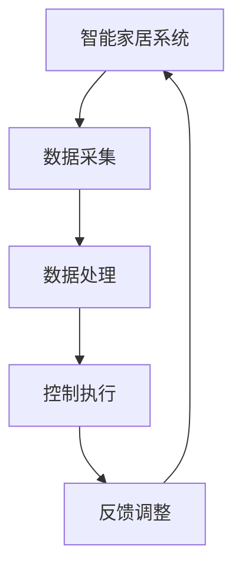

                 

# 基于Java的智能家居设计：通过Java提升智能家居系统的可靠性

> 关键词：Java, 智能家居, 可靠性, 硬件控制, 数据处理, 通信安全

> 摘要：本文将探讨如何利用Java编程语言设计和实现智能家居系统，并重点介绍如何通过Java提高智能家居系统的可靠性。文章分为四个主要部分：基础知识、智能家居系统设计、可靠性提升和实战案例，每个部分都将详细讲解相关技术和方法，帮助读者全面了解智能家居系统的设计和实现过程。

## 第一部分：基础知识

### 第1章: Java基础

#### 1.1 Java概述

Java是一种面向对象的编程语言，具有跨平台、安全性和可移植性等特点。自1995年推出以来，Java已经成为全球最流行的编程语言之一。Java的发展历史可以追溯到1991年，当时Sun Microsystems公司成立了一个名为“Green”的项目，旨在开发一种新的编程语言。经过多年的研发，Java 1.0于1995年正式发布。

#### 1.2 Java语法基础

Java语法基础包括变量、数据类型、运算符和流程控制等。变量是存储数据的容器，数据类型决定了变量的存储方式和取值范围。运算符用于执行各种计算操作，流程控制语句用于控制程序的执行流程。

#### 1.3 面向对象基础

面向对象编程是Java的核心思想，包括类与对象、继承、多态和抽象类与接口等概念。类是对象的模板，对象是类的实例。继承使得子类能够继承父类的属性和方法，多态则允许不同类的对象通过同一接口进行操作。

#### 1.4 异常处理与文件操作

异常处理用于处理程序运行过程中发生的错误，文件操作用于读取和写入文件。Java提供了丰富的异常处理机制和文件操作类库，方便开发者进行异常处理和文件操作。

### 第2章: Java高级特性

#### 2.1 Java集合框架

Java集合框架是Java标准库中的一部分，提供了常用的数据结构，如List、Set和Map等。集合框架提供了统一的接口和实现，方便开发者进行数据操作。

#### 2.2 输入输出流

输入输出流是Java进行文件读写和数据传输的基础。Java提供了多种输入输出流，包括字节流、字符流和文件流等，用于处理不同类型的输入输出操作。

#### 2.3 Java多线程编程

多线程编程是提高程序性能和响应速度的关键技术。Java提供了强大的多线程编程支持，包括线程创建、线程同步和线程池等。

#### 2.4 Java网络编程

网络编程是Java的重要应用领域之一。Java提供了丰富的网络编程类库，支持TCP/IP协议和HTTP协议等，方便开发者进行网络通信。

## 第二部分：智能家居系统设计

### 第3章: 智能家居系统概述

#### 3.1 智能家居系统架构

智能家居系统通常由硬件层、软件层和通信层组成。硬件层包括各种智能设备，如智能灯、智能插座和智能摄像头等；软件层包括控制软件和应用软件；通信层负责设备之间的数据传输和通信。

#### 3.2 智能家居系统的工作原理

智能家居系统的工作原理包括数据采集、数据处理和控制执行三个主要环节。数据采集通过传感器和设备采集环境数据和设备状态；数据处理通过算法对采集的数据进行分析和处理；控制执行根据处理结果控制设备执行相应的操作。

## 第三部分：智能家居系统可靠性提升

### 第4章: 智能家居系统可靠性提升

#### 4.1 系统可靠性概述

系统可靠性是指系统在规定时间内、规定条件下无故障运行的能力。系统可靠性通常用平均无故障时间（MTTF）和故障率（FIT）等指标来衡量。提升系统可靠性是智能家居系统设计的重要目标。

#### 4.2 系统安全性

系统安全性是指保护系统免受恶意攻击和非法访问的能力。系统安全性包括数据安全、设备安全和通信安全等。通过加密、认证和防火墙等技术手段，可以有效地提高系统安全性。

#### 4.3 系统可维护性

系统可维护性是指系统在运行过程中能够方便地修复和升级的能力。系统可维护性包括系统维护策略、系统监控和故障排除等。通过良好的设计、规范的操作和有效的维护，可以提高系统可维护性。

## 第四部分：实战案例

### 第5章: 实战项目一：智能灯控系统

#### 5.1 项目背景

智能灯控系统是一种智能家居系统，用于控制家中的照明设备。本项目的目标是实现一种通过Java编程语言控制的智能灯控系统，提高家居照明的便利性和智能化程度。

#### 5.2 系统需求

系统需求包括：

1. 支持多种照明设备的控制，如智能灯泡、智能调光台灯和智能射灯等。
2. 支持远程控制，通过智能手机或电脑对家居照明进行控制。
3. 支持定时开关灯功能，可以根据用户的需求自动控制照明设备的开关。
4. 支持亮度调节功能，可以实时调整照明设备的亮度。
5. 支持场景模式，可以根据不同的场景设置不同的照明效果。

#### 5.3 系统设计

系统设计主要包括硬件设计、软件设计和通信设计。

1. **硬件设计**：硬件设计包括照明设备、控制器和传感器等。照明设备可以是智能灯泡、智能调光台灯和智能射灯等；控制器可以是单片机或嵌入式系统；传感器可以是光线传感器、温度传感器和湿度传感器等。

2. **软件设计**：软件设计包括控制软件和应用软件。控制软件负责接收传感器数据和执行控制指令；应用软件提供用户界面，方便用户进行操作。

3. **通信设计**：通信设计包括有线通信和无线通信。有线通信可以使用以太网、USB等；无线通信可以使用Wi-Fi、蓝牙等。

#### 5.4 系统实现

系统实现主要包括以下步骤：

1. **硬件实现**：根据系统需求，选择合适的照明设备、控制器和传感器，并搭建硬件电路。

2. **软件实现**：编写控制软件和应用软件，实现照明设备的控制、数据采集和通信等功能。

3. **通信实现**：实现有线通信和无线通信，确保数据传输的可靠性和稳定性。

#### 5.5 系统测试

系统测试主要包括功能测试、性能测试和安全性测试。

1. **功能测试**：验证系统是否实现了所有的功能需求，如远程控制、定时开关灯、亮度调节和场景模式等。

2. **性能测试**：测试系统的响应速度、处理能力和稳定性，确保系统在各种条件下都能正常运行。

3. **安全性测试**：测试系统是否能够抵御恶意攻击和非法访问，确保系统的数据安全和设备安全。

### 第6章: 实战项目二：智能安防系统

#### 6.1 项目背景

智能安防系统是一种智能家居系统，用于保护家庭或企业的安全。本项目的目标是实现一种通过Java编程语言控制的智能安防系统，提高安全防范的能力。

#### 6.2 系统需求

系统需求包括：

1. 支持多种安防设备的控制，如摄像头、门禁系统和报警系统等。
2. 支持远程监控，通过智能手机或电脑实时查看监控视频。
3. 支持实时报警功能，当发生异常情况时及时向用户发送报警信息。
4. 支持历史记录查询，方便用户查看过去的监控记录。
5. 支持用户管理功能，可以设置不同的用户权限，确保系统安全。

#### 6.3 系统设计

系统设计主要包括硬件设计、软件设计和通信设计。

1. **硬件设计**：硬件设计包括安防设备、控制器和传感器等。安防设备可以是摄像头、门禁系统和报警系统等；控制器可以是单片机或嵌入式系统；传感器可以是红外传感器、烟雾传感器和门磁传感器等。

2. **软件设计**：软件设计包括控制软件和应用软件。控制软件负责接收传感器数据和执行控制指令；应用软件提供用户界面，方便用户进行操作。

3. **通信设计**：通信设计包括有线通信和无线通信。有线通信可以使用以太网、USB等；无线通信可以使用Wi-Fi、蓝牙等。

#### 6.4 系统实现

系统实现主要包括以下步骤：

1. **硬件实现**：根据系统需求，选择合适的安防设备、控制器和传感器，并搭建硬件电路。

2. **软件实现**：编写控制软件和应用软件，实现安防设备的控制、数据采集和通信等功能。

3. **通信实现**：实现有线通信和无线通信，确保数据传输的可靠性和稳定性。

#### 6.5 系统测试

系统测试主要包括功能测试、性能测试和安全性测试。

1. **功能测试**：验证系统是否实现了所有的功能需求，如远程监控、实时报警、历史记录查询和用户管理等。

2. **性能测试**：测试系统的响应速度、处理能力和稳定性，确保系统在各种条件下都能正常运行。

3. **安全性测试**：测试系统是否能够抵御恶意攻击和非法访问，确保系统的数据安全和设备安全。

## 第四部分：总结与展望

### 第7章: 总结

本文介绍了基于Java的智能家居系统设计和实现，重点讨论了Java在智能家居系统中的可靠性和安全性。通过实际项目案例，展示了如何利用Java实现智能家居系统，并介绍了系统可靠性和安全性的提升方法。

### 第8章: 展望

随着人工智能和物联网技术的发展，智能家居系统将变得越来越智能和普及。Java作为一种成熟、稳定的编程语言，将在智能家居系统中发挥重要作用。未来的智能家居系统将更加智能化、互联化和安全化，为人们提供更加便捷、舒适和安全的居住环境。

## 附录

### 附录A: Java开发工具与环境搭建

#### A.1 Java开发环境搭建

1. 下载并安装Java开发工具包（JDK）
2. 配置环境变量
3. 验证安装是否成功

#### A.2 常用开发工具介绍

1. IntelliJ IDEA
2. Eclipse
3. NetBeans

### 附录B: 参考资料与扩展阅读

#### B.1 参考书籍

1. 《Java核心技术》
2. 《Java并发编程实战》
3. 《Java网络编程》

#### B.2 学术论文

1. 《基于Java的智能家居系统设计与实现》
2. 《智能家居系统中的安全性问题研究》
3. 《智能家居系统的可靠性分析》

#### B.3 开源项目

1. Home Assistant
2. OpenHAB
3. ESPHome

### 附录C: 代码示例

#### C.1 实现智能灯控系统的代码示例

```java
// 代码结构
public class SmartLightController {
    // 主要类和方法说明
    public void turnOnLight() {
        // 代码解读
    }

    public void turnOffLight() {
        // 代码解读
    }

    public void adjustBrightness(int brightness) {
        // 代码解读
    }
}
```

#### C.2 实现智能安防系统的代码示例

```java
// 代码结构
public class SmartSecuritySystem {
    // 主要类和方法说明
    public void startMonitoring() {
        // 代码解读
    }

    public void stopMonitoring() {
        // 代码解读
    }

    public void sendAlarmNotification() {
        // 代码解读
    }
}
```

### 附录D: Mermaid 流程图示例



### 附录E: Java集合框架伪代码示例

```java
List<String> myList = new ArrayList<>();
myList.add("Hello");
myList.add("World");
String firstElement = myList.get(0);
```

### 附录F: 系统安全性伪代码示例

```java
// 数据加密
String encryptedData = AES.encrypt(data, secretKey);

// 数据校验
boolean isValid = AES.validate(data, decryptedData, secretKey);

// 加密算法选择
String encryptionAlgorithm = "AES";
```

