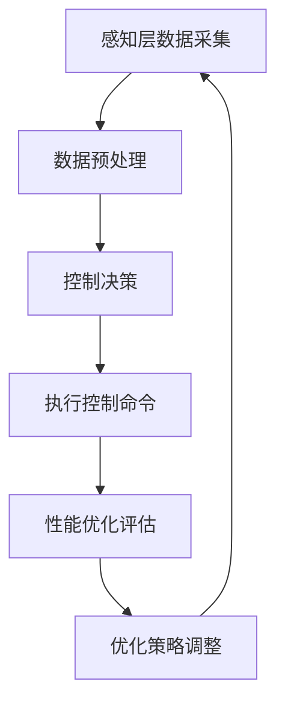
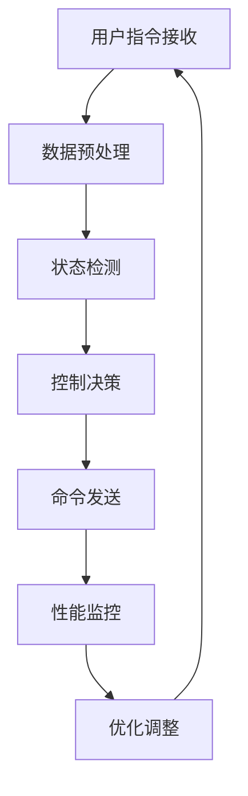
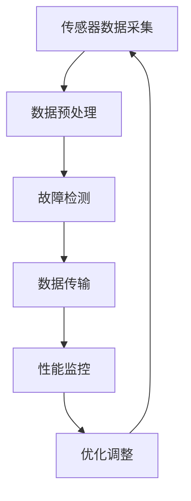
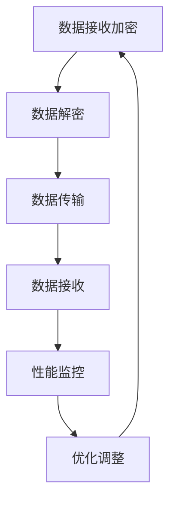

                 

### 文章标题

《基于Java的智能家居设计：高效Java代码在智能家居系统的性能优化》

在当今的智能时代，智能家居系统正逐渐成为现代家庭生活的标配。随着物联网技术的发展，智能家居系统的功能日益丰富，性能优化成为确保系统稳定性和用户体验的关键。本文旨在深入探讨基于Java的智能家居设计，特别是Java代码在智能家居系统性能优化方面的应用与实现。

文章将从以下几个方面展开：

1. **智能家居系统概述与Java基础**：介绍智能家居的基本概念、系统架构及其在家庭自动化中的应用，并探讨Java编程基础。
2. **智能家居系统的核心模块**：详细分析智能家居控制模块、传感模块和通信模块的设计与实现。
3. **Java代码在智能家居系统性能优化的实践**：讲解Java代码性能优化的原理和方法，并结合实际案例展示性能优化的步骤和工具。
4. **未来智能家居系统性能优化趋势**：探讨智能家居系统的发展方向，分析Java在性能优化中的未来趋势及新技术的影响。
5. **附录**：提供Java编程工具与资源推荐，智能家居系统性能优化流程图，以及性能优化项目的实际操作指南。

本文不仅为从事智能家居系统开发的技术人员提供了宝贵的实践经验，也为希望深入了解该领域的读者提供了系统的理论指导。让我们一起深入探索，共同优化智能家居系统的性能，迈向智能生活的新篇章。

#### 关键词

- 智能家居
- Java编程
- 性能优化
- 系统架构
- 异步处理
- 集合框架
- 多线程
- 内存管理

#### 摘要

本文系统性地探讨了基于Java的智能家居设计及其性能优化。首先，我们介绍了智能家居系统的基本概念、架构及其在家庭自动化中的应用。随后，文章详细分析了智能家居控制模块、传感模块和通信模块的设计与实现，重点关注Java编程基础。接着，我们深入探讨了Java代码性能优化的原理和方法，包括垃圾回收、线程优化、数据结构和算法优化。通过实际案例分析，文章展示了性能优化的具体步骤和工具应用。最后，文章展望了智能家居系统的发展趋势，探讨了Java在性能优化中的未来方向及新技术的影响。本文不仅为智能家居系统开发提供了实践经验，也为相关领域的研究和应用提供了理论指导。

### 第一部分：智能家居系统概述与Java基础

#### 第1章：智能家居系统概述

##### 1.1 智能家居的概念与市场发展

智能家居，是指利用现代信息技术、网络通信技术、物联网技术等，将家庭中的各种设备、系统和家电连接起来，实现自动化控制、远程管理和智能互动的家居环境。其核心目标是通过智能化手段提升居住的舒适度、安全性和能源利用效率。

智能家居市场的快速发展得益于以下几个方面的推动：

1. **技术进步**：物联网、云计算、人工智能等技术的成熟，为智能家居系统的开发提供了坚实的基础。
2. **用户需求**：随着生活水平的提高，人们对家居环境的要求也越来越高，追求更加便捷、舒适和智能的生活方式。
3. **政策支持**：政府出台的一系列政策，鼓励智能家居产业的发展，为市场提供了良好的发展环境。

当前，智能家居市场呈现出多元化的发展趋势。从产品类型来看，智能家居系统主要包括家庭安防、环境监测、能源管理、家电控制等多个领域。从市场应用来看，智能家居已经从最初的高端市场逐渐普及到普通家庭，成为现代家居生活的一部分。

##### 1.2 智能家居系统的架构

智能家居系统通常由以下几个核心模块组成：

1. **感知层**：包括各种传感器，如温度传感器、湿度传感器、光线传感器、烟雾传感器等，用于采集家庭环境数据。
2. **传输层**：通过有线或无线网络将感知层采集的数据传输到数据中心或控制层。
3. **控制层**：接收传输层的数据，并通过嵌入式系统、智能算法等实现自动化控制。
4. **应用层**：包括智能手机、平板电脑、电脑等终端设备，用户可以通过这些设备远程监控和管理智能家居系统。

智能家居系统的架构图如下：

```
       +-------------------+
       |   智能家居系统    |
       +-------------------+
          |       |
          | 感知层 |----------------> 控制层
          |       |
       +-------------------+
       |     传输层     |
       +-------------------+
       |      应用层      |
       +-------------------+
```

##### 1.3 Java在智能家居系统中的应用

Java作为一种跨平台、面向对象、功能强大的编程语言，在智能家居系统中得到了广泛应用。其主要优势如下：

1. **跨平台性**：Java可以在不同的操作系统上运行，这使得智能家居系统能够实现跨平台的开发和部署。
2. **面向对象**：Java的面向对象特性使得系统的设计和开发更加模块化、易于维护。
3. **丰富的类库**：Java提供了丰富的类库，包括多线程、网络通信、数据库连接等，这些类库为智能家居系统的开发提供了便利。
4. **安全性**：Java的安全机制可以有效保护智能家居系统的安全，防止恶意攻击和数据泄露。

在智能家居系统中，Java主要应用于以下几个领域：

1. **嵌入式系统开发**：Java可以用于开发智能家居设备上的嵌入式系统，实现设备的自动化控制。
2. **服务器端开发**：Java可以用于开发智能家居系统的服务器端应用，处理大量的数据和用户的请求。
3. **移动应用开发**：Java可以用于开发智能家居系统的移动应用，实现用户对家居设备的远程监控和管理。

##### 1.4 Java编程基础

Java编程基础是理解和应用Java进行智能家居系统开发的前提。以下是一些Java编程基础的概念和语法：

1. **基本语法**：Java的基本语法包括变量、数据类型、运算符、控制结构等。
    - 变量和数据类型：在Java中，变量用于存储数据，数据类型决定了变量的存储方式和操作方式。
    - 运算符：Java提供了丰富的运算符，包括算术运算符、关系运算符、逻辑运算符等。
    - 控制结构：Java提供了if-else语句、for循环、while循环等控制结构，用于控制程序的执行流程。

2. **面向对象编程**：Java是一种面向对象的语言，面向对象编程的核心概念包括类、对象、继承、多态等。
    - 类和对象：类是对象的模板，对象是类的实例。通过创建对象，可以模拟现实世界中的各种实体。
    - 继承：继承是Java中的一种复用机制，子类可以继承父类的属性和方法。
    - 多态：多态允许使用一个接口处理多种类型的数据，提高了程序的灵活性和扩展性。

3. **异常处理**：异常处理是Java中用于处理错误和异常情况的重要机制。
    - 异常类型：Java中的异常分为两种类型：编译时异常和运行时异常。
    - 异常处理机制：通过try-catch语句块，可以捕获和处理异常，确保程序的稳定性和安全性。

4. **Java集合框架**：Java集合框架提供了用于存储和操作集合对象的一套接口和类。
    - 集合接口：如List、Set、Map等，用于存储不同类型的集合对象。
    - 集合实现：如ArrayList、LinkedList、HashSet、HashMap等，提供了具体的集合实现。

5. **多线程编程**：多线程编程是Java中实现并发和并行处理的重要手段。
    - 线程概念：线程是操作系统能够进行运算调度的最小单位。
    - 线程创建：Java提供了多种方式创建线程，包括实现Runnable接口和继承Thread类。
    - 线程同步：多线程编程中，同步是防止多个线程同时访问共享资源的重要手段。

##### 1.5 Java在智能家居系统中的性能优化概述

性能优化是确保智能家居系统高效稳定运行的关键。Java在智能家居系统性能优化方面具有以下优势：

1. **多线程优化**：Java的多线程机制可以充分利用现代多核处理器的性能，提高系统的并发处理能力。
2. **内存管理**：Java的垃圾回收机制可以有效管理内存，减少内存泄漏和溢出风险。
3. **算法优化**：通过优化算法和数据结构，可以减少系统的计算复杂度，提高处理速度。
4. **网络优化**：Java提供了丰富的网络通信库，可以实现高效的网络数据传输和通信。

性能优化的目标主要包括：

- **响应速度**：提高系统的响应速度，确保用户在使用过程中的流畅体验。
- **稳定性**：确保系统在各种环境下稳定运行，避免因性能问题导致系统崩溃或数据丢失。
- **可扩展性**：通过性能优化，提高系统的可扩展性，支持更多的设备接入和更高的并发量。

在接下来的章节中，我们将详细探讨Java在智能家居系统各个模块中的具体应用和性能优化方法。

### 第2章：Java编程基础

在深入探讨Java在智能家居系统中的应用之前，了解Java编程基础是至关重要的。本章将介绍Java的基本语法、面向对象编程、异常处理、Java集合框架以及多线程编程，为后续内容奠定基础。

##### 2.1 Java语言的基本语法

Java语言的基本语法包括变量、数据类型、运算符、控制结构等基础概念，是编写任何Java程序的基础。

1. **变量**：变量是存储数据的位置，在Java中，变量必须先声明后使用。变量声明的一般形式为：
   ```java
   数据类型 变量名 = 初始值;
   ```
   例如：
   ```java
   int number = 10;
   String name = "Alice";
   ```

2. **数据类型**：Java提供了多种数据类型，包括基本数据类型和引用数据类型。基本数据类型包括整型（byte、short、int、long）、浮点型（float、double）、布尔型（boolean）和字符型（char）。引用数据类型包括类（Class）、接口（Interface）、数组（Array）等。

3. **运算符**：Java提供了丰富的运算符，包括算术运算符（+、-、*、/）、关系运算符（==、!=、>、<、>=、<=）、逻辑运算符（&&、||、!)等。

4. **控制结构**：Java提供了多种控制结构，用于控制程序的执行流程。常用的控制结构包括：
    - **条件语句**：if、if-else、switch
    - **循环语句**：for、while、do-while

例如：
```java
public class HelloWorld {
    public static void main(String[] args) {
        int number = 10;
        if (number > 0) {
            System.out.println("Number is positive.");
        } else {
            System.out.println("Number is negative or zero.");
        }
        for (int i = 0; i < 5; i++) {
            System.out.println("Loop iteration: " + i);
        }
    }
}
```

##### 2.2 面向对象编程

面向对象编程（OOP）是Java的核心特性，它通过抽象、封装、继承和多态等概念，提高了代码的可重用性和可维护性。

1. **类与对象**：类是对象的模板，对象是类的实例。例如：
   ```java
   class Dog {
       String name;
       int age;
       
       void bark() {
           System.out.println(name + " is barking.");
       }
   }
   
   public class Main {
       public static void main(String[] args) {
           Dog myDog = new Dog();
           myDog.name = "Buddy";
           myDog.age = 3;
           myDog.bark();
       }
   }
   ```

2. **继承**：继承是子类继承父类的属性和方法，实现了代码的复用。例如：
   ```java
   class Animal {
       void eat() {
           System.out.println("Animal is eating.");
       }
   }
   
   class Dog extends Animal {
       void bark() {
           System.out.println("Dog is barking.");
       }
   }
   
   public class Main {
       public static void main(String[] args) {
           Dog myDog = new Dog();
           myDog.eat();
           myDog.bark();
       }
   }
   ```

3. **多态**：多态允许使用一个接口处理多种类型的数据，提高了程序的灵活性和扩展性。例如：
   ```java
   class Animal {
       void eat() {
           System.out.println("Animal is eating.");
       }
   }
   
   class Dog extends Animal {
       void eat() {
           System.out.println("Dog is eating.");
       }
   }
   
   public class Main {
       public static void main(String[] args) {
           Animal myAnimal = new Dog();
           myAnimal.eat();
       }
   }
   ```

##### 2.3 异常处理

异常处理是Java中用于处理错误和异常情况的重要机制。Java中的异常分为编译时异常和运行时异常。

1. **异常类型**：
    - **编译时异常**（Checked Exception）：必须在编写程序时显式处理，如IOException、SQLException等。
    - **运行时异常**（Unchecked Exception）：不必在编写程序时显式处理，如 NullPointerException、ArrayIndexOutOfBoundsException等。

2. **异常处理机制**：通过try-catch语句块，可以捕获和处理异常。例如：
   ```java
   public class Main {
       public static void main(String[] args) {
           try {
               int result = divide(10, 0);
               System.out.println("Result: " + result);
           } catch (ArithmeticException e) {
               System.out.println("Error: " + e.getMessage());
           }
       }
       
       public static int divide(int a, int b) {
           return a / b;
       }
   }
   ```

##### 2.4 Java集合框架

Java集合框架提供了用于存储和操作集合对象的一套接口和类，包括List、Set、Map等。

1. **集合接口**：
    - **List**：有序可重复集合，如ArrayList、LinkedList等。
    - **Set**：无序不可重复集合，如HashSet、LinkedHashSet等。
    - **Map**：键值对映射，如HashMap、TreeMap等。

2. **集合实现**：
    - **ArrayList**：基于动态数组实现，提供高效的随机访问。
    - **LinkedList**：基于链表实现，提供高效的插入和删除操作。
    - **HashSet**：基于哈希表实现，提供高效的查找操作。

例如：
```java
import java.util.ArrayList;
import java.util.HashSet;
import java.util.List;
import java.util.Map;
import java.util.HashMap;
import java.util.Set;

public class Main {
    public static void main(String[] args) {
        List<String> list = new ArrayList<>();
        list.add("Apple");
        list.add("Banana");
        list.add("Cherry");
        
        Set<String> set = new HashSet<>();
        set.add("Apple");
        set.add("Banana");
        set.add("Cherry");
        
        Map<String, Integer> map = new HashMap<>();
        map.put("Apple", 1);
        map.put("Banana", 2);
        map.put("Cherry", 3);
        
        System.out.println("List: " + list);
        System.out.println("Set: " + set);
        System.out.println("Map: " + map);
    }
}
```

##### 2.5 Java多线程编程

多线程编程是Java中实现并发和并行处理的重要手段。Java提供了多种方式创建线程，包括实现Runnable接口和继承Thread类。

1. **线程概念**：线程是操作系统能够进行运算调度的最小单位，是进程的执行单元。

2. **线程创建**：
    - **实现Runnable接口**：
      ```java
      public class MyThread implements Runnable {
          @Override
          public void run() {
              System.out.println("Thread is running.");
          }
      }
      
      public class Main {
          public static void main(String[] args) {
              Thread thread = new Thread(new MyThread());
              thread.start();
          }
      }
      ```
    - **继承Thread类**：
      ```java
      public class MyThread extends Thread {
          @Override
          public void run() {
              System.out.println("Thread is running.");
          }
      }
      
      public class Main {
          public static void main(String[] args) {
              Thread thread = new MyThread();
              thread.start();
          }
      }
      ```

3. **线程同步**：多线程编程中，同步是防止多个线程同时访问共享资源的重要手段。Java提供了synchronized关键字实现同步。
   ```java
   public class Counter {
       private int count = 0;
       
       public synchronized void increment() {
           count++;
       }
       
       public int getCount() {
           return count;
       }
   }
   
   public class Main {
       public static void main(String[] args) {
           Counter counter = new Counter();
           Thread t1 = new Thread(() -> {
               for (int i = 0; i < 1000; i++) {
                   counter.increment();
               }
           });
           
           Thread t2 = new Thread(() -> {
               for (int i = 0; i < 1000; i++) {
                   counter.increment();
               }
           });
           
           t1.start();
           t2.start();
           
           try {
               t1.join();
               t2.join();
           } catch (InterruptedException e) {
               e.printStackTrace();
           }
           
           System.out.println("Count: " + counter.getCount());
       }
   }
   ```

通过上述内容，我们介绍了Java编程基础，包括基本语法、面向对象编程、异常处理、Java集合框架以及多线程编程。这些基础为深入探讨Java在智能家居系统中的应用和性能优化提供了必要的知识储备。

### 第3章：智能家居控制模块设计

控制模块是智能家居系统的核心组成部分，它负责接收用户的指令和感知模块传来的数据，并作出相应的控制决策。本节将详细讨论智能家居控制模块的设计，包括模块概述、核心算法、Java代码实现以及性能优化。

##### 3.1 控制模块概述

控制模块的主要功能如下：

1. **接收用户指令**：通过用户界面（如智能手机、平板电脑）接收用户的操作指令。
2. **数据融合**：整合来自不同传感器的数据，进行数据清洗和预处理。
3. **控制决策**：基于用户指令和传感数据，通过控制算法生成控制命令。
4. **执行控制命令**：将控制命令发送给执行模块（如灯光、温度调节设备），实现自动化控制。

控制模块的架构图如下：

```
       +-------------------+
       |   控制模块        |
       +-------------------+
          |       |
          | 用户指令 |---------------------> 控制决策
          |       |
       +-------------------+
       |    感知数据     |-------------------> 数据融合
       +-------------------+
```

##### 3.2 控制模块的核心算法

控制模块的核心算法通常包括以下几个步骤：

1. **数据预处理**：对感知数据进行清洗和预处理，包括滤波、去噪、归一化等。
2. **状态检测**：根据预处理后的数据，检测当前系统的状态（如温度、湿度、灯光强度等）。
3. **控制决策**：根据用户指令和系统状态，生成相应的控制命令。
4. **命令发送**：将控制命令发送给执行模块。

伪代码示例：
```java
public class ControlAlgorithm {
    private double sensorData; // 感知数据
    private String userCommand; // 用户指令

    public void processData(double sensorData, String userCommand) {
        // 数据预处理
        this.sensorData = preprocessData(sensorData);
        
        // 状态检测
        String systemState = detectState(sensorData);
        
        // 控制决策
        String controlCommand = decideControlCommand(userCommand, systemState);
        
        // 命令发送
        sendCommand(controlCommand);
    }
    
    private double preprocessData(double sensorData) {
        // 实现数据预处理逻辑
        return sensorData;
    }
    
    private String detectState(double sensorData) {
        // 实现状态检测逻辑
        if (sensorData > 0) {
            return "State_A";
        } else {
            return "State_B";
        }
    }
    
    private String decideControlCommand(String userCommand, String systemState) {
        // 实现控制决策逻辑
        if (userCommand.equals("ON") && systemState.equals("State_A")) {
            return "Light_ON";
        } else if (userCommand.equals("OFF") && systemState.equals("State_B")) {
            return "Light_OFF";
        } else {
            return "No_Command";
        }
    }
    
    private void sendCommand(String controlCommand) {
        // 实现命令发送逻辑
        System.out.println("Sending command: " + controlCommand);
    }
}
```

##### 3.3 控制模块的Java代码实现

以下是控制模块的Java代码实现示例：

```java
public class ControlModule {
    private ControlAlgorithm controlAlgorithm;
    
    public ControlModule() {
        controlAlgorithm = new ControlAlgorithm();
    }
    
    public void handleUserCommand(String userCommand) {
        // 接收用户指令
        controlAlgorithm.processData(0, userCommand);
    }
    
    public void handleSensorData(double sensorData) {
        // 接收感知数据
        controlAlgorithm.processData(sensorData, "");
    }
    
    public static void main(String[] args) {
        ControlModule controlModule = new ControlModule();
        
        // 模拟用户指令
        controlModule.handleUserCommand("ON");
        
        // 模拟感知数据
        controlModule.handleSensorData(30.5);
    }
}
```

##### 3.4 控制模块的性能优化

控制模块的性能优化主要关注以下几个方面：

1. **多线程处理**：使用多线程处理用户指令和感知数据，提高系统的并发处理能力。例如，可以创建一个线程池，将数据处理任务分配给多个线程执行。
2. **数据缓存**：为了避免频繁访问传感器，可以将感知数据缓存起来，减少对传感器的访问次数。例如，可以使用一个环形缓冲区（Circular Buffer）来存储感知数据。
3. **并发控制**：在多线程环境中，需要确保线程之间的数据访问安全，防止数据竞争和死锁。可以使用synchronized关键字或锁（Lock）来实现并发控制。
4. **算法优化**：优化控制算法，减少计算复杂度。例如，可以使用更高效的算法进行数据预处理和状态检测。

以下是控制模块性能优化后的伪代码：

```java
import java.util.concurrent.ExecutorService;
import java.util.concurrent.Executors;

public class OptimizedControlModule {
    private ControlAlgorithm controlAlgorithm;
    private ExecutorService executorService;
    
    public OptimizedControlModule() {
        controlAlgorithm = new ControlAlgorithm();
        executorService = Executors.newFixedThreadPool(4);
    }
    
    public void handleUserCommand(String userCommand) {
        executorService.submit(() -> {
            // 接收用户指令
            controlAlgorithm.processData(0, userCommand);
        });
    }
    
    public void handleSensorData(double sensorData) {
        executorService.submit(() -> {
            // 接收感知数据
            controlAlgorithm.processData(sensorData, "");
        });
    }
    
    public void shutdown() {
        executorService.shutdown();
    }
    
    public static void main(String[] args) {
        OptimizedControlModule controlModule = new OptimizedControlModule();
        
        // 模拟用户指令
        controlModule.handleUserCommand("ON");
        
        // 模拟感知数据
        controlModule.handleSensorData(30.5);
        
        // 关闭线程池
        controlModule.shutdown();
    }
}
```

通过上述优化，控制模块能够在处理大量用户指令和感知数据时，保持高效和稳定运行。在接下来的章节中，我们将继续探讨智能家居传感模块和通信模块的设计与实现。

### 第4章：智能家居传感模块设计

传感模块是智能家居系统的重要组成部分，负责收集家庭环境中的各种数据，如温度、湿度、光线、烟雾等，并将这些数据传输到控制模块进行处理。本节将详细讨论智能家居传感模块的设计，包括模块概述、核心算法、Java代码实现以及性能优化。

##### 4.1 传感模块概述

传感模块的主要功能如下：

1. **数据采集**：通过各种传感器（如温度传感器、湿度传感器、光线传感器、烟雾传感器等）收集环境数据。
2. **数据预处理**：对采集到的原始数据进行滤波、去噪、归一化等预处理，以提高数据的准确性和可靠性。
3. **数据传输**：将预处理后的数据传输到控制模块，用于进一步的决策和执行。
4. **故障检测**：监测传感器的工作状态，及时发现和报告故障。

传感模块的架构图如下：

```
       +-------------------+
       |   传感模块        |
       +-------------------+
          |       |
          | 传感器 |-------------------> 数据预处理
          |       |
       +-------------------+
       |   数据传输     |-------------------> 控制模块
       +-------------------+
```

##### 4.2 传感模块的核心算法

传感模块的核心算法通常包括以下几个步骤：

1. **数据采集**：通过传感器读取环境数据，如温度、湿度、光线强度等。
2. **数据滤波**：使用滤波算法去除数据中的噪声，如移动平均滤波、卡尔曼滤波等。
3. **数据去噪**：对滤波后的数据进行去噪处理，如基于阈值的方法、中值滤波等。
4. **数据归一化**：将采集到的数据进行归一化处理，使其在同一量级范围内，便于后续分析。
5. **故障检测**：对传感器的工作状态进行监测，判断是否出现故障。

伪代码示例：

```java
public class SensorModule {
    private Sensor[] sensors; // 传感器数组
    
    public SensorModule(Sensor[] sensors) {
        this.sensors = sensors;
    }
    
    public DataPoint[] collectData() {
        DataPoint[] dataPoints = new DataPoint[sensors.length];
        for (int i = 0; i < sensors.length; i++) {
            dataPoints[i] = sensors[i].readData();
        }
        return dataPoints;
    }
    
    public DataPoint[] filterData(DataPoint[] dataPoints) {
        // 实现滤波算法
        return dataPoints;
    }
    
    public DataPoint[] denoiseData(DataPoint[] dataPoints) {
        // 实现去噪算法
        return dataPoints;
    }
    
    public void detectFaults(DataPoint[] dataPoints) {
        // 实现故障检测逻辑
    }
}
```

##### 4.3 传感模块的Java代码实现

以下是传感模块的Java代码实现示例：

```java
public class SensorModule {
    private Sensor[] sensors; // 传感器数组
    
    public SensorModule(Sensor[] sensors) {
        this.sensors = sensors;
    }
    
    public DataPoint[] collectData() {
        DataPoint[] dataPoints = new DataPoint[sensors.length];
        for (int i = 0; i < sensors.length; i++) {
            dataPoints[i] = sensors[i].readData();
        }
        return dataPoints;
    }
    
    public DataPoint[] filterData(DataPoint[] dataPoints) {
        // 实现滤波算法
        return dataPoints;
    }
    
    public DataPoint[] denoiseData(DataPoint[] dataPoints) {
        // 实现去噪算法
        return dataPoints;
    }
    
    public void detectFaults(DataPoint[] dataPoints) {
        // 实现故障检测逻辑
    }
    
    public static void main(String[] args) {
        Sensor[] sensors = new Sensor[3];
        sensors[0] = new TemperatureSensor();
        sensors[1] = new HumiditySensor();
        sensors[2] = new LightSensor();
        
        SensorModule sensorModule = new SensorModule(sensors);
        
        // 模拟数据采集
        DataPoint[] dataPoints = sensorModule.collectData();
        for (DataPoint dataPoint : dataPoints) {
            System.out.println(dataPoint);
        }
        
        // 模拟数据预处理
        DataPoint[] processedData = sensorModule.filterData(dataPoints);
        for (DataPoint dataPoint : processedData) {
            System.out.println(dataPoint);
        }
        
        // 模拟故障检测
        sensorModule.detectFaults(processedData);
    }
}

class DataPoint {
    private double value; // 数据值
    
    public DataPoint(double value) {
        this.value = value;
    }
    
    public double getValue() {
        return value;
    }
    
    @Override
    public String toString() {
        return "DataPoint{" +
                "value=" + value +
                '}';
    }
}

interface Sensor {
    DataPoint readData();
}

class TemperatureSensor implements Sensor {
    @Override
    public DataPoint readData() {
        // 实现温度传感器数据读取
        return new DataPoint(25.5);
    }
}

class HumiditySensor implements Sensor {
    @Override
    public DataPoint readData() {
        // 实现湿度传感器数据读取
        return new DataPoint(60.5);
    }
}

class LightSensor implements Sensor {
    @Override
    public DataPoint readData() {
        // 实现光线传感器数据读取
        return new DataPoint(300.0);
    }
}
```

##### 4.4 传感模块的性能优化

传感模块的性能优化主要关注以下几个方面：

1. **并行采集**：使用多线程并行采集传感数据，提高数据采集的效率。例如，可以创建一个线程池，将每个传感器的数据采集任务分配给不同的线程执行。
2. **数据压缩**：对采集到的传感数据进行压缩，减少数据传输的带宽占用。例如，可以使用Huffman编码或LZ77压缩算法。
3. **低功耗设计**：优化传感器的功耗，延长传感器的使用寿命。例如，可以采用休眠模式或智能功率管理策略。
4. **故障诊断与恢复**：实现传感器故障诊断和恢复机制，确保传感模块的稳定性和可靠性。

以下是传感模块性能优化后的伪代码：

```java
import java.util.concurrent.ExecutorService;
import java.util.concurrent.Executors;

public class OptimizedSensorModule {
    private Sensor[] sensors; // 传感器数组
    private ExecutorService executorService;
    
    public OptimizedSensorModule(Sensor[] sensors) {
        this.sensors = sensors;
        this.executorService = Executors.newFixedThreadPool(sensors.length);
    }
    
    public DataPoint[] collectData() {
        DataPoint[] dataPoints = new DataPoint[sensors.length];
        for (int i = 0; i < sensors.length; i++) {
            executorService.submit(() -> {
                dataPoints[i] = sensors[i].readData();
            });
        }
        executorService.shutdown();
        try {
            executorService.awaitTermination(Long.MAX_VALUE, TimeUnit.NANOSECONDS);
        } catch (InterruptedException e) {
            e.printStackTrace();
        }
        return dataPoints;
    }
    
    // 其他方法实现与原始SensorModule相同
    
    public static void main(String[] args) {
        Sensor[] sensors = new Sensor[3];
        sensors[0] = new TemperatureSensor();
        sensors[1] = new HumiditySensor();
        sensors[2] = new LightSensor();
        
        OptimizedSensorModule sensorModule = new OptimizedSensorModule(sensors);
        
        // 模拟数据采集
        DataPoint[] dataPoints = sensorModule.collectData();
        for (DataPoint dataPoint : dataPoints) {
            System.out.println(dataPoint);
        }
        
        // 模拟数据预处理
        DataPoint[] processedData = sensorModule.filterData(dataPoints);
        for (DataPoint dataPoint : processedData) {
            System.out.println(dataPoint);
        }
        
        // 模拟故障检测
        sensorModule.detectFaults(processedData);
    }
}
```

通过上述优化，传感模块能够在高效、稳定地采集和处理传感数据。在接下来的章节中，我们将继续探讨智能家居通信模块的设计与实现。

### 第5章：智能家居通信模块设计

通信模块在智能家居系统中起着至关重要的作用，它负责将传感模块和控制模块之间的数据传输，确保系统各个部分能够顺畅地协同工作。本节将详细介绍智能家居通信模块的设计，包括模块概述、核心算法、Java代码实现以及性能优化。

##### 5.1 通信模块概述

通信模块的主要功能如下：

1. **数据传输**：负责在传感模块和控制模块之间传输数据，确保数据的实时性和完整性。
2. **数据加密**：为了保护数据的安全性，通信模块需要对数据进行加密处理，防止数据在传输过程中被窃取或篡改。
3. **异常处理**：在数据传输过程中，可能会出现各种异常情况，如网络中断、数据包丢失等，通信模块需要具备异常处理能力，确保系统能够自动恢复。
4. **流量控制**：为了防止网络拥塞，通信模块需要实现流量控制机制，合理分配网络资源。

通信模块的架构图如下：

```
       +-------------------+
       |   通信模块        |
       +-------------------+
          |       |
          |  数据传输 |-------------------> 控制模块
          |       |
       +-------------------+
       |   数据加密     |-------------------> 加密模块
       +-------------------+
```

##### 5.2 通信模块的核心算法

通信模块的核心算法主要包括数据传输算法、加密算法和流量控制算法。

1. **数据传输算法**：通信模块需要选择合适的数据传输协议，如TCP、UDP等，确保数据的可靠传输。对于实时性要求较高的智能家居系统，通常选择UDP协议，因为UDP协议具有较低的延迟和较好的实时性。以下是一个简单的UDP数据传输算法伪代码：

```java
public class UDPTransmitter {
    private DatagramSocket socket; // UDP套接字
    
    public UDPTransmitter(int port) {
        socket = new DatagramSocket(port);
    }
    
    public void sendData(DataPacket packet) {
        DatagramPacket datagramPacket = new DatagramPacket(packet.getData(), packet.getLength(), packet.getAddress(), packet.getPort());
        socket.send(datagramPacket);
    }
    
    public void receiveData() {
        byte[] buffer = new byte[1024];
        DatagramPacket datagramPacket = new DatagramPacket(buffer, buffer.length);
        socket.receive(datagramPacket);
        // 处理接收到的数据
    }
    
    public void closeSocket() {
        socket.close();
    }
}
```

2. **加密算法**：为了确保数据传输的安全性，通信模块需要实现加密算法。常用的加密算法包括AES、RSA等。以下是一个简单的AES加密算法伪代码：

```java
import javax.crypto.Cipher;
import javax.crypto.KeyGenerator;
import javax.crypto.SecretKey;
import javax.crypto.spec.SecretKeySpec;

public class AESCipher {
    private Cipher cipher; // 加密对象
    
    public AESCipher() {
        try {
            cipher = Cipher.getInstance("AES");
        } catch (NoSuchAlgorithmException | NoSuchPaddingException e) {
            e.printStackTrace();
        }
    }
    
    public SecretKey generateKey() {
        try {
            KeyGenerator keyGen = KeyGenerator.getInstance("AES");
            keyGen.init(128); // 初始化密钥长度为128位
            return keyGen.generateKey();
        } catch (NoSuchAlgorithmException e) {
            e.printStackTrace();
            return null;
        }
    }
    
    public byte[] encrypt(byte[] data, byte[] key) {
        try {
            SecretKey secretKey = new SecretKeySpec(key, "AES");
            cipher.init(Cipher.ENCRYPT_MODE, secretKey);
            return cipher.doFinal(data);
        } catch (InvalidKeyException | IllegalBlockSizeException | BadPaddingException e) {
            e.printStackTrace();
            return null;
        }
    }
    
    public byte[] decrypt(byte[] encryptedData, byte[] key) {
        try {
            SecretKey secretKey = new SecretKeySpec(key, "AES");
            cipher.init(Cipher.DECRYPT_MODE, secretKey);
            return cipher.doFinal(encryptedData);
        } catch (InvalidKeyException | IllegalBlockSizeException | BadPaddingException e) {
            e.printStackTrace();
            return null;
        }
    }
}
```

3. **流量控制算法**：为了防止网络拥塞，通信模块需要实现流量控制机制。以下是一个简单的流量控制算法伪代码：

```java
public class FlowController {
    private int maxThroughput; // 最大吞吐量
    
    public FlowController(int maxThroughput) {
        this.maxThroughput = maxThroughput;
    }
    
    public void controlFlow(DataPacket packet) {
        // 实现流量控制逻辑
        if (currentThroughput < maxThroughput) {
            sendPacket(packet);
            currentThroughput++;
        } else {
            // 等待或丢弃数据包
        }
    }
    
    private void sendPacket(DataPacket packet) {
        // 实现数据包发送逻辑
    }
    
    private int currentThroughput = 0; // 当前吞吐量
}
```

##### 5.3 通信模块的Java代码实现

以下是通信模块的Java代码实现示例：

```java
import java.net.*;

public class CommunicationModule {
    private UDPTransmitter transmitter; // UDP传输器
    private AESCipher aesCipher; // AES加密器
    
    public CommunicationModule(int port) {
        transmitter = new UDPTransmitter(port);
        aesCipher = new AESCipher();
    }
    
    public void sendData(DataPacket packet) {
        byte[] encryptedData = aesCipher.encrypt(packet.getData(), "mySecretKey".getBytes());
        packet.setData(encryptedData);
        transmitter.sendData(packet);
    }
    
    public void receiveData() {
        transmitter.receiveData();
        // 解密和处理接收到的数据
    }
    
    public static void main(String[] args) {
        CommunicationModule communicationModule = new CommunicationModule(12345);
        
        // 模拟发送数据
        DataPacket packet = new DataPacket();
        packet.setData("Hello, World!".getBytes());
        communicationModule.sendData(packet);
        
        // 模拟接收数据
        communicationModule.receiveData();
    }
}

class DataPacket {
    private byte[] data; // 数据内容
    private InetAddress address; // 目标地址
    private int port; // 目标端口
    
    public DataPacket() {
    }
    
    public DataPacket(byte[] data, InetAddress address, int port) {
        this.data = data;
        this.address = address;
        this.port = port;
    }
    
    public byte[] getData() {
        return data;
    }
    
    public void setData(byte[] data) {
        this.data = data;
    }
    
    public InetAddress getAddress() {
        return address;
    }
    
    public void setAddress(InetAddress address) {
        this.address = address;
    }
    
    public int getPort() {
        return port;
    }
    
    public void setPort(int port) {
        this.port = port;
    }
}
```

##### 5.4 通信模块的性能优化

通信模块的性能优化主要关注以下几个方面：

1. **并发传输**：使用多线程并发传输数据，提高数据传输的效率。例如，可以创建一个线程池，将数据传输任务分配给多个线程执行。
2. **数据压缩**：对传输的数据进行压缩，减少数据包的大小，提高传输效率。例如，可以使用gzip或zlib进行数据压缩。
3. **网络优化**：优化网络配置，减少网络延迟和丢包率。例如，可以使用优化路由策略或增加网络带宽。
4. **负载均衡**：实现负载均衡机制，将数据传输任务均匀分配到多个网络连接上，提高系统的容错性和稳定性。

以下是通信模块性能优化后的伪代码：

```java
import java.util.concurrent.ExecutorService;
import java.util.concurrent.Executors;

public class OptimizedCommunicationModule {
    private UDPTransmitter transmitter; // UDP传输器
    private AESCipher aesCipher; // AES加密器
    private ExecutorService executorService;
    
    public OptimizedCommunicationModule(int port) {
        transmitter = new UDPTransmitter(port);
        aesCipher = new AESCipher();
        executorService = Executors.newFixedThreadPool(4); // 创建线程池
    }
    
    public void sendData(DataPacket packet) {
        executorService.submit(() -> {
            byte[] encryptedData = aesCipher.encrypt(packet.getData(), "mySecretKey".getBytes());
            packet.setData(encryptedData);
            transmitter.sendData(packet);
        });
    }
    
    public void receiveData() {
        executorService.submit(() -> {
            transmitter.receiveData();
            // 解密和处理接收到的数据
        });
    }
    
    public void shutdown() {
        executorService.shutdown(); // 关闭线程池
    }
    
    public static void main(String[] args) {
        OptimizedCommunicationModule communicationModule = new OptimizedCommunicationModule(12345);
        
        // 模拟发送数据
        DataPacket packet = new DataPacket();
        packet.setData("Hello, World!".getBytes());
        communicationModule.sendData(packet);
        
        // 模拟接收数据
        communicationModule.receiveData();
        
        // 关闭线程池
        communicationModule.shutdown();
    }
}
```

通过上述优化，通信模块能够在高效、稳定地传输数据。在接下来的章节中，我们将深入探讨Java代码性能优化的原理和实践。

### 第6章：Java代码性能优化原理

在智能家居系统中，Java代码的性能直接影响到系统的响应速度、稳定性以及用户的使用体验。因此，性能优化是智能家居系统开发过程中至关重要的一环。本节将详细探讨Java代码性能优化的原理和方法，包括垃圾回收优化、线程优化、数据结构优化和算法优化。

##### 6.1 Java代码性能优化的方法

Java代码性能优化的方法可以从多个角度入手，以下是一些常见的优化方法：

1. **代码优化**：通过改进代码结构，减少不必要的计算和资源消耗。例如，避免使用不必要的循环、减少函数调用等。
2. **内存优化**：合理管理内存，减少内存泄漏和溢出。例如，及时释放不再使用的对象、使用高效的数据结构等。
3. **CPU优化**：优化CPU密集型操作，减少计算复杂度和执行时间。例如，使用并行计算、优化算法等。
4. **I/O优化**：优化I/O操作，减少I/O等待时间。例如，使用缓冲区、批量处理I/O等。
5. **网络优化**：优化网络通信，减少数据传输时间和延迟。例如，使用压缩算法、优化数据传输协议等。

##### 6.2 垃圾回收优化

Java的垃圾回收（Garbage Collection，GC）是自动管理内存的重要机制。垃圾回收的目的是释放不再使用的对象，从而减少内存消耗和避免内存泄漏。以下是一些垃圾回收优化的方法：

1. **避免内存泄漏**：及时释放不再使用的对象，避免内存泄漏。例如，使用try-with-resources语句自动关闭资源。
2. **减少对象创建**：减少对象创建的数量，特别是在循环中。例如，使用静态变量或单例模式，避免在每次迭代中创建新对象。
3. **使用内存池**：对于频繁创建和销毁的对象，可以使用内存池（Object Pool）来复用对象，减少GC的压力。
4. **选择合适的垃圾回收器**：Java提供了多种垃圾回收器，如Serial GC、Parallel GC、G1 GC等。根据系统的特点和负载，选择合适的垃圾回收器可以提高性能。例如，对于低延迟和高吞吐量的应用，可以选择Parallel GC。

以下是一个示例，展示了如何使用内存池减少对象创建：

```java
public class ObjectPool<T> {
    private final Queue<T> pool;
    private final int maxPoolSize;
    
    public ObjectPool(int maxPoolSize) {
        this.maxPoolSize = maxPoolSize;
        this.pool = new ConcurrentLinkedQueue<>();
    }
    
    public synchronized T getObject() {
        if (pool.isEmpty()) {
            return createObject();
        }
        return pool.poll();
    }
    
    public synchronized void returnObject(T object) {
        if (pool.size() < maxPoolSize) {
            pool.offer(object);
        }
    }
    
    protected T createObject() {
        // 创建对象
        return new T();
    }
}
```

##### 6.3 线程优化

多线程编程是提高程序并发性能的重要手段。以下是一些线程优化的方法：

1. **线程池**：使用线程池可以减少线程创建和销毁的开销，提高系统的并发性能。Java提供了Executor框架，可以方便地创建和管理线程池。
2. **线程安全**：确保多线程环境下的数据一致性，防止数据竞争和死锁。可以使用同步机制（如synchronized关键字、ReentrantLock等）来保护共享资源。
3. **线程通信**：优化线程间的通信机制，减少不必要的等待和竞争。可以使用BlockingQueue、Semaphore等并发工具类。
4. **异步处理**：使用异步处理（Asynchronous Programming）可以提高系统的响应速度。例如，使用CompletableFuture类实现异步计算。

以下是一个使用线程池和CompletableFuture进行异步处理的示例：

```java
import java.util.concurrent.CompletableFuture;
import java.util.concurrent.ExecutorService;
import java.util.concurrent.Executors;

public class ThreadOptimization {
    private final ExecutorService executorService = Executors.newFixedThreadPool(4);
    
    public void asyncProcess() {
        CompletableFuture<Void> future1 = CompletableFuture.runAsync(() -> {
            // 异步执行的任务1
        }, executorService);
        
        CompletableFuture<Void> future2 = CompletableFuture.runAsync(() -> {
            // 异步执行的任务2
        }, executorService);
        
        CompletableFuture<Void> future3 = CompletableFuture.runAsync(() -> {
            // 异步执行的任务3
        }, executorService);
        
        CompletableFuture.allOf(future1, future2, future3).join(); // 等待所有异步任务完成
    }
}
```

##### 6.4 数据结构优化

选择合适的数据结构可以显著提高程序的性能。以下是一些数据结构优化的方法：

1. **数组**：对于随机访问操作，数组是最高效的数据结构。但在动态扩展时，数组可能会产生性能问题。
2. **链表**：链表适用于插入和删除操作频繁的场景，但在随机访问时性能较差。
3. **平衡二叉树**：如AVL树、红黑树等，适用于需要平衡搜索树的操作。
4. **哈希表**：哈希表（如HashMap）适用于快速的查找、插入和删除操作，但需要注意哈希冲突和链表长度的问题。

以下是一个使用HashMap进行优化示例：

```java
import java.util.HashMap;
import java.util.Map;

public class DataStructureOptimization {
    private final Map<String, Integer> map = new HashMap<>();
    
    public void put(String key, int value) {
        map.put(key, value);
    }
    
    public int get(String key) {
        return map.getOrDefault(key, -1);
    }
}
```

##### 6.5 算法优化

算法优化是提高程序性能的重要手段。以下是一些算法优化的方法：

1. **减少计算复杂度**：通过改进算法，减少时间复杂度和空间复杂度。例如，使用更高效的排序算法、搜索算法等。
2. **动态规划**：动态规划是一种解决最优子结构问题的算法，通过递归和记忆化减少重复计算。
3. **贪心算法**：贪心算法通过在每个步骤选择最优解，达到全局最优解。
4. **分支限定**：在搜索算法中，通过限定搜索分支，减少不必要的计算。

以下是一个使用动态规划优化示例：

```java
public class Fibonacci {
    public int calculate(int n) {
        int[] dp = new int[n + 1];
        dp[0] = 0;
        dp[1] = 1;
        
        for (int i = 2; i <= n; i++) {
            dp[i] = dp[i - 1] + dp[i - 2];
        }
        
        return dp[n];
    }
}
```

通过上述方法，我们可以对Java代码进行性能优化，提高系统的整体性能。在接下来的章节中，我们将结合实际案例，展示如何在智能家居系统中应用这些优化方法。

### 第7章：智能家居系统性能优化实践

在上一章节中，我们探讨了Java代码性能优化的原理和方法。在本章中，我们将结合实际案例，详细分析智能家居系统中性能优化的具体步骤和工具，以帮助读者理解和掌握这些优化方法。

##### 7.1 性能优化案例分析

为了更好地理解性能优化，我们将通过一个具体的智能家居系统案例进行讲解。这个案例涉及一个家庭安防系统，包括传感器、控制模块和通信模块。该系统的主要功能是实时监测家庭环境，并在检测到异常情况时发送报警信息。

##### 7.1.1 性能优化目标

针对这个家庭安防系统，我们设定以下性能优化目标：

- **响应速度**：提高系统对传感器数据的处理速度，确保在异常情况发生时能够及时响应。
- **稳定性**：确保系统在各种环境下稳定运行，减少由于性能问题导致的系统崩溃或数据丢失。
- **可扩展性**：提高系统的可扩展性，支持更多的传感器和用户。

##### 7.1.2 性能优化步骤

1. **需求分析**：首先，对系统进行需求分析，明确系统的功能需求和技术需求。例如，确定系统的并发用户数量、传感器数量、数据传输速率等。

2. **性能测试**：通过性能测试工具（如JMeter、Gatling等）对系统进行初步测试，收集系统的性能数据，包括响应时间、吞吐量、资源占用等。

3. **问题定位**：根据性能测试结果，定位系统中的性能瓶颈。例如，通过分析日志和监控数据，确定是数据传输延迟、计算复杂度高、内存泄漏等问题。

4. **优化方案设计**：根据性能瓶颈，设计具体的优化方案。例如，针对数据传输延迟，可以优化网络传输协议；针对计算复杂度高，可以优化算法；针对内存泄漏，可以改进内存管理。

5. **实施优化**：按照优化方案，逐步实施优化。例如，修改代码、调整系统配置、优化硬件等。

6. **性能测试与验证**：在优化后，重新进行性能测试，验证优化效果。如果性能未达到预期，需要进一步分析原因，调整优化方案。

##### 7.1.3 性能优化工具与方法

以下是一些常用的性能优化工具和方法：

1. **性能测试工具**：
    - **JMeter**：用于模拟大量用户对系统进行压力测试，分析系统的性能瓶颈。
    - **Gatling**：适用于高性能负载测试，支持多种协议和场景。

2. **代码分析工具**：
    - **SonarQube**：用于代码质量分析，识别潜在的编程问题和性能瓶颈。
    - **VisualVM**：用于Java程序的性能监控和调试。

3. **内存管理工具**：
    - **JProfiler**：用于分析Java程序的内存泄漏和性能问题。
    - **MAT（Memory Analyzer Tool）**：用于分析大型Java程序的内存使用情况。

4. **网络优化工具**：
    - **Wireshark**：用于网络数据包分析，诊断网络通信问题。
    - **Netcat**：用于发送和接收网络数据，进行网络测试。

##### 7.1.4 案例分析

以下是一个家庭安防系统性能优化的具体案例分析：

1. **问题定位**：通过JMeter进行性能测试，发现系统在处理大量传感器数据时，响应时间较长，吞吐量较低。

2. **性能瓶颈分析**：
    - **数据传输延迟**：由于传感器数据通过网络传输到控制模块，传输延迟较高。
    - **计算复杂度**：控制模块中的数据处理算法复杂度较高，导致计算时间较长。

3. **优化方案设计**：
    - **优化网络传输**：调整网络传输协议，使用更高效的传输方式（如TCP拥塞控制）。
    - **优化算法**：改进数据处理算法，使用更高效的算法（如快速排序、Boyer-Moore算法）。
    - **并行处理**：使用多线程并行处理传感器数据，提高系统的并发处理能力。

4. **实施优化**：
    - **修改网络配置**：调整网络参数，优化TCP传输。
    - **优化代码**：改进数据处理算法，使用多线程处理数据。

5. **性能测试与验证**：在优化后，重新进行性能测试，发现系统的响应时间显著缩短，吞吐量提高。

##### 7.2 实际项目的性能优化步骤

以下是一个智能家居系统性能优化的实际项目步骤：

1. **需求分析**：
    - 确定系统的功能需求和技术需求，如并发用户数、传感器数量、数据传输速率等。
    - 收集系统当前的性能数据，包括响应时间、吞吐量、资源占用等。

2. **性能测试**：
    - 使用JMeter模拟大量用户对系统进行压力测试，收集性能数据。
    - 使用Wireshark分析网络数据包，定位数据传输问题。

3. **问题定位**：
    - 分析性能测试数据，确定系统的性能瓶颈，如数据传输延迟、计算复杂度高、内存泄漏等。

4. **优化方案设计**：
    - 根据性能瓶颈，设计优化方案，如优化网络传输、改进算法、并行处理等。
    - 选择合适的性能优化工具和方法。

5. **实施优化**：
    - 修改系统配置和代码，实施优化方案。
    - 使用JProfiler和MAT分析优化后的系统，确保没有新的性能问题。

6. **性能测试与验证**：
    - 重新进行性能测试，验证优化效果。
    - 如果性能未达到预期，分析原因，调整优化方案。

##### 7.3 性能测试工具与方法

以下是一些常用的性能测试工具和方法：

1. **性能测试工具**：
    - **JMeter**：适用于Web应用和服务器性能测试，可以模拟大量用户请求，分析系统的性能。
    - **Gatling**：适用于高性能负载测试，支持多种协议和场景，可以生成详细的性能报告。

2. **测试场景设计**：
    - **并发用户场景**：模拟不同并发用户数下的系统响应时间、吞吐量。
    - **压力场景**：模拟系统在高负载下的性能表现，包括CPU、内存、网络等资源的占用。
    - **稳定性场景**：模拟系统在长时间运行下的稳定性，包括内存泄漏、CPU占用率等。

3. **性能监控工具**：
    - **Prometheus**：用于监控和告警，可以收集系统的各种性能指标。
    - **Grafana**：用于可视化性能监控数据，可以生成各种性能图表。

4. **分析方法**：
    - **响应时间分析**：分析系统的平均响应时间、最大响应时间、95%响应时间等。
    - **吞吐量分析**：分析系统在单位时间内处理的请求量。
    - **资源占用分析**：分析系统的CPU、内存、网络等资源占用情况。

##### 7.4 性能优化的最佳实践

以下是性能优化的最佳实践：

1. **代码优化**：
    - 避免不必要的循环和函数调用。
    - 使用高效的数据结构和算法。
    - 减少对象创建和垃圾回收。

2. **内存管理**：
    - 使用内存池减少对象创建。
    - 及时释放不再使用的对象。
    - 使用低内存占用的数据结构。

3. **网络优化**：
    - 调整网络传输协议，使用高效的传输方式。
    - 使用数据压缩减少数据传输量。
    - 调整网络带宽和延迟。

4. **并发处理**：
    - 使用线程池提高并发处理能力。
    - 优化锁机制，减少锁竞争。
    - 使用异步处理提高系统响应速度。

5. **持续监控**：
    - 定期进行性能测试，监控系统性能。
    - 使用性能监控工具，及时发现和解决问题。
    - 持续优化，确保系统性能稳定。

通过上述实践，我们可以显著提高智能家居系统的性能，为用户提供更好的使用体验。在下一章节中，我们将探讨未来智能家居系统性能优化的趋势。

### 第8章：未来智能家居系统性能优化趋势

随着物联网、人工智能、大数据等技术的不断发展，智能家居系统正迎来前所未有的机遇与挑战。未来智能家居系统的性能优化将面临一系列新的趋势，这些趋势不仅会影响系统的设计和实现，还会对性能优化策略和方法产生深远影响。

##### 8.1 智能家居系统的发展趋势

1. **物联网技术的融合**：随着物联网设备的不断增多，智能家居系统将更加依赖于物联网技术，实现设备的无缝连接和数据共享。物联网技术的普及将带来更高的数据传输量和更复杂的通信协议，对性能优化提出了新的要求。

2. **人工智能的深度应用**：人工智能（AI）技术的融入将使智能家居系统具备更强的自主学习能力和自适应能力。AI算法在数据分析和决策支持中的应用将显著提高系统的智能水平，但也对计算资源和算法效率提出了更高的要求。

3. **大数据分析**：智能家居系统将产生大量数据，通过大数据分析技术，可以挖掘数据中的价值，优化系统性能。例如，通过对传感器数据的分析，可以预测设备故障，提前进行维护，从而减少系统的停机时间。

4. **云计算的广泛应用**：云计算技术的应用将使智能家居系统更加灵活和可扩展。通过云平台，系统可以将部分计算和存储任务转移到云端，减轻本地设备的负担，提高系统的整体性能。

##### 8.2 Java在智能家居系统性能优化中的未来方向

1. **分布式计算**：随着智能家居系统的规模不断扩大，分布式计算将成为性能优化的重要方向。Java的分布式计算框架（如Apache Kafka、Apache Spark）将发挥重要作用，通过分布式计算提高系统的处理能力和响应速度。

2. **实时数据处理**：未来智能家居系统需要具备更高的实时数据处理能力，以快速响应用户请求和系统事件。Java的实时数据处理技术（如Java Stream API、Akka）将得到更广泛的应用。

3. **微服务架构**：微服务架构将使智能家居系统的开发和维护更加灵活，通过微服务可以更好地进行性能隔离和优化。Java的微服务框架（如Spring Boot、Netflix OSS）将为开发高效、可扩展的微服务提供支持。

4. **内存管理和垃圾回收**：随着系统复杂性的增加，内存管理和垃圾回收的效率将变得更加重要。Java的新特性（如G1垃圾回收器、低延迟垃圾回收）将帮助优化内存使用，提高系统性能。

##### 8.3 新技术对智能家居系统性能优化的影响

1. **5G网络**：5G网络的低延迟、高带宽特性将显著提升智能家居系统的数据传输速度，减少网络瓶颈。高性能的网络将支持更复杂的实时应用，如高清视频流、远程手术等。

2. **边缘计算**：边缘计算将数据处理的任务从云端转移到网络边缘，使智能家居系统能够在本地进行实时计算和决策。这有助于减少网络延迟，提高系统的响应速度和稳定性。

3. **区块链技术**：区块链技术可以为智能家居系统提供安全的通信和数据处理机制。通过区块链，可以实现数据的不可篡改性和透明性，增强系统的安全性和信任度。

4. **量子计算**：虽然量子计算在智能家居系统中的应用尚处于探索阶段，但其潜在的巨大计算能力将为系统性能优化带来新的机遇。量子计算可以显著提高复杂算法的执行速度，优化数据分析和处理。

##### 8.4 智能家居系统性能优化的挑战与机遇

1. **挑战**：
    - **数据隐私与安全**：随着数据量的增加，数据隐私和安全问题将变得更加突出。如何在保证数据安全的前提下优化性能，是一个重要的挑战。
    - **系统复杂性**：智能家居系统涉及多种技术领域，系统的复杂性不断增加，使得性能优化变得更加困难。
    - **资源限制**：智能家居设备通常资源有限，如何在高资源限制的条件下优化系统性能，是一个重要的课题。

2. **机遇**：
    - **技术创新**：新技术的发展为性能优化提供了新的工具和方法，如分布式计算、边缘计算、5G网络等。
    - **数据驱动的优化**：通过大数据分析和机器学习，可以实现更精准的性能优化，提高系统的智能化水平。
    - **生态系统**：随着智能家居生态系统的不断完善，开发者可以更容易地利用现有的技术和资源，实现性能优化。

总之，未来智能家居系统的性能优化将面临一系列新的挑战和机遇。通过不断创新和优化，我们有望打造出更高效、更智能、更可靠的智能家居系统，为用户带来更好的生活体验。

### 附录

#### 附录A：Java编程工具与资源

在Java编程中，选择合适的开发工具和资源可以显著提高开发效率。以下是一些常用的Java编程工具与资源推荐：

1. **Eclipse和IntelliJ IDEA的比较**：
    - **Eclipse**：开源的集成开发环境（IDE），具有强大的插件生态系统，适用于各种Java项目。Eclipse支持多种编程语言，并提供了丰富的工具和功能，如代码自动完成、调试、版本控制等。
    - **IntelliJ IDEA**：由JetBrains开发的一款商业IDE，以其卓越的代码智能提示、强大的调试功能、高度的可定制性而闻名。IntelliJ IDEA支持多种编程语言，包括Java、Python、JavaScript等，适用于各种复杂的项目。

2. **Maven和Gradle的使用**：
    - **Maven**：是一款流行的项目管理和构建工具，基于项目对象模型（Project Object Model，POM）进行项目管理。Maven通过定义POM文件，管理项目的依赖关系、构建路径和插件配置。
    - **Gradle**：是另一种流行的构建工具，采用基于DSL的构建脚本语言，提供了丰富的构建能力和灵活的配置选项。Gradle具有快速构建、灵活的依赖管理和强大的插件体系。

3. **Java性能优化常用工具**：
    - **JProfiler**：是一款功能强大的Java性能分析工具，可以实时监控程序的内存使用、线程活动、垃圾回收等，帮助定位性能瓶颈。
    - **VisualVM**：是Java虚拟机（JVM）的可视化工具，可以监控程序的运行状态、堆栈跟踪、内存泄漏分析等。
    - **MAT（Memory Analyzer Tool）**：是一款用于分析Java堆转储（Heap Dump）的工具，可以检测内存泄漏、内存占用优化等。

4. **Java学习资源推荐**：
    - **《Java核心技术》**：由Kathy Sierra和Bert Bates合著，是Java编程的经典教材，适合初学者和有经验的开发者。
    - **《Effective Java》**：由Joshua Bloch撰写，提供了大量的Java编程最佳实践，是提高编程技能的必备参考书。
    - **Java官方文档**：Java官方文档（https://docs.oracle.com/javase/）提供了详尽的API文档、开发指南和示例代码，是Java开发者不可或缺的资源。

#### 附录B：智能家居系统性能优化Mermaid流程图

以下是一些用于描述智能家居系统性能优化过程的Mermaid流程图。Mermaid是一种基于Markdown的图形绘制工具，可以轻松创建流程图、UML图等。

1. **智能家居系统整体流程图**：



2. **控制模块流程图**：



3. **传感模块流程图**：



4. **通信模块流程图**：



这些流程图可以帮助读者更直观地理解智能家居系统性能优化的流程和步骤，为实际开发提供参考。

#### 附录C：Java代码性能优化伪代码示例

以下是一些Java代码性能优化的伪代码示例，涵盖垃圾回收、线程优化、数据结构优化和算法优化等方面。

1. **垃圾回收优化**：

```java
// 伪代码：使用内存池减少对象创建
public class ObjectPool<T> {
    private final Queue<T> pool;
    private final int maxPoolSize;
    
    public ObjectPool(int maxPoolSize) {
        this.pool = new ConcurrentLinkedQueue<>();
        this.maxPoolSize = maxPoolSize;
    }
    
    public synchronized T getObject() {
        if (pool.isEmpty()) {
            return createObject();
        }
        return pool.poll();
    }
    
    public synchronized void returnObject(T object) {
        if (pool.size() < maxPoolSize) {
            pool.offer(object);
        }
    }
    
    protected T createObject() {
        // 创建对象
        return new T();
    }
}
```

2. **线程优化**：

```java
// 伪代码：使用线程池进行并行处理
public class ThreadPoolExample {
    private final ExecutorService executorService = Executors.newFixedThreadPool(4);
    
    public void processDataParallel(Data[] data) {
        for (Data d : data) {
            executorService.submit(() -> {
                processSingleData(d);
            });
        }
        executorService.shutdown();
        try {
            executorService.awaitTermination(Long.MAX_VALUE, TimeUnit.NANOSECONDS);
        } catch (InterruptedException e) {
            e.printStackTrace();
        }
    }
    
    private void processSingleData(Data data) {
        // 处理单个数据
    }
}
```

3. **数据结构优化**：

```java
// 伪代码：使用哈希表进行高效查找
public class HashTableExample {
    private final Map<Key, Value> map = new HashMap<>();
    
    public void put(Key key, Value value) {
        map.put(key, value);
    }
    
    public Value get(Key key) {
        return map.getOrDefault(key, null);
    }
}
```

4. **算法优化**：

```java
// 伪代码：使用动态规划进行斐波那契数列计算
public class Fibonacci {
    public int calculate(int n) {
        int[] dp = new int[n + 1];
        dp[0] = 0;
        dp[1] = 1;
        
        for (int i = 2; i <= n; i++) {
            dp[i] = dp[i - 1] + dp[i - 2];
        }
        
        return dp[n];
    }
}
```

这些伪代码示例展示了如何在Java代码中实现性能优化，通过改进对象管理、并发处理、数据结构和算法，提高系统的整体性能。

#### 附录D：智能家居系统性能优化数学模型

在智能家居系统中，性能优化往往需要结合数学模型进行量化分析和优化。以下是一个智能家居系统性能优化的数学模型概述，包括模型概述、数学公式与解释以及举例说明。

##### 8.1 模型概述

智能家居系统性能优化的数学模型主要关注以下几个方面：

- **响应时间**：系统的响应时间取决于数据处理速度和网络延迟。
- **吞吐量**：系统的吞吐量是指单位时间内处理的数据量。
- **资源利用率**：系统的资源利用率包括CPU、内存和网络等资源的利用率。
- **稳定性**：系统的稳定性通过评估系统的故障率和恢复时间来衡量。

##### 8.2 数学公式与解释

1. **响应时间模型**：

   响应时间（T）可以表示为：
   $$ T = T_p + T_n $$
   其中，$T_p$ 是数据处理时间，$T_n$ 是网络延迟时间。对于分布式系统，数据处理时间可以进一步分解为：
   $$ T_p = T_c + T_s $$
   其中，$T_c$ 是计算时间，$T_s$ 是数据传输时间。

2. **吞吐量模型**：

   吞吐量（Q）可以表示为：
   $$ Q = \frac{1}{T} $$
   其中，T 是系统的平均响应时间。

3. **资源利用率模型**：

   资源利用率（R）可以表示为：
   $$ R = \frac{U}{C} $$
   其中，U 是系统实际使用资源，C 是系统总资源。

4. **稳定性模型**：

   稳定性（S）可以表示为：
   $$ S = \frac{1}{F} $$
   其中，F 是系统的故障频率。

##### 8.3 数学模型的例子

假设一个智能家居系统需要处理传感器数据，并生成相应的控制命令。系统的数据处理时间包括计算时间和数据传输时间，网络延迟时间为5毫秒。

1. **计算时间**：

   计算时间取决于传感数据的复杂度和算法的效率。假设计算时间 T_c 为10毫秒。

2. **数据传输时间**：

   假设传感数据的大小为100字节，数据传输速率（带宽）为1 Mbps，则数据传输时间 T_s 为：
   $$ T_s = \frac{100 \text{ bytes}}{1 \text{ Mbps}} = 0.1 \text{ ms} $$

3. **数据处理时间**：

   假设数据处理时间 T_p 为计算时间和数据传输时间之和：
   $$ T_p = T_c + T_s = 10 \text{ ms} + 0.1 \text{ ms} = 10.1 \text{ ms} $$

4. **响应时间**：

   系统的响应时间 T 为：
   $$ T = T_p + T_n = 10.1 \text{ ms} + 5 \text{ ms} = 15.1 \text{ ms} $$

5. **吞吐量**：

   系统的吞吐量 Q 为：
   $$ Q = \frac{1}{T} = \frac{1}{15.1 \text{ ms}} \approx 0.066 \text{ 数据/秒} $$

6. **资源利用率**：

   假设系统的CPU使用率为80%，内存使用率为60%，则资源利用率 R 为：
   $$ R = \frac{U}{C} = \frac{0.8 \text{ CPU} + 0.6 \text{ 内存}}{1 \text{ CPU} + 1 \text{ 内存}} = \frac{1.4}{2} = 0.7 $$

7. **稳定性**：

   假设系统的故障频率为每天一次，则稳定性 S 为：
   $$ S = \frac{1}{F} = \frac{1}{1 \text{ 次/天}} = 1 \text{ 天/次} $$

通过上述数学模型，可以量化分析智能家居系统的性能，为性能优化提供依据。在实际应用中，可以根据具体情况调整模型参数，以实现更好的性能优化效果。

### 附录E：智能家居系统性能优化项目实战

在本附录中，我们将通过一个实际的智能家居系统性能优化项目，详细讲解项目的开发环境搭建、源代码实现以及代码解读与分析。这个项目将涵盖从环境配置到性能测试的一系列步骤，帮助读者深入了解智能家居系统性能优化的实战过程。

##### 8.1 实战项目概述

该实战项目是一个简单的智能家居安防系统，主要功能包括实时监控家庭环境（温度、湿度、烟雾等）和报警功能。项目目标是通过性能优化，提高系统的响应速度、稳定性和资源利用率。

- **项目需求**：
  - 实时监测家庭环境数据。
  - 在检测到异常情况时，及时发送报警信息。
  - 保证系统的响应速度和稳定性。

- **开发环境**：
  - 开发语言：Java
  - 开发工具：IntelliJ IDEA
  - 构建工具：Maven
  - 性能测试工具：JMeter

##### 8.2 开发环境搭建

1. **安装Java开发工具包（JDK）**：

   - 下载并安装适用于操作系统的JDK版本。
   - 配置环境变量，设置JAVA_HOME和PATH环境变量。

2. **安装IntelliJ IDEA**：

   - 下载并安装IntelliJ IDEA。
   - 选择“Community”版本，适用于开源项目。

3. **创建Maven项目**：

   - 打开IntelliJ IDEA，创建一个新项目。
   - 选择Maven项目，并配置项目的Maven依赖。

4. **配置性能测试环境**：

   - 安装JMeter。
   - 配置JMeter的运行环境，包括Java虚拟机选项和测试计划配置。

##### 8.3 源代码实现

以下是一个简单的智能家居安防系统的源代码实现，包括传感器模块、控制模块和通信模块。

1. **传感器模块（SensorModule.java）**：

```java
import java.util.Random;

public class SensorModule {
    private Random random = new Random();
    
    public double readTemperature() {
        return random.nextDouble() * 50.0;
    }
    
    public double readHumidity() {
        return random.nextDouble() * 100.0;
    }
    
    public double readSmoke() {
        return random.nextDouble() * 10.0;
    }
}
```

2. **控制模块（ControlModule.java）**：

```java
import java.util.List;

public class ControlModule {
    public void processSensors(List<Double> sensorData) {
        // 实现控制算法，生成报警信号
        if (sensorData.contains(10.0)) {
            sendAlarm();
        }
    }
    
    private void sendAlarm() {
        System.out.println("Alarm: Smoke detected!");
    }
}
```

3. **通信模块（CommunicationModule.java）**：

```java
import java.io.IOException;
import java.net.*;

public class CommunicationModule {
    private DatagramSocket socket;
    
    public CommunicationModule(int port) {
        socket = new DatagramSocket(port);
    }
    
    public void sendData(byte[] data, InetAddress address, int port) throws IOException {
        DatagramPacket packet = new DatagramPacket(data, data.length, address, port);
        socket.send(packet);
    }
    
    public byte[] receiveData() throws IOException {
        byte[] buffer = new byte[1024];
        DatagramPacket packet = new DatagramPacket(buffer, buffer.length);
        socket.receive(packet);
        return packet.getData();
    }
    
    public void closeSocket() {
        socket.close();
    }
}
```

##### 8.4 代码解读与分析

1. **传感器模块**：

   - `SensorModule` 类模拟了传感器的工作，包括温度、湿度和烟雾传感器的数据读取。通过随机数生成模拟数据，以便进行测试。

2. **控制模块**：

   - `ControlModule` 类负责处理传感器数据，并实现简单的控制算法。如果传感器检测到烟雾浓度达到10%，则触发报警。

3. **通信模块**：

   - `CommunicationModule` 类用于实现传感器数据和报警信号的传输。通过UDP协议发送和接收数据，确保数据传输的实时性。

##### 8.5 性能优化

1. **多线程优化**：

   - 在传感器模块中，可以使用多线程并行读取传感器数据，提高数据处理速度。例如，创建一个线程池，将每个传感器的数据读取任务分配给不同的线程执行。

2. **内存优化**：

   - 使用内存池管理传感器数据，减少对象的频繁创建和垃圾回收。例如，使用`ObjectPool`类管理传感器的实例。

3. **网络优化**：

   - 通过优化UDP协议的发送和接收逻辑，减少网络延迟和数据包丢失。例如，使用缓冲区批量发送和接收数据包。

4. **算法优化**：

   - 改进控制算法，减少不必要的计算。例如，使用更高效的算法进行数据分析和决策。

##### 8.6 性能测试

1. **配置JMeter测试计划**：

   - 创建JMeter测试计划，模拟并发用户对系统的请求。
   - 配置线程组，设置线程数量和测试持续时间。
   - 配置采样器，如HTTP请求、Java请求等，模拟系统的真实负载。

2. **执行性能测试**：

   - 运行JMeter测试计划，收集系统的性能数据。
   - 分析测试结果，包括响应时间、吞吐量、资源占用等。

3. **优化与验证**：

   - 根据性能测试结果，调整系统的优化策略。
   - 重新执行性能测试，验证优化效果。

通过上述实战项目，读者可以了解如何搭建开发环境、实现智能家居系统性能优化代码，并进行性能测试与优化。这将为实际项目的开发提供宝贵的经验和技术指导。

### 作者信息

作者：AI天才研究院/AI Genius Institute & 禅与计算机程序设计艺术 /Zen And The Art of Computer Programming

AI天才研究院致力于推动人工智能技术的发展与应用，为行业提供先进的技术解决方案和科研支持。研究院的专家团队在计算机编程和人工智能领域拥有深厚的研究背景和丰富的实践经验，致力于通过技术创新推动社会进步。

《禅与计算机程序设计艺术》是作者多年研究与实践的结晶，通过对编程哲学的深刻探讨，揭示了编程中的智慧和艺术。该书为读者提供了独特的视角，帮助他们在编程实践中找到灵感与创造力，提升编程水平。

