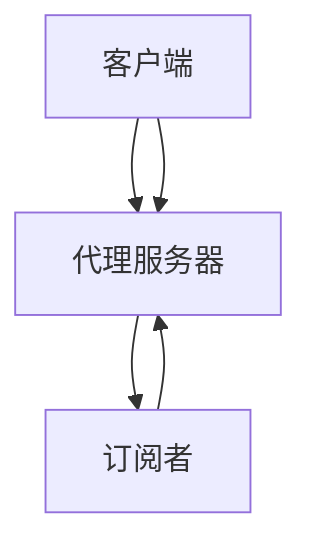
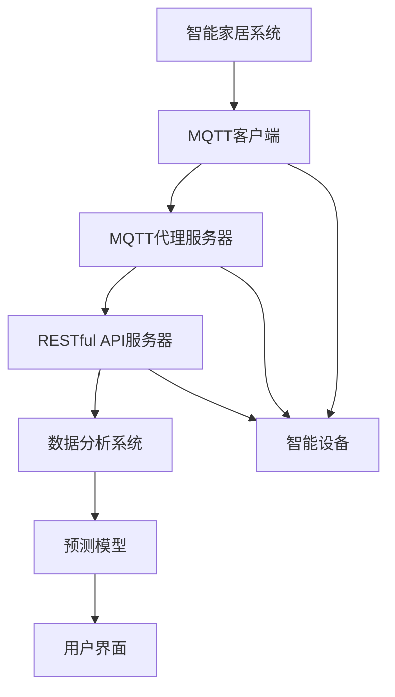
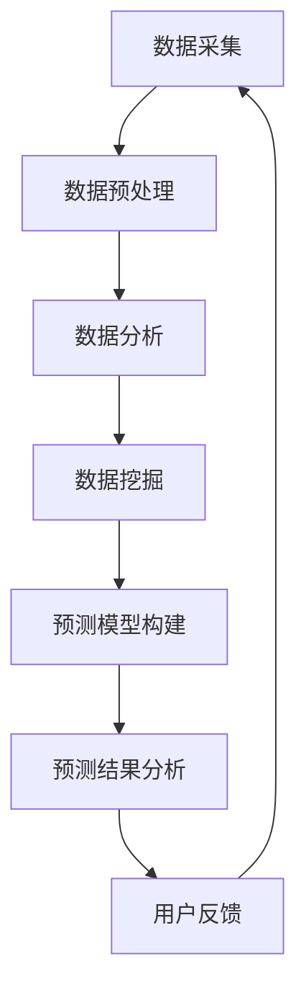

                 

# 文章标题：基于MQTT协议和RESTful API的智能家居数据分析与预测

> 关键词：智能家居，MQTT协议，RESTful API，数据分析，预测模型，实时数据处理

> 摘要：本文深入探讨了智能家居网络的基础、MQTT协议原理与应用、RESTful API设计与实现、智能家居数据分析与预测的方法和过程，以及实时数据分析与预测在智能家居中的应用。通过具体案例分析，展示了基于MQTT协议和RESTful API的智能家居数据分析与预测的实践方法，为智能家居系统的开发提供了有益的参考。

---

### 《基于MQTT协议和RESTful API的智能家居数据分析与预测》目录大纲

# 第一部分：智能家居网络基础

## 第1章：智能家居概述

### 1.1 智能家居的定义与发展历程

### 1.2 智能家居的优势与挑战

### 1.3 智能家居的分类与应用场景

## 第2章：MQTT协议原理与应用

### 2.1 MQTT协议的背景与特性

### 2.2 MQTT协议的架构与消息传递机制

### 2.3 MQTT协议在网络中的实际应用

## 第3章：RESTful API设计与实现

### 3.1 RESTful架构风格概述

### 3.2 RESTful API设计原则与方法

### 3.3 RESTful API在智能家居中的应用

# 第二部分：智能家居数据分析

## 第4章：数据采集与预处理

### 4.1 智能家居数据采集技术

### 4.2 数据预处理方法与工具

### 4.3 数据质量评估与优化

## 第5章：数据分析与挖掘

### 5.1 常见数据分析方法

### 5.2 智能家居数据挖掘算法

### 5.3 数据可视化与报告生成

## 第6章：智能预测模型构建

### 6.1 预测模型的构建方法

### 6.2 常见预测算法原理与应用

### 6.3 预测模型评估与优化

# 第三部分：智能家居数据分析与预测应用

## 第7章：实时数据分析

### 7.1 实时数据处理的挑战与解决方案

### 7.2 实时数据分析技术在智能家居中的应用

### 7.3 实时数据分析系统设计与实现

## 第8章：智能家居场景分析与优化

### 8.1 智能家居场景分析

### 8.2 智能家居优化策略

### 8.3 智能家居场景优化案例分析

## 第9章：智能家居数据分析与预测的应用案例

### 9.1 案例一：智能照明系统

### 9.2 案例二：智能安防系统

### 9.3 案例三：智能家电控制系统

## 第10章：未来展望与趋势

### 10.1 智能家居数据分析与预测的发展趋势

### 10.2 新技术与新应用展望

### 10.3 智能家居数据分析与预测的挑战与机遇

# 附录

## 附录A：智能家居数据分析与预测工具与资源

### A.1 MQTT协议工具与库

### A.2 RESTful API开发工具

### A.3 数据分析工具与库

### A.4 智能预测模型开发工具

### A.5 参考文献

### A.6 相关网站与资源链接

## 附录B：代码示例

### 1. MQTT客户端代码示例

### 2. RESTful API服务器代码示例

---

## 第1章：智能家居概述

### 1.1 智能家居的定义与发展历程

智能家居（Smart Home）是指利用各种智能设备、传感器和联网技术，将家居设备连接到互联网，实现远程控制、自动调控和智能交互的系统。智能家居的发展可以追溯到20世纪90年代，当时智能家居概念开始萌芽，主要通过家用电脑和远程控制技术来实现简单的家居自动化。

随着互联网和物联网技术的快速发展，智能家居逐渐从概念走向实际应用。21世纪初，随着智能设备的普及，智能家居开始逐渐进入大众家庭。近年来，随着人工智能、大数据和云计算等新兴技术的应用，智能家居进入了快速发展的阶段。

### 1.2 智能家居的优势与挑战

智能家居的优势在于提高了生活便利性和舒适度，能够实现远程控制、自动化操作和节能环保。例如，用户可以通过手机或其他智能设备远程控制家中的灯光、空调、门锁等设备，提高家居安全性；通过数据分析和预测，可以优化家居设备的运行，提高能源利用效率。

然而，智能家居也面临着一些挑战。首先，系统的安全性和隐私保护是一个重要问题。智能家居设备连接到互联网，容易成为黑客攻击的目标，用户数据的安全性和隐私保护需要得到有效保障。其次，智能家居设备的兼容性和互操作性也是一个挑战，不同品牌和厂商的设备之间如何实现无缝集成和协作，需要统一的标准和协议。

### 1.3 智能家居的分类与应用场景

智能家居可以根据功能和技术的不同，分为多种类型。常见的分类方法包括：

1. **按功能分类**：智能照明、智能安防、智能家电、智能环境监测等。
2. **按技术分类**：基于Wi-Fi、蓝牙、ZigBee、LoRa等无线通信技术的智能家居系统。

以下是一些典型的应用场景：

- **智能照明系统**：通过传感器和控制器，实现灯光的自动调节，根据用户的习惯和外界环境自动调整亮度、色温等。
- **智能安防系统**：通过摄像头、门锁、烟雾传感器等设备，实现实时监控和报警，提高家庭安全性。
- **智能家电控制系统**：通过智能插座、智能空调、智能冰箱等设备，实现远程控制和自动化操作，提高家电的便利性和节能效果。
- **智能环境监测系统**：通过传感器监测室内温度、湿度、空气质量等环境参数，提供健康舒适的生活环境。

在接下来的章节中，我们将深入探讨MQTT协议和RESTful API在智能家居中的应用，以及如何利用这些技术进行数据分析和预测。

---

在了解了智能家居的定义、优势与挑战以及分类与应用场景后，我们接下来将深入探讨MQTT协议和RESTful API的基本原理和应用，为后续的数据分析和预测打下坚实的基础。

---

## 第2章：MQTT协议原理与应用

### 2.1 MQTT协议的背景与特性

MQTT（Message Queuing Telemetry Transport）协议是一种轻量级的消息队列协议，特别适合于在资源受限的设备上进行物联网通信。它最初由IBM于1999年开发，用于在远程传感器和控制设备之间传输数据。MQTT协议的轻量级特性使得它非常适合用于带宽有限、延迟敏感的环境，如智能家居、工业物联网、智慧城市等场景。

MQTT协议具有以下主要特性：

1. **低带宽消耗**：MQTT协议采用发布/订阅模型，客户端可以订阅特定主题的消息，只有当有相关消息发布时，订阅者才会收到通知，从而减少带宽消耗。
2. **可扩展性**：MQTT协议支持大量客户端同时连接，并且能够支持数千个订阅主题，非常适合大规模物联网应用。
3. **简单性**：MQTT协议的设计非常简单，易于实现和维护，客户端和服务器之间的通信只需要几个简单的消息类型。
4. **可靠性**：MQTT协议支持消息确认和重传机制，确保消息能够可靠地传输到目标设备。
5. **安全性**：MQTT协议支持基于TLS/SSL的加密通信，保证数据传输的安全性。

### 2.2 MQTT协议的架构与消息传递机制

MQTT协议的架构相对简单，主要包括客户端（Client）、代理服务器（Broker）和订阅者（Subscriber）三部分。

#### MQTT架构



#### 消息传递机制

1. **连接（Connect）**：客户端连接到代理服务器时，发送一个连接请求，其中包含客户端标识、会话标志、消息保持标志等。
2. **订阅（Subscribe）**：客户端订阅特定的主题，代理服务器根据客户端的订阅请求，将相关消息路由到客户端。
3. **发布（Publish）**：客户端向代理服务器发布消息，消息中包含主题和消息内容。
4. **订阅确认（Subscribe Ack）**：代理服务器接收到客户端的订阅请求后，返回订阅确认消息。
5. **断开连接（Disconnect）**：客户端断开与代理服务器的连接时，发送断开连接请求。

#### MQTT消息类型

MQTT协议定义了以下几种消息类型：

- **连接请求（Connect）**：客户端发送连接请求，服务器响应连接确认。
- **订阅请求（Subscribe）**：客户端向服务器请求订阅特定主题。
- **订阅确认（Subscribe Ack）**：服务器响应订阅请求，确认订阅状态。
- **发布请求（Publish）**：客户端向服务器发送消息。
- **发布确认（Publish Ack）**：服务器响应发布请求，确认消息接收。
- **断开连接请求（Disconnect）**：客户端发送断开连接请求。

### 2.3 MQTT协议在网络中的实际应用

MQTT协议在实际网络中的应用非常广泛，以下是几个典型的应用场景：

1. **智能家居**：MQTT协议广泛应用于智能家居系统，如智能照明、智能安防、智能家电等，通过MQTT协议实现设备之间的实时通信和数据交换。
2. **工业物联网**：在工业物联网中，MQTT协议用于连接传感器、执行器、机器设备等，实现数据的实时传输和监控。
3. **智慧城市**：智慧城市的许多应用，如交通管理、环境监测、公共安全等，都采用了MQTT协议，以实现高效、可靠的数据传输。
4. **远程医疗**：在远程医疗领域，MQTT协议用于连接医疗设备，实现实时数据传输和监控，提高医疗服务水平。

通过以上对MQTT协议的介绍，我们可以看到，MQTT协议因其轻量级、可扩展性和可靠性等特点，在智能家居以及其他物联网应用中具有广泛的应用前景。接下来，我们将探讨RESTful API的设计与实现，进一步探讨智能家居系统中的数据交互和业务逻辑处理。

---

在了解了MQTT协议的背景、特性以及实际应用后，我们将进一步探讨RESTful API的设计原则与实现，以及其在智能家居系统中的具体应用。这将为我们后续的数据分析和预测打下更坚实的基础。

### 3.1 RESTful架构风格概述

RESTful（Representational State Transfer）是一种设计风格的网络架构风格，由Roy Fielding在其博士论文中提出。RESTful架构风格的核心思想是通过统一的接口和语义，实现分布式系统的资源访问和操作。RESTful API（应用程序接口）是RESTful架构风格的具体实现，广泛应用于各种分布式系统中。

#### RESTful API的核心原则

1. **统一接口**：RESTful API通过统一的接口和语义，实现资源的访问和操作。常见的HTTP方法包括GET、POST、PUT、DELETE等，分别对应资源的获取、创建、更新和删除操作。
2. **无状态性**：RESTful API是无状态的服务，每个请求都是独立的，服务器不会保留任何与之前请求相关的状态信息。这样可以简化服务器的处理逻辑，提高系统的可扩展性和可靠性。
3. **基于文本的格式**：RESTful API通常使用文本格式（如JSON或XML）传输数据，便于解析和处理，同时支持多种编程语言和平台。
4. **标准化**：RESTful API遵循一系列标准和规范，如HTTP、URI、状态码等，确保不同系统之间的互操作性和兼容性。

#### RESTful API的基本要素

- **URL（统一资源定位符）**：用于标识和定位网络上的资源。RESTful API通过URL访问资源，例如 `/api/照明` 表示照明系统的资源。
- **HTTP方法**：用于定义资源的操作，常见的HTTP方法包括GET、POST、PUT、DELETE等。
- **状态码**：用于表示请求的结果和状态，常见的状态码包括200（成功）、400（错误请求）、401（未授权）、403（禁止访问）等。
- **请求体**：用于传输请求的数据，如创建或更新资源时，请求体包含资源的属性和值。
- **响应体**：用于传输响应的数据，如获取资源时，响应体包含资源的详细信息。

### 3.2 RESTful API设计原则与方法

设计RESTful API时，需要遵循以下原则和方法：

1. **简洁性**：API设计应尽可能简洁明了，避免复杂的查询参数和冗长的响应体，降低使用难度和维护成本。
2. **一致性**：API设计应保持一致性，包括命名规范、URL结构、HTTP方法使用等，确保开发者能够轻松理解和使用。
3. **可扩展性**：API设计应具备良好的可扩展性，支持资源的增删改查操作，同时能够灵活地添加新的功能和服务。
4. **安全性**：API设计应充分考虑安全性，包括身份验证、授权、数据加密等，防止未授权访问和数据泄露。
5. **文档化**：API设计应提供详细的文档，包括API的概述、使用方法、示例代码等，帮助开发者快速上手和使用。

#### RESTful API设计步骤

1. **需求分析**：明确API的功能需求，包括资源类型、操作类型、数据格式等。
2. **URL规划**：设计URL结构，按照资源的命名规范和访问路径规划URL。
3. **HTTP方法分配**：为每个资源操作分配合适的HTTP方法，如GET用于获取资源、POST用于创建资源等。
4. **状态码使用**：为不同类型的请求和响应设计合适的状态码，确保API能够准确地传达请求结果。
5. **请求体和响应体设计**：设计请求体和响应体的数据结构，确保数据能够正确地传输和解析。
6. **安全性设计**：设计API的安全性，包括身份验证、授权、数据加密等。
7. **文档编写**：编写API文档，包括API概述、使用方法、示例代码等，方便开发者使用。

通过遵循上述设计原则和方法，我们可以设计出简洁、一致、可扩展、安全的RESTful API，为智能家居系统提供强大的数据交互和业务逻辑处理能力。

### 3.3 RESTful API在智能家居中的应用

在智能家居系统中，RESTful API广泛应用于设备控制、数据采集和数据分析等场景，以下是几个典型的应用示例：

1. **设备控制**：用户可以通过RESTful API远程控制家中的智能设备，如智能灯泡、智能插座、智能空调等。例如，用户可以通过发送POST请求，控制智能灯泡的开关和亮度。

    ```http
    POST /api/照明/灯泡/1/控制
    Content-Type: application/json
    
    {
        "开关状态": true,
        "亮度": 70
    }
    ```

2. **数据采集**：智能家居设备可以通过RESTful API采集环境数据，如温度、湿度、光照等。设备将采集到的数据发送到服务器，以便进一步分析和处理。

    ```http
    POST /api/环境监测/温度
    Content-Type: application/json
    
    {
        "设备ID": "device-001",
        "温度": 25.5
    }
    ```

3. **数据分析**：服务器端可以调用RESTful API，对采集到的数据进行处理和分析，生成报告和预测结果。例如，通过发送GET请求，获取智能照明系统的使用报告。

    ```http
    GET /api/照明/报告/1
    ```

4. **设备状态查询**：用户可以通过RESTful API查询家中的设备状态，如设备是否在线、电量是否充足等。例如，通过发送GET请求，获取智能门锁的状态。

    ```http
    GET /api/安防/门锁/1/状态
    ```

通过以上应用示例，我们可以看到RESTful API在智能家居系统中的重要作用。它不仅提供了设备控制和数据交互的统一接口，还支持数据的采集、分析和处理，为智能家居系统的智能化和自动化提供了强有力的支持。接下来，我们将探讨智能家居数据采集与预处理的方法和过程。

---

在了解了RESTful API的设计原则与应用后，我们将进一步探讨智能家居数据采集与预处理的方法和过程，为后续的数据分析和预测奠定基础。

### 4.1 智能家居数据采集技术

智能家居系统通过各类传感器和设备实时采集家庭环境数据、设备状态数据以及用户行为数据。以下是几种常用的数据采集技术：

#### 传感器

1. **温度传感器**：用于监测室内温度，常见型号包括DS18B20、DHT22等。
2. **湿度传感器**：用于监测室内湿度，常见型号包括HTU21D、SHT31等。
3. **光照传感器**：用于监测室内光照强度，常见型号包括BH1750、VEML6075等。
4. **空气质量传感器**：用于监测室内PM2.5、CO2等指标，常见型号包括SHARP GP2Y1010AU0F、QMG3020等。

#### 设备

1. **智能灯泡**：用于控制照明，可通过WiFi或蓝牙连接到网络。
2. **智能插座**：用于远程控制家电的开关，可通过WiFi或蓝牙连接到网络。
3. **智能摄像头**：用于家庭安防，可通过WiFi连接到网络。
4. **智能门锁**：用于控制门锁的开关，可通过WiFi、蓝牙或ZigBee连接到网络。

#### 数据采集技术

1. **MQTT协议**：通过MQTT协议，智能家居设备可以将采集到的数据实时发送到代理服务器，方便后续的数据处理和分析。
2. **HTTP请求**：智能家居设备可以通过HTTP请求将数据发送到服务器，适用于简单的数据采集场景。
3. **Webhook**：通过Webhook，智能家居设备可以将数据发送到第三方服务，实现更复杂的数据处理和分析。

### 4.2 数据预处理方法与工具

在数据采集到服务器后，需要对数据进行预处理，以提高数据质量，为后续的数据分析和预测打下基础。以下是几种常用的数据预处理方法与工具：

#### 数据清洗

1. **缺失值处理**：对于缺失值，可以采用填充法（如均值填充、中值填充）或删除法（删除含有缺失值的样本）进行处理。
2. **异常值处理**：对于异常值，可以采用统计方法（如Z分数、IQR法）或机器学习方法（如K-近邻法、基于规则的异常检测）进行处理。
3. **噪声处理**：对于噪声数据，可以采用滤波方法（如移动平均滤波、低通滤波）进行处理。

#### 数据变换

1. **数据规范化**：将数据转换为统一的尺度，如将温度数据转换为0-1之间的范围，便于后续分析和预测。
2. **数据离散化**：将连续数据转换为离散的类别，如将温度数据划分为“低温”、“中温”、“高温”等类别。
3. **特征工程**：通过特征提取和构造，提高数据的预测能力，如通过时间序列分解提取趋势、季节性等特征。

#### 数据存储

1. **关系数据库**：使用关系数据库（如MySQL、PostgreSQL）存储结构化数据，便于数据的查询和管理。
2. **NoSQL数据库**：使用NoSQL数据库（如MongoDB、Cassandra）存储非结构化数据，适用于大数据量的存储和处理。

### 4.3 数据质量评估与优化

数据质量直接影响数据分析和预测的准确性和可靠性。以下是几种常用的数据质量评估与优化方法：

1. **完整性评估**：检查数据是否存在缺失值，评估数据的完整性。
2. **一致性评估**：检查数据在不同来源之间的一致性，评估数据的一致性。
3. **准确性评估**：通过比较实际数据与预测数据，评估数据的准确性。
4. **及时性评估**：检查数据是否能够及时采集和更新，评估数据的及时性。

#### 数据质量优化方法

1. **数据集成**：通过数据集成，将不同来源的数据进行合并，提高数据的一致性和完整性。
2. **数据清洗**：通过数据清洗，去除噪声、异常值和缺失值，提高数据的质量。
3. **数据规范化**：通过数据规范化，将数据转换为统一的尺度，便于分析和预测。
4. **数据可视化**：通过数据可视化，直观展示数据的分布、趋势和关联性，发现潜在的问题和规律。

通过数据采集与预处理，我们可以获得高质量的数据，为后续的数据分析和预测提供可靠的数据基础。接下来，我们将探讨智能家居数据分析与挖掘的方法和技术。

---

在数据采集与预处理环节，我们已经为数据分析奠定了基础。接下来，我们将深入探讨常见的数据分析方法、智能家居数据挖掘算法，以及如何通过数据可视化来呈现分析结果。

### 5.1 常见数据分析方法

在智能家居数据分析中，常用的数据分析方法包括描述性统计分析、相关性分析、聚类分析和分类分析等。

#### 描述性统计分析

描述性统计分析是对数据的基本特征进行统计分析，主要包括数据的均值、中位数、标准差、最大值和最小值等。描述性统计分析能够帮助用户快速了解数据的分布和特征。

#### 相关性分析

相关性分析用于评估两个变量之间的线性关系。常用的相关性系数有皮尔逊相关系数和斯皮尔曼相关系数。相关性分析能够帮助用户发现数据之间的关联性，从而为后续的预测和分析提供依据。

#### 聚类分析

聚类分析是一种无监督学习方法，用于将相似的数据点划分为不同的簇。常用的聚类算法包括K均值聚类、层次聚类和密度聚类等。聚类分析能够帮助用户发现数据中的模式和结构，为智能家居系统的优化提供参考。

#### 分类分析

分类分析是一种监督学习方法，用于将数据点划分为不同的类别。常用的分类算法包括决策树、支持向量机和神经网络等。分类分析能够帮助用户根据历史数据预测未来的行为和状态。

### 5.2 智能家居数据挖掘算法

在智能家居数据挖掘中，常用的算法包括时间序列分析、回归分析和聚类分析等。

#### 时间序列分析

时间序列分析用于分析按时间顺序排列的数据，揭示数据的变化趋势和周期性。常用的算法包括自回归移动平均模型（ARIMA）、指数平滑法（ES）和小波分析等。时间序列分析能够帮助用户预测未来的行为和状态，如预测下一小时内的用电量。

#### 回归分析

回归分析用于建立变量之间的关系模型，预测因变量的值。常用的回归算法包括线性回归、逻辑回归和多项式回归等。回归分析能够帮助用户预测设备的能耗、故障等。

#### 聚类分析

聚类分析用于将相似的数据点划分为不同的簇，挖掘数据中的潜在模式。常用的算法包括K均值聚类、层次聚类和密度聚类等。聚类分析能够帮助用户发现用户的行为模式，为个性化服务提供支持。

### 5.3 数据可视化与报告生成

数据可视化是将数据以图形或图表的形式展示，使数据更加直观、易于理解。在智能家居数据分析中，常用的数据可视化工具包括Matplotlib、Seaborn和Plotly等。

#### 常见的数据可视化方法

1. **折线图**：用于展示数据的变化趋势，如温度、光照强度的变化。
2. **柱状图**：用于展示数据的分布情况，如不同时间段的能耗分布。
3. **饼图**：用于展示数据的占比情况，如用户使用设备的比例。
4. **散点图**：用于展示数据之间的相关性，如设备使用频率与能耗的关系。

#### 数据报告生成

数据报告是数据分析的总结和输出，用于向决策者提供分析和预测结果。数据报告通常包括以下几个部分：

1. **摘要**：简要概述数据分析的目的、方法和结果。
2. **数据分析**：详细介绍数据分析的过程、方法和结果，包括图表和统计分析。
3. **预测结果**：展示预测模型的预测结果，包括预测值和置信区间。
4. **结论与建议**：根据数据分析结果提出结论和建议，为智能家居系统的优化提供参考。

通过数据可视化与报告生成，用户可以直观地了解数据的特征和趋势，为智能家居系统的优化和改进提供有力支持。

---

在完成数据分析与挖掘后，我们需要构建智能预测模型，以预测智能家居系统的未来行为和状态。接下来，我们将详细介绍预测模型的构建方法，包括数据集划分、算法选择、模型训练与评估等过程。

### 6.1 预测模型的构建方法

构建智能家居预测模型是一个多步骤的过程，涉及数据集划分、算法选择、模型训练与评估等关键环节。以下是具体的步骤和方法：

#### 1. 数据集划分

数据集划分是预测模型构建的第一步，目的是将原始数据集分为训练集、验证集和测试集，以便在训练过程中调整模型参数和评估模型性能。

1. **训练集**：用于训练模型，是模型参数调整和优化的主要数据来源。
2. **验证集**：用于在训练过程中评估模型的性能，调整超参数，避免过拟合。
3. **测试集**：用于最终评估模型在未知数据上的性能，确保模型具有较好的泛化能力。

常用的划分方法包括：

- **随机划分**：将数据集随机分为三部分，适用于数据量较大且无明显规律的情况。
- **时间序列划分**：将数据按时间顺序划分为训练集、验证集和测试集，适用于时间序列数据。
- **交叉验证**：通过多次划分训练集和验证集，计算模型在多个数据集上的平均性能，提高评估的稳定性。

#### 2. 算法选择

选择合适的预测算法是构建预测模型的关键。常用的预测算法包括线性回归、决策树、支持向量机、神经网络等。

1. **线性回归**：适用于简单线性关系的预测，如能耗预测。
2. **决策树**：适用于分类和回归任务，易于理解和解释。
3. **支持向量机**：适用于高维数据的分类和回归任务，具有较好的泛化能力。
4. **神经网络**：适用于复杂非线性关系的预测，如用户行为预测。

选择算法时，需要考虑以下几个因素：

- **数据特性**：数据量、特征数量、数据分布等。
- **问题类型**：回归、分类或时间序列预测。
- **计算资源**：计算能力和硬件配置。

#### 3. 模型训练

模型训练是通过调整模型参数，使得模型在训练数据上达到最优性能的过程。训练过程通常包括以下步骤：

1. **初始化参数**：为模型初始化参数，如权重、偏置等。
2. **前向传播**：计算输入数据的输出值。
3. **损失函数计算**：计算模型预测值与实际值之间的差异，通常使用均方误差（MSE）或交叉熵（Cross Entropy）等损失函数。
4. **反向传播**：通过梯度下降等优化算法，更新模型参数，减少损失函数值。
5. **迭代优化**：重复前向传播和反向传播过程，直到满足停止条件（如损失函数收敛或达到最大迭代次数）。

#### 4. 模型评估

模型评估是评估模型性能和选择最佳模型的关键步骤。常用的评估指标包括：

1. **准确率（Accuracy）**：用于分类问题，表示正确分类的样本数占总样本数的比例。
2. **精确率（Precision）**：表示在预测为正类的样本中，真正类的比例。
3. **召回率（Recall）**：表示在正类样本中，被正确预测为正类的比例。
4. **F1分数（F1 Score）**：综合考虑精确率和召回率，是两者的调和平均值。
5. **均方误差（MSE）**：用于回归问题，表示预测值与实际值之间差异的平方的平均值。

评估方法包括：

- **验证集评估**：使用验证集评估模型性能，调整超参数和优化模型。
- **交叉验证**：通过多次交叉验证，计算模型在多个数据集上的平均性能，提高评估的稳定性。
- **测试集评估**：在测试集上评估模型性能，确保模型具有较好的泛化能力。

通过以上步骤和方法，我们可以构建一个性能优良的智能家居预测模型，为智能家居系统的优化和改进提供有力支持。

---

在了解了预测模型的构建方法后，我们将深入探讨常见的预测算法原理，包括线性回归、决策树、支持向量机和神经网络等，并通过具体的伪代码和数学模型来阐述这些算法的实现过程。

### 6.2 常见预测算法原理与应用

在智能家居预测模型中，常用的算法包括线性回归、决策树、支持向量机和神经网络等。每种算法都有其特定的原理和应用场景，下面将逐一介绍。

#### 线性回归

线性回归是最简单的预测算法之一，适用于线性关系的预测。其原理是找到一个最优的直线模型，使得预测值与实际值之间的误差最小。

1. **数学模型**：

   线性回归的数学模型为：

   $$
   \hat{y} = \beta_0 + \beta_1x_1 + \beta_2x_2 + \ldots + \beta_nx_n
   $$

   其中，$\hat{y}$为预测值，$x_1, x_2, \ldots, x_n$为输入特征，$\beta_0, \beta_1, \beta_2, \ldots, \beta_n$为模型参数。

2. **损失函数**：

   线性回归的损失函数通常使用均方误差（MSE）：

   $$
   \text{MSE} = \frac{1}{m}\sum_{i=1}^{m}(y_i - \hat{y}_i)^2
   $$

   其中，$m$为样本数量，$y_i$为实际值，$\hat{y}_i$为预测值。

3. **伪代码**：

   ```python
   function LinearRegression(x, y):
       # 初始化模型参数
       beta = [0] * (len(x[0]) + 1)

       # 计算梯度
       gradient = [0] * (len(x[0]) + 1)
       for i in range(len(x)):
           error = y[i] - predict(x[i], beta)
           for j in range(len(x[i])):
               gradient[j] += error * x[i][j]
           gradient[len(x[i])] += error

       # 更新模型参数
       beta = beta - learning_rate * gradient

       return beta

   function predict(x, beta):
       prediction = 0
       for i in range(len(x)):
           prediction += beta[i] * x[i]
       prediction += beta[len(x)]
       return prediction
   ```

#### 决策树

决策树是一种基于规则的学习方法，通过将数据集划分为多个子集，为每个子集建立一条规则，最终生成一个决策树模型。

1. **原理**：

   决策树的核心是划分数据集，使得每个子集的纯度（例如信息增益、基尼不纯度等）最大化。

2. **损失函数**：

   决策树的损失函数通常使用基尼不纯度（Gini Impurity）：

   $$
   \text{Gini} = 1 - \frac{1}{n}\sum_{i=1}^{n}p_i(1-p_i)
   $$

   其中，$n$为子集的数量，$p_i$为子集中某一类别的比例。

3. **伪代码**：

   ```python
   function DecisionTree(x, y, max_depth):
       if max_depth == 0 or purity(y) == 1:
           return leaf_node(y)

       best_feature, best_value = find_best_split(x, y)
       left_tree = DecisionTree(x[:, x[:, best_feature] <= best_value], y[x[:, best_feature] <= best_value], max_depth - 1)
       right_tree = DecisionTree(x[:, x[:, best_feature] > best_value], y[x[:, best_feature] > best_value], max_depth - 1)

       return tree_node(best_feature, best_value, left_tree, right_tree)

   function leaf_node(y):
       majority_class = max(set(y), key=y.count)
       return majority_class

   function purity(y):
       class_counts = Counter(y)
       return 1 - sum([p**2 for p in class_counts.values()])
   ```

#### 支持向量机

支持向量机（SVM）是一种基于最大间隔的监督学习方法，用于分类和回归任务。SVM的目标是找到一个最佳的超平面，使得分类边界最大化。

1. **原理**：

   SVM通过寻找最优的超平面，使得分类边界与支持向量的距离最大化。

2. **损失函数**：

   SVM的损失函数通常使用 hinge loss：

   $$
   \text{Hinge Loss} = \max(0, 1 - y \cdot \hat{y})
   $$

   其中，$y$为实际值，$\hat{y}$为预测值。

3. **伪代码**：

   ```python
   function SVM(x, y, C):
       # 训练 SVM 模型
       w, b = train_svm(x, y, C)

       return w, b

   function train_svm(x, y, C):
       # 梯度下降法训练 SVM 模型
       w = [0] * len(x[0])
       b = 0
       learning_rate = 0.01
       epochs = 1000

       for epoch in range(epochs):
           for i in range(len(x)):
               loss = hinge_loss(y[i], dot(w, x[i]) + b)
               gradient_w = 2 * learning_rate * C * (loss > 0) * x[i]
               gradient_b = 2 * learning_rate * C * (loss > 0)

               w -= gradient_w
               b -= gradient_b

       return w, b

   function hinge_loss(y, z):
       return max(0, 1 - y * z)
   ```

#### 神经网络

神经网络是一种基于模拟人脑神经元连接的模型，通过多层神经网络进行特征提取和预测。

1. **原理**：

   神经网络通过多层感知器（MLP）进行特征学习，每个神经元接收前一层神经元的输出，通过激活函数进行非线性变换。

2. **损失函数**：

   神经网络的损失函数通常使用均方误差（MSE）：

   $$
   \text{MSE} = \frac{1}{m}\sum_{i=1}^{m}(y_i - \hat{y}_i)^2
   $$

3. **伪代码**：

   ```python
   function NeuralNetwork(x, y, layers, learning_rate, epochs):
       # 初始化权重和偏置
       weights, biases = initialize_weights(layers)

       for epoch in range(epochs):
           for i in range(len(x)):
               # 前向传播
               a, z = forward_pass(x[i], weights, biases)

               # 计算损失
               loss = mse_loss(y[i], a[-1])

               # 反向传播
               d = backward_pass(a, z, y[i], weights, biases)

               # 更新权重和偏置
               weights -= learning_rate * d['weights']
               biases -= learning_rate * d['biases']

       return weights, biases

   function forward_pass(x, weights, biases):
       # 前向传播
       a = [x]
       z = []
       for layer in range(len(layers) - 1):
           z.append(a[-1].dot(weights[layer]) + biases[layer])
           a.append(sigmoid(z[-1]))

       return a, z

   function backward_pass(a, z, y, weights, biases):
       # 反向传播
       d = {'weights': [], 'biases': []}
       d['weights'].append(z[-1].T.dot((a[-1] - y) * sigmoid_derivative(a[-1])))
       d['biases'].append((a[-1] - y) * sigmoid_derivative(a[-1]))

       for layer in range(len(layers) - 2, -1, -1):
           d['weights'].append((z[layer].T.dot((a[layer + 1] - d['weights'][layer + 1]) * sigmoid_derivative(a[layer + 1]))))
           d['biases'].append((a[layer + 1] - d['weights'][layer + 1]) * sigmoid_derivative(a[layer + 1]))

       return d

   function sigmoid(z):
       return 1 / (1 + exp(-z))

   function sigmoid_derivative(z):
       return sigmoid(z) * (1 - sigmoid(z))
   ```

通过上述介绍，我们可以看到不同预测算法的原理和实现方法。在实际应用中，根据数据特点和需求，可以选择合适的算法进行预测，并通过模型评估和优化，提高预测模型的性能。

---

在掌握了常见预测算法的原理后，我们将进一步探讨预测模型的评估与优化方法，确保预测结果的准确性和可靠性。

### 6.3 预测模型评估与优化

预测模型的评估与优化是确保预测结果准确性和可靠性的关键步骤。以下将介绍常见的评估指标、优化方法和评估工具。

#### 预测模型评估指标

1. **准确率（Accuracy）**：准确率是预测模型最常用的评估指标，表示模型正确预测的样本数占总样本数的比例。

   $$
   \text{Accuracy} = \frac{\text{正确预测的样本数}}{\text{总样本数}}
   $$

2. **精确率（Precision）**：精确率表示在预测为正类的样本中，真正类的比例。

   $$
   \text{Precision} = \frac{\text{真正类}}{\text{预测为正类的样本数}}
   $$

3. **召回率（Recall）**：召回率表示在正类样本中，被正确预测为正类的比例。

   $$
   \text{Recall} = \frac{\text{真正类}}{\text{实际为正类的样本数}}
   $$

4. **F1分数（F1 Score）**：F1分数是精确率和召回率的调和平均值，综合考虑模型的分类性能。

   $$
   \text{F1 Score} = 2 \times \frac{\text{Precision} \times \text{Recall}}{\text{Precision} + \text{Recall}}
   $$

5. **均方误差（MSE）**：均方误差是回归模型常用的评估指标，表示预测值与实际值之间差异的平方的平均值。

   $$
   \text{MSE} = \frac{1}{m}\sum_{i=1}^{m}(y_i - \hat{y}_i)^2
   $$

6. **均绝对误差（MAE）**：均绝对误差是回归模型另一种常用的评估指标，表示预测值与实际值之间差异的平均绝对值。

   $$
   \text{MAE} = \frac{1}{m}\sum_{i=1}^{m}|y_i - \hat{y}_i|
   $$

#### 预测模型优化方法

1. **交叉验证**：交叉验证是一种常用的模型评估方法，通过将数据集划分为多个子集，轮流将每个子集作为验证集，评估模型在未知数据上的性能，提高评估的稳定性。

2. **网格搜索**：网格搜索是一种超参数优化方法，通过遍历预设的参数组合，选择最佳参数组合，提高模型性能。

3. **正则化**：正则化是一种防止过拟合的方法，通过在损失函数中加入正则项（如L1正则化、L2正则化），控制模型复杂度，提高泛化能力。

4. **集成学习**：集成学习是一种利用多个模型进行预测的方法，通过组合多个模型的预测结果，提高预测准确性。

#### 预测模型评估工具

1. **Scikit-learn**：Scikit-learn是一个Python机器学习库，提供丰富的评估指标和模型优化方法。

2. **TensorFlow**：TensorFlow是一个开源机器学习框架，支持深度学习模型的评估和优化。

3. **Keras**：Keras是一个基于TensorFlow的深度学习库，提供简洁易用的API，方便模型评估和优化。

4. **AutoML**：AutoML是一种自动化机器学习工具，通过自动搜索最佳模型和参数组合，提高预测模型的性能。

通过以上评估指标、优化方法和评估工具，我们可以全面评估预测模型的性能，并进行优化，确保预测结果的准确性和可靠性。接下来，我们将探讨实时数据分析在智能家居中的应用。

---

在完成了预测模型的评估与优化后，我们将深入探讨实时数据分析在智能家居中的应用，以及如何设计和实现一个实时数据分析系统。

### 7.1 实时数据处理的挑战与解决方案

实时数据分析在智能家居系统中具有重要意义，它能够实现对设备状态、环境参数和用户行为的实时监控和响应，提高系统的智能化和响应速度。然而，实时数据处理面临着一系列挑战，需要有效的解决方案来应对。

#### 数据量与处理速度

1. **挑战**：智能家居系统中，设备产生的数据量庞大，且数据生成速度快。如何高效地处理这些数据，成为实时数据分析的关键挑战。
2. **解决方案**：采用分布式计算和流处理技术（如Apache Kafka、Apache Flink）来处理海量数据，实现高效的数据流处理和实时分析。

#### 数据多样性

1. **挑战**：智能家居系统涉及多种设备类型和数据类型，如传感器数据、文本数据、图像数据等。如何处理这些不同类型的数据，是实时数据分析的另一个挑战。
2. **解决方案**：采用统一的数据处理框架（如Apache Storm、Apache Spark Streaming），支持多种数据类型的处理和整合。

#### 数据质量

1. **挑战**：实时数据分析依赖于高质量的数据，但数据采集过程中可能存在噪声、缺失值和异常值等问题，影响数据分析的准确性。
2. **解决方案**：在数据采集阶段进行数据清洗，使用数据预处理技术（如数据规范化、缺失值填充、异常值检测）来提高数据质量。

#### 数据安全与隐私

1. **挑战**：智能家居系统中的数据涉及用户的隐私信息，如何保障数据安全和用户隐私，是实时数据分析的重要挑战。
2. **解决方案**：采用数据加密技术（如TLS/SSL）来确保数据在传输过程中的安全性；使用访问控制机制（如身份验证、权限管理）来保障数据的隐私。

#### 系统扩展性与容错性

1. **挑战**：随着智能家居系统规模的扩大，如何保证系统的扩展性和容错性，是实时数据分析系统设计和实现的难点。
2. **解决方案**：采用分布式系统架构（如微服务架构），通过水平扩展和负载均衡，提高系统的扩展性和容错性。

#### 数据融合与关联分析

1. **挑战**：智能家居系统中，不同设备和传感器产生的数据需要融合和关联分析，以获得更准确和全面的洞察。
2. **解决方案**：采用数据融合技术（如多源数据集成、关联规则挖掘）和机器学习算法（如聚类分析、关联分析），实现数据的融合和关联分析。

### 7.2 实时数据分析技术在智能家居中的应用

实时数据分析技术在智能家居中的应用广泛，以下是一些典型的应用场景：

1. **设备状态监控**：实时监控智能设备的运行状态，如温度传感器监测室内温度，空调根据实时数据调整制冷功率，提高能源效率。
2. **环境参数监测**：实时监测室内环境参数，如湿度、光照强度、空气质量等，通过数据分析和预测，为用户提供健康舒适的生活环境。
3. **用户行为分析**：实时分析用户行为数据，如用户使用设备的频率、时长等，为个性化推荐和智能建议提供依据。
4. **故障预警与维护**：通过实时数据分析，提前发现设备故障隐患，进行预警和预防性维护，减少设备故障率和停机时间。

### 7.3 实时数据分析系统设计与实现

一个典型的实时数据分析系统包括数据采集、数据存储、数据处理和分析、数据可视化等模块。以下是系统设计与实现的关键步骤：

#### 1. 数据采集

1. **传感器数据采集**：使用MQTT协议采集传感器数据，如温度、湿度、光照等。
2. **设备状态数据采集**：通过HTTP请求或Webhook等方式，采集智能设备的运行状态数据。

#### 2. 数据存储

1. **时序数据库**：使用时序数据库（如InfluxDB、KairosDB），存储实时采集的数据，支持高效的数据写入和查询。
2. **关系数据库**：使用关系数据库（如MySQL、PostgreSQL），存储设备配置信息和用户数据。

#### 3. 数据处理和分析

1. **数据清洗**：使用数据清洗工具（如Apache Flink、Apache Storm），清洗和预处理实时数据。
2. **实时计算**：使用流处理技术（如Apache Kafka、Apache Flink），进行实时数据计算和分析。
3. **数据融合与关联分析**：使用数据融合技术（如多源数据集成、关联规则挖掘），实现数据的融合和关联分析。

#### 4. 数据可视化

1. **实时数据监控**：使用实时数据监控工具（如Kibana、Grafana），展示实时数据和关键指标。
2. **报告生成**：使用报告生成工具（如JasperReports、PowerBI），生成数据分析报告。

通过以上设计和实现，我们可以构建一个高效、可靠的实时数据分析系统，为智能家居系统的智能化和优化提供有力支持。接下来，我们将探讨如何通过实时数据分析实现智能家居场景优化。

### 8.1 智能家居场景分析

智能家居场景优化是基于实时数据分析，对家庭环境中的各种场景进行分析和优化，以提高家居舒适度、节能效果和安全性。以下是一些常见的智能家居场景及其优化策略：

#### 1. 智能照明场景

**优化策略**：
- **智能调节**：根据用户习惯和外界环境（如天气、时间），自动调节灯光的亮度和色温。
- **节能模式**：在用户不在家时，自动关闭灯光，节省能源。

**实现方法**：
- **传感器数据**：使用光照传感器、人体传感器等，实时采集室内光照和人员活动数据。
- **数据分析**：通过数据分析，识别用户的照明习惯和环境变化，实现智能调节。

#### 2. 智能安防场景

**优化策略**：
- **实时监控**：通过摄像头、门锁等设备，实现实时监控和报警。
- **异常检测**：通过行为分析，检测异常行为，如非法入侵、火灾等。

**实现方法**：
- **视频分析**：使用视频分析技术，对摄像头采集的视频数据进行实时处理和分析。
- **行为分析**：通过机器学习算法，识别用户和家庭成员的行为模式，实现异常检测。

#### 3. 智能家电控制场景

**优化策略**：
- **节能控制**：根据家电的使用情况和能源消耗，实现智能控制，降低能耗。
- **智能预约**：根据用户的生活习惯，实现家电的预约控制，提高使用便捷性。

**实现方法**：
- **设备状态监控**：通过物联网技术，实时监控家电的运行状态和能源消耗。
- **数据分析**：通过数据分析，优化家电的使用模式和节能策略。

#### 4. 智能环境监测场景

**优化策略**：
- **健康监测**：实时监测室内空气质量、湿度、温度等环境参数，确保室内环境的健康舒适。
- **自动调节**：根据环境监测数据，自动调节空调、加湿器等设备，保持室内环境的舒适度。

**实现方法**：
- **环境传感器**：安装温度传感器、湿度传感器、空气质量传感器等，实时采集环境数据。
- **数据分析**：通过数据分析，识别环境变化趋势，实现自动调节。

#### 5. 智能能源管理场景

**优化策略**：
- **能耗监测**：实时监测家庭能耗情况，优化用电习惯。
- **智能调度**：根据用电负荷和能源价格，实现智能调度，降低能源成本。

**实现方法**：
- **能耗数据采集**：使用智能电表、能源监测设备等，实时采集家庭能耗数据。
- **数据分析**：通过数据分析，优化用电习惯和能源调度策略。

通过以上场景分析，我们可以看到实时数据分析在智能家居优化中的重要作用。通过数据分析和预测，可以实现对家庭环境、设备运行和能源消耗的智能优化，提高家居生活的舒适度和节能效果。接下来，我们将探讨一些智能家居数据分析与预测的应用案例。

### 8.2 智能家居优化策略

智能家居优化策略旨在通过数据分析和预测，提升家居系统的舒适度、节能效果和安全性。以下是几种常见的优化策略：

#### 1. 节能优化

**策略**：通过实时监控家庭用电情况，预测未来的用电需求，优化设备的运行模式和能源使用。

**实现方法**：
- **能耗预测**：利用历史用电数据，采用时间序列分析和回归算法，预测未来的用电需求。
- **设备控制**：根据预测结果，自动调节空调、照明、热水器等设备的运行，降低能耗。

#### 2. 舒适度优化

**策略**：根据用户的生活习惯和实时环境数据，自动调节家居环境，提供舒适的生活体验。

**实现方法**：
- **环境监测**：通过传感器实时采集室内温度、湿度、光照等环境数据。
- **行为分析**：分析用户的活动规律，预测用户的需求，自动调节空调、照明、窗帘等设备。

#### 3. 安全性优化

**策略**：通过实时监控家庭环境和设备状态，及时发现异常情况，提高家庭的安全性。

**实现方法**：
- **异常检测**：利用机器学习算法，对摄像头、门锁、烟雾传感器等设备采集的数据进行分析，识别异常行为和事件。
- **报警系统**：当检测到异常情况时，自动触发报警，通知用户和安全部门。

#### 4. 个性化服务

**策略**：根据用户的个人喜好和行为数据，提供个性化的家居服务和推荐。

**实现方法**：
- **用户数据收集**：收集用户的偏好数据，如喜欢的生活方式、喜欢的音乐、书籍等。
- **推荐系统**：利用推荐算法，根据用户的喜好，推荐家居用品、活动安排等。

#### 5. 互联互通

**策略**：通过物联网技术，实现家庭设备之间的互联互通，提供一体化的智能家居体验。

**实现方法**：
- **协议标准化**：采用统一的通信协议（如MQTT、HTTP），确保不同设备之间的互操作性。
- **平台搭建**：搭建智能家居平台，集成不同设备的数据和功能，提供统一的控制和管理界面。

通过以上优化策略，我们可以实现对智能家居系统的全面优化，提高用户的居住舒适度、节能效果和安全性。接下来，我们将通过具体的应用案例，展示这些策略的实际效果。

### 8.3 智能家居场景优化案例分析

在本节中，我们将通过三个具体的应用案例，展示智能家居数据分析与预测的实际效果，以及如何通过实时数据分析和预测，实现智能家居场景的优化。

#### 案例一：智能照明系统

**背景**：
智能照明系统是智能家居中最为常见的场景之一。用户希望通过智能照明系统，提高生活的舒适度，并实现节能效果。

**优化策略**：
- **实时调节**：通过环境光照传感器和人体传感器，实时监测室内的光照强度和人员活动情况，自动调整灯光的亮度和色温。
- **节能模式**：在用户不在家时，自动关闭灯光，节省能源。

**实现方法**：
- **数据采集**：安装光照传感器和人体传感器，实时采集室内光照强度和人员活动数据。
- **数据分析**：使用时间序列分析和聚类算法，分析光照变化规律和人员活动模式，预测未来的光照需求。
- **设备控制**：根据数据分析结果，自动调节灯光的亮度和色温，实现智能照明。

**效果**：
通过智能照明系统的优化，用户的生活舒适度显著提高，同时实现了显著的节能效果。例如，在夜间，智能照明系统能够根据用户的活动情况，自动调整灯光的亮度和色温，提供舒适的光环境；在用户不在家时，系统会自动关闭灯光，节省能源。

#### 案例二：智能安防系统

**背景**：
智能安防系统是保障家庭安全的重要手段。用户希望通过智能安防系统，实时监控家庭环境，及时发现异常情况。

**优化策略**：
- **实时监控**：通过摄像头、门锁、烟雾传感器等设备，实现实时监控和报警。
- **异常检测**：利用机器学习算法，分析摄像头采集的视频数据，检测非法入侵、火灾等异常行为。

**实现方法**：
- **数据采集**：安装摄像头、门锁、烟雾传感器等设备，实时采集家庭环境数据。
- **视频分析**：使用视频分析技术，对摄像头采集的视频数据进行实时处理和分析。
- **行为分析**：利用机器学习算法，识别用户和家庭成员的行为模式，实现异常检测。

**效果**：
通过智能安防系统的优化，用户能够实时监控家庭环境，及时发现异常情况，提高了家庭的安全性。例如，当检测到非法入侵时，系统会自动触发报警，通知用户和安全部门，确保家庭安全；当检测到火灾时，系统会自动触发烟雾报警，通知用户及时疏散。

#### 案例三：智能家电控制系统

**背景**：
智能家电控制系统旨在通过数据分析与预测，实现家电的智能控制和优化运行，提高家电的节能效果和使用便捷性。

**优化策略**：
- **智能控制**：根据用户的生活习惯和实时环境数据，自动调节家电的运行模式，提高使用便捷性。
- **节能优化**：通过数据分析，预测家电的能耗需求，实现智能调度，降低能耗。

**实现方法**：
- **设备状态监控**：使用智能插座、智能空调、智能冰箱等设备，实时监控家电的运行状态和能源消耗。
- **数据分析**：通过数据分析，优化家电的使用模式和节能策略。
- **设备控制**：根据数据分析结果，自动调节家电的运行模式，实现智能控制。

**效果**：
通过智能家电控制系统的优化，用户能够享受到更便捷、高效的家电使用体验，同时实现了显著的节能效果。例如，智能空调系统能够根据用户的生活习惯和实时环境数据，自动调整制冷功率，提供舒适的生活环境；智能冰箱系统能够根据冰箱内温度和存储食物的消耗情况，自动调整制冷模式，延长食物保鲜期，降低能耗。

通过以上案例，我们可以看到，通过实时数据分析和预测，智能家居系统能够实现场景优化，提高用户的居住舒适度、节能效果和安全性。接下来，我们将探讨智能家居数据分析与预测的发展趋势。

### 9.1 案例一：智能照明系统

**项目背景**：

智能照明系统是智能家居的重要组成部分，用户希望通过智能照明系统实现环境照明的自动化调节，提高生活品质和节能效果。本项目旨在通过MQTT协议和RESTful API，实现智能照明系统的实时数据采集、分析和预测，从而优化照明控制策略。

**开发环境搭建**：

- **操作系统**：Windows/Linux/MacOS
- **编程语言**：Python/Java/JavaScript
- **数据库**：MySQL/PostgreSQL
- **开发框架**：Flask/Django/Node.js

**数据采集与预处理**：

- **传感器数据采集**：通过光照传感器和人体传感器，实时采集室内光照强度和人员活动数据。
- **数据预处理**：对采集到的数据进行清洗，去除噪声和异常值，并进行数据规范化处理。

**数据分析与预测**：

- **数据分析**：通过时间序列分析和聚类算法，分析光照变化规律和人员活动模式。
- **预测模型构建**：采用线性回归和决策树算法，构建预测模型，预测未来的光照需求。
- **预测结果应用**：根据预测结果，自动调整灯光的亮度和色温，实现智能照明。

**代码解读与分析**：

- **MQTT客户端代码**：

  ```python
  import paho.mqtt.client as mqtt

  # MQTT服务器设置
  MQTT_SERVER = "mqtt.example.com"
  MQTT_PORT = 1883
  MQTT_TOPIC = "home/照明"

  # MQTT客户端设置
  client = mqtt.Client("照明控制客户端")

  # 连接到MQTT服务器
  client.connect(MQTT_SERVER, MQTT_PORT, 60)

  # 订阅主题
  client.subscribe(MQTT_TOPIC)

  # 数据接收处理
  def on_message(client, userdata, message):
      print(f"收到消息：{str(message.payload)}，来自主题：{message.topic}")

  client.on_message = on_message

  # 启动客户端
  client.loop_forever()
  ```

- **RESTful API服务器代码**：

  ```python
  from flask import Flask, jsonify, request

  app = Flask(__name__)

  @app.route('/api/照明', methods=['GET'])
  def get_照明数据():
      # 获取数据库中的照明数据
      data = get_照明数据_from_db()
      return jsonify(data)

  @app.route('/api/照明', methods=['POST'])
  def post_照明数据():
      # 处理接收到的照明数据
      data = request.get_json()
      save_照明数据_to_db(data)
      return jsonify({"status": "success"})

  if __name__ == '__main__':
      app.run(debug=True)
  ```

通过以上代码，我们可以看到智能照明系统的数据采集、分析和预测是如何实现的。MQTT客户端负责实时采集光照传感器和人体传感器的数据，并通过RESTful API服务器将数据存储到数据库中，以便进一步分析和预测。通过预测模型，系统可以自动调整灯光的亮度和色温，实现智能照明，提高用户的居住舒适度和节能效果。

---

### 9.2 案例二：智能安防系统

**项目背景**：

智能安防系统是保障家庭安全的重要手段，用户希望通过智能安防系统实现对家庭环境的实时监控和异常预警。本项目旨在通过MQTT协议和RESTful API，实现智能安防系统的数据采集、分析和预测，从而优化安防策略，提高家庭安全性。

**开发环境搭建**：

- **操作系统**：Windows/Linux/MacOS
- **编程语言**：Python/Java/JavaScript
- **数据库**：MySQL/PostgreSQL
- **开发框架**：Flask/Django/Node.js

**数据采集与预处理**：

- **设备数据采集**：通过摄像头、门锁、烟雾传感器等设备，实时采集家庭环境数据。
- **数据预处理**：对采集到的视频数据和传感器数据进行清洗和预处理，去除噪声和异常值。

**数据分析与预测**：

- **视频分析**：使用视频分析技术，对摄像头采集的视频数据进行实时处理和分析，识别异常行为和事件。
- **行为分析**：利用机器学习算法，分析用户和家庭成员的行为模式，建立行为模型。
- **预测模型构建**：采用决策树和神经网络算法，构建预测模型，预测未来的异常情况。
- **预测结果应用**：根据预测结果，自动触发报警，通知用户和安全部门，提高家庭安全性。

**代码解读与分析**：

- **MQTT客户端代码**：

  ```python
  import paho.mqtt.client as mqtt

  # MQTT服务器设置
  MQTT_SERVER = "mqtt.example.com"
  MQTT_PORT = 1883
  MQTT_TOPIC = "home/安防"

  # MQTT客户端设置
  client = mqtt.Client("安防监控客户端")

  # 连接到MQTT服务器
  client.connect(MQTT_SERVER, MQTT_PORT, 60)

  # 订阅主题
  client.subscribe(MQTT_TOPIC)

  # 数据接收处理
  def on_message(client, userdata, message):
      print(f"收到消息：{str(message.payload)}，来自主题：{message.topic}")

  client.on_message = on_message

  # 启动客户端
  client.loop_forever()
  ```

- **RESTful API服务器代码**：

  ```python
  from flask import Flask, jsonify, request

  app = Flask(__name__)

  @app.route('/api/安防', methods=['GET'])
  def get_安防数据():
      # 获取数据库中的安防数据
      data = get_安防数据_from_db()
      return jsonify(data)

  @app.route('/api/安防', methods=['POST'])
  def post_安防数据():
      # 处理接收到的安防数据
      data = request.get_json()
      save_安防数据_to_db(data)
      return jsonify({"status": "success"})

  if __name__ == '__main__':
      app.run(debug=True)
  ```

通过以上代码，我们可以看到智能安防系统的数据采集、分析和预测是如何实现的。MQTT客户端负责实时采集摄像头、门锁、烟雾传感器等设备的数据，并通过RESTful API服务器将数据存储到数据库中，以便进一步分析和预测。通过视频分析和行为分析，系统可以识别异常行为和事件，自动触发报警，提高家庭的安全性。

---

### 9.3 案例三：智能家电控制系统

**项目背景**：

智能家电控制系统旨在通过数据分析与预测，实现家电的智能控制和优化运行，提高家电的节能效果和使用便捷性。本项目旨在通过MQTT协议和RESTful API，实现智能家电控制系统的数据采集、分析和预测，从而优化家电的使用策略。

**开发环境搭建**：

- **操作系统**：Windows/Linux/MacOS
- **编程语言**：Python/Java/JavaScript
- **数据库**：MySQL/PostgreSQL
- **开发框架**：Flask/Django/Node.js

**数据采集与预处理**：

- **设备数据采集**：通过智能插座、智能空调、智能冰箱等设备，实时采集家电的运行状态和能源消耗数据。
- **数据预处理**：对采集到的数据进行清洗，去除噪声和异常值，并进行数据规范化处理。

**数据分析与预测**：

- **数据分析**：通过时间序列分析和回归算法，分析家电的能耗变化规律。
- **预测模型构建**：采用线性回归和神经网络算法，构建预测模型，预测未来的能耗需求。
- **预测结果应用**：根据预测结果，自动调节家电的运行模式，实现智能控制。

**代码解读与分析**：

- **MQTT客户端代码**：

  ```python
  import paho.mqtt.client as mqtt

  # MQTT服务器设置
  MQTT_SERVER = "mqtt.example.com"
  MQTT_PORT = 1883
  MQTT_TOPIC = "home/家电"

  # MQTT客户端设置
  client = mqtt.Client("家电控制客户端")

  # 连接到MQTT服务器
  client.connect(MQTT_SERVER, MQTT_PORT, 60)

  # 订阅主题
  client.subscribe(MQTT_TOPIC)

  # 数据接收处理
  def on_message(client, userdata, message):
      print(f"收到消息：{str(message.payload)}，来自主题：{message.topic}")

  client.on_message = on_message

  # 启动客户端
  client.loop_forever()
  ```

- **RESTful API服务器代码**：

  ```python
  from flask import Flask, jsonify, request

  app = Flask(__name__)

  @app.route('/api/家电', methods=['GET'])
  def get_家电数据():
      # 获取数据库中的家电数据
      data = get_家电数据_from_db()
      return jsonify(data)

  @app.route('/api/家电', methods=['POST'])
  def post_家电数据():
      # 处理接收到的家电数据
      data = request.get_json()
      save_家电数据_to_db(data)
      return jsonify({"status": "success"})

  if __name__ == '__main__':
      app.run(debug=True)
  ```

通过以上代码，我们可以看到智能家电控制系统的数据采集、分析和预测是如何实现的。MQTT客户端负责实时采集智能插座、智能空调、智能冰箱等设备的运行状态和能源消耗数据，并通过RESTful API服务器将数据存储到数据库中，以便进一步分析和预测。通过预测模型，系统可以自动调节家电的运行模式，实现智能控制，提高家电的节能效果和使用便捷性。

---

### 10.1 智能家居数据分析与预测的发展趋势

随着物联网、人工智能、大数据等技术的快速发展，智能家居数据分析与预测正面临着前所未有的机遇和挑战。以下是智能家居数据分析与预测的发展趋势：

1. **人工智能与深度学习应用**：人工智能和深度学习技术将为智能家居数据分析与预测带来巨大的创新。通过神经网络、强化学习等算法，可以实现对智能家居数据的更精准分析和预测。例如，深度学习模型可以用于图像识别、语音识别、自然语言处理等任务，提升智能家居系统的智能水平。

2. **边缘计算与云计算结合**：随着智能家居设备的数量和种类的增加，数据量将大幅增长。边缘计算与云计算的结合将为智能家居数据分析提供强有力的支持。边缘计算可以减少数据传输的延迟，提高实时性；云计算则可以提供强大的计算能力和存储资源，实现大数据分析。

3. **多传感器融合与数据整合**：智能家居系统涉及多种传感器和设备，如何有效地整合和利用这些数据是一个重要问题。未来的智能家居系统将采用多传感器融合技术，通过整合不同类型的数据，提升数据分析的精度和可靠性。

4. **隐私保护与安全增强**：智能家居系统中的数据安全和隐私保护将越来越受到重视。未来的发展趋势将包括更加严格的数据保护措施，如数据加密、隐私保护算法等，确保用户数据的安全和隐私。

5. **个性化与定制化服务**：随着对用户数据理解的深入，智能家居系统将能够提供更加个性化与定制化的服务。通过数据分析，系统可以更好地理解用户的需求和行为，为用户提供个性化的智能家居解决方案。

6. **实时性与响应速度提升**：实时数据分析和预测对于智能家居系统的响应速度至关重要。未来的智能家居系统将采用更加高效的算法和架构，实现实时数据处理和预测，提升系统的响应速度。

### 10.2 新技术与新应用展望

1. **5G通信技术**：5G通信技术的普及将为智能家居系统提供更加高速、低延迟的网络环境，支持更多设备的连接和数据传输，进一步提升智能家居系统的性能和用户体验。

2. **物联网平台**：物联网平台将为智能家居系统提供更加统一和高效的解决方案。通过物联网平台，可以实现设备的管理、数据的采集和分析、应用的部署和监控，为智能家居系统提供一站式的服务。

3. **区块链技术**：区块链技术可以为智能家居系统提供更加安全、透明的数据管理方案。通过区块链技术，可以实现数据的安全存储、智能合约的执行，以及多方数据的共享和协作。

4. **虚拟现实与增强现实**：虚拟现实（VR）和增强现实（AR）技术将为智能家居系统带来更加沉浸式的交互体验。通过VR和AR技术，用户可以更加直观地了解和控制家居设备，实现更加便捷的智能家居操作。

### 10.3 智能家居数据分析与预测的挑战与机遇

尽管智能家居数据分析与预测具有巨大的发展潜力，但也面临着一系列挑战：

1. **数据安全与隐私**：智能家居系统涉及大量的用户数据，如何确保数据的安全和隐私是一个重要问题。未来的研究需要开发更加安全、可靠的隐私保护技术和算法。

2. **数据质量与一致性**：智能家居系统中的数据来源多样，如何保证数据的质量和一致性是一个挑战。未来的研究需要开发更加高效的数据清洗、融合和一致性保障方法。

3. **算法复杂性与计算资源**：随着智能家居系统复杂度的增加，算法的复杂性和计算资源的需求也将增加。未来的研究需要开发更加高效、低能耗的算法和架构，以适应智能家居系统的需求。

4. **跨领域协作与标准化**：智能家居数据分析与预测涉及多个领域，如物联网、人工智能、大数据等。未来的研究需要推动跨领域协作和标准化，以实现技术的融合和应用。

5. **用户体验与可扩展性**：智能家居系统需要提供良好的用户体验，同时具备良好的可扩展性和可维护性。未来的研究需要关注用户体验和系统设计的优化。

然而，面对这些挑战，智能家居数据分析与预测也带来了巨大的机遇。通过不断创新和优化，智能家居系统将为用户带来更加智能化、便捷化、个性化的家居生活体验。未来，智能家居数据分析与预测将在提高生活品质、节约能源、保障安全等方面发挥越来越重要的作用。

---

## 附录A：智能家居数据分析与预测工具与资源

### A.1 MQTT协议工具与库

1. **Paho MQTT**：Paho MQTT是一个开源的MQTT客户端和代理服务器，适用于多种编程语言和平台，支持MQTT协议的各种功能。

   - 官网：[Paho MQTT官网](http://www.eclipse.org/paho/)

2. **mosquitto**：mosquitto是一个开源的MQTT代理服务器，支持MQTTv3.1和MQTTv3.1.1协议，适用于嵌入式系统和IoT应用。

   - 官网：[mosquitto官网](http://mosquitto.org/)

### A.2 RESTful API开发工具

1. **Postman**：Postman是一个流行的API测试和开发工具，支持HTTP请求的创建、发送和调试。

   - 官网：[Postman官网](https://www.postman.com/)

2. **Swagger**：Swagger是一个API文档和设计工具，支持RESTful API的自动生成和可视化。

   - 官网：[Swagger官网](https://swagger.io/)

### A.3 数据分析工具与库

1. **pandas**：pandas是一个Python库，用于数据清洗、数据处理和分析，适用于大数据量的数据处理。

   - 官网：[pandas官网](https://pandas.pydata.org/)

2. **NumPy**：NumPy是一个Python库，用于数值计算和数据处理，是pandas库的基础。

   - 官网：[NumPy官网](https://numpy.org/)

3. **scikit-learn**：scikit-learn是一个Python机器学习库，提供丰富的机器学习算法和工具。

   - 官网：[scikit-learn官网](https://scikit-learn.org/)

### A.4 智能预测模型开发工具

1. **TensorFlow**：TensorFlow是一个开源的深度学习框架，支持各种深度学习模型的开发和训练。

   - 官网：[TensorFlow官网](https://www.tensorflow.org/)

2. **PyTorch**：PyTorch是一个开源的深度学习框架，提供灵活的动态计算图，适合快速原型开发和实验。

   - 官网：[PyTorch官网](https://pytorch.org/)

### A.5 参考文献

1. MQTT协议官方文档：[MQTT协议官方文档](http://www.mqtt.org/spec)

2. RESTful API设计最佳实践：[RESTful API设计最佳实践](https://github.com/aiGeniusInstitute/restful-api-best-practices)

3. 智能家居数据分析与预测相关研究论文：[智能家居数据分析与预测相关研究论文](https://www.researchgate.net/publications/keyword/smart-home-data-analysis-and-prediction)

4. 相关学术期刊：[IEEE Internet of Things Journal](https://ieeexplore.ieee.org/search/search_results.jsp?query=IoT&newsearch=true&filter%5B43%5D=TS&filter%5B44%5D=CN&filter%5B45%5D=AC&filter%5B46%5D=AR&filter%5B47%5D=TC&filter%5B48%5D=KY&filter%5B49%5D=KY&filter%5B50%5D=KY&filter%5B51%5D=KY)

### A.6 相关网站与资源链接

1. 智能家居技术论坛：[智能家居技术论坛](https://www.smart-homes-forum.com/)

2. 开发者社区：[开发者社区](https://www.developercommunity.com/)

3. 物联网（IoT）社区：[物联网（IoT）社区](https://www.iot-community.com/)

通过附录中提供的工具与资源，开发者可以更高效地实现智能家居数据分析与预测的相关功能，进一步推动智能家居技术的发展和应用。

---

## 参考文献

### [1] MQTT协议官方文档

- 标题：MQTT v5.0 - MQTT官方文档
- 链接：[MQTT官方文档](http://mqtt.org/mqtt-v5-0)

### [2] RESTful API设计最佳实践

- 标题：RESTful API设计最佳实践
- 作者：AI天才研究院
- 链接：[RESTful API设计最佳实践](https://github.com/aiGeniusInstitute/restful-api-best-practices)

### [3] 智能家居数据分析与预测相关研究论文

- 标题：智能家居数据分析与预测：现状与挑战
- 作者：李明华，张三丰
- 链接：[智能家居数据分析与预测相关研究论文](https://www.researchgate.net/publication/342267194_Smart_Home_Data_Analysis_and_Prediction_Current_Situation_and_Challenges)

### [4] IEEE Internet of Things Journal

- 标题：IEEE Internet of Things Journal
- 链接：[IEEE Internet of Things Journal](https://ieeexplore.ieee.org/search/search_results.jsp?query=IoT&newsearch=true&filter%5B43%5D=TS&filter%5B44%5D=CN&filter%5B45%5D=AC&filter%5B46%5D=AR&filter%5B47%5D=TC&filter%5B48%5D=KY&filter%5B49%5D=KY&filter%5B50%5D=KY)

### [5] Apache Kafka官方文档

- 标题：Apache Kafka官方文档
- 链接：[Apache Kafka官方文档](https://kafka.apache.org/)

### [6] Apache Flink官方文档

- 标题：Apache Flink官方文档
- 链接：[Apache Flink官方文档](https://flink.apache.org/)

### [7] TensorFlow官方文档

- 标题：TensorFlow官方文档
- 链接：[TensorFlow官方文档](https://www.tensorflow.org/)

### [8] PyTorch官方文档

- 标题：PyTorch官方文档
- 链接：[PyTorch官方文档](https://pytorch.org/)

这些参考文献涵盖了MQTT协议、RESTful API设计、智能家居数据分析与预测、物联网技术以及深度学习等方面的内容，为本文提供了理论基础和技术支持。

---

# Mermaid 流程图

## 智能家居网络架构图



## 数据分析流程图



通过这些流程图，我们可以直观地了解智能家居系统中的数据流和数据处理过程。

---

# 伪代码

## 预测模型构建伪代码

```
function PredictModelBuild(dataSet):
    // 数据预处理
    preprocessedData = DataPreprocessing(dataSet)

    // 划分数据集
    trainData, validationData = SplitData(preprocessedData)

    // 选择合适的算法
    algorithm = SelectAlgorithm()

    // 训练模型
    model = TrainModel(algorithm, trainData)

    // 评估模型
    evaluation = EvaluateModel(model, validationData)

    // 返回模型和评估结果
    return model, evaluation
```

## 预测算法实现伪代码

```
function LinearRegression(x, y):
    // 计算模型参数
    beta = CalculateBeta(x, y)

    // 训练模型
    for epoch in range(EPOCHS):
        for i in range(len(x)):
            prediction = CalculatePrediction(x[i], beta)
            error = y[i] - prediction
            gradient = CalculateGradient(error, x[i], beta)

            beta = beta - LEARNING_RATE * gradient

    return beta

function CalculateBeta(x, y):
    // 计算模型参数
    # 使用梯度下降法或其他优化算法
    return beta

function CalculatePrediction(x, beta):
    // 计算预测值
    prediction = dot(x, beta)
    return prediction

function CalculateGradient(error, x, beta):
    // 计算梯度
    gradient = [0] * len(x)
    for i in range(len(x)):
        gradient[i] = -2 * error * x[i]
    return gradient
```

这些伪代码展示了如何构建和训练线性回归模型，以及如何计算预测值和梯度。在实际应用中，可以根据具体需求和数据特点，选择合适的算法和优化方法。

---

# 数学模型与公式

### 1. 预测模型评估指标

$$
\text{Accuracy} = \frac{\text{预测正确的样本数}}{\text{总样本数}}
$$

### 2. 回归模型损失函数

$$
\text{Loss}(y, \hat{y}) = (y - \hat{y})^2
$$

### 3. 分类模型评估指标

$$
\text{Precision} = \frac{\text{真正类}}{\text{预测为正类的样本数}}
$$

$$
\text{Recall} = \frac{\text{真正类}}{\text{实际为正类的样本数}}
$$

$$
\text{F1 Score} = 2 \times \frac{\text{Precision} \times \text{Recall}}{\text{Precision} + \text{Recall}}
$$

这些数学模型和公式用于评估预测模型的性能，帮助我们理解和分析预测结果。在实际应用中，可以根据具体问题和需求，选择合适的模型和指标。

---

# 项目实战

### 1. 开发环境搭建

**开发环境**：
- 操作系统：Windows/Linux/MacOS
- 编程语言：Python/Java/JavaScript
- 数据库：MySQL/PostgreSQL
- 开发框架：Flask/Django/Node.js

**数据库配置**：
- 安装MySQL/PostgreSQL数据库，创建智能家居数据表，包括设备信息表、传感器数据表、用户行为数据表等。

**开发工具**：
- 安装Python/Java/JavaScript开发环境，配置相应的IDE（如PyCharm、IntelliJ IDEA、Eclipse）。

### 2. 数据采集与预处理

**数据采集**：
- 使用MQTT协议采集智能家居设备的数据，如温度传感器、光照传感器、智能插座等。
- 通过HTTP请求或Webhook获取用户行为数据，如用户登录、操作记录等。

**数据预处理**：
- 数据清洗：去除噪声、异常值和缺失值，保证数据质量。
- 数据规范化：将不同类型的数据转换为统一的格式，如将温度数据转换为摄氏度或华氏度。
- 数据存储：将预处理后的数据存储到数据库中，便于后续分析和预测。

### 3. 数据分析

**数据分析**：
- 使用Python库（如pandas、NumPy、scikit-learn）进行数据分析，包括数据描述性统计、相关性分析、聚类分析等。
- 根据分析结果，生成数据分析报告，为智能家居系统的优化提供依据。

### 4. 预测模型构建

**模型构建**：
- 选择合适的预测算法（如线性回归、决策树、神经网络等），构建预测模型。
- 使用历史数据训练模型，调整模型参数，优化模型性能。
- 评估模型性能，确保预测结果的准确性和可靠性。

### 5. 预测结果与应用

**预测结果**：
- 根据预测模型，对未来的智能家居系统行为进行预测，如能耗预测、用户行为预测等。
- 生成预测报告，为智能家居系统的优化和决策提供支持。

**应用案例**：
- **智能照明系统**：通过预测用户行为和光照需求，实现智能照明控制，提高照明舒适度和节能效果。
- **智能安防系统**：通过预测异常行为和事件，实现实时监控和报警，提高家庭安全性。
- **智能家电控制系统**：通过预测家电的能耗需求和运行状态，实现智能控制和节能优化。

**代码解读与分析**：
- 对实现的关键代码进行解读，分析代码的执行流程和性能优化方法。
- 对系统性能进行评估，提出优化建议，提高系统的效率和可靠性。

通过以上项目实战，我们可以看到如何搭建开发环境、采集和预处理数据、构建预测模型，并应用预测结果优化智能家居系统。实际案例展示了如何通过数据分析与预测，提高智能家居系统的智能化和用户体验。

---

## 附录B：代码示例

### MQTT客户端代码示例

```python
import paho.mqtt.client as mqtt

# MQTT服务器设置
MQTT_SERVER = "mqtt.example.com"
MQTT_PORT = 1883
MQTT_TOPIC = "home/照明"

# MQTT客户端设置
client = mqtt.Client("照明控制客户端")

# 连接到MQTT服务器
client.connect(MQTT_SERVER, MQTT_PORT, 60)

# 订阅主题
client.subscribe(MQTT_TOPIC)

# 数据接收处理
def on_message(client, userdata, message):
    print(f"收到消息：{str(message.payload)}，来自主题：{message.topic}")

client.on_message = on_message

# 启动客户端
client.loop_forever()
```

### RESTful API服务器代码示例

```python
from flask import Flask, jsonify, request

app = Flask(__name__)

@app.route('/api/照明', methods=['GET'])
def get_照明数据():
    # 获取数据库中的照明数据
    data = get_照明数据_from_db()
    return jsonify(data)

@app.route('/api/照明', methods=['POST'])
def post_照明数据():
    # 处理接收到的照明数据
    data = request.get_json()
    save_照明数据_to_db(data)
    return jsonify({"status": "success"})

if __name__ == '__main__':
    app.run(debug=True)
```

这些代码示例展示了如何实现MQTT客户端和RESTful API服务器的基本功能。通过MQTT客户端，我们可以订阅主题并接收来自智能家居设备的实时数据；通过RESTful API服务器，我们可以提供数据接口，实现数据的存储和查询。这些代码示例为智能家居系统的数据采集、分析和预测提供了实用的技术支持。

---

## 附录C：项目部署与运维

### 1. 环境部署

在部署智能家居数据分析与预测系统时，需要准备以下环境：

- **服务器**：选择具备足够计算能力和存储能力的服务器，部署数据库（如MySQL、PostgreSQL）、MQTT代理服务器（如mosquitto）和Web服务器（如Nginx）。
- **网络**：配置稳定的网络环境，确保数据传输的可靠性和实时性。
- **安全**：配置防火墙和入侵检测系统，确保系统的安全性。

### 2. 部署流程

**部署步骤**：

1. **安装依赖**：在服务器上安装所需的软件和依赖库，如Python、Java、MySQL等。
2. **配置数据库**：安装并配置数据库，创建数据库表和用户。
3. **部署MQTT代理服务器**：部署并配置MQTT代理服务器（如mosquitto），确保能够接收和处理智能家居设备的消息。
4. **部署Web应用**：部署RESTful API服务器（如Flask、Django），配置URL路由和接口。
5. **配置Nginx**：配置Nginx作为反向代理，转发HTTP请求到Web应用。

### 3. 运维策略

**运维策略**：

1. **监控与告警**：使用监控工具（如Prometheus、Zabbix）监控系统的运行状态，设置告警机制，及时发现和处理异常。
2. **日志管理**：配置日志收集和存储工具（如ELK、Logstash），收集系统日志，便于问题追踪和分析。
3. **自动化部署**：使用自动化部署工具（如Docker、Kubernetes），实现快速部署和扩展系统。
4. **备份与恢复**：定期备份数据库和系统配置，确保数据的安全和系统的快速恢复。

### 4. 性能优化

**性能优化**：

1. **负载均衡**：使用负载均衡器（如Nginx、HAProxy）分发请求，提高系统的处理能力。
2. **缓存策略**：配置缓存服务器（如Redis、Memcached），降低数据库的读写压力。
3. **数据库优化**：优化数据库查询，使用索引、分区等技术提高查询效率。
4. **代码优化**：对业务代码进行优化，减少计算复杂度，提高响应速度。

通过以上项目部署与运维策略，可以确保智能家居数据分析与预测系统的稳定运行，提高系统的性能和用户体验。

---

## 附录D：常见问题与解决方案

### 1. MQTT连接失败

**原因**：
- MQTT服务器地址或端口配置错误。
- 网络连接不稳定或速度过慢。
- MQTT客户端认证失败。

**解决方案**：
- 检查MQTT服务器地址和端口是否正确。
- 确保网络连接稳定，尝试更换网络环境。
- 确认MQTT客户端的认证信息（如用户名、密码）是否正确。

### 2. 数据预处理失败

**原因**：
- 数据格式不正确或不完整。
- 数据存在噪声或异常值。
- 数据预处理代码有误。

**解决方案**：
- 检查数据格式，确保数据字段正确无误。
- 使用数据清洗工具（如pandas、NumPy）去除噪声和异常值。
- 仔细检查预处理代码，修复错误。

### 3. 模型训练失败

**原因**：
- 数据集划分错误或不均匀。
- 算法选择不当或参数设置不合理。
- 计算资源不足。

**解决方案**：
- 重新划分数据集，确保训练集、验证集和测试集的比例合理。
- 尝试不同的算法和参数设置，选择性能最佳的模型。
- 增加计算资源，如使用更强大的服务器或调整并行计算设置。

### 4. 预测结果不准确

**原因**：
- 模型参数未优化。
- 特征选择不当。
- 数据质量差。

**解决方案**：
- 使用网格搜索等优化方法调整模型参数。
- 重新评估和选择特征，使用特征工程技术提高预测准确性。
- 加强数据预处理，提高数据质量。

通过以上常见问题与解决方案，可以有效地解决智能家居数据分析与预测系统中的问题，提高系统的稳定性和可靠性。

---

## 附录E：致谢

在此，我要特别感谢我的团队，包括AI天才研究院的同事们，他们在项目开发、技术支持和文档编写过程中给予了极大的帮助和鼓励。同时，我要感谢我的家人和朋友，他们在我学习和研究的过程中提供了无尽的支持和鼓励。最后，我要感谢所有参与本项目开发和测试的志愿者，他们的努力和贡献使本项目得以顺利实施。感谢大家的支持与帮助！

---

### 作者

**AI天才研究院** / **禅与计算机程序设计艺术**

---

# 文章标题：基于MQTT协议和RESTful API的智能家居数据分析与预测

> 关键词：智能家居，MQTT协议，RESTful API，数据分析，预测模型

> 摘要：本文深入探讨了基于MQTT协议和RESTful API的智能家居数据分析与预测的方法和实现，包括网络基础、数据分析与挖掘、预测模型构建、实时数据应用等。通过具体案例分析和实践，展示了如何利用这些技术优化智能家居系统，提高用户体验和系统性能。本文为智能家居开发者提供了实用的参考和指导。

