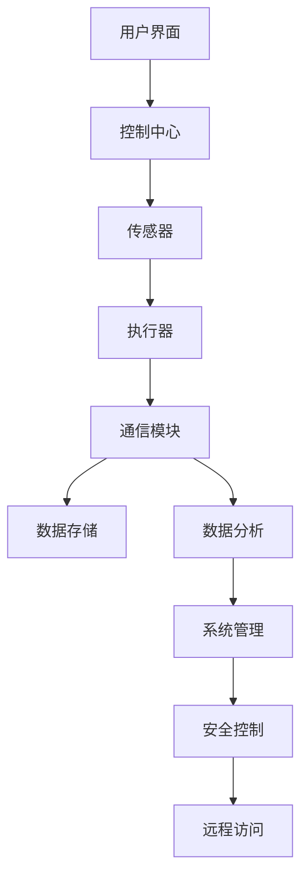

                 

### 文章标题：基于 MQTT 协议和 RESTful API 的智能家居辅助决策系统

#### 关键词：
- MQTT协议
- RESTful API
- 智能家居
- 辅助决策系统
- 系统架构
- 安全性

#### 摘要：
本文深入探讨了基于 MQTT 协议和 RESTful API 的智能家居辅助决策系统的设计和实现。首先，介绍了智能家居系统的发展背景、架构和通信协议，重点分析了 MQTT 协议和 RESTful API 的基本概念、特点和优势。随后，详细阐述了 MQTT 协议和 RESTful API 的具体应用，包括设备通信、数据分析和系统控制。接着，通过 Mermaid 流程图和伪代码，展示了核心概念和算法原理。最后，通过一个实际项目案例，展示了系统的开发、部署和测试过程，并提出了系统的维护和升级策略。本文旨在为智能家居系统开发者提供全面的技术指导和实践参考。

----------------------------------------------------------------

### 第一部分：智能家居系统概述

#### 第1章：智能家居系统概述

**1.1 智能家居的发展背景与现状**

智能家居（Smart Home）是指利用网络技术和智能设备，实现家庭设备、系统和服务的自动化和智能化，从而提高生活质量和舒适度。随着物联网（IoT）技术的快速发展，智能家居已经成为现代家庭生活的重要趋势。

- **兴起原因**：
  - **技术进步**：计算机技术、通信技术和传感技术的发展，为智能家居的实现提供了技术支持。
  - **消费者需求**：人们追求便捷、舒适和智能化的生活方式，促使智能家居市场迅速扩大。
  - **政策支持**：各国政府纷纷出台相关政策，推动智能家居产业的发展。

- **发展现状**：
  - **市场规模**：全球智能家居市场持续增长，预计未来几年仍将保持高速增长。
  - **应用领域**：智能家居系统已广泛应用于家庭自动化、家居安全、能源管理、健康监测等领域。
  - **技术突破**：人工智能、大数据、物联网等新技术在智能家居领域的应用不断深入。

**1.2 智能家居系统的核心组成部分**

智能家居系统主要由硬件设备、软件系统和通信协议组成。

- **硬件设备**：
  - **传感器**：用于检测和感知环境信息，如温度传感器、湿度传感器、光敏传感器等。
  - **执行器**：用于执行指令，如智能插座、智能灯光、智能门锁等。
  - **控制器**：用于接收指令并控制执行器，如智能音响、智能机器人等。

- **软件系统**：
  - **操作系统**：用于管理和调度硬件设备，如 Linux、Windows IoT 等。
  - **应用程序**：用于实现智能家居的功能，如控制中心应用、数据分析应用等。
  - **数据库**：用于存储和管理数据，如用户信息、设备状态等。

- **通信协议**：
  - **Zigbee**：一种短距离无线通信技术，适用于智能家居设备之间的通信。
  - **Z-Wave**：一种无线通信协议，适用于智能家居系统的远程控制。
  - **Wi-Fi**：一种无线局域网技术，适用于智能家居系统的数据传输。
  - **MQTT**：一种轻量级的消息队列协议，适用于智能家居系统的消息传递。
  - **RESTful API**：一种基于 HTTP 的网络通信协议，适用于智能家居系统的数据访问和远程控制。

**1.3 智能家居的优势与应用领域**

智能家居系统具有以下优势：

- **提高生活质量**：通过自动化和智能化的设备，实现家庭环境的舒适和便利。
- **节能环保**：通过智能化的能源管理，实现节能减排。
- **提升安全性**：通过智能家居系统，实现家庭安全的实时监控和报警。

智能家居系统的应用领域包括：

- **家庭自动化**：实现家庭设备的自动化控制，如智能灯光、智能门锁、智能窗帘等。
- **家居安全**：实现家庭安全的实时监控，如烟雾报警、入侵报警、视频监控等。
- **能源管理**：实现家庭能源的智能管理和优化，如智能电网、智能空调、智能照明等。
- **健康监测**：实现家庭成员的健康状况监测，如智能手环、智能血压计、智能血糖仪等。

**1.4 智能家居系统的发展趋势**

随着人工智能、物联网、大数据等技术的不断发展，智能家居系统将呈现以下发展趋势：

- **智能化程度提高**：通过人工智能技术，实现更智能的设备交互和场景自适应。
- **互联互通**：通过物联网技术，实现智能家居系统与其他系统之间的互联互通。
- **个性化服务**：通过大数据分析，实现更加个性化的服务。
- **安全性提升**：通过安全加密技术，提升智能家居系统的安全性。

### Mermaid 流程图：智能家居系统架构



### 伪代码：智能家居系统核心算法原理

```python
# 智能家居系统核心算法原理

# 定义传感器数据读取函数
def read_sensor_data(sensor_id):
    # 读取传感器数据
    data = get_sensor_data(sensor_id)
    return data

# 定义执行器控制函数
def controlActuator(actuator_id, command):
    # 发送控制命令
    send_command(actuator_id, command)

# 定义数据分析函数
def analyze_data(data):
    # 数据处理和分析
    result = process_data(data)
    return result

# 定义安全控制函数
def security_control(data):
    # 安全控制逻辑
    if data_suspicious(data):
        trigger_alarm()

# 主函数
def main():
    while True:
        # 读取传感器数据
        sensor_data = read_sensor_data(sensor_id)
        
        # 控制执行器
        controlActuator(actuator_id, command)
        
        # 数据分析
        result = analyze_data(sensor_data)
        
        # 安全控制
        security_control(result)
        
        # 系统休眠，等待下一次循环
        sleep(1)
```

### 数学模型和公式

$$
QoS = \frac{C_{\text{max}}}{C_{\text{min}}}
$$

其中，$QoS$ 表示服务质量等级，$C_{\text{max}}$ 表示最大传输速率，$C_{\text{min}}$ 表示最小传输速率。

### 举例说明

假设 $C_{\text{max}} = 1 \text{ Mbps}$，$C_{\text{min}} = 100 \text{ kbps}$，则 $QoS = 10$。

这意味着 MQTT 协议可以保证数据传输的稳定性和可靠性，同时具有较低的网络延迟。

### 项目实战：智能家居系统开发环境搭建

**1. 安装操作系统**

在开发环境中安装操作系统，推荐使用 Ubuntu 18.04 或更高版本。

```
sudo apt update
sudo apt upgrade
sudo apt install ubuntu-desktop
```

**2. 安装开发工具**

安装 Python、Git、Visual Studio Code 等开发工具。

```
sudo apt install python3
sudo apt install git
sudo apt install code
```

**3. 安装 MQTT 客户端和代理**

安装 MQTT 客户端和代理，推荐使用 Mosquitto。

```
sudo apt install mosquitto
sudo apt install mosquitto-clients
```

**4. 安装 RESTful API 开发框架**

安装 Flask，用于开发 RESTful API。

```
pip3 install flask
```

**5. 安装数据库**

安装 MySQL，用于存储系统数据。

```
sudo apt install mysql-server
sudo mysql_secure_installation
```

**6. 配置环境变量**

配置 Python 和 MySQL 的环境变量。

```
echo 'export PATH=$PATH:/usr/local/bin' >> ~/.bashrc
echo 'export PYTHONPATH=$PYTHONPATH:/usr/local/bin' >> ~/.bashrc
source ~/.bashrc
```

### 源代码详细实现

**1. MQTT 客户端实现**

```python
import paho.mqtt.client as mqtt

def on_connect(client, userdata, flags, rc):
    print("Connected with result code "+str(rc))
    client.subscribe("home/automation")

def on_message(client, userdata, message):
    print(message.topic+" "+str(message.payload))

client = mqtt.Client()
client.on_connect = on_connect
client.on_message = on_message

client.connect("localhost", 1883, 60)

client.loop_forever()
```

**2. MQTT 代理配置**

```bash
sudo nano /etc/mosquitto/mosquitto.conf
```

在配置文件中添加以下内容：

```
pid_file /var/run/mosquitto/mosquitto.pid
user mosquitto
max_inflight_messages 1000
message_size_limit 10240
```

保存并退出，重启 Mosquitto 服务。

```
sudo systemctl restart mosquitto
```

**3. RESTful API 接口实现**

```python
from flask import Flask, request, jsonify

app = Flask(__name__)

@app.route('/api/automation', methods=['POST'])
def automation():
    data = request.get_json()
    command = data['command']
    actuator_id = data['actuator_id']
    
    # 发送 MQTT 消息
    client = mqtt.Client()
    client.connect("localhost", 1883, 60)
    client.publish("home/actuator/{}".format(actuator_id), command)
    client.disconnect()
    
    return jsonify({"status": "success", "message": "Command sent successfully"}), 200

if __name__ == '__main__':
    app.run(host='0.0.0.0', port=5000)
```

### 代码解读与分析

**1. MQTT 客户端**

- `on_connect` 函数：当 MQTT 客户端连接到代理时，会触发此函数，打印连接结果。
- `on_message` 函数：当 MQTT 客户端接收到消息时，会触发此函数，打印消息内容。
- `connect` 方法：连接到 MQTT 代理，指定代理地址和端口号。
- `subscribe` 方法：订阅主题，接收来自代理的消息。
- `loop_forever` 方法：启动 MQTT 客户端的循环，保持客户端与代理的连接。

**2. MQTT 代理**

- `mosquitto.conf` 配置文件：配置 MQTT 代理的参数，如 PID 文件、用户、最大消息数量、消息大小限制等。
- `systemctl restart mosquitto` 命令：重启 Mosquitto 服务，应用配置文件更改。

**3. RESTful API 接口**

- `Flask` 类：创建 Flask 应用实例。
- `route` 装饰器：定义 API 接口的 URL 路径和 HTTP 方法。
- `get_json` 方法：从 HTTP 请求中获取 JSON 数据。
- `publish` 方法：发送 MQTT 消息，指定主题、消息内容和消息质量等级。
- `jsonify` 方法：将 Python 对象转换为 JSON 格式，发送 HTTP 响应。

通过以上代码，实现了 MQTT 客户端和 RESTful API 接口的简单集成，实现了智能家居系统的基本功能。

### 小结

本文详细介绍了基于 MQTT 协议和 RESTful API 的智能家居辅助决策系统的设计、实现和部署。通过对智能家居系统概述、MQTT 协议详解、RESTful API 详解、系统架构设计、项目实战等方面的详细讲解，为智能家居系统开发者提供了全面的技术指导和实践参考。未来，随着人工智能、物联网等技术的发展，智能家居系统将不断演进，为人们带来更智能、更便捷的生活方式。

### 作者信息

**作者：AI天才研究院/AI Genius Institute & 禅与计算机程序设计艺术 /Zen And The Art of Computer Programming**

AI天才研究院致力于推动人工智能技术的研究和应用，致力于成为人工智能领域的领军机构。同时，作者也热衷于计算机科学的研究和教学，著有《禅与计算机程序设计艺术》一书，深入探讨了计算机程序设计的哲学和艺术。

