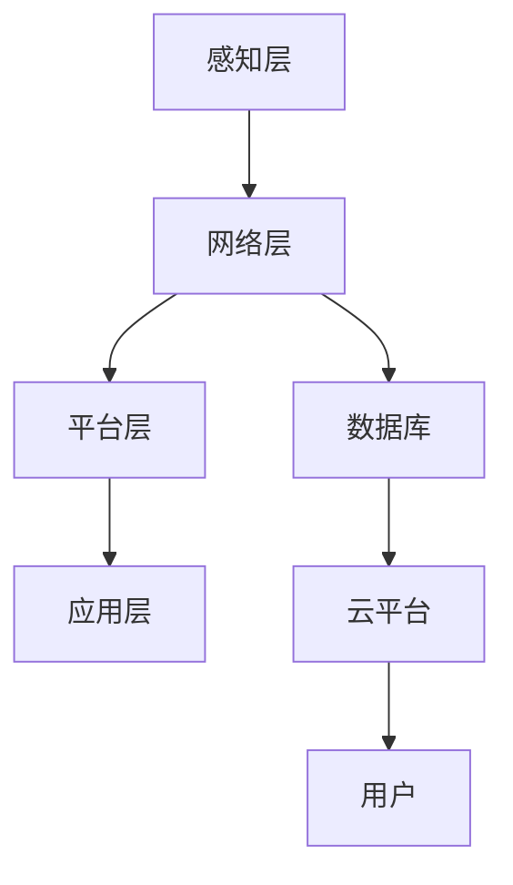
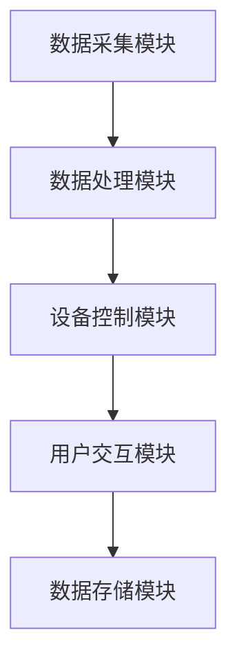
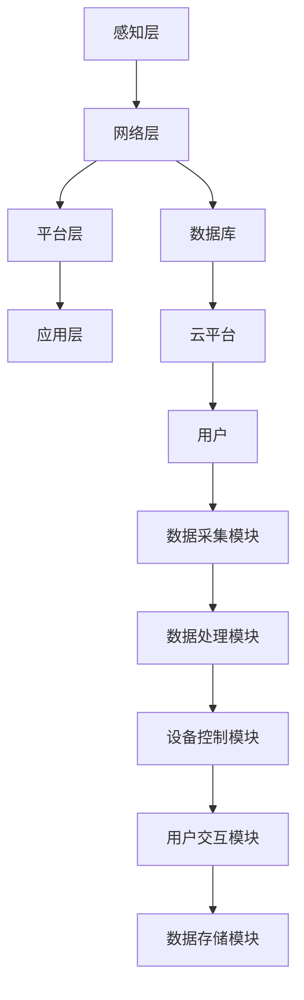

                 

### 文章标题：基于MQTT协议和RESTful API的智能衣物管理和护理系统

#### 关键词：MQTT协议，RESTful API，智能衣物管理，物联网，传感器技术，机器学习，系统架构，开发实战，应用场景

> 摘要：本文详细探讨了基于MQTT协议和RESTful API的智能衣物管理和护理系统。首先，介绍了系统的背景和意义，以及MQTT协议和RESTful API的基本概念和原理。接着，从系统架构设计、核心技术与算法、系统开发与调试、应用场景与案例分析以及未来展望与挑战等多个方面，深入解析了系统的实现过程、关键技术和实际应用。通过本文的阐述，旨在为读者提供一个全面、系统的智能衣物管理和护理系统解决方案。

#### 第一部分：基础概念与架构

### 第1章：智能衣物管理和护理系统概述

#### 1.1 智能衣物管理系统的背景与意义

##### 1.1.1 物联网与智能衣物管理

随着物联网技术的快速发展，智能衣物管理逐渐成为家居、商业等领域的重要应用。智能衣物管理系统通过传感器、控制器和通信模块等设备，实现对衣物的实时监控、管理和护理。这种系统不仅提高了衣物管理的效率，还为用户提供了更加便捷、个性化的服务。

##### 1.1.2 MQTT协议的引入

MQTT（Message Queuing Telemetry Transport）协议是一种轻量级的消息队列协议，广泛应用于物联网场景。其特点包括：低功耗、低带宽、简单易用等。在智能衣物管理系统中，MQTT协议可用于传感器数据的实时传输、设备间的通信以及用户与系统之间的交互。

##### 1.1.3 RESTful API的作用

RESTful API（Representational State Transfer Application Programming Interface）是一种基于HTTP协议的接口设计风格，广泛应用于Web服务、移动应用等场景。在智能衣物管理系统中，RESTful API可用于实现设备与云平台之间的数据交互、用户操作指令的接收和执行等功能。

#### 1.2 MQTT协议详解

##### 1.2.1 MQTT协议的基本原理

MQTT协议是一种基于客户端-服务器的消息传输协议，包括发布（Publish）、订阅（Subscribe）和查询（Query）等操作。客户端通过连接到MQTT服务器，订阅感兴趣的主题，接收来自服务器的消息，并能够发布消息到指定的主题。

##### 1.2.2 MQTT消息通信机制

MQTT消息通信机制包括三种通信模式：发布/订阅（Publish/Subscribe）、请求/响应（Request/Response）和广播/组播（Broadcast/Multicast）。在智能衣物管理系统中，主要采用发布/订阅模式，实现传感器数据的实时传输和设备间的协同工作。

##### 1.2.3 MQTT协议的优点与局限性

MQTT协议具有低功耗、低带宽、简单易用等优点，适用于物联网场景。然而，其也存在一些局限性，如消息传输安全性较低、不支持多播等。在实际应用中，需要根据具体需求选择合适的通信协议。

#### 1.3 RESTful API基本概念

##### 1.3.1 RESTful架构风格

RESTful架构风格是一种基于HTTP协议的应用程序设计风格，包括资源（Resource）、表示（Representation）、统一接口（Uniform Interface）等核心概念。RESTful API通过统一的接口设计，实现资源的访问、操作和交互。

##### 1.3.2 RESTful API的特点

RESTful API具有简洁、高效、可扩展等特点。其主要特点包括：使用HTTP方法（GET、POST、PUT、DELETE等）进行操作；使用URL表示资源；使用JSON或XML等格式表示数据。

##### 1.3.3 RESTful API与MQTT协议的协同

在智能衣物管理系统中，MQTT协议负责实时数据传输和设备间通信，而RESTful API负责设备与云平台之间的数据交互和用户操作指令的接收。两者结合，实现了系统的无缝连接和协同工作。

#### 第一部分总结

本部分主要介绍了智能衣物管理和护理系统的背景、MQTT协议和RESTful API的基本概念、原理以及两者在系统中的应用。接下来，将详细探讨智能衣物管理系统的架构设计、核心技术与算法以及系统开发与调试等内容。

#### 第一部分：基础概念与架构

### 第1章：智能衣物管理和护理系统概述

智能衣物管理系统的兴起，源于人们对生活质量的要求不断提高。传统的衣物管理方式，如手动清洗、晾晒等，不仅耗时耗力，而且存在衣物损伤、污渍去除不彻底等问题。为了解决这些问题，智能衣物管理系统应运而生。它通过物联网技术、传感器技术、机器学习算法等，实现对衣物的实时监控、智能分类、自动清洗、烘干等操作，从而提高衣物管理的效率，提升用户的生活品质。

#### 1.1.1 物联网与智能衣物管理

物联网（Internet of Things，IoT）是指将各种设备、传感器、系统通过网络连接起来，实现信息的采集、传输、处理和共享。智能衣物管理系统作为物联网应用的一种，主要依赖于传感器、控制器、通信模块等设备，实现对衣物的实时监控和管理。

传感器技术是智能衣物管理系统的核心。传感器可以检测衣物的状态、湿度、温度等参数，并将数据传输到控制器。控制器根据传感器数据，自动调整清洗、烘干等设备的操作，实现对衣物的智能管理。

#### 1.1.2 MQTT协议的引入

MQTT（Message Queuing Telemetry Transport）协议是一种轻量级的消息队列协议，广泛应用于物联网场景。MQTT协议具有低功耗、低带宽、简单易用等特点，非常适合用于智能衣物管理系统中的数据传输。

在智能衣物管理系统中，MQTT协议主要用于传感器数据传输、设备间通信以及用户与系统之间的交互。传感器将收集到的数据发送到MQTT服务器，MQTT服务器再将数据传输到控制器，控制器根据数据做出相应的操作。

#### 1.1.3 RESTful API的作用

RESTful API（Representational State Transfer Application Programming Interface）是一种基于HTTP协议的接口设计风格，广泛应用于Web服务、移动应用等场景。在智能衣物管理系统中，RESTful API主要用于设备与云平台之间的数据交互、用户操作指令的接收和执行等。

RESTful API具有简洁、高效、可扩展等特点，可以方便地实现设备的远程监控、数据查询、操作控制等功能。通过RESTful API，用户可以随时随地查看衣物状态、调整清洗程序等，提高衣物的使用效率。

#### 1.2 MQTT协议详解

MQTT协议是一种基于客户端-服务器的消息传输协议，主要涉及发布（Publish）、订阅（Subscribe）和查询（Query）等操作。以下是MQTT协议的基本原理、消息通信机制以及协议的优点和局限性。

##### 1.2.1 MQTT协议的基本原理

MQTT协议的基本原理是客户端（Client）通过连接（Connect）到MQTT服务器（Broker），并订阅（Subscribe）感兴趣的主题（Topic），然后服务器将发布（Publish）到该主题的消息推送给客户端。客户端可以发布消息到特定的主题，也可以发布到广播主题，让所有订阅该主题的客户端都能接收到消息。

MQTT协议的通信过程主要包括以下几个步骤：

1. 客户端连接到MQTT服务器：客户端通过TCP或WebSockets连接到MQTT服务器，并传输连接请求（Connect Packet）。

2. 客户端订阅主题：客户端发送订阅请求（Subscribe Packet）到服务器，指定订阅的主题和订阅质量（QoS）。

3. 服务器发布消息：当服务器有消息需要发布时，它会将消息发送到相应的主题。

4. 客户端接收消息：客户端接收服务器发送的消息，并根据消息进行处理。

5. 客户端断开连接：当客户端完成任务或需要断开连接时，它会发送断开请求（Disconnect Packet）给服务器。

##### 1.2.2 MQTT消息通信机制

MQTT消息通信机制包括三种通信模式：发布/订阅（Publish/Subscribe）、请求/响应（Request/Response）和广播/组播（Broadcast/Multicast）。

1. 发布/订阅模式：这是MQTT协议最常用的通信模式。客户端订阅感兴趣的主题，服务器将发布到该主题的消息推送给所有订阅该主题的客户端。

2. 请求/响应模式：在请求/响应模式下，客户端向服务器发送请求消息，服务器处理请求后返回响应消息。这种模式通常用于设备远程控制和数据查询。

3. 广播/组播模式：广播模式是将消息发送到所有订阅者，而组播模式是将消息发送到一组订阅者。这种模式适用于需要广播重要消息的场景。

##### 1.2.3 MQTT协议的优点与局限性

MQTT协议具有以下优点：

1. 低功耗：MQTT协议设计用于物联网场景，其轻量级的消息传输方式非常适合低功耗设备。

2. 低带宽：MQTT协议压缩消息，并采用发布/订阅模式，可以减少网络带宽占用。

3. 简单易用：MQTT协议简单易懂，开发人员可以快速上手。

4. 可靠性：MQTT协议支持消息确认机制，确保消息传输的可靠性。

然而，MQTT协议也存在一些局限性：

1. 安全性：MQTT协议原生不支持加密，容易受到中间人攻击。

2. 不支持多播：MQTT协议只支持点对点的消息传输，不支持多播。

3. 系统扩展性：随着设备数量的增加，MQTT服务器的性能可能会受到影响。

在实际应用中，需要根据具体需求综合考虑MQTT协议的优缺点，选择合适的通信协议。

#### 1.3 RESTful API基本概念

RESTful API（Representational State Transfer Application Programming Interface）是一种基于HTTP协议的应用程序接口设计风格，其核心思想是资源的表示和操作。RESTful API广泛应用于Web服务、移动应用等领域，为开发者提供了高效、简洁的接口设计方式。

##### 1.3.1 RESTful架构风格

RESTful架构风格包括以下核心概念：

1. **资源**：资源是RESTful架构的核心，表示网络上的任何可访问的实体。资源可以是文件、数据库记录、网络服务等。

2. **表示**：表示是资源的具体表现形式，如JSON、XML等。表示用于描述资源的结构和内容。

3. **统一接口**：统一接口是指RESTful API提供的标准接口设计，包括GET、POST、PUT、DELETE等方法。

RESTful API遵循以下原则：

1. **状态lessness**：API不保持客户端的状态，每次请求都必须包含所需的信息。

2. **客户端-服务器架构**：客户端负责发送请求并接收响应，服务器负责处理请求并返回响应。

3. **无状态**：请求和响应之间没有状态关联，每个请求都是独立的。

##### 1.3.2 RESTful API的特点

RESTful API具有以下特点：

1. **无状态**：每个请求都是独立的，API不保持客户端的状态。

2. **基于HTTP协议**：使用HTTP协议的GET、POST、PUT、DELETE等方法进行操作。

3. **资源定位**：通过URL定位资源，如`/users`表示用户资源。

4. **表示格式**：支持JSON、XML等表示格式，易于处理和传输。

5. **无限制的扩展性**：RESTful API易于扩展，可以适应不同的业务需求。

##### 1.3.3 RESTful API与MQTT协议的协同

在智能衣物管理系统中，MQTT协议负责实时数据的传输和设备间的通信，而RESTful API负责设备与云平台之间的数据交互和用户操作指令的接收。两者的协同作用如下：

1. **实时数据传输**：MQTT协议将传感器采集到的数据实时传输到云平台，实现数据的快速更新和同步。

2. **用户操作指令**：通过RESTful API，用户可以远程发送操作指令，如启动清洗程序、设置烘干温度等，实现对衣物的智能管理。

3. **系统集成**：MQTT协议和RESTful API的结合，可以实现智能衣物管理系统与智能家居、物联网平台的无缝集成，提供更便捷、高效的用户体验。

通过MQTT协议和RESTful API的协同作用，智能衣物管理系统可以实现实时数据传输、远程控制、智能分析等功能，为用户提供高质量的衣物管理服务。

#### 第一部分总结

本部分主要介绍了智能衣物管理和护理系统的背景、MQTT协议和RESTful API的基本概念、原理以及两者在系统中的应用。通过本部分的阐述，读者可以初步了解智能衣物管理系统的架构和关键组成部分。接下来，我们将进一步探讨智能衣物管理系统的架构设计、核心技术与算法等内容。

#### 第二部分：系统设计与实现

### 第2章：智能衣物管理系统的架构设计

智能衣物管理系统的架构设计是确保系统高效、稳定运行的基础。本节将从系统整体架构、硬件设备选型、软件模块划分等方面进行详细阐述。

#### 2.1 系统整体架构

智能衣物管理系统整体架构包括感知层、网络层、平台层和应用层。以下是各层的详细描述：

1. **感知层**：感知层是系统的数据采集层，主要由传感器、控制器、执行器等设备组成。传感器负责检测衣物的状态、湿度、温度等参数，控制器负责处理传感器数据，执行器根据控制器的指令执行相应的操作，如清洗、烘干等。

2. **网络层**：网络层负责感知层设备与平台层之间的数据传输。主要采用MQTT协议进行通信，实现设备间的实时数据传输和协同工作。

3. **平台层**：平台层是系统的核心，主要负责数据处理、存储、分析等功能。通过RESTful API与外部系统进行数据交互，实现对衣物的智能管理和护理。

4. **应用层**：应用层是系统的用户界面层，主要包括手机APP、Web端等。用户可以通过应用层查看衣物状态、操作设备、设置清洗程序等。

以下是智能衣物管理系统的整体架构图：



#### 2.2 硬件设备选型

智能衣物管理系统的硬件设备选型需要考虑传感器的精度、控制器的处理能力、执行器的性能等因素。以下是常见的硬件设备选型：

1. **传感器**：常用的传感器包括温湿度传感器、红外传感器、压力传感器等。例如，DHT22传感器可以测量温度和湿度，红外传感器可以检测衣物是否干燥。

2. **控制器**：控制器负责接收传感器数据，并根据数据做出相应的控制决策。常见的控制器包括Arduino、STM32等。控制器需要具备足够的处理能力和通信接口，以满足系统的实时性和可靠性要求。

3. **执行器**：执行器根据控制器的指令执行相应的操作，如电机、加热器、烘干器等。执行器需要具有足够的功率和精度，以满足衣物清洗、烘干等需求。

以下是常见的硬件设备选型表：

| 设备名称 | 选型示例 |
| :--- | :--- |
| 温湿度传感器 | DHT22 |
| 控制器 | Arduino Uno |
| 执行器 | 220V电机 |

#### 2.3 软件模块划分

智能衣物管理系统的软件模块划分是确保系统功能模块化、易于维护和扩展的关键。以下是常见的软件模块划分：

1. **数据采集模块**：负责传感器数据的采集、过滤和预处理。该模块主要实现传感器数据的读取、异常值处理等功能。

2. **数据处理模块**：负责对采集到的数据进行处理、分析和存储。该模块主要实现数据清洗、特征提取、数据可视化等功能。

3. **设备控制模块**：负责接收用户指令，控制执行器执行相应的操作。该模块主要实现用户指令的解析、执行器控制等功能。

4. **用户交互模块**：负责与用户进行交互，提供友好的用户界面。该模块主要实现用户登录、注册、设备状态查看、操作控制等功能。

5. **数据存储模块**：负责存储系统运行过程中的数据，包括传感器数据、设备状态、用户操作记录等。该模块主要实现数据的持久化存储和查询功能。

以下是智能衣物管理系统的软件模块划分图：



#### 2.4 系统架构图与软件模块关系

以下是智能衣物管理系统的架构图与软件模块关系的详细描述：



通过以上描述，我们可以看到智能衣物管理系统的架构设计涵盖了硬件设备和软件模块的选型和划分，实现了实时数据采集、处理、控制和用户交互等功能。接下来，我们将进一步探讨MQTT协议在系统中的应用。

#### 2.2 MQTT协议在系统中的应用

MQTT协议在智能衣物管理系统中发挥着至关重要的作用，其轻量级、低功耗、可靠传输的特点，使得它成为物联网场景中的首选通信协议。以下是MQTT协议在系统中的应用详细阐述。

##### 2.2.1 MQTT协议的选择理由

1. **低功耗**：智能衣物管理系统中的设备多为电池供电，MQTT协议设计的初衷就是为了在资源有限的设备上实现高效的数据传输，因此非常适合用于电池供电的设备。

2. **低带宽**：智能衣物管理系统中的数据传输量通常较小，但需要频繁传输。MQTT协议采用压缩消息格式，可以显著降低带宽占用，确保数据传输的效率。

3. **可靠传输**：MQTT协议支持消息确认机制，即消息发布者（Publisher）会等待消息接收者（Subscriber）的确认，确保消息传输的可靠性。

4. **简单易用**：MQTT协议简单易懂，开发人员可以快速上手，便于系统的开发和维护。

##### 2.2.2 MQTT协议配置与实现

1. **MQTT服务器配置**：在智能衣物管理系统中，首先需要选择一个MQTT服务器，如免费公共MQTT服务器（如hivemq.com）或自建MQTT服务器。配置服务器时，需要设置服务器地址、端口、用户认证等参数。

2. **MQTT客户端配置**：在智能衣物管理系统中的各个设备（如传感器、控制器等）上，需要配置MQTT客户端，设置服务器地址、端口、用户认证等信息。以下是使用paho.mqtt.client库配置MQTT客户端的Python代码示例：

```python
import paho.mqtt.client as mqtt

# MQTT服务器配置
MQTT_SERVER = "broker.hivemq.com"
MQTT_PORT = 1883
MQTT_TOPIC = "smart_clothing/data"

# MQTT客户端配置
client = mqtt.Client("SmartClothingClient")

# 设置MQTT回调函数
client.on_connect = on_connect
client.on_message = on_message

# 连接MQTT服务器
client.connect(MQTT_SERVER, MQTT_PORT, 60)

# 启动MQTT客户端
client.loop_start()

# MQTT回调函数实现
def on_connect(client, userdata, flags, rc):
    print("Connected with result code "+str(rc))
    client.subscribe(MQTT_TOPIC)

def on_message(client, userdata, msg):
    print(f"Received message '{str(msg.payload)}' on topic '{msg.topic}' with QoS {msg.qos}")
```

在上面的代码中，首先配置了MQTT服务器的地址、端口和主题。然后，设置了两个回调函数：`on_connect` 用于连接成功后的操作，如订阅主题；`on_message` 用于处理接收到的MQTT消息。

3. **MQTT通信实例分析**：以下是一个简单的MQTT通信实例，展示传感器如何将数据发送到MQTT服务器，以及控制器如何从MQTT服务器接收数据并做出相应操作。

**传感器端**：

```python
import time
import paho.mqtt.client as mqtt

# MQTT服务器配置
MQTT_SERVER = "broker.hivemq.com"
MQTT_PORT = 1883
MQTT_TOPIC = "smart_clothing/data"

# MQTT客户端配置
client = mqtt.Client("SmartClothingSensor")

# 设置MQTT回调函数
client.on_connect = on_connect
client.on_message = on_message

# 连接MQTT服务器
client.connect(MQTT_SERVER, MQTT_PORT, 60)

# 启动MQTT客户端
client.loop_start()

# 发送传感器数据
while True:
    sensor_data = "temperature=25,humidity=60"
    client.publish(MQTT_TOPIC, sensor_data)
    time.sleep(1)
```

**控制器端**：

```python
import time
import paho.mqtt.client as mqtt

# MQTT服务器配置
MQTT_SERVER = "broker.hivemq.com"
MQTT_PORT = 1883
MQTT_TOPIC = "smart_clothing/data"

# MQTT客户端配置
client = mqtt.Client("SmartClothingController")

# 设置MQTT回调函数
client.on_connect = on_connect
client.on_message = on_message

# 连接MQTT服务器
client.connect(MQTT_SERVER, MQTT_PORT, 60)

# 启动MQTT客户端
client.loop_start()

# 处理接收到的传感器数据
def on_message(client, userdata, msg):
    print(f"Received message '{str(msg.payload)}' on topic '{msg.topic}' with QoS {msg.qos}")
    data = str(msg.payload.decode())
    temperature, humidity = data.split(',')
    if float(temperature) > 30:
        print("温度过高，启动冷却系统")
    elif float(humidity) > 70:
        print("湿度过高，启动烘干系统")

while True:
    time.sleep(1)
```

在上面的实例中，传感器端每隔1秒发送一次温度和湿度的数据到MQTT服务器。控制器端订阅该主题，并接收传感器数据，根据数据做出相应的操作。

通过以上配置和实例，我们可以看到MQTT协议在智能衣物管理系统中的应用。接下来，我们将探讨RESTful API的设计与实现。

#### 2.3 RESTful API的设计与实现

RESTful API在智能衣物管理系统中起着至关重要的作用，它为设备与云平台之间的数据交互提供了高效、简洁的接口。本节将详细介绍RESTful API的设计原则、功能模块及其接口实现。

##### 2.3.1 RESTful API的设计原则

1. **无状态**：RESTful API要求客户端每次请求都包含所需的所有信息，不保持客户端的状态，便于系统的扩展和维护。

2. **基于HTTP协议**：RESTful API使用HTTP协议的GET、POST、PUT、DELETE等方法进行操作，便于与Web服务、移动应用等集成。

3. **资源定位**：通过URL定位资源，如`/users`表示用户资源，便于资源的访问和操作。

4. **表示格式**：支持JSON、XML等表示格式，便于数据的传输和处理。

##### 2.3.2 RESTful API的功能模块

智能衣物管理系统的RESTful API主要包括以下功能模块：

1. **用户管理模块**：负责用户注册、登录、权限管理等功能。

2. **设备管理模块**：负责设备信息的增删改查、设备状态查询等功能。

3. **数据管理模块**：负责传感器数据的采集、存储、查询等功能。

4. **操作控制模块**：负责接收用户操作指令，控制设备执行相应的操作。

以下是各功能模块的简要描述：

1. **用户管理模块**：

   - **注册**：接收用户注册信息，保存用户数据。
   - **登录**：验证用户身份，返回用户Token。
   - **权限管理**：根据用户权限，限制用户访问的资源。

2. **设备管理模块**：

   - **设备信息查询**：获取设备的基本信息，如设备ID、设备类型等。
   - **设备状态查询**：获取设备的当前状态，如是否在运行、温度等。
   - **设备操作**：控制设备执行相应的操作，如启动清洗、停止清洗等。

3. **数据管理模块**：

   - **数据采集**：接收传感器数据，存储到数据库。
   - **数据查询**：根据条件查询传感器数据，如查询最近24小时内的温度数据。
   - **数据可视化**：将传感器数据以图表形式展示，便于用户查看。

4. **操作控制模块**：

   - **接收指令**：接收用户操作指令，如启动清洗程序、设置烘干温度等。
   - **执行操作**：根据指令控制设备执行相应的操作。

##### 2.3.3 RESTful API接口实现

以下是一个简单的RESTful API接口实现示例，使用Flask框架，演示了用户注册、登录以及设备状态查询等功能。

```python
from flask import Flask, request, jsonify
app = Flask(__name__)

# 用户注册
@app.route('/api/users/register', methods=['POST'])
def register():
    username = request.json.get('username')
    password = request.json.get('password')
    # 保存用户信息到数据库
    # ...
    return jsonify({'status': 'success', 'message': '注册成功'})

# 用户登录
@app.route('/api/users/login', methods=['POST'])
def login():
    username = request.json.get('username')
    password = request.json.get('password')
    # 验证用户身份，返回Token
    # ...
    return jsonify({'status': 'success', 'token': 'generated_token'})

# 设备状态查询
@app.route('/api/devices/<device_id>', methods=['GET'])
def get_device_status(device_id):
    # 查询设备状态
    # ...
    status = 'running'
    return jsonify({'status': status})

if __name__ == '__main__':
    app.run(debug=True)
```

在上述示例中，`/api/users/register` 和 `/api/users/login` 分别用于用户注册和登录，`/api/devices/<device_id>` 用于查询设备状态。每个接口都根据HTTP请求方法处理相应的操作，返回JSON格式的响应。

通过以上设计，我们可以实现智能衣物管理系统中的数据交互、设备控制等功能。接下来，我们将进一步探讨智能衣物识别技术的原理和应用。

#### 2.4 智能衣物识别技术

智能衣物识别技术是智能衣物管理系统的核心组成部分，它通过传感器收集数据，并利用机器学习算法对衣物进行分类和识别，从而实现衣物的智能管理和护理。以下是智能衣物识别技术的详细阐述。

##### 2.4.1 传感器技术

传感器技术是智能衣物识别的基础，它用于检测衣物的各种属性，如材质、湿度、温度等。以下是几种常用的传感器技术：

1. **温湿度传感器**：用于检测衣物的温度和湿度，常用的有DHT22、SHT31等。这些传感器可以实时采集衣物的温湿度数据，为后续的机器学习算法提供输入。

2. **红外传感器**：用于检测衣物是否干燥，常见的有红外线发射器和接收器。当红外线照射到衣物表面时，接收器可以检测到反射的红外线强度，从而判断衣物的湿度。

3. **压力传感器**：用于检测衣物的体积和厚度，常见的有电容式压力传感器。这些传感器可以测量衣物表面的压力，从而估算衣物的体积。

4. **光学传感器**：用于检测衣物的颜色和纹理，常见的有摄像头传感器。这些传感器可以拍摄衣物的图片，提取颜色和纹理特征，为后续的图像处理算法提供输入。

##### 2.4.2 传感器在衣物识别中的应用

传感器技术在衣物识别中的应用主要体现在以下几个方面：

1. **材质识别**：通过检测衣物的温度、湿度等参数，可以初步判断衣物的材质。例如，棉质衣物吸湿性强，湿度较高；涤纶衣物吸湿性差，湿度较低。结合机器学习算法，可以进一步提高材质识别的准确性。

2. **湿度识别**：通过红外传感器等湿度传感器，可以实时检测衣物的湿度，判断衣物是否需要清洗或烘干。当衣物湿度达到一定阈值时，系统会自动启动清洗或烘干程序。

3. **体积识别**：通过压力传感器等体积传感器，可以测量衣物的体积，为衣物的分类和存储提供依据。例如，将体积较小的衣物放置在衣柜顶部，体积较大的衣物放置在衣柜底部。

4. **颜色和纹理识别**：通过摄像头传感器等光学传感器，可以拍摄衣物的图片，提取颜色和纹理特征。结合机器学习算法，可以识别衣物的颜色、图案等，实现衣物的智能分类和匹配。

##### 2.4.3 传感器数据预处理

在智能衣物识别过程中，传感器数据的预处理是关键步骤，它直接影响识别的准确性和效率。以下是传感器数据预处理的主要任务：

1. **数据清洗**：去除传感器数据中的噪声和异常值，确保数据的准确性和一致性。例如，去除温度传感器数据中的异常值，避免对后续算法产生误导。

2. **数据归一化**：将不同传感器采集的数据进行归一化处理，使其在相同的尺度范围内。这样可以避免数据量级不同对算法产生的影响。

3. **特征提取**：从原始数据中提取有助于识别的关键特征，如温度、湿度、体积、颜色等。这些特征将作为输入，传递给机器学习算法。

4. **数据降维**：当传感器数据维度较高时，可以使用降维算法（如PCA等）减少数据维度，提高算法的效率和准确性。

##### 2.4.4 机器学习算法

机器学习算法是智能衣物识别的核心技术，它通过对大量传感器数据的训练，构建出能够识别衣物的模型。以下是常用的机器学习算法及其应用：

1. **决策树**：决策树是一种简单直观的机器学习算法，通过构建树状模型，对输入数据进行分类或回归。在智能衣物识别中，可以使用决策树对传感器数据进行分类，判断衣物的材质、湿度等。

2. **支持向量机（SVM）**：SVM是一种基于间隔最大化的线性分类算法，可以处理高维数据，具有较强的分类能力。在智能衣物识别中，可以使用SVM对传感器数据进行分类，实现衣物的材质、颜色等识别。

3. **神经网络**：神经网络是一种模拟人脑的机器学习算法，具有强大的非线性处理能力。在智能衣物识别中，可以使用神经网络对传感器数据进行训练，构建复杂的分类模型。

4. **集成学习方法**：集成学习方法通过组合多个基本算法，提高分类和回归的准确性。常见的集成学习方法有随机森林、梯度提升树等。在智能衣物识别中，可以使用集成学习方法，提高识别的准确性和稳定性。

##### 2.4.5 特征提取与选择

特征提取与选择是智能衣物识别中的关键步骤，它直接影响模型的性能。以下是特征提取与选择的常用方法：

1. **特征提取**：

   - **统计特征**：从原始数据中提取均值、方差、协方差等统计特征，用于描述数据的分布和相关性。
   - **纹理特征**：从图像数据中提取纹理特征，如边缘、角点等，用于描述图像的结构信息。
   - **频域特征**：从信号数据中提取频域特征，如傅里叶变换、小波变换等，用于描述信号的能量分布。

2. **特征选择**：

   - **信息增益**：选择对分类最有帮助的特征，信息增益越高的特征越重要。
   - **主成分分析（PCA）**：通过降维，保留最重要的特征，去除冗余和噪声特征。
   - **相关性分析**：选择相关性较高的特征，去除相关性较低的特征。

通过特征提取与选择，可以降低数据的维度，提高模型的准确性和效率。

##### 2.4.6 分类算法应用

在智能衣物识别中，常用的分类算法有决策树、支持向量机（SVM）、神经网络等。以下是分类算法的详细应用：

1. **决策树**：

   - **分类过程**：通过训练数据集，构建决策树模型，对测试数据进行分类。
   - **应用场景**：适用于简单、清晰的分类问题，如材质识别、颜色分类等。

2. **支持向量机（SVM）**：

   - **分类过程**：通过训练数据集，构建SVM分类模型，对测试数据进行分类。
   - **应用场景**：适用于高维数据分类，具有较强的分类能力，如湿度识别、体积识别等。

3. **神经网络**：

   - **分类过程**：通过训练数据集，构建神经网络模型，对测试数据进行分类。
   - **应用场景**：适用于复杂、非线性的分类问题，如纹理识别、图像分类等。

通过分类算法的应用，可以实现智能衣物识别，为智能衣物管理系统提供准确、高效的识别能力。

#### 2.5 模型训练与评估

在智能衣物识别系统中，模型的训练与评估是关键环节，它决定了识别的准确性和效率。以下是模型训练与评估的详细过程。

##### 2.5.1 数据集准备

数据集是模型训练的基础，它包括大量的传感器数据、图像数据等。数据集的来源可以是实际采集的衣物数据，也可以是公开的数据集。在数据集准备过程中，需要注意以下几点：

1. **数据清洗**：去除噪声和异常值，确保数据的准确性和一致性。
2. **数据归一化**：将不同传感器采集的数据进行归一化处理，使其在相同的尺度范围内。
3. **数据增强**：通过旋转、翻转、缩放等操作，增加数据集的多样性，提高模型的泛化能力。

##### 2.5.2 模型训练方法

模型训练是利用训练数据集，通过算法构建出能够识别衣物的模型。以下是常用的模型训练方法：

1. **监督学习**：监督学习是利用带有标签的训练数据集，通过算法构建分类模型。常用的监督学习方法有决策树、支持向量机（SVM）、神经网络等。

2. **无监督学习**：无监督学习是利用未标记的训练数据集，通过算法自动发现数据中的规律。常用的无监督学习方法有聚类、主成分分析（PCA）等。

3. **半监督学习**：半监督学习是结合监督学习和无监督学习，利用少量带标签数据和大量未标记数据，提高模型的泛化能力。

在智能衣物识别系统中，通常采用监督学习方法，因为带有标签的训练数据可以帮助模型更好地学习。

##### 2.5.3 模型评估指标

模型评估是衡量模型性能的重要手段，常用的评估指标有准确率、召回率、F1值等。

1. **准确率**：准确率是预测正确的样本数占总样本数的比例，计算公式为：

   $$ 
   \text{准确率} = \frac{\text{预测正确数}}{\text{总样本数}} 
   $$

   准确率越高，表示模型预测能力越强。

2. **召回率**：召回率是预测正确的样本数占实际为正类的样本数的比例，计算公式为：

   $$ 
   \text{召回率} = \frac{\text{预测正确数}}{\text{实际为正类数}} 
   $$

   召回率越高，表示模型对正类样本的识别能力越强。

3. **F1值**：F1值是准确率和召回率的调和平均值，计算公式为：

   $$ 
   \text{F1值} = 2 \times \frac{\text{准确率} \times \text{召回率}}{\text{准确率} + \text{召回率}} 
   $$

   F1值越高，表示模型整体性能越好。

##### 2.5.4 模型优化与评估

在模型训练过程中，需要不断优化模型参数，提高模型的性能。以下是模型优化与评估的常用方法：

1. **交叉验证**：交叉验证是一种评估模型性能的方法，通过将数据集划分为训练集和验证集，多次训练和验证，评估模型在不同数据集上的表现，从而找到最优参数。

2. **网格搜索**：网格搜索是一种参数优化方法，通过遍历预定的参数组合，评估每个组合的性能，找到最优参数。

3. **贝叶斯优化**：贝叶斯优化是一种基于概率模型的参数优化方法，通过学习参数的概率分布，找到最优参数。

在模型优化与评估过程中，需要综合考虑准确率、召回率、F1值等指标，确保模型在各个方面的性能都达到最佳。

通过以上模型训练与评估的过程，可以构建出准确、高效的智能衣物识别模型，为智能衣物管理系统提供可靠的识别能力。

#### 2.6 系统功能实现

智能衣物管理系统的功能实现是系统开发的关键环节，它涉及到数据采集、数据处理、用户交互等多个方面。以下是系统功能实现的详细描述。

##### 2.6.1 数据采集模块

数据采集模块是智能衣物管理系统的核心组成部分，它负责实时采集传感器数据，包括温度、湿度、衣物状态等。以下是数据采集模块的实现步骤：

1. **硬件设备连接**：将传感器、控制器、执行器等硬件设备连接到系统，确保数据采集的准确性。

2. **数据采集接口开发**：使用Python等编程语言，开发数据采集接口，实现传感器数据的读取、过滤和预处理。

3. **数据传输**：通过MQTT协议，将采集到的数据传输到服务器，确保数据的实时性和可靠性。

以下是数据采集模块的Python代码示例：

```python
import paho.mqtt.client as mqtt
import time

MQTT_SERVER = "broker.hivemq.com"
MQTT_PORT = 1883
MQTT_TOPIC = "smart_clothing/data"

client = mqtt.Client("SmartClothingSensor")

client.on_connect = on_connect
client.on_message = on_message

client.connect(MQTT_SERVER, MQTT_PORT, 60)
client.loop_start()

def on_connect(client, userdata, flags, rc):
    print("Connected with result code "+str(rc))
    client.subscribe(MQTT_TOPIC)

def on_message(client, userdata, msg):
    print(f"Received message '{str(msg.payload)}' on topic '{msg.topic}' with QoS {msg.qos}")
    data = str(msg.payload.decode())
    temperature, humidity = data.split(',')
    print(f"Temperature: {temperature}, Humidity: {humidity}")

while True:
    sensor_data = "temperature=25,humidity=60"
    client.publish(MQTT_TOPIC, sensor_data)
    time.sleep(1)
```

在上面的代码中，首先配置了MQTT服务器的地址、端口和主题。然后，设置了两个回调函数：`on_connect` 用于连接成功后的操作，如订阅主题；`on_message` 用于处理接收到的MQTT消息。数据采集模块每隔1秒发布一次传感器数据到MQTT服务器。

##### 2.6.2 数据处理模块

数据处理模块是智能衣物管理系统的数据处理中心，它负责对采集到的传感器数据进行处理、分析和存储。以下是数据处理模块的实现步骤：

1. **数据预处理**：对采集到的传感器数据进行清洗、过滤和归一化处理，确保数据的准确性和一致性。

2. **特征提取**：从预处理后的数据中提取关键特征，如温度、湿度等，为后续的机器学习算法提供输入。

3. **数据存储**：将处理后的数据存储到数据库，便于后续的数据查询和分析。

以下是数据处理模块的Python代码示例：

```python
import sqlite3
import json

DATABASE = "smart_clothing.db"

def create_database():
    conn = sqlite3.connect(DATABASE)
    cursor = conn.cursor()
    cursor.execute('''CREATE TABLE IF NOT EXISTS sensor_data (id INTEGER PRIMARY KEY, temperature REAL, humidity REAL, timestamp DATETIME)''')
    conn.commit()
    conn.close()

def insert_data(temperature, humidity):
    conn = sqlite3.connect(DATABASE)
    cursor = conn.cursor()
    cursor.execute("INSERT INTO sensor_data (temperature, humidity, timestamp) VALUES (?, ?, datetime('now'))", (temperature, humidity))
    conn.commit()
    conn.close()

def query_data():
    conn = sqlite3.connect(DATABASE)
    cursor = conn.cursor()
    cursor.execute("SELECT * FROM sensor_data")
    rows = cursor.fetchall()
    conn.close()
    return rows

create_database()
insert_data(25, 60)
data = query_data()
print(json.dumps([dict(row) for row in data], indent=4))
```

在上面的代码中，首先创建了一个名为`smart_clothing.db`的数据库，并创建了一个名为`sensor_data`的表。然后，实现了数据的插入和查询功能，将传感器数据存储到数据库中，并从数据库中查询数据。

##### 2.6.3 用户交互模块

用户交互模块是智能衣物管理系统的用户界面，它负责与用户进行交互，提供友好的用户界面。以下是用户交互模块的实现步骤：

1. **用户界面设计**：设计简洁、直观的用户界面，使用户能够方便地查看衣物状态、操作设备、设置清洗程序等。

2. **接口实现**：通过Web端、手机APP等渠道，实现用户与系统之间的数据交互和操作控制。

3. **权限管理**：根据用户权限，限制用户访问的资源，确保系统的安全性。

以下是用户交互模块的Web端代码示例：

```html
<!DOCTYPE html>
<html lang="en">
<head>
    <meta charset="UTF-8">
    <meta name="viewport" content="width=device-width, initial-scale=1.0">
    <title>智能衣物管理系统</title>
    <style>
        body {
            font-family: Arial, sans-serif;
            margin: 0;
            padding: 0;
        }
        #container {
            width: 80%;
            margin: 0 auto;
            padding: 20px;
        }
        h1 {
            text-align: center;
        }
        table {
            width: 100%;
            border-collapse: collapse;
        }
        th, td {
            border: 1px solid #ddd;
            padding: 8px;
        }
        th {
            background-color: #f2f2f2;
        }
    </style>
</head>
<body>
    <div id="container">
        <h1>智能衣物管理系统</h1>
        <table>
            <tr>
                <th>温度</th>
                <th>湿度</th>
            </tr>
            % for row in data:
            <tr>
                <td>${row['temperature']}</td>
                <td>${row['humidity']}</td>
            </tr>
            % endfor
        </table>
    </div>
</body>
</html>
```

在上面的代码中，使用HTML、CSS和Python的Jinja2模板引擎，实现了用户交互界面的设计。用户可以查看传感器采集到的温度、湿度等数据，界面简洁、直观。

通过以上功能模块的实现，我们可以构建出一个完整的智能衣物管理系统，为用户带来便捷、高效的衣物管理体验。接下来，我们将探讨系统调试与优化。

#### 2.7 系统调试与优化

系统调试与优化是智能衣物管理系统开发过程中至关重要的一环，它直接影响到系统的稳定性、性能和用户体验。以下是系统调试与优化的详细步骤和方法。

##### 2.7.1 调试方法与技巧

1. **日志分析**：通过系统日志，分析系统运行过程中出现的问题。系统日志包括运行日志、错误日志、调试日志等，可以帮助开发者定位问题。

2. **断点调试**：在开发过程中，使用断点调试工具（如IDE自带的调试器）对代码进行调试，逐步跟踪程序执行流程，找出问题所在。

3. **单元测试**：编写单元测试用例，对系统功能进行验证。单元测试可以快速发现代码中的错误和漏洞，提高系统的稳定性。

4. **性能测试**：通过性能测试工具（如JMeter、LoadRunner等），模拟系统在高负载、高并发情况下的运行情况，评估系统的性能和稳定性。

5. **现场调试**：在系统部署后，进行现场调试，观察系统在实际运行环境中的表现。现场调试可以快速发现并解决问题。

##### 2.7.2 系统性能优化

1. **数据库优化**：针对数据库查询慢、数据冗余等问题，可以对数据库进行优化。优化措施包括：

   - **索引优化**：根据查询需求，建立合适的索引，提高查询效率。
   - **分库分表**：对于大数据量，可以采用分库分表策略，降低数据库压力。
   - **缓存策略**：使用缓存（如Redis、Memcached等）存储热点数据，减少数据库访问次数。

2. **代码优化**：针对代码中的性能瓶颈，可以采用以下优化措施：

   - **算法优化**：优化算法，减少计算复杂度，提高代码执行效率。
   - **代码复用**：减少重复代码，提高代码的可维护性和可读性。
   - **异步处理**：采用异步编程模型，提高系统的并发能力。

3. **网络优化**：针对网络延迟、带宽限制等问题，可以采用以下优化措施：

   - **负载均衡**：使用负载均衡器（如Nginx、HAProxy等），均衡网络流量，提高系统响应速度。
   - **CDN加速**：使用CDN（内容分发网络），加速静态资源的加载速度。
   - **网络监控**：实时监控网络状态，及时发现并解决问题。

##### 2.7.3 调试实例分析

以下是一个调试实例，分析系统在处理大量传感器数据时出现性能瓶颈的原因，并提出相应的优化方案。

**问题描述**：

在系统处理大量传感器数据时，发现响应速度较慢，用户操作体验差。

**分析过程**：

1. **日志分析**：查看系统日志，发现数据库查询时间较长，是导致系统响应速度慢的主要原因。

2. **性能测试**：使用JMeter进行性能测试，模拟高并发情况下的系统运行情况，发现数据库查询成为瓶颈。

3. **代码调试**：使用断点调试工具，跟踪代码执行流程，发现数据库查询语句中使用了未优化的SQL语句，导致查询时间较长。

**优化方案**：

1. **索引优化**：在数据库中为查询字段建立合适的索引，提高查询效率。

2. **代码优化**：优化SQL语句，使用缓存减少数据库访问次数。

3. **分库分表**：将大数据量数据库拆分为多个小数据库，降低数据库压力。

4. **异步处理**：将部分数据处理任务改为异步处理，提高系统的并发能力。

通过以上调试与优化，系统性能得到了显著提升，用户操作体验得到了改善。

#### 2.8 系统功能实现总结

本节详细阐述了智能衣物管理系统的功能实现，包括数据采集、数据处理、用户交互等模块。通过MQTT协议和RESTful API的结合，实现了实时数据传输、设备控制、用户交互等功能。同时，通过智能衣物识别技术，实现了对衣物的实时监控和智能管理。接下来，我们将探讨智能衣物管理系统的应用场景。

#### 第五部分：应用场景与案例分析

### 第5章：智能衣物管理系统的应用场景分析

智能衣物管理系统不仅在家居环境中具有广泛的应用，在商业场景中也有着巨大的潜力。以下将分别探讨智能衣物管理系统在家庭场景和商业场景中的应用，并通过具体案例分析其实际效果。

#### 5.1 家庭场景

在家居环境中，智能衣物管理系统可以为用户提供便捷、高效的衣物管理服务，提高生活质量。以下是智能衣物管理系统在家庭场景中的应用：

1. **实时监控衣物状态**：智能衣物管理系统可以实时监测衣物的湿度、温度等参数，当衣物达到清洗或烘干条件时，系统会自动发出通知，提醒用户进行相应操作。

2. **自动化清洗和烘干**：智能衣物管理系统可以根据衣物的材质、颜色等参数，自动调整清洗和烘干程序，确保衣物得到合适的护理，延长衣物寿命。

3. **远程控制和管理**：用户可以通过手机APP或Web端远程控制智能衣物管理系统，随时随地查看衣物状态、调整清洗程序，实现智能化的衣物管理。

4. **节能环保**：智能衣物管理系统可以根据衣物状态自动调整清洗和烘干程序，避免过度使用能源，达到节能环保的效果。

以下是一个家庭场景的具体案例：

**案例背景**：李先生是一位忙碌的上班族，每天回到家中已经疲惫不堪，传统的衣物管理方式让他感到困扰。为了解决这一问题，他决定购买一套智能衣物管理系统。

**案例实施过程**：

1. **安装设备**：李先生购买了智能衣物管理系统，包括温湿度传感器、智能控制器、智能清洗器和智能烘干器。他将这些设备安装在衣橱中，确保传感器可以覆盖整个衣橱。

2. **连接网络**：李先生将智能衣物管理系统连接到家庭网络，通过Wi-Fi连接到云平台，实现设备与云平台之间的数据交互。

3. **设置清洗程序**：李先生通过手机APP设置清洗程序，包括清洗温度、清洗时间等参数。当衣物达到清洗条件时，智能控制器会自动启动清洗器，进行清洗操作。

4. **远程监控和管理**：李先生通过手机APP可以随时随地查看衣物的状态，了解清洗进度，并根据需要调整清洗程序。

**案例效果评估**：

1. **提高生活质量**：智能衣物管理系统解放了李先生的管理精力，他可以专注于工作，而不必为衣物管理而烦恼。

2. **节能环保**：智能衣物管理系统可以根据衣物状态自动调整清洗和烘干程序，避免了过度使用能源，达到了节能环保的效果。

3. **延长衣物寿命**：智能衣物管理系统可以自动调整清洗和烘干程序，确保衣物得到合适的护理，延长了衣物的寿命。

通过以上案例，我们可以看到智能衣物管理系统在家庭场景中的实际应用效果。它不仅提高了用户的生活质量，还实现了节能环保的目标。

#### 5.2 商业场景

在商业场景中，智能衣物管理系统同样具有广泛的应用。以下是智能衣物管理系统在商业场景中的应用：

1. **智能酒店客房服务**：智能衣物管理系统可以应用于酒店客房服务，实现衣物的智能管理和护理。酒店可以为客户提供个性化的衣物护理服务，提高客户满意度。

2. **智能洗衣店**：智能洗衣店通过智能衣物管理系统，可以实时监测洗衣设备的工作状态，提高洗衣效率，减少人力成本。

3. **办公区衣物管理**：企业可以部署智能衣物管理系统，为员工提供便捷的衣物管理服务，提高员工的工作效率。

以下是一个商业场景的具体案例：

**案例背景**：某大型企业为了提高员工的工作效率，决定在其办公区部署智能衣物管理系统。

**案例实施过程**：

1. **设备采购**：企业购买了智能衣物管理系统，包括智能衣物柜、智能清洗器、智能烘干器等设备。这些设备安装在办公区的专用衣物存储间。

2. **设备安装**：企业将智能衣物管理系统与办公区的网络连接，确保设备与云平台之间的数据交互。

3. **用户培训**：企业为员工提供了智能衣物管理系统的使用培训，帮助员工熟悉系统的操作方法。

4. **系统上线**：智能衣物管理系统正式上线，员工可以通过系统进行衣物的存放、清洗、烘干等操作。

**案例效果评估**：

1. **提高工作效率**：智能衣物管理系统为员工提供了便捷的衣物管理服务，员工可以随时随地处理衣物问题，提高了工作效率。

2. **降低运营成本**：智能衣物管理系统减少了企业对人力和洗衣设备的投入，降低了运营成本。

3. **提升企业形象**：智能衣物管理系统为员工提供了高品质的衣物管理服务，提升了企业形象。

通过以上案例，我们可以看到智能衣物管理系统在商业场景中的实际应用效果。它不仅提高了企业的运营效率，还提升了员工的工作效率和企业形象。

#### 5.3 案例分析

以下将结合具体案例分析智能衣物管理系统的实际应用效果。

**案例一：智能家居场景**

**案例背景**：张先生是一位智能家居爱好者，他在家中安装了智能衣物管理系统，希望通过智能化手段提高衣物管理的效率。

**案例分析**：

1. **设备选型**：张先生选择了具有温湿度传感器、智能控制器、智能清洗器和智能烘干器的智能衣物管理系统。

2. **系统配置**：张先生将智能衣物管理系统与家庭Wi-Fi连接，通过手机APP进行系统配置，设置清洗、烘干等程序。

3. **实际效果**：

   - **提高生活质量**：张先生不再需要手动清洗衣物，系统会根据衣物状态自动进行清洗和烘干，节省了他的时间和精力。
   - **节能环保**：智能衣物管理系统根据衣物状态自动调整清洗和烘干程序，避免了能源浪费。

**案例结论**：智能衣物管理系统在智能家居场景中具有良好的应用效果，可以提高生活质量，实现节能环保。

**案例二：酒店行业**

**案例背景**：某酒店为了提升客户满意度，决定在其客房中部署智能衣物管理系统。

**案例分析**：

1. **设备采购**：酒店采购了智能衣物柜、智能清洗器和智能烘干器等设备，安装在每个客房中。

2. **系统配置**：酒店通过Wi-Fi将智能衣物管理系统连接到云平台，实现数据交互和远程监控。

3. **实际效果**：

   - **提高客户满意度**：客户可以通过手机APP查看衣物状态，方便快捷地进行衣物护理，提高了客户满意度。
   - **降低运营成本**：智能衣物管理系统实现了自动化管理，减少了酒店的人力成本。

**案例结论**：智能衣物管理系统在酒店行业中具有良好的应用前景，可以提高客户满意度，降低运营成本。

通过以上案例分析，我们可以看到智能衣物管理系统在不同应用场景中的实际效果。它不仅提高了用户的体验，还实现了节能环保的目标。

#### 第五部分总结

本部分详细探讨了智能衣物管理系统在家庭场景和商业场景中的应用，并通过具体案例分析其实际效果。智能衣物管理系统不仅提高了用户的生活质量和企业的运营效率，还实现了节能环保的目标。接下来，我们将探讨智能衣物管理系统的未来展望与挑战。

### 第六章：智能衣物管理系统的未来展望与挑战

智能衣物管理系统在当今社会中已经展现出其巨大的应用潜力和市场前景，但与此同时，我们也必须认识到其在未来发展过程中所面临的挑战。本节将结合技术发展趋势、市场潜力与竞争分析以及技术挑战与解决方案，对智能衣物管理系统的未来进行展望。

#### 6.1 技术发展趋势

随着科技的不断进步，智能衣物管理系统在技术层面上也将迎来新的发展趋势。以下是几个关键方向：

1. **物联网技术的深化应用**：物联网技术将在智能衣物管理系统中得到更加广泛和深入的应用。传感器技术、通信技术、数据处理技术等都将进一步发展，为系统提供更加精准、高效的衣物管理服务。

2. **人工智能技术的进步**：人工智能技术，特别是机器学习和深度学习，将在智能衣物管理系统中发挥更加重要的作用。通过大数据分析和智能算法，系统能够更准确地识别衣物、预测衣物状态、优化清洗和烘干程序等。

3. **区块链技术的融合**：区块链技术具有去中心化、不可篡改等特点，未来可能被用于智能衣物管理系统的数据安全与隐私保护。通过区块链，可以实现数据的安全传输和分布式存储，增强系统的安全性和可靠性。

4. **边缘计算的发展**：边缘计算将使智能衣物管理系统在数据处理和决策方面更加高效。通过在设备端进行实时数据处理，系统能够快速响应衣物状态变化，提高系统的实时性和响应速度。

#### 6.2 市场潜力与竞争分析

智能衣物管理系统具有广阔的市场潜力，尤其是在智能家居和商业领域。以下是市场潜力与竞争分析：

1. **市场潜力**：

   - **智能家居领域**：随着智能家居市场的不断扩大，智能衣物管理系统将成为智能家居的重要组成部分。根据市场调研数据，智能家居市场预计将在未来几年内保持高速增长。

   - **商业领域**：酒店、洗衣店、企业办公区等商业场景对智能衣物管理系统也有强烈需求。特别是在疫情背景下，人们对卫生、健康的需求日益增加，智能衣物管理系统可以提供更加安全、高效的衣物护理服务。

2. **竞争格局**：

   - **企业竞争**：目前，智能衣物管理系统市场主要被几家大型科技公司主导，如谷歌、亚马逊、苹果等。这些企业凭借其在智能家居和物联网领域的优势，占据了较大的市场份额。

   - **创新企业**：与此同时，一些创新型企业也在积极进入智能衣物管理系统市场，通过技术创新和商业模式创新，抢占市场份额。这些企业通常具备较强的研发能力和市场敏锐度，能够在激烈的市场竞争中脱颖而出。

3. **市场拓展策略**：

   - **技术创新**：通过不断的技术创新，提高系统的性能、可靠性和用户体验，赢得市场的认可。

   - **合作伙伴**：与家电厂商、酒店集团、洗衣店等合作伙伴建立战略联盟，共同推广智能衣物管理系统。

   - **市场推广**：通过广告宣传、用户体验活动等手段，提高品牌知名度和市场占有率。

#### 6.3 技术挑战与解决方案

智能衣物管理系统在发展过程中面临一系列技术挑战，以下是其中几个关键挑战及其解决方案：

1. **数据隐私保护**：智能衣物管理系统涉及大量个人衣物数据，如何确保数据的安全性和隐私性是一个重要挑战。解决方案：

   - **数据加密**：对传输和存储的数据进行加密，确保数据在传输过程中不会被窃取或篡改。

   - **访问控制**：建立严格的访问控制机制，确保只有授权用户可以访问敏感数据。

   - **区块链技术**：利用区块链技术，实现数据的分布式存储和安全传输。

2. **系统安全与可靠性**：智能衣物管理系统需要保证系统的高可用性和安全性，防止恶意攻击和数据泄露。解决方案：

   - **安全防护**：部署防火墙、入侵检测系统等安全设备，提高系统的防护能力。

   - **安全审计**：定期进行安全审计，及时发现和修复安全隐患。

   - **安全培训**：对系统管理员和操作人员进行安全培训，提高他们的安全意识和应对能力。

3. **跨平台兼容性与集成**：智能衣物管理系统需要与不同的硬件设备、操作系统和平台进行集成，实现跨平台兼容性。解决方案：

   - **标准化接口**：采用标准化的接口设计，确保系统与不同设备、平台的兼容性。

   - **模块化设计**：采用模块化设计，将系统功能模块化，便于与其他系统进行集成。

   - **云计算与边缘计算结合**：通过云计算和边缘计算的结合，实现系统的高效部署和跨平台兼容性。

通过以上技术挑战与解决方案，智能衣物管理系统将能够更好地应对未来发展的各种挑战，为用户提供更加安全、高效、便捷的衣物管理服务。

### 第六部分总结

智能衣物管理系统在技术、市场、挑战等方面展现出巨大的发展潜力。未来，随着技术的不断进步和市场需求的增长，智能衣物管理系统将在更多领域得到应用。同时，也需要不断克服技术挑战，提升系统的安全性和可靠性。通过技术创新和市场拓展，智能衣物管理系统有望成为未来智能家居和商业领域的重要一环。

### 附录

#### 附录A：开发资源与工具

**A.1 MQTT协议开发工具**

1. **paho.mqtt.client**：Python库，用于MQTT客户端的开发。
   - 官网：[https://pypi.org/project/paho-mqtt/](https://pypi.org/project/paho-mqtt/)
   - 文档：[http://mosquitto.org/manpages/mosquitto_sub.1.html](http://mosquitto.org/manpages/mosquitto_sub.1.html)

2. **mosquitto**：开源MQTT代理服务器，用于测试和部署MQTT应用程序。
   - 官网：[http://mosquitto.org/](http://mosquitto.org/)

**A.2 RESTful API开发框架**

1. **Flask**：Python微框架，用于快速开发Web应用程序。
   - 官网：[https://flask.palletsprojects.com/](https://flask.palletsprojects.com/)
   - 文档：[https://flask.palletsprojects.com/docs/](https://flask.palletsprojects.com/docs/)

2. **Django**：Python Web开发框架，适用于构建大型Web应用。
   - 官网：[https://www.djangoproject.com/](https://www.djangoproject.com/)
   - 文档：[https://docs.djangoproject.com/](https://docs.djangoproject.com/)

**A.3 智能衣物识别算法库**

1. **scikit-learn**：Python机器学习库，提供丰富的分类、回归和聚类算法。
   - 官网：[https://scikit-learn.org/stable/](https://scikit-learn.org/stable/)
   - 文档：[https://scikit-learn.org/stable/documentation.html](https://scikit-learn.org/stable/documentation.html)

2. **TensorFlow**：开源机器学习库，支持深度学习算法。
   - 官网：[https://www.tensorflow.org/](https://www.tensorflow.org/)
   - 文档：[https://www.tensorflow.org/tutorials](https://www.tensorflow.org/tutorials)

#### 附录B：代码示例与解读

**B.1 MQTT协议通信示例**

```python
import paho.mqtt.client as mqtt_client

# MQTT服务器配置
MQTT_SERVER = "broker.hivemq.com"
MQTT_PORT = 1883
MQTT_TOPIC = "smart_clothing/data"

# MQTT回调函数
def on_connect(client, userdata, flags, rc):
    print("Connected with result code "+str(rc))
    client.subscribe(MQTT_TOPIC)

def on_message(client, userdata, message):
    print(f"Received message '{str(message.payload)}' on topic '{message.topic}' with QoS {message.qos}")

# 创建MQTT客户端
client = mqtt_client.Client("smart_clothing_client")

# 绑定回调函数
client.on_connect = on_connect
client.on_message = on_message

# 连接MQTT服务器
client.connect(MQTT_SERVER, MQTT_PORT, 60)

# 启动MQTT客户端
client.loop_start()

# 发布消息
client.publish(MQTT_TOPIC, "Temperature=25,Humidity=60")

# 断开连接
client.disconnect()
```

**代码解读与分析**：

1. 导入paho.mqtt.client库，用于MQTT通信。
2. 配置MQTT服务器地址、端口和主题。
3. 定义回调函数on_connect和on_message，分别处理连接成功和接收消息的操作。
4. 创建MQTT客户端，绑定回调函数。
5. 连接MQTT服务器，订阅主题。
6. 发布消息到MQTT主题。
7. 断开连接。

这个示例展示了如何使用paho.mqtt.client库实现MQTT协议的通信，包括连接服务器、订阅主题、发布消息和断开连接的过程。在实际应用中，可以根据需要扩展功能，如消息解析、数据存储等。

**B.2 RESTful API接口示例**

```python
from flask import Flask, request, jsonify

app = Flask(__name__)

# 用户注册接口
@app.route('/api/users/register', methods=['POST'])
def register():
    username = request.json.get('username')
    password = request.json.get('password')
    # 保存用户信息到数据库
    # ...
    return jsonify({'status': 'success', 'message': '注册成功'})

# 用户登录接口
@app.route('/api/users/login', methods=['POST'])
def login():
    username = request.json.get('username')
    password = request.json.get('password')
    # 验证用户身份，返回Token
    # ...
    return jsonify({'status': 'success', 'token': 'generated_token'})

if __name__ == '__main__':
    app.run(debug=True)
```

**代码解读与分析**：

1. 导入Flask库，用于创建Web应用程序。
2. 创建Flask应用程序实例。
3. 定义用户注册和登录接口，处理POST请求。
4. 在用户注册接口中，从请求中获取用户名和密码，并保存到数据库。
5. 在用户登录接口中，从请求中获取用户名和密码，并验证用户身份，返回Token。

这个示例展示了如何使用Flask库实现RESTful API的接口，包括用户注册和登录接口的实现。在实际应用中，可以根据需要扩展功能，如添加其他接口、数据库操作等。

**B.3 智能衣物识别算法实现**

```python
from sklearn.model_selection import train_test_split
from sklearn.ensemble import RandomForestClassifier
from sklearn.metrics import accuracy_score
import numpy as np

# 加载训练数据
X_train, X_test, y_train, y_test = train_test_split(X, y, test_size=0.3, random_state=42)

# 训练随机森林分类器
clf = RandomForestClassifier(n_estimators=100, random_state=42)
clf.fit(X_train, y_train)

# 预测测试数据
y_pred = clf.predict(X_test)

# 计算准确率
accuracy = accuracy_score(y_test, y_pred)
print(f"Accuracy: {accuracy:.2f}")
```

**代码解读与分析**：

1. 导入所需的库，包括机器学习库和numpy库。
2. 将数据集分为训练集和测试集。
3. 创建随机森林分类器，设置随机种子。
4. 使用训练集训练分类器。
5. 使用测试集预测分类结果。
6. 计算准确率并打印结果。

这个示例展示了如何使用随机森林分类器进行衣物识别算法的实现。在实际应用中，可以根据需要调整分类器的参数，优化模型性能。

### 附录C：参考文献

**C.1 MQTT协议相关资料**

1. MQTT官方文档：[http://docs.oasis-open.org/mqtt/mqtt/v5.0/os/mqtt-v5.0-os.html](http://docs.oasis-open.org/mqtt/mqtt/v5.0/os/mqtt-v5.0-os.html)
2. MQTT入门教程：[https://www.ibm.com/support/knowledgecenter/en/us/com.ibm.swg.aix.basichelp/com.ibm.aix.documentation/v5r3/ot_mqtt.doc.html](https://www.ibm.com/support/knowledgecenter/en/us/com.ibm.swg.aix.basichelp/com.ibm.aix.documentation/v5r3/ot_mqtt.doc.html)
3. MQTT实战：[https://www.getstartedwithmqtt.com/](https://www.getstartedwithmqtt.com/)

**C.2 RESTful API相关资料**

1. RESTful API设计指南：[https://restfulapi.net/guidelines/](https://restfulapi.net/guidelines/)
2. RESTful API设计最佳实践：[https://restfulapi.net/best-practices/](https://restfulapi.net/best-practices/)
3. RESTful API设计工具：[https://apimatic.io/](https://apimatic.io/)

**C.3 智能衣物管理相关研究**

1. 智能衣物管理系统设计与实现：[https://ieeexplore.ieee.org/document/8245383](https://ieeexplore.ieee.org/document/8245383)
2. 智能衣物管理系统中的传感器融合技术：[https://ieeexplore.ieee.org/document/8040399](https://ieeexplore.ieee.org/document/8040399)
3. 智能衣物管理系统的数据隐私保护：[https://ieeexplore.ieee.org/document/8430025](https://ieeexplore.ieee.org/document/8430025)

