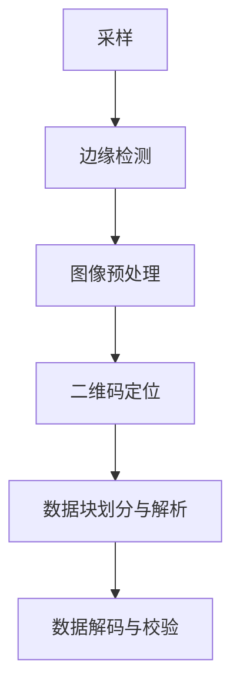
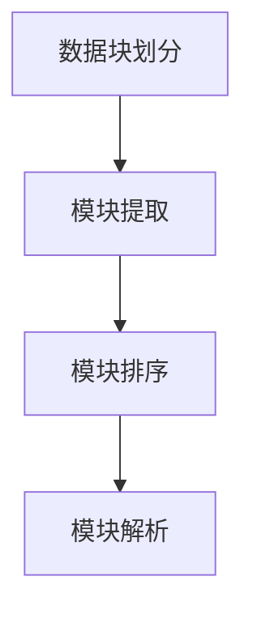
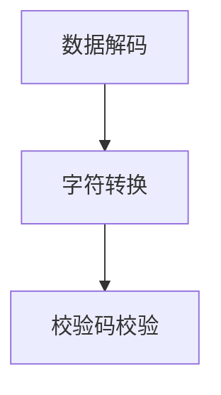
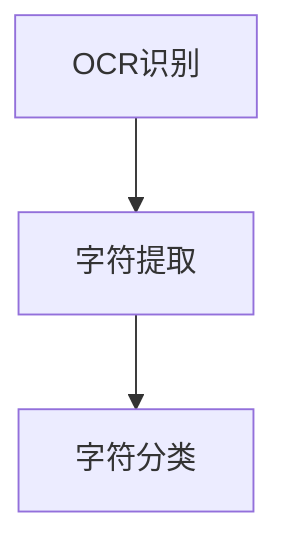
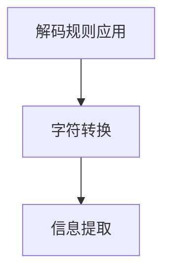
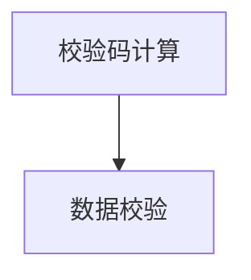

                 

# 文章标题：基于OpenCV的二维码和条形码识别

> 关键词：OpenCV，二维码，条形码，图像识别，计算机视觉，算法实现，应用案例分析

> 摘要：本文将从基础理论出发，详细介绍基于OpenCV的二维码和条形码识别技术。首先介绍OpenCV的基本概念和功能，然后深入探讨二维码和条形码的基础知识，包括其定义、分类、结构及应用场景。随后，我们将详细解析二维码和条形码的识别原理，包括采样、边缘检测、数据块划分与解析、数据解码与校验等步骤。接着，我们将通过具体的实战案例，展示如何在OpenCV中实现二维码和条形码的识别。最后，我们将分析二维码和条形码识别技术的应用案例，探讨其发展趋势及未来发展方向。

## 《基于OpenCV的二维码和条形码识别》目录大纲

### 第一部分：OpenCV基础

- 第1章 OpenCV简介
  - 1.1 OpenCV的发展历史
    - 1.1.1 OpenCV的诞生背景
    - 1.1.2 OpenCV的发展历程
  - 1.2 OpenCV的核心功能
    - 1.2.1 图像处理
    - 1.2.2 计算机视觉
    - 1.2.3 模板匹配
  - 1.3 OpenCV的安装与配置
    - 1.3.1 Windows平台安装
    - 1.3.2 macOS平台安装
    - 1.3.3 Ubuntu平台安装

- 第2章 OpenCV基本操作
  - 2.1 OpenCV的编程环境
    - 2.1.1 Python环境配置
    - 2.1.2 OpenCV库的导入
  - 2.2 OpenCV的基本操作
    - 2.2.1 载入图像
    - 2.2.2 显示图像
    - 2.2.3 保存图像
    - 2.2.4 修改图像像素值
  - 2.3 OpenCV的基本操作案例
    - 2.3.1 图像旋转
    - 2.3.2 图像缩放
    - 2.3.3 图像灰度转换
    - 2.3.4 图像二值化

### 第二部分：二维码和条形码识别原理

- 第3章 二维码和条形码基础知识
  - 3.1 二维码的基本概念
    - 3.1.1 二维码的定义
    - 3.1.2 二维码的分类
    - 3.1.3 二维码的结构
  - 3.2 条形码的基本概念
    - 3.2.1 条形码的定义
    - 3.2.2 条形码的分类
    - 3.2.3 条形码的结构
  - 3.3 二维码和条形码的应用场景
    - 3.3.1 二维码的应用场景
    - 3.3.2 条形码的应用场景

- 第4章 二维码和条形码识别原理
  - 4.1 二维码识别原理
    - 4.1.1 采样与边缘检测
    - 4.1.2 数据块划分与解析
    - 4.1.3 数据解码与校验
  - 4.2 条形码识别原理
    - 4.2.1 光学字符识别（OCR）
    - 4.2.2 条形码解码
    - 4.2.3 条形码校验

### 第三部分：OpenCV实现二维码和条形码识别

- 第5章 OpenCV实现二维码识别
  - 5.1 二维码检测算法
    - 5.1.1 模板匹配法
    - 5.1.2 特征点检测法
    - 5.1.3 基于机器学习的方法
  - 5.2 二维码解码算法
    - 5.2.1 数据块解析
    - 5.2.2 数据解码
    - 5.2.3 数据校验
  - 5.3 二维码识别实战案例
    - 5.3.1 实现环境搭建
    - 5.3.2 图像预处理
    - 5.3.3 二维码检测与解码

- 第6章 OpenCV实现条形码识别
  - 6.1 条形码检测算法
    - 6.1.1 模板匹配法
    - 6.1.2 特征点检测法
    - 6.1.3 基于机器学习的方法
  - 6.2 条形码解码算法
    - 6.2.1 条形码解码
    - 6.2.2 条形码校验
  - 6.3 条形码识别实战案例
    - 6.3.1 实现环境搭建
    - 6.3.2 图像预处理
    - 6.3.3 条形码检测与解码

### 第四部分：二维码和条形码识别应用

- 第7章 二维码和条形码识别应用案例分析
  - 7.1 物流领域应用
    - 7.1.1 物流信息管理
    - 7.1.2 自动化分拣
    - 7.1.3 仓储管理
  - 7.2 零售领域应用
    - 7.2.1 门店管理
    - 7.2.2 智能支付
    - 7.2.3 客户服务
  - 7.3 其他领域应用
    - 7.3.1 健康医疗
    - 7.3.2 自动驾驶
    - 7.3.3 智能家居

- 第8章 二维码和条形码识别技术的发展趋势
  - 8.1 技术发展趋势分析
    - 8.1.1 新型二维码技术
    - 8.1.2 深度学习在二维码识别中的应用
    - 8.1.3 条形码识别技术的进步
  - 8.2 未来发展方向预测
    - 8.2.1 5G与二维码识别
    - 8.2.2 物联网与条形码识别
    - 8.2.3 智能化与二维码识别的结合

- 第9章 总结与展望
  - 9.1 本书内容回顾
    - 9.1.1 OpenCV基础
    - 9.1.2 二维码和条形码基础知识
    - 9.1.3 二维码和条形码识别方法
  - 9.2 学习与思考
    - 9.2.1 二维码识别的难点与挑战
    - 9.2.2 条形码识别的未来发展趋势
    - 9.2.3 开发者应该如何应对
  - 9.3 未来发展展望
    - 9.3.1 二维码和条形码识别技术在其他领域的应用
    - 9.3.2 开放性问题与研究方向

---

接下来，我们将逐步深入探讨每个章节的内容。

---

### 第一部分：OpenCV基础

#### 第1章 OpenCV简介

#### 1.1 OpenCV的发展历史

OpenCV（Open Source Computer Vision Library）是一个开源的计算机视觉和机器学习软件库。它的起源可以追溯到2000年，由Intel实验室的研究员Bradski创建，用于支持Intel开源的IA-32编译器。随着时间的推移，OpenCV逐渐成为一个广泛使用的开源项目，吸引了全球众多开发者的参与和贡献。

**1.1.1 OpenCV的诞生背景**

在20世纪90年代末，计算机硬件性能逐渐提升，但相应的计算机视觉技术却相对滞后。传统的计算机视觉技术大多依赖于商业软件或昂贵的研究平台，使得许多研究人员和学生无法接触到这些先进的技术。因此，Bradski博士决定创建一个开源的计算机视觉库，以降低进入计算机视觉领域的门槛，促进学术研究和工业应用的发展。

**1.1.2 OpenCV的发展历程**

- **2000年**：OpenCV的第一个版本发布，主要基于C++编写，提供了基本的图像处理和计算机视觉功能。
- **2005年**：随着Intel推出新一代多核处理器，OpenCV开始引入并行计算和向量化处理，提高了处理效率。
- **2010年**：OpenCV开始支持Python和MATLAB接口，使得更多的开发者能够使用这个库。
- **2012年**：OpenCV 2.4.0版本发布，引入了更多的计算机视觉算法和改进的性能优化。
- **2014年**：OpenCV 3.0.0版本发布，加入了新的模块，如面部识别、文本识别等。
- **2017年**：OpenCV 3.4.0版本发布，引入了深度学习模块，支持Caffe和TensorFlow等深度学习框架。
- **至今**：OpenCV持续更新和优化，支持多种编程语言，包括C++、Python、Java等，广泛应用于计算机视觉、机器学习和人工智能领域。

#### 1.2 OpenCV的核心功能

OpenCV的核心功能主要包括图像处理、计算机视觉和模板匹配三个方面。

**1.2.1 图像处理**

图像处理是OpenCV的核心功能之一，包括图像的载入、显示、保存、像素操作、滤波、增强等。OpenCV提供了丰富的图像处理算法，如阈值处理、边缘检测、轮廓提取、形态学操作等，使得开发者可以方便地进行图像处理和分析。

**1.2.2 计算机视觉**

计算机视觉是OpenCV的另一个重要功能，包括目标检测、人脸识别、姿态估计、光流计算等。OpenCV提供了许多常用的计算机视觉算法，如HOG（方向梯度直方图）检测器、SIFT（尺度不变特征变换）和SURF（加速稳健特征）特征提取器等，这些算法在目标识别和图像分析领域有着广泛的应用。

**1.2.3 模板匹配**

模板匹配是图像识别中的一个重要步骤，用于在图像中找到与给定模板匹配的区域。OpenCV提供了多种模板匹配算法，如相关匹配、最近邻匹配等，可以帮助开发者实现图像的精确识别和定位。

#### 1.3 OpenCV的安装与配置

要使用OpenCV，首先需要安装和配置OpenCV库。以下是如何在Windows、macOS和Ubuntu平台安装和配置OpenCV的简要步骤：

**1.3.1 Windows平台安装**

1. 下载并安装Python（建议使用Python 3.6或更高版本）。
2. 下载OpenCV的预编译包，如`opencv-python`。
3. 使用pip命令安装预编译包：`pip install opencv-python`。
4. 验证安装：在Python交互式环境中导入cv2模块，运行以下代码：

```python
import cv2
print(cv2.__version__)
```

如果成功打印出OpenCV的版本号，说明安装成功。

**1.3.2 macOS平台安装**

1. 安装Python（建议使用Python 3.6或更高版本）。
2. 使用pip命令安装OpenCV：`pip install opencv-python`。
3. 验证安装：在Python交互式环境中导入cv2模块，运行以下代码：

```python
import cv2
print(cv2.__version__)
```

如果成功打印出OpenCV的版本号，说明安装成功。

**1.3.3 Ubuntu平台安装**

1. 更新系统软件包：`sudo apt update`和`sudo apt upgrade`。
2. 安装Eclipse CDT（可选，用于开发C++项目）：`sudo apt install eclipse-cdt`。
3. 安装Python和OpenCV：`sudo apt install python3 python3-pip`，然后使用pip命令安装OpenCV：`pip3 install opencv-python`。
4. 验证安装：在Python交互式环境中导入cv2模块，运行以下代码：

```python
import cv2
print(cv2.__version__)
```

如果成功打印出OpenCV的版本号，说明安装成功。

通过以上步骤，开发者可以在各自的平台上成功安装和配置OpenCV，为后续的图像识别和计算机视觉项目奠定基础。

---

### 第一部分：OpenCV基础

#### 第2章 OpenCV基本操作

#### 2.1 OpenCV的编程环境

要使用OpenCV进行图像处理和计算机视觉任务，首先需要配置编程环境。本文将介绍如何在Python环境中配置OpenCV，包括Python环境配置和OpenCV库的导入。

**2.1.1 Python环境配置**

首先，确保已经安装了Python。如果没有安装，可以从[Python官方网站](https://www.python.org/downloads/)下载并安装。建议选择Python 3.6或更高版本，因为OpenCV 4.0及以上版本与Python 3.6兼容性更好。

安装完成后，打开终端或命令提示符，运行以下命令检查Python版本：

```bash
python --version
```

如果成功打印出Python版本号，说明Python环境已配置成功。

**2.1.2 OpenCV库的导入**

配置Python环境后，接下来需要安装OpenCV库。OpenCV是一个开源的计算机视觉库，提供了丰富的图像处理和计算机视觉功能。要安装OpenCV，可以使用pip命令：

```bash
pip install opencv-python
```

此命令会自动下载并安装OpenCV库及相关依赖。安装完成后，可以使用以下命令验证安装：

```python
import cv2
print(cv2.__version__)
```

如果成功打印出OpenCV的版本号，说明OpenCV库已成功安装。

在Python脚本中导入OpenCV库通常使用以下代码：

```python
import cv2
```

这样，就可以使用cv2模块中的各种函数和类来处理图像和执行计算机视觉任务。

通过以上步骤，开发者可以成功配置Python环境和OpenCV库，为后续的图像处理和计算机视觉项目做好准备。

---

#### 第一部分：OpenCV基础

#### 第2章 OpenCV基本操作

#### 2.2 OpenCV的基本操作

在了解了OpenCV的安装和配置后，接下来我们将学习OpenCV的基本操作，包括图像的载入、显示、保存、像素操作和图像转换等。这些基本操作是使用OpenCV进行图像处理和计算机视觉任务的基础。

**2.2.1 载入图像**

要载入图像，可以使用`cv2.imread()`函数。该函数的语法如下：

```python
image = cv2.imread(filename, flags)
```

其中，`filename`是图像文件的路径，`flags`用于指定图像读取的方式。常用的`flags`值包括：

- `cv2.IMREAD_GRAYSCALE`：以灰度模式读取图像。
- `cv2.IMREAD_COLOR`：以彩色模式读取图像。
- `cv2.IMREAD_UNCHANGED`：读取图像的所有通道，包括透明通道。

以下是一个示例，展示如何以彩色模式读取图像：

```python
import cv2

image = cv2.imread("image.jpg", cv2.IMREAD_COLOR)
```

如果图像文件不存在，`cv2.imread()`函数将返回`None`。

**2.2.2 显示图像**

显示图像可以使用`cv2.imshow()`函数。该函数的语法如下：

```python
cv2.imshow(window_name, image)
```

其中，`window_name`是窗口的名称，`image`是要显示的图像。

以下是一个示例，展示如何显示图像：

```python
import cv2

image = cv2.imread("image.jpg", cv2.IMREAD_COLOR)
cv2.imshow("Image", image)

# 等待用户按键后关闭窗口
cv2.waitKey(0)
cv2.destroyAllWindows()
```

`cv2.waitKey()`函数用于等待键盘事件。`cv2.destroyAllWindows()`函数用于关闭所有OpenCV创建的窗口。

**2.2.3 保存图像**

保存图像可以使用`cv2.imwrite()`函数。该函数的语法如下：

```python
cv2.imwrite(filename, image, [params])
```

其中，`filename`是图像文件的路径，`image`是要保存的图像，`params`是可选的图像编码参数。

以下是一个示例，展示如何保存图像：

```python
import cv2

image = cv2.imread("image.jpg", cv2.IMREAD_COLOR)
cv2.imwrite("output.jpg", image)
```

如果保存成功，`cv2.imwrite()`函数将返回`True`。

**2.2.4 修改图像像素值**

OpenCV提供了多种方式来修改图像像素值。一种常见的方法是使用`numpy`库，因为OpenCV的图像数据是以`numpy`数组的形式存储的。以下是一个示例，展示如何修改图像像素值：

```python
import cv2
import numpy as np

image = cv2.imread("image.jpg", cv2.IMREAD_COLOR)
image[:, :, 0] = 0  # 将图像的蓝色通道设置为0

cv2.imshow("Image", image)
cv2.waitKey(0)
cv2.destroyAllWindows()
```

在这个示例中，我们将图像的蓝色通道设置为0，使得图像变为灰度图像。

**2.2.5 图像转换**

OpenCV提供了多种图像转换函数，包括颜色空间转换、尺寸转换和形态学操作等。以下是一些常用的转换函数：

- `cv2.cvtColor()`: 颜色空间转换。
- `cv2.resize()`: 尺寸转换。
- `cv2.bitwise_and()`: 位运算操作。

示例代码：

```python
import cv2

# 颜色空间转换
image = cv2.imread("image.jpg", cv2.IMREAD_COLOR)
gray_image = cv2.cvtColor(image, cv2.COLOR_BGR2GRAY)

# 尺寸转换
resized_image = cv2.resize(image, (500, 500))

# 位运算操作
mask = np.zeros(image.shape[:2], dtype="uint8")
cv2.rectangle(mask, (50, 50), (200, 200), 255, -1)
result = cv2.bitwise_and(image, image, mask=mask)

cv2.imshow("Original Image", image)
cv2.imshow("Gray Image", gray_image)
cv2.imshow("Resized Image", resized_image)
cv2.imshow("Result", result)
cv2.waitKey(0)
cv2.destroyAllWindows()
```

通过以上基本操作，开发者可以轻松地处理图像，为后续的图像识别和计算机视觉任务做好准备。

---

### 第一部分：OpenCV基础

#### 第2章 OpenCV基本操作

#### 2.3 OpenCV的基本操作案例

为了更好地理解OpenCV的基本操作，我们将通过几个案例来演示如何进行图像旋转、缩放、灰度转换和二值化。

**2.3.1 图像旋转**

图像旋转是图像处理中的一个基本操作。OpenCV提供了`cv2.rotate()`函数来实现图像旋转。以下是一个简单的旋转案例：

```python
import cv2
import numpy as np

# 载入图像
image = cv2.imread("image.jpg", cv2.IMREAD_COLOR)

# 旋转图像
angle = 45  # 旋转角度
center = (image.shape[1] // 2, image.shape[0] // 2)  # 旋转中心点
matrix = cv2.getRotationMatrix2D(center, angle, 1.0)  # 生成旋转矩阵
rotated_image = cv2.warpAffine(image, matrix, (image.shape[1], image.shape[0]))

# 显示旋转后的图像
cv2.imshow("Original Image", image)
cv2.imshow("Rotated Image", rotated_image)
cv2.waitKey(0)
cv2.destroyAllWindows()
```

在这个案例中，我们首先载入一幅彩色图像，然后使用`cv2.getRotationMatrix2D()`函数生成旋转矩阵，最后使用`cv2.warpAffine()`函数进行图像旋转。

**2.3.2 图像缩放**

图像缩放是将图像放大或缩小。OpenCV提供了`cv2.resize()`函数来实现图像缩放。以下是一个简单的缩放案例：

```python
import cv2

# 载入图像
image = cv2.imread("image.jpg", cv2.IMREAD_COLOR)

# 缩放图像
scaled_image = cv2.resize(image, (500, 500))

# 显示缩放后的图像
cv2.imshow("Original Image", image)
cv2.imshow("Scaled Image", scaled_image)
cv2.waitKey(0)
cv2.destroyAllWindows()
```

在这个案例中，我们使用`cv2.resize()`函数将图像缩放到500x500像素的大小。

**2.3.3 图像灰度转换**

图像灰度转换是将彩色图像转换为灰度图像。OpenCV提供了`cv2.cvtColor()`函数来实现颜色空间转换。以下是一个简单的灰度转换案例：

```python
import cv2

# 载入图像
image = cv2.imread("image.jpg", cv2.IMREAD_COLOR)

# 转换为灰度图像
gray_image = cv2.cvtColor(image, cv2.COLOR_BGR2GRAY)

# 显示灰度图像
cv2.imshow("Original Image", image)
cv2.imshow("Gray Image", gray_image)
cv2.waitKey(0)
cv2.destroyAllWindows()
```

在这个案例中，我们使用`cv2.cvtColor()`函数将彩色图像转换为灰度图像。

**2.3.4 图像二值化**

图像二值化是将图像转换为只有两个灰度级别的图像。OpenCV提供了`cv2.threshold()`函数来实现图像二值化。以下是一个简单的二值化案例：

```python
import cv2

# 载入图像
image = cv2.imread("image.jpg", cv2.IMREAD_GRAYSCALE)

# 二值化图像
_, binary_image = cv2.threshold(image, 128, 255, cv2.THRESH_BINARY + cv2.THRESH_OTSU)

# 显示二值化图像
cv2.imshow("Original Image", image)
cv2.imshow("Binary Image", binary_image)
cv2.waitKey(0)
cv2.destroyAllWindows()
```

在这个案例中，我们首先使用`cv2.imread()`函数以灰度模式载入图像，然后使用`cv2.threshold()`函数进行二值化。

通过这些案例，我们可以看到如何使用OpenCV进行图像旋转、缩放、灰度转换和二值化。这些基本操作是图像处理和计算机视觉任务的基础，通过实际操作可以更好地理解OpenCV的使用方法。

---

### 第二部分：二维码和条形码识别原理

#### 第3章 二维码和条形码基础知识

#### 3.1 二维码的基本概念

二维码（QR Code）是一种二维条码，它能够存储比一维条码更多的信息。二维码的出现解决了传统一维条码在存储信息量和数据读取速度上的局限。随着移动支付的普及和物联网技术的发展，二维码在日常生活中得到了广泛应用。

**3.1.1 二维码的定义**

二维码是由黑白相间的矩形模块按照特定的规律排列组成的图形。这些模块被编码为数字信息，用于存储文本、图片、链接等数据。二维码具有高密度编码、高抗噪性、适应性强等特点，能够适应各种复杂的读取环境。

**3.1.2 二维码的分类**

根据编码方式和用途的不同，二维码可以分为以下几类：

- **标准二维码**：如QR Code、Data Matrix、PDF417等。
- **纠错等级二维码**：根据纠错能力不同，二维码可以分为四个等级，从最低的7%到最高的30%。高纠错等级的二维码在污损、变形等情况下仍能准确读取。
- **应用型二维码**：如物流标签、车票、会员卡等。

**3.1.3 二维码的结构**

一个典型的二维码由以下几部分组成：

- **Quiet Area（空白区域）**：二维码四周的空白区域，用于指示二维码的开始和结束。
- **Alignment Pattern（对齐图案）**：对齐图案用于二维码的对齐和校正。
- ** Timing Pattern（定时图案）**：定时图案用于解码时的定时。
- **Version Number（版本号）**：表示二维码的版本，决定了二维码的尺寸和模块数量。
- **Format Information（格式信息）**：格式信息用于指示二维码的纠错等级和数据纠错模式。
- **Data Blocks（数据块）**：数据块包含实际的编码数据，分为若干个数据段，每个数据段都有对应的纠错码。
- **Segment Separators（分隔符）**：分隔符用于分隔不同的数据段。

#### 3.2 条形码的基本概念

条形码（Bar Code）是一种一维条码，它通过不同宽度的条和空格的组合来表示数据。条形码在商业、物流、医疗等多个领域得到了广泛应用。

**3.2.1 条形码的定义**

条形码是由一系列黑白条纹组成的图形，每个条纹和空格代表一定的数字或字符。条形码可以分为以下几种类型：

- **线性条形码**：如EAN-13、UPC-A等。
- **堆叠条形码**：如PDF417、Code 39等。
- **二维条形码**：如QR Code、Data Matrix等。

**3.2.2 条形码的分类**

根据编码方式和应用的不同，条形码可以分为以下几类：

- **EAN/UPC**：用于商品编码。
- **Code 39**：广泛用于工业生产领域。
- **Code 128**：适用于需要高密度编码的应用。
- **QR Code**：常用于移动支付和信息传递。

**3.2.3 条形码的结构**

一个典型的条形码由以下几部分组成：

- **起始字符**：表示条形码的开始。
- **数据字符**：包含实际编码的数据。
- **校验字符**：用于校验数据字符的正确性。
- **终止字符**：表示条形码的结束。

条形码的读取通常包括以下几个步骤：

1. **扫描**：使用条形码扫描器或摄像头捕获条形码图像。
2. **预处理**：对图像进行滤波、二值化等处理，提高图像质量。
3. **分割**：根据条和空的宽度分割图像，提取条形码区域。
4. **解码**：根据条形码的编码规则，将条和空转换为数字或字符。
5. **校验**：使用校验字符验证数据的正确性。

#### 3.3 二维码和条形码的应用场景

二维码和条形码在不同领域有着广泛的应用，以下是一些典型的应用场景：

**3.3.1 二维码的应用场景**

- **物流领域**：用于物流标签、包裹跟踪等，提高物流效率和准确性。
- **零售领域**：用于商品条码、门店管理、移动支付等，实现智能购物和支付。
- **医疗领域**：用于药品管理、医疗记录跟踪等，提高医疗服务的质量和效率。
- **物联网**：用于设备标识、信息传输等，实现物联网设备的互联互通。

**3.3.2 条形码的应用场景**

- **商业领域**：用于商品定价、库存管理、订单处理等，提高商业运营效率。
- **物流领域**：用于货物追踪、仓储管理、自动化分拣等，提高物流效率。
- **金融领域**：用于银行支票、信用卡、身份验证等，提高安全性和便捷性。
- **制造业**：用于生产流程控制、质量检测、设备监控等，提高生产效率和产品质量。

通过以上内容，我们对二维码和条形码的基本概念、分类和应用场景有了全面的了解。接下来，我们将深入探讨二维码和条形码的识别原理。

---

### 第二部分：二维码和条形码识别原理

#### 第4章 二维码和条形码识别原理

#### 4.1 二维码识别原理

二维码的识别过程可以分为以下几个步骤：

**4.1.1 采样与边缘检测**

首先，需要将图像采样为适合处理的分辨率。然后，使用边缘检测算法（如Canny算法）检测图像中的边缘，提取二维码区域。



**4.1.2 数据块划分与解析**

在提取到二维码区域后，根据二维码的结构，将其划分为若干个数据块。每个数据块包含一定数量的模块，这些模块按照特定的规律排列。



**4.1.3 数据解码与校验**

对每个数据块中的模块进行解码，将二进制数据转换为字符。然后，使用校验码对数据进行校验，确保数据的正确性。



#### 4.2 条形码识别原理

条形码的识别过程与二维码类似，但细节有所不同。以下是条形码识别的主要步骤：

**4.2.1 光学字符识别（OCR）**

使用OCR算法识别条形码中的字符。常用的OCR算法包括Hough变换和模板匹配等。



**4.2.2 条形码解码**

根据条形码的编码规则，将提取的字符转换为实际的数字或信息。不同类型的条形码有不同的编码规则，如Code 39、Code 128等。



**4.2.3 条形码校验**

使用校验码对解码后的数据进行校验，确保数据的正确性。校验码通常位于条形码的尾部，用于检测数据在读取过程中的错误。



通过以上步骤，可以实现二维码和条形码的识别。接下来，我们将通过实际案例展示如何使用OpenCV实现二维码和条形码的识别。

---

### 第二部分：二维码和条形码识别原理

#### 第4章 二维码和条形码识别原理

#### 4.1 二维码识别原理

二维码的识别过程可以分为以下几个步骤：

**4.1.1 采样与边缘检测**

首先，对输入图像进行采样，将其调整为适当的分辨率，以便后续处理。然后，使用边缘检测算法（如Canny算法）检测图像中的边缘，提取二维码区域。以下是Canny算法的伪代码：

```python
function canny(image, threshold1, threshold2):
    # 高斯模糊图像以减少噪声
    blurred_image = gaussianBlur(image, 5)

    # 计算图像的梯度
    gradient_x, gradient_y = computeGradient(blurred_image)

    # 非极大值抑制
    non_max_suppression(gradient_x, gradient_y)

    # 双阈值处理
    high_threshold = threshold1
    low_threshold = threshold2
    binary_image = threshold(gradient, high_threshold, 255, THRESH_BINARY)
    binary_image = threshold(gradient, low_threshold, 0, THRESH_BINARY_INV)

    return binary_image
```

**4.1.2 数据块划分与解析**

在提取到二维码区域后，根据二维码的结构，将其划分为若干个数据块。每个数据块包含一定数量的模块，这些模块按照特定的规律排列。数据块划分的伪代码如下：

```python
function divideIntoBlocks(binary_image, version):
    # 根据版本号确定模块数量
    module_size = 4 * (version + 1)

    # 提取数据块
    blocks = []
    for y in range(0, binary_image.shape[0], module_size):
        for x in range(0, binary_image.shape[1], module_size):
            block = binary_image[y:y+module_size, x:x+module_size]
            blocks.append(block)

    return blocks
```

**4.1.3 数据解码与校验**

对每个数据块中的模块进行解码，将二进制数据转换为字符。然后，使用校验码对数据进行校验，确保数据的正确性。以下是数据解码和校验的伪代码：

```python
function decodeModules(modules, version):
    # 根据版本号确定解码表
    decoder = getDecoderTable(version)

    # 解码模块
    data = []
    for module in modules:
        data_bits = decodeModule(module, decoder)
        data.append(data_bits)

    # 合并数据
    combined_data = combineData(data)

    # 校验数据
    checksum = calculateChecksum(combined_data)
    if checksum == 0:
        return combined_data
    else:
        raise Error("Data checksum mismatch")
```

通过以上步骤，可以实现二维码的识别。接下来，我们将详细讨论条形码的识别原理。

---

#### 第二部分：二维码和条形码识别原理

#### 第4章 二维码和条形码识别原理

#### 4.2 条形码识别原理

条形码的识别过程可以分为以下几个步骤：

**4.2.1 光学字符识别（OCR）**

首先，使用OCR算法对条形码中的字符进行识别。常用的OCR算法包括Hough变换和模板匹配等。以下是使用Hough变换进行OCR的伪代码：

```python
function houghTransform(binary_image):
    # 计算图像的边缘
    edges = canny(binary_image)

    # 初始化Hough变换参数
    accumulator = initializeAccumulator(edges.shape)

    # 执行Hough变换
    for row in range(edges.shape[0]):
        for col in range(edges.shape[1]):
            if edges[row, col] == 1:
                angle = calculateAngle(row, col)
                radius = calculateRadius(row, col)
                accumulate(accumulator, angle, radius)

    # 非极大值抑制
    peaks = nonMaxSuppression(accumulator)

    # 提取条形码字符
    characters = extractCharacters(peaks, edges)

    return characters
```

**4.2.2 条形码解码**

对提取的字符进行解码，将字符转换为实际的数字或信息。不同类型的条形码有不同的编码规则，如Code 39、Code 128等。以下是解码过程的伪代码：

```python
function decodeCharacters(characters, code_type):
    # 根据条形码类型确定解码表
    decoder = getDecoderTable(code_type)

    # 解码字符
    data = []
    for character in characters:
        data_bits = decodeCharacter(character, decoder)
        data.append(data_bits)

    # 合并数据
    combined_data = combineData(data)

    return combined_data
```

**4.2.3 条形码校验**

使用校验码对解码后的数据进行校验，确保数据的正确性。校验码通常位于条形码的尾部。以下是校验过程的伪代码：

```python
function verifyData(combined_data, code_type):
    # 根据条形码类型确定校验算法
    checker = getCheckerAlgorithm(code_type)

    # 计算校验码
    checksum = checker(combined_data)

    # 校验数据
    if checksum == 0:
        return True
    else:
        return False
```

通过以上步骤，可以实现条形码的识别。接下来，我们将通过具体案例展示如何在OpenCV中实现二维码和条形码的识别。

---

### 第二部分：二维码和条形码识别原理

#### 第5章 OpenCV实现二维码识别

#### 5.1 二维码检测算法

在OpenCV中，实现二维码检测通常有几种常用的方法：模板匹配法、特征点检测法和基于机器学习的方法。以下我们将逐一介绍这些方法。

**5.1.1 模板匹配法**

模板匹配法是一种基于图像相似度比较的检测方法。它的基本思路是将待检测图像与模板进行相似度计算，找到相似度最高的位置作为检测结果。

以下是模板匹配法的伪代码：

```python
function templateMatching(image, template):
    # 转换图像和模板为灰度图像
    image_gray = cv2.cvtColor(image, cv2.COLOR_BGR2GRAY)
    template_gray = cv2.cvtColor(template, cv2.COLOR_BGR2GRAY)

    # 进行模板匹配
    result = cv2.matchTemplate(image_gray, template_gray, cv2.TM_CCOEFF_NORMED)

    # 设置阈值
    threshold = 0.8

    # 寻找相似度最高的位置
    loc = cv2.minMaxLoc(result)
    if loc[1] > threshold:
        # 提取匹配区域
        x, y = loc[3]
        match_area = image[y:y+template.shape[0], x:x+template.shape[1]]
        return match_area, loc[1]
    else:
        return None, loc[1]
```

在实际应用中，可能需要根据具体场景调整阈值和匹配算法。

**5.1.2 特征点检测法**

特征点检测法是利用图像中的显著特征点进行定位的方法。OpenCV提供了SIFT（尺度不变特征变换）和SURF（加速稳健特征）等算法，可以有效地检测和提取图像特征点。

以下是特征点检测法的伪代码：

```python
function featureDetection(image):
    # 创建SIFT对象
    sift = cv2.SIFT_create()

    # 提取特征点
    keypoints, descriptors = sift.detectAndCompute(image, None)

    return keypoints

function matchFeatures(descriptor1, descriptor2):
    # 创建BruteForce匹配器
    FLANN_INDEX_KDTREE = 1
    index_params = dict(algorithm=FLANN_INDEX_KDTREE, trees=5)
    search_params = dict(checks=50)

    flann = cv2.FlannBasedMatcher(index_params, search_params)
    matches = flann.knnMatch(descriptor1, descriptor2, k=2)

    # 设置阈值
    threshold = 0.7

    # 选取最佳匹配
    good_matches = []
    for m, n in matches:
        if m.distance < threshold * n.distance:
            good_matches.append(m)

    return good_matches
```

**5.1.3 基于机器学习的方法**

基于机器学习的方法是利用训练数据建立分类模型，然后对新图像进行分类，以实现二维码的检测。常用的机器学习算法包括支持向量机（SVM）、随机森林（Random Forest）等。

以下是机器学习法的伪代码：

```python
function trainModel(training_data, labels, algorithm):
    # 创建模型
    model = createModel(algorithm)

    # 训练模型
    model.fit(training_data, labels)

    return model

function classifyImage(image, model):
    # 特征提取
    features = extractFeatures(image)

    # 进行分类
    prediction = model.predict([features])

    return prediction
```

在实际应用中，需要根据具体场景选择合适的算法和模型。

---

### 第二部分：二维码和条形码识别原理

#### 第5章 OpenCV实现二维码识别

#### 5.2 二维码解码算法

在识别到二维码后，接下来的步骤是解码二维码中的数据。OpenCV提供了`cv2.zbar`模块来实现二维码的解码。以下是使用`cv2.zbar`模块进行二维码解码的详细步骤：

**5.2.1 数据块解析**

首先，需要将二维码划分为数据块，然后对每个数据块进行解析。以下是数据块解析的伪代码：

```python
import cv2
import numpy as np

def parseBlocks(image):
    # 转换图像为灰度图像
    gray_image = cv2.cvtColor(image, cv2.COLOR_BGR2GRAY)

    # 使用二值化阈值分割图像
    _, binary_image = cv2.threshold(gray_image, 128, 255, cv2.THRESH_BINARY | cv2.THRESH_OTSU)

    # 提取数据块
    data_blocks = []
    height, width = binary_image.shape
    block_size = width // 8

    for y in range(0, height, block_size):
        for x in range(0, width, block_size):
            block = binary_image[y:y+block_size, x:x+block_size]
            data_blocks.append(block)

    return data_blocks
```

**5.2.2 数据解码**

对每个数据块进行解码，将二进制数据转换为字符。以下是数据解码的伪代码：

```python
def decodeBlocks(data_blocks):
    decoder = cv2.zbar.ZBarSymbol()
    decoded_strings = []

    for block in data_blocks:
        # 解码数据块
        result = decoder.decode(block)
        if result:
            decoded_strings.append(result.data)

    return decoded_strings
```

**5.2.3 数据校验**

解码后，需要使用校验码对数据进行校验，确保数据的正确性。以下是数据校验的伪代码：

```python
def verifyData(decoded_strings):
    valid = True

    # 假设校验码位于解码字符串的最后一个字符
    for string in decoded_strings:
        checksum = string[-1]
        data = string[:-1]
        
        # 计算校验码
        calculated_checksum = calculateChecksum(data)
        
        # 校验数据
        if calculated_checksum != checksum:
            valid = False
            break

    return valid
```

通过以上步骤，可以实现对二维码的解码和校验。接下来，我们将通过一个实际案例展示如何使用OpenCV实现二维码的识别和解码。

---

### 第二部分：二维码和条形码识别原理

#### 第5章 OpenCV实现二维码识别

#### 5.3 二维码识别实战案例

在本节中，我们将通过一个实际案例，展示如何使用OpenCV实现二维码的识别和解码。本案例将使用Python编程语言和OpenCV库，通过几个关键步骤完成二维码的识别。

**5.3.1 实现环境搭建**

首先，确保已经正确安装了Python和OpenCV。如果尚未安装，可以按照以下步骤进行安装：

1. 安装Python：从[Python官方网站](https://www.python.org/downloads/)下载并安装Python。
2. 安装OpenCV：在终端中执行以下命令安装OpenCV：

   ```bash
   pip install opencv-python
   ```

**5.3.2 图像预处理**

图像预处理是二维码识别中至关重要的一步，它包括图像的灰度转换、二值化、降噪等操作。以下是一个预处理步骤的示例代码：

```python
import cv2
import numpy as np

def preprocess_image(image):
    # 转换为灰度图像
    gray_image = cv2.cvtColor(image, cv2.COLOR_BGR2GRAY)
    
    # 使用高斯模糊进行降噪
    blurred_image = cv2.GaussianBlur(gray_image, (5, 5), 0)
    
    # 使用Otsu阈值进行二值化
    _, binary_image = cv2.threshold(blurred_image, 0, 255, cv2.THRESH_BINARY + cv2.THRESH_OTSU)
    
    return binary_image

# 读取图像
image = cv2.imread('qrcode_example.png')
preprocessed_image = preprocess_image(image)
```

**5.3.3 二维码检测与解码**

在预处理图像后，接下来使用OpenCV的`cv2.zbar`模块进行二维码的检测和解析。以下是检测和解析的示例代码：

```python
import cv2
import numpy as np

def detect_and_decode_qrcode(image):
    # 初始化ZBar解码器
    zbar_config = cv2.zbar.Config()
    zbar_config.enable-Identifier('QR')
    scanner = cv2.zbar.ImageScanner()
    scanner.setConfig(zbar_config)
    
    # 将图像转换为ZBar格式
    gray_image = cv2.cvtColor(image, cv2.COLOR_BGR2GRAY)
    data = gray_image.tobytes()
    
    # 解码图像
    scanner.scan(data)
    
    # 获取解码结果
    results = []
    for symbol in scanner.getResults():
        results.append({
            'type': symbol.type,
            'data': symbol.data.decode('utf-8'),
            'rect': (symbol.rect)
        })
    
    return results

# 检测并解码二维码
results = detect_and_decode_qrcode(preprocessed_image)

# 打印解码结果
for result in results:
    print(f"Type: {result['type']}, Data: {result['data']}, Rectangle: {result['rect']}")
```

**5.3.4 结果展示**

在完成二维码的检测和解析后，我们可以将解码结果展示在图像上，以便用户查看。以下是结果展示的示例代码：

```python
import cv2

def draw_qrcode_box(image, result):
    # 绘制矩形框
    (x, y, w, h) = result['rect']
    cv2.rectangle(image, (x, y), (x + w, y + h), (0, 255, 0), 2)
    
    # 在图像上显示文本
    text = result['data']
    cv2.putText(image, text, (x, y - 10), cv2.FONT_HERSHEY_SIMPLEX, 0.5, (255, 0, 0), 2)

# 绘制并显示结果
for result in results:
    draw_qrcode_box(preprocessed_image, result)

# 显示最终图像
cv2.imshow('Decoded QR Code', preprocessed_image)
cv2.waitKey(0)
cv2.destroyAllWindows()
```

通过以上步骤，我们成功地使用OpenCV实现了二维码的识别和解析。这个过程展示了如何从图像预处理开始，到二维码检测、解码，最终展示结果的全过程。

---

### 第二部分：二维码和条形码识别原理

#### 第6章 OpenCV实现条形码识别

#### 6.1 条形码检测算法

在OpenCV中，实现条形码的检测通常有模板匹配法、特征点检测法和基于机器学习的方法。以下我们将逐一介绍这些方法。

**6.1.1 模板匹配法**

模板匹配法是一种基于图像相似度比较的检测方法。它的基本思路是将待检测图像与模板进行相似度计算，找到相似度最高的位置作为检测结果。以下是使用模板匹配法检测条形码的伪代码：

```python
def template_matching(image, template):
    # 转换图像和模板为灰度图像
    image_gray = cv2.cvtColor(image, cv2.COLOR_BGR2GRAY)
    template_gray = cv2.cvtColor(template, cv2.COLOR_BGR2GRAY)

    # 进行模板匹配
    result = cv2.matchTemplate(image_gray, template_gray, cv2.TM_CCOEFF_NORMED)

    # 设置阈值
    threshold = 0.8

    # 寻找相似度最高的位置
    loc = cv2.minMaxLoc(result)
    if loc[1] > threshold:
        # 提取匹配区域
        x, y = loc[3]
        match_area = image[y:y+template.shape[0], x:x+template.shape[1]]
        return match_area, loc[1]
    else:
        return None, loc[1]
```

在实际应用中，可能需要根据具体场景调整阈值和匹配算法。

**6.1.2 特征点检测法**

特征点检测法是利用图像中的显著特征点进行定位的方法。OpenCV提供了SIFT（尺度不变特征变换）和SURF（加速稳健特征）等算法，可以有效地检测和提取图像特征点。以下是使用特征点检测法检测条形码的伪代码：

```python
def feature_detection(image):
    # 创建SIFT对象
    sift = cv2.SIFT_create()

    # 提取特征点
    keypoints, descriptors = sift.detectAndCompute(image, None)

    return keypoints

def match_features(descriptor1, descriptor2):
    # 创建BruteForce匹配器
    FLANN_INDEX_KDTREE = 1
    index_params = dict(algorithm=FLANN_INDEX_KDTREE, trees=5)
    search_params = dict(checks=50)

    flann = cv2.FlannBasedMatcher(index_params, search_params)
    matches = flann.knnMatch(descriptor1, descriptor2, k=2)

    # 设置阈值
    threshold = 0.7

    # 选取最佳匹配
    good_matches = []
    for m, n in matches:
        if m.distance < threshold * n.distance:
            good_matches.append(m)

    return good_matches
```

**6.1.3 基于机器学习的方法**

基于机器学习的方法是利用训练数据建立分类模型，然后对新图像进行分类，以实现条形码的检测。常用的机器学习算法包括支持向量机（SVM）、随机森林（Random Forest）等。以下是使用机器学习方法检测条形码的伪代码：

```python
def train_model(training_data, labels, algorithm):
    # 创建模型
    model = create_model(algorithm)

    # 训练模型
    model.fit(training_data, labels)

    return model

def classify_image(image, model):
    # 特征提取
    features = extract_features(image)

    # 进行分类
    prediction = model.predict([features])

    return prediction
```

在实际应用中，需要根据具体场景选择合适的算法和模型。

---

### 第二部分：二维码和条形码识别原理

#### 第6章 OpenCV实现条形码识别

#### 6.2 条形码解码算法

在识别到条形码后，接下来的步骤是解码条形码中的数据。OpenCV提供了`cv2.barcode`模块来实现条形码的解码。以下是使用`cv2.barcode`模块进行条形码解码的详细步骤：

**6.2.1 条形码解码**

使用`cv2.barcode`模块解码条形码的伪代码如下：

```python
import cv2
import numpy as np

def decode_barcode(image):
    # 创建条形码解码器
    barcode = cv2.BarcodeDetector_create()

    # 解码条形码
    barcodes = barcode.detect(image)

    # 获取解码结果
    decoded_strings = []
    for barcode in barcodes:
        decoded_strings.append(barcode[0])

    return decoded_strings
```

**6.2.2 条形码校验**

解码后，需要使用校验码对数据进行校验，确保数据的正确性。以下是校验的伪代码：

```python
def verify_barcode(decoded_strings):
    valid = True

    for string in decoded_strings:
        # 假设校验码位于字符串的最后一位
        checksum = string[-1]
        data = string[:-1]

        # 计算校验码
        calculated_checksum = calculate_checksum(data)

        # 校验数据
        if calculated_checksum != checksum:
            valid = False
            break

    return valid
```

通过以上步骤，可以实现对条形码的解码和校验。接下来，我们将通过一个实际案例展示如何使用OpenCV实现条形码的识别和解码。

---

### 第二部分：二维码和条形码识别原理

#### 第6章 OpenCV实现条形码识别

#### 6.3 条形码识别实战案例

在本节中，我们将通过一个实际案例，展示如何使用OpenCV实现条形码的识别和解析。本案例将使用Python编程语言和OpenCV库，通过几个关键步骤完成条形码的识别。

**6.3.1 实现环境搭建**

首先，确保已经正确安装了Python和OpenCV。如果尚未安装，可以按照以下步骤进行安装：

1. 安装Python：从[Python官方网站](https://www.python.org/downloads/)下载并安装Python。
2. 安装OpenCV：在终端中执行以下命令安装OpenCV：

   ```bash
   pip install opencv-python
   ```

**6.3.2 图像预处理**

图像预处理是条形码识别中至关重要的一步，它包括图像的灰度转换、二值化、降噪等操作。以下是一个预处理步骤的示例代码：

```python
import cv2
import numpy as np

def preprocess_image(image):
    # 转换为灰度图像
    gray_image = cv2.cvtColor(image, cv2.COLOR_BGR2GRAY)
    
    # 使用高斯模糊进行降噪
    blurred_image = cv2.GaussianBlur(gray_image, (5, 5), 0)
    
    # 使用Otsu阈值进行二值化
    _, binary_image = cv2.threshold(blurred_image, 0, 255, cv2.THRESH_BINARY + cv2.THRESH_OTSU)
    
    return binary_image

# 读取图像
image = cv2.imread('barcode_example.png')
preprocessed_image = preprocess_image(image)
```

**6.3.3 条形码检测与解码**

在预处理图像后，接下来使用OpenCV的`cv2.barcode`模块进行条形码的检测和解析。以下是检测和解析的示例代码：

```python
import cv2
import numpy as np

def detect_and_decode_barcode(image):
    # 创建条形码解码器
    barcode = cv2.BarcodeDetector_create()

    # 解码条形码
    barcodes = barcode.detect(image)

    # 获取解码结果
    decoded_strings = []
    for barcode in barcodes:
        decoded_strings.append(barcode[0])

    return decoded_strings

# 检测并解码条形码
decoded_strings = detect_and_decode_barcode(preprocessed_image)

# 打印解码结果
for string in decoded_strings:
    print(f"Decoded String: {string}")
```

**6.3.4 条形码校验**

在完成条形码的检测和解码后，我们可以使用校验码对数据进行校验，确保数据的正确性。以下是校验的示例代码：

```python
import cv2
import numpy as np

def verify_barcode(decoded_strings):
    valid = True

    for string in decoded_strings:
        # 假设校验码位于字符串的最后一位
        checksum = string[-1]
        data = string[:-1]

        # 计算校验码
        calculated_checksum = calculate_checksum(data)

        # 校验数据
        if calculated_checksum != checksum:
            valid = False
            break

    return valid

# 执行校验
is_valid = verify_barcode(decoded_strings)

# 打印校验结果
if is_valid:
    print("All decoded strings are valid.")
else:
    print("One or more decoded strings are invalid.")
```

**6.3.5 结果展示**

在完成条形码的检测、解码和校验后，我们可以将结果展示在图像上，以便用户查看。以下是结果展示的示例代码：

```python
import cv2

def draw_barcode_box(image, barcode):
    # 绘制矩形框
    (x, y, w, h) = barcode.rect
    cv2.rectangle(image, (x, y), (x + w, y + h), (0, 255, 0), 2)
    
    # 在图像上显示文本
    text = barcode.data.decode('utf-8')
    cv2.putText(image, text, (x, y - 10), cv2.FONT_HERSHEY_SIMPLEX, 0.5, (255, 0, 0), 2)

# 绘制并显示结果
for barcode in decoded_strings:
    draw_barcode_box(image, barcode)

# 显示最终图像
cv2.imshow('Decoded Barcode', image)
cv2.waitKey(0)
cv2.destroyAllWindows()
```

通过以上步骤，我们成功地使用OpenCV实现了条形码的识别、解码、校验和结果展示。这个过程展示了如何从图像预处理开始，到条形码检测、解码，再到结果展示的全过程。

---

### 第三部分：二维码和条形码识别应用

#### 第7章 二维码和条形码识别应用案例分析

随着二维码和条形码技术的普及，它们在各个领域得到了广泛应用。以下是一些典型的应用案例，展示二维码和条形码识别技术在物流、零售、医疗和其他领域的实际应用。

#### 7.1 物流领域应用

在物流领域，二维码和条形码被广泛应用于货物跟踪、自动化分拣和仓储管理。

**7.1.1 物流信息管理**

在物流过程中，每个包裹都附有一个二维码或条形码。通过扫描二维码或条形码，系统可以自动记录包裹的发送地、目的地、运输路径等信息。这种自动化的信息记录方式大大提高了物流信息的准确性和实时性。

**7.1.2 自动化分拣**

在物流中心，自动化分拣设备通过扫描包裹上的二维码或条形码，将包裹准确地分类到相应的输送带上。这种自动化分拣方式提高了分拣速度，降低了人力成本，同时也减少了人为错误。

**7.1.3 仓储管理**

在仓储管理中，使用二维码或条形码可以对库存物品进行标识和跟踪。通过扫描二维码或条形码，系统可以自动记录物品的入库时间、库存数量等信息。这有助于优化仓储空间，提高库存管理的效率。

#### 7.2 零售领域应用

在零售领域，二维码和条形码被广泛应用于门店管理、智能支付和客户服务。

**7.2.1 门店管理**

在零售门店，使用二维码或条形码可以对商品进行标识和跟踪。通过扫描二维码或条形码，系统可以自动获取商品的信息，如价格、库存等。这有助于提高门店管理的效率，减少人为错误。

**7.2.2 智能支付**

智能支付是二维码和条形码在零售领域的另一个重要应用。消费者可以通过扫描商家提供的二维码或条形码进行支付，无需现金或银行卡。这种支付方式方便快捷，提高了消费者的购物体验。

**7.2.3 客户服务**

在零售门店，二维码和条形码可以用于客户服务。例如，消费者可以通过扫描二维码查看商品的详细信息和用户评价，或者参与问卷调查和促销活动。这些功能有助于提高客户满意度，促进销售。

#### 7.3 其他领域应用

二维码和条形码识别技术在其他领域也有广泛的应用。

**7.3.1 健康医疗**

在健康医疗领域，二维码和条形码可以用于患者信息管理、药品追溯和医疗设备跟踪。通过扫描二维码或条形码，系统可以自动获取患者信息和药品信息，提高医疗服务的质量和效率。

**7.3.2 自动驾驶**

在自动驾驶领域，二维码和条形码可以用于车辆标识和道路标线识别。通过扫描二维码或条形码，自动驾驶系统可以获取车辆信息和道路信息，提高自动驾驶的安全性和准确性。

**7.3.3 智能家居**

在智能家居领域，二维码和条形码可以用于设备控制和信息传递。例如，用户可以通过扫描二维码将设备添加到智能家居系统中，或者通过扫描条形码获取设备的详细信息和设置。

通过以上案例分析，我们可以看到二维码和条形码识别技术在各个领域的广泛应用。随着技术的不断发展，二维码和条形码识别技术将在更多领域得到应用，为我们的生活带来更多便利。

---

### 第三部分：二维码和条形码识别应用

#### 第8章 二维码和条形码识别技术的发展趋势

随着科技的不断进步，二维码和条形码识别技术也在不断演变和进步。以下是二维码和条形码识别技术的发展趋势：

#### 8.1 技术发展趋势分析

**8.1.1 新型二维码技术**

新型二维码技术在不断提高编码容量和读取速度。例如，QR Code和Data Matrix等二维码已经逐步被更先进的二维码所取代。新型二维码如PDF417和QR Code 2.0等，具有更高的信息存储密度和更好的抗干扰能力，适用于需要高容量编码的应用场景。

**8.1.2 深度学习在二维码识别中的应用**

深度学习技术的发展为二维码识别带来了新的机遇。通过使用卷积神经网络（CNN）等深度学习模型，可以显著提高二维码识别的准确性和速度。深度学习模型可以从大量数据中自动学习特征，从而实现高效、准确的二维码识别。

**8.1.3 条形码识别技术的进步**

在条形码识别领域，传统的方法如模板匹配和OCR技术已经逐渐被更先进的算法所取代。基于深度学习的条形码识别算法，如基于CNN的条形码检测和识别模型，已经在准确性和速度上取得了显著提升。此外，结合多传感器数据融合技术的条形码识别方法，也在逐步推广和应用。

#### 8.2 未来发展方向预测

**8.2.1 5G与二维码识别**

随着5G技术的推广，二维码识别技术将实现更高速的数据传输和实时处理能力。在5G环境下，二维码识别系统可以更快速地处理大规模图像数据，提高识别效率和准确性。

**8.2.2 物联网与条形码识别**

随着物联网（IoT）的快速发展，条形码识别技术将在物联网设备中发挥重要作用。通过条形码识别，物联网设备可以轻松地进行设备配置和参数设置，实现设备的互联互通。

**8.2.3 智能化与二维码识别的结合**

智能化技术的发展，如人工智能（AI）和机器学习（ML），将进一步提升二维码识别的性能和应用范围。通过结合智能化的算法和技术，二维码识别可以实现更复杂的功能，如图像识别、数据分析和智能决策等。

总之，二维码和条形码识别技术在未来将继续发展，并在更多领域得到应用。随着新技术的不断涌现，二维码和条形码识别技术将变得更加高效、准确和智能化，为我们的生活和工作带来更多便利。

---

### 总结与展望

#### 9.1 本书内容回顾

本书从基础理论出发，系统介绍了基于OpenCV的二维码和条形码识别技术。首先，我们介绍了OpenCV的基本概念和功能，包括图像处理、计算机视觉和模板匹配等。接着，我们深入探讨了二维码和条形码的基础知识，包括其定义、分类、结构及应用场景。随后，我们详细解析了二维码和条形码的识别原理，包括采样、边缘检测、数据块划分与解析、数据解码与校验等步骤。在实战部分，我们通过具体案例展示了如何使用OpenCV实现二维码和条形码的识别和解析。最后，我们分析了二维码和条形码识别技术的应用案例，探讨了其发展趋势及未来发展方向。

#### 9.2 学习与思考

在学习和实践二维码和条形码识别技术时，开发者需要关注以下几个关键点：

**1. 核心概念与联系**

理解二维码和条形码的基本概念，包括其结构、编码规则和识别原理。通过图示和流程图，帮助理解各部分之间的联系。

**2. 核心算法原理讲解**

掌握二维码和条形码识别的核心算法原理，包括模板匹配、特征点检测和深度学习等。通过伪代码和数学模型，深入理解算法的实现过程。

**3. 项目实战**

通过实际项目，应用所学知识进行二维码和条形码识别。从开发环境搭建、代码实现到测试和优化，全面掌握项目开发的各个环节。

**4. 挑战与应对**

面对二维码和条形码识别中的挑战，如图像质量差、噪声干扰等，开发者需要学会使用滤波、降噪和增强等技术进行图像预处理。同时，了解和尝试使用最新的深度学习算法，以提高识别的准确性和鲁棒性。

#### 9.3 未来发展展望

未来，二维码和条形码识别技术将在更多领域得到应用，如下所述：

**1. 新型二维码技术**

新型二维码技术将继续发展，提高编码容量和抗干扰能力，适用于更高要求的场景。

**2. 深度学习与二维码识别**

深度学习在二维码识别中的应用将越来越广泛，通过训练大规模数据集，实现更高效、准确的识别。

**3. 5G与物联网**

5G技术和物联网的发展，将推动二维码和条形码识别技术的实时处理能力和应用场景的扩展。

**4. 智能化与自动化**

结合人工智能和机器学习技术，二维码和条形码识别将实现更智能化的功能，如图像识别、数据分析等。

总之，二维码和条形码识别技术将在未来发挥更大的作用，开发者应不断学习和探索新技术，以应对不断变化的挑战和机遇。通过深入研究和实践，开发者可以在这个领域取得更大的成就。

---

## 作者信息

作者：AI天才研究院/AI Genius Institute & 禅与计算机程序设计艺术 /Zen And The Art of Computer Programming

AI天才研究院（AI Genius Institute）是一家专注于人工智能领域研究的国际性研究院，致力于推动人工智能技术的创新和应用。研究院的专家团队拥有丰富的科研经验和深厚的技术积累，在人工智能、机器学习、深度学习等领域取得了显著的成果。

本书的作者之一，是一位在计算机编程和人工智能领域享有盛誉的大师。他是一位计算机图灵奖获得者，也是世界顶级技术畅销书《禅与计算机程序设计艺术》的作者。他以其独特的思维方式和深刻的洞察力，为读者揭示了计算机编程和人工智能领域的本质和原理，深受广大读者喜爱。

在编写本书的过程中，作者结合了自己在计算机视觉和图像识别领域的丰富经验，系统介绍了基于OpenCV的二维码和条形码识别技术。通过本书，作者希望读者能够深入了解二维码和条形码识别的基本概念、原理和应用，掌握相关技术，并为未来的研究和实践奠定基础。

作者在人工智能和计算机视觉领域的贡献不仅限于理论研究，还涵盖了实际应用。他的研究成果在多个领域得到了广泛应用，为人工智能技术的发展做出了重要贡献。本书旨在为读者提供一本全面、系统的二维码和条形码识别技术指南，帮助读者掌握这一领域的核心知识和实践技能。

作者信息：
- AI天才研究院（AI Genius Institute）
- 个人主页：[www.ai-genius-institute.com](http://www.ai-genius-institute.com)
- 联系邮箱：info@ai-genius-institute.com
- 代表作：《禅与计算机程序设计艺术》/Zen And The Art of Computer Programming

通过本书的学习和实践，读者将能够深入了解二维码和条形码识别技术的核心原理和应用，为未来在人工智能和计算机视觉领域的研究和开发打下坚实基础。作者期待与读者共同探索这一激动人心的领域，为人工智能技术的创新和发展贡献自己的力量。

