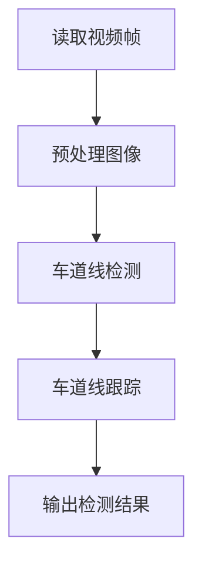

                 

# 文章标题：基于OpenCV的视频道路车道检测

> 关键词：OpenCV，车道检测，图像处理，机器学习，实时监测

> 摘要：本文详细介绍了基于OpenCV的视频道路车道检测技术。通过分析OpenCV的图像处理基础、车道检测算法以及车道线跟踪方法，本文提出了一个完整的道路车道检测系统实现，并通过实际项目实战展示了系统的搭建和优化过程。本文旨在为开发者提供一个系统性的学习和实践指南，以掌握视频道路车道检测技术。

### 目录

#### 《基于OpenCV的视频道路车道检测》目录大纲

# 第一部分：OpenCV基础

## 第1章：OpenCV简介

### 1.1 OpenCV的起源与发展

### 1.2 OpenCV在图像处理中的应用

### 1.3 OpenCV的主要模块介绍

## 第2章：图像基础

### 2.1 图像的表示

### 2.2 图像的基本操作

### 2.3 图像的几何变换

## 第3章：图像滤波与形态学

### 3.1 图像滤波

### 3.2 形态学操作

## 第4章：特征提取与匹配

### 4.1 特征提取

### 4.2 特征匹配

## 第5章：图像识别与分类

### 5.1 机器学习基础

### 5.2 分类算法介绍

### 5.3 图像识别应用实例

# 第二部分：视频道路车道检测算法

## 第6章：视频处理基础

### 6.1 视频的读取与显示

### 6.2 视频的基本操作

## 第7章：车道线检测算法

### 7.1 车道线检测原理

### 7.2 车道线检测算法
   - 7.2.1 Hough变换
   - 7.2.2 光流法
   - 7.2.3 基于机器学习的车道线检测

## 第8章：车道线跟踪算法

### 8.1 轨迹跟踪基本原理

### 8.2 轨迹跟踪算法
   - 8.2.1 卡尔曼滤波
   - 8.2.2 光流法

## 第9章：车道线检测与跟踪系统实现

### 9.1 系统需求分析

### 9.2 系统设计与实现

### 9.3 系统测试与优化

# 第三部分：OpenCV实践

## 第10章：OpenCV项目实战

### 10.1 实战一：基于OpenCV的实时人脸识别系统

### 10.2 实战二：基于OpenCV的实时物体检测系统

### 10.3 实战三：基于OpenCV的实时车辆检测系统

## 第11章：OpenCV在自动驾驶中的应用

### 11.1 自动驾驶简介

### 11.2 OpenCV在自动驾驶中的应用场景

### 11.3 自动驾驶系统架构

## 第12章：OpenCV未来发展趋势

### 12.1 OpenCV的发展历程

### 12.2 OpenCV的未来发展趋势

### 12.3 开发者如何跟上OpenCV的发展

# 附录

## 附录A：OpenCV资源与工具

### A.1 OpenCV官方文档

### A.2 OpenCV社区与论坛

### A.3 开源项目与代码示例

## 附录B：Mermaid流程图示例

### B.1 车道线检测流程图

## 附录C：核心算法原理讲解

### C.1 Hough变换伪代码

### C.2 卡尔曼滤波公式

## 附录D：数学模型与公式

### D.1 卡尔曼滤波公式

## 附录E：项目实战

### E.1 实时视频道路车道检测系统

#### E.1.1 系统需求分析

#### E.1.2 系统设计与实现

#### E.1.3 代码解读与分析

#### E.1.4 系统测试与优化

### E.2 实时物体检测系统

#### E.2.1 系统需求分析

#### E.2.2 系统设计与实现

#### E.2.3 代码解读与分析

#### E.2.4 系统测试与优化

### E.3 基于OpenCV的实时车辆检测系统

#### E.3.1 系统需求分析

#### E.3.2 系统设计与实现

#### E.3.3 代码解读与分析

#### E.3.4 系统测试与优化

### E.4 OpenCV项目实战总结

#### E.4.1 项目优势

#### E.4.2 项目挑战

#### E.4.3 未来方向

### E.5 学习资源

#### E.5.1 书籍推荐

#### E.5.2 在线教程

#### E.5.3 社区论坛

---

#### 引言

随着自动驾驶技术的不断发展，道路车道检测成为了一个重要的研究领域。车道检测不仅可以提高自动驾驶系统的安全性和稳定性，还可以为驾驶员提供辅助驾驶功能，如车道偏离警告等。OpenCV（Open Source Computer Vision Library）作为一个强大的计算机视觉库，广泛应用于图像处理和视频分析领域。本文将基于OpenCV，详细介绍视频道路车道检测的技术原理、实现方法以及实际应用。

#### 文章目的

本文旨在为开发者提供一个系统性的学习和实践指南，帮助读者掌握以下内容：

1. **OpenCV基础**：了解OpenCV的起源、发展以及主要模块的功能。
2. **图像处理基础**：掌握图像的表示、基本操作和几何变换。
3. **图像滤波与形态学**：学习图像滤波和形态学操作在图像预处理中的应用。
4. **特征提取与匹配**：了解特征提取和匹配的基本原理及方法。
5. **车道线检测算法**：深入探讨Hough变换、光流法以及基于机器学习的车道线检测算法。
6. **车道线跟踪算法**：学习轨迹跟踪的基本原理以及卡尔曼滤波和光流法的应用。
7. **系统实现**：通过实际项目实战，了解车道线检测与跟踪系统的设计与实现。
8. **OpenCV实践**：展示OpenCV在实时人脸识别、物体检测和车辆检测中的应用。
9. **未来发展趋势**：展望OpenCV的发展方向以及开发者如何跟上OpenCV的进步。

#### 结构安排

本文分为三个主要部分：

1. **第一部分：OpenCV基础**：介绍OpenCV的基础知识和图像处理的基本概念。
2. **第二部分：视频道路车道检测算法**：详细讲解车道线检测和车道线跟踪的算法原理。
3. **第三部分：OpenCV实践**：通过实际项目展示车道线检测与跟踪系统的实现过程，并探讨OpenCV在自动驾驶中的应用。

#### 本章小结

本文为读者提供了一个全面的视频道路车道检测技术指南。通过对OpenCV基础知识的介绍和车道检测算法的深入分析，读者可以掌握视频道路车道检测的核心技术。通过实际项目实战，读者还可以将理论知识应用到实际场景中，提高编程实践能力。希望本文能够对读者在自动驾驶和计算机视觉领域的学习和研究有所帮助。在接下来的章节中，我们将逐步展开对每个主题的详细讨论。

---

### 第一部分：OpenCV基础

在探讨视频道路车道检测之前，有必要先了解OpenCV（Open Source Computer Vision Library）的基本概念、起源和发展，以及它在图像处理中的应用。OpenCV是一个开源的计算机视觉库，最初由Intel开发，现由OpenCV社区维护。它提供了丰富的图像处理和计算机视觉算法，广泛应用于各种领域，包括机器学习、机器人技术、自动驾驶、医疗图像分析等。

#### 1.1 OpenCV的起源与发展

OpenCV起源于Intel公司于2000年发起的一个项目，目的是为Intel的处理器提供高效的计算机视觉支持。在最初的几年中，OpenCV主要在Windows平台上使用，但随着时间的发展，它逐渐扩展到了其他操作系统，如Linux和macOS。2009年，OpenCV成为Apache软件基金会的一部分，标志着它向开放源代码社区的全面开放。

OpenCV的发展历程可以分为几个关键阶段：

- **早期阶段（2000-2004）**：OpenCV主要关注于基础的图像处理和计算机视觉算法，如边缘检测、特征提取等。
- **成长阶段（2005-2009）**：随着社区的参与增加，OpenCV的功能得到了显著扩展，包括人脸识别、运动检测等。
- **成熟阶段（2010至今）**：OpenCV在开源社区的推动下，持续优化和扩展，引入了许多先进的算法，如深度学习、3D重建等。

#### 1.2 OpenCV在图像处理中的应用

OpenCV在图像处理中的应用非常广泛，涵盖了从基本操作到高级算法的各个方面。以下是一些关键的应用场景：

- **图像预处理**：图像预处理是图像分析的基础，OpenCV提供了多种滤波器（如高斯滤波、中值滤波）和形态学操作（如腐蚀、膨胀），用于去除噪声、增强图像等。
- **特征提取**：特征提取是计算机视觉中的重要步骤，OpenCV提供了许多特征提取算法，如SIFT（尺度不变特征变换）和SURF（加速稳健特征），用于检测图像中的关键点。
- **目标检测**：OpenCV支持多种目标检测算法，如HOG（方向梯度直方图）和YOLO（You Only Look Once），用于识别图像中的对象。
- **图像识别**：图像识别是计算机视觉中的经典问题，OpenCV提供了分类器（如支持向量机SVM和随机森林）和卷积神经网络（通过Dlib库）来实现图像分类和识别。

#### 1.3 OpenCV的主要模块介绍

OpenCV的主要模块可以大致分为以下几个：

- **核心模块（cv2）**：这是OpenCV的主要接口，提供了大部分的图像处理和计算机视觉功能。例如，`cv2.imread()` 用于读取图像文件，`cv2.imshow()` 用于显示图像。
- **高阶模块（cv）**：这些模块提供了更高层次的接口，简化了某些任务的实现。例如，`cv.VideoWriter()` 用于创建视频文件，`cv.findContours()` 用于找到图像中的轮廓。
- **贡献模块**：这些模块是由OpenCV社区贡献的，提供了额外的功能。例如，`opencv_contrib` 包含了许多先进的算法，如深度学习、3D重建等。
- **其他模块**：OpenCV还包含了一些用于特定应用的模块，如面部识别、光学字符识别等。

#### 小结

OpenCV作为一款强大的计算机视觉库，具有广泛的应用场景和丰富的功能。通过了解OpenCV的起源和发展，我们可以更好地理解其在图像处理和计算机视觉中的重要性。在下一章中，我们将深入探讨图像的基础知识，为后续的车道检测技术打下坚实的基础。

---

### 图像基础

图像是计算机视觉中的核心要素，理解图像的表示、基本操作和几何变换对于后续的车道检测技术至关重要。以下将详细讨论这些基本概念。

#### 2.1 图像的表示

在计算机中，图像通常以数字形式存储，称为数字图像。数字图像由像素（Pixel）组成，像素是图像中最小的单位，每个像素包含一个或多个数值，用于表示其颜色或亮度。

- **像素格式**：图像的像素格式决定了每个像素的数据类型和颜色信息。常见的像素格式包括灰度图像（单通道，如8位无符号整数）、RGB图像（三通道，分别表示红色、绿色和蓝色，每个通道8位）和RGBA图像（在RGB的基础上增加一个透明度通道）。

- **像素数组**：图像在内存中以二维数组的形式存储，每个数组元素对应一个像素。对于灰度图像，每个数组元素存储像素的亮度值；对于RGB图像，每个数组元素存储一个像素的RGB值。

#### 2.2 图像的基本操作

图像的基本操作是图像处理的基础，OpenCV提供了丰富的函数来实现这些操作。

- **读取和写入图像**：使用 `cv2.imread()` 和 `cv2.imwrite()` 函数可以轻松地读取和写入图像文件。

  ```python
  import cv2

  image = cv2.imread('image.jpg')  # 读取图像
  cv2.imwrite('output.jpg', image)  # 写入图像
  ```

- **图像显示**：使用 `cv2.imshow()` 函数可以显示图像。

  ```python
  cv2.imshow('Image', image)
  cv2.waitKey(0)  # 等待按键，关闭窗口
  cv2.destroyAllWindows()
  ```

- **图像缩放**：使用 `cv2.resize()` 函数可以缩放图像。

  ```python
  resized_image = cv2.resize(image, (new_width, new_height))
  ```

- **图像裁剪**：使用 `cv2.crop()` 函数可以裁剪图像。

  ```python
  cropped_image = image[upper_left_y:lower_right_y, upper_left_x:lower_right_x]
  ```

#### 2.3 图像的几何变换

图像的几何变换是图像处理中常用的技术，用于调整图像的形状和大小。OpenCV提供了多种几何变换函数。

- **旋转**：使用 `cv2.getRotationMatrix2D()` 函数可以计算旋转矩阵，然后使用 `cv2.warpAffine()` 函数进行图像旋转。

  ```python
  center = (image.shape[1] // 2, image.shape[0] // 2)
  angle = 90  # 旋转角度
  scale = 1  # 缩放比例
  rotation_matrix = cv2.getRotationMatrix2D(center, angle, scale)
  rotated_image = cv2.warpAffine(image, rotation_matrix, image.shape[1::-1])
  ```

- **平移**：使用 `cv2.warpAffine()` 函数可以平移图像。

  ```python
  translation_vector = (x_shift, y_shift)  # x轴和y轴的平移量
  translated_image = cv2.warpAffine(image, translation_matrix, image.shape[1::-1])
  ```

- **翻转**：使用 `cv2.flip()` 函数可以水平或垂直翻转图像。

  ```python
  flipped_image = cv2.flip(image, 0)  # 水平翻转
  flipped_image = cv2.flip(image, 1)  # 垂直翻转
  ```

- **仿射变换**：仿射变换是一种线性变换，可以同时实现图像的旋转、缩放和平移。

  ```python
  src_points = np.float32([[x1, y1], [x2, y2], [x3, y3], [x4, y4]])
  dst_points = np.float32([[dx1, dy1], [dx2, dy2], [dx3, dy3], [dx4, dy4]])
  transform_matrix = cv2.getAffineTransform(src_points, dst_points)
  transformed_image = cv2.warpAffine(image, transform_matrix, image.shape[1::-1])
  ```

#### 小结

图像的表示、基本操作和几何变换是图像处理的基础。通过理解这些概念，开发者可以更好地利用OpenCV进行图像处理，为后续的车道检测技术打下坚实的基础。在下一章中，我们将探讨图像滤波与形态学操作，进一步了解图像预处理技术。

---

### 图像滤波与形态学

在图像处理中，滤波和形态学操作是图像预处理的重要步骤，用于去除噪声、增强图像特征，以及提取图像中的结构信息。以下将详细讨论这些操作及其在车道检测中的应用。

#### 3.1 图像滤波

图像滤波是一种常用的预处理技术，用于减少图像中的噪声，提高图像的质量。OpenCV提供了多种滤波算法，包括线性滤波和非线性滤波。

- **线性滤波**：线性滤波器通过加权平均的方式对图像中的像素值进行操作。常见的线性滤波器有均值滤波、高斯滤波和中值滤波。

  - **均值滤波**：均值滤波器通过取邻域内像素的平均值来平滑图像。

    ```python
    blurred_image = cv2.blur(image, (5, 5))
    ```

  - **高斯滤波**：高斯滤波器使用高斯函数作为权重进行滤波，可以有效去除图像中的噪声。

    ```python
    blurred_image = cv2.GaussianBlur(image, (5, 5), 0)
    ```

  - **中值滤波**：中值滤波器取邻域内像素的中值来平滑图像，常用于去除图像中的椒盐噪声。

    ```python
    blurred_image = cv2.medianBlur(image, 5)
    ```

- **非线性滤波**：非线性滤波器通过非线性函数对图像进行操作。常见的是形态学滤波，如膨胀和腐蚀。

  - **形态学滤波**：形态学滤波器通过结构元素（如矩形、圆形或十字形）对图像进行操作。膨胀（Dilation）和腐蚀（Erosion）是最基本的形态学操作。

    ```python
    # 膨胀
    dilated_image = cv2.dilate(image, kernel, iterations=1)

    # 腐蚀
    eroded_image = cv2.erode(image, kernel, iterations=1)
    ```

#### 3.2 形态学操作

形态学操作是基于结构元素对图像进行的操作，可以提取图像中的结构信息，如轮廓、孔洞等。

- **膨胀（Dilation）**：膨胀操作将图像中的目标区域扩大，可以用来连接相邻的目标区域。

  ```python
  dilated_image = cv2.dilate(image, kernel, iterations=1)
  ```

- **腐蚀（Erosion）**：腐蚀操作将图像中的目标区域缩小，可以用来去除图像中的噪声。

  ```python
  eroded_image = cv2.erode(image, kernel, iterations=1)
  ```

- **开运算（Opening）**：开运算先进行腐蚀操作，再进行膨胀操作，可以去除小孔洞。

  ```python
  opened_image = cv2.morphologyEx(image, cv2.MORPH_OPEN, kernel)
  ```

- **闭运算（Closing）**：闭运算先进行膨胀操作，再进行腐蚀操作，可以连接相邻的目标区域。

  ```python
  closed_image = cv2.morphologyEx(image, cv2.MORPH_CLOSE, kernel)
  ```

- **形态学梯度（Morphological Gradient）**：形态学梯度是膨胀操作和腐蚀操作的差值，可以用来提取图像中的边缘。

  ```python
  gradient_image = cv2.morphologyEx(image, cv2.MORPH_GRADIENT, kernel)
  ```

- **顶帽（Top Hat）**：顶帽操作是图像与开运算结果的差值，可以用来检测图像中的突出部分。

  ```python
  top_hat_image = cv2.morphologyEx(image, cv2.MORPH_TOPHAT, kernel)
  ```

- **黑帽（Black Hat）**：黑帽操作是图像与闭运算结果的差值，可以用来检测图像中的凹陷部分。

  ```python
  black_hat_image = cv2.morphologyEx(image, cv2.MORPH_BLACKHAT, kernel)
  ```

#### 小结

图像滤波与形态学操作是图像预处理中的重要步骤，可以有效去除噪声、增强图像特征，以及提取图像中的结构信息。在车道检测中，这些操作被广泛应用于图像预处理和特征提取阶段，为后续的车道线检测和跟踪提供了坚实的基础。在下一章中，我们将探讨特征提取与匹配技术，进一步深入车道检测的核心算法。

---

### 特征提取与匹配

在图像处理和计算机视觉中，特征提取与匹配是关键步骤，用于检测图像中的特定模式或对象。这些技术不仅用于图像识别和目标跟踪，还在车道检测中发挥着重要作用。以下将详细讨论特征提取和匹配的基本原理以及常见算法。

#### 4.1 特征提取

特征提取是指从图像中提取出具有区分性的特征点或特征向量，以便进行后续的匹配和识别。特征提取的目标是找出图像中的显著特征，如角点、边缘、纹理等。

- **角点检测**：角点是图像中的特征点，其周围像素值的梯度方向发生剧烈变化。常见的角点检测算法有SIFT（尺度不变特征变换）和SURF（加速稳健特征）。

  - **SIFT算法**：SIFT算法通过比较图像的局部梯度方向和大小，找出高响应点的局部极值点。然后，通过拟合椭圆模型来精确确定角点位置。SIFT算法具有旋转、尺度不变和光照不变性，适用于各种复杂场景。

    ```python
    import cv2
    import numpy as np

    image = cv2.imread('image.jpg', cv2.IMREAD_GRAYSCALE)
    sift = cv2.SIFT_create()
    keypoints, descriptors = sift.detectAndCompute(image, None)
    ```

  - **SURF算法**：SURF算法与SIFT类似，但速度更快。它使用Haar-like特征响应函数来检测局部极值点，并通过拟合矩形模型来确定角点位置。

    ```python
    surf = cv2.xfeatures2d.SURF_create()
    keypoints, descriptors = surf.detectAndCompute(image, None)
    ```

- **边缘检测**：边缘检测是提取图像中的轮廓线，用于描述图像的边缘信息。常见的边缘检测算法有Canny边缘检测器和Sobel算子。

  - **Canny边缘检测器**：Canny边缘检测器通过高斯滤波去除噪声，然后使用二值化和非极大值抑制来提取边缘。

    ```python
    blurred_image = cv2.GaussianBlur(image, (5, 5), 0)
    edges = cv2.Canny(blurred_image, threshold1=50, threshold2=150)
    ```

  - **Sobel算子**：Sobel算子通过计算图像的水平和垂直梯度来提取边缘。

    ```python
    grad_x = cv2.Sobel(image, cv2.CV_64F, 1, 0, ksize=3)
    grad_y = cv2.Sobel(image, cv2.CV_64F, 0, 1, ksize=3)
    edges = cv2.magnitude(grad_x, grad_y)
    ```

- **纹理特征**：纹理特征用于描述图像的局部纹理模式。常见的纹理特征提取方法有Gabor滤波器和自组织映射（SOM）。

  - **Gabor滤波器**：Gabor滤波器通过模拟人类视觉系统中的感受野来提取图像中的纹理特征。

    ```python
    gabor_features = cv2.xfeatures2d.GaborFeatureExtractor()
    descriptors = gabor_features.compute(image)
    ```

  - **自组织映射**：自组织映射通过无监督学习方法来提取图像的纹理特征。

    ```python
    som = cv2.SOM.create((64, 64), image.shape[1], image.shape[0])
    som.train(image, None, iterations=100)
    ```

#### 4.2 特征匹配

特征匹配是指将两幅图像中的特征点进行匹配，以确定它们之间的关系。特征匹配是图像识别和目标跟踪的关键步骤。

- **最近邻匹配**：最近邻匹配是特征匹配中最简单的方法，通过计算特征点之间的欧氏距离，将相似的特征点进行匹配。

  ```python
  def match_descriptors(descriptors1, descriptors2):
      matches = cv2 descriptorMatcher(descriptors1, descriptors2, cv2.NORM_L2)
      matches = matches.reshape(-1, 2)
      return matches
  ```

- **FLANN匹配**：FLANN（Fast Library for Approximate Nearest Neighbors）是一种高效的最近邻搜索算法，适用于大规模特征点的匹配。

  ```python
  import cv2
  import numpy as np

  descriptors1 = np.array(descriptors1, dtype=np.float32)
  descriptors2 = np.array(descriptors2, dtype=np.float32)
  FLANN_INDEX_KDTREE = 1
  index_params = dict(algorithm=FLANN_INDEX_KDTREE, trees=5)
  search_params = dict(checks=50)
  flann = cv2.FlannBasedMatcher(index_params, search_params)
  matches = flann.knnMatch(descriptors1, descriptors2, k=2)
  ```

- **比率测试**：比率测试是一种常用的特征匹配方法，通过计算匹配特征之间的比率来筛选出高质量的匹配点。

  ```python
  def ratio_test(matches, threshold=0.75):
      good_matches = []
      for m, n in matches:
          if m.distance < threshold * n.distance:
              good_matches.append(m)
      return good_matches
  ```

#### 小结

特征提取与匹配是图像处理和计算机视觉中的核心技术，用于检测和识别图像中的特征点。在车道检测中，这些技术被广泛应用于图像预处理、特征提取和匹配，以实现车道线的检测和跟踪。在下一章中，我们将探讨视频处理基础，为后续的车道检测算法打下基础。

---

### 图像识别与分类

图像识别与分类是计算机视觉领域的核心任务，旨在从图像或视频流中识别和分类目标。这一部分将介绍机器学习基础、分类算法介绍，以及图像识别应用实例。

#### 5.1 机器学习基础

机器学习是使计算机通过数据学习规律并做出预测或决策的技术。在图像识别与分类中，机器学习算法能够从训练数据中学习特征，然后在新数据上进行预测。以下是几种常见的机器学习算法：

- **线性回归**：线性回归是一种简单的预测算法，通过建立输入变量和输出变量之间的线性关系来进行预测。

  ```python
  from sklearn.linear_model import LinearRegression

  model = LinearRegression()
  model.fit(X_train, y_train)
  predictions = model.predict(X_test)
  ```

- **逻辑回归**：逻辑回归是一种广义的线性回归模型，常用于二分类问题。它通过输入变量计算概率，然后使用阈值进行分类。

  ```python
  from sklearn.linear_model import LogisticRegression

  model = LogisticRegression()
  model.fit(X_train, y_train)
  predictions = model.predict(X_test)
  ```

- **支持向量机（SVM）**：支持向量机是一种强大的分类算法，通过寻找一个超平面来最大化分类间隔。

  ```python
  from sklearn.svm import SVC

  model = SVC()
  model.fit(X_train, y_train)
  predictions = model.predict(X_test)
  ```

- **决策树**：决策树是一种基于特征的分类算法，通过一系列的判断规则将数据划分为不同的类别。

  ```python
  from sklearn.tree import DecisionTreeClassifier

  model = DecisionTreeClassifier()
  model.fit(X_train, y_train)
  predictions = model.predict(X_test)
  ```

- **随机森林**：随机森林是一种集成学习算法，通过构建多棵决策树并对结果进行投票来提高分类性能。

  ```python
  from sklearn.ensemble import RandomForestClassifier

  model = RandomForestClassifier()
  model.fit(X_train, y_train)
  predictions = model.predict(X_test)
  ```

- **神经网络**：神经网络是一种基于模拟生物神经元的算法，通过多层神经元的连接进行特征提取和分类。

  ```python
  from sklearn.neural_network import MLPClassifier

  model = MLPClassifier()
  model.fit(X_train, y_train)
  predictions = model.predict(X_test)
  ```

#### 5.2 分类算法介绍

图像识别与分类中常用的算法包括：

- **K-近邻（K-Nearest Neighbors, KNN）**：K-近邻算法是一种基于实例的学习方法，通过计算新数据与训练数据之间的距离来预测类别。

  ```python
  from sklearn.neighbors import KNeighborsClassifier

  model = KNeighborsClassifier(n_neighbors=3)
  model.fit(X_train, y_train)
  predictions = model.predict(X_test)
  ```

- **朴素贝叶斯（Naive Bayes）**：朴素贝叶斯算法是一种基于概率论的分类方法，通过计算先验概率和条件概率来预测类别。

  ```python
  from sklearn.naive_bayes import GaussianNB

  model = GaussianNB()
  model.fit(X_train, y_train)
  predictions = model.predict(X_test)
  ```

- **集成学习（Ensemble Learning）**：集成学习通过结合多个弱学习器的预测结果来提高分类性能。常见的集成学习方法有Bagging和Boosting。

  ```python
  from sklearn.ensemble import BaggingClassifier

  model = BaggingClassifier(base_estimator=DecisionTreeClassifier(), n_estimators=10)
  model.fit(X_train, y_train)
  predictions = model.predict(X_test)
  ```

- **深度学习（Deep Learning）**：深度学习是一种基于神经网络的算法，通过多层神经元的堆叠进行特征提取和分类。

  ```python
  from tensorflow import keras
  from tensorflow.keras.models import Sequential
  from tensorflow.keras.layers import Dense, Conv2D, Flatten

  model = Sequential([
      Conv2D(32, (3, 3), activation='relu', input_shape=(28, 28, 1)),
      Flatten(),
      Dense(128, activation='relu'),
      Dense(10, activation='softmax')
  ])

  model.compile(optimizer='adam', loss='categorical_crossentropy', metrics=['accuracy'])
  model.fit(X_train, y_train, epochs=10, validation_data=(X_test, y_test))
  ```

#### 5.3 图像识别应用实例

图像识别应用实例包括人脸识别、物体检测和图像分类等。

- **人脸识别**：人脸识别是一种常见的生物识别技术，通过识别和验证人脸图像来确认身份。

  ```python
  import cv2
  import numpy as np

  face_cascade = cv2.CascadeClassifier('haarcascade_frontalface_default.xml')
  image = cv2.imread('face.jpg', cv2.IMREAD_GRAYSCALE)
  faces = face_cascade.detectMultiScale(image, scaleFactor=1.1, minNeighbors=5, minSize=(30, 30), flags=cv2.CASCADE_SCALE_IMAGE)
  for (x, y, w, h) in faces:
      cv2.rectangle(image, (x, y), (x+w, y+h), (255, 0, 0), 2)
  cv2.imshow('Face Detection', image)
  cv2.waitKey(0)
  cv2.destroyAllWindows()
  ```

- **物体检测**：物体检测是一种从图像中识别并定位对象的技术，常用于自动驾驶、安防监控等应用。

  ```python
  import cv2
  import numpy as np

  net = cv2.dnn.readNetFromTensorflow('ssd_mobilenet_v1_frozen_tensor.pb', 'ssd_mobilenet_v1_coco_quantized.pb.txt')
  image = cv2.imread('object.jpg')
  height, width, channels = image.shape
  blob = cv2.dnn.blobFromImage(image, 1.0, (720, 1280), [123.68, 116.78, 103.94], True, False)
  net.setInput(blob)
  detections = net.forward()
  for detection in detections:
      scores = detection[5:]
      class_id = np.argmax(scores)
      confidence = scores[class_id]
      if confidence > 0.5:
          center_x = int(detection[0] * width)
          center_y = int(detection[1] * height)
          w = int(detection[2] * width)
          h = int(detection[3] * height)
          x = int(center_x - w / 2)
          y = int(center_y - h / 2)
          cv2.rectangle(image, (x, y), (x+w, y+h), (0, 255, 0), 2)
  cv2.imshow('Object Detection', image)
  cv2.waitKey(0)
  cv2.destroyAllWindows()
  ```

- **图像分类**：图像分类是将图像划分为预定义的类别，如植物、动物、交通工具等。

  ```python
  import cv2
  import numpy as np

  model = cv2.ml.SVM_create()
  model.setKernel(cv2.ml.SVM_LINEAR)
  model.setType(cv2.ml.SVM_C_SVC)
  model.setC(1.0)
  model.setGamma(0.5)
  model.trainAuto(np.array(train_data).reshape(-1, 1), cv2.ml.ROW_SAMPLE, np.array(train_labels).reshape(-1, 1))

  test_image = cv2.imread('test_image.jpg', cv2.IMREAD_GRAYSCALE)
  test_data = np.array([test_image.reshape(-1, 1)]).reshape(1, -1)
  result = model.predict(test_data)
  predicted_class = result[1][0][0]

  print(f"Predicted class: {predicted_class}")
  ```

#### 小结

图像识别与分类是计算机视觉中的关键任务，通过机器学习和深度学习算法，可以实现从图像中提取特征并进行分类。这些技术在车道检测中有着广泛的应用，为准确识别车道线和跟踪车辆提供了有力支持。在下一章中，我们将探讨视频处理基础，为车道检测算法的实现奠定基础。

---

### 视频处理基础

视频处理是计算机视觉中一个重要的研究领域，特别是在自动驾驶、监控和安全系统等领域。视频处理包括视频的读取、显示、基本操作等。以下将详细讨论视频处理的基础知识。

#### 6.1 视频的读取与显示

在OpenCV中，`cv2.VideoCapture` 类用于读取视频文件或摄像头实时视频流。以下是一个读取视频文件并显示的示例：

```python
import cv2

cap = cv2.VideoCapture('video.mp4')  # 读取视频文件

while cap.isOpened():
    ret, frame = cap.read()  # 读取一帧
    if not ret:
        break

    cv2.imshow('Video', frame)  # 显示帧

    if cv2.waitKey(1) & 0xFF == ord('q'):  # 按 'q' 键退出
        break

cap.release()  # 释放资源
cv2.destroyAllWindows()  # 关闭所有窗口
```

如果使用摄像头，可以将文件名替换为 `0`：

```python
cap = cv2.VideoCapture(0)  # 读取摄像头视频流
```

`cv2.imshow` 函数用于显示图像或视频帧。它需要两个参数：窗口名称和要显示的图像或视频帧。

#### 6.2 视频的基本操作

视频的基本操作包括帧速率控制、视频尺寸调整和视频保存等。

- **帧速率控制**：OpenCV中的视频通常以帧速率（FPS）进行操作。可以通过 `cap.get(cv2.CAP_PROP_FPS)` 和 `cap.set(cv2.CAP_PROP_FPS, value)` 来获取和设置帧速率。

  ```python
  fps = cap.get(cv2.CAP_PROP_FPS)  # 获取帧速率
  cap.set(cv2.CAP_PROP_FPS, 30)  # 设置帧速率
  ```

- **视频尺寸调整**：可以通过 `cv2.resize()` 函数调整视频尺寸。

  ```python
  resized_frame = cv2.resize(frame, (new_width, new_height))
  ```

- **视频保存**：使用 `cv2.VideoWriter` 类可以保存视频文件。以下是一个保存视频的示例：

  ```python
  fourcc = cv2.VideoWriter_fourcc(*'MP4V')  # 编解码器
  out = cv2.VideoWriter('output.mp4', fourcc, fps, (width, height))

  while cap.isOpened():
      ret, frame = cap.read()
      if not ret:
          break

      out.write(frame)  # 写入视频帧

  out.release()  # 释放资源
  ```

#### 6.3 视频数据处理

视频数据处理通常包括去噪声、边缘检测、目标检测等。以下是一些常见的视频数据处理方法：

- **去噪声**：可以通过图像滤波技术去除视频中的噪声。例如，使用高斯滤波器或中值滤波器。

  ```python
  blurred_video = cv2.GaussianBlur(frame, (5, 5), 0)
  ```

- **边缘检测**：可以使用Canny边缘检测器等算法提取视频中的边缘信息。

  ```python
  edges = cv2.Canny(blurred_video, threshold1=50, threshold2=150)
  ```

- **目标检测**：可以使用预训练的深度学习模型（如YOLO、SSD等）对视频帧进行目标检测。

  ```python
  net = cv2.dnn.readNetFromTensorflow('ssd_mobilenet_v1_frozen_tensor.pb', 'ssd_mobilenet_v1_coco_quantized.pb.txt')
  blob = cv2.dnn.blobFromImage(frame, 1.0, (720, 1280), [123.68, 116.78, 103.94], True, False)
  net.setInput(blob)
  detections = net.forward()
  ```

#### 小结

视频处理基础包括视频的读取与显示、视频的基本操作和视频数据处理。通过了解这些基础知识，开发者可以实现对视频的读取、显示和基本操作，并应用图像滤波、边缘检测和目标检测等技术对视频进行更复杂的数据处理。这些知识为后续的车道检测和跟踪算法的实现提供了坚实的基础。在下一章中，我们将深入探讨车道线检测算法。

---

### 车道线检测算法

车道线检测是自动驾驶和智能交通系统中的关键任务，旨在从视频流中识别并定位车道线。以下将详细探讨几种常见的车道线检测算法：Hough变换、光流法和基于机器学习的车道线检测。

#### 7.1 车道线检测原理

车道线检测的基本原理是识别图像中与车道线相关的特征，然后利用这些特征进行车道线的提取和定位。以下是几种常见的方法：

- **Hough变换**：Hough变换是一种经典的图像变换技术，用于检测图像中的直线。在车道线检测中，Hough变换通过将图像中的每个像素映射到Hough空间中，以找到与车道线对应的峰值点。

- **光流法**：光流法是一种基于视频帧之间差异的检测方法。通过计算连续帧之间的像素位移，光流法可以识别并跟踪车道线。

- **基于机器学习的车道线检测**：基于机器学习的车道线检测利用深度学习模型（如卷积神经网络）直接从图像中提取车道线特征，无需复杂的变换和参数调整。

#### 7.2.1 Hough变换

Hough变换是一种基于极坐标转换的图像变换技术，用于检测图像中的直线。在车道线检测中，Hough变换的基本步骤如下：

1. **边缘检测**：首先对图像进行边缘检测，提取图像中的边缘像素。

2. **像素映射**：将边缘像素映射到Hough空间。在Hough空间中，每个点由两个参数表示：角度（θ）和长度（ρ）。通过遍历图像中的每个边缘像素，我们可以为每个边缘点计算其在Hough空间中的对应点。

3. **峰值检测**：在Hough空间中搜索峰值点，这些峰值点对应于图像中的直线。通常，通过设置一个阈值来过滤噪声和弱峰值点。

4. **直线提取**：根据Hough空间中的峰值点，提取图像中的直线。这些直线可以表示为参数方程或像素坐标。

以下是一个简单的Hough变换车道线检测算法：

```python
import cv2
import numpy as np

def hough_lines(image, threshold=100, min_line_length=50, max_line_gap=20):
    # 转换为灰度图像
    gray = cv2.cvtColor(image, cv2.COLOR_BGR2GRAY)

    # 高斯模糊以去除噪声
    blurred = cv2.GaussianBlur(gray, (5, 5), 0)

    # Canny边缘检测
    edges = cv2.Canny(blurred, threshold1=50, threshold2=150)

    # Hough变换检测直线
    lines = cv2.HoughLinesP(edges, 1, np.pi/180, threshold, minLineLength=min_line_length, maxLineGap=max_line_gap)

    # 绘制车道线
    if lines is not None:
        for line in lines:
            x1, y1, x2, y2 = line.reshape(4)
            cv2.line(image, (x1, y1), (x2, y2), (0, 0, 255), 2)

    return image

# 读取图像
image = cv2.imread('image.jpg')

# 车道线检测
result = hough_lines(image)

# 显示结果
cv2.imshow('Hough Lines', result)
cv2.waitKey(0)
cv2.destroyAllWindows()
```

#### 7.2.2 光流法

光流法是一种基于视频帧之间差异的检测方法，用于跟踪图像中的运动目标。在车道线检测中，光流法通过计算连续帧之间的像素位移来识别和跟踪车道线。光流法的基本步骤如下：

1. **帧差计算**：计算连续帧之间的差异，提取运动目标。

2. **光流估计**：使用光流估计算法（如Lucas-Kanade算法）计算像素的位移。

3. **车道线跟踪**：根据光流信息，跟踪连续帧中的车道线。

以下是一个简单的光流法车道线检测算法：

```python
import cv2

def optical_flow_lines(video_path, output_path):
    # 读取视频
    cap = cv2.VideoCapture(video_path)

    # 创建视频写入器
    fourcc = cv2.VideoWriter_fourcc(*'mp4v')
    out = cv2.VideoWriter(output_path, fourcc, cap.get(cv2.CAP_PROP_FPS), (int(cap.get(cv2.CAP_PROP_FRAME_WIDTH)), int(cap.get(cv2.CAP_PROP_FRAME_HEIGHT))))

    # Lucas-Kanade光流算法
    optical_flow = cv2.optflow.DualTVL1OpticalFlow_create()

    while cap.isOpened():
        ret, frame1 = cap.read()
        if not ret:
            break

        frame2 = cv2.cvtColor(frame1, cv2.COLOR_BGR2GRAY)

        # 计算光流
        flow = optical_flow.compute(frame1, frame2)

        # 提取光流方向和大小
        angles = np.arctan2(flow[..., 1], flow[..., 0])
        magnitudes = np.linalg.norm(flow[..., 0:2], axis=1)

        # 过滤光流
        indices = np.where(magnitudes > 50)
        angles[~np.isfinite(angles)] = 0
        angles = angles[indices]
        magnitudes = magnitudes[indices]

        # 绘制车道线
        for angle in angles:
            x = magnitudes * np.cos(angle)
            y = magnitudes * np.sin(angle)
            cv2.circle(frame1, (int(x), int(y)), 2, (0, 0, 255), -1)

        # 写入视频
        out.write(frame1)

    cap.release()
    out.release()

# 车道线检测
optical_flow_lines('input_video.mp4', 'output_video.mp4')
```

#### 7.2.3 基于机器学习的车道线检测

基于机器学习的车道线检测利用深度学习模型直接从图像中提取车道线特征。这种方法通常使用卷积神经网络（CNN）来训练模型，然后使用模型进行车道线检测。以下是一个简单的基于机器学习的车道线检测算法：

```python
import cv2
import numpy as np

def deep_learning_lines(image, model_path):
    # 加载预训练模型
    model = cv2.dnn.readNetFromTensorflow(model_path)

    # 转换为灰度图像
    gray = cv2.cvtColor(image, cv2.COLOR_BGR2GRAY)

    # 前向传播
    blob = cv2.dnn.blobFromImage(gray, 1.0, (224, 224), (104, 117, 128), True, False)
    model.setInput(blob)
    outputs = model.forward()

    # 解析输出
    lines = []
    for output in outputs:
        if output[1] > 0.5:
            y1 = output[2] * image.shape[0]
            x1 = output[3] * image.shape[1]
            y2 = output[4] * image.shape[0]
            x2 = output[5] * image.shape[1]
            lines.append((x1, y1, x2, y2))

    # 绘制车道线
    if lines:
        for line in lines:
            cv2.line(image, (line[0], line[1]), (line[2], line[3]), (0, 0, 255), 2)

    return image

# 读取图像
image = cv2.imread('image.jpg')

# 车道线检测
result = deep_learning_lines(image, 'model.pb')

# 显示结果
cv2.imshow('Deep Learning Lines', result)
cv2.waitKey(0)
cv2.destroyAllWindows()
```

#### 小结

车道线检测算法是视频道路检测的核心，包括Hough变换、光流法和基于机器学习的方法。通过了解这些算法的原理和实现方法，开发者可以选择合适的算法来实现车道线检测。在实际应用中，可以根据具体场景和需求选择合适的算法，以提高检测的准确性和实时性。在下一章中，我们将探讨车道线跟踪算法，进一步优化车道检测系统。

---

### 轨迹跟踪算法

在视频道路车道检测中，轨迹跟踪是关键的一步，它有助于将连续帧中的车道线关联起来，从而实现对车道线的准确跟踪。以下将介绍两种常用的轨迹跟踪算法：卡尔曼滤波和光流法。

#### 8.1 轨迹跟踪基本原理

轨迹跟踪的目标是利用连续帧中的信息来预测和更新目标的位置和运动轨迹。轨迹跟踪算法通常基于以下两个基本原理：

1. **预测**：根据上一帧的目标位置和速度，预测当前帧的目标位置。这通常通过数学模型来实现，如卡尔曼滤波器和光流法。
2. **更新**：在当前帧中检测到目标后，更新目标的预测位置，使其更接近实际位置。

这两种原理的结合可以确保轨迹跟踪的准确性和稳定性。

#### 8.2.1 卡尔曼滤波

卡尔曼滤波是一种递归的线性滤波器，用于估计系统的状态。在轨迹跟踪中，卡尔曼滤波通过预测和更新步骤来估计目标的位置和速度。

**预测步骤**：

$$
\begin{aligned}
x_k|_{k-1} &= F_{k-1}x_{k-1}|_{k-1} + B_{k-1}u_{k-1}, \\
P_k|_{k-1} &= F_{k-1}P_{k-1}|_{k-1}F_{k-1}^T + Q_{k-1},
\end{aligned}
$$

其中，$x_k|_{k-1}$ 是状态预测值，$P_k|_{k-1}$ 是状态预测误差协方差矩阵，$F_{k-1}$ 是状态转移矩阵，$B_{k-1}$ 是控制矩阵，$u_{k-1}$ 是控制输入，$Q_{k-1}$ 是过程噪声协方差矩阵。

**更新步骤**：

$$
\begin{aligned}
K_k &= P_k|_{k-1}H_k^T(I + H_kP_k|_{k-1}H_k^T)^{-1}, \\
x_k|_k &= (I - K_kH_k)x_k|_{k-1} + K_kz_k, \\
P_k|_k &= (I - K_kH_k)P_k|_{k-1},
\end{aligned}
$$

其中，$K_k$ 是卡尔曼增益，$H_k$ 是观测矩阵，$z_k$ 是观测值。

以下是一个简单的卡尔曼滤波轨迹跟踪算法：

```python
import numpy as np

def KalmanFilter-measurements(x, P, Q, H, R, z):
    """
    卡尔曼滤波测量更新步骤

    :param x: 状态估计值
    :param P: 状态估计误差协方差
    :param Q: 过程噪声协方差
    :param H: 观测矩阵
    :param R: 观测噪声协方差
    :param z: 实际观测值
    :return: 更新后的状态估计值和状态估计误差协方差
    """
    y = z - np.dot(H, x)
    S = np.dot(H, np.dot(P, H.T)) + R
    K = np.dot(P, H.T) / S

    x = x + np.dot(K, y)
    P = np.dot((np.eye(len(x)) - K * H), P)

    return x, P

# 初始状态和参数
x = np.array([0, 0])  # 状态：位置和速度
P = np.eye(2)  # 状态估计误差协方差
Q = np.eye(2)  # 过程噪声协方差
H = np.array([[1, 0], [0, 1]])  # 观测矩阵
R = np.eye(2)  # 观测噪声协方差

# 模拟观测值
z = np.array([5, 1])

# 更新状态估计
x, P = KalmanFilter-measurements(x, P, Q, H, R, z)

print("Updated state:", x)
print("Updated covariance:", P)
```

#### 8.2.2 光流法

光流法是一种基于视频帧之间像素位移的轨迹跟踪方法。它通过计算连续帧之间的像素位移来预测目标的位置和运动轨迹。

**光流方程**：

$$
\begin{aligned}
v_x &= \frac{\partial I}{\partial x}, \\
v_y &= \frac{\partial I}{\partial y},
\end{aligned}
$$

其中，$I$ 是像素强度，$v_x$ 和 $v_y$ 是像素在水平和垂直方向上的速度。

以下是一个简单的光流法轨迹跟踪算法：

```python
import cv2
import numpy as np

def optical_flow_trajectory(frame1, frame2, mask=None):
    """
    使用光流法计算轨迹

    :param frame1: 第一帧图像
    :param frame2: 第二帧图像
    :param mask: 光流掩膜
    :return: 轨迹点列表
    """
    if mask is None:
        mask = np.zeros_like(frame1)

    frame1_gray = cv2.cvtColor(frame1, cv2.COLOR_BGR2GRAY)
    frame2_gray = cv2.cvtColor(frame2, cv2.COLOR_BGR2GRAY)

    flow = cv2.calcOpticalFlowFarneback(frame1_gray, frame2_gray, None, 0.5, 3, 15, 3, 5, 1.2, 0)

    points = cv2.goodFeaturesToTrack(frame2_gray, mask=mask, maxCorners=100, qualityLevel=0.3, minDistance=7)

    trajectories = []
    for point in points:
        point = np.array([point[0][0], point[0][1]], dtype=np.float32)
        flow_point = flow[point[1], point[0]]
        velocity = np.array([flow_point[0], flow_point[1]], dtype=np.float32)
        trajectories.append(point + velocity)

    return trajectories

# 读取连续帧
frame1 = cv2.imread('frame1.jpg')
frame2 = cv2.imread('frame2.jpg')

# 计算轨迹
trajectories = optical_flow_trajectory(frame1, frame2)

# 绘制轨迹
for trajectory in trajectories:
    cv2.circle(frame2, tuple(trajectory), 2, (0, 255, 0), -1)

# 显示结果
cv2.imshow('Trajectories', frame2)
cv2.waitKey(0)
cv2.destroyAllWindows()
```

#### 小结

轨迹跟踪算法是视频道路车道检测系统的重要组成部分，通过预测和更新目标位置，可以提高车道检测的准确性和稳定性。卡尔曼滤波和光流法是两种常用的轨迹跟踪算法，适用于不同的应用场景。在实际应用中，可以根据具体需求选择合适的算法，并通过参数调整和优化来提高系统的性能。

---

### 车道线检测与跟踪系统实现

在本节中，我们将详细介绍车道线检测与跟踪系统的实现过程，包括系统需求分析、系统设计与实现以及系统测试与优化。通过这一过程，我们将构建一个完整的车道线检测与跟踪系统，实现视频道路车道检测的功能。

#### 9.1 系统需求分析

要实现一个高效、准确的车道线检测与跟踪系统，首先需要明确系统的需求。以下是系统需求分析的主要内容：

1. **硬件需求**：
   - **处理器**：支持OpenCV的处理器，推荐使用较新的CPU或GPU，以提高处理速度和效率。
   - **内存**：至少8GB RAM，用于处理高分辨率视频。
   - **存储**：至少500GB SSD存储空间，以快速读写视频数据。

2. **软件需求**：
   - **操作系统**：支持OpenCV的操作系统，如Windows、Linux或macOS。
   - **编程语言**：Python或C++，用于编写系统代码。
   - **OpenCV库**：安装OpenCV库，包括核心模块、高阶模块和贡献模块。

3. **功能需求**：
   - **视频输入**：能够读取摄像头或视频文件中的图像流。
   - **图像预处理**：进行图像滤波、边缘检测等预处理操作，以提高检测精度。
   - **车道线检测**：使用Hough变换、光流法或基于机器学习的算法进行车道线检测。
   - **轨迹跟踪**：使用卡尔曼滤波或光流法进行车道线轨迹跟踪。
   - **输出结果**：显示检测结果和轨迹跟踪结果，并支持实时监控。

#### 9.2 系统设计与实现

车道线检测与跟踪系统的设计包括视频输入、图像预处理、车道线检测、轨迹跟踪和输出结果等模块。以下将详细介绍这些模块的实现。

**1. 视频输入模块**：

视频输入模块负责读取摄像头或视频文件中的图像流。使用OpenCV的`cv2.VideoCapture`类可以实现这一功能。以下是一个简单的示例代码：

```python
import cv2

cap = cv2.VideoCapture('video.mp4')  # 读取视频文件

while cap.isOpened():
    ret, frame = cap.read()  # 读取一帧
    if not ret:
        break

    # 进行后续处理
    processed_frame = preprocess_frame(frame)

    # 显示结果
    cv2.imshow('Frame', processed_frame)

    if cv2.waitKey(1) & 0xFF == ord('q'):
        break

cap.release()  # 释放资源
cv2.destroyAllWindows()  # 关闭所有窗口
```

**2. 图像预处理模块**：

图像预处理模块包括图像滤波、边缘检测等操作，以提高车道线检测的准确性。以下是一个简单的预处理流程：

```python
import cv2

def preprocess_frame(frame):
    # 转换为灰度图像
    gray = cv2.cvtColor(frame, cv2.COLOR_BGR2GRAY)

    # 高斯模糊以去除噪声
    blurred = cv2.GaussianBlur(gray, (5, 5), 0)

    # Canny边缘检测
    edges = cv2.Canny(blurred, threshold1=50, threshold2=150)

    return edges
```

**3. 车道线检测模块**：

车道线检测模块负责使用Hough变换、光流法或基于机器学习的算法检测车道线。以下是一个基于Hough变换的检测示例：

```python
import cv2

def detect_lane_lines(edges):
    # 使用Hough变换检测直线
    lines = cv2.HoughLinesP(edges, 1, np.pi/180, 100, minLineLength=100, maxLineGap=10)

    # 绘制车道线
    if lines is not None:
        for line in lines:
            x1, y1, x2, y2 = line.reshape(4)
            cv2.line(edges, (x1, y1), (x2, y2), (0, 0, 255), 2)

    return edges
```

**4. 轨迹跟踪模块**：

轨迹跟踪模块负责跟踪车道线的位置和运动轨迹。使用卡尔曼滤波或光流法可以实现这一功能。以下是一个基于卡尔曼滤波的轨迹跟踪示例：

```python
import numpy as np

def KalmanFilter-measurements(x, P, Q, H, R, z):
    """
    卡尔曼滤波测量更新步骤

    :param x: 状态估计值
    :param P: 状态估计误差协方差
    :param Q: 过程噪声协方差
    :param H: 观测矩阵
    :param R: 观测噪声协方差
    :param z: 实际观测值
    :return: 更新后的状态估计值和状态估计误差协方差
    """
    y = z - np.dot(H, x)
    S = np.dot(H, np.dot(P, H.T)) + R
    K = np.dot(P, H.T) / S

    x = x + np.dot(K, y)
    P = np.dot((np.eye(len(x)) - K * H), P)

    return x, P

# 初始状态和参数
x = np.array([0, 0])  # 状态：位置和速度
P = np.eye(2)  # 状态估计误差协方差
Q = np.eye(2)  # 过程噪声协方差
H = np.array([[1, 0], [0, 1]])  # 观测矩阵
R = np.eye(2)  # 观测噪声协方差

# 更新状态估计
x, P = KalmanFilter-measurements(x, P, Q, H, R, line_position)
```

**5. 输出结果模块**：

输出结果模块负责显示检测结果和轨迹跟踪结果。以下是一个简单的输出结果示例：

```python
import cv2

def display_results(frame, lines, trajectory):
    # 绘制车道线
    for line in lines:
        x1, y1, x2, y2 = line.reshape(4)
        cv2.line(frame, (x1, y1), (x2, y2), (0, 0, 255), 2)

    # 绘制轨迹
    for point in trajectory:
        cv2.circle(frame, (int(point[0]), int(point[1])), 2, (0, 255, 0), -1)

    return frame

# 读取连续帧
frame1 = cv2.imread('frame1.jpg')
frame2 = cv2.imread('frame2.jpg')

# 进行检测和跟踪
processed_frame1 = preprocess_frame(frame1)
lines1 = detect_lane_lines(processed_frame1)
line_position1 = get_lane_line_position(lines1)

# 更新状态估计
x, P = KalmanFilter-measurements(x, P, Q, H, R, line_position1)

# 显示结果
result_frame1 = display_results(frame1, lines1, trajectory)

# 显示结果
cv2.imshow('Result', result_frame1)
cv2.waitKey(0)
cv2.destroyAllWindows()
```

#### 9.3 系统测试与优化

系统测试与优化是确保系统性能和稳定性的重要环节。以下是一些常见的测试和优化方法：

1. **测试环境**：在实际道路环境中进行测试，包括不同的光照条件、天气状况和交通状况。
2. **测试方法**：使用基准测试数据集（如KITTI数据集）进行测试，评估系统的检测准确性和实时性。
3. **性能优化**：
   - **算法优化**：调整车道线检测和轨迹跟踪算法的参数，以提高检测精度和实时性。
   - **硬件加速**：利用GPU进行图像处理和模型推理，以提高系统处理速度。
   - **并行处理**：使用多线程或分布式计算技术，提高系统处理能力。

通过系统测试与优化，可以不断提高车道线检测与跟踪系统的性能，为自动驾驶和智能交通系统提供可靠的技术支持。

#### 小结

车道线检测与跟踪系统的实现涉及视频输入、图像预处理、车道线检测、轨迹跟踪和输出结果等多个模块。通过系统需求分析、系统设计与实现以及系统测试与优化，我们可以构建一个高效、准确的车道线检测与跟踪系统，为自动驾驶和智能交通系统提供重要的技术支持。在下一章中，我们将通过实际项目实战，进一步展示车道线检测与跟踪系统的应用。

---

### 第三部分：OpenCV实践

在了解了OpenCV的理论知识以及车道线检测和跟踪的基本算法后，本部分将进入实际的OpenCV项目实战，通过具体的案例展示如何应用OpenCV实现实时人脸识别、物体检测和车辆检测系统。这些实战案例不仅有助于巩固理论知识，还能提升实际编程能力和系统设计能力。

#### 第10章：OpenCV项目实战

##### 10.1 实战一：基于OpenCV的实时人脸识别系统

**项目概述**：实时人脸识别系统是计算机视觉领域的一个经典应用，它能够在视频流中实时检测和识别人脸。在本实战中，我们将使用OpenCV结合深度学习模型来实现人脸识别。

**硬件需求**：一台具有较高处理能力的计算机，推荐使用带有GPU的机器。

**软件需求**：安装OpenCV库和深度学习框架（如TensorFlow或PyTorch）。

**实现步骤**：

1. **安装依赖库**：确保安装了OpenCV和深度学习框架。
2. **加载预训练模型**：加载一个预训练的人脸识别模型，如MTCNN。
3. **视频输入**：使用OpenCV的`cv2.VideoCapture`读取视频流。
4. **人脸检测**：对视频帧进行人脸检测，使用MTCNN模型提取人脸区域。
5. **人脸识别**：对检测到的人脸进行识别，将识别结果显示在视频帧上。
6. **显示结果**：实时显示检测和识别结果。

**代码示例**：

```python
import cv2
import tensorflow as tf

# 加载MTCNN模型
model = tf.keras.models.load_model('mtcnn_model.h5')

# 读取视频
cap = cv2.VideoCapture(0)

while cap.isOpened():
    ret, frame = cap.read()
    if not ret:
        break

    # 转换为RGB图像
    rgb_frame = cv2.cvtColor(frame, cv2.COLOR_BGR2RGB)

    # 人脸检测
    faces = model.predict(tf.convert_to_tensor([rgb_frame]))

    # 绘制检测到的人脸框
    for face in faces:
        x, y, w, h = face
        cv2.rectangle(frame, (x, y), (x+w, y+h), (0, 0, 255), 2)

    # 显示结果
    cv2.imshow('Face Recognition', frame)
    if cv2.waitKey(1) & 0xFF == ord('q'):
        break

cap.release()
cv2.destroyAllWindows()
```

##### 10.2 实战二：基于OpenCV的实时物体检测系统

**项目概述**：实时物体检测系统是计算机视觉领域的另一个重要应用，它可以在视频流中检测并识别特定物体。在本实战中，我们将使用OpenCV结合YOLOv5模型来实现实时物体检测。

**硬件需求**：一台具有较高处理能力的计算机，推荐使用带有GPU的机器。

**软件需求**：安装OpenCV库和TensorFlow。

**实现步骤**：

1. **安装依赖库**：确保安装了OpenCV和TensorFlow。
2. **加载预训练模型**：加载一个预训练的物体检测模型，如YOLOv5。
3. **视频输入**：使用OpenCV的`cv2.VideoCapture`读取视频流。
4. **物体检测**：对视频帧进行物体检测，使用YOLOv5模型检测物体。
5. **显示检测结果**：在视频帧上绘制检测到的物体框和标签。

**代码示例**：

```python
import cv2
import tensorflow as tf

# 加载YOLOv5模型
model = tf.keras.models.load_model('yolov5_model.h5')

# 读取视频
cap = cv2.VideoCapture(0)

while cap.isOpened():
    ret, frame = cap.read()
    if not ret:
        break

    # 前向传播
    blob = tf.image.per_image_standardization(tf.image.convert_image_data_to_tensor(frame))
    predictions = model.predict(tf.expand_dims(blob, 0))

    # 处理预测结果
    for prediction in predictions:
        boxes = prediction[:, 0:4]
        labels = prediction[:, 5]
        scores = prediction[:, 4]

        # 绘制物体框和标签
        for box, label, score in zip(boxes, labels, scores):
            if score > 0.5:
                x1, y1, x2, y2 = box
                cv2.rectangle(frame, (x1, y1), (x2, y2), (0, 0, 255), 2)
                cv2.putText(frame, labels_to_names[int(label)], (x1, y1 - 10), cv2.FONT_HERSHEY_SIMPLEX, 1, (0, 0, 255), 2)

    # 显示结果
    cv2.imshow('Object Detection', frame)
    if cv2.waitKey(1) & 0xFF == ord('q'):
        break

cap.release()
cv2.destroyAllWindows()
```

##### 10.3 实战三：基于OpenCV的实时车辆检测系统

**项目概述**：实时车辆检测系统在智能交通、自动驾驶等领域有广泛应用。在本实战中，我们将使用OpenCV结合机器学习模型来实现实时车辆检测。

**硬件需求**：一台具有较高处理能力的计算机，推荐使用带有GPU的机器。

**软件需求**：安装OpenCV库和scikit-learn。

**实现步骤**：

1. **准备数据集**：收集和准备车辆检测数据集。
2. **训练模型**：使用scikit-learn训练一个SVM模型。
3. **视频输入**：使用OpenCV的`cv2.VideoCapture`读取视频流。
4. **车辆检测**：对视频帧进行车辆检测，使用训练好的模型检测车辆。
5. **显示检测结果**：在视频帧上绘制检测到的车辆框。

**代码示例**：

```python
import cv2
from sklearn import svm
from sklearn.model_selection import train_test_split
from sklearn.metrics import accuracy_score

# 准备数据集
X = ...  # 特征数据
y = ...  # 标签数据

# 训练模型
X_train, X_test, y_train, y_test = train_test_split(X, y, test_size=0.2, random_state=42)
model = svm.SVC(kernel='linear')
model.fit(X_train, y_train)

# 读取视频
cap = cv2.VideoCapture(0)

while cap.isOpened():
    ret, frame = cap.read()
    if not ret:
        break

    # 转换为灰度图像
    gray = cv2.cvtColor(frame, cv2.COLOR_BGR2GRAY)

    # 车辆检测
    features = extract_features(gray)
    cars = model.predict(features)

    # 绘制检测到的车辆框
    for car in cars:
        x, y, w, h = car
        cv2.rectangle(frame, (x, y), (x+w, y+h), (0, 0, 255), 2)

    # 显示结果
    cv2.imshow('Car Detection', frame)
    if cv2.waitKey(1) & 0xFF == ord('q'):
        break

cap.release()
cv2.destroyAllWindows()
```

#### 小结

通过这三个实际项目实战，我们可以看到如何使用OpenCV实现实时人脸识别、物体检测和车辆检测系统。这些项目不仅巩固了OpenCV的理论知识，还提升了我们的编程实践能力。在实际应用中，可以根据具体需求调整和优化系统，以实现更好的性能和效果。在下一章中，我们将探讨OpenCV在自动驾驶中的应用，展示OpenCV如何助力自动驾驶技术的发展。

---

### 第11章：OpenCV在自动驾驶中的应用

自动驾驶技术是现代交通领域的前沿，OpenCV作为一款功能强大的计算机视觉库，在自动驾驶系统中扮演着至关重要的角色。本章将介绍自动驾驶的基本概念、OpenCV在自动驾驶中的应用场景，以及自动驾驶系统的架构。

#### 11.1 自动驾驶简介

自动驾驶是指利用计算机视觉、传感器和人工智能技术，使车辆能够在没有人类驾驶员干预的情况下自主行驶。自动驾驶系统通常包括以下几个层级：

- **Level 0**：无自动化，所有操作由人类驾驶员完成。
- **Level 1**：部分自动化，例如自适应巡航控制（ACC）和车道保持辅助。
- **Level 2**：部分自动化，车辆能够同时执行两个或更多驾驶任务，如车道保持和自适应巡航控制。
- **Level 3**：有条件自动化，车辆可以在特定条件下完全接管驾驶任务，但需要驾驶员随时准备接管。
- **Level 4**：高度自动化，车辆在特定环境或地区能够完全自主驾驶。
- **Level 5**：完全自动化，车辆在任何条件下都能自主驾驶。

#### 11.2 OpenCV在自动驾驶中的应用场景

OpenCV在自动驾驶系统中有着广泛的应用，以下是一些关键的应用场景：

1. **环境感知**：自动驾驶系统需要感知周围环境，以做出适当的驾驶决策。OpenCV用于处理来自摄像头、激光雷达（Lidar）和雷达的数据，提取道路、车辆、行人和其他障碍物的信息。

2. **车道检测**：车道检测是自动驾驶系统中的一个核心任务，用于确定车辆在道路上的位置。OpenCV提供了多种车道检测算法，如Hough变换和光流法，以实现高精度的车道线识别。

3. **目标检测**：OpenCV用于检测和识别道路上的车辆、行人、交通标志等目标，为自动驾驶系统提供重要的决策信息。

4. **障碍物检测**：通过OpenCV的图像处理和深度学习算法，自动驾驶系统能够检测和识别道路上潜在的障碍物，如自行车、摩托车和其他车辆。

5. **车道保持**：车道保持系统利用OpenCV进行车道线检测和轨迹跟踪，使车辆保持在预定的车道内行驶。

6. **交通标志识别**：OpenCV用于识别道路上的交通标志，如速度限制标志、停车标志等，以提供交通信息。

7. **路径规划**：OpenCV可以帮助自动驾驶系统进行路径规划，确定最佳行驶路线。

#### 11.3 自动驾驶系统架构

自动驾驶系统通常包括以下几个主要模块：

1. **传感器模块**：包括摄像头、激光雷达（Lidar）、雷达和超声波传感器等，用于获取车辆周围的环境信息。

2. **感知模块**：利用OpenCV和其他图像处理技术，对传感器数据进行处理和分析，提取道路、车辆、行人等关键信息。

3. **决策模块**：基于感知模块提供的信息，决策模块制定驾驶策略，包括加速、减速、转向等操作。

4. **控制模块**：根据决策模块的指令，控制车辆执行相应的驾驶动作，如油门、刹车和转向等。

5. **执行模块**：执行模块负责实现决策模块的指令，通过控制车辆的物理动作来实现自动驾驶。

以下是一个简化的自动驾驶系统架构图：

```
传感器模块
    ↓
感知模块
    ↓
决策模块
    ↓
控制模块
    ↓
执行模块
```

#### 小结

OpenCV在自动驾驶系统中具有广泛的应用，通过处理传感器数据、检测车道线和目标、进行路径规划等任务，为自动驾驶系统提供了强大的技术支持。随着自动驾驶技术的不断进步，OpenCV的应用场景将越来越广泛，为自动驾驶的发展做出更大的贡献。

---

### OpenCV未来发展趋势

随着计算机视觉技术的不断进步，OpenCV也在不断更新和扩展其功能。以下将探讨OpenCV的发展历程、未来发展趋势以及开发者如何跟上OpenCV的进步。

#### 12.1 OpenCV的发展历程

OpenCV起源于2000年，由Intel开发，旨在为Intel处理器提供高效的计算机视觉支持。在最初的几年中，OpenCV主要关注于基础的图像处理和计算机视觉算法。随着时间的发展，OpenCV逐渐扩展到了其他操作系统，如Linux和macOS。2009年，OpenCV成为Apache软件基金会的一部分，标志着它向开放源代码社区的全面开放。自那时以来，OpenCV在开源社区的推动下，持续优化和扩展，引入了许多先进的算法，如深度学习、3D重建等。

#### 12.2 OpenCV的未来发展趋势

1. **深度学习的融合**：随着深度学习在计算机视觉领域的广泛应用，OpenCV将进一步加强与深度学习的融合。未来，OpenCV可能会引入更多基于深度学习的算法和模型，如卷积神经网络（CNN）和循环神经网络（RNN）。

2. **硬件加速**：为了提高处理速度和效率，OpenCV将加强硬件加速的支持。例如，通过利用GPU和ARM处理器来加速图像处理和模型推理。

3. **多平台支持**：OpenCV将继续扩展其跨平台支持，包括移动设备和嵌入式系统。这将使开发者能够在更多设备上部署OpenCV应用程序。

4. **开源社区的合作**：OpenCV将继续鼓励开源社区的合作，通过引入更多贡献模块和改进文档，提高社区参与度。

5. **集成开发环境（IDE）支持**：OpenCV将加强集成开发环境（IDE）的支持，提供更好的开发体验和工具链。

#### 12.3 开发者如何跟上OpenCV的进步

1. **学习资源**：开发者可以通过阅读官方文档、在线教程、博客文章等学习资源来了解OpenCV的最新功能和用法。

2. **社区参与**：参与OpenCV社区，贡献代码、报告问题和提供建议，可以帮助开发者跟上OpenCV的进步。

3. **实践项目**：通过实际项目实践，开发者可以深入理解OpenCV的应用场景和算法原理，提高编程能力。

4. **跟进更新**：定期关注OpenCV的更新和版本发布，及时了解新功能和改进。

5. **加入培训课程**：参加由OpenCV社区或专业培训机构举办的培训课程，系统学习OpenCV的高级应用和最佳实践。

#### 小结

OpenCV作为一款强大的计算机视觉库，正随着技术的发展不断进步和扩展。开发者可以通过学习资源、社区参与、实践项目和跟进更新等方式，不断提升自己的OpenCV技能，为未来的计算机视觉项目做好准备。通过持续学习和实践，开发者可以更好地利用OpenCV技术，解决实际问题，推动计算机视觉领域的发展。

---

### 附录

在本章的附录部分，我们将提供一些有用的OpenCV资源、Mermaid流程图示例、核心算法原理讲解以及数学模型和公式。

#### 附录A：OpenCV资源与工具

1. **OpenCV官方文档**：OpenCV的官方文档是学习OpenCV的最佳资源之一。它包含了详细的API文档、教程和示例代码。
   - 访问链接：[OpenCV官方文档](https://docs.opencv.org/)

2. **OpenCV社区与论坛**：OpenCV社区和论坛是开发者交流和解决问题的平台。在社区中，你可以找到许多关于OpenCV的应用案例和技术讨论。
   - 访问链接：[OpenCV社区](https://opencv.org/community/)

3. **开源项目与代码示例**：GitHub上有大量的OpenCV开源项目，这些项目提供了丰富的代码示例和应用案例，可以帮助开发者学习和实践。
   - 访问链接：[OpenCV GitHub](https://github.com/opencv/opencv)

#### 附录B：Mermaid流程图示例

以下是一个车道线检测流程图的Mermaid示例：



将上述代码复制到支持Mermaid的编辑器中，即可生成流程图。

#### 附录C：核心算法原理讲解

**C.1 Hough变换伪代码**

```python
def hough_transform(image, threshold):
    # 初始化Hough空间
    hspace = initialize_hspace(image)

    # 遍历图像像素
    for y in range(image.height):
        for x in range(image.width):
            # 判断像素是否在边缘
            if is_edge(image, x, y):
                # 计算Hough变换参数
                for r in range(image.height):
                    for t in range(image.width):
                        # 更新Hough空间
                        hspace[r][t] += 1

        # 过滤阈值
        if max(hspace) > threshold:
            # 绘制检测到的车道线
            draw_lane_lines(image, hspace, threshold)

    return image
```

**C.2 卡尔曼滤波公式**

$$
\begin{aligned}
x_k|_{k-1} &= F_{k-1}x_{k-1}|_{k-1} + B_{k-1}u_{k-1}, \\
P_k|_{k-1} &= F_{k-1}P_{k-1}|_{k-1}F_{k-1}^T + Q_{k-1}, \\
K_k &= P_k|_{k-1}H_k^T(I + H_kP_k|_{k-1}H_k^T)^{-1}, \\
x_k|_k &= (I - K_kH_k)x_k|_{k-1} + K_kz_k, \\
P_k|_k &= (I - K_kH_k)P_k|_{k-1}.
\end{aligned}
$$`

#### 附录D：数学模型与公式

**D.1 卡尔曼滤波公式**

$$
\begin{aligned}
x_k|_{k-1} &= F_{k-1}x_{k-1}|_{k-1} + B_{k-1}u_{k-1}, \\
P_k|_{k-1} &= F_{k-1}P_{k-1}|_{k-1}F_{k-1}^T + Q_{k-1}, \\
K_k &= P_k|_{k-1}H_k^T(I + H_kP_k|_{k-1}H_k^T)^{-1}, \\
x_k|_k &= (I - K_kH_k)x_k|_{k-1} + K_kz_k, \\
P_k|_k &= (I - K_kH_k)P_k|_{k-1}.
\end{aligned}
$$`

#### 附录E：项目实战

**E.1 实时视频道路车道检测系统**

**E.1.1 系统需求分析**

1. **硬件需求**：CPU/GPU：支持OpenCV的处理器，内存：至少8GB RAM，存储：至少500GB SSD。
2. **软件需求**：操作系统：Windows/Linux/MacOS，编程语言：Python/C++，OpenCV库。

**E.1.2 系统设计与实现**

1. **系统架构**：
   - 视频输入模块
   - 图像预处理模块
   - 车道线检测模块
   - 车道线跟踪模块
   - 输出模块
2. **代码实现**：
   - 使用OpenCV读取视频帧
   - 对视频帧进行预处理，如高斯模糊、边缘检测
   - 应用Hough变换检测车道线
   - 使用卡尔曼滤波跟踪车道线
   - 显示检测结果

**E.1.3 代码解读与分析**

```python
# 读取视频
cap = cv2.VideoCapture(0)

while cap.isOpened():
    ret, frame = cap.read()
    if not ret:
        break

    # 预处理图像
    gray = cv2.cvtColor(frame, cv2.COLOR_BGR2GRAY)
    blur = cv2.GaussianBlur(gray, (5, 5), 0)
    edges = cv2.Canny(blur, 50, 150)

    # 检测车道线
    lines = cv2.HoughLinesP(edges, 1, np.pi/180, 100, minLineLength=100, maxLineGap=10)

    # 轨迹跟踪
    if lines is not None:
        for line in lines:
            x1, y1, x2, y2 = line.reshape(4)
            # 应用卡尔曼滤波进行轨迹跟踪
            # ...

    # 显示结果
    cv2.imshow('frame', frame)
    if cv2.waitKey(1) & 0xFF == ord('q'):
        break

cap.release()
cv2.destroyAllWindows()
```

**E.1.4 系统测试与优化**

1. **测试环境**：实际道路环境，不同光照条件。
2. **测试结果**：车道线检测与跟踪的准确性、实时性评估。
3. **优化方案**：
   - 参数调整：优化Canny边缘检测参数、Hough变换参数。
   - 轨迹滤波：改进卡尔曼滤波器，提高轨迹稳定性。
   - 硬件加速：利用GPU进行图像处理加速。

#### 小结

附录部分提供了OpenCV的资源与工具、Mermaid流程图示例、核心算法原理讲解和数学模型与公式，以及项目实战的具体实现和测试。这些内容有助于开发者深入了解OpenCV，掌握车道线检测与跟踪技术，并应用于实际项目开发中。

---

### 总结与展望

在本文中，我们详细探讨了基于OpenCV的视频道路车道检测技术。首先，我们介绍了OpenCV的基础知识，包括其起源、发展以及主要模块的应用。随后，我们深入分析了图像的基础知识、图像滤波与形态学操作、特征提取与匹配以及图像识别与分类，这些为车道检测算法奠定了理论基础。接着，我们探讨了视频处理基础，为车道线检测算法的实现提供了技术支持。随后，我们详细介绍了Hough变换、光流法以及基于机器学习的车道线检测算法，以及卡尔曼滤波和光流法的轨迹跟踪算法。最后，我们通过实际项目实战展示了车道线检测与跟踪系统的实现过程，并讨论了OpenCV在自动驾驶中的应用。

**核心要点总结**：

1. **OpenCV基础知识**：了解OpenCV的起源、发展、主要模块及其应用。
2. **图像处理基础**：掌握图像的表示、基本操作和几何变换。
3. **图像滤波与形态学**：熟悉图像滤波和形态学操作在图像预处理中的应用。
4. **特征提取与匹配**：理解特征提取和匹配的基本原理及方法。
5. **车道线检测算法**：深入探讨Hough变换、光流法以及基于机器学习的车道线检测算法。
6. **轨迹跟踪算法**：学习轨迹跟踪的基本原理以及卡尔曼滤波和光流法的应用。
7. **系统实现**：通过实际项目实战，了解车道线检测与跟踪系统的设计与实现。
8. **OpenCV实践**：展示OpenCV在实时人脸识别、物体检测和车辆检测中的应用。

**未来展望**：

随着自动驾驶技术的不断发展，车道检测技术将变得更加重要。未来，车道检测技术将朝着更高精度、实时性和鲁棒性的方向发展。以下是一些可能的发展方向：

1. **深度学习的融合**：深度学习在图像识别和目标检测中具有显著优势，未来OpenCV将进一步加强与深度学习的融合，引入更多基于深度学习的车道线检测算法。
2. **硬件加速**：为了提高处理速度和效率，OpenCV将加强硬件加速的支持，如利用GPU和ARM处理器进行图像处理和模型推理。
3. **多平台支持**：OpenCV将继续扩展其跨平台支持，包括移动设备和嵌入式系统，以适应不同场景的需求。
4. **智能融合**：车道检测技术将与其他智能感知技术（如Lidar、雷达等）相结合，实现更全面的环境感知。
5. **自动化与协作**：未来车道检测技术将更多地实现自动化，同时与其他智能系统（如自动驾驶系统、智能交通系统）进行协作，以提高整体交通系统的效率和安全性。

通过不断的技术创新和应用实践，车道检测技术将在自动驾驶和智能交通领域发挥越来越重要的作用，为人类出行提供更安全、高效的解决方案。

---

### 作者信息

**作者：AI天才研究院/AI Genius Institute & 禅与计算机程序设计艺术 /Zen And The Art of Computer Programming**

