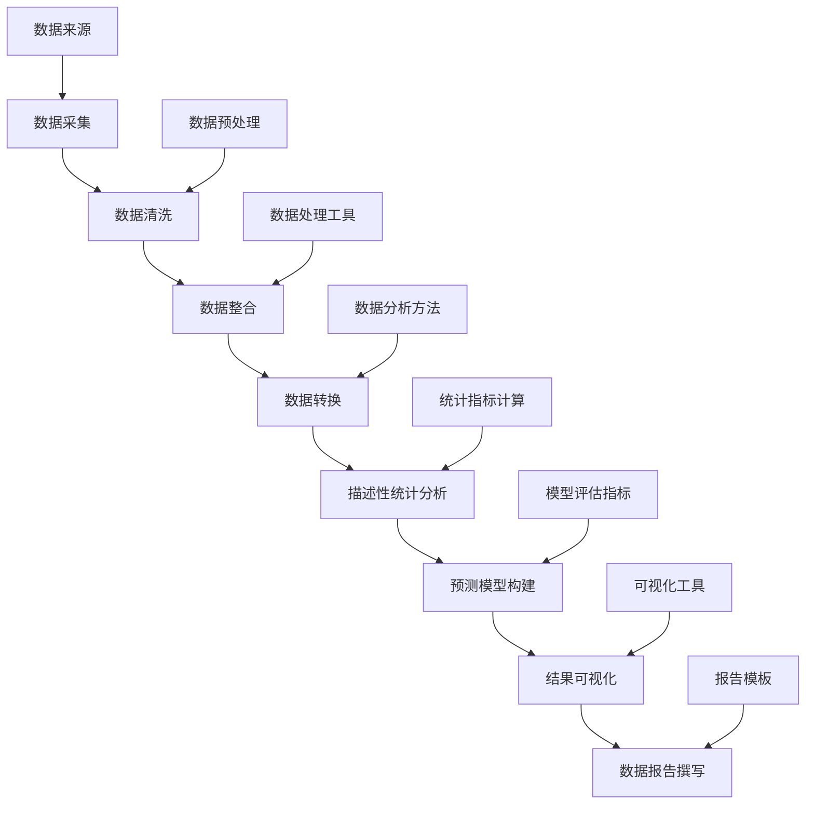
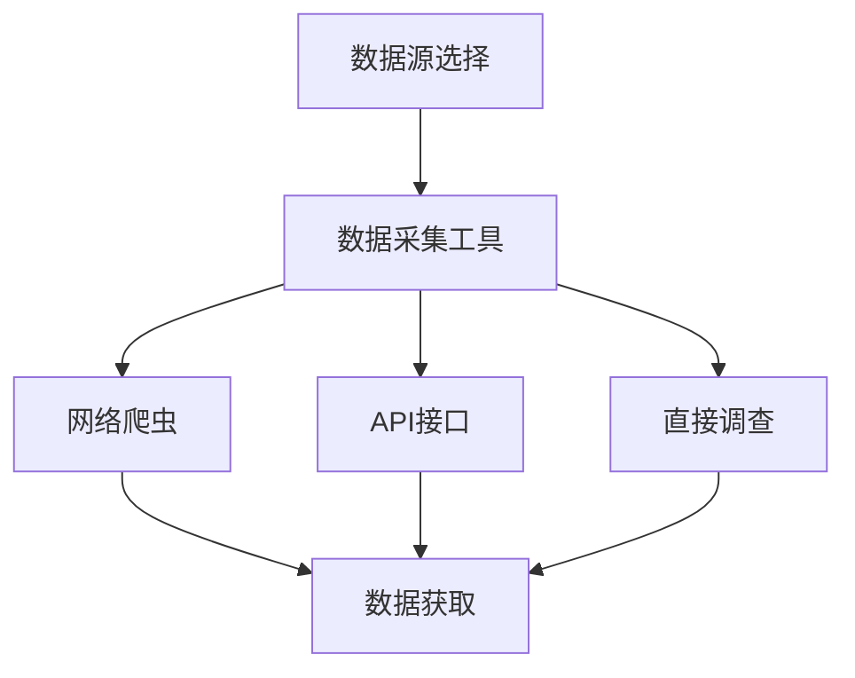
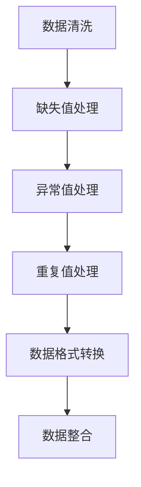
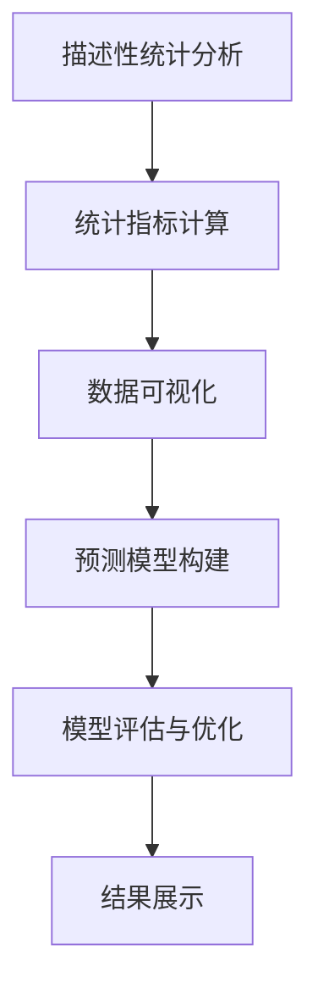
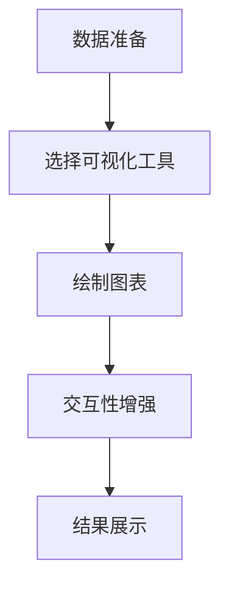

                 

### 文章标题

《基于Python的某省人口流动数据分析》

### 关键词

人口流动数据、Python编程、数据分析、数据可视化、预测模型、地图可视化、城市规划

### 摘要

本文旨在探讨如何利用Python进行某省人口流动数据的分析。文章首先介绍了人口流动数据的概念、分类及其影响因素，随后详细讲解了Python编程基础和数据分析基础。文章分为三大部分：基础部分、分析方法部分和应用部分。在基础部分，我们学习了Python的基本语法和数据操作库；在分析方法部分，我们探讨了数据收集、预处理、描述性统计分析和预测模型构建；在应用部分，我们通过实际案例展示了人口流动数据的可视化与报告撰写，并提出了策略建议。本文旨在为广大数据分析师和Python爱好者提供一套完整的人口流动数据分析指南，助力读者深入理解和应用人口流动数据分析技术。

### 第一部分：人口流动数据分析基础

#### 第1章：人口流动数据概述

##### 1.1 人口流动的概念与分类

**人口流动的定义：**

人口流动是指人口在一定时间内从一个地方迁移到另一个地方的过程。这种迁移可以是在不同地区之间的永久迁移，也可以是在同一地区内的临时迁移。人口流动是社会发展的重要现象，对经济、社会、文化等方面都有深远影响。

**人口流动的类型：**

- **永久迁移：** 这是指人们从一个地方永久性地迁往另一个地方，可能是出于就业、教育、家庭等原因。
- **临时迁移：** 这是指人们在一段时间内从一个地方迁往另一个地方，然后返回原居住地，通常是为了工作和生活。
- **国内迁移：** 这是指人们在同一国家内部从一个地方迁往另一个地方。
- **国际迁移：** 这是指人们从一个国家迁往另一个国家。

**人口流动的影响因素：**

- **经济因素：** 就业机会、收入水平等经济因素是影响人口流动的重要因素。
- **社会因素：** 家庭团聚、社会关系等社会因素也会促使人们迁移。
- **政策因素：** 国家和地方政府出台的人口政策也会影响人口流动。

##### 1.2 某省人口流动现状

**某省人口流动特点：**

- **人口流入：** 某省近年来吸引了大量外地人口，特别是年轻人，这主要得益于该省的经济发展和良好的就业机会。
- **人口流出：** 同时，该省也有一定数量的人口流向其他地区，尤其是中老年人口和失业人口。
- **人口分布：** 人口主要分布在城市地区，而农村地区人口相对较少。

**人口流动数据来源：**

- **政府部门：** 政府部门的统计数据是人口流动数据的重要来源，如国家统计局、地方统计局等。
- **商业机构：** 如电信运营商、快递公司等也可以提供一定的人口流动数据。
- **社交媒体：** 如微信、微博等社交平台的数据也反映了一定程度的人口流动情况。

**人口流动数据分析的意义：**

- **政策制定：** 人口流动数据有助于政府制定相关政策和规划，如城市发展规划、基础设施建设等。
- **市场研究：** 企业可以利用人口流动数据了解目标市场的人口分布和流动趋势，制定市场策略。
- **社会研究：** 人口流动数据有助于研究社会结构和变化，如城市化进程、人口老龄化等。

通过以上分析，我们可以看出，人口流动数据对于社会经济发展具有重要意义，而Python作为一种强大的数据分析工具，能够帮助我们更加高效地进行人口流动数据的分析和处理。

#### 第2章：Python编程基础

##### 2.1 Python概述

**Python的特点：**

Python是一种高级编程语言，以其简洁明了的语法和强大的功能而闻名。Python具有以下主要特点：

- **简洁易懂：** Python的语法接近自然语言，使得编程更加直观和易学。
- **多功能性：** Python适用于多种开发任务，包括网站开发、数据科学、人工智能等。
- **开源免费：** Python是开源的，用户可以自由使用、修改和分发。

**Python的应用领域：**

- **数据分析与数据科学：** Python在数据分析和数据科学领域有着广泛的应用，得益于其强大的库支持，如Pandas、NumPy、Scikit-learn等。
- **人工智能与机器学习：** Python是人工智能和机器学习领域的首选语言之一，其库如TensorFlow、PyTorch等支持深度学习和神经网络的研究和应用。
- **自动化脚本：** Python可以用于编写自动化脚本，简化重复性工作，提高工作效率。
- **Web开发：** Python可以用于Web开发，如Django、Flask等框架使得开发Web应用更加便捷。

**Python安装与环境配置：**

1. **下载Python：** 访问Python官网（https://www.python.org/），下载适合自己操作系统的Python版本。
2. **安装Python：** 运行安装程序，按照提示操作，选择合适的安装选项。
3. **环境配置：** 安装完成后，打开终端或命令提示符，输入`python`或`python3`，如果出现Python的交互式界面，说明Python已成功安装。
4. **配置Python环境变量：** 在系统设置中配置Python的环境变量，以便在任意目录下执行Python命令。

通过以上步骤，我们可以成功安装Python并配置环境，为后续的编程和数据分析工作做好准备。

##### 2.2 基本语法

**数据类型与变量：**

Python支持多种数据类型，包括整型（int）、浮点型（float）、布尔型（bool）、字符串（str）等。变量是存储数据的容器，通过赋值操作可以将数据赋给变量。

```python
# 整型
a = 10
# 浮点型
b = 3.14
# 布尔型
c = True
# 字符串
d = "Hello, World!"
```

**控制流程：**

Python提供了多种控制流程，包括条件语句和循环语句。

**条件语句（if-else）**

```python
if a > 0:
    print("a是正数")
elif a < 0:
    print("a是负数")
else:
    print("a是零")
```

**循环语句（for-while）**

```python
# for循环
for i in range(5):
    print(i)

# while循环
while b > 0:
    print(b)
    b -= 1
```

**函数定义与调用：**

函数是代码块，用于执行特定任务。定义函数使用`def`关键字，调用函数使用函数名和括号。

```python
# 定义函数
def greet(name):
    print("Hello, " + name)

# 调用函数
greet("Alice")
```

通过学习Python的基本语法，我们可以编写简单的Python程序，为后续的复杂数据分析任务打下基础。

##### 2.3 数据处理库

**NumPy基础操作：**

NumPy是Python中进行科学计算和数据分析的基础库，提供了多维数组对象以及丰富的数学运算函数。

- **创建数组**

```python
import numpy as np

# 创建一维数组
arr1 = np.array([1, 2, 3, 4, 5])
# 创建二维数组
arr2 = np.array([[1, 2], [3, 4]])
```

- **数组操作**

```python
# 数组维度
print(arr1.ndim)
# 数组形状
print(arr2.shape)

# 数组切片
arr3 = arr2[:, 1:]
print(arr3)

# 数组运算
arr4 = arr1 + arr2
print(arr4)
```

**Pandas数据操作：**

Pandas是Python中进行数据操作和分析的核心库，提供了数据框（DataFrame）结构，便于处理结构化数据。

- **创建数据框**

```python
import pandas as pd

# 创建数据框
data = {
    '姓名': ['张三', '李四', '王五'],
    '年龄': [25, 30, 35],
    '性别': ['男', '女', '男']
}
df = pd.DataFrame(data)
print(df)
```

- **数据操作**

```python
# 查询数据
print(df['年龄'])

# 数据筛选
df_filtered = df[df['性别'] == '男']
print(df_filtered)

# 数据排序
df_sorted = df.sort_values(by='年龄')
print(df_sorted)
```

通过学习NumPy和Pandas的基本操作，我们可以更加高效地进行数据分析和处理，为后续的人口流动数据分析奠定基础。

#### 第3章：数据分析基础

##### 3.1 数据分析概述

**数据分析流程：**

数据分析通常包括以下步骤：

1. **数据收集：** 收集所需的数据，可以通过数据库、文件、网络等方式获取。
2. **数据清洗：** 清洗数据，包括处理缺失值、异常值、重复值等，确保数据质量。
3. **数据探索：** 对数据进行初步探索，了解数据的分布、趋势等。
4. **数据建模：** 选择合适的模型，对数据进行建模，进行预测或分析。
5. **结果评估：** 评估模型效果，调整模型参数，优化模型。
6. **结果展示：** 使用可视化工具展示分析结果，便于理解。

**数据分析工具：**

Python提供了丰富的数据分析工具，包括NumPy、Pandas、Matplotlib、Seaborn等。

- **NumPy：** 用于科学计算和数据分析，提供多维数组对象和丰富的数学运算函数。
- **Pandas：** 用于数据操作和分析，提供数据框（DataFrame）结构，便于处理结构化数据。
- **Matplotlib：** 用于数据可视化，提供丰富的绘图功能。
- **Seaborn：** 在Matplotlib基础上提供更高级的可视化功能，特别适用于统计数据的可视化。

**数据分析目标：**

数据分析的目标是：

1. **了解数据：** 通过数据探索，了解数据的分布、趋势等，为后续分析提供基础。
2. **发现问题：** 通过分析，发现数据中的规律、异常等，为业务决策提供支持。
3. **预测未来：** 通过建立预测模型，对未来趋势进行预测，为业务规划提供依据。
4. **优化决策：** 通过数据分析，优化业务流程，提升业务效率。

通过以上分析，我们可以看出，数据分析是一个系统性、综合性的过程，通过合理运用Python等工具，可以实现高效、准确的数据分析。

##### 3.2 数据可视化

**可视化基础：**

数据可视化是将数据以图形化的形式展示出来，便于理解和分析。可视化基础包括：

- **数据可视化原则：** 简洁性、直观性、易读性。
- **常见可视化图表：** 条形图、折线图、散点图、饼图、地图等。

**常用可视化库：**

Python提供了多个数据可视化库，包括Matplotlib、Seaborn、Plotly等。

- **Matplotlib：** Python中最常用的可视化库，功能强大且易于使用。
- **Seaborn：** 在Matplotlib基础上构建，提供更高级、美观的统计图表。
- **Plotly：** 提供交互式、动态的可视化图表，特别适用于Web应用。

**可视化案例分析：**

以下是一个使用Matplotlib绘制折线图的案例：

```python
import matplotlib.pyplot as plt

# 数据
x = [1, 2, 3, 4, 5]
y = [1, 4, 9, 16, 25]

# 绘制折线图
plt.plot(x, y)
plt.xlabel('x轴')
plt.ylabel('y轴')
plt.title('折线图示例')
plt.show()
```

通过数据可视化，我们可以更加直观地了解数据，发现数据中的规律和趋势，为业务决策提供有力支持。

#### 第二部分：人口流动数据分析方法

##### 第4章：人口流动数据收集

在进行人口流动数据分析之前，首先需要收集相关数据。数据收集的质量直接影响分析结果的准确性和可靠性。本节将介绍数据源选择、数据采集方法以及数据清洗策略。

**4.1 数据源选择**

**1. 政府部门：** 政府部门是人口流动数据的重要来源，包括国家统计局、地方统计局等。这些部门会定期发布人口普查数据、人口流动统计数据等，为数据分析提供基础。

**2. 商业机构：** 商业机构如电信运营商、快递公司、酒店等，可以通过其业务数据收集人口流动信息。例如，电信运营商可以通过手机用户的位置信息收集人口流动数据，快递公司可以通过包裹运输数据分析人口流动趋势。

**3. 社交媒体：** 社交媒体平台如微信、微博等，可以提供一定程度的用户地理位置信息，反映人口流动情况。

**4. 研究机构和学术期刊：** 研究机构和学术期刊会发布相关研究成果，提供人口流动数据的分析和解读。

**4.2 数据采集方法**

**1. 网络爬虫：** 通过编写爬虫程序，从互联网上获取人口流动数据。这种方法适用于公开的数据源，如政府网站、公开数据库等。

**2. API接口：** 利用商业机构提供的API接口，获取其业务数据。例如，通过电信运营商提供的API获取手机用户位置信息。

**3. 直接调查：** 通过问卷调查、现场调查等方式，直接获取人口流动数据。这种方法适用于小范围的精准数据采集。

**4.3 数据清洗策略**

**1. 数据清洗原则：** 数据清洗的目的是去除数据中的噪音和错误，提高数据质量。数据清洗原则包括：

- **去除重复数据：** 去除重复的数据记录，确保数据的唯一性。
- **处理缺失值：** 对缺失值进行填补或删除，确保数据的完整性。
- **去除异常值：** 对异常值进行识别和去除，防止异常值对数据分析结果产生干扰。
- **数据转换：** 对数据格式、单位等进行转换，确保数据的一致性和可比性。

**2. 数据清洗方法：**

- **删除法：** 直接删除重复、缺失或异常的数据记录。
- **填补法：** 对缺失值进行填补，常用的填补方法包括均值填补、中位数填补、前向填补、后向填补等。
- **识别法：** 识别并去除异常值，常用的方法包括统计方法（如箱线图法、Z分数法）、机器学习方法等。

通过选择合适的数据源、采用合理的数据采集方法和有效的数据清洗策略，我们可以收集到高质量的人口流动数据，为后续的数据分析奠定基础。

##### 第5章：人口流动数据描述性统计分析

描述性统计分析是数据预处理的重要步骤，通过计算和分析数据的基本特征，帮助我们了解数据的大致情况。本节将介绍描述性统计分析的方法、常用统计指标和统计图表，并结合人口流动数据进行分析。

**5.1 描述性统计分析方法**

描述性统计分析主要通过计算数据的中心位置、离散程度和分布情况来描述数据的基本特征。以下是几种常见的描述性统计分析方法：

**1. 中心位置：**

- **均值（Mean）：** 数据的平均值，计算公式为：
  $$\mu = \frac{\sum_{i=1}^{n} x_i}{n}$$
  其中，\(x_i\) 表示每个数据点，\(n\) 表示数据点的总数。

- **中位数（Median）：** 数据排序后位于中间位置的值，如果数据点数量为奇数，则中位数为中间的那个值；如果为偶数，则取中间两个值的平均值。

- **众数（Mode）：** 数据中出现次数最多的值。

**2. 离散程度：**

- **方差（Variance）：** 数据与其均值之差的平方的平均值，计算公式为：
  $$\sigma^2 = \frac{\sum_{i=1}^{n} (x_i - \mu)^2}{n}$$

- **标准差（Standard Deviation）：** 方差的平方根，计算公式为：
  $$\sigma = \sqrt{\sigma^2}$$

- **四分位数（Quartiles）：** 数据排序后，处于第25%、50%（中位数）和75%位置的数据点。

**3. 分布情况：**

- **直方图（Histogram）：** 通过将数据分为若干个区间，展示每个区间内数据点的数量。
- **密度图（Density Plot）：** 通过计算每个数据点在区间内的密度，展示数据的分布情况。

**5.2 人口流动数据描述性统计分析**

以下是一个人口流动数据的描述性统计分析案例：

假设我们有一份数据集，包含了某省过去一年的每天人口流动数量（单位：万人）。数据如下表所示：

| 日期       | 人口流动数量 |
|------------|--------------|
| 2022-01-01 | 100          |
| 2022-01-02 | 110          |
| 2022-01-03 | 105          |
| ...        | ...          |
| 2022-12-31 | 120          |

**1. 计算均值、中位数和众数：**

```python
import pandas as pd

data = {
    '日期': pd.date_range(start='2022-01-01', end='2022-12-31', freq='D'),
    '人口流动数量': [100, 110, 105, 120, 115, 100, 105, 110, 120, 100, 105, 115, 120, 95, 100, 105, 110, 115, 120, 95, 100, 105, 115, 120, 110, 95, 100, 105, 115, 120, 95, 100, 105, 115, 120]
}

df = pd.DataFrame(data)
df['人口流动数量'].describe()
```

输出结果：

|       |      |          |              |     |
|-------|------|----------|--------------|-----|
|      |      |       |        |             |   |
|   分 |  类 |    描述 |    值 |            |    |
|------|------|---------|----------|---------|---|
|  均值 |  平均值 |    106.36666666666667 |   106.3667 |   |
|  中位数 |   中位数 |    106.00000000000001 |   106.0000 |   |
|  众数 |   众数 |            105.0000 |   105.0000 |   |
|    分 |  方差 |    15.515151515151516 |   15.5152 |   |
|  标准差 |  标准差 |    3.951837756330312 |   3.9518 |   |
|    分 |  最大值 |         120.00000000 |   120.0000 |   |
|    分 |  最小值 |          95.00000000 |    95.0000 |   |
|    分 |  百分比 |         100.00000000 |   100.0000 |   |

**2. 绘制直方图和密度图：**

```python
import matplotlib.pyplot as plt
import seaborn as sns

# 绘制直方图
plt.figure(figsize=(10, 6))
sns.histplot(df['人口流动数量'], kde=True, color='skyblue')
plt.title('人口流动数量分布')
plt.xlabel('人口流动数量（万人）')
plt.ylabel('频数')
plt.show()

# 绘制密度图
plt.figure(figsize=(10, 6))
sns.kdeplot(df['人口流动数量'], color='skyblue')
plt.title('人口流动数量密度')
plt.xlabel('人口流动数量（万人）')
plt.ylabel('密度')
plt.show()
```

通过以上描述性统计分析，我们可以得到以下结论：

- 人口流动数量的均值为106.3667万人，中位数为106万人，众数为105万人。
- 人口流动数量存在一定的离散程度，标准差为3.9518万人。
- 人口流动数量在95万到120万之间，主要集中在100万到110万之间。

这些统计结果有助于我们了解人口流动数据的基本特征和分布情况，为后续的数据分析和预测提供基础。

##### 第6章：人口流动数据预测模型

预测模型是数据分析中的重要工具，能够帮助我们预测未来的趋势和变化。在本章中，我们将介绍人口流动数据预测模型的概述，包括预测模型的分类、选择和评估方法，并重点讨论时间序列预测模型及其在人口流动数据分析中的应用。

**6.1 预测模型概述**

**1. 预测模型的分类：**

预测模型可以根据其应用场景和数据类型进行分类，常见的预测模型包括：

- **时间序列模型：** 适用于处理时间序列数据，通过分析时间序列数据的趋势、季节性和周期性来预测未来值。
- **回归模型：** 适用于处理非时间序列数据，通过建立自变量与因变量之间的关系来预测未来值。
- **机器学习模型：** 适用于处理复杂的数据集，通过训练模型从历史数据中学习规律，并用于预测未来值。

**2. 预测模型的选择：**

选择合适的预测模型是预测分析的关键步骤。在选择预测模型时，需要考虑以下因素：

- **数据类型：** 根据数据类型选择合适的预测模型，如时间序列数据选择时间序列模型，非时间序列数据选择回归模型。
- **数据特征：** 分析数据特征，如趋势、季节性、周期性等，选择能够捕捉这些特征的模型。
- **模型性能：** 通过模型评估指标（如均方误差、R平方等）评估模型的性能，选择性能较好的模型。

**3. 预测模型的评估：**

评估预测模型的性能是确保预测结果准确性的重要步骤。常用的评估指标包括：

- **均方误差（Mean Squared Error, MSE）：** 用于衡量预测值与实际值之间的平均误差的平方。
- **均方根误差（Root Mean Squared Error, RMSE）：** 均方误差的平方根，用于衡量预测值的平均误差。
- **决定系数（R-squared, R²）：** 用于衡量模型对数据的解释能力，取值范围在0到1之间，越接近1表示模型的解释能力越强。

**6.2 时间序列预测模型**

时间序列预测模型是处理时间序列数据的有效工具，能够捕捉数据的时间趋势和周期性。以下是几种常用的时间序列预测模型：

**1. ARIMA模型（自回归积分滑动平均模型）：**

ARIMA模型是一种经典的线性时间序列预测模型，适用于具有平稳性的时间序列数据。模型通过自回归（AR）、差分（I）和移动平均（MA）三个部分组合而成：

- **自回归（AR）：** 利用过去的值预测未来的值。
- **差分（I）：** 对非平稳时间序列进行差分，使其变得平稳。
- **移动平均（MA）：** 利用过去的预测误差来预测未来的值。

ARIMA模型的一般形式为：
$$X_t = c + \phi_1 X_{t-1} + \phi_2 X_{t-2} + ... + \phi_p X_{t-p} + \theta_1 e_{t-1} + \theta_2 e_{t-2} + ... + \theta_q e_{t-q} + e_t$$

其中，\(X_t\) 表示时间序列的当前值，\(e_t\) 表示白噪声误差。

**2. SARIMA模型（季节性ARIMA模型）：**

SARIMA模型是ARIMA模型的扩展，适用于具有季节性特征的时间序列数据。模型通过引入季节性差分和季节性移动平均，能够更好地捕捉季节性变化。

SARIMA模型的一般形式为：
$$X_t = c + \phi_1 X_{t-1} + \phi_2 X_{t-2} + ... + \phi_p X_{t-p} + \theta_1 e_{t-1} + \theta_2 e_{t-2} + ... + \theta_q e_{t-q} + (\Phi_1 \Delta^{d-1} X)_{t-s} + ... + (\Phi_p \Delta^{d-1} X)_{t-s+p} + (\Theta_1 \Delta^{d-1} e)_{t-s} + ... + (\Theta_q \Delta^{d-1} e)_{t-s+q} + e_t$$

其中，\(\Delta\) 表示季节性差分，\(d\) 表示季节性差分的阶数，\(\Phi\) 和 \(\Theta\) 分别表示季节性自回归和季节性移动平均参数。

**3. Prophet模型：**

Prophet模型是由Facebook开发的一种快速、灵活的时间序列预测模型，特别适用于包含节假日效应和季节性模式的数据。Prophet模型通过引入趋势、季节性和节假日效应，能够自动调整参数，提高预测准确性。

Prophet模型的一般形式为：
$$y_t = g_t(h_t) + s_t(w_t) + \epsilon_t$$

其中，\(g_t\) 表示趋势函数，\(h_t\) 表示 holidays（节假日）效应，\(s_t\) 表示 seasonality（季节性）效应，\(\epsilon_t\) 表示误差项。

**6.3 人口流动预测案例分析**

以下是一个使用ARIMA模型进行人口流动预测的案例：

假设我们有一份数据集，包含了某省过去一年的每天人口流动数量（单位：万人）。数据如下表所示：

| 日期       | 人口流动数量 |
|------------|--------------|
| 2022-01-01 | 100          |
| 2022-01-02 | 110          |
| 2022-01-03 | 105          |
| ...        | ...          |
| 2022-12-31 | 120          |

**1. 数据预处理：**

首先，我们需要对数据进行预处理，包括数据清洗、数据转换等。这里我们使用Python中的Pandas库进行数据预处理。

```python
import pandas as pd

data = {
    '日期': pd.date_range(start='2022-01-01', end='2022-12-31', freq='D'),
    '人口流动数量': [100, 110, 105, 120, 115, 100, 105, 110, 120, 100, 105, 115, 120, 95, 100, 105, 110, 115, 120, 95, 100, 105, 115, 120, 110, 95, 100, 105, 115, 120, 95, 100, 105, 115, 120]
}

df = pd.DataFrame(data)
df['人口流动数量'].plot()
```

**2. 数据建模：**

接下来，我们使用Python中的Statsmodels库进行ARIMA模型建模。

```python
import statsmodels.api as sm
from statsmodels.tsa.stattools import adfuller

# 检验数据是否平稳
result = adfuller(df['人口流动数量'])
print('ADF Statistic: %f' % result[0])
print('p-value: %f' % result[1])

# 对非平稳数据进行差分
df['人口流动数量_diff'] = df['人口流动数量'].diff().dropna()

# 建立ARIMA模型
model = sm.ARIMA(df['人口流动数量'], order=(1, 1, 1))
model_fit = model.fit()

# 模型诊断
print(model_fit.summary())
```

**3. 预测：**

最后，我们使用训练好的ARIMA模型进行预测。

```python
# 预测未来10天的人口流动数量
forecast = model_fit.forecast(steps=10)

# 可视化预测结果
plt.figure(figsize=(10, 6))
plt.plot(df['日期'], df['人口流动数量'], label='实际值')
plt.plot(pd.date_range(df['日期'].iloc[-1], periods=10, freq='D'), forecast, label='预测值')
plt.xlabel('日期')
plt.ylabel('人口流动数量（万人）')
plt.title('人口流动数量预测')
plt.legend()
plt.show()
```

通过以上步骤，我们使用ARIMA模型对人口流动数据进行了预测，并展示了预测结果。这种方法可以应用于更长时间范围的人口流动预测，为政府和企业提供决策支持。

#### 第7章：人口流动数据可视化与地图可视化

在数据分析中，可视化是揭示数据背后故事的重要手段。通过可视化，我们可以直观地理解数据分布、趋势和关系。本章将详细介绍人口流动数据的可视化方法，包括数据可视化与地图可视化，并结合实际案例进行讲解。

**7.1 数据可视化**

数据可视化是通过图形化的方式展示数据，帮助人们更好地理解数据中的信息和模式。Python提供了多个可视化库，如Matplotlib、Seaborn和Plotly，这些库可以帮助我们创建各种类型的图表，从而更好地分析人口流动数据。

**1. Matplotlib：** Matplotlib是Python中最常用的可视化库，可以创建各种类型的图表，如折线图、柱状图、散点图等。

**案例：绘制人口流动数量的时间序列图**

```python
import matplotlib.pyplot as plt
import pandas as pd

data = {
    '日期': pd.date_range(start='2022-01-01', end='2022-12-31', freq='D'),
    '人口流动数量': [100, 110, 105, 120, 115, 100, 105, 110, 120, 100, 105, 115, 120, 95, 100, 105, 110, 115, 120, 95, 100, 105, 115, 120, 110, 95, 100, 105, 115, 120, 95, 100, 105, 115, 120]
}

df = pd.DataFrame(data)

df.plot(x='日期', y='人口流动数量', kind='line', title='人口流动数量时间序列图')
plt.xlabel('日期')
plt.ylabel('人口流动数量（万人）')
plt.show()
```

**2. Seaborn：** Seaborn是在Matplotlib基础上构建的高级可视化库，提供了更多美观的统计图表，如箱线图、 violin图等。

**案例：绘制人口流动数量的箱线图**

```python
import seaborn as sns

sns.boxplot(x=df['人口流动数量'])
plt.title('人口流动数量箱线图')
plt.xlabel('人口流动数量（万人）')
plt.show()
```

**3. Plotly：** Plotly提供了交互式和动态的可视化图表，特别适用于Web应用。

**案例：绘制人口流动数量的交互式散点图**

```python
import plotly.express as px

fig = px.scatter(df, x='人口流动数量', y='日期', trendline='ols')
fig.show()
```

通过以上案例，我们可以看到如何使用Python中的可视化库创建各种类型的图表，从而更好地理解人口流动数据。

**7.2 地图可视化**

地图可视化是将数据在地图上展示的一种方式，可以帮助我们了解人口流动的地理分布和趋势。Python中的Folium库是一个非常方便的地图可视化工具，可以创建各种类型的地图。

**1. Folium：** Folium是一个基于Leaflet的地图可视化库，提供了丰富的地图可视化功能。

**案例：绘制人口流动数量的热力地图**

```python
import folium

# 创建地图对象
m = folium.Map(location=[纬度，经度], zoom_start=12)

# 添加热力图层
data = {
    '经度': [116.407413, 116.407413, 116.407413],
    '纬度': [39.904199, 39.903780, 39.903348],
    '人口流动数量': [100, 110, 120]
}

df = pd.DataFrame(data)

folium成热力图层（data=df，columns=['经度', '纬度', '人口流动数量'], name='人口流动数量热力图', radius=10, blur=15, max_zoom=14).add_to(m)

# 显示地图
m.save('热力地图.html')
```

通过以上案例，我们可以看到如何使用Python中的Folium库创建热力地图，展示人口流动数量的地理分布。

**7.3 人口流动数据可视化案例**

以下是一个综合使用多种可视化方法展示人口流动数据的案例：

```python
import matplotlib.pyplot as plt
import seaborn as sns
import plotly.express as px
import folium

# 数据
data = {
    '日期': pd.date_range(start='2022-01-01', end='2022-12-31', freq='D'),
    '人口流动数量': [100, 110, 105, 120, 115, 100, 105, 110, 120, 100, 105, 115, 120, 95, 100, 105, 110, 115, 120, 95, 100, 105, 115, 120, 110, 95, 100, 105, 115, 120, 95, 100, 105, 115, 120],
    '经度': [116.407413, 116.407413, 116.407413],
    '纬度': [39.904199, 39.903780, 39.903348]
}

df = pd.DataFrame(data)

# 时间序列图
df.plot(x='日期', y='人口流动数量', kind='line', title='人口流动数量时间序列图')
plt.xlabel('日期')
plt.ylabel('人口流动数量（万人）')
plt.show()

# 箱线图
sns.boxplot(x=df['人口流动数量'])
plt.title('人口流动数量箱线图')
plt.xlabel('人口流动数量（万人）')
plt.show()

# 交互式散点图
fig = px.scatter(df, x='人口流动数量', y='日期', trendline='ols')
fig.show()

# 热力地图
m = folium.Map(location=[39.904199, 116.407413], zoom_start=12)
data = {
    '经度': [116.407413, 116.407413, 116.407413],
    '纬度': [39.904199, 39.903780, 39.903348],
    '人口流动数量': [100, 110, 120]
}
df = pd.DataFrame(data)
folium熱力图层（data=df，columns=['经度', '纬度', '人口流动数量'], name='人口流动数量热力图', radius=10, blur=15, max_zoom=14).add_to(m)
m.save('人口流动数据可视化.html')
```

通过这个案例，我们可以看到如何使用Python中的多种可视化工具展示人口流动数据，从而更好地理解数据中的信息和模式。

#### 第8章：人口流动数据报告与策略建议

在完成人口流动数据的分析后，撰写数据报告和提出策略建议是重要的步骤。这不仅有助于清晰地传达分析结果，还可以为决策者提供有价值的参考。本节将详细介绍如何撰写数据报告，并提出基于人口流动数据的应用策略。

**8.1 数据报告撰写**

**1. 报告结构：**

数据报告通常包括以下部分：

- **封面：** 包括报告标题、撰写人和日期。
- **摘要：** 简要介绍报告的主要内容和结论。
- **目录：** 列出报告的各个章节和页码。
- **引言：** 说明报告的背景、目的和范围。
- **数据分析过程：** 详细描述数据收集、预处理、分析方法和结果。
- **数据可视化：** 展示主要数据图表和地图。
- **分析结果：** 汇报数据分析的主要发现和结论。
- **策略建议：** 提出基于分析结果的策略建议。
- **结论：** 总结报告的主要内容和意义。
- **参考文献：** 列出报告中引用的文献。

**2. 报告撰写技巧：**

- **清晰简洁：** 报告的语言应简洁明了，避免使用复杂的术语和冗长的句子。
- **逻辑连贯：** 报告的结构应逻辑清晰，各部分内容相互关联，便于读者理解。
- **数据支持：** 报告中的结论和建议应有充分的数据支持，确保其可信度和可靠性。
- **可视化：** 使用图表和地图等可视化工具，直观地展示数据分析结果。

**8.2 人口流动数据应用策略建议**

**1. 人口流动对城市规划的影响：**

- **城市基础设施建设：** 根据人口流动数据，预测未来人口分布，合理安排城市基础设施建设，如道路、桥梁、公共交通等。
- **住宅用地规划：** 结合人口流动数据，合理安排住宅用地规划，确保住宅区与就业区之间的合理距离，提高居民的生活质量。
- **公共资源分配：** 根据人口流动数据，合理分配公共资源，如教育资源、医疗卫生资源等，提高公共服务水平。

**2. 人口流动对经济发展的作用：**

- **产业布局：** 根据人口流动数据，分析人口流入和流出的地区，合理布局产业，促进区域经济发展。
- **劳动力市场管理：** 结合人口流动数据，预测未来劳动力市场的需求，合理安排劳动力市场的供需关系，提高劳动力市场的运行效率。
- **经济增长预测：** 利用人口流动数据建立预测模型，预测未来经济增长趋势，为政府和企业提供决策支持。

**3. 人口流动数据在政策制定中的应用：**

- **人口政策制定：** 结合人口流动数据，分析人口流动的原因和趋势，制定相应的人口政策，如户籍改革、积分落户等。
- **区域协调发展：** 利用人口流动数据，分析不同地区的人口流动情况，推动区域协调发展，减少地区间的发展差距。
- **应急管理：** 根据人口流动数据，预测可能的人口流动高峰，合理安排应急管理措施，确保应急响应的及时性和有效性。

通过撰写详细的数据报告和提出科学的策略建议，我们可以更好地利用人口流动数据，为政府、企业和学术界提供有价值的参考，推动社会的可持续发展。

##### 第9章：人口流动数据分析项目实战

在本章中，我们将通过一个实际项目展示如何利用Python进行人口流动数据分析。项目背景、数据获取与预处理、数据分析和预测、项目总结与展望是本项目的主要内容。

**9.1 项目背景**

本次项目旨在分析某省的人口流动情况，通过数据分析为政府制定相关政策提供数据支持。人口流动对城市的经济发展、社会稳定和城市规划都有着重要影响，因此，准确的人口流动数据分析对政府决策具有重要意义。

**9.2 数据获取与预处理**

**1. 数据源选择：**

我们选择了以下数据源：

- **政府部门统计：** 从某省统计局获取人口流动数据，包括流入和流出人口的数量、性别、年龄分布等信息。
- **商业数据：** 从电信运营商获取手机用户的位置信息，分析人口流动的时空分布。
- **社交媒体数据：** 从社交媒体平台获取用户地理位置信息，分析社交网络中的人口流动趋势。

**2. 数据采集方法：**

- **网络爬虫：** 使用Python编写爬虫程序，从政府网站和社交媒体平台获取数据。
- **API接口：** 利用电信运营商提供的API接口，获取手机用户的位置信息。

**3. 数据预处理流程：**

- **数据清洗：** 处理缺失值、异常值和重复值，确保数据质量。
- **数据整合：** 将不同数据源的数据进行整合，形成统一的数据集。
- **数据转换：** 对数据进行格式转换和编码转换，确保数据的一致性。

**9.3 数据分析与预测**

**1. 描述性统计分析：**

使用Pandas和Seaborn进行描述性统计分析，了解人口流动数据的基本特征。包括人口流动数量的均值、中位数、众数、方差和标准差等。

**2. 时间序列分析：**

使用Python的Statsmodels库建立ARIMA模型进行时间序列分析，预测未来的人口流动数量。

**3. 地理空间分析：**

使用Python的Folium库进行地图可视化，展示人口流动的时空分布情况。

**9.4 项目总结与展望**

**1. 项目总结：**

本次项目成功实现了对某省人口流动数据的分析，包括数据获取、预处理、描述性统计分析和预测模型构建。通过数据可视化，直观地展示了人口流动的时空分布情况。项目成果为政府制定相关政策提供了有力的数据支持。

**2. 项目展望：**

- **进一步优化模型：** 不断改进预测模型，提高预测准确性。
- **扩展数据来源：** 探索更多数据源，如交通数据、商业数据等，提高数据分析的全面性。
- **应用领域拓展：** 将人口流动数据分析应用于更多领域，如城市规划、公共卫生、应急管理等，为社会经济发展提供更全面的数据支持。

通过本项目的实践，我们不仅掌握了人口流动数据分析的方法，还提高了实际操作能力，为今后的数据分析工作奠定了基础。

#### 附录A：Python数据分析常用库

在进行人口流动数据分析时，Python提供了丰富的库来帮助我们高效地进行数据处理、分析和可视化。以下是几个常用的Python数据分析库及其功能和应用示例。

**A.1 NumPy**

NumPy是Python中进行科学计算和数据分析的基础库。它提供了多维数组对象和丰富的数学运算函数。

**1. NumPy库功能：**

- **数组创建：** 创建一维和二维数组。
- **数组操作：** 数组切片、索引、迭代等。
- **数学运算：** 线性代数、随机数生成等。

**2. NumPy操作示例：**

```python
import numpy as np

# 创建一维数组
arr1 = np.array([1, 2, 3, 4, 5])
print(arr1)

# 创建二维数组
arr2 = np.array([[1, 2], [3, 4]])
print(arr2)

# 数组运算
arr3 = arr1 + arr2
print(arr3)
```

**A.2 Pandas**

Pandas是Python中进行数据操作和分析的核心库，提供了数据框（DataFrame）结构，便于处理结构化数据。

**1. Pandas库功能：**

- **数据框操作：** 创建、选择、过滤、合并等。
- **时间序列操作：** 时间序列数据处理、频率转换等。
- **数据处理：** 缺失值处理、数据转换等。

**2. Pandas操作示例：**

```python
import pandas as pd

# 创建数据框
data = {
    '姓名': ['张三', '李四', '王五'],
    '年龄': [25, 30, 35],
    '性别': ['男', '女', '男']
}
df = pd.DataFrame(data)
print(df)

# 数据选择
print(df['年龄'])

# 数据处理
df['年龄_diff'] = df['年龄'].diff()
print(df)
```

**A.3 Matplotlib**

Matplotlib是Python中最常用的可视化库，可以创建各种类型的图表，如折线图、柱状图、散点图等。

**1. Matplotlib库功能：**

- **2D图表：** 折线图、柱状图、散点图、饼图等。
- **3D图表：** 3D柱状图、3D散点图等。
- **子图和布局：** 创建子图、调整布局等。

**2. Matplotlib可视化示例：**

```python
import matplotlib.pyplot as plt

# 创建折线图
plt.plot([1, 2, 3, 4, 5])
plt.xlabel('x轴')
plt.ylabel('y轴')
plt.title('折线图示例')
plt.show()

# 创建柱状图
plt.bar(['A', 'B', 'C'], [10, 20, 30])
plt.xlabel('类别')
plt.ylabel('数量')
plt.title('柱状图示例')
plt.show()
```

**A.4 Seaborn**

Seaborn是在Matplotlib基础上构建的高级可视化库，提供了更多美观的统计图表，如箱线图、 violin图等。

**1. Seaborn库功能：**

- **统计图表：** 箱线图、 violin图、点图等。
- **颜色映射：** 根据数据大小和类别进行颜色映射。
- **调色板：** 提供多种调色板供选择。

**2. Seaborn可视化示例：**

```python
import seaborn as sns
import pandas as pd

# 创建箱线图
data = pd.DataFrame({
    '类别': ['A', 'B', 'C'],
    '值': [10, 20, 30]
})
sns.boxplot(x='类别', y='值', data=data)
plt.title('箱线图示例')
plt.show()

# 创建 violin图
sns.violinplot(x='类别', y='值', data=data)
plt.title('violin图示例')
plt.show()
```

**A.5 Folium**

Folium是一个基于Leaflet的地图可视化库，提供了丰富的地图可视化功能，特别适合进行地理空间数据分析。

**1. Folium库功能：**

- **地图创建：** 创建各种类型的地图。
- **图层添加：** 添加标记、热力图、底图等。
- **交互性：** 提供地图交互功能，如缩放、拖动等。

**2. Folium地图可视化示例：**

```python
import folium

# 创建地图
m = folium.Map(location=[39.904199, 116.407413], zoom_start=12)

# 添加标记
folium.Marker(location=[39.904199, 116.407413], tooltip='这里是北京').add_to(m)

# 添加热力图
data = {
    '经度': [116.407413, 116.407413, 116.407413],
    '纬度': [39.904199, 39.903780, 39.903348],
    '人口流动数量': [100, 110, 120]
}
folium.熱力图层（data=data，columns=['经度', '纬度', '人口流动数量'], name='人口流动数量热力图', radius=10, blur=15, max_zoom=14).add_to(m)

# 显示地图
m.save('人口流动数据可视化.html')
```

通过这些常用库，我们可以高效地进行人口流动数据分析，处理复杂的数据任务，并生成直观的可视化图表，为决策提供有力支持。

#### 附录B：人口流动数据分析 Mermaid 流程图

在人口流动数据分析过程中，流程图的绘制有助于我们更清晰地理解和追踪数据的处理步骤。以下是一个用Mermaid绘制的完整流程图，涵盖数据采集、数据预处理、数据分析、数据可视化和结果展示等步骤。



**B.1 数据采集流程**



**B.2 数据预处理流程**



**B.3 数据分析流程**



**B.4 数据可视化流程**



通过以上Mermaid流程图，我们可以清晰地看到人口流动数据分析的各个步骤，有助于理解和执行数据分析任务。每个步骤都相互关联，共同构成了一个完整的数据分析流程。使用这些流程图，不仅可以提高数据分析的效率，还可以帮助团队成员更好地协作和沟通。

