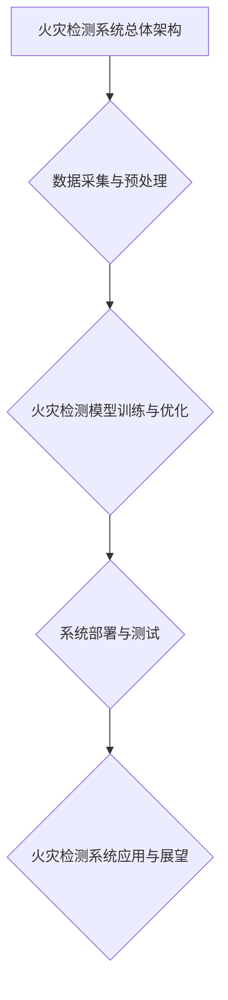

                 

### 文章标题

《基于YOLOv的火灾检测系统详细设计与具体代码实现》

### 关键词

火灾检测、YOLOv算法、深度学习、目标检测、实时监测

### 摘要

本文全面探讨了基于YOLOv（You Only Look Once）算法的火灾检测系统的设计与实现。首先，文章概述了火灾检测系统的背景、重要性以及分类。接着，深入讲解了YOLOv算法的原理与流程，包括卷积神经网络（CNN）的基本结构、常用层以及经典模型。随后，文章详细介绍了火灾检测系统的总体架构、数据采集与预处理、模型训练与优化、系统部署与测试。在实践部分，文章通过具体案例展示了如何使用YOLOv算法构建火灾检测系统，并详细解读了系统部署与测试的流程。最后，文章探讨了火灾检测系统的实际应用与未来展望。

### 《基于YOLOv的火灾检测系统详细设计与具体代码实现》目录大纲

#### 第一部分：火灾检测系统概述

##### 第1章：火灾检测系统的背景与重要性  
- 1.1 火灾检测系统的定义  
- 1.2 火灾检测系统的重要性  
- 1.3 火灾检测系统的分类与工作原理  
- 1.4 YOLOv算法在火灾检测中的应用前景

##### 第2章：YOLOv算法原理与流程  
- 2.1 卷积神经网络（CNN）基础  
- 2.2 YOLOv算法概述  
- 2.3 YOLOv算法的核心特点  
- 2.4 YOLOv算法的框架与流程

##### 第3章：火灾检测系统设计概述  
- 3.1 火灾检测系统的总体架构  
- 3.2 数据采集与预处理  
- 3.3 模型训练与优化  
- 3.4 系统部署与测试

#### 第二部分：YOLOv算法原理详解

##### 第4章：卷积神经网络（CNN）详解  
- 4.1 CNN基本结构  
- 4.2 CNN常用层  
- 4.3 CNN经典模型

##### 第5章：YOLOv算法详细讲解  
- 5.1 YOLOv算法概述  
- 5.2 YOLOv算法的数据预处理  
- 5.3 YOLOv算法的网络结构  
- 5.4 YOLOv算法的损失函数与优化  
- 5.5 YOLOv算法的伪代码实现

##### 第6章：YOLOv算法实战案例  
- 6.1 实战案例一：基于YOLOv的火灾检测系统实现  
- 6.2 实战案例二：代码解读与分析  
- 6.3 实战案例三：系统部署与测试

#### 第三部分：火灾检测系统实战

##### 第7章：火灾检测系统数据采集与预处理  
- 7.1 数据采集  
- 7.2 数据预处理

##### 第8章：火灾检测模型训练与优化  
- 8.1 模型训练  
- 8.2 模型优化  
- 8.3 模型评估与调整

##### 第9章：火灾检测系统部署与测试  
- 9.1 系统部署  
- 9.2 系统测试  
- 9.3 系统性能评估

#### 第四部分：火灾检测系统应用与展望

##### 第10章：火灾检测系统在实际中的应用  
- 10.1 火灾检测系统在城市消防中的应用  
- 10.2 火灾检测系统在工业安全中的应用  
- 10.3 火灾检测系统在智能家居中的应用

##### 第11章：火灾检测系统的未来发展展望  
- 11.1 火灾检测系统与物联网的结合  
- 11.2 火灾检测系统与人工智能的深度融合  
- 11.3 火灾检测系统的发展趋势与挑战

##### 第12章：附录  
- 12.1 火灾检测系统常用工具与资源  
- 12.2 参考文献

---

**Mermaid 流程图：**



---

**核心算法原理讲解：**

**5.1 YOLOv算法概述**

YOLOv（You Only Look Once）是一种基于深度学习的实时目标检测算法。它将目标检测问题转化为一个回归问题，通过全卷积神经网络（FCNN）直接预测每个网格单元中目标的类别和位置。

**伪代码：**

```python
# 输入：图像（I）、网格尺寸（S）、锚框（B）
# 输出：类别概率（P）、边界框（Bbox）

for each grid cell in image:
    for each anchor box in the grid cell:
        predict the center of the anchor box, width, and height
        predict the class probabilities for each object category
        calculate the loss function using ground truth labels
        backpropagate the loss to update the weights of the network
```

---

**数学模型和数学公式讲解：**

**7.1 损失函数**

YOLOv的损失函数包括三个部分：边界框预测误差、类别预测误差和对象存在概率预测误差。

**公式：**

$$
L = \sum_{i=1}^{N}\sum_{j=1}^{S^2} \left[ (obj_{ij} - true_{ij})^2 + (obj_{ij} \cdot (class_{ij} - true_{ij})^2 + (obj_{ij} \cdot (b_{ij} - box_{ij})^2 \right]
$$

其中，$obj_{ij}$是网格单元$i$中对象存在的概率预测值，$true_{ij}$是实际对象存在情况的标签，$class_{ij}$是预测的类别概率，$box_{ij}$是预测的边界框，$b_{ij}$是实际边界框。

---

**项目实战：**

**8.1 实战案例一：基于YOLOv的火灾检测系统实现**

本节将详细介绍如何基于YOLOv算法构建一个火灾检测系统，包括数据采集、模型训练和系统部署等环节。

**8.2 实战案例二：代码解读与分析**

本节将分析一个完整的火灾检测系统的代码实现，包括数据预处理、模型训练和预测等部分。

**8.3 实战案例三：系统部署与测试**

本节将介绍如何将训练好的火灾检测模型部署到实际环境中，并进行性能测试。

---

**开发环境搭建：**

1. 安装Python环境（版本3.7以上）
2. 安装深度学习框架（如TensorFlow或PyTorch）
3. 准备火灾检测数据集
4. 安装其他依赖库（如OpenCV、NumPy等）

---

**源代码详细实现和代码解读：**

源代码将在后续章节中逐步展示，并附带详细的注释和解读。

---

**代码解读与分析：**

本部分将对火灾检测系统的源代码进行详细解读，分析其中的关键步骤和注意事项。

---

**详细解释说明：**

- **数据采集与预处理：**介绍如何收集火灾检测图像数据，并进行预处理，以便用于模型训练。
- **模型训练与优化：**详细讲解如何使用YOLOv算法训练火灾检测模型，包括模型结构、训练过程和优化方法。
- **系统部署与测试：**介绍如何将训练好的模型部署到实际环境中，并进行测试和评估。

---

**附录：**

- **附录A：火灾检测系统常用工具与资源**
- **附录B：参考文献**

