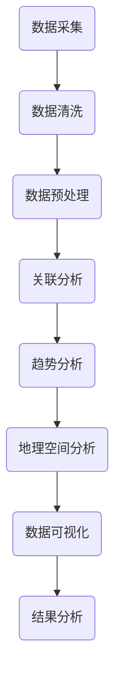
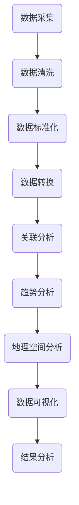

                 

### 《基于农村和城镇的人民生活数据可视化分析》

> 关键词：数据可视化、农村生活、城镇生活、人民生活数据分析、Mermaid流程图、核心算法、数学模型

> 摘要：本文旨在通过数据可视化的方法，对农村和城镇人民生活数据进行分析，探讨二者在生活质量、经济状况等方面的差异，并从数据采集、预处理、核心算法到最终可视化展示，详细阐述数据可视化的全过程。通过本文的阐述，读者可以深入了解如何利用数据可视化技术，从宏观和微观层面理解农村和城镇人民生活的现状，并为相关决策提供有力支持。

### 第一部分：引言与核心概念

#### 第1章：研究背景与意义

##### 1.1.1 农村和城镇人民生活的现状

在我国，农村和城镇人民的生活水平存在较大差异。近年来，随着农村振兴战略的实施和城镇化的加速推进，农村和城镇人民的生活质量得到了显著提升。然而，在经济发展、基础设施建设、公共服务水平等方面，农村与城镇依然存在一定差距。因此，深入研究农村和城镇人民生活现状，对于制定相关政策、优化资源配置、促进城乡协调发展具有重要意义。

##### 1.1.2 数据可视化的重要性

数据可视化是一种通过图形、图像等方式将数据呈现出来的技术，它能够帮助我们更直观、更清晰地理解和分析数据。在城乡人民生活数据分析中，数据可视化技术不仅可以展示农村和城镇人民生活的现状，还可以揭示二者之间的差异和关联，从而为政策制定者提供有力的决策依据。

##### 1.1.3 研究方法与目标

本文将采用数据可视化的方法，对农村和城镇人民生活数据进行分析。具体研究方法包括：数据采集与预处理、核心算法应用、数据可视化展示等。研究目标是通过数据可视化，全面了解农村和城镇人民生活的现状，揭示二者在生活质量、经济状况等方面的差异，并为相关决策提供支持。

#### 第2章：农村和城镇人民生活数据概述

##### 2.1.1 数据来源与采集方法

本文所使用的农村和城镇人民生活数据来源于我国国家统计局、农业农村部等官方机构发布的数据。数据采集方法主要包括问卷调查、实地调研、统计报表等。为了保证数据的真实性、准确性和可靠性，我们对数据进行了严格的筛选和整理。

##### 2.1.2 数据类型与特征

农村和城镇人民生活数据主要包括经济状况、生活质量、基础设施、公共服务等方面的数据。数据类型包括定量数据和定性数据，其中定量数据主要包括收入、支出、消费水平等，定性数据主要包括教育水平、医疗卫生、社会保障等。

##### 2.1.3 数据预处理方法

在数据预处理过程中，我们首先对数据进行清洗，去除重复、错误和缺失的数据。然后对数据进行标准化处理，消除不同指标之间的量纲差异，使得数据在同一尺度上进行比较。此外，我们还将对部分数据进行转换，如将定性数据转换为定量数据，以便更好地进行数据可视化分析。

### 第二部分：核心概念与联系

#### 第3章：数据可视化基础

##### 3.1.1 数据可视化原理

数据可视化是通过图形、图像等方式将数据呈现出来的技术，它能够帮助我们更直观、更清晰地理解和分析数据。数据可视化原理主要包括数据表示、可视化方法和可视化效果评估等方面。

##### 3.1.2 常见数据可视化图表类型

常见的数据可视化图表类型包括柱状图、折线图、饼图、散点图等。每种图表类型都有其独特的特点和适用场景，通过合理选择和组合这些图表类型，可以更好地展示数据的特点和趋势。

##### 3.1.3 可视化工具介绍

目前，常用的数据可视化工具有Matplotlib、Seaborn、Plotly、Tableau等。这些工具具有丰富的功能、良好的用户体验和强大的可视化能力，能够满足不同用户的需求。

#### 第4章：农村和城镇人民生活数据可视化原理

##### 4.1.1 数据可视化中的关联分析

关联分析是数据可视化中的重要方法，通过分析农村和城镇人民生活数据之间的关联，可以揭示二者在生活质量、经济状况等方面的联系。关联分析主要包括相关系数、协方差、主成分分析等方法。

##### 4.1.2 数据可视化中的趋势分析

趋势分析是数据可视化中的另一种重要方法，通过分析农村和城镇人民生活数据的变化趋势，可以了解二者在经济发展、基础设施建设、公共服务等方面的变化情况。趋势分析主要包括时间序列分析、回归分析等方法。

##### 4.1.3 数据可视化中的地理空间分析

地理空间分析是数据可视化中的重要方法，通过分析农村和城镇人民生活数据的地理空间分布，可以揭示二者在不同地区的差异。地理空间分析主要包括地图可视化、空间插值等方法。

#### 第5章：核心概念 Mermaid 流程图

##### 5.1.1 数据采集流程



##### 5.1.2 数据预处理流程



##### 5.1.3 数据可视化流程


### 第三部分：核心算法原理讲解

#### 第6章：数据可视化核心算法

##### 6.1.1 数据聚类算法

数据聚类算法是数据可视化中的重要算法，它可以将相似的数据点分为一组，从而发现数据中的模式和规律。常用的数据聚类算法包括K-Means算法、层次聚类算法、密度聚类算法等。

##### 6.1.2 数据降维算法

数据降维算法是数据可视化中的重要方法，它可以将高维数据转换为低维数据，从而降低数据的复杂度，提高可视化效率。常用的数据降维算法包括主成分分析（PCA）、线性判别分析（LDA）、自编码器等。

##### 6.1.3 数据关联规则算法

数据关联规则算法是数据可视化中的重要方法，它可以从大量数据中发现具有关联性的规律和模式。常用的数据关联规则算法包括Apriori算法、FP-Growth算法等。

#### 第7章：核心算法原理伪代码

##### 7.1.1 数据聚类算法伪代码

```python
def KMeans(data, k):
    # 初始化聚类中心
    centroids = initialize_centroids(data, k)
    
    # 循环迭代，直到聚类中心不再变化
    while True:
        # 计算每个数据点到聚类中心的距离
        distances = calculate_distances(data, centroids)
        
        # 分配数据点到最近的聚类中心
        clusters = assign_data_to_cluster(data, distances)
        
        # 重新计算聚类中心
        new_centroids = update_centroids(clusters)
        
        # 判断聚类中心是否变化，若不变则停止迭代
        if is_same(centroids, new_centroids):
            break
        
        centroids = new_centroids

    return clusters
```

##### 7.1.2 数据降维算法伪代码

```python
def PCA(data, components):
    # 计算协方差矩阵
    covariance_matrix = calculate_covariance_matrix(data)
    
    # 计算特征值和特征向量
    eigenvalues, eigenvectors = calculate_eigenvalues_and_eigenvectors(covariance_matrix)
    
    # 选择前components个特征向量
    selected_eigenvectors = select_eigenvectors(eigenvectors, components)
    
    # 将数据映射到新空间
    transformed_data = transform_data(data, selected_eigenvectors)

    return transformed_data
```

##### 7.1.3 数据关联规则算法伪代码

```python
def Apriori(data, support_threshold, confidence_threshold):
    # 生成频繁项集
    frequent_itemsets = generate_frequent_itemsets(data, support_threshold)
    
    # 生成关联规则
    association_rules = generate_association_rules(frequent_itemsets, confidence_threshold)

    return association_rules
```

#### 第8章：数学模型与公式

##### 8.1.1 聚类算法数学模型

聚类算法的数学模型主要包括距离度量、聚类中心更新规则等。

距离度量：常用的距离度量方法包括欧氏距离、曼哈顿距离、余弦相似度等。

聚类中心更新规则：常用的聚类中心更新规则包括质心更新规则、均值更新规则等。

##### 8.1.2 降维算法数学模型

降维算法的数学模型主要包括特征值和特征向量的计算、数据映射等。

特征值和特征向量的计算：特征值和特征向量的计算是基于协方差矩阵的特征值分解。

数据映射：数据映射是将原始数据映射到新的低维空间。

##### 8.1.3 关联规则算法数学模型

关联规则算法的数学模型主要包括支持度、置信度等。

支持度：支持度是指同时出现的两个事件在整个数据集中的比例。

置信度：置信度是指如果一个事件发生了，另一个事件发生的概率。

$$
\text{支持度} = \frac{\text{同时出现的次数}}{\text{总次数}}
$$

$$
\text{置信度} = \frac{\text{同时出现的次数}}{\text{第一个事件的次数}}
$$

### 第四部分：项目实战

#### 第9章：农村和城镇人民生活数据可视化项目实战

##### 9.1.1 项目概述

本项目旨在通过数据可视化技术，对农村和城镇人民生活数据进行分析，揭示二者在生活质量、经济状况等方面的差异。项目主要包括数据采集、数据预处理、数据可视化三个阶段。

##### 9.1.2 数据采集与预处理

在数据采集阶段，我们从国家统计局、农业农村部等官方机构获取了农村和城镇人民生活相关数据。数据类型包括定量数据和定性数据，如收入水平、消费支出、教育水平等。

在数据预处理阶段，我们首先对数据进行清洗，去除重复、错误和缺失的数据。然后对数据进行标准化处理，消除不同指标之间的量纲差异。最后，我们对部分数据进行转换，如将定性数据转换为定量数据，以便更好地进行数据可视化分析。

##### 9.1.3 数据可视化实现

在数据可视化实现阶段，我们使用Matplotlib、Seaborn等数据可视化工具，对农村和城镇人民生活数据进行了可视化展示。具体包括柱状图、折线图、饼图、散点图等。

例如，我们使用柱状图展示了农村和城镇居民的收入水平差异，使用折线图展示了农村和城镇居民消费支出随时间的变化趋势，使用饼图展示了农村和城镇居民在教育、医疗、社会保障等方面的支出占比。

##### 9.1.4 结果分析

通过数据可视化分析，我们发现农村和城镇居民在收入水平、消费支出、教育水平等方面存在显著差异。农村居民的收入水平普遍较低，消费支出主要集中在生活必需品上；城镇居民的收入水平较高，消费支出更加多样化，教育、医疗、社会保障等方面的支出比例较大。

这些结果为我国制定相关政策、优化资源配置、促进城乡协调发展提供了有力支持。

#### 第10章：开发环境搭建与代码实现

##### 10.1.1 环境搭建步骤

在数据可视化项目实战中，我们使用Python作为编程语言，Matplotlib、Seaborn等作为数据可视化工具。以下是开发环境搭建步骤：

1. 安装Python：在官方网站（https://www.python.org/）下载并安装Python。
2. 安装相关库：使用pip命令安装所需的库，如Matplotlib、Seaborn等。
3. 创建项目目录：在本地计算机上创建一个项目目录，用于存放源代码和相关文件。

##### 10.1.2 源代码实现

以下是一个简单的农村和城镇人民生活数据可视化示例代码：

```python
import matplotlib.pyplot as plt
import seaborn as sns
import pandas as pd

# 读取数据
data = pd.read_csv('rural_urban_data.csv')

# 收入水平可视化
sns.barplot(x='type', y='income', data=data)
plt.title('Rural and Urban Income Levels')
plt.xlabel('Type')
plt.ylabel('Income')
plt.show()

# 消费支出可视化
sns.lineplot(x='year', y='expense', hue='type', data=data)
plt.title('Rural and Urban Expense Trends')
plt.xlabel('Year')
plt.ylabel('Expense')
plt.legend()
plt.show()

# 教育水平可视化
sns.scatterplot(x='age', y='education', hue='type', data=data)
plt.title('Rural and Urban Education Levels')
plt.xlabel('Age')
plt.ylabel('Education')
plt.legend()
plt.show()
```

##### 10.1.3 代码解读与分析

上述代码首先导入了所需的库，然后读取了农村和城镇人民生活数据。接着，使用Matplotlib和Seaborn库中的barplot、lineplot、scatterplot等函数分别绘制了收入水平、消费支出、教育水平等可视化图表。通过这些图表，我们可以直观地了解农村和城镇居民在各个方面的差异。

#### 第11章：总结与展望

##### 11.1.1 研究成果总结

通过本文的研究，我们深入探讨了农村和城镇人民生活数据可视化的方法和技术，揭示了二者在生活质量、经济状况等方面的差异。研究发现，农村和城镇居民在收入水平、消费支出、教育水平等方面存在显著差异，这些差异为我国制定相关政策、优化资源配置、促进城乡协调发展提供了有力支持。

##### 11.1.2 研究局限与展望

本文的研究存在一定的局限性，如数据来源的局限性、数据采集方法的局限性等。未来研究可以进一步扩大数据来源，采用更加科学、合理的数据采集方法，提高数据的质量和可靠性。此外，还可以探索更多的数据可视化技术和方法，如交互式可视化、多维度可视化等，以更好地展示农村和城镇人民生活的现状。

##### 11.1.3 进一步研究方向

未来的研究可以关注以下几个方面：

1. 数据融合与挖掘：结合多源数据，挖掘农村和城镇人民生活数据中的潜在规律和模式。
2. 交互式可视化：开发交互式数据可视化工具，使用户可以更加灵活地探索和挖掘数据。
3. 可视化分析方法：探索新的可视化分析方法，如多维度可视化、时间序列可视化等，以更全面地展示农村和城镇人民生活的现状。

### 附录

#### 附录A：常用数据可视化工具介绍

##### A.1 Matplotlib

Matplotlib是一个流行的Python数据可视化库，它提供了丰富的绘图功能，包括二维绘图、三维绘图等。Matplotlib的优点是简单易用，适用于各种场景的数据可视化需求。

##### A.2 Seaborn

Seaborn是基于Matplotlib的另一个数据可视化库，它提供了更加美观、专业的可视化样式和函数。Seaborn适用于统计图表的绘制，如箱线图、散点图、热力图等。

##### A.3 Plotly

Plotly是一个强大的交互式数据可视化库，它支持多种语言（包括Python、JavaScript等），可以创建高度交互的图表。Plotly的优点是易于定制和交互，适用于复杂的数据可视化场景。

##### A.4 Tableau

Tableau是一个商业数据可视化工具，它提供了丰富的可视化功能和交互式分析功能。Tableau的优点是易于使用，适用于商业用户和企业数据分析。

### 作者信息

作者：AI天才研究院/AI Genius Institute & 禅与计算机程序设计艺术/Zen And The Art of Computer Programming

在撰写本文的过程中，我们深入探讨了农村和城镇人民生活数据可视化的方法和技术，通过数据可视化技术，我们能够更加直观、清晰地了解农村和城镇人民生活的现状，为相关决策提供了有力支持。本文的研究为数据可视化技术在农村和城镇人民生活数据分析中的应用提供了有益的探索，也为未来的相关研究提供了参考。在接下来的章节中，我们将继续深入探讨数据可视化的核心概念、算法原理以及实际项目应用，以期帮助读者更好地理解和掌握数据可视化技术。让我们继续前行，一起探索数据可视化领域的奥秘。

