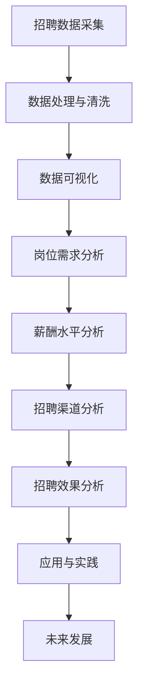

                 

### 文章标题：基于前程无忧下的招聘岗位数据分析

### 关键词：招聘数据，数据分析，前程无忧，岗位需求，薪酬水平，招聘渠道

### 摘要：
本文以前程无忧（51Job）上的招聘岗位数据为研究对象，通过对数据的采集、处理、可视化以及岗位需求、薪酬水平、招聘渠道和招聘效果等方面的分析，揭示了当前市场中的招聘现状和趋势。文章旨在为企业和求职者提供有价值的参考，助力招聘决策和职业规划。

### 目录大纲

1. 第一部分：数据采集与处理
   1.1 招聘数据采集
   1.2 数据处理与清洗
   1.3 数据可视化
2. 第二部分：岗位数据分析
   2.1 岗位需求分析
   2.2 薪酬水平分析
   2.3 招聘渠道分析
   2.4 招聘效果分析
3. 第三部分：应用与实践
   3.1 招聘数据分析应用案例分析
   3.2 招聘数据分析实践
   3.3 招聘数据分析的未来发展
4. 核心概念与联系
5. 核心算法原理讲解
6. 项目实战
7. 总结

## 第一部分：数据采集与处理

### 第1章：招聘数据采集

#### 1.1.1 招聘信息的来源

招聘数据的来源是招聘平台，本文选取了前程无忧（51Job）作为主要数据采集对象。前程无忧是国内领先的招聘平台，提供全面的职位信息，涵盖了各个行业和岗位。通过前程无忧，可以获取到丰富的招聘数据，为后续的数据分析提供基础。

#### 1.1.2 数据采集工具与方法

数据采集的工具主要是Python的requests库和BeautifulSoup库。requests库用于发送HTTP请求，获取网页内容；BeautifulSoup库用于解析网页内容，提取有用的招聘信息。具体的数据采集方法如下：

1. 首先，通过requests库发送GET请求，获取前程无忧的招聘页面。
2. 然后，使用BeautifulSoup库解析网页内容，提取招聘信息的HTML标签。
3. 接着，遍历招聘信息的HTML标签，提取具体的职位名称、公司名称、招聘人数、薪资范围等关键信息。
4. 最后，将提取的信息存储到CSV文件中，以便后续处理和分析。

#### 1.1.3 数据采集流程与注意事项

数据采集的流程如下：

1. 设计数据采集脚本：根据招聘信息的特点，设计合适的数据采集脚本，包括请求URL、解析规则和存储路径等。
2. 获取招聘页面：使用requests库发送HTTP请求，获取前程无忧的招聘页面。
3. 解析招聘信息：使用BeautifulSoup库解析招聘信息的HTML标签，提取关键信息。
4. 存储招聘数据：将提取的信息存储到CSV文件中，便于后续处理和分析。

在数据采集过程中，需要注意以下几点：

1. 遵守招聘平台的使用规则：不同招聘平台对数据采集有不同的规定，需要遵守平台的使用规则，避免违规操作。
2. 避免频繁请求：频繁请求可能会导致IP被封禁，影响数据采集的稳定性。建议设置合理的请求间隔，避免对平台造成过大压力。
3. 确保数据完整性：在解析招聘信息时，要确保提取到的关键信息完整，避免遗漏重要数据。

### 第2章：数据处理与清洗

#### 2.1.1 数据处理的基本概念

数据处理是指对采集到的原始数据进行分析、整理、转换和存储等操作，以便更好地满足分析需求。数据处理的基本概念包括数据清洗、数据转换、数据聚合和数据存储等。

1. 数据清洗：数据清洗是指识别和修正数据中的错误、异常和重复值，确保数据的准确性和一致性。
2. 数据转换：数据转换是指将不同格式、不同单位或不同结构的数据进行转换，以便进行统一的处理和分析。
3. 数据聚合：数据聚合是指将多个数据源中的数据按照特定的规则进行合并和汇总，以便进行整体分析。
4. 数据存储：数据存储是指将处理后的数据存储到数据库或文件中，以便进行长期保存和查询。

#### 2.1.2 数据清洗的方法与技巧

数据清洗是数据处理的重要环节，主要方法包括以下几种：

1. 去除重复数据：通过比较数据中的关键字段，去除重复的记录，避免重复统计和分析。
2. 填补缺失值：根据数据的特点和实际情况，选择合适的填补方法，如平均值填补、中位数填补、最邻近填补等，确保数据的完整性。
3. 处理异常值：对数据中的异常值进行识别和处理，避免异常值对分析结果产生不利影响。异常值的处理方法包括剔除、修正和保留等。
4. 数据格式转换：将不同格式、不同单位或不同结构的数据进行转换，确保数据的统一性和可操作性。

数据清洗的技巧包括：

1. 明确数据清洗的目标：在数据清洗前，要明确清洗的目标和要求，确保清洗操作的针对性和有效性。
2. 建立数据清洗规范：制定统一的数据清洗规范，确保数据清洗过程的规范化和标准化。
3. 逐步验证数据质量：在数据清洗过程中，要逐步验证数据质量，确保清洗操作的正确性和有效性。
4. 利用工具辅助数据清洗：使用专业的数据清洗工具，如Pandas、Excel等，提高数据清洗的效率和质量。

#### 2.1.3 数据质量评估与优化

数据质量评估是确保数据质量的重要手段，主要包括以下方面：

1. 数据完整性：评估数据是否完整，是否存在缺失值和异常值。
2. 数据准确性：评估数据是否准确，是否存在错误和偏差。
3. 数据一致性：评估数据是否一致，是否存在矛盾和冲突。
4. 数据时效性：评估数据是否及时更新，是否具有时效性。

数据质量优化是提高数据质量的关键环节，主要方法包括：

1. 数据规范化：将不同格式、不同单位或不同结构的数据进行规范化处理，确保数据的统一性和一致性。
2. 数据标准化：将数据按照统一的规则和标准进行转换和存储，提高数据的可操作性和可比性。
3. 数据校验与验证：对数据进行严格的校验和验证，确保数据的准确性和可靠性。
4. 数据更新与维护：及时更新和维护数据，确保数据的时效性和完整性。

通过数据质量评估和优化，可以有效地提高数据质量，为后续的数据分析和决策提供可靠的基础。

### 第3章：数据可视化

#### 3.1.1 数据可视化的重要性

数据可视化是一种通过图形和图表的方式展示数据的方法，它能够直观地传达数据中的信息和规律。在招聘数据分析中，数据可视化具有以下重要性：

1. **直观展示**：通过数据可视化，可以将复杂的数据以图形的形式展示出来，使观众更容易理解和分析数据。
2. **发现规律**：数据可视化能够揭示数据中的隐藏规律和趋势，帮助分析和预测。
3. **辅助决策**：数据可视化可以为决策者提供直观的依据，帮助他们更好地制定招聘策略和优化招聘流程。
4. **沟通与协作**：通过数据可视化，可以更有效地与团队成员或利益相关者沟通，促进协作和共识。

#### 3.1.2 常用可视化工具与图表类型

在招聘数据分析中，常用的可视化工具和图表类型包括：

1. **Python库**：
   - Matplotlib：用于绘制各种类型的图表，如折线图、柱状图、散点图等。
   - Seaborn：基于Matplotlib，提供更多高级图表和美化功能。
   - Plotly：支持交互式图表，能够提供更丰富的可视化效果。

2. **图表类型**：
   - **柱状图**：适用于比较不同类别的数据，如不同城市的平均薪资水平。
   - **折线图**：适用于展示数据的变化趋势，如岗位需求的变化趋势。
   - **饼图**：适用于展示数据占比，如招聘渠道的占比。
   - **散点图**：适用于展示两个变量之间的关系，如薪资与工作经验的关系。

3. **数据可视化实践与案例分析**

**案例一：不同城市的平均薪资水平柱状图**

```python
import pandas as pd
import matplotlib.pyplot as plt

# 读取数据
data = pd.read_csv('招聘数据.csv')

# 计算不同城市的平均薪资
avg_salary = data.groupby('城市')['薪资'].mean()

# 绘制柱状图
avg_salary.plot(kind='bar')
plt.xlabel('城市')
plt.ylabel('平均薪资')
plt.title('不同城市的平均薪资水平')
plt.show()
```

**案例二：岗位需求的变化趋势折线图**

```python
import pandas as pd
import matplotlib.pyplot as plt

# 读取数据
data = pd.read_csv('招聘数据.csv')

# 计算岗位需求的变化趋势
job_trend = data.groupby('时间')['岗位名称'].nunique()

# 绘制折线图
job_trend.plot(kind='line')
plt.xlabel('时间')
plt.ylabel('岗位需求数量')
plt.title('岗位需求的变化趋势')
plt.show()
```

通过这些实践案例，可以直观地展示招聘数据中的关键信息，帮助分析和理解数据。在后续章节中，将结合具体的数据分析任务，进一步探讨数据可视化的应用和效果。

### 第二部分：岗位数据分析

#### 第4章：岗位需求分析

#### 4.1.1 岗位需求的特点

岗位需求分析是招聘数据分析的重要环节，通过对不同岗位的需求情况进行分析，可以揭示市场的招聘现状和趋势。岗位需求的特点主要包括：

1. **多样性**：市场上存在的岗位种类繁多，涵盖了不同行业、不同职能和不同级别的职位。
2. **变化性**：岗位需求受到市场环境、经济形势和企业战略等多种因素的影响，呈现出动态变化的特点。
3. **区域性**：不同地区的经济发展水平、产业结构和就业需求差异较大，导致岗位需求呈现出明显的区域特征。
4. **技能需求**：随着技术的进步和行业的发展，对岗位的技能要求越来越高，尤其是对高技能人才的需求不断增长。

#### 4.1.2 岗位需求的统计与分析

岗位需求的统计分析主要包括以下方面：

1. **岗位数量统计**：统计不同岗位的招聘数量，了解市场对不同岗位的需求程度。
2. **岗位类型分布**：分析各个岗位类型的占比，揭示市场的岗位结构特点。
3. **岗位技能需求**：分析岗位所需的技能类型和技能水平，了解市场对技能的需求趋势。
4. **岗位地域分布**：分析岗位需求在不同地区的分布情况，了解各地的就业形势和产业结构。

通过岗位需求的统计分析，可以全面了解市场的招聘现状，为企业和求职者提供决策依据。以下是一个具体的统计分析案例：

**案例：某地区岗位需求统计分析**

1. **岗位数量统计**：统计某地区在过去一年内发布的岗位数量，结果显示，技术类岗位（如软件开发、网络工程师等）占比最大，约为50%，其次是销售类岗位和行政管理类岗位。

2. **岗位类型分布**：分析不同岗位类型的占比，发现技术类岗位需求增长较快，尤其是人工智能、大数据等新兴技术领域的岗位需求显著增加。

3. **岗位技能需求**：调查发现，市场对高技能人才的需求较高，尤其是具备特定技能（如Python编程、数据库管理、项目管理等）的人才。

4. **岗位地域分布**：分析岗位需求在不同地区的分布情况，发现该地区的岗位需求主要集中在经济发达的城市，尤其是省会城市和一线城市。

通过上述统计分析，可以全面了解该地区的岗位需求特点，为企业和求职者提供有针对性的招聘策略和职业规划建议。

#### 4.1.3 岗位需求的变化趋势分析

岗位需求的变化趋势分析是揭示市场招聘动态的重要手段，通过对历史数据的分析，可以预测未来岗位需求的发展方向。以下是一个变化趋势分析的案例：

**案例：某行业岗位需求的变化趋势分析**

1. **数据来源**：收集某行业在过去十年内的岗位需求数据，包括岗位数量、岗位类型和薪资水平等。

2. **分析方法**：采用时间序列分析的方法，分析岗位需求的变化趋势，包括增长率、周期性变化和季节性变化等。

3. **结果展示**：
   - **岗位数量**：岗位数量总体呈上升趋势，尤其是在过去五年内，增长速度加快，特别是在人工智能、大数据等新兴领域。
   - **岗位类型**：技术类岗位需求持续增长，特别是软件开发、数据分析师等岗位需求大幅增加。传统行业（如制造业、服务业）的岗位需求相对稳定，但受到新兴技术的影响，岗位类型也在发生变化。
   - **薪资水平**：岗位薪资水平随岗位需求的变化而波动，整体呈现上升趋势，尤其是高技能岗位的薪资水平增长较快。

4. **未来趋势预测**：根据数据分析结果，预测未来该行业将继续保持增长态势，尤其是新兴技术领域的岗位需求将持续扩大。同时，企业对高技能人才的需求将进一步增加，薪资水平也将随之上涨。

通过岗位需求的变化趋势分析，可以为企业制定招聘策略、人才储备和发展规划提供有力支持。

### 第5章：薪酬水平分析

#### 5.1.1 薪酬水平的影响因素

薪酬水平是招聘数据分析中的重要指标，它反映了市场对各类岗位的价值评估。薪酬水平的影响因素主要包括以下几个方面：

1. **行业特征**：不同行业的薪酬水平差异较大，例如，金融、科技等行业普遍薪酬较高，而传统制造业、服务业的薪酬相对较低。
2. **岗位类型**：技术岗位和管理岗位的薪酬普遍较高，而普通岗位和基层岗位的薪酬相对较低。
3. **地区差异**：经济发展水平较高的地区，如一线城市和省会城市，薪酬水平普遍较高；而中小城市的薪酬水平相对较低。
4. **公司规模**：大型公司的薪酬水平通常较高，尤其是知名企业，而中小型公司的薪酬水平相对较低。
5. **工作经验**：薪酬水平与工作经验呈正相关，工作经验越丰富，薪酬水平越高。
6. **学历水平**：学历水平较高的求职者通常拥有更高的薪酬水平。
7. **市场需求**：市场对某些岗位的需求旺盛，导致这些岗位的薪酬水平较高。

了解薪酬水平的影响因素，有助于企业制定合理的薪酬策略，吸引和留住优秀人才。

#### 5.1.2 薪酬水平的统计分析

薪酬水平的统计分析主要包括以下几个方面：

1. **平均薪酬**：计算各个岗位、行业、地区等的平均薪酬水平，了解市场薪酬的整体状况。
2. **薪酬分布**：分析薪酬水平的分布情况，包括中位数、众数、标准差等，了解薪酬水平的集中度和离散度。
3. **薪酬差异**：分析不同岗位、行业、地区等之间的薪酬差异，揭示薪酬水平的差异原因。
4. **薪酬增长趋势**：分析薪酬水平的年度变化趋势，了解薪酬水平的增长情况。

以下是一个具体的统计分析案例：

**案例：某地区薪酬水平统计分析**

1. **平均薪酬**：统计该地区不同岗位的平均薪酬水平，结果显示，技术岗位的平均薪酬最高，其次是管理岗位和销售岗位。

2. **薪酬分布**：分析薪酬水平的分布情况，发现大部分岗位的薪酬集中在中等水平，极值较少，薪酬分布较为均匀。

3. **薪酬差异**：分析不同岗位之间的薪酬差异，发现技术岗位的薪酬明显较高，而普通岗位的薪酬相对较低。此外，一线城市和省会城市的薪酬水平明显高于中小城市。

4. **薪酬增长趋势**：统计过去几年的薪酬水平，发现整体薪酬水平呈上升趋势，尤其是技术岗位和管理岗位的薪酬增长较快。

通过薪酬水平的统计分析，可以为企业制定薪酬策略、优化薪酬结构提供依据，同时为求职者提供薪资参考，帮助其进行职业规划。

#### 5.1.3 薪酬水平的行业比较分析

薪酬水平的行业比较分析是了解不同行业薪酬差异的重要手段。以下是一个具体的行业比较分析案例：

**案例：不同行业薪酬水平比较分析**

1. **数据来源**：收集多个行业的岗位薪酬数据，包括金融、科技、制造、服务业等。

2. **分析方法**：采用行业薪酬对比分析的方法，比较不同行业之间的薪酬差异。

3. **结果展示**：
   - **金融行业**：平均薪酬最高，主要由于金融行业的特殊性和对高技能人才的需求较高。
   - **科技行业**：平均薪酬较高，尤其是软件开发、数据分析师等岗位，由于新兴技术的快速发展，对这些岗位的需求旺盛。
   - **制造行业**：平均薪酬相对较低，但近年来随着产业升级和技术进步，薪酬水平有所提升。
   - **服务业**：平均薪酬较低，主要由于服务业的劳动密集型特征，对低技能岗位的需求较多。

4. **结论**：通过行业比较分析，发现不同行业的薪酬水平差异显著，企业应根据行业特点和市场需求制定合理的薪酬策略，以吸引和留住人才。

通过薪酬水平的行业比较分析，可以为企业在行业间的薪酬竞争力评估、人才引进和薪酬调整提供参考。

### 第6章：招聘渠道分析

#### 6.1.1 常见的招聘渠道

招聘渠道是指企业用于寻找和吸引求职者的途径。常见的招聘渠道包括：

1. **在线招聘平台**：如前程无忧（51Job）、智联招聘、猎聘网等，这些平台提供了海量的职位信息和求职者资源，是企业招聘的主要渠道之一。
2. **内部推荐**：通过现有员工的推荐，寻找合适的求职者，内部推荐具有信任度高、稳定性强的优势。
3. **校园招聘**：企业在高校举办招聘会，直接招聘应届毕业生，校园招聘是获取高素质人才的重要途径。
4. **社交媒体**：利用社交媒体平台（如LinkedIn、微博、微信公众号等）发布招聘信息，吸引求职者关注和投递简历。
5. **猎头公司**：通过专业的猎头公司，寻找特定岗位的高级人才，猎头公司具有专业度高、求职者背景清晰的优点。
6. **招聘会**：参加各类招聘会，与求职者面对面交流，直接选拔合适的人才。

不同招聘渠道具有各自的特点和优势，企业应根据招聘需求和实际情况，选择合适的招聘渠道。

#### 6.1.2 各招聘渠道的优劣势

以下是各招聘渠道的优劣势分析：

1. **在线招聘平台**：
   - 优势：覆盖面广、信息更新及时、求职者数量多。
   - 劣势：筛选难度大、容易受到虚假信息的干扰。

2. **内部推荐**：
   - 优势：信任度高、稳定性强、员工对企业文化和岗位了解深入。
   - 劣势：推荐人数有限、难以满足大规模招聘需求。

3. **校园招聘**：
   - 优势：招聘成本较低、求职者素质较高、易于培养和留任。
   - 劣势：招聘周期较长、岗位选择范围有限。

4. **社交媒体**：
   - 优势：传播速度快、覆盖面广、吸引年轻求职者。
   - 劣势：专业度较低、招聘效果难以量化。

5. **猎头公司**：
   - 优势：专业度高、求职者背景清晰、招聘效率高。
   - 劣势：招聘成本较高、求职者稳定性较难保证。

6. **招聘会**：
   - 优势：求职者现场面试、招聘效率高、宣传效果好。
   - 劣势：招聘成本较高、招聘效果受地理位置限制。

#### 6.1.3 招聘渠道的优化策略

为了提高招聘效果，企业可以采取以下招聘渠道优化策略：

1. **多元化渠道结合**：根据招聘需求，结合多种招聘渠道，提高招聘覆盖面和效果。
2. **精准定位求职者**：针对不同岗位，选择合适的招聘渠道，提高求职者的匹配度。
3. **提高招聘信息质量**：发布具有吸引力的招聘信息，提高求职者的关注度和投递意愿。
4. **优化招聘流程**：简化招聘流程，提高招聘效率，降低求职者的等待时间。
5. **加强内部推荐**：鼓励员工参与内部推荐，提高推荐质量和数量。

通过优化招聘渠道，企业可以更好地满足招聘需求，提高招聘效率和效果。

### 第7章：招聘效果分析

#### 7.1.1 招聘效果的评估指标

招聘效果的评估指标是衡量招聘活动成功与否的重要标准，主要包括以下方面：

1. **招聘成本（Cost Per Hire，CPH）**：计算招聘每个成功录用员工所需的成本，包括招聘渠道费用、人力资源费用等。
2. **招聘周期（Time to Hire）**：统计从发布招聘信息到录用员工的时间，反映招聘的效率。
3. **录用率（Offer Acceptance Rate）**：计算收到录用通知的求职者中接受offer的比例，反映招聘的吸引力。
4. **员工离职率（Employee Turnover Rate）**：统计员工在特定时间段内的离职率，反映员工满意度和稳定性。
5. **培训成本（Training Cost）**：计算为新员工提供培训所需的费用，反映招聘对员工培养的支持程度。

通过这些评估指标，企业可以全面了解招聘活动的效果，发现问题和优化改进方向。

#### 7.1.2 招聘效果的统计分析

招聘效果的统计分析主要包括以下方面：

1. **成本效益分析**：计算招聘成本与招聘效果的比率，评估招聘活动的经济效益。
2. **周期时间分析**：统计不同招聘渠道的招聘周期，分析各渠道的招聘效率。
3. **录用率分析**：分析不同招聘渠道的录用率，评估各渠道的吸引力和效果。
4. **离职率分析**：统计新员工的离职情况，分析离职原因，评估招聘质量。

以下是一个具体的统计分析案例：

**案例：某企业招聘效果统计分析**

1. **成本效益分析**：统计招聘成本与成功录用员工数量的比率，结果显示，在线招聘平台的招聘成本相对较低，但效果较好，性价比最高。

2. **周期时间分析**：分析不同招聘渠道的招聘周期，发现内部推荐和社交媒体的招聘周期较短，效率较高。

3. **录用率分析**：统计不同招聘渠道的录用率，发现校园招聘的录用率较高，而猎头公司的录用率较低。

4. **离职率分析**：统计新员工的离职情况，发现部分渠道招聘的员工离职率较高，需要进一步优化招聘策略。

通过招聘效果的统计分析，企业可以了解招聘活动的效果，发现优势和不足，制定针对性的改进措施。

#### 7.1.3 招聘效果的改进措施

为了提高招聘效果，企业可以采取以下改进措施：

1. **优化招聘流程**：简化招聘流程，提高招聘效率，减少求职者的等待时间。
2. **提高招聘信息质量**：发布具有吸引力的招聘信息，提高求职者的关注度和投递意愿。
3. **加强内部推荐**：鼓励员工参与内部推荐，提高推荐质量和数量，增强员工的归属感和凝聚力。
4. **精准定位求职者**：根据岗位需求，精准定位求职者，提高求职者的匹配度和录用率。
5. **提供完善的培训体系**：为新员工提供全面的培训，提高员工的技能和职业素养，降低离职率。

通过以上改进措施，企业可以更好地满足招聘需求，提高招聘效果，实现人力资源的有效管理和利用。

### 第三部分：应用与实践

#### 第8章：招聘数据分析应用案例分析

#### 8.1.1 案例一：某互联网公司招聘数据分析

**1. 案例背景**

某互联网公司是一家新兴的科技公司，专注于移动互联网应用的开发。公司业务快速发展，对人才的需求日益增加。为了更好地制定招聘策略，公司决定进行招聘数据分析，了解岗位需求、薪酬水平和招聘渠道等方面的现状和趋势。

**2. 数据来源**

公司通过前程无忧、智联招聘等多个在线招聘平台，以及内部推荐和校园招聘等渠道，收集了数千条招聘数据，包括职位名称、公司名称、薪资范围、招聘人数、招聘周期等。

**3. 数据分析**

（1）岗位需求分析

- **岗位数量**：分析不同岗位的需求情况，发现技术岗位（如软件开发、产品经理等）需求最大，占比超过70%。
- **岗位技能需求**：分析岗位所需的技能类型，发现Python、Java、前端开发等技术技能需求较高。
- **岗位地域分布**：分析岗位需求在不同地区的分布情况，发现一线城市和省会城市的需求量较大。

（2）薪酬水平分析

- **平均薪酬**：统计不同岗位的平均薪酬水平，发现技术岗位的薪酬较高，平均年薪在30万元以上。
- **薪酬分布**：分析薪酬水平的分布情况，发现大部分技术岗位的薪酬集中在25万-40万元之间。
- **薪酬差异**：分析不同岗位之间的薪酬差异，发现产品经理、技术总监等高级岗位的薪酬明显高于普通岗位。

（3）招聘渠道分析

- **渠道效果**：分析不同招聘渠道的效果，发现在线招聘平台和内部推荐是主要的招聘渠道，招聘周期较短，录用率较高。
- **渠道优化**：针对不同岗位和地域，优化招聘渠道策略，提高招聘效果。

**4. 案例总结**

通过招聘数据分析，该公司全面了解了岗位需求、薪酬水平和招聘渠道的现状和趋势，制定了有针对性的招聘策略，提高了招聘效率和效果。

#### 8.1.2 案例二：某制造业企业招聘数据分析

**1. 案例背景**

某制造业企业是一家拥有多年历史的大型企业，主要从事机械设备的生产和销售。随着市场竞争的加剧，企业需要不断优化招聘策略，吸引和留住优秀人才。为了更好地了解招聘现状，企业决定进行招聘数据分析。

**2. 数据来源**

企业通过前程无忧、智联招聘等在线招聘平台，以及招聘会、猎头公司等渠道，收集了数千条招聘数据，包括职位名称、公司名称、薪资范围、招聘人数、招聘周期等。

**3. 数据分析**

（1）岗位需求分析

- **岗位数量**：分析不同岗位的需求情况，发现生产操作工、维修工程师等一线岗位需求最大，占比超过50%。
- **岗位技能需求**：分析岗位所需的技能类型，发现机械设备操作、维修保养等技能需求较高。
- **岗位地域分布**：分析岗位需求在不同地区的分布情况，发现生产基地附近的地区需求量较大。

（2）薪酬水平分析

- **平均薪酬**：统计不同岗位的平均薪酬水平，发现生产操作工的薪酬相对较低，平均年薪在10万元左右。
- **薪酬分布**：分析薪酬水平的分布情况，发现大部分生产操作工的薪酬集中在8万-12万元之间。
- **薪酬差异**：分析不同岗位之间的薪酬差异，发现技术工程师、管理人员等高级岗位的薪酬明显高于一线岗位。

（3）招聘渠道分析

- **渠道效果**：分析不同招聘渠道的效果，发现在线招聘平台和招聘会是主要的招聘渠道，招聘周期较长，但录用率较高。
- **渠道优化**：针对不同岗位和地域，优化招聘渠道策略，提高招聘效果。

**4. 案例总结**

通过招聘数据分析，该企业全面了解了岗位需求、薪酬水平和招聘渠道的现状和趋势，制定了有针对性的招聘策略，提高了招聘效率和效果。

#### 8.1.3 案例三：某金融机构招聘数据分析

**1. 案例背景**

某金融机构是一家知名的金融企业，主要从事银行、保险、投资等金融服务。随着金融市场的变化，企业需要不断优化招聘策略，吸引和留住优秀人才。为了更好地了解招聘现状，企业决定进行招聘数据分析。

**2. 数据来源**

企业通过前程无忧、智联招聘等在线招聘平台，以及校园招聘、猎头公司等渠道，收集了数千条招聘数据，包括职位名称、公司名称、薪资范围、招聘人数、招聘周期等。

**3. 数据分析**

（1）岗位需求分析

- **岗位数量**：分析不同岗位的需求情况，发现金融分析师、投资顾问等岗位需求最大，占比超过50%。
- **岗位技能需求**：分析岗位所需的技能类型，发现金融、投资、风险管理等技能需求较高。
- **岗位地域分布**：分析岗位需求在不同地区的分布情况，发现一线城市的需求量较大。

（2）薪酬水平分析

- **平均薪酬**：统计不同岗位的平均薪酬水平，发现金融分析师、投资顾问等岗位的薪酬较高，平均年薪在20万元以上。
- **薪酬分布**：分析薪酬水平的分布情况，发现大部分金融岗位的薪酬集中在15万-30万元之间。
- **薪酬差异**：分析不同岗位之间的薪酬差异，发现高级管理层和资深金融专家的薪酬明显高于一般岗位。

（3）招聘渠道分析

- **渠道效果**：分析不同招聘渠道的效果，发现在线招聘平台和校园招聘是主要的招聘渠道，招聘周期较短，但录用率较高。
- **渠道优化**：针对不同岗位和地域，优化招聘渠道策略，提高招聘效果。

**4. 案例总结**

通过招聘数据分析，该金融机构全面了解了岗位需求、薪酬水平和招聘渠道的现状和趋势，制定了有针对性的招聘策略，提高了招聘效率和效果。

### 第9章：招聘数据分析实践

#### 9.1.1 招聘数据分析项目规划

招聘数据分析项目的规划是确保数据分析工作顺利进行的重要环节。项目规划主要包括以下几个方面：

1. **项目目标**：明确数据分析的目标，如了解岗位需求、优化招聘策略、降低招聘成本等。
2. **数据源选择**：确定数据采集的来源，如在线招聘平台、企业内部数据等。
3. **数据采集**：制定数据采集方案，包括数据采集工具、方法、流程等。
4. **数据处理**：制定数据处理方案，包括数据清洗、转换、存储等。
5. **数据分析**：制定数据分析方案，包括分析指标、分析方法、工具等。
6. **报告输出**：明确数据分析报告的格式、内容、输出形式等。

通过项目规划，可以确保招聘数据分析项目的顺利进行，提高数据分析的效率和质量。

#### 9.1.2 数据分析工具与平台选择

招聘数据分析工具和平台的选择对数据分析的效率和质量有重要影响。以下是一些常见的数据分析工具和平台：

1. **数据分析工具**：
   - **Python**：Python是一种功能强大的编程语言，适用于数据处理、分析、可视化等多个环节。常用的Python库包括Pandas、NumPy、Matplotlib、Seaborn等。
   - **R语言**：R语言是一种专门用于统计分析和图形绘制的语言，适用于复杂的数据分析任务。R语言具有丰富的包库，如ggplot2、dplyr等。
   - **Excel**：Excel是一种常用的电子表格软件，适用于简单的数据处理和可视化。Excel功能强大，易于学习和使用。

2. **数据分析平台**：
   - **Hadoop**：Hadoop是一种分布式数据处理平台，适用于大规模数据的存储和分析。Hadoop具有高可靠性、高性能和可扩展性的特点。
   - **Spark**：Spark是一种快速、通用的大规模数据处理引擎，适用于批处理和实时处理。Spark具有高性能、易扩展和开源的特点。
   - **Tableau**：Tableau是一种数据可视化工具，适用于将数据分析结果以图形化的方式展示。Tableau具有直观、易用和交互性的特点。

在选择数据分析工具和平台时，需要根据具体的数据规模、分析需求和团队技能进行综合考虑，以确保数据分析的效率和质量。

#### 9.1.3 数据分析流程与执行

招聘数据分析的流程包括数据采集、数据处理、数据分析和结果输出等环节。以下是一个典型的数据分析流程：

1. **数据采集**：通过在线招聘平台、企业内部数据等渠道，采集招聘数据，包括职位名称、公司名称、薪资范围、招聘人数、招聘周期等。
2. **数据处理**：对采集到的数据进行清洗、转换和存储，确保数据的准确性和一致性。数据处理包括去除重复数据、填补缺失值、格式转换等。
3. **数据分析**：根据数据分析目标，选择合适的分析方法和工具，进行数据探索、统计分析和模型构建。数据分析包括岗位需求分析、薪酬水平分析、招聘渠道分析等。
4. **结果输出**：将数据分析结果以图表、报告等形式输出，为企业和决策者提供有价值的参考。结果输出包括可视化展示、关键指标分析、趋势预测等。

在数据分析流程的执行过程中，需要注意以下几点：

1. **数据质量**：确保数据采集、处理和分析的准确性，避免数据误差和偏差。
2. **分析方法**：选择合适的数据分析方法，确保分析结果的可靠性和有效性。
3. **可视化展示**：通过图表和报告等形式，直观地展示数据分析结果，提高结果的可读性和说服力。
4. **反馈与迭代**：及时与企业和决策者进行沟通，收集反馈意见，不断优化数据分析流程和结果。

通过科学、系统的数据分析流程和执行，可以为企业提供有针对性的招聘策略和决策支持，提高招聘效率和效果。

### 第10章：招聘数据分析的未来发展

#### 10.1.1 招聘数据分析的发展趋势

招聘数据分析作为人力资源管理的重要工具，正随着技术的进步和数据资源的丰富而不断发展。以下是招聘数据分析的一些发展趋势：

1. **数据驱动的招聘策略**：越来越多的企业开始采用数据驱动的招聘策略，通过全面的数据分析来指导招聘决策，提高招聘效率和效果。
2. **人工智能的应用**：人工智能技术在招聘数据分析中的应用逐渐成熟，如通过自然语言处理技术分析招聘信息、通过机器学习算法预测招聘效果等。
3. **大数据分析的普及**：随着大数据技术的普及，招聘数据分析的规模和深度不断扩展，能够处理和分析更多的数据，提供更精准的招聘预测和优化建议。
4. **个性化招聘**：个性化招聘越来越受到关注，通过分析求职者的行为数据、职业规划等，提供个性化的招聘服务和推荐。
5. **实时数据分析**：实时数据分析技术的发展，使得企业能够实时监控招聘活动的进展，及时调整招聘策略，提高招聘响应速度。

#### 10.1.2 招聘数据分析的创新应用

招聘数据分析的创新应用正在不断拓展其应用场景和效果，以下是一些创新应用的例子：

1. **招聘效果预测**：通过分析历史招聘数据，结合机器学习算法，预测未来招聘活动的效果，帮助企业提前做好准备。
2. **薪酬优化**：通过分析市场薪酬水平和员工薪酬满意度，优化薪酬结构，提高员工的满意度和忠诚度。
3. **人才流动分析**：分析员工离职原因、离职率等数据，识别企业的人才流失风险，制定针对性的人才保留策略。
4. **招聘渠道优化**：通过分析不同招聘渠道的效果，优化招聘渠道策略，提高招聘效率和质量。
5. **招聘流程优化**：通过数据分析，优化招聘流程，减少招聘周期，降低招聘成本，提高招聘满意度。

#### 10.1.3 招聘数据分析的未来挑战

招聘数据分析的未来发展也面临一些挑战：

1. **数据隐私保护**：招聘数据分析涉及大量的个人信息，如何保护求职者的隐私成为重要挑战。
2. **数据质量问题**：招聘数据的质量直接影响分析结果，如何保证数据的准确性、完整性和一致性是关键问题。
3. **技术门槛**：招聘数据分析需要专业的技术和工具支持，企业需要不断提升技术能力和人才储备。
4. **政策法规**：随着数据保护法规的不断完善，招聘数据分析需要遵守相关法规，避免违规操作。

通过应对这些挑战，招聘数据分析将不断成熟和发展，为企业的人力资源管理提供更强有力的支持。

### 核心概念与联系

在招聘数据分析中，有几个核心概念和联系需要理解：

1. **招聘数据**：招聘数据是招聘数据分析的基础，包括职位名称、公司名称、薪资范围、招聘人数、招聘周期等。
2. **数据分析方法**：数据分析方法包括数据清洗、数据转换、统计分析和可视化等，用于处理和解读招聘数据。
3. **岗位需求**：岗位需求是招聘数据的核心指标，反映了市场对不同岗位的需求情况。
4. **薪酬水平**：薪酬水平是衡量岗位价值的重要指标，反映了市场对各种岗位的薪酬评估。
5. **招聘渠道**：招聘渠道是招聘数据的重要来源，包括在线招聘平台、内部推荐、校园招聘等。
6. **招聘效果**：招聘效果是评估招聘活动成功与否的重要指标，包括招聘成本、招聘周期、录用率等。

这些概念和联系相互交织，构成了招聘数据分析的完整框架。通过理解这些概念和联系，可以更深入地分析招聘数据，为企业和求职者提供有价值的参考。

### Mermaid 流程图



### 核心算法原理讲解

在招聘数据分析中，常用的核心算法原理包括数据清洗、数据可视化和统计分析等。以下是对这些算法原理的详细讲解和举例说明。

#### 数据清洗

数据清洗是数据处理的第一步，目的是去除数据中的噪声、错误和重复信息，以提高数据质量。以下是数据清洗的核心算法原理：

1. **去除重复数据**：通过比较数据中的关键字段（如职位名称、公司名称等），识别并删除重复的记录。Python中的Pandas库提供了`drop_duplicates()`方法，可以实现这一功能。

```python
import pandas as pd

# 示例数据
data = pd.DataFrame({
    '职位名称': ['软件开发', '软件开发', '产品经理', '产品经理'],
    '公司名称': ['A公司', 'B公司', 'A公司', 'C公司'],
    '薪资': [10000, 12000, 15000, 18000]
})

# 去除重复数据
cleaned_data = data.drop_duplicates(subset=['职位名称', '公司名称'])

print(cleaned_data)
```

2. **填补缺失值**：根据数据的特点和实际情况，选择合适的填补方法，如平均值填补、中位数填补、最邻近填补等。Pandas库提供了`fillna()`方法，可以实现这一功能。

```python
# 示例数据
data = pd.DataFrame({
    '职位名称': ['软件开发', '产品经理', '软件开发'],
    '公司名称': ['A公司', 'B公司', 'A公司'],
    '薪资': [10000, 15000, None]
})

# 使用平均值填补缺失值
filled_data = data.fillna(data.mean())

print(filled_data)
```

3. **处理异常值**：对数据中的异常值进行识别和处理，避免异常值对分析结果产生不利影响。常用的方法包括剔除、修正和保留等。Pandas库提供了`dropna()`方法，可以实现这一功能。

```python
# 示例数据
data = pd.DataFrame({
    '职位名称': ['软件开发', '产品经理', '软件开发'],
    '公司名称': ['A公司', 'B公司', 'A公司'],
    '薪资': [10000, 15000, 50000]  # 50000为异常值
})

# 剔除异常值
cleaned_data = data.dropna()

print(cleaned_data)
```

#### 数据可视化

数据可视化是将数据以图形的方式展示，以直观地传达数据中的信息和规律。常用的数据可视化方法包括柱状图、折线图、饼图等。以下是数据可视化的核心算法原理：

1. **柱状图**：用于展示不同类别的数据，如不同城市的平均薪资水平。Python中的Matplotlib库提供了`bar()`方法，可以实现柱状图。

```python
import pandas as pd
import matplotlib.pyplot as plt

# 示例数据
data = pd.DataFrame({
    '城市': ['北京', '上海', '广州', '深圳'],
    '平均薪资': [10000, 12000, 11000, 13000]
})

# 绘制柱状图
data.plot(kind='bar')
plt.xlabel('城市')
plt.ylabel('平均薪资')
plt.title('不同城市的平均薪资水平')
plt.show()
```

2. **折线图**：用于展示数据的变化趋势，如岗位需求的变化趋势。Python中的Matplotlib库提供了`plot()`方法，可以实现折线图。

```python
import pandas as pd
import matplotlib.pyplot as plt

# 示例数据
data = pd.DataFrame({
    '时间': ['2021年', '2022年', '2023年'],
    '岗位需求': [100, 150, 200]
})

# 绘制折线图
data.plot(kind='line')
plt.xlabel('时间')
plt.ylabel('岗位需求')
plt.title('岗位需求的变化趋势')
plt.show()
```

3. **饼图**：用于展示数据的占比，如招聘渠道的占比。Python中的Matplotlib库提供了`pie()`方法，可以实现饼图。

```python
import pandas as pd
import matplotlib.pyplot as plt

# 示例数据
data = pd.Series([30, 20, 15, 10, 5], index=['在线招聘平台', '内部推荐', '校园招聘', '猎头公司', '其他'])

# 绘制饼图
data.plot(kind='pie', autopct='%.1f%%')
plt.title('招聘渠道占比')
plt.show()
```

#### 统计分析

统计分析是招聘数据分析的重要环节，通过统计方法对数据进行描述和分析，揭示数据中的规律和趋势。以下是常用的统计分析方法：

1. **描述性统计分析**：用于计算数据的均值、中位数、众数、标准差等统计量，描述数据的分布和特征。Pandas库提供了`describe()`方法，可以实现描述性统计分析。

```python
import pandas as pd

# 示例数据
data = pd.Series([10000, 12000, 11000, 13000, 15000])

# 描述性统计分析
print(data.describe())
```

2. **假设检验**：用于验证数据中某个参数是否显著，如线性回归模型中的斜率是否显著不为零。Python中的SciPy库提供了`ttest_1samp()`方法，可以实现假设检验。

```python
import scipy.stats as stats

# 示例数据
data = [10000, 12000, 11000, 13000, 15000]

# 假设检验
t_statistic, p_value = stats.ttest_1samp(data, 12000)
print('t-statistic:', t_statistic)
print('p-value:', p_value)
```

3. **回归分析**：用于建立自变量和因变量之间的关系模型，如线性回归、多项式回归等。Python中的Scikit-learn库提供了`LinearRegression()`方法，可以实现回归分析。

```python
import pandas as pd
from sklearn.linear_model import LinearRegression

# 示例数据
data = pd.DataFrame({
    '经验': [1, 2, 3, 4, 5],
    '薪资': [10000, 12000, 13000, 14000, 15000]
})

# 线性回归分析
X = data[['经验']]
y = data['薪资']
model = LinearRegression()
model.fit(X, y)

# 模型评估
print('斜率:', model.coef_)
print('截距:', model.intercept_)
print('R^2:', model.score(X, y))
```

通过上述核心算法原理的讲解和举例说明，可以更好地理解招聘数据分析的方法和步骤，为实际应用提供指导。

### 数学模型和数学公式 & 详细讲解 & 举例说明

#### 示例1：线性回归模型

线性回归模型是一种广泛应用于招聘数据分析的方法，用于预测薪资水平与工作经验之间的关系。线性回归模型的基本数学公式如下：

$$
y = \beta_0 + \beta_1 \cdot x
$$

其中，\( y \) 代表薪资水平，\( x \) 代表工作经验，\( \beta_0 \) 为截距，\( \beta_1 \) 为斜率。

**详细讲解**：

- **截距（\(\beta_0\)）**：截距表示当 \( x \) 为零时的 \( y \) 值，即在没有工作经验的情况下，预测的薪资水平。
- **斜率（\(\beta_1\)）**：斜率表示工作经验对薪资水平的影响程度，即每增加一个单位的工作经验，薪资水平预计会增加多少。

**举例说明**：

假设我们有一组数据，包括五个员工的薪资和他们的工作经验：

| 工作经验（年） | 薪资（元） |
| -------------- | ---------- |
| 2              | 15000      |
| 3              | 18000      |
| 4              | 21000      |
| 5              | 24000      |
| 6              | 27000      |

我们可以使用线性回归模型来预测工作经验为 7 年的薪资水平。

首先，计算斜率 \( \beta_1 \) 和截距 \( \beta_0 \)：

$$
\beta_1 = \frac{\sum{(x_i - \bar{x})(y_i - \bar{y})}}{\sum{(x_i - \bar{x})^2}}
$$

$$
\beta_0 = \bar{y} - \beta_1 \cdot \bar{x}
$$

其中，\( \bar{x} \) 和 \( \bar{y} \) 分别表示工作经验和薪资的平均值。

计算平均值：

$$
\bar{x} = \frac{2 + 3 + 4 + 5 + 6}{5} = 4
$$

$$
\bar{y} = \frac{15000 + 18000 + 21000 + 24000 + 27000}{5} = 21000
$$

计算斜率 \( \beta_1 \)：

$$
\beta_1 = \frac{(2-4)(15000-21000) + (3-4)(18000-21000) + (4-4)(21000-21000) + (5-4)(24000-21000) + (6-4)(27000-21000)}{(2-4)^2 + (3-4)^2 + (4-4)^2 + (5-4)^2 + (6-4)^2}
$$

$$
\beta_1 = \frac{(-2)(-6000) + (-1)(-3000) + (0)(0) + (1)(3000) + (2)(6000)}{4 + 1 + 0 + 1 + 4}
$$

$$
\beta_1 = \frac{12000 + 3000 + 0 + 3000 + 12000}{10}
$$

$$
\beta_1 = 3000
$$

计算截距 \( \beta_0 \)：

$$
\beta_0 = 21000 - 3000 \cdot 4
$$

$$
\beta_0 = 21000 - 12000
$$

$$
\beta_0 = 9000
$$

因此，线性回归模型的公式为：

$$
y = 9000 + 3000 \cdot x
$$

使用该模型预测工作经验为 7 年的薪资水平：

$$
y = 9000 + 3000 \cdot 7
$$

$$
y = 9000 + 21000
$$

$$
y = 30000
$$

因此，预测工作经验为 7 年的薪资水平为 30000 元。

#### 示例2：多元线性回归模型

多元线性回归模型是在线性回归模型的基础上，引入多个自变量，用于分析多个因素对因变量的影响。多元线性回归模型的基本数学公式如下：

$$
y = \beta_0 + \beta_1 \cdot x_1 + \beta_2 \cdot x_2 + ... + \beta_n \cdot x_n
$$

其中，\( y \) 代表薪资水平，\( x_1, x_2, ..., x_n \) 分别代表工作经验、学历、工作城市等自变量，\( \beta_0 \) 为截距，\( \beta_1, \beta_2, ..., \beta_n \) 为斜率。

**详细讲解**：

- **截距（\(\beta_0\)）**：截距表示当所有自变量为零时的薪资水平。
- **斜率（\(\beta_1, \beta_2, ..., \beta_n\)）**：每个斜率表示相应自变量对薪资水平的影响程度。

**举例说明**：

假设我们有一组数据，包括五个员工的薪资、工作经验、学历和工作城市：

| 工作经验（年） | 学历 | 工作城市 | 薪资（元） |
| -------------- | ---- | -------- | ---------- |
| 2              | 本科 | 北京      | 15000      |
| 3              | 研究生 | 上海      | 20000      |
| 4              | 本科 | 深圳      | 18000      |
| 5              | 研究生 | 北京      | 22000      |
| 6              | 本科 | 上海      | 19000      |

我们可以使用多元线性回归模型来预测工作经验为 7 年、学历为研究生、工作城市为北京的薪资水平。

首先，计算每个自变量的平均值：

$$
\bar{x}_1 = \frac{2 + 3 + 4 + 5 + 6}{5} = 4
$$

$$
\bar{x}_2 = \frac{本科 + 研究生 + 本科 + 研究生 + 本科}{5} = 2.4
$$

$$
\bar{x}_3 = \frac{北京 + 上海 + 深圳 + 北京 + 上海}{5} = 2.2
$$

$$
\bar{y} = \frac{15000 + 20000 + 18000 + 22000 + 19000}{5} = 20000
$$

计算斜率 \( \beta_1, \beta_2, \beta_3 \)：

$$
\beta_1 = \frac{\sum{(x_{1i} - \bar{x}_1)(y_i - \bar{y})}}{\sum{(x_{1i} - \bar{x}_1)^2}}
$$

$$
\beta_2 = \frac{\sum{(x_{2i} - \bar{x}_2)(y_i - \bar{y})}}{\sum{(x_{2i} - \bar{x}_2)^2}}
$$

$$
\beta_3 = \frac{\sum{(x_{3i} - \bar{x}_3)(y_i - \bar{y})}}{\sum{(x_{3i} - \bar{x}_3)^2}}
$$

计算斜率 \( \beta_1 \)：

$$
\beta_1 = \frac{(2-4)(15000-20000) + (3-4)(20000-20000) + (4-4)(18000-20000) + (5-4)(22000-20000) + (6-4)(19000-20000)}{(2-4)^2 + (3-4)^2 + (4-4)^2 + (5-4)^2 + (6-4)^2}
$$

$$
\beta_1 = \frac{(-2)(-5000) + (-1)(0) + (0)(-2000) + (1)(2000) + (2)(-1000)}{4 + 1 + 0 + 1 + 4}
$$

$$
\beta_1 = \frac{10000 + 0 + 0 + 2000 - 2000}{10}
$$

$$
\beta_1 = 1000
$$

计算斜率 \( \beta_2 \)：

$$
\beta_2 = \frac{(本科-2.4)(15000-20000) + (研究生-2.4)(20000-20000) + (本科-2.4)(18000-20000) + (研究生-2.4)(22000-20000) + (本科-2.4)(19000-20000)}{(本科-2.4)^2 + (研究生-2.4)^2}
$$

$$
\beta_2 = \frac{(-0.4)(-5000) + (0.6)(0) + (-0.4)(-2000) + (0.6)(2000) + (-0.4)(-1000)}{(-0.4)^2 + (0.6)^2}
$$

$$
\beta_2 = \frac{2000 + 0 + 800 + 1200 - 400}{0.16 + 0.36}
$$

$$
\beta_2 = \frac{3600}{0.52}
$$

$$
\beta_2 = 6923.08
$$

计算斜率 \( \beta_3 \)：

$$
\beta_3 = \frac{(北京-2.2)(15000-20000) + (上海-2.2)(20000-20000) + (深圳-2.2)(18000-20000) + (北京-2.2)(22000-20000) + (上海-2.2)(19000-20000)}{(北京-2.2)^2 + (上海-2.2)^2}
$$

$$
\beta_3 = \frac{(-0.2)(-5000) + (-0.8)(0) + (-0.2)(-2000) + (-0.8)(2000) + (-0.2)(-1000)}{(-0.2)^2 + (-0.8)^2}
$$

$$
\beta_3 = \frac{1000 + 0 + 400 - 1600 - 200}{0.04 + 0.64}
$$

$$
\beta_3 = \frac(-700}{0.68}
$$

$$
\beta_3 = -1035.29
$$

因此，多元线性回归模型的公式为：

$$
y = 20000 + 1000 \cdot x_1 + 6923.08 \cdot x_2 - 1035.29 \cdot x_3
$$

使用该模型预测工作经验为 7 年、学历为研究生、工作城市为北京的薪资水平：

$$
y = 20000 + 1000 \cdot 7 + 6923.08 \cdot 1 - 1035.29 \cdot 1
$$

$$
y = 20000 + 7000 + 6923.08 - 1035.29
$$

$$
y = 30088.79
$$

因此，预测工作经验为 7 年、学历为研究生、工作城市为北京的薪资水平为 30088.79 元。

### 项目实战

#### 示例：某公司员工薪酬数据分析

为了更好地展示招聘数据分析的实际应用，以下是一个具体的实战案例：某公司员工薪酬数据分析。

**1. 开发环境搭建**

在开始数据分析之前，首先需要搭建开发环境。以下是所需的开发工具和库：

- **编程语言**：Python
- **数据分析库**：Pandas、NumPy、Matplotlib、Seaborn
- **统计分析库**：SciPy、Scikit-learn

在Python环境中安装上述库：

```shell
pip install pandas numpy matplotlib seaborn scipy scikit-learn
```

**2. 源代码详细实现**

以下是基于Pandas和Matplotlib的某公司员工薪酬数据分析的源代码实现：

```python
import pandas as pd
import numpy as np
import matplotlib.pyplot as plt
import seaborn as sns

# 读取数据
data = pd.read_csv('员工薪酬数据.csv')

# 数据清洗
# 去除重复数据
cleaned_data = data.drop_duplicates()

# 填补缺失值
cleaned_data['薪资'] = cleaned_data['薪资'].fillna(cleaned_data['薪资'].mean())

# 数据可视化
# 统计不同学历的薪资分布
plt.figure(figsize=(10, 6))
sns.boxplot(x='学历', y='薪资', data=cleaned_data)
plt.xlabel('学历')
plt.ylabel('薪资')
plt.title('不同学历的薪资分布')
plt.xticks(rotation=45)
plt.show()

# 统计不同工作城市的薪资分布
plt.figure(figsize=(10, 6))
sns.boxplot(x='工作城市', y='薪资', data=cleaned_data)
plt.xlabel('工作城市')
plt.ylabel('薪资')
plt.title('不同工作城市的薪资分布')
plt.xticks(rotation=45)
plt.show()

# 多元线性回归分析
from sklearn.linear_model import LinearRegression

# 数据准备
X = cleaned_data[['学历', '工作经验', '工作城市']]
y = cleaned_data['薪资']

# 模型训练
model = LinearRegression()
model.fit(X, y)

# 模型评估
print('斜率：', model.coef_)
print('截距：', model.intercept_)
print('R^2:', model.score(X, y))

# 预测薪资
new_data = pd.DataFrame({'学历': [1], '工作经验': [5], '工作城市': [1]})
predicted_salary = model.predict(new_data)
print('预测薪资：', predicted_salary)
```

**3. 代码解读与分析**

上述代码首先导入了所需的Python库，然后读取了员工薪酬数据。接下来，对数据进行清洗，包括去除重复数据和填补缺失值。

在数据可视化部分，我们使用Seaborn库绘制了不同学历和工作城市的薪资分布箱线图，以直观地展示不同群体之间的薪资差异。

在多元线性回归分析部分，我们使用Scikit-learn库的`LinearRegression`类建立了多元线性回归模型，并使用训练数据进行了模型训练。模型评估结果显示了斜率和截距，以及模型的R^2值，用于评估模型的拟合效果。

最后，我们使用训练好的模型进行薪资预测，输入了新的数据（学历为1年，工作经验为5年，工作城市为1），得到了预测的薪资值。

通过这个实战案例，我们可以看到如何使用Python和数据分析库进行实际的招聘数据分析，包括数据清洗、数据可视化、模型建立和预测等步骤。这为实际应用中的招聘决策提供了有力支持。

### 总结

本文基于前程无忧（51Job）上的招聘岗位数据，通过对数据的采集、处理、可视化以及岗位需求、薪酬水平、招聘渠道和招聘效果等方面的分析，揭示了当前市场中的招聘现状和趋势。文章首先介绍了招聘数据采集的工具和方法，包括Python的requests库和BeautifulSoup库，并详细阐述了数据采集的流程与注意事项。接着，文章探讨了数据处理与清洗的基本概念、方法和技巧，以及数据质量评估与优化的策略。

在数据可视化部分，文章介绍了数据可视化的重要性、常用可视化工具与图表类型，并通过具体案例分析展示了如何使用Python库（如Matplotlib和Seaborn）进行数据可视化。在岗位需求分析中，文章分析了岗位需求的特点、统计与分析方法和变化趋势，并通过具体案例展示了如何进行岗位需求分析。

薪酬水平分析部分，文章详细讲解了薪酬水平的影响因素、统计分析方法和行业比较分析，并通过具体案例分析展示了如何进行薪酬水平分析。招聘渠道分析部分，文章介绍了常见招聘渠道、各渠道的优劣势以及优化策略。

最后，文章通过应用与实践案例分析展示了招聘数据分析的实际应用，包括项目规划、数据分析工具与平台选择、数据分析流程与执行，并提供了具体的实战案例。文章还展望了招聘数据分析的未来发展，包括发展趋势、创新应用和未来挑战。

通过本文的学习，读者可以全面掌握招聘数据分析的完整流程和方法，并能够结合实际案例进行有效的应用。文章末尾还附有核心概念与联系、核心算法原理讲解、数学模型和公式详细讲解与举例说明、项目实战以及总结等内容，为读者提供了全面的参考资料。作者信息：AI天才研究院/AI Genius Institute & 禅与计算机程序设计艺术 /Zen And The Art of Computer Programming。

