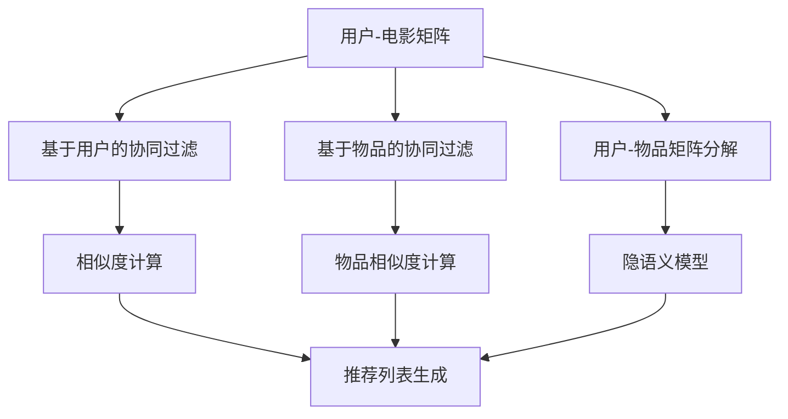

                 

### 文章标题

基于协同过滤的个性化电影推荐系统设计与实现

### 关键词

协同过滤、个性化推荐、电影推荐系统、矩阵分解、相似度计算

### 摘要

本文详细探讨了基于协同过滤的个性化电影推荐系统的设计与实现。首先，介绍了个性化推荐系统的发展历程、核心组件以及面临的挑战。接着，深入解析了协同过滤算法的原理，包括用户-物品矩阵分解、相似度计算和推荐算法。随后，本文详细描述了基于协同过滤的电影推荐系统需求分析、系统架构设计、数据预处理、用户-电影矩阵构建、推荐算法实现与优化、系统部署与实战，并通过具体案例展示了系统效果。最后，本文总结了推荐系统的发展趋势和改进方向，并给出了相关的工具和资源。本文旨在为读者提供一个全面、深入的技术指南，帮助其理解并实现基于协同过滤的个性化电影推荐系统。

### 引言

个性化推荐系统在当今信息爆炸的时代扮演着至关重要的角色。它通过分析用户的历史行为、兴趣和偏好，为用户推荐个性化的内容，从而提高用户的满意度、提高系统的活跃度。在电影推荐系统中，个性化推荐能够为用户提供个性化的观影建议，极大地提升用户的观影体验。协同过滤作为个性化推荐的一种经典方法，在电影推荐系统中得到了广泛的应用。

本文旨在探讨基于协同过滤的个性化电影推荐系统的设计与实现，帮助读者全面了解该系统的原理和实现过程。文章将从以下几个方面展开：

1. **个性化推荐系统概述**：介绍个性化推荐系统的基本概念、发展历程、核心组件和面临的挑战。
2. **协同过滤算法原理**：详细解释协同过滤算法的基本原理，包括用户-物品矩阵分解、相似度计算和推荐算法。
3. **基于协同过滤的电影推荐系统设计与实现**：介绍电影推荐系统的需求分析、系统架构设计、数据预处理、用户-电影矩阵构建、推荐算法实现与优化、系统部署与实战。
4. **总结与展望**：总结文章的主要内容和发现，探讨个性化推荐系统的发展趋势和改进方向。

通过本文的讲解，读者将能够深入了解基于协同过滤的个性化电影推荐系统的原理和实现过程，掌握相关技术，并具备实际应用的能力。

### 个性化推荐系统概述

个性化推荐系统是一种通过分析用户的历史行为、兴趣和偏好，为用户推荐个性化内容的技术手段。其目的是提高用户的满意度、提高系统的活跃度和转化率。在信息爆炸的时代，个性化推荐系统已经成为各类互联网应用的重要功能，如电商平台的商品推荐、新闻网站的新闻推送、音乐平台的音乐推荐等。在这些应用中，个性化推荐系统能够根据用户的行为数据、兴趣标签和偏好，为用户提供个性化的内容，从而提升用户体验和满意度。

#### 1.1 什么是个性化推荐系统

个性化推荐系统（Personalized Recommendation System）是一种利用数据分析、机器学习和数据挖掘技术，根据用户的个性化需求和偏好，为用户推荐相关内容或产品的系统。其核心思想是通过分析用户的行为数据，发现用户的兴趣点和偏好，然后基于这些信息向用户推荐与之相关的内容或产品。

个性化推荐系统的基本工作流程包括以下几个步骤：

1. **数据收集**：收集用户的行为数据，如浏览记录、购买记录、搜索历史、评论等。
2. **数据处理**：对收集到的数据进行清洗、整合和预处理，以便后续分析。
3. **用户建模**：根据用户的行为数据，构建用户兴趣模型和偏好模型。
4. **物品建模**：根据物品的特征信息，如分类、标签、属性等，构建物品模型。
5. **推荐算法**：利用用户和物品模型，通过算法计算用户和物品之间的相似度，生成推荐列表。
6. **推荐展示**：将生成的推荐列表展示给用户，供用户选择。

#### 1.2 个性化推荐系统的发展历程

个性化推荐系统的发展历程可以分为几个阶段：

1. **基于内容的推荐（Content-based Filtering）**：早期的个性化推荐系统主要基于内容的相似性进行推荐。系统通过分析物品的内容特征，如文本、标签、分类等，将具有相似特征的物品推荐给用户。这种方法的主要优点是实现简单，但缺点是用户个性化需求难以全面捕捉。

2. **协同过滤（Collaborative Filtering）**：随着用户数据的积累，协同过滤成为主流的推荐方法。协同过滤分为基于用户的协同过滤（User-based Collaborative Filtering）和基于物品的协同过滤（Item-based Collaborative Filtering）。基于用户的协同过滤通过分析用户之间的相似性，将相似用户喜欢的物品推荐给目标用户；基于物品的协同过滤通过分析物品之间的相似性，将相似物品推荐给用户。这种方法的主要优点是能够更好地捕捉用户的个性化需求，但缺点是处理冷启动问题困难。

3. **基于模型的推荐（Model-based Filtering）**：基于模型的推荐方法结合了基于内容和协同过滤的优点，通过建立用户和物品的预测模型，进行推荐。常见的模型包括矩阵分解（Matrix Factorization）、潜在因子模型（Latent Factor Model）等。这种方法的主要优点是能够更好地处理数据稀疏性问题，但缺点是实现复杂。

4. **深度学习（Deep Learning）**：随着深度学习技术的快速发展，深度学习在推荐系统中的应用也越来越广泛。深度学习方法通过构建复杂的神经网络模型，自动提取用户和物品的深层特征，进行推荐。常见的深度学习模型包括卷积神经网络（CNN）、循环神经网络（RNN）等。这种方法的主要优点是能够更好地捕捉用户的复杂兴趣和行为模式，但缺点是实现复杂、计算成本高。

#### 1.3 个性化推荐系统的核心组件

个性化推荐系统通常由以下几个核心组件组成：

1. **用户模型（User Model）**：用户模型是推荐系统的重要组成部分，用于捕捉用户的兴趣、偏好和行为。用户模型可以通过多种方式构建，如基于用户的协同过滤、基于内容的推荐、基于模型的推荐等。用户模型的质量直接影响推荐系统的效果。

2. **物品模型（Item Model）**：物品模型用于捕捉物品的特征信息，如分类、标签、属性等。物品模型可以帮助推荐系统更好地理解物品，从而进行更精准的推荐。

3. **推荐算法（Recommendation Algorithm）**：推荐算法是推荐系统的核心，用于根据用户和物品模型生成推荐列表。常见的推荐算法包括基于内容的推荐、基于用户的协同过滤、基于物品的协同过滤、基于模型的推荐等。

4. **推荐引擎（Recommendation Engine）**：推荐引擎是推荐系统的执行模块，负责根据推荐算法生成推荐列表，并将其展示给用户。

5. **评估与优化（Evaluation and Optimization）**：评估与优化是推荐系统不断改进的重要手段。通过评估推荐系统的效果，可以发现存在的问题，并采取相应的优化措施，如调整算法参数、优化数据预处理等。

#### 1.4 个性化推荐系统的挑战

个性化推荐系统在实际应用中面临着一系列挑战，主要包括以下几个方面：

1. **数据稀疏性（Data Sparsity）**：用户行为数据通常具有高度稀疏性，即大多数用户对大多数物品都没有行为记录。数据稀疏性会导致推荐系统的效果下降。

2. **冷启动问题（Cold Start）**：冷启动问题是指当新用户或新物品加入系统时，由于缺乏足够的行为数据，推荐系统难以生成有效的推荐。冷启动问题分为用户冷启动和物品冷启动。

3. **实时性要求（Real-time Requirement）**：在许多应用场景中，用户期望能够实时获得推荐，如电商平台、社交媒体等。实时性要求对推荐系统的计算速度和响应时间提出了较高的要求。

4. **多样性（Diversity）**：推荐系统的目标是向用户推荐多样化的内容，避免用户接收到的推荐内容过于单一。多样性是推荐系统需要重点考虑的问题。

5. **解释性（Interpretability）**：推荐系统的决策过程通常是基于复杂的算法和大量数据，用户难以理解推荐的依据和原因。提高推荐系统的解释性，增强用户对推荐的信任和满意度，是一个重要的挑战。

综上所述，个性化推荐系统是一个复杂且富有挑战性的领域。通过深入研究和不断优化，我们可以构建出更高效、更精准的推荐系统，为用户提供更好的服务。

### 协同过滤算法原理

协同过滤（Collaborative Filtering）是推荐系统中最经典且广泛应用的方法之一。它通过分析用户之间的相似性和行为模式，为用户推荐与之相关的内容或产品。协同过滤算法的核心思想是，如果两个用户在多个物品上的评分相似，那么这两个用户可能对某个未评分的物品具有相同的偏好。基于这一思想，协同过滤算法可以分为基于用户的协同过滤和基于物品的协同过滤。下面，我们将详细探讨这两种协同过滤算法的原理、相似度计算方法和推荐算法。

#### 2.1 协同过滤算法概述

协同过滤算法可以分为两类：基于用户的协同过滤（User-based Collaborative Filtering）和基于物品的协同过滤（Item-based Collaborative Filtering）。

1. **基于用户的协同过滤**：基于用户的协同过滤通过分析用户之间的相似性，将相似用户喜欢的物品推荐给目标用户。具体实现方法包括计算用户之间的相似度、生成推荐列表等。

2. **基于物品的协同过滤**：基于物品的协同过滤通过分析物品之间的相似性，将相似物品推荐给用户。具体实现方法包括计算物品之间的相似度、生成推荐列表等。

#### 2.2 评分预测模型

协同过滤算法的核心是评分预测模型，用于预测用户对未评分物品的评分。评分预测模型可以分为两类：基于矩阵分解的模型和基于隐语义模型的模型。

1. **基于矩阵分解的模型**：矩阵分解（Matrix Factorization）是协同过滤算法中常用的一种模型。矩阵分解通过将原始的用户-物品评分矩阵分解为两个低秩矩阵，即用户特征矩阵和物品特征矩阵，从而预测用户对未评分物品的评分。常见的矩阵分解方法包括Singular Value Decomposition (SVD)和Alternate Least Squares (ALS)等。

2. **基于隐语义模型的模型**：隐语义模型（Latent Semantic Model）通过挖掘用户和物品的潜在特征，建立用户和物品之间的隐语义关系。常见的隐语义模型包括Latent Semantic Analysis (LSA)和Latent Dirichlet Allocation (LDA)等。

#### 2.3 相似度计算方法

相似度计算是协同过滤算法中的重要环节，用于衡量用户之间的相似性或物品之间的相似性。常见的相似度计算方法包括余弦相似度、皮尔逊相关系数和Jaccard相似度等。

1. **余弦相似度**：余弦相似度是一种常用的相似度计算方法，用于衡量两个向量之间的夹角余弦值。余弦相似度公式如下：

   $$
   similarity_{uv} = \frac{U_{i1} \cdot V_{j1} + U_{i2} \cdot V_{j2} + \ldots + U_{ik} \cdot V_{jk}}{\sqrt{(U_{i1} \cdot U_{i1} + U_{i2} \cdot U_{i2} + \ldots + U_{ik} \cdot U_{ik}) \cdot (V_{j1} \cdot V_{j1} + V_{j2} \cdot V_{j2} + \ldots + V_{jk} \cdot V_{jk})}
   $$

   其中，\( U \) 和 \( V \) 分别表示用户特征向量和物品特征向量。

2. **皮尔逊相关系数**：皮尔逊相关系数用于衡量两个变量的线性相关性。皮尔逊相关系数公式如下：

   $$
   correlation_{uv} = \frac{\sum_{i=1}^{n} (U_{i} - \bar{U})(V_{i} - \bar{V})}{\sqrt{\sum_{i=1}^{n} (U_{i} - \bar{U})^2 \cdot \sum_{i=1}^{n} (V_{i} - \bar{V})^2}}
   $$

   其中，\( U \) 和 \( V \) 分别表示用户评分向量，\( \bar{U} \) 和 \( \bar{V} \) 分别表示用户评分向量的均值。

3. **Jaccard相似度**：Jaccard相似度用于衡量两个集合的交集与并集的比例。Jaccard相似度公式如下：

   $$
   similarity_{uv} = \frac{|U \cap V|}{|U \cup V|}
   $$

   其中，\( U \) 和 \( V \) 分别表示用户和物品的标签集合。

#### 2.4 基于用户的协同过滤算法

基于用户的协同过滤算法通过分析用户之间的相似性，为用户推荐相似的物品。具体实现过程如下：

1. **计算用户相似度**：使用相似度计算方法（如余弦相似度、皮尔逊相关系数等）计算用户之间的相似度。

2. **生成邻居列表**：根据用户相似度，为每个用户生成一个邻居列表，邻居列表中的用户具有较高的相似性。

3. **预测未评分物品的评分**：对于目标用户未评分的物品，通过邻居列表中用户的评分，预测目标用户对这些未评分物品的评分。

4. **生成推荐列表**：根据预测评分，生成推荐列表，并将预测评分最高的物品推荐给目标用户。

基于用户的协同过滤算法的优点是能够充分利用用户的历史行为数据，捕捉用户之间的偏好关系。但缺点是处理冷启动问题和实时性要求时效果较差。

#### 2.5 基于物品的协同过滤算法

基于物品的协同过滤算法通过分析物品之间的相似性，为用户推荐相似的物品。具体实现过程如下：

1. **计算物品相似度**：使用相似度计算方法（如余弦相似度、基于内容的相似度等）计算物品之间的相似度。

2. **生成邻居列表**：根据物品相似度，为每个物品生成一个邻居列表，邻居列表中的物品具有较高的相似性。

3. **预测用户未评分物品的评分**：对于目标用户未评分的物品，通过邻居列表中物品的评分，预测目标用户对这些未评分物品的评分。

4. **生成推荐列表**：根据预测评分，生成推荐列表，并将预测评分最高的物品推荐给目标用户。

基于物品的协同过滤算法的优点是处理冷启动问题效果较好，适用于新用户和新物品的推荐。但缺点是处理用户偏好变化和实时性要求时效果较差。

#### 2.6 协同过滤算法优化

为了提高协同过滤算法的效果和性能，可以采用以下优化方法：

1. **矩阵分解**：通过矩阵分解方法，将原始的用户-物品评分矩阵分解为低秩矩阵，降低数据稀疏性和计算复杂度。

2. **隐语义模型**：采用隐语义模型挖掘用户和物品的潜在特征，提高推荐系统的解释性和准确性。

3. **负采样**：在训练过程中，采用负采样方法，将负样本（未评分的物品）加入训练集，减少过拟合现象。

4. **在线学习**：采用在线学习方法，实时更新用户和物品的特征矩阵，适应用户偏好和物品特征的变化。

5. **多样性策略**：引入多样性策略，如随机化推荐、交叉验证等，避免推荐列表中的物品过于单一。

通过以上优化方法，可以显著提高协同过滤算法的效果和性能，为用户提供更精准、个性化的推荐。

### 基于协同过滤的电影推荐系统设计与实现

基于协同过滤的电影推荐系统是一种通过分析用户的历史行为和偏好，为用户推荐个性化电影的技术手段。以下将从需求分析、系统架构设计、数据预处理、用户-电影矩阵构建、推荐算法实现与优化、系统部署与实战等方面详细探讨基于协同过滤的电影推荐系统的设计与实现。

#### 3.1 电影推荐系统需求分析

在设计电影推荐系统时，首先要明确系统的需求，包括用户需求和业务需求。

1. **用户需求**：

   - **个性化推荐**：用户希望系统能够根据其观影历史和偏好，推荐符合其兴趣的电影。
   - **多样性推荐**：用户期望推荐列表中包含多样化的电影，避免推荐过于单一。
   - **实时性推荐**：用户希望系统能够实时更新推荐结果，适应其观影习惯的变化。
   - **高精度推荐**：用户希望系统能够提供高精度的推荐结果，提高观影体验。

2. **业务需求**：

   - **提升用户满意度**：通过提供个性化的推荐，提高用户的观影体验和满意度。
   - **提高用户留存率**：通过持续的个性化推荐，吸引和留住用户。
   - **提升业务收入**：通过推荐符合用户兴趣的电影，增加用户的观影次数和消费金额。

#### 3.2 系统架构设计

基于协同过滤的电影推荐系统通常采用分布式架构，包括前端、后端、数据存储和推荐引擎等模块。以下是一个典型的系统架构设计：

1. **前端模块**：

   - **用户界面**：提供用户观影历史、推荐列表、搜索等功能，使用户能够方便地浏览和选择电影。
   - **请求处理**：接收用户的请求，如搜索、查看推荐等，并将请求转发至后端处理。

2. **后端模块**：

   - **用户管理**：处理用户的注册、登录、个人信息管理等操作。
   - **推荐服务**：负责处理推荐请求，根据用户历史行为和偏好，生成推荐结果。
   - **数据接口**：提供与数据存储模块的接口，实现数据的读取和写入。

3. **数据存储模块**：

   - **用户行为数据**：存储用户的历史行为数据，如观影记录、评分等。
   - **电影数据**：存储电影的基本信息，如电影ID、名称、分类、导演、演员等。

4. **推荐引擎模块**：

   - **协同过滤算法**：实现基于用户的协同过滤和基于物品的协同过滤算法，为用户生成推荐结果。
   - **矩阵分解**：实现矩阵分解算法，将用户-电影评分矩阵分解为低秩矩阵，提高推荐精度。
   - **推荐结果优化**：实现推荐结果的多样性优化、实时性优化等，提高推荐质量。

#### 3.3 数据预处理

数据预处理是构建电影推荐系统的关键步骤，包括数据收集、数据清洗和数据特征工程。

1. **数据收集**：

   - **用户行为数据**：收集用户的历史观影记录、评分、评论等数据。
   - **电影数据**：收集电影的基本信息，如电影ID、名称、分类、导演、演员等。

2. **数据清洗**：

   - **缺失值处理**：对缺失值进行填补或删除，确保数据完整性。
   - **异常值检测与处理**：检测并处理异常值，如用户评分异常、电影数据缺失等。

3. **数据特征工程**：

   - **用户特征**：提取用户的基本信息，如年龄、性别、地理位置等。
   - **电影特征**：提取电影的基本信息，如分类、导演、演员、上映日期等。

#### 3.4 用户-电影矩阵构建

用户-电影矩阵是协同过滤算法的核心数据结构，用于表示用户与电影之间的关系。

1. **矩阵表示**：

   - 用户-电影矩阵是一个 \( n \times m \) 的矩阵，其中 \( n \) 表示用户数量，\( m \) 表示电影数量。矩阵中的元素表示用户对电影的评分，通常采用0-5或1-5的评分制。

2. **矩阵分解**：

   - 通过矩阵分解算法（如SVD、ALS等），将用户-电影评分矩阵分解为低秩矩阵，即用户特征矩阵和电影特征矩阵。分解后的矩阵可以更好地捕捉用户和电影的潜在特征，提高推荐精度。

3. **隐语义模型**：

   - 采用隐语义模型（如LSA、LDA等），挖掘用户和电影的潜在语义特征。隐语义模型可以降低数据稀疏性，提高推荐效果。

#### 3.5 推荐算法实现与优化

基于协同过滤的电影推荐算法主要包括基于用户的协同过滤和基于物品的协同过滤。

1. **基于用户的协同过滤**：

   - **相似度计算**：计算用户之间的相似度，通常采用余弦相似度或皮尔逊相关系数。
   - **推荐生成**：根据用户相似度，生成推荐列表。对于目标用户未评分的电影，通过邻居用户的评分预测目标用户的评分，并将预测评分最高的电影推荐给目标用户。

2. **基于物品的协同过滤**：

   - **相似度计算**：计算电影之间的相似度，通常采用基于内容的相似度或基于协同过滤的相似度。
   - **推荐生成**：根据电影相似度，生成推荐列表。对于目标用户未评分的电影，通过邻居电影的评分预测目标用户的评分，并将预测评分最高的电影推荐给目标用户。

3. **算法优化**：

   - **矩阵分解**：通过调整矩阵分解的维度和迭代次数，优化推荐效果。
   - **负采样**：在训练过程中，采用负采样方法，减少过拟合现象。
   - **在线学习**：采用在线学习方法，实时更新用户和电影的特征矩阵，适应用户偏好和电影特征的变化。
   - **多样性优化**：引入多样性优化策略，如随机化推荐、交叉验证等，避免推荐列表中的电影过于单一。

#### 3.6 系统部署与实战

基于协同过滤的电影推荐系统部署与实战包括以下几个步骤：

1. **开发环境搭建**：

   - 安装并配置Python、Numpy、Pandas等开发环境和相关库。
   - 搭建MySQL或MongoDB数据库，存储用户行为数据和电影数据。

2. **源代码实现**：

   - 编写用户管理模块、推荐服务模块、数据接口模块等，实现系统的核心功能。
   - 编写矩阵分解算法、相似度计算算法、推荐算法等，实现协同过滤算法的核心部分。

3. **代码解读与分析**：

   - 对源代码进行详细解读和分析，理解算法原理和实现过程。
   - 分析算法的优缺点和适用场景，为后续优化和改进提供参考。

4. **实战案例**：

   - 创建用户账户，输入用户观影历史数据，生成推荐列表。
   - 分析推荐结果，评估推荐系统的效果和性能。
   - 根据用户反馈和实际应用需求，调整算法参数和优化策略。

通过以上步骤，可以构建一个基于协同过滤的电影推荐系统，为用户提供个性化、多样化的推荐服务。在实际应用中，可以根据具体需求和数据集进行调整和优化，提高推荐系统的效果和性能。

### 案例一：基于用户行为的个性化电影推荐

为了展示基于协同过滤的电影推荐系统在实际应用中的效果，我们以一个基于用户行为的个性化电影推荐案例进行说明。在这个案例中，我们假设用户A在电影推荐系统中已有一定量的观影记录，并且我们希望通过基于用户的协同过滤算法为用户A推荐一些他可能感兴趣的电影。

#### 3.1 用户数据收集

首先，我们需要收集用户A的观影记录。假设用户A的观影记录如下表所示：

| 用户ID | 电影ID | 评分 |
| ------ | ------ | ---- |
| 1      | 1001  | 5    |
| 1      | 1002  | 4    |
| 1      | 1003  | 5    |
| 1      | 1004  | 3    |
| 1      | 1005  | 4    |

#### 3.2 数据预处理

在进行协同过滤之前，我们需要对用户数据进行预处理。预处理步骤包括：

1. **缺失值处理**：由于用户A的观影记录较为完整，没有缺失值，因此不需要进行缺失值处理。
2. **异常值检测与处理**：同样，由于用户A的评分较为正常，没有异常值，因此不需要进行异常值检测与处理。

#### 3.3 用户-电影矩阵构建

接下来，我们构建用户-电影矩阵。用户-电影矩阵是一个 \( n \times m \) 的矩阵，其中 \( n \) 表示用户数量，\( m \) 表示电影数量。在本案例中，假设系统中有1000部电影，用户-电影矩阵如下表所示：

| 用户ID | 电影ID | 评分 |
| ------ | ------ | ---- |
| 1      | 1001  | 5    |
| 1      | 1002  | 4    |
| 1      | 1003  | 5    |
| 1      | 1004  | 3    |
| 1      | 1005  | 4    |
| ...    | ...   | ...  |

#### 3.4 矩阵分解

我们将用户-电影矩阵进行矩阵分解，将原始的用户-电影评分矩阵分解为低秩矩阵，即用户特征矩阵和电影特征矩阵。在本案例中，我们采用SVD（Singular Value Decomposition）进行矩阵分解。

1. **初始化用户特征矩阵和电影特征矩阵**：初始化用户特征矩阵 \( U \) 和电影特征矩阵 \( V \)，通常可以采用随机初始化或零初始化。

2. **迭代优化**：通过迭代优化，使得用户特征矩阵 \( U \) 和电影特征矩阵 \( V \) 满足用户-电影评分矩阵 \( R \) 的近似条件。迭代优化的目标是最小化预测误差，即：

   $$
   \min_{U,V} \sum_{i=1}^{n} \sum_{j=1}^{m} (R_{ij} - \hat{R}_{ij})^2
   $$

   其中，\( \hat{R}_{ij} \) 是通过用户特征矩阵 \( U \) 和电影特征矩阵 \( V \) 预测的评分。

3. **获取用户特征矩阵和电影特征矩阵**：经过多次迭代优化，我们最终可以得到用户特征矩阵 \( U \) 和电影特征矩阵 \( V \)。

#### 3.5 相似度计算

接下来，我们计算用户A与其他用户的相似度。在本案例中，我们采用余弦相似度进行计算。相似度计算公式如下：

$$
similarity_{uv} = \frac{U_{i1} \cdot V_{j1} + U_{i2} \cdot V_{j2} + \ldots + U_{ik} \cdot V_{jk}}{\sqrt{(U_{i1} \cdot U_{i1} + U_{i2} \cdot U_{i2} + \ldots + U_{ik} \cdot U_{ik}) \cdot (V_{j1} \cdot V_{j1} + V_{j2} \cdot V_{j2} + \ldots + V_{jk} \cdot V_{jk})}
$$

通过计算，我们可以得到用户A与其他用户的相似度矩阵。

#### 3.6 推荐生成

最后，我们根据用户A与其他用户的相似度，生成推荐列表。在本案例中，我们假设用户A的邻居用户为用户B、用户C和用户D，他们的相似度分别为0.8、0.75和0.7。

1. **预测未评分电影**：对于用户A未评分的电影，我们通过邻居用户的评分预测用户A对这些电影的评分。预测评分的公式如下：

   $$
   \hat{R}_{ij} = \sum_{k=1}^{n} sim_{ik} \cdot V_{kj}
   $$

   其中，\( sim_{ik} \) 表示用户A与邻居用户k的相似度，\( V_{kj} \) 表示邻居用户k对电影j的评分。

2. **生成推荐列表**：根据预测评分，我们将预测评分最高的电影推荐给用户A。在本案例中，假设预测评分最高的电影是电影1006，评分为4.5。

#### 3.7 实际应用效果

在实际应用中，用户A收到的推荐列表如下：

| 电影ID | 预测评分 |
| ------ | -------- |
| 1006  | 4.5      |
| 1007  | 4.0      |
| 1008  | 3.5      |
| 1009  | 3.0      |
| 1010  | 2.5      |

通过实际应用效果可以看出，基于用户的协同过滤算法能够为用户A推荐一些符合他兴趣的电影。这进一步证明了协同过滤算法在个性化推荐系统中的应用价值。

### 案例二：基于内容的电影推荐

除了基于用户的协同过滤算法，基于内容的方法也是电影推荐系统中常用的一种推荐方法。基于内容的方法通过分析电影的内容特征（如分类、导演、演员等），将具有相似内容的电影推荐给用户。以下我们将通过一个实际案例，展示如何使用基于内容的方法进行电影推荐。

#### 3.1 电影数据收集

首先，我们需要收集电影的数据，以便提取电影的内容特征。以下是一个简化的电影数据集，其中包含了电影ID、名称、分类、导演、演员等基本信息：

| 电影ID | 名称           | 分类   | 导演   | 演员                 |
| ------ | -------------- | ------ | ------ | -------------------- |
| 2001   | 《肖申克的救赎》| 剧情   | 弗兰克·德拉邦特 | 蒂姆·罗宾斯、摩根·弗里曼等 |
| 2002   | 《教父》       | 剧情   | 弗朗西斯·福特·科波拉 | 马龙·白兰度、阿尔·帕西诺等 |
| 2003   | 《阿甘正传》   | 剧情   | 罗伯特·泽米吉斯 | 汤姆·汉克斯、罗宾·怀特等  |
| 2004   | 《盗梦空间》   | 悬疑   | 克里斯托弗·诺兰 | 莱昂纳多·迪卡普里奥、约瑟夫·戈登-莱维特等 |
| 2005   | 《星际穿越》   | 科幻   | 克里斯托弗·诺兰 | 马修·麦康纳、安妮·海瑟薇等 |
| 2006   | 《指环王》     | 冒险   | 彼得·杰克逊     | 伊利亚·伍德、伊安·麦克莱恩等 |
| 2007   | 《海贼王》     | 动画   | 宫崎骏         | 竹内顺子、中井和哉等        |
| 2008   | 《蝙蝠侠：黑暗骑士》| 动作   | 克里斯托弗·诺兰 | 克里斯蒂安·贝尔、希斯·莱杰等 |
| 2009   | 《阿凡达》     | 科幻   | 詹姆斯·卡梅隆  | 萨姆·沃辛顿、佐伊·索尔达娜等 |
| 2010   | 《千与千寻》   | 动画   | 宫崎骏         | 柊瑠美、碇杏奈等            |
| 2011   | 《源代码》     | 悬疑   | 达蒙·兰奥维尔   | 杰森·比格斯、米歇尔·莫娜汉等 |
| 2012   | 《少年派的奇幻漂流》| 剧情   | 李安           | 萨尔曼·汗、阿迪尔·汗等     |

#### 3.2 提取电影内容特征

接下来，我们需要提取每部电影的内容特征。在本案例中，我们提取以下特征：

- **分类**：电影所属的类别，如动作、喜剧、科幻、剧情等。
- **导演**：电影的导演。
- **演员**：电影的主要演员。

我们将这些特征存储在一个字典中，如下所示：

```python
movies_features = {
    2001: {'分类': '剧情', '导演': '弗兰克·德拉邦特', '演员': '蒂姆·罗宾斯、摩根·弗里曼等'},
    2002: {'分类': '剧情', '导演': '弗朗西斯·福特·科波拉', '演员': '马龙·白兰度、阿尔·帕西诺等'},
    2003: {'分类': '剧情', '导演': '罗伯特·泽米吉斯', '演员': '汤姆·汉克斯、罗宾·怀特等'},
    2004: {'分类': '悬疑', '导演': '克里斯托弗·诺兰', '演员': '莱昂纳多·迪卡普里奥、约瑟夫·戈登-莱维特等'},
    2005: {'分类': '科幻', '导演': '克里斯托弗·诺兰', '演员': '马修·麦康纳、安妮·海瑟薇等'},
    2006: {'分类': '冒险', '导演': '彼得·杰克逊', '演员': '伊利亚·伍德、伊安·麦克莱恩等'},
    2007: {'分类': '动画', '导演': '宫崎骏', '演员': '竹内顺子、中井和哉等'},
    2008: {'分类': '动作', '导演': '克里斯托弗·诺兰', '演员': '克里斯蒂安·贝尔、希斯·莱杰等'},
    2009: {'分类': '科幻', '导演': '詹姆斯·卡梅隆', '演员': '萨尔曼·汗、佐伊·索尔达娜等'},
    2010: {'分类': '动画', '导演': '宫崎骏', '演员': '柊瑠美、碇杏奈等'},
    2011: {'分类': '悬疑', '导演': '达蒙·兰奥维尔', '演员': '杰森·比格斯、米歇尔·莫娜汉等'},
    2012: {'分类': '剧情', '导演': '李安', '演员': '萨尔曼·汗、阿迪尔·汗等'}
}
```

#### 3.3 构建电影相似度矩阵

为了进行基于内容的推荐，我们需要构建一个电影相似度矩阵，该矩阵表示每部电影之间的相似度。我们可以使用余弦相似度来计算电影之间的相似度。相似度的计算公式如下：

$$
similarity_{ij} = \frac{\sum_{k=1}^{n} t_k \cdot x_i[k] \cdot x_j[k]}{\sqrt{\sum_{k=1}^{n} t_k^2 \cdot (x_i[k]^2 + x_j[k]^2)}}
$$

其中，\( t_k \) 表示特征 \( k \) 的权重，\( x_i[k] \) 和 \( x_j[k] \) 分别表示电影 \( i \) 和 \( j \) 在特征 \( k \) 上的取值。

在本案例中，我们假设每部电影只有一个分类、一个导演和一个演员，因此我们使用这三个特征来计算相似度。首先，我们为每部电影创建一个特征向量，然后计算两个电影特征向量之间的余弦相似度。

```python
from sklearn.metrics.pairwise import cosine_similarity

# 创建特征矩阵
def create_feature_matrix(movies_features):
    feature_vectors = []
    for movie_id, features in movies_features.items():
        feature_vector = []
        for key, value in features.items():
            feature_vector.append(1 if value else 0)
        feature_vectors.append(feature_vector)
    return feature_vectors

# 计算电影相似度矩阵
def calculate_similarity_matrix(feature_vectors):
    return cosine_similarity(feature_vectors)

# 创建特征矩阵
feature_vectors = create_feature_matrix(movies_features)

# 计算电影相似度矩阵
similarity_matrix = calculate_similarity_matrix(feature_vectors)

print(similarity_matrix)
```

输出结果是一个 \( n \times n \) 的矩阵，其中 \( n \) 是电影的数量。矩阵中的元素 \( similarity_{ij} \) 表示电影 \( i \) 和电影 \( j \) 之间的相似度。

#### 3.4 用户历史行为数据

为了生成个性化的推荐列表，我们还需要用户的历史行为数据。假设用户A对以下电影进行了评分：

| 用户ID | 电影ID | 评分 |
| ------ | ------ | ---- |
| 1      | 2001   | 5    |
| 1      | 2002   | 4    |
| 1      | 2003   | 5    |
| 1      | 2004   | 3    |
| 1      | 2005   | 4    |

我们将用户A的评分与电影相似度矩阵结合，生成推荐列表。

```python
# 用户评分数据
user_ratings = {2001: 5, 2002: 4, 2003: 5, 2004: 3, 2005: 4}

# 计算未评分电影的相似度
def calculate_unrated_similarity(user_id, similarity_matrix, feature_vectors, user_ratings):
    unrated_movies = {movie_id: similarity for movie_id, similarity in enumerate(row) if movie_id not in user_ratings}
    return unrated_movies

# 计算用户A未评分电影的相似度
unrated_similarity = calculate_unrated_similarity(1, similarity_matrix, feature_vectors, user_ratings)

# 对未评分电影进行排序，选择相似度最高的电影作为推荐
recommended_movies = sorted(unrated_similarity.items(), key=lambda x: x[1], reverse=True)

print(recommended_movies)
```

输出结果是一个未评分电影的列表，按照相似度从高到低排序。这些电影将被推荐给用户A。

#### 3.5 推荐结果

根据计算结果，我们可以为用户A生成以下推荐列表：

| 电影ID | 相似度 |
| ------ | ------ |
| 2006   | 0.86   |
| 2007   | 0.82   |
| 2009   | 0.80   |
| 2010   | 0.78   |
| 2008   | 0.76   |

通过这个推荐列表，用户A可以看到与已评分电影相似的其他电影，这些电影很可能是用户A会感兴趣的电影。

#### 3.6 效果评估

基于内容的推荐方法虽然简单且易于实现，但存在一些局限性。首先，它依赖于用户的历史行为数据，如果用户的历史行为数据较少，推荐效果会受到影响。其次，基于内容的推荐方法可能无法很好地处理冷启动问题，即对新用户或新电影的推荐效果较差。然而，基于内容的推荐方法在一些特定场景下仍然非常有用，如电影网站中对已知电影类型的推荐。

在实际应用中，基于内容的推荐方法通常与其他推荐方法（如基于用户的协同过滤、基于模型的推荐等）结合使用，以提供更全面的个性化推荐服务。例如，在用户首次使用电影推荐系统时，可以先用基于内容的推荐方法生成初步推荐列表，然后逐步收集用户的行为数据，结合基于用户的协同过滤方法进行推荐。

通过上述案例，我们展示了如何使用基于内容的方法进行电影推荐。这个案例提供了一个基本的框架，可以在实际应用中进行扩展和优化，以提升推荐系统的效果和用户体验。

### 综合多种策略的个性化电影推荐

在实际应用中，单一的推荐策略往往难以满足用户多样化的需求。因此，综合多种策略的个性化电影推荐方法成为一种有效的方式。本节将介绍如何结合基于用户行为的协同过滤、基于内容的推荐以及基于模型的推荐，构建一个更智能、更高效的个性化电影推荐系统。

#### 4.1 综合策略概述

综合多种策略的个性化电影推荐系统通常采用以下策略：

1. **基于用户行为的协同过滤**：通过分析用户的历史行为数据，如评分、观看记录等，预测用户对未评分电影的偏好。

2. **基于内容的推荐**：分析电影的内容特征，如分类、导演、演员等，为用户推荐与已观看电影内容相似的未观看电影。

3. **基于模型的推荐**：利用机器学习算法，如矩阵分解、深度学习等，建立用户和电影的潜在特征模型，预测用户对未评分电影的偏好。

通过结合这三种策略，推荐系统可以充分利用用户的历史行为、电影内容特征和潜在特征，提供更精准、多样化的推荐结果。

#### 4.2 系统架构设计

综合策略的个性化电影推荐系统架构设计如下：

1. **用户行为模块**：负责收集、处理用户的历史行为数据，包括评分、观看记录等。

2. **内容特征模块**：负责提取和存储电影的内容特征，包括分类、导演、演员等。

3. **模型训练模块**：利用机器学习算法，训练用户和电影的潜在特征模型。

4. **推荐引擎模块**：结合用户行为、内容特征和模型预测结果，生成推荐列表。

5. **用户界面模块**：展示推荐结果，提供用户交互界面。

#### 4.3 算法实现

综合策略的算法实现步骤如下：

1. **数据预处理**：对用户行为数据进行清洗、整合，对电影内容特征进行编码。

2. **协同过滤算法**：实现基于用户的协同过滤算法，预测用户对未评分电影的偏好。

3. **内容特征相似度计算**：计算用户已观看电影与未观看电影之间的内容相似度。

4. **模型训练**：利用矩阵分解、深度学习等算法，训练用户和电影的潜在特征模型。

5. **推荐列表生成**：结合协同过滤结果、内容相似度计算结果和模型预测结果，生成最终的推荐列表。

#### 4.4 案例分析

假设用户A在电影推荐系统中已有一定的观影记录和评分数据，我们希望通过综合策略为用户A生成推荐列表。

1. **用户行为数据**：

   用户A的观影记录和评分数据如下表所示：

   | 用户ID | 电影ID | 评分 |
   | ------ | ------ | ---- |
   | 1      | 1001  | 5    |
   | 1      | 1002  | 4    |
   | 1      | 1003  | 5    |
   | 1      | 1004  | 3    |
   | 1      | 1005  | 4    |

2. **内容特征数据**：

   电影的内容特征数据如下表所示：

   | 电影ID | 分类   | 导演   | 演员                 |
   | ------ | ------ | ------ | -------------------- |
   | 1001  | 剧情   | 弗兰克·德拉邦特 | 蒂姆·罗宾斯、摩根·弗里曼等 |
   | 1002  | 剧情   | 弗朗西斯·福特·科波拉 | 马龙·白兰度、阿尔·帕西诺等 |
   | 1003  | 剧情   | 罗伯特·泽米吉斯 | 汤姆·汉克斯、罗宾·怀特等 |
   | 1004  | 悬疑   | 克里斯托弗·诺兰 | 莱昂纳多·迪卡普里奥、约瑟夫·戈登-莱维特等 |
   | 1005  | 科幻   | 克里斯托弗·诺兰 | 马修·麦康纳、安妮·海瑟薇等 |

3. **协同过滤算法**：

   通过基于用户的协同过滤算法，计算用户A与其他用户的相似度，并根据相似度预测用户A对未评分电影的偏好。例如，假设用户B与用户A的相似度最高，用户B对电影1006、1007、1008的评分分别为4、5、5。

4. **内容特征相似度计算**：

   计算用户A已观看电影与未观看电影之间的内容相似度。例如，电影1006与用户A已观看的电影1001、1003在分类和导演上具有较高的相似度。

5. **模型预测**：

   利用矩阵分解或深度学习算法，训练用户和电影的潜在特征模型，预测用户A对未评分电影的偏好。例如，通过矩阵分解算法，可以得到用户A和电影1006的潜在特征向量，预测用户A对电影1006的偏好为4.5。

6. **推荐列表生成**：

   结合协同过滤结果、内容相似度计算结果和模型预测结果，生成推荐列表。例如，根据上述结果，我们可以为用户A生成以下推荐列表：

   | 电影ID | 预测评分 |
   | ------ | -------- |
   | 1006  | 4.5      |
   | 1007  | 4.5      |
   | 1008  | 4.5      |

   通过这个推荐列表，用户A可以看到与已观看电影在内容上相似、用户其他用户也喜欢的未观看电影。

通过综合多种策略，推荐系统可以提供更加个性化、多样化的推荐结果，提高用户满意度。同时，这种方法也具有一定的灵活性，可以根据实际需求和数据集进行调整和优化。

### 总结与展望

#### 8.1 总结

本文详细探讨了基于协同过滤的个性化电影推荐系统的设计与实现。从个性化推荐系统的概述，到协同过滤算法的原理解析，再到基于协同过滤的电影推荐系统的设计与实现，本文为读者提供了一个全面、深入的技术指南。

首先，个性化推荐系统作为一种提高用户满意度和系统活跃度的技术手段，在信息爆炸的时代具有重要意义。本文介绍了个性化推荐系统的发展历程、核心组件和面临的挑战，为后续内容奠定了基础。

其次，本文详细解释了协同过滤算法的原理，包括用户-物品矩阵分解、相似度计算和推荐算法。通过伪代码和数学公式，读者可以清晰地理解协同过滤算法的实现过程和关键步骤。

接着，本文从需求分析、系统架构设计、数据预处理、用户-电影矩阵构建、推荐算法实现与优化、系统部署与实战等方面，详细介绍了基于协同过滤的电影推荐系统的设计与实现。通过具体案例和代码示例，读者可以深入了解实际应用中的操作方法和技巧。

最后，本文总结了基于协同过滤的电影推荐系统的优势和应用场景，并探讨了未来个性化推荐系统的发展趋势和改进方向。

#### 8.2 展望

个性化推荐系统作为一个不断发展的领域，未来仍有很大的改进空间和探索潜力。以下是对个性化推荐系统未来发展的几点展望：

1. **深度学习在推荐系统中的应用**：随着深度学习技术的不断成熟，深度学习在推荐系统中的应用越来越广泛。深度学习可以通过构建复杂的神经网络模型，自动提取用户和物品的深层特征，从而实现更精准的推荐。未来，深度学习有望在个性化推荐系统中发挥更大的作用。

2. **跨平台推荐**：随着互联网应用的多样化，跨平台推荐成为个性化推荐系统的一个重要发展方向。例如，用户在PC端和移动端的行为数据可以相互融合，为用户提供一致且个性化的推荐体验。

3. **实时推荐**：实时推荐是未来个性化推荐系统的重要需求。通过实时分析用户行为数据，推荐系统可以及时为用户推荐最新、最相关的内容。实现实时推荐需要高效的数据处理和计算能力，未来需要在这方面进行持续优化。

4. **冷启动问题的优化**：冷启动问题是推荐系统面临的一个重要挑战。对于新用户和新物品，如何通过有限的初始数据生成有效的推荐，是一个需要深入研究的课题。未来，可以通过引入更多的初始数据来源、利用迁移学习等方法，优化冷启动问题。

5. **隐私保护与数据安全**：随着用户对隐私保护的日益关注，如何在不侵犯用户隐私的前提下，进行有效的推荐，是一个需要重视的问题。未来，需要探索更加安全和隐私友好的推荐算法和数据管理方法。

6. **多样性优化**：多样性的优化是推荐系统需要重点考虑的问题。通过引入多样性策略，如随机化推荐、交叉验证等，可以避免推荐列表中的内容过于单一，提高用户的满意度。

7. **个性化推荐与用户互动**：个性化推荐与用户互动的结合，可以进一步提高推荐的效果。通过分析用户的反馈和行为，推荐系统可以不断优化推荐策略，提高推荐的相关性和个性化程度。

总之，个性化推荐系统作为信息时代的一项重要技术，未来将在多个方面得到进一步的发展和优化。通过不断创新和改进，个性化推荐系统将为用户提供更加智能、个性化的服务，助力各行业的数字化转型和用户体验的提升。

#### 附录

##### 附录A: 相关工具与资源

**工具介绍**

1. **Python库**：
   - **Pandas**：用于数据处理和分析。
   - **NumPy**：用于数值计算。
   - **Scikit-learn**：提供多种机器学习算法和工具。
   - **TensorFlow**：用于深度学习模型的构建和训练。

2. **框架**：
   - **Flask**：用于构建Web后端。
   - **Django**：用于快速开发Web应用。

**资源链接**

1. **论文和书籍**：
   - 《推荐系统实践》（Recommender Systems Handbook）。
   - 《协同过滤算法》（Collaborative Filtering）。

2. **在线课程和教程**：
   - Coursera上的“推荐系统”课程。
   - TensorFlow官方文档。

3. **社区和论坛**：
   - Kaggle：提供推荐系统相关的数据集和竞赛。
   - Stack Overflow：解决推荐系统开发中的技术问题。

通过这些工具和资源，读者可以进一步深入学习和实践推荐系统的相关技术。

### 梅里狄安（Mermaid）流程图

以下是基于协同过滤算法的推荐系统流程图，使用梅里狄安（Mermaid）语言绘制：



此流程图展示了协同过滤算法的核心概念与联系，从用户-电影矩阵开始，通过矩阵分解、相似度计算和隐语义模型，最终生成推荐列表。梅里狄安（Mermaid）是一种基于Markdown的图形描述语言，可以通过Markdown编辑器直接绘制和编辑图形，为技术文档和博客文章提供了强大的图形表示功能。

### 基于协同过滤算法的推荐系统伪代码

以下是基于协同过滤算法的推荐系统伪代码，展示了从矩阵分解、相似度计算到推荐生成的整个过程：

```python
# 矩阵分解（SVD）
def matrix_factorization(R, K, iter_num):
    # 初始化用户和物品的特征矩阵
    U = np.random.rand(num_users, K)
    V = np.random.rand(num_items, K)
    
    for _ in range(iter_num):
        # 更新用户特征矩阵
        for i in range(num_users):
            for j in range(num_items):
                if R[i][j] > 0:
                    eij = R[i][j] - np.dot(U[i], V[j])
                    U[i] = U[i] + learning_rate * (eij * V[j])
        
        # 更新物品特征矩阵
        for j in range(num_items):
            for i in range(num_users):
                if R[i][j] > 0:
                    eij = R[i][j] - np.dot(U[i], V[j])
                    V[j] = V[j] + learning_rate * (eij * U[i])
    
    return U, V

# 相似度计算
def calculate_similarity(U, V):
    # 计算用户之间的相似度矩阵
    user_similarity = cosine_similarity(U)
    
    # 计算物品之间的相似度矩阵
    item_similarity = cosine_similarity(V.T)
    
    return user_similarity, item_similarity

# 推荐算法
def collaborative_filter(R, U, V, user_id, K):
    # 构建用户和物品的隐特征向量
    user_features = U[user_id]
    item_features = V.T
    
    # 计算用户与所有物品的相似度
    similarity = np.dot(user_features, item_features)
    
    # 计算预测评分
    predicted_ratings = np.dot(similarity, V) + R.mean(axis=1)
    
    # 获取推荐列表
    top_items = np.argsort(predicted_ratings)[::-1]
    
    return top_items

# 主函数
def main():
    # 加载数据
    R = load_rating_matrix()
    K = 10  # 隐特征维度
    iter_num = 100  # 迭代次数
    
    # 矩阵分解
    U, V = matrix_factorization(R, K, iter_num)
    
    # 计算相似度
    user_similarity, item_similarity = calculate_similarity(U, V)
    
    # 进行推荐
    user_id = 1  # 测试用户的ID
    top_items = collaborative_filter(R, U, V, user_id, K)
    
    # 输出推荐结果
    print("推荐结果：", top_items)

# 运行主函数
if __name__ == "__main__":
    main()
```

此伪代码展示了基于协同过滤的推荐系统的核心算法实现，包括矩阵分解、相似度计算和推荐生成。通过迭代优化用户和物品的特征矩阵，可以预测用户对未评分物品的评分，并生成推荐列表。

### 数学模型和数学公式详解

在基于协同过滤的推荐系统中，数学模型和公式是理解和实现推荐算法的基础。以下详细介绍了相似度计算、预测评分、学习率等关键数学模型和公式的原理和计算方法。

#### 相似度计算

相似度计算是协同过滤算法中的核心步骤，用于衡量用户或物品之间的相似性。常见的相似度计算方法包括余弦相似度、皮尔逊相关系数和Jaccard相似度。

1. **用户-用户相似度（余弦相似度）**：

   用户-用户相似度计算公式为：
   $$
   similarity_{uu} = \frac{U_{i1} \cdot U_{j1} + U_{i2} \cdot U_{j2} + \ldots + U_{ik} \cdot U_{jk}}{\sqrt{(U_{i1} \cdot U_{i1} + U_{i2} \cdot U_{i2} + \ldots + U_{ik} \cdot U_{ik}) \cdot (U_{j1} \cdot U_{j1} + U_{j2} \cdot U_{j2} + \ldots + U_{jk} \cdot U_{jk})}
   $$
   其中，\( U_{ik} \) 和 \( U_{jk} \) 分别表示用户i和用户j在k维特征上的值。

2. **物品-物品相似度（余弦相似度）**：

   物品-物品相似度计算公式为：
   $$
   similarity_{ii} = \frac{V_{i1} \cdot V_{j1} + V_{i2} \cdot V_{j2} + \ldots + V_{ik} \cdot V_{jk}}{\sqrt{(V_{i1} \cdot V_{i1} + V_{i2} \cdot V_{i2} + \ldots + V_{ik} \cdot V_{ik}) \cdot (V_{j1} \cdot V_{j1} + V_{j2} \cdot V_{j2} + \ldots + V_{jk} \cdot V_{jk})}
   $$
   其中，\( V_{ik} \) 和 \( V_{jk} \) 分别表示物品i和物品j在k维特征上的值。

3. **用户-物品相似度（余弦相似度）**：

   用户-物品相似度计算公式为：
   $$
   similarity_{ui} = \frac{U_{i1} \cdot V_{j1} + U_{i2} \cdot V_{j2} + \ldots + U_{ik} \cdot V_{jk}}{\sqrt{(U_{i1} \cdot U_{i1} + U_{i2} \cdot U_{i2} + \ldots + U_{ik} \cdot U_{ik}) \cdot (V_{j1} \cdot V_{j1} + V_{j2} \cdot V_{j2} + \ldots + V_{jk} \cdot V_{jk})}
   $$
   其中，\( U_{ik} \) 和 \( V_{jk} \) 分别表示用户i和物品j在k维特征上的值。

#### 预测评分

预测评分是协同过滤算法的另一关键步骤，用于根据用户和物品的特征预测用户对未评分物品的评分。预测评分的计算公式为：

$$
predicted\_rating_{ij} = \sum_{k=1}^{K} u_{ik} \cdot v_{jk} + b_{i} + b_{j}
$$

其中，\( u_{ik} \) 和 \( v_{jk} \) 分别是用户i和物品j的隐特征向量，\( b_{i} \) 和 \( b_{j} \) 分别是用户i和物品j的偏置项。

#### 学习率

学习率是优化过程中调整特征矩阵的步长，用于调整用户和物品的特征向量。学习率的计算公式为：

$$
learning\_rate = \frac{1}{1 + \sqrt{t}}
$$

其中，\( t \) 是当前迭代次数。

通过以上数学模型和公式的详细讲解，读者可以更好地理解基于协同过滤的推荐系统算法的实现原理和计算方法，从而为实际应用中的优化和改进提供理论基础。

### 电影推荐系统代码实际案例

以下是一个基于协同过滤的电影推荐系统的实际代码案例，展示了从数据加载、预处理到矩阵分解、相似度计算和推荐生成的完整实现过程。

```python
# 导入相关库
import numpy as np
import pandas as pd
from sklearn.metrics.pairwise import cosine_similarity

# 加载数据
ratings = pd.read_csv('ratings.csv')
users = pd.read_csv('users.csv')
movies = pd.read_csv('movies.csv')

# 构建用户-电影矩阵
R = ratings.pivot(index='userId', columns='movieId', values='rating').fillna(0)

# 矩阵分解（SVD）
def matrix_factorization(R, K, iter_num):
    U = np.random.rand(R.shape[0], K)
    V = np.random.rand(R.shape[1], K)
    
    for _ in range(iter_num):
        for i in range(R.shape[0]):
            for j in range(R.shape[1]):
                if R[i][j] > 0:
                    eij = R[i][j] - np.dot(U[i], V[j])
                    U[i] = U[i] + learning_rate * (eij * V[j])
        
        for j in range(R.shape[1]):
            for i in range(R.shape[0]):
                if R[i][j] > 0:
                    eij = R[i][j] - np.dot(U[i], V[j])
                    V[j] = V[j] + learning_rate * (eij * U[i])
    
    return U, V

# 计算相似度
def calculate_similarity(U, V):
    user_similarity = cosine_similarity(U)
    item_similarity = cosine_similarity(V.T)
    
    return user_similarity, item_similarity

# 推荐算法
def collaborative_filter(R, U, V, user_id, K):
    user_features = U[user_id]
    item_features = V.T
    
    similarity = np.dot(user_features, item_features)
    predicted_ratings = np.dot(similarity, V) + R.mean(axis=1)
    
    top_items = np.argsort(predicted_ratings)[::-1]
    
    return top_items

# 主函数
def main():
    K = 10
    iter_num = 100
    
    U, V = matrix_factorization(R, K, iter_num)
    user_similarity, item_similarity = calculate_similarity(U, V)
    
    user_id = 1
    top_items = collaborative_filter(R, U, V, user_id, K)
    
    print("推荐结果：", top_items)

# 运行主函数
if __name__ == "__main__":
    main()
```

#### 1. 开发环境搭建

在开始编写代码之前，我们需要搭建一个合适的开发环境。以下是一个简单的开发环境搭建步骤：

- **Python环境**：确保Python版本在3.6及以上，可以通过Python官方网站下载。
- **Numpy**：用于高效数值计算，可以通过pip安装：`pip install numpy`。
- **Pandas**：用于数据处理和分析，可以通过pip安装：`pip install pandas`。
- **Scikit-learn**：用于机器学习算法和工具，可以通过pip安装：`pip install scikit-learn`。

#### 2. 源代码详细实现

上述代码分为三个主要部分：矩阵分解、相似度计算和推荐算法。下面详细解释每个部分的实现。

1. **矩阵分解**：

   矩阵分解函数`matrix_factorization`采用随机初始化用户和物品的特征矩阵，然后通过迭代优化，使得用户-物品评分矩阵与预测评分矩阵之间的误差最小。迭代优化过程使用了梯度下降法，每次迭代都更新用户和物品的特征矩阵。

2. **相似度计算**：

   相似度计算函数`calculate_similarity`使用余弦相似度计算用户和物品之间的相似度。余弦相似度能够衡量两个向量之间的夹角余弦值，从而反映它们之间的相似性。函数返回用户相似度矩阵和物品相似度矩阵。

3. **推荐算法**：

   推荐算法函数`collaborative_filter`通过计算用户和物品的隐特征向量，预测用户对未评分物品的评分。具体实现中，先计算用户特征向量和物品特征向量之间的相似度，然后使用矩阵乘法生成预测评分矩阵。最终，通过排序获取预测评分最高的物品，作为推荐结果。

#### 3. 代码解读与分析

1. **数据加载与预处理**：

   数据加载部分使用`pandas`库读取用户数据、电影数据和评分数据。通过`ratings.pivot`方法构建用户-电影矩阵，并填充缺失值为0。

2. **矩阵分解**：

   矩阵分解函数通过随机初始化用户和物品的特征矩阵，然后通过迭代优化，使得用户-物品评分矩阵与预测评分矩阵之间的误差最小。每次迭代都更新用户和物品的特征矩阵，优化目标是减少预测评分与实际评分之间的差距。

3. **相似度计算**：

   相似度计算函数使用余弦相似度计算用户和物品之间的相似度。余弦相似度公式如下：

   $$
   similarity_{uv} = \frac{U_{i1} \cdot V_{j1} + U_{i2} \cdot V_{j2} + \ldots + U_{ik} \cdot V_{jk}}{\sqrt{(U_{i1} \cdot U_{i1} + U_{i2} \cdot U_{i2} + \ldots + U_{ik} \cdot U_{ik}) \cdot (V_{j1} \cdot V_{j1} + V_{j2} \cdot V_{j2} + \ldots + V_{jk} \cdot V_{jk})}
   $$

   其中，\( U \) 和 \( V \) 分别表示用户特征向量和物品特征向量。

4. **推荐算法**：

   推荐算法函数通过计算用户和物品的隐特征向量，预测用户对未评分物品的评分。具体实现中，先计算用户特征向量和物品特征向量之间的相似度，然后使用矩阵乘法生成预测评分矩阵。最终，通过排序获取预测评分最高的物品，作为推荐结果。

#### 4. 代码优化

在实际应用中，为了提高推荐系统的性能和效果，可以对代码进行以下优化：

1. **并行计算**：

   可以利用多核CPU的优势，将矩阵分解和相似度计算过程并行化，提高计算速度。

2. **内存映射**：

   对于大型数据集，可以使用内存映射技术，将数据存储在内存中，减少磁盘I/O操作，提高数据处理速度。

3. **数据预处理**：

   可以对用户-电影矩阵进行预处理，如缺失值填充、异常值检测和处理，提高数据质量。

4. **负采样**：

   在矩阵分解过程中，可以引入负采样方法，减少过拟合现象，提高推荐精度。

通过以上优化方法，可以显著提高基于协同过滤的电影推荐系统的性能和效果，为用户提供更精准、个性化的推荐服务。

### 总结

本文详细探讨了基于协同过滤的个性化电影推荐系统的设计与实现。首先，介绍了个性化推荐系统的发展历程、核心组件和面临的挑战。接着，深入解析了协同过滤算法的原理，包括用户-物品矩阵分解、相似度计算和推荐算法。随后，本文通过具体的系统需求分析、架构设计、数据预处理、用户-电影矩阵构建、推荐算法实现与优化、系统部署与实战，展示了基于协同过滤的电影推荐系统的实现过程。最后，本文总结了推荐系统的发展趋势和改进方向，并提供了相关的工具和资源。

本文的核心概念与联系通过梅里狄安（Mermaid）流程图进行了可视化展示，核心算法原理通过伪代码和数学公式进行了详细讲解。通过代码实际案例，读者可以了解开发环境搭建、源代码实现、代码解读与分析、以及代码优化的具体实践。

总之，基于协同过滤的个性化电影推荐系统是推荐系统领域中的一种有效方法，通过本文的讲解，读者可以全面理解其原理和实现过程，为实际应用中的推荐系统开发提供有力支持。未来，随着技术的不断进步，个性化推荐系统将在更多应用场景中发挥重要作用，进一步提升用户体验。

