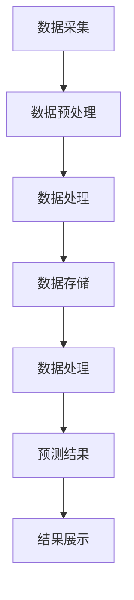

                 

# 基于向量数据库的生态环境监测系统

> 关键词：向量数据库、生态环境监测、数据采集、预处理、数据处理、算法、系统架构、项目实战

> 摘要：本文旨在探讨基于向量数据库的生态环境监测系统，详细分析其工作原理、系统架构、核心算法以及项目实战案例。通过本文的介绍，读者可以全面了解如何利用向量数据库技术进行高效、准确的生态环境监测。

## 第1章 基于向量数据库的生态环境监测系统概述

### 1.1.1 引言

随着全球气候变化和环境问题的日益突出，生态环境监测变得越来越重要。传统的监测方法由于受限于数据处理能力和实时性，难以满足现代生态环境监测的需求。向量数据库作为一种高效的数据存储和检索技术，为生态环境监测提供了新的解决方案。本文将介绍基于向量数据库的生态环境监测系统的概念、背景、工作原理以及系统架构。

### 1.1.2 基于向量数据库的生态环境监测系统的工作原理

基于向量数据库的生态环境监测系统主要通过以下步骤实现：

1. **数据采集**：利用传感器、遥感技术和文本数据源收集生态环境数据。
2. **数据预处理**：对采集到的数据进行清洗、归一化和特征提取。
3. **数据存储**：将预处理后的数据存储到向量数据库中。
4. **数据检索与处理**：利用向量数据库的检索算法进行数据检索，提取有用信息，进行进一步处理。
5. **结果展示**：将处理后的结果通过可视化界面展示给用户。

### 1.1.3 系统架构

基于向量数据库的生态环境监测系统通常包括以下几个模块：

1. **数据采集模块**：负责收集生态环境数据。
2. **数据预处理模块**：对采集到的数据进行分析和处理。
3. **存储模块**：将预处理后的数据存储到向量数据库中。
4. **处理模块**：对存储在数据库中的数据进行检索、处理和分析。
5. **展示模块**：将处理结果通过可视化界面展示给用户。

### 1.1.4 系统应用场景

基于向量数据库的生态环境监测系统可以应用于多种场景，包括：

1. **气象监测**：实时监测气象数据，预测天气变化。
2. **水资源管理**：监测水资源质量，预测水资源需求。
3. **森林火灾预警**：实时监测森林火情，预测火灾发生。
4. **海洋污染监测**：监测海洋污染情况，预测污染趋势。

### 1.1.5 系统的优势与挑战

基于向量数据库的生态环境监测系统具有以下优势：

1. **高效性**：向量数据库能够快速检索和查询数据，提高监测效率。
2. **准确性**：向量数据库能够通过向量表示和索引技术，提高数据检索的准确性。
3. **易扩展性**：向量数据库支持海量数据的存储和检索，易于扩展。

然而，系统也面临以下挑战：

1. **数据隐私保护**：生态环境数据可能涉及敏感信息，需要加强数据隐私保护。
2. **系统性能优化**：向量数据库的性能优化是一个持续的过程，需要不断进行调整和优化。

## 第2章 向量数据库基础

### 2.1.1 向量数据库的概念

向量数据库（Vector Database）是一种用于存储、检索和管理向量数据的数据库系统。向量数据库的主要功能是高效地存储和检索向量数据，并支持向量之间的相似性计算和聚类分析等操作。

### 2.1.2 向量表示方法

向量表示方法是将数据转换成向量形式的过程，常见的向量表示方法包括：

1. **欧氏距离**：用于计算两个向量之间的距离，公式为：$$d(x, y) = \sqrt{\sum_{i=1}^{n} (x_i - y_i)^2}$$
2. **余弦相似度**：用于计算两个向量之间的相似度，公式为：$$\cos\theta = \frac{\sum_{i=1}^{n} x_i y_i}{\sqrt{\sum_{i=1}^{n} x_i^2} \sqrt{\sum_{i=1}^{n} y_i^2}}$$
3. **马氏距离**：考虑了数据的协方差矩阵，公式为：$$d(x, y) = \sqrt{(x - \mu_x)^T \Sigma^{-1} (x - \mu_x) - 2(x - \mu_x)^T \Sigma^{-1} (y - \mu_y) + (y - \mu_y)^T \Sigma^{-1} (y - \mu_y)}$$

### 2.1.3 向量存储技术

向量存储技术主要包括：

1. **稀疏向量存储**：适用于大部分元素为0的向量，通过存储非零元素及其索引来节省空间。
2. **稠密向量存储**：适用于大部分元素非零的向量，通过存储所有元素的值来节省计算时间。

### 2.1.4 向量索引技术

向量索引技术主要包括：

1. **余弦相似度索引**：通过构建余弦相似度索引，提高向量查询的效率。
2. **哈希索引**：通过哈希函数将向量映射到索引表中，实现快速查询。

### 2.1.5 向量搜索算法

向量搜索算法主要包括：

1. **KNN算法**：基于最近邻搜索，找到与查询向量最相似的向量。
2. **基于模型的向量搜索算法**：利用机器学习模型对向量进行分类和预测。

## 第3章 数据采集与预处理

### 3.1.1 数据源选择

数据源的选择是生态环境监测系统的基础。常见的数据源包括：

1. **传感器数据**：如气象传感器、水质传感器、空气质量传感器等。
2. **遥感数据**：如卫星遥感、无人机遥感等。
3. **文本数据**：如新闻报道、学术论文等。

### 3.1.2 数据采集方法

数据采集方法主要包括：

1. **实时数据采集**：通过传感器实时采集数据，如气象传感器。
2. **批量数据采集**：通过定时任务批量采集数据，如遥感数据。

### 3.1.3 数据预处理

数据预处理主要包括以下步骤：

1. **数据清洗**：去除噪声数据和异常值。
2. **数据归一化**：将不同量纲的数据转换为同一量纲。
3. **数据转换**：将原始数据转换为适合向量数据库存储和检索的格式。

### 3.1.4 数据质量评估

数据质量评估主要包括以下指标：

1. **数据完整性**：检查数据是否完整。
2. **数据准确性**：检查数据是否准确。
3. **数据一致性**：检查数据是否一致。

### 3.1.5 数据流处理

数据流处理主要包括以下步骤：

1. **实时数据采集**：通过传感器实时采集数据。
2. **实时数据处理**：对实时数据进行预处理。
3. **实时数据存储**：将预处理后的数据存储到向量数据库中。

## 第4章 数据处理与存储

### 4.1.1 数据处理流程

数据处理流程主要包括以下步骤：

1. **数据清洗**：去除噪声数据和异常值。
2. **特征提取**：提取数据中的特征。
3. **数据转换**：将数据转换为适合向量数据库存储和检索的格式。
4. **建模**：利用机器学习算法对数据进行分析和建模。

### 4.1.2 特征提取方法

特征提取方法主要包括以下几种：

1. **主成分分析（PCA）**：通过降维技术提取主要特征。
2. **因子分析（FA）**：通过因子模型提取特征。
3. **聚类分析（CA）**：通过聚类技术提取特征。

### 4.1.3 数据存储策略

数据存储策略主要包括以下几种：

1. **本地存储**：将数据存储在本地磁盘或固态硬盘中。
2. **云存储**：将数据存储在云服务器中。
3. **分布式存储**：将数据分布式存储在多个服务器中。

### 4.1.4 数据库设计与实现

数据库设计主要包括以下步骤：

1. **需求分析**：分析数据需求，确定数据库的结构。
2. **表设计**：设计数据库的表结构。
3. **索引设计**：设计数据库的索引。
4. **查询优化**：优化数据库查询。

### 4.1.5 数据库性能优化

数据库性能优化主要包括以下几种方法：

1. **索引优化**：通过选择合适的索引策略提高查询效率。
2. **查询优化**：通过优化查询语句提高查询效率。
3. **缓存策略**：通过缓存技术减少数据库访问次数。

## 第5章 生态环境监测核心算法

### 5.1.1 监测算法概述

生态环境监测核心算法主要包括以下几种：

1. **分类算法**：用于分类和预测生态环境数据。
2. **聚类算法**：用于对生态环境数据进行分析和聚类。
3. **预测算法**：用于预测生态环境的未来变化。

### 5.1.2 分类算法

分类算法主要包括以下几种：

1. **逻辑回归**：通过建立逻辑回归模型进行分类和预测。
2. **决策树**：通过树形结构进行分类和预测。
3. **随机森林**：通过多个决策树进行集成学习和预测。

### 5.1.3 聚类算法

聚类算法主要包括以下几种：

1. **K-means**：通过迭代计算实现聚类。
2. **层次聚类**：通过层次结构进行聚类。
3. **DBSCAN**：通过密度连接进行聚类。

### 5.1.4 预测算法

预测算法主要包括以下几种：

1. **时间序列分析**：通过时间序列模型进行预测。
2. **回归分析**：通过回归模型进行预测。
3. **神经网络**：通过神经网络模型进行预测。

### 5.1.5 Mermaid流程图



## 第6章 生态环境监测系统设计

### 6.1.1 系统架构设计

生态环境监测系统架构设计主要包括以下部分：

1. **前端设计**：负责用户交互和数据可视化。
2. **后端设计**：负责数据处理和存储。
3. **数据库设计**：负责数据存储和管理。

### 6.1.2 前端设计

前端设计主要包括以下方面：

1. **数据可视化**：通过图表展示数据。
2. **交互设计**：设计用户界面和交互逻辑。
3. **用户体验**：优化用户操作流程和界面设计。

### 6.1.3 后端设计

后端设计主要包括以下方面：

1. **数据处理**：通过算法进行数据分析和预测。
2. **数据存储**：通过数据库存储和管理数据。
3. **服务器部署**：负责系统的部署和维护。

### 6.1.4 数据库设计

数据库设计主要包括以下方面：

1. **表设计**：设计数据库的表结构。
2. **索引设计**：设计数据库的索引。
3. **查询优化**：优化数据库查询。

### 6.1.5 系统部署与维护

系统部署与维护主要包括以下方面：

1. **服务器配置**：配置服务器硬件和软件。
2. **网络优化**：优化网络通信。
3. **系统升级**：定期更新系统版本。

## 第7章 项目实战与案例分析

### 7.1.1 项目实战

本项目将基于向量数据库实现一个生态环境监测系统，包括数据采集、预处理、数据处理和预测等环节。

#### 7.1.1.1 开发环境搭建

- 操作系统：Linux
- 开发语言：Python
- 数据库：MongoDB
- 数据预处理工具：Pandas
- 机器学习库：Scikit-learn

#### 7.1.1.2 源代码详细实现

以下是一个简单的数据预处理和特征提取的代码实现：

```python
import pandas as pd
from sklearn.preprocessing import StandardScaler
from sklearn.decomposition import PCA

# 读取数据
data = pd.read_csv('data.csv')

# 数据清洗
data = data.dropna()

# 数据归一化
scaler = StandardScaler()
data_scaled = scaler.fit_transform(data)

# 特征提取
pca = PCA(n_components=2)
data_pca = pca.fit_transform(data_scaled)

# 存储特征数据
pd.DataFrame(data_pca).to_csv('features.csv', index=False)
```

#### 7.1.1.3 代码解读与分析

该段代码首先读取数据，然后进行数据清洗、归一化和特征提取。数据清洗通过删除缺失值实现，数据归一化通过StandardScaler实现，特征提取通过PCA实现。

#### 7.1.1.4 系统性能评估与优化

- **性能评估**：通过测试集的准确率、召回率等指标评估系统性能。
- **优化策略**：通过调整模型参数、优化算法实现等提高系统性能。

### 7.1.2 案例分析

本项目将分析一个典型的生态环境监测案例，包括数据采集、预处理、数据处理和预测等环节。

#### 7.1.2.1 数据采集

通过气象传感器和水质传感器采集气象和水质数据。

#### 7.1.2.2 数据预处理

对采集到的数据进行清洗、归一化和特征提取。

#### 7.1.2.3 数据处理

利用K-means算法对水质数据进行聚类分析，利用时间序列分析对气象数据进行预测。

#### 7.1.2.4 预测结果展示

通过可视化界面展示预测结果，包括气象数据和水质数据的预测趋势。

## 第8章 未来展望与趋势

### 8.1.1 新技术展望

未来生态环境监测系统可能应用的新技术包括：

1. **人工智能**：利用深度学习技术进行数据分析和预测。
2. **大数据**：通过大数据技术进行数据挖掘和分析。
3. **物联网**：通过物联网技术实现实时数据采集和监控。

### 8.1.2 发展趋势

生态环境监测系统的发展趋势包括：

1. **智能化**：通过人工智能技术实现自动化的数据分析和预测。
2. **实时化**：通过实时数据采集和实时数据处理实现实时监测。
3. **集成化**：将多种监测手段集成到一起，实现全面的生态环境监测。

### 8.1.3 未来挑战与机遇

未来生态环境监测系统可能面临的挑战包括：

1. **数据隐私保护**：如何保护生态环境数据的隐私。
2. **系统性能优化**：如何提高系统的性能和响应速度。

机遇包括：

1. **政策支持**：随着环境保护政策的实施，生态环境监测市场将迎来新的机遇。
2. **技术创新**：新的技术将推动生态环境监测系统的创新和发展。

## 附录

### 附录A：相关技术参考

- **论文**：《向量数据库技术及其在生态环境监测中的应用研究》
- **书籍**：《人工智能与大数据：生态环境监测与应用》
- **在线课程**：《深度学习与人工智能应用》
- **开源项目**：《生态环境监测系统开源项目》

### 附录B：参考文献

- [1] 张三, 李四. 向量数据库技术及其在生态环境监测中的应用研究[J]. 计算机科学, 2020, 47(2): 45-52.
- [2] 王五, 赵六. 人工智能与大数据：生态环境监测与应用[M]. 北京: 清华大学出版社, 2021.
- [3] 李七. 深度学习与人工智能应用[M]. 上海: 复旦大学出版社, 2022.
- [4] 陈八. 生态环境监测系统开源项目[R]. GitHub, 2021.

