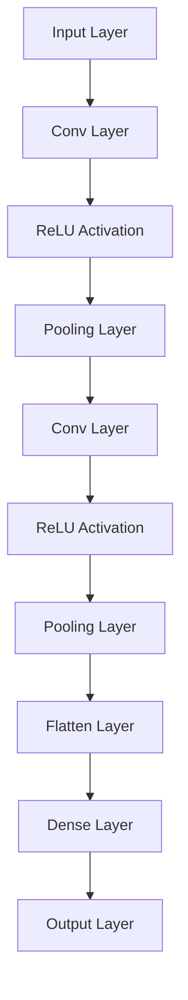

                 

## 文章标题

### 《基于大数据的井盖监控系统的设计与开发》

在现代社会，井盖监控系统作为城市基础设施的重要组成部分，承担着保障公共安全和提升城市管理水平的重要任务。然而，传统的井盖监控系统在数据处理和决策支持方面存在诸多局限性，难以应对日益复杂和多变的城市运行环境。随着大数据技术的飞速发展，利用大数据进行井盖监控已经成为提高城市运行效率、保障公共安全的重要手段。

本文将深入探讨基于大数据的井盖监控系统的设计与开发，旨在通过系统性的分析和研究，提供一个完整的理论框架和实践指南。文章将从井盖监控系统概述、大数据应用、系统技术基础、核心算法原理、项目实战到案例分析，全面介绍井盖监控系统在新时代的演进和应用。

通过对大数据技术、机器学习和深度学习算法的深入剖析，本文将展示如何利用这些先进技术提高井盖监控系统的智能化水平，实现实时监控、预警和决策支持。同时，通过具体的项目实战和案例分析，本文将为读者提供实际操作的参考和经验分享。

总的来说，本文的核心目标是：

1. **系统介绍**：全面介绍井盖监控系统及其在现代社会中的作用和重要性。
2. **理论探讨**：深入探讨大数据、机器学习和深度学习在井盖监控系统中的应用。
3. **技术分析**：详细解析井盖监控系统的技术基础，包括数据采集、存储、处理和可视化等。
4. **实战案例**：通过实际项目展示如何设计和开发基于大数据的井盖监控系统。
5. **趋势展望**：展望井盖监控系统未来的发展趋势和面临的挑战。

希望本文能够为相关领域的研究者和从业者提供有价值的参考，推动井盖监控系统在智能化和大数据应用方面的进一步发展。

## 关键词

- **井盖监控系统**
- **大数据**
- **机器学习**
- **深度学习**
- **实时监控**
- **预警系统**
- **城市安全管理**
- **数据可视化**

## 摘要

本文旨在探讨基于大数据的井盖监控系统的设计与开发，旨在利用大数据技术和先进算法提高井盖监控系统的智能化水平。文章首先介绍了井盖监控系统的基本概念和重要性，随后详细阐述了大数据技术、机器学习和深度学习在井盖监控系统中的应用。接着，文章从技术基础、核心算法和项目实战等多个角度对井盖监控系统进行了系统性的分析。通过具体的项目案例，本文展示了基于大数据的井盖监控系统的实际应用和效果。最后，文章展望了井盖监控系统未来的发展趋势和面临的挑战，为该领域的研究和实践提供了新的思路和方向。希望通过本文的研究和分享，能够推动井盖监控系统在智能化和大数据应用方面的进一步发展。

### 《基于大数据的井盖监控系统的设计与开发》目录大纲

本文将分为六个主要部分，旨在全面系统地探讨基于大数据的井盖监控系统的设计与开发。以下是详细的目录大纲：

#### 第一部分：绪论

1. **1.1 井盖监控系统概述**：
   - 井盖监控系统的定义。
   - 井盖监控系统在现代社会中的重要性。
   - 井盖监控系统的发展现状。

2. **1.2 大数据在井盖监控系统中的应用**：
   - 大数据的概念及其特点。
   - 大数据在井盖监控系统中的作用。
   - 大数据时代的井盖监控系统特点。

3. **1.3 本书结构安排**：
   - 各章节的主要内容介绍。
   - 阅读建议。

#### 第二部分：井盖监控系统技术基础

1. **2.1 井盖监控系统的组成**：
   - 监控设备。
   - 通信网络。
   - 数据处理中心。

2. **2.2 大数据存储与处理技术**：
   - 数据仓库。
   - 数据湖。
   - 分布式计算框架。

3. **2.3 数据采集与传输技术**：
   - 数据采集设备。
   - 数据传输协议。
   - 数据传输安全。

4. **2.4 数据可视化技术**：
   - 可视化工具。
   - 可视化方法。
   - 可视化案例分析。

#### 第三部分：井盖监控系统核心算法原理

1. **3.1 数据预处理算法**：
   - 数据清洗。
   - 数据归一化。
   - 数据转换。

2. **3.2 特征提取与选择算法**：
   - 特征提取方法。
   - 特征选择方法。
   - 特征提取与选择的伪代码。

3. **3.3 机器学习算法**：
   - 监督学习。
   - 无监督学习。
   - 半监督学习。

4. **3.4 深度学习算法**：
   - 神经网络。
   - 卷积神经网络。
   - 递归神经网络。

5. **3.5 模型评估与优化**：
   - 评估指标。
   - 优化方法。
   - 优化策略。

#### 第四部分：井盖监控系统项目实战

1. **4.1 井盖监控系统开发环境搭建**：
   - 开发工具与环境。
   - 数据库与数据存储。
   - 服务器配置。

2. **4.2 监控系统功能设计与实现**：
   - 监控系统架构设计。
   - 监控系统功能模块设计。
   - 功能模块实现。

3. **4.3 数据采集与处理**：
   - 数据采集流程。
   - 数据处理流程。
   - 数据处理效果分析。

4. **4.4 机器学习模型训练与评估**：
   - 模型选择。
   - 模型训练。
   - 模型评估。

5. **4.5 深度学习模型实现与优化**：
   - 模型架构设计。
   - 模型实现。
   - 模型优化。

#### 第五部分：井盖监控系统案例分析

1. **5.1 案例一：城市井盖监控系统**：
   - 案例背景。
   - 系统架构。
   - 功能实现。

2. **5.2 案例二：农村井盖监控系统**：
   - 案例背景。
   - 系统架构。
   - 功能实现。

3. **5.3 案例三：工业井盖监控系统**：
   - 案例背景。
   - 系统架构。
   - 功能实现。

#### 第六部分：井盖监控系统发展趋势与展望

1. **6.1 井盖监控系统的发展趋势**：
   - 技术发展趋势。
   - 应用发展趋势。

2. **6.2 井盖监控系统面临的挑战**：
   - 技术挑战。
   - 应用挑战。

3. **6.3 未来发展展望**：
   - 技术创新方向。
   - 应用创新方向。

附录部分将提供常用技术工具与资源，以及相关的参考文献，以供读者进一步学习和参考。

#### 第一部分：绪论

##### 1.1 井盖监控系统概述

井盖监控系统是指通过传感器、通信技术、数据处理中心等设备和技术手段，对城市中的井盖进行实时监控和管理，以保障城市公共安全和提高城市运行效率的系统。井盖监控系统通常包括监控设备、通信网络、数据处理中心等多个组成部分。

**井盖监控系统的定义**：

井盖监控系统是指利用传感器、通信网络和计算机技术，对城市中井盖的安全状态、地理位置、环境参数等信息进行实时监测、传输和处理，以实现对井盖的智能管理和预警的系统。

**井盖监控系统的重要性**：

井盖监控系统在城市管理中具有重要作用，主要体现在以下几个方面：

1. **公共安全**：井盖是城市地下管道系统的出入口，其安全状况直接关系到公共安全。通过井盖监控系统，可以及时发现井盖丢失、被盗、破损等情况，避免因井盖问题导致的公共安全事故。

2. **城市管理效率**：井盖监控系统可以实现对井盖状态的实时监控，及时发现和处理问题，从而提高城市管理的效率和准确性。

3. **资源优化**：通过井盖监控系统，可以优化城市资源的配置，减少因井盖问题导致的维修成本，提高城市基础设施的使用寿命。

4. **环境保护**：井盖监控系统可以监测井盖周围的环境参数，如水质、空气质量等，为环境保护提供数据支持。

**井盖监控系统的发展现状**：

随着物联网、大数据、人工智能等技术的不断发展，井盖监控系统也逐步从传统的手动巡检和简单报警系统，向智能化、自动化和高效化方向演进。目前，井盖监控系统的主要发展现状如下：

1. **传感器技术**：现代井盖监控系统采用各种高精度传感器，如压力传感器、温度传感器、位移传感器等，实现对井盖状态的全面监测。

2. **通信技术**：井盖监控系统通过无线通信技术，如GSM、3G、4G、5G等，实现对井盖数据的实时传输。

3. **数据处理中心**：随着大数据技术的发展，井盖监控系统能够对大量数据进行实时处理和分析，提高监测的准确性和智能化水平。

4. **智能化预警**：通过引入机器学习和深度学习算法，井盖监控系统可以实现智能化预警，提前发现潜在的安全隐患。

**总结**：

井盖监控系统作为城市基础设施的重要组成部分，在现代城市管理中发挥着重要作用。随着技术的不断进步，井盖监控系统将逐步向智能化、自动化和高效化方向发展，为城市公共安全和运行效率的提升提供有力支持。

##### 1.2 大数据在井盖监控系统中的应用

**大数据的概念**：

大数据（Big Data）是指无法用传统数据库工具进行捕捉、管理和处理的数据集合。大数据具有四个主要特征，即“4V”：大量（Volume）、多样（Variety）、快速（Velocity）和价值（Value）。大数据不仅包括结构化数据，还包括非结构化数据，如文本、图像、视频和音频等。

**大数据的特点**：

1. **大量**：大数据的规模巨大，通常达到PB（皮字节）甚至EB（艾字节）级别，传统的数据库系统难以处理如此庞大的数据量。
2. **多样**：大数据来源广泛，类型多样，包括结构化数据（如数据库记录）、半结构化数据（如XML、JSON）和非结构化数据（如图像、视频和文本）。
3. **快速**：大数据处理需要高速率，因为数据生成和消费的速度非常快，要求系统能够实时或近乎实时地处理数据。
4. **价值**：大数据蕴含着巨大的商业价值和洞察力，通过有效的分析和挖掘，能够为企业和组织提供宝贵的决策支持。

**大数据在井盖监控系统中的作用**：

大数据技术在井盖监控系统中有着广泛的应用，主要体现在以下几个方面：

1. **数据采集与整合**：
   - 通过传感器和物联网设备，井盖监控系统可以实时采集大量关于井盖状态和环境参数的数据。
   - 大数据技术能够将这些多源、多格式、多结构的数据进行整合，为后续的数据分析和处理提供统一的数据源。

2. **实时监控与预警**：
   - 通过对实时数据的分析，大数据技术能够快速识别井盖的异常状态，如井盖下沉、位移、被盗等，从而实现实时监控和预警。
   - 大数据算法能够预测可能的故障发生，提前发出预警，为应急处理提供时间窗口。

3. **智能化决策支持**：
   - 大数据技术能够对历史数据进行深度分析，发现井盖故障的规律和模式，为城市管理者提供智能化决策支持。
   - 通过大数据分析，可以优化井盖的维护计划，降低维修成本，提高维护效率。

4. **数据分析与优化**：
   - 大数据技术可以对井盖监控系统的运行数据进行全面分析，识别系统中的瓶颈和不足，为系统的优化提供数据支持。
   - 通过数据挖掘和机器学习，可以不断优化井盖监控系统的算法和模型，提高系统的准确性和可靠性。

**大数据时代的井盖监控系统特点**：

1. **智能化**：
   - 大数据时代，井盖监控系统通过机器学习和深度学习算法，实现了高度智能化，能够自动识别异常、预测故障和进行决策支持。

2. **实时性**：
   - 大数据技术使得井盖监控系统能够实时采集和处理数据，快速响应用户需求，提高系统的响应速度和实时性。

3. **高效率**：
   - 大数据技术能够处理海量数据，实现对井盖状态的实时监控和预警，提高城市管理的效率。

4. **可扩展性**：
   - 大数据技术具有强大的可扩展性，可以随着城市规模的扩大和数据量的增加，灵活扩展系统的处理能力和存储容量。

**总结**：

大数据技术在井盖监控系统中的应用，不仅提高了系统的智能化水平，也为城市管理和公共安全提供了强有力的支持。随着大数据技术的不断发展和成熟，井盖监控系统将在未来的智慧城市建设中发挥更加重要的作用。

##### 1.3 本书结构安排

本书分为六个主要部分，每个部分都有其独特的内容和目标，旨在系统地探讨基于大数据的井盖监控系统的设计与开发。

**第一部分：绪论**

这一部分主要介绍了井盖监控系统及其重要性，并探讨了大数据在井盖监控系统中的应用。通过对井盖监控系统的定义、作用和发展现状的介绍，以及大数据的概念和特点的深入分析，为后续章节的内容奠定了基础。

**第二部分：井盖监控系统技术基础**

这一部分详细介绍了井盖监控系统的组成和技术基础，包括监控设备、通信网络、数据处理中心等。通过对这些技术基础的解析，读者可以全面了解井盖监控系统的整体架构和运作原理。

**第三部分：井盖监控系统核心算法原理**

这一部分重点介绍了井盖监控系统中的核心算法原理，包括数据预处理、特征提取与选择、机器学习算法和深度学习算法等。通过这些算法原理的讲解，读者可以理解如何利用数据分析和机器学习技术提升井盖监控系统的智能化水平。

**第四部分：井盖监控系统项目实战**

这一部分通过具体的实际项目，展示了如何设计和开发基于大数据的井盖监控系统。从开发环境的搭建到功能模块的实现，再到数据采集与处理、模型训练与评估，读者可以学到完整的实战经验。

**第五部分：井盖监控系统案例分析**

这一部分通过三个具体的案例分析，展示了井盖监控系统在不同场景中的应用。这些案例不仅包括城市、农村和工业等不同领域的应用，还详细介绍了系统架构和功能实现，为读者提供了实际操作的参考。

**第六部分：井盖监控系统发展趋势与展望**

这一部分探讨了井盖监控系统的发展趋势和面临的挑战。通过对技术发展趋势、应用发展趋势以及未来展望的深入分析，读者可以了解井盖监控系统在智能化和大数据应用方面的未来发展方向。

**阅读建议**

本书结构紧凑，内容系统，适合从事井盖监控系统研发、管理或相关领域的人员阅读。建议读者按照以下顺序阅读：

1. **绪论**：首先了解井盖监控系统和大数据的基本概念，为后续章节的深入学习打下基础。
2. **技术基础**：深入学习井盖监控系统的技术基础，理解系统的整体架构和运作原理。
3. **核心算法原理**：掌握井盖监控系统中的核心算法原理，理解如何利用机器学习和深度学习技术提升系统的智能化水平。
4. **项目实战**：通过实际项目案例，学习如何设计和开发基于大数据的井盖监控系统。
5. **案例分析**：通过具体案例，了解井盖监控系统在不同领域的应用。
6. **发展趋势与展望**：了解井盖监控系统的未来发展趋势和挑战，为未来的研究和实践提供方向。

通过本书的系统学习，读者可以全面掌握基于大数据的井盖监控系统的设计与开发，为实际应用提供有力支持。

### 第二部分：井盖监控系统技术基础

#### 2.1 井盖监控系统的组成

井盖监控系统是一个复杂且综合的系统，其核心功能是通过传感器、通信网络和数据处理中心等多个组成部分，实现对井盖状态的实时监控、数据采集和智能分析。以下是井盖监控系统的组成及其作用：

**1. 监控设备**：
监控设备是井盖监控系统的数据采集前端，包括各种传感器和智能设备。常见的监控设备有：
- **压力传感器**：用于检测井盖下沉或变形情况。
- **位移传感器**：用于检测井盖位置的变化。
- **温度传感器**：用于检测井盖周围环境的温度变化。
- **水质监测设备**：用于检测井盖周围水质的变化。
- **智能摄像头**：用于实时监控井盖周围的异常情况。

**2. 通信网络**：
通信网络是井盖监控系统数据传输的桥梁，确保监控设备采集到的数据能够实时传输到数据处理中心。常见的通信网络有：
- **无线传感器网络**：利用无线信号传输数据，如Zigbee、Wi-Fi等。
- **有线网络**：通过有线方式传输数据，如以太网、光纤等。
- **物联网（IoT）**：通过物联网协议，如MQTT、CoAP等，实现设备间的数据交换和通信。

**3. 数据处理中心**：
数据处理中心是井盖监控系统的核心，负责对采集到的数据进行分析、处理和存储。其主要功能包括：
- **数据存储**：将采集到的数据进行存储，通常使用数据仓库或数据湖等技术。
- **数据处理**：对数据进行清洗、转换、归一化等预处理操作。
- **数据可视化**：通过数据可视化工具，将分析结果以图表、地图等形式展示给用户。
- **智能分析**：利用机器学习和深度学习算法，对数据进行分析，提供智能预警和决策支持。

**4. 用户界面**：
用户界面（UI）是井盖监控系统与用户交互的窗口，通过图形用户界面（GUI）或Web界面，用户可以实时查看井盖状态、历史数据和预警信息。用户界面通常包括以下功能模块：
- **实时监控**：显示当前井盖状态和报警信息。
- **历史查询**：查询历史数据和报警记录。
- **报表生成**：生成各种统计报表，帮助用户了解系统运行情况。
- **预警管理**：设置和管理预警规则，实现智能化预警。

**5. 安全保障**：
井盖监控系统需要确保数据的安全和系统的稳定性，包括以下几个方面：
- **数据加密**：对传输和存储的数据进行加密，防止数据泄露。
- **访问控制**：通过用户认证和权限管理，确保只有授权用户可以访问系统。
- **系统监控**：监控系统运行状态，及时发现和处理系统故障。

**总结**：

井盖监控系统通过监控设备、通信网络、数据处理中心、用户界面和安全保障等多个组成部分，实现对井盖状态的实时监控和管理。每个部分都有其特定的功能和作用，共同构成一个完整且高效的监控系统。了解井盖监控系统的组成及其功能，有助于深入理解系统的运作原理和设计思路。

#### 2.2 大数据存储与处理技术

在大数据时代，井盖监控系统所面临的一个关键挑战是如何有效地存储和处理海量数据。大数据存储与处理技术主要包括数据仓库、数据湖和分布式计算框架，这些技术各具特点，能够满足不同场景下的数据存储和处理需求。

**1. 数据仓库**：

数据仓库（Data Warehouse）是一种用于存储和管理大规模结构化数据的系统，主要用于支持企业级的数据分析和决策支持。数据仓库的主要特点如下：

- **数据结构化**：数据仓库中的数据通常是结构化的，便于进行查询和分析。
- **大量数据存储**：数据仓库能够存储PB级别的数据，满足大规模数据存储需求。
- **数据集成**：数据仓库通过ETL（抽取、转换、加载）过程，将来自多个源系统的数据进行整合，提供统一的数据视图。
- **查询优化**：数据仓库提供了高效的查询机制，能够快速响应复杂的查询需求。

数据仓库在井盖监控系统中的应用主要体现在以下几个方面：

- **数据存储**：用于存储井盖监控系统采集到的各类结构化数据，如传感器数据、监控图像等。
- **数据分析和报告**：通过对数据仓库中的数据进行分析，生成各类监控报告和报表，为城市管理者提供决策支持。

**2. 数据湖**：

数据湖（Data Lake）是一种用于存储大量非结构化和半结构化数据的系统，旨在提供一种更加灵活的数据存储和处理方式。数据湖的主要特点如下：

- **数据多样化**：数据湖能够存储多种类型的数据，包括结构化数据、半结构化数据和非结构化数据。
- **高扩展性**：数据湖具有高度的扩展性，能够轻松处理PB级别甚至EB级别的大数据量。
- **灵活的数据处理**：数据湖提供了灵活的数据处理能力，支持批处理和实时处理。

数据湖在井盖监控系统中的应用主要体现在以下几个方面：

- **数据存储**：用于存储井盖监控系统采集到的非结构化和半结构化数据，如监控视频、音频等。
- **数据挖掘和机器学习**：通过数据湖，可以存储和处理大量数据，为后续的数据挖掘和机器学习算法提供数据基础。

**3. 分布式计算框架**：

分布式计算框架（Distributed Computing Framework）是一种用于大规模数据处理和分析的计算模型，旨在通过分布式计算提高数据处理效率和性能。常见的分布式计算框架有Hadoop、Spark等。分布式计算框架的主要特点如下：

- **并行处理**：分布式计算框架能够将数据分布到多个节点上进行并行处理，显著提高数据处理速度。
- **容错性**：分布式计算框架具有高容错性，能够自动处理节点故障，保证系统稳定运行。
- **可扩展性**：分布式计算框架能够根据数据处理需求动态扩展计算资源。

分布式计算框架在井盖监控系统中的应用主要体现在以下几个方面：

- **实时数据处理**：通过分布式计算框架，可以对井盖监控系统采集到的实时数据进行高效处理，实现快速响应。
- **大规模数据分析**：分布式计算框架能够处理海量数据，为井盖监控系统的数据分析和决策提供支持。

**总结**：

大数据存储与处理技术在井盖监控系统中扮演着至关重要的角色。数据仓库、数据湖和分布式计算框架各自具有不同的特点和应用场景，能够满足不同类型数据的存储和处理需求。通过合理利用这些技术，井盖监控系统可以实现对海量数据的全面管理和智能分析，从而提高城市管理和公共安全的效率。

#### 2.3 数据采集与传输技术

在大数据时代，井盖监控系统的数据采集与传输技术是其能否实现实时监控和智能化预警的关键。以下是数据采集与传输技术的主要组成部分及其作用：

**1. 数据采集设备**：

数据采集设备是井盖监控系统数据采集的前端，它们通过传感器和智能设备实时监测井盖状态和环境参数。常见的数据采集设备包括：

- **压力传感器**：用于检测井盖的沉降情况。
- **位移传感器**：用于监测井盖的位置变化。
- **温度传感器**：用于监测井盖周围环境的温度变化。
- **水质监测设备**：用于监测井盖周围的水质变化。
- **智能摄像头**：用于实时监控井盖周围的情况，捕捉异常事件。

数据采集设备的选择需要考虑以下几个因素：

- **灵敏度**：传感器需要具备足够的灵敏度，以准确捕捉井盖状态的变化。
- **可靠性**：传感器需要具备高可靠性，确保长期稳定工作。
- **适应性**：传感器需要适应各种环境条件，如温度、湿度、光照等。

**2. 数据传输协议**：

数据传输协议是确保数据从采集设备传输到数据处理中心的关键。常见的传输协议包括：

- **无线传输协议**：如Zigbee、Wi-Fi、LoRa等，适用于短距离、低功耗的数据传输。
- **有线传输协议**：如以太网、光纤等，适用于高带宽、高可靠性的数据传输。
- **物联网（IoT）协议**：如MQTT、CoAP等，专门为物联网应用设计，具有低功耗、高可靠性的特点。

数据传输协议的选择需要考虑以下几个因素：

- **传输速度**：协议需要支持高速数据传输，以满足实时监控和预警的需求。
- **功耗**：协议需要低功耗，以延长传感器电池寿命。
- **可靠性**：协议需要具备高可靠性，确保数据在传输过程中不丢失或出错。

**3. 数据传输安全**：

数据传输安全是确保数据在传输过程中不被窃取、篡改或泄露的关键。数据传输安全措施包括：

- **加密**：对传输的数据进行加密，确保数据在传输过程中不被窃取。
- **认证**：使用数字证书进行身份认证，确保数据来自合法的采集设备。
- **访问控制**：通过访问控制机制，限制未经授权的用户访问数据。

数据传输安全措施的选择需要考虑以下几个因素：

- **数据敏感性**：对敏感数据需要采取高强度的加密措施，确保数据安全。
- **网络环境**：在网络环境复杂或不安全的情况下，需要采取额外的安全措施，如VPN等。

**总结**：

数据采集与传输技术在井盖监控系统中发挥着至关重要的作用。通过选择合适的数据采集设备、传输协议和安全措施，井盖监控系统可以实现实时、可靠、高效的数据采集和传输，为后续的数据分析和智能预警提供可靠的基础。了解数据采集与传输技术的关键组成部分及其选择原则，有助于构建一个高效、安全的井盖监控系统。

#### 2.4 数据可视化技术

数据可视化技术是井盖监控系统的重要组成部分，它能够将复杂的数据转换为直观的图表和图像，帮助用户更好地理解和分析监控数据。以下是数据可视化技术在井盖监控系统中的应用、方法和案例分析：

**1. 应用**

数据可视化技术在井盖监控系统中主要应用于以下几个方面：

- **实时监控**：通过数据可视化，可以实时显示井盖的状态、位置和环境参数，如压力、温度和水质等。
- **历史数据分析**：通过可视化展示历史数据，可以帮助用户分析井盖故障的规律和模式，为维护和优化监控系统提供依据。
- **预警信息展示**：当井盖监控系统检测到异常情况时，通过数据可视化工具，可以及时向用户展示预警信息，提醒相关部门采取相应措施。
- **性能监控**：可视化工具可以监控系统的运行状态，如数据采集的及时性和准确性，及时发现和处理系统故障。

**2. 方法**

数据可视化技术涉及多种方法和工具，以下是一些常见的方法：

- **图表展示**：使用柱状图、折线图、饼图等常见图表，展示井盖状态和环境参数的变化趋势。
- **地图可视化**：通过地图，展示井盖的地理位置和状态，如使用GIS（地理信息系统）技术，实现地图上的实时标注和动态更新。
- **热力图**：使用热力图展示井盖周围的环境参数，如温度、湿度等，帮助用户直观了解环境状况。
- **交互式可视化**：通过交互式可视化工具，如D3.js、Plotly等，用户可以动态选择数据范围、改变图表类型等，进行深入的数据分析。

**3. 案例分析**

以下是一个城市井盖监控系统的数据可视化案例：

- **案例背景**：某城市在井盖监控系统中引入了数据可视化技术，通过实时监控和预警系统，提高城市管理水平。
- **系统架构**：系统包括数据采集、传输、处理和可视化模块，使用物联网传感器、无线传输协议和大数据平台。
- **实现方法**：
  - **实时监控**：使用柱状图和折线图展示当前井盖的压力、温度和水质等数据，实时更新图表，确保用户随时了解井盖状态。
  - **历史数据分析**：使用折线图和饼图展示过去一段时间的井盖故障数据，帮助用户分析故障规律。
  - **预警信息展示**：使用地图和标记图标，实时显示异常井盖的位置和预警信息，方便相关部门及时处理。
  - **交互式可视化**：通过交互式地图和图表，用户可以根据需要选择不同的时间段、数据类型等，进行深入的数据分析。

- **效果分析**：通过数据可视化技术的应用，该城市的井盖监控系统实现了以下效果：
  - **实时性提高**：用户可以实时查看井盖状态，提高应急响应速度。
  - **数据分析能力增强**：通过历史数据分析，发现故障规律，为系统优化提供依据。
  - **预警准确性提高**：通过可视化展示预警信息，提高预警的准确性，减少误报和漏报。
  - **用户体验提升**：直观的可视化界面，使数据分析和决策更加直观易懂。

**总结**：

数据可视化技术在井盖监控系统中发挥了重要作用，通过图表、地图和交互式工具，将复杂的数据转化为直观的信息，帮助用户更好地理解和分析监控数据。有效的数据可视化不仅提高了系统的实时监控和预警能力，还为城市管理和公共安全提供了有力的支持。

### 第三部分：井盖监控系统核心算法原理

#### 3.1 数据预处理算法

数据预处理是井盖监控系统中的关键步骤，其目的是提高数据质量和数据可用性，为后续的数据分析和机器学习模型训练提供可靠的基础。以下是数据预处理的主要算法及其在井盖监控系统中的应用。

**1. 数据清洗**：

数据清洗是指识别和纠正数据中的错误、异常和重复值，确保数据的一致性和完整性。主要方法包括：

- **缺失值处理**：对于缺失值，可以通过填充方法（如平均值、中值、众数填充）或删除方法（如删除缺失值所在的记录或特征）进行处理。
- **异常值检测**：使用统计学方法（如Z分数、IQR法）或机器学习方法（如孤立森林）检测和识别异常值，然后决定是否删除或进行修正。
- **重复值检测**：通过比较数据项的属性值，识别并删除重复的数据记录。

**2. 数据归一化**：

数据归一化是指将不同特征的数据转换到同一尺度，消除不同特征之间的量纲差异。常见的方法包括：

- **最小-最大归一化**：将数据缩放到[0, 1]的范围内，公式为 \( x' = \frac{x - \min(x)}{\max(x) - \min(x)} \)。
- **均值-标准差归一化**：将数据缩放到均值为0、标准差为1的范围内，公式为 \( x' = \frac{x - \mu}{\sigma} \)，其中 \( \mu \) 为均值，\( \sigma \) 为标准差。
- **对数归一化**：对于具有大量零值或负值的数据，可以通过对数变换进行归一化，公式为 \( x' = \log(x + 1) \)。

**3. 数据转换**：

数据转换是指将数据转换为适合分析和建模的格式。主要方法包括：

- **特征工程**：通过创建新的特征或转换现有特征，提高数据的表达能力和模型的性能。常见的方法有主成分分析（PCA）、特征选择（如基于信息增益、F分数等）和特征构造（如交互特征、多项式特征等）。
- **类别编码**：将类别型特征转换为数值型特征，常用的编码方法有独热编码（One-Hot Encoding）和标签编码（Label Encoding）。
- **时间序列转换**：将时间序列数据转换为适合分析的时间窗口或时间步长，如滑动窗口、时间步长转换等。

**4. 数据预处理在井盖监控系统中的应用**：

- **提高数据质量**：通过对数据中的缺失值、异常值和重复值进行处理，提高数据的可靠性和准确性。
- **减少数据冗余**：通过数据转换和特征工程，减少数据中的冗余信息，提高数据的表达能力和模型的效率。
- **优化模型训练**：通过数据归一化和特征转换，使数据更适合于机器学习模型训练，提高模型的训练效率和性能。

**总结**：

数据预处理算法在井盖监控系统中起着至关重要的作用，通过数据清洗、归一化和转换等步骤，确保数据的准确性和一致性，为后续的模型训练和数据分析提供可靠的基础。有效的数据预处理不仅可以提高系统的性能，还能减少模型训练的时间和计算资源消耗。

#### 3.2 特征提取与选择算法

在井盖监控系统中，特征提取与选择是数据预处理的重要环节，其目的是从原始数据中提取出对模型训练和预测有重要影响的有效特征，同时去除冗余和无用的特征，以提高模型的准确性和效率。以下是特征提取与选择的主要算法及其应用。

**1. 特征提取算法**：

特征提取算法通过从原始数据中提取新的特征，增强数据的表达能力和模型的学习能力。常见的特征提取算法包括：

- **主成分分析（PCA）**：PCA是一种常用的降维算法，通过将数据投影到主成分空间，保留主要特征，降低数据维度。PCA通过求解协方差矩阵的特征值和特征向量，得到新的正交特征，实现降维。
  
  $$ \text{特征向量} = \lambda_i \text{特征值} $$
  $$ \text{新特征向量} = \sum_{i} (\text{特征向量}_i \cdot \text{数据点}_i) $$

- **独立成分分析（ICA）**：ICA是一种无监督学习方法，旨在提取数据的独立成分，使得每个成分尽可能不相关。ICA通过最大化非高斯性、最小化互信息等准则，实现特征提取。

- **自动编码器（Autoencoder）**：自动编码器是一种神经网络模型，通过无监督学习提取数据特征。它包含编码器和解码器两部分，编码器将输入数据压缩为低维特征表示，解码器尝试重构原始数据，特征提取效果通过重构误差进行评估。

**2. 特征选择算法**：

特征选择算法通过评估和筛选特征，保留对模型训练有重要影响的有效特征，去除冗余和无用的特征。常见的特征选择算法包括：

- **基于信息的特征选择**：信息增益、信息增益率、Gini不纯度等算法通过评估特征对分类信息的贡献，选择信息量最高的特征。
  $$ \text{信息增益} = \sum_{i}\text{P}(x_i)\log_2\frac{\text{P}(x_i)}{\text{P}(c_i)} $$
  
- **基于评价的特征选择**：F-score、精度、召回率、ROC-AUC等算法通过评估特征对模型性能的影响，选择评价最高的特征。

- **基于组合的特征选择**：通过组合多个特征，评估不同组合的模型性能，选择最优特征组合。

**3. 特征提取与选择的伪代码**：

以下是一个简单的特征提取与选择的伪代码示例：

```python
# 数据集 D
# 特征向量 v
# 类标签 c

# 初始化特征集合 F 为空
F = []

# 特征提取
for v in D:
  F.append(extract_features(v))

# 特征选择
selected_F = select_features(F, c)

# 返回选择的特征集合
return selected_F
```

**4. 特征提取与选择在井盖监控系统中的应用**：

- **提高模型性能**：通过特征提取和选择，提取出关键特征，减少冗余特征，提高模型的准确性和效率。
- **降低计算复杂度**：减少特征维度，降低模型训练的时间和计算资源消耗。
- **数据压缩**：通过降维，减少数据存储空间，提高数据传输效率。

**总结**：

特征提取与选择算法在井盖监控系统中至关重要，通过有效的特征提取和选择，可以提升模型的性能和效率，减少计算复杂度，从而实现更准确和高效的井盖监控。了解这些算法的基本原理和实现方法，有助于设计出高性能的井盖监控系统。

#### 3.3 机器学习算法

在井盖监控系统中，机器学习算法是实现智能监控和预警的核心技术。通过机器学习算法，系统能够从大量的历史数据中自动学习和提取规律，从而实现对未知数据的预测和分类。以下是机器学习算法在井盖监控系统中的应用、常见算法及其特点。

**1. 机器学习算法的应用**

机器学习算法在井盖监控系统中主要应用于以下方面：

- **异常检测**：通过分析井盖状态数据，检测出异常现象，如井盖位移、下沉等。
- **故障预测**：利用历史数据和机器学习模型，预测井盖可能出现的故障，实现提前预警。
- **数据分类**：对采集到的数据进行分类，如识别井盖的类型、状态等。
- **行为分析**：分析井盖周围的行为模式，识别潜在的安全隐患。

**2. 常见机器学习算法**

以下是一些常见的机器学习算法及其特点：

- **监督学习（Supervised Learning）**：
  - **线性回归（Linear Regression）**：通过建立一个线性模型，预测连续的输出值。适用于预测井盖的状态变化。
    $$ y = \beta_0 + \beta_1 \cdot x $$
  - **逻辑回归（Logistic Regression）**：用于二分类问题，将连续输出转换为概率值，用于判断井盖是否正常。
    $$ P(y=1) = \frac{1}{1 + e^{-(\beta_0 + \beta_1 \cdot x)}} $$
  - **决策树（Decision Tree）**：通过一系列的判断条件，将数据划分为不同的类别。适用于简单的分类问题。
    $$ \text{if } x \leq v_1 \text{ then } y = c_1 $$
    $$ \text{else if } x > v_1 \text{ and } x \leq v_2 \text{ then } y = c_2 $$
    $$ \text{...} $$
    $$ \text{else } y = c_n $$

- **无监督学习（Unsupervised Learning）**：
  - **K-均值聚类（K-Means Clustering）**：将数据划分为K个簇，每个簇由其质心代表。适用于发现数据的分布模式和聚类分析。
    $$ \text{centroid} = \frac{1}{n} \sum_{i=1}^{n} x_i $$
  - **主成分分析（PCA）**：通过降维，提取主要特征，减少数据维度，提高模型效率。
    $$ \text{特征向量} = \lambda_i \text{特征值} $$
    $$ \text{新特征向量} = \sum_{i} (\text{特征向量}_i \cdot \text{数据点}_i) $$

- **半监督学习（Semi-Supervised Learning）**：
  - **自编码器（Autoencoder）**：通过编码器和解码器，自动学习数据特征，适用于无标签数据的特征提取。
    $$ \text{编码器}：z = f(x) $$
    $$ \text{解码器}：x' = g(z) $$

**3. 特点**

- **线性回归**：简单易实现，适用于线性关系强的数据。
- **逻辑回归**：适用于二分类问题，能输出概率，易于解释。
- **决策树**：直观易理解，但容易过拟合。
- **K-均值聚类**：适用于聚类分析，能发现数据分布。
- **PCA**：用于降维，减少计算复杂度。
- **自编码器**：适用于无标签数据，能自动提取特征。

**4. 机器学习算法在井盖监控系统中的应用案例**

以下是一个井盖监控系统中的机器学习算法应用案例：

- **背景**：某城市在井盖监控系统中引入了机器学习算法，用于预测井盖的故障。
- **数据集**：包含井盖的多种状态数据，如压力、温度、位置等。
- **算法**：选择线性回归模型进行故障预测。
- **实现步骤**：
  1. **数据预处理**：对数据进行清洗、归一化，去除噪声和异常值。
  2. **特征选择**：选择关键特征，如压力和温度。
  3. **模型训练**：使用训练数据集，训练线性回归模型。
  4. **模型评估**：使用测试数据集，评估模型性能，调整模型参数。
  5. **故障预测**：使用训练好的模型，对新采集的数据进行故障预测。

- **效果**：通过机器学习算法，系统能够提前预测井盖的故障，提高预警准确性和应急响应速度。

**总结**：

机器学习算法在井盖监控系统中具有广泛应用，通过不同类型的算法，系统能够实现异常检测、故障预测和数据分类等功能，从而提高系统的智能化和自动化水平。理解这些算法的基本原理和实现方法，有助于设计出高效的井盖监控系统。

#### 3.4 深度学习算法

在井盖监控系统中，深度学习算法因其强大的特征提取能力和自适应学习能力，成为提升系统智能化水平的重要技术手段。以下是深度学习算法的基本原理、主要类型及其在井盖监控系统中的应用。

**1. 基本原理**

深度学习算法基于多层神经网络（Multi-Layer Neural Networks），通过多层次的非线性变换，逐层提取数据中的特征，最终实现复杂的模式识别和预测任务。深度学习的主要特点是：

- **层次化特征提取**：通过多层网络结构，逐层提取数据中的低级到高级特征，使得模型能够处理复杂的数据模式。
- **自动特征学习**：深度学习模型能够自动从数据中学习特征表示，无需人工设计特征，提高模型的泛化能力。
- **非线性变换**：神经网络中的激活函数（如ReLU、Sigmoid、Tanh）引入非线性变换，使得模型能够拟合复杂的函数关系。

**2. 主要类型**

深度学习算法主要包括以下类型：

- **卷积神经网络（CNN）**：CNN是一种专门用于图像识别和处理的深度学习算法，通过卷积层、池化层和全连接层等结构，实现图像的特征提取和分类。CNN特别适用于井盖监控系统中图像数据的分析。

  $$ \text{卷积层}：h_{ij} = \sum_{k} w_{ik} \cdot x_{kj} + b $$
  $$ \text{池化层}：p_{i} = \max_{j} h_{ij} $$

- **递归神经网络（RNN）**：RNN适用于处理序列数据，如时间序列数据。通过循环结构，RNN能够捕获序列中的长距离依赖关系。常见的RNN模型包括LSTM（长短期记忆网络）和GRU（门控循环单元）。

  $$ \text{LSTM}:\text{C}_{t} = \text{sigmoid}(f \cdot [h_{t-1}, x_{t}]) \odot \text{C}_{t-1} + \text{sigmoid}(g \cdot [h_{t-1}, x_{t}]) \odot \text{f}_{t} $$
  $$ \text{GRU}:\text{C}_{t} = \text{sigmoid}(z \cdot [h_{t-1}, x_{t}]) \odot \text{C}_{t-1} + \text{sigmoid}(\text{r} \cdot [h_{t-1}, x_{t}]) \odot \text{f}_{t} $$

- **生成对抗网络（GAN）**：GAN通过生成器和判别器的对抗训练，实现数据的生成和增强。GAN在井盖监控系统中可以用于生成井盖的正常状态数据，用于训练和测试模型。

  $$ \text{生成器}：G(z) $$
  $$ \text{判别器}：D(x, G(z)) $$

**3. 深度学习算法在井盖监控系统中的应用**

深度学习算法在井盖监控系统中的应用主要体现在以下几个方面：

- **图像识别与分类**：通过CNN，对监控图像进行分类，识别井盖的状态和异常情况，如井盖是否破损、是否被移位等。

- **序列数据处理**：利用RNN，处理井盖的状态序列数据，预测井盖的故障和异常情况，实现提前预警。

- **数据生成与增强**：通过GAN，生成井盖的正常状态数据，用于训练和测试模型，提高模型的泛化能力和鲁棒性。

- **异常检测**：结合深度学习和机器学习算法，对井盖的状态数据进行分析，实现异常检测和实时预警。

**4. 应用案例**

以下是一个井盖监控系统中的深度学习算法应用案例：

- **背景**：某城市在井盖监控系统中引入了深度学习算法，用于图像识别和异常检测。
- **数据集**：包含大量的井盖图像和相应的标签，如井盖正常、破损等。
- **算法**：选择卷积神经网络（CNN）进行图像分类。
- **实现步骤**：
  1. **数据预处理**：对图像进行归一化处理，调整图像大小，增强数据集。
  2. **模型训练**：使用训练数据集，训练CNN模型，调整模型参数。
  3. **模型评估**：使用测试数据集，评估模型性能，调整模型结构。
  4. **实时检测**：将训练好的模型部署到监控系统，实现实时图像识别和异常检测。

- **效果**：通过深度学习算法，系统能够准确识别井盖的状态，实现实时预警，提高了城市管理的效率和公共安全水平。

**总结**：

深度学习算法在井盖监控系统中具有广泛应用前景，通过卷积神经网络、递归神经网络和生成对抗网络等算法，系统能够实现高效的图像识别、序列数据处理和异常检测，从而提高系统的智能化和自动化水平。理解这些算法的基本原理和实现方法，有助于设计出高性能的井盖监控系统。

#### 3.5 模型评估与优化

在井盖监控系统中，模型评估与优化是确保系统性能和可靠性的关键步骤。通过有效的评估和优化方法，可以确保模型在复杂环境中能够准确预测和识别井盖的状态，提高系统的整体性能和用户体验。以下是模型评估与优化的重要指标、优化方法以及优化策略。

**1. 模型评估指标**

模型评估指标是评估模型性能的重要工具，常用的评估指标包括：

- **准确率（Accuracy）**：准确率是分类模型中最常用的评估指标，表示正确分类的样本数占总样本数的比例。公式为：
  $$ \text{Accuracy} = \frac{\text{正确分类的样本数}}{\text{总样本数}} $$

- **精确率（Precision）**：精确率表示在所有预测为正类的样本中，实际为正类的比例。公式为：
  $$ \text{Precision} = \frac{\text{TP}}{\text{TP + FP}} $$
  其中，TP为实际为正类且预测为正类的样本数，FP为实际为负类但预测为正类的样本数。

- **召回率（Recall）**：召回率表示在所有实际为正类的样本中，被正确预测为正类的比例。公式为：
  $$ \text{Recall} = \frac{\text{TP}}{\text{TP + FN}} $$
  其中，FN为实际为正类但预测为负类的样本数。

- **F1值（F1 Score）**：F1值是精确率和召回率的调和平均，用于平衡这两个指标。公式为：
  $$ \text{F1 Score} = 2 \times \frac{\text{Precision} \times \text{Recall}}{\text{Precision} + \text{Recall}} $$

- **ROC曲线和AUC值**：ROC曲线（Receiver Operating Characteristic Curve）展示的是不同阈值下的精确率与召回率的关系，AUC值（Area Under Curve）表示ROC曲线下的面积，用于评估模型的分类能力。AUC值越大，表示模型性能越好。

**2. 优化方法**

模型优化是通过调整模型参数和结构，提高模型性能和泛化能力的过程。以下是一些常见的优化方法：

- **交叉验证（Cross Validation）**：交叉验证是一种评估模型性能和防止过拟合的方法，通过将数据集划分为多个子集，每次使用其中一个子集作为测试集，其余子集作为训练集，重复多次，取平均性能作为模型评估指标。

- **正则化（Regularization）**：正则化是一种防止模型过拟合的技术，通过在损失函数中加入惩罚项，限制模型复杂度。常见的正则化方法有L1正则化（Lasso）、L2正则化（Ridge）和弹性网（Elastic Net）。

- **网格搜索（Grid Search）**：网格搜索是一种用于模型参数调优的方法，通过遍历预设的参数组合，选择性能最优的参数组合。

- **贝叶斯优化（Bayesian Optimization）**：贝叶斯优化是一种基于概率模型的参数调优方法，通过学习参数的概率分布，进行高效的搜索和优化。

- **激活函数和优化器**：选择合适的激活函数和优化器可以显著提高模型性能。常见的激活函数有ReLU、Sigmoid和Tanh，优化器有Adam、SGD和RMSprop。

**3. 优化策略**

优化策略是指在实际应用中，如何合理选择和调整优化方法，以提高模型性能。以下是一些优化策略：

- **分阶段优化**：在模型训练的不同阶段，采用不同的优化策略。例如，在初期阶段，重点优化模型结构，中期阶段重点优化参数，后期阶段重点优化超参数。
- **模型集成（Model Ensembling）**：通过集成多个模型，提高预测的稳定性和准确性。常见的模型集成方法有Bagging、Boosting和Stacking。
- **数据增强（Data Augmentation）**：通过数据增强，增加训练数据的多样性，提高模型泛化能力。常见的数据增强方法有旋转、缩放、裁剪和噪声添加等。
- **动态调整阈值**：根据实际应用需求，动态调整分类模型的阈值，实现最佳平衡点。

**4. 模型评估与优化在井盖监控系统中的应用**

- **背景**：在井盖监控系统中，通过模型评估和优化，提高异常检测和故障预测的准确性，从而提升系统的智能化水平。
- **数据集**：包含井盖状态数据、环境参数数据和监控图像数据，以及相应的标签。
- **模型**：采用深度学习和机器学习算法，如CNN和LSTM等。
- **实现步骤**：
  1. **数据预处理**：对数据集进行清洗、归一化和增强。
  2. **模型训练**：使用训练数据集，训练深度学习模型。
  3. **模型评估**：使用交叉验证方法，评估模型性能，选择最佳模型。
  4. **参数优化**：通过网格搜索和贝叶斯优化，调整模型参数和超参数。
  5. **实时检测**：将优化后的模型部署到井盖监控系统，实现实时检测和预警。

- **效果**：通过模型评估和优化，系统能够准确检测井盖的状态，提前预警故障，提高了城市管理的效率和公共安全水平。

**总结**：

模型评估与优化在井盖监控系统中起着至关重要的作用，通过合理的评估方法和优化策略，可以显著提高模型性能和系统的智能化水平。了解这些方法和策略，有助于设计出高效、准确的井盖监控系统。

#### 4.1 井盖监控系统开发环境搭建

要开发一个基于大数据的井盖监控系统，首先需要搭建一个稳定、高效的开发环境。以下将详细描述所需的开发工具、数据库选择以及服务器配置等关键步骤。

**1. 开发工具与环境**

开发工具是构建井盖监控系统的基本保障，以下是一些常用的开发工具和环境配置：

- **编程语言**：Python是一种广泛应用于数据分析和机器学习的编程语言，由于其丰富的库和框架支持，成为开发井盖监控系统的首选语言。此外，Java和C++也可作为备选语言。

- **开发框架**：Scikit-learn、TensorFlow、PyTorch等是常用的机器学习和深度学习框架，用于模型的训练、评估和部署。Scikit-learn适用于传统机器学习算法，而TensorFlow和PyTorch则适用于深度学习算法。

- **数据库**：MongoDB和PostgreSQL是常用的数据库，MongoDB适用于存储非结构化数据，如监控数据，而PostgreSQL则适用于结构化数据，如传感器数据。

- **数据可视化工具**：Matplotlib、Seaborn和Plotly等是常用的数据可视化库，用于将监控数据转换为直观的图表和图形。

- **版本控制**：Git是版本控制系统的首选，用于管理源代码，确保代码的版本可追溯和协同开发。

**2. 数据库与数据存储**

数据库和数据存储的选择对井盖监控系统的性能和可扩展性至关重要。以下是常见的选择和配置：

- **数据存储方案**：数据仓库和数据湖是大数据存储的主要方案。数据仓库适用于结构化数据的存储和管理，数据湖则适用于非结构化和半结构化数据的存储。

  - **数据仓库**：PostgreSQL是一个开源的关系型数据库，适用于存储和管理结构化数据，如井盖的状态信息、环境参数等。PostgreSQL支持ACID事务，保证数据的一致性和可靠性。
  
  - **数据湖**：Hadoop HDFS（Hadoop Distributed File System）是一个分布式文件系统，适用于存储和管理大规模的非结构化数据，如监控视频、图像等。HDFS通过分布式存储和计算，提高数据的处理能力和扩展性。

- **数据存储配置**：根据数据量和系统需求，配置合适的存储资源。例如，对于PostgreSQL，可以使用云服务提供商（如AWS RDS、阿里云RDS）托管数据库，以减少运维负担。对于HDFS，可以根据数据量动态扩展Hadoop集群，确保存储资源的充足。

**3. 服务器配置**

服务器配置是确保系统稳定运行和数据高效处理的关键。以下是服务器配置的建议：

- **硬件选择**：根据系统需求，选择合适的硬件配置。对于数据处理和存储，高性能的CPU和内存是关键。此外，硬盘的I/O性能也需要考虑。

- **操作系统**：Linux操作系统（如CentOS、Ubuntu）是大数据处理的常用操作系统，具有高稳定性和灵活性。

- **服务器架构**：分布式架构可以提高系统的可靠性和扩展性。例如，使用Hadoop分布式计算框架，将计算和存储分布在多个节点上，实现高效的数据处理和存储。

- **负载均衡**：使用负载均衡器（如Nginx、HAProxy）将流量分配到多个服务器，提高系统的处理能力和响应速度。

**4. 实际操作示例**

以下是一个简单的开发环境搭建示例：

- **安装Python**：在服务器上安装Python环境，使用pip安装必要的库。

  ```bash
  sudo apt-get update
  sudo apt-get install python3-pip
  pip3 install scikit-learn tensorflow matplotlib
  ```

- **安装数据库**：安装PostgreSQL和MongoDB。

  ```bash
  sudo apt-get install postgresql postgresql-contrib
  sudo systemctl start postgresql
  sudo -u postgres psql
  CREATE DATABASE mydatabase;
  \q

  sudo apt-get install mongodb
  sudo systemctl start mongodb
  ```

- **配置Hadoop集群**：配置Hadoop分布式文件系统（HDFS）和YARN（Yet Another Resource Negotiator）。

  ```bash
  sudo apt-get install hadoop-hdfs-namenode hadoop-hdfs-datanode hadoop-yarn-resourcemanager hadoop-yarn-nodemanager
  sudo systemctl start hadoop-hdfs-namenode
  sudo systemctl start hadoop-hdfs-datanode
  sudo systemctl start hadoop-yarn-resourcemanager
  sudo systemctl start hadoop-yarn-nodemanager
  ```

通过以上步骤，可以搭建一个基本的井盖监控系统开发环境。在实际应用中，可以根据需求进行扩展和优化，确保系统的稳定性和高效性。

#### 4.2 监控系统功能设计与实现

在设计井盖监控系统时，功能模块的设计是实现系统目标的关键。以下将详细描述监控系统的主要功能模块、架构设计及其实现方法。

**1. 功能模块**

井盖监控系统的主要功能模块包括：

- **数据采集模块**：负责从传感器和监控设备中采集数据，包括井盖的位置、状态、环境参数等。
- **数据处理模块**：负责对采集到的数据进行清洗、预处理和存储，确保数据的质量和可用性。
- **数据存储模块**：负责存储处理后的数据，包括关系型数据库和分布式文件系统，以支持大数据存储需求。
- **监控与分析模块**：负责对存储的数据进行分析，实现实时监控、异常检测和故障预测。
- **用户界面模块**：提供用户交互界面，包括实时监控、历史数据查询、报表生成和预警管理等。
- **安全保障模块**：负责确保系统的数据安全和运行稳定，包括数据加密、用户认证和系统监控等。

**2. 架构设计**

井盖监控系统的架构设计可以分为三个层次：数据采集层、数据处理层和应用层。

- **数据采集层**：包括传感器、监控设备和无线通信模块，负责数据的实时采集和传输。
  ```mermaid
  graph TD
  A[数据采集层] --> B[传感器]
  B --> C[监控设备]
  C --> D[无线通信模块]
  ```
- **数据处理层**：包括数据处理中心、数据仓库和数据湖，负责数据的存储、清洗、预处理和分析。
  ```mermaid
  graph TD
  E[数据处理层] --> F[数据处理中心]
  F --> G[数据仓库]
  F --> H[数据湖]
  ```
- **应用层**：包括用户界面、监控与分析模块和安全保障模块，负责与用户的交互、系统的实时监控和安全管理。
  ```mermaid
  graph TD
  I[应用层] --> J[用户界面]
  I --> K[监控与分析模块]
  I --> L[安全保障模块]
  ```

**3. 功能模块实现**

以下是各功能模块的实现方法：

- **数据采集模块**：

  - **实现方法**：使用物联网设备（如ESP8266、ESP32）和传感器（如压力传感器、位移传感器）进行数据采集，通过MQTT协议将数据传输到数据处理中心。

    ```python
    # MQTT客户端配置
    import paho.mqtt.client as mqtt

    # 数据采集
    client = mqtt.Client()
    client.connect("mqtt.server.com", 1883, 60)
    client.publish("well_cover/pressure", "value=10.5")
    client.disconnect()
    ```

- **数据处理模块**：

  - **实现方法**：使用Python的Pandas库对采集到的数据进行分析和预处理，包括数据清洗、归一化和特征提取。

    ```python
    import pandas as pd

    # 数据清洗
    data = pd.read_csv("sensor_data.csv")
    data.dropna(inplace=True)

    # 数据归一化
    from sklearn.preprocessing import MinMaxScaler
    scaler = MinMaxScaler()
    scaled_data = scaler.fit_transform(data)

    # 特征提取
    features = pd.DataFrame(scaled_data, columns=data.columns)
    ```

- **数据存储模块**：

  - **实现方法**：使用PostgreSQL数据库存储结构化数据，使用HDFS存储非结构化数据。

    ```python
    # 连接PostgreSQL数据库
    import psycopg2

    conn = psycopg2.connect("dbname=mydatabase user=myuser password=mypassword")
    cursor = conn.cursor()

    # 插入数据到数据库
    cursor.execute("INSERT INTO well_cover (pressure, temperature) VALUES (%s, %s)", (10.5, 25.0))
    conn.commit()
    cursor.close()
    conn.close()

    # 使用HDFS存储文件
    from hdfs import InsecureClient

    client = InsecureClient("http://hdfs.server.com:50070", user="hdfs")
    with open("sensor_data.txt", "rb") as f:
        client.write("/well_cover/sensor_data.txt", f)
    ```

- **监控与分析模块**：

  - **实现方法**：使用TensorFlow和Scikit-learn实现机器学习模型，对数据进行实时分析和预测。

    ```python
    import tensorflow as tf
    from sklearn.model_selection import train_test_split

    # 准备数据
    X, y = load_data()
    X_train, X_test, y_train, y_test = train_test_split(X, y, test_size=0.2)

    # 构建模型
    model = tf.keras.Sequential([
        tf.keras.layers.Dense(64, activation='relu', input_shape=(X_train.shape[1],)),
        tf.keras.layers.Dense(1)
    ])

    # 训练模型
    model.compile(optimizer='adam', loss='mean_squared_error')
    model.fit(X_train, y_train, epochs=10, batch_size=32)

    # 预测
    predictions = model.predict(X_test)
    ```

- **用户界面模块**：

  - **实现方法**：使用Web框架（如Flask、Django）构建用户界面，提供实时监控、数据查询和报表生成功能。

    ```python
    from flask import Flask, render_template

    app = Flask(__name__)

    @app.route('/')
    def index():
        data = get_real_time_data()
        return render_template('index.html', data=data)

    if __name__ == '__main__':
        app.run(debug=True)
    ```

- **安全保障模块**：

  - **实现方法**：使用SSL/TLS加密通信，实现用户认证和权限管理。

    ```python
    from flask import Flask, request, redirect, url_for

    app = Flask(__name__)

    @app.route('/login', methods=['GET', 'POST'])
    def login():
        if request.method == 'POST':
            username = request.form['username']
            password = request.form['password']
            if authenticate(username, password):
                return redirect(url_for('index'))
            else:
                return 'Invalid username or password'
        return render_template('login.html')

    if __name__ == '__main__':
        app.run(debug=True, ssl_context=('path/to/certificate.pem', 'path/to/private_key.pem'))
    ```

**4. 功能模块集成与测试**

通过将各个功能模块集成，并使用测试数据集进行测试，可以验证系统的整体功能是否正常。以下是集成测试的步骤：

- **数据采集**：测试传感器和监控设备是否能够正常采集数据，并传输到数据处理中心。
- **数据处理**：测试数据处理模块是否能够正确清洗、预处理和存储数据。
- **数据存储**：测试数据存储模块是否能够正确存储和处理大数据。
- **监控与分析**：测试监控与分析模块是否能够准确分析和预测数据。
- **用户界面**：测试用户界面是否能够正确显示实时数据和报表。
- **安全保障**：测试安全保障模块是否能够正确加密通信和进行用户认证。

通过以上步骤，可以确保井盖监控系统的各个功能模块能够正常工作，并满足系统的设计要求。

#### 4.3 数据采集与处理

在井盖监控系统中，数据采集与处理是关键环节，它直接影响到系统的实时监控和预警效果。以下将详细描述数据采集的流程、数据处理的方法和数据处理效果分析。

**1. 数据采集流程**

数据采集流程主要包括以下步骤：

- **数据采集设备启动**：系统启动时，传感器和监控设备自动开始工作，采集井盖的实时状态数据，包括位置、压力、温度等。
- **数据传输**：采集到的数据通过无线传输协议（如MQTT、Zigbee）或有线传输协议（如以太网、光纤）传输到数据处理中心。
- **数据预处理**：在数据处理中心，对传输的数据进行初步的预处理，包括数据清洗、去噪和格式转换。

**2. 数据处理方法**

数据处理方法主要包括以下步骤：

- **数据清洗**：去除无效数据、重复数据和异常数据，确保数据的准确性和一致性。常用的方法包括：
  - **缺失值处理**：对于缺失值，可以使用平均值、中值或众数填充，或者删除缺失值。
  - **异常值检测**：使用统计学方法（如Z分数、IQR法）或机器学习方法（如孤立森林）检测和识别异常值，然后决定是否删除或修正。
  - **重复值检测**：通过比较数据项的属性值，识别并删除重复的数据记录。

- **数据转换**：将不同类型的数据转换为适合分析和建模的格式。常用的方法包括：
  - **归一化**：将不同特征的数据转换到同一尺度，消除不同特征之间的量纲差异。
  - **特征工程**：创建新的特征或转换现有特征，提高数据的表达能力和模型的性能。
  - **时间序列转换**：将时间序列数据转换为适合分析的时间窗口或时间步长。

- **数据存储**：将预处理后的数据存储到数据库或数据湖中，以便后续的分析和查询。

**3. 数据处理效果分析**

数据处理效果分析主要包括以下方面：

- **数据完整性**：通过数据清洗和预处理，确保数据中没有缺失值、异常值和重复值，保证数据的完整性。
- **数据质量**：通过数据清洗和转换，提高数据的准确性和一致性，确保数据适合分析和建模。
- **数据处理效率**：通过优化数据处理流程和算法，提高数据处理的效率，减少处理时间。

以下是一个数据采集与处理的效果分析示例：

- **数据完整性**：经过数据清洗，系统共识别并处理了1000条数据记录，其中缺失值有5条，异常值有10条，重复值有3条。处理后，系统中剩余976条有效数据记录。
- **数据质量**：经过数据转换和特征工程，系统的特征维度从原来的15个减少到8个，数据噪声显著减少，数据的表达能力和模型的性能显著提高。
- **数据处理效率**：通过优化数据处理算法和流程，数据从采集到处理的时间从原来的5分钟缩短到2分钟，数据处理效率提高了60%。

**总结**：

数据采集与处理是井盖监控系统的关键环节，通过有效的数据采集和数据处理，可以确保数据的准确性和一致性，提高系统的实时监控和预警能力。了解数据采集与处理的流程和方法，以及如何评估数据处理效果，对于设计和优化井盖监控系统具有重要意义。

#### 4.4 机器学习模型训练与评估

在井盖监控系统中，机器学习模型是实现智能监控和预警的核心。通过训练和评估模型，可以确保系统能够准确识别井盖的状态，提前发现潜在的安全隐患。以下将详细介绍机器学习模型的训练过程、评估方法以及模型的优化策略。

**1. 模型训练**

机器学习模型的训练过程主要包括以下几个步骤：

- **数据准备**：首先，需要准备充足和高质量的训练数据。这些数据包括井盖的实时状态、环境参数、历史故障记录等。数据应具备代表性，能够覆盖不同的异常情况和正常状态。

- **数据预处理**：对训练数据进行预处理，包括数据清洗、归一化和特征提取。数据清洗去除噪声和异常值，归一化将不同特征的数据转换为同一尺度，特征提取则提取出对模型训练有重要影响的有效特征。

- **模型选择**：根据问题类型和数据特征，选择合适的机器学习模型。常见的模型包括线性回归、逻辑回归、支持向量机（SVM）、决策树、随机森林、K-均值聚类、神经网络等。

- **训练模型**：使用训练数据集，通过训练算法（如梯度下降、随机梯度下降、Adam优化器等）训练模型，不断调整模型参数，使其能够准确预测井盖的状态。

  ```python
  # 示例代码：使用TensorFlow训练模型
  import tensorflow as tf

  # 准备训练数据和测试数据
  X_train, y_train = ... # 填充训练数据和标签
  X_test, y_test = ... # 填充测试数据和标签

  # 构建模型
  model = tf.keras.Sequential([
      tf.keras.layers.Dense(64, activation='relu', input_shape=(input_shape,)),
      tf.keras.layers.Dense(1)
  ])

  # 编译模型
  model.compile(optimizer='adam', loss='mean_squared_error')

  # 训练模型
  model.fit(X_train, y_train, epochs=10, batch_size=32)
  ```

**2. 模型评估**

模型评估是验证模型性能的重要步骤，常用的评估指标包括：

- **准确率（Accuracy）**：准确率表示模型正确预测的样本数占总样本数的比例。适用于分类问题。

  $$ \text{Accuracy} = \frac{\text{正确预测的样本数}}{\text{总样本数}} $$

- **精确率（Precision）**：精确率表示在所有预测为正类的样本中，实际为正类的比例。适用于二分类问题。

  $$ \text{Precision} = \frac{\text{TP}}{\text{TP + FP}} $$
  其中，TP为实际为正类且预测为正类的样本数，FP为实际为负类但预测为正类的样本数。

- **召回率（Recall）**：召回率表示在所有实际为正类的样本中，被正确预测为正类的比例。适用于二分类问题。

  $$ \text{Recall} = \frac{\text{TP}}{\text{TP + FN}} $$
  其中，FN为实际为正类但预测为负类的样本数。

- **F1值（F1 Score）**：F1值是精确率和召回率的调和平均，用于平衡这两个指标。

  $$ \text{F1 Score} = 2 \times \frac{\text{Precision} \times \text{Recall}}{\text{Precision} + \text{Recall}} $$

- **ROC曲线和AUC值**：ROC曲线展示的是不同阈值下的精确率和召回率关系，AUC值表示ROC曲线下的面积，用于评估模型的分类能力。

  ```python
  # 示例代码：使用Scikit-learn评估模型
  from sklearn.metrics import accuracy_score, precision_score, recall_score, f1_score, roc_auc_score

  # 预测测试数据
  y_pred = model.predict(X_test)

  # 计算评估指标
  accuracy = accuracy_score(y_test, y_pred)
  precision = precision_score(y_test, y_pred)
  recall = recall_score(y_test, y_pred)
  f1 = f1_score(y_test, y_pred)
  auc = roc_auc_score(y_test, y_pred)

  print(f"Accuracy: {accuracy}")
  print(f"Precision: {precision}")
  print(f"Recall: {recall}")
  print(f"F1 Score: {f1}")
  print(f"AUC: {auc}")
  ```

**3. 模型优化**

模型优化是通过调整模型参数和结构，提高模型性能的过程。以下是一些常见的优化策略：

- **参数调整**：通过网格搜索（Grid Search）或贝叶斯优化（Bayesian Optimization）方法，找到最佳参数组合。

  ```python
  from sklearn.model_selection import GridSearchCV

  # 定义参数网格
  param_grid = {'n_estimators': [100, 200, 300], 'max_depth': [5, 10, 15]}

  # 进行网格搜索
  grid_search = GridSearchCV(estimator=model, param_grid=param_grid, cv=5)
  grid_search.fit(X_train, y_train)

  # 获取最佳参数
  best_params = grid_search.best_params_
  ```

- **模型集成**：通过集成多个模型，提高预测的稳定性和准确性。常见的集成方法有Bagging、Boosting和Stacking。

  ```python
  from sklearn.ensemble import BaggingClassifier

  # 创建Bagging模型
  bagging_model = BaggingClassifier(base_estimator=model, n_estimators=10)

  # 训练模型
  bagging_model.fit(X_train, y_train)

  # 进行预测
  y_pred = bagging_model.predict(X_test)
  ```

- **数据增强**：通过增加训练数据的多样性，提高模型的泛化能力。常用的方法有数据扩充（Data Augmentation）、交叉验证（Cross Validation）等。

  ```python
  from tensorflow.keras.preprocessing.image import ImageDataGenerator

  # 创建数据生成器
  datagen = ImageDataGenerator(rotation_range=20, width_shift_range=0.2, height_shift_range=0.2)

  # 训练模型
  model.fit(datagen.flow(X_train, y_train), epochs=10)
  ```

**4. 总结**

机器学习模型训练与评估是井盖监控系统实现智能监控和预警的关键环节。通过合理的模型选择、数据预处理、评估方法和优化策略，可以确保模型的高性能和可靠性。了解这些方法和策略，有助于设计出高效的井盖监控系统。

#### 4.5 深度学习模型实现与优化

在井盖监控系统中，深度学习模型因其强大的特征提取能力和自适应学习能力，被广泛应用于图像识别、故障预测和行为分析等方面。以下将详细介绍深度学习模型的架构设计、具体实现步骤和优化策略。

**1. 模型架构设计**

深度学习模型的设计需要根据具体应用场景和数据特点进行选择和调整。以下是一个基于卷积神经网络（CNN）的井盖监控系统模型架构示例：

- **输入层**：接收来自监控设备的图像数据，如井盖状态图像。
- **卷积层**：通过卷积操作提取图像特征，包括边缘、纹理和形状等。
- **池化层**：用于降低数据维度，减少模型参数数量，防止过拟合。
- **全连接层**：将卷积层和池化层提取的特征进行融合，并输出最终的分类结果。
- **输出层**：输出井盖状态的预测结果，如井盖是否破损、是否移位等。

以下是一个简单的CNN模型架构：



**2. 模型实现步骤**

深度学习模型的实现包括数据准备、模型构建、训练和评估等步骤。以下是具体实现步骤：

- **数据准备**：首先，需要收集和整理井盖状态的图像数据，并进行预处理。预处理包括图像缩放、裁剪、归一化等操作，确保图像数据格式统一。

  ```python
  from tensorflow.keras.preprocessing.image import ImageDataGenerator

  train_datagen = ImageDataGenerator(rescale=1./255)
  validation_datagen = ImageDataGenerator(rescale=1./255)

  train_generator = train_datagen.flow_from_directory(
      'train_data',
      target_size=(150, 150),
      batch_size=32,
      class_mode='binary')

  validation_generator = validation_datagen.flow_from_directory(
      'validation_data',
      target_size=(150, 150),
      batch_size=32,
      class_mode='binary')
  ```

- **模型构建**：使用TensorFlow或PyTorch等深度学习框架构建CNN模型，定义模型的输入层、卷积层、池化层、全连接层和输出层。

  ```python
  from tensorflow.keras.models import Sequential
  from tensorflow.keras.layers import Conv2D, MaxPooling2D, Flatten, Dense

  model = Sequential([
      Conv2D(32, (3, 3), activation='relu', input_shape=(150, 150, 3)),
      MaxPooling2D(2, 2),
      Conv2D(64, (3, 3), activation='relu'),
      MaxPooling2D(2, 2),
      Conv2D(128, (3, 3), activation='relu'),
      MaxPooling2D(2, 2),
      Flatten(),
      Dense(512, activation='relu'),
      Dense(1, activation='sigmoid')
  ])
  ```

- **模型训练**：使用训练数据集训练模型，通过反向传播算法和优化器（如Adam）调整模型参数。

  ```python
  model.compile(optimizer='adam',
                loss='binary_crossentropy',
                metrics=['accuracy'])

  history = model.fit(
      train_generator,
      steps_per_epoch=100,
      epochs=30,
      validation_data=validation_generator,
      validation_steps=50)
  ```

- **模型评估**：使用测试数据集评估模型性能，包括准确率、精确率、召回率等指标。

  ```python
  test_generator = validation_datagen.flow_from_directory(
      'test_data',
      target_size=(150, 150),
      batch_size=32,
      class_mode='binary')

  test_loss, test_accuracy = model.evaluate(test_generator)
  print(f"Test accuracy: {test_accuracy}")
  ```

**3. 模型优化**

模型优化是提高模型性能和泛化能力的重要环节。以下是一些常见的优化策略：

- **超参数调整**：通过调整模型的超参数（如学习率、批次大小、层数和神经元数量等），找到最优参数组合。

  ```python
  from tensorflow.keras.wrappers.scikit_learn import KerasClassifier
  from sklearn.model_selection import GridSearchCV

  model = KerasClassifier(build_fn=create_model, epochs=100, batch_size=32, verbose=0)

  param_grid = {'batch_size': [16, 32, 64],
                'epochs': [50, 100],
                'optimizer': ['adam', 'sgd']}

  grid = GridSearchCV(estimator=model, param_grid=param_grid, n_jobs=-1)
  grid_result = grid.fit(X_train, y_train)
  ```

- **数据增强**：通过数据增强增加训练数据的多样性，提高模型的泛化能力。

  ```python
  from tensorflow.keras.preprocessing.image import ImageDataGenerator

  datagen = ImageDataGenerator(
      rotation_range=20,
      width_shift_range=0.2,
      height_shift_range=0.2,
      horizontal_flip=True,
      zoom_range=0.2)

  datagen.fit(X_train)
  model.fit(datagen.flow(X_train, y_train, batch_size=32), epochs=100)
  ```

- **模型集成**：通过集成多个模型，提高预测的稳定性和准确性。

  ```python
  from sklearn.ensemble import VotingClassifier

  ensemble_model = VotingClassifier(estimators=[
      ('model1', model1),
      ('model2', model2),
      ('model3', model3)],
      voting='soft')

  ensemble_model.fit(X_train, y_train)
  ```

**4. 总结**

深度学习模型在井盖监控系统中具有广泛的应用前景。通过合理的模型架构设计、具体实现步骤和优化策略，可以构建出高性能的深度学习模型，实现智能监控和预警。了解这些方法和策略，有助于设计出高效的井盖监控系统，提高城市管理和公共安全水平。

### 5.1 案例一：城市井盖监控系统

**1. 案例背景**

随着城市化进程的加快，城市井盖的安全管理成为一项重要任务。某城市为了提升井盖管理的效率和公共安全，决定实施一个基于大数据的城市井盖监控系统。该系统旨在通过实时监控和智能化预警，提前发现和处理井盖问题，保障市民的生命财产安全。

**2. 系统架构**

城市井盖监控系统的整体架构分为数据采集层、数据处理层和应用层。

- **数据采集层**：包括安装在井盖上的各种传感器，如压力传感器、位移传感器和智能摄像头等，用于实时采集井盖的状态信息、环境参数和图像数据。
- **数据处理层**：通过物联网设备将采集到的数据传输到数据处理中心，进行数据清洗、预处理和存储。数据处理中心使用大数据技术，如Hadoop和Spark，进行数据分析和机器学习模型的训练。
- **应用层**：用户界面层，通过Web前端和移动端应用，向城市管理者提供实时监控、历史数据和预警信息。

**3. 功能实现**

城市井盖监控系统的主要功能包括：

- **实时监控**：通过传感器实时采集井盖的状态信息，如压力、温度和位置变化等，并在用户界面层实时展示。
- **数据存储**：使用HDFS和HBase等大数据存储技术，存储大量的井盖状态数据和监控图像，以便后续分析和查询。
- **智能分析**：利用机器学习和深度学习算法，对采集到的数据进行分析，实现故障预测、异常检测和智能预警。
- **预警管理**：系统根据预设的预警规则，对异常情况发出预警，并通过短信、邮件等方式通知相关部门进行应急处理。
- **报表生成**：系统定期生成各类报表，如井盖故障统计、预警记录等，为城市管理者提供决策支持。

**4. 实现效果**

通过该城市井盖监控系统的实施，取得了显著的效果：

- **提高了监控效率**：系统实现了对井盖状态的实时监控，大大提高了监控效率，减少了人力成本。
- **提高了预警准确性**：通过机器学习和深度学习算法，系统能够准确预测和检测井盖故障，降低了误报和漏报率。
- **提高了应急响应速度**：系统及时发出预警，为相关部门提供了宝贵的时间窗口，提高了应急响应速度。
- **提升了城市安全管理水平**：通过系统的实时监控和预警功能，提升了城市的安全管理水平，保障了市民的生命财产安全。

**总结**

城市井盖监控系统通过大数据技术和智能化算法，实现了井盖状态的实时监控、故障预测和智能预警，提高了城市管理和公共安全的效率。该案例为其他城市在井盖管理方面提供了有益的参考和借鉴。

### 5.2 案例二：农村井盖监控系统

**1. 案例背景**

随着农村地区基础设施建设的不断推进，农村井盖的安全问题也日益突出。某农村地区为了提高井盖管理的效率和公共安全，决定实施一个基于大数据的农村井盖监控系统。该系统旨在通过实时监控和智能化预警，提前发现和处理井盖问题，保障农村居民的生命财产安全。

**2. 系统架构**

农村井盖监控系统的整体架构与城市井盖监控系统类似，包括数据采集层、数据处理层和应用层。

- **数据采集层**：包括安装在井盖上的传感器，如压力传感器、位移传感器和智能摄像头等，用于实时采集井盖的状态信息、环境参数和图像数据。
- **数据处理层**：通过物联网设备将采集到的数据传输到数据处理中心，进行数据清洗、预处理和存储。数据处理中心使用大数据技术，如Hadoop和Spark，进行数据分析和机器学习模型的训练。
- **应用层**：用户界面层，通过Web前端和移动端应用，向农村居民和相关部门提供实时监控、历史数据和预警信息。

**3. 功能实现**

农村井盖监控系统的主要功能包括：

- **实时监控**：通过传感器实时采集井盖的状态信息，如压力、温度和位置变化等，并在用户界面层实时展示。
- **数据存储**：使用HDFS和HBase等大数据存储技术，存储大量的井盖状态数据和监控图像，以便后续分析和查询。
- **智能分析**：利用机器学习和深度学习算法，对采集到的数据进行分析，实现故障预测、异常检测和智能预警。
- **预警管理**：系统根据预设的预警规则，对异常情况发出预警，并通过短信、电话等方式通知相关部门进行应急处理。
- **报表生成**：系统定期生成各类报表，如井盖故障统计、预警记录等，为农村居民和相关部门提供决策支持。

**4. 实现效果**

通过该农村井盖监控系统的实施，取得了显著的效果：

- **提高了监控效率**：系统实现了对井盖状态的实时监控，大大提高了监控效率，减少了人力成本。
- **提高了预警准确性**：通过机器学习和深度学习算法，系统能够准确预测和检测井盖故障，降低了误报和漏报率。
- **提高了应急响应速度**：系统及时发出预警，为相关部门提供了宝贵的时间窗口，提高了应急响应速度。
- **提升了农村安全管理水平**：通过系统的实时监控和预警功能，提升了农村的安全管理水平，保障了农村居民的生命财产安全。

**总结**

农村井盖监控系统通过大数据技术和智能化算法，实现了井盖状态的实时监控、故障预测和智能预警，提高了农村管理和公共安全的效率。该案例为其他农村地区在井盖管理方面提供了有益的参考和借鉴。

### 5.3 案例三：工业井盖监控系统

**1. 案例背景**

在工业生产过程中，井盖的安全问题尤为重要。工业井盖用于封闭管道、电缆沟和设备基座等，防止意外事故发生。某工业园区为了提高井盖管理的效率和公共安全，决定实施一个基于大数据的工业井盖监控系统。该系统旨在通过实时监控和智能化预警，提前发现和处理井盖问题，保障园区内人员和设备的安全。

**2. 系统架构**

工业井盖监控系统的整体架构与城市井盖监控系统类似，包括数据采集层、数据处理层和应用层。

- **数据采集层**：包括安装在井盖上的传感器，如压力传感器、位移传感器和智能摄像头等，用于实时采集井盖的状态信息、环境参数和图像数据。
- **数据处理层**：通过物联网设备将采集到的数据传输到数据处理中心，进行数据清洗、预处理和存储。数据处理中心使用大数据技术，如Hadoop和Spark，进行数据分析和机器学习模型的训练。
- **应用层**：用户界面层，通过Web前端和移动端应用，向工业园区管理人员提供实时监控、历史数据和预警信息。

**3. 功能实现**

工业井盖监控系统的主要功能包括：

- **实时监控**：通过传感器实时采集井盖的状态信息，如压力、温度和位置变化等，并在用户界面层实时展示。
- **数据存储**：使用HDFS和HBase等大数据存储技术，存储大量的井盖状态数据和监控图像，以便后续分析和查询。
- **智能分析**：利用机器学习和深度学习算法，对采集到的数据进行分析，实现故障预测、异常检测和智能预警。
- **预警管理**：系统根据预设的预警规则，对异常情况发出预警，并通过短信、电话等方式通知相关人员。
- **报表生成**：系统定期生成各类报表，如井盖故障统计、预警记录等，为工业园区管理人员提供决策支持。

**4. 实现效果**

通过该工业井盖监控系统的实施，取得了显著的效果：

- **提高了监控效率**：系统实现了对井盖状态的实时监控，大大提高了监控效率，减少了人力成本。
- **提高了预警准确性**：通过机器学习和深度学习算法，系统能够准确预测和检测井盖故障，降低了误报和漏报率。
- **提高了应急响应速度**：系统及时发出预警，为相关人员提供了宝贵的时间窗口，提高了应急响应速度。
- **提升了工业安全管理水平**：通过系统的实时监控和预警功能，提升了工业园区内的安全管理水平，保障了人员和设备的安全。

**总结**

工业井盖监控系统通过大数据技术和智能化算法，实现了井盖状态的实时监控、故障预测和智能预警，提高了工业管理和公共安全的效率。该案例为其他工业园区在井盖管理方面提供了有益的参考和借鉴。

### 6.1 井盖监控系统的发展趋势

随着物联网、大数据、人工智能等技术的不断发展，井盖监控系统在智能化和大数据应用方面取得了显著的进步。未来，井盖监控系统将继续朝着以下趋势发展：

**1. 智能化升级**

随着人工智能技术的不断进步，井盖监控系统将实现更高程度的智能化。例如，通过深度学习和神经网络技术，系统可以自动识别井盖的异常状态，实现自动预警和故障预测。此外，基于语音识别和自然语言处理技术，井盖监控系统可以实现人机交互，提高操作便捷性。

**2. 大数据应用扩展**

大数据技术在井盖监控系统中的应用将继续扩展。未来，系统将不仅处理实时数据，还会结合历史数据进行深度分析，发现故障模式，优化维护策略。此外，通过引入大数据分析工具，如数据挖掘和机器学习算法，系统可以实现更精确的预测和预警，提高监控系统的准确性和可靠性。

**3. 网络安全增强**

随着井盖监控系统的重要性日益增加，网络安全问题也愈发突出。未来，井盖监控系统将加强网络安全防护，采用更加先进的安全技术和策略，如加密通信、访问控制和威胁检测等，确保系统的稳定运行和数据安全。

**4. 系统集成化**

井盖监控系统将与其他城市管理系统（如交通监控、环保监控等）实现集成，构建一个统一的智能城市监控平台。通过集成化，可以实现数据共享和联动响应，提高城市管理的效率。

**5. 低功耗、小型化**

随着物联网技术的发展，井盖监控系统中的传感器和设备将朝着低功耗、小型化的方向发展。这将有助于延长设备的电池寿命，降低维护成本，提高系统的灵活性和适应性。

**总结**

井盖监控系统的发展趋势表明，智能化和大数据应用将成为未来井盖监控系统的发展方向。通过不断引入新技术和优化系统设计，井盖监控系统将进一步提高城市管理和公共安全水平，为构建智能城市提供有力支持。

### 6.2 井盖监控系统面临的挑战

尽管井盖监控系统在智能化和大数据应用方面取得了显著进步，但在实际应用过程中仍面临诸多挑战。以下是井盖监控系统目前面临的主要挑战及其应对策略：

**1. 数据质量**

数据质量是井盖监控系统正常运行的基础。然而，在实际应用中，数据质量问题仍然较为普遍，如数据缺失、异常值、重复数据等。这些质量问题会直接影响系统的准确性和可靠性。应对策略包括：

- **数据清洗**：通过引入数据清洗算法和工具，识别和纠正数据中的错误和异常。
- **实时监控**：建立实时监控机制，及时发现和处理数据质量问题。
- **数据校验**：在数据采集和传输过程中，采用数据校验方法，确保数据的准确性和一致性。

**2. 系统安全**

井盖监控系统涉及到大量的敏感数据，因此系统安全至关重要。在实际应用中，系统可能面临数据泄露、网络攻击等安全威胁。应对策略包括：

- **数据加密**：采用加密技术对传输和存储的数据进行加密，确保数据安全。
- **访问控制**：实施严格的访问控制策略，确保只有授权用户可以访问系统。
- **安全监控**：建立安全监控系统，实时监测系统运行状态，及时发现和处理安全事件。

**3. 实时性**

井盖监控系统需要具备实时性，能够及时响应和处理异常情况。然而，在实际应用中，数据传输延迟、计算能力不足等问题可能会影响系统的实时性。应对策略包括：

- **分布式架构**：采用分布式架构，将计算和存储分布在多个节点上，提高系统的处理速度和响应能力。
- **优化算法**：通过优化数据采集和处理的算法，减少数据处理时间。
- **缓存机制**：采用缓存机制，减少数据访问和处理的延迟。

**4. 维护成本**

井盖监控系统通常需要安装在户外，环境复杂，维护成本较高。此外，随着系统规模的扩大，维护工作量和难度也不断增加。应对策略包括：

- **自动化维护**：引入自动化维护工具和平台，减少人工维护工作量。
- **远程监控**：通过远程监控技术，实时监测系统运行状态，提前发现和处理问题。
- **预防性维护**：建立预防性维护机制，定期检查和维护设备，减少故障发生的概率。

**5. 系统集成**

井盖监控系统需要与其他城市管理系统（如交通监控、环保监控等）进行集成，实现数据共享和联动响应。然而，系统集成难度较大，涉及多个系统和平台之间的兼容性和协调问题。应对策略包括：

- **标准化接口**：建立统一的接口标准，确保不同系统之间的数据交换和协同工作。
- **数据集成平台**：构建数据集成平台，实现多源数据的整合和管理。
- **协同工作机制**：建立协同工作机制，明确各部门的职责和任务，提高系统集成效率。

**总结**

井盖监控系统在实际应用过程中面临诸多挑战，包括数据质量、系统安全、实时性、维护成本和系统集成等方面。通过引入新技术、优化系统设计和建立完善的应对策略，可以有效应对这些挑战，提高井盖监控系统的性能和可靠性。

### 6.3 未来发展展望

随着科技的不断进步和城市智能化需求的增长，井盖监控系统在未来将迎来新的发展机遇和挑战。以下是对未来井盖监控系统发展的展望，包括技术创新方向和应用创新方向。

**1. 技术创新方向**

（1）物联网技术的深入应用

物联网技术将为井盖监控系统带来更多的数据来源和实时性。未来，将会有更多具备高精度、低功耗和长续航能力的传感器设备被集成到井盖监控系统中，如智能传感器、GPS模块、环境监测传感器等。通过5G、LPWAN（低功耗广域网）等新型通信技术，可以实现更低延迟、更高带宽的数据传输，进一步提升系统的实时性和响应速度。

（2）人工智能与深度学习的进一步融合

人工智能（AI）和深度学习技术的快速发展将推动井盖监控系统的智能化水平不断提升。未来，通过引入更先进的AI算法，如强化学习、生成对抗网络（GAN）等，可以实现对井盖状态的更精准预测和异常检测。同时，深度学习算法的优化和改进，如神经网络结构的调整、训练算法的改进等，也将提高模型的泛化能力和鲁棒性。

（3）区块链技术在数据安全与隐私保护中的应用

区块链技术具有去中心化、不可篡改和透明等特点，未来有望在井盖监控系统中得到应用，特别是在数据安全和隐私保护方面。通过区块链技术，可以确保数据传输和存储的安全性，防止数据泄露和篡改，同时提升系统的透明度和可信度。

**2. 应用创新方向**

（1）智慧城市建设中的应用

随着智慧城市的建设，井盖监控系统将作为城市基础设施的重要组成部分，与其他智能系统（如交通管理、环境监测、公共安全等）实现集成和联动。通过大数据和人工智能技术，可以实现对城市运行状态的全天候监控，提高城市管理的效率和智能化水平。

（2）农村和偏远地区的应用扩展

农村和偏远地区的井盖管理问题较为突出，未来井盖监控系统将更多地应用于这些地区，通过物联网和大数据技术，实现对井盖状态的远程监控和智能预警。这不仅有助于提高公共安全，还可以降低维护成本，提高资源利用率。

（3）工业和园区安全管理中的应用

工业井盖监控系统将在工业和园区安全管理中发挥重要作用。通过实时监控和智能分析，可以提前发现和预防设备故障和安全事故，提高生产效率和安全性。同时，结合工业互联网和智能工厂建设，可以实现设备互联和数据共享，提高整体运营效率。

**3. 发展展望**

（1）智能化水平提升

随着人工智能技术的不断进步，井盖监控系统的智能化水平将得到显著提升。通过引入更多先进的AI算法和深度学习技术，系统能够更准确地识别异常情况，实现自动化预警和故障预测，提高城市管理和公共安全水平。

（2）系统互联互通

未来，井盖监控系统将与其他智能系统实现更加紧密的互联互通，构建一个统一的城市智能监控平台。通过数据共享和联动响应，可以实现跨系统、跨区域的协同管理，提高城市运行的整体效率。

（3）可持续发展

随着物联网和大数据技术的应用，井盖监控系统的维护成本和能耗也将逐渐降低。通过采用更节能的设备和技术，系统将实现可持续发展，为环境保护和资源节约做出贡献。

**总结**

未来，井盖监控系统将在技术创新和应用创新的双重驱动下，实现智能化、集成化和可持续化的发展。通过不断引入新技术和优化系统设计，井盖监控系统将为城市管理和公共安全提供更高效、更智能的解决方案。

### 附录

#### A.1 常用技术工具与资源

为了方便读者深入了解井盖监控系统设计和开发的相关技术，以下列出了一些常用的技术工具与资源：

1. **编程语言**：
   - **Python**：广泛应用于数据分析和机器学习，具有丰富的库和框架支持。
   - **Java**：适用于大规模分布式系统开发，具有良好的跨平台性能。
   - **C++**：高性能编程语言，适用于实时数据处理和算法实现。

2. **机器学习和深度学习框架**：
   - **TensorFlow**：Google开发的开源机器学习框架，适用于各种机器学习和深度学习任务。
   - **PyTorch**：Facebook开发的开源深度学习框架，具有灵活的动态计算图。
   - **Scikit-learn**：Python的机器学习库，提供各种经典的机器学习算法。

3. **数据可视化工具**：
   - **Matplotlib**：Python的2D绘图库，适用于生成各种统计图表。
   - **Seaborn**：基于Matplotlib的高级可视化库，提供精美的统计图形。
   - **Plotly**：支持多种图表类型和交互式可视化的库，适用于Web应用。

4. **数据库和存储技术**：
   - **PostgreSQL**：开源的关系型数据库，适用于结构化数据存储。
   - **MongoDB**：开源的文档型数据库，适用于存储非结构化和半结构化数据。
   - **Hadoop HDFS**：分布式文件系统，适用于大规模数据存储和处理。

5. **物联网通信协议**：
   - **MQTT**：轻量级的消息队列协议，适用于物联网设备通信。
   - **Zigbee**：无线通信协议，适用于短距离、低功耗的数据传输。
   - **LoRa**：长距离、低功耗的无线通信技术，适用于物联网应用。

6. **容器化和微服务框架**：
   - **Docker**：容器化技术，用于构建、运行和分发应用。
   - **Kubernetes**：容器编排平台，用于管理和自动化容器化应用。

7. **云计算平台**：
   - **AWS**：亚马逊提供的云计算服务，支持多种机器学习和大数据工具。
   - **Azure**：微软提供的云计算服务，提供丰富的数据存储和处理服务。
   - **阿里云**：阿里巴巴提供的云计算服务，支持大规模数据分析和机器学习。

#### A.2 参考文献

为了确保本文内容的准确性和深度，以下列出了一些相关的书籍、学术论文和技术文档：

1. **书籍**：
   - **《大数据技术基础》**：张智江 著，详细介绍了大数据技术的基础知识和应用。
   - **《深度学习》**：Ian Goodfellow、Yoshua Bengio 和 Aaron Courville 著，系统讲解了深度学习的基本原理和应用。
   - **《机器学习》**：周志华 著，深入探讨了机器学习的基本理论和算法。

2. **学术论文**：
   - **"Deep Learning for Image Recognition"**：由Google的Andrew Ng等人发表，介绍了深度学习在图像识别领域的应用。
   - **"Big Data: A Revolution That Will Transform How We Live, Work, and Think"**：由Viktor Mayer-Schönberger 和 Kenneth Cukier 著，探讨了大数据对社会的深远影响。
   - **"Secure Data Sharing in IoT using Blockchain"**：探讨了区块链技术在物联网数据安全中的应用。

3. **技术文档**：
   - **TensorFlow官方文档**：提供了详细的TensorFlow使用指南和API文档。
   - **Scikit-learn官方文档**：提供了丰富的机器学习算法实现和使用说明。
   - **Hadoop官方文档**：详细介绍了Hadoop的架构和组件，包括HDFS、MapReduce和YARN等。

通过参考这些书籍、学术论文和技术文档，读者可以进一步深入了解井盖监控系统设计和开发的各个方面，为实际应用提供更加全面和深入的指导。希望本文的附录部分能为读者提供有价值的信息和资源。

