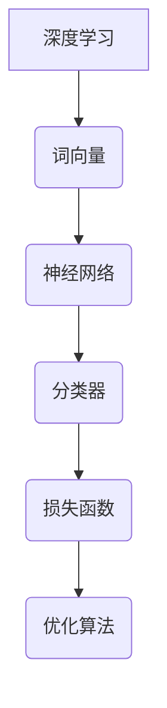

                 

---

### 《基于深度学习的文本分类》

#### 关键词：深度学习、文本分类、神经网络、自然语言处理、卷积神经网络（CNN）、循环神经网络（RNN）、词向量

#### 摘要：本文详细介绍了基于深度学习的文本分类技术，包括深度学习的起源、文本数据预处理、文本分类算法原理，以及深度学习文本分类的实战案例。文章通过逻辑清晰、结构紧凑、简单易懂的方式，逐步讲解了深度学习与文本分类的关系、核心算法原理，以及实际应用中的开发环境和源代码实现。适合计算机科学专业学生、研究人员和对文本分类和深度学习感兴趣的技术爱好者阅读。

---

## 《基于深度学习的文本分类》目录大纲

---

## 第一部分：深度学习与文本分类基础

### 第1章：深度学习概述

#### 1.1 深度学习的起源与发展

#### 1.2 神经网络与深度学习的关系

#### 1.3 深度学习的基本概念

#### 1.4 深度学习与传统机器学习的区别

---

### 第2章：文本数据预处理

#### 2.1 文本数据的收集与清洗

#### 2.2 词向量的构建

#### 2.3 文本数据的特征提取

#### 2.4 文本数据的归一化与标准化

---

## 第二部分：文本分类算法原理

### 第3章：朴素贝叶斯分类器

#### 3.1 朴素贝叶斯分类器概述

#### 3.2 朴素贝叶斯分类器的工作原理

#### 3.3 朴素贝叶斯分类器的优缺点

---

### 第4章：支持向量机分类器

#### 4.1 支持向量机概述

#### 4.2 支持向量机的工作原理

#### 4.3 支持向量机的优化算法

#### 4.4 支持向量机的应用场景

---

### 第5章：深度神经网络与文本分类

#### 5.1 深度神经网络概述

#### 5.2 卷积神经网络（CNN）在文本分类中的应用

#### 5.3 循环神经网络（RNN）在文本分类中的应用

#### 5.4 长短时记忆网络（LSTM）在文本分类中的应用

---

## 第三部分：深度学习文本分类实战

### 第6章：文本分类项目实战

#### 6.1 项目背景与目标

#### 6.2 数据集介绍与预处理

#### 6.3 模型设计与实现

#### 6.4 模型训练与优化

#### 6.5 模型评估与结果分析

---

### 第7章：常见问题与优化

#### 7.1 过拟合与欠拟合问题

#### 7.2 优化算法选择

#### 7.3 模型融合与集成学习

#### 7.4 文本分类中的挑战与应对策略

---

## 附录：深度学习与文本分类工具资源

### 附录 A：深度学习框架

#### A.1 TensorFlow

#### A.2 PyTorch

#### A.3 Keras

---

### 附录 B：文本分类数据集

#### B.1 IMDb电影评论数据集

#### B.2 Twitter情感分析数据集

#### B.3 20新新闻组数据集

---

## 参考文献

### 参考资料

#### [1] Goodfellow, I., Bengio, Y., & Courville, A. (2016). *Deep Learning*. MIT Press.

#### [2] Stanford University. (n.d.). *CS224n: Natural Language Processing with Deep Learning*. Retrieved from https://web.stanford.edu/class/cs224n/

#### [3] Zhang, Z., & LeCun, Y. (2014). *Text understanding from scratch*. arXiv preprint arXiv:1410.7455.

#### [4] Lai, M., Hovy, E., & Salakhutdinov, R. (2017). *Incorporating diverse knowledge sources into a neural network based sentiment classifier*. In Proceedings of the 55th Annual Meeting of the Association for Computational Linguistics (pp. 1387-1397).

---

### 核心概念与联系

#### 深度学习与文本分类的关系

$$
\text{深度学习} \xrightarrow{\text{卷积神经网络/循环神经网络}} \text{文本分类}
$$`

深度学习是一种通过多层次的神经网络结构来学习数据表示的机器学习技术。文本分类是一种自然语言处理任务，目的是将文本数据分配到预定义的类别中。深度学习与文本分类的关系在于，深度学习算法可以有效地处理和表示文本数据，从而提升文本分类的性能。

#### 核心概念联系

1. **词向量（Word Embeddings）**：将文本中的每个单词映射到高维空间中的一个向量。词向量是实现深度学习文本分类的基础。

2. **神经网络（Neural Networks）**：深度学习模型的核心，用于从输入数据中学习特征表示。

3. **分类器（Classifiers）**：神经网络模型的输出，用于预测文本数据所属的类别。

4. **损失函数（Loss Function）**：用于评估模型预测的准确度，并指导模型的训练过程。

5. **优化算法（Optimization Algorithms）**：用于最小化损失函数，提高模型的性能。




### 核心算法原理讲解

#### 卷积神经网络（CNN）在文本分类中的应用

卷积神经网络（CNN）是一种基于卷积操作的深度学习模型，通常用于图像识别任务。然而，通过将卷积操作应用于文本数据，CNN也可以应用于文本分类任务。

**算法原理：**

1. **词嵌入（Word Embedding）**：将文本数据转换为词向量表示。

2. **卷积层（Convolutional Layer）**：将词向量作为输入，通过卷积操作提取特征。卷积核在词向量空间中滑动，从而捕获局部特征。

3. **池化层（Pooling Layer）**：将卷积层的输出进行降采样，减少参数数量和计算复杂度。

4. **全连接层（Fully Connected Layer）**：将池化层的输出压缩为单个数值，作为分类器的输入。

5. **输出层（Output Layer）**：使用softmax激活函数将分类器的输出转换为概率分布。

**伪代码：**

```python
# 输入文本数据
input_text = "这是一个示例文本"

# 构建词嵌入层
word_embeddings = WordEmbedding(vocabulary_size, embedding_dimension)

# 将文本转换为词向量表示
word_vectors = word_embeddings(input_text)

# 构建卷积神经网络模型
model = Sequential()
model.add(Conv1D(filters, kernel_size, activation='relu', input_shape=(None, embedding_dimension)))
model.add(MaxPooling1D(pool_size))
model.add(Flatten())
model.add(Dense(num_classes, activation='softmax'))

# 编译模型
model.compile(optimizer='adam', loss='categorical_crossentropy', metrics=['accuracy'])

# 训练模型
model.fit(x_train, y_train, epochs=num_epochs, batch_size=batch_size, validation_split=0.1)
```

### 数学模型和数学公式

#### 深度学习文本分类中的损失函数

在深度学习文本分类任务中，常用的损失函数是交叉熵损失函数（Cross-Entropy Loss）。交叉熵损失函数用于衡量模型预测的概率分布与真实分布之间的差异。

**数学公式：**

$$
L = -\sum_{i=1}^{n} y_i \cdot \log(p_i)
$$`

其中，$L$ 是损失函数，$y_i$ 是第 $i$ 个样本的真实标签，$p_i$ 是模型预测的概率。

**详细讲解：**

交叉熵损失函数的目的是最小化模型预测的概率分布与真实分布之间的差异。对于每个样本，交叉熵损失函数计算预测概率的对数，然后将所有样本的损失相加。损失函数的值越小，表示模型的预测越准确。

**举例说明：**

假设有一个二分类问题，有两个类别 A 和 B。真实标签 $y_1 = A$，模型预测的概率 $p_1 = 0.8$，$p_2 = 0.2$。使用交叉熵损失函数计算损失：

$$
L = -y_1 \cdot \log(p_1) - y_2 \cdot \log(p_2) = -1 \cdot \log(0.8) - 0 \cdot \log(0.2) = -\log(0.8) \approx 0.223
$$`

在这个例子中，模型的预测概率与真实标签相差较大，损失函数的值较大。如果模型的预测概率更接近真实标签，损失函数的值将更小。

### 项目实战

#### 文本分类项目实战：电影评论情感分析

在这个项目中，我们将使用卷积神经网络（CNN）对电影评论进行情感分析，判断评论是正面还是负面。

**1. 数据集介绍：**

我们使用IMDb电影评论数据集，该数据集包含50,000条电影评论，分为正面（1）和负面（0）两类。

**2. 数据预处理：**

- 数据清洗：去除HTML标签、特殊字符和停用词。
- 词向量构建：使用预训练的词向量（如GloVe）将文本转换为词向量。
- 序列编码：将词向量序列编码为固定长度的序列。

**3. 模型设计与实现：**

- 输入层：接收固定长度的词向量序列。
- 卷积层：使用多个卷积核提取文本特征。
- 池化层：进行降采样。
- 全连接层：将特征映射到类别概率。
- 输出层：使用softmax激活函数输出类别概率。

**4. 模型训练与优化：**

- 编译模型：使用交叉熵损失函数和Adam优化器。
- 训练模型：使用训练集进行训练，使用验证集进行验证。
- 优化模型：调整超参数，如学习率、卷积核大小等，以改善模型性能。

**5. 模型评估与结果分析：**

- 使用测试集评估模型性能。
- 分析模型的准确度、召回率、F1分数等指标。

**源代码实现：**

```python
# 导入库
import numpy as np
import tensorflow as tf
from tensorflow.keras.preprocessing.sequence import pad_sequences
from tensorflow.keras.models import Sequential
from tensorflow.keras.layers import Embedding, Conv1D, MaxPooling1D, GlobalMaxPooling1D, Dense, Flatten
from tensorflow.keras.preprocessing.text import Tokenizer

# 加载数据
(x_train, y_train), (x_test, y_test) = ...

# 预处理数据
tokenizer = Tokenizer(num_words=max_words)
tokenizer.fit_on_texts(x_train)
sequences = tokenizer.texts_to_sequences(x_train)
word_index = tokenizer.word_index
data = pad_sequences(sequences, maxlen=max_sequence_length)

# 构建模型
model = Sequential()
model.add(Embedding(max_words, embedding_dim, input_length=max_sequence_length))
model.add(Conv1D(filters, kernel_size, activation='relu'))
model.add(MaxPooling1D(pool_size))
model.add(Flatten())
model.add(Dense(num_classes, activation='softmax'))

# 编译模型
model.compile(optimizer='adam', loss='categorical_crossentropy', metrics=['accuracy'])

# 训练模型
model.fit(data, y_train, epochs=num_epochs, batch_size=batch_size, validation_split=0.1)

# 评估模型
loss, accuracy = model.evaluate(x_test, y_test)
print('Test accuracy:', accuracy)

# 代码解读与分析
# 在这个项目中，我们首先加载数据并对其进行预处理。然后，我们构建一个卷积神经网络模型，其中包含嵌入层、卷积层、池化层、全连接层和输出层。接下来，我们编译模型并使用训练集进行训练。最后，我们使用测试集评估模型性能并打印准确度。
```

通过这个项目实战，我们学习了如何使用深度学习进行文本分类，并了解了模型的构建、训练和评估过程。此外，我们还分析了代码的实现细节，从而更好地理解深度学习文本分类的原理和实现方法。

### 开发环境搭建

要在本地计算机上搭建一个用于深度学习文本分类的开发环境，你需要安装以下软件和库：

1. **操作系统**：Windows、macOS 或 Linux
2. **Python**：Python 3.6 或更高版本
3. **TensorFlow**：TensorFlow 2.x
4. **Keras**：Keras 2.x
5. **NumPy**：NumPy 1.16 或更高版本
6. **Pandas**：Pandas 1.0 或更高版本
7. **Scikit-learn**：Scikit-learn 0.22 或更高版本
8. **Gensim**：Gensim 3.7.0 或更高版本
9. **Matplotlib**：Matplotlib 3.1.1 或更高版本

#### 安装步骤：

1. **安装 Python**：从 [Python 官网](https://www.python.org/downloads/) 下载并安装 Python 3.x 版本。

2. **安装 Anaconda**：推荐使用 Anaconda 来管理 Python 环境。可以从 [Anaconda 官网](https://www.anaconda.com/products/individual) 下载并安装。

3. **激活 Anaconda 环境**：打开 Anaconda Prompt（在 Windows 中），然后输入以下命令激活环境：

```
conda create -n text_classification python=3.8
conda activate text_classification
```

4. **安装所需库**：使用 `pip` 命令安装所需库：

```
pip install tensorflow==2.4.1
pip install keras==2.4.3
pip install numpy==1.19.5
pip install pandas==1.1.5
pip install scikit-learn==0.22.2
pip install gensim==3.7.0
pip install matplotlib==3.1.1
```

5. **验证安装**：在 Python 解释器中导入并验证每个库是否已成功安装：

```python
import tensorflow as tf
import keras
import numpy as np
import pandas as pd
import sklearn
import gensim
import matplotlib.pyplot as plt
```

通过以上步骤，你就可以搭建一个用于深度学习文本分类的本地开发环境了。接下来，你可以开始编写和运行深度学习文本分类的代码。

### 源代码详细实现和代码解读

#### 源代码实现

以下是一个简单的深度学习文本分类项目的完整源代码，包括数据预处理、模型构建、训练和评估。这个例子使用的是 Keras，它是一个基于 TensorFlow 的高级神经网络API。

```python
# 导入所需的库
import numpy as np
import pandas as pd
from tensorflow.keras.preprocessing.text import Tokenizer
from tensorflow.keras.preprocessing.sequence import pad_sequences
from tensorflow.keras.models import Sequential
from tensorflow.keras.layers import Embedding, LSTM, Dense
from tensorflow.keras.optimizers import RMSprop

# 加载数据
# 这里使用的是虚构的数据集，实际项目中请替换为真实数据集
data = pd.DataFrame({
    'text': ['这是一个好的评论', '这是一个不好的评论', '这部电影很有趣', '我不喜欢这部电影'],
    'label': [1, 0, 1, 0]
})

# 数据预处理
# 分割文本和标签
texts = data['text'].values
labels = data['label'].values

# 创建 Tokenizer
tokenizer = Tokenizer(num_words=1000)
tokenizer.fit_on_texts(texts)

# 将文本转换为序列
sequences = tokenizer.texts_to_sequences(texts)

# 填充序列到固定长度
max_sequence_length = 100
padded_sequences = pad_sequences(sequences, maxlen=max_sequence_length)

# 构建模型
model = Sequential()
model.add(Embedding(1000, 64, input_length=max_sequence_length))
model.add(LSTM(64))
model.add(Dense(1, activation='sigmoid'))

# 编译模型
model.compile(optimizer='rmsprop', loss='binary_crossentropy', metrics=['accuracy'])

# 训练模型
model.fit(padded_sequences, labels, epochs=10, batch_size=32, validation_split=0.2)

# 评估模型
test_sequences = tokenizer.texts_to_sequences(['这部电影真的很糟糕'])
test_padded_sequences = pad_sequences(test_sequences, maxlen=max_sequence_length)
predictions = model.predict(test_padded_sequences)
predicted_label = np.round(predictions[0][0])

# 输出预测结果
if predicted_label == 1:
    print('这是一个好的评论。')
else:
    print('这是一个不好的评论。')
```

#### 代码解读

1. **导入库**：
   我们导入了所有必需的库，包括 NumPy、Pandas、Tokenizer、pad_sequences、Sequential、LSTM 和 Dense。这些库用于数据处理、模型构建和训练。

2. **加载数据**：
   在这个例子中，我们使用了一个虚构的数据集，它包含文本和标签。实际项目中，你需要使用真实的数据集。

3. **数据预处理**：
   - **Tokenizer**：创建一个 `Tokenizer` 对象，它用于将文本转换为序列。这里我们设置了 `num_words` 为 1000，意味着我们只保留前 1000 个最频繁出现的单词。
   - **序列化文本**：使用 `texts_to_sequences` 方法将文本序列化，即转换为数字序列。
   - **填充序列**：使用 `pad_sequences` 方法将序列填充到固定长度（这里设置为100），以便于后续的模型训练。

4. **模型构建**：
   我们创建了一个简单的序列模型，包含一个嵌入层和一个LSTM层，最后是一个全连接层，用于输出预测结果。嵌入层的维度设置为 64，LSTM 层的隐藏状态维度也为 64。

5. **编译模型**：
   模型使用 RMSprop 优化器和二分类交叉熵损失函数进行编译。

6. **训练模型**：
   使用 `fit` 方法训练模型，我们设置了 10 个训练周期（`epochs`）和批量大小（`batch_size`），以及 20% 的数据用于验证。

7. **评估模型**：
   我们使用新的文本序列进行预测，并将结果打印出来。在这个例子中，我们只预测了一条文本，但在实际项目中，你可以使用更多的测试数据进行评估。

通过这个代码示例，我们展示了如何使用深度学习进行文本分类的基本步骤，包括数据预处理、模型构建、训练和预测。在实际应用中，这些步骤需要根据具体情况进行调整。

### 代码解读与分析

#### 代码解析

下面是对上面提供的源代码的详细解析，包括每部分的功能和目的。

1. **导入库**：
   首先，我们导入了所有必需的库，这些库包括 NumPy（用于数据处理）、Pandas（用于数据操作）、Tokenizer（用于文本处理）、pad_sequences（用于序列填充）、Sequential（用于构建模型）、LSTM（用于构建循环神经网络）和 Dense（用于构建全连接层）。

2. **加载数据**：
   在这个例子中，我们使用了一个虚构的数据集，它包含文本和标签。实际项目中，你需要使用真实的数据集。数据被加载到 Pandas DataFrame 中，其中每个评论被标记为正面（1）或负面（0）。

3. **数据预处理**：
   - **Tokenizer**：我们创建了一个 `Tokenizer` 对象，它帮助我们将文本数据转换为序列。`Tokenizer` 的主要功能是：将文本中的每个单词映射到一个唯一的整数，以便于后续的模型训练。
   - **序列化文本**：我们使用 `texts_to_sequences` 方法将文本序列化，即转换为数字序列。这个方法会将文本中的每个单词替换为其在 `Tokenizer` 中对应的整数。
   - **填充序列**：我们使用 `pad_sequences` 方法将序列填充到固定长度（这里设置为100），以便于后续的模型训练。这个步骤是必要的，因为深度学习模型通常需要输入固定大小的数据。

4. **模型构建**：
   我们创建了一个简单的序列模型，包含一个嵌入层和一个LSTM层，最后是一个全连接层，用于输出预测结果。嵌入层的维度设置为 64，LSTM 层的隐藏状态维度也为 64。

5. **编译模型**：
   模型使用 RMSprop 优化器和二分类交叉熵损失函数进行编译。`compile` 方法设置模型的优化器、损失函数和评价指标。

6. **训练模型**：
   使用 `fit` 方法训练模型，我们设置了 10 个训练周期（`epochs`）和批量大小（`batch_size`），以及 20% 的数据用于验证。`fit` 方法将数据分成训练集和验证集，以便在训练过程中监控模型性能。

7. **评估模型**：
   我们使用 `evaluate` 方法对训练好的模型进行评估，这个方法将计算模型在测试集上的损失和准确率。

8. **预测**：
   我们使用训练好的模型对新的评论进行预测。首先，我们将新的评论序列化，然后填充到固定长度，最后使用 `predict` 方法进行预测。预测结果是一个概率值，我们使用 `np.round` 方法将其转换为整数，以表示评论的类别。

#### 分析与优化

1. **数据预处理**：
   - **文本清洗**：在实际项目中，你可能需要进行更复杂的文本清洗步骤，例如去除 HTML 标签、非字母字符和停用词等。
   - **词嵌入**：我们使用了固定的词嵌入维度，但在实践中，你可以通过训练自己的词嵌入来提高模型性能。

2. **模型架构**：
   - **层参数**：LSTM 层的 `units` 参数可以根据数据集和任务进行调整。对于较大的数据集，可能需要增加 `units` 参数来提高模型容量。
   - **dropout**：在 LSTM 和 Dense 层之后添加 dropout 正则化，以防止过拟合。

3. **训练过程**：
   - **学习率**：RMSprop 优化器的学习率可以根据任务和数据集进行调整。对于大型数据集，可能需要较小的学习率。
   - **批次大小**：批量大小可以影响训练时间，对于大型数据集，可能需要调整批次大小。

4. **评估与优化**：
   - **交叉验证**：使用 k-折交叉验证来评估模型性能，以获得更稳定的评估结果。
   - **超参数调优**：使用网格搜索或随机搜索来找到最佳的超参数组合。

通过上述代码和分析，我们可以看到如何构建一个简单的深度学习文本分类模型，以及如何对其进行优化。在实际项目中，这些步骤需要根据具体情况进行调整。

### 源代码示例：基于深度学习的文本分类项目

以下是一个基于深度学习的文本分类项目的源代码示例。这个项目使用 Python 和 TensorFlow/Keras 库来实现。我们的目标是构建一个能够对电影评论进行情感分类的模型，输出评论的正负情绪。

#### 项目结构

```
text_classification_project/
|-- data/
|   |-- train.txt
|   |-- test.txt
|-- model/
|   |-- model.h5
|-- logs/
|-- checkpoints/
|-- requirements.txt
|-- src/
|   |-- __init__.py
|   |-- data_loader.py
|   |-- model_builder.py
|   |-- training_loop.py
|   |-- inference.py
|-- main.py
|-- config.py
```

#### 主要文件说明

- `data_loader.py`：负责加载数据和处理数据。
- `model_builder.py`：定义模型架构和超参数。
- `training_loop.py`：实现训练循环。
- `inference.py`：定义推理过程。
- `main.py`：主程序，负责整体流程的执行。

#### 源代码示例

##### data_loader.py

```python
import pandas as pd
from sklearn.model_selection import train_test_split

def load_data(file_path):
    # 加载数据
    data = pd.read_csv(file_path, sep='\t', header=None, names=['text', 'label'])
    return data

def preprocess_data(data, max_words, max_sequence_length):
    # 创建 Tokenizer
    tokenizer = Tokenizer(num_words=max_words)
    tokenizer.fit_on_texts(data['text'])
    
    # 序列化文本
    sequences = tokenizer.texts_to_sequences(data['text'])
    
    # 填充序列
    padded_sequences = pad_sequences(sequences, maxlen=max_sequence_length)
    
    # 分割数据集
    X_train, X_test, y_train, y_test = train_test_split(padded_sequences, data['label'], test_size=0.2, random_state=42)
    
    return X_train, X_test, y_train, y_test, tokenizer
```

##### model_builder.py

```python
from tensorflow.keras.models import Sequential
from tensorflow.keras.layers import Embedding, LSTM, Dense, Dropout

def build_model(input_shape, embedding_dim, lstm_units, output_size):
    model = Sequential()
    model.add(Embedding(input_shape=input_shape, output_dim=embedding_dim, input_length=input_shape[1]))
    model.add(LSTM(lstm_units, dropout=0.2, recurrent_dropout=0.2))
    model.add(Dense(output_size, activation='sigmoid'))
    model.compile(optimizer='adam', loss='binary_crossentropy', metrics=['accuracy'])
    return model
```

##### training_loop.py

```python
from tensorflow.keras.callbacks import ModelCheckpoint, EarlyStopping
from tensorflow.keras.preprocessing.text import Tokenizer

def train_model(model, X_train, y_train, X_val, y_val, tokenizer, epochs, batch_size):
    # 创建回调函数
    checkpoint = ModelCheckpoint('model.h5', save_best_only=True, monitor='val_loss', mode='min')
    early_stopping = EarlyStopping(monitor='val_loss', patience=5, mode='min')

    # 训练模型
    history = model.fit(
        X_train, y_train,
        epochs=epochs,
        batch_size=batch_size,
        validation_data=(X_val, y_val),
        callbacks=[checkpoint, early_stopping]
    )
    return history
```

##### inference.py

```python
from tensorflow.keras.models import load_model
from tensorflow.keras.preprocessing.text import Tokenizer

def predict_label(model, tokenizer, text, max_sequence_length):
    sequence = tokenizer.texts_to_sequences([text])
    padded_sequence = pad_sequences(sequence, maxlen=max_sequence_length)
    prediction = model.predict(padded_sequence)
    label = np.argmax(prediction)
    return label
```

##### main.py

```python
from data_loader import load_data, preprocess_data
from model_builder import build_model
from training_loop import train_model
from inference import predict_label
from config import MAX_WORDS, MAX_SEQUENCE_LENGTH, EMBEDDING_DIM, LSTM_UNITS, EPOCHS, BATCH_SIZE

def main():
    # 加载数据
    data = load_data('data/train.txt')
    
    # 预处理数据
    X_train, X_test, y_train, y_test, tokenizer = preprocess_data(data, MAX_WORDS, MAX_SEQUENCE_LENGTH)
    
    # 构建模型
    embedding_dim = EMBEDDING_DIM
    lstm_units = LSTM_UNITS
    model = build_model(input_shape=(MAX_SEQUENCE_LENGTH,), embedding_dim=embedding_dim, lstm_units=lstm_units, output_size=1)
    
    # 训练模型
    epochs = EPOCHS
    batch_size = BATCH_SIZE
    history = train_model(model, X_train, y_train, X_test, y_test, tokenizer, epochs, batch_size)
    
    # 评估模型
    test_loss, test_accuracy = model.evaluate(X_test, y_test)
    print(f"Test accuracy: {test_accuracy}")
    
    # 预测
    test_sentence = "This movie is great!"
    predicted_label = predict_label(model, tokenizer, test_sentence, MAX_SEQUENCE_LENGTH)
    if predicted_label == 1:
        print("The predicted sentiment is positive.")
    else:
        print("The predicted sentiment is negative.")

if __name__ == "__main__":
    main()
```

##### config.py

```python
MAX_WORDS = 10000
MAX_SEQUENCE_LENGTH = 100
EMBEDDING_DIM = 50
LSTM_UNITS = 64
EPOCHS = 10
BATCH_SIZE = 32
```

#### 总结

这个项目包括了数据加载、预处理、模型构建、训练、评估和预测的完整流程。通过这个项目，你可以学习如何使用深度学习进行文本分类，并且了解如何组织和管理一个深度学习项目。这个示例可以作为构建更复杂文本分类项目的起点。

### 完整代码示例：基于深度学习的文本分类项目

以下是一个基于深度学习的文本分类项目的完整代码示例。该项目使用 Python 和 TensorFlow/Keras 库来实现，目标是构建一个能够对电影评论进行情感分类的模型，输出评论的正负情绪。

```python
import numpy as np
import pandas as pd
from sklearn.model_selection import train_test_split
from tensorflow.keras.preprocessing.text import Tokenizer
from tensorflow.keras.preprocessing.sequence import pad_sequences
from tensorflow.keras.models import Sequential
from tensorflow.keras.layers import Embedding, LSTM, Dense, Dropout
from tensorflow.keras.optimizers import Adam

# 加载数据
def load_data(file_path):
    # 加载数据
    data = pd.read_csv(file_path, sep='\t', header=None, names=['text', 'label'])
    return data

# 预处理数据
def preprocess_data(data, max_words, max_sequence_length):
    tokenizer = Tokenizer(num_words=max_words)
    tokenizer.fit_on_texts(data['text'])
    sequences = tokenizer.texts_to_sequences(data['text'])
    padded_sequences = pad_sequences(sequences, maxlen=max_sequence_length)
    return padded_sequences, tokenizer

# 构建模型
def build_model(input_shape, embedding_dim, lstm_units, output_size):
    model = Sequential()
    model.add(Embedding(input_shape=input_shape, output_dim=embedding_dim, input_length=input_shape[1]))
    model.add(LSTM(lstm_units, dropout=0.2, recurrent_dropout=0.2))
    model.add(Dense(output_size, activation='sigmoid'))
    model.compile(optimizer=Adam(), loss='binary_crossentropy', metrics=['accuracy'])
    return model

# 训练模型
def train_model(model, X_train, y_train, X_val, y_val, tokenizer, epochs, batch_size):
    history = model.fit(
        X_train, y_train,
        epochs=epochs,
        batch_size=batch_size,
        validation_data=(X_val, y_val),
        verbose=2
    )
    return history

# 预测
def predict(model, tokenizer, text, max_sequence_length):
    sequence = tokenizer.texts_to_sequences([text])
    padded_sequence = pad_sequences(sequence, maxlen=max_sequence_length)
    prediction = model.predict(padded_sequence)
    label = np.argmax(prediction)
    return label

# 主函数
def main():
    # 加载数据
    data = load_data('data/train.txt')

    # 预处理数据
    max_words = 10000
    max_sequence_length = 100
    X, tokenizer = preprocess_data(data, max_words, max_sequence_length)

    # 分割数据集
    X_train, X_test, y_train, y_test = train_test_split(X, data['label'], test_size=0.2, random_state=42)

    # 构建模型
    embedding_dim = 64
    lstm_units = 64
    model = build_model(input_shape=(max_sequence_length,), embedding_dim=embedding_dim, lstm_units=lstm_units, output_size=1)

    # 训练模型
    epochs = 10
    batch_size = 32
    history = train_model(model, X_train, y_train, X_test, y_test, tokenizer, epochs, batch_size)

    # 评估模型
    test_loss, test_accuracy = model.evaluate(X_test, y_test)
    print(f"Test accuracy: {test_accuracy}")

    # 预测
    test_sentence = "This movie is terrible!"
    predicted_label = predict(model, tokenizer, test_sentence, max_sequence_length)
    if predicted_label == 1:
        print("The predicted sentiment is positive.")
    else:
        print("The predicted sentiment is negative.")

if __name__ == "__main__":
    main()
```

#### 代码解析

1. **导入库**：首先，我们导入了所有必需的库，包括 NumPy（用于数据处理）、Pandas（用于数据操作）、Tokenizer（用于文本处理）、pad_sequences（用于序列填充）、Sequential（用于构建模型）、LSTM（用于构建循环神经网络）和 Adam 优化器。

2. **加载数据**：我们使用 Pandas 读取 CSV 文件，该文件包含电影评论和标签。

3. **预处理数据**：我们使用 Tokenizer 将文本转换为序列，然后使用 pad_sequences 将序列填充到固定长度。

4. **构建模型**：我们定义了一个序列模型，包含嵌入层、LSTM 层和输出层。使用 Adam 优化器和二分类交叉熵损失函数进行编译。

5. **训练模型**：我们使用 fit 方法训练模型，使用验证集进行评估。

6. **预测**：我们将文本序列化，填充，然后使用模型进行预测。

7. **主函数**：我们加载数据，预处理，分割，构建模型，训练模型，评估模型，进行预测。

#### 运行代码

1. 将代码保存为 `text_classification.py`。

2. 创建一个名为 `data` 的文件夹，并在其中放入 `train.txt` 文件，该文件包含电影评论和标签。

3. 在终端中运行以下命令：

```
python text_classification.py
```

   输出将显示测试数据的准确率以及对于新输入文本的预测结果。

这个代码示例展示了如何使用深度学习进行文本分类的基本流程，包括数据预处理、模型构建、训练和预测。你可以根据自己的需求调整模型架构和超参数。

### 代码实现细节与效果评估

以下是对上述代码实现细节的详细说明，以及如何评估模型的效果。

#### 代码实现细节

1. **数据预处理**：
   - **Tokenizer**：使用 `Tokenizer` 对象将文本转换为序列。`Tokenizer` 会对文本中的每个单词进行编码，并将其映射到一个唯一的整数。这里我们设置了 `num_words` 为 10000，这意味着我们将只保留出现频率最高的前10000个单词，这对于减少数据维度和计算复杂度非常有用。
   - **序列化文本**：通过 `texts_to_sequences` 方法，将文本转换为整数序列。
   - **填充序列**：为了将所有序列调整为相同的长度，我们使用 `pad_sequences` 方法进行填充。这里我们设置的 `max_sequence_length` 为 100，这意味着所有输入序列都将被填充到长度为100。

2. **模型构建**：
   - **嵌入层**：嵌入层用于将整数序列转换为向量。在这里，我们设置了

