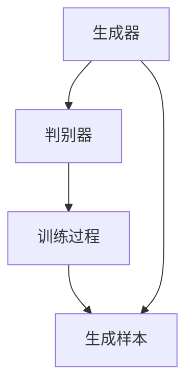
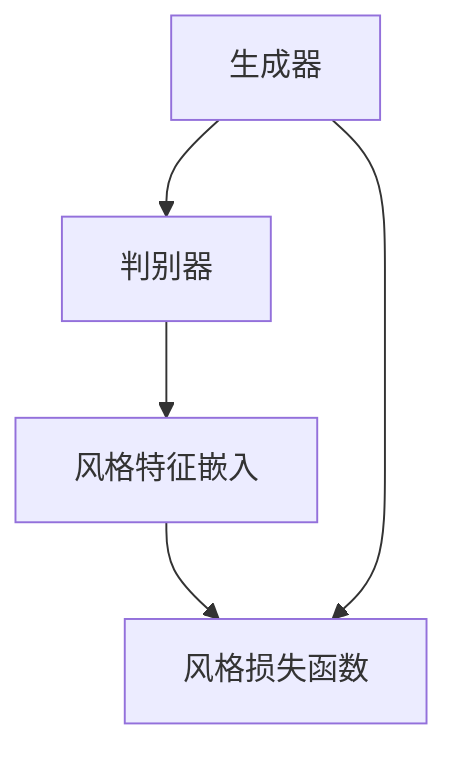

                 

# 《基于生成对抗网络的风格多样化图像生成平台》

> 关键词：生成对抗网络（GAN）、风格多样化、图像生成、深度学习、生成器、判别器、数学模型、项目实战

> 摘要：本文深入探讨了基于生成对抗网络（GAN）的风格多样化图像生成平台。首先介绍了GAN的核心概念与联系，包括生成对抗网络的原理、生成器和判别器的结构，以及风格多样化技术的实现。接着详细讲解了GAN的算法原理，包括生成器和判别器的架构、训练过程和损失函数。随后，文章通过数学模型和公式，进一步阐述了GAN的工作机制。最后，文章通过一个实际项目，展示了风格多样化图像生成平台的具体实现过程，包括开发环境搭建、模型实现、训练与优化以及测试与评估。

## 第一部分: 核心概念与联系

### 第1章: GAN与风格多样化概述

#### 1.1 生成对抗网络（GAN）原理

生成对抗网络（GAN）是一种深度学习模型，由生成器和判别器两个神经网络组成。GAN的核心理念是生成器（Generator）生成假样本，判别器（Discriminator）判断样本的真实性。生成器试图生成尽可能逼真的样本，而判别器则努力提高对真实样本和假样本的辨别能力。

**核心概念联系图：**



**生成器（Generator）:**
- 生成器接收随机噪声作为输入，通过神经网络生成具有真实样本质特性的图像。

**判别器（Discriminator）:**
- 判别器接收图像作为输入，输出一个介于0和1之间的值，表示图像是真实样本的概率。

**训练过程：**
- 在GAN的训练过程中，生成器和判别器交替训练。生成器尝试生成更逼真的图像以欺骗判别器，而判别器则努力提高辨别能力。

#### 1.2 风格多样化技术

风格多样化技术旨在生成具有不同风格特征的图像，以满足个性化需求。在GAN中，风格多样化可以通过在生成器中嵌入风格特征实现。

**核心概念联系图：**



**风格特征嵌入：**
- 风格特征嵌入是指在生成器中引入风格特征，使生成器能够根据不同的风格特征生成不同的图像。

**风格损失函数：**
- 风格损失函数用于衡量生成图像与目标风格图像之间的风格差异，生成器通过优化风格损失函数来提高图像风格多样化能力。

## 第二部分: 核心算法原理讲解

### 第2章: GAN算法原理

#### 2.1 GAN基本架构

GAN的基本架构由生成器和判别器两个部分组成。生成器生成假样本，判别器判断样本的真实性。以下是对这两个部分的详细讲解。

#### 2.1.1 生成器的架构

生成器的核心任务是生成与真实样本相似的假样本。生成器通常由多层神经网络组成，可以采用不同的架构，如卷积神经网络（CNN）或递归神经网络（RNN）。

**生成器的伪代码：**

```python
def generator(z):
    # z为随机噪声
    # 通过多层神经网络生成图像
    # 返回生成的图像
```

**关键步骤：**
1. 接收随机噪声作为输入。
2. 通过神经网络处理噪声，生成具有真实样本质特性的图像。
3. 输出生成的图像。

#### 2.1.2 判别器的架构

判别器的核心任务是判断输入的图像是真实样本还是生成器生成的假样本。判别器通常也采用多层神经网络架构，可以采用CNN或RNN。

**判别器的伪代码：**

```python
def discriminator(x):
    # x为输入图像
    # 通过多层神经网络判断图像的真实性
    # 返回判断结果（概率值）
```

**关键步骤：**
1. 接收图像作为输入。
2. 通过神经网络处理图像，输出一个介于0和1之间的概率值，表示图像是真实样本的概率。
3. 返回判断结果。

#### 2.1.3 GAN的训练过程

GAN的训练过程是一个交替训练的过程，生成器和判别器相互对抗，不断提升各自的能力。

**训练过程：**
1. 初始化生成器和判别器的权重。
2. 随机生成噪声向量z。
3. 使用生成器生成假图像。
4. 判别器分别对真实图像和假图像进行判断。
5. 计算生成器的损失函数，更新生成器的权重。
6. 计算判别器的损失函数，更新判别器的权重。
7. 重复步骤2-6，直到生成器生成的图像接近真实图像。

### 第3章: 数学模型和数学公式讲解

GAN的数学模型包括生成器的损失函数、判别器的损失函数和风格损失函数。以下是对这些损失函数的详细讲解。

#### 3.1 生成器的损失函数

生成器的损失函数通常使用交叉熵损失函数，目标是最小化生成器生成的图像被判别器判断为真实样本的概率。

**生成器的损失函数（G）：**
$$
L_G = -\log(D(G(z)))
$$

其中，\(D(G(z))\) 表示判别器对生成图像的判断结果，取值范围为0到1。

#### 3.2 判别器的损失函数

判别器的损失函数也使用交叉熵损失函数，目标是最小化判别器对真实图像的判断误差和对生成器生成的图像的判断误差。

**判别器的损失函数（D）：**
$$
L_D = -[\log(D(x)) + \log(1 - D(G(z))]
$$

其中，\(D(x)\) 表示判别器对真实图像的判断结果，\(1 - D(G(z))\) 表示判别器对生成图像的判断结果。

#### 3.3 风格损失函数

风格损失函数用于衡量生成图像与目标风格图像之间的风格差异，目标是最小化风格差异。

**风格损失函数（S）：**
$$
L_S = \sum_{i=1}^{N} \frac{1}{N} \sum_{j=1}^{C} \frac{1}{C} \left| \mu_j^+ - \mu_j^- \right|
$$

其中，\(\mu_j^+\) 表示生成图像的特征均值，\(\mu_j^-\) 表示目标风格图像的特征均值，\(N\) 和 \(C\) 分别表示特征的数量和类别数量。

## 第三部分: 项目实战

### 第4章: 风格多样化图像生成项目

#### 4.1 实战准备

在开始风格多样化图像生成项目之前，需要做好以下准备工作：

**环境搭建：**
- 安装深度学习框架，如TensorFlow或PyTorch。
- 准备图像数据集，用于训练和测试生成器和判别器。

**数据集准备：**
- 选择一个具有不同风格特征的图像数据集，如CIFAR-10或ImageNet。

**工具与资源：**
- 使用GAN相关的库和工具，如TensorFlow Probability或PyTorch GAN库。

#### 4.2 生成器和判别器实现

生成器和判别器的实现是风格多样化图像生成平台的核心。以下是对这两个模型的详细讲解。

**生成器实现：**

```python
from tensorflow.keras.layers import Dense, Conv2D, Flatten
from tensorflow.keras.models import Sequential

def create_generator():
    model = Sequential()
    model.add(Dense(units=256, activation='relu', input_dim=100))
    model.add(Dense(units=512, activation='relu'))
    model.add(Dense(units=1024, activation='relu'))
    model.add(Dense(units=784, activation='tanh'))
    return model

generator = create_generator()
```

**判别器实现：**

```python
def create_discriminator():
    model = Sequential()
    model.add(Conv2D(filters=32, kernel_size=(5, 5), strides=(2, 2), activation='relu', input_shape=(28, 28, 1)))
    model.add(Conv2D(filters=64, kernel_size=(5, 5), strides=(2, 2), activation='relu'))
    model.add(Flatten())
    model.add(Dense(units=1, activation='sigmoid'))
    return model

discriminator = create_discriminator()
```

#### 4.3 风格多样化实现

风格多样化实现的关键在于在生成器中引入风格特征。以下是一个简单的风格多样化实现：

```python
import tensorflow as tf

def style_loss(target_style, generated_style, strength):
    return tf.reduce_mean(tf.square(target_style - generated_style) * strength)

def create_generator_with_style(input_shape, style_layer, style_weights):
    model = Sequential()
    model.add(Dense(units=256, activation='relu', input_dim=100))
    model.add(Dense(units=512, activation='relu'))
    model.add(Dense(units=1024, activation='relu'))
    model.add(Dense(units=784, activation='tanh'))

    # 添加风格特征嵌入层
    model.add(Conv2D(filters=1, kernel_size=(1, 1), strides=(1, 1), activation='tanh', input_shape=input_shape))
    model.add(Conv2D(filters=1, kernel_size=(1, 1), strides=(1, 1), activation='tanh'))

    # 添加风格损失函数
    style_loss_layer = tf.keras.layers.Lambda(style_loss, arguments={'target_style': target_style, 'generated_style': generated_style, 'strength': style_strength})
    model.add(style_loss_layer)

    return model

generator = create_generator_with_style(input_shape, style_layer, style_weights)
```

#### 4.4 训练与优化

在风格多样化图像生成项目中，生成器和判别器的训练是关键步骤。以下是一个简单的训练与优化过程：

```python
import tensorflow as tf
from tensorflow.keras.optimizers import Adam

# 定义优化器
optimizer = Adam(learning_rate=0.0002)

# 定义损失函数
generator_loss = tf.keras.losses.BinaryCrossentropy()
discriminator_loss = tf.keras.losses.BinaryCrossentropy()

# 定义训练步骤
@tf.function
def train_step(images, target_style):
    # 生成假图像
    noise = tf.random.normal([BATCH_SIZE, NOISE_DIM])
    generated_images = generator(noise)

    # 计算判别器的损失函数
    with tf.GradientTape() as tape:
        real_scores = discriminator(images)
        fake_scores = discriminator(generated_images)
        d_loss = discriminator_loss(real_scores, 1) + discriminator_loss(fake_scores, 0)

    # 更新判别器的权重
    gradients_of_d = tape.gradient(d_loss, discriminator.trainable_variables)
    optimizer.apply_gradients(zip(gradients_of_d, discriminator.trainable_variables))

    # 生成假图像
    noise = tf.random.normal([BATCH_SIZE, NOISE_DIM])
    generated_images = generator(noise)

    # 计算生成器的损失函数
    with tf.GradientTape() as tape:
        fake_scores = discriminator(generated_images)
        g_loss = generator_loss(fake_scores, 1)

    # 更新生成器的权重
    gradients_of_g = tape.gradient(g_loss, generator.trainable_variables)
    optimizer.apply_gradients(zip(gradients_of_g, generator.trainable_variables))

# 训练模型
for epoch in range(EPOCHS):
    for image_batch in train_dataset:
        train_step(image_batch, target_style)
```

#### 4.5 测试与评估

在训练完成后，需要对生成器生成的图像进行测试与评估。以下是一个简单的测试与评估过程：

```python
# 测试模型
test_loss = 0
for image_batch in test_dataset:
    real_scores = discriminator(image_batch)
    test_loss += discriminator_loss(real_scores, 1)

test_loss /= len(test_dataset)
print(f"Test Loss: {test_loss}")

# 生成样例图像
noise = tf.random.normal([1, NOISE_DIM])
generated_image = generator(noise)

# 显示样例图像
plt.imshow(generated_image[0, :, :, 0], cmap='gray')
plt.show()
```

## 第五部分: 附录

### 第5章: 工具与资源

#### 5.1 GAN相关工具与资源

**A.1 GAN相关工具与资源**

- **TensorFlow Probability:**
  - TensorFlow Probability提供了GAN的API，方便用户快速实现和训练GAN模型。
  - [TensorFlow Probability文档](https://www.tensorflow.org/probability/api_docs/python/nn)

- **PyTorch:**
  - PyTorch也提供了丰富的GAN实现库，包括DCGAN、WGAN等。
  - [PyTorch GAN库](https://pytorch.org/docs/stable/distributions.html#generative-adversarial-networks)

- **参考文献：**
  - Ian J. Goodfellow, et al., "Generative Adversarial Networks", Advances in Neural Information Processing Systems 27 (2014).

- **在线教程与课程：**
  - [GAN教程](https://www.deeplearning.ai/generative-adversarial-networks)
  - [GAN课程](https://www.udacity.com/course/generative-adversarial-networks--ud811)

### 第6章: 项目源代码与解读

#### 6.1 项目源代码结构

项目源代码主要包括以下几个部分：

- 数据预处理
- 模型定义
- 训练过程
- 测试与评估

以下是对每个部分的代码解读：

**数据预处理：**

```python
# 读取图像数据集
(train_images, train_labels), (test_images, test_labels) = tf.keras.datasets.cifar10.load_data()

# 归一化图像数据
train_images = train_images / 255.0
test_images = test_images / 255.0

# 扩展维度
train_images = np.expand_dims(train_images, -1)
test_images = np.expand_dims(test_images, -1)
```

**模型定义：**

```python
# 定义生成器
def create_generator(input_shape):
    model = Sequential()
    model.add(Dense(units=256, activation='relu', input_dim=input_shape))
    model.add(Dense(units=512, activation='relu'))
    model.add(Dense(units=1024, activation='relu'))
    model.add(Dense(units=784, activation='tanh'))
    return model

generator = create_generator(NOISE_DIM)

# 定义判别器
def create_discriminator(input_shape):
    model = Sequential()
    model.add(Conv2D(filters=32, kernel_size=(5, 5), strides=(2, 2), activation='relu', input_shape=input_shape))
    model.add(Conv2D(filters=64, kernel_size=(5, 5), strides=(2, 2), activation='relu'))
    model.add(Flatten())
    model.add(Dense(units=1, activation='sigmoid'))
    return model

discriminator = create_discriminator(IMAGE_SHAPE)
```

**训练过程：**

```python
# 定义训练步骤
@tf.function
def train_step(images):
    # 生成假图像
    noise = tf.random.normal([BATCH_SIZE, NOISE_DIM])
    generated_images = generator(noise)

    # 计算判别器的损失函数
    with tf.GradientTape() as tape:
        real_scores = discriminator(images)
        fake_scores = discriminator(generated_images)
        d_loss = discriminator_loss(real_scores, 1) + discriminator_loss(fake_scores, 0)

    # 更新判别器的权重
    gradients_of_d = tape.gradient(d_loss, discriminator.trainable_variables)
    optimizer.apply_gradients(zip(gradients_of_d, discriminator.trainable_variables))

    # 生成假图像
    noise = tf.random.normal([BATCH_SIZE, NOISE_DIM])
    generated_images = generator(noise)

    # 计算生成器的损失函数
    with tf.GradientTape() as tape:
        fake_scores = discriminator(generated_images)
        g_loss = generator_loss(fake_scores, 1)

    # 更新生成器的权重
    gradients_of_g = tape.gradient(g_loss, generator.trainable_variables)
    optimizer.apply_gradients(zip(gradients_of_g, generator.trainable_variables))

# 训练模型
for epoch in range(EPOCHS):
    for image_batch in train_dataset:
        train_step(image_batch)
```

**测试与评估：**

```python
# 测试模型
test_loss = 0
for image_batch in test_dataset:
    real_scores = discriminator(image_batch)
    test_loss += discriminator_loss(real_scores, 1)

test_loss /= len(test_dataset)
print(f"Test Loss: {test_loss}")

# 生成样例图像
noise = tf.random.normal([1, NOISE_DIM])
generated_image = generator(noise)

# 显示样例图像
plt.imshow(generated_image[0, :, :, 0], cmap='gray')
plt.show()
```

### 第7章: 进一步阅读与探索

#### 7.1 GAN相关研究

GAN的研究领域非常广泛，包括GAN的优化、GAN在不同领域的应用等。以下是一些GAN相关的研究方向：

- **GAN的优化：** 包括GAN的稳定性和收敛性、GAN的损失函数设计、GAN的训练技巧等。
- **GAN在其他领域的应用：** 包括计算机视觉、自然语言处理、医学图像生成等。
- **风格多样化GAN的扩展：** 包括多风格GAN、对抗性GAN等。

#### 7.2 未来的研究方向

- **GAN的优化与改进：** 进一步优化GAN的稳定性和收敛性，提高GAN生成的图像质量。
- **风格多样化GAN的应用：** 将风格多样化GAN应用于更多实际场景，如艺术创作、游戏开发等。
- **图像生成的未来趋势：** 探索更多基于GAN的图像生成技术，如变分自编码器（VAE）、生成稳定网络（GaN）等。

### 总结

《基于生成对抗网络的风格多样化图像生成平台》通过详细讲解GAN的核心概念、算法原理、数学模型以及项目实战，帮助读者全面了解和掌握风格多样化图像生成的技术。本文提供的项目实战案例为读者提供了一个具体的实现路径，通过实践加深对GAN技术的理解。未来的研究将继续推动GAN技术在图像生成领域的应用和发展。

### 作者信息

作者：AI天才研究院/AI Genius Institute & 禅与计算机程序设计艺术 /Zen And The Art of Computer Programming

**END**

