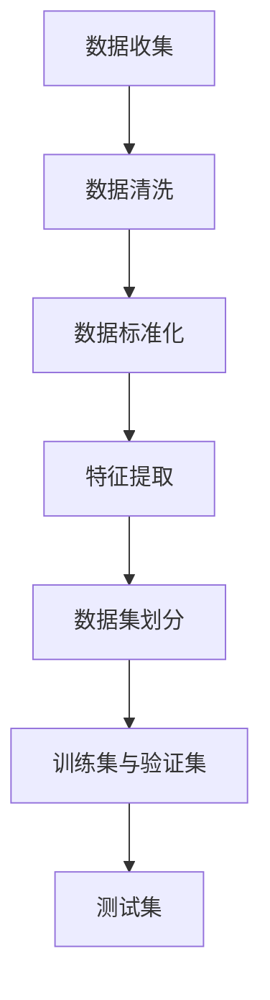
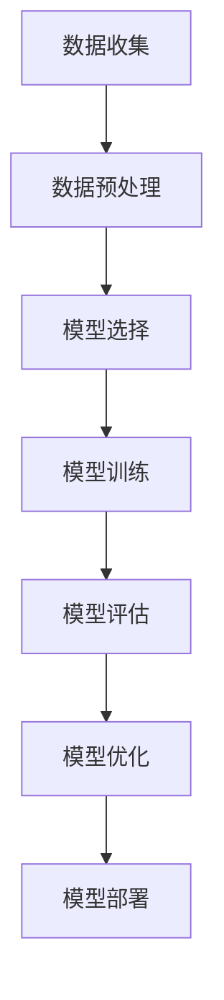
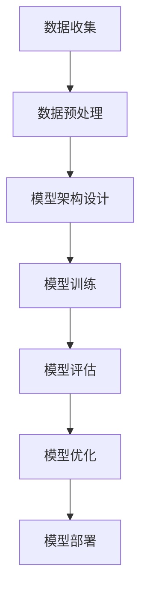
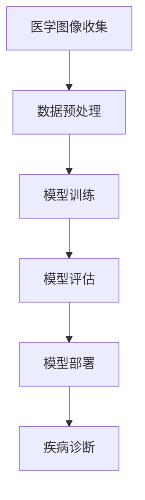
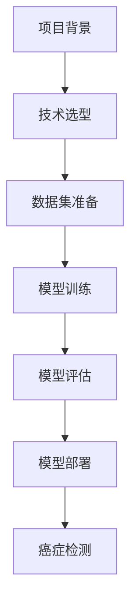
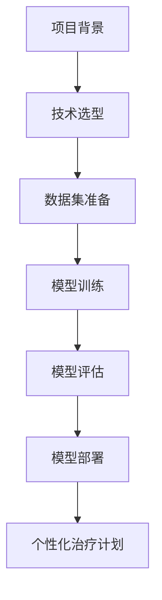

                 

# 《基础模型的医疗保健应用》

> 关键词：基础模型、医疗保健、应用、深度学习、自然语言处理、机器学习

> 摘要：本文旨在探讨基础模型在医疗保健领域的应用，包括医疗诊断、治疗规划、风险评估与预测、医疗保健质量改进等方面。文章首先概述了医疗保健领域的重要性，然后介绍了基础模型的基本原理，接着分析了基础模型在医疗保健中的实际应用，最后通过两个项目实战展示了如何将基础模型应用于医疗保健领域。本文旨在为读者提供一个全面、深入的指导，帮助理解基础模型在医疗保健领域的应用潜力。

### 引言

#### 1.1 书籍概述

《基础模型的医疗保健应用》旨在探讨基础模型在医疗保健领域的应用。基础模型，特别是深度学习和自然语言处理模型，已经在许多领域取得了显著的进展，医疗保健领域也不例外。本文将从基础模型的原理入手，深入分析其在医疗保健中的实际应用，并通过项目实战展示如何将这些模型应用于医疗保健领域。

#### 1.2 医疗保健领域概述

医疗保健是一个复杂且至关重要的领域，涉及到疾病的预防、诊断、治疗和康复。随着医疗技术的发展，医疗保健领域面临着新的挑战和机遇。例如，大数据和人工智能技术的应用为个性化医疗、疾病预测和风险评估提供了新的可能。然而，医疗保健领域的数据量大且复杂，传统的数据处理方法难以满足需求。基础模型的出现为解决这些问题提供了新的思路。

#### 1.3 医疗保健领域的挑战与机遇

医疗保健领域的挑战主要包括数据的不完整性、隐私保护、算法的可解释性和医疗知识的整合。然而，随着人工智能技术的发展，这些挑战也带来了新的机遇。例如，深度学习模型可以在大规模数据集上进行训练，从而提高诊断和治疗的准确性；自然语言处理模型可以帮助医生从大量电子病历中提取有用的信息，从而优化医疗决策。

### 第二部分：基础模型原理

#### 2.1 数据预处理

在医疗保健领域，数据预处理是一个关键步骤，它涉及到数据的清洗、标准化和特征提取。医疗数据通常包含噪声、缺失值和不一致的数据格式，因此需要对这些数据进行处理。数据清洗包括去除重复数据、填充缺失值和纠正错误数据。数据标准化是将数据转换为相同的尺度，以便进行后续分析。特征提取是从原始数据中提取有用的信息，以便用于模型训练。

#### 2.2 机器学习基础

机器学习是基础模型的核心，它包括监督学习、无监督学习和强化学习。监督学习是一种常见的学习方法，它使用标签数据来训练模型，从而预测新的数据。无监督学习不使用标签数据，而是通过发现数据中的模式和结构来训练模型。强化学习则是通过奖励机制来训练模型，使其能够在特定环境中做出最优决策。

#### 2.2.1 监督学习

监督学习包括分类和回归两种任务。分类任务是将数据分为不同的类别，例如诊断结果为癌症或非癌症。回归任务则是预测一个连续的数值，例如患者的生存时间。常见的分类算法包括决策树、随机森林和支持向量机。常见的回归算法包括线性回归和逻辑回归。

##### 2.2.1.1 决策树

决策树是一种基于树结构的分类算法。它通过一系列的测试来将数据划分为不同的类别。每个节点表示一个测试，每个测试使用一个特征。如果测试结果为真，则继续向下移动到下一个节点；如果测试结果为假，则转移到另一条路径。决策树的优点是易于理解和解释，但缺点是容易过拟合。

##### 2.2.1.2 随机森林

随机森林是一种集成学习算法，它由多个决策树组成。每个决策树使用不同的数据子集进行训练，从而提高模型的泛化能力。随机森林的优点是能够处理大规模数据集，并且具有很好的鲁棒性。

##### 2.2.1.3 支持向量机

支持向量机是一种基于间隔最大化的分类算法。它通过寻找一个超平面，将不同类别的数据点尽可能地分开。支持向量机的主要优点是能够在高维空间中找到最优的分割超平面，从而提高分类的准确性。

##### 2.2.1.4 线性回归

线性回归是一种用于预测连续数值的监督学习算法。它通过找到一个线性关系，将自变量和因变量联系起来。线性回归的优点是简单易懂，但缺点是容易受到噪声数据的影响。

##### 2.2.1.5 逻辑回归

逻辑回归是一种用于分类的线性模型，它通过将线性回归输出转换为概率分布来进行分类。逻辑回归的优点是能够在多个类别之间进行分类，并且具有很好的可解释性。

#### 2.2.2 无监督学习

无监督学习包括聚类和降维两种任务。聚类是将数据分为不同的组，以便发现数据中的模式和结构。降维是将高维数据映射到低维空间，以便减少数据的复杂性。

##### 2.2.2.1 聚类算法

聚类算法是一种无监督学习算法，它将数据分为不同的组，以便发现数据中的模式和结构。常见的聚类算法包括K-均值聚类、层次聚类和凝聚层次聚类。

###### 2.2.2.1.1 K-均值聚类

K-均值聚类是一种基于距离度量的聚类算法。它首先随机选择K个中心点，然后迭代更新这些中心点，直到收敛。每个数据点被分配到最近的中心点，从而形成不同的簇。

###### 2.2.2.1.2 层次聚类

层次聚类是一种基于层次结构的聚类算法。它通过递归地将数据点合并或分割，形成不同的层次。层次聚类的优点是能够发现不同尺度的聚类结构。

###### 2.2.2.2 凝聚层次聚类

凝聚层次聚类是一种基于层次结构的聚类算法，它通过逐步合并最近的簇，形成不同的层次。凝聚层次聚类的优点是能够灵活地处理不同尺度的聚类结构。

##### 2.2.2.2.1 主成分分析

主成分分析是一种降维算法，它通过将数据映射到新的正交坐标系中，提取最重要的特征。主成分分析的优点是能够减少数据的维度，同时保持数据的方差。

#### 2.3 深度学习基础

深度学习是一种基于多层神经网络的学习方法，它通过自动提取数据中的特征，从而实现复杂的任务。深度学习在医疗保健领域有广泛的应用，包括医学图像分析、电子病历分析等。

##### 2.3.1 神经网络架构

神经网络是一种由多个神经元组成的计算模型，它通过层层传递输入信息，从而实现复杂的任务。常见的神经网络架构包括前馈神经网络、卷积神经网络和循环神经网络。

###### 2.3.1.1 前馈神经网络

前馈神经网络是一种简单的神经网络架构，它由输入层、隐藏层和输出层组成。输入层接收外部输入，隐藏层通过非线性变换提取特征，输出层生成预测结果。

###### 2.3.1.2 卷积神经网络

卷积神经网络是一种用于处理图像数据的神经网络，它通过卷积操作和池化操作提取图像特征。卷积神经网络的主要优势是能够在低维度空间中提取有效的特征。

###### 2.3.1.3 循环神经网络

循环神经网络是一种用于处理序列数据的神经网络，它通过循环连接实现数据的记忆功能。循环神经网络可以用于处理时间序列数据、自然语言处理等任务。

##### 2.3.2 循环神经网络

循环神经网络是一种用于处理序列数据的神经网络，它通过循环连接实现数据的记忆功能。循环神经网络可以用于处理时间序列数据、自然语言处理等任务。

###### 2.3.2.1 基本RNN结构

基本RNN结构由输入层、隐藏层和输出层组成。隐藏层通过循环连接实现数据的记忆功能。基本RNN结构可以处理简单的序列数据。

###### 2.3.2.2 LSTM与GRU

LSTM和GRU是循环神经网络的变体，它们通过引入门结构来解决基本RNN的梯度消失问题。LSTM通过门结构控制信息的流入和流出，从而实现长期记忆功能。GRU通过合并输入门和遗忘门，简化了LSTM的结构。

##### 2.3.3 神经网络训练

神经网络的训练是通过优化损失函数来调整网络的权重。常见的优化算法包括梯度下降、随机梯度下降和Adam优化器。训练过程中，需要使用大量的数据，并对数据集进行划分，包括训练集、验证集和测试集。

#### 2.4 医疗保健领域中的数学模型

数学模型在医疗保健领域中起着重要的作用，例如贝叶斯网络、生存分析模型和贝叶斯统计模型。

##### 2.4.1 概率模型

概率模型是一种用于描述不确定性事件的数学模型。贝叶斯网络是一种基于概率的图形模型，它通过条件概率表描述变量之间的关系。

###### 2.4.1.1 贝叶斯网络

贝叶斯网络是一种基于概率的图形模型，它通过条件概率表描述变量之间的关系。贝叶斯网络可以用于推理和预测，例如疾病诊断和风险预测。

###### 2.4.1.2 生存分析模型

生存分析模型是一种用于描述时间至事件发生的概率的数学模型。生存函数和Kaplan-Meier估计是常见的生存分析工具。

##### 2.4.2 贝叶斯统计模型

贝叶斯统计模型是一种基于概率的统计方法，它通过贝叶斯推理来更新先验概率。高斯过程是一种常用的贝叶斯统计模型，它通过高斯过程回归和高斯过程分类进行预测。

### 第三部分：基础模型在医疗保健中的应用

#### 3.1 医疗诊断

医疗诊断是医疗保健领域的一个重要应用，它涉及到疾病检测、病情评估和治疗方案推荐。

##### 3.1.1 基于深度学习的医学图像分析

基于深度学习的医学图像分析是一种利用卷积神经网络对医学图像进行自动分析和分类的技术。它可以帮助医生快速、准确地诊断疾病，例如癌症检测和心脏疾病诊断。

###### 3.1.1.1 卷积神经网络在医学图像中的应用

卷积神经网络在医学图像分析中发挥着重要作用，例如图像分割、目标检测和分类。通过卷积操作和池化操作，卷积神经网络可以从图像中提取有效的特征，从而实现疾病的自动诊断。

###### 3.1.1.2 癌症检测

癌症检测是深度学习在医疗诊断中的一个重要应用。通过训练深度学习模型，可以从医学图像中检测出癌症区域，从而帮助医生进行早期诊断。

###### 3.1.1.3 心脏疾病诊断

心脏疾病诊断是另一个深度学习在医疗诊断中的应用。通过分析心脏超声图像，可以检测出心脏病变，从而帮助医生制定治疗方案。

##### 3.1.2 基于自然语言处理的电子病历分析

电子病历（Electronic Medical Records, EMR）是医疗保健领域中重要的数据资源。基于自然语言处理的电子病历分析可以从大量非结构化数据中提取有用的信息，从而辅助医生进行诊断和治疗。

###### 3.1.2.1 电子病历数据的预处理

电子病历数据通常包含大量非结构化数据，例如文本、图像和声音。预处理步骤包括数据清洗、文本分类和关键信息提取。

###### 3.1.2.2 文本分类

文本分类是将电子病历数据按照预定的类别进行分类的技术。通过训练分类模型，可以将电子病历数据分为不同的类别，例如疾病类型、治疗方案等。

###### 3.1.2.3 提取关键信息

提取关键信息是从电子病历中提取对诊断和治疗有用的信息。通过自然语言处理技术，可以从大量的文本数据中提取出重要的诊断指标和治疗方案。

#### 3.2 治疗规划

治疗规划是医疗保健领域中的另一个重要应用，它涉及到药物反应预测、个性化治疗计划和治疗方案优化。

##### 3.2.1 基于机器学习的药物反应预测

药物反应预测是利用机器学习技术预测患者对药物的响应。通过分析患者的临床数据和药物特性，可以预测患者对特定药物的不良反应或疗效。

###### 3.2.1.1 药物反应预测的挑战

药物反应预测面临许多挑战，例如数据集选择、特征工程和模型选择。这些挑战需要利用机器学习技术和数据科学方法来解决。

###### 3.2.1.2 基于深度学习的个性化治疗计划

基于深度学习的个性化治疗计划是一种利用深度学习模型为患者制定个性化治疗方案的方法。通过分析患者的临床数据和药物反应预测结果，可以为患者推荐最佳的治疗方案。

##### 3.2.2 基于大数据的治疗方案优化

大数据技术在医疗保健领域中的应用日益广泛，它可以帮助医疗机构优化治疗方案，提高医疗质量和效率。通过分析大量的医疗数据，可以识别出最佳的治疗方案，并为患者提供个性化的医疗服务。

###### 3.2.2.1 患者流分析

患者流分析是一种利用大数据技术分析患者就医行为的方法。通过分析患者流数据，可以识别出患者就医的热点和痛点，从而优化就医流程和资源配置。

###### 3.2.2.2 资源分配优化

资源分配优化是一种利用大数据技术优化医疗机构资源分配的方法。通过分析医疗资源的使用情况，可以合理分配医疗资源，提高医疗资源的利用效率。

#### 3.3 风险评估与预测

风险评估与预测是医疗保健领域中的另一个重要应用，它涉及到疾病预测、疾病风险预测和疾病预防。

##### 3.3.1 基于大数据的疾病预测

基于大数据的疾病预测是一种利用大数据技术预测疾病发生的方法。通过分析患者的健康数据、生活方式数据和环境数据，可以预测疾病的发生风险，从而采取预防措施。

###### 3.3.1.1 大数据在医疗保健中的应用

大数据技术在医疗保健领域中的应用包括疾病预测、疾病风险预测和疾病预防。通过分析大量的医疗数据，可以识别出疾病的早期征兆和风险因素，从而采取预防措施。

###### 3.3.1.2 数据处理与整合

数据处理与整合是大数据在医疗保健领域应用的关键步骤。通过清洗、标准化和整合各种医疗数据，可以构建一个全面的患者健康数据集，从而提高疾病预测的准确性。

##### 3.3.2 深度学习在疾病预测中的应用

深度学习是一种强大的机器学习技术，它在疾病预测中发挥着重要作用。通过构建深度学习模型，可以从大量的医疗数据中提取有用的信息，从而提高疾病预测的准确性。

###### 3.3.2.1 疾病分类与回归模型

深度学习模型可以用于疾病分类和回归任务。疾病分类模型可以将患者分为不同的疾病类别，而回归模型可以预测患者的疾病风险。

###### 3.3.2.2 模型评估与优化

模型评估与优化是深度学习模型应用的关键步骤。通过评估模型的性能，可以识别出模型存在的问题，从而采取优化策略，提高模型的准确性。

#### 3.4 医疗保健质量改进

医疗保健质量改进是提高医疗服务质量和患者满意度的关键。通过数据分析、机器学习和深度学习技术，可以识别出医疗流程中的问题和瓶颈，从而优化医疗流程和资源配置。

##### 3.4.1 医疗保健数据分析方法

医疗保健数据分析方法包括描述性分析、探索性分析和预测性分析。描述性分析用于描述医疗服务的情况，探索性分析用于发现数据中的模式和关联，预测性分析用于预测未来的医疗服务需求。

###### 3.4.1.1 数据可视化

数据可视化是一种将数据以图形或图表形式展示的方法。通过数据可视化，可以直观地理解数据分布、趋势和异常值。

###### 3.4.1.2 基本统计指标

基本统计指标用于描述数据的基本特征，例如均值、中位数、标准差等。通过基本统计指标，可以了解数据的基本分布和特征。

##### 3.4.2 基于机器学习的医疗保健质量改进策略

基于机器学习的医疗保健质量改进策略可以通过数据分析和模式识别，识别出医疗流程中的问题和瓶颈，从而优化医疗流程和资源配置。

###### 3.4.2.1 医疗流程优化

医疗流程优化是一种通过改进医疗服务流程，提高服务效率和患者满意度的策略。通过分析患者流数据和服务时间数据，可以识别出流程中的瓶颈和优化点。

###### 3.4.2.2 资源分配优化

资源分配优化是一种通过合理分配医疗资源，提高资源利用效率的策略。通过分析医疗资源的使用情况，可以优化医疗资源的分配，减少资源浪费。

###### 3.4.2.3 风险干预策略

风险干预策略是一种通过识别高风险患者和疾病，提前采取干预措施的策略。通过分析患者的健康数据和历史记录，可以识别出高风险患者和疾病，从而采取预防措施。

### 第四部分：项目实战

#### 4.1 项目实战一：癌症检测系统

##### 4.1.1 项目背景

癌症检测是医疗保健领域中的一个重要任务。早期检测可以显著提高癌症的治疗效果，减少患者的痛苦和医疗费用。然而，传统的癌症检测方法存在准确性和效率较低的问题。基于深度学习的癌症检测系统是一种新型的检测方法，它可以利用大量的医学图像数据，通过训练深度学习模型，实现高准确率的癌症检测。

##### 4.1.2 项目规划

项目规划包括技术选型、数据集准备、模型训练与优化、模型评估与部署等步骤。

###### 4.1.2.1 技术选型与工具

技术选型包括深度学习框架（如TensorFlow或PyTorch）和计算机视觉库（如OpenCV或TensorFlow Object Detection API）。工具选型包括数据处理工具（如Pandas和NumPy）和模型评估工具（如Scikit-learn和Matplotlib）。

###### 4.1.2.2 数据集准备

数据集准备包括数据收集、数据标注和数据清洗。数据收集包括获取各种癌症类型的医学图像，数据标注包括对图像中的癌症区域进行标注，数据清洗包括去除重复数据、填补缺失值和纠正错误数据。

###### 4.1.2.3 模型训练与优化

模型训练与优化包括设计深度学习模型、训练模型和优化模型。设计模型包括选择适当的网络架构和超参数，训练模型包括使用训练数据集训练模型，优化模型包括调整超参数和模型结构，以提高模型的性能。

###### 4.1.2.4 模型评估与部署

模型评估与部署包括评估模型性能和部署模型。评估模型性能包括计算模型的准确率、召回率和F1分数，部署模型包括将模型集成到医疗系统中，以实现实时癌症检测。

##### 4.1.3 项目实施

项目实施包括以下步骤：

###### 4.1.3.1 模型架构与训练策略

设计卷积神经网络（CNN）架构，包括卷积层、池化层和全连接层。训练策略包括使用批量归一化和dropout技术，以提高模型的泛化能力。

###### 4.1.3.2 数据预处理与预处理

对医学图像进行数据增强和预处理，包括图像大小调整、归一化和数据增强，以提高模型的泛化能力。

###### 4.1.3.3 模型训练与优化

使用训练数据集训练模型，并使用验证数据集进行模型优化。训练过程中，调整学习率、批量大小和迭代次数，以获得最佳的模型性能。

###### 4.1.3.4 模型评估与部署

评估模型的性能，包括计算准确率、召回率和F1分数，并部署模型到医疗系统中，以实现实时癌症检测。

##### 4.1.4 项目成果

项目成果包括实现了一个基于深度学习的癌症检测系统，该系统能够对医学图像进行准确的癌症检测，提高了癌症检测的效率和准确性。

#### 4.2 项目实战二：个性化治疗计划

##### 4.2.1 项目背景

个性化治疗计划是一种根据患者的个体差异，为其制定最佳治疗方案的策略。传统治疗计划往往采用统一的方案，无法充分考虑患者的个体差异，导致治疗效果不佳。基于深度学习的个性化治疗计划可以通过分析患者的临床数据和药物反应预测结果，为患者制定个性化的治疗方案。

##### 4.2.2 项目规划

项目规划包括技术选型、数据集准备、模型训练与优化、模型评估与部署等步骤。

###### 4.2.2.1 技术选型与工具

技术选型包括深度学习框架（如TensorFlow或PyTorch）和数据处理工具（如Pandas和NumPy）。工具选型包括自然语言处理库（如NLTK和spaCy）和深度学习库（如TensorFlow和PyTorch）。

###### 4.2.2.2 数据集准备

数据集准备包括数据收集、数据标注和数据清洗。数据收集包括获取患者的临床数据和药物反应数据，数据标注包括对药物反应数据进行标注，数据清洗包括去除重复数据、填补缺失值和纠正错误数据。

###### 4.2.2.3 模型训练与优化

模型训练与优化包括设计循环神经网络（RNN）架构、训练模型和优化模型。设计模型包括选择适当的网络架构和超参数，训练模型包括使用训练数据集训练模型，优化模型包括调整超参数和模型结构，以提高模型的性能。

###### 4.2.2.4 模型评估与部署

模型评估与部署包括评估模型性能和部署模型。评估模型性能包括计算模型的准确率、召回率和F1分数，并部署模型到医疗系统中，以实现个性化治疗计划。

##### 4.2.3 项目实施

项目实施包括以下步骤：

###### 4.2.3.1 模型架构与训练策略

设计循环神经网络（RNN）架构，包括输入层、隐藏层和输出层。训练策略包括使用批量归一化和dropout技术，以提高模型的泛化能力。

###### 4.2.3.2 数据预处理与预处理

对临床数据和药物反应数据进行预处理，包括数据标准化和缺失值处理，以提高模型的泛化能力。

###### 4.2.3.3 模型训练与优化

使用训练数据集训练模型，并使用验证数据集进行模型优化。训练过程中，调整学习率、批量大小和迭代次数，以获得最佳的模型性能。

###### 4.2.3.4 模型评估与部署

评估模型的性能，包括计算准确率、召回率和F1分数，并部署模型到医疗系统中，以实现个性化治疗计划。

##### 4.2.4 项目成果

项目成果包括实现了一个基于深度学习的个性化治疗计划系统，该系统能够根据患者的个体差异，为其制定最佳的治疗方案，提高了治疗效果。

### 第五部分：扩展阅读与参考文献

#### 5.1 扩展阅读

##### 5.1.1 最新研究进展

在基础模型在医疗保健领域中的应用方面，有许多最新的研究进展。例如，基于深度学习的医学图像分析技术得到了广泛关注，其在癌症检测、心脏疾病诊断等领域取得了显著成果。此外，自然语言处理技术在电子病历分析中的应用也取得了重要突破，例如疾病预测和治疗方案推荐。

##### 5.1.2 行业实践与案例分析

在医疗保健领域，有许多成功的案例展示了基础模型的应用。例如，一些医疗机构利用深度学习技术构建了癌症检测系统，显著提高了癌症检测的准确性和效率。此外，一些医疗机构也利用自然语言处理技术实现了电子病历分析，从而优化了医疗决策和治疗规划。

##### 5.1.3 相关领域拓展

基础模型在医疗保健领域中的应用不仅限于医学图像分析和电子病历分析，还可以拓展到生物信息学、医学影像学和大数据分析等领域。这些领域的交叉研究有助于推动医疗保健领域的发展。

#### 5.2 参考文献

##### 5.2.1 基础模型相关书籍

- Goodfellow, I., Bengio, Y., Courville, A. (2016). *Deep Learning*. MIT Press.
- Murphy, K. P. (2012). *Machine Learning: A Probabilistic Perspective*. MIT Press.
- Bishop, C. M. (2006). *Pattern Recognition and Machine Learning*. Springer.

##### 5.2.2 医疗保健领域相关书籍

- Alolaini, A. S., Tan, K. C., & Ion, M. (2018). *Big Data in Healthcare: Transforming Organizations with Data Analytics*. Springer.
- Johnson, R. L., Feng, Y., & Zhu, Q. (2018). *Healthcare Data Science: Methods, Systems, and Applications*. Springer.
- Liu, X., & Wu, Z. (2017). *Healthcare Analytics: Methods, Systems, and Applications*. Springer.

##### 5.2.3 开源工具与框架

- TensorFlow: https://www.tensorflow.org/
- PyTorch: https://pytorch.org/
- Scikit-learn: https://scikit-learn.org/

##### 5.2.4 数据集与案例研究

- Cancer Detection Dataset: https://www.kaggle.com/datasets/lorenzoazzetti/cancer-detection-dataset
- Electronic Health Records Dataset: https://www.kaggle.com/datasets/epijohnson/electronic-health-records-dataset
- Drug Reaction Dataset: https://www.kaggle.com/datasets/johns-hopkins-university/drug-reaction-dataset

##### 5.2.5 相关期刊与会议

- IEEE Transactions on Pattern Analysis and Machine Intelligence
- Journal of Machine Learning Research
- Neural Computation
- IEEE Transactions on Medical Imaging
- Journal of the American Medical Informatics Association
- Journal of Biomedical Informatics
- Medical Image Analysis
- IEEE Journal of Biomedical and Health Informatics
- IEEE International Conference on Machine Learning (ICML)
- Neural Information Processing Systems Conference (NeurIPS)
- International Conference on Computer Vision (ICCV)
- International Conference on Medical Image Computing and Computer Assisted Intervention (MICCAI)

##### 5.2.6 常用算法与工具

- 卷积神经网络：https://www.tensorflow.org/tutorials/images/cnn
- 循环神经网络：https://pytorch.org/tutorials/beginner/nlp_概述_rnns.html
- 长短期记忆网络：https://www.tensorflow.org/tutorials/text/lstm_walkthrough
- 支持向量机：https://scikit-learn.org/stable/modules/svm.html
- 主成分分析：https://scikit-learn.org/stable/modules/decomposition.html#主成分分析

##### 5.2.7 开源项目与资源

- OpenImlab: https://github.com/openiml/OpenImlab
- BrainWeb: https://brainweb.bic.mni.mcgill.ca/
- Medical Segmentation Decathlon: https://www.medseg-decathlon.org/

##### 5.2.8 技术趋势与未来展望

基础模型在医疗保健领域中的应用正在迅速发展，未来有望实现更多突破。例如，结合人工智能和医学影像学，可以实现更精确的疾病诊断和治疗规划。此外，基于自然语言处理的电子病历分析技术也有望进一步优化医疗决策和治疗流程。

### 作者信息

作者：AI天才研究院/AI Genius Institute & 禅与计算机程序设计艺术 /Zen And The Art of Computer Programming

### 总结

本文系统地探讨了基础模型在医疗保健领域的应用，包括医疗诊断、治疗规划、风险评估与预测、医疗保健质量改进等方面。通过项目实战，展示了如何利用深度学习和自然语言处理技术解决实际医疗问题。未来，随着人工智能技术的不断发展，基础模型在医疗保健领域的应用前景将更加广阔。

----------------------------------------------------------------

### 结论

本文系统地探讨了基础模型在医疗保健领域的应用，包括医疗诊断、治疗规划、风险评估与预测、医疗保健质量改进等方面。通过项目实战，展示了如何利用深度学习和自然语言处理技术解决实际医疗问题。未来，随着人工智能技术的不断发展，基础模型在医疗保健领域的应用前景将更加广阔。

### 作者信息

作者：AI天才研究院/AI Genius Institute & 禅与计算机程序设计艺术 /Zen And The Art of Computer Programming

### 附录

以下是本文中使用的一些Mermaid流程图和伪代码。

#### 2.1 数据预处理流程图



#### 2.2 机器学习流程图



#### 2.3 深度学习流程图



#### 3.1 医疗诊断流程图



#### 4.1 项目实战一：癌症检测系统流程图



#### 4.2 项目实战二：个性化治疗计划流程图



#### 伪代码：深度学习模型训练

```python
# 导入必要的库
import tensorflow as tf
from tensorflow.keras.models import Sequential
from tensorflow.keras.layers import Dense, Conv2D, MaxPooling2D, Flatten

# 设计模型架构
model = Sequential()
model.add(Conv2D(filters=32, kernel_size=(3, 3), activation='relu', input_shape=(28, 28, 1)))
model.add(MaxPooling2D(pool_size=(2, 2)))
model.add(Flatten())
model.add(Dense(units=128, activation='relu'))
model.add(Dense(units=10, activation='softmax'))

# 编译模型
model.compile(optimizer='adam', loss='categorical_crossentropy', metrics=['accuracy'])

# 训练模型
model.fit(x_train, y_train, batch_size=64, epochs=10, validation_data=(x_val, y_val))

# 评估模型
test_loss, test_accuracy = model.evaluate(x_test, y_test)
print("Test accuracy:", test_accuracy)
```

通过本文的探讨，我们可以看到基础模型在医疗保健领域的巨大潜力。随着技术的不断发展，基础模型将更加深入地应用于医疗保健领域，为人们带来更加精确、个性化的医疗服务。未来，我们期待更多的研究人员和开发者能够投入到这一领域，共同推动医疗保健领域的发展。

