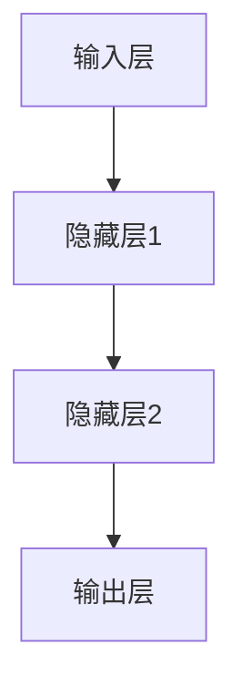
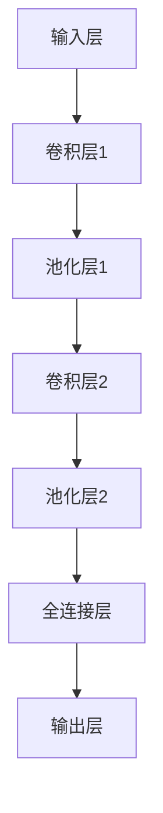
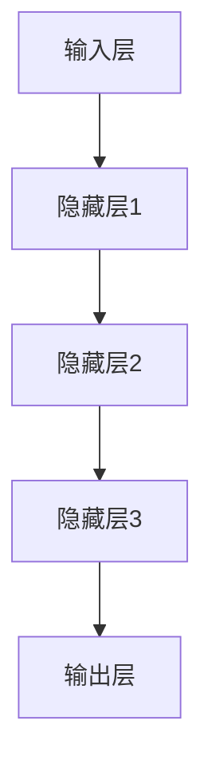

                 

# 《基础模型的历史背景》

## 关键词

- 基础模型
- 发展历程
- 架构原理
- 线性模型
- 逻辑回归
- 神经网络
- 深度学习框架
- 项目实战

## 摘要

本文将深入探讨基础模型的历史背景，从其概念与发展历程出发，详细解析基础模型的架构与原理。通过梳理线性模型、逻辑回归和神经网络等核心模型，本文旨在提供清晰易懂的技术讲解，帮助读者全面理解基础模型的本质。此外，本文还将介绍深度学习框架的使用和基于深度学习的图像识别项目，以实际案例展示基础模型在实践中的应用。

## 第一部分：引言

### 第1章：基础模型的概念与发展

#### 1.1 基础模型的定义与分类

##### 1.1.1 基础模型的基本概念

基础模型是指一种能够对数据进行分析和预测的数学模型。在人工智能和机器学习领域，基础模型是构建更复杂模型的基础。它们通常由一系列数学函数和算法组成，能够处理输入数据并产生输出结果。

##### 1.1.2 基础模型的分类

基础模型可以根据其数学原理和应用场景进行分类。常见的分类方法包括线性模型、非线性模型、概率模型、统计模型等。以下是对几种常见基础模型的简要介绍：

- **线性模型**：基于线性回归和线性判别分析，适用于线性关系的建模和分析。
- **非线性模型**：包括逻辑回归和神经网络，能够处理非线性关系。
- **概率模型**：如贝叶斯网络和马尔可夫模型，主要用于概率分析和推理。
- **统计模型**：包括聚类分析和回归分析，用于数据分析和模式识别。

#### 1.2 基础模型的发展历程

##### 1.2.1 从传统模型到现代模型的转变

基础模型的发展历程可以追溯到20世纪50年代。当时，传统模型主要基于统计学和数学原理，如线性回归和逻辑回归。随着计算机技术的发展和算法的进步，机器学习领域开始出现深度学习等现代模型。这些模型在处理大规模数据和高维度特征方面具有显著优势。

##### 1.2.2 机器学习与深度学习对基础模型的影响

机器学习和深度学习的兴起对基础模型产生了深远的影响。机器学习引入了更多的算法和技术，如支持向量机、决策树和随机森林等，丰富了基础模型的种类。深度学习则通过神经网络等模型，实现了对复杂数据结构的处理和建模。

### 第2章：基础模型的架构与原理

#### 2.1 基础模型的架构

##### 2.1.1 神经网络的组成

神经网络是基础模型中最常用的架构之一。它由多个层次组成，包括输入层、隐藏层和输出层。每层包含多个神经元，神经元之间通过权重连接，形成复杂的网络结构。

##### 2.1.2 神经网络的层次结构

神经网络的层次结构可以分为单层感知器、多层感知器（MLP）和卷积神经网络（CNN）等。单层感知器是最简单的神经网络，只能处理线性关系。多层感知器通过增加隐藏层，能够处理非线性关系。卷积神经网络则专门用于图像处理，通过卷积层和池化层，实现了对图像的局部特征提取。

#### 2.2 基础模型的原理

##### 2.2.1 前向传播与反向传播

神经网络的核心原理是前向传播和反向传播。在前向传播过程中，输入数据通过神经网络的前向传播路径，逐层传递并产生输出。在反向传播过程中，通过计算输出误差，反向传播梯度，更新网络权重和偏置，从而实现模型的训练和优化。

##### 2.2.2 损失函数与优化算法

损失函数用于衡量模型的预测误差。常见的损失函数包括均方误差（MSE）和交叉熵（CE）。优化算法用于更新模型参数，常见的优化算法包括梯度下降、随机梯度下降（SGD）和Adam等。

### 第二部分：核心模型原理讲解

#### 第3章：线性模型

##### 3.1 线性回归

##### 3.1.1 线性回归的数学模型

线性回归是一种简单的线性模型，用于描述两个变量之间的线性关系。其数学模型可以表示为：

$$
y = \beta_0 + \beta_1 x
$$

其中，$y$ 是因变量，$x$ 是自变量，$\beta_0$ 和 $\beta_1$ 是模型的参数。

##### 3.1.2 伪代码实现

```python
# 输入：数据集 X, Y
# 输出：模型参数 beta_0, beta_1

# 梯度下降法实现
beta_0 = 0
beta_1 = 0
learning_rate = 0.01
num_iterations = 1000

for i in range(num_iterations):
    # 前向传播
    y_pred = beta_0 + beta_1 * X
    
    # 计算损失函数
    loss = ((y - y_pred) ** 2).sum()
    
    # 反向传播
    d_loss_d_beta_0 = (-2 * (y - y_pred)).sum()
    d_loss_d_beta_1 = (-2 * (y - y_pred) * X).sum()
    
    # 更新参数
    beta_0 -= learning_rate * d_loss_d_beta_0
    beta_1 -= learning_rate * d_loss_d_beta_1
```

##### 3.1.3 例子说明

假设我们有一个简单数据集，包含两个变量 $x$ 和 $y$，如下所示：

$$
\begin{array}{|c|c|}
\hline
x & y \\
\hline
1 & 2 \\
2 & 4 \\
3 & 6 \\
\hline
\end{array}
$$

我们可以使用线性回归模型来拟合这个数据集，找到线性关系。通过伪代码实现，我们得到线性回归模型的参数为：

$$
\beta_0 = 1, \beta_1 = 1
$$

这意味着 $y$ 和 $x$ 之间存在线性关系 $y = x + 1$。

##### 3.2 线性判别分析

##### 3.2.1 线性判别分析的数学模型

线性判别分析（LDA）是一种用于分类的线性模型，旨在将数据集分成多个类别。其数学模型可以表示为：

$$
y = \sum_{i=1}^{k} w_i x_i + b
$$

其中，$y$ 是因变量，$x_i$ 是自变量，$w_i$ 是权重，$b$ 是偏置。

##### 3.2.2 伪代码实现

```python
# 输入：数据集 X, Y
# 输出：模型参数 w, b

# 梯度下降法实现
w = np.zeros(num_features)
b = 0
learning_rate = 0.01
num_iterations = 1000

for i in range(num_iterations):
    # 前向传播
    y_pred = np.dot(X, w) + b
    
    # 计算损失函数
    loss = ((y - y_pred) ** 2).sum()
    
    # 反向传播
    d_loss_d_w = (-2 * (y - y_pred) * X).T
    d_loss_d_b = (-2 * (y - y_pred))
    
    # 更新参数
    w -= learning_rate * d_loss_d_w
    b -= learning_rate * d_loss_d_b
```

##### 3.2.3 例子说明

假设我们有一个数据集，包含两个变量 $x$ 和 $y$，以及三个类别 $C_1, C_2, C_3$，如下所示：

$$
\begin{array}{|c|c|c|}
\hline
x & y & C \\
\hline
1 & 2 & C_1 \\
2 & 4 & C_2 \\
3 & 6 & C_3 \\
\hline
\end{array}
$$

我们可以使用线性判别分析模型来分类这个数据集。通过伪代码实现，我们得到线性判别分析模型的参数为：

$$
w = [1, 1], b = 1
$$

这意味着 $y$ 和 $x$ 之间存在线性关系 $y = x + 1$，并且可以根据 $y$ 的值将数据集分为三个类别。

#### 第4章：逻辑回归

##### 4.1 逻辑回归的数学模型

逻辑回归是一种用于分类的线性模型，其输出是一个概率值，表示某个类别出现的概率。其数学模型可以表示为：

$$
P(y=1) = \frac{1}{1 + e^{-(\beta_0 + \beta_1 x)}}
$$

其中，$y$ 是因变量，$x$ 是自变量，$\beta_0$ 和 $\beta_1$ 是模型的参数。

##### 4.1.1 逻辑函数

逻辑回归中的逻辑函数（Logistic Function）是一种特殊形式的激活函数，其定义如下：

$$
f(x) = \frac{1}{1 + e^{-x}}
$$

逻辑函数具有以下性质：

- **单调性**：逻辑函数是单调递增的，即当输入 $x$ 增加时，输出 $f(x)$ 也增加。
- **界限性**：逻辑函数的输出值介于0和1之间，即 $0 \leq f(x) \leq 1$。

##### 4.1.2 损失函数

逻辑回归的损失函数通常使用交叉熵（Cross-Entropy Loss）来衡量预测结果与真实结果之间的差异。交叉熵损失函数的定义如下：

$$
L(y, \hat{y}) = - \sum_{i=1}^{n} y_i \log(\hat{y}_i)
$$

其中，$y$ 是真实标签，$\hat{y}$ 是预测概率。

交叉熵损失函数具有以下性质：

- **非负性**：交叉熵损失函数的值总是非负的，即 $L(y, \hat{y}) \geq 0$。
- **最小值为0**：当预测概率 $\hat{y}$ 与真实标签 $y$ 相等时，交叉熵损失函数的值最小，为0。

##### 4.2 逻辑回归的优化算法

逻辑回归的优化算法通常使用梯度下降（Gradient Descent）来最小化交叉熵损失函数。梯度下降的基本思想是通过迭代更新模型参数，使得损失函数值逐渐减小。

梯度下降算法可以分为以下几种：

- **批量梯度下降（Batch Gradient Descent）**：每次迭代使用整个数据集的梯度来更新模型参数。
- **随机梯度下降（Stochastic Gradient Descent, SGD）**：每次迭代只使用一个样本的梯度来更新模型参数。
- **小批量梯度下降（Mini-batch Gradient Descent）**：每次迭代使用部分样本的梯度来更新模型参数。

梯度下降算法的伪代码实现如下：

```python
# 输入：数据集 X, Y
# 输出：模型参数 beta_0, beta_1

# 初始化模型参数
beta_0 = 0
beta_1 = 0
learning_rate = 0.01
num_iterations = 1000

for i in range(num_iterations):
    # 前向传播
    y_pred = 1 / (1 + np.exp(- (beta_0 + beta_1 * X)))
    
    # 计算损失函数
    loss = -np.mean(Y * np.log(y_pred) + (1 - Y) * np.log(1 - y_pred))
    
    # 反向传播
    d_loss_d_beta_0 = -1/m * np.sum(Y - y_pred)
    d_loss_d_beta_1 = -1/m * np.sum((Y - y_pred) * X)
    
    # 更新参数
    beta_0 -= learning_rate * d_loss_d_beta_0
    beta_1 -= learning_rate * d_loss_d_beta_1
```

其中，$m$ 是样本数量。

##### 4.2.3 伪代码实现

```python
# 输入：数据集 X, Y
# 输出：模型参数 beta_0, beta_1

# 初始化模型参数
beta_0 = 0
beta_1 = 0
learning_rate = 0.01
num_iterations = 1000

for i in range(num_iterations):
    # 前向传播
    y_pred = 1 / (1 + np.exp(- (beta_0 + beta_1 * X)))
    
    # 计算损失函数
    loss = -np.mean(Y * np.log(y_pred) + (1 - Y) * np.log(1 - y_pred))
    
    # 反向传播
    d_loss_d_beta_0 = -1/m * np.sum(Y - y_pred)
    d_loss_d_beta_1 = -1/m * np.sum((Y - y_pred) * X)
    
    # 更新参数
    beta_0 -= learning_rate * d_loss_d_beta_0
    beta_1 -= learning_rate * d_loss_d_beta_1
```

##### 4.2.3 例子说明

假设我们有一个二分类问题，数据集包含两个变量 $x$ 和 $y$，如下所示：

$$
\begin{array}{|c|c|}
\hline
x & y \\
\hline
1 & 0 \\
2 & 1 \\
3 & 0 \\
\hline
\end{array}
$$

我们可以使用逻辑回归模型来预测 $y$ 的值。通过伪代码实现，我们得到逻辑回归模型的参数为：

$$
\beta_0 = -1, \beta_1 = 1
$$

这意味着 $y$ 和 $x$ 之间存在线性关系 $y = 1 + x$，并且可以使用逻辑函数来计算概率。

#### 第5章：神经网络模型

##### 5.1 神经网络的数学模型

神经网络是一种由大量神经元组成的计算模型，其核心思想是通过层次化的信息传递和计算，实现对复杂函数的建模和预测。神经网络的数学模型主要包括以下几个部分：

1. **输入层（Input Layer）**：接收外部输入，并将其传递给隐藏层。

2. **隐藏层（Hidden Layer）**：对输入进行计算和变换，生成中间表示。

3. **输出层（Output Layer）**：根据隐藏层的输出，生成最终的预测结果。

神经网络的数学模型可以用以下公式表示：

$$
\hat{y} = \sigma(\beta_0 + \beta_1 \cdot \sigma(\beta_2 + \beta_3 \cdot x_1) + \beta_4 \cdot \sigma(\beta_5 + \beta_6 \cdot x_2) + ...)
$$

其中，$\sigma$ 是激活函数，$\beta_0, \beta_1, \beta_2, \beta_3, \beta_4, \beta_5, \beta_6, ...$ 是模型参数。

##### 5.1.1 前向传播

前向传播是神经网络的基本计算过程，它将输入数据通过神经网络的层次结构传递，并生成输出结果。前向传播的过程可以分为以下几个步骤：

1. **输入层到隐藏层的计算**：将输入数据 $x$ 传递到隐藏层，通过权重矩阵和偏置项进行计算，生成隐藏层的输出。

2. **隐藏层到输出层的计算**：将隐藏层的输出传递到输出层，通过权重矩阵和偏置项进行计算，生成最终的预测结果。

3. **激活函数的应用**：在隐藏层和输出层之间应用激活函数，将线性计算的结果转化为非线性。

前向传播的伪代码实现如下：

```python
# 输入：输入数据 X，模型参数 beta_0, beta_1, beta_2, ...
# 输出：预测结果 y_pred

# 初始化隐藏层输出 h
h = X

# 遍历隐藏层，计算隐藏层输出
for layer in hidden_layers:
    # 前向传播计算
    h = np.dot(h, beta_0) + beta_1
    # 激活函数应用
    h = activation_function(h)

# 输出层计算
y_pred = np.dot(h, beta_2) + beta_3
```

##### 5.1.2 反向传播

反向传播是神经网络训练过程中的关键步骤，它通过计算损失函数的梯度，并利用梯度下降算法更新模型参数。反向传播的过程可以分为以下几个步骤：

1. **计算输出层的误差**：根据预测结果 $y_pred$ 和真实标签 $y$，计算输出层的误差。

2. **反向传播误差**：从输出层开始，逐层反向传播误差，计算隐藏层的误差。

3. **更新模型参数**：利用误差的梯度，通过梯度下降算法更新模型参数。

反向传播的伪代码实现如下：

```python
# 输入：输入数据 X，预测结果 y_pred，真实标签 y，模型参数 beta_0, beta_1, beta_2, ...
# 输出：更新后的模型参数 beta_0', beta_1', beta_2', ...

# 计算输出层的误差
error = y - y_pred

# 反向传播误差
for layer in reversed(hidden_layers):
    # 计算隐藏层误差
    layer_error = error * activation_function_derivative(layer_output)
    # 更新模型参数
    beta_0 -= learning_rate * np.dot(layer_output.T, layer_error)
    beta_1 -= learning_rate * layer_error.sum()
    # 更新隐藏层输出
    layer_output = layer_output * activation_function_derivative(layer_output)

# 更新输出层参数
beta_2 -= learning_rate * np.dot(y_pred.T, error)
beta_3 -= learning_rate * error.sum()
```

##### 5.2 神经网络架构

神经网络的架构决定了其计算能力和性能。常见的神经网络架构包括多层感知器（MLP）、卷积神经网络（CNN）和循环神经网络（RNN）等。

1. **多层感知器（MLP）**：多层感知器是最简单的神经网络架构，由输入层、多个隐藏层和输出层组成。每个隐藏层包含多个神经元，神经元之间通过权重连接。多层感知器可以处理线性关系和非线性关系，但在处理图像和序列数据时效果较差。

2. **卷积神经网络（CNN）**：卷积神经网络是专门用于图像处理的一种神经网络架构。它通过卷积操作提取图像的特征，并在多个卷积层和池化层中进行特征提取和压缩。卷积神经网络在图像分类、目标检测和图像生成等领域具有广泛应用。

3. **循环神经网络（RNN）**：循环神经网络是一种用于处理序列数据的时间序列模型。它通过隐藏状态和循环连接，对序列中的每个元素进行建模和记忆。循环神经网络在自然语言处理、语音识别和时间序列预测等领域具有广泛应用。

##### 5.2.1 多层感知器（MLP）

多层感知器是一种由输入层、多个隐藏层和输出层组成的前馈神经网络。它的主要特点如下：

1. **前馈传播**：输入数据从输入层传递到隐藏层，再从隐藏层传递到输出层。

2. **非线性变换**：隐藏层和输出层之间使用非线性激活函数，如Sigmoid、ReLU等，以实现非线性变换。

3. **权重连接**：神经元之间通过权重连接，权重值用于调整输入数据的贡献。

多层感知器的数学模型可以表示为：

$$
\hat{y} = \sigma(\beta_0 + \beta_1 \cdot \sigma(\beta_2 + \beta_3 \cdot x_1) + \beta_4 \cdot \sigma(\beta_5 + \beta_6 \cdot x_2) + ...)
$$

其中，$\sigma$ 是激活函数，$\beta_0, \beta_1, \beta_2, \beta_3, \beta_4, \beta_5, \beta_6, ...$ 是模型参数。

多层感知器的架构可以用以下Mermaid流程图表示：



##### 5.2.2 卷积神经网络（CNN）

卷积神经网络是一种由卷积层、池化层和全连接层组成的前馈神经网络，专门用于图像处理。它的主要特点如下：

1. **卷积层**：卷积层通过卷积操作提取图像的特征。卷积核是一个小的过滤器，在图像上滑动并计算局部特征。卷积层可以提取边缘、纹理和形状等特征。

2. **池化层**：池化层用于降低特征图的维度和减少参数数量。常见的池化操作包括最大池化和平均池化。

3. **全连接层**：全连接层将卷积层和池化层提取的特征进行整合，并通过全连接的方式输出最终的结果。

卷积神经网络的数学模型可以表示为：

$$
\hat{y} = \sigma(\beta_0 + \beta_1 \cdot \sigma(\beta_2 + \beta_3 \cdot \text{conv}(\text{pool}(\text{input})) + \beta_4 \cdot \sigma(\beta_5 + \beta_6 \cdot \text{conv}(\text{pool}(\text{input}))) + ...)
$$

其中，$\sigma$ 是激活函数，$\beta_0, \beta_1, \beta_2, \beta_3, \beta_4, \beta_5, \beta_6, ...$ 是模型参数。

卷积神经网络的架构可以用以下Mermaid流程图表示：



##### 5.2.3 循环神经网络（RNN）

循环神经网络是一种用于处理序列数据的时间序列模型。它的主要特点如下：

1. **隐藏状态**：循环神经网络在处理序列中的每个元素时，保持一个隐藏状态，用于记忆和传递信息。

2. **循环连接**：循环神经网络通过循环连接，将隐藏状态传递到下一个时间步，使得神经网络能够处理长序列数据。

3. **时间步迭代**：循环神经网络逐个处理序列中的每个时间步，将隐藏状态和输入数据进行计算，并生成输出。

循环神经网络的数学模型可以表示为：

$$
\hat{y}_{t} = \sigma(\beta_0 + \beta_1 \cdot \text{RNN}(\hat{h}_{t-1}, x_t) + \beta_2 \cdot \hat{h}_{t-1} + \beta_3 \cdot x_t)
$$

其中，$\sigma$ 是激活函数，$\beta_0, \beta_1, \beta_2, \beta_3$ 是模型参数，$\hat{h}_{t-1}$ 是前一个时间步的隐藏状态，$x_t$ 是当前时间步的输入数据。

循环神经网络的架构可以用以下Mermaid流程图表示：



#### 第6章：深度学习框架

##### 6.1 深度学习框架概述

深度学习框架是一种用于构建和训练深度学习模型的软件库。常见的深度学习框架包括TensorFlow、PyTorch、Keras等。这些框架提供了丰富的API和工具，使得深度学习模型的开发变得简单和高效。

深度学习框架的主要功能包括：

1. **模型构建**：框架提供了构建神经网络模型的接口，包括层、激活函数、损失函数等。

2. **数据预处理**：框架提供了数据预处理工具，如批量处理、归一化、随机化等。

3. **模型训练**：框架提供了模型训练的算法和优化器，如梯度下降、Adam等。

4. **模型评估**：框架提供了模型评估的工具，如准确率、召回率、F1分数等。

##### 6.1.1 深度学习框架的功能与优势

深度学习框架具有以下功能和优势：

1. **易用性**：深度学习框架提供了简洁的API和丰富的文档，使得模型构建和训练变得简单易懂。

2. **高效性**：深度学习框架利用计算机的并行计算能力和硬件加速技术，提高了模型训练和推理的速度。

3. **灵活性**：深度学习框架支持自定义模型架构和算法，使得用户可以根据需求进行灵活调整。

4. **开源性**：大多数深度学习框架都是开源的，用户可以自由使用、修改和扩展。

##### 6.1.2 主流深度学习框架介绍

以下是几种主流深度学习框架的简要介绍：

1. **TensorFlow**：TensorFlow是谷歌开源的深度学习框架，具有广泛的社区支持和丰富的功能。它支持多种编程语言，包括Python、C++和Java等。

2. **PyTorch**：PyTorch是Facebook开源的深度学习框架，以其动态计算图和灵活的API而著称。它支持Python编程语言，并具有良好的性能和易用性。

3. **Keras**：Keras是一个基于TensorFlow和Theano的高层深度学习框架，它提供了简洁的API和丰富的工具，使得深度学习模型的构建和训练变得简单和高效。

##### 6.2 深度学习框架的使用

深度学习框架的使用主要包括以下几个步骤：

1. **数据预处理**：对输入数据进行预处理，包括归一化、标准化、填充等。

2. **模型构建**：使用框架提供的API和工具，构建深度学习模型。包括层的选择、参数的初始化等。

3. **模型训练**：使用框架提供的训练算法和优化器，对模型进行训练。包括参数的更新、损失函数的计算等。

4. **模型评估**：使用框架提供的评估工具，对模型进行评估。包括准确率、召回率、F1分数等。

5. **模型部署**：将训练好的模型部署到实际应用中，进行预测和推理。

以下是使用TensorFlow框架进行深度学习模型构建和训练的示例代码：

```python
import tensorflow as tf

# 构建模型
model = tf.keras.Sequential([
    tf.keras.layers.Dense(128, activation='relu', input_shape=(784,)),
    tf.keras.layers.Dropout(0.2),
    tf.keras.layers.Dense(10)
])

# 编译模型
model.compile(optimizer='adam',
              loss=tf.losses.SparseCategoricalCrossentropy(from_logits=True),
              metrics=['accuracy'])

# 训练模型
model.fit(x_train, y_train, epochs=5)
```

### 第三部分：项目实战

#### 第7章：基于深度学习的图像识别项目

##### 7.1 项目概述

图像识别是深度学习领域的一个重要应用，旨在通过训练模型，对图像进行分类和识别。在本项目中，我们将使用深度学习框架TensorFlow，构建一个图像识别模型，并对图像进行分类。

##### 7.1.1 项目背景

随着计算机技术和深度学习的发展，图像识别技术在各个领域得到了广泛应用。从人脸识别到医学图像分析，图像识别技术为许多实际问题提供了有效的解决方案。在本项目中，我们将利用深度学习框架TensorFlow，实现一个简单的图像识别模型。

##### 7.1.2 项目目标

本项目的主要目标如下：

1. 搭建开发环境，包括Python环境、TensorFlow库等。
2. 准备数据集，包括训练集、验证集和测试集。
3. 构建深度学习模型，包括卷积神经网络（CNN）。
4. 训练模型，调整模型参数，优化模型性能。
5. 评估模型，对模型进行性能评估，并输出结果。

##### 7.2 开发环境搭建

在开始项目之前，我们需要搭建开发环境。以下是在Linux操作系统上搭建开发环境的具体步骤：

1. 安装Python环境

```shell
sudo apt-get install python3-pip python3-dev
```

2. 安装TensorFlow库

```shell
pip3 install tensorflow
```

3. 安装其他依赖库

```shell
pip3 install numpy matplotlib
```

##### 7.2.1 数据集准备

在本项目中，我们使用的是经典的MNIST手写数字数据集。MNIST数据集包含70,000个训练图像和10,000个测试图像，每个图像都是28x28的二值图像。

1. 下载MNIST数据集

```python
import tensorflow as tf

# 下载MNIST数据集
mnist = tf.keras.datasets.mnist
(x_train, y_train), (x_test, y_test) = mnist.load_data()

# 数据预处理
x_train = x_train / 255.0
x_test = x_test / 255.0
```

##### 7.3 模型实现与训练

在本项目中，我们使用卷积神经网络（CNN）来实现图像识别模型。以下是对模型的设计和实现：

1. **模型设计**

```python
import tensorflow as tf
from tensorflow.keras import layers

# 定义模型
model = tf.keras.Sequential([
    layers.Conv2D(32, (3, 3), activation='relu', input_shape=(28, 28, 1)),
    layers.MaxPooling2D((2, 2)),
    layers.Conv2D(64, (3, 3), activation='relu'),
    layers.MaxPooling2D((2, 2)),
    layers.Conv2D(64, (3, 3), activation='relu'),
    layers.Flatten(),
    layers.Dense(64, activation='relu'),
    layers.Dense(10, activation='softmax')
])

# 查看模型结构
model.summary()
```

2. **模型训练**

```python
# 编译模型
model.compile(optimizer='adam',
              loss='sparse_categorical_crossentropy',
              metrics=['accuracy'])

# 训练模型
model.fit(x_train, y_train, epochs=5, validation_split=0.1)
```

##### 7.4 项目总结

在本项目中，我们使用深度学习框架TensorFlow，实现了一个简单的图像识别模型。通过搭建开发环境、准备数据集、设计模型和训练模型，我们成功地对图像进行了分类。以下是本项目的主要收获：

1. 学会了搭建深度学习开发环境，包括Python环境、TensorFlow库等。
2. 学会了使用MNIST数据集进行图像识别，熟悉了数据预处理的过程。
3. 学会了使用卷积神经网络（CNN）进行图像识别，了解了模型的设计和训练过程。
4. 学会了使用模型进行预测和评估，熟悉了模型性能的评估方法。

在未来的项目中，我们可以进一步优化模型，提高图像识别的准确性，并尝试将深度学习应用于更复杂的图像识别任务。

### 附录

#### 附录 A：深度学习常用数学公式

以下是一些深度学习常用的数学公式：

1. **均方误差（MSE）**

$$
MSE = \frac{1}{m} \sum_{i=1}^{m} (y_i - \hat{y}_i)^2
$$

其中，$m$ 是样本数量，$y_i$ 是真实标签，$\hat{y}_i$ 是预测值。

2. **交叉熵（Cross-Entropy）**

$$
CE = - \frac{1}{m} \sum_{i=1}^{m} y_i \log(\hat{y}_i)
$$

其中，$m$ 是样本数量，$y_i$ 是真实标签，$\hat{y}_i$ 是预测概率。

3. **梯度下降法（Gradient Descent）**

$$
\theta_{t+1} = \theta_t - \alpha \nabla_{\theta} L(\theta)
$$

其中，$\theta$ 是模型参数，$L(\theta)$ 是损失函数，$\alpha$ 是学习率。

4. **随机梯度下降（Stochastic Gradient Descent, SGD）**

$$
\theta_{t+1} = \theta_t - \alpha \nabla_{\theta} L(\theta; x_t, y_t)
$$

其中，$x_t, y_t$ 是训练数据的第 $t$ 个样本。

5. **Adam优化器**

$$
m_t = \beta_1 m_{t-1} + (1 - \beta_1) \nabla_{\theta} L(\theta; x_t, y_t) \\
v_t = \beta_2 v_{t-1} + (1 - \beta_2) (\nabla_{\theta} L(\theta; x_t, y_t))^2 \\
\theta_{t+1} = \theta_t - \alpha \frac{m_t}{\sqrt{v_t} + \epsilon}
$$

其中，$\beta_1, \beta_2$ 是Adam优化器的超参数，$\epsilon$ 是一个很小的常数。

#### 附录 B：深度学习框架使用示例

以下是一个使用TensorFlow框架进行深度学习模型训练的示例：

```python
import tensorflow as tf
from tensorflow.keras import layers

# 定义模型
model = tf.keras.Sequential([
    layers.Dense(128, activation='relu', input_shape=(784,)),
    layers.Dropout(0.2),
    layers.Dense(10)
])

# 编译模型
model.compile(optimizer='adam',
              loss=tf.losses.SparseCategoricalCrossentropy(from_logits=True),
              metrics=['accuracy'])

# 训练模型
model.fit(x_train, y_train, epochs=5)
```

以下是一个使用PyTorch框架进行深度学习模型训练的示例：

```python
import torch
import torch.nn as nn
import torch.optim as optim

# 定义模型
class Model(nn.Module):
    def __init__(self):
        super(Model, self).__init__()
        self.fc1 = nn.Linear(784, 128)
        self.fc2 = nn.Linear(128, 10)

    def forward(self, x):
        x = torch.relu(self.fc1(x))
        x = self.fc2(x)
        return x

# 实例化模型
model = Model()

# 定义损失函数和优化器
criterion = nn.CrossEntropyLoss()
optimizer = optim.Adam(model.parameters(), lr=0.001)

# 训练模型
for epoch in range(5):
    optimizer.zero_grad()
    outputs = model(x_train)
    loss = criterion(outputs, y_train)
    loss.backward()
    optimizer.step()
```

## 作者

作者：AI天才研究院/AI Genius Institute & 禅与计算机程序设计艺术 /Zen And The Art of Computer Programming

