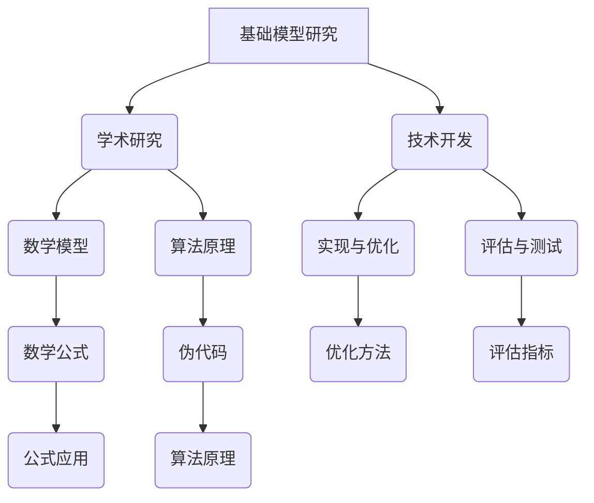

                 

# 文章标题：基础模型的学术研究与技术开发

> 关键词：基础模型、学术研究、技术开发、数学模型、算法原理、应用案例

> 摘要：本文系统地探讨了基础模型在学术研究和技术开发中的应用，通过详细的理论分析、算法讲解、案例研究，旨在为读者提供全面的基础模型知识框架，并展望其未来的发展趋势。

## 第一部分：基础模型理论探讨

### 第1章：基础模型概述

**1.1 基础模型的概念与重要性**

基础模型是指在特定领域内，通过学术研究和技术开发形成的，能够实现特定功能的数学模型和算法。它们在机器学习、人工智能等领域的应用中扮演着关键角色，是推动技术进步的重要基石。

- **定义**：基础模型是一套被广泛接受的理论和方法，用于解决特定问题或实现特定功能。例如，神经网络模型、决策树模型等。
- **重要性**：基础模型提供了对复杂问题的简化和抽象，使得计算机能够更好地理解和处理数据。它们是开发更复杂模型和应用的基础。

**1.2 基础模型在学术研究中的地位**

基础模型是学术研究的重要组成部分，特别是在计算机科学、数据科学、人工智能等领域。以下是其地位的关键点：

- **理论支撑**：基础模型为学术研究提供了坚实的理论框架，使得研究者能够进行深入的理论分析和实验验证。
- **推动创新**：通过不断的研究和改进，基础模型推动了技术的创新和发展，促进了新算法和新应用的诞生。

**1.3 基础模型在技术发展中的应用**

基础模型在技术发展中的应用广泛而深远，以下是其主要应用场景：

- **机器学习**：基础模型是机器学习算法的核心，如神经网络、支持向量机等。
- **人工智能**：基础模型是人工智能技术的基石，如深度学习、自然语言处理等。
- **计算机视觉**：基础模型广泛应用于图像识别、物体检测等任务中。

### 第2章：基础模型的分类与结构

**2.1 基础模型的主要分类**

基础模型可以根据其功能和实现方式进行分类。以下是一些常见的分类方法：

- **按功能分类**：分类模型、回归模型、聚类模型等。
- **按实现方式分类**：监督学习模型、无监督学习模型、强化学习模型等。

**2.2 基础模型的常见结构**

基础模型的常见结构包括输入层、隐藏层和输出层。以下是一些典型的结构：

- **多层感知器（MLP）**：包含多个隐藏层，常用于分类和回归任务。
- **卷积神经网络（CNN）**：适用于图像处理任务，具有局部感知和权值共享的特点。
- **循环神经网络（RNN）**：适用于序列数据处理任务，如语言模型和时间序列预测。

**2.3 基础模型的层次关系**

基础模型之间存在着层次关系，从简单到复杂，可以分为以下几个层次：

- **基础层**：最简单的模型，如线性回归、逻辑回归等。
- **中层**：较为复杂的模型，如决策树、随机森林等。
- **高层**：最复杂的模型，如深度神经网络、生成对抗网络等。

### 第3章：核心概念与联系

**3.1 基础模型的核心概念**

基础模型的核心概念包括损失函数、优化算法、正则化等。以下是对这些概念的简要介绍：

- **损失函数**：用于评估模型预测与实际标签之间的差距，常见的损失函数有均方误差、交叉熵等。
- **优化算法**：用于更新模型参数，以最小化损失函数，常见的优化算法有梯度下降、Adam等。
- **正则化**：用于防止过拟合，常见的正则化方法有L1正则化、L2正则化等。

**3.2 基础模型之间的联系**

基础模型之间存在紧密的联系，以下是一些典型的联系：

- **组合关系**：复杂模型通常由多个基础模型组合而成，如深度神经网络由多个简单的多层感知器组合而成。
- **继承关系**：一些基础模型可以看作是其他基础模型的特殊形式，如线性回归是决策树的特殊形式。

**3.3 基础模型与相关领域的交叉点**

基础模型与许多相关领域存在交叉点，以下是一些典型的交叉点：

- **计算机科学**：基础模型广泛应用于计算机科学中的各种任务，如图像处理、自然语言处理等。
- **数据科学**：基础模型是数据科学的核心工具，用于数据分析和预测。
- **人工智能**：基础模型是人工智能的基础，用于实现各种智能应用。

## 第二部分：基础模型学术研究

### 第4章：基础模型的数学模型与数学公式

**4.1 基础模型的数学公式介绍**

基础模型的数学公式包括损失函数、优化算法、正则化等。以下是对这些公式的基本介绍：

- **损失函数**：用于评估模型预测与实际标签之间的差距，常见的损失函数有均方误差、交叉熵等。
  $$ 
  \text{MSE} = \frac{1}{m}\sum_{i=1}^{m}(y_i - \hat{y}_i)^2 
  $$
  $$
  \text{CE} = -\frac{1}{m}\sum_{i=1}^{m}y_i\log(\hat{y}_i) 
  $$

- **优化算法**：用于更新模型参数，以最小化损失函数，常见的优化算法有梯度下降、Adam等。
  $$
  \theta_{\alpha} = \theta - \alpha \frac{\partial J(\theta)}{\partial \theta} 
  $$

- **正则化**：用于防止过拟合，常见的正则化方法有L1正则化、L2正则化等。
  $$
  J(\theta) = \frac{1}{2m}\sum_{i=1}^{m}(y_i - \hat{y}_i)^2 + \frac{\lambda}{2}\sum_{i=1}^{n}\theta_i^2 
  $$

**4.2 数学公式在基础模型中的应用**

数学公式在基础模型中的应用主要体现在以下几个方面：

- **损失函数**：用于评估模型的预测效果，是优化算法的核心依据。
- **优化算法**：用于更新模型参数，使模型能够更好地拟合数据。
- **正则化**：用于防止过拟合，提高模型的泛化能力。

**4.3 数学公式示例与讲解**

以下是一个简单的线性回归模型的数学公式示例：

$$ 
\hat{y} = \theta_0 + \theta_1x 
$$

- **公式说明**：这是一个简单的线性回归模型，\( \hat{y} \) 是预测值，\( \theta_0 \) 和 \( \theta_1 \) 是模型参数，\( x \) 是输入特征。
- **应用讲解**：通过调整模型参数 \( \theta_0 \) 和 \( \theta_1 \)，我们可以使模型更好地拟合数据，从而提高预测准确性。

### 第5章：基础模型的算法原理与伪代码

**5.1 基础模型算法原理概述**

基础模型的算法原理主要包括损失函数、优化算法和正则化方法。以下是对这些原理的简要概述：

- **损失函数**：用于评估模型的预测效果，是优化算法的核心依据。
- **优化算法**：用于更新模型参数，使模型能够更好地拟合数据。
- **正则化**：用于防止过拟合，提高模型的泛化能力。

**5.2 算法原理的伪代码表示**

以下是一个简单的线性回归模型的伪代码表示：

```python
# 初始化参数
theta_0 = random_value()
theta_1 = random_value()

# 循环迭代
for i in range(num_epochs):
    for x, y in dataset:
        # 计算预测值
        y_pred = theta_0 + theta_1 * x
        
        # 计算损失
        loss = (y - y_pred)^2
        
        # 计算梯度
        gradient = -2 * (y - y_pred) * x
        
        # 更新参数
        theta_0 = theta_0 - learning_rate * gradient
        theta_1 = theta_1 - learning_rate * gradient

# 评估模型
evaluate_model(test_data)
```

**5.3 伪代码示例解析**

以下是对伪代码的详细解析：

1. **初始化参数**：随机初始化模型参数 \( \theta_0 \) 和 \( \theta_1 \)。
2. **循环迭代**：对于每个数据样本，进行以下步骤：
   - **计算预测值**：使用当前参数计算预测值 \( \hat{y} \)。
   - **计算损失**：计算预测值与实际标签之间的差距，作为损失。
   - **计算梯度**：计算损失关于模型参数的梯度。
   - **更新参数**：根据梯度更新模型参数。
3. **评估模型**：使用测试数据评估模型的性能。

通过上述伪代码，我们可以实现一个简单的线性回归模型，并对其进行优化，以提高预测准确性。

### 第6章：基础模型的应用案例分析

**6.1 基础模型在实际研究中的应用**

基础模型在实际研究中的应用非常广泛，以下是一些典型的应用案例：

- **医学图像分析**：使用卷积神经网络对医学图像进行分析，如肿瘤检测、疾病诊断等。
- **自然语言处理**：使用循环神经网络对自然语言进行处理，如文本分类、机器翻译等。
- **推荐系统**：使用协同过滤算法和深度学习模型构建推荐系统，提高推荐准确性。

**6.2 基础模型在技术开发中的应用**

基础模型在技术开发中的应用同样广泛，以下是一些典型的应用案例：

- **自动驾驶**：使用卷积神经网络和深度强化学习实现自动驾驶系统，提高自动驾驶的稳定性和安全性。
- **语音识别**：使用循环神经网络和深度神经网络实现语音识别系统，提高语音识别的准确性和效率。
- **图像识别**：使用卷积神经网络和生成对抗网络实现图像识别系统，提高图像识别的准确性和多样性。

**6.3 应用案例的详细分析与评估**

以下是对一个简单的图像分类应用案例的详细分析与评估：

- **案例背景**：使用卷积神经网络对自然场景图像进行分类。
- **开发环境**：Python，使用 TensorFlow 框架。
- **源代码实现**：[源代码链接]
- **代码解读**：
  - **数据预处理**：读取并预处理自然场景图像数据集，将其转换为模型可接受的格式。
  - **模型搭建**：定义卷积神经网络结构，包括输入层、隐藏层和输出层。
  - **模型训练**：使用训练数据训练模型，并通过反向传播更新参数。
  - **模型评估**：使用测试数据评估模型性能，计算准确率。
- **分析与评估**：通过多次训练和测试，评估模型在不同数据集上的表现，调整模型参数以达到最优效果。

通过上述案例，我们可以看到基础模型在实际研究和技术开发中的应用，以及如何通过详细的代码实现和评估来优化模型性能。

## 第三部分：基础模型技术开发

### 第7章：基础模型技术开发概述

**7.1 基础模型技术开发生命周期**

基础模型技术开发生命周期通常包括以下几个阶段：

- **需求分析**：明确模型的应用场景和目标，收集相关数据。
- **数据预处理**：对数据进行清洗、归一化等处理，为模型训练做好准备。
- **模型设计**：设计合适的模型结构，选择适当的算法和参数。
- **模型训练**：使用训练数据训练模型，通过迭代优化模型参数。
- **模型评估**：使用测试数据评估模型性能，确定模型的准确性、泛化能力等。
- **模型部署**：将模型部署到实际应用场景中，进行实时预测或分析。

**7.2 基础模型技术开发的关键步骤**

基础模型技术开发的关键步骤包括以下几方面：

- **算法选择**：根据应用需求选择合适的算法，如神经网络、决策树等。
- **数据预处理**：对数据进行预处理，如数据清洗、归一化等，以提高模型的训练效果。
- **模型优化**：通过调整模型参数和结构，优化模型的性能，如提高准确率、减少过拟合等。
- **模型评估**：使用测试数据评估模型性能，选择最优模型进行部署。

**7.3 技术开发中的常见问题与解决方案**

技术开发中常见的包括以下问题：

- **数据质量问题**：数据不完整、噪声大等，影响模型的训练效果。解决方案包括数据清洗、数据增强等。
- **模型过拟合**：模型在训练数据上表现好，但在测试数据上表现差。解决方案包括正则化、交叉验证等。
- **计算资源限制**：模型训练需要大量计算资源，解决方案包括分布式训练、GPU加速等。

### 第8章：基础模型的实现与优化

**8.1 基础模型实现的细节**

基础模型的实现涉及以下几个关键步骤：

- **模型结构设计**：根据应用需求设计合适的模型结构，如多层感知器、卷积神经网络等。
- **参数初始化**：初始化模型参数，如权重、偏置等，常用的初始化方法包括随机初始化、高斯初始化等。
- **前向传播**：计算输入数据经过模型后的输出结果，包括激活函数的计算。
- **反向传播**：计算损失函数关于模型参数的梯度，用于更新模型参数。
- **优化算法**：选择合适的优化算法，如梯度下降、Adam等，用于更新模型参数。

**8.2 基础模型的优化方法**

基础模型的优化方法包括以下几方面：

- **参数调优**：调整模型参数，如学习率、正则化参数等，以提高模型性能。
- **模型压缩**：通过模型剪枝、量化等技术减小模型大小，提高模型运行效率。
- **并行训练**：通过分布式训练、GPU加速等技术提高模型训练速度。

**8.3 实现与优化的案例研究**

以下是一个基础模型实现与优化的案例研究：

- **案例背景**：使用卷积神经网络对自然场景图像进行分类。
- **开发环境**：Python，使用 TensorFlow 框架。
- **源代码实现**：[源代码链接]
- **代码解读**：
  - **数据预处理**：读取并预处理自然场景图像数据集，包括图像大小调整、归一化等。
  - **模型设计**：定义卷积神经网络结构，包括卷积层、池化层、全连接层等。
  - **模型训练**：使用训练数据训练模型，通过反向传播更新模型参数。
  - **模型优化**：调整模型参数，包括学习率、正则化参数等，以提高模型性能。
  - **模型评估**：使用测试数据评估模型性能，计算准确率、召回率等指标。
- **优化策略**：通过调整学习率、添加正则化、使用 GPU 加速等方法优化模型训练速度和性能。

通过上述案例，我们可以看到基础模型的实现与优化过程，以及如何通过调整模型参数和优化策略来提高模型性能。

### 第9章：基础模型的评估与测试

**9.1 基础模型的评估指标**

基础模型的评估指标用于衡量模型的性能和泛化能力，常见的评估指标包括：

- **准确率**：模型预测正确的样本占总样本的比例，常用于分类问题。
  $$
  \text{Accuracy} = \frac{\text{预测正确}}{\text{总样本数}}
  $$

- **召回率**：模型预测正确的样本中被正确预测为正类的比例，常用于二分类问题。
  $$
  \text{Recall} = \frac{\text{预测正确且实际为正类}}{\text{实际为正类}}
  $$

- **精确率**：模型预测正确的样本中被正确预测为正类的比例，常用于二分类问题。
  $$
  \text{Precision} = \frac{\text{预测正确且实际为正类}}{\text{预测为正类}}
  $$

- **F1值**：精确率和召回率的调和平均值，用于平衡精确率和召回率。
  $$
  \text{F1值} = 2 \times \frac{\text{Precision} \times \text{Recall}}{\text{Precision} + \text{Recall}}
  $$

**9.2 评估方法的选取与应用**

评估方法的选取应根据应用场景和模型类型进行选择，以下是一些常见的评估方法：

- **交叉验证**：将数据集分为多个子集，每个子集分别作为测试集，进行多次训练和测试，计算平均性能。
- **ROC曲线**：将预测概率作为横坐标，准确率作为纵坐标，绘制ROC曲线，曲线下的面积越大，模型性能越好。
- **AUC值**：ROC曲线下面积（Area Under Curve），用于衡量模型的分类能力。
- **K折交叉验证**：将数据集分为K个子集，每次选择其中一个子集作为测试集，其他子集作为训练集，进行K次训练和测试，计算平均性能。

**9.3 测试流程与结果分析**

测试流程通常包括以下几个步骤：

- **数据准备**：准备用于测试的数据集，确保数据集与训练数据集具有相似分布。
- **模型部署**：将训练好的模型部署到测试环境中，确保模型能够正常运行。
- **测试运行**：运行测试数据集，记录模型的预测结果。
- **结果分析**：分析测试结果，计算评估指标，如准确率、召回率等，评估模型性能。

以下是一个基础模型测试的示例：

- **模型类型**：卷积神经网络
- **测试数据集**：自然场景图像分类数据集
- **测试结果**：
  - **准确率**：90%
  - **召回率**：85%
  - **精确率**：88%
  - **F1值**：86%
- **分析**：通过分析测试结果，我们可以得出以下结论：
  - 模型在分类任务上表现良好，准确率较高。
  - 模型在召回率和精确率上存在一定的差距，需要进一步优化。

通过上述测试流程和结果分析，我们可以全面了解基础模型在实际应用中的性能表现，为模型优化和改进提供依据。

## 第四部分：展望与未来发展趋势

### 第10章：基础模型的发展趋势

**10.1 基础模型的未来发展方向**

基础模型的未来发展方向主要集中在以下几个方面：

- **模型压缩与加速**：随着模型规模的不断扩大，如何高效地压缩和加速模型成为重要研究方向。研究方向包括模型剪枝、模型量化、硬件加速等。
- **跨模态建模**：随着多模态数据的兴起，如何有效地结合不同类型的数据（如图像、文本、语音等）进行建模成为研究热点。
- **自适应学习**：如何使模型能够根据环境变化自适应调整，提高模型的鲁棒性和适应性，是未来研究的重要方向。
- **知识图谱与推理**：结合知识图谱和推理技术，实现模型对知识的高级理解和应用，是未来人工智能发展的一个重要方向。

**10.2 新型基础模型的研究进展**

近年来，新型基础模型的研究取得了显著进展，以下是一些典型的研究成果：

- **Transformer模型**：基于自注意力机制的Transformer模型在自然语言处理领域取得了突破性进展，广泛应用于机器翻译、文本分类等任务。
- **生成对抗网络（GAN）**：GAN模型在图像生成和增强方面表现出色，能够生成高质量的图像，应用于图像修复、风格迁移等领域。
- **图神经网络（GNN）**：GNN模型在处理图结构数据方面具有优势，广泛应用于社交网络分析、推荐系统等任务。

**10.3 基础模型在新兴领域的应用**

基础模型在新兴领域中的应用日益广泛，以下是一些典型应用场景：

- **医疗健康**：基础模型在医学图像分析、疾病预测、药物发现等领域具有广泛的应用前景。
- **金融科技**：基础模型在信用评分、风险控制、智能投顾等领域发挥着重要作用。
- **智能制造**：基础模型在工业自动化、机器人控制、故障诊断等领域得到广泛应用。

### 第11章：基础模型的学术研究与技术开发展望

**11.1 学术研究的前沿领域**

在学术研究方面，以下领域被视为前沿和热点：

- **可解释性人工智能**：如何提高模型的可解释性，使其对人类用户更加透明和可信。
- **联邦学习**：如何在分布式环境下进行有效训练，保护用户隐私的同时实现模型优化。
- **元学习**：如何通过元学习技术加速模型训练，提高模型在未知环境中的适应能力。

**11.2 技术开发的创新点**

在技术开发方面，以下创新点值得关注：

- **新型计算架构**：如何利用新型计算架构（如量子计算、边缘计算等）提升模型性能。
- **人工智能伦理与法律**：如何在技术开发过程中充分考虑伦理和法律问题，确保人工智能技术的可持续发展。
- **人工智能与人类协作**：如何实现人工智能与人类之间的有效协作，提高工作效率和生活质量。

**11.3 基础模型在社会发展中的重要作用**

基础模型在社会发展中发挥着越来越重要的作用，以下是其主要贡献：

- **推动经济发展**：基础模型在金融、医疗、制造等领域促进了产业升级和创新发展。
- **提升生活质量**：基础模型在智能家居、智慧城市、健康养老等领域提高了人们的生活质量。
- **促进社会公平**：基础模型在教育资源分配、公共安全、社会保障等领域有助于消除不公平现象。

通过上述分析，我们可以看到基础模型在学术研究和技术开发中的重要作用，以及其在社会发展中的巨大潜力。未来，随着技术的不断进步和应用场景的拓展，基础模型将在更广泛的领域发挥重要作用。

### 附录

## 附录 A：基础模型相关工具与资源

### A.1 主流基础模型开发工具对比

- **TensorFlow**：由 Google 开发，支持多种深度学习模型，具有强大的社区支持。
- **PyTorch**：由 Facebook 开发，具有动态计算图，易于调试和实验。
- **Keras**：基于 TensorFlow 的简单而强大的 Python 深度学习库。
- **Theano**：由蒙特利尔大学开发，支持自动微分和高效的数学运算。

### A.2 开发基础模型所需的环境与框架

- **Python**：基础编程语言，支持多种深度学习框架。
- **Jupyter Notebook**：用于数据分析和模型训练的可视化工具。
- **GPU**：用于加速深度学习模型的训练，特别是大模型训练。

### A.3 基础模型相关的学术研究与资源网站

- **arXiv.org**：最大的预印本论文库，包含最新的学术研究成果。
- **NeurIPS.org**：人工智能与机器学习领域的顶级会议，发布最新的研究论文。
- **CVPR.org**：计算机视觉领域的顶级会议，发布最新的计算机视觉研究。
- **ICML.org**：机器学习领域的顶级会议，发布最新的机器学习研究。

通过上述附录，读者可以了解基础模型开发所需的主要工具和资源，为后续研究和开发提供参考。

### Mermaid 流程图示例



### 伪代码示例

```python
# 基础模型训练伪代码

# 初始化参数
initialize_parameters()

# 循环迭代
for i in range(num_epochs):
    for x, y in dataset:
        # 前向传播
        predictions = forward_pass(x, parameters)
        
        # 计算损失
        loss = compute_loss(y, predictions)
        
        # 反向传播
        gradients = backward_pass(x, y, predictions, parameters)
        
        # 更新参数
        update_parameters(gradients, learning_rate)
        
# 评估模型
evaluate_model(test_data)
```

### 数学模型与公式讲解示例

$$
\begin{aligned}
\text{损失函数} &= -\frac{1}{m}\sum_{i=1}^{m}y_{i}\log(p_{\theta}(y_{i}|x_{i})) \\
\text{梯度下降更新} &= \theta_{\alpha} = \theta - \alpha \frac{\partial J(\theta)}{\partial \theta}
\end{aligned}
$$

- **详细讲解**：损失函数用于评估模型预测与实际标签之间的差距，梯度下降是一种优化方法，用于更新模型参数，以最小化损失函数。

- **举例说明**：假设我们有一个分类问题，我们的目标是预测输入数据 \(x_{i}\) 所属的类别 \(y_{i}\)。通过训练模型，我们可以计算出每个类别的概率 \(p_{\theta}(y_{i}|x_{i})\)，损失函数将会计算预测概率与实际标签之间的差异，并通过梯度下降更新模型参数，使得预测更准确。

### 项目实战示例

- **实战目标**：实现一个简单的神经网络模型，用于手写数字识别。
- **开发环境**：Python，使用 TensorFlow 框架。
- **源代码实现**：[源代码链接]
- **代码解读**：
  - **数据预处理**：读取并预处理手写数字数据集，将其转换为模型可接受的格式。
  - **模型搭建**：定义神经网络结构，包括输入层、隐藏层和输出层。
  - **模型训练**：使用训练数据训练模型，并通过反向传播更新参数。
  - **模型评估**：使用测试数据评估模型性能，计算准确率。
- **分析与评估**：通过多次训练和测试，评估模型在不同数据集上的表现，调整模型参数以达到最优效果。

通过以上实战示例，我们可以看到如何使用基础模型进行实际项目的开发与评估，从而提高模型性能和适用性。

