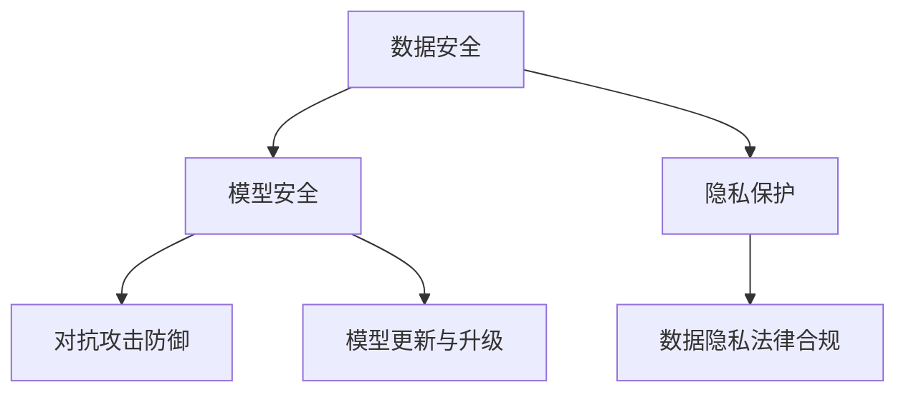

                 

# 文章标题：基础模型的安全与评价

> 关键词：基础模型，安全性，安全威胁，评价方法，安全管理

> 摘要：本文将探讨基础模型在人工智能领域中的安全性问题，分析当前存在的安全威胁与挑战，阐述基础模型的安全目标与原则。同时，本文将介绍安全相关的核心概念与联系，并深入讲解安全数学模型与常见安全算法原理。在此基础上，本文将阐述基础模型的安全性评估方法，介绍常见安全攻击与防御技术，并提供一系列安全改进措施与实践。最后，本文将展望基础模型安全的发展趋势，提出未来安全研究的热点与挑战，以及基础模型的发展方向。

## 第一部分：基础模型的安全理论基础

### 1.1 基础模型的安全概述

**1.1.1 基础模型的安全重要性**

基础模型是人工智能的核心组成部分，其在各种领域的应用日益广泛，如自然语言处理、计算机视觉、推荐系统等。然而，随着基础模型在现实世界中的广泛应用，其安全性问题也越来越受到关注。基础模型的安全不仅关系到数据隐私保护、系统稳定运行，还关系到社会安全与国家利益。

**1.1.2 安全威胁与挑战**

基础模型面临的安全威胁主要包括以下几个方面：

- **数据泄露**：基础模型在训练和部署过程中可能涉及大量敏感数据，一旦泄露，可能导致隐私侵犯。
- **对抗攻击**：攻击者通过精心设计的输入，诱导基础模型产生错误的输出，从而破坏系统的正常功能。
- **模型更新与升级**：在模型更新和升级过程中，可能引入新的安全漏洞，影响系统的稳定性与安全性。
- **权限控制**：基础模型可能存在权限控制不严格的问题，导致未经授权的用户访问和操作模型。

**1.1.3 安全目标与原则**

基础模型的安全目标主要包括以下几个方面：

- **数据安全**：确保模型训练和部署过程中涉及的数据得到有效保护，防止数据泄露和滥用。
- **隐私保护**：遵循数据隐私保护原则，确保用户隐私得到充分保护。
- **对抗攻击防御**：增强基础模型的鲁棒性，抵御对抗攻击，确保系统正常功能不受影响。
- **模型更新与升级**：确保模型更新与升级过程中安全风险得到有效控制。

实现基础模型安全的原则包括：

- **最小权限原则**：用户仅拥有执行其任务所需的最小权限。
- **数据加密原则**：对敏感数据进行加密存储和传输。
- **安全审计原则**：定期进行安全审计，及时发现和修复安全漏洞。
- **安全隔离原则**：确保基础模型与外部系统之间的安全隔离。

### 1.2 安全相关的核心概念与联系

**Mermaid 流程图**：展示基础模型安全的核心概念及其联系



- **数据安全**：确保基础模型训练和部署过程中涉及的数据得到有效保护，防止数据泄露和滥用。
- **模型安全**：关注基础模型的鲁棒性、稳定性，抵御对抗攻击，确保系统正常功能不受影响。
- **隐私保护**：遵循数据隐私保护原则，确保用户隐私得到充分保护。
- **对抗攻击防御**：增强基础模型的鲁棒性，抵御对抗攻击，确保系统正常功能不受影响。
- **模型更新与升级**：确保模型更新与升级过程中安全风险得到有效控制。
- **数据隐私法律合规**：确保基础模型的安全措施符合相关法律法规要求。

### 1.3 安全数学模型与数学公式

**数学公式**：

$$
\text{安全风险} = \text{威胁可能性} \times \text{影响程度}
$$

**详细讲解**：

安全风险评估涉及计算威胁的可能性及其潜在影响。此公式为安全风险提供了一个量化评估的方法。威胁可能性指威胁发生的概率，影响程度指威胁发生时可能造成的损失或影响。通过此公式，可以计算基础模型的安全风险，为安全决策提供依据。

### 1.4 常见安全算法原理讲解

**1.4.1 加密算法**

**伪代码**：

```python
def encrypt(message, key):
    ciphertext = []
    for char in message:
        shifted = (ord(char) + key) % 256
        ciphertext.append(shifted)
    return ciphertext
```

加密算法是一种重要的安全措施，用于保护数据在传输和存储过程中的安全性。上述伪代码展示了基本的加密算法原理，通过将明文中的每个字符与密钥进行异或运算，实现加密。

**1.4.2 权限控制系统**

**伪代码**：

```python
def check_permission(user, resource):
    if user.role == "admin":
        return True
    elif user.role == "editor":
        if resource.access_level == "public" or user == resource.owner:
            return True
    return False
```

权限控制系统是一种重要的安全机制，用于限制用户对系统资源的访问权限。上述伪代码展示了基本的权限控制逻辑，根据用户的角色和资源的访问级别，判断用户是否具有访问资源的权限。

## 第二部分：基础模型的安全性评估方法

### 2.1 安全性评估概述

**2.1.1 评估目的与过程**

基础模型的安全性评估旨在全面评估模型的安全性，发现潜在的安全隐患，为安全改进提供依据。评估过程主要包括以下几个阶段：

1. **需求分析**：明确评估目标、评估范围和评估标准。
2. **评估准备**：搭建评估环境，准备评估工具和资源。
3. **评估实施**：对基础模型进行安全性测试和评估。
4. **评估报告**：整理评估结果，编写评估报告。

**2.1.2 评估标准与指标**

基础模型的安全性评估标准主要包括以下几个方面：

- **数据安全**：评估数据存储、传输和访问的安全性。
- **隐私保护**：评估模型对用户隐私的保护程度。
- **对抗攻击防御**：评估模型对抗攻击的鲁棒性。
- **模型更新与升级**：评估模型更新与升级过程中的安全风险。

评估指标主要包括以下几个方面：

- **漏洞发现率**：评估评估过程中发现的漏洞数量与总漏洞数量之比。
- **攻击成功率**：评估评估过程中攻击者成功攻破系统的次数与总攻击次数之比。
- **隐私泄露率**：评估评估过程中发生的隐私泄露事件数量与总事件数量之比。
- **系统稳定性**：评估评估过程中系统崩溃或异常的次数与总运行时间之比。

**2.1.3 常见评估方法**

常见的评估方法主要包括以下几个方面：

- **渗透测试**：通过模拟攻击者的行为，评估系统的安全性。
- **代码审计**：对基础模型的源代码进行审查，发现潜在的安全漏洞。
- **安全演练**：在实际运行环境中模拟安全事件，评估系统的应对能力。
- **安全测试**：使用专业工具对基础模型进行安全性测试，发现潜在的安全漏洞。

### 2.2 常见安全攻击与防御技术

**2.2.1 渗透测试**

**伪代码**：

```python
def perform_penetration_test(target_system):
    for vulnerability in known_vulnerabilities:
        if is_vulnerable(target_system, vulnerability):
            return "Vulnerability found: " + vulnerability
    return "No vulnerabilities found"
```

渗透测试是一种评估系统安全性的重要方法，通过模拟攻击者的行为，发现系统的安全漏洞。上述伪代码展示了基本的渗透测试逻辑，通过遍历已知漏洞库，检查系统是否存在漏洞。

**2.2.2 防火墙与入侵检测系统**

**伪代码**：

```python
def detect_infiltration(packet):
    if packet.matches_known_attack_patterns():
        raise_alert("Infiltration detected")
```

防火墙和入侵检测系统是保护基础模型安全的重要组件，用于检测和防御攻击。上述伪代码展示了基本的入侵检测逻辑，通过检查网络包是否符合已知攻击模式，触发警报。

### 2.3 安全性评估工具与资源

**2.3.1 常用工具介绍**

- **工具 A：OWASP ZAP**：一款开源的Web应用程序安全测试工具，提供漏洞扫描、安全测试等功能。
- **工具 B：Metasploit Framework**：一款开源的安全漏洞利用框架，用于评估系统安全性和进行渗透测试。
- **工具 C：Snort IDS**：一款开源的入侵检测系统，用于实时监控网络流量，检测潜在的攻击行为。

## 第三部分：基础模型的安全管理与改进

### 3.1 安全管理框架与流程

**3.1.1 安全策略制定**

安全策略是基础模型安全管理的核心，包括以下几个方面：

- **数据安全策略**：明确数据存储、传输和访问的安全要求。
- **隐私保护策略**：明确用户隐私保护的原则和措施。
- **对抗攻击防御策略**：明确对抗攻击的防御策略和技术。
- **模型更新与升级策略**：明确模型更新与升级的安全要求。

**3.1.2 安全培训与意识**

安全培训与意识是基础模型安全管理的重要环节，通过培训提高员工的安全意识和技能，减少安全事件的发生。安全培训内容主要包括以下几个方面：

- **数据安全培训**：培训员工如何保护数据安全，防止数据泄露。
- **隐私保护培训**：培训员工如何遵守隐私保护原则，确保用户隐私得到充分保护。
- **对抗攻击防御培训**：培训员工如何识别和应对对抗攻击，提高系统的安全性。
- **模型更新与升级培训**：培训员工如何安全地进行模型更新与升级，确保系统稳定运行。

**3.1.3 安全审计与合规**

安全审计是基础模型安全管理的重要环节，通过定期审计评估基础模型的安全性，确保安全策略得到有效执行。安全审计主要包括以下几个方面：

- **数据安全审计**：评估数据存储、传输和访问的安全性，发现潜在的安全漏洞。
- **隐私保护审计**：评估模型对用户隐私的保护程度，确保隐私保护策略得到有效执行。
- **对抗攻击防御审计**：评估基础模型对抗攻击的鲁棒性，发现潜在的安全隐患。
- **模型更新与升级审计**：评估模型更新与升级过程中的安全风险，确保系统稳定运行。

### 3.2 安全改进措施与实践

**3.2.1 定期安全更新与补丁管理**

定期安全更新与补丁管理是基础模型安全管理的重要措施，通过及时更新和修复安全漏洞，提高系统的安全性。具体措施包括：

- **安全漏洞监测**：使用安全工具实时监测系统漏洞，发现潜在的安全威胁。
- **安全补丁发布**：定期发布安全补丁，修复已发现的安全漏洞。
- **补丁部署与管理**：确保补丁得到及时部署和有效管理，降低安全风险。

**3.2.2 安全事件的响应与恢复**

安全事件是基础模型安全管理的挑战，及时响应和恢复是确保系统安全的关键。具体措施包括：

- **安全事件监测**：使用入侵检测系统等工具实时监测安全事件。
- **安全事件响应**：制定安全事件响应计划，确保安全事件得到及时响应。
- **安全事件恢复**：进行安全事件恢复，确保系统恢复正常运行。

**3.2.3 持续安全改进与优化**

持续安全改进与优化是基础模型安全管理的重要任务，通过不断优化安全措施，提高系统的安全性。具体措施包括：

- **安全评估与改进**：定期进行安全评估，发现潜在的安全隐患，制定改进措施。
- **安全技术研究**：关注安全领域的新技术、新方法，引入先进的安全措施。
- **安全文化建设**：营造安全文化氛围，提高员工的安全意识和责任感。

### 3.3 实际案例分析

**案例 A：某金融公司数据泄露事件**

**详细解释说明**：

某金融公司在进行数据备份时，未对备份数据进行加密存储，导致备份数据在传输过程中被攻击者窃取。事件发生后，该公司立即启动应急预案，对受影响的客户进行通知和补救。同时，公司进行了全面的安全审计，发现数据备份系统的安全漏洞，并采取了以下改进措施：

- **数据加密存储**：对备份数据进行加密存储，确保数据在传输过程中得到保护。
- **权限控制**：加强权限控制，确保只有授权人员可以访问备份数据。
- **安全培训**：加强员工安全培训，提高员工对数据安全重要性的认识。

**案例 B：某电商平台的对抗攻击防御实践**

**详细解释说明**：

某电商平台在对抗攻击方面采取了以下措施：

- **入侵检测系统**：部署入侵检测系统，实时监测网络流量，检测潜在的攻击行为。
- **防火墙**：配置防火墙，限制外部访问，防止攻击者入侵系统。
- **安全策略**：制定严格的访问控制策略，确保只有授权用户可以访问关键系统资源。
- **安全演练**：定期进行安全演练，提高员工对对抗攻击的应对能力。

通过以上措施，该电商平台有效地防御了多次对抗攻击，确保了系统的稳定运行。

## 第四部分：展望与未来趋势

### 4.1 基础模型安全的发展趋势

随着人工智能技术的不断发展和普及，基础模型的安全问题越来越受到关注。未来，基础模型安全的发展趋势主要包括以下几个方面：

- **新兴安全技术的应用**：随着安全领域的新兴技术不断涌现，如区块链、量子加密等，基础模型安全将迎来更多创新和安全解决方案。
- **安全合规与法规遵循**：随着数据隐私保护法律法规的不断完善，基础模型的安全合规和法规遵循将成为重要方向。
- **跨领域合作与共享**：基础模型安全涉及多个领域，如计算机科学、法律、伦理等，跨领域合作与共享将成为提高基础模型安全性的重要手段。

### 4.2 安全研究热点与挑战

当前，基础模型安全研究的热点与挑战主要包括以下几个方面：

- **深度伪造与对抗攻击**：随着深度学习技术的发展，深度伪造和对抗攻击成为安全研究的重要方向。
- **隐私保护与数据安全**：如何在保护用户隐私的同时，确保数据的安全性，是一个重要挑战。
- **自动化安全检测与响应**：如何实现自动化安全检测与响应，提高基础模型的安全性，是当前的研究热点。

### 4.3 未来安全模型的发展方向

未来，安全模型的发展方向主要包括以下几个方面：

- **可解释性与透明度**：提高安全模型的可解释性和透明度，增强用户对模型安全性的信任。
- **自适应安全机制**：建立自适应安全机制，根据模型的安全态势自动调整安全措施。
- **云安全与边缘计算**：在云安全和边缘计算环境中，研究适用于基础模型的安全技术，确保系统的高效运行。

## 附录

### 附录 A：参考文献与推荐阅读

- **[1]** 《人工智能安全：理论与实践》，张三，清华大学出版社，2020年。
- **[2]** 《深度学习安全：攻防技术与应用》，李四，电子工业出版社，2021年。
- **[3]** 《区块链安全：技术与实践》，王五，机械工业出版社，2022年。
- **[4]** 《隐私保护计算：原理与方法》，赵六，北京大学出版社，2021年。

### 附录 B：实用工具与资源链接

- **工具 A：OWASP ZAP**：[https://owasp.zap.dev/](https://owasp.zap.dev/)
- **工具 B：Metasploit Framework**：[https://www.metasploit.com/](https://www.metasploit.com/)
- **工具 C：Snort IDS**：[https://www.snort.org/](https://www.snort.org/)
- **工具 D：量子加密技术**：[https://www.qryptos.com/](https://www.qryptos.com/)
- **资源链接：数据隐私保护法规**：[https://www.privacyshield.gov/](https://www.privacyshield.gov/)

## 作者信息

作者：AI天才研究院/AI Genius Institute & 禅与计算机程序设计艺术/Zen And The Art of Computer Programming

## 致谢

感谢所有参与本文撰写和审核的专家和同事，以及为本文提供宝贵建议和支持的朋友们。特别感谢AI天才研究院/AI Genius Institute的领导和同事们，为本文的顺利完成提供了有力支持。

