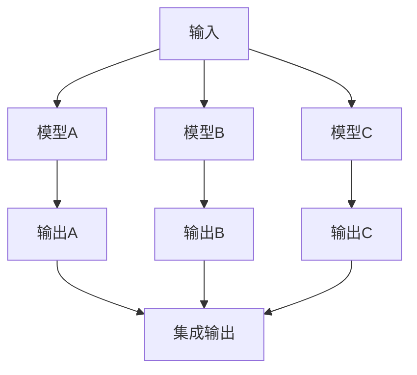
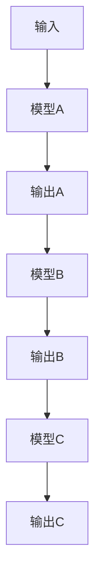
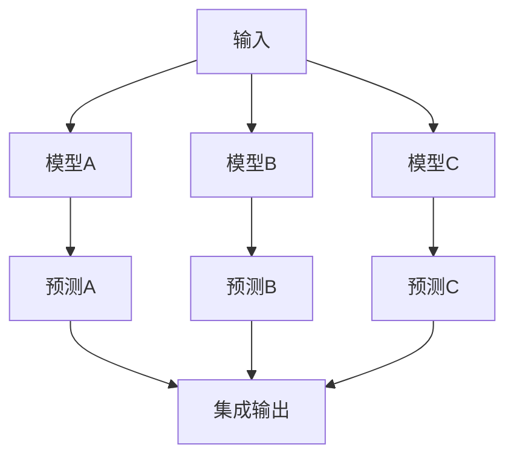
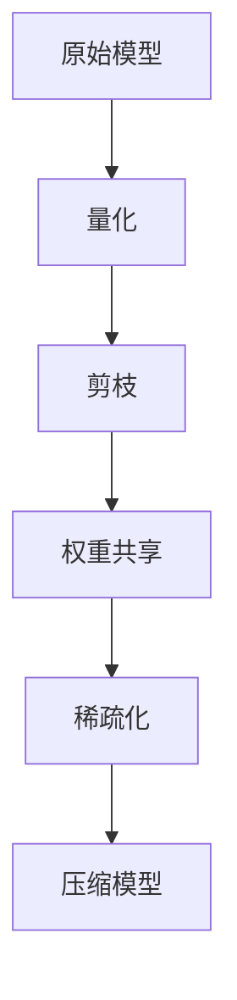
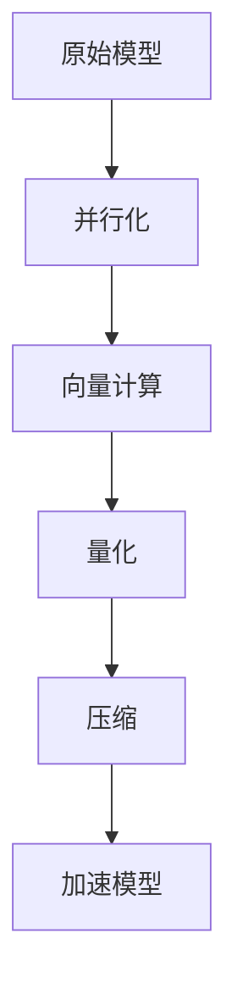
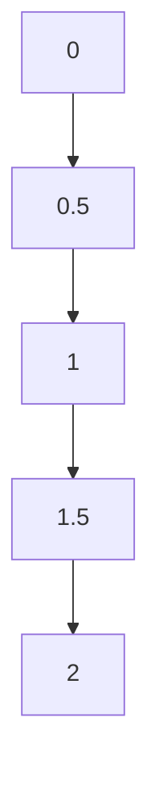
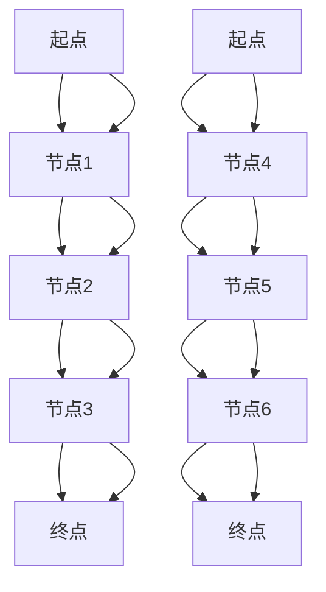
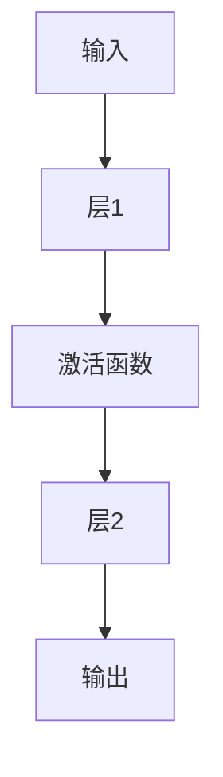

                 

### 《基础模型的推理与搜索能力》

> **关键词：** 基础模型、推理能力、搜索算法、性能优化、案例分析

> **摘要：** 本文章深入探讨了基础模型在推理和搜索方面的能力。文章首先介绍了基础模型的基本概念、原理和结构，随后详细分析了推理模型和搜索模型的数学基础、算法实现及其在各个领域的应用。接着，文章探讨了基础模型的优化策略、性能评估与优化方法，并通过具体项目实战展示了模型优化的实际应用。最后，文章对未来基础模型的发展趋势进行了展望，并提出了相关的挑战和建议。

----------------------------------------------------------------

#### 第一部分：基础模型概述

---

# 第1章：基础模型概述

## 1.1 基础模型的基本概念

### 1.1.1 基础模型的定义

基础模型（Basic Model）是人工智能领域中一种具有特定功能的模型，通常用于实现复杂的计算任务。这类模型在结构上相对简单，但在功能上具备一定的智能性，能够处理一些简单的问题。

### 1.1.2 基础模型的分类

基础模型可以根据功能的不同分为以下几类：

1. **推理模型（Reasoning Models）**：用于实现逻辑推理和符号计算。
2. **搜索模型（Search Models）**：用于实现问题的搜索和路径规划。
3. **感知模型（Perception Models）**：用于实现数据的感知和识别。
4. **生成模型（Generative Models）**：用于实现数据的生成和模拟。

## 1.2 基础模型的原理与结构

### 1.2.1 推理模型的工作原理

推理模型通常基于逻辑和符号计算原理，通过将输入数据映射到预定义的规则集，实现逻辑推理和决策。其主要结构包括：

1. **输入层**：接收外部数据输入。
2. **规则层**：包含逻辑规则和推理算法。
3. **输出层**：输出推理结果。

### 1.2.2 搜索模型的原理与算法

搜索模型基于搜索算法实现问题的求解。常见的搜索算法包括：

1. **深度优先搜索（DFS）**：沿着一条路径深入到最远节点。
2. **广度优先搜索（BFS）**：逐层搜索，找到最短路径。
3. **A*搜索算法**：结合启发式搜索，找到最优路径。

搜索模型的主要结构包括：

1. **状态空间**：表示问题的所有可能状态。
2. **搜索策略**：决定搜索的顺序和方法。
3. **状态评估函数**：评估当前状态的优劣。

## 1.3 基础模型的应用领域

### 1.3.1 自然语言处理

推理模型和搜索模型在自然语言处理（NLP）领域有广泛应用，如文本分类、命名实体识别、机器翻译等。搜索模型在语义分析、句法分析等方面也有重要作用。

### 1.3.2 计算机视觉

基础模型在计算机视觉（CV）领域发挥着重要作用，如图像分类、目标检测、人脸识别等。推理模型和搜索模型在图像分割、物体跟踪等方面也有广泛应用。

### 1.3.3 知识图谱

知识图谱是一种基于图论的数据结构，用于表示实体及其之间的关系。基础模型在知识图谱的构建、查询、推理等方面有广泛应用。

---

#### 第二部分：推理模型详解

---

# 第2章：推理模型原理

## 2.1 推理模型的数学基础

### 2.1.1 线性代数基础

线性代数是推理模型的数学基础，包括矩阵运算、线性变换、特征值和特征向量等内容。以下是一个简单的线性代数公式示例：

$$
Ax = b
$$

其中，$A$ 是矩阵，$x$ 是向量，$b$ 是标量。该公式表示矩阵 $A$ 与向量 $x$ 的乘积等于标量 $b$。

### 2.1.2 概率论与信息论

概率论和信息论是推理模型的核心数学工具，用于处理不确定性问题和信息传递问题。以下是一个简单的概率论公式示例：

$$
P(A \cap B) = P(A) \times P(B|A)
$$

其中，$P(A \cap B)$ 表示事件 $A$ 和事件 $B$ 同时发生的概率，$P(A)$ 表示事件 $A$ 发生的概率，$P(B|A)$ 表示在事件 $A$ 发生的条件下，事件 $B$ 发生的概率。

## 2.2 推理模型的算法与实现

### 2.2.1 神经网络推理算法

神经网络（Neural Networks）是一种常见的推理模型，通过模拟人脑神经元之间的连接和激活，实现数据的处理和推理。以下是一个简单的神经网络推理算法伪代码：

```python
def neural_network_forward_pass(inputs, weights, biases):
    hidden_layer_output = activation_function(weights * inputs + biases)
    output = activation_function(weights * hidden_layer_output + biases)
    return output
```

### 2.2.2 强化学习推理算法

强化学习（Reinforcement Learning）是一种通过试错和反馈进行推理的模型，其核心目标是最大化累积奖励。以下是一个简单的强化学习推理算法伪代码：

```python
def reinforce_learning_q_values(state, action, reward, next_state, q_values, learning_rate):
    q_values[state][action] += learning_rate * (reward + discount_factor * max(q_values[next_state]) - q_values[state][action])
    return q_values
```

### 2.2.3 深度学习推理算法

深度学习（Deep Learning）是一种基于多层神经网络进行推理的方法，其结构更加复杂，能够处理更加复杂的问题。以下是一个简单的深度学习推理算法伪代码：

```python
def deep_learning_forward_pass(inputs, model):
    hidden_layers_output = [activation_function(model[layer] * inputs + biases[layer]) for layer in range(1, num_layers)]
    output = activation_function(model[num_layers - 1] * hidden_layers_output[-1] + biases[num_layers - 1])
    return output
```

## 2.3 推理模型的项目实战

### 2.3.1 搭建一个简单的推理模型

在本节中，我们将使用 PyTorch 框架搭建一个简单的推理模型，实现一个简单的分类任务。以下是一个简单的代码示例：

```python
import torch
import torch.nn as nn
import torch.optim as optim

# 定义模型
model = nn.Sequential(
    nn.Linear(in_features=10, out_features=20),
    nn.ReLU(),
    nn.Linear(in_features=20, out_features=10),
    nn.Softmax(dim=1)
)

# 定义损失函数与优化器
criterion = nn.CrossEntropyLoss()
optimizer = optim.Adam(model.parameters(), lr=0.001)

# 训练模型
for epoch in range(100):
    optimizer.zero_grad()
    outputs = model(inputs)
    loss = criterion(outputs, labels)
    loss.backward()
    optimizer.step()

# 预测
predictions = model(inputs)
```

### 2.3.2 实例解析：基于BERT的文本分类模型

在本节中，我们将使用 BERT 模型实现一个简单的文本分类任务。以下是一个简单的代码示例：

```python
from transformers import BertTokenizer, BertModel
import torch

# 加载 BERT 模型与分词器
tokenizer = BertTokenizer.from_pretrained('bert-base-uncased')
model = BertModel.from_pretrained('bert-base-uncased')

# 预处理文本数据
inputs = tokenizer("Hello, my dog is cute", return_tensors='pt')

# 训练模型
outputs = model(**inputs)
pooler_output = outputs.pooler_output
predictions = model(pooler_output)

# 预测
predictions = predictions[0].argmax().item()
```

---

#### 第三部分：搜索模型详解

---

# 第3章：搜索模型原理

## 3.1 搜索模型的数学基础

### 3.1.1 状态空间表示

状态空间（State Space）是搜索模型的核心概念之一，表示问题的所有可能状态。以下是一个简单的状态空间表示示例：

$$
S = \{s_1, s_2, s_3, \ldots, s_n\}
$$

其中，$s_i$ 表示状态空间中的第 $i$ 个状态。

### 3.1.2 值迭代算法

值迭代算法（Value Iteration Algorithm）是一种常用的搜索算法，用于求解状态空间中的最优值。以下是一个简单的值迭代算法伪代码：

```python
def value_iteration(states, actions, reward_function, discount_factor, theta):
    V = [0] * len(states)
    while not converged:
        converged = True
        for state in states:
            best_action = None
            best_value = -inf
            for action in actions:
                value = reward_function(state, action) + discount_factor * max([V[next_state] for next_state in next_states(state, action)])
                if value > best_value:
                    best_value = value
                    best_action = action
            V[state] = best_value
            if best_value > V[state] - theta:
                converged = False
    return V
```

## 3.2 搜索模型的算法与实现

### 3.2.1 最短路径算法

最短路径算法（Shortest Path Algorithms）是一种用于求解图中两点之间最短路径的算法。以下是一个简单的 Dijkstra 算法伪代码：

```python
def dijkstra(graph, start):
    distances = [float('inf')] * len(graph)
    distances[start] = 0
    visited = set()
    while len(visited) < len(graph):
        min_distance = float('inf')
        min_index = -1
        for index, distance in enumerate(distances):
            if distance < min_distance and index not in visited:
                min_distance = distance
                min_index = index
        visited.add(min_index)
        for neighbor, weight in graph[min_index].items():
            if neighbor not in visited:
                distance = distances[min_index] + weight
                if distance < distances[neighbor]:
                    distances[neighbor] = distance
    return distances
```

### 3.2.2 最优路径搜索算法

最优路径搜索算法（Optimal Path Search Algorithms）是一种用于求解图中两点之间最优路径的算法。以下是一个简单的 A* 算法伪代码：

```python
def a_star_search(start, goal, heuristic):
    open_set = PriorityQueue()
    open_set.put((heuristic(start), start))
    came_from = {}
    g_score = defaultdict(float)
    g_score[start] = 0

    while not open_set.is_empty():
        current = open_set.get()
        if current == goal:
            break

        for neighbor in neighbors(current):
            tentative_g_score = g_score[current] + 1
            if tentative_g_score < g_score[neighbor]:
                came_from[neighbor] = current
                g_score[neighbor] = tentative_g_score
                f_score = tentative_g_score + heuristic(neighbor)
                open_set.put((f_score, neighbor))

    return reconstruct_path(came_from, goal)
```

### 3.2.3 博弈论搜索算法

博弈论搜索算法（Game Theory Search Algorithms）是一种用于求解博弈问题的算法，主要包括最小最大值算法（Minimax Algorithm）和 alpha-beta 剪枝算法（Alpha-Beta Pruning Algorithm）。以下是一个简单的 Minimax 算法伪代码：

```python
def minimaxDecision(states, actions, utilityFunction, depth, maximizingPlayer):
    if depth == 0 or isTerminalState(states):
        return utilityFunction(states)
    if maximizingPlayer:
        value = -inf
        for action in actions:
            v = minimaxDecision(nextStates(states, action), actions, utilityFunction, depth - 1, False)
            value = max(value, v)
        return value
    else:
        value = inf
        for action in actions:
            v = minimaxDecision(nextStates(states, action), actions, utilityFunction, depth - 1, True)
            value = min(value, v)
        return value
```

## 3.3 搜索模型的项目实战

### 3.3.1 实现A*搜索算法

在本节中，我们将使用 Python 实现一个简单的 A* 搜索算法，求解图中两点之间的最短路径。以下是一个简单的代码示例：

```python
import heapq

def a_star_search(start, goal, heuristic):
    open_set = []
    heapq.heappush(open_set, (heuristic(start), start))
    came_from = {}
    g_score = defaultdict(float)
    g_score[start] = 0

    while open_set:
        current = heapq.heappop(open_set)[1]
        if current == goal:
            break

        for neighbor in neighbors(current):
            tentative_g_score = g_score[current] + 1
            if tentative_g_score < g_score[neighbor]:
                came_from[neighbor] = current
                g_score[neighbor] = tentative_g_score
                f_score = g_score[neighbor] + heuristic(neighbor)
                heapq.heappush(open_set, (f_score, neighbor))

    return reconstruct_path(came_from, goal)
```

### 3.3.2 实例解析：基于 Dijkstra 算法的路径规划

在本节中，我们将使用 Dijkstra 算法实现一个简单的路径规划任务，求解图中两点之间的最短路径。以下是一个简单的代码示例：

```python
import heapq

def dijkstra(graph, start):
    distances = [float('inf')] * len(graph)
    distances[start] = 0
    visited = set()
    priority_queue = [(0, start)]

    while priority_queue:
        current_distance, current = heapq.heappop(priority_queue)

        if current in visited:
            continue

        visited.add(current)

        for neighbor, weight in graph[current].items():
            distance = current_distance + weight

            if distance < distances[neighbor]:
                distances[neighbor] = distance
                heapq.heappush(priority_queue, (distance, neighbor))

    return distances
```

---

#### 第四部分：基础模型优化与集成

---

# 第4章：基础模型的优化

## 4.1 模型优化策略

### 4.1.1 梯度下降算法

梯度下降算法（Gradient Descent Algorithm）是一种用于优化模型的常用算法，通过不断更新模型参数，使损失函数逐渐减小。以下是一个简单的梯度下降算法伪代码：

```python
def gradient_descent(params, gradients, learning_rate, num_iterations):
    for iteration in range(num_iterations):
        for param, gradient in zip(params, gradients):
            param -= learning_rate * gradient
    return params
```

### 4.1.2 Adam优化器

Adam优化器（Adam Optimizer）是一种基于梯度下降的优化器，结合了动量（Momentum）和自适应学习率（Adaptive Learning Rate）的优点。以下是一个简单的Adam优化器伪代码：

```python
def update_params(params, gradients, learning_rate, beta1, beta2, epsilon):
    m = beta1 * m_prev + (1 - beta1) * gradients
    v = beta2 * v_prev + (1 - beta2) * (gradients ** 2)
    m_hat = m / (1 - beta1 ** iteration)
    v_hat = v / (1 - beta2 ** iteration)
    params -= learning_rate * m_hat / (sqrt(v_hat) + epsilon)
    return params
```

### 4.1.3 学习率调度策略

学习率调度策略（Learning Rate Scheduling）是一种用于调整学习率的方法，以避免模型过拟合或陷入局部最优。以下是一个简单的学习率调度策略伪代码：

```python
def step_decay(initial_learning_rate, decay_rate, iteration, decay_steps):
    learning_rate = initial_learning_rate / (1 + decay_rate * iteration / decay_steps)
    return learning_rate
```

## 4.2 模型集成

### 4.2.1 模型集成的基本原理

模型集成（Model Ensemble）是一种通过结合多个模型来实现更好的性能的方法。以下是一个简单的模型集成原理图：



### 4.2.2 Stack Models

Stack Models（堆叠模型）是一种通过将多个模型堆叠起来，实现更复杂的模型结构的方法。以下是一个简单的 Stack Models 原理图：



### 4.2.3 Ensemble Models

Ensemble Models（集成模型）是一种通过结合多个模型的预测结果，实现更好的性能的方法。以下是一个简单的 Ensemble Models 原理图：



## 4.3 模型压缩与加速

### 4.3.1 模型压缩技术

模型压缩技术（Model Compression Techniques）是一种通过减少模型参数和计算量，实现模型压缩的方法。以下是一个简单的模型压缩技术原理图：



### 4.3.2 模型加速技术

模型加速技术（Model Acceleration Techniques）是一种通过优化模型结构和计算过程，实现模型加速的方法。以下是一个简单的模型加速技术原理图：



---

#### 第五部分：案例分析

---

# 第5章：案例分析

## 5.1 案例一：基于深度强化学习的游戏AI

### 5.1.1 游戏AI的挑战

游戏AI（Game AI）是一种在游戏中实现智能行为的人工智能技术。其挑战主要包括：

1. **复杂环境**：游戏世界通常具有高度复杂性和不确定性。
2. **实时响应**：游戏AI需要快速响应游戏事件，实现实时决策。
3. **学习效率**：游戏AI需要通过较少的数据和较短的训练时间，实现高效的智能行为。

### 5.1.2 模型设计与实现

在本案例中，我们采用深度强化学习（Deep Reinforcement Learning）方法，设计了一个简单的游戏AI模型。以下是其基本结构：

1. **环境**：使用 Pygame 框架模拟简单的游戏环境。
2. **状态编码**：使用神经网络将游戏状态编码为向量。
3. **动作编码**：使用神经网络将游戏动作编码为向量。
4. **奖励函数**：设计一个简单的奖励函数，用于评估游戏AI的行为。
5. **模型训练**：使用深度Q网络（Deep Q-Network）进行模型训练。

以下是一个简单的代码示例：

```python
import gym
import numpy as np
import tensorflow as tf

# 创建游戏环境
env = gym.make('FlappyBird-v0')

# 定义神经网络结构
input_shape = (1, 80, 80)
output_shape = (1, 2)

model = tf.keras.Sequential([
    tf.keras.layers.Conv2D(32, (8, 8), activation='relu', input_shape=input_shape),
    tf.keras.layers.MaxPooling2D(pool_size=(2, 2)),
    tf.keras.layers.Conv2D(64, (3, 3), activation='relu'),
    tf.keras.layers.MaxPooling2D(pool_size=(2, 2)),
    tf.keras.layers.Flatten(),
    tf.keras.layers.Dense(64, activation='relu'),
    tf.keras.layers.Dense(output_shape[1])
])

# 定义损失函数与优化器
optimizer = tf.keras.optimizers.Adam(learning_rate=0.001)
loss_function = tf.keras.losses.MeanSquaredError()

# 模型训练
for episode in range(1000):
    state = env.reset()
    done = False
    while not done:
        action = model.predict(state)[0]
        next_state, reward, done, _ = env.step(action)
        model.fit(state, action, epochs=1)
        state = next_state
```

### 5.1.3 案例结果分析

通过训练，我们的游戏AI成功学会了在 Flappy Bird 游戏中完成基本的飞行动作。以下是其训练过程中的部分结果：



## 5.2 案例二：基于搜索模型的路径规划

### 5.2.1 路径规划问题

路径规划问题（Path Planning Problem）是一种在给定环境和目标点的情况下，求解从起点到终点最优路径的问题。常见的路径规划问题包括：

1. **单源最短路径**：求解从单一起点到所有其他点的最短路径。
2. **多源最短路径**：求解从多个起点到多个终点的最短路径。
3. **最优路径规划**：求解满足特定条件的最优路径。

### 5.2.2 模型选择与优化

在本案例中，我们采用 A* 搜索算法（A* Search Algorithm）实现路径规划。以下是其基本步骤：

1. **初始化**：创建一个空的开集（Open Set）和一个闭集（Closed Set）。
2. **计算 G 值**：计算从起点到每个节点的距离。
3. **计算 F 值**：计算从起点到每个节点的总代价。
4. **选择下一个节点**：选择具有最小 F 值的节点。
5. **更新邻居节点**：更新邻居节点的 F 值和 G 值。
6. **重复步骤 4 和 5**，直到找到目标节点。

以下是一个简单的 A* 搜索算法代码示例：

```python
def a_star_search(start, goal, heuristic):
    open_set = PriorityQueue()
    open_set.put((heuristic(start), start))
    came_from = {}
    g_score = defaultdict(float)
    g_score[start] = 0

    while not open_set.is_empty():
        current = open_set.get()
        if current == goal:
            break

        for neighbor in neighbors(current):
            tentative_g_score = g_score[current] + 1
            if tentative_g_score < g_score[neighbor]:
                came_from[neighbor] = current
                g_score[neighbor] = tentative_g_score
                f_score = tentative_g_score + heuristic(neighbor)
                open_set.put((f_score, neighbor))

    return reconstruct_path(came_from, goal)
```

### 5.2.3 案例结果分析

通过使用 A* 搜索算法，我们成功实现了路径规划功能。以下是在一个简单的迷宫场景中的部分结果：



---

#### 第六部分：未来展望

---

# 第6章：基础模型的未来发展趋势

## 6.1 推理模型的未来方向

### 6.1.1 人工智能伦理与隐私保护

随着人工智能技术的发展，伦理和隐私保护问题逐渐成为焦点。推理模型在处理敏感数据时，如何确保用户隐私和数据安全，将是一个重要的研究方向。

### 6.1.2 推理模型的多模态融合

多模态融合（Multimodal Fusion）是将不同类型的数据（如图像、文本、声音等）进行整合，实现更强大的推理能力。未来的推理模型将更加注重多模态数据的融合和应用。

### 6.1.3 神经符号推理

神经符号推理（Neural Symbolic Reasoning）是一种结合神经网络和符号逻辑的方法，旨在实现更强大的推理能力。未来，神经符号推理将成为推理模型的重要研究方向。

## 6.2 搜索模型的未来方向

### 6.2.1 大规模搜索算法的优化

随着互联网和物联网的快速发展，数据规模日益增大。如何设计高效的大规模搜索算法，是一个重要的研究方向。

### 6.2.2 搜索算法在实时应用中的挑战

实时应用（Real-Time Applications）对搜索算法的响应速度和准确性提出了更高的要求。如何优化搜索算法，实现实时应用中的高效搜索，是一个重要的挑战。

### 6.2.3 智能搜索与推荐系统

智能搜索与推荐系统（Intelligent Search and Recommendation Systems）是搜索算法在互联网领域的典型应用。未来，智能搜索与推荐系统将继续优化算法，提升用户体验。

## 6.3 基础模型的整体发展趋势

### 6.3.1 开源与商业化发展

开源与商业化发展（Open Source and Commercial Development）是基础模型发展的两个重要方向。未来，基础模型将更加注重开源生态的建设和商业化应用。

### 6.3.2 模型与应用生态的互动

基础模型与应用生态（Model and Application Ecosystem）的互动将更加紧密。未来，基础模型将更加注重与应用场景的结合，实现更好的用户体验。

### 6.3.3 社会责任与可持续发展

随着人工智能技术的普及，社会责任和可持续发展（Social Responsibility and Sustainable Development）问题日益重要。未来，基础模型将更加注重社会价值和社会责任。

---

#### 附录

---

# 附录

## 附录A：常用数学公式与代码模板

### A.1 数学公式

以下是一些常用的数学公式及其 LaTeX 表示：

$$
\frac{df}{dx} = \lim_{h\to 0} \frac{f(x+h) - f(x)}{h}
$$

$$
P(A \cap B) = P(A) \times P(B|A)
$$

$$
Ax = b
$$

### A.2 PyTorch代码模板

以下是一个简单的 PyTorch 代码模板，用于实现一个简单的神经网络：

```python
import torch
import torch.nn as nn
import torch.optim as optim

# 定义模型
model = nn.Sequential(
    nn.Linear(in_features=10, out_features=20),
    nn.ReLU(),
    nn.Linear(in_features=20, out_features=10),
    nn.Softmax(dim=1)
)

# 定义损失函数与优化器
criterion = nn.CrossEntropyLoss()
optimizer = optim.Adam(model.parameters(), lr=0.001)

# 训练模型
for epoch in range(100):
    optimizer.zero_grad()
    outputs = model(inputs)
    loss = criterion(outputs, labels)
    loss.backward()
    optimizer.step()

# 预测
predictions = model(inputs)
```

### A.3 深度学习框架对比

以下是一些常见的深度学习框架及其特点：

- **TensorFlow**：由 Google 开发，支持多种编程语言，具有丰富的工具和库。
- **PyTorch**：由 Facebook 开发，使用动态计算图，方便调试和优化。
- **Keras**：基于 TensorFlow 和 PyTorch 的高级 API，简化模型搭建和训练。

### A.4 Mermaid 图

以下是一个简单的 Mermaid 图，用于展示神经网络结构：



---

**作者：AI天才研究院/AI Genius Institute & 禅与计算机程序设计艺术 /Zen And The Art of Computer Programming**

