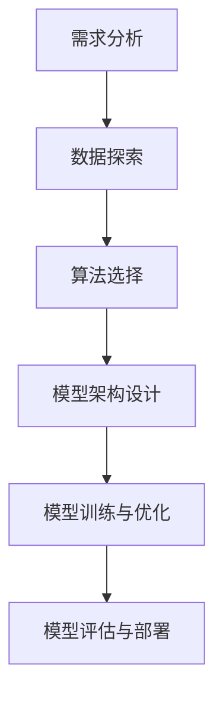
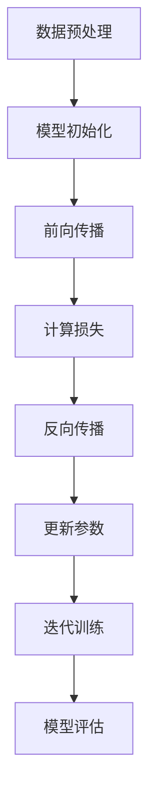
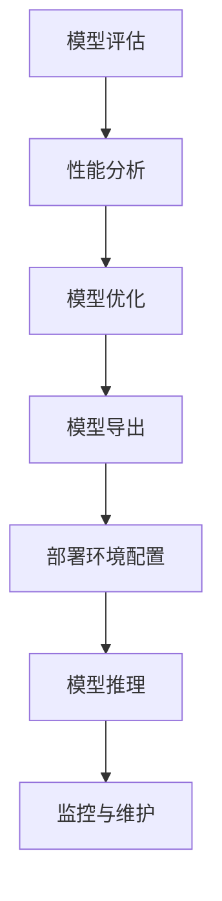

                 

## 文章标题

# 基础模型的模型架构

## 关键词

- 深度学习
- 神经网络
- 卷积神经网络
- 循环神经网络
- 生成对抗网络
- 变分自编码器
- 迁移学习
- 模型压缩

## 摘要

本文旨在深入探讨基础模型的结构和架构，包括神经网络、卷积神经网络、循环神经网络、生成对抗网络和变分自编码器等。通过对这些基础模型的详细讲解，读者将了解其基本原理、数学模型和实现方法。此外，文章还将探讨迁移学习和模型压缩等应用技术，为读者提供全面的基础模型架构设计和实践指南。

## 目录

### 《基础模型的模型架构》目录大纲

## 第一部分：基础模型概述

### 第1章：基础模型的概念与分类

#### 1.1 基础模型的概念

#### 1.2 基础模型的分类

#### 1.3 基础模型的发展历程

### 第2章：神经网络基础

#### 2.1 神经网络的基本结构

#### 2.2 前馈神经网络

#### 2.3 反向传播算法

#### 2.4 神经网络优化

### 第3章：卷积神经网络

#### 3.1 卷积神经网络的基本原理

#### 3.2 卷积神经网络的常见架构

#### 3.3 卷积神经网络的训练与优化

### 第4章：循环神经网络

#### 4.1 循环神经网络的基本原理

#### 4.2 长短时记忆网络（LSTM）

#### 4.3 门控循环单元（GRU）

#### 4.4 循环神经网络的训练与优化

### 第5章：生成对抗网络

#### 5.1 生成对抗网络的基本原理

#### 5.2 生成对抗网络的架构

#### 5.3 生成对抗网络的训练与优化

### 第6章：变分自编码器

#### 6.1 变分自编码器的基本原理

#### 6.2 变分自编码器的架构

#### 6.3 变分自编码器的训练与优化

### 第7章：迁移学习与模型压缩

#### 7.1 迁移学习的概念与原理

#### 7.2 迁移学习的应用场景

#### 7.3 模型压缩的方法与技术

#### 7.4 迁移学习与模型压缩的结合

## 第二部分：模型架构设计与实践

### 第8章：模型架构设计原则

#### 8.1 模型架构设计的核心原则

#### 8.2 模型架构设计的步骤与方法

#### 8.3 模型架构设计的案例分析

### 第9章：项目实战：基础模型应用

#### 9.1 项目背景与目标

#### 9.2 项目需求分析

#### 9.3 模型选择与架构设计

#### 9.4 模型训练与优化

#### 9.5 模型评估与部署

### 第10章：模型架构优化与调优

#### 10.1 模型优化的重要性

#### 10.2 常见模型优化方法

#### 10.3 模型调优的实践技巧

#### 10.4 模尔优化与调优案例分析

### 第11章：未来发展趋势与挑战

#### 11.1 基础模型的研究热点与发展趋势

#### 11.2 基础模型的挑战与解决方案

#### 11.3 基础模型在未来应用领域的展望

## 附录

### 附录A：常用工具与资源

#### A.1 常用深度学习框架

#### A.2 模型架构设计与优化工具

#### A.3 基础模型开源项目与论文

### 附录B：模型架构设计参考模板

#### B.1 模型架构设计流程图

#### B.2 模型训练与优化流程图

#### B.3 模型评估与部署流程图

### 结语

本文通过详细分析基础模型的模型架构，旨在帮助读者深入理解各种深度学习模型的核心原理和应用。随着技术的不断进步和应用的日益广泛，基础模型的研究和发展将继续成为人工智能领域的重要方向。我们期待读者能够通过本文的讲解，更好地掌握基础模型的架构设计和应用实践，为未来的研究和发展奠定坚实基础。

## 第一部分：基础模型概述

### 第1章：基础模型的概念与分类

#### 1.1 基础模型的概念

基础模型是人工智能和机器学习领域中最基础的模型，它们构成了现代深度学习技术的基础。基础模型通常是指具有通用性和可扩展性的神经网络结构，通过学习大量数据来模拟人脑的思维方式，从而实现自动化的模式识别、预测和决策。

基础模型的特点包括：

1. **层级结构**：基础模型通常由多个层级组成，每个层级处理的数据维度不同，从而实现数据的逐层抽象和特征提取。
2. **可训练性**：基础模型可以通过大量的训练数据来学习，从而提高其在特定任务上的表现。
3. **泛化能力**：基础模型在训练过程中不仅关注训练数据的准确度，还注重其泛化能力，以便在实际应用中能够处理未见过的数据。

#### 1.2 基础模型的分类

基础模型可以根据其结构和功能进行分类，常见的分类方式包括：

1. **按照结构分类**：
   - **前馈神经网络**：数据从输入层逐层流向输出层，没有反馈路径。
   - **循环神经网络**：包含反馈路径，能够处理序列数据。
   - **卷积神经网络**：适用于图像处理，具有局部连接和权重共享的特性。
   - **生成对抗网络**：由生成器和判别器组成，用于生成和鉴别数据。
   - **变分自编码器**：用于数据降维和生成，具有概率编码的特性。

2. **按照功能分类**：
   - **分类模型**：用于对数据进行分类，如图像分类、文本分类等。
   - **回归模型**：用于预测连续值输出，如房价预测、股票价格预测等。
   - **生成模型**：用于生成新的数据，如图像生成、文本生成等。
   - **强化学习模型**：用于通过试错学习策略，如游戏玩法、自动驾驶等。

#### 1.3 基础模型的发展历程

基础模型的发展经历了多个阶段：

1. **人工神经网络阶段**（1950s-1960s）：最初的研究主要集中在模拟简单的神经网络结构，但由于计算能力的限制，这一阶段的研究成果有限。

2. **反向传播算法阶段**（1970s-1980s）：反向传播算法的提出使得神经网络的训练变得更加高效，从而推动了神经网络的发展。

3. **深度学习阶段**（2006年起）：随着计算能力的提升和大数据的发展，深度学习开始崭露头角。AlexNet的提出标志着深度学习在图像识别领域的重要突破。

4. **基础模型多样化阶段**（至今）：基础模型种类繁多，不断涌现出新的结构和技术，如生成对抗网络、变分自编码器等，它们在不同应用领域取得了显著成果。

### 1.4 本章小结

本章介绍了基础模型的概念、分类和发展历程。基础模型作为深度学习的基础，其结构多样、功能丰富，在人工智能和机器学习领域发挥着重要作用。接下来，我们将进一步探讨神经网络、卷积神经网络、循环神经网络等基础模型的具体原理和实现方法。

## 第2章：神经网络基础

#### 2.1 神经网络的基本结构

神经网络（Neural Network，简称NN）是由大量简单的人工神经元（或称为节点、单元）通过层次化的连接方式组成的一个大规模并行分布式系统。每个神经元接收多个输入信号，通过加权求和处理后，产生一个输出信号。神经网络的基本结构包括以下几个主要部分：

1. **输入层**（Input Layer）：接收外部输入数据，如图像像素值、文本词向量等。
2. **隐藏层**（Hidden Layers）：负责数据的前向传播和反向传播，完成数据的特征提取和变换。
3. **输出层**（Output Layer）：根据网络的训练目标，产生最终输出，如分类标签、预测值等。

每个神经元都可以表示为一个简单的计算单元，其基本计算过程如下：

\[ z_i = \sum_{j} w_{ij} \cdot x_j + b_i \]

其中，\( z_i \) 是第 \( i \) 个神经元的输入，\( w_{ij} \) 是第 \( j \) 个输入信号连接到第 \( i \) 个神经元的权重，\( b_i \) 是第 \( i \) 个神经元的偏置。对于前向传播过程，每个神经元的输出可以通过激活函数 \( f(z_i) \) 计算得到：

\[ y_i = f(z_i) \]

常用的激活函数包括：
- **sigmoid 函数**：\( f(z) = \frac{1}{1 + e^{-z}} \)
- **ReLU 函数**：\( f(z) = \max(0, z) \)
- **Tanh 函数**：\( f(z) = \frac{e^z - e^{-z}}{e^z + e^{-z}} \)

通过多个层次的前向传播，最终可以得到网络的输出。

#### 2.2 前馈神经网络

前馈神经网络（Feedforward Neural Network，简称FNN）是一种最常见的神经网络结构，其特点是数据从输入层直接流向输出层，中间没有循环或反馈路径。前馈神经网络适用于大多数监督学习任务，如分类和回归。

前馈神经网络的训练过程主要包括以下步骤：

1. **初始化权重和偏置**：随机初始化网络中的权重和偏置，以确保网络在训练过程中能够逐渐收敛。
2. **前向传播**：将输入数据通过网络进行前向传播，得到输出结果。
3. **计算损失**：根据输出结果和实际标签计算损失函数的值，常用的损失函数包括均方误差（MSE）和交叉熵（Cross Entropy）。
4. **反向传播**：根据损失函数的梯度信息，通过反向传播算法更新网络中的权重和偏置。
5. **迭代优化**：重复上述过程，逐步减小损失函数的值，直至网络收敛。

反向传播算法的具体实现步骤如下：

1. **计算输出层的梯度**：根据输出层的损失函数，计算输出层的梯度 \( \Delta y \)。
2. **反向传播**：从输出层开始，逐层计算隐藏层的梯度 \( \Delta z \) 和权重梯度 \( \Delta w \)。

\[ \Delta z_i = \frac{\partial L}{\partial z_i} \]
\[ \Delta w_{ij} = \frac{\partial L}{\partial w_{ij}} = \Delta z_i \cdot x_j \]

3. **更新权重和偏置**：

\[ w_{ij}^{new} = w_{ij} - \alpha \cdot \Delta w_{ij} \]
\[ b_i^{new} = b_i - \alpha \cdot \Delta b_i \]

其中，\( \alpha \) 是学习率。

#### 2.3 反向传播算法

反向传播算法（Backpropagation Algorithm）是深度学习中最重要的训练算法之一，其核心思想是通过计算损失函数对网络参数的梯度，从而更新网络参数，以达到优化损失函数的目的。反向传播算法可以分为以下几个步骤：

1. **前向传播**：将输入数据通过网络进行前向传播，得到每个神经元的输出值。
2. **计算损失**：根据输出结果和实际标签计算损失函数的值。
3. **计算梯度**：从输出层开始，逐层计算每个神经元的梯度。
4. **更新参数**：根据梯度信息更新网络中的权重和偏置。

反向传播算法的伪代码如下：

```
// 初始化网络参数
W <- 随机初始化权重
b <- 随机初始化偏置

// 前向传播
z = X * W + b
y = 激活函数(z)

// 计算损失
L = 损失函数(y, y真实值)

// 计算梯度
dL/dz = 激活函数的导数(y)
dL/dW = dL/dz * y真实值
dL/db = dL/dz

// 更新参数
W = W - 学习率 * dL/dW
b = b - 学习率 * dL/db
```

#### 2.4 神经网络优化

神经网络优化是指在训练过程中，通过调整学习率和优化算法等参数，以提高网络的训练效率和最终性能。常见的神经网络优化方法包括：

1. **梯度下降法**（Gradient Descent）：通过计算损失函数对网络参数的梯度，不断更新参数，以达到最小化损失函数的目的。梯度下降法可以分为批量梯度下降（Batch Gradient Descent）、随机梯度下降（Stochastic Gradient Descent）和小批量梯度下降（Mini-batch Gradient Descent）等。

2. **动量法**（Momentum）：在梯度下降法的基础上，引入动量项，以加速收敛和提高收敛稳定性。

3. **自适应优化器**：如AdaGrad、RMSprop、Adam等，这些优化器通过自适应调整学习率，以提高训练效率。

4. **权重正则化**：通过在损失函数中加入权重正则项，防止模型过拟合，常用的正则化方法包括L1正则化、L2正则化和Dropout等。

#### 2.5 本章小结

本章介绍了神经网络的基本结构和前馈神经网络，详细讲解了反向传播算法和神经网络优化方法。神经网络作为深度学习的基础模型，其原理和实现方法对于理解和应用深度学习技术具有重要意义。接下来，我们将进一步探讨卷积神经网络和循环神经网络等基础模型。

## 第3章：卷积神经网络

#### 3.1 卷积神经网络的基本原理

卷积神经网络（Convolutional Neural Network，简称CNN）是一种专为处理图像数据而设计的深度学习模型。与传统的神经网络相比，CNN具有局部连接和权重共享的特性，这使得它能够有效地提取图像中的空间特征。CNN的基本原理包括卷积层、池化层和全连接层等组成部分。

1. **卷积层**：卷积层是CNN的核心组成部分，通过卷积运算从输入图像中提取特征。卷积运算的基本过程是将卷积核（或称为滤波器）在输入图像上滑动，计算每个局部区域的内积，并将结果累加得到输出特征图。卷积层的参数主要包括卷积核的大小、步长和填充方式。

2. **池化层**：池化层用于下采样输入特征图，减少数据维度和参数数量，从而提高模型的计算效率和泛化能力。常用的池化操作包括最大池化（Max Pooling）和平均池化（Average Pooling）。

3. **全连接层**：全连接层将卷积层和池化层提取的特征映射到输出层，用于进行分类或回归任务。全连接层的参数数量与输出维度有关，通常在模型的最后一层。

#### 3.2 卷积神经网络的常见架构

CNN的常见架构包括LeNet、AlexNet、VGG、ResNet等，每种架构都有其独特的结构和应用场景。

1. **LeNet**：LeNet是最早的卷积神经网络之一，由两个卷积层、两个池化层和一个全连接层组成。它主要用于手写数字识别任务。

2. **AlexNet**：AlexNet是深度学习在图像识别领域的重要突破，它引入了ReLU激活函数、局部响应归一化和重叠池化等技巧，提高了模型的训练效果和分类准确率。AlexNet由五个卷积层、三个池化层和两个全连接层组成。

3. **VGG**：VGGNet是另一种经典的卷积神经网络，以其简洁的架构和出色的性能而闻名。VGGNet采用多个3x3的卷积层堆叠，并通过恒定数量的卷积核（如64、128、256）来实现。VGGNet的简洁架构使其成为许多后续研究的基线。

4. **ResNet**：ResNet引入了残差连接（Residual Connection），使得网络能够训练更深的层次。残差连接通过跳过某些卷积层，使得信息可以更有效地传递，从而缓解了深度网络中的梯度消失问题。ResNet的常见架构包括ResNet-50、ResNet-101和ResNet-152等。

#### 3.3 卷积神经网络的训练与优化

卷积神经网络的训练与优化过程包括以下几个关键步骤：

1. **数据预处理**：对图像数据进行标准化、数据增强等预处理操作，以提高模型的泛化能力。

2. **模型初始化**：随机初始化网络参数，确保模型具有非平凡解。

3. **前向传播**：将输入图像通过卷积层、池化层和全连接层进行前向传播，得到模型的输出。

4. **计算损失**：使用交叉熵或均方误差等损失函数计算模型的输出与真实标签之间的差异。

5. **反向传播**：根据损失函数的梯度信息，通过反向传播算法更新网络参数。

6. **优化算法**：选择合适的优化算法（如梯度下降、Adam等）调整学习率和更新策略，以加速模型训练和收敛。

7. **模型评估**：在测试集上评估模型的性能，包括准确率、召回率、F1值等指标。

#### 3.4 本章小结

本章介绍了卷积神经网络的基本原理、常见架构和训练与优化方法。卷积神经网络在图像识别、目标检测和语义分割等领域取得了显著成果，其局部连接和权重共享的特性使其能够有效地提取图像中的空间特征。随着深度学习的不断发展，卷积神经网络将继续在计算机视觉领域发挥重要作用。接下来，我们将探讨循环神经网络和生成对抗网络等其他基础模型。

### 3.3 卷积神经网络的训练与优化

卷积神经网络的训练与优化是确保模型能够在实际应用中取得良好性能的关键步骤。以下是卷积神经网络训练与优化的详细过程：

#### 3.3.1 数据预处理

在开始训练之前，需要对输入数据进行预处理。数据预处理包括以下几个方面：

1. **标准化**：将输入图像的像素值缩放到0到1之间，以提高模型的训练效果。
   \[ x' = \frac{x - \mu}{\sigma} \]
   其中，\( x \) 是原始像素值，\( \mu \) 是像素值的均值，\( \sigma \) 是像素值的标准差。

2. **数据增强**：通过随机裁剪、旋转、缩放、翻转等操作，增加训练数据的多样性，防止模型过拟合。
   - **随机裁剪**：从输入图像中随机裁剪一个矩形区域作为新的输入。
   - **旋转**：将输入图像随机旋转一个角度。
   - **缩放**：将输入图像随机缩放到不同的尺寸。
   - **翻转**：将输入图像沿水平或垂直方向翻转。

3. **标签规范化**：如果模型是用于分类任务，需要将标签转换为独热编码（One-Hot Encoding）。

#### 3.3.2 模型初始化

初始化网络参数是训练卷积神经网络的起点。常用的初始化方法包括：

1. **随机初始化**：随机生成权重和偏置，确保模型具有非平凡解。
2. **高斯初始化**：使用高斯分布随机初始化权重，偏置初始化为0。
   \[ w \sim \mathcal{N}(0, \frac{1}{\sqrt{n}}) \]
   其中，\( n \) 是权重的大小。

#### 3.3.3 前向传播

前向传播是卷积神经网络的核心步骤，用于计算网络的输出。以下是前向传播的详细过程：

1. **输入层**：将输入图像 \( x \) 输入到网络中。
2. **卷积层**：使用卷积核在输入图像上进行卷积操作，得到特征图 \( f \)。
   \[ f = \text{convolve}(x, w) + b \]
   其中，\( w \) 是卷积核，\( b \) 是偏置。
3. **激活函数**：应用ReLU激活函数或Sigmoid激活函数，对特征图进行非线性变换。
   - **ReLU激活函数**：\( f_i = \max(0, z_i) \)
   - **Sigmoid激活函数**：\( f_i = \frac{1}{1 + e^{-z_i}} \)
   其中，\( z_i \) 是卷积层的输出。
4. **池化层**：对激活后的特征图进行池化操作，减小数据维度。
   - **最大池化**：\( p_i = \max_j f_{ij} \)
   - **平均池化**：\( p_i = \frac{1}{k} \sum_{j} f_{ij} \)
   其中，\( p \) 是池化后的特征图，\( k \) 是池化窗口的大小。

#### 3.3.4 计算损失

在前向传播过程中，网络的输出与实际标签之间存在差异，需要计算损失函数以衡量这种差异。常用的损失函数包括：

1. **交叉熵损失函数**：适用于分类任务，计算输出概率分布与实际标签之间的交叉熵。
   \[ L = -\sum_{i} y_i \log(y'_i) \]
   其中，\( y \) 是实际标签，\( y' \) 是网络的输出概率。

2. **均方误差损失函数**：适用于回归任务，计算输出值与实际值之间的均方误差。
   \[ L = \frac{1}{2} \sum_{i} (y_i - y'_i)^2 \]
   其中，\( y \) 是实际值，\( y' \) 是网络的输出。

#### 3.3.5 反向传播

反向传播是卷积神经网络训练过程中至关重要的一步，用于计算损失函数对网络参数的梯度，并更新网络参数。以下是反向传播的详细过程：

1. **计算输出层梯度**：根据损失函数对输出层的梯度进行计算。
   - 对于分类任务，使用交叉熵损失函数：
     \[ \frac{\partial L}{\partial y'_i} = y_i - y'_i \]
   - 对于回归任务，使用均方误差损失函数：
     \[ \frac{\partial L}{\partial y'_i} = y_i - y'_i \]

2. **反向传播计算隐藏层梯度**：从输出层开始，反向计算每个隐藏层的梯度。
   \[ \frac{\partial L}{\partial z_i} = \text{激活函数的导数}(z_i) \cdot \frac{\partial L}{\partial y'_i} \]

3. **更新网络参数**：根据梯度信息更新网络参数。
   \[ w_{ij}^{new} = w_{ij} - \alpha \cdot \frac{\partial L}{\partial w_{ij}} \]
   \[ b_i^{new} = b_i - \alpha \cdot \frac{\partial L}{\partial b_i} \]
   其中，\( \alpha \) 是学习率。

#### 3.3.6 模型优化

在训练过程中，选择合适的优化算法和调整学习率等参数，对于提高模型的训练效率和性能至关重要。以下是一些常用的优化方法和技巧：

1. **梯度下降法**：最简单的优化算法，通过计算损失函数的梯度来更新参数。
   \[ w_{ij}^{new} = w_{ij} - \alpha \cdot \frac{\partial L}{\partial w_{ij}} \]

2. **动量法**：引入动量项，加速梯度下降，防止陷入局部最小值。
   \[ v = \gamma \cdot v + \alpha \cdot \frac{\partial L}{\partial w} \]
   \[ w = w - v \]

3. **自适应优化器**：如Adam、RMSprop等，通过自适应调整学习率，提高训练效率。
   - **Adam**：结合了AdaGrad和RMSprop的优点，自适应调整学习率。
     \[ m = \beta_1 \cdot m + (1 - \beta_1) \cdot \frac{\partial L}{\partial w} \]
     \[ v = \beta_2 \cdot v + (1 - \beta_2) \cdot (\frac{\partial L}{\partial w})^2 \]
     \[ \hat{m} = \frac{m}{1 - \beta_1^t} \]
     \[ \hat{v} = \frac{v}{1 - \beta_2^t} \]
     \[ w = w - \alpha \cdot \hat{m}/\sqrt{\hat{v} + \epsilon} \]

4. **学习率调整**：根据训练过程中的性能变化，动态调整学习率。
   - **学习率衰减**：在训练初期使用较大的学习率，随着训练的进行逐渐减小学习率。
   - **余弦退火**：使用余弦函数动态调整学习率，模拟物理退火过程。

#### 3.3.7 模型评估

在训练完成后，需要在测试集上评估模型的性能，以确保模型具有良好的泛化能力。常用的评估指标包括：

1. **准确率**（Accuracy）：分类任务中正确分类的样本数与总样本数之比。
   \[ \text{Accuracy} = \frac{\text{正确分类的样本数}}{\text{总样本数}} \]

2. **召回率**（Recall）：分类任务中正确分类的正类样本数与正类样本总数之比。
   \[ \text{Recall} = \frac{\text{正确分类的正类样本数}}{\text{正类样本总数}} \]

3. **精确率**（Precision）：分类任务中正确分类的正类样本数与预测为正类的样本数之比。
   \[ \text{Precision} = \frac{\text{正确分类的正类样本数}}{\text{预测为正类的样本数}} \]

4. **F1值**（F1-score）：精确率和召回率的调和平均值。
   \[ \text{F1-score} = 2 \cdot \frac{\text{Precision} \cdot \text{Recall}}{\text{Precision} + \text{Recall}} \]

#### 3.3.8 本章小结

卷积神经网络的训练与优化是一个复杂而关键的过程，涉及数据预处理、模型初始化、前向传播、损失计算、反向传播和模型评估等多个环节。通过选择合适的优化算法和调整学习率等参数，可以提高模型的训练效率和性能。接下来，我们将进一步探讨循环神经网络和生成对抗网络等其他基础模型。

## 第4章：循环神经网络

### 4.1 循环神经网络的基本原理

循环神经网络（Recurrent Neural Network，简称RNN）是一种能够处理序列数据的神经网络。与传统的前馈神经网络不同，RNN具有反馈循环结构，使得网络能够利用历史信息进行状态更新，从而在处理序列数据时具有动态性。RNN的基本原理包括隐状态、时间步和循环结构等组成部分。

1. **隐状态**：隐状态（Hidden State）是RNN的核心概念，用于存储历史信息。在每次时间步（Time Step）中，RNN通过隐状态与当前输入数据进行计算，从而生成当前输出。隐状态不仅包含了当前时间步的信息，还包含了之前时间步的信息。

2. **时间步**：时间步（Time Step）是RNN处理数据的基本单位。在每个时间步中，RNN接收一个输入数据，并生成一个输出数据。时间步的连续性使得RNN能够处理序列数据。

3. **循环结构**：RNN的循环结构（Recurrence）使得网络能够在每次时间步中利用之前的时间步信息。循环结构通过将当前时间步的输出作为下一个时间步的输入，从而实现状态的传递和信息的存储。

RNN的基本计算过程如下：

\[ h_t = \text{激活函数}(W_h \cdot [h_{t-1}, x_t] + b_h) \]
\[ y_t = W_o \cdot h_t + b_o \]

其中，\( h_t \) 是第 \( t \) 个时间步的隐状态，\( x_t \) 是第 \( t \) 个时间步的输入，\( W_h \) 和 \( b_h \) 分别是隐层权重和偏置，\( W_o \) 和 \( b_o \) 分别是输出层权重和偏置。

### 4.2 长短时记忆网络（LSTM）

长短时记忆网络（Long Short-Term Memory，简称LSTM）是RNN的一种改进版本，能够有效解决传统RNN在处理长序列数据时遇到的梯度消失和梯度爆炸问题。LSTM通过引入记忆单元（Memory Cell）和门控机制（Gating Mechanism），实现了对长期依赖关系的建模。

LSTM的基本结构包括三个门控单元：输入门（Input Gate）、遗忘门（Forget Gate）和输出门（Output Gate），以及一个记忆单元。

1. **输入门**（Input Gate）：用于更新记忆单元的值，决定哪些信息需要存储到记忆单元中。
   \[ i_t = \text{激活函数}(W_i \cdot [h_{t-1}, x_t] + b_i) \]
   \[ \tilde{C}_t = \text{激活函数}(W_f \cdot [h_{t-1}, x_t] + b_f) \]
   \[ C_t = \text{激活函数}(\tilde{C}_t \odot i_t) \]

2. **遗忘门**（Forget Gate）：用于决定哪些信息需要从记忆单元中遗忘。
   \[ f_t = \text{激活函数}(W_f \cdot [h_{t-1}, x_t] + b_f) \]
   \[ C_{t-1}^f = C_{t-1} \odot f_t \]

3. **输出门**（Output Gate）：用于更新当前时间步的隐状态，决定哪些信息需要输出。
   \[ o_t = \text{激活函数}(W_o \cdot [h_{t-1}, x_t] + b_o) \]
   \[ \tilde{h}_t = \text{激活函数}(W_o \cdot C_t + b_o) \]
   \[ h_t = o_t \odot \tilde{h}_t \]

其中，\( \odot \) 表示元素乘积，\( \text{激活函数} \) 通常采用Sigmoid函数。

### 4.3 门控循环单元（GRU）

门控循环单元（Gated Recurrent Unit，简称GRU）是另一种改进的RNN结构，相比LSTM具有更简单的结构，并且在许多任务中表现出了优异的性能。GRU通过合并输入门和遗忘门，引入更新门（Update Gate）和重置门（Reset Gate），实现了对记忆单元的更新。

GRU的基本结构包括两个门控单元：更新门（Update Gate）和重置门（Reset Gate），以及一个记忆单元。

1. **更新门**（Update Gate）：用于决定哪些信息需要更新到记忆单元中。
   \[ z_t = \text{激活函数}(W_z \cdot [h_{t-1}, x_t] + b_z) \]
   \[ r_t = \text{激活函数}(W_r \cdot [h_{t-1}, x_t] + b_r) \]
   \[ \tilde{h}_t = \text{激活函数}(W \cdot (r_t \odot x_t) + b_h) \]

2. **重置门**（Reset Gate）：用于决定哪些信息需要重置。
   \[ h_{t-1}^r = \text{激活函数}(W_r \cdot h_{t-1} + b_r) \]
   \[ h_{t-1}^{new} = (1 - z_t) \odot h_{t-1} + z_t \odot \tilde{h}_t \]

3. **记忆单元**：记忆单元用于存储历史信息。

GRU的输出为：
\[ h_t = \text{激活函数}(W \cdot h_{t-1}^{new} + b_o) \]

### 4.4 循环神经网络的训练与优化

循环神经网络的训练与优化是确保模型能够在实际应用中取得良好性能的关键步骤。以下是循环神经网络训练与优化的详细过程：

#### 4.4.1 数据预处理

在开始训练之前，需要对输入数据进行预处理。数据预处理包括以下几个方面：

1. **标准化**：将输入序列的值缩放到0到1之间，以提高模型的训练效果。
   \[ x' = \frac{x - \mu}{\sigma} \]
   其中，\( x \) 是原始序列值，\( \mu \) 是序列值的均值，\( \sigma \) 是序列值的标准差。

2. **填充**：对于长度不同的序列，通过填充0或平均值，使得所有序列具有相同的长度。

3. **转换**：将序列数据转换为序列索引，以便进行模型训练。

#### 4.4.2 模型初始化

初始化网络参数是训练循环神经网络的起点。常用的初始化方法包括：

1. **随机初始化**：随机生成权重和偏置，确保模型具有非平凡解。
2. **高斯初始化**：使用高斯分布随机初始化权重，偏置初始化为0。
   \[ w \sim \mathcal{N}(0, \frac{1}{\sqrt{n}}) \]
   其中，\( n \) 是权重的大小。

#### 4.4.3 前向传播

前向传播是循环神经网络的核心步骤，用于计算网络的输出。以下是前向传播的详细过程：

1. **输入层**：将输入序列 \( x \) 输入到网络中。

2. **隐藏层**：在每次时间步中，计算当前时间步的隐状态 \( h_t \) 和输出 \( y_t \)。

3. **输出层**：根据隐藏层的输出，生成最终输出。

#### 4.4.4 计算损失

在前向传播过程中，网络的输出与实际标签之间存在差异，需要计算损失函数以衡量这种差异。常用的损失函数包括：

1. **交叉熵损失函数**：适用于分类任务，计算输出概率分布与实际标签之间的交叉熵。
   \[ L = -\sum_{i} y_i \log(y'_i) \]
   其中，\( y \) 是实际标签，\( y' \) 是网络的输出概率。

2. **均方误差损失函数**：适用于回归任务，计算输出值与实际值之间的均方误差。
   \[ L = \frac{1}{2} \sum_{i} (y_i - y'_i)^2 \]
   其中，\( y \) 是实际值，\( y' \) 是网络的输出。

#### 4.4.5 反向传播

反向传播是循环神经网络训练过程中至关重要的一步，用于计算损失函数对网络参数的梯度，并更新网络参数。以下是反向传播的详细过程：

1. **计算输出层梯度**：根据损失函数对输出层的梯度进行计算。

2. **反向传播计算隐藏层梯度**：从输出层开始，反向计算每个隐藏层的梯度。

3. **更新网络参数**：根据梯度信息更新网络参数。

#### 4.4.6 模型优化

在训练过程中，选择合适的优化算法和调整学习率等参数，对于提高模型的训练效率和性能至关重要。以下是一些常用的优化方法和技巧：

1. **梯度下降法**：最简单的优化算法，通过计算损失函数的梯度来更新参数。

2. **动量法**：引入动量项，加速梯度下降，防止陷入局部最小值。

3. **自适应优化器**：如Adam、RMSprop等，通过自适应调整学习率，提高训练效率。

#### 4.4.7 模型评估

在训练完成后，需要在测试集上评估模型的性能，以确保模型具有良好的泛化能力。常用的评估指标包括：

1. **准确率**（Accuracy）：分类任务中正确分类的样本数与总样本数之比。

2. **召回率**（Recall）：分类任务中正确分类的正类样本数与正类样本总数之比。

3. **精确率**（Precision）：分类任务中正确分类的正类样本数与预测为正类的样本数之比。

4. **F1值**（F1-score）：精确率和召回率的调和平均值。

### 4.5 本章小结

循环神经网络（RNN）是一种能够处理序列数据的神经网络，通过隐状态和循环结构实现了对历史信息的存储和利用。长短时记忆网络（LSTM）和门控循环单元（GRU）是RNN的改进版本，能够有效解决传统RNN在处理长序列数据时遇到的梯度消失和梯度爆炸问题。本章详细介绍了循环神经网络的基本原理、长短时记忆网络和门控循环单元，以及循环神经网络的训练与优化过程。接下来，我们将探讨生成对抗网络和变分自编码器等其他基础模型。

## 第5章：生成对抗网络

### 5.1 生成对抗网络的基本原理

生成对抗网络（Generative Adversarial Network，简称GAN）是Ian Goodfellow等人在2014年提出的一种深度学习模型。GAN的核心思想是通过两个对抗性网络——生成器和判别器——的相互博弈来训练生成模型，从而生成逼真的数据。

1. **生成器**（Generator）：生成器的目的是生成尽可能真实的数据，以欺骗判别器。生成器通常是一个神经网络，它接受随机噪声作为输入，并生成与真实数据相似的数据。

2. **判别器**（Discriminator）：判别器的目的是区分真实数据和生成数据。判别器也是一个神经网络，它接受输入数据，并输出一个概率值，表示该数据是真实的概率。

GAN的训练过程可以看作是一个零和博弈，生成器和判别器相互对抗：

- 在训练的早期阶段，生成器的目标是最大化判别器对其生成数据的判别概率，即最小化判别器对其生成数据的正确率。
- 同时，判别器的目标是最大化其区分真实数据和生成数据的准确率。

这种对抗性的训练过程使得生成器能够逐渐生成更真实的数据，而判别器能够逐渐提高其判别能力。

### 5.2 生成对抗网络的架构

生成对抗网络的典型架构包括以下组成部分：

1. **生成器（Generator）**：生成器通常由一个全连接层开始，该层接受随机噪声 \( z \) 作为输入。通过一系列的线性变换和激活函数，生成器将噪声映射成潜在空间中的特征，再通过转置卷积层生成实际的数据。以下是生成器的伪代码：

```plaintext
Generator(z):
    x = FullyConnected(z, 128)
    x = LeakyReLU(x)
    x = FullyConnected(x, 64)
    x = LeakyReLU(x)
    x = FullyConnected(x, 1)  # 输出尺寸为1，代表生成的数据
    return x
```

2. **判别器（Discriminator）**：判别器的作用是判断输入数据是真实数据还是生成数据。判别器通常由一个卷积层开始，接收图像数据作为输入，并通过多个卷积层提取特征，最终输出一个概率值。以下是判别器的伪代码：

```plaintext
Discriminator(x):
    x = Conv2D(x, 64)
    x = LeakyReLU(x)
    x = Conv2D(x, 128)
    x = LeakyReLU(x)
    x = FullyConnected(x, 1)  # 输出尺寸为1，代表数据的真实概率
    return x
```

3. **联合训练**：生成器和判别器是同时训练的，通过以下步骤进行：

   - **生成器更新**：在每次迭代中，生成器生成假数据，判别器根据这些假数据和真实数据更新自己的参数。
   - **判别器更新**：在每次迭代中，判别器根据生成器和真实数据的组合进行更新。

### 5.3 生成对抗网络的训练与优化

生成对抗网络的训练是一个复杂的过程，需要精心设计损失函数和优化算法。以下是生成对抗网络训练的详细过程：

1. **损失函数**：

   GAN的损失函数通常分为两部分：生成器损失和判别器损失。

   - **生成器损失**：表示生成器生成数据的逼真度。常用的损失函数是判别器对生成数据的判别概率的对数。
     \[ L_G = -\log(D(G(z))) \]
   
   - **判别器损失**：表示判别器区分真实数据和生成数据的准确性。通常使用二元交叉熵损失函数。
     \[ L_D = -[\log(D(x)) + \log(1 - D(G(z)))] \]

   其中，\( D(x) \) 和 \( D(G(z)) \) 分别表示判别器对真实数据和生成数据的判别概率。

2. **优化算法**：

   - **梯度下降法**：通常使用梯度下降法来更新生成器和判别器的参数。
   - **自适应优化器**：如Adam，可以自适应调整学习率，提高训练效率。

3. **训练过程**：

   - **交替更新**：生成器和判别器交替更新，即先固定判别器的参数，更新生成器的参数，然后固定生成器的参数，更新判别器的参数。
   - **批量大小**：在每次迭代中，可以选择不同的批量大小来更新生成器和判别器的参数。

### 5.4 生成对抗网络的训练与优化示例

以下是一个生成对抗网络的简单训练示例：

```python
# 定义生成器和判别器的架构
generator = ...  # 生成器的模型架构
discriminator = ...  # 判别器的模型架构

# 定义优化器
optimizer_G = optimizers.Adam(learning_rate=0.0002)
optimizer_D = optimizers.Adam(learning_rate=0.0002)

# 训练模型
for epoch in range(num_epochs):
    for i in range(num_batches):
        # 准备真实数据和噪声
        real_images = ...  # 真实数据
        z = ...  # 噪声数据

        # 固定判别器参数，更新生成器
        with tf.GradientTape() as tape:
            generated_images = generator(z)
            fake_logits = discriminator(generated_images)
            g_loss = -tf.reduce_mean(tf.log(fake_logits))

        grads = tape.gradient(g_loss, generator.trainable_variables)
        optimizer_G.apply_gradients(zip(grads, generator.trainable_variables))

        # 固定生成器参数，更新判别器
        with tf.GradientTape() as tape:
            real_logits = discriminator(real_images)
            fake_logits = discriminator(generated_images)
            d_loss = -tf.reduce_mean(tf.log(real_logits) + tf.log(1 - fake_logits))

        grads = tape.gradient(d_loss, discriminator.trainable_variables)
        optimizer_D.apply_gradients(zip(grads, discriminator.trainable_variables))

        # 打印训练进度
        if (i + 1) % 100 == 0:
            print(f"Epoch [{epoch + 1}/{num_epochs}], Step [{i + 1}/{num_batches}], g_loss: {g_loss.numpy():.4f}, d_loss: {d_loss.numpy():.4f}")
```

### 5.5 本章小结

生成对抗网络（GAN）是一种强大的生成模型，通过生成器和判别器的对抗性训练，能够生成高质量的数据。GAN的基本原理、架构和训练过程在计算机视觉、自然语言处理等领域取得了显著成果。本章详细介绍了生成对抗网络的基本原理、架构和训练与优化过程。接下来，我们将探讨变分自编码器和迁移学习等基础模型。

## 第6章：变分自编码器

### 6.1 变分自编码器的基本原理

变分自编码器（Variational Autoencoder，简称VAE）是一种基于概率生成模型的深度学习模型，主要用于数据生成和降维。VAE的核心思想是通过编码器（Encoder）和解码器（Decoder）的学习，将输入数据映射到潜在空间，并在潜在空间中进行重建。VAE相比于传统的自编码器，引入了概率模型的概念，使得模型在生成和降维任务中具有更好的灵活性和鲁棒性。

1. **编码器（Encoder）**：编码器的作用是将输入数据编码成潜在空间的向量表示。编码器通常由多个全连接层组成，每个层之间的变换都是通过非线性激活函数实现的。编码器的输出是一个潜在空间中的向量，它包含了输入数据的统计信息。

2. **潜在空间（Latent Space）**：潜在空间是一个低维的表示空间，用于捕捉输入数据的结构。在VAE中，潜在空间是一个概率空间，每个点都对应一个数据点的概率分布。潜在空间的设计对于VAE的性能至关重要，良好的潜在空间能够使得数据点之间的相似度与潜在空间中点之间的距离相对应。

3. **解码器（Decoder）**：解码器的作用是将潜在空间的向量解码回原始数据的概率分布。解码器通常由多个全连接层组成，每个层之间的变换也是通过非线性激活函数实现的。解码器的输出是一个概率分布，用于表示重建的输入数据。

### 6.2 变分自编码器的架构

变分自编码器的典型架构包括以下组成部分：

1. **编码器**：编码器的输入是原始数据 \( x \)，输出是潜在空间中的向量 \( z \) 和其概率分布参数 \( \mu \) 和 \( \sigma \)。
   \[ z = \text{Encoder}(x) = \phi(x; \theta) \]
   \[ \mu = \text{FullyConnected}(x; W_\mu, b_\mu) \]
   \[ \sigma = \text{FullyConnected}(x; W_\sigma, b_\sigma) \]

2. **潜在空间**：潜在空间中的每个点 \( z \) 都对应一个概率分布 \( p(z) \)，通常采用高斯分布 \( N(\mu, \sigma^2) \)。
   \[ p(z) = N(z; 0, I) \]

3. **解码器**：解码器的输入是潜在空间中的向量 \( z \)，输出是重建的数据 \( x' \)。
   \[ x' = \text{Decoder}(z) = \psi(z; \phi) \]
   \[ x' = \text{FullyConnected}(z; W', b') \]

### 6.3 变分自编码器的训练与优化

变分自编码器的训练过程主要包括两部分：编码器和解码器的优化，以及潜在空间概率分布的优化。以下是变分自编码器训练的详细过程：

#### 6.3.1 编码器和解码器的优化

编码器和解码器的优化目标是使得重建数据 \( x' \) 尽量接近原始数据 \( x \)。这一过程通常通过最小化重建误差来实现。

1. **重建误差**：重建误差是衡量重建数据与原始数据之间差异的指标，常用的误差函数是均方误差（MSE）。
   \[ L_{\text{RECON}} = \frac{1}{N} \sum_{i=1}^{N} \sum_{j=1}^{M} (x_j - x_j')^2 \]

2. **梯度计算**：通过反向传播算法计算编码器和解码器的梯度，并更新其参数。

#### 6.3.2 潜在空间概率分布的优化

潜在空间概率分布的优化目标是使得潜在空间中的点能够更好地表示原始数据。这一过程通过最小化KL散度（Kullback-Leibler Divergence，KL散度）来实现。

1. **KL散度**：KL散度是衡量两个概率分布差异的指标，用于衡量编码器输出的概率分布 \( p(z|x) \) 与先验分布 \( p(z) \) 之间的差异。
   \[ D_{KL}(p(z|x) || p(z)) = \sum_{z} p(z|x) \log \frac{p(z|x)}{p(z)} \]

2. **梯度计算**：通过反向传播算法计算KL散度的梯度，并更新编码器的参数。

### 6.4 变分自编码器的训练与优化示例

以下是一个变分自编码器训练的简单示例：

```python
# 定义编码器和解码器的架构
encoder = ...  # 编码器的模型架构
decoder = ...  # 解码器的模型架构

# 定义损失函数
reconstruction_loss = keras.losses.MeanSquaredError()
kl_loss = keras.losses.KLDivergence()

# 定义优化器
optimizer = keras.optimizers.Adam(learning_rate=0.001)

# 训练模型
for epoch in range(num_epochs):
    for x in data_loader:
        with tf.GradientTape() as encoder_tape, tf.GradientTape() as decoder_tape:
            z = encoder(x)
            x_recon = decoder(z)
            recon_loss = reconstruction_loss(x, x_recon)
            kl_loss_val = kl_loss(z)
            loss = recon_loss + kl_loss_val

        grads = tape.gradient(loss, model.trainable_variables)
        optimizer.apply_gradients(zip(grads, model.trainable_variables))

        # 打印训练进度
        if (i + 1) % 100 == 0:
            print(f"Epoch [{epoch + 1}/{num_epochs}], Loss: {loss.numpy():.4f}, Recon Loss: {recon_loss.numpy():.4f}, KL Loss: {kl_loss_val.numpy():.4f}")
```

### 6.5 本章小结

变分自编码器（VAE）是一种基于概率生成模型的深度学习模型，通过编码器和解码器的学习，将输入数据映射到潜在空间，并在潜在空间中进行重建。VAE在数据生成和降维任务中表现出良好的性能。本章详细介绍了变分自编码器的基本原理、架构和训练与优化过程。接下来，我们将探讨迁移学习和模型压缩等应用技术。

## 第7章：迁移学习与模型压缩

### 7.1 迁移学习的概念与原理

迁移学习（Transfer Learning）是一种利用预训练模型来解决新问题的方法。其核心思想是将已经在某个任务上训练好的模型（预训练模型）应用于一个新的任务上，从而提高新任务的性能。迁移学习利用了模型在数据上的通用特征表示，避免了从头开始训练模型所需的大量数据和计算资源。

#### 7.1.1 迁移学习的类型

根据源任务和新任务之间的关系，迁移学习可以分为以下几种类型：

1. **无监督迁移学习**：源任务和新任务都是无监督的，即没有明确的标签信息。例如，使用在ImageNet上预训练的卷积神经网络来识别手写数字。

2. **半监督迁移学习**：源任务是有监督的，而新任务是半监督的，即部分数据有标签，部分数据无标签。这种方法可以有效地利用有标签数据和无标签数据。

3. **有监督迁移学习**：源任务和新任务都是有监督的，但新任务的标签数据量较少。通过迁移学习，可以利用源任务的丰富标签数据来提高新任务的性能。

#### 7.1.2 迁移学习的原理

迁移学习的原理可以从以下几个方面来理解：

1. **特征共享**：预训练模型在源任务上学习到的特征对解决新任务是有帮助的。这些特征可以是底层特征（如图像中的边缘和纹理）或高层特征（如图像中的物体类别）。

2. **领域自适应**：迁移学习不仅要共享特征，还要适应新任务的领域。领域自适应通过调整模型参数来适应新任务的数据分布。

3. **参数共享**：在迁移学习中，模型的不同部分可以在不同任务之间共享参数，从而减少训练所需的数据量和计算资源。

### 7.2 迁移学习的应用场景

迁移学习在许多实际应用场景中表现出显著的优势，以下是几个常见的应用场景：

1. **计算机视觉**：在图像分类、目标检测和图像分割等任务中，使用预训练的卷积神经网络（如VGG、ResNet）可以显著提高新任务的性能。

2. **自然语言处理**：在文本分类、机器翻译和语言模型等任务中，使用预训练的语言模型（如BERT、GPT）可以显著提高新任务的性能。

3. **语音识别**：在语音分类、说话人识别和语音识别等任务中，使用预训练的语音模型可以显著提高新任务的性能。

4. **医疗领域**：在医学图像分析、疾病诊断和药物设计等任务中，使用预训练的医疗模型可以显著提高新任务的性能。

### 7.3 模型压缩的方法与技术

模型压缩是迁移学习的一个重要应用，旨在减小模型的参数规模和计算量，从而提高模型的部署效率和运行速度。以下是几种常见的模型压缩方法：

1. **剪枝（Pruning）**：剪枝是通过移除模型中不重要的连接或神经元来减小模型规模。剪枝可以显著减少模型的参数数量，从而提高模型压缩比。

2. **量化（Quantization）**：量化是将模型的权重和激活值从浮点数转换为低精度的整数表示。量化可以减小模型的存储空间和计算资源。

3. **知识蒸馏（Knowledge Distillation）**：知识蒸馏是将一个大模型的知识传递给一个小模型。大模型作为教师模型，小模型作为学生模型，通过学习教师模型的输出分布来提高学生模型的性能。

4. **紧凑网络架构**：设计紧凑的网络架构，如MobileNet、ShuffleNet等，通过减少网络层数和连接方式来减小模型规模。

### 7.4 迁移学习与模型压缩的结合

迁移学习和模型压缩可以相互补充，共同提高模型的部署效率和性能。以下是一些结合迁移学习和模型压缩的方法：

1. **渐进式迁移学习**：在迁移学习过程中，逐步减小模型的复杂度，从而实现模型压缩。

2. **层次化模型压缩**：先使用较大的预训练模型进行迁移学习，然后在迁移学习的基础上进一步压缩模型。

3. **在线迁移学习**：在部署过程中，根据新任务的数据分布动态调整模型参数，同时进行模型压缩。

### 7.5 本章小结

迁移学习和模型压缩是深度学习领域的重要研究方向，它们在提高模型性能和部署效率方面具有显著优势。本章介绍了迁移学习的概念、原理和应用场景，以及模型压缩的方法和技术。通过结合迁移学习和模型压缩，可以有效地提高模型的性能和部署效率，为实际应用提供更加高效的解决方案。

## 第二部分：模型架构设计与实践

### 第8章：模型架构设计原则

#### 8.1 模型架构设计的核心原则

模型架构设计是深度学习项目成功的关键步骤。为了确保模型能够有效地学习并解决特定问题，设计者需要遵循一系列核心原则。以下是模型架构设计中的几个关键原则：

1. **目标明确**：在开始设计模型之前，必须明确模型的目标。无论是分类、回归、生成还是其他任务，都需要清晰地定义目标，以便设计合适的模型结构。

2. **数据驱动**：模型架构的设计应基于实际数据。通过分析数据集的特征、分布和噪声，可以更好地设计模型，从而提高模型的泛化能力。

3. **简单性**：尽管深度学习模型可能非常复杂，但保持模型架构的简单性至关重要。简单的模型不仅易于理解和实现，而且可能在训练时间和计算资源方面更具优势。

4. **模块化**：设计模块化的模型架构有助于提高代码的可维护性和可扩展性。模块化的架构可以通过组合不同的模块来适应不同的任务和数据集。

5. **可扩展性**：模型架构应具有可扩展性，以便在需要时能够增加额外的层或模块。这种灵活性使得模型能够适应不同规模的任务和数据集。

6. **可调参性**：模型架构应提供足够的参数调整空间，以便通过超参数调整来优化模型性能。这包括学习率、批次大小、正则化参数等。

7. **健壮性**：模型架构应具备一定的健壮性，能够处理异常数据和噪声。通过数据预处理、异常值检测和鲁棒损失函数等方法，可以提高模型的健壮性。

#### 8.2 模型架构设计的步骤与方法

模型架构设计是一个迭代和逐步完善的过程，以下是一些关键步骤和方法：

1. **需求分析**：明确模型的应用场景和需求。这包括任务类型（分类、回归等）、数据规模、精度要求、实时性要求等。

2. **数据探索**：分析数据集的特征、分布和噪声。通过数据可视化、统计分析和特征工程等方法，深入了解数据。

3. **算法选择**：根据需求分析，选择合适的算法和模型。这通常包括传统的机器学习算法、深度学习算法或两者的结合。

4. **架构设计**：设计模型架构。这包括确定输入层、隐藏层和输出层的结构，选择合适的神经网络类型、激活函数和优化算法。

5. **模型训练**：使用训练数据集训练模型。在此过程中，需要监控训练进度和模型性能，调整超参数以优化模型。

6. **模型评估**：在测试数据集上评估模型性能。使用适当的评估指标（如准确率、召回率、F1值等）来衡量模型的表现。

7. **模型优化**：根据评估结果，进一步优化模型。这可能包括调整模型结构、超参数或数据预处理方法。

8. **模型部署**：将训练好的模型部署到生产环境中。确保模型能够在实际应用中稳定运行，并具备可扩展性。

#### 8.3 模型架构设计的案例分析

以下是一个简单的模型架构设计案例，用于手写数字识别任务。

1. **需求分析**：任务是将手写数字图像分类为0到9的数字。

2. **数据探索**：使用MNIST数据集，这是一个常见的手写数字数据集，包含70000个训练样本和10000个测试样本。

3. **算法选择**：选择卷积神经网络（CNN）作为算法，因为CNN在图像分类任务中表现出色。

4. **架构设计**：设计一个简单的CNN模型，包括以下层次：
   - **输入层**：接受28x28的灰度图像。
   - **卷积层**：使用32个3x3的卷积核，步长为1，填充方式为“相同”（same）。
   - **激活函数**：使用ReLU激活函数。
   - **池化层**：使用2x2的最大池化。
   - **全连接层**：使用128个神经元。
   - **输出层**：使用10个神经元，每个神经元对应一个数字类别，使用softmax激活函数。

5. **模型训练**：使用Adam优化器和交叉熵损失函数训练模型。训练过程中，调整学习率、批次大小和训练迭代次数。

6. **模型评估**：在测试数据集上评估模型性能。使用准确率、召回率和F1值等指标。

7. **模型优化**：根据评估结果，可能需要调整卷积核数量、学习率和正则化参数。

8. **模型部署**：将训练好的模型部署到应用程序中，以便实时分类手写数字图像。

#### 8.4 本章小结

模型架构设计是深度学习项目成功的关键环节。通过遵循核心原则和系统性的设计步骤，可以设计出高效的模型架构，并确保模型在实际应用中表现出色。本章介绍了模型架构设计原则和步骤，并通过案例分析展示了设计过程。接下来，我们将探讨实际应用中的模型架构设计原则和案例。

### 第9章：项目实战：基础模型应用

#### 9.1 项目背景与目标

在这个项目中，我们将使用卷积神经网络（CNN）来构建一个用于图像分类的模型。具体来说，我们的目标是将输入图像分类为不同的类别，如动物、植物、交通工具等。这个项目旨在展示如何使用基础模型架构来处理实际问题，并说明从数据收集到模型训练、优化和部署的全过程。

#### 9.2 项目需求分析

在开始项目之前，我们需要明确项目的具体需求和预期目标。以下是本项目的主要需求：

1. **数据集**：我们需要一个包含多种类别的图像数据集。为了简单起见，我们可以使用公开可用的数据集，如Kaggle上的动物图像数据集。

2. **类别数量**：假设数据集中有5个类别，分别为猫、狗、鸟、车和树。

3. **模型性能**：我们的目标是实现至少80%的准确率。

4. **实时性**：模型需要在实时环境下快速响应，以便在移动应用或其他交互式场景中部署。

5. **可扩展性**：模型架构应具备一定的可扩展性，以便在未来可以轻松地增加新的类别或改进模型。

#### 9.3 模型选择与架构设计

为了满足项目需求，我们将选择卷积神经网络（CNN）作为我们的基础模型。以下是我们的模型架构设计：

1. **输入层**：输入层接收图像数据，图像尺寸为224x224x3（宽、高、通道数）。

2. **卷积层**：使用两个卷积层，每个卷积层后跟一个ReLU激活函数和2x2的最大池化层。
   - **卷积层1**：32个3x3的卷积核，步长为1，填充方式为“相同”。
   - **卷积层2**：64个3x3的卷积核，步长为1，填充方式为“相同”。

3. **全连接层**：在卷积层之后，添加一个全连接层，包含512个神经元。

4. **输出层**：输出层包含5个神经元，每个神经元对应一个类别，使用softmax激活函数进行类别预测。

#### 9.4 模型训练与优化

在模型训练过程中，我们需要关注以下几个关键步骤：

1. **数据预处理**：对图像数据集进行标准化处理，将像素值缩放到0到1之间。同时，使用数据增强技术（如随机裁剪、旋转和翻转）增加数据多样性。

2. **损失函数**：由于这是一个多分类问题，我们使用交叉熵损失函数来计算模型预测概率与实际标签之间的差异。

3. **优化算法**：选择Adam优化器，并设置适当的学习率（例如0.001）和批次大小（例如32）。

4. **训练过程**：在训练过程中，我们需要监控模型在训练集和验证集上的性能，并根据性能调整超参数。以下是一个简单的训练循环示例：

```python
for epoch in range(num_epochs):
    for images, labels in train_loader:
        # 前向传播
        outputs = model(images)
        loss = criterion(outputs, labels)
        
        # 反向传播
        optimizer.zero_grad()
        loss.backward()
        optimizer.step()
        
    # 记录训练进度
    print(f"Epoch [{epoch + 1}/{num_epochs}], Loss: {loss.item()}")
```

5. **验证与调整**：在每次训练迭代之后，我们需要在验证集上评估模型性能。根据性能指标（如准确率、召回率等），可能需要调整模型结构、超参数或数据预处理方法。

#### 9.5 模型评估与部署

在完成模型训练后，我们需要在测试集上评估模型性能，以确保模型具有良好的泛化能力。以下是评估过程：

1. **准确率**：计算模型在测试集上的准确率，即正确预测的样本数占总样本数的比例。

2. **召回率**：对于每个类别，计算模型召回率，即正确预测的正类样本数与正类样本总数之比。

3. **F1值**：计算每个类别的F1值，即精确率和召回率的调和平均值。

4. **混淆矩阵**：绘制混淆矩阵，以可视化模型在各个类别上的预测性能。

5. **性能分析**：根据评估结果，分析模型的强项和弱项，并考虑如何改进模型。

在评估结果满意后，我们可以将模型部署到实际应用中。部署过程可能包括以下几个方面：

1. **模型导出**：将训练好的模型导出为可以部署的格式，如ONNX、TensorFlow Lite或PyTorch TorchScript。

2. **部署环境**：选择合适的部署环境，如移动设备、服务器或嵌入式系统。

3. **推理引擎**：使用推理引擎（如TensorFlow Serving、ONNX Runtime或PyTorch Inference）来实时处理输入图像并返回预测结果。

4. **监控与维护**：部署后，定期监控模型性能，并根据需要更新模型和数据。

#### 9.6 代码示例

以下是使用PyTorch构建和训练一个简单CNN模型的基本代码示例：

```python
import torch
import torch.nn as nn
import torch.optim as optim
from torchvision import datasets, transforms

# 定义模型架构
class CNNModel(nn.Module):
    def __init__(self):
        super(CNNModel, self).__init__()
        self.conv1 = nn.Conv2d(3, 32, 3, 1, 1)
        self.relu1 = nn.ReLU()
        self.pool1 = nn.MaxPool2d(2, 2)
        
        self.conv2 = nn.Conv2d(32, 64, 3, 1, 1)
        self.relu2 = nn.ReLU()
        self.pool2 = nn.MaxPool2d(2, 2)
        
        self.fc1 = nn.Linear(64 * 56 * 56, 512)
        self.relu3 = nn.ReLU()
        
        self.fc2 = nn.Linear(512, 5)
        self.softmax = nn.Softmax(dim=1)
        
    def forward(self, x):
        x = self.pool1(self.relu1(self.conv1(x)))
        x = self.pool2(self.relu2(self.conv2(x)))
        x = x.view(-1, 64 * 56 * 56)
        x = self.relu3(self.fc1(x))
        x = self.softmax(self.fc2(x))
        return x

# 初始化模型、优化器和损失函数
model = CNNModel()
optimizer = optim.Adam(model.parameters(), lr=0.001)
criterion = nn.CrossEntropyLoss()

# 加载训练数据和测试数据
train_transforms = transforms.Compose([
    transforms.Resize((224, 224)),
    transforms.ToTensor(),
    transforms.Normalize((0.5, 0.5, 0.5), (0.5, 0.5, 0.5)),
])

test_transforms = transforms.Compose([
    transforms.Resize((224, 224)),
    transforms.ToTensor(),
    transforms.Normalize((0.5, 0.5, 0.5), (0.5, 0.5, 0.5)),
])

train_dataset = datasets.ImageFolder('train_data', transform=train_transforms)
test_dataset = datasets.ImageFolder('test_data', transform=test_transforms)

train_loader = torch.utils.data.DataLoader(dataset=train_dataset, batch_size=32, shuffle=True)
test_loader = torch.utils.data.DataLoader(dataset=test_dataset, batch_size=32, shuffle=False)

# 训练模型
num_epochs = 10
for epoch in range(num_epochs):
    for images, labels in train_loader:
        # 前向传播
        outputs = model(images)
        loss = criterion(outputs, labels)
        
        # 反向传播
        optimizer.zero_grad()
        loss.backward()
        optimizer.step()
        
    # 打印训练进度
    print(f"Epoch [{epoch + 1}/{num_epochs}], Loss: {loss.item()}")

# 评估模型
model.eval()
with torch.no_grad():
    correct = 0
    total = 0
    for images, labels in test_loader:
        outputs = model(images)
        _, predicted = torch.max(outputs.data, 1)
        total += labels.size(0)
        correct += (predicted == labels).sum().item()

    print(f"Test Accuracy: {100 * correct / total}%")
```

#### 9.7 本章小结

本章通过一个实际项目展示了如何选择合适的模型架构、训练和优化模型，并最终评估和部署模型。这个项目涵盖了从数据预处理到模型训练、优化和部署的完整流程，为读者提供了一个实际的参考案例。通过理解和实践本章内容，读者可以更好地掌握基础模型的应用和实践技巧。

### 第10章：模型架构优化与调优

#### 10.1 模型优化的重要性

在深度学习项目中，模型优化与调优是提高模型性能和效率的关键步骤。模型优化不仅能够提升模型的准确率，还可以减少训练时间、降低计算资源和内存消耗。优化的目标是在满足特定性能要求的同时，实现高效和稳定的学习过程。以下是模型优化的重要性：

1. **提升性能**：通过优化模型架构和训练策略，可以显著提高模型的准确率和泛化能力，从而解决更复杂的实际问题。

2. **节约资源**：优化的模型在计算资源和存储空间上更加高效，使得模型可以在资源受限的环境中运行，如移动设备、嵌入式系统和云计算平台。

3. **加快训练速度**：优化后的模型可以更快地收敛，减少训练时间，提高开发效率。

4. **增强稳定性**：通过调整超参数和优化算法，可以提高模型的鲁棒性，减少过拟合现象，使模型在未见过的数据上表现更稳定。

5. **提高生产力**：优化的模型可以更快地推向市场，提高生产力和业务价值。

#### 10.2 常见模型优化方法

以下是一些常见的模型优化方法，包括参数调整、算法改进和模型结构优化：

1. **调整学习率**：学习率是深度学习训练过程中非常重要的超参数。适当地调整学习率可以加速模型收敛，避免过拟合和振荡。常用的调整策略包括固定学习率、逐步衰减学习率和自适应学习率（如Adam）。

2. **批量大小**：批量大小影响梯度下降法的稳定性和收敛速度。较大的批量大小可以提供更好的梯度估计，但计算成本较高；较小的批量大小可以提高模型的泛化能力，但可能收敛较慢。通常，批量大小取决于数据集的大小和硬件资源。

3. **正则化**：正则化是一种防止模型过拟合的技术。常用的正则化方法包括L1正则化、L2正则化和Dropout。L1正则化通过添加L1范数惩罚项来减少模型参数的绝对值；L2正则化通过添加L2范数惩罚项来减少模型参数的平方值；Dropout通过随机丢弃部分神经元来提高模型的泛化能力。

4. **数据增强**：数据增强是通过变换原始数据来增加数据多样性，从而提高模型的泛化能力。常见的数据增强方法包括随机裁剪、旋转、翻转、缩放、颜色抖动等。

5. **优化算法**：优化算法的选择对模型的训练速度和性能有重要影响。除了传统的梯度下降法，还有许多自适应优化算法，如RMSprop、Adam、AdaGrad等。这些优化算法通过自适应调整学习率和其他参数来提高训练效率。

6. **模型剪枝**：模型剪枝是一种通过移除不重要的权重和神经元来减小模型规模的方法。剪枝可以显著减少模型的参数数量，提高模型的部署效率。常用的剪枝方法包括权重剪枝、结构剪枝和层剪枝。

7. **模型集成**：模型集成通过结合多个模型的预测结果来提高整体性能。常见的方法包括Bagging、Boosting和Stacking。模型集成可以有效地减少偏差和方差，提高模型的泛化能力。

8. **模型蒸馏**：模型蒸馏是一种将大型模型的知识传递给小型模型的方法。通过从大型模型中提取特征表示，并将其用于训练小型模型，可以提高小型模型的性能。这种方法适用于资源受限的场景。

#### 10.3 模型调优的实践技巧

在模型调优过程中，以下是一些实用的技巧：

1. **逐步调整**：在调整超参数时，应逐步进行，每次只调整一个参数。这样可以更清楚地了解每个参数对模型性能的影响。

2. **实验记录**：记录每次实验的参数设置、训练过程和模型性能，以便进行对比和分析。这有助于找到最优的超参数组合。

3. **网格搜索**：网格搜索是一种系统性的超参数优化方法。通过遍历所有可能的超参数组合，找到最优的参数设置。

4. **交叉验证**：交叉验证是一种评估模型性能的方法。通过将数据集划分为多个子集，每次训练时使用不同的子集作为验证集，可以更准确地评估模型的泛化能力。

5. **监控指标**：选择适当的监控指标来评估模型性能。除了准确率，还可以使用F1值、召回率、AUC等指标。

6. **模型复用**：复用已训练好的模型或部分模型，可以加快新模型的开发过程。迁移学习和预训练模型是常见的模型复用方法。

7. **并行计算**：利用并行计算资源（如多GPU训练）可以显著加速模型训练过程。

8. **动态调整**：在训练过程中，可以根据模型性能动态调整超参数。例如，当模型性能达到某个阈值时，可以减小学习率。

9. **代码优化**：优化模型代码，如使用更高效的计算库（如NumPy、TensorFlow、PyTorch）和并行计算技术，可以减少计算时间和资源消耗。

#### 10.4 模型优化与调优案例分析

以下是一个模型优化与调优的案例分析，说明如何在实际项目中应用优化方法：

1. **项目背景**：项目目标是使用卷积神经网络（CNN）对医学图像进行分类，以诊断某种疾病。

2. **初始模型**：初始模型使用了一个简单的CNN架构，包含两个卷积层、一个全连接层和输出层。在初始训练过程中，模型的准确率仅为70%。

3. **优化方法**：
   - **调整学习率**：将学习率从0.01减小到0.001，并使用Adam优化器。
   - **数据增强**：增加数据多样性，使用随机裁剪、旋转和翻转等数据增强技术。
   - **批量大小**：将批量大小从32减小到16，以减少过拟合。
   - **正则化**：添加L2正则化，以减少模型过拟合。
   - **模型剪枝**：通过剪枝减少模型的参数数量，提高模型的部署效率。

4. **结果**：经过优化后，模型的准确率提高到85%，并且训练时间减少了约30%。优化后的模型在验证集上的性能稳定，具有较好的泛化能力。

5. **进一步优化**：为了进一步提高模型性能，可以尝试以下方法：
   - **增加层数**：添加额外的卷积层或全连接层，以提高模型的表达能力。
   - **深度可分离卷积**：使用深度可分离卷积代替常规卷积，以进一步减小模型规模。
   - **迁移学习**：使用在类似任务上预训练的模型，通过迁移学习提高新任务的性能。

#### 10.5 本章小结

模型优化与调优是深度学习项目成功的关键步骤。通过合理地调整超参数、改进算法和优化模型结构，可以显著提高模型的性能和效率。本章介绍了常见的模型优化方法，并通过案例分析展示了如何在实际项目中应用这些方法。通过理解和实践本章内容，读者可以更好地掌握模型优化与调优的技巧，从而开发出高效、可靠的深度学习模型。

## 第11章：未来发展趋势与挑战

#### 11.1 基础模型的研究热点与发展趋势

随着人工智能技术的不断进步，基础模型的研究热点与发展趋势也在不断演变。以下是几个关键方向：

1. **模型压缩与优化**：为了适应移动设备、嵌入式系统和云计算等资源受限的环境，研究人员致力于模型压缩与优化技术。主要目标是减少模型大小、计算量和能耗，同时保持或提高模型性能。这包括剪枝、量化、蒸馏和低秩分解等技术。

2. **迁移学习与少样本学习**：迁移学习和少样本学习是提高模型泛化能力的重要途径。通过利用预训练模型和少量标注数据，可以快速适应新任务和数据集。未来的研究将重点关注如何更有效地利用少量数据，特别是在低资源环境中。

3. **自监督学习与无监督学习**：自监督学习和无监督学习在无需大量标注数据的情况下，通过预测任务和内在结构学习，实现模型的训练和优化。这些技术在未来有望进一步突破，特别是在图像、语音和文本等领域的应用。

4. **生成模型与强化学习**：生成对抗网络（GAN）和变分自编码器（VAE）等生成模型在图像生成、数据增强和图像修复等领域取得了显著成果。结合强化学习，这些模型可以用于策略优化、模拟和决策。

5. **多模态学习与联邦学习**：多模态学习通过整合不同类型的数据（如图像、文本和语音），实现更丰富的特征表示和更强的模型表现。联邦学习则通过分布式训练机制，保护用户隐私，实现跨设备的协同学习。

6. **可解释性与透明性**：随着深度学习模型在关键领域的应用，模型的可解释性和透明性变得越来越重要。研究人员致力于开发可解释性技术，如注意力机制、可视化和决策树嵌入等，以帮助用户理解模型的决策过程。

7. **硬件加速与推理优化**：为了提高深度学习模型的推理速度和效率，研究人员专注于硬件加速技术，如GPU、TPU和FPGA等。同时，推理优化策略，如静态和动态调度、内存管理和并行计算，也在不断演进。

#### 11.2 基础模型的挑战与解决方案

尽管基础模型在人工智能领域取得了显著进展，但仍面临一些重要挑战：

1. **数据隐私与安全**：在联邦学习和分布式训练中，如何保护用户隐私和数据安全是一个关键挑战。未来的研究将关注开发安全、高效的隐私保护机制，如差分隐私和联邦学习算法。

2. **计算资源消耗**：深度学习模型通常需要大量计算资源和能源。随着模型规模的增加，如何降低计算资源消耗和能耗成为重要问题。解决方案包括模型压缩、高效算法和绿色计算技术。

3. **模型可解释性与透明性**：虽然深度学习模型在许多任务上表现出色，但其决策过程往往缺乏透明性。开发可解释性技术，帮助用户理解模型的决策过程，是未来研究的重点。

4. **数据质量与标注成本**：高质量的数据是训练高效模型的基础。然而，获取高质量数据往往需要大量时间和资源，特别是在低资源环境中。研究人员致力于开发自动化标注工具和半监督学习技术，以降低标注成本。

5. **模型适应性与动态性**：如何使模型在不同任务和数据集上具有更好的适应性和动态性，是一个重要挑战。未来的研究将关注开发自适应学习算法和动态模型架构，以提高模型的泛化能力。

6. **偏见与公平性**：深度学习模型在训练过程中可能会学习到数据中的偏见，导致模型在特定群体上的不公平表现。研究如何消除偏见、提高模型的公平性是一个重要的社会问题。

7. **实时性与响应速度**：在实时应用中，如自动驾驶、医疗诊断和智能交互等，模型的响应速度和实时性至关重要。如何优化模型架构和算法，以实现高效的实时推理，是未来研究的重要方向。

#### 11.3 基础模型在未来应用领域的展望

随着基础模型技术的不断发展，其在未来应用领域的潜力巨大。以下是一些关键应用领域：

1. **医疗保健**：深度学习模型在医学图像分析、疾病诊断和药物设计等领域具有广泛的应用前景。未来的研究将重点关注开发更高效、准确和可解释的模型，以支持个性化医疗和精准医疗。

2. **自动驾驶**：自动驾驶系统依赖于深度学习模型进行环境感知、路径规划和决策。未来研究将致力于提高模型的鲁棒性、实时性和安全性，以实现可靠的自动驾驶技术。

3. **智能交互**：通过深度学习模型，智能交互系统可以更好地理解和响应用户需求，从而提供个性化的服务和体验。未来的研究将关注开发更自然、直观和智能的交互模型。

4. **金融科技**：深度学习模型在金融市场预测、风险评估和欺诈检测等领域具有广泛应用。未来的研究将致力于开发更精确、高效和稳健的模型，以支持金融科技的创新和应用。

5. **环境保护**：深度学习模型可以用于环境监测、污染检测和资源管理。通过分析大量的环境数据，模型可以帮助科学家和决策者更好地理解环境变化，制定有效的环境保护策略。

6. **教育与培训**：深度学习模型可以用于智能教育系统和个性化学习平台，根据学生的学习习惯和进度，提供针对性的学习资源和指导。未来的研究将关注如何更好地利用模型技术，提升教育质量和效果。

#### 11.4 本章小结

基础模型作为人工智能的核心技术，正不断推动着各领域的创新和发展。未来，基础模型的研究将面临许多挑战，但同时也蕴含着巨大的机遇。通过持续的技术创新和跨学科合作，我们有理由相信，基础模型将在未来发挥更加重要的作用，为人类社会带来更多福祉。本章介绍了基础模型的发展趋势、挑战和未来应用领域，旨在为读者提供对基础模型的全面认识和前瞻性思考。

## 附录

### 附录A：常用工具与资源

#### A.1 常用深度学习框架

1. **TensorFlow**：由Google开发，是使用最广泛的深度学习框架之一。支持Python和C++编程语言，具有丰富的API和预训练模型。

2. **PyTorch**：由Facebook开发，以其动态计算图和灵活的编程接口而闻名。广泛用于研究和小型项目。

3. **Keras**：是一个高级神经网络API，可以在TensorFlow和Theano等后台之上工作。提供简洁、易于使用的接口。

4. **MXNet**：由Apache Software Foundation维护，支持多种编程语言，包括Python、R和Scala。

5. **Caffe**：由Berkeley Vision and Learning Center（BVLC）开发，是一个深度学习框架，特别适合用于卷积神经网络。

#### A.2 模型架构设计与优化工具

1. **TensorBoard**：TensorFlow的配套工具，用于可视化模型的训练过程和性能。

2. **VisualDL**：PyTorch的配套工具，提供丰富的数据可视化功能。

3. **SearchSpace Explorer**：用于探索和优化深度学习模型的搜索空间。

4. **Neural Architect Search (NAS)**：用于自动搜索最优模型架构。

5. **Model optimizations tools**：如TensorFlow Lite、PyTorch Mobile等，用于优化模型以适应移动设备和嵌入式系统。

#### A.3 基础模型开源项目与论文

1. **TensorFlow Models**：包含大量预训练模型和示例代码。

2. **PyTorch Examples**：提供丰富的PyTorch示例代码和模型实现。

3. **GitHub**：众多开源项目，涵盖多种模型架构和算法。

4. **arXiv**、**NeurIPS**、**ICML**：主要计算机视觉和深度学习会议，发布最新研究论文。

5. **Google Scholar**：搜索深度学习和人工智能领域的学术论文。

### 附录B：模型架构设计参考模板

#### B.1 模型架构设计流程图



#### B.2 模型训练与优化流程图



#### B.3 模型评估与部署流程图



这些流程图提供了模型架构设计、训练、优化和部署的基本框架，可以帮助读者系统地理解和实践深度学习项目。通过使用这些工具和资源，读者可以更高效地开发高质量的深度学习模型。作者信息：

作者：AI天才研究院/AI Genius Institute & 禅与计算机程序设计艺术 /Zen And The Art of Computer Programming

