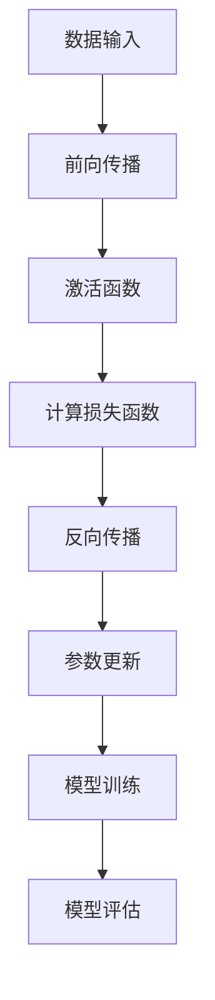
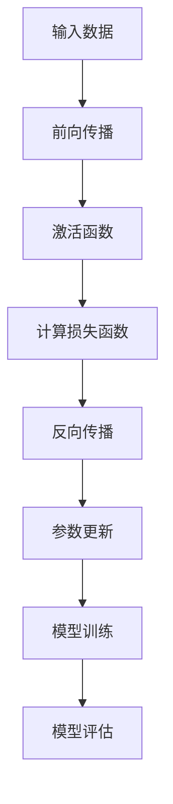

                 

# 《基础模型的理论研究》

## 关键词

- 基础模型
- 神经网络
- 深度学习
- 数学模型
- 项目实战

## 摘要

本文旨在系统地探讨基础模型的理论研究。首先，我们将介绍基础模型的概念、分类及其组成与工作原理，并详细阐述基础模型的优化与调参方法。接着，我们将深入分析深度学习与神经网络的核心算法原理，包括多层感知机、反向传播算法、激活函数与损失函数等。此外，本文还将介绍概率论、线性代数和微积分基础，以及数学模型与公式在深度学习中的应用。最后，我们将通过实际项目实战，展示基础模型的开发过程、代码实现与解读，并对模型结果进行分析与评估。

## 第一部分：基础模型概述

### 第1章：基础模型的概念与分类

#### 1.1 基础模型的概念与分类

**1.1.1 基础模型的基本概念**

基础模型（Fundamental Model）是指在计算机科学、人工智能和机器学习等领域中，用于解决特定问题的基本模型框架。基础模型通常包含一组预定义的组件和算法，通过组合和调整这些组件和算法，可以构建出解决各种问题的具体模型。

**1.1.2 常见的基础模型分类**

1. **神经网络模型**：神经网络（Neural Network）是一种基于生物神经元结构设计的计算模型，用于模拟大脑神经元之间的连接和交互。常见的神经网络模型包括多层感知机（MLP）、卷积神经网络（CNN）和循环神经网络（RNN）等。

2. **监督学习模型**：监督学习模型（Supervised Learning Model）是一类基于标记数据集进行训练的学习模型，通过学习输入和输出之间的映射关系，实现对新数据的预测。常见的监督学习模型包括决策树（Decision Tree）、支持向量机（SVM）和逻辑回归（Logistic Regression）等。

3. **无监督学习模型**：无监督学习模型（Unsupervised Learning Model）是一类无需标记数据集进行训练的学习模型，主要通过探索数据中的潜在结构和规律来实现数据的聚类、降维和密度估计等任务。常见的无监督学习模型包括K均值聚类（K-Means Clustering）、主成分分析（PCA）和自编码器（Autoencoder）等。

4. **增强学习模型**：增强学习模型（Reinforcement Learning Model）是一类基于试错和反馈机制进行训练的学习模型，通过与环境的交互来学习最优策略，以实现目标最大化。常见的增强学习模型包括Q学习（Q-Learning）、深度Q网络（DQN）和策略梯度（Policy Gradient）等。

### 第2章：基础模型的组成与工作原理

#### 2.1 基础模型的组成

**2.1.1 数据输入**

数据输入是基础模型的重要组成部分，它决定了模型对数据的处理能力。数据输入通常包括以下类型：

- **特征数据**：特征数据（Feature Data）是模型输入的关键部分，用于描述数据的属性和特征。特征数据可以是数值型、类别型或文本型等。
- **标签数据**：标签数据（Label Data）是模型输入的另一个重要部分，用于表示模型的输出结果。标签数据通常用于监督学习模型，以监督模型的学习过程。

**2.1.2 网络结构**

网络结构是基础模型的核心部分，它决定了模型的计算能力和表现能力。网络结构通常由多个层次组成，包括输入层、隐藏层和输出层等。

- **输入层**：输入层（Input Layer）是模型的第一个层次，用于接收和预处理输入数据。
- **隐藏层**：隐藏层（Hidden Layer）是模型的核心层次，用于对输入数据进行处理和变换。
- **输出层**：输出层（Output Layer）是模型的最后一个层次，用于生成模型的输出结果。

**2.1.3 激活函数**

激活函数（Activation Function）是基础模型的重要组成部分，用于引入非线性变换，提高模型的拟合能力。常见的激活函数包括Sigmoid函数、ReLU函数和Tanh函数等。

**2.1.4 损失函数**

损失函数（Loss Function）是基础模型的另一个重要组成部分，用于评估模型的输出结果与真实结果之间的差异，并指导模型的学习过程。常见的损失函数包括均方误差（MSE）、交叉熵（Cross Entropy）和Hinge损失（Hinge Loss）等。

### 第3章：基础模型的优化与调参

#### 3.1 基础模型的优化算法

**3.1.1 梯度下降算法**

梯度下降算法（Gradient Descent Algorithm）是一种常用的优化算法，通过计算损失函数的梯度，并沿着梯度方向逐步调整模型的参数，以最小化损失函数。

**3.1.2 动量法**

动量法（Momentum Method）是一种改进的梯度下降算法，通过引入动量项，加速模型的收敛速度，并避免陷入局部最小值。

**3.1.3 Adam优化器**

Adam优化器（Adam Optimizer）是一种结合了动量法和自适应学习率的优化算法，具有较好的收敛速度和稳定性。

#### 3.2 基础模型的调参方法

**3.2.1 超参数的选择**

超参数（Hyperparameter）是基础模型中需要手动调整的参数，如学习率、批量大小、隐藏层节点数等。选择合适的超参数对模型的性能至关重要。

**3.2.2 交叉验证**

交叉验证（Cross Validation）是一种常用的调参方法，通过将数据集划分为训练集和验证集，多次训练和验证模型，以评估模型的性能。

**3.2.3 实践中的调参策略**

在实践中，调参方法通常包括网格搜索（Grid Search）、随机搜索（Random Search）和贝叶斯优化（Bayesian Optimization）等。

### 第4章：基础模型的应用领域

#### 4.1 自然语言处理

**4.1.1 文本分类**

文本分类（Text Classification）是一种常见的自然语言处理任务，通过将文本数据分类到不同的类别，实现文本数据的自动分类。

**4.1.2 机器翻译**

机器翻译（Machine Translation）是一种将一种语言的文本翻译成另一种语言的文本的技术，广泛应用于跨语言交流、国际商务等领域。

**4.1.3 问答系统**

问答系统（Question Answering System）是一种基于自然语言处理技术，实现用户提问和系统回答的交互式系统，广泛应用于搜索引擎、智能客服等领域。

#### 4.2 计算机视觉

**4.2.1 图像分类**

图像分类（Image Classification）是一种常见的计算机视觉任务，通过将图像分类到不同的类别，实现图像的自动分类。

**4.2.2 目标检测**

目标检测（Object Detection）是一种基于图像识别的技术，通过检测图像中的目标对象，实现图像的自动标注。

**4.2.3 人脸识别**

人脸识别（Face Recognition）是一种基于图像识别的技术，通过检测图像中的人脸特征，实现人脸的自动识别。

#### 4.3 其他应用领域

**4.3.1 推荐系统**

推荐系统（Recommender System）是一种基于用户历史行为和偏好，实现个性化推荐的技术，广泛应用于电子商务、社交媒体等领域。

**4.3.2 生成对抗网络**

生成对抗网络（Generative Adversarial Network，GAN）是一种基于深度学习的生成模型，通过训练生成器和判别器，实现高质量图像的生成。

**4.3.3 强化学习**

强化学习（Reinforcement Learning）是一种基于试错和反馈机制的学习方法，通过与环境交互，实现智能体的最优策略学习。

### 第5章：基础模型的Mermaid流程图

#### 5.1 基础模型的工作流程图



## 第二部分：核心算法原理

### 第6章：深度学习与神经网络

#### 6.1 深度学习基本概念

**6.1.1 多层感知机**

多层感知机（Multilayer Perceptron，MLP）是一种前向传播神经网络，通过多个隐藏层对输入数据进行处理，实现非线性变换。

**6.1.2 反向传播算法**

反向传播算法（Backpropagation Algorithm）是一种用于训练神经网络的算法，通过计算损失函数的梯度，并沿着梯度方向更新模型参数，实现模型的优化。

#### 6.2 神经网络结构

**6.2.1 全连接神经网络**

全连接神经网络（Fully Connected Neural Network）是一种最常见的神经网络结构，所有神经元之间都存在直接连接。

**6.2.2 卷积神经网络**

卷积神经网络（Convolutional Neural Network，CNN）是一种专门用于图像识别和处理的神经网络结构，通过卷积操作和池化操作，提取图像特征。

**6.2.3 循环神经网络**

循环神经网络（Recurrent Neural Network，RNN）是一种专门用于序列数据处理和建模的神经网络结构，通过循环连接，实现对序列数据的记忆和建模。

#### 6.3 激活函数与损失函数

**6.3.1 激活函数**

激活函数（Activation Function）是一种非线性函数，用于引入非线性变换，提高模型的拟合能力。常见的激活函数包括Sigmoid函数、ReLU函数和Tanh函数等。

**6.3.2 损失函数**

损失函数（Loss Function）是一种用于评估模型输出结果与真实结果之间差异的函数，用于指导模型的优化过程。常见的损失函数包括均方误差（MSE）、交叉熵（Cross Entropy）和Hinge损失（Hinge Loss）等。

#### 6.4 深度学习优化算法

**6.4.1 梯度下降算法**

梯度下降算法（Gradient Descent Algorithm）是一种基于梯度信息进行模型优化的算法，通过计算损失函数的梯度，并沿着梯度方向更新模型参数，实现模型的优化。

**6.4.2 动量法**

动量法（Momentum Method）是一种改进的梯度下降算法，通过引入动量项，加速模型的收敛速度，并避免陷入局部最小值。

**6.4.3 Adam优化器**

Adam优化器（Adam Optimizer）是一种结合了动量法和自适应学习率的优化算法，具有较好的收敛速度和稳定性。

#### 6.5 深度学习算法的Mermaid流程图



### 第7章：数学模型与公式

#### 7.1 概率论基础

**7.1.1 概率分布**

概率分布（Probability Distribution）是概率论中的一个重要概念，用于描述随机变量在给定条件下取值的概率分布。常见的概率分布包括正态分布（Normal Distribution）、伯努利分布（Bernoulli Distribution）等。

**7.1.2 贝叶斯定理**

贝叶斯定理（Bayes' Theorem）是概率论中的一个重要公式，用于计算条件概率和边缘概率。贝叶斯定理的表达式为：

$$ P(A|B) = \frac{P(B|A)P(A)}{P(B)} $$

#### 7.2 线性代数基础

**7.2.1 矩阵运算**

矩阵运算（Matrix Operation）是线性代数中的基本操作，包括矩阵乘法（Matrix Multiplication）、矩阵求导（Matrix Derivative）等。

**7.2.2 向量空间**

向量空间（Vector Space）是线性代数中的一个基本概念，用于描述向量及其线性运算。向量空间中的向量可以进行加法和数乘运算，并满足封闭性和分配律等性质。

#### 7.3 微积分基础

**7.3.1 导数与微分**

导数（Derivative）是微积分中的一个基本概念，用于描述函数在某一点处的瞬时变化率。微分（Differential）是导数的线性近似，用于描述函数在某一点处的局部变化。

**7.3.2 积分与反导数**

积分（Integral）是微积分中的另一个基本概念，用于描述函数在区间上的累积量。反导数（Antiderivative）是积分的逆运算，用于求解微分方程等。

#### 7.4 数学模型与公式的应用

**7.4.1 反向传播算法中的链式法则**

反向传播算法中的链式法则（Chain Rule）是一种用于计算复合函数导数的公式，用于反向传播过程中计算损失函数关于模型参数的梯度。

$$ \frac{\partial L}{\partial w} = \frac{\partial L}{\partial z} \frac{\partial z}{\partial w} $$

**7.4.2 损失函数的计算方法**

损失函数（Loss Function）是深度学习中的核心概念，用于衡量模型预测结果与真实结果之间的差距。常见的损失函数包括均方误差（MSE）和交叉熵（Cross Entropy）等。

$$ MSE = \frac{1}{n}\sum_{i=1}^{n}(y_i - \hat{y}_i)^2 $$

$$ CrossEntropy = -\sum_{i=1}^{n}y_i\log(\hat{y}_i) $$

## 第三部分：项目实战

### 第8章：项目实战

#### 8.1 项目实战概述

**8.1.1 项目背景**

本项目旨在实现一个简单的图像分类系统，用于识别和分类输入的图像。项目目标是实现一个基于卷积神经网络（CNN）的图像分类模型，能够准确地对图像进行分类。

**8.1.2 项目目标**

1. 数据准备：收集和整理用于训练和测试的图像数据集。
2. 环境搭建：搭建Python开发环境，并安装深度学习框架TensorFlow。
3. 模型构建：构建基于CNN的图像分类模型，并进行参数调优。
4. 模型训练：使用训练数据集对模型进行训练，并保存训练好的模型。
5. 模型评估：使用测试数据集对模型进行评估，计算分类准确率等指标。
6. 模型部署：将训练好的模型部署到服务器或移动设备上，实现图像分类功能。

#### 8.2 环境搭建

**8.2.1 开发环境搭建**

1. 安装Python（推荐版本为3.7或以上）。
2. 安装TensorFlow：使用pip命令安装TensorFlow库。

```bash
pip install tensorflow
```

**8.2.2 数据准备**

1. 收集和整理图像数据集：从互联网或公开数据集中收集用于训练和测试的图像数据集，并进行数据预处理，如图像大小调整、归一化等。
2. 数据集划分：将图像数据集划分为训练集、验证集和测试集，通常使用80%的数据用于训练，10%的数据用于验证，10%的数据用于测试。

#### 8.3 代码实现与解读

**8.3.1 代码实现**

以下是一个简单的基于CNN的图像分类模型的实现代码：

```python
import tensorflow as tf
from tensorflow.keras import layers, models

# 构建模型
model = models.Sequential()
model.add(layers.Conv2D(32, (3, 3), activation='relu', input_shape=(28, 28, 1)))
model.add(layers.MaxPooling2D((2, 2)))
model.add(layers.Conv2D(64, (3, 3), activation='relu'))
model.add(layers.MaxPooling2D((2, 2)))
model.add(layers.Conv2D(64, (3, 3), activation='relu'))
model.add(layers.Flatten())
model.add(layers.Dense(64, activation='relu'))
model.add(layers.Dense(10, activation='softmax'))

# 编译模型
model.compile(optimizer='adam',
              loss='categorical_crossentropy',
              metrics=['accuracy'])

# 训练模型
model.fit(train_images, train_labels, epochs=10, batch_size=64,
          validation_data=(validation_images, validation_labels))

# 评估模型
test_loss, test_acc = model.evaluate(test_images, test_labels)
print('Test accuracy:', test_acc)
```

**8.3.2 代码解读**

1. **模型构建**：使用Keras的Sequential模型构建一个简单的卷积神经网络，包括卷积层（Conv2D）、池化层（MaxPooling2D）和全连接层（Dense）。
2. **编译模型**：使用编译器（compile）配置模型的优化器（optimizer）、损失函数（loss）和评估指标（metrics）。
3. **训练模型**：使用训练数据集（train_images和train_labels）对模型进行训练（fit），并设置训练轮数（epochs）和批量大小（batch_size）。
4. **评估模型**：使用测试数据集（test_images和test_labels）对训练好的模型进行评估（evaluate），计算测试准确率（accuracy）。

#### 8.4 结果分析与评估

**8.4.1 模型评估指标**

1. **准确率（Accuracy）**：模型在测试数据集上的正确分类率，表示为百分比。
2. **精确率（Precision）**：模型预测为正类别的样本中，实际为正类别的比例。
3. **召回率（Recall）**：模型预测为正类别的样本中，实际为正类别的比例。
4. **F1分数（F1 Score）**：精确率和召回率的调和平均值。

**8.4.2 结果分析**

1. **准确率**：模型在测试数据集上的准确率越高，表示模型的分类效果越好。
2. **精确率和召回率**：模型在处理不同类别数据时的表现不同，需要综合考虑精确率和召回率，以平衡分类效果。
3. **F1分数**：F1分数是精确率和召回率的综合评价指标，用于评估模型的整体分类效果。

## 附录

### 附录A：工具与资源

#### 附录A.1 主流深度学习框架对比

1. **TensorFlow**：由Google开发的开源深度学习框架，支持多种编程语言，具有良好的社区和文档支持。
2. **PyTorch**：由Facebook开发的开源深度学习框架，具有良好的动态图计算支持和灵活的编程接口。
3. **Keras**：基于TensorFlow和PyTorch的开源深度学习框架，提供简洁易用的API，适用于快速构建和训练深度学习模型。

#### 附录A.2 常用数学公式与定理

1. **概率论公式**：
   - 概率分布函数：$P(X=x) = f(x)$
   - 条件概率：$P(A|B) = \frac{P(A \cap B)}{P(B)}$
   - 贝叶斯定理：$P(A|B) = \frac{P(B|A)P(A)}{P(B)}$
2. **线性代数公式**：
   - 矩阵乘法：$(AB)_{ij} = \sum_{k=1}^{n} A_{ik}B_{kj}$
   - 矩阵求导：$\frac{\partial A_{ij}}{\partial x_k} = \delta_{ik}A_{jj}$
   - 向量空间：$V = \{v \in \mathbb{R}^n | Av = 0\}$
3. **微积分公式**：
   - 导数与微分：$\frac{df(x)}{dx} = f'(x)$
   - 积分与反导数：$F(x) = \int f(x)dx$

### 附录B：参考文献

1. Goodfellow, I., Bengio, Y., & Courville, A. (2016). *Deep Learning*.
2. Murphy, K. P. (2012). *Machine Learning: A Probabilistic Perspective*.
3. Ng, A. Y., & Huang, J. (2013). *Neural Networks for Machine Learning*.

