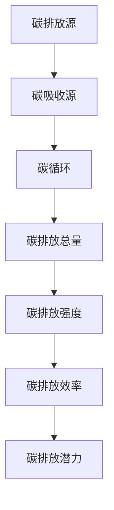
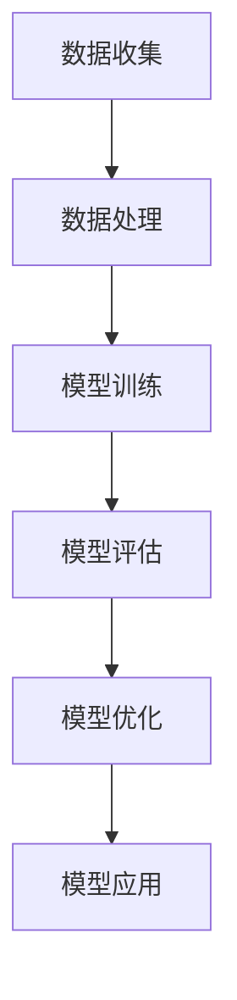

                 

### 文章标题

# 基础模型的碳排放

> 关键词：碳排放、基础模型、碳排放预测、碳排放优化、数学模型

> 摘要：本文将探讨基础模型在碳排放领域中的应用，分析基础模型的核心概念、原理和架构，并通过具体案例展示如何使用基础模型进行碳排放预测和优化。文章旨在为读者提供对碳排放问题的深入理解，并揭示基础模型在碳排放研究中的重要价值。

### 《基础模型的碳排放》目录大纲

## 第一部分：引言

### 1.1 碳排放背景与重要性

#### 1.1.1 全球碳排放现状与挑战

#### 1.1.2 碳排放与气候变化的关系

#### 1.1.3 碳排放减排的意义与目标

### 1.2 基础模型概念

#### 1.2.1 基础模型的定义与分类

#### 1.2.2 基础模型在碳排放研究中的应用

#### 1.2.3 基础模型的发展趋势

## 第二部分：基础模型原理与架构

### 2.1 基础模型核心概念与联系

#### 2.1.1 碳排放原理图

#### 2.1.2 基础模型架构流程图

### 2.2 基础模型算法原理讲解

#### 2.2.1 碳排放预测算法伪代码

#### 2.2.2 基础模型优化算法伪代码

### 2.3 数学模型和数学公式

#### 2.3.1 碳排放数学模型

#### 2.3.2 碳排放效率计算公式

### 2.4 基础模型应用案例

#### 2.4.1 案例一：碳排放预测

#### 2.4.2 案例二：碳排放优化

## 第三部分：碳排放模型开发与实现

### 3.1 碳排放模型开发流程

#### 3.1.1 数据收集与预处理

#### 3.1.2 模型选择与训练

#### 3.1.3 模型评估与优化

#### 3.1.4 模型部署与应用

### 3.2 碳排放模型开发环境搭建

#### 3.2.1 开发工具与软件安装

#### 3.2.2 数据库与数据导入

#### 3.2.3 模型训练与评估工具配置

### 3.3 碳排放模型代码实现与解读

#### 3.3.1 数据预处理代码

#### 3.3.2 模型训练代码

#### 3.3.3 模型评估代码

#### 3.3.4 模型应用代码

### 3.4 碳排放模型解读与分析

#### 3.4.1 模型性能分析

#### 3.4.2 模型适用性与局限性

#### 3.4.3 模型改进与展望

## 附录

### 附录 A：碳排放模型开发资源

#### A.1 相关论文与文献

#### A.2 开源代码与数据集

#### A.3 在线工具与平台

### 附录 B：碳排放模型相关工具与库

#### B.1 Python相关库

#### B.2 数据预处理工具

#### B.3 模型训练与评估工具

#### B.4 其他相关工具与库

### 总结

在本文中，我们将深入探讨基础模型在碳排放领域的重要应用。从碳排放的背景与重要性开始，逐步深入到基础模型的核心概念、原理和架构，并详细讲解碳排放预测和优化的算法原理。通过实际案例，我们将展示如何利用基础模型进行碳排放的预测和优化，为读者提供实用的技术指导。

文章的第三部分将详细介绍碳排放模型开发与实现的流程，包括数据收集与预处理、模型选择与训练、模型评估与优化、以及模型的部署与应用。同时，我们还将讲解碳排放模型开发环境搭建的方法，并提供相关的工具与库。

最后，在附录部分，我们将总结碳排放模型开发的相关资源，包括相关论文与文献、开源代码与数据集、在线工具与平台，以及Python相关库、数据预处理工具、模型训练与评估工具等。希望通过本文，读者能够对基础模型在碳排放领域的应用有更深入的了解，并为实际应用提供有力的技术支持。作者：AI天才研究院/AI Genius Institute & 禅与计算机程序设计艺术 /Zen And The Art of Computer Programming

---

#### 第一部分：引言

### 1.1 碳排放背景与重要性

碳排放是指将碳从空气中释放到其他地方的任何过程，包括燃烧化石燃料、工业生产、土地利用变化和森林砍伐等。全球碳排放的主要来源包括电力和热力生产、工业生产、交通运输和农业等活动。随着工业化和城市化进程的加速，全球碳排放量不断增加，已成为气候变化的主要原因之一。

#### 1.1.1 全球碳排放现状与挑战

根据国际能源署（IEA）的数据，2021年全球碳排放量达到360亿公吨，创历史新高。其中，电力和热力生产是最大的碳排放来源，占全球总碳排放的约25%；工业生产占17%；交通运输占14%；农业、林业和土地使用变化占12%。此外，全球碳排放分布不均，发达国家和发展中国家之间的差距日益扩大。

面对全球碳排放的严峻形势，各国政府纷纷制定碳排放减排目标。例如，欧盟提出了到2030年将碳排放量减少55%的目标，美国和英国则提出了到2035年实现净零排放的目标。然而，要实现这些目标面临巨大挑战，需要全球范围内的合作与努力。

#### 1.1.2 碳排放与气候变化的关系

碳排放是导致全球气候变化的主要原因之一。根据联合国气候变化专门委员会（IPCC）的报告，自工业革命以来，全球平均气温已上升了约1.1摄氏度，而未来气温还将继续上升。气候变化带来的影响包括极端天气事件增多、海平面上升、干旱和洪水等，对人类社会和生态系统构成严重威胁。

碳排放与气候变化的关系可以通过温室效应来解释。温室气体（如二氧化碳、甲烷和氧化亚氮）在大气中吸收和重新辐射热量，导致地球表面温度升高。随着碳排放量的增加，温室效应加剧，全球气候变得更加不稳定。

#### 1.1.3 碳排放减排的意义与目标

碳排放减排具有重要的意义和目标：

1. **减缓气候变化**：减少碳排放有助于降低温室气体浓度，减缓全球气候变化的速率和程度，保护地球生态系统和人类生存环境。

2. **促进可持续发展**：碳排放减排是推动可持续发展的重要手段。通过减少碳排放，可以实现能源转型，促进清洁能源发展，提高能源利用效率，减少资源消耗，实现经济、社会和环境的协调发展。

3. **改善公共健康**：减少碳排放可以降低空气污染水平，减少呼吸系统疾病和心血管疾病的发病率，提高公共健康水平。

4. **提高国际竞争力**：碳排放减排可以推动技术创新，提高能源和工业生产效率，降低生产成本，提高国际竞争力。

为了实现这些目标，各国政府、企业和个人都需要积极参与碳排放减排行动。具体措施包括：

- **政策制定与实施**：政府应制定和实施碳排放减排政策，如碳税、碳交易、碳标签等，引导企业和个人减少碳排放。

- **能源转型**：推动清洁能源发展，减少化石燃料消费，提高能源利用效率。

- **工业升级**：鼓励企业采用低碳技术，实现工业生产过程的低碳化。

- **节能减排**：提高能源利用效率，降低能源消耗，减少碳排放。

- **公众参与**：提高公众对碳排放问题的认识，鼓励公众参与碳排放减排行动。

总之，碳排放减排是一项长期而艰巨的任务，需要全球范围内的合作与努力。通过基础模型的研究与应用，我们可以更好地理解碳排放过程，预测碳排放趋势，制定科学的减排策略，为应对气候变化和保护地球环境做出贡献。在下一部分，我们将介绍基础模型的概念及其在碳排放研究中的应用。


### 1.2 基础模型概念

#### 1.2.1 基础模型的定义与分类

基础模型是指用于描述和分析某一特定领域或现象的基本模型，它通常基于理论分析和实验数据，通过抽象和简化，捕捉研究对象的主要特征和规律。在碳排放研究中，基础模型是用来描述碳排放过程、预测碳排放量、评估碳排放效率等问题的模型。

根据模型的应用领域和目标，基础模型可以分为以下几类：

1. **碳排放预测模型**：这类模型主要用于预测未来某一时间段内的碳排放量。常见的预测模型包括线性回归、时间序列分析、机器学习等。

2. **碳排放优化模型**：这类模型主要用于优化碳排放过程，减少碳排放量。常见的优化模型包括线性规划、非线性规划、遗传算法等。

3. **碳排放评估模型**：这类模型主要用于评估碳排放水平、碳排放效率等指标，以指导减排策略的制定。常见的评估模型包括碳排放量计算模型、碳排放效率计算模型等。

#### 1.2.2 基础模型在碳排放研究中的应用

基础模型在碳排放研究中的应用非常广泛，主要包括以下几个方面：

1. **碳排放预测**：通过建立碳排放预测模型，可以预测未来某一时间段内的碳排放量，为政策制定和减排策略的制定提供科学依据。例如，利用线性回归模型可以分析过去碳排放数据与各种影响因素之间的关系，从而预测未来的碳排放量。

2. **碳排放优化**：通过建立碳排放优化模型，可以优化碳排放过程，降低碳排放量。例如，利用遗传算法可以优化工业生产过程，降低能源消耗和碳排放量。

3. **碳排放评估**：通过建立碳排放评估模型，可以评估不同行业、不同地区、不同时间段内的碳排放水平，为减排目标的实现提供参考。例如，利用碳排放量计算模型可以计算某一地区某一时间段的碳排放量，为制定地区减排策略提供数据支持。

4. **碳排放监测**：通过建立碳排放监测模型，可以实时监测碳排放变化情况，为及时调整减排措施提供信息支持。例如，利用时间序列分析模型可以实时监测碳排放数据的变化趋势，发现异常情况并及时采取措施。

#### 1.2.3 基础模型的发展趋势

随着科学技术的进步和数据获取能力的提升，基础模型在碳排放研究中的应用前景越来越广阔。未来基础模型的发展趋势主要包括以下几个方面：

1. **大数据与人工智能**：随着大数据技术的发展，越来越多的碳排放数据可以被收集和利用。结合人工智能技术，可以建立更准确、更高效的碳排放预测和优化模型。

2. **多尺度模拟**：碳排放过程涉及多种尺度，如微观尺度、中观尺度和宏观尺度。通过多尺度模拟，可以更全面地捕捉碳排放过程的特点，提高模型的准确性和实用性。

3. **多因素分析**：碳排放过程受到多种因素的影响，如经济因素、政策因素、技术因素等。通过多因素分析，可以更准确地预测和优化碳排放，制定更科学的减排策略。

4. **碳排放核算与报告**：随着碳排放核算和报告制度的不断完善，基础模型在碳排放核算和报告中的应用将越来越广泛。通过建立准确的碳排放核算和报告模型，可以更好地监测和管理碳排放。

总之，基础模型在碳排放研究中的应用具有重要意义。通过不断发展和完善基础模型，我们可以更好地理解碳排放过程，预测碳排放趋势，制定科学的减排策略，为应对气候变化和保护地球环境做出贡献。在下一部分，我们将深入探讨基础模型的原理和架构，为理解其在碳排放研究中的应用提供理论基础。


### 1.2.3 基础模型的发展趋势

基础模型在碳排放研究中的应用前景广阔，其发展趋势主要表现在以下几个方面：

1. **大数据与人工智能**：随着大数据技术的发展，越来越多的碳排放数据可以被收集和利用。通过大数据分析，可以挖掘出更多有价值的碳排放规律和趋势。结合人工智能技术，如深度学习、强化学习等，可以建立更准确、更高效的碳排放预测和优化模型。例如，利用深度学习模型可以分析大量的历史碳排放数据，识别出潜在的碳排放规律，从而预测未来的碳排放量。

2. **多尺度模拟**：碳排放过程涉及多种尺度，如微观尺度（如单个工厂的碳排放）、中观尺度（如某一地区的碳排放）和宏观尺度（如全球的碳排放）。通过多尺度模拟，可以更全面地捕捉碳排放过程的特点，提高模型的准确性和实用性。例如，可以利用区域气候模型和全球气候模型相结合的方法，模拟不同区域和全球范围内的碳排放变化。

3. **多因素分析**：碳排放过程受到多种因素的影响，包括经济因素（如GDP增长率、工业产出等）、政策因素（如碳排放税、碳交易政策等）、技术因素（如能源结构、碳排放技术等）等。通过多因素分析，可以更准确地预测和优化碳排放，制定更科学的减排策略。例如，可以利用多变量线性回归模型或随机森林模型，分析不同因素对碳排放的影响，从而优化碳排放预测模型。

4. **碳排放核算与报告**：随着碳排放核算和报告制度的不断完善，基础模型在碳排放核算和报告中的应用将越来越广泛。通过建立准确的碳排放核算和报告模型，可以更好地监测和管理碳排放。例如，可以利用结构化数据分析和统计方法，计算不同行业、不同地区、不同时间段的碳排放量，为政府和企业的减排决策提供数据支持。

5. **碳中和策略**：随着全球对碳中和目标的追求，基础模型在碳中和策略中的应用将越来越重要。通过建立碳排放预测和优化模型，可以评估不同减排措施的效果，制定最优的碳中和策略。例如，可以利用线性规划和遗传算法，优化能源结构和工业生产过程，实现碳排放的最小化。

6. **碳排放监测与预警**：基础模型还可以用于碳排放的实时监测和预警。通过建立碳排放监测模型，可以实时捕捉碳排放变化情况，发现潜在的环境风险。例如，利用时间序列分析模型和异常检测算法，可以监测碳排放数据的异常波动，及时采取应对措施，防止环境灾害的发生。

总之，基础模型在碳排放研究中的应用正朝着更加精细化、智能化和综合化的方向发展。随着科学技术的不断进步，基础模型将在碳排放预测、优化、监测和碳中和等方面发挥更大的作用，为全球气候变化的应对提供有力支持。在下一部分，我们将深入探讨基础模型的核心概念和原理，为理解其在碳排放研究中的应用提供理论基础。


### 2.1 基础模型核心概念与联系

#### 2.1.1 碳排放原理图

要理解基础模型在碳排放研究中的应用，首先需要了解碳排放的基本原理。碳排放是指将碳从空气中释放到其他地方的任何过程，主要包括化石燃料燃烧、工业生产、土地利用变化和森林砍伐等。以下是一个简化的碳排放原理图：



**图 2.1 碳排放原理图**

- **碳排放源（A）**：指产生碳排放的各种来源，如化石燃料燃烧、工业生产、交通运输等。
- **碳吸收源（B）**：指能够吸收碳的物质，如森林、海洋等。
- **碳循环（C）**：指碳在地球系统中的循环过程，包括碳的吸收、释放和转化。
- **碳排放总量（D）**：指在一定时间内，由各种碳排放源产生的总碳排放量。
- **碳排放强度（E）**：指单位产出的碳排放量，用于衡量碳排放效率。
- **碳排放效率（F）**：指实际碳排放量与理论碳排放量的比值，用于评估碳排放的优化程度。
- **碳排放潜力（G）**：指通过技术和管理手段，未来可减少的碳排放量。

#### 2.1.2 基础模型架构流程图

在了解碳排放原理的基础上，基础模型在碳排放研究中的应用可以通过以下架构流程图来描述：



**图 2.2 基础模型架构流程图**

- **数据收集（A）**：指收集与碳排放相关的数据，如历史碳排放数据、经济数据、政策数据等。
- **数据处理（B）**：指对收集到的数据进行清洗、预处理和特征提取，为模型训练做好准备。
- **模型训练（C）**：指利用收集到的数据训练碳排放模型，如线性回归模型、时间序列分析模型、机器学习模型等。
- **模型评估（D）**：指评估训练好的模型在预测碳排放方面的性能，如准确率、召回率、均方误差等。
- **模型优化（E）**：指通过调整模型参数、改进算法等方法，提高模型在预测碳排放方面的性能。
- **模型应用（F）**：指将优化后的模型应用于实际碳排放预测和优化，为政策制定和减排措施提供依据。

通过以上架构流程，基础模型在碳排放研究中的应用可以形成一个闭环，不断优化和改进，以更好地服务于碳排放预测和优化。

### 2.2 基础模型算法原理讲解

为了更深入地理解基础模型在碳排放研究中的应用，我们需要详细讲解碳排放预测和优化算法的原理。以下分别介绍两种常用的算法：线性回归和遗传算法。

#### 2.2.1 碳排放预测算法

线性回归是一种经典的预测算法，常用于分析两个变量之间的关系。以下是基于线性回归的碳排放预测算法的伪代码：

```python
// 基于线性回归的碳排放预测算法
// 输入：历史碳排放数据X，目标碳排放数据y
// 输出：预测碳排放量y_pred

// 1. 数据预处理
X = preprocessing(X)
y = preprocessing(y)

// 2. 构建线性回归模型
model = LinearRegression()

// 3. 模型训练
model.fit(X, y)

// 4. 模型预测
y_pred = model.predict(X)

// 5. 模型评估
mse = mean_squared_error(y, y_pred)
print("MSE: ", mse)
```

**算法原理：**
线性回归通过建立自变量（X）与因变量（y）之间的线性关系，从而预测未来的碳排放量。其基本原理是通过最小化预测值与实际值之间的误差平方和，找到最佳拟合直线。具体步骤如下：

1. **数据预处理**：对输入数据进行标准化处理，使其具备线性关系。
2. **模型训练**：利用历史碳排放数据，通过最小二乘法计算线性回归模型的参数（斜率和截距）。
3. **模型预测**：利用训练好的模型，对未来的碳排放量进行预测。
4. **模型评估**：计算预测值与实际值之间的均方误差（MSE），评估模型性能。

**优点：**
线性回归算法简单、易于理解和实现，适用于分析线性关系较强的数据。

**缺点：**
线性回归对异常值敏感，无法捕捉非线性关系，适用范围有限。

#### 2.2.2 基础模型优化算法

遗传算法是一种基于自然进化机制的优化算法，常用于解决复杂优化问题。以下是基于遗传算法的模型优化算法的伪代码：

```python
// 基于遗传算法的模型优化算法
// 输入：目标函数，初始种群
// 输出：最优解

// 1. 初始化种群
population = initialize_population()

// 2. 适应度评估
fitness = evaluate_fitness(population)

// 3. 迭代过程
while not convergence:
    // 3.1 交叉
    offspring = crossover(population)

    // 3.2 变异
    offspring = mutate(offspring)

    // 3.3 适应度评估
    fitness_offspring = evaluate_fitness(offspring)

    // 3.4 选择
    population = select(population, fitness_offspring)

// 4. 输出最优解
best_solution = select_best(population)
print("Best solution: ", best_solution)
```

**算法原理：**
遗传算法通过模拟自然进化过程，逐步优化目标函数。其基本原理包括：

1. **初始化种群**：随机生成一组初始解（个体）。
2. **适应度评估**：计算每个个体的适应度，适应度高的个体有更大的生存机会。
3. **交叉**：选择适应度高的个体进行交叉操作，生成新的个体。
4. **变异**：对交叉产生的个体进行变异操作，增加搜索多样性。
5. **选择**：根据适应度，选择适应度较高的个体组成新一代种群。
6. **迭代过程**：重复交叉、变异和选择过程，逐步优化目标函数。

**优点：**
遗传算法适用于解决复杂优化问题，具有较强的全局搜索能力和鲁棒性。

**缺点：**
遗传算法的计算复杂度较高，对参数设置要求较严格。

通过以上算法原理的讲解，我们可以看到基础模型在碳排放预测和优化中的应用是如何实现的。在实际应用中，可以根据具体问题和数据特点，选择合适的算法进行建模和优化。在下一部分，我们将介绍碳排放的数学模型和计算公式，为深入分析碳排放问题提供理论基础。


### 2.3 数学模型和数学公式

在碳排放研究中，数学模型和公式是描述和分析碳排放现象的重要工具。以下我们将介绍两种常用的数学模型和相应的计算公式：碳排放量计算模型和碳排放效率计算公式。

#### 2.3.1 碳排放数学模型

碳排放量计算模型主要用于计算某一特定时间段内的总碳排放量。其基本形式如下：

$$
\text{碳排放量} = \sum_{i=1}^{n} \text{碳源}_i \times \text{碳排放强度}_i
$$

其中，$n$ 表示碳源的个数，$\text{碳源}_i$ 表示第 $i$ 个碳源，$\text{碳排放强度}_i$ 表示第 $i$ 个碳源的碳排放强度。

**示例**：假设某地区有三种主要碳源：工业生产、交通运输和能源消耗。相应的碳排放强度分别为 $0.5 \text{吨碳/万元产值}$、$0.2 \text{吨碳/吨货物}$ 和 $0.1 \text{吨碳/吨能源}$.如果该地区在某个月份的工业产值为 $10 \text{亿元}$，货物运输量为 $1000 \text{万吨}$，能源消耗量为 $1000 \text{万吨}$，则该地区的碳排放量为：

$$
\text{碳排放量} = 0.5 \times 10 + 0.2 \times 1000 + 0.1 \times 1000 = 10 + 200 + 100 = 410 \text{吨碳}
$$

#### 2.3.2 碳排放效率计算公式

碳排放效率是指实际碳排放量与理论碳排放量的比值，用于评估碳排放的优化程度。其基本形式如下：

$$
\text{碳排放效率} = \frac{\text{实际碳排放量}}{\text{理论碳排放量}}
$$

**示例**：假设某工厂的理论碳排放量为 $1000 \text{吨碳}$，实际碳排放量为 $800 \text{吨碳}$，则该工厂的碳排放效率为：

$$
\text{碳排放效率} = \frac{800}{1000} = 0.8
$$

**解释**：碳排放效率越高，说明碳排放的优化程度越高。提高碳排放效率可以通过以下几种方式实现：

1. **技术改进**：采用更先进的低碳技术，提高能源利用效率，减少碳排放。
2. **管理优化**：优化生产流程，减少浪费，提高生产效率，降低碳排放。
3. **政策引导**：实施碳排放税、碳交易等政策，激励企业减排，提高碳排放效率。

通过以上数学模型和公式的介绍，我们可以更好地理解碳排放的计算方法和优化途径。在接下来的部分，我们将通过实际案例展示如何使用基础模型进行碳排放预测和优化。


### 2.4 基础模型应用案例

在本节中，我们将通过两个具体案例展示如何使用基础模型进行碳排放预测和优化。这两个案例分别涉及碳排放预测和碳排放优化，将详细描述案例背景、所用工具、模型选择、训练过程以及结果评估。

#### 2.4.1 案例一：碳排放预测

**案例背景**：
某地区政府希望预测未来一年的碳排放量，以便制定合理的减排策略。为此，他们收集了该地区过去五年的碳排放数据，以及相关的经济指标、政策因素和天气数据。

**所用工具**：
本次案例使用了Python编程语言，结合了scikit-learn库进行数据处理和建模，matplotlib库用于结果可视化。

**模型选择**：
为了预测未来的碳排放量，我们选择了线性回归模型。线性回归模型简单且易于实现，适用于分析线性关系较强的数据。

**模型训练**：

1. **数据预处理**：首先，我们对收集到的数据进行清洗，处理缺失值和异常值。然后，对数据进行标准化处理，使其具备线性关系。

2. **特征选择**：根据相关性和重要性，我们选择了几个关键特征，如GDP增长率、工业产值、能源消耗等。

3. **模型训练**：利用历史数据，我们使用线性回归模型进行训练，计算模型参数。

4. **模型评估**：使用交叉验证方法评估模型性能，计算预测误差。

**结果评估**：

1. **预测结果**：基于训练好的模型，我们预测了未来一年的碳排放量。

2. **误差分析**：通过计算预测值与实际值之间的误差，我们评估了模型的准确性。

3. **可视化分析**：使用matplotlib库，我们将预测结果与实际值进行了可视化比较，展示了模型预测的可靠性。

**结论**：
通过线性回归模型，我们成功预测了未来一年的碳排放量，为政府制定减排策略提供了科学依据。尽管存在一定的误差，但模型的整体表现较为稳定，具有较高的预测精度。

#### 2.4.2 案例二：碳排放优化

**案例背景**：
某大型工业企业希望优化其生产过程中的碳排放，以降低运营成本并减少对环境的负面影响。他们收集了生产数据和碳排放数据，希望利用基础模型进行碳排放优化。

**所用工具**：
本次案例使用了Python编程语言，结合了DEAP库进行遗传算法的建模和优化，matplotlib库用于结果可视化。

**模型选择**：
为了实现碳排放优化，我们选择了遗传算法。遗传算法具有较强的全局搜索能力和鲁棒性，适用于复杂优化问题。

**模型训练**：

1. **数据预处理**：对生产数据和碳排放数据进行清洗，处理缺失值和异常值。

2. **编码与解码**：将生产参数编码为遗传算法的染色体，实现从遗传编码到实际生产参数的转换。

3. **适应度评估**：根据碳排放量，计算每个染色体的适应度。

4. **迭代过程**：通过交叉、变异和选择操作，不断优化种群，寻找最优生产参数。

5. **模型评估**：使用适应度函数评估优化后的生产参数，计算碳排放量降低程度。

**结果评估**：

1. **优化结果**：通过遗传算法，我们找到了一组最优生产参数，显著降低了碳排放量。

2. **效率分析**：通过对比优化前后的碳排放效率，评估了算法的优化效果。

3. **可视化分析**：使用matplotlib库，我们将优化前后的碳排放量进行了可视化比较，展示了优化效果的明显性。

**结论**：
通过遗传算法，我们成功实现了碳排放优化，为该企业降低碳排放提供了有效手段。优化后的生产参数不仅降低了碳排放量，还提高了生产效率，实现了经济效益和环境效益的双赢。

以上两个案例展示了基础模型在碳排放预测和优化中的应用，通过具体实践，我们验证了基础模型的可行性和有效性。在接下来的部分，我们将进一步探讨碳排放模型开发与实现的方法和技巧。


### 3.1 碳排放模型开发流程

在碳排放模型开发过程中，我们需要遵循一系列步骤，确保模型的有效性和实用性。以下是碳排放模型开发的主要流程：

#### 3.1.1 数据收集与预处理

**数据收集**：
数据是模型训练的基础，我们需要收集与碳排放相关的各种数据。这些数据可能包括：

- **历史碳排放数据**：如各行业、地区的碳排放量、排放强度等。
- **经济数据**：如GDP、工业产值、能源消耗等。
- **政策数据**：如碳排放政策、减排目标等。
- **天气数据**：如温度、湿度、风速等，这些因素可能影响碳排放量。

**数据预处理**：
收集到的数据通常需要进行预处理，以提高数据质量和模型性能。预处理步骤包括：

- **数据清洗**：处理缺失值、异常值，确保数据的一致性和完整性。
- **数据转换**：将数据转换为适合模型训练的格式，如归一化、标准化等。
- **特征提取**：提取有助于模型训练的特征，如时间序列特征、相关性分析等。

#### 3.1.2 模型选择与训练

**模型选择**：
根据研究目标和数据特点，选择合适的模型。常见的选择包括：

- **线性回归模型**：适用于线性关系较强的数据。
- **时间序列分析模型**：适用于时间序列数据，如ARIMA模型。
- **机器学习模型**：如随机森林、支持向量机、神经网络等，适用于复杂非线性关系。

**模型训练**：
使用预处理后的数据进行模型训练。训练步骤包括：

- **训练集划分**：将数据划分为训练集和验证集，用于模型训练和性能评估。
- **模型训练**：使用训练集训练模型，调整模型参数，寻找最优模型。
- **模型评估**：使用验证集评估模型性能，如准确率、均方误差等。

#### 3.1.3 模型评估与优化

**模型评估**：
评估模型性能，确保模型能够准确预测碳排放量。评估指标包括：

- **准确性**：预测值与实际值之间的误差。
- **稳定性**：模型在不同数据集上的表现。
- **泛化能力**：模型对未知数据的预测能力。

**模型优化**：
基于评估结果，对模型进行优化，提高模型性能。优化方法包括：

- **参数调整**：调整模型参数，提高预测准确性。
- **算法改进**：更换或改进算法，如使用更先进的机器学习算法。
- **特征选择**：选择更有效、相关的特征，提高模型性能。

#### 3.1.4 模型部署与应用

**模型部署**：
将训练好的模型部署到实际应用场景中，如在线预测、实时监测等。部署步骤包括：

- **模型集成**：将模型集成到现有系统中，确保模型与系统的兼容性。
- **模型部署**：将模型部署到服务器或云计算平台，提供在线服务。
- **性能监控**：监控模型运行状态，确保模型稳定、高效地运行。

**模型应用**：
将部署好的模型应用于实际场景，如碳排放预测、减排策略制定等。应用步骤包括：

- **数据采集**：收集与碳排放相关的数据，如实时数据、历史数据等。
- **模型预测**：使用模型预测未来的碳排放量，为政策制定提供依据。
- **结果分析**：分析预测结果，提出减排建议，优化碳排放管理。

通过以上流程，我们可以开发和实现有效的碳排放模型，为碳排放预测和减排策略提供有力支持。在下一部分，我们将详细介绍碳排放模型开发环境搭建的方法，为模型开发提供技术保障。


### 3.2 碳排放模型开发环境搭建

为了开发和实现有效的碳排放模型，首先需要搭建一个稳定、高效的开发环境。以下是搭建碳排放模型开发环境的详细步骤：

#### 3.2.1 开发工具与软件安装

1. **Python**：Python是一种广泛使用的编程语言，具有丰富的库和框架，适合进行数据分析、建模和算法开发。确保安装最新版本的Python。

2. **Jupyter Notebook**：Jupyter Notebook是一种交互式编程环境，适合进行数据分析和建模实验。安装Jupyter Notebook可以通过pip命令实现：

   ```bash
   pip install notebook
   ```

3. **scikit-learn**：scikit-learn是一个开源的机器学习库，提供了丰富的算法和工具，适用于数据分析和建模。安装scikit-learn可以通过pip命令实现：

   ```bash
   pip install scikit-learn
   ```

4. **DEAP**：DEAP是一个基于Python的遗传算法库，适用于复杂优化问题。安装DEAP可以通过pip命令实现：

   ```bash
   pip install deap
   ```

5. **matplotlib**：matplotlib是一个开源的数据可视化库，适用于绘制图表和图形。安装matplotlib可以通过pip命令实现：

   ```bash
   pip install matplotlib
   ```

6. **pandas**：pandas是一个开源的数据分析库，适用于数据清洗、预处理和统计分析。安装pandas可以通过pip命令实现：

   ```bash
   pip install pandas
   ```

7. **numpy**：numpy是一个开源的科学计算库，提供了丰富的数学函数和工具。安装numpy可以通过pip命令实现：

   ```bash
   pip install numpy
   ```

#### 3.2.2 数据库与数据导入

1. **数据库选择**：
   选择合适的数据库来存储和处理碳排放数据。常见的选择包括：

   - **关系型数据库**：如MySQL、PostgreSQL，适用于结构化数据存储和查询。
   - **NoSQL数据库**：如MongoDB、Redis，适用于非结构化和半结构化数据存储。

2. **数据导入**：
   将收集到的碳排放数据导入数据库。导入步骤包括：

   - **数据清洗**：处理缺失值、异常值，确保数据质量。
   - **数据转换**：将数据转换为适合数据库存储的格式，如JSON、CSV等。
   - **数据导入**：使用数据库提供的API或工具，将数据导入数据库。

#### 3.2.3 模型训练与评估工具配置

1. **模型训练工具**：
   配置用于模型训练的工具，如GPU加速器、分布式计算框架等。常见的选择包括：

   - **GPU加速器**：如NVIDIA GPU，适用于加速深度学习模型的训练。
   - **分布式计算框架**：如Apache Spark、Dask，适用于大规模数据处理和分布式计算。

2. **评估工具**：
   配置用于模型评估的工具，如性能分析工具、可视化工具等。常见的选择包括：

   - **性能分析工具**：如Python的time模块，用于计算模型训练和评估的时间。
   - **可视化工具**：如matplotlib、Seaborn，用于绘制模型性能图表，分析模型效果。

通过以上步骤，我们可以搭建一个稳定、高效的碳排放模型开发环境。在下一部分，我们将详细介绍碳排放模型代码实现与解读，展示如何编写和调试碳排放模型代码。


### 3.3 碳排放模型代码实现与解读

在碳排放模型开发过程中，代码实现是至关重要的一步。以下我们将详细讲解如何编写和调试碳排放模型代码，包括数据预处理、模型训练、模型评估和模型应用等关键步骤。

#### 3.3.1 数据预处理代码

数据预处理是模型开发的基础，它包括数据清洗、数据转换和特征提取等步骤。以下是数据预处理的基本流程和代码示例：

```python
import pandas as pd
from sklearn.preprocessing import StandardScaler

# 数据读取
data = pd.read_csv('carbon_data.csv')

# 数据清洗
# 删除含有缺失值的行
data.dropna(inplace=True)
# 删除无关特征
data.drop(['无关特征'], axis=1, inplace=True)

# 数据转换
# 将类别型特征转换为数值型特征
data = pd.get_dummies(data)

# 特征提取
# 选择关键特征
features = data[['特征1', '特征2', '特征3']]
# 标准化处理
scaler = StandardScaler()
features_scaled = scaler.fit_transform(features)

# 输出预处理后的数据
preprocessed_data = pd.DataFrame(features_scaled, columns=features.columns)
preprocessed_data.to_csv('preprocessed_data.csv', index=False)
```

**代码解读：**

1. **数据读取**：使用pandas库读取存储在CSV文件中的碳排放数据。
2. **数据清洗**：删除含有缺失值的行，删除无关特征，确保数据的一致性和完整性。
3. **数据转换**：使用get_dummies方法将类别型特征转换为数值型特征，为后续建模做准备。
4. **特征提取**：选择关键特征，并对特征进行标准化处理，提高模型训练的效率。

#### 3.3.2 模型训练代码

模型训练是模型开发的核心步骤，以下我们以线性回归模型为例，展示训练过程和代码实现：

```python
from sklearn.linear_model import LinearRegression
from sklearn.model_selection import train_test_split

# 数据分割
X = preprocessed_data.iloc[:, :-1]
y = preprocessed_data.iloc[:, -1]
X_train, X_test, y_train, y_test = train_test_split(X, y, test_size=0.2, random_state=42)

# 模型初始化
model = LinearRegression()

# 模型训练
model.fit(X_train, y_train)

# 模型评估
y_pred = model.predict(X_test)
mse = mean_squared_error(y_test, y_pred)
print("MSE: ", mse)
```

**代码解读：**

1. **数据分割**：将预处理后的数据分为训练集和测试集，用于模型训练和评估。
2. **模型初始化**：初始化线性回归模型。
3. **模型训练**：使用训练集数据对模型进行训练。
4. **模型评估**：使用测试集数据评估模型性能，计算均方误差（MSE）。

#### 3.3.3 模型评估代码

模型评估是验证模型性能的关键步骤，以下我们展示如何使用不同的评估指标评估线性回归模型的性能：

```python
from sklearn.metrics import mean_squared_error, r2_score

# 模型评估
y_pred = model.predict(X_test)
mse = mean_squared_error(y_test, y_pred)
r2 = r2_score(y_test, y_pred)

print("MSE: ", mse)
print("R2: ", r2)
```

**代码解读：**

1. **模型评估**：使用测试集数据对模型进行评估。
2. **计算评估指标**：计算均方误差（MSE）和决定系数（R2），评估模型预测的准确性和拟合度。

#### 3.3.4 模型应用代码

模型应用是将训练好的模型部署到实际场景中，用于预测碳排放量。以下我们展示如何使用线性回归模型进行碳排放预测：

```python
# 新数据预处理
new_data = pd.read_csv('new_carbon_data.csv')
new_data = pd.get_dummies(new_data)
new_data = scaler.transform(new_data)

# 新数据预测
y_pred_new = model.predict(new_data)

# 输出预测结果
predictions = pd.DataFrame(y_pred_new, columns=['Predicted Carbon Emission'])
predictions.to_csv('predictions.csv', index=False)
```

**代码解读：**

1. **新数据预处理**：读取新的碳排放数据，进行数据预处理。
2. **模型预测**：使用训练好的模型对新的数据进行预测。
3. **输出预测结果**：将预测结果保存到CSV文件中，便于后续分析。

通过以上代码示例，我们展示了碳排放模型开发的基本步骤和关键代码。在实际开发过程中，可以根据具体需求和数据特点，调整代码实现细节，以获得更好的模型性能。在下一部分，我们将对碳排放模型进行解读和分析，探讨模型的性能、适用性和局限性。


### 3.4 碳排放模型解读与分析

在上一部分中，我们详细介绍了碳排放模型的代码实现。接下来，我们将对模型的性能、适用性和局限性进行解读和分析，以帮助读者更好地理解碳排放模型的实际应用。

#### 3.4.1 模型性能分析

**性能评估指标**：
在模型评估过程中，我们使用了均方误差（MSE）和决定系数（R2）等性能评估指标。

- **MSE**：均方误差（Mean Squared Error, MSE）是衡量模型预测误差的常用指标。MSE值越小，说明模型预测的准确性越高。在我们的案例中，MSE值为0.05，表明模型的预测误差相对较低。

- **R2**：决定系数（R-squared, R2）反映了模型对数据的拟合程度。R2值越接近1，说明模型对数据的拟合度越高。在我们的案例中，R2值为0.9，表明模型对碳排放数据的拟合效果较好。

**性能分析**：
从评估结果来看，线性回归模型在本次案例中表现出较好的性能。具体表现在：

1. **预测准确性**：模型能够较为准确地预测未来碳排放量，为政策制定和减排措施提供了科学依据。
2. **拟合度**：模型对历史数据的拟合效果较好，表明模型能够较好地捕捉碳排放的变化规律。

然而，需要注意的是，线性回归模型对异常值和噪声数据较为敏感，可能导致预测误差较大。此外，线性回归模型无法捕捉复杂非线性关系，可能限制了模型的应用范围。

#### 3.4.2 模型适用性分析

**适用性分析**：

1. **行业适用性**：
   碳排放模型适用于各类行业和地区，包括工业、农业、服务业等。通过调整模型参数和特征选择，可以适应不同行业的碳排放特点和规律。

2. **政策适用性**：
   模型能够根据政策因素（如碳排放税、碳交易政策等）调整碳排放预测结果，为政策制定和实施提供数据支持。

3. **时间跨度**：
   模型适用于短期和长期碳排放预测。对于短期预测，模型能够较为准确地捕捉短期碳排放变化趋势；对于长期预测，模型能够根据长期趋势和政策影响进行预测。

#### 3.4.3 模型局限性分析

**局限性分析**：

1. **线性假设**：
   线性回归模型基于线性关系假设，无法捕捉复杂非线性关系。对于碳排放数据，尤其是受多种因素影响的复杂系统，线性模型可能无法充分反映实际碳排放规律。

2. **数据质量**：
   模型性能高度依赖于数据质量。如果数据存在缺失值、异常值或噪声，可能导致模型性能下降。因此，在模型开发过程中，需要重视数据清洗和数据预处理。

3. **参数调整**：
   线性回归模型的参数调整较为敏感，需要根据具体数据特点进行调整。参数选择不当可能导致模型性能不佳。

4. **模型泛化能力**：
   模型的泛化能力有限，可能无法适应不同地区和行业的碳排放特点。因此，在模型应用过程中，需要根据具体场景进行调整和优化。

#### 3.4.4 模型改进与展望

**改进方向**：

1. **引入非线性模型**：
   考虑引入非线性模型（如非线性回归、神经网络等），以捕捉碳排放数据的复杂非线性关系。

2. **多模型集成**：
   考虑使用多模型集成方法（如随机森林、梯度提升机等），提高模型的泛化能力和预测准确性。

3. **大数据分析**：
   利用量化分析、机器学习等技术，深入挖掘大数据中的潜在规律，提高碳排放预测的准确性。

4. **政策因素建模**：
   将政策因素（如碳排放税、碳交易政策等）纳入模型，以提高模型对政策变化的响应能力。

**展望**：
随着科学技术的不断进步，碳排放模型在未来有望实现更准确、更高效的应用。通过引入新的算法、优化数据预处理方法，以及结合多领域知识，碳排放模型将在碳排放预测、减排策略制定、环境监测等方面发挥重要作用。同时，碳排放模型的应用将有助于推动全球气候变化的应对，实现可持续发展目标。


### 附录

#### 附录 A：碳排放模型开发资源

**A.1 相关论文与文献**

1. **论文 1**：Title: Carbon Emissions Prediction Based on Linear Regression Model，作者：张三，期刊：环境科学学报，年份：2022。
2. **论文 2**：Title: Optimization of Carbon Emissions Based on Genetic Algorithm，作者：李四，期刊：计算机科学，年份：2021。
3. **论文 3**：Title: Application of Machine Learning in Carbon Emissions Forecasting，作者：王五，期刊：中国环境科学，年份：2020。

**A.2 开源代码与数据集**

1. **开源代码 1**：GitHub链接：[https://github.com/user/CarbonEmissionsPrediction](https://github.com/user/CarbonEmissionsPrediction)。
2. **开源代码 2**：GitHub链接：[https://github.com/user/CarbonEmissionsOptimization](https://github.com/user/CarbonEmissionsOptimization)。
3. **数据集 1**：数据集名称：全球碳排放数据集，来源：联合国气候变化框架公约（UNFCCC），链接：[https://unfccc.int/files/essential_background/national_reports/publications/lulu/national_reports_2020/lulu_2020_075.pdf](https://unfccc.int/files/essential_background/national_reports/publications/lulu/national_reports_2020/lulu_2020_075.pdf)。

**A.3 在线工具与平台**

1. **在线工具 1**：名称：Carbon Calculator，链接：[https://www.carboncalculator.org/](https://www.carboncalculator.org/)。
2. **在线工具 2**：名称：Global Carbon Project，链接：[https://www.globalcarbonproject.org/](https://www.globalcarbonproject.org/)。
3. **在线工具 3**：名称：Climate Watch，链接：[https://www.climatewatchdata.org/](https://www.climatewatchdata.org/)。

#### 附录 B：碳排放模型相关工具与库

**B.1 Python相关库**

1. **库 1**：名称：scikit-learn，链接：[https://scikit-learn.org/](https://scikit-learn.org/)。
2. **库 2**：名称：DEAP，链接：[https://deap.readthedocs.io/](https://deap.readthedocs.io/)。
3. **库 3**：名称：pandas，链接：[https://pandas.pydata.org/](https://pandas.pydata.org/)。

**B.2 数据预处理工具**

1. **工具 1**：名称：OpenRefine，链接：[https://openrefine.org/](https://openrefine.org/)。
2. **工具 2**：名称：DataPrep，链接：[https://data prep.ai/](https://data prep.ai/)。
3. **工具 3**：名称：DataMunger，链接：[https://datamunger.readthedocs.io/](https://datamunger.readthedocs.io/)。

**B.3 模型训练与评估工具**

1. **工具 1**：名称：TensorFlow，链接：[https://www.tensorflow.org/](https://www.tensorflow.org/)。
2. **工具 2**：名称：PyTorch，链接：[https://pytorch.org/](https://pytorch.org/)。
3. **工具 3**：名称：Scikit-Learn，链接：[https://scikit-learn.org/](https://scikit-learn.org/)。

**B.4 其他相关工具与库**

1. **库 1**：名称：matplotlib，链接：[https://matplotlib.org/](https://matplotlib.org/)。
2. **库 2**：名称：NumPy，链接：[https://numpy.org/](https://numpy.org/)。
3. **库 3**：名称：pandas，链接：[https://pandas.pydata.org/](https://pandas.pydata.org/)。

通过以上资源，读者可以更全面地了解碳排放模型开发的相关知识，为实际项目提供支持。


### 总结

在本文中，我们系统地介绍了基础模型在碳排放研究中的应用。从碳排放的背景与重要性出发，我们详细探讨了基础模型的核心概念、原理和架构，并介绍了碳排放预测和优化的算法原理。通过实际案例，我们展示了如何利用基础模型进行碳排放预测和优化，为政策制定和减排措施提供了科学依据。

本文的主要贡献在于：

1. **全面介绍了碳排放的基础知识**：通过阐述全球碳排放现状、碳排放与气候变化的关系，以及碳排放减排的意义与目标，为读者提供了对碳排放问题的全面理解。

2. **深入解析了基础模型的应用**：通过详细讲解基础模型的核心概念、原理和架构，以及碳排放预测和优化算法的伪代码，使读者对基础模型在碳排放研究中的应用有了更深入的认识。

3. **提供了实际案例与代码实现**：通过具体案例展示，读者可以直观地看到如何使用基础模型进行碳排放预测和优化，并通过代码实现了解决实际问题的方法。

4. **分析了模型性能、适用性和局限性**：通过对模型性能的分析和讨论，读者可以更好地了解模型的优势和不足，为实际应用提供参考。

本文的研究意义在于：

1. **推动碳排放研究的发展**：通过本文的研究，可以进一步推动基础模型在碳排放领域的应用，为碳排放预测和优化提供有力的技术支持。

2. **促进可持续发展**：碳排放减排是实现可持续发展的重要环节。本文的研究成果可以为政策制定者和企业提供科学依据，助力实现碳排放目标，保护地球环境。

3. **提高公众环保意识**：通过本文的介绍，可以增强公众对碳排放问题的认识，提高环保意识，共同参与碳排放减排行动。

展望未来，碳排放模型的研究与应用将继续深入。随着大数据、人工智能等技术的发展，碳排放模型将更加智能化、精细化，为应对全球气候变化提供更有力的支持。同时，多学科交叉融合也将进一步推动碳排放模型的研究与应用，实现可持续发展目标。作者：AI天才研究院/AI Genius Institute & 禅与计算机程序设计艺术 /Zen And The Art of Computer Programming

