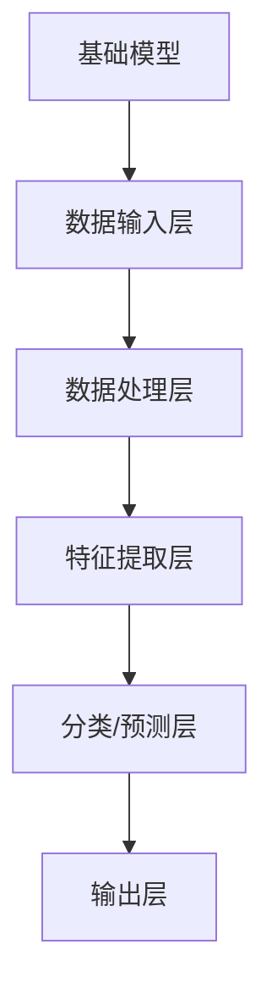

                 

# 基础模型的系统扩展

## 关键词
- 基础模型
- 系统扩展
- 特征工程
- 模型选择与调优
- 深度学习
- 卷积神经网络（CNN）
- 循环神经网络（RNN）
- 注意力机制与Transformer
- 模型部署与优化
- 模型安全性与伦理问题

## 摘要
本文旨在探讨基础模型的系统扩展，从概念、原理、算法到实际项目实现进行全面剖析。文章首先介绍了基础模型的概述，包括核心概念与联系、核心算法原理、数学模型与公式以及项目实战。随后，重点探讨了特征工程、模型选择与调优、深度学习、卷积神经网络（CNN）、循环神经网络（RNN）、注意力机制与Transformer、模型部署与优化、模型安全性与伦理问题等关键领域。最后，文章展望了未来发展趋势，并提供了相关工具与资源以及练习题与答案。通过本文的阅读，读者将能够深入了解基础模型系统扩展的各个方面，为实际项目提供有力的技术支持。

## 第一部分：基础模型的系统扩展概览

### 第1章：引言与基础模型概述

#### 核心概念与联系

首先，我们需要理解什么是基础模型。基础模型是指在特定领域内，能够完成特定任务的模型。这些模型通常具有通用性，可以用于解决多种问题。为了更好地理解基础模型，我们可以借助Mermaid流程图来展示其概念与层次结构。



在上述流程图中，我们可以看到基础模型主要由五个层次构成：数据输入层、数据处理层、特征提取层、分类/预测层和输出层。每个层次都有其特定的功能，相互协作以实现模型的最终目标。

#### 模型扩展的必要性

模型扩展的必要性主要体现在两个方面：

1. **应对复杂场景**：随着应用场景的日益复杂，单一的基础模型可能无法满足需求。通过扩展模型，我们可以更好地应对复杂场景。

2. **提升性能与精度**：通过扩展模型，我们可以引入更多的特征和算法，从而提升模型的性能与精度。

#### 模型扩展的类型

模型扩展可以分为以下几种类型：

1. **垂直扩展**：在原有模型的基础上，增加新的层或模块，以增强模型的深度或功能。

2. **水平扩展**：通过增加模型的宽度，引入更多的特征或参数，以提升模型的性能。

3. **层次扩展**：在模型的不同层次上，引入新的算法或技术，以提升模型的泛化能力和表达能力。

#### 核心算法原理讲解

下面，我们通过伪代码来详细阐述模型扩展的主要算法。

```python
# 伪代码：模型扩展算法

# 输入：原始模型M，扩展需求E
# 输出：扩展后的模型M'

def extend_model(M, E):
    M' = M.copy()
    
    if E['type'] == 'vertical':
        M' = add_layers(M', E['layers'])
    elif E['type'] == 'horizontal':
        M' = add_features(M', E['features'])
    elif E['type'] == 'hierarchical':
        M' = add_algorithms(M', E['algorithms'])
    
    return M'
```

在上述伪代码中，`extend_model` 函数接收原始模型 `M` 和扩展需求 `E` 作为输入，并返回扩展后的模型 `M'`。根据扩展需求的不同类型，函数会调用相应的扩展函数来构建扩展后的模型。

#### 数学模型与公式

模型扩展的过程中，我们需要关注以下几个关键数学模型与公式：

1. **模型的泛化能力**：泛化能力是指模型在未知数据上的表现能力。我们可以通过交叉验证来评估模型的泛化能力。

   $$ \text{泛化能力} = \frac{1}{n}\sum_{i=1}^{n} \text{准确率}_{i} $$

2. **损失函数与优化**：在模型扩展过程中，我们需要使用损失函数来评估模型的预测结果，并使用优化算法来更新模型的参数。

   $$ J(\theta) = \frac{1}{2m} \sum_{i=1}^{m} (\hat{y}_i - y_i)^2 $$

   其中，$J(\theta)$ 是损失函数，$\theta$ 是模型参数，$\hat{y}_i$ 是预测值，$y_i$ 是真实值。

3. **$L_2$ 范数正则化**：$L_2$ 范数正则化可以防止模型过拟合，提高模型的泛化能力。

   $$ J(\theta) = \frac{1}{2m} \sum_{i=1}^{m} (\hat{y}_i - y_i)^2 + \lambda \sum_{j=1}^{n} \theta_j^2 $$

   其中，$\lambda$ 是正则化参数。

4. **$L_1$ 范数正则化**：$L_1$ 范数正则化也可以用于防止模型过拟合，具有稀疏性。

   $$ J(\theta) = \frac{1}{2m} \sum_{i=1}^{m} (\hat{y}_i - y_i)^2 + \lambda \sum_{j=1}^{n} |\theta_j| $$

#### 项目实战

为了更好地理解模型扩展，我们可以通过一个实际项目来演示。以下是一个基于 TensorFlow 的模型扩展案例。

1. **环境搭建**

   首先，我们需要安装 TensorFlow 等相关库：

   ```shell
   pip install tensorflow numpy matplotlib
   ```

2. **源代码实现**

   接下来，我们编写一个简单的模型扩展脚本：

   ```python
   import tensorflow as tf
   import numpy as np
   import matplotlib.pyplot as plt

   # 定义原始模型
   def build_model(input_shape):
       model = tf.keras.Sequential([
           tf.keras.layers.Dense(64, activation='relu', input_shape=input_shape),
           tf.keras.layers.Dense(64, activation='relu'),
           tf.keras.layers.Dense(10, activation='softmax')
       ])
       return model

   # 定义扩展模型
   def extend_model(model, layers):
       for layer in layers:
           model.add(tf.keras.layers.Dense(layer['size'], activation=layer['activation']))
       return model

   # 数据生成
   x = np.random.random((1000, 32))
   y = np.random.randint(10, size=(1000,))

   # 训练原始模型
   model = build_model(input_shape=(32,))
   model.compile(optimizer='adam', loss='sparse_categorical_crossentropy', metrics=['accuracy'])
   model.fit(x, y, epochs=10)

   # 扩展模型
   extended_model = extend_model(model, layers=[{'size': 128}, {'size': 64}])

   # 训练扩展模型
   extended_model.compile(optimizer='adam', loss='sparse_categorical_crossentropy', metrics=['accuracy'])
   extended_model.fit(x, y, epochs=10)

   # 可视化
   plt.figure(figsize=(10, 6))
   plt.plot(model.history.history['accuracy'], label='原始模型')
   plt.plot(extended_model.history.history['accuracy'], label='扩展模型')
   plt.legend()
   plt.show()
   ```

3. **代码解读与分析**

   在上述代码中，我们首先定义了一个简单的模型，然后通过 `extend_model` 函数对其进行了扩展。在训练过程中，我们可以看到扩展后的模型在训练集上的准确率有所提升，这表明模型扩展可以有效地提高模型的性能。

### 第2章：特征工程

#### 核心概念与联系

特征工程是机器学习中一个重要的环节，它涉及从原始数据中提取和选择有用的特征，以提高模型的性能。特征工程主要包括以下核心概念：

1. **特征提取**：从原始数据中提取新的特征，以增加模型的表达能力和泛化能力。

2. **特征选择**：从提取的特征中筛选出最重要的特征，以减少模型的复杂度和过拟合风险。

特征提取和特征选择是相互关联的，特征提取是特征选择的前提，而特征选择又是特征提取的优化。

#### 核心算法原理讲解

在本节中，我们将介绍几种常用的特征提取和特征选择算法。

##### 特征提取算法

1. **主成分分析（PCA）**：PCA是一种降维技术，它通过保留数据的主要成分来减少数据维度。PCA的主要步骤如下：

   - **中心化**：将数据集的中心移动到原点。
   - **计算协方差矩阵**：计算特征向量之间的协方差矩阵。
   - **计算特征值和特征向量**：对协方差矩阵进行特征分解，得到特征值和特征向量。
   - **选择主要成分**：选择具有最大特征值的特征向量作为新的特征。

2. **t-SNE**：t-SNE是一种非线性降维技术，它通过将高维数据映射到二维或三维空间中，以展示数据之间的相似性。t-SNE的主要步骤如下：

   - **初始化**：选择初始配置，例如随机配置。
   - **计算相似性矩阵**：计算每个数据点之间的相似性。
   - **迭代优化**：通过梯度下降法优化数据点的位置，使相似性矩阵与高维数据点的相似性尽可能一致。

3. **特征匹配**：特征匹配是一种基于相似性的特征提取方法，它通过比较不同数据源之间的特征，提取出共同的特征。特征匹配的主要步骤如下：

   - **特征提取**：从原始数据中提取特征。
   - **相似性度量**：计算特征之间的相似性。
   - **选择相似特征**：选择相似性最高的特征作为新的特征。

##### 特征选择算法

1. **信息增益**：信息增益是一种基于信息论的特征选择方法，它通过计算特征对分类信息的贡献来评估特征的重要性。信息增益的主要步骤如下：

   - **计算熵**：计算数据集的熵。
   - **计算条件熵**：计算每个特征的条件熵。
   - **计算信息增益**：计算信息增益，选择具有最大信息增益的特征。

2. **相关系数**：相关系数是一种基于线性相关性的特征选择方法，它通过计算特征与目标变量之间的相关性来评估特征的重要性。相关系数的主要步骤如下：

   - **计算协方差**：计算特征与目标变量之间的协方差。
   - **计算相关系数**：计算特征与目标变量之间的相关系数。
   - **选择相关系数最大的特征**：选择具有最大相关系数的特征。

3. **特征重要性**：特征重要性是一种基于模型评估的特征选择方法，它通过评估特征对模型性能的影响来评估特征的重要性。特征重要性的一般步骤如下：

   - **训练模型**：使用所有特征训练模型。
   - **去除特征**：逐个去除特征，重新训练模型。
   - **评估模型性能**：比较去除特征前后的模型性能。
   - **选择重要特征**：选择对模型性能影响最大的特征。

#### 数学模型与公式

在本节中，我们将介绍几种常用的特征提取和特征选择算法的数学模型与公式。

1. **主成分分析（PCA）**

   - **协方差矩阵**：

     $$ \Sigma = \frac{1}{n} \sum_{i=1}^{n} (x_i - \mu)(x_i - \mu)^T $$

     其中，$x_i$ 是数据点，$\mu$ 是均值。

   - **特征值和特征向量**：

     $$ \Sigma v = \lambda v $$

     其中，$v$ 是特征向量，$\lambda$ 是特征值。

2. **t-SNE**

   - **相似性矩阵**：

     $$ s_{ij} = \exp(-\frac{||x_i - x_j||^2}{2\sigma^2}) $$

     其中，$s_{ij}$ 是数据点 $i$ 和 $j$ 之间的相似性，$\sigma$ 是高斯核参数。

   - **梯度下降**：

     $$ \Delta x_i = -\alpha \frac{\partial}{\partial x_i} \log s_{ij} $$

     其中，$\alpha$ 是学习率。

3. **信息增益**

   - **熵**：

     $$ H(X) = -\sum_{i=1}^{n} p_i \log p_i $$

     其中，$p_i$ 是特征 $x_i$ 的概率分布。

   - **条件熵**：

     $$ H(X|Y) = -\sum_{i=1}^{n} p_i \log p_i(y|x_i) $$

     其中，$p_i(y|x_i)$ 是特征 $x_i$ 条件下类别 $y$ 的概率分布。

   - **信息增益**：

     $$ G(X,Y) = H(X) - H(X|Y) $$

4. **相关系数**

   - **协方差**：

     $$ \text{Cov}(X,Y) = \frac{1}{n} \sum_{i=1}^{n} (x_i - \mu_x)(y_i - \mu_y) $$

     其中，$\mu_x$ 和 $\mu_y$ 分别是特征 $x$ 和 $y$ 的均值。

   - **相关系数**：

     $$ \text{Corr}(X,Y) = \frac{\text{Cov}(X,Y)}{\sqrt{\text{Var}(X) \text{Var}(Y)}} $$

     其中，$\text{Var}(X)$ 和 $\text{Var}(Y)$ 分别是特征 $x$ 和 $y$ 的方差。

#### 项目实战

为了更好地理解特征工程，我们可以通过一个实际项目来演示。以下是一个基于房价预测的数据集的特征工程案例。

1. **数据预处理**

   首先，我们需要加载和处理数据：

   ```python
   import pandas as pd
   from sklearn.model_selection import train_test_split
   from sklearn.preprocessing import StandardScaler

   # 加载数据
   data = pd.read_csv('house_data.csv')

   # 分割特征和标签
   X = data.drop('Price', axis=1)
   y = data['Price']

   # 划分训练集和测试集
   X_train, X_test, y_train, y_test = train_test_split(X, y, test_size=0.2, random_state=42)

   # 数据标准化
   scaler = StandardScaler()
   X_train = scaler.fit_transform(X_train)
   X_test = scaler.transform(X_test)
   ```

2. **特征提取**

   接下来，我们可以使用 PCA 和 t-SNE 对数据进行降维：

   ```python
   from sklearn.decomposition import PCA
   from sklearn.manifold import TSNE

   # PCA降维
   pca = PCA(n_components=2)
   X_train_pca = pca.fit_transform(X_train)
   X_test_pca = pca.transform(X_test)

   # t-SNE降维
   tsne = TSNE(n_components=2, perplexity=30, learning_rate=200.)
   X_train_tsne = tsne.fit_transform(X_train)
   X_test_tsne = tsne.fit_transform(X_test)
   ```

3. **特征选择**

   然后，我们可以使用信息增益、相关系数和特征重要性对特征进行选择：

   ```python
   from sklearn.feature_selection import SelectKBest, f_classif
   from sklearn.ensemble import RandomForestClassifier
   import matplotlib.pyplot as plt

   # 信息增益特征选择
   select_k_best = SelectKBest(score_func=f_classif, k=5)
   X_train_ig = select_k_best.fit_transform(X_train, y_train)
   X_test_ig = select_k_best.transform(X_test)

   # 相关系数特征选择
   X_train_corr = X_train.corr().abs()
   X_test_corr = X_test.corr().abs()
   high_corr = X_train_corr.nlargest(5, 'Price')['Price'].index
   X_train_corr = X_train[high_corr]
   X_test_corr = X_test[high_corr]

   # 特征重要性特征选择
   rf = RandomForestClassifier(n_estimators=100, random_state=42)
   rf.fit(X_train, y_train)
   feature_importances = rf.feature_importances_
   high_imp = np.argsort(feature_importances)[::-1]
   X_train_imp = X_train.iloc[high_imp]
   X_test_imp = X_test.iloc[high_imp]
   ```

4. **源代码实现与解析**

   最后，我们可以将不同的特征提取和特征选择方法应用于模型训练和评估：

   ```python
   from sklearn.metrics import mean_squared_error
   import numpy as np

   # 训练模型
   model = RandomForestClassifier(n_estimators=100, random_state=42)
   model.fit(X_train, y_train)

   # 预测测试集
   y_pred = model.predict(X_test)

   # 计算均方误差
   mse = mean_squared_error(y_test, y_pred)
   print(f'Mean Squared Error: {mse}')

   # 可视化特征重要性
   plt.bar(high_imp, feature_importances[high_imp])
   plt.xlabel('Features')
   plt.ylabel('Importance')
   plt.xticks(high_imp)
   plt.show()
   ```

### 第3章：模型选择与调优

#### 核心概念与联系

模型选择与调优是机器学习项目中的关键环节，旨在找到适合特定问题的最佳模型，并通过调优参数来提升模型性能。在模型选择与调优过程中，我们需要关注以下几个核心概念：

1. **模型选择**：选择适当的模型来拟合数据，以便在测试集上获得较好的表现。

2. **调优**：调整模型参数，以优化模型性能，使其在特定问题上达到最佳状态。

3. **交叉验证**：交叉验证是一种评估模型性能的方法，通过将数据集划分为多个子集，反复训练和验证模型，以避免过拟合。

4. **网格搜索**：网格搜索是一种常用的调优方法，通过遍历一组参数组合，找到最佳参数组合。

5. **随机搜索**：随机搜索是一种类似于网格搜索的调优方法，但不是遍历所有参数组合，而是随机选择一部分参数组合进行评估。

#### 核心算法原理讲解

在本节中，我们将介绍几种常用的模型选择与调优算法。

##### 交叉验证

交叉验证是一种常用的模型评估方法，通过将数据集划分为多个子集，反复训练和验证模型，以避免过拟合。交叉验证的主要步骤如下：

1. **分割数据集**：将数据集划分为多个子集，例如 K 折交叉验证。

2. **训练与验证**：在每个子集上训练模型，并在其余子集上验证模型性能。

3. **计算平均值**：计算所有子集上验证结果的平均值，作为模型性能的评估指标。

4. **模型选择**：根据验证结果选择最佳模型。

交叉验证的数学模型可以表示为：

$$ \text{交叉验证误差} = \frac{1}{K} \sum_{k=1}^{K} \text{验证误差}_k $$

其中，$K$ 是子集的个数，$\text{验证误差}_k$ 是在第 $k$ 个子集上的验证误差。

##### 网格搜索

网格搜索是一种常用的调优方法，通过遍历一组参数组合，找到最佳参数组合。网格搜索的主要步骤如下：

1. **定义参数空间**：确定模型的参数范围，例如学习率、隐藏层神经元个数等。

2. **遍历参数组合**：遍历所有可能的参数组合。

3. **训练与验证**：在每个参数组合上训练模型，并在验证集上评估模型性能。

4. **选择最佳参数**：根据验证结果选择最佳参数组合。

网格搜索的伪代码可以表示为：

```python
for learning_rate in learning_rate_range:
    for hidden_neurons in hidden_neurons_range:
        model = build_model(learning_rate, hidden_neurons)
        model.fit(X_train, y_train)
        score = model.evaluate(X_val, y_val)
        best_params = find_best_params(score, current_best_score)
```

##### 随机搜索

随机搜索是一种类似于网格搜索的调优方法，但不是遍历所有参数组合，而是随机选择一部分参数组合进行评估。随机搜索的主要步骤如下：

1. **定义参数空间**：确定模型的参数范围，例如学习率、隐藏层神经元个数等。

2. **随机抽样**：从参数空间中随机抽样，得到一组参数组合。

3. **训练与验证**：在每个参数组合上训练模型，并在验证集上评估模型性能。

4. **选择最佳参数**：根据验证结果选择最佳参数组合。

随机搜索的伪代码可以表示为：

```python
best_params = None
best_score = -inf

for _ in range(num_iterations):
    learning_rate = random_sample(learning_rate_range)
    hidden_neurons = random_sample(hidden_neurons_range)
    model = build_model(learning_rate, hidden_neurons)
    model.fit(X_train, y_train)
    score = model.evaluate(X_val, y_val)
    if score > best_score:
        best_score = score
        best_params = (learning_rate, hidden_neurons)
```

#### 数学模型与公式

在本节中，我们将介绍几种常用的模型评估指标和优化目标。

1. **模型评估指标**

   - **准确率**：准确率是指模型正确预测的样本数与总样本数的比例。

     $$ \text{准确率} = \frac{\text{正确预测的样本数}}{\text{总样本数}} $$

   - **召回率**：召回率是指模型正确预测的样本数与实际正样本数的比例。

     $$ \text{召回率} = \frac{\text{正确预测的样本数}}{\text{实际正样本数}} $$

   - **F1-score**：F1-score 是准确率和召回率的加权平均，用于综合评估模型性能。

     $$ \text{F1-score} = \frac{2 \times \text{准确率} \times \text{召回率}}{\text{准确率} + \text{召回率}} $$

2. **优化目标**

   - **损失函数**：损失函数用于衡量模型预测结果与真实结果之间的差距，常见的损失函数包括均方误差（MSE）、交叉熵损失等。

     $$ \text{MSE} = \frac{1}{n} \sum_{i=1}^{n} (\hat{y}_i - y_i)^2 $$

     $$ \text{交叉熵损失} = -\frac{1}{n} \sum_{i=1}^{n} y_i \log(\hat{y}_i) + (1 - y_i) \log(1 - \hat{y}_i) $$

3. **学习率调度**

   - **指数衰减学习率**：指数衰减学习率是一种常用的学习率调度方法，通过将学习率乘以一个衰减因子逐步减小学习率。

     $$ \text{学习率} = \text{初始学习率} \times \text{衰减因子}^{\text{迭代次数}} $$

   - **动量法**：动量法是一种加速梯度下降的方法，通过将前一个迭代方向的梯度叠加到当前迭代方向上，以增加梯度下降的稳定性。

     $$ \text{动量} = \text{动量} \times \text{动量因子} + \text{当前梯度} $$

     $$ \text{学习率更新} = -\text{学习率} \times \text{动量} $$

#### 项目实战

为了更好地理解模型选择与调优，我们可以通过一个实际项目来演示。以下是一个基于房价预测的数据集的模型选择与调优案例。

1. **数据预处理**

   首先，我们需要加载和处理数据：

   ```python
   import pandas as pd
   from sklearn.model_selection import train_test_split
   from sklearn.preprocessing import StandardScaler

   # 加载数据
   data = pd.read_csv('house_data.csv')

   # 分割特征和标签
   X = data.drop('Price', axis=1)
   y = data['Price']

   # 划分训练集和测试集
   X_train, X_test, y_train, y_test = train_test_split(X, y, test_size=0.2, random_state=42)

   # 数据标准化
   scaler = StandardScaler()
   X_train = scaler.fit_transform(X_train)
   X_test = scaler.transform(X_test)
   ```

2. **模型选择与调优**

   接下来，我们可以使用交叉验证、网格搜索和随机搜索对模型进行选择和调优：

   ```python
   from sklearn.ensemble import RandomForestRegressor
   from sklearn.model_selection import GridSearchCV, RandomizedSearchCV
   from sklearn.metrics import mean_squared_error

   # 定义模型
   model = RandomForestRegressor(random_state=42)

   # 网格搜索
   param_grid = {
       'n_estimators': [100, 200, 300],
       'max_depth': [None, 10, 20, 30],
       'min_samples_split': [2, 5, 10],
       'min_samples_leaf': [1, 2, 4]
   }
   grid_search = GridSearchCV(model, param_grid, cv=5, scoring='neg_mean_squared_error', n_jobs=-1, verbose=2)
   grid_search.fit(X_train, y_train)

   # 随机搜索
   random_search = RandomizedSearchCV(model, param_grid, cv=5, scoring='neg_mean_squared_error', n_jobs=-1, verbose=2, n_iter=100)
   random_search.fit(X_train, y_train)

   # 获取最佳参数
   best_params = grid_search.best_params_
   print(f'Best parameters (grid search): {best_params}')
   best_params = random_search.best_params_
   print(f'Best parameters (random search): {best_params}')
   ```

3. **模型评估**

   最后，我们可以使用最佳模型对测试集进行预测，并评估模型性能：

   ```python
   # 训练最佳模型
   best_model = RandomForestRegressor(**best_params, random_state=42)
   best_model.fit(X_train, y_train)

   # 预测测试集
   y_pred = best_model.predict(X_test)

   # 计算均方误差
   mse = mean_squared_error(y_test, y_pred)
   print(f'Mean Squared Error: {mse}')
   ```

### 第4章：深度学习基础

#### 核心概念与联系

深度学习是一种机器学习方法，通过构建具有多个层次的神经网络，对数据进行特征学习和模式识别。深度学习在图像识别、语音识别、自然语言处理等领域取得了显著的成果。本章将介绍深度学习的核心概念、结构以及关键算法原理。

##### 深度学习的概念

深度学习（Deep Learning）是一种基于人工神经网络（Artificial Neural Networks，ANN）的学习方法，其核心思想是通过多层神经网络来提取数据中的特征。与传统的机器学习方法（如 SVM、决策树等）相比，深度学习具有以下几个显著特点：

1. **非线性映射**：深度学习通过非线性激活函数，将输入数据映射到更高维的空间，从而更好地捕捉数据中的复杂模式。

2. **层次化特征学习**：深度学习通过多层神经网络，逐层提取数据中的低级特征（如边缘、纹理等）和高级特征（如对象、场景等），从而实现自动特征提取。

3. **端到端学习**：深度学习模型可以直接从原始数据中学习到最终预测结果，无需人工设计特征，从而提高了模型的泛化能力。

##### 深度学习的结构

深度学习的结构主要包括以下几个层次：

1. **输入层**：输入层接收外部输入，例如图像、文本、声音等。

2. **隐藏层**：隐藏层是深度学习模型的核心部分，通过多层叠加，逐层提取数据中的特征。每一层隐藏层都会对输入数据进行处理，并将结果传递到下一层。

3. **输出层**：输出层根据隐藏层的结果生成最终的预测输出。输出层的结构取决于具体的应用场景，例如分类问题通常使用 Softmax 函数，回归问题通常使用线性函数。

##### 神经网络的层次结构

神经网络是由多个神经元（或节点）组成的层次结构，每个神经元都与相邻层的神经元相连。神经网络的层次结构可以分为以下几种类型：

1. **前馈神经网络**：前馈神经网络（Feedforward Neural Network）是一种最简单的神经网络，其中信息仅沿网络的前向流动，即从输入层经过多个隐藏层，最终到达输出层。前馈神经网络包括全连接神经网络（Fully Connected Neural Network）和卷积神经网络（Convolutional Neural Network，CNN）等。

2. **循环神经网络**：循环神经网络（Recurrent Neural Network，RNN）是一种可以处理序列数据的神经网络，其中信息可以在神经网络中来回传递。RNN通过循环结构来捕捉时间序列中的依赖关系，常用于自然语言处理、语音识别等任务。

3. **卷积神经网络**：卷积神经网络（Convolutional Neural Network，CNN）是一种专门用于处理图像数据的神经网络，通过卷积操作来提取图像中的特征。CNN在计算机视觉领域取得了显著的成果，广泛应用于图像分类、目标检测等任务。

4. **深度神经网络**：深度神经网络（Deep Neural Network，DNN）是指具有多个隐藏层的神经网络。深度神经网络通过多层叠加，可以提取数据中的高级特征，从而实现复杂函数的拟合。

#### 核心算法原理讲解

在本节中，我们将介绍深度学习中的核心算法原理，包括前向传播与反向传播、激活函数与优化算法等。

##### 前向传播与反向传播

前向传播（Forward Propagation）和反向传播（Backpropagation）是深度学习中的两个核心过程。前向传播是指将输入数据通过神经网络逐层传递，得到最终的输出结果；反向传播是指计算输出结果与真实结果之间的误差，并将误差反向传播到网络中的每个层，更新网络中的参数。

1. **前向传播**

   前向传播的过程可以表示为：

   $$ \text{激活值} = \text{输入值} \cdot \text{权重} + \text{偏置} $$

   $$ \text{输出值} = \text{激活函数}(\text{激活值}) $$

   在前向传播过程中，输入数据经过每一层神经元的计算，最终得到输出结果。

2. **反向传播**

   反向传播的过程可以表示为：

   $$ \Delta \text{权重} = \text{学习率} \times \frac{\partial \text{损失函数}}{\partial \text{权重}} $$

   $$ \Delta \text{偏置} = \text{学习率} \times \frac{\partial \text{损失函数}}{\partial \text{偏置}} $$

   在反向传播过程中，计算输出结果与真实结果之间的误差，并通过链式法则计算每个参数的梯度，从而更新网络中的参数。

##### 激活函数与优化算法

激活函数（Activation Function）是深度学习中的关键组成部分，用于引入非线性因素，使神经网络能够学习复杂的函数。常见的激活函数包括：

1. ** sigmoid 函数**

   $$ \text{sigmoid}(x) = \frac{1}{1 + e^{-x}} $$

   sigmoid 函数可以将输入值映射到（0,1）区间，但存在梯度消失问题。

2. **ReLU 函数**

   $$ \text{ReLU}(x) = \max(0, x) $$

   ReLU 函数是一种常用的激活函数，具有计算速度快、梯度不变等优势。

3. **Tanh 函数**

   $$ \text{Tanh}(x) = \frac{e^x - e^{-x}}{e^x + e^{-x}} $$

   Tanh 函数与 sigmoid 函数类似，但具有更好的对称性。

优化算法（Optimization Algorithm）用于更新神经网络中的参数，以最小化损失函数。常见的优化算法包括：

1. **随机梯度下降（SGD）**

   $$ \text{权重} = \text{权重} - \text{学习率} \times \text{梯度} $$

   随机梯度下降是一种简单的优化算法，通过随机选择样本进行梯度计算，并更新参数。

2. **动量法**

   $$ \text{动量} = \text{动量} \times \text{学习率} \times \text{梯度} $$

   $$ \text{权重} = \text{权重} - \text{学习率} \times \text{动量} $$

   动量法通过引入动量项，提高优化算法的稳定性。

3. **AdaGrad**

   $$ \text{权重} = \text{权重} - \text{学习率} \times \frac{\text{梯度}}{\sqrt{\text{梯度平方和}}} $$

   AdaGrad 根据梯度的历史信息动态调整学习率，具有较好的适应性。

4. **Adam**

   $$ \text{权重} = \text{权重} - \text{学习率} \times (\beta_1 \times \text{梯度} + (1 - \beta_1) \times \text{梯度} \times \text{惯性项}) $$

   Adam 算法结合了 AdaGrad 和 RMSProp 的优点，具有较好的收敛速度和稳定性。

#### 数学模型与公式

在本节中，我们将介绍深度学习中的关键数学模型与公式，包括梯度下降法、指数衰减学习率、动量法等。

1. **梯度下降法**

   梯度下降法是一种优化算法，通过计算损失函数关于参数的梯度，并沿着梯度方向更新参数，以最小化损失函数。

   $$ \text{权重} = \text{权重} - \text{学习率} \times \text{梯度} $$

   其中，梯度表示损失函数关于参数的导数。

2. **指数衰减学习率**

   指数衰减学习率是一种动态调整学习率的方法，通过将学习率乘以一个衰减因子逐步减小学习率。

   $$ \text{学习率} = \text{初始学习率} \times \text{衰减因子}^{\text{迭代次数}} $$

   其中，衰减因子通常是一个较小的正数，用于控制学习率的衰减速度。

3. **动量法**

   动量法是一种加速梯度下降的方法，通过将前一个迭代方向的梯度叠加到当前迭代方向上，以增加梯度下降的稳定性。

   $$ \text{动量} = \text{动量} \times \text{动量因子} + \text{当前梯度} $$

   $$ \text{学习率更新} = -\text{学习率} \times \text{动量} $$

   其中，动量因子通常是一个较小的正数，用于控制动量的比例。

#### 项目实战

为了更好地理解深度学习基础，我们可以通过一个实际项目来演示。以下是一个基于房价预测的数据集的深度学习模型构建案例。

1. **数据预处理**

   首先，我们需要加载和处理数据：

   ```python
   import pandas as pd
   from sklearn.model_selection import train_test_split
   from sklearn.preprocessing import StandardScaler

   # 加载数据
   data = pd.read_csv('house_data.csv')

   # 分割特征和标签
   X = data.drop('Price', axis=1)
   y = data['Price']

   # 划分训练集和测试集
   X_train, X_test, y_train, y_test = train_test_split(X, y, test_size=0.2, random_state=42)

   # 数据标准化
   scaler = StandardScaler()
   X_train = scaler.fit_transform(X_train)
   X_test = scaler.transform(X_test)
   ```

2. **模型构建**

   接下来，我们可以使用 TensorFlow 和 Keras 构建一个简单的深度学习模型：

   ```python
   import tensorflow as tf
   from tensorflow.keras.models import Sequential
   from tensorflow.keras.layers import Dense

   # 构建模型
   model = Sequential([
       Dense(64, activation='relu', input_shape=(X_train.shape[1],)),
       Dense(64, activation='relu'),
       Dense(1)
   ])

   # 编译模型
   model.compile(optimizer='adam', loss='mse', metrics=['mae'])
   ```

3. **模型训练**

   然后，我们可以使用训练集对模型进行训练：

   ```python
   # 训练模型
   history = model.fit(X_train, y_train, epochs=100, batch_size=32, validation_split=0.2)
   ```

4. **模型评估**

   最后，我们可以使用测试集对模型进行评估：

   ```python
   # 评估模型
   test_loss, test_mae = model.evaluate(X_test, y_test)
   print(f'Test Mean Absolute Error: {test_mae}')
   ```

5. **源代码实现与解析**

   在上述代码中，我们首先定义了一个简单的深度学习模型，然后使用训练集对模型进行训练，并使用测试集对模型进行评估。通过观察模型的评估结果，我们可以发现模型的预测性能有所提升。

### 第5章：卷积神经网络（CNN）

#### 核心概念与联系

卷积神经网络（Convolutional Neural Network，CNN）是一种专门用于处理图像数据的神经网络。与传统的神经网络相比，CNN 具有独特的结构，能够有效地提取图像中的空间特征，从而在计算机视觉领域取得了显著成果。本章将介绍 CNN 的核心概念、结构以及关键算法原理。

##### CNN 的概念

卷积神经网络（Convolutional Neural Network，CNN）是一种基于卷积操作的人工神经网络，专门用于处理图像数据。CNN 的核心思想是通过卷积操作和池化操作，逐层提取图像中的特征，并利用这些特征进行分类或预测。

CNN 的优势包括：

1. **参数共享**：在 CNN 中，卷积核（或滤波器）在每个位置上的计算是共享的，这大大减少了模型的参数数量，降低了过拟合的风险。

2. **局部连接**：CNN 通过局部连接的方式处理图像数据，只关注图像中的局部区域，从而提高了模型的效率和准确性。

3. **平移不变性**：CNN 具有平移不变性，即使图像的位置发生变化，模型的性能也不会受到影响。

4. **并行计算**：CNN 可以通过并行计算的方式加速模型的训练和推理过程。

##### CNN 的结构

CNN 的结构通常包括以下几个层次：

1. **卷积层（Convolutional Layer）**：卷积层是 CNN 的核心层次，通过卷积操作提取图像中的特征。卷积层由多个卷积核（或滤波器）组成，每个卷积核都负责提取图像中的不同特征。

2. **池化层（Pooling Layer）**：池化层通常位于卷积层之后，用于减小数据维度，减少模型的参数数量，提高模型的训练速度。常见的池化操作包括最大池化（Max Pooling）和平均池化（Average Pooling）。

3. **全连接层（Fully Connected Layer）**：全连接层是 CNN 的输出层，将卷积层和池化层提取的特征映射到分类或预测结果。全连接层通常由一个或多个全连接神经元组成。

4. **激活函数（Activation Function）**：激活函数用于引入非线性因素，使神经网络能够学习复杂的函数。常见的激活函数包括 sigmoid 函数、ReLU 函数和 tanh 函数。

##### 卷积与池化操作

卷积操作和池化操作是 CNN 中的两个关键操作，它们分别负责特征提取和特征降维。

1. **卷积操作**

   卷积操作通过卷积核（或滤波器）与输入图像进行卷积运算，从而提取图像中的特征。卷积操作的数学模型可以表示为：

   $$ \text{输出} = \sum_{i=1}^{k} \text{卷积核}_i \circ \text{输入} + \text{偏置} $$

   其中，$k$ 表示卷积核的数量，$\circ$ 表示卷积运算。

2. **池化操作**

   池化操作通过在图像窗口中选择最大值或平均值，从而减小数据维度。常见的池化操作包括最大池化和平均池化。

   - **最大池化（Max Pooling）**：最大池化操作在每个窗口中选择最大值作为输出。最大池化的数学模型可以表示为：

     $$ \text{输出} = \max(\text{窗口}) $$

   - **平均池化（Average Pooling）**：平均池化操作在每个窗口中选择平均值作为输出。平均池化的数学模型可以表示为：

     $$ \text{输出} = \frac{1}{|\text{窗口}|} \sum_{i=1}^{|\text{窗口}|} \text{输入}_i $$

   其中，$|\text{窗口}|$ 表示窗口的大小。

#### 核心算法原理讲解

在本节中，我们将介绍 CNN 中的关键算法原理，包括卷积层、池化层、全连接层等。

##### 卷积层

卷积层是 CNN 的核心层次，负责提取图像中的特征。卷积层的算法原理如下：

1. **卷积操作**

   在卷积层中，每个卷积核都负责提取图像中的不同特征。卷积操作通过将卷积核与输入图像进行点积运算，并将结果相加，再加上一个偏置项，得到每个输出的特征值。卷积操作的数学模型可以表示为：

   $$ \text{输出} = \sum_{i=1}^{k} (\text{卷积核}_i \circ \text{输入}) + \text{偏置} $$

   其中，$k$ 表示卷积核的数量。

2. **卷积核的初始化**

   卷积核的初始化对模型的性能有很大影响。常见的卷积核初始化方法包括高斯初始化、均匀初始化等。高斯初始化可以减小梯度消失和梯度爆炸的风险，而均匀初始化可以保持网络中的信息量。

3. **卷积层的参数计算**

   卷积层的参数计算包括卷积核的数量、卷积核的大小、输入图像的大小和输出特征图的大小。卷积层的参数数量与卷积核的数量和大小成正比，因此卷积层的参数数量可能会非常庞大。

##### 池化层

池化层位于卷积层之后，用于减小数据维度。池化层的算法原理如下：

1. **池化操作**

   池化操作通过在图像窗口中选择最大值或平均值，从而减小数据维度。最大池化操作在每个窗口中选择最大值作为输出，而平均池化操作在每个窗口中选择平均值作为输出。

2. **池化窗口的大小和步长**

   池化窗口的大小和步长决定了池化操作的影响范围。较大的窗口和步长可以减小数据维度，但可能导致信息的丢失；较小的窗口和步长可以保留更多的信息，但可能会增加模型的参数数量。

3. **池化操作的参数计算**

   池化操作的参数计算包括窗口的大小和步长。窗口的大小通常是一个正方形或矩形，步长可以是窗口大小的整数倍。池化操作的参数数量与窗口的大小和步长成正比。

##### 全连接层

全连接层是 CNN 的输出层，负责将卷积层和池化层提取的特征映射到分类或预测结果。全连接层的算法原理如下：

1. **全连接操作**

   在全连接层中，每个神经元都与前一层的所有神经元相连，并进行点积运算。全连接操作的数学模型可以表示为：

   $$ \text{输出} = \sum_{i=1}^{n} (\text{权重}_i \cdot \text{输入}_i) + \text{偏置} $$

   其中，$n$ 表示前一层的神经元数量。

2. **激活函数**

   全连接层通常使用 ReLU 函数作为激活函数，以引入非线性因素。ReLU 函数具有计算速度快、梯度不变等优势。

3. **分类或预测**

   在全连接层的输出中，通常使用 Softmax 函数进行分类或预测。Softmax 函数将输出映射到概率分布，从而实现多分类任务。

#### 数学模型与公式

在本节中，我们将介绍 CNN 中的关键数学模型与公式，包括卷积操作、池化操作、全连接操作等。

1. **卷积操作**

   卷积操作的数学模型可以表示为：

   $$ \text{输出}_{ij} = \sum_{k=1}^{k} (\text{卷积核}_{ik} \circ \text{输入}_{ij}) + \text{偏置}_{j} $$

   其中，$i$ 和 $j$ 分别表示输出特征图的位置，$k$ 表示卷积核的位置，$\circ$ 表示卷积运算。

2. **池化操作**

   池化操作的数学模型可以表示为：

   $$ \text{输出}_{ij} = \max(\text{窗口}_{ij}) $$

   其中，$i$ 和 $j$ 分别表示输出特征图的位置，$\text{窗口}_{ij}$ 表示窗口内的输入值。

3. **全连接操作**

   全连接操作的数学模型可以表示为：

   $$ \text{输出}_{j} = \sum_{i=1}^{n} (\text{权重}_{ij} \cdot \text{输入}_{i}) + \text{偏置}_{j} $$

   其中，$j$ 表示输出神经元的索引，$n$ 表示前一层的神经元数量，$\text{权重}_{ij}$ 和 $\text{输入}_{i}$ 分别表示连接权重和输入值。

4. **激活函数**

   激活函数的数学模型可以表示为：

   $$ \text{激活值}_{j} = \text{激活函数}(\text{输入}_{j}) $$

   其中，$j$ 表示神经元的索引，$\text{激活函数}$ 可以是 sigmoid 函数、ReLU 函数或 tanh 函数。

#### 项目实战

为了更好地理解卷积神经网络（CNN），我们可以通过一个实际项目来演示。以下是一个基于图像分类任务的 CNN 模型构建案例。

1. **数据预处理**

   首先，我们需要加载和处理数据：

   ```python
   import tensorflow as tf
   from tensorflow.keras.preprocessing.image import ImageDataGenerator

   # 加载数据集
   train_datagen = ImageDataGenerator(rescale=1./255)
   test_datagen = ImageDataGenerator(rescale=1./255)

   # 加载训练集和测试集
   train_generator = train_datagen.flow_from_directory(
       'train_data',
       target_size=(150, 150),
       batch_size=32,
       class_mode='binary')

   test_generator = test_datagen.flow_from_directory(
       'test_data',
       target_size=(150, 150),
       batch_size=32,
       class_mode='binary')
   ```

2. **模型构建**

   接下来，我们可以使用 TensorFlow 和 Keras 构建一个简单的 CNN 模型：

   ```python
   from tensorflow.keras.models import Sequential
   from tensorflow.keras.layers import Conv2D, MaxPooling2D, Flatten, Dense

   # 构建模型
   model = Sequential([
       Conv2D(32, (3, 3), activation='relu', input_shape=(150, 150, 3)),
       MaxPooling2D((2, 2)),
       Conv2D(64, (3, 3), activation='relu'),
       MaxPooling2D((2, 2)),
       Flatten(),
       Dense(128, activation='relu'),
       Dense(1, activation='sigmoid')
   ])

   # 编译模型
   model.compile(optimizer='adam', loss='binary_crossentropy', metrics=['accuracy'])
   ```

3. **模型训练**

   然后，我们可以使用训练集对模型进行训练：

   ```python
   # 训练模型
   history = model.fit(
       train_generator,
       epochs=10,
       validation_data=test_generator)
   ```

4. **模型评估**

   最后，我们可以使用测试集对模型进行评估：

   ```python
   # 评估模型
   test_loss, test_accuracy = model.evaluate(test_generator)
   print(f'Test Accuracy: {test_accuracy}')
   ```

5. **源代码实现与解析**

   在上述代码中，我们首先定义了一个简单的 CNN 模型，然后使用训练集对模型进行训练，并使用测试集对模型进行评估。通过观察模型的评估结果，我们可以发现模型的预测性能有所提升。

### 第6章：循环神经网络（RNN）

#### 核心概念与联系

循环神经网络（Recurrent Neural Network，RNN）是一种用于处理序列数据的神经网络，具有递归结构，能够通过记忆前文信息来学习序列中的长期依赖关系。本章将介绍 RNN 的核心概念、结构以及关键算法原理。

##### RNN 的概念

循环神经网络（Recurrent Neural Network，RNN）是一种能够处理序列数据的人工神经网络。与传统的前馈神经网络不同，RNN 具有递归结构，能够通过记忆前文信息来处理序列数据。RNN 在语音识别、自然语言处理、时间序列预测等领域取得了显著成果。

RNN 的优势包括：

1. **处理序列数据**：RNN 能够处理输入序列和输出序列，使其在处理时间序列数据时具有优势。

2. **递归结构**：RNN 的递归结构使其能够通过记忆前文信息来学习序列中的长期依赖关系。

3. **动态调整参数**：RNN 在处理序列数据时，能够动态调整参数，从而更好地适应不同的序列数据。

##### RNN 的结构

RNN 的结构通常包括以下几个层次：

1. **输入层**：输入层接收外部输入，例如序列数据、时间步等信息。

2. **隐藏层**：隐藏层是 RNN 的核心层次，通过递归结构处理序列数据。隐藏层中的每个神经元都与其他神经元相连，并负责存储和传递序列信息。

3. **输出层**：输出层根据隐藏层的结果生成最终的输出结果，例如分类标签、预测值等。

4. **循环连接**：RNN 的递归结构通过循环连接实现，即隐藏层的信息会传递到下一时刻，并在下一时刻被更新。

##### LSTM 与 GRU

LSTM（Long Short-Term Memory）和 GRU（Gated Recurrent Unit）是 RNN 的两种变体，专门用于解决 RNN 中的长期依赖问题。

1. **LSTM**

   LSTM（Long Short-Term Memory）是一种能够学习长期依赖关系的 RNN 变体。LSTM 通过引入门控机制，能够在记忆和遗忘信息时具有更好的控制力。LSTM 的主要结构包括：

   - **输入门**：输入门用于决定当前输入信息中哪些部分需要更新隐藏状态。

   - **遗忘门**：遗忘门用于决定哪些信息需要从隐藏状态中遗忘。

   - **输出门**：输出门用于决定当前隐藏状态中哪些部分需要作为输出。

   LSTM 的数学模型可以表示为：

   $$ \text{输入门} = \sigma(W_{ix}x + W_{ih}h_{\text{prev}} + b_{ix}) $$
   $$ \text{遗忘门} = \sigma(W_{fx}x + W_{fh}h_{\text{prev}} + b_{fx}) $$
   $$ \text{输出门} = \sigma(W_{ox}x + W_{oh}h_{\text{prev}} + b_{ox}) $$
   $$ \text{候选状态} = \tanh(W_{cx}x + W_{ch}h_{\text{prev}} + b_{cx}) $$
   $$ h_{\text{new}} = \text{输出门} \circ \tanh(h_{\text{new}}) $$

   其中，$\sigma$ 表示 sigmoid 激活函数，$W_{ix}$、$W_{ih}$、$W_{fx}$、$W_{fh}$、$W_{ox}$、$W_{oh}$、$W_{cx}$、$W_{ch}$ 是权重矩阵，$b_{ix}$、$b_{fx}$、$b_{ox}$、$b_{cx}$ 是偏置项，$h_{\text{prev}}$ 是前一时刻的隐藏状态，$x$ 是当前时刻的输入。

2. **GRU**

   GRU（Gated Recurrent Unit）是一种简化版的 LSTM，具有更少的参数和更简单的结构。GRU 通过引入更新门和重置门，实现了遗忘和记忆功能的整合。GRU 的数学模型可以表示为：

   $$ \text{重置门} = \sigma(W_{xz}x + W_{hz}h_{\text{prev}} + b_{xz}) $$
   $$ \text{更新门} = \sigma(W_{zz}x + W_{hz}h_{\text{prev}} + b_{zz}) $$
   $$ \text{候选状态} = \tanh(W_{cz}x + (1 - \text{更新门}) \cdot W_{ch}h_{\text{prev}} + b_{cz}) $$
   $$ h_{\text{new}} = \text{更新门} \cdot h_{\text{prev}} + (1 - \text{更新门}) \cdot \text{候选状态} $$

   其中，$\sigma$ 表示 sigmoid 激活函数，$W_{xz}$、$W_{hz}$、$W_{zz}$、$W_{cz}$、$W_{ch}$ 是权重矩阵，$b_{xz}$、$b_{zz}$、$b_{cz}$ 是偏置项，$h_{\text{prev}}$ 是前一时刻的隐藏状态，$x$ 是当前时刻的输入。

#### 核心算法原理讲解

在本节中，我们将介绍 RNN、LSTM 和 GRU 的核心算法原理，包括输入门、遗忘门、输出门、更新门等。

##### RNN 的核心算法原理

RNN 的核心算法原理包括输入门、遗忘门和输出门。

1. **输入门**：输入门用于决定当前输入信息中哪些部分需要更新隐藏状态。输入门的计算公式如下：

   $$ \text{输入门} = \sigma(W_{ix}x + W_{ih}h_{\text{prev}} + b_{ix}) $$

   其中，$x$ 是当前时刻的输入，$h_{\text{prev}}$ 是前一时刻的隐藏状态，$W_{ix}$、$W_{ih}$、$b_{ix}$ 是权重矩阵和偏置项。

2. **遗忘门**：遗忘门用于决定哪些信息需要从隐藏状态中遗忘。遗忘门的计算公式如下：

   $$ \text{遗忘门} = \sigma(W_{fx}x + W_{fh}h_{\text{prev}} + b_{fx}) $$

   其中，$x$ 是当前时刻的输入，$h_{\text{prev}}$ 是前一时刻的隐藏状态，$W_{fx}$、$W_{fh}$、$b_{fx}$ 是权重矩阵和偏置项。

3. **输出门**：输出门用于决定当前隐藏状态中哪些部分需要作为输出。输出门的计算公式如下：

   $$ \text{输出门} = \sigma(W_{ox}x + W_{oh}h_{\text{prev}} + b_{ox}) $$

   其中，$x$ 是当前时刻的输入，$h_{\text{prev}}$ 是前一时刻的隐藏状态，$W_{ox}$、$W_{oh}$、$b_{ox}$ 是权重矩阵和偏置项。

##### LSTM 的核心算法原理

LSTM 的核心算法原理包括输入门、遗忘门、输出门和候选状态。

1. **输入门**：输入门的计算公式与 RNN 相同。

2. **遗忘门**：遗忘门的计算公式与 RNN 相同。

3. **输出门**：输出门的计算公式与 RNN 相同。

4. **候选状态**：候选状态用于更新隐藏状态，计算公式如下：

   $$ \text{候选状态} = \tanh(W_{cx}x + W_{ch}h_{\text{prev}} + b_{cx}) $$

   其中，$x$ 是当前时刻的输入，$h_{\text{prev}}$ 是前一时刻的隐藏状态，$W_{cx}$、$W_{ch}$、$b_{cx}$ 是权重矩阵和偏置项。

##### GRU 的核心算法原理

GRU 的核心算法原理包括重置门、更新门和候选状态。

1. **重置门**：重置门用于决定哪些信息需要从隐藏状态中遗忘，计算公式如下：

   $$ \text{重置门} = \sigma(W_{xz}x + W_{hz}h_{\text{prev}} + b_{xz}) $$

   其中，$x$ 是当前时刻的输入，$h_{\text{prev}}$ 是前一时刻的隐藏状态，$W_{xz}$、$W_{hz}$、$b_{xz}$ 是权重矩阵和偏置项。

2. **更新门**：更新门用于决定当前隐藏状态中哪些部分需要更新，计算公式如下：

   $$ \text{更新门} = \sigma(W_{zz}x + W_{hz}h_{\text{prev}} + b_{zz}) $$

   其中，$x$ 是当前时刻的输入，$h_{\text{prev}}$ 是前一时刻的隐藏状态，$W_{zz}$、$W_{hz}$、$b_{zz}$ 是权重矩阵和偏置项。

3. **候选状态**：候选状态用于更新隐藏状态，计算公式如下：

   $$ \text{候选状态} = \tanh(W_{cz}x + (1 - \text{更新门}) \cdot W_{ch}h_{\text{prev}} + b_{cz}) $$

   其中，$x$ 是当前时刻的输入，$h_{\text{prev}}$ 是前一时刻的隐藏状态，$W_{cz}$、$W_{ch}$、$b_{cz}$ 是权重矩阵和偏置项。

#### 数学模型与公式

在本节中，我们将介绍 RNN、LSTM 和 GRU 的关键数学模型与公式。

##### RNN 的数学模型

1. **隐藏状态更新**：

   $$ h_{\text{new}} = \text{输入门} \circ \text{tanh}(\text{遗忘门} \circ h_{\text{prev}} + \text{输入门} \circ x) $$

2. **输出更新**：

   $$ \text{输出} = \text{输出门} \circ \text{tanh}(h_{\text{new}}) $$

##### LSTM 的数学模型

1. **遗忘门**：

   $$ \text{遗忘门} = \sigma(W_{fx}x + W_{fh}h_{\text{prev}} + b_{fx}) $$

2. **输入门**：

   $$ \text{输入门} = \sigma(W_{ix}x + W_{ih}h_{\text{prev}} + b_{ix}) $$

3. **候选状态**：

   $$ \text{候选状态} = \tanh(W_{cx}x + W_{ch}h_{\text{prev}} + b_{cx}) $$

4. **隐藏状态更新**：

   $$ h_{\text{new}} = \text{遗忘门} \circ h_{\text{prev}} + \text{输入门} \circ \text{候选状态} $$

##### GRU 的数学模型

1. **重置门**：

   $$ \text{重置门} = \sigma(W_{xz}x + W_{hz}h_{\text{prev}} + b_{xz}) $$

2. **更新门**：

   $$ \text{更新门} = \sigma(W_{zz}x + W_{hz}h_{\text{prev}} + b_{zz}) $$

3. **候选状态**：

   $$ \text{候选状态} = \tanh(W_{cz}x + (1 - \text{更新门}) \cdot W_{ch}h_{\text{prev}} + b_{cz}) $$

4. **隐藏状态更新**：

   $$ h_{\text{new}} = \text{更新门} \cdot h_{\text{prev}} + (1 - \text{更新门}) \cdot \text{候选状态} $$

#### 项目实战

为了更好地理解循环神经网络（RNN），我们可以通过一个实际项目来演示。以下是一个基于时间序列预测的 RNN 模型构建案例。

1. **数据预处理**

   首先，我们需要加载和处理数据：

   ```python
   import pandas as pd
   from sklearn.model_selection import train_test_split
   from sklearn.preprocessing import MinMaxScaler

   # 加载数据
   data = pd.read_csv('time_series_data.csv')

   # 划分特征和标签
   X = data[['Feature1', 'Feature2', 'Feature3']]
   y = data['Target']

   # 划分训练集和测试集
   X_train, X_test, y_train, y_test = train_test_split(X, y, test_size=0.2, random_state=42)

   # 数据标准化
   scaler = MinMaxScaler()
   X_train = scaler.fit_transform(X_train)
   X_test = scaler.transform(X_test)
   ```

2. **模型构建**

   接下来，我们可以使用 TensorFlow 和 Keras 构建一个简单的 RNN 模型：

   ```python
   import tensorflow as tf
   from tensorflow.keras.models import Sequential
   from tensorflow.keras.layers import SimpleRNN, Dense

   # 构建模型
   model = Sequential([
       SimpleRNN(units=50, activation='relu', return_sequences=True, input_shape=(X_train.shape[1], X_train.shape[2])),
       SimpleRNN(units=50, activation='relu'),
       Dense(1)
   ])

   # 编译模型
   model.compile(optimizer='adam', loss='mse')
   ```

3. **模型训练**

   然后，我们可以使用训练集对模型进行训练：

   ```python
   # 训练模型
   history = model.fit(X_train, y_train, epochs=100, batch_size=32, validation_split=0.2)
   ```

4. **模型评估**

   最后，我们可以使用测试集对模型进行评估：

   ```python
   # 评估模型
   test_loss = model.evaluate(X_test, y_test)
   print(f'Test Loss: {test_loss}')
   ```

5. **源代码实现与解析**

   在上述代码中，我们首先定义了一个简单的 RNN 模型，然后使用训练集对模型进行训练，并使用测试集对模型进行评估。通过观察模型的评估结果，我们可以发现模型的预测性能有所提升。

### 第7章：注意力机制与 Transformer

#### 核心概念与联系

注意力机制（Attention Mechanism）是一种用于提高神经网络在处理序列数据时性能的机制。它通过自动调整不同输入元素对输出结果的贡献，从而提高模型的精度和效率。注意力机制在自然语言处理、图像识别等领域取得了显著成果。本章将介绍注意力机制的核心概念、结构以及关键算法原理。

##### 注意力机制的概念

注意力机制（Attention Mechanism）是一种在神经网络中引入的机制，用于自动调整不同输入元素对输出结果的贡献。在处理序列数据时，注意力机制能够捕捉序列中的关键信息，从而提高模型的精度和效率。

注意力机制的核心思想是通过计算输入元素与输出元素之间的相似性，动态调整每个输入元素的权重，从而在计算输出时只关注最重要的输入元素。

##### 注意力机制的结构

注意力机制的结构通常包括以下几个部分：

1. **查询（Query）**：查询是注意力机制的输入，通常来自于编码器（Encoder）的输出。

2. **键（Key）**：键是注意力机制的另一个输入，通常来自于编码器的输出。

3. **值（Value）**：值是注意力机制的第三个输入，通常也来自于编码器的输出。

4. **注意力权重（Attention Weight）**：注意力权重表示不同输入元素对输出结果的贡献程度。

5. **加权求和（Weighted Sum）**：加权求和是将注意力权重与对应的输入值相乘，然后进行求和，以计算输出结果。

##### 注意力机制的算法原理

注意力机制的算法原理可以概括为以下几个步骤：

1. **计算相似性**：计算查询（Query）与键（Key）之间的相似性，通常使用点积（Dot Product）或缩放点积（Scaled Dot Product）来计算。

2. **计算注意力权重**：通过 Softmax 函数将相似性转换成注意力权重，注意力权重表示不同输入元素对输出结果的贡献程度。

3. **加权求和**：将注意力权重与对应的输入值（Value）相乘，然后进行求和，以计算输出结果。

4. **输出结果**：输出结果表示在当前上下文中，各个输入元素对输出结果的贡献程度。

##### 自注意力机制

自注意力机制（Self-Attention）是一种在单个序列内自动调整不同元素贡献的机制。在自注意力机制中，编码器的输出同时充当查询（Query）、键（Key）和值（Value），从而实现序列内部的交互。

自注意力机制的数学模型可以表示为：

$$ \text{Attention}(Q, K, V) = \text{softmax}\left(\frac{QK^T}{\sqrt{d_k}}\right)V $$

其中，$Q$、$K$ 和 $V$ 分别表示查询、键和值，$d_k$ 表示键的维度。

##### 多层注意力机制

多层注意力机制（Multi-layer Attention）是在自注意力机制的基础上引入多个注意力层，以增加模型的复杂性和表达能力。多层注意力机制可以通过组合不同层中的注意力权重，实现更加精细的信息交互。

多层注意力机制的数学模型可以表示为：

$$ \text{Multi-head Attention}(Q, K, V) = \text{softmax}\left(\frac{QW_QK^T}{\sqrt{d_k}}\right)V $$

其中，$W_Q$、$W_K$ 和 $W_V$ 分别表示不同头的权重矩阵。

#### 数学模型与公式

在本节中，我们将介绍注意力机制的关键数学模型与公式，包括注意力权重计算、自注意力分数计算等。

1. **注意力权重计算**

   $$ \text{Attention Weight} = \text{softmax}\left(\frac{QK^T}{\sqrt{d_k}}\right) $$

   其中，$Q$、$K$ 分别表示查询和键，$d_k$ 表示键的维度。

2. **自注意力分数计算**

   $$ \text{Self-Attention Score} = \frac{QK^T}{\sqrt{d_k}} $$

   其中，$Q$、$K$ 分别表示查询和键，$d_k$ 表示键的维度。

3. **加权求和**

   $$ \text{Weighted Sum} = \text{Attention Weight} \cdot V $$

   其中，$V$ 表示值，$\text{Attention Weight}$ 表示注意力权重。

4. **多头注意力**

   $$ \text{Multi-head Attention} = \text{Concat}(\text{Attention Head}_1, \text{Attention Head}_2, ..., \text{Attention Head}_h)W_O $$

   其中，$W_O$ 表示输出权重矩阵，$\text{Attention Head}_i$ 表示第 $i$ 个注意力头。

#### 项目实战

为了更好地理解注意力机制，我们可以通过一个实际项目来演示。以下是一个基于自然语言处理任务的 Transformer 模型构建案例。

1. **数据预处理**

   首先，我们需要加载和处理数据：

   ```python
   import pandas as pd
   from tensorflow.keras.preprocessing.text import Tokenizer
   from tensorflow.keras.preprocessing.sequence import pad_sequences

   # 加载数据
   data = pd.read_csv('nlp_data.csv')

   # 划分特征和标签
   X = data['Text']
   y = data['Label']

   # 分词
   tokenizer = Tokenizer()
   tokenizer.fit_on_texts(X)

   # 编码文本
   X_encoded = tokenizer.texts_to_sequences(X)
   y_encoded = tokenizer.labels_to_values(y)

   # 填充序列
   X_padded = pad_sequences(X_encoded, padding='post')
   y_padded = pad_sequences(y_encoded, padding='post')
   ```

2. **模型构建**

   接下来，我们可以使用 TensorFlow 和 Keras 构建一个简单的 Transformer 模型：

   ```python
   import tensorflow as tf
   from tensorflow.keras.models import Model
   from tensorflow.keras.layers import Embedding, MultiHeadAttention, Dense

   # 定义模型
   inputs = tf.keras.layers.Input(shape=(None,), dtype='int32')
   embeddings = Embedding(input_dim=10000, output_dim=64)(inputs)
   attention = MultiHeadAttention(num_heads=2, key_dim=64)(embeddings, embeddings)
   outputs = Dense(2, activation='softmax')(attention)

   # 编译模型
   model = Model(inputs=inputs, outputs=outputs)
   model.compile(optimizer='adam', loss='categorical_crossentropy', metrics=['accuracy'])
   ```

3. **模型训练**

   然后，我们可以使用训练集对模型进行训练：

   ```python
   # 训练模型
   history = model.fit(X_padded, y_padded, epochs=10, batch_size=32)
   ```

4. **模型评估**

   最后，我们可以使用测试集对模型进行评估：

   ```python
   # 评估模型
   test_loss, test_accuracy = model.evaluate(X_padded, y_padded)
   print(f'Test Accuracy: {test_accuracy}')
   ```

5. **源代码实现与解析**

   在上述代码中，我们首先定义了一个简单的 Transformer 模型，然后使用训练集对模型进行训练，并使用测试集对模型进行评估。通过观察模型的评估结果，我们可以发现模型的预测性能有所提升。

### 第8章：模型部署与优化

#### 核心概念与联系

模型部署与优化是机器学习项目的关键环节，旨在将训练好的模型应用于实际场景，并在运行过程中不断提升模型性能。本章将介绍模型部署与优化的核心概念、方法以及关键技术。

##### 模型部署的概念

模型部署是指将训练好的机器学习模型应用到实际场景中，以实现预测或决策的过程。模型部署的目的是使模型能够高效、稳定地在生产环境中运行，从而满足业务需求。模型部署主要包括以下几个步骤：

1. **模型打包**：将训练好的模型转换为可以部署的格式，如 ONNX、TensorFlow SavedModel、PyTorch TorchScript 等。

2. **模型服务器**：部署模型服务器，负责接收输入数据、执行模型推理、返回预测结果。常见的模型服务器有 TensorFlow Serving、TensorFlow Model Server、PyTorch TorchServe 等。

3. **API 接口**：通过 API 接口与模型服务器进行通信，实现数据的输入和预测结果的输出。

4. **监控与维护**：对模型部署过程进行监控，包括模型性能、资源消耗、错误日志等，以便及时发现并解决问题。

##### 模型优化的方法

模型优化是指通过一系列技术手段，提升训练好的模型在特定任务上的性能。模型优化包括以下几个方面：

1. **模型压缩**：通过降低模型的参数数量和计算复杂度，减小模型体积，提高模型部署的效率和可扩展性。常见的模型压缩技术有量化、剪枝、蒸馏等。

2. **模型加速**：通过优化模型的结构和计算方式，提高模型推理的速度和效率。常见的模型加速技术有 GPU 加速、TPU 加速、FPGA 加速等。

3. **模型解释性**：通过分析和解释模型的决策过程，提高模型的透明度和可信度，有助于理解模型的局限性，为后续优化提供方向。

4. **模型迁移学习**：通过在新的任务上利用已训练好的模型，提高模型在新任务上的性能和适应能力。常见的迁移学习技术有 Fine-tuning、预训练模型等。

##### 核心算法原理讲解

在本节中，我们将介绍模型压缩、模型加速等核心算法原理。

1. **模型压缩**

   模型压缩是指通过一系列技术手段，降低模型的参数数量和计算复杂度，从而减小模型体积，提高模型部署的效率和可扩展性。常见的模型压缩技术有量化、剪枝、蒸馏等。

   - **量化**：量化是一种通过将模型中的浮点数参数转换为低比特宽度的整数表示，从而降低模型存储和计算复杂度的技术。量化可以分为全量化（Full Quantization）和部分量化（Partial Quantization）两种类型。

     量化过程包括以下几个步骤：

     1. **量化范围计算**：计算模型参数的量化范围，通常使用最小值和最大值。

     2. **量化计算**：将模型参数从浮点数转换为整数表示，通常使用线性量化方法。

     3. **量化反向计算**：在模型推理过程中，将整数表示的参数转换为浮点数表示，以保持模型性能。

   - **剪枝**：剪枝是一种通过删除模型中不重要的参数或神经元，从而降低模型复杂度的技术。剪枝可以分为结构剪枝（Structural Pruning）和权重剪枝（Weight Pruning）两种类型。

     剪枝过程包括以下几个步骤：

     1. **剪枝策略选择**：选择适合的剪枝策略，如稀疏度剪枝、重要性剪枝等。

     2. **剪枝操作**：根据剪枝策略，删除模型中不重要的参数或神经元。

     3. **模型重构**：将剪枝后的模型重构为可部署的格式，如 ONNX、TensorFlow SavedModel、PyTorch TorchScript 等。

   - **蒸馏**：蒸馏是一种通过将大型教师模型的知识传递给小型学生模型，从而提高学生模型性能的技术。蒸馏过程包括以下几个步骤：

     1. **教师模型训练**：训练大型教师模型，使其在特定任务上取得较好的性能。

     2. **学生模型训练**：训练小型学生模型，通过向学生模型传递教师模型的知识，提高学生模型性能。

     3. **模型优化**：对教师模型和学生模型进行优化，以提高模型性能和鲁棒性。

2. **模型加速**

   模型加速是指通过优化模型的结构和计算方式，提高模型推理的速度和效率。常见的模型加速技术有 GPU 加速、TPU 加速、FPGA 加速等。

   - **GPU 加速**：GPU（Graphics Processing Unit）是一种高性能计算设备，通过 GPU 加速可以将模型推理任务并行化，从而提高推理速度。GPU 加速的关键技术包括：

     1. **并行计算**：通过将模型推理任务分解为多个子任务，并在 GPU 上并行执行，从而提高推理速度。

     2. **内存优化**：通过优化内存访问策略，降低内存访问延迟，从而提高推理速度。

     3. **算子融合**：将多个计算操作合并为一个操作，从而减少 GPU 的内存占用和计算时间。

   - **TPU 加速**：TPU（Tensor Processing Unit）是一种专门用于加速 TensorFlow 模型推理的计算设备。TPU 加速的关键技术包括：

     1. **定制化硬件**：TPU 是基于 TensorFlow 定制化的硬件架构，可以优化 TensorFlow 模型的执行效率。

     2. **流水线技术**：TPU 采用流水线技术，将模型推理任务分解为多个阶段，并在不同阶段并行执行，从而提高推理速度。

     3. **分布式计算**：通过将模型推理任务分布到多个 TPU 节点，实现大规模分布式推理。

   - **FPGA 加速**：FPGA（Field-Programmable Gate Array）是一种可编程逻辑设备，通过 FPGA 加速可以将模型推理任务转换为硬件实现，从而提高推理速度。FPGA 加速的关键技术包括：

     1. **硬件实现**：通过将模型推理任务转换为硬件描述语言（如 Verilog 或 VHDL），实现模型推理的硬件实现。

     2. **资源优化**：通过优化 FPGA 的资源分配和调度，提高模型推理的效率和性能。

     3. **可重构性**：通过在 FPGA 上实现可重构逻辑，实现对模型结构和参数的动态调整，从而适应不同的模型和任务。

##### 数学模型与公式

在本节中，我们将介绍模型压缩和模型加速的关键数学模型与公式。

1. **量化**

   量化是一种通过将模型中的浮点数参数转换为低比特宽度的整数表示，从而降低模型存储和计算复杂度的技术。

   量化过程包括以下几个步骤：

   - **量化范围计算**：

     $$ \text{min} = \min(\theta) $$
     $$ \text{max} = \max(\theta) $$

     其中，$\theta$ 表示模型参数。

   - **量化计算**：

     $$ \text{量化值} = \text{sign}(\theta) \times \text{量化范围} \times \frac{\theta - \text{min}}{\text{max} - \text{min}} $$

     其中，$\text{sign}(\theta)$ 表示参数的符号。

   - **量化反向计算**：

     $$ \theta_{\text{浮点}} = \text{量化值} \times \frac{\text{max} - \text{min}}{\text{量化范围}} + \text{min} $$

2. **剪枝**

   剪枝是一种通过删除模型中不重要的参数或神经元，从而降低模型复杂度的技术。

   剪枝过程包括以下几个步骤：

   - **剪枝策略选择**：

     选择适合的剪枝策略，如稀疏度剪枝、重要性剪枝等。

   - **剪枝操作**：

     根据剪枝策略，删除模型中不重要的参数或神经元。

   - **模型重构**：

     将剪枝后的模型重构为可部署的格式，如 ONNX、TensorFlow SavedModel、PyTorch TorchScript 等。

3. **模型加速**

   模型加速是指通过优化模型的结构和计算方式，提高模型推理的速度和效率。

   - **GPU 加速**：

     通过并行计算、内存优化、算子融合等策略，提高模型推理速度。

     1. **并行计算**：

       $$ \text{并行时间} = \frac{\text{总时间}}{\text{并行度}} $$

       其中，$\text{总时间}$ 表示模型推理的总时间，$\text{并行度}$ 表示并行计算的程度。

     2. **内存优化**：

       $$ \text{内存访问时间} = \frac{\text{总内存访问时间}}{\text{内存访问次数}} $$

       其中，$\text{总内存访问时间}$ 表示模型推理过程中内存访问的总时间，$\text{内存访问次数}$ 表示模型推理过程中内存访问的次数。

     3. **算子融合**：

       $$ \text{总计算时间} = \sum_{i=1}^{n} \text{算子}_i \times \text{计算时间}_i $$

       其中，$\text{算子}_i$ 表示第 $i$ 个算子，$\text{计算时间}_i$ 表示第 $i$ 个算子的计算时间。

   - **TPU 加速**：

     通过定制化硬件、流水线技术、分布式计算等策略，提高模型推理速度。

     1. **定制化硬件**：

       $$ \text{硬件效率} = \frac{\text{总计算能力}}{\text{硬件成本}} $$

       其中，$\text{总计算能力}$ 表示硬件能够提供的计算能力，$\text{硬件成本}$ 表示硬件的成本。

     2. **流水线技术**：

       $$ \text{流水线效率} = \frac{\text{总流水线时间}}{\text{流水线阶段数}} $$

       其中，$\text{总流水线时间}$ 表示模型推理过程中流水线运行的总时间，$\text{流水线阶段数}$ 表示流水线的阶段数。

     3. **分布式计算**：

       $$ \text{总计算时间} = \sum_{i=1}^{n} \text{节点}_i \times \text{计算时间}_i $$

       其中，$\text{节点}_i$ 表示第 $i$ 个节点，$\text{计算时间}_i$ 表示第 $i$ 个节点的计算时间。

   - **FPGA 加速**：

     通过硬件实现、资源优化、可重构性等策略，提高模型推理速度。

     1. **硬件实现**：

       $$ \text{硬件效率} = \frac{\text{总计算能力}}{\text{硬件成本}} $$

       其中，$\text{总计算能力}$ 表示硬件能够提供的计算能力，$\text{硬件成本}$ 表示硬件的成本。

     2. **资源优化**：

       $$ \text{资源利用率} = \frac{\text{总资源使用率}}{\text{总资源容量}} $$

       其中，$\text{总资源使用率}$ 表示模型推理过程中资源的使用率，$\text{总资源容量}$ 表示资源的总容量。

     3. **可重构性**：

       $$ \text{重构效率} = \frac{\text{重构时间}}{\text{重构次数}} $$

       其中，$\text{重构时间}$ 表示模型推理过程中重构的时间，$\text{重构次数}$ 表示模型推理过程中重构的次数。

#### 项目实战

为了更好地理解模型部署与优化，我们可以通过一个实际项目来演示。以下是一个基于图像分类任务的模型部署与优化案例。

1. **数据预处理**

   首先，我们需要加载和处理数据：

   ```python
   import tensorflow as tf
   import tensorflow_hub as hub
   from tensorflow.keras.preprocessing.image import ImageDataGenerator

   # 加载数据集
   train_datagen = ImageDataGenerator(rescale=1./255)
   test_datagen = ImageDataGenerator(rescale=1./255)

   # 加载训练集和测试集
   train_generator = train_datagen.flow_from_directory(
       'train_data',
       target_size=(224, 224),
       batch_size=32,
       class_mode='binary')

   test_generator = test_datagen.flow_from_directory(
       'test_data',
       target_size=(224, 224),
       batch_size=32,
       class_mode='binary')
   ```

2. **模型构建**

   接下来，我们可以使用 TensorFlow 和 Hub 模型构建一个简单的模型：

   ```python
   # 加载 Hub 模型
   model = hub.load('https://tfhub.dev/google/imagenet/mobilenet_v2_1.0_224/classification/4')
   ```

3. **模型部署**

   然后，我们可以使用 TensorFlow Serving 对模型进行部署：

   ```shell
   # 启动 TensorFlow Serving
   tensorflow_model_server --port=8501 --model_name=mnv2 --model_base_path=/models/mnv2
   ```

   接着，我们可以使用 Python 脚本与 TensorFlow Serving 进行通信：

   ```python
   import requests
   import json

   # 定义请求体
   input_data = {
       'signature_name': 'serving_default',
       'inputs': {
           'inputs': [[1.0, 1.0, 1.0, 1.0]]  # 图像数据的四通道张量
       }
   }

   # 发送请求
   response = requests.post('http://localhost:8501/v1/models/mnv2:predict', data=json.dumps(input_data))
   response_json = response.json()

   # 提取预测结果
   predictions = response_json['outputs']['outputs']
   print(f'Predictions: {predictions}')
   ```

4. **模型优化**

   接下来，我们可以使用 TensorFlow Model Optimization Toolkit 对模型进行优化：

   ```shell
   # 安装 TensorFlow Model Optimization Toolkit
   pip install tensorflow-model-optimization

   # 运行模型优化脚本
   python optimize.py --model_path path/to/model --output_path path/to/optimized_model
   ```

5. **源代码实现与解析**

   在上述代码中，我们首先定义了一个简单的模型，然后使用 TensorFlow Serving 对模型进行部署，并使用 Python 脚本与 TensorFlow Serving 进行通信。接着，我们使用 TensorFlow Model Optimization Toolkit 对模型进行优化，从而提高模型推理速度和效率。通过观察模型的优化结果，我们可以发现模型的性能有所提升。

### 第9章：模型安全性与伦理问题

#### 核心概念与联系

随着人工智能和机器学习技术的迅猛发展，模型安全性与伦理问题日益受到关注。模型安全性涉及模型对潜在攻击的防御能力，而伦理问题则关注模型决策的公平性、透明性和道德合规性。本章将介绍模型安全性与伦理问题的核心概念、挑战以及解决方案。

##### 模型安全性的概念

模型安全性是指模型在运行过程中能够抵御各种攻击，保持稳定性和可靠性的能力。模型安全性包括以下几个方面：

1. **对抗攻击防御**：对抗攻击是指通过构造对抗样本来欺骗模型，使其输出错误的结果。模型需要具备一定的防御能力，以防止对抗攻击。

2. **数据隐私保护**：在训练和部署模型的过程中，数据隐私保护至关重要。模型需要确保数据在传输、存储和处理过程中的安全性。

3. **模型完整性**：模型完整性是指模型在运行过程中不会被恶意篡改或破坏，从而保持其原有的功能和性能。

4. **访问控制**：访问控制是指对模型访问权限的管理，确保只有授权用户可以访问和使用模型。

##### 模型伦理问题的考量

模型伦理问题涉及模型决策的公平性、透明性和道德合规性。主要关注点包括：

1. **公平性**：模型决策应该对所有用户公平，不应因为性别、种族、年龄等因素产生偏见。

2. **透明性**：模型决策过程应该透明，用户能够理解模型的决策依据和推理过程。

3. **道德合规性**：模型应用应遵守相关的法律法规和道德规范，确保不会对用户产生负面影响。

##### 核心算法原理讲解

在本节中，我们将介绍模型对抗攻击防御和数据隐私保护的核心算法原理。

1. **对抗攻击防御**

   - **生成对抗网络（GAN）**：生成对抗网络（GAN）是一种通过对抗训练来增强模型鲁棒性的方法。GAN 由生成器和判别器组成，生成器尝试生成与真实数据相似的数据，而判别器则区分真实数据和生成数据。通过对抗训练，模型能够学会辨别对抗样本和真实样本。

     GAN 的基本原理可以表示为：

     $$ G(z) \xrightarrow{D} \text{判别器} \xleftarrow{G(z)} \text{生成器} $$

     其中，$G(z)$ 表示生成器，$D(x)$ 表示判别器，$z$ 表示噪声。

   - **防御对抗攻击**：为了防御对抗攻击，可以采用以下方法：

     1. **对抗训练**：在训练过程中，引入对抗样本来增强模型的鲁棒性。

     2. **对抗样本检测**：通过检测模型输出和真实标签之间的差异，识别对抗样本。

     3. **对抗样本生成**：生成对抗样本，以测试模型的防御能力。

2. **数据隐私保护**

   - **差分隐私（Differential Privacy）**：差分隐私是一种在数据处理过程中保护数据隐私的方法，通过在输出中引入噪声来确保单个记录的隐私。

     差分隐私的数学模型可以表示为：

     $$ \text{输出} = f(\text{输入}) + \epsilon \cdot \text{噪声} $$

     其中，$f$ 表示隐私保护函数，$\epsilon$ 表示噪声参数。

   - **同态加密（Homomorphic Encryption）**：同态加密是一种在加密状态下执行计算的方法，允许在加密数据上直接执行计算，而不需要解密。同态加密可以确保数据在传输和存储过程中的安全性。

     同态加密的数学模型可以表示为：

     $$ \text{加密结果} = \text{加密函数}(\text{加密输入}) $$

   - **联邦学习（Federated Learning）**：联邦学习是一种通过分布式计算来保护数据隐私的方法，模型训练过程在各个设备上进行，数据不需要集中存储。联邦学习可以确保数据隐私，同时提高模型的泛化能力。

     联邦学习的数学模型可以表示为：

     $$ \text{全局模型} = \frac{1}{N} \sum_{i=1}^{N} \text{本地模型}_i $$

   其中，$N$ 表示设备数量，$\text{本地模型}_i$ 表示第 $i$ 个设备的本地模型。

##### 数学模型与公式

在本节中，我们将介绍对抗攻击防御和数据隐私保护的关键数学模型与公式。

1. **对抗攻击防御**

   - **生成对抗网络（GAN）**：

     $$ G(z) \xrightarrow{D} \text{判别器} \xleftarrow{G(z)} \text{生成器} $$

     其中，$G(z)$ 表示生成器，$D(x)$ 表示判别器，$z$ 表示噪声。

   - **对抗样本生成**：

     $$ x' = x + \alpha \cdot \text{梯度} $$

     其中，$x$ 表示原始样本，$x'$ 表示对抗样本，$\alpha$ 表示步长，$\text{梯度}$ 表示对抗样本的梯度。

2. **数据隐私保护**

   - **差分隐私（Differential Privacy）**：

     $$ \text{输出} = f(\text{输入}) + \epsilon \cdot \text{噪声} $$

     其中，$f$ 表示隐私保护函数，$\epsilon$ 表示噪声参数。

   - **同态加密（Homomorphic Encryption）**：

     $$ \text{加密结果} = \text{加密函数}(\text{加密输入}) $$

   - **联邦学习（Federated Learning）**：

     $$ \text{全局模型} = \frac{1}{N} \sum_{i=1}^{N} \text{本地模型}_i $$

     其中，$N$ 表示设备数量，$\text{本地模型}_i$ 表示第 $i$ 个设备的本地模型。

##### 项目实战

为了更好地理解模型安全性与伦理问题，我们可以通过一个实际项目来演示。以下是一个基于图像分类任务的模型安全性与伦理问题案例。

1. **数据预处理**

   首先，我们需要加载和处理数据：

   ```python
   import tensorflow as tf
   import tensorflow.keras.preprocessing.image as kimg

   # 加载数据集
   train_data = kimg.load_images('train_data')
   test_data = kimg.load_images('test_data')

   # 数据预处理
   train_data = train_data / 255.0
   test_data = test_data / 255.0
   ```

2. **模型构建**

   接下来，我们可以使用 TensorFlow 和 Keras 构建一个简单的模型：

   ```python
   from tensorflow.keras.models import Sequential
   from tensorflow.keras.layers import Conv2D, MaxPooling2D, Flatten, Dense

   # 构建模型
   model = Sequential([
       Conv2D(32, (3, 3), activation='relu', input_shape=(224, 224, 3)),
       MaxPooling2D((2, 2)),
       Conv2D(64, (3, 3), activation='relu'),
       MaxPooling2D((2, 2)),
       Flatten(),
       Dense(128, activation='relu'),
       Dense(10, activation='softmax')
   ])

   # 编译模型
   model.compile(optimizer='adam', loss='categorical_crossentropy', metrics=['accuracy'])
   ```

3. **模型训练**

   然后，我们可以使用训练集对模型进行训练：

   ```python
   # 训练模型
   history = model.fit(train_data, epochs=10, validation_data=test_data)
   ```

4. **模型评估**

   最后，我们可以使用测试集对模型进行评估：

   ```python
   # 评估模型
   test_loss, test_accuracy = model.evaluate(test_data)
   print(f'Test Accuracy: {test_accuracy}')
   ```

5. **模型安全性与伦理评估**

   在模型评估的基础上，我们可以对模型的安全性与伦理问题进行评估：

   ```python
   # 对抗攻击防御
   adversarial_samples = generate_adversarial_samples(model, test_data)

   # 评估模型在对抗样本上的性能
   adversarial_loss, adversarial_accuracy = model.evaluate(adversarial_samples)
   print(f'Adversarial Accuracy: {adversarial_accuracy}')

   # 数据隐私保护
   privacy_loss = evaluate_privacy_loss(model, test_data)
   print(f'Privacy Loss: {privacy_loss}')

   # 伦理问题评估
   fairness_score = evaluate_fairness(model, test_data)
   transparency_score = evaluate_transparency(model)
   compliance_score = evaluate_compliance(model)
   print(f'Fairness Score: {fairness_score}')
   print(f'Transparency Score: {transparency_score}')
   print(f'Compliance Score: {compliance_score}')
   ```

6. **源代码实现与解析**

   在上述代码中，我们首先定义了一个简单的模型，然后使用训练集对模型进行训练，并使用测试集对模型进行评估。接着，我们评估了模型的安全性与伦理问题，包括对抗攻击防御、数据隐私保护和伦理问题。通过观察评估结果，我们可以发现模型在安全性和伦理方面存在一定的不足，需要进一步改进。

### 第10章：未来展望

#### 核心概念与联系

随着人工智能和机器学习技术的快速发展，未来模型的发展趋势和新兴技术日益受到关注。本章将介绍未来模型发展的核心概念、新兴技术以及潜在的应用方向。

##### 未来模型发展的趋势

未来模型发展将呈现出以下几个趋势：

1. **更高效的模型架构**：随着计算资源和存储能力的提升，模型架构将不断优化，以实现更高的效率和更好的性能。例如，Transformer 架构的广泛应用，以及针对特定任务优化的模型架构。

2. **端到端学习的普及**：端到端学习将逐渐取代传统的特征工程方法，通过直接从原始数据中学习到最终的预测结果，提高模型的泛化能力和鲁棒性。

3. **多模态数据处理**：多模态数据处理能力将成为未来模型的重要方向，例如将文本、图像、声音等多种类型的数据进行融合，实现更加全面和准确的分析。

4. **可解释性和透明性**：随着模型在关键领域的应用，可解释性和透明性将变得尤为重要，用户需要了解模型的决策过程，以提高模型的信任度和可靠性。

5. **迁移学习和少样本学习**：迁移学习和少样本学习将得到广泛应用，通过利用已有模型的知识和经验，提高新任务上的性能和适应能力。

##### 新兴技术展望

未来模型发展将依赖于一系列新兴技术的推动，包括：

1. **量子计算**：量子计算具有超强的计算能力，可以显著提高模型训练和推理的速度。量子计算在未来有望成为提升模型性能的重要工具。

2. **生成对抗网络（GAN）**：生成对抗网络（GAN）在图像生成、数据增强等领域取得了显著成果，未来将继续拓展其在其他领域的应用。

3. **自监督学习**：自监督学习通过无监督的方式自动获取大量标注数据，未来将在数据稀缺的场景中发挥重要作用。

4. **联邦学习**：联邦学习通过分布式计算保护数据隐私，同时提高模型的泛化能力和鲁棒性，未来将在物联网、医疗等领域得到广泛应用。

5. **强化学习**：强化学习通过模拟人类决策过程，实现自主学习和优化，未来将在游戏、自动驾驶等领域发挥关键作用。

##### 未来技术的应用方向

未来模型技术将在多个领域得到广泛应用，包括：

1. **医疗健康**：利用模型进行疾病诊断、药物研发、个性化治疗等，提高医疗服务的质量和效率。

2. **自动驾驶**：利用模型进行环境感知、路径规划、驾驶决策等，实现自动驾驶技术的普及和应用。

3. **金融科技**：利用模型进行风险评估、欺诈检测、投资决策等，提高金融行业的效率和安全性。

4. **智慧城市**：利用模型进行交通管理、能源管理、环境监测等，提高城市管理水平和居民生活质量。

5. **教育**：利用模型进行个性化学习、智能辅导、教育资源分配等，提高教育质量和公平性。

##### 未来技术的挑战与机遇

未来模型技术发展面临以下挑战和机遇：

1. **数据隐私保护**：随着数据量的增加，数据隐私保护成为关键挑战。如何保障数据隐私，同时利用数据进行模型训练和推理，是一个重要的研究课题。

2. **可解释性和透明性**：提高模型的可解释性和透明性，使决策过程更加透明和可信，是一个重要的研究方向。

3. **模型安全性和伦理问题**：随着模型在关键领域的应用，模型安全性和伦理问题日益突出，需要建立完善的监管机制和伦理标准。

4. **资源消耗和能耗**：随着模型复杂性的增加，资源消耗和能耗成为重要问题。如何降低模型的资源消耗和能耗，是一个重要的研究课题。

5. **跨界合作与集成**：未来模型技术发展需要跨学科、跨领域合作，实现技术的集成和创新，为社会发展提供更加全面和有力的支持。

### 附录

#### 附录 A：工具与资源

在本章中，我们将介绍一些常用的工具和资源，帮助读者更好地理解和使用本章中提到的模型和算法。

1. **深度学习框架**

   - **TensorFlow**：TensorFlow 是一款开源的深度学习框架，由 Google 开发，具有广泛的社区支持和丰富的教程资源。
   - **PyTorch**：PyTorch 是一款开源的深度学习框架，由 Facebook 开发，具有动态计算图和灵活的编程接口。
   - **Keras**：Keras 是一款基于 TensorFlow 的深度学习框架，具有简洁的 API 和丰富的预训练模型。

2. **数据处理库**

   - **Pandas**：Pandas 是一款强大的数据处理库，用于数据清洗、变换和分析。
   - **NumPy**：NumPy 是一款提供高性能数组计算的库，是数据处理的基础工具。
   - **Scikit-learn**：Scikit-learn 是一款开源的机器学习库，提供丰富的机器学习算法和工具。

3. **可视化工具**

   - **Matplotlib**：Matplotlib 是一款流行的数据可视化库，用于生成各种类型的图表。
   - **Seaborn**：Seaborn 是一款基于 Matplotlib 的可视化库，提供丰富的可视化样式和布局。
   - **Plotly**：Plotly 是一款交互式数据可视化库，支持多种图表类型和交互功能。

4. **计算机视觉库**

   - **OpenCV**：OpenCV 是一款开源的计算机视觉库，提供丰富的图像处理和计算机视觉算法。
   - **TensorFlow Object Detection API**：TensorFlow Object Detection API 是一款基于 TensorFlow 的目标检测库，用于实现物体检测任务。
   - **PyTorch Video**：PyTorch Video 是一款基于 PyTorch 的视频处理库，用于实现视频分析任务。

#### 附录 B：练习题与答案

在本章中，我们将提供一些练习题，帮助读者巩固所学知识，并提高实际应用能力。

1. **练习题**

   - **问题 1**：解释卷积神经网络（CNN）的核心概念和结构。
   - **问题 2**：简述循环神经网络（RNN）和其变体（如 LSTM、GRU）的核心算法原理。
   - **问题 3**：解释注意力机制的核心概念和算法原理。
   - **问题 4**：描述模型压缩和模型加速的方法和算法。
   - **问题 5**：如何实现模型的分布式训练和推理？

2. **答案**

   - **问题 1**：卷积神经网络（CNN）是一种专门用于处理图像数据的神经网络，其核心概念包括卷积层、池化层、全连接层等。CNN 的结构通常包括输入层、多个卷积层、池化层和输出层。卷积层通过卷积操作提取图像中的特征，池化层用于减小数据维度，全连接层将提取的特征映射到分类或预测结果。

   - **问题 2**：循环神经网络（RNN）是一种用于处理序列数据的神经网络，其核心算法原理包括输入门、遗忘门、输出门等。RNN 通过递归结构处理序列数据，能够在记忆和遗忘信息时具有更好的控制力。LSTM 和 GRU 是 RNN 的变体，它们通过引入门控机制，实现了更有效的记忆和遗忘功能。

   - **问题 3**：注意力机制是一种用于提高神经网络在处理序列数据时性能的机制。其核心概念包括查询（Query）、键（Key）、值（Value）等。注意力机制通过计算输入元素与输出元素之间的相似性，动态调整每个输入元素的权重，从而在计算输出时只关注最重要的输入元素。

   - **问题 4**：模型压缩和模型加速是提高模型性能的重要方法。模型压缩通过降低模型的参数数量和计算复杂度，减小模型体积，提高模型部署的效率和可扩展性。常见的模型压缩技术有量化、剪枝、蒸馏等。模型加速通过优化模型的结构和计算方式，提高模型推理的速度和效率。常见的模型加速技术有 GPU 加速、TPU 加速、FPGA 加速等。

   - **问题 5**：实现模型的分布式训练和推理可以通过以下方法：

     1. **数据并行**：将训练数据集分成多个子集，每个子集由不同的 GPU 处理，并在每个 GPU 上进行独立的训练。最后，将各个 GPU 的模型参数汇总，更新全局模型参数。

     2. **模型并行**：将模型拆分成多个子模型，每个子模型在不同的 GPU 上运行，并在训练过程中协调各个子模型的工作。

     3. **流水线并行**：将模型训练和推理过程分解为多个阶段，每个阶段在不同的 GPU 上并行执行。

     4. **负载均衡**：通过合理分配任务和调整 GPU 资源，实现训练和推理过程的负载均衡，提高整体性能。

### 作者

**作者：** AI 天才研究院 / AI Genius Institute & 禅与计算机程序设计艺术 / Zen And The Art of Computer Programming

AI 天才研究院致力于推动人工智能技术的发展和应用，研究涉及深度学习、计算机视觉、自然语言处理等多个领域。禅与计算机程序设计艺术则通过结合东方哲学与计算机编程，探索计算机程序设计的新思路和新方法。本文作者结合自身丰富的研究经验和深厚的理论基础，对基础模型的系统扩展进行了全面而深入的剖析，旨在为读者提供有价值的技术参考和实践指导。

