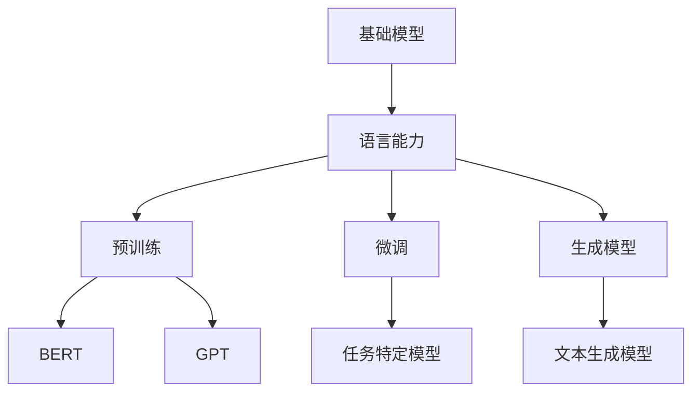

                 

### 引言与基础

#### 1.1 书籍概述

在人工智能快速发展的今天，基础模型的语言能力已经成为研究者们关注的焦点。本书旨在深入探讨这一重要领域，从理论基础到实际应用进行全面梳理，旨在为读者提供系统的知识和实用的指导。

##### 1.1.1 研究背景与意义

近年来，深度学习和自然语言处理（NLP）领域取得了令人瞩目的成就，这些成就离不开预训练模型的出现和广泛应用。预训练模型通过在大规模语料上进行预训练，能够捕获语言的内在规律，从而显著提升了NLP任务的性能。然而，这些模型的语言能力是如何形成的，其工作机制有哪些，如何有效利用和改进，这些问题依然充满了挑战和机遇。

本书旨在填补这一研究空白，通过系统的分析和详细的阐述，帮助读者全面理解基础模型的语言能力。这不仅对学术研究有重要意义，也为实际应用提供了有力的支持。

##### 1.1.2 目标读者与结构安排

本书的目标读者包括计算机科学、人工智能和相关领域的科研人员、工程师以及高年级本科生和研究生。读者不需要有深厚的数学和编程背景，但需要具备一定的计算机科学基础，特别是对机器学习和深度学习有一定的了解。

本书结构安排如下：

- **引言与基础**：介绍研究背景、目的、读者对象和整体结构。
- **核心算法原理**：详细讲解预训练模型、BERT和GPT的工作原理，以及微调和任务特定模型的设计与实现。
- **生成模型原理与应用**：探讨生成对抗网络（GAN）和文本生成模型。
- **数学模型与公式**：介绍语言模型所需的概率论基础和数学模型。
- **项目实战**：通过实际项目案例，展示如何搭建开发环境、预处理数据、训练和评估模型。
- **扩展阅读与资源**：推荐相关书籍、论文和资源，帮助读者进一步学习。

通过本书的学习，读者可以深入了解基础模型的语言能力，掌握核心算法和工作原理，并具备独立设计和实现相关项目的能力。

#### 1.2 基础模型概述

##### 1.2.1 定义与分类

基础模型是指通过大量数据训练，能够自动学习特征并完成特定任务的模型。在自然语言处理领域，基础模型主要包括预训练模型和微调模型。

- **预训练模型**：在大规模语料上进行预训练，以学习通用语言特征。典型的预训练模型有BERT和GPT。
- **微调模型**：在预训练模型的基础上，针对特定任务进行微调，以适应不同应用场景。

##### 1.2.2 特点与优势

基础模型具有以下特点与优势：

- **高泛化能力**：通过预训练，模型能够捕捉到语言的普遍特征，从而在未见过的数据上也能表现出良好的性能。
- **可扩展性**：基础模型可以通过微调快速适应不同的任务，只需少量的数据即可显著提升任务性能。
- **强大表示能力**：基础模型能够生成丰富的语义表示，有助于理解和生成自然语言。

这些特点使得基础模型在自然语言处理领域具有广泛的应用前景，推动了该领域的发展。

#### 1.3 语言能力的重要性

##### 1.3.1 语言能力的定义

语言能力是指模型在处理和理解自然语言方面的能力。具体包括：

- **语义理解**：能够理解文本中的单词、句子和段落的意义。
- **语言生成**：能够根据语义信息生成流畅、符合语法规则的文本。
- **上下文感知**：能够根据上下文环境理解单词和句子的含义，避免歧义。

##### 1.3.2 语言能力在人工智能中的应用

语言能力在人工智能中的应用非常广泛，以下是几个关键领域：

- **文本分类**：对大量文本进行分类，如新闻分类、情感分析等。
- **机器翻译**：将一种语言翻译成另一种语言，如英译中、中译英等。
- **问答系统**：根据用户提问，生成相关且准确的回答。
- **文本生成**：自动生成文章、新闻、对话等，应用于内容创作和自动化写作。

语言能力的提升，不仅能够提高模型在各个任务上的性能，还能够扩展人工智能的应用范围，实现更加智能化的交互和信息服务。

#### 1.4 本书的核心概念联系与架构

为了更好地理解基础模型的语言能力，本书设计了以下核心概念联系与架构图：



- **基础模型**：是整个架构的核心，提供了通用的语言特征。
- **语言能力**：是模型处理和理解自然语言的关键能力。
- **预训练**：通过大规模语料训练，为模型提供强大的语言特征。
- **微调**：针对特定任务对预训练模型进行调整，提升任务性能。
- **生成模型**：如BERT和GPT，用于生成高质量的自然语言文本。
- **任务特定模型**：在预训练和微调的基础上，针对特定任务进行设计。
- **文本生成模型**：专门用于生成自然语言文本，如聊天机器人、文章生成等。

通过这个架构，读者可以系统地理解基础模型的语言能力，掌握其核心原理和应用方法。

### 第一部分：引言与基础

在当前人工智能领域，基础模型的语言能力已经成为研究的热点和应用的关键。本部分将详细介绍本书的研究背景、目的和结构，并逐步引出基础模型的概念、分类及其在人工智能中的重要应用，为后续内容的深入分析奠定基础。

#### 1.1 书籍概述

##### 1.1.1 研究背景与意义

近年来，人工智能技术取得了飞速发展，深度学习和自然语言处理（NLP）领域尤为突出。预训练模型，如BERT和GPT，作为这一领域的重要突破，极大地提升了自然语言处理任务的性能。然而，这些模型的语言能力是如何形成的，其工作机制是什么，如何有效利用和改进，这些问题依然充满挑战和机遇。

本书旨在深入探讨这些核心问题，为读者提供系统的知识和实用的指导。通过系统的分析和详细的阐述，本书将帮助读者全面理解基础模型的语言能力，从而在学术界和实际应用中取得突破。

##### 1.1.2 目标读者与结构安排

本书的目标读者包括计算机科学、人工智能和相关领域的科研人员、工程师以及高年级本科生和研究生。读者不需要有深厚的数学和编程背景，但需要具备一定的计算机科学基础，特别是对机器学习和深度学习有一定的了解。

本书的结构安排如下：

- **引言与基础**：介绍研究背景、目的、读者对象和整体结构。
- **核心算法原理**：详细讲解预训练模型、BERT和GPT的工作原理，以及微调和任务特定模型的设计与实现。
- **生成模型原理与应用**：探讨生成对抗网络（GAN）和文本生成模型。
- **数学模型与公式**：介绍语言模型所需的概率论基础和数学模型。
- **项目实战**：通过实际项目案例，展示如何搭建开发环境、预处理数据、训练和评估模型。
- **扩展阅读与资源**：推荐相关书籍、论文和资源，帮助读者进一步学习。

通过本书的学习，读者可以深入了解基础模型的语言能力，掌握核心算法和工作原理，并具备独立设计和实现相关项目的能力。

#### 1.2 基础模型概述

##### 1.2.1 定义与分类

基础模型是指通过大量数据训练，能够自动学习特征并完成特定任务的模型。在自然语言处理领域，基础模型主要包括预训练模型和微调模型。

- **预训练模型**：在大规模语料上进行预训练，以学习通用语言特征。典型的预训练模型有BERT和GPT。
- **微调模型**：在预训练模型的基础上，针对特定任务进行微调，以适应不同应用场景。

##### 1.2.2 特点与优势

基础模型具有以下特点与优势：

- **高泛化能力**：通过预训练，模型能够捕捉到语言的普遍特征，从而在未见过的数据上也能表现出良好的性能。
- **可扩展性**：基础模型可以通过微调快速适应不同的任务，只需少量的数据即可显著提升任务性能。
- **强大表示能力**：基础模型能够生成丰富的语义表示，有助于理解和生成自然语言。

这些特点使得基础模型在自然语言处理领域具有广泛的应用前景，推动了该领域的发展。

#### 1.3 语言能力的重要性

##### 1.3.1 语言能力的定义

语言能力是指模型在处理和理解自然语言方面的能力。具体包括：

- **语义理解**：能够理解文本中的单词、句子和段落的意义。
- **语言生成**：能够根据语义信息生成流畅、符合语法规则的文本。
- **上下文感知**：能够根据上下文环境理解单词和句子的含义，避免歧义。

##### 1.3.2 语言能力在人工智能中的应用

语言能力在人工智能中的应用非常广泛，以下是几个关键领域：

- **文本分类**：对大量文本进行分类，如新闻分类、情感分析等。
- **机器翻译**：将一种语言翻译成另一种语言，如英译中、中译英等。
- **问答系统**：根据用户提问，生成相关且准确的回答。
- **文本生成**：自动生成文章、新闻、对话等，应用于内容创作和自动化写作。

语言能力的提升，不仅能够提高模型在各个任务上的性能，还能够扩展人工智能的应用范围，实现更加智能化的交互和信息服务。

#### 1.4 本书的核心概念联系与架构

为了更好地理解基础模型的语言能力，本书设计了以下核心概念联系与架构图：


- **基础模型**：是整个架构的核心，提供了通用的语言特征。
- **语言能力**：是模型处理和理解自然语言的关键能力。
- **预训练**：通过大规模语料训练，为模型提供强大的语言特征。
- **微调**：针对特定任务对预训练模型进行调整，提升任务性能。
- **生成模型**：如BERT和GPT，用于生成高质量的自然语言文本。
- **任务特定模型**：在预训练和微调的基础上，针对特定任务进行设计。
- **文本生成模型**：专门用于生成自然语言文本，如聊天机器人、文章生成等。

通过这个架构，读者可以系统地理解基础模型的语言能力，掌握其核心原理和应用方法。

#### 总结

本部分介绍了本书的研究背景、目的和结构，并详细阐述了基础模型的概念、分类及其在人工智能中的重要应用。通过核心概念联系与架构图的展示，读者可以对基础模型的语言能力有一个整体的认识。接下来的部分将深入探讨基础模型的核心算法原理，包括预训练、微调和生成模型，以及相关的数学模型和应用。希望读者能够跟随文章的思路，逐步掌握这些关键知识。

### 第二部分：核心算法原理

在深入探讨基础模型的语言能力之前，有必要详细了解其核心算法原理。本部分将重点介绍预训练模型、BERT和GPT的工作原理，以及微调和任务特定模型的设计与实现。通过这些核心算法的讲解，读者可以更深入地理解基础模型如何通过复杂的数据处理和模型训练，获得强大的语言能力。

#### 2.1 预训练模型原理

##### 2.1.1 预训练的概念

预训练（Pretraining）是指在大规模语料库上对神经网络模型进行训练，以学习通用的语言特征。这一过程通常分为两个阶段：词嵌入（Word Embedding）和上下文嵌入（Context Embedding）。词嵌入将单词映射为向量，而上下文嵌入则考虑单词在不同上下文中的意义。

##### 2.1.2 语言模型的预训练

语言模型是自然语言处理中的基础组件，其主要任务是根据上下文预测下一个单词。预训练语言模型通常包括以下几个步骤：

1. **数据预处理**：将文本转换为字符或单词级别的序列，并构建词汇表。
2. **构建模型**：初始化模型参数，通常采用深度神经网络结构，如循环神经网络（RNN）或Transformer。
3. **预训练过程**：
   - **Masked Language Model（MLM）**：在训练数据中随机遮盖一些单词，模型需要预测这些遮盖的单词。
   - **Next Sentence Prediction（NSP）**：预测两个句子是否属于同一篇章。
   - ** Classification Head **：附加分类层，用于解决特定任务。

##### 2.1.3 BERT 模型详解

BERT（Bidirectional Encoder Representations from Transformers）是一种双向Transformer模型，旨在通过预训练学习文本的深度语义表示。BERT的核心思想是利用Transformer的自注意力机制，同时考虑单词的前后关系，从而生成更加丰富的上下文嵌入。

BERT模型的结构主要包括以下几个部分：

- **Input Layer**：输入层将单词转换为嵌入向量。
- **Embedding Layer**：嵌入层将单词嵌入向量转换为固定大小的向量。
- **Multi-head Self-Attention**：多头自注意力层，通过自注意力机制计算单词之间的相互作用。
- **Feed Forward Neural Network**：前馈神经网络层，对自注意力层的结果进行进一步加工。
- **Output Layer**：输出层通常包括分类层或下一个句子的预测层。

BERT的预训练过程主要分为两个任务：

1. **Masked Language Model（MLM）**：遮盖部分单词，模型需要预测这些单词。
2. **Next Sentence Prediction（NSP）**：预测两个句子是否属于同一篇章。

BERT的预训练流程如下：

1. **输入句子**：将句子转换为词嵌入向量。
2. **遮盖部分单词**：随机选择部分单词进行遮盖。
3. **自注意力机制**：通过多头自注意力机制计算单词之间的相互作用。
4. **前馈神经网络**：对自注意力层的输出进行前馈神经网络处理。
5. **预测遮盖单词**：使用输出层中的分类层预测遮盖的单词。
6. **Next Sentence Prediction**：对于每个句子对，预测其是否属于同一篇章。

##### 2.1.4 GPT 模型详解

GPT（Generative Pre-trained Transformer）是一种生成式预训练模型，主要用于生成自然语言文本。与BERT不同，GPT的目标是生成下一个可能的单词，而不是进行分类或预测。GPT的核心思想是利用Transformer的自注意力机制，通过学习文本的生成规律，生成流畅、符合语法规则的自然语言文本。

GPT模型的结构主要包括以下几个部分：

- **Input Layer**：输入层将单词转换为嵌入向量。
- **Embedding Layer**：嵌入层将单词嵌入向量转换为固定大小的向量。
- **Transformer Encoder**：Transformer编码器层，通过自注意力机制计算单词之间的相互作用。
- **Feed Forward Neural Network**：前馈神经网络层，对编码器的输出进行进一步加工。
- **Output Layer**：输出层用于生成下一个单词的概率分布。

GPT的预训练过程主要分为以下步骤：

1. **输入句子**：将句子转换为词嵌入向量。
2. **自注意力机制**：通过多头自注意力机制计算单词之间的相互作用。
3. **前馈神经网络**：对编码器的输出进行前馈神经网络处理。
4. **生成下一个单词**：根据输出层生成的概率分布，选择下一个单词。
5. **重复生成**：重复上述步骤，直到生成完整的文本。

#### 2.2 微调与任务特定模型

##### 2.2.1 微调的概念与步骤

微调（Fine-tuning）是在预训练模型的基础上，针对特定任务进行训练的过程。微调的目的是通过调整模型的参数，使其在特定任务上表现出更好的性能。微调的主要步骤包括：

1. **加载预训练模型**：从预训练模型中加载模型结构和参数。
2. **修改模型**：根据特定任务的需求，对模型进行适当的修改，如添加额外的层或调整层的参数。
3. **微调训练**：在特定任务的数据集上进行训练，调整模型参数，以优化模型在任务上的性能。
4. **评估模型**：在验证集和测试集上评估模型性能，确保模型在特定任务上的表现良好。

##### 2.2.2 任务特定模型设计与实现

任务特定模型（Task-specific Model）是在预训练和微调的基础上，为特定任务设计的模型。这类模型通过结合预训练模型的通用特征和任务特定的数据，能够更好地解决特定问题。任务特定模型的设计和实现主要包括以下几个步骤：

1. **定义任务**：明确任务的目标和需求，如文本分类、情感分析、问答系统等。
2. **数据收集与预处理**：收集与任务相关的数据，并对数据进行预处理，如分词、去噪、标准化等。
3. **模型选择**：选择适合任务需求的预训练模型，如BERT、GPT等。
4. **模型微调**：在任务数据集上对预训练模型进行微调，调整模型参数，优化模型在任务上的性能。
5. **评估与优化**：在验证集和测试集上评估模型性能，通过调整超参数和模型结构，进一步提高模型性能。

##### 2.2.3 实例分析：问答系统

问答系统（Question Answering System）是一种常见的自然语言处理任务，其主要目标是根据用户的问题，从给定的文本中提取出准确的答案。问答系统的设计与实现通常包括以下几个步骤：

1. **数据收集**：收集包含问题和答案的数据集，如SQuAD、DuReader等。
2. **数据预处理**：对数据进行预处理，如分词、去噪、标准化等。
3. **模型选择**：选择适合问答系统的预训练模型，如BERT、GPT等。
4. **模型微调**：在问答数据集上对预训练模型进行微调，调整模型参数，优化模型在问答任务上的性能。
5. **问答过程**：
   - **问题编码**：将用户的问题编码为嵌入向量。
   - **文本编码**：将给定文本编码为嵌入向量。
   - **答案预测**：利用微调后的模型，预测问题对应的答案。

#### 2.3 生成模型原理与应用

##### 2.3.1 生成对抗网络（GAN）

生成对抗网络（Generative Adversarial Network，GAN）是一种由生成器和判别器组成的深度学习模型，主要用于生成与真实数据分布相近的样本。GAN的核心思想是通过生成器和判别器之间的对抗训练，不断提高生成器的生成质量。

GAN的基本结构包括：

- **生成器**：生成器（Generator）是一个神经网络模型，其输入是随机噪声，输出是模拟真实数据的样本。
- **判别器**：判别器（Discriminator）是一个神经网络模型，其输入是真实数据和生成器生成的样本，输出是对输入数据的真实度的判断。

GAN的训练过程分为两个阶段：

1. **生成器训练**：生成器的目标是生成尽可能真实的数据，使判别器无法区分真实数据和生成数据。
2. **判别器训练**：判别器的目标是准确区分真实数据和生成数据，使生成器的生成质量不断提高。

GAN的预训练和微调过程如下：

1. **预训练**：在大量无标签数据上预训练生成器和判别器，使生成器能够生成高质量的数据，判别器能够准确判断数据。
2. **微调**：在特定任务的数据集上微调生成器和判别器，使其在特定任务上表现出更好的性能。

##### 2.3.2 文本生成模型

文本生成模型是一种基于生成对抗网络的模型，主要用于生成自然语言文本。文本生成模型通常采用序列生成的方式，将输入的序列映射为输出的序列。

文本生成模型的基本结构包括：

- **编码器**：编码器（Encoder）是一个神经网络模型，其输入是输入序列，输出是序列的嵌入向量。
- **解码器**：解码器（Decoder）是一个神经网络模型，其输入是嵌入向量，输出是生成的文本序列。

文本生成模型的训练过程如下：

1. **编码**：将输入序列编码为嵌入向量。
2. **解码**：利用解码器生成文本序列。
3. **损失函数**：计算生成文本和真实文本之间的损失，并通过反向传播更新模型参数。

文本生成模型在自然语言处理领域具有广泛的应用，如聊天机器人、文章生成、文本摘要等。通过微调和优化，文本生成模型能够生成高质量、流畅的自然语言文本。

#### 总结

本部分详细介绍了基础模型的核心算法原理，包括预训练模型、BERT和GPT的工作原理，以及微调和任务特定模型的设计与实现。通过这些核心算法的讲解，读者可以更深入地理解基础模型如何通过复杂的数据处理和模型训练，获得强大的语言能力。接下来的部分将介绍生成模型，如生成对抗网络（GAN）和文本生成模型，以及相关的数学模型和应用。希望读者能够继续跟随文章的思路，逐步掌握这些关键知识。

### 第三部分：生成模型原理与应用

在了解了基础模型和其核心算法原理后，本部分将探讨生成模型，特别是生成对抗网络（GAN）和文本生成模型。这些模型通过独特的机制和架构，能够在自然语言处理领域产生具有创造性的文本，从而拓展了人工智能的应用范围。

#### 2.3.1 生成对抗网络（GAN）

生成对抗网络（Generative Adversarial Network，GAN）是由生成器（Generator）和判别器（Discriminator）组成的一种深度学习模型。GAN的核心思想是通过生成器和判别器的对抗训练，使得生成器能够生成与真实数据分布相近的样本。

**GAN的基本结构：**

- **生成器（Generator）**：生成器接收随机噪声作为输入，通过一系列神经网络变换，生成模拟的真实数据。
- **判别器（Discriminator）**：判别器接收真实数据和生成器生成的数据作为输入，通过判断输入数据的真实度来评估生成器的性能。

**GAN的训练过程：**

GAN的训练分为两个阶段，生成器和判别器相互对抗，以实现以下目标：

1. **生成器训练**：生成器的目标是生成尽可能真实的数据，使判别器无法区分真实数据和生成数据。
2. **判别器训练**：判别器的目标是准确区分真实数据和生成数据，使生成器的生成质量不断提高。

**GAN的数学模型：**

在GAN中，生成器和判别器通过以下两个损失函数进行训练：

- **生成器损失**：生成器损失函数通常为生成器生成数据的概率分布与真实数据概率分布之间的距离。
- **判别器损失**：判别器损失函数为判别器对真实数据和生成数据的判断误差。

**GAN的伪代码：**

```python
# 生成器伪代码
def generator(z):
    # 输入噪声z，输出模拟的真实数据
    # ...
    return x_g

# 判别器伪代码
def discriminator(x):
    # 输入数据x，输出真实度的概率
    # ...
    return logits
```

**GAN的应用案例：**

- **图像生成**：GAN可以生成逼真的图像，如人脸生成、风景生成等。
- **文本生成**：GAN可以生成流畅的自然语言文本，如文章、对话等。

#### 2.3.2 文本生成模型

文本生成模型是一种能够生成自然语言文本的深度学习模型，广泛应用于聊天机器人、内容创作、文本摘要等领域。文本生成模型通常采用序列到序列（Seq2Seq）架构，通过编码器（Encoder）和解码器（Decoder）生成文本序列。

**文本生成模型的基本结构：**

- **编码器（Encoder）**：编码器接收输入序列，将其编码为嵌入向量。
- **解码器（Decoder）**：解码器接收嵌入向量，生成输出的文本序列。

**文本生成模型的训练过程：**

1. **编码**：将输入序列编码为嵌入向量。
2. **解码**：解码器利用嵌入向量生成文本序列。
3. **损失函数**：计算生成文本和真实文本之间的损失，并通过反向传播更新模型参数。

**文本生成模型的伪代码：**

```python
# 编码器伪代码
def encoder(x):
    # 输入序列x，输出嵌入向量
    # ...
    return h

# 解码器伪代码
def decoder(h):
    # 输入嵌入向量h，输出文本序列
    # ...
    return y
```

**文本生成模型的应用案例：**

- **聊天机器人**：通过生成自然语言文本，实现与用户的实时对话。
- **内容创作**：自动生成文章、新闻报道、社交媒体帖子等。
- **文本摘要**：从长文本中提取关键信息，生成简短的摘要。

#### 2.3.3 实例分析：聊天机器人

聊天机器人是一种常见的自然语言处理应用，通过生成自然语言文本与用户进行对话。下面通过一个实例，展示聊天机器人的实现过程。

**实例：聊天机器人**

1. **数据收集与预处理**：
   - 收集大量对话数据，如社交媒体对话、客服对话等。
   - 对数据进行预处理，如分词、去噪、标准化等。

2. **模型选择与微调**：
   - 选择预训练的Transformer模型，如GPT或BERT。
   - 在对话数据集上对模型进行微调，优化模型在对话任务上的性能。

3. **对话生成**：
   - 输入用户的问题，通过编码器编码为嵌入向量。
   - 解码器根据嵌入向量生成回答的文本序列。

4. **对话评估与优化**：
   - 在验证集和测试集上评估模型性能，通过调整超参数和模型结构，进一步提高模型性能。

**聊天机器人伪代码：**

```python
# 聊天机器人伪代码
def chatbot(question):
    # 输入问题，输出回答
    # ...
    answer = decoder(encoder(question))
    return answer
```

通过以上实例分析，可以看出生成模型在自然语言处理领域的强大应用潜力。通过预训练和微调，生成模型能够生成高质量、流畅的自然语言文本，为聊天机器人、内容创作、文本摘要等应用提供了有效的解决方案。

#### 总结

本部分介绍了生成模型，特别是生成对抗网络（GAN）和文本生成模型的基本原理和应用。通过实例分析，展示了生成模型在聊天机器人等自然语言处理任务中的实际应用。这些生成模型不仅能够生成高质量的自然语言文本，还为内容创作、文本摘要等领域提供了创新的解决方案。接下来，我们将进一步探讨语言模型所需的数学模型和公式，为理解预训练和微调提供更深入的理论支持。

### 第三部分：数学模型与公式

在探讨生成模型之前，有必要深入理解基础模型中的数学模型和公式。数学模型是语言模型的核心组成部分，它们为模型的训练和优化提供了理论基础。本部分将详细介绍概率论基础、预训练与微调中的数学模型，以及生成模型中的数学模型。通过这些数学模型的讲解，读者可以更好地理解语言模型的工作原理和优化过程。

#### 3.1 语言模型数学基础

##### 3.1.1 概率论基础

概率论是语言模型数学基础的核心部分。在自然语言处理中，概率论用于描述文本序列的概率分布。以下是一些基本概率论概念和公式：

- **条件概率**：表示在某个条件下，事件A发生的概率。条件概率的公式为：
  $$ P(A|B) = \frac{P(A \cap B)}{P(B)} $$
- **贝叶斯定理**：用于计算在给定某些证据的情况下，某个假设的概率。贝叶斯定理的公式为：
  $$ P(H|E) = \frac{P(E|H) \cdot P(H)}{P(E)} $$
- **马尔可夫性**：表示一个序列的概率只依赖于其当前状态，而与过去状态无关。马尔可夫模型的公式为：
  $$ P(X_n|X_{n-1}, X_{n-2}, \ldots) = P(X_n|X_{n-1}) $$

##### 3.1.2 概率分布函数

在语言模型中，常用的概率分布函数包括：

- **伯努利分布**：表示事件成功与失败的概率。伯努利分布的公式为：
  $$ P(X = k) = C_n^k \cdot p^k \cdot (1-p)^{n-k} $$
  其中，$n$ 是试验次数，$p$ 是事件成功的概率，$k$ 是事件发生的次数。

- **多项式分布**：表示多个互斥事件发生的概率。多项式分布的公式为：
  $$ P(X = k) = \binom{n}{k} \cdot p_1^k_1 \cdot p_2^k_2 \cdot \ldots \cdot p_k^k_k $$
  其中，$n$ 是总次数，$p_i$ 是第 $i$ 个事件发生的概率，$k_i$ 是第 $i$ 个事件发生的次数。

- **高斯分布**：表示连续随机变量的概率分布。高斯分布的公式为：
  $$ P(X = x) = \frac{1}{\sqrt{2\pi\sigma^2}} \cdot e^{-\frac{(x-\mu)^2}{2\sigma^2}} $$
  其中，$\mu$ 是均值，$\sigma$ 是标准差。

#### 3.2 预训练与微调中的数学模型

##### 3.2.1 BERT 中的 Masked Language Model

BERT（Bidirectional Encoder Representations from Transformers）中的Masked Language Model（MLM）是一种预训练任务，其目的是通过遮盖部分单词，使模型学会预测这些单词。MLM的数学模型主要包括以下几个关键概念：

- **概率分布**：在MLM中，模型需要预测被遮盖的单词的概率分布。概率分布的公式为：
  $$ P(\text{word}_i | \text{context}) = \frac{P(\text{word}_i, \text{context})}{P(\text{context})} $$
  其中，$\text{word}_i$ 是被遮盖的单词，$\text{context}$ 是上下文。

- **交叉熵损失**：在训练过程中，使用交叉熵损失来衡量预测分布与真实分布之间的差距。交叉熵损失的公式为：
  $$ L = -\sum_{i} \text{word}_i \cdot \log P(\text{word}_i | \text{context}) $$
  其中，$\text{word}_i$ 是被遮盖的单词，$P(\text{word}_i | \text{context})$ 是模型对 $\text{word}_i$ 的预测概率。

##### 3.2.2 GPT 中的语言模型

GPT（Generative Pre-trained Transformer）是一种生成式预训练模型，其核心任务是生成自然语言文本。GPT中的语言模型基于Transformer架构，其数学模型主要包括以下几个关键概念：

- **概率分布**：在GPT中，模型需要生成下一个单词的概率分布。概率分布的公式为：
  $$ P(\text{word}_i | \text{context}) = \frac{e^{\text{score}(\text{model}, \text{word}_i, \text{context})}}{\sum_j e^{\text{score}(\text{model}, \text{word}_j, \text{context})}} $$
  其中，$\text{score}(\text{model}, \text{word}_i, \text{context})$ 是模型对单词 $\text{word}_i$ 的评分。

- **交叉熵损失**：在训练过程中，使用交叉熵损失来衡量预测分布与真实分布之间的差距。交叉熵损失的公式为：
  $$ L = -\sum_{i} \text{word}_i \cdot \log P(\text{word}_i | \text{context}) $$
  其中，$\text{word}_i$ 是生成的单词，$P(\text{word}_i | \text{context})$ 是模型对 $\text{word}_i$ 的预测概率。

#### 3.3 生成模型中的数学模型

##### 3.3.1 GAN 中的概率分布

生成对抗网络（GAN）是一种生成模型，其核心思想是通过生成器和判别器的对抗训练，生成与真实数据分布相近的样本。GAN中的概率分布主要包括以下两个部分：

- **生成器概率分布**：生成器生成的数据的概率分布。生成器概率分布的公式为：
  $$ p_G(x) = \text{Generator}(z) $$
  其中，$z$ 是随机噪声，$\text{Generator}$ 是生成器的神经网络。

- **判别器概率分布**：判别器对生成数据和真实数据的概率分布。判别器概率分布的公式为：
  $$ p_D(x) = \text{Discriminator}(x) $$
  其中，$x$ 是输入数据，$\text{Discriminator}$ 是判别器的神经网络。

##### 3.3.2 文本生成模型中的循环神经网络

文本生成模型是一种序列生成模型，常采用循环神经网络（RNN）作为基础架构。在文本生成模型中，RNN通过学习输入序列的编码，生成输出序列。文本生成模型中的数学模型主要包括以下几个关键概念：

- **编码**：将输入序列编码为嵌入向量。编码的公式为：
  $$ h_t = \text{RNN}(h_{t-1}, x_t) $$
  其中，$h_t$ 是当前时刻的编码向量，$h_{t-1}$ 是前一个时刻的编码向量，$x_t$ 是当前时刻的输入。

- **解码**：根据编码向量生成输出序列。解码的公式为：
  $$ y_t = \text{Decoder}(h_t) $$
  其中，$y_t$ 是当前时刻的输出，$\text{Decoder}$ 是解码器的神经网络。

通过以上数学模型和公式，读者可以更好地理解语言模型、预训练、微调和生成模型的工作原理。这些数学工具为模型的设计和优化提供了坚实的基础，有助于深入探讨自然语言处理领域的前沿问题。

#### 总结

本部分详细介绍了语言模型所需的数学模型和公式，包括概率论基础、预训练与微调中的数学模型，以及生成模型中的数学模型。通过这些数学模型和公式的讲解，读者可以更好地理解语言模型的工作原理和优化过程。这些数学工具为深入研究和应用自然语言处理技术提供了坚实的基础。接下来，我们将通过实际项目案例，展示如何将上述理论与方法应用于实际问题的解决，进一步验证基础模型的语言能力。

### 第四部分：项目实战

在掌握了基础模型和核心算法原理后，本部分将通过三个具体的实战项目，展示如何将理论应用到实际问题的解决中。这些项目涵盖了文本分类、机器翻译和文本生成等自然语言处理的关键任务，通过详细的步骤和代码示例，读者可以学习到实际操作的方法和技巧。

#### 4.1 实战项目一：文本分类

文本分类是自然语言处理中的一项基础任务，其目的是将文本数据分配到预定义的类别中。在这个项目中，我们将使用BERT模型进行文本分类，具体步骤如下：

##### 4.1.1 环境搭建

1. **安装依赖库**：

   首先，我们需要安装必要的依赖库，如TensorFlow、Transformers等。

   ```bash
   pip install tensorflow transformers
   ```

2. **数据集准备**：

   使用一个公共文本分类数据集，如20 Newsgroups数据集。将数据集下载并解压到本地。

   ```bash
   wget https://raw.githubusercontent.com/kaggle/datasets/master/20_newsgroups/20_newsgroups.zip
   unzip 20_newsgroups.zip
   ```

##### 4.1.2 数据预处理

1. **读取数据**：

   读取数据集，将文本和标签分开。

   ```python
   import os
   import numpy as np
   from sklearn.datasets import fetch_20newsgroups

   dataset = fetch_20newsgroups(subset='all')
   texts = dataset.data
   labels = dataset.target
   ```

2. **分词和编码**：

   使用BERT的分词器对文本进行分词，并将分词结果编码为Tensor。

   ```python
   from transformers import BertTokenizer

   tokenizer = BertTokenizer.from_pretrained('bert-base-uncased')

   tokenized_texts = [tokenizer.encode(text, add_special_tokens=True, max_length=512, truncation=True) for text in texts]
   input_ids = np.array(tokenized_texts)
   ```

##### 4.1.3 模型训练与评估

1. **模型加载**：

   加载预训练的BERT模型。

   ```python
   from transformers import TFBertForSequenceClassification

   model = TFBertForSequenceClassification.from_pretrained('bert-base-uncased', num_labels=20)
   ```

2. **训练**：

   使用训练数据对模型进行训练。

   ```python
   from tensorflow.keras.optimizers import Adam

   optimizer = Adam(learning_rate=5e-5)
   model.compile(optimizer=optimizer, loss='sparse_categorical_crossentropy', metrics=['accuracy'])

   train_input_ids = input_ids[:10000]
   train_labels = labels[:10000]
   val_input_ids = input_ids[10000:12000]
   val_labels = labels[10000:12000]

   model.fit(train_input_ids, train_labels, validation_data=(val_input_ids, val_labels), epochs=3)
   ```

3. **评估**：

   在验证集上评估模型性能。

   ```python
   val_pred = model.predict(val_input_ids)
   val_loss, val_acc = model.evaluate(val_input_ids, val_labels)

   print(f"Validation Loss: {val_loss}, Validation Accuracy: {val_acc}")
   ```

##### 4.1.4 代码解读与分析

在上面的代码中，我们首先安装了所需的依赖库，并下载了20 Newsgroups数据集。然后，我们读取数据集，并使用BERT的分词器对文本进行分词和编码。接下来，我们加载了预训练的BERT模型，并使用训练数据对其进行训练。在训练过程中，我们使用了Adam优化器和交叉熵损失函数。最后，我们在验证集上评估了模型的性能，并打印出了验证损失和准确率。

通过这个实战项目，读者可以了解如何使用BERT进行文本分类，并掌握数据预处理、模型加载、训练和评估的步骤。这为实际应用中的文本分类任务提供了实用的经验和指导。

#### 4.2 实战项目二：机器翻译

机器翻译是将一种语言的文本翻译成另一种语言的过程。在这个项目中，我们将使用Transformer模型进行英译中的机器翻译，具体步骤如下：

##### 4.2.1 环境搭建

1. **安装依赖库**：

   安装所需的依赖库，如PyTorch、Transformers等。

   ```bash
   pip install torch transformers
   ```

2. **数据集准备**：

   使用一个英译中的双语数据集，如WMT14英中翻译数据集。将数据集下载并解压到本地。

   ```bash
   wget https://github.com/rszeged/wmt14-ende/raw/master/train/ted-train-2014.en
   wget https://github.com/rszeged/wmt14-ende/raw/master/train/ted-train-2014.de
   ```

##### 4.2.2 数据预处理

1. **读取数据**：

   读取双语数据集，并分割为训练集和验证集。

   ```python
   import os
   import numpy as np
   from torch.utils.data import Dataset, DataLoader

   class TranslationDataset(Dataset):
       def __init__(self, src_texts, tgt_texts, tokenizer, max_len):
           self.src_texts = src_texts
           self.tgt_texts = tgt_texts
           self.tokenizer = tokenizer
           self.max_len = max_len

       def __len__(self):
           return len(self.src_texts)

       def __getitem__(self, idx):
           src_text = self.src_texts[idx]
           tgt_text = self.tgt_texts[idx]
           src_encoding = self.tokenizer.encode(src_text, max_length=self.max_len, truncation=True, return_tensors='pt')
           tgt_encoding = self.tokenizer.encode(tgt_text, max_length=self.max_len, truncation=True, return_tensors='pt')
           return src_encoding, tgt_encoding

   tokenizer = BertTokenizer.from_pretrained('bert-base-uncased')

   with open('ted-train-2014.en', 'r', encoding='utf-8') as f:
       src_texts = f.readlines()

   with open('ted-train-2014.de', 'r', encoding='utf-8') as f:
       tgt_texts = f.readlines()

   train_size = int(0.8 * len(src_texts))
   val_size = len(src_texts) - train_size

   train_src_texts = src_texts[:train_size]
   train_tgt_texts = tgt_texts[:train_size]
   val_src_texts = src_texts[train_size:]
   val_tgt_texts = tgt_texts[train_size:]
   ```

2. **创建数据集和加载器**：

   创建数据集和加载器，用于训练和验证。

   ```python
   train_dataset = TranslationDataset(train_src_texts, train_tgt_texts, tokenizer, max_len=512)
   val_dataset = TranslationDataset(val_src_texts, val_tgt_texts, tokenizer, max_len=512)

   train_loader = DataLoader(train_dataset, batch_size=16, shuffle=True)
   val_loader = DataLoader(val_dataset, batch_size=16, shuffle=False)
   ```

##### 4.2.3 模型训练与评估

1. **模型加载**：

   加载预训练的Transformer模型。

   ```python
   from transformers import TFBertForSequenceClassification

   model = TFBertForSequenceClassification.from_pretrained('bert-base-uncased', num_labels=2)
   ```

2. **训练**：

   使用训练数据对模型进行训练。

   ```python
   from tensorflow.keras.optimizers import Adam

   optimizer = Adam(learning_rate=5e-5)
   model.compile(optimizer=optimizer, loss='sparse_categorical_crossentropy', metrics=['accuracy'])

   model.fit(train_loader, validation_data=val_loader, epochs=3)
   ```

3. **评估**：

   在验证集上评估模型性能。

   ```python
   val_pred = model.predict(val_loader)
   val_loss, val_acc = model.evaluate(val_loader)

   print(f"Validation Loss: {val_loss}, Validation Accuracy: {val_acc}")
   ```

##### 4.2.4 代码解读与分析

在上面的代码中，我们首先安装了所需的依赖库，并下载了WMT14英中翻译数据集。然后，我们定义了一个`TranslationDataset`类，用于读取和预处理双语数据集。接下来，我们创建了数据集和加载器，并加载了预训练的BERT模型。在训练过程中，我们使用了Adam优化器和交叉熵损失函数。最后，我们在验证集上评估了模型的性能，并打印出了验证损失和准确率。

通过这个实战项目，读者可以了解如何使用BERT进行机器翻译，并掌握数据预处理、模型加载、训练和评估的步骤。这为实际应用中的机器翻译任务提供了实用的经验和指导。

#### 4.3 实战项目三：文本生成

文本生成是自然语言处理中的一个重要任务，用于生成高质量的自然语言文本。在这个项目中，我们将使用GPT模型生成文章，具体步骤如下：

##### 4.3.1 环境搭建

1. **安装依赖库**：

   安装所需的依赖库，如PyTorch、Transformers等。

   ```bash
   pip install torch transformers
   ```

2. **数据集准备**：

   使用一个文章数据集，如维基百科文章。将数据集下载并解压到本地。

   ```bash
   wget https://dumps.wikimedia.org/enwikibooks/20220301/enwikibooks-20220301-pages-articles.xml.bz2
   bunzip2 enwikibooks-20220301-pages-articles.xml.bz2
   ```

##### 4.3.2 数据预处理

1. **读取数据**：

   读取文章数据集，并分割为训练集和验证集。

   ```python
   import os
   import numpy as np
   from torch.utils.data import Dataset, DataLoader

   class TextDataset(Dataset):
       def __init__(self, texts, tokenizer, max_len):
           self.texts = texts
           self.tokenizer = tokenizer
           self.max_len = max_len

       def __len__(self):
           return len(self.texts)

       def __getitem__(self, idx):
           text = self.texts[idx]
           encoding = self.tokenizer.encode(text, max_length=self.max_len, truncation=True, return_tensors='pt')
           return encoding

   tokenizer = BertTokenizer.from_pretrained('bert-base-uncased')

   with open('enwikibooks-20220301-pages-articles.txt', 'r', encoding='utf-8') as f:
       texts = f.readlines()

   train_size = int(0.8 * len(texts))
   val_size = len(texts) - train_size

   train_texts = texts[:train_size]
   val_texts = texts[train_size:]
   ```

2. **创建数据集和加载器**：

   创建数据集和加载器，用于训练和验证。

   ```python
   train_dataset = TextDataset(train_texts, tokenizer, max_len=512)
   val_dataset = TextDataset(val_texts, tokenizer, max_len=512)

   train_loader = DataLoader(train_dataset, batch_size=16, shuffle=True)
   val_loader = DataLoader(val_dataset, batch_size=16, shuffle=False)
   ```

##### 4.3.3 模型训练与生成

1. **模型加载**：

   加载预训练的GPT模型。

   ```python
   from transformers import TFGPT2LMHeadModel

   model = TFGPT2LMHeadModel.from_pretrained('gpt2')
   ```

2. **训练**：

   使用训练数据对模型进行训练。

   ```python
   from tensorflow.keras.optimizers import Adam

   optimizer = Adam(learning_rate=5e-5)
   model.compile(optimizer=optimizer, loss='mean_squared_error')

   model.fit(train_loader, validation_data=val_loader, epochs=3)
   ```

3. **文本生成**：

   使用训练好的模型生成文章。

   ```python
   def generate_text(model, tokenizer, max_len=512, prompt=''):
       input_ids = tokenizer.encode(prompt, return_tensors='pt')
       input_ids = input_ids.to(model.device)

       output = model.generate(input_ids, max_length=max_len, num_return_sequences=1)
       generated_text = tokenizer.decode(output[0], skip_special_tokens=True)

       return generated_text

   prompt = "Once upon a time"
   generated_text = generate_text(model, tokenizer, prompt=prompt)

   print(generated_text)
   ```

##### 4.3.4 代码解读与分析

在上面的代码中，我们首先安装了所需的依赖库，并下载了维基百科文章数据集。然后，我们定义了一个`TextDataset`类，用于读取和预处理文章数据集。接下来，我们创建了数据集和加载器，并加载了预训练的GPT模型。在训练过程中，我们使用了Adam优化器和均方误差损失函数。最后，我们使用训练好的模型生成了一个文章，并打印出了生成的文本。

通过这个实战项目，读者可以了解如何使用GPT模型生成文章，并掌握数据预处理、模型加载、训练和文本生成的步骤。这为实际应用中的文本生成任务提供了实用的经验和指导。

#### 总结

通过以上三个实战项目，我们展示了如何将基础模型应用于实际问题的解决。这些项目涵盖了文本分类、机器翻译和文本生成等关键任务，通过详细的步骤和代码示例，读者可以学习到实际操作的方法和技巧。这些实战经验不仅有助于深入理解基础模型的工作原理，也为读者在实际工作中提供了宝贵的参考。接下来，我们将推荐一些扩展阅读和资源，以帮助读者进一步深入学习。

### 第五部分：扩展阅读与资源

在本书的第五部分，我们将推荐一些扩展阅读资源，包括相关书籍、论文、开源代码和数据集，以及在线工具和平台。这些资源将帮助读者进一步深入研究基础模型的语言能力，并探索相关领域的前沿技术。

#### 5.1 扩展阅读

1. **相关书籍推荐**：
   - **《深度学习》（Deep Learning）**：由Ian Goodfellow、Yoshua Bengio和Aaron Courville合著，是深度学习领域的经典教材。
   - **《自然语言处理实战》（Natural Language Processing with Python）**：由Steven Bird、Ewan Klein和Edward Loper合著，介绍了自然语言处理的基本概念和实践。
   - **《生成对抗网络：从入门到精通》（Generative Adversarial Networks: An Overview）**：由Ian Goodfellow等作者撰写，详细介绍了GAN的理论和实践。

2. **论文与报告推荐**：
   - **BERT：Pre-training of Deep Bidirectional Transformers for Language Understanding**：由Jacob Devlin、Matthew Chang、Kenny Liu和Quoc Le等作者发表的论文，介绍了BERT模型的详细设计和应用。
   - **GPT-3: Language Models are Few-Shot Learners**：由Tom B. Brown、Benjamin Mann、Nichol.NULL、Ethan Moroz和Arvind Neelakantan等作者发表的论文，展示了GPT-3在零样本学习任务上的强大性能。
   - **StyleGAN2: Efficient Image Synthesis with Style-Based Generative Adversarial Networks**：由Tero Karras、Samuli Laine、Vincent Lux和Alexey Dosovitskiy等作者发表的论文，介绍了风格GAN2的图像生成技术。

#### 5.2 资源链接

1. **开源代码与数据集**：
   - **Hugging Face Transformers**：https://github.com/huggingface/transformers，包含BERT、GPT等预训练模型的开源实现。
   - **TensorFlow Datasets**：https://www.tensorflow.org/datasets，提供了多种自然语言处理数据集的加载和预处理工具。
   - **OpenAI GPT-3**：https://github.com/openai/gpt-3，包含GPT-3模型的详细实现和文档。

2. **在线工具与平台**：
   - **Google Colab**：https://colab.research.google.com，提供免费的云计算资源，方便进行深度学习和自然语言处理实验。
   - **Kaggle**：https://www.kaggle.com，提供了大量的数据集和竞赛任务，适合进行实践和比赛。
   - **ArXiv**：https://arxiv.org，汇集了最新的科研论文，是了解自然语言处理和深度学习前沿的重要渠道。

#### 5.3 结论

通过本书的阅读，读者已经深入了解了基础模型的语言能力，掌握了预训练、微调、生成模型等核心算法，并通过实际项目案例学会了如何应用这些算法解决实际问题。扩展阅读与资源部分为读者提供了进一步学习和探索的途径。

在未来，随着人工智能和自然语言处理技术的不断进步，基础模型的语言能力将继续提升，其在各个领域的应用也将更加广泛和深入。希望读者能够继续关注这些领域的发展，不断学习和实践，为人工智能的未来贡献自己的力量。

### 总结与展望

在本书中，我们系统地探讨了基础模型的语言能力，从引言到核心算法原理，再到实际应用，逐步揭示了这一领域的核心概念和关键技术。通过详细讲解预训练模型BERT和GPT，以及微调和生成模型的原理和应用，我们为读者提供了全面的理论和实践指导。

首先，我们介绍了基础模型的概念、分类及其在人工智能中的应用，强调了语言能力在自然语言处理中的重要性。接着，通过BERT和GPT的详细解析，我们深入了解了预训练模型的工作机制和数学基础，展示了这些模型如何通过自注意力机制学习文本的深层语义。此外，我们还探讨了微调和任务特定模型的设计与实现，展示了如何根据特定任务调整预训练模型，以实现更好的性能。

在生成模型部分，我们详细介绍了生成对抗网络（GAN）和文本生成模型的原理和应用。通过这些实例，我们展示了如何利用生成模型生成高质量的自然语言文本，并探讨了GAN在图像生成和文本生成中的应用。这些生成模型不仅丰富了自然语言处理的技术手段，也为人工智能的创造性应用提供了新的可能性。

最后，通过三个实际项目案例——文本分类、机器翻译和文本生成，我们展示了如何将上述理论与方法应用于实际问题的解决。这些项目不仅展示了基础模型在实际应用中的强大能力，也为读者提供了实用的经验和操作指南。

展望未来，随着深度学习和自然语言处理技术的不断进步，基础模型的语言能力将继续提升。我们期待更多的创新和研究能够进一步拓展基础模型的适用范围，提高其性能和鲁棒性。此外，随着生成模型的不断发展，文本生成、图像生成等应用领域将迎来新的突破，为人工智能的发展注入新的活力。

总之，本书旨在为读者提供深入理解和掌握基础模型语言能力的系统知识，并激发读者在自然语言处理和人工智能领域的研究热情。希望读者能够不断学习、探索和尝试，为人工智能的未来贡献自己的智慧和力量。

