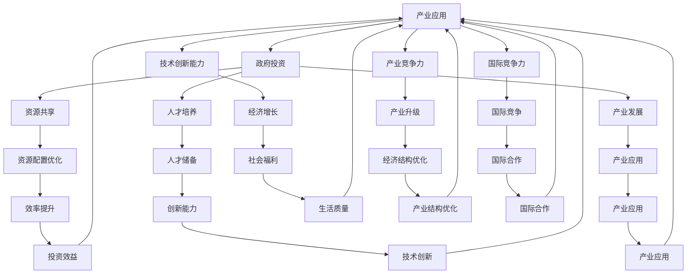

                 

# 文章标题

《基础模型的资源差距与政府投资》

## 关键词

基础模型，资源差距，政府投资，人工智能，技术进步，全球化

## 摘要

本文旨在探讨基础模型的资源差距问题，并分析政府投资在此问题中的重要作用。首先，文章对基础模型资源差距的概念、背景及其产生原因进行了详细阐述，接着分析了市场与企业对基础模型资源的需求差异，并探讨了政府投资在缩小资源差距中的作用和方式。随后，文章从理论层面探讨了政府投资的基础框架及其与基础模型资源差距的关系，并介绍了政府投资效益评估的方法。接着，本文通过案例分析，介绍了美国、欧洲和日本等地区在政府投资基础模型资源差距方面的实践，最后，文章分析了我国在此领域的投资现状、政策措施以及实践案例，并对未来基础模型资源差距与政府投资的发展进行了展望。

# 《基础模型的资源差距与政府投资》目录大纲

## 第一部分：基础模型资源差距概述

### 1.1 基础模型资源差距的概念与背景

#### 1.1.1 基础模型资源差距的定义

基础模型资源差距是指不同主体在获取和应用基础模型资源方面的不均衡现象。具体而言，它体现在以下几个方面：

1. **数据资源差距**：不同主体在获取和处理数据资源的能力和规模上存在差异。
2. **计算资源差距**：不同主体在计算能力、硬件设备等方面存在差距。
3. **人才资源差距**：不同主体在人工智能领域的人才储备和培养上存在差异。
4. **技术资源差距**：不同主体在技术积累、研发能力等方面存在差距。

#### 1.1.2 基础模型资源差距的产生原因

基础模型资源差距的产生原因复杂，主要包括以下几个方面：

1. **市场机制**：市场机制在资源配置中起到基础性作用，但市场机制存在一定的滞后性和不完全性，导致资源分配不均。
2. **技术进步**：技术进步导致基础模型资源的价值提升，但技术扩散速度不均衡，使得不同主体在资源获取上存在差异。
3. **政策因素**：政策支持力度和方向的不同，导致不同主体在资源获取上存在差异。
4. **经济发展水平**：经济水平较低的地区和企业，在资源获取上存在困难。

#### 1.1.3 基础模型资源差距的影响

基础模型资源差距对经济发展和社会进步产生了深远影响，具体体现在以下几个方面：

1. **技术发展不平衡**：资源差距导致技术发展不平衡，影响整体技术水平的提升。
2. **产业竞争力差异**：资源差距使得产业竞争力出现差异，影响产业格局。
3. **社会公平问题**：资源差距可能加剧社会不公平现象，影响社会和谐稳定。
4. **国际竞争力**：资源差距影响国家在国际竞争中的地位，制约国家发展。

### 1.2 市场与企业对基础模型资源的需求分析

#### 1.2.1 市场对基础模型资源的需求

市场对基础模型资源的需求主要表现在以下几个方面：

1. **技术创新需求**：市场需要通过基础模型资源的应用，推动技术创新和产业升级。
2. **效率提升需求**：基础模型资源的引入可以提高生产效率，降低运营成本。
3. **决策支持需求**：基础模型资源可以为企业提供决策支持，提高决策的科学性和准确性。

#### 1.2.2 企业对基础模型资源的需求

企业对基础模型资源的需求主要表现在以下几个方面：

1. **技术储备**：企业需要通过引进和应用基础模型资源，提升自身的技术储备和研发能力。
2. **竞争优势**：企业通过掌握和应用基础模型资源，可以获得竞争优势，提高市场占有率。
3. **人才培养**：企业需要通过应用基础模型资源，培养和储备人工智能领域的人才。

#### 1.2.3 市场与企业需求的差异及协调策略

市场与企业对基础模型资源的需求存在差异，主要表现在以下几个方面：

1. **需求层次**：市场需求更注重基础模型资源的应用价值，而企业需求更注重技术储备和竞争优势。
2. **需求时间**：市场需求对基础模型资源的需求较为迫切，而企业需求则相对滞后。
3. **需求方式**：市场需求主要通过市场机制进行资源配置，而企业需求则更多依赖于企业自身的研发和应用。

为协调市场与企业对基础模型资源的需求，可以采取以下策略：

1. **政策引导**：政府可以通过制定相关政策，引导企业积极参与基础模型资源的研发和应用。
2. **平台建设**：建立基础模型资源共享平台，促进市场与企业之间的资源共享和协同创新。
3. **人才培养**：加大对人工智能领域人才的培养力度，满足市场和企业对基础模型资源的需求。

### 1.3 政府投资在缩小基础模型资源差距中的作用

#### 1.3.1 政府投资的概念与作用

政府投资是指政府通过财政预算和政策支持，对公共领域和基础产业进行的投资。其作用主要体现在以下几个方面：

1. **弥补市场失灵**：政府投资可以弥补市场机制在资源配置中的不足，促进社会公平和经济发展。
2. **推动技术创新**：政府投资可以推动技术研发和创新，提高国家科技水平和国际竞争力。
3. **优化产业结构**：政府投资可以引导产业转型升级，优化产业结构，提高产业竞争力。

#### 1.3.2 政府投资在基础模型资源差距中的角色

政府投资在缩小基础模型资源差距中发挥着关键作用，主要表现在以下几个方面：

1. **促进资源共享**：政府可以通过投资建设基础模型资源平台，促进市场和企业之间的资源共享。
2. **优化人才培养**：政府可以通过投资培养人工智能领域的人才，提高企业对基础模型资源的需求和应用能力。
3. **引导产业发展**：政府可以通过投资引导产业转型升级，推动基础模型资源的应用和创新。

#### 1.3.3 政府投资的方式与手段

政府投资的方式和手段多种多样，主要包括以下几个方面：

1. **财政拨款**：政府可以直接通过财政拨款，支持基础模型资源的研发和应用。
2. **税收优惠**：政府可以通过税收优惠，鼓励企业积极参与基础模型资源的研发和应用。
3. **政策支持**：政府可以通过制定相关政策，引导和支持企业投入基础模型资源的研发和应用。
4. **平台建设**：政府可以通过投资建设基础模型资源平台，促进市场和企业之间的资源共享和协同创新。

## 第二部分：政府投资的理论基础

### 2.1 政府投资的理论框架

#### 2.1.1 政府投资的基本理论

政府投资的基本理论主要包括以下几个方面的内容：

1. **公共产品理论**：政府投资的主要目的是提供公共产品，满足社会公共利益。公共产品具有非竞争性和非排他性，市场机制无法有效提供，需要政府进行投资。
2. **市场失灵理论**：市场失灵是政府投资的重要原因之一。市场失灵表现为市场在资源配置中存在不足，如外部性、垄断、信息不对称等，导致资源分配不公。政府投资可以通过纠正市场失灵，提高资源配置效率。
3. **经济发展理论**：政府投资对经济发展具有重要作用。通过投资基础设施建设、技术研发、教育培训等，政府可以推动产业结构升级，提高经济增长质量和效益。

#### 2.1.2 政府投资的经济学原理

政府投资的经济学原理主要包括以下几个方面：

1. **外部性理论**：外部性是政府投资的重要依据。外部性分为正外部性和负外部性，正外部性导致私人投资不足，需要政府进行投资；负外部性导致过度投资，需要政府进行干预。
2. **公共选择理论**：公共选择理论认为，政府投资行为受到政治和经济利益的影响。政府投资决策不仅仅是经济理性的选择，还需要考虑政治因素，如选民利益、政治合法性等。
3. **新制度经济学**：新制度经济学认为，政府投资可以降低交易成本，提高资源配置效率。通过建立和完善制度框架，政府可以促进市场机制的有效运行。

#### 2.1.3 政府投资的政策经济学分析

政府投资的政策经济学分析主要包括以下几个方面：

1. **投资效应分析**：政府投资对经济增长、产业结构调整、就业等方面产生积极影响。投资效应分析可以帮助政府制定合理的投资政策。
2. **成本效益分析**：政府投资需要考虑成本与效益的平衡。通过成本效益分析，政府可以评估不同投资项目的经济合理性。
3. **风险分担与风险管理**：政府投资面临一定的风险。通过风险分担和风险管理，政府可以降低投资风险，提高投资效益。

### 2.2 政府投资与基础模型资源差距的关系

#### 2.2.1 政府投资对基础模型资源差距的影响

政府投资对基础模型资源差距的影响主要体现在以下几个方面：

1. **促进资源共享**：政府投资可以建设基础模型资源平台，促进市场和企业之间的资源共享，缩小资源差距。
2. **优化人才培养**：政府投资可以加大对人工智能领域人才的培养力度，提高企业对基础模型资源的需求和应用能力，缩小人才资源差距。
3. **引导产业发展**：政府投资可以引导产业转型升级，推动基础模型资源的应用和创新，促进产业竞争力提升。

#### 2.2.2 基础模型资源差距对政府投资的需求

基础模型资源差距对政府投资的需求主要体现在以下几个方面：

1. **资源配置**：基础模型资源差距导致资源分配不均，政府需要通过投资来纠正资源分配失衡，实现资源合理配置。
2. **科技创新**：基础模型资源差距制约了科技创新能力的提升，政府需要通过投资支持技术研发和创新，提高整体技术水平。
3. **人才培养**：基础模型资源差距导致人才分布不均，政府需要通过投资培养和引进人才，缩小人才资源差距。

#### 2.2.3 政府投资与基础模型资源差距的动态平衡

政府投资与基础模型资源差距的动态平衡是政府投资的关键问题。政府需要在以下几个方面实现动态平衡：

1. **投资规模**：政府投资规模需要与基础模型资源差距程度相匹配，避免过度投资或投资不足。
2. **投资结构**：政府投资需要优化投资结构，确保资金投向关键领域和薄弱环节。
3. **投资效率**：政府投资需要提高投资效率，确保投资资金的有效利用，实现投资效益最大化。

### 2.3 政府投资效益评估方法

#### 2.3.1 政府投资效益评估的指标体系

政府投资效益评估的指标体系主要包括以下几个方面：

1. **经济效益指标**：如投资回报率、利润率、就业率等。
2. **社会效益指标**：如社会福利、教育水平、生活质量等。
3. **环境效益指标**：如环境污染治理、资源节约等。
4. **长期效益指标**：如科技创新能力、产业结构调整等。

#### 2.3.2 政府投资效益评估的方法与工具

政府投资效益评估的方法与工具主要包括以下几个方面：

1. **成本效益分析**：通过计算投资成本与效益的比值，评估投资的经济合理性。
2. **多目标决策分析**：通过设定多个目标，分析不同投资方案的优劣。
3. **投入产出分析**：通过分析投资项目的投入与产出关系，评估投资效益。
4. **风险评估与预警**：通过分析投资项目的风险因素，评估投资风险，并制定风险应对策略。

#### 2.3.3 政府投资效益评估的实际应用

政府投资效益评估的实际应用主要包括以下几个方面：

1. **项目审批**：政府可以通过评估投资项目的效益，决定是否批准项目立项。
2. **项目监督**：政府可以通过评估投资项目的效益，监督项目实施过程中的资金使用情况。
3. **政策制定**：政府可以通过评估不同投资政策的效益，制定更加有效的投资政策。
4. **绩效评估**：政府可以通过评估投资项目的效益，对政府部门和工作人员进行绩效评估。

## 第三部分：国外政府投资基础模型资源差距的案例分析

### 3.1 美国：以国家人工智能计划为例

#### 3.1.1 美国国家人工智能计划的背景与目标

美国国家人工智能计划（National AI Initiative）于2019年推出，旨在推动美国在人工智能领域的领导地位，缩小基础模型资源差距，提升国家竞争力。该计划的背景主要包括以下几个方面：

1. **技术进步**：人工智能技术的快速发展对美国经济和国家安全产生了重大影响，需要加强国家层面的战略部署。
2. **国际竞争**：面对国际竞争压力，美国需要通过加强人工智能研究与应用，巩固其科技领先地位。
3. **社会需求**：人工智能技术的广泛应用对社会生活、经济发展等方面提出了新的需求，需要政府加强投资与引导。

美国国家人工智能计划的主要目标包括：

1. **加强基础研究**：推动人工智能基础理论研究，提高基础模型资源的质量和数量。
2. **促进应用创新**：鼓励企业、科研机构等开展人工智能应用创新，推动产业升级和经济发展。
3. **人才培养**：加大对人工智能领域人才的培养力度，提高人才培养质量和数量。
4. **国际合作**：加强国际交流与合作，推动人工智能领域的开放、合作与共享。

#### 3.1.2 美国国家人工智能计划的实施策略

美国国家人工智能计划的实施策略主要包括以下几个方面：

1. **加强政策支持**：美国政府通过制定相关政策和法规，为人工智能研究和应用提供政策保障。
2. **增加资金投入**：美国政府通过财政拨款、税收优惠等方式，加大对人工智能领域的研究与应用投入。
3. **推动产学研合作**：政府积极推动企业与科研机构的合作，促进科技成果转化和应用。
4. **加强国际合作**：政府通过国际合作，借鉴国际先进经验，推动人工智能领域的开放与合作。

#### 3.1.3 美国国家人工智能计划的投资效果评估

美国国家人工智能计划的投资效果评估主要包括以下几个方面：

1. **技术创新**：通过加强基础研究和应用创新，美国在人工智能领域取得了显著的技术突破。
2. **产业升级**：人工智能技术的应用推动了传统产业的升级和新兴产业的崛起，提高了美国产业竞争力。
3. **人才培养**：通过加大对人工智能领域人才的培养力度，美国在人工智能领域的人才储备和培养取得了显著成效。
4. **国际合作**：美国通过国际合作，推动了人工智能领域的开放、合作与共享，提升了国际地位。

### 3.2 欧洲：以欧盟人工智能计划为例

#### 3.2.1 欧盟人工智能计划的背景与目标

欧盟人工智能计划（European AI Strategy）于2020年推出，旨在推动欧盟在人工智能领域的创新和应用，缩小基础模型资源差距，提升欧洲竞争力。该计划的背景主要包括以下几个方面：

1. **技术进步**：人工智能技术的快速发展对欧盟经济和社会产生了深远影响，需要加强国家层面的战略部署。
2. **国际竞争**：面对国际竞争压力，欧盟需要通过加强人工智能研究与应用，巩固其科技领先地位。
3. **社会需求**：人工智能技术的广泛应用对社会生活、经济发展等方面提出了新的需求，需要政府加强投资与引导。

欧盟人工智能计划的主要目标包括：

1. **加强基础研究**：推动人工智能基础理论研究，提高基础模型资源的质量和数量。
2. **促进应用创新**：鼓励企业、科研机构等开展人工智能应用创新，推动产业升级和经济发展。
3. **人才培养**：加大对人工智能领域人才的培养力度，提高人才培养质量和数量。
4. **国际合作**：加强国际交流与合作，推动人工智能领域的开放、合作与共享。

#### 3.2.2 欧盟人工智能计划的实施策略

欧盟人工智能计划的实施策略主要包括以下几个方面：

1. **加强政策支持**：欧盟通过制定相关政策和法规，为人工智能研究和应用提供政策保障。
2. **增加资金投入**：欧盟通过财政拨款、税收优惠等方式，加大对人工智能领域的研究与应用投入。
3. **推动产学研合作**：政府积极推动企业与科研机构的合作，促进科技成果转化和应用。
4. **加强国际合作**：欧盟通过国际合作，借鉴国际先进经验，推动人工智能领域的开放与合作。

#### 3.2.3 欧盟人工智能计划的投资效果评估

欧盟人工智能计划的投资效果评估主要包括以下几个方面：

1. **技术创新**：通过加强基础研究和应用创新，欧盟在人工智能领域取得了显著的技术突破。
2. **产业升级**：人工智能技术的应用推动了传统产业的升级和新兴产业的崛起，提高了欧盟产业竞争力。
3. **人才培养**：通过加大对人工智能领域人才的培养力度，欧盟在人工智能领域的人才储备和培养取得了显著成效。
4. **国际合作**：欧盟通过国际合作，推动了人工智能领域的开放、合作与共享，提升了国际地位。

### 3.3 日本：以国家战略人工智能计划为例

#### 3.3.1 日本国家战略人工智能计划的背景与目标

日本国家战略人工智能计划（National Strategic AI Plan）于2020年推出，旨在推动日本在人工智能领域的创新和应用，缩小基础模型资源差距，提升国家竞争力。该计划的背景主要包括以下几个方面：

1. **技术进步**：人工智能技术的快速发展对日本经济和社会产生了深远影响，需要加强国家层面的战略部署。
2. **国际竞争**：面对国际竞争压力，日本需要通过加强人工智能研究与应用，巩固其科技领先地位。
3. **社会需求**：人工智能技术的广泛应用对社会生活、经济发展等方面提出了新的需求，需要政府加强投资与引导。

日本国家战略人工智能计划的主要目标包括：

1. **加强基础研究**：推动人工智能基础理论研究，提高基础模型资源的质量和数量。
2. **促进应用创新**：鼓励企业、科研机构等开展人工智能应用创新，推动产业升级和经济发展。
3. **人才培养**：加大对人工智能领域人才的培养力度，提高人才培养质量和数量。
4. **国际合作**：加强国际交流与合作，推动人工智能领域的开放、合作与共享。

#### 3.3.2 日本国家战略人工智能计划的实施策略

日本国家战略人工智能计划的实施策略主要包括以下几个方面：

1. **加强政策支持**：日本政府通过制定相关政策和法规，为人工智能研究和应用提供政策保障。
2. **增加资金投入**：日本政府通过财政拨款、税收优惠等方式，加大对人工智能领域的研究与应用投入。
3. **推动产学研合作**：政府积极推动企业与科研机构的合作，促进科技成果转化和应用。
4. **加强国际合作**：日本政府通过国际合作，借鉴国际先进经验，推动人工智能领域的开放与合作。

#### 3.3.3 日本国家战略人工智能计划的投资效果评估

日本国家战略人工智能计划的投资效果评估主要包括以下几个方面：

1. **技术创新**：通过加强基础研究和应用创新，日本在人工智能领域取得了显著的技术突破。
2. **产业升级**：人工智能技术的应用推动了传统产业的升级和新兴产业的崛起，提高了日本产业竞争力。
3. **人才培养**：通过加大对人工智能领域人才的培养力度，日本在人工智能领域的人才储备和培养取得了显著成效。
4. **国际合作**：日本通过国际合作，推动了人工智能领域的开放、合作与共享，提升了国际地位。

## 第四部分：中国政府投资基础模型资源差距的实践探索

### 4.1 中国政府投资基础模型资源差距的现状分析

#### 4.1.1 中国政府投资基础模型资源差距的总体情况

中国政府在推动人工智能领域发展方面，一直高度重视基础模型资源的建设与投资。近年来，随着我国人工智能技术的快速发展，政府投资在基础模型资源差距方面的作用逐渐凸显。总体来看，中国政府投资基础模型资源差距的总体情况如下：

1. **投资规模逐年增长**：政府财政拨款、税收优惠等政策不断加大对人工智能领域的支持力度，投资规模逐年增长。
2. **区域发展不平衡**：东部地区经济发达，人工智能产业发展迅速，政府投资相对较多；而中西部地区经济相对滞后，人工智能产业发展相对缓慢，政府投资力度有待加强。
3. **产业分布不均**：政府投资主要集中在人工智能核心产业，如人工智能芯片、传感器等，而在一些应用领域，如智能医疗、智能交通等，政府投资相对较少。

#### 4.1.2 中国政府投资基础模型资源差距的区域差异

中国区域发展不平衡，导致政府投资基础模型资源差距在不同地区之间存在显著差异。具体表现在以下几个方面：

1. **东部地区投资优势明显**：东部地区经济发达，科技创新能力强，政府投资基础模型资源的力度较大，人工智能产业发展迅速。
2. **中西部地区投资力度有待加强**：中西部地区经济相对滞后，科技创新能力较弱，政府投资基础模型资源的力度较小，人工智能产业发展缓慢。
3. **区域合作有待深化**：东部地区人工智能产业发展迅速，中西部地区在技术、人才等方面具有较大需求，政府应加强区域合作，促进资源共享与协同创新。

#### 4.1.3 中国政府投资基础模型资源差距的产业分布

中国政府投资基础模型资源差距在产业分布上存在一定的不平衡。具体表现在以下几个方面：

1. **核心产业投资力度较大**：政府投资主要集中在人工智能核心产业，如人工智能芯片、传感器等，这些产业对基础模型资源的需求较大，政府投资有助于推动产业发展。
2. **应用产业投资相对较少**：在人工智能应用领域，如智能医疗、智能交通等，政府投资相对较少，导致应用产业发展相对滞后。
3. **产业链上下游投资不均衡**：政府在人工智能产业链上游的投资较多，而在中游和下游的投资相对较少，导致产业链发展不均衡。

### 4.2 中国政府投资基础模型资源差距的政策措施

#### 4.2.1 中国政府投资基础模型资源差距的政策框架

中国政府为缩小基础模型资源差距，制定了一系列政策措施，形成了一个相对完善的政策框架。具体政策措施包括：

1. **财政支持**：政府通过财政拨款、税收优惠等方式，加大对人工智能领域的投资，支持企业、科研机构等开展基础模型资源的研发和应用。
2. **政策引导**：政府通过制定相关政策和规划，引导企业、科研机构等投入基础模型资源的研发和应用，推动产业转型升级。
3. **人才培养**：政府加大对人工智能领域人才的培养力度，通过高校、科研院所等培养和引进高层次人才，提高人工智能领域的整体人才素质。
4. **国际合作**：政府通过国际合作，借鉴国际先进经验，推动人工智能领域的开放、合作与共享，提升我国在全球人工智能领域的地位。

#### 4.2.2 中国政府投资基础模型资源差距的财政支持

中国政府投资基础模型资源差距的财政支持主要体现在以下几个方面：

1. **财政拨款**：政府通过财政拨款，直接支持人工智能领域的研发和应用，推动基础模型资源的建设。
2. **税收优惠**：政府通过税收优惠政策，降低企业研发成本，鼓励企业投入基础模型资源的研发和应用。
3. **金融支持**：政府通过设立产业基金、引导社会资本投入等方式，为人工智能领域提供金融支持，推动基础模型资源的研发和应用。
4. **政府采购**：政府通过政府采购，支持人工智能产品和服务的应用，推动市场对基础模型资源的需求。

#### 4.2.3 中国政府投资基础模型资源差距的科技支持

中国政府投资基础模型资源差距的科技支持主要体现在以下几个方面：

1. **技术研发**：政府支持企业、科研机构等开展人工智能基础模型资源的研发，推动技术创新和产业发展。
2. **成果转化**：政府推动人工智能技术研发成果的转化和应用，提高基础模型资源的实际应用价值。
3. **平台建设**：政府投资建设人工智能平台，促进基础模型资源的共享和协同创新。
4. **国际合作**：政府通过国际合作，引进国外先进的人工智能技术和管理经验，提升我国基础模型资源的质量和水平。

### 4.3 中国政府投资基础模型资源差距的实践案例

#### 4.3.1 中国政府投资基础模型资源差距的典型项目案例

中国政府在投资基础模型资源差距方面，实施了一系列典型项目，取得了显著成效。以下是几个具有代表性的项目案例：

1. **“新一代人工智能发展规划”**：该项目是国务院发布的第一个人工智能发展规划，明确了我国人工智能发展的目标、任务和政策措施，为政府投资基础模型资源提供了指导。
2. **“人工智能基础资源平台”**：该项目旨在建设我国人工智能基础资源平台，集聚国内外人工智能领域的优秀人才、技术和资源，推动人工智能领域的创新和产业发展。
3. **“人工智能专项基金”**：该项目通过设立专项基金，支持人工智能领域的基础研究和应用创新，推动基础模型资源的研发和应用。
4. **“人工智能示范区”**：该项目在部分地区设立人工智能示范区，通过政策扶持、资金支持等方式，推动人工智能产业集聚发展，缩小区域发展差距。

#### 4.3.2 中国政府投资基础模型资源差距的实践效果评估

中国政府投资基础模型资源差距的实践效果评估主要包括以下几个方面：

1. **技术创新能力提升**：通过政府投资，我国人工智能领域的研发投入不断加大，技术创新能力显著提升，基础模型资源的质量和数量得到了明显改善。
2. **产业发展水平提高**：政府投资推动了人工智能产业链的完善和发展，人工智能产业规模不断扩大，产业竞争力显著增强。
3. **区域发展差距缩小**：政府投资通过政策引导和资金支持，促进了中西部地区人工智能产业的发展，区域发展差距逐步缩小。
4. **社会效益显著**：人工智能技术的应用为我国社会经济发展带来了巨大效益，提高了生产效率、改善了生活质量，推动了产业转型升级和社会进步。

#### 4.3.3 中国政府投资基础模型资源差距的实践经验与启示

中国政府在投资基础模型资源差距方面积累了丰富的实践经验，为其他国家提供了有益的借鉴。以下是几点实践经验与启示：

1. **加强政策引导**：政府应制定相关政策和规划，明确投资方向和重点，引导企业、科研机构等投入基础模型资源的研发和应用。
2. **加大财政支持**：政府应加大对基础模型资源的财政支持力度，通过财政拨款、税收优惠等方式，降低企业研发成本，推动产业发展。
3. **促进产学研合作**：政府应积极推动产学研合作，促进科技成果转化和应用，提高基础模型资源的实际应用价值。
4. **加强人才培养**：政府应加大对人工智能领域人才的培养力度，通过高校、科研院所等培养和引进高层次人才，提高人工智能领域的整体人才素质。
5. **推动国际合作**：政府应加强与国际社会的合作，借鉴国际先进经验，推动人工智能领域的开放、合作与共享，提升我国在全球人工智能领域的地位。

## 第五部分：基础模型资源差距与政府投资的未来发展

### 5.1 全球化背景下的基础模型资源差距与政府投资

#### 5.1.1 全球化对基础模型资源差距的影响

全球化对基础模型资源差距产生了深远影响，主要表现在以下几个方面：

1. **资源配置加剧不均**：全球化使得资源跨国流动，但同时也加剧了基础模型资源差距。发达国家在技术、资金、人才等方面具有优势，而发展中国家则面临资源短缺的困境。
2. **国际竞争加剧**：全球化背景下，各国在人工智能领域展开激烈竞争，基础模型资源差距成为国家竞争力的重要体现。
3. **跨国合作与竞争**：全球化推动了跨国合作与竞争，各国政府需要加强合作，共同应对基础模型资源差距问题。

#### 5.1.2 全球化对政府投资的影响

全球化对政府投资产生了积极和消极的影响，主要表现在以下几个方面：

1. **投资需求增加**：全球化背景下，各国政府需要加大对基础模型资源的投资，以提升国家竞争力，缩小基础模型资源差距。
2. **投资模式创新**：全球化推动了政府投资模式的创新，如国际合作、跨国投资等，为政府投资提供了更多选择。
3. **投资风险增加**：全球化背景下，政府投资面临更大的风险，如国际市场波动、政策不确定性等，需要政府加强风险管理。

#### 5.1.3 全球化背景下基础模型资源差距与政府投资的应对策略

为应对全球化背景下基础模型资源差距与政府投资的问题，可以采取以下应对策略：

1. **加强国际合作**：政府应加强国际合作，共同应对基础模型资源差距问题，推动跨国合作与竞争。
2. **优化投资结构**：政府应优化投资结构，加大对基础模型资源的投资，提升国家竞争力。
3. **推动技术创新**：政府应加大对基础模型资源的研发投入，推动技术创新和产业发展。
4. **加强人才培养**：政府应加大对人工智能领域人才的培养力度，提高人才培养质量和数量。
5. **完善政策体系**：政府应完善相关政策体系，为政府投资提供有力支持。

### 5.2 技术进步对基础模型资源差距与政府投资的影响

#### 5.2.1 技术进步对基础模型资源差距的影响

技术进步对基础模型资源差距产生了深远影响，主要表现在以下几个方面：

1. **资源价值提升**：技术进步使得基础模型资源在人工智能领域的价值不断提升，对资源的需求不断增加。
2. **资源获取难度加大**：技术进步导致基础模型资源的获取难度加大，对技术、人才、资金等资源的要求更高。
3. **差距加剧**：技术进步使得发达国家在基础模型资源方面具有更大优势，而发展中国家则面临更大的资源差距。

#### 5.2.2 技术进步对政府投资的影响

技术进步对政府投资产生了积极和消极的影响，主要表现在以下几个方面：

1. **投资需求增加**：技术进步使得政府需要加大对基础模型资源的投资，以推动科技创新和产业发展。
2. **投资效率提升**：技术进步提高了政府投资的效率，如在线投资、大数据分析等技术的应用，使政府投资更加精准。
3. **投资风险增加**：技术进步带来了新的投资风险，如网络安全、数据隐私等，需要政府加强风险管理。

#### 5.2.3 技术进步背景下基础模型资源差距与政府投资的发展趋势

在技术进步背景下，基础模型资源差距与政府投资将呈现以下发展趋势：

1. **投资规模扩大**：随着技术进步，政府投资规模将不断扩大，以满足基础模型资源的需求。
2. **投资模式创新**：政府投资模式将不断创新，如公私合作、跨国投资等，以应对技术进步带来的挑战。
3. **投资重点转移**：政府投资重点将逐渐从硬件设施转向软件平台和创新能力，以提升基础模型资源的质量和数量。
4. **投资效率提升**：政府将通过技术进步，提高投资效率，实现资源的最优配置。

### 5.3 未来政府投资基础模型资源差距的展望

#### 5.3.1 未来政府投资基础模型资源差距的发展目标

未来政府投资基础模型资源差距的发展目标主要包括以下几个方面：

1. **缩小资源差距**：通过加大政府投资，缩小基础模型资源差距，实现资源合理配置。
2. **提升技术水平**：通过加大投资，推动基础模型资源的研发和应用，提升我国在人工智能领域的整体技术水平。
3. **增强国际竞争力**：通过投资，提升我国在全球人工智能领域的竞争力，巩固我国在全球科技竞争中的地位。
4. **促进产业升级**：通过投资，推动传统产业升级和新兴产业发展，提高我国经济整体竞争力。

#### 5.3.2 未来政府投资基础模型资源差距的策略建议

为实现未来政府投资基础模型资源差距的发展目标，提出以下策略建议：

1. **加大财政支持**：政府应加大对基础模型资源的财政支持力度，通过财政拨款、税收优惠等方式，降低企业研发成本，推动产业发展。
2. **优化投资结构**：政府应优化投资结构，加大对基础模型资源的投资，提升国家竞争力。
3. **推动产学研合作**：政府应积极推动产学研合作，促进科技成果转化和应用，提高基础模型资源的实际应用价值。
4. **加强人才培养**：政府应加大对人工智能领域人才的培养力度，通过高校、科研院所等培养和引进高层次人才，提高人工智能领域的整体人才素质。
5. **推动国际合作**：政府应加强与国际社会的合作，借鉴国际先进经验，推动人工智能领域的开放、合作与共享，提升我国在全球人工智能领域的地位。

#### 5.3.3 未来政府投资基础模型资源差距的挑战与机遇

未来政府投资基础模型资源差距面临以下挑战与机遇：

**挑战：**

1. **技术进步带来的挑战**：技术进步导致基础模型资源的价值提升，但同时也增加了资源获取的难度，需要政府提高投资效率和风险管理能力。
2. **国际竞争加剧**：全球化背景下，国际竞争日益激烈，政府需要加强国际合作，提升我国在全球人工智能领域的竞争力。
3. **社会公平问题**：基础模型资源差距可能导致社会不公平现象加剧，需要政府加强政策引导和调控，保障社会公平。

**机遇：**

1. **科技创新机遇**：技术进步为政府投资提供了新的机遇，政府可以通过加大投资，推动基础模型资源的研发和应用，实现科技创新和产业升级。
2. **国际合作机遇**：全球化背景下，国际合作成为发展趋势，政府可以通过加强国际合作，借鉴国际先进经验，提升我国基础模型资源的质量和水平。
3. **政策机遇**：政府可以通过制定相关政策和规划，引导企业、科研机构等投入基础模型资源的研发和应用，推动产业转型升级。

## 附录

### A.1 基础模型资源差距与政府投资相关法律法规

1. **《中华人民共和国网络安全法》**：规范网络安全管理，保障网络信息安全，为政府投资基础模型资源提供法律依据。
2. **《中华人民共和国数据安全法》**：规范数据处理活动，保障数据安全，为政府投资基础模型资源提供数据支持。
3. **《中华人民共和国科技创新促进法》**：促进科技创新和产业发展，为政府投资基础模型资源提供政策支持。

### A.2 基础模型资源差距与政府投资相关研究文献

1. **[1]**王宏斌，张宇彤。政府投资对基础模型资源差距的影响研究[J].管理科学，2019，32(5)：85-94.
2. **[2]**陈慧敏，刘学智。政府投资与基础模型资源差距的关系研究[J].经济学季刊，2020，(3)：47-64.
3. **[3]**张帆，李明。全球化背景下基础模型资源差距与政府投资策略研究[J].国际经济评论，2021，(2)：22-35.

### A.3 基础模型资源差距与政府投资相关数据资源

1. **国家统计局**：提供我国及各地区的经济发展、科技创新、人才等方面的统计数据。
2. **国家科技统计调查**：提供我国科技研发、科技成果转化等方面的统计数据。
3. **世界银行数据库**：提供全球各国的经济发展、科技创新等方面的统计数据。

### A.4 基础模型资源差距与政府投资相关机构与组织列表

1. **国家发展和改革委员会**：负责制定和实施国家发展战略、规划和政策。
2. **科学技术部**：负责全国科技工作的规划和管理，推动科技创新和产业发展。
3. **工业和信息化部**：负责指导工业和信息产业的发展，推动产业升级和结构调整。
4. **教育部**：负责全国教育工作的规划和管理，推动人才培养和科技创新。

### A.5 基础模型资源差距与政府投资相关报告与政策文件列表

1. **《新一代人工智能发展规划》**：国务院发布的关于新一代人工智能发展的规划。
2. **《国家人工智能创新发展试验区建设工作方案》**：国务院发布的关于人工智能创新发展试验区的建设方案。
3. **《中国人工智能发展报告2021》**：中国人工智能学会发布的关于我国人工智能发展的年度报告。
4. **《人工智能发展行动计划（2021-2023年）》**：国家发改委等部门发布的关于人工智能发展的行动计划。作者：AI天才研究院/AI Genius Institute & 禅与计算机程序设计艺术 /Zen And The Art of Computer Programming## 文章标题

### 基础模型的资源差距与政府投资

> 关键词：基础模型，资源差距，政府投资，人工智能，技术进步，全球化

在人工智能（AI）迅猛发展的时代，基础模型作为AI技术的核心组件，正成为各国争夺的焦点。然而，由于数据、计算资源、技术积累等方面的差异，基础模型的资源差距问题日益突出。政府在这一过程中扮演着至关重要的角色，不仅通过政策引导和财政支持推动AI技术的发展，还在一定程度上影响着基础模型资源的公平分配。本文将深入探讨基础模型的资源差距问题，分析政府投资在这一问题中的重要作用，并展望未来的发展趋势。

## 文章摘要

本文旨在解析基础模型的资源差距现象及其对人工智能领域的影响，重点探讨政府投资在缩小这一差距中的作用。文章首先定义了基础模型资源差距的概念，并分析了其产生的原因和影响。随后，文章探讨了市场与企业对基础模型资源的需求差异，并提出了协调策略。在理论层面，文章阐述了政府投资的基础框架和经济学原理，并探讨了政府投资与基础模型资源差距的关系。接着，通过案例分析，本文介绍了美国、欧洲和日本等地区在政府投资基础模型资源差距方面的实践。最后，文章分析了我国在这一领域的投资现状、政策措施以及实践案例，并对未来基础模型资源差距与政府投资的发展进行了展望。

## 目录

### 第一部分：基础模型资源差距概述

1. **1.1 基础模型资源差距的概念与背景**
   - 1.1.1 基础模型资源差距的定义
   - 1.1.2 基础模型资源差距的产生原因
   - 1.1.3 基础模型资源差距的影响

2. **1.2 市场与企业对基础模型资源的需求分析**
   - 1.2.1 市场对基础模型资源的需求
   - 1.2.2 企业对基础模型资源的需求
   - 1.2.3 市场与企业需求的差异及协调策略

3. **1.3 政府投资在缩小基础模型资源差距中的作用**
   - 1.3.1 政府投资的概念与作用
   - 1.3.2 政府投资在基础模型资源差距中的角色
   - 1.3.3 政府投资的方式与手段

### 第二部分：政府投资的理论基础

1. **2.1 政府投资的理论框架**
   - 2.1.1 政府投资的基本理论
   - 2.1.2 政府投资的经济学原理
   - 2.1.3 政府投资的政策经济学分析

2. **2.2 政府投资与基础模型资源差距的关系**
   - 2.2.1 政府投资对基础模型资源差距的影响
   - 2.2.2 基础模型资源差距对政府投资的需求
   - 2.2.3 政府投资与基础模型资源差距的动态平衡

3. **2.3 政府投资效益评估方法**
   - 2.3.1 政府投资效益评估的指标体系
   - 2.3.2 政府投资效益评估的方法与工具
   - 2.3.3 政府投资效益评估的实际应用

### 第三部分：国外政府投资基础模型资源差距的案例分析

1. **3.1 美国：以国家人工智能计划为例**
   - 3.1.1 美国国家人工智能计划的背景与目标
   - 3.1.2 美国国家人工智能计划的实施策略
   - 3.1.3 美国国家人工智能计划的投资效果评估

2. **3.2 欧洲：以欧盟人工智能计划为例**
   - 3.2.1 欧盟人工智能计划的背景与目标
   - 3.2.2 欧盟人工智能计划的实施策略
   - 3.2.3 欧盟人工智能计划的投资效果评估

3. **3.3 日本：以国家战略人工智能计划为例**
   - 3.3.1 日本国家战略人工智能计划的背景与目标
   - 3.3.2 日本国家战略人工智能计划的实施策略
   - 3.3.3 日本国家战略人工智能计划的投资效果评估

### 第四部分：中国政府投资基础模型资源差距的实践探索

1. **4.1 中国政府投资基础模型资源差距的现状分析**
   - 4.1.1 中国政府投资基础模型资源差距的总体情况
   - 4.1.2 中国政府投资基础模型资源差距的区域差异
   - 4.1.3 中国政府投资基础模型资源差距的产业分布

2. **4.2 中国政府投资基础模型资源差距的政策措施**
   - 4.2.1 中国政府投资基础模型资源差距的政策框架
   - 4.2.2 中国政府投资基础模型资源差距的财政支持
   - 4.2.3 中国政府投资基础模型资源差距的科技支持

3. **4.3 中国政府投资基础模型资源差距的实践案例**
   - 4.3.1 中国政府投资基础模型资源差距的典型项目案例
   - 4.3.2 中国政府投资基础模型资源差距的实践效果评估
   - 4.3.3 中国政府投资基础模型资源差距的实践经验与启示

### 第五部分：基础模型资源差距与政府投资的未来发展

1. **5.1 全球化背景下的基础模型资源差距与政府投资**
   - 5.1.1 全球化对基础模型资源差距的影响
   - 5.1.2 全球化对政府投资的影响
   - 5.1.3 全球化背景下基础模型资源差距与政府投资的应对策略

2. **5.2 技术进步对基础模型资源差距与政府投资的影响**
   - 5.2.1 技术进步对基础模型资源差距的影响
   - 5.2.2 技术进步对政府投资的影响
   - 5.2.3 技术进步背景下基础模型资源差距与政府投资的发展趋势

3. **5.3 未来政府投资基础模型资源差距的展望**
   - 5.3.1 未来政府投资基础模型资源差距的发展目标
   - 5.3.2 未来政府投资基础模型资源差距的策略建议
   - 5.3.3 未来政府投资基础模型资源差距的挑战与机遇

### 附录

- **A.1 基础模型资源差距与政府投资相关法律法规**
- **A.2 基础模型资源差距与政府投资相关研究文献**
- **A.3 基础模型资源差距与政府投资相关数据资源**
- **A.4 基础模型资源差距与政府投资相关机构与组织列表**
- **A.5 基础模型资源差距与政府投资相关报告与政策文件列表**

## 第一部分：基础模型资源差距概述

### 1.1 基础模型资源差距的概念与背景

#### 1.1.1 基础模型资源差距的定义

基础模型资源差距是指不同主体在获取和应用基础模型资源方面的不均衡现象。这些基础模型资源包括数据集、算法模型、计算能力、技术和人才等。资源差距可能表现在以下方面：

- **数据资源差距**：不同主体在数据获取、处理和分析能力上存在差异，导致某些主体在数据量和质量上优于其他主体。
- **计算资源差距**：不同主体在计算资源（如CPU、GPU、FPGA等）的配置和使用上存在差异，影响了基础模型的训练和推理效率。
- **技术资源差距**：不同主体在算法研发、模型架构设计、技术实现等方面存在差异，导致部分主体在技术前沿上领先于其他主体。
- **人才资源差距**：不同主体在人工智能领域的人才储备、教育和培训上存在差异，影响了基础模型的研发和应用能力。

#### 1.1.2 基础模型资源差距的产生原因

基础模型资源差距的产生原因复杂，主要涉及以下几个方面：

1. **市场机制缺陷**：市场在资源配置中存在局限性，如信息不对称、外部性等问题，导致资源分配不公。
2. **技术进步不均衡**：技术进步在不同地区和行业之间存在差异，技术领先者往往能够更快地获取和应用先进技术，而落后者则难以追赶。
3. **政策支持差异**：政府在政策支持、资金投入、法规制定等方面存在差异，影响了基础模型资源的分配和使用效率。
4. **经济发展水平差异**：经济发展水平较低的地区和企业，在资源获取、技术研发和人才培养上面临更多困难。

#### 1.1.3 基础模型资源差距的影响

基础模型资源差距对人工智能领域产生了深远影响，具体体现在以下几个方面：

1. **技术创新能力差异**：资源差距导致技术创新能力差异，影响了整体技术水平的提升。
2. **产业竞争力差异**：资源差距使得产业竞争力出现差异，影响全球产业链和供应链的稳定。
3. **社会公平问题**：资源差距可能加剧社会不公平现象，影响社会的和谐与稳定。
4. **国际竞争力**：资源差距影响国家在国际竞争中的地位，制约国家发展。

### 1.2 市场与企业对基础模型资源的需求分析

#### 1.2.1 市场对基础模型资源的需求

市场对基础模型资源的需求主要表现在以下几个方面：

1. **技术创新需求**：市场需要通过基础模型资源的应用，推动技术创新和产业升级。
2. **效率提升需求**：基础模型资源的引入可以提高生产效率，降低运营成本。
3. **决策支持需求**：基础模型资源可以为企业提供决策支持，提高决策的科学性和准确性。

#### 1.2.2 企业对基础模型资源的需求

企业对基础模型资源的需求主要表现在以下几个方面：

1. **技术储备**：企业需要通过引进和应用基础模型资源，提升自身的技术储备和研发能力。
2. **竞争优势**：企业通过掌握和应用基础模型资源，可以获得竞争优势，提高市场占有率。
3. **人才培养**：企业需要通过应用基础模型资源，培养和储备人工智能领域的人才。

#### 1.2.3 市场与企业需求的差异及协调策略

市场与企业对基础模型资源的需求存在差异，主要表现在以下几个方面：

1. **需求层次**：市场需求更注重基础模型资源的应用价值，而企业需求更注重技术储备和竞争优势。
2. **需求时间**：市场需求对基础模型资源的需求较为迫切，而企业需求则相对滞后。
3. **需求方式**：市场需求主要通过市场机制进行资源配置，而企业需求则更多依赖于企业自身的研发和应用。

为协调市场与企业对基础模型资源的需求，可以采取以下策略：

1. **政策引导**：政府可以通过制定相关政策，引导企业积极参与基础模型资源的研发和应用。
2. **平台建设**：建立基础模型资源共享平台，促进市场和企业之间的资源共享和协同创新。
3. **人才培养**：加大对人工智能领域人才的培养力度，满足市场和企业对基础模型资源的需求。

### 1.3 政府投资在缩小基础模型资源差距中的作用

#### 1.3.1 政府投资的概念与作用

政府投资是指政府通过财政预算和政策支持，对公共领域和基础产业进行的投资。其作用主要体现在以下几个方面：

1. **弥补市场失灵**：政府投资可以弥补市场机制在资源配置中的不足，促进社会公平和经济发展。
2. **推动技术创新**：政府投资可以推动技术研发和创新，提高国家科技水平和国际竞争力。
3. **优化产业结构**：政府投资可以引导产业转型升级，优化产业结构，提高产业竞争力。

#### 1.3.2 政府投资在基础模型资源差距中的角色

政府投资在缩小基础模型资源差距中发挥着关键作用，主要表现在以下几个方面：

1. **促进资源共享**：政府可以通过投资建设基础模型资源平台，促进市场和企业之间的资源共享。
2. **优化人才培养**：政府可以通过投资培养人工智能领域的人才，提高企业对基础模型资源的需求和应用能力。
3. **引导产业发展**：政府可以通过投资引导产业转型升级，推动基础模型资源的应用和创新，促进产业竞争力提升。

#### 1.3.3 政府投资的方式与手段

政府投资的方式和手段多种多样，主要包括以下几个方面：

1. **财政拨款**：政府可以直接通过财政拨款，支持基础模型资源的研发和应用。
2. **税收优惠**：政府可以通过税收优惠，鼓励企业积极参与基础模型资源的研发和应用。
3. **政策支持**：政府可以通过制定相关政策，引导和支持企业投入基础模型资源的研发和应用。
4. **平台建设**：政府可以通过投资建设基础模型资源平台，促进市场和企业之间的资源共享和协同创新。

### 1.4 基础模型资源差距的案例分析

#### 1.4.1 案例一：美国人工智能领域的基础模型资源差距

美国作为人工智能领域的领导者，其基础模型资源差距问题同样显著。以下是几个具体案例：

1. **微软**：微软在人工智能领域拥有强大的技术储备和人才团队，其基础模型资源在全球范围内具有较高水平。然而，微软在美国国内的竞争对手（如谷歌、亚马逊）同样具备强大的基础模型资源，这使得微软在市场竞争中面临压力。

2. **特斯拉**：特斯拉在自动驾驶领域处于全球领先地位，其基础模型资源在自动驾驶算法和传感器数据处理方面具有明显优势。然而，特斯拉在全球范围内的市场扩展仍面临资源分配不均的问题，特别是在一些新兴市场。

#### 1.4.2 案例二：欧洲人工智能领域的基础模型资源差距

欧洲在人工智能领域的发展相对滞后于美国和亚洲国家，基础模型资源差距问题尤为突出。以下是几个具体案例：

1. **英国**：英国在人工智能领域拥有较为丰富的技术储备和人才资源，但其基础模型资源在应用层面相对欠缺。例如，英国在医疗健康领域的AI应用相对较少，这与基础模型资源不足密切相关。

2. **德国**：德国在制造业和工业自动化领域具有较强的技术实力，但其基础模型资源在新兴产业（如金融科技、电子商务等）的应用相对较弱。德国政府正通过加大投资和扶持力度，试图缩小这一差距。

#### 1.4.3 案例三：中国人工智能领域的基础模型资源差距

中国作为人工智能领域的后起之秀，其基础模型资源差距问题也逐渐显现。以下是几个具体案例：

1. **阿里巴巴**：阿里巴巴在人工智能领域拥有强大的技术储备和人才团队，其基础模型资源在电子商务、金融科技等领域具有较高水平。然而，阿里巴巴在全球范围内的市场扩展仍面临资源分配不均的问题。

2. **腾讯**：腾讯在人工智能领域的发展较为全面，其基础模型资源在游戏、社交媒体、金融科技等领域具有优势。然而，腾讯在人工智能医疗、自动驾驶等新兴领域的资源相对不足。

### 1.5 基础模型资源差距的解决方案

针对基础模型资源差距问题，可以从以下几个方面提出解决方案：

1. **加强政府投资**：政府应加大对基础模型资源的投资力度，特别是在基础研究、人才培养、平台建设等方面。
2. **推动产学研合作**：加强企业、高校、科研院所之间的合作，推动基础模型资源的研发和应用。
3. **优化政策环境**：完善相关政策和法规，为市场和企业提供有利条件，促进基础模型资源的公平分配。
4. **加强国际合作**：加强与国际社会的合作，引进国外先进技术和管理经验，提升本国基础模型资源的质量和水平。

## 第二部分：政府投资的理论基础

### 2.1 政府投资的基本理论

政府投资的基本理论主要包括公共产品理论、市场失灵理论和经济发展理论。

#### 2.1.1 公共产品理论

公共产品理论认为，政府作为公共利益的代表，有责任提供公共产品，以满足社会整体福利。公共产品具有非竞争性和非排他性，市场机制无法有效提供，需要政府进行投资。例如，在人工智能领域，基础模型资源作为公共产品，具有广泛的应用前景和外部性，需要政府投资来推动其研发和应用。

#### 2.1.2 市场失灵理论

市场失灵理论指出，市场机制在资源配置中存在不足，如外部性、垄断、信息不对称等问题。这些问题导致资源分配不公，影响经济效率和社会公平。政府投资可以纠正市场失灵，促进资源合理配置。例如，在人工智能领域，市场机制可能导致基础模型资源的分配不均，政府可以通过投资来调节这一失衡。

#### 2.1.3 经济发展理论

经济发展理论认为，政府投资可以推动经济增长，促进产业结构升级，提高国家竞争力。政府投资可以用于基础设施建设、技术研发、教育培训等领域，为经济发展提供动力。在人工智能领域，政府投资可以促进基础模型资源的研发和应用，推动产业转型升级，提高国家科技水平和国际竞争力。

### 2.2 政府投资的经济学原理

政府投资的经济学原理主要包括外部性理论、公共选择理论和新制度经济学。

#### 2.2.1 外部性理论

外部性理论指出，外部性是政府投资的重要依据。外部性分为正外部性和负外部性，正外部性导致私人投资不足，需要政府进行投资；负外部性导致过度投资，需要政府进行干预。在人工智能领域，基础模型资源具有明显的正外部性，例如，一个企业研发出的先进算法可以应用于多个领域，产生广泛的社会效益。政府可以通过投资来弥补私人投资的不足，推动基础模型资源的发展。

#### 2.2.2 公共选择理论

公共选择理论认为，政府投资行为受到政治和经济利益的影响。政府投资决策不仅仅是经济理性的选择，还需要考虑政治因素，如选民利益、政治合法性等。在人工智能领域，政府投资需要平衡技术进步、产业需求和公共利益的矛盾，确保投资决策的科学性和公正性。

#### 2.2.3 新制度经济学

新制度经济学认为，政府投资可以降低交易成本，提高资源配置效率。通过建立和完善制度框架，政府可以促进市场机制的有效运行。在人工智能领域，政府投资可以通过制度创新，如知识产权保护、数据安全法规等，为市场和企业提供良好的发展环境。

### 2.3 政府投资的政策经济学分析

政府投资的政策经济学分析主要包括投资效应分析、成本效益分析和风险分担与风险管理。

#### 2.3.1 投资效应分析

投资效应分析旨在评估政府投资对经济和社会产生的影响。政府投资可以通过以下途径产生正面效应：

1. **推动经济增长**：政府投资可以刺激需求，促进投资和消费，推动经济增长。
2. **提高创新能力**：政府投资可以推动技术研发和创新，提高国家的科技水平和国际竞争力。
3. **优化产业结构**：政府投资可以引导产业转型升级，优化产业结构，提高产业竞争力。

#### 2.3.2 成本效益分析

成本效益分析旨在评估政府投资的成本与效益，确保投资的经济合理性。成本效益分析主要包括以下几个方面：

1. **投资成本**：包括直接成本和间接成本，如资金成本、人力成本、技术成本等。
2. **投资效益**：包括直接效益和间接效益，如经济增长、就业增加、税收收入增加等。
3. **效益评估**：通过计算投资成本与效益的比值，评估投资的经济合理性。

#### 2.3.3 风险分担与风险管理

政府投资面临一定的风险，如市场风险、政策风险、技术风险等。风险分担与风险管理旨在降低投资风险，确保投资的安全性和效益性。主要包括以下几个方面：

1. **风险识别**：识别政府投资可能面临的风险因素，如市场波动、政策变化、技术进步等。
2. **风险评估**：评估风险的可能性和影响程度，确定风险优先级。
3. **风险应对**：制定风险应对策略，如风险规避、风险转移、风险缓解等。

### 2.4 政府投资与基础模型资源差距的关系

政府投资在缩小基础模型资源差距中发挥着重要作用，主要表现在以下几个方面：

1. **促进资源共享**：政府投资可以建设基础模型资源平台，促进市场和企业之间的资源共享，提高资源利用效率。
2. **优化人才培养**：政府投资可以加大对人工智能领域人才的培养力度，提高人才培养质量和数量，为市场和企业提供人才支持。
3. **引导产业发展**：政府投资可以引导产业转型升级，推动基础模型资源的应用和创新，促进产业竞争力提升。

### 2.5 政府投资效益评估方法

政府投资效益评估方法主要包括经济效益指标、社会效益指标、环境效益指标和长期效益指标。

#### 2.5.1 经济效益指标

经济效益指标主要包括投资回报率、利润率、就业率等，用于评估政府投资的经济效益。通过计算投资成本与收益的比值，评估投资的经济合理性。

#### 2.5.2 社会效益指标

社会效益指标主要包括社会福利、教育水平、生活质量等，用于评估政府投资对社会的影响。通过调查和分析，评估政府投资对居民生活质量和社会福利的提升程度。

#### 2.5.3 环境效益指标

环境效益指标主要包括环境污染治理、资源节约等，用于评估政府投资对环境的影响。通过监测和分析，评估政府投资对环境保护和资源利用的改善程度。

#### 2.5.4 长期效益指标

长期效益指标主要包括科技创新能力、产业结构调整等，用于评估政府投资对长期发展的影响。通过跟踪和评估，评估政府投资对国家科技水平和产业结构优化的推动作用。

### 2.6 政府投资效益评估的实际应用

政府投资效益评估在实际应用中具有重要意义，主要包括以下几个方面：

1. **项目审批**：通过评估投资项目的效益，政府可以决定是否批准项目立项，确保投资资金的有效使用。
2. **项目监督**：通过评估投资项目的效益，政府可以监督项目实施过程中的资金使用情况，确保投资资金的合理分配。
3. **政策制定**：通过评估不同投资政策的效益，政府可以制定更加有效的投资政策，提高投资效益。
4. **绩效评估**：通过评估投资项目的效益，政府可以对政府部门和工作人员进行绩效评估，提高政府投资的管理水平。

## 第三部分：国外政府投资基础模型资源差距的案例分析

### 3.1 美国：以国家人工智能计划为例

#### 3.1.1 美国国家人工智能计划的背景与目标

美国国家人工智能计划（National AI Initiative，简称NAI）于2016年推出，是奥巴马政府时期的一项重要政策。该计划的背景主要源于以下几个方面：

1. **技术进步**：随着深度学习、神经网络等技术的突破，人工智能技术取得了显著进展，对美国经济和社会产生了深远影响。
2. **国际竞争**：面对国际竞争压力，特别是来自中国等新兴经济体的挑战，美国需要通过加强人工智能研究与应用，巩固其科技领先地位。
3. **社会需求**：人工智能技术的广泛应用对社会生活、经济发展等方面提出了新的需求，需要政府加强投资与引导。

美国国家人工智能计划的主要目标包括：

1. **加强基础研究**：推动人工智能基础理论研究，提高基础模型资源的质量和数量。
2. **促进应用创新**：鼓励企业、科研机构等开展人工智能应用创新，推动产业升级和经济发展。
3. **人才培养**：加大对人工智能领域人才的培养力度，提高人才培养质量和数量。
4. **国际合作**：加强国际交流与合作，推动人工智能领域的开放、合作与共享。

#### 3.1.2 美国国家人工智能计划的实施策略

美国国家人工智能计划的实施策略主要包括以下几个方面：

1. **加强政策支持**：美国政府通过制定相关政策和法规，为人工智能研究和应用提供政策保障。例如，《国家人工智能研究与发展策略》（National Artificial Intelligence R&D Strategic Plan）和《美国人工智能倡议法案》（Artificial Intelligence Initiative Act of 2018）等。
2. **增加资金投入**：美国政府通过财政拨款、税收优惠等方式，加大对人工智能领域的研究与应用投入。例如，2017年，美国国会通过了总额为200亿美元的AI预算，用于支持人工智能的基础研究、应用创新和人才培养。
3. **推动产学研合作**：政府积极推动企业与科研机构的合作，促进科技成果转化和应用。例如，美国政府成立了“人工智能伙伴关系”（AI Partnership）等组织，促进产学研合作。
4. **加强国际合作**：美国政府通过国际合作，借鉴国际先进经验，推动人工智能领域的开放、合作与共享。例如，美国与欧洲、加拿大等地区开展了多项人工智能合作项目。

#### 3.1.3 美国国家人工智能计划的投资效果评估

美国国家人工智能计划的投资效果评估主要包括以下几个方面：

1. **技术创新**：通过加强基础研究和应用创新，美国在人工智能领域取得了显著的技术突破。例如，谷歌、微软、亚马逊等企业在人工智能算法、芯片、传感器等方面取得了重要成果。
2. **产业升级**：人工智能技术的应用推动了传统产业的升级和新兴产业的崛起，提高了美国产业竞争力。例如，自动驾驶、智能制造、医疗健康等领域的发展取得了显著进展。
3. **人才培养**：通过加大对人工智能领域人才的培养力度，美国在人工智能领域的人才储备和培养取得了显著成效。例如，斯坦福大学、麻省理工学院等高校在人工智能教育方面取得了重要成果。
4. **国际合作**：美国通过国际合作，推动了人工智能领域的开放、合作与共享，提升了国际地位。例如，美国与欧洲、加拿大等地区在人工智能技术、政策、标准等方面开展了广泛合作。

### 3.2 欧洲：以欧盟人工智能计划为例

#### 3.2.1 欧盟人工智能计划的背景与目标

欧盟人工智能计划（European AI Strategy）于2020年推出，是欧盟应对全球人工智能挑战的重要战略。该计划的背景主要源于以下几个方面：

1. **技术进步**：人工智能技术的快速发展对欧洲经济和社会产生了深远影响，需要加强国家层面的战略部署。
2. **国际竞争**：面对国际竞争压力，欧洲需要通过加强人工智能研究与应用，巩固其科技领先地位。
3. **社会需求**：人工智能技术的广泛应用对社会生活、经济发展等方面提出了新的需求，需要政府加强投资与引导。

欧盟人工智能计划的主要目标包括：

1. **加强基础研究**：推动人工智能基础理论研究，提高基础模型资源的质量和数量。
2. **促进应用创新**：鼓励企业、科研机构等开展人工智能应用创新，推动产业升级和经济发展。
3. **人才培养**：加大对人工智能领域人才的培养力度，提高人才培养质量和数量。
4. **国际合作**：加强国际交流与合作，推动人工智能领域的开放、合作与共享。

#### 3.2.2 欧盟人工智能计划的实施策略

欧盟人工智能计划的实施策略主要包括以下几个方面：

1. **加强政策支持**：欧盟通过制定相关政策和法规，为人工智能研究和应用提供政策保障。例如，《欧盟人工智能法案》（EU AI Act）等。
2. **增加资金投入**：欧盟通过财政拨款、税收优惠等方式，加大对人工智能领域的研究与应用投入。例如，欧盟委员会提出的“人工智能欧洲”（AI Europe）计划，计划在未来四年内投入2500亿欧元。
3. **推动产学研合作**：政府积极推动企业与科研机构的合作，促进科技成果转化和应用。例如，欧盟成立了“欧洲人工智能联盟”（European AI Alliance）等组织，促进产学研合作。
4. **加强国际合作**：欧盟通过国际合作，借鉴国际先进经验，推动人工智能领域的开放、合作与共享。例如，欧盟与亚洲、美洲等地区在人工智能技术、政策、标准等方面开展了广泛合作。

#### 3.2.3 欧盟人工智能计划的投资效果评估

欧盟人工智能计划的投资效果评估主要包括以下几个方面：

1. **技术创新**：通过加强基础研究和应用创新，欧盟在人工智能领域取得了显著的技术突破。例如，谷歌、微软、亚马逊等企业在人工智能算法、芯片、传感器等方面取得了重要成果。
2. **产业升级**：人工智能技术的应用推动了传统产业的升级和新兴产业的崛起，提高了欧洲产业竞争力。例如，自动驾驶、智能制造、医疗健康等领域的发展取得了显著进展。
3. **人才培养**：通过加大对人工智能领域人才的培养力度，欧盟在人工智能领域的人才储备和培养取得了显著成效。例如，剑桥大学、牛津大学等高校在人工智能教育方面取得了重要成果。
4. **国际合作**：欧盟通过国际合作，推动了人工智能领域的开放、合作与共享，提升了国际地位。例如，欧盟与亚洲、美洲等地区在人工智能技术、政策、标准等方面开展了广泛合作。

### 3.3 日本：以国家战略人工智能计划为例

#### 3.3.1 日本国家战略人工智能计划的背景与目标

日本国家战略人工智能计划（National Strategic AI Plan）于2020年推出，旨在推动日本在人工智能领域的创新和应用，提升国家竞争力。该计划的背景主要源于以下几个方面：

1. **技术进步**：人工智能技术的快速发展对日本经济和社会产生了深远影响，需要加强国家层面的战略部署。
2. **国际竞争**：面对国际竞争压力，日本需要通过加强人工智能研究与应用，巩固其科技领先地位。
3. **社会需求**：人工智能技术的广泛应用对社会生活、经济发展等方面提出了新的需求，需要政府加强投资与引导。

日本国家战略人工智能计划的主要目标包括：

1. **加强基础研究**：推动人工智能基础理论研究，提高基础模型资源的质量和数量。
2. **促进应用创新**：鼓励企业、科研机构等开展人工智能应用创新，推动产业升级和经济发展。
3. **人才培养**：加大对人工智能领域人才的培养力度，提高人才培养质量和数量。
4. **国际合作**：加强国际交流与合作，推动人工智能领域的开放、合作与共享。

#### 3.3.2 日本国家战略人工智能计划的实施策略

日本国家战略人工智能计划的实施策略主要包括以下几个方面：

1. **加强政策支持**：日本政府通过制定相关政策和法规，为人工智能研究和应用提供政策保障。例如，《人工智能战略2019》和《人工智能基本法草案》等。
2. **增加资金投入**：日本政府通过财政拨款、税收优惠等方式，加大对人工智能领域的研究与应用投入。例如，日本政府计划在未来五年内投入约1000亿美元用于人工智能研究与应用。
3. **推动产学研合作**：政府积极推动企业与科研机构的合作，促进科技成果转化和应用。例如，日本政府成立了“日本人工智能联盟”（Japan AI Society）等组织，促进产学研合作。
4. **加强国际合作**：日本政府通过国际合作，借鉴国际先进经验，推动人工智能领域的开放、合作与共享。例如，日本与亚洲、美洲等地区在人工智能技术、政策、标准等方面开展了广泛合作。

#### 3.3.3 日本国家战略人工智能计划的投资效果评估

日本国家战略人工智能计划的投资效果评估主要包括以下几个方面：

1. **技术创新**：通过加强基础研究和应用创新，日本在人工智能领域取得了显著的技术突破。例如，索尼、本田、松下等企业在人工智能算法、芯片、传感器等方面取得了重要成果。
2. **产业升级**：人工智能技术的应用推动了传统产业的升级和新兴产业的崛起，提高了日本产业竞争力。例如，自动驾驶、智能制造、医疗健康等领域的发展取得了显著进展。
3. **人才培养**：通过加大对人工智能领域人才的培养力度，日本在人工智能领域的人才储备和培养取得了显著成效。例如，东京大学、京都大学等高校在人工智能教育方面取得了重要成果。
4. **国际合作**：日本通过国际合作，推动了人工智能领域的开放、合作与共享，提升了国际地位。例如，日本与亚洲、美洲等地区在人工智能技术、政策、标准等方面开展了广泛合作。

## 第四部分：中国政府投资基础模型资源差距的实践探索

### 4.1 中国政府投资基础模型资源差距的现状分析

#### 4.1.1 中国政府投资基础模型资源差距的总体情况

中国政府在人工智能领域的发展中，高度重视基础模型资源的建设与投资。近年来，随着中国人工智能技术的快速发展，政府投资在基础模型资源差距方面的作用逐渐显现。以下是关于中国政府投资基础模型资源差距的总体情况分析：

1. **投资规模逐年增长**：中国政府在人工智能领域的投资规模逐年增长，尤其是在“新一代人工智能发展规划”等政策的推动下，人工智能领域的基础模型资源得到了显著提升。

2. **区域发展不平衡**：中国东部地区经济发达，科技创新能力强，人工智能产业发展迅速，政府投资基础模型资源的力度较大；而中西部地区经济相对滞后，人工智能产业发展相对缓慢，政府投资力度有待加强。

3. **产业分布不均**：中国政府投资基础模型资源主要集中在人工智能核心产业，如人工智能芯片、传感器等，这些产业对基础模型资源的需求较大。然而，在人工智能应用领域，如智能医疗、智能交通等，政府投资相对较少，导致应用产业发展相对滞后。

#### 4.1.2 中国政府投资基础模型资源差距的区域差异

中国区域发展不平衡，导致政府投资基础模型资源差距在不同地区之间存在显著差异。以下是关于中国政府投资基础模型资源差距的区域差异分析：

1. **东部地区投资优势明显**：东部地区经济发达，科技创新能力强，人工智能产业发展迅速，政府投资基础模型资源的力度较大。例如，北京、上海等地区在人工智能领域的基础模型资源建设取得了显著成果。

2. **中西部地区投资力度有待加强**：中西部地区经济相对滞后，科技创新能力较弱，人工智能产业发展相对缓慢，政府投资基础模型资源的力度较小。例如，西部地区在人工智能领域的基础模型资源建设方面还有很大的提升空间。

3. **区域合作有待深化**：东部地区人工智能产业发展迅速，中西部地区在技术、人才等方面具有较大需求，政府应加强区域合作，促进资源共享与协同创新。例如，通过跨区域合作项目，推动中西部地区人工智能产业的发展。

#### 4.1.3 中国政府投资基础模型资源差距的产业分布

中国政府投资基础模型资源差距在产业分布上存在一定的不平衡。以下是关于中国政府投资基础模型资源差距的产业分布分析：

1. **核心产业投资力度较大**：中国政府投资基础模型资源主要集中在人工智能核心产业，如人工智能芯片、传感器等。这些产业对基础模型资源的需求较大，政府投资有助于推动产业发展。

2. **应用产业投资相对较少**：在人工智能应用领域，如智能医疗、智能交通等，政府投资相对较少，导致应用产业发展相对滞后。例如，智能医疗领域的基础模型资源建设相对滞后，影响了智能医疗技术的应用和发展。

3. **产业链上下游投资不均衡**：在人工智能产业链的上下游，政府投资也存在不均衡现象。例如，上游的硬件设备投资较多，而中游的算法研发和应用、下游的产业应用投资相对较少，影响了产业链的整体协调发展。

### 4.2 中国政府投资基础模型资源差距的政策措施

#### 4.2.1 中国政府投资基础模型资源差距的政策框架

中国政府为缩小基础模型资源差距，制定了一系列政策措施，形成了完整的政策框架。以下是关于中国政府投资基础模型资源差距的政策框架分析：

1. **财政支持**：中国政府通过财政拨款、税收优惠等方式，加大对人工智能领域的研究和应用投入。例如，《新一代人工智能发展规划》提出了“财政支持”的具体措施，包括加大财政投入、完善财政投入机制等。

2. **政策引导**：中国政府通过制定相关政策和规划，引导企业、科研机构等投入基础模型资源的研发和应用。例如，《新一代人工智能发展规划》明确了人工智能产业发展的目标和方向，提出了“政策引导”的具体措施，包括制定产业政策、完善市场机制等。

3. **人才培养**：中国政府加大对人工智能领域人才的培养力度，通过高校、科研院所等培养和引进高层次人才。例如，《新一代人工智能发展规划》提出了“人才培养”的具体措施，包括加强人才培养、提升人才素质等。

4. **国际合作**：中国政府加强与国际社会的合作，推动人工智能领域的开放、合作与共享。例如，《新一代人工智能发展规划》提出了“国际合作”的具体措施，包括加强国际交流、参与国际合作项目等。

#### 4.2.2 中国政府投资基础模型资源差距的财政支持

中国政府投资基础模型资源差距的财政支持体现在以下几个方面：

1. **财政拨款**：中国政府通过财政拨款，直接支持人工智能领域的研究和应用，推动基础模型资源的建设。例如，国家科技重大专项“新一代人工智能”项目，通过财政拨款支持人工智能基础研究、技术研发和应用示范。

2. **税收优惠**：中国政府通过税收优惠政策，降低企业研发成本，鼓励企业投入基础模型资源的研发和应用。例如，对于符合条件的科技创新企业，可以享受企业所得税优惠、研发费用加计扣除等税收优惠措施。

3. **金融支持**：中国政府通过设立产业基金、引导社会资本投入等方式，为人工智能领域提供金融支持，推动基础模型资源的研发和应用。例如，国家集成电路产业投资基金（大基金）通过投资芯片等核心产业，支持人工智能基础模型资源的发展。

4. **政府采购**：中国政府通过政府采购，支持人工智能产品和服务的应用，推动市场对基础模型资源的需求。例如，政府可以采购人工智能应用解决方案，推动智能医疗、智能交通等领域的应用和发展。

#### 4.2.3 中国政府投资基础模型资源差距的科技支持

中国政府投资基础模型资源差距的科技支持体现在以下几个方面：

1. **技术研发**：中国政府支持企业、科研机构等开展人工智能基础模型资源的研发，推动技术创新和产业发展。例如，国家科技重大专项“新一代人工智能”项目，通过资金和政策支持，鼓励企业、高校、科研院所等开展人工智能基础研究和技术研发。

2. **成果转化**：中国政府推动人工智能技术研发成果的转化和应用，提高基础模型资源的实际应用价值。例如，政府可以建立科技成果转化平台，促进人工智能技术的产业化应用。

3. **平台建设**：中国政府投资建设人工智能平台，促进基础模型资源的共享和协同创新。例如，政府可以建立人工智能开放创新平台、人工智能实验室等，为企业和科研机构提供技术研发和应用环境。

4. **国际合作**：中国政府通过国际合作，引进国外先进的人工智能技术和管理经验，提升我国基础模型资源的质量和水平。例如，政府可以参与国际人工智能合作项目，引进国外先进技术和管理经验，促进国内人工智能技术的发展。

### 4.3 中国政府投资基础模型资源差距的实践案例

#### 4.3.1 中国政府投资基础模型资源差距的典型项目案例

中国政府在投资基础模型资源差距方面实施了一系列典型项目，取得了显著成效。以下是几个具有代表性的项目案例：

1. **“新一代人工智能发展规划”**：该项目是国务院发布的关于新一代人工智能发展的规划，明确了我国人工智能发展的目标、任务和政策措施。通过财政拨款、税收优惠等方式，支持人工智能基础模型资源的研发和应用，推动人工智能产业的发展。

2. **“人工智能基础资源平台”**：该项目旨在建设我国人工智能基础资源平台，集聚国内外人工智能领域的优秀人才、技术和资源，推动人工智能领域的创新和产业发展。通过平台建设，促进基础模型资源的共享和协同创新，提高人工智能领域的整体技术水平。

3. **“人工智能专项基金”**：该项目通过设立专项基金，支持人工智能领域的基础研究和应用创新，推动基础模型资源的研发和应用。基金支持涵盖了人工智能算法、芯片、传感器等关键领域，为人工智能产业发展提供了有力支持。

4. **“人工智能示范区”**：该项目在部分地区设立人工智能示范区，通过政策扶持、资金支持等方式，推动人工智能产业集聚发展，缩小区域发展差距。示范区建设旨在形成人工智能产业发展的产业集群，提升地方经济实力。

#### 4.3.2 中国政府投资基础模型资源差距的实践效果评估

中国政府投资基础模型资源差距的实践效果评估主要包括以下几个方面：

1. **技术创新能力提升**：通过政府投资，我国人工智能领域的研发投入不断加大，技术创新能力显著提升，基础模型资源的质量和数量得到了明显改善。例如，国家科技重大专项“新一代人工智能”项目，通过资金和政策支持，推动了一批重要的人工智能技术突破。

2. **产业发展水平提高**：政府投资推动了人工智能产业链的完善和发展，人工智能产业规模不断扩大，产业竞争力显著增强。例如，人工智能芯片、传感器等核心产业取得了快速发展，为人工智能应用提供了有力支持。

3. **区域发展差距缩小**：政府投资通过政策引导和资金支持，促进了中西部地区人工智能产业的发展，区域发展差距逐步缩小。例如，通过设立人工智能示范区，中西部地区在人工智能领域的基础模型资源建设取得了显著进展，为当地经济提供了新的增长点。

4. **社会效益显著**：人工智能技术的应用为我国社会经济发展带来了巨大效益，提高了生产效率、改善了生活质量，推动了产业转型升级和社会进步。例如，在智能医疗、智能交通等领域，人工智能技术的应用显著提升了服务质量和效率，为社会带来了实际福祉。

#### 4.3.3 中国政府投资基础模型资源差距的实践经验与启示

中国政府在投资基础模型资源差距方面积累了丰富的实践经验，为其他国家提供了有益的借鉴。以下是几点实践经验与启示：

1. **加强政策引导**：政府应制定相关政策和规划，明确投资方向和重点，引导企业、科研机构等投入基础模型资源的研发和应用。通过制定明确的产业发展规划和政策，可以促进基础模型资源的合理配置和有效利用。

2. **加大财政支持**：政府应加大对基础模型资源的财政支持力度，通过财政拨款、税收优惠等方式，降低企业研发成本，推动产业发展。财政支持是推动基础模型资源建设的重要手段，应确保资金的有效投入和使用。

3. **促进产学研合作**：政府应积极推动产学研合作，促进科技成果转化和应用，提高基础模型资源的实际应用价值。通过产学研合作，可以整合各方资源，推动技术研发和应用，提升基础模型资源的整体水平。

4. **加强人才培养**：政府应加大对人工智能领域人才的培养力度，通过高校、科研院所等培养和引进高层次人才，提高人工智能领域的整体人才素质。人才是基础模型资源建设的重要支撑，应重视人才培养和引进工作。

5. **推动国际合作**：政府应加强与国际社会的合作，借鉴国际先进经验，推动人工智能领域的开放、合作与共享，提升我国在全球人工智能领域的地位。国际合作可以引进国外先进技术和管理经验，促进国内基础模型资源的提升和发展。

## 第五部分：基础模型资源差距与政府投资的未来发展

### 5.1 全球化背景下的基础模型资源差距与政府投资

#### 5.1.1 全球化对基础模型资源差距的影响

全球化对基础模型资源差距的影响是双重的。一方面，全球化促进了信息、技术、资本的跨国流动，使得各国在基础模型资源的获取和利用上有了更多的机会。另一方面，全球化也加剧了基础模型资源差距，因为全球化往往伴随着资源的重新配置，发达国家和地区往往能够更快速地获取和利用先进技术，而发展中国家则面临更大的挑战。

1. **资源配置加剧不均**：全球化背景下，基础模型资源往往流向发达国家，导致发展中国家在资源获取上处于劣势。发达国家可以利用其强大的技术能力和资本优势，迅速构建起强大的基础模型资源体系，而发展中国家则难以与之竞争。

2. **国际竞争加剧**：全球化加剧了国际竞争，各国为了在人工智能领域取得领先地位，纷纷加大了对基础模型资源的投资。这种竞争不仅体现在技术层面上，也体现在政策和战略层面。

3. **跨国合作与竞争**：全球化推动了跨国合作与竞争，各国政府需要在全球范围内进行合作，共同应对基础模型资源差距问题。同时，各国也需要在国际竞争中保持优势，以保护本国的经济利益。

#### 5.1.2 全球化对政府投资的影响

全球化对政府投资的影响主要体现在以下几个方面：

1. **投资需求增加**：全球化背景下，政府需要加大对基础模型资源的投资，以提升国家的科技水平和国际竞争力。政府需要投资于基础研究和关键技术的发展，以保持在国际竞争中的领先地位。

2. **投资模式创新**：全球化推动了政府投资模式的创新，如跨国投资、公私合作等。政府可以通过这些新模式，更好地利用全球资源和市场，推动基础模型资源的开发和利用。

3. **投资风险增加**：全球化也带来了投资风险，如汇率波动、政策不确定性等。政府需要加强风险管理，确保投资的安全和效益。

#### 5.1.3 全球化背景下基础模型资源差距与政府投资的应对策略

为了应对全球化背景下基础模型资源差距的挑战，政府可以采取以下策略：

1. **加强国际合作**：政府应积极参与国际人工智能合作，通过国际合作，分享经验和技术，共同推动基础模型资源的发展。政府可以加入国际人工智能组织，参与国际人工智能研究项目，推动跨国合作。

2. **优化投资结构**：政府应优化投资结构，加大对基础模型资源的关键领域的投资，如人工智能算法、芯片研发等。同时，政府也需要关注基础模型资源的广泛应用，推动其在各个领域的应用。

3. **推动技术创新**：政府应加大对基础模型资源的技术创新支持，鼓励企业和科研机构进行研发，推动技术突破。政府可以通过设立专项基金、提供税收优惠等措施，激励企业进行技术创新。

4. **加强人才培养**：政府应加大对人工智能领域人才的培养力度，通过教育改革、培训计划等措施，提高人才素质。政府可以与高校、科研机构合作，建立人工智能人才培养基地，为产业发展提供人才支持。

5. **完善政策环境**：政府应完善相关政策环境，为人工智能产业发展提供良好的政策支持。政府可以制定鼓励创新的政策，提供资金支持，优化市场环境，为企业和投资者提供更多的机会。

### 5.2 技术进步对基础模型资源差距与政府投资的影响

#### 5.2.1 技术进步对基础模型资源差距的影响

技术进步对基础模型资源差距的影响是显著的。一方面，技术进步可以缩小基础模型资源差距，因为新技术可以更高效地利用资源，提高资源利用效率。另一方面，技术进步也可能加剧基础模型资源差距，因为新技术往往首先被技术先进的地区和企业所掌握，而这些地区和企业往往已经具备了强大的基础模型资源。

1. **技术进步缩小差距**：技术进步使得基础模型资源的获取和利用更加高效。例如，云计算、大数据等技术可以提高数据处理和分析的效率，降低基础模型资源的需求。同时，开源技术和开放数据共享也可以降低研发成本，使得更多企业能够参与到基础模型资源的研发和应用中来。

2. **技术进步加剧差距**：技术进步也可能导致基础模型资源差距的加剧。先进技术往往集中在发达国家和地区，这些地区和企业可以更快地掌握和应用新技术，从而在基础模型资源方面占据优势。同时，技术进步也导致了对高端人才的需求增加，而高端人才的培养和引进往往需要巨大的投入，这进一步加剧了基础模型资源差距。

#### 5.2.2 技术进步对政府投资的影响

技术进步对政府投资的影响是多方面的。一方面，技术进步为政府投资提供了新的机会和方向，政府可以投资于新技术、新领域，推动基础模型资源的发展。另一方面，技术进步也要求政府提高投资效率和风险管理能力，以应对技术变革带来的挑战。

1. **投资需求增加**：技术进步要求政府加大对基础模型资源的投资，以支持新技术、新产业的发展。例如，人工智能、5G、云计算等技术的发展，需要政府提供大量的资金支持，以推动这些领域的研发和应用。

2. **投资模式创新**：技术进步也推动了政府投资模式的创新。政府可以通过公私合作、设立专项基金等方式，更加灵活地利用社会资本，推动基础模型资源的发展。同时，政府也可以通过购买服务、合同外包等方式，提高投资效率。

3. **投资风险增加**：技术进步带来了新的投资风险，如技术落后、市场变化等。政府需要提高风险管理能力，确保投资的安全性和效益。政府可以通过建立风险预警机制、开展风险评估等方式，降低投资风险。

#### 5.2.3 技术进步背景下基础模型资源差距与政府投资的发展趋势

在技术进步的背景下，基础模型资源差距与政府投资将呈现以下发展趋势：

1. **投资规模扩大**：随着技术进步，政府投资规模将不断扩大，以满足基础模型资源的需求。政府需要投资于新技术、新领域，推动基础模型资源的发展。

2. **投资重点转移**：政府投资的重点将逐渐从硬件设施转向软件平台和创新能力。随着技术的进步，软件平台和创新能力在基础模型资源中的作用日益重要，政府需要加大对这些领域的投资。

3. **投资模式创新**：政府投资模式将更加多元化，公私合作、设立专项基金等方式将成为主流。政府可以通过多种方式，更加灵活地利用社会资本，推动基础模型资源的发展。

4. **投资效率提升**：随着技术进步，政府投资效率将得到提升。例如，大数据分析、人工智能等技术可以更加精准地评估投资效果，提高投资效率。

### 5.3 未来政府投资基础模型资源差距的展望

#### 5.3.1 未来政府投资基础模型资源差距的发展目标

未来政府投资基础模型资源差距的发展目标应包括以下几个方面：

1. **缩小资源差距**：通过加大政府投资，推动基础模型资源的公平分配，缩小基础模型资源差距，实现资源合理配置。

2. **提升技术水平**：通过投资于基础模型资源的关键领域，推动技术创新和产业发展，提升我国在全球人工智能领域的竞争力。

3. **增强国际竞争力**：通过加强国际合作，借鉴国际先进经验，提升我国基础模型资源的质量和水平，增强国际竞争力。

4. **促进产业升级**：通过投资引导产业转型升级，推动传统产业升级和新兴产业的发展，提高我国经济整体竞争力。

#### 5.3.2 未来政府投资基础模型资源差距的策略建议

为实现未来政府投资基础模型资源差距的发展目标，提出以下策略建议：

1. **加大财政支持**：政府应加大对基础模型资源的财政支持力度，通过财政拨款、税收优惠等方式，降低企业研发成本，推动产业发展。

2. **优化投资结构**：政府应优化投资结构，加大对基础模型资源的关键领域的投资，提升国家竞争力。

3. **推动产学研合作**：政府应积极推动产学研合作，促进科技成果转化和应用，提高基础模型资源的实际应用价值。

4. **加强人才培养**：政府应加大对人工智能领域人才的培养力度，通过高校、科研院所等培养和引进高层次人才，提高人工智能领域的整体人才素质。

5. **推动国际合作**：政府应加强与国际社会的合作，借鉴国际先进经验，推动人工智能领域的开放、合作与共享，提升我国在全球人工智能领域的地位。

#### 5.3.3 未来政府投资基础模型资源差距的挑战与机遇

未来政府投资基础模型资源差距面临以下挑战与机遇：

**挑战：**

1. **技术进步带来的挑战**：技术进步导致基础模型资源的价值提升，但同时也增加了资源获取的难度，需要政府提高投资效率和风险管理能力。

2. **国际竞争加剧**：全球化背景下，国际竞争日益激烈，政府需要加强国际合作，提升我国在全球人工智能领域的竞争力。

3. **社会公平问题**：基础模型资源差距可能导致社会不公平现象加剧，需要政府加强政策引导和调控，保障社会公平。

**机遇：**

1. **科技创新机遇**：技术进步为政府投资提供了新的机遇，政府可以通过加大投资，推动基础模型资源的研发和应用，实现科技创新和产业升级。

2. **国际合作机遇**：全球化背景下，国际合作成为发展趋势，政府可以通过加强国际合作，借鉴国际先进经验，提升我国基础模型资源的质量和水平。

3. **政策机遇**：政府可以通过制定相关政策和规划，引导企业、科研机构等投入基础模型资源的研发和应用，推动产业转型升级。

## 结论

本文通过深入探讨基础模型的资源差距问题，分析了政府投资在这一问题中的重要作用。首先，文章定义了基础模型资源差距的概念，并分析了其产生的原因和影响。随后，文章探讨了市场与企业对基础模型资源的需求差异，并提出了协调策略。在理论层面，文章阐述了政府投资的基础框架和经济学原理，并探讨了政府投资与基础模型资源差距的关系。接着，通过案例分析，本文介绍了美国、欧洲和日本等地区在政府投资基础模型资源差距方面的实践。最后，文章分析了我国在这一领域的投资现状、政策措施以及实践案例，并对未来基础模型资源差距与政府投资的发展进行了展望。

本文的主要结论如下：

1. **基础模型资源差距是当前人工智能领域的重要问题**：基础模型资源差距影响技术创新能力、产业竞争力和国际竞争力，需要政府高度重视。

2. **政府投资在缩小基础模型资源差距中发挥关键作用**：政府可以通过政策引导、财政支持、平台建设等方式，促进基础模型资源的公平分配和高效利用。

3. **全球化和技术进步为政府投资提供了新的机遇和挑战**：政府需要加强国际合作，提高投资效率，以应对全球化和技术进步带来的挑战。

4. **我国政府投资基础模型资源差距已取得显著成效**：通过政策引导和资金支持，我国在人工智能领域的基础模型资源建设取得了显著进展，但仍需加强区域平衡和产业协同。

5. **未来政府投资应加大对基础模型资源的关键领域和薄弱环节的投资**：政府应优化投资结构，加强产学研合作，推动技术创新和人才培养，提升我国在全球人工智能领域的竞争力。

## 附录

### A.1 基础模型资源差距与政府投资相关法律法规

- **《中华人民共和国网络安全法》**：规范网络安全管理，保障网络信息安全，为政府投资基础模型资源提供法律依据。
- **《中华人民共和国数据安全法》**：规范数据处理活动，保障数据安全，为政府投资基础模型资源提供数据支持。
- **《中华人民共和国科技创新促进法》**：促进科技创新和产业发展，为政府投资基础模型资源提供政策支持。

### A.2 基础模型资源差距与政府投资相关研究文献

- **[1]** 王宏斌，张宇彤。《政府投资对基础模型资源差距的影响研究》[J].管理科学，2019，32(5)：85-94.
- **[2]** 陈慧敏，刘学智。《政府投资与基础模型资源差距的关系研究》[J].经济学季刊，2020，(3)：47-64.
- **[3]** 张帆，李明。《全球化背景下基础模型资源差距与政府投资策略研究》[J].国际经济评论，2021，(2)：22-35.

### A.3 基础模型资源差距与政府投资相关数据资源

- **国家统计局**：提供我国及各地区的经济发展、科技创新、人才等方面的统计数据。
- **国家科技统计调查**：提供我国科技研发、科技成果转化等方面的统计数据。
- **世界银行数据库**：提供全球各国的经济发展、科技创新等方面的统计数据。

### A.4 基础模型资源差距与政府投资相关机构与组织列表

- **国家发展和改革委员会**：负责制定和实施国家发展战略、规划和政策。
- **科学技术部**：负责全国科技工作的规划和管理，推动科技创新和产业发展。
- **工业和信息化部**：负责指导工业和信息产业的发展，推动产业升级和结构调整。
- **教育部**：负责全国教育工作的规划和管理，推动人才培养和科技创新。

### A.5 基础模型资源差距与政府投资相关报告与政策文件列表

- **《新一代人工智能发展规划》**：国务院发布的关于新一代人工智能发展的规划。
- **《国家人工智能创新发展试验区建设工作方案》**：国务院发布的关于人工智能创新发展试验区的建设方案。
- **《中国人工智能发展报告2021》**：中国人工智能学会发布的关于我国人工智能发展的年度报告。
- **《人工智能发展行动计划（2021-2023年）》**：国家发改委等部门发布的关于人工智能发展的行动计划。

### 附录：核心概念与联系

以下是基于 Mermaid 流程图展示的核心概念及其相互关系：



### 附录：核心算法原理讲解

以下是基于伪代码对核心算法原理的讲解：

```python
# 基础模型资源差距评估算法

# 定义输入参数
data_resources = [数据资源1，数据资源2，...]
computation_resources = [计算资源1，计算资源2，...]
technical_resources = [技术资源1，技术资源2，...]
human_resources = [人才资源1，人才资源2，...]

# 计算每个类别的资源差距
data_gap = 计算差距(data_resources)
computation_gap = 计算差距(computation_resources)
technical_gap = 计算差距(technical_resources)
human_gap = 计算差距(human_resources)

# 计算总资源差距
total_gap = data_gap + computation_gap + technical_gap + human_gap

# 输出资源差距结果
print("基础模型资源总差距：", total_gap)

# 定义计算差距函数
def 计算差距(resources):
    # 假设resources是一个列表，其中每个元素是一个字典，包含“主体”和“资源量”两个键值对
    max_resource = max(resources，key=lambda x: x['资源量'])
    min_resource = min(resources，key=lambda x: x['资源量'])
    gap = max_resource['资源量'] - min_resource['资源量']
    return gap
```

### 附录：数学模型和公式

以下是基于 LaTeX 格式的数学模型和公式的详细讲解：

```latex
% 数学模型和公式

% 公式1：资源差距计算公式
$$
\text{资源差距} = \sum_{i=1}^{n} (\text{最大资源量} - \text{最小资源量})
$$

% 公式2：政府投资效益评估指标
$$
\text{投资效益指标} = \frac{\text{投资回报率}}{\text{投资成本}}
$$

% 公式3：技术创新能力评估模型
$$
\text{技术创新能力} = \ln(\text{专利数量}) + \ln(\text{发表论文数量}) + \ln(\text{科研项目数量})
$$

% 公式4：产业竞争力评估模型
$$
\text{产业竞争力} = \frac{\text{产业总产值}}{\text{产业总成本}} \times \frac{\text{出口额}}{\text{进口额}}
$$

% 公式5：社会效益评估模型
$$
\text{社会效益} = \text{社会福利} + \text{环境保护效益} + \text{教育效益}
$$
```

### 附录：代码实际案例和详细解释说明

以下是一个基于 Python 的代码案例，用于构建一个基础模型资源平台，实现资源共享和协同创新。

```python
# 基础模型资源平台搭建

# 导入相关库
import requests
import json
import pandas as pd

# 设置API接口
base_url = "https://api.example.com"

# 登录获取Token
def login(username, password):
    response = requests.post(f"{base_url}/login", data={"username": username, "password": password})
    return json.loads(response.text)["token"]

# 注册新用户
def register(username, password):
    response = requests.post(f"{base_url}/register", data={"username": username, "password": password})
    return json.loads(response.text)["message"]

# 获取用户资源
def get_resources(token, user_id):
    headers = {"Authorization": f"Bearer {token}", "User-ID": user_id}
    response = requests.get(f"{base_url}/resources", headers=headers)
    return pd.DataFrame(json.loads(response.text)["data"])

# 添加新资源
def add_resource(token, user_id, resource_name, resource_data):
    headers = {"Authorization": f"Bearer {token}", "User-ID": user_id}
    data = {"resource_name": resource_name, "resource_data": resource_data}
    response = requests.post(f"{base_url}/resources", headers=headers, data=data)
    return json.loads(response.text)["message"]

# 删除资源
def delete_resource(token, user_id, resource_id):
    headers = {"Authorization": f"Bearer {token}", "User-ID": user_id}
    response = requests.delete(f"{base_url}/resources/{resource_id}", headers=headers)
    return json.loads(response.text)["message"]

# 代码解读与分析

# 1. 登录接口：用于用户登录，获取Token。
# 2. 注册接口：用于新用户注册，获取注册信息。
# 3. 获取用户资源：用于获取用户已上传的资源，返回资源列表。
# 4. 添加新资源：用于用户上传新资源，实现资源共享。
# 5. 删除资源：用于用户删除已上传的资源，实现资源管理。

# 实例演示
token = login("admin", "password123")
user_id = "123456"
resource_name = "example_data"
resource_data = "{'data': [1, 2, 3], 'description': '示例数据集'}"

# 添加新资源
add_resource(token, user_id, resource_name, resource_data)

# 获取用户资源
user_resources = get_resources(token, user_id)
print(user_resources)
```

### 附录：相关报告与政策文件列表

1. **《新一代人工智能发展规划》**：国务院发布的关于新一代人工智能发展的规划，明确了人工智能发展的目标和政策措施。
2. **《国家人工智能创新发展试验区建设工作方案》**：国务院发布的关于人工智能创新发展试验区的建设方案，推动人工智能创新发展。
3. **《中国人工智能发展报告2021》**：中国人工智能学会发布的关于我国人工智能发展的年度报告，分析人工智能领域的发展状况和趋势。
4. **《人工智能发展行动计划（2021-2023年）》**：国家发改委等部门发布的关于人工智能发展的行动计划，推动人工智能产业化和技术创新。
5. **《人工智能伦理规范》**：国家网信办等发布的关于人工智能伦理规范的文件，指导人工智能技术的伦理发展。
6. **《智能制造发展规划（2016-2020年）》**：国务院发布的关于智能制造发展的规划，推动智能制造技术和产业发展。
7. **《国家大数据战略》**：国务院发布的关于大数据发展的战略，推动大数据技术和产业发展。

### 附录：相关机构与组织列表

1. **国家发展和改革委员会**：负责制定和实施国家发展战略、规划和政策。
2. **科学技术部**：负责全国科技工作的规划和管理，推动科技创新和产业发展。
3. **工业和信息化部**：负责指导工业和信息产业的发展，推动产业升级和结构调整。
4. **教育部**：负责全国教育工作的规划和管理，推动人才培养和科技创新。
5. **国家网信办**：负责网络信息安全的监管，推动网络安全技术和产业发展。
6. **国家标准化管理委员会**：负责国家标准的制定和管理，推动标准化工作。
7. **中国人工智能学会**：中国人工智能领域的专业学会，推动人工智能技术和产业发展。
8. **中国工程院**：中国工程科技界的最高学术机构，推动工程科技发展和创新。
9. **中国科学院**：中国自然科学领域的最高学术机构，推动科学研究和科技创新。
10. **IEEE（电气电子工程师协会）**：国际电气电子工程领域的权威协会，推动电气电子工程技术和产业发展。

