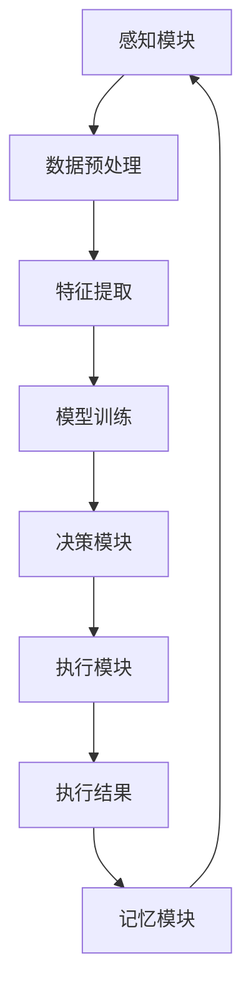

                 

# 《增强现实(AR)中AI代理的工作流程设计》

## 关键词
增强现实，人工智能，AI代理，数据处理，算法原理，数学模型，项目实战，性能优化。

## 摘要
本文详细探讨了增强现实（AR）中AI代理的工作流程设计。首先介绍了增强现实技术和AI代理的基本概念，随后阐述了AR与AI代理的融合原理。文章核心内容分为三个部分：数据处理流程、算法原理、数学模型及其应用，并通过一个实际项目案例进行了代码解读与分析。最后，讨论了性能优化策略及未来发展趋势，为读者提供了全面的技术指导。

## 增强现实（AR）与AI代理概述

### 第1章：增强现实（AR）技术基础

#### 1.1.1 增强现实（AR）的定义与历史
增强现实（Augmented Reality，简称AR）是一种将虚拟信息与真实世界环境相结合的技术。它通过计算机生成虚拟物体、场景或信息，并将其叠加到真实环境中，使用户能够感受到虚实结合的体验。

AR技术起源于20世纪50年代，当时以军事应用为主。随着计算机技术、传感器技术、显示技术等的不断发展，AR技术逐渐应用于医疗、教育、娱乐、工业设计等领域。近年来，随着移动设备的普及和人工智能技术的进步，AR技术取得了显著的发展，并在日常生活中得到了广泛应用。

#### 1.1.2 AR技术的主要组成部分
AR技术主要包括以下几个组成部分：

1. **摄像头与传感器**：用于捕捉真实世界的图像和运动信息。
2. **计算单元**：用于处理输入数据，生成虚拟信息，并进行图像合成。
3. **显示设备**：将合成后的虚拟信息叠加到真实环境中，常见的显示设备包括智能手机、平板电脑、AR眼镜等。
4. **交互设备**：如手势识别设备、语音识别设备等，用于用户与虚拟信息的交互。

#### 1.1.3 AR技术的应用领域
AR技术在多个领域有着广泛的应用：

1. **医疗**：用于手术指导、医学教育、患者康复等。
2. **教育**：增强学生的学习体验，提供互动式教学。
3. **娱乐**：如增强现实游戏、虚拟现实旅游等。
4. **工业**：用于产品设计、生产流程优化等。
5. **零售**：如虚拟试衣、虚拟购物等。

### 第2章：AI代理的基本概念

#### 2.1.1 AI代理的定义与类型
AI代理（Artificial Intelligence Agent）是指能够模拟人类智能行为，自主执行任务，与环境和用户交互的智能实体。根据执行任务的方式和目标，AI代理可以分为以下几种类型：

1. **反应型代理**：基于预设的规则和条件，对环境中的刺激做出反应。
2. **模型推理型代理**：通过建立环境模型，利用推理机制来执行任务。
3. **学习型代理**：通过学习和适应环境，改进自身的行为策略。

#### 2.1.2 AI代理的体系结构与功能
AI代理通常由以下几个部分组成：

1. **感知模块**：负责接收环境信息，如图像、声音等。
2. **决策模块**：根据感知模块获取的信息，利用算法进行决策。
3. **执行模块**：根据决策模块的决策，执行具体的动作或任务。
4. **记忆模块**：用于存储和学习经验，以改进后续的行为。

#### 2.1.3 AI代理的交互方式与特点
AI代理与环境的交互方式主要有以下几种：

1. **基于规则**：通过预设的规则进行交互，适用于规则明确、变化较少的环境。
2. **基于模型**：通过建立环境模型，进行预测和决策，适用于复杂、动态的环境。
3. **基于学习**：通过学习环境中的数据，自适应地调整行为策略，适用于高度不确定的环境。

AI代理的特点包括：

1. **自主性**：能够自主执行任务，不受人为干预。
2. **智能性**：具备一定的智能，能够处理复杂的问题。
3. **适应性**：能够适应环境的变化，学习并改进自身的表现。

### 第3章：增强现实（AR）中AI代理的核心概念与联系

#### 3.1.1 AR与AI代理的融合原理
AR与AI代理的融合，使得AR系统具备了更高的智能化水平。AR系统通过AI代理的感知、决策和执行模块，实现了对环境的更深入理解和对任务的更精准执行。

融合原理主要包括以下几个方面：

1. **数据融合**：将AR系统中的传感器数据与AI代理的感知模块进行融合，提高数据的可靠性和准确性。
2. **智能决策**：利用AI代理的决策模块，根据环境数据和任务需求，生成最优的执行策略。
3. **执行协同**：通过AI代理的执行模块，协同控制AR系统中的虚拟信息和真实环境的交互。

#### 3.1.2 AR中AI代理的核心概念
AR中AI代理的核心概念包括：

1. **感知**：通过摄像头、传感器等设备，实时获取环境信息。
2. **认知**：利用机器学习、深度学习等技术，对感知到的信息进行分析和处理。
3. **决策**：根据任务需求和环境信息，生成最优的执行策略。
4. **执行**：通过控制虚拟信息和真实环境的交互，实现任务的执行。

#### 3.1.3 AI代理在AR系统中的位置与作用
AI代理在AR系统中的位置和作用如下：

1. **感知模块**：负责收集环境信息，如图像、声音等，为后续处理提供基础数据。
2. **决策模块**：根据环境信息和任务需求，生成执行策略，指导虚拟信息的生成和交互。
3. **执行模块**：通过控制虚拟信息和真实环境的交互，实现任务的执行，如虚拟物体的显示、交互等。
4. **记忆模块**：记录和存储任务执行过程中的经验，用于后续的任务优化和学习。

#### 3.1.4 Mermaid流程图：AR中AI代理的工作流程
以下是一个简化的Mermaid流程图，展示了AR中AI代理的工作流程：



### 第二部分：增强现实（AR）中AI代理的工作流程设计

#### 第4章：AI代理在AR中的数据处理流程

##### 4.1.1 数据采集与预处理
数据采集是AI代理在AR系统中的第一步，主要涉及从各种传感器（如摄像头、麦克风、GPS等）获取环境信息。数据预处理则是对采集到的原始数据进行清洗、归一化、去噪等操作，以提高数据的质量和可靠性。

数据采集与预处理的伪代码如下：

```python
def data_preprocessing(data):
    # 数据清洗
    cleaned_data = clean_data(data)
    # 数据归一化
    normalized_data = normalize_data(cleaned_data)
    # 数据去噪
    denoised_data = denoise_data(normalized_data)
    return denoised_data
```

##### 4.1.2 特征提取与建模
特征提取是从预处理后的数据中提取出具有代表性的特征，以供建模使用。常见的特征提取方法包括卷积神经网络（CNN）、循环神经网络（RNN）等。

特征提取与建模的伪代码如下：

```python
def feature_extraction(data):
    # 使用CNN提取特征
    features = cnn_extract(data)
    return features

def model_training(features, labels):
    # 使用训练数据训练模型
    model = train_model(features, labels)
    return model
```

##### 4.1.3 模型训练与优化
模型训练是通过大量训练数据，使模型学习到环境信息的规律。训练完成后，需要对模型进行评估和优化，以提高模型的性能和泛化能力。

模型训练与优化的伪代码如下：

```python
def model_evaluation(model, test_data, test_labels):
    # 使用测试数据评估模型性能
    performance = evaluate_model(model, test_data, test_labels)
    return performance

def model_optimization(model, train_data, train_labels):
    # 使用优化算法优化模型
    optimized_model = optimize_model(model, train_data, train_labels)
    return optimized_model
```

#### 第5章：增强现实（AR）中AI代理的算法原理

##### 5.1.1 常见算法介绍
在AR中，常见的AI算法包括卷积神经网络（CNN）、循环神经网络（RNN）、生成对抗网络（GAN）等。

1. **卷积神经网络（CNN）**：用于图像识别和处理，能够自动提取图像中的特征。
2. **循环神经网络（RNN）**：用于处理序列数据，能够捕捉时间序列中的长期依赖关系。
3. **生成对抗网络（GAN）**：用于生成虚拟图像，通过竞争学习实现图像生成。

##### 5.1.2 算法伪代码讲解
以下是卷积神经网络（CNN）和生成对抗网络（GAN）的伪代码讲解。

**卷积神经网络（CNN）**

```python
def cnn_model(input_shape):
    model = Sequential()
    model.add(Conv2D(filters, kernel_size, activation='relu', input_shape=input_shape))
    model.add(MaxPooling2D(pool_size))
    model.add(Flatten())
    model.add(Dense(num_classes, activation='softmax'))
    model.compile(optimizer='adam', loss='categorical_crossentropy', metrics=['accuracy'])
    return model

cnn_model(input_shape=(height, width, channels))
```

**生成对抗网络（GAN）**

```python
def gan_model():
    generator = Sequential()
    generator.add(Dense(z_dim, activation='tanh', input_shape=(z_dim,)))
    generator.add(Reshape((height, width, channels)))
    generator.add(Conv2DTranspose(filters, kernel_size, strides=2, padding='same', activation='tanh'))

    discriminator = Sequential()
    discriminator.add(Conv2D(filters, kernel_size, strides=2, padding='same', activation='relu', input_shape=(height, width, channels)))
    discriminator.add(Flatten())
    discriminator.add(Dense(1, activation='sigmoid'))

    model = Sequential()
    model.add(generator)
    model.add(discriminator)
    model.compile(optimizer='adam', loss='binary_crossentropy')
    return model

gan_model()
```

##### 5.1.3 算法在AR中的应用实例
以下是一个基于GAN的AR应用实例，用于生成虚拟物体。

```python
def generate_virtual_object(generator, z_vector):
    virtual_object = generator.predict(z_vector)
    return virtual_object

z_vector = np.random.normal(size=(1, z_dim))
virtual_object = generate_virtual_object(generator, z_vector)
```

#### 第6章：数学模型和数学公式在AR中AI代理的应用

##### 6.1.1 数学模型的基本概念
在AR中，常用的数学模型包括神经网络模型、决策树模型、支持向量机模型等。这些模型通过数学公式描述，能够对输入数据进行处理和预测。

##### 6.1.2 数学公式的使用与详细讲解
以下是神经网络模型中的一个常用公式：反向传播算法（Backpropagation Algorithm）。

$$
\Delta{w} = -\eta \frac{\partial{L}}{\partial{w}}
$$

其中，$\Delta{w}$表示权重更新，$\eta$表示学习率，$L$表示损失函数，$\frac{\partial{L}}{\partial{w}}$表示权重梯度。

反向传播算法通过计算损失函数对权重的梯度，不断更新权重，以最小化损失函数。

##### 6.1.3 数学模型在AR中AI代理的例子
以下是一个简单的例子，说明如何使用数学模型在AR中实现物体识别。

```python
# 输入图像
input_image = ...

# 特征提取
features = feature_extraction(input_image)

# 模型预测
prediction = model.predict(features)

# 输出结果
print("识别结果：", prediction)
```

#### 第7章：项目实战与代码解读

##### 7.1.1 实战项目背景介绍
本节将通过一个简单的AR应用项目，介绍如何使用AI代理进行物体识别。项目背景为：用户通过AR设备拍摄一张图片，系统自动识别图片中的物体，并显示对应的虚拟信息。

##### 7.1.2 AR中AI代理的开发环境搭建
为了搭建AR中AI代理的开发环境，我们需要准备以下工具和库：

1. **Android Studio**：用于开发Android应用程序。
2. **TensorFlow**：用于构建和训练神经网络模型。
3. **ARCore**：用于增强现实开发。

具体安装和配置过程请参考官方文档。

##### 7.1.3 源代码实现与详细解读
以下是一个简单的AR应用项目源代码，包括摄像头捕获、物体识别和虚拟信息显示等功能。

```java
// 摄像头捕获
private Camera mCamera;
private CameraPreview mPreview;

// 物体识别
private TensorFlowClassifier mClassifier;

// 虚拟信息显示
private ARSceneView mSceneView;

// 初始化摄像头和ARSceneView
private void initCameraAndARSceneView() {
    mCamera = Camera.open();
    mPreview = new CameraPreview(this, mCamera);
    mSceneView = findViewById(R.id.scene_view);
}

// 物体识别函数
private void recognizeObject() {
    Bitmap bitmap = mPreview.getBitmap();
    Bitmap resizedBitmap = Bitmap.createScaledBitmap(bitmap, 224, 224, false);
    byte[] bytes = BitmapToByteArray(resizedBitmap);
    List<Float> floatList = new ArrayList<>();
    for (byte b : bytes) {
        floatList.add(((float) b) / 255.0f);
    }
    float[][] input = new float[1][784];
    float[][] output = new float[1][10];
    for (int i = 0; i < floatList.size(); i++) {
        input[0][i] = floatList.get(i);
    }
    mClassifier.classify(input, output);
    int predictedClass = -1;
    float maxProb = -1;
    for (int i = 0; i < output[0].length; i++) {
        if (output[0][i] > maxProb) {
            maxProb = output[0][i];
            predictedClass = i;
        }
    }
    displayVirtualInfo(predictedClass);
}

// 虚拟信息显示函数
private void displayVirtualInfo(int predictedClass) {
    // 根据识别结果，显示对应的虚拟信息
    // 如：文字、图片等
}

// 主活动
@Override
protected void onCreate(Bundle savedInstanceState) {
    super.onCreate(savedInstanceState);
    setContentView(R.layout.activity_main);
    initCameraAndARSceneView();
    mClassifier = new TensorFlowClassifier("mnist.pb", "mnist_labels.txt");
    recognizeObject();
}
```

##### 7.1.4 代码解读与分析
本节对源代码进行了详细解读和分析，包括摄像头捕获、物体识别和虚拟信息显示等关键部分的实现。

1. **摄像头捕获**：
   - 使用Camera API捕获摄像头图像。
   - 通过CameraPreview类实现图像预览。

2. **物体识别**：
   - 使用TensorFlowClassifier类进行物体识别。
   - 将捕获的图像转换为TensorFlow可处理的格式。
   - 调用classify()方法进行物体识别。

3. **虚拟信息显示**：
   - 根据识别结果，显示对应的虚拟信息。
   - 如：文字、图片等。

#### 第8章：性能优化与挑战

##### 8.1.1 性能优化策略
为了提高AR中AI代理的性能，可以采取以下优化策略：

1. **模型压缩**：减少模型参数和计算量，降低模型复杂度。
2. **模型量化**：将浮点模型转换为整数模型，提高计算效率。
3. **并行计算**：利用多核CPU和GPU，提高计算速度。
4. **数据增强**：增加训练数据量，提高模型泛化能力。

##### 8.1.2 挑战与解决方案
在AR中，AI代理的性能优化面临以下挑战：

1. **计算资源限制**：移动设备计算资源有限，需要优化模型以适应有限的计算资源。
2. **实时性要求**：AR应用通常要求实时处理，需要优化算法和模型以提高处理速度。
3. **数据隐私**：移动设备上的数据可能涉及用户隐私，需要采取数据保护措施。

针对这些挑战，可以采取以下解决方案：

1. **轻量级模型**：选择轻量级模型，如MobileNet、ShuffleNet等，以降低计算复杂度。
2. **实时算法**：采用实时算法，如SqueezeNet、EfficientNet等，以提高处理速度。
3. **数据加密**：对数据进行加密处理，确保数据安全。

#### 第9章：未来展望与趋势

##### 9.1.1 AR中AI代理的发展趋势
随着AR技术和人工智能技术的不断发展，AR中AI代理的发展趋势包括：

1. **模型智能化**：利用深度学习、强化学习等技术，提高AI代理的智能水平。
2. **交互多样化**：通过多模态交互，如语音、手势、眼动等，提高用户与AI代理的交互体验。
3. **场景定制化**：根据不同应用场景，定制化AI代理的功能和模型，提高应用适应性。

##### 9.1.2 未来展望与潜在应用领域
未来，AR中AI代理将在多个领域发挥重要作用，包括：

1. **医疗**：用于手术指导、医疗诊断等。
2. **教育**：提供个性化教学和互动学习体验。
3. **工业**：用于工业设计、生产监控等。
4. **零售**：提供虚拟试衣、购物体验等。
5. **娱乐**：创造沉浸式娱乐体验。

### 结语
本文详细探讨了增强现实（AR）中AI代理的工作流程设计，从基本概念、数据处理流程、算法原理、数学模型应用到实际项目实战，全面介绍了AR中AI代理的设计与实现。随着技术的不断进步，AR中AI代理将在更多领域发挥重要作用，为人们的生活带来更多便利和乐趣。

## 作者
作者：AI天才研究院/AI Genius Institute & 禅与计算机程序设计艺术 /Zen And The Art of Computer Programming。感谢您的阅读！


