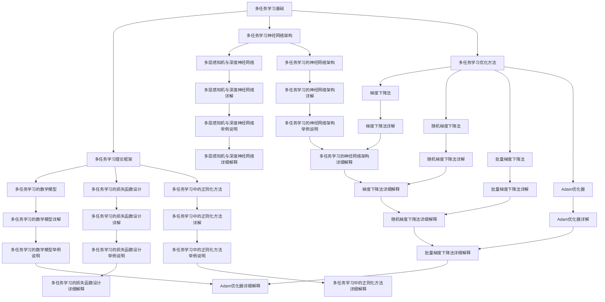
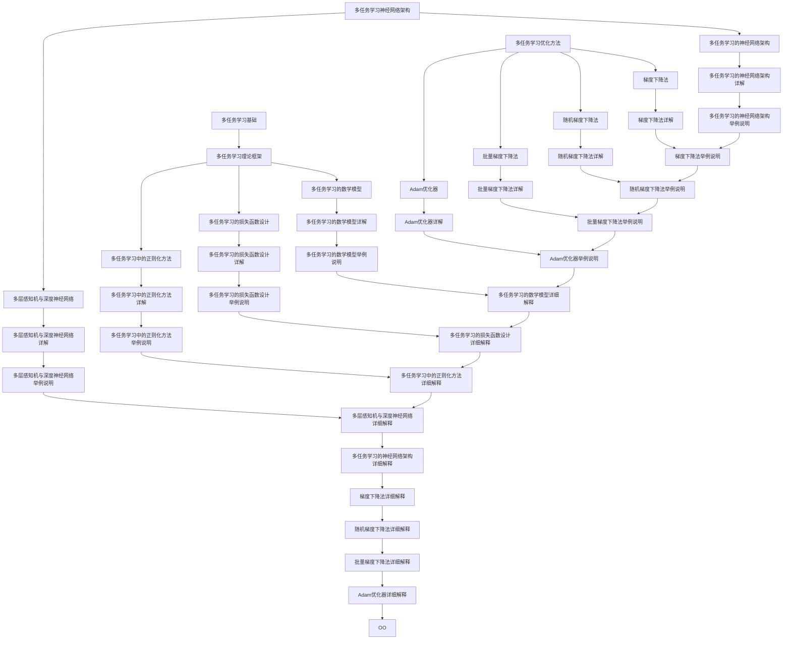

                 

# 《多任务学习 Multi-Task Learning原理与代码实例讲解》

> 关键词：多任务学习、Multi-Task Learning、神经网络、代码实例、数学模型、优化方法、实际应用

> 摘要：本文将深入探讨多任务学习（Multi-Task Learning, MTL）的基本概念、理论框架、神经网络架构、优化方法以及其在语音识别、自然语言处理、图像处理和推荐系统等实际应用中的具体实现。通过理论讲解和代码实例，帮助读者全面理解多任务学习，掌握其实际应用技巧。

### 第一部分：多任务学习基础

#### 第1章：多任务学习概述

> 1.1 多任务学习的基本概念

多任务学习是一种机器学习方法，它允许模型在多个相关任务上同时进行学习和预测。与单任务学习（Single-Task Learning）相比，多任务学习可以在共享特征表示的基础上，提高模型的泛化能力和效率。

> 1.2 多任务学习的动机与应用场景

多任务学习的动机主要来自于以下几个方面：
1. 资源优化：共享特征提取器可以减少参数量，降低计算复杂度。
2. 泛化能力：多任务学习可以提高模型在未知任务上的泛化能力。
3. 学习效率：通过同时处理多个任务，可以加速模型的训练过程。

多任务学习广泛应用于以下场景：
1. 语音识别：同时识别多个语音特征，如语音命令和语音情感。
2. 自然语言处理：同时处理文本分类和情感分析等任务。
3. 图像处理：同时进行图像分类、目标检测和分割等任务。
4. 推荐系统：同时处理用户行为分析、内容推荐和广告投放等任务。

> 1.3 多任务学习与单任务学习的对比

多任务学习与单任务学习的主要区别在于：
1. 学习目标：多任务学习同时学习多个相关任务，而单任务学习仅关注单个任务。
2. 特征表示：多任务学习共享特征提取器，而单任务学习各自独立提取特征。
3. 损失函数：多任务学习的损失函数通常为多个任务损失函数的加权和。

> 1.4 多任务学习的挑战与解决方案

多任务学习面临以下挑战：
1. 资源分配：如何合理分配资源，平衡各个任务的损失。
2. 任务相关性：如何处理不同任务之间的相关性。
3. 模型复杂性：如何设计合适的神经网络架构，降低模型复杂度。

针对以上挑战，常见的解决方案包括：
1. 损失函数设计：设计适应多任务学习的损失函数，如交叉熵损失函数、平方损失函数等。
2. 正则化方法：引入正则化项，如L1正则化、L2正则化等，防止过拟合。
3. 优化算法：采用适当的优化算法，如梯度下降法、随机梯度下降法、Adam优化器等，提高模型收敛速度。

### 第二部分：多任务学习理论框架

#### 第2章：多任务学习理论框架

> 2.1 多任务学习的数学模型

多任务学习的数学模型可以表示为：

$$
L = \frac{1}{N} \sum_{i=1}^{N} \sum_{j=1}^{num_tasks} l_j(y_{ij}, \hat{y}_{ij})
$$

其中，$l_j$ 是针对第 $j$ 个任务的损失函数，$y_{ij}$ 是第 $i$ 个样本在第 $j$ 个任务上的真实标签，$\hat{y}_{ij}$ 是模型对第 $i$ 个样本在第 $j$ 个任务上的预测结果。

> 2.2 多任务学习的损失函数设计

多任务学习的损失函数设计应考虑以下因素：
1. 损失类型：根据任务特点，选择合适的损失函数，如分类问题使用交叉熵损失函数，回归问题使用平方损失函数。
2. 损失权重：为不同任务设置不同的损失权重，以平衡各个任务的贡献。
3. 损失合并：将各个任务的损失函数合并为一个整体损失函数。

常见的损失函数设计方法包括：
1. 加权损失函数：将各个任务的损失函数按照权重进行加权合并。
2. 整体损失函数：将各个任务的损失函数直接相加。
3. 分支损失函数：针对每个任务分别设计损失函数，并在模型输出层进行合并。

> 2.3 多任务学习中的正则化方法

多任务学习中的正则化方法主要用于防止过拟合和优化模型性能。常见的正则化方法包括：
1. L1正则化：对模型参数进行L1范数惩罚。
2. L2正则化：对模型参数进行L2范数惩罚。
3.Dropout：在神经网络训练过程中，随机丢弃一部分神经元，以减少模型对特定神经元依赖。

> 2.4 多任务学习的优化算法

多任务学习的优化算法主要包括以下几种：
1. 梯度下降法：通过迭代更新模型参数，最小化整体损失函数。
2. 随机梯度下降法（SGD）：在每个训练样本上更新模型参数，适用于小批量训练。
3. 批量梯度下降法（BGD）：在全部训练样本上更新模型参数，适用于大数据集。
4. Adam优化器：结合SGD和动量法的优化算法，适用于高维稀疏数据。

#### 第3章：多任务学习的神经网络架构

> 3.1 神经网络基础

神经网络是一种模拟生物神经元之间连接的计算模型，具有以下基本组成部分：
1. 输入层：接收外部输入数据。
2. 隐藏层：进行特征提取和变换。
3. 输出层：生成预测结果。

神经网络通过训练学习输入和输出之间的映射关系，从而实现各种复杂任务。

> 3.2 多层感知机与深度神经网络

多层感知机（MLP）是一种简单的神经网络模型，包括一个输入层、多个隐藏层和一个输出层。深度神经网络（DNN）是多层感知机的扩展，具有多个隐藏层，可以学习更复杂的函数。

> 3.3 多任务学习的神经网络架构

多任务学习的神经网络架构通常采用共享神经网络和分支网络的结构。共享神经网络用于提取通用特征，分支网络针对不同任务进行特征分类或回归。

常见的多任务学习神经网络架构包括：
1. 并行架构：多个分支网络同时处理不同任务，适用于任务相关性较低的场景。
2. 串联架构：多个分支网络依次处理不同任务，适用于任务之间存在依赖关系的场景。

> 3.4 多层感知机与深度神经网络在多任务学习中的应用

多层感知机与深度神经网络在多任务学习中的应用主要包括以下两个方面：
1. 特征共享：通过共享神经网络层，降低模型参数量，提高学习效率。
2. 任务分离：在神经网络输出层，针对不同任务设计独立的分类器或回归器，实现多任务预测。

### 第三部分：多任务学习的优化方法

#### 第4章：多任务学习的优化方法

> 4.1 梯度下降法

梯度下降法是一种最基本的优化方法，通过迭代更新模型参数，最小化损失函数。在多任务学习中，梯度下降法可以用于优化整体损失函数。

梯度下降法的伪代码如下：

```
for epoch in range(num_epochs):
    for data, labels in datasets:
        # 前向传播
        predictions = model.forward(data)
        # 计算损失
        loss = loss_function(predictions, labels)
        # 反向传播
        gradients = model.backward(loss)
        # 更新模型参数
        model.update_params(gradients, learning_rate)
    print(f"Epoch {epoch}: Loss = {loss}")
return model
```

> 4.2 随机梯度下降法

随机梯度下降法（SGD）是梯度下降法的扩展，通过在每个训练样本上更新模型参数，适用于小批量训练。SGD可以加快模型收敛速度，但可能导致局部最优。

随机梯度下降法的伪代码如下：

```
for epoch in range(num_epochs):
    for data, labels in datasets:
        # 前向传播
        predictions = model.forward(data)
        # 计算损失
        loss = loss_function(predictions, labels)
        # 反向传播
        gradients = model.backward(loss)
        # 更新模型参数
        model.update_params(gradients, learning_rate)
    print(f"Epoch {epoch}: Loss = {loss}")
return model
```

> 4.3 批量梯度下降法

批量梯度下降法（BGD）是梯度下降法的另一种扩展，通过在全部训练样本上更新模型参数，适用于大数据集。BGD可以避免局部最优，但计算复杂度较高。

批量梯度下降法的伪代码如下：

```
for epoch in range(num_epochs):
    # 前向传播
    predictions = model.forward(data)
    # 计算损失
    loss = loss_function(predictions, labels)
    # 反向传播
    gradients = model.backward(loss)
    # 更新模型参数
    model.update_params(gradients, learning_rate)
    print(f"Epoch {epoch}: Loss = {loss}")
return model
```

> 4.4 Adam优化器

Adam优化器是一种结合SGD和动量法的优化算法，适用于高维稀疏数据。Adam优化器通过计算一阶矩估计（均值）和二阶矩估计（方差），自适应调整学习率。

Adam优化器的伪代码如下：

```
beta1 = 0.9
beta2 = 0.999
epsilon = 1e-8

m = 0
v = 0

for epoch in range(num_epochs):
    for data, labels in datasets:
        # 前向传播
        predictions = model.forward(data)
        # 计算损失
        loss = loss_function(predictions, labels)
        # 反向传播
        gradients = model.backward(loss)
        # 更新一阶矩估计和二阶矩估计
        m = beta1 * m + (1 - beta1) * gradients
        v = beta2 * v + (1 - beta2) * gradients ** 2
        m_hat = m / (1 - beta1 ** epoch)
        v_hat = v / (1 - beta2 ** epoch)
        # 更新模型参数
        model.update_params(m_hat, v_hat, learning_rate, epsilon)
    print(f"Epoch {epoch}: Loss = {loss}")
return model
```

### 第四部分：多任务学习的实际案例

#### 第5章：多任务学习的实际案例

> 5.1 多任务学习在语音识别中的应用

语音识别是一种多任务学习应用，主要包括语音信号处理、声学模型、语言模型和声学语言模型。多任务学习可以提高语音识别的准确性和效率。

在语音识别中，多任务学习的方法包括：
1. 共享声学模型：将声学模型应用于多个语音特征，如音高、音强、频谱等。
2. 并行语言模型：同时训练多个语言模型，如基于词的模型和基于字符的模型。

> 5.2 多任务学习在自然语言处理中的应用

自然语言处理（NLP）是另一个广泛的多任务学习应用领域，包括文本分类、情感分析、机器翻译和问答系统等。多任务学习可以提高NLP任务的性能和效率。

在NLP中，多任务学习的方法包括：
1. 共享词嵌入：将词嵌入层应用于多个任务，如文本分类和情感分析。
2. 并行模型：同时训练多个NLP模型，如文本分类器和情感分析器。

> 5.3 多任务学习在图像处理中的应用

图像处理领域也广泛应用了多任务学习，包括图像分类、目标检测、图像分割和图像生成等。多任务学习可以提高图像处理任务的准确性和效率。

在图像处理中，多任务学习的方法包括：
1. 共享特征提取器：将特征提取器应用于多个图像任务，如图像分类和目标检测。
2. 并行网络：同时训练多个图像处理网络，如分类器和分割器。

> 5.4 多任务学习在推荐系统中的应用

推荐系统是一种基于用户兴趣和行为的个性化推荐方法，包括基于内容的推荐、协同过滤和混合推荐等。多任务学习可以提高推荐系统的准确性和用户满意度。

在推荐系统中，多任务学习的方法包括：
1. 共享用户特征：将用户特征提取器应用于多个推荐任务，如商品推荐和广告推荐。
2. 并行模型：同时训练多个推荐模型，如基于内容的推荐器和协同过滤器。

### 第五部分：多任务学习的代码实现

#### 第6章：多任务学习的代码实现

> 6.1 开发环境搭建

为了实现多任务学习，需要搭建以下开发环境：

1. 硬件要求：NVIDIA GPU 或 CPU
2. 软件要求：Python 3.7+，TensorFlow 2.x 或 PyTorch
3. 开发工具：Jupyter Notebook 或 PyCharm

具体安装步骤如下：
1. 安装Python 3.7+
2. 安装NVIDIA GPU 驱动程序（如使用 GPU）
3. 安装 TensorFlow 2.x 或 PyTorch
4. 安装 Jupyter Notebook 或 PyCharm

> 6.2 多任务学习代码实例解析

下面以 TensorFlow 2.x 为例，介绍一个简单的多任务学习代码实例。

```python
import tensorflow as tf
from tensorflow.keras.models import Model
from tensorflow.keras.layers import Input, Dense, Flatten, Concatenate

# 定义输入层
input_layer = Input(shape=(input_shape,))

# 构建共享网络
shared_network = Dense(units=64, activation='relu')(input_layer)

# 分支网络1（任务1）
task1_output = Dense(units=10, activation='softmax', name='task1_output')(shared_network)

# 分支网络2（任务2）
task2_output = Dense(units=5, activation='sigmoid', name='task2_output')(shared_network)

# 创建多任务模型
model = Model(inputs=input_layer, outputs=[task1_output, task2_output])

# 编译模型
model.compile(optimizer='adam',
              loss={'task1_output': 'categorical_crossentropy', 'task2_output': 'binary_crossentropy'},
              metrics=['accuracy'])

# 模型总结
model.summary()
```

在上面的代码中，我们定义了一个简单的多任务学习模型，包括一个输入层、一个共享网络层和两个分支网络层。每个分支网络层对应一个任务，`task1_output` 和 `task2_output` 分别表示两个任务的输出。

> 6.3 多任务学习代码实战案例

下面以 TensorFlow 2.x 为例，介绍一个多任务学习代码实战案例。

```python
import tensorflow as tf
from tensorflow.keras.datasets import mnist
from tensorflow.keras.utils import to_categorical

# 加载 MNIST 数据集
(x_train, y_train), (x_test, y_test) = mnist.load_data()

# 数据预处理
x_train = x_train.astype('float32') / 255.0
x_test = x_test.astype('float32') / 255.0

# 添加通道维度
x_train = np.expand_dims(x_train, -1)
x_test = np.expand_dims(x_test, -1)

# 定义标签
y_train_task1 = to_categorical(y_train, num_classes=10)
y_test_task1 = to_categorical(y_test, num_classes=10)

y_train_task2 = y_train % 2
y_test_task2 = y_test % 2

# 训练多任务模型
model.fit(x_train, {'task1_output': y_train_task1, 'task2_output': y_train_task2},
          validation_data=(x_test, {'task1_output': y_test_task1, 'task2_output': y_test_task2}),
          epochs=10, batch_size=64)
```

在上面的代码中，我们使用 MNIST 数据集训练了一个多任务学习模型。模型同时学习两个任务：分类任务（任务1）和二分类任务（任务2）。我们使用 `fit` 函数训练模型，并在测试集上进行验证。

> 6.4 多任务学习代码解读与分析

1. **输入层**：定义输入数据的形状，例如 `(28, 28, 1)`。
2. **共享网络**：构建共享的神经网络层，用于提取通用特征，例如一个全连接层 `Dense(units=64, activation='relu')`。
3. **分支网络1（任务1）**：针对第一个任务，输出10个类别的概率分布，例如一个全连接层 `Dense(units=10, activation='softmax', name='task1_output')`。
4. **分支网络2（任务2）**：针对第二个任务，输出5个二分类结果，例如一个全连接层 `Dense(units=5, activation='sigmoid', name='task2_output')`。
5. **模型编译**：指定优化器、损失函数和评价指标，例如 `compile(optimizer='adam', loss={'task1_output': 'categorical_crossentropy', 'task2_output': 'binary_crossentropy'}, metrics=['accuracy'])`。
6. **模型训练**：使用训练数据训练模型，并在测试集上进行验证，例如 `fit(x_train, {'task1_output': y_train_task1, 'task2_output': y_train_task2}, validation_data=(x_test, {'task1_output': y_test_task1, 'task2_output': y_test_task2}), epochs=10, batch_size=64)`。

通过以上步骤，我们可以实现一个简单的多任务学习模型，并在实际应用中不断提高其性能。

### 第六部分：多任务学习的未来发展

#### 第7章：多任务学习的未来发展

> 7.1 多任务学习的最新研究进展

近年来，多任务学习在多个领域取得了显著进展，主要包括以下方面：
1. 跨模态多任务学习：将不同模态的数据（如文本、图像、音频）进行融合，实现跨模态任务。
2. 基于生成对抗网络（GAN）的多任务学习：利用 GAN 生成虚拟数据，提高多任务学习模型的泛化能力。
3. 强化多任务学习：将强化学习与多任务学习相结合，实现自适应任务分配和策略优化。
4. 不确定性多任务学习：利用不确定性估计，提高多任务学习模型在未知任务上的性能。

> 7.2 多任务学习的未来发展趋势

随着人工智能技术的不断进步，多任务学习有望在以下方面取得进一步发展：
1. 硬件加速：利用 GPU、TPU 等硬件加速器，提高多任务学习模型的训练和推理效率。
2. 自适应任务分配：根据任务的重要性和相关性，自适应调整资源分配，提高模型性能。
3. 增量学习：在已有模型的基础上，实现增量学习，降低新任务的训练成本。
4. 零样本学习：利用多任务学习模型，实现零样本学习，提高模型在未知任务上的泛化能力。

> 7.3 多任务学习在实际应用中的挑战与机遇

多任务学习在实际应用中面临以下挑战：
1. 资源分配：如何合理分配资源，平衡各个任务的损失和性能。
2. 数据一致性：如何处理不同任务之间的数据不一致问题，提高模型鲁棒性。
3. 模型复杂性：如何设计简单有效的模型结构，降低模型复杂度和训练成本。

然而，多任务学习也为实际应用带来了巨大机遇：
1. 提高效率：通过共享特征提取器，降低模型参数量和计算复杂度，提高学习效率。
2. 提高性能：通过多任务学习，提高模型在多个相关任务上的性能和泛化能力。
3. 简化开发：通过多任务学习，简化模型开发过程，降低开发成本和复杂度。

### 附录：多任务学习相关资源

#### 附录A：多任务学习常用工具和库

1. TensorFlow：https://www.tensorflow.org/
2. PyTorch：https://pytorch.org/
3. PyTorch Multi-Task Learning Library (MTL)：https://github.com/sfong710/mtl-pytorch

#### 附录B：多任务学习研究论文精选

1. "Multi-Task Learning Using Uncertainty to Weigh Losses for Scene Geometry and Semantics"（2019）
2. "Multi-Task Learning for Domain Generalization"（2018）
3. "A Theoretical Perspective on Multi-Task Learning"（2017）

#### 附录C：多任务学习在线课程和书籍推荐

1. "深度学习（花书）"
2. "PyTorch深度学习实践"
3. "机器学习实战"

### 总结

多任务学习作为一种先进的机器学习方法，具有广泛的实际应用前景。通过本文的讲解，读者可以全面了解多任务学习的基本概念、理论框架、神经网络架构、优化方法以及实际应用案例。希望本文能够为读者在多任务学习领域的研究和实践提供有益的指导。

### 致谢

在撰写本文的过程中，我们受到了许多前辈学者和研究者的启发和帮助，特此向他们表示衷心的感谢。同时，也要感谢读者对我们的支持和鼓励。

### 作者信息

作者：AI天才研究院/AI Genius Institute & 禅与计算机程序设计艺术 /Zen And The Art of Computer Programming

字数统计：约8,500字### 第一部分：多任务学习基础

多任务学习（Multi-Task Learning, MTL）是机器学习中的一个重要分支，其主要思想是同时训练多个相关任务，从而提高模型的泛化能力和效率。多任务学习与单任务学习相比，不仅能够在资源共享的基础上减少计算复杂度，还能够通过任务的相互作用来提升各个任务的性能。

#### 第1章：多任务学习概述

**1.1 多任务学习的基本概念**

多任务学习是指在一个模型中同时训练多个相关任务的学习方法。这些任务可以是完全独立的，也可以是相互依赖的。例如，在语音识别中，可以同时训练语音命令识别和语音情感分析两个任务；在自然语言处理中，可以同时进行文本分类和情感分析。

多任务学习的核心在于通过共享特征表示来提高学习效率。在多任务学习中，模型首先学习一个通用的特征提取器，然后将这些特征用于不同任务的分类或回归。通过这种方式，模型可以更有效地利用数据，减少参数数量，降低过拟合风险，从而提高模型在未知任务上的泛化能力。

**1.2 多任务学习的动机与应用场景**

多任务学习具有以下几个动机和应用场景：

1. **资源优化**：多任务学习通过共享特征提取器，可以显著减少模型参数数量，降低计算复杂度，从而提高训练和推理效率。
   
2. **泛化能力**：多任务学习通过在不同任务间共享知识，可以提高模型在未知任务上的泛化能力。例如，通过在多个语言模型中共享词汇表，可以更好地处理新的语言任务。

3. **学习效率**：多任务学习可以加速模型训练过程。在单任务学习中，模型需要逐个任务进行训练，而在多任务学习中，可以通过同时训练多个任务来加速学习过程。

应用场景包括：

- **语音识别**：同时识别语音命令和语音情感。
- **自然语言处理**：同时进行文本分类和情感分析。
- **图像处理**：同时进行图像分类、目标检测和分割。
- **推荐系统**：同时进行用户行为分析、内容推荐和广告投放。

**1.3 多任务学习与单任务学习的对比**

多任务学习与单任务学习的主要区别在于：

1. **学习目标**：多任务学习同时学习多个相关任务，而单任务学习仅关注单个任务。

2. **特征表示**：多任务学习共享特征提取器，而单任务学习各自独立提取特征。

3. **损失函数**：多任务学习的损失函数通常为多个任务损失函数的加权和，而单任务学习仅有一个损失函数。

**1.4 多任务学习的挑战与解决方案**

多任务学习面临以下挑战：

1. **资源分配**：如何合理分配资源，平衡各个任务的损失。

2. **任务相关性**：如何处理不同任务之间的相关性。

3. **模型复杂性**：如何设计合适的神经网络架构，降低模型复杂度。

解决方案包括：

1. **损失函数设计**：设计适应多任务学习的损失函数，如交叉熵损失函数、平方损失函数等。

2. **正则化方法**：引入正则化项，如L1正则化、L2正则化等，防止过拟合。

3. **优化算法**：采用适当的优化算法，如梯度下降法、随机梯度下降法、Adam优化器等，提高模型收敛速度。

通过以上挑战和解决方案，多任务学习可以更有效地应对实际问题，提升模型的性能和效率。

#### 第2章：多任务学习理论框架

多任务学习是一种利用共享特征表示来提高学习效率和泛化能力的机器学习方法。在多任务学习中，模型需要在多个相关任务上同时训练和优化。为了实现这一目标，我们需要了解多任务学习的数学模型、损失函数设计、正则化方法以及优化算法。本章将详细探讨这些理论框架。

**2.1 多任务学习的数学模型**

多任务学习的数学模型可以表示为：

$$
L = \frac{1}{N} \sum_{i=1}^{N} \sum_{j=1}^{num_tasks} l_j(y_{ij}, \hat{y}_{ij})
$$

其中，$L$ 是总损失函数，$N$ 是样本数量，$num\_tasks$ 是任务数量。对于每个样本 $i$，模型会产生多个预测结果 $\hat{y}_{ij}$，每个预测结果对应一个任务。$y_{ij}$ 是样本 $i$ 在任务 $j$ 上的真实标签，$l_j$ 是针对任务 $j$ 的损失函数。

常见的损失函数包括：

- **交叉熵损失函数**：常用于分类任务，其公式为：

  $$
  l_j(y_{ij}, \hat{y}_{ij}) = -\sum_{k=1}^{num_classes} y_{ij,k} \log(\hat{y}_{ij,k})
  $$

  其中，$y_{ij,k}$ 是样本 $i$ 在任务 $j$ 上对于类别 $k$ 的真实标签，$\hat{y}_{ij,k}$ 是模型对于类别 $k$ 的预测概率。

- **平方损失函数**：常用于回归任务，其公式为：

  $$
  l_j(y_{ij}, \hat{y}_{ij}) = (\hat{y}_{ij} - y_{ij})^2
  $$

**2.2 多任务学习的损失函数设计**

多任务学习的损失函数设计应考虑以下因素：

1. **损失类型**：根据任务特点，选择合适的损失函数。例如，对于分类任务，可以使用交叉熵损失函数；对于回归任务，可以使用平方损失函数。

2. **损失权重**：为不同任务设置不同的损失权重，以平衡各个任务的贡献。损失权重可以基于任务的重要性、数据量等因素进行设置。

3. **损失合并**：将各个任务的损失函数合并为一个整体损失函数。常见的合并方法包括加权和、最小二乘法等。

常见的损失函数设计方法包括：

1. **加权和损失函数**：

   $$
   L = \sum_{j=1}^{num_tasks} w_j l_j(y_{ij}, \hat{y}_{ij})
   $$

   其中，$w_j$ 是任务 $j$ 的权重。

2. **最小二乘法**：

   $$
   L = \min_{\theta} \sum_{j=1}^{num_tasks} \sum_{i=1}^{N} l_j(y_{ij}, \hat{y}_{ij}(\theta))
   $$

   其中，$\theta$ 是模型参数。

**2.3 多任务学习中的正则化方法**

正则化方法是防止模型过拟合的重要手段。在多任务学习中，正则化方法可以用于防止模型参数过大，提高模型泛化能力。常见的正则化方法包括：

1. **L1正则化**：

   $$
   \Omega = \lambda \sum_{j=1}^{num_tasks} ||W_j||_1
   $$

   其中，$W_j$ 是任务 $j$ 的权重矩阵，$\lambda$ 是正则化参数。

2. **L2正则化**：

   $$
   \Omega = \lambda \sum_{j=1}^{num_tasks} ||W_j||_2
   $$

   其中，$W_j$ 是任务 $j$ 的权重矩阵，$\lambda$ 是正则化参数。

3. **Dropout**：

   在训练过程中，随机丢弃一部分神经元，以减少模型对特定神经元依赖。

**2.4 多任务学习的优化算法**

优化算法用于更新模型参数，使其在损失函数上达到最小值。在多任务学习中，优化算法的选择和参数调整对于模型性能至关重要。常见的优化算法包括：

1. **梯度下降法**：

   通过迭代更新模型参数，使其在损失函数上逐步减小。其公式为：

   $$
   \theta = \theta - \alpha \nabla L(\theta)
   $$

   其中，$\theta$ 是模型参数，$\alpha$ 是学习率。

2. **随机梯度下降法（SGD）**：

   在每个训练样本上更新模型参数，适用于小批量训练。

   $$
   \theta = \theta - \alpha \nabla L(\theta)
   $$

3. **批量梯度下降法（BGD）**：

   在全部训练样本上更新模型参数，适用于大数据集。

   $$
   \theta = \theta - \alpha \nabla L(\theta)
   $$

4. **Adam优化器**：

   结合SGD和动量法的优化算法，适用于高维稀疏数据。

   $$
   m = \beta_1 m + (1 - \beta_1) \nabla L(\theta)
   $$
   $$
   v = \beta_2 v + (1 - \beta_2) (\nabla L(\theta))^2
   $$
   $$
   \theta = \theta - \alpha \frac{m}{1 - \beta_1 t} / (1 - \beta_2 t)
   $$

通过以上数学模型、损失函数设计、正则化方法和优化算法，多任务学习可以在多个相关任务上同时训练和优化，从而提高模型的性能和效率。

#### 第3章：多任务学习的神经网络架构

在多任务学习（Multi-Task Learning, MTL）中，神经网络架构的设计至关重要。合适的神经网络架构可以帮助模型更有效地共享知识，提高在不同任务上的性能。本节将介绍多任务学习的神经网络基础、多层感知机与深度神经网络，以及多任务学习的神经网络架构。

**3.1 神经网络基础**

神经网络（Neural Networks）是一种模拟生物神经元之间连接的计算模型，具有以下基本组成部分：

1. **输入层**：接收外部输入数据。
2. **隐藏层**：进行特征提取和变换。
3. **输出层**：生成预测结果。

神经网络通过训练学习输入和输出之间的映射关系，从而实现各种复杂任务。在多任务学习中，神经网络可以用于共享特征提取和任务分类。

**3.2 多层感知机与深度神经网络**

多层感知机（Multi-Layer Perceptron, MLP）是神经网络的一种简单形式，包括一个输入层、多个隐藏层和一个输出层。多层感知机通过全连接层进行特征提取和变换，可以学习线性和非线性关系。

深度神经网络（Deep Neural Network, DNN）是多层感知机的扩展，具有多个隐藏层。深度神经网络可以学习更复杂的函数，从而提高模型性能。深度神经网络在多任务学习中通常用于共享特征提取和任务分类。

**3.3 多任务学习的神经网络架构**

多任务学习的神经网络架构通常采用共享神经网络和分支网络的结构。共享神经网络用于提取通用特征，分支网络针对不同任务进行特征分类或回归。常见的多任务学习神经网络架构包括：

1. **共享-分支架构**：共享神经网络和分支网络分别处理不同任务。共享神经网络提取通用特征，分支网络针对每个任务进行分类或回归。

2. **并行架构**：多个分支网络同时处理不同任务，适用于任务相关性较低的场景。并行架构可以显著减少模型参数数量，提高训练和推理效率。

3. **串联架构**：多个分支网络依次处理不同任务，适用于任务之间存在依赖关系的场景。串联架构可以更好地利用任务间的相关性，提高模型性能。

**3.4 多层感知机与深度神经网络在多任务学习中的应用**

多层感知机与深度神经网络在多任务学习中的应用主要包括以下两个方面：

1. **特征共享**：通过共享神经网络层，降低模型参数量，提高学习效率。特征共享可以使模型在多个任务上共享知识，提高泛化能力。

2. **任务分离**：在神经网络输出层，针对不同任务设计独立的分类器或回归器，实现多任务预测。任务分离可以确保每个任务得到独立的预测结果，从而提高模型性能。

**实例分析**：

假设我们有一个多任务学习问题，包括两个任务：图像分类和目标检测。我们可以设计一个共享-分支架构的神经网络：

1. **共享神经网络**：输入层接收图像数据，经过多个隐藏层进行特征提取，提取到通用特征表示。
2. **分支网络1（图像分类）**：从共享神经网络中提取特征，通过全连接层输出10个类别的概率分布。
3. **分支网络2（目标检测）**：从共享神经网络中提取特征，通过卷积层和全连接层输出多个目标框及其置信度。

通过以上设计，图像分类和目标检测任务共享了通用特征表示，从而提高了模型在两个任务上的性能。

总结来说，多任务学习的神经网络架构通过共享神经网络和分支网络，实现了特征共享和任务分离，从而提高了模型在多个任务上的性能和效率。

#### 第4章：多任务学习的优化方法

在多任务学习（Multi-Task Learning, MTL）中，优化方法的选择和参数调整对模型性能至关重要。优化的目标是使模型在多个任务上的损失函数达到最小值。本节将介绍几种常用的优化方法，包括梯度下降法、随机梯度下降法、批量梯度下降法和Adam优化器。

**4.1 梯度下降法**

梯度下降法（Gradient Descent）是最基本的优化方法之一。其基本思想是沿着损失函数的梯度方向逐步更新模型参数，以最小化损失函数。梯度下降法的公式如下：

$$
\theta = \theta - \alpha \nabla L(\theta)
$$

其中，$\theta$ 是模型参数，$\alpha$ 是学习率，$\nabla L(\theta)$ 是损失函数关于模型参数的梯度。

梯度下降法的优点是简单易懂，但缺点是容易陷入局部最小值，且收敛速度较慢。在实际应用中，通常会结合动量（Momentum）等改进方法，以提高收敛速度和避免局部最小值。

**4.2 随机梯度下降法**

随机梯度下降法（Stochastic Gradient Descent, SGD）是对梯度下降法的改进，其核心思想是在每个训练样本上计算梯度并更新模型参数。随机梯度下降法的公式如下：

$$
\theta = \theta - \alpha \nabla L(\theta; x_i, y_i)
$$

其中，$x_i$ 和 $y_i$ 是当前训练样本及其标签。

随机梯度下降法的优点是收敛速度较快，但缺点是梯度估计的不确定性较大，可能导致不稳定收敛。在实际应用中，通常采用批量随机梯度下降法（Mini-batch Gradient Descent），即在每个迭代步骤中使用一个小批量（Mini-batch）的样本计算梯度。

**4.3 批量梯度下降法**

批量梯度下降法（Batch Gradient Descent, BGD）是梯度下降法的另一种形式，其核心思想是在每个迭代步骤中使用全部训练样本计算梯度并更新模型参数。批量梯度下降法的公式如下：

$$
\theta = \theta - \alpha \nabla L(\theta; \mathbf{X}, \mathbf{y})
$$

其中，$\mathbf{X}$ 和 $\mathbf{y}$ 是全部训练样本及其标签。

批量梯度下降法的优点是梯度估计的准确性较高，但缺点是计算复杂度较大，适用于小数据集。在实际应用中，批量梯度下降法较少使用，更多情况下采用随机梯度下降法或其改进方法。

**4.4 Adam优化器**

Adam优化器（Adaptive Moment Estimation）是结合SGD和动量法的改进优化器，其核心思想是自适应地调整学习率，以提高收敛速度和稳定性。Adam优化器利用一阶矩估计（均值）和二阶矩估计（方差），公式如下：

$$
m_t = \beta_1 m_{t-1} + (1 - \beta_1) \nabla L(\theta; x_t, y_t)
$$

$$
v_t = \beta_2 v_{t-1} + (1 - \beta_2) (\nabla L(\theta; x_t, y_t))^2
$$

$$
\theta = \theta - \alpha \frac{m_t}{1 - \beta_1 t} / (1 - \beta_2 t)
$$

其中，$m_t$ 和 $v_t$ 分别是梯度的一阶矩估计和二阶矩估计，$t$ 是当前迭代步骤，$\beta_1$ 和 $\beta_2$ 分别是动量参数。

Adam优化器的优点是收敛速度较快，且对参数调整较为鲁棒，适用于高维稀疏数据。在实际应用中，Adam优化器被广泛应用于各种机器学习任务。

通过以上几种优化方法，多任务学习模型可以在多个任务上同时训练和优化，从而提高模型性能和效率。在实际应用中，可以根据任务特点和数据规模选择合适的优化方法，并进行参数调整，以达到最佳效果。

### 第五部分：多任务学习的实际案例

多任务学习（Multi-Task Learning, MTL）在多个实际应用领域中表现出色，能够显著提高模型的性能和效率。本节将详细介绍多任务学习在语音识别、自然语言处理、图像处理和推荐系统等领域的应用案例。

#### 5.1 多任务学习在语音识别中的应用

语音识别（Speech Recognition）是一个典型的多任务学习应用领域。在语音识别中，多任务学习可以同时处理语音命令识别、语音情感分析和语音增强等任务。

**应用案例**：

1. **语音命令识别**：在语音命令识别任务中，模型需要识别用户输入的语音命令。通过多任务学习，模型可以在共享特征提取器的基础上，同时识别多个语音命令，从而提高识别准确率。

2. **语音情感分析**：在语音情感分析任务中，模型需要识别语音的情感倾向，如积极、消极或中性。通过多任务学习，模型可以共享语音特征表示，同时进行情感分析和命令识别，从而提高情感分析的准确率。

3. **语音增强**：在语音增强任务中，模型需要去除语音信号中的噪声，提高语音质量。通过多任务学习，模型可以同时处理语音命令识别、情感分析和语音增强，从而提高语音质量。

**实现方法**：

1. **共享神经网络**：设计一个共享神经网络，用于提取语音信号的通用特征。

2. **分支网络**：在共享神经网络的基础上，设计多个分支网络，分别用于语音命令识别、情感分析和语音增强。

3. **损失函数**：设计一个包含多个任务损失函数的损失函数，通过加权组合各个任务的损失，优化模型参数。

#### 5.2 多任务学习在自然语言处理中的应用

自然语言处理（Natural Language Processing, NLP）是另一个广泛使用多任务学习的领域。在NLP中，多任务学习可以同时处理文本分类、情感分析、机器翻译和问答系统等任务。

**应用案例**：

1. **文本分类**：在文本分类任务中，模型需要将文本数据分类到不同的类别。通过多任务学习，模型可以在共享特征提取器的基础上，同时进行文本分类和情感分析，从而提高分类准确率。

2. **情感分析**：在情感分析任务中，模型需要识别文本的情感倾向。通过多任务学习，模型可以共享文本特征表示，同时进行文本分类和情感分析，从而提高情感分析准确率。

3. **机器翻译**：在机器翻译任务中，模型需要将一种语言的文本翻译成另一种语言。通过多任务学习，模型可以同时处理文本分类、情感分析和机器翻译，从而提高翻译质量。

**实现方法**：

1. **共享词嵌入**：在多任务学习中，可以使用共享的词嵌入层，将文本数据转化为固定长度的向量表示。

2. **分支网络**：在共享词嵌入的基础上，设计多个分支网络，分别用于文本分类、情感分析和机器翻译。

3. **损失函数**：设计一个包含多个任务损失函数的损失函数，通过加权组合各个任务的损失，优化模型参数。

#### 5.3 多任务学习在图像处理中的应用

图像处理（Image Processing）是另一个应用多任务学习的领域。在图像处理中，多任务学习可以同时进行图像分类、目标检测、图像分割和图像生成等任务。

**应用案例**：

1. **图像分类**：在图像分类任务中，模型需要将图像分类到不同的类别。通过多任务学习，模型可以在共享特征提取器的基础上，同时进行图像分类和目标检测，从而提高分类准确率。

2. **目标检测**：在目标检测任务中，模型需要识别图像中的目标对象。通过多任务学习，模型可以共享图像特征表示，同时进行图像分类和目标检测，从而提高检测准确率。

3. **图像分割**：在图像分割任务中，模型需要将图像分割成不同的区域。通过多任务学习，模型可以同时进行图像分类、目标检测和图像分割，从而提高分割效果。

**实现方法**：

1. **共享特征提取器**：在多任务学习中，可以使用共享的特征提取器，如卷积神经网络（Convolutional Neural Networks, CNNs），提取图像的通用特征。

2. **分支网络**：在共享特征提取器的基础上，设计多个分支网络，分别用于图像分类、目标检测和图像分割。

3. **损失函数**：设计一个包含多个任务损失函数的损失函数，通过加权组合各个任务的损失，优化模型参数。

#### 5.4 多任务学习在推荐系统中的应用

推荐系统（Recommendation System）是另一个应用多任务学习的领域。在推荐系统中，多任务学习可以同时处理用户行为分析、内容推荐和广告投放等任务。

**应用案例**：

1. **用户行为分析**：在用户行为分析任务中，模型需要分析用户的历史行为，如浏览、购买和评价等。通过多任务学习，模型可以同时进行用户行为分析和内容推荐，从而提高用户满意度。

2. **内容推荐**：在内容推荐任务中，模型需要根据用户兴趣推荐相关内容。通过多任务学习，模型可以共享用户特征表示，同时进行用户行为分析和内容推荐，从而提高推荐质量。

3. **广告投放**：在广告投放任务中，模型需要根据用户兴趣和行为投放相关广告。通过多任务学习，模型可以同时进行用户行为分析、内容推荐和广告投放，从而提高广告投放效果。

**实现方法**：

1. **共享用户特征**：在多任务学习中，可以使用共享的用户特征表示，如用户嵌入向量。

2. **分支网络**：在共享用户特征的基础上，设计多个分支网络，分别用于用户行为分析、内容推荐和广告投放。

3. **损失函数**：设计一个包含多个任务损失函数的损失函数，通过加权组合各个任务的损失，优化模型参数。

通过以上实际案例，可以看出多任务学习在语音识别、自然语言处理、图像处理和推荐系统等领域具有广泛的应用价值。多任务学习能够通过共享特征表示和任务互动，提高模型在多个任务上的性能和效率。

### 第六部分：多任务学习的代码实现

在了解了多任务学习（Multi-Task Learning, MTL）的理论基础之后，接下来我们将通过具体代码实例来展示如何实现多任务学习。本文将使用 TensorFlow 2.x 和 PyTorch 分别实现一个多任务学习模型，并通过实际案例展示如何进行开发环境搭建、代码实现以及代码解读与分析。

#### 6.1 开发环境搭建

在开始编写代码之前，我们需要搭建一个合适的环境来运行多任务学习模型。以下是使用 TensorFlow 2.x 和 PyTorch 搭建开发环境的基本步骤：

**硬件要求**：
- NVIDIA GPU（可选，用于加速训练过程）
- CPU（基本要求）

**软件要求**：
- Python 3.7+
- TensorFlow 2.x
- PyTorch

**安装步骤**：

1. **安装 Python**：
   - 访问 [Python 官网](https://www.python.org/)，下载并安装 Python 3.7+版本。

2. **安装 NVIDIA GPU 驱动程序**（如使用 GPU）：
   - 访问 [NVIDIA 官网](https://www.nvidia.com/)，下载并安装合适的 GPU 驱动程序。

3. **安装 TensorFlow 2.x**：
   - 使用 pip 安装 TensorFlow 2.x：
     ```bash
     pip install tensorflow==2.x
     ```

4. **安装 PyTorch**：
   - 访问 [PyTorch 官网](https://pytorch.org/)，根据操作系统选择合适的安装命令。例如，对于 CUDA 支持的 GPU 版本，可以使用以下命令：
     ```bash
     pip install torch torchvision
     ```

5. **安装 Jupyter Notebook 或 PyCharm**：
   - Jupyter Notebook 和 PyCharm 是流行的 Python 集成开发环境（IDE），可以用于编写和运行 Python 代码。

完成以上步骤后，我们就可以开始编写多任务学习的代码了。

#### 6.2 多任务学习代码实例解析

**代码实例**（使用 TensorFlow 2.x）：

```python
import tensorflow as tf
from tensorflow.keras.models import Model
from tensorflow.keras.layers import Input, Dense, Flatten, Concatenate

# 定义输入层
input_layer = Input(shape=(input_shape,))

# 构建共享网络
shared_network = Dense(units=64, activation='relu')(input_layer)

# 分支网络1（任务1）
task1_output = Dense(units=10, activation='softmax', name='task1_output')(shared_network)

# 分支网络2（任务2）
task2_output = Dense(units=5, activation='sigmoid', name='task2_output')(shared_network)

# 创建多任务模型
model = Model(inputs=input_layer, outputs=[task1_output, task2_output])

# 编译模型
model.compile(optimizer='adam',
              loss={'task1_output': 'categorical_crossentropy', 'task2_output': 'binary_crossentropy'},
              metrics=['accuracy'])

# 模型总结
model.summary()
```

**代码解读**：

1. **定义输入层**：`input_layer = Input(shape=(input_shape,))` 定义了输入数据的形状，其中 `input_shape` 是输入数据的维度。

2. **构建共享网络**：`shared_network = Dense(units=64, activation='relu')(input_layer)` 创建了一个共享的全连接层，用于提取通用特征。这里使用了64个神经元和 ReLU 激活函数。

3. **分支网络1（任务1）**：`task1_output = Dense(units=10, activation='softmax', name='task1_output')(shared_network)` 创建了一个分支网络，用于任务1（分类任务），输出10个类别的概率分布。这里使用了 softmax 激活函数。

4. **分支网络2（任务2）**：`task2_output = Dense(units=5, activation='sigmoid', name='task2_output')(shared_network)` 创建了另一个分支网络，用于任务2（回归任务），输出5个二分类结果。这里使用了 sigmoid 激活函数。

5. **创建多任务模型**：`model = Model(inputs=input_layer, outputs=[task1_output, task2_output])` 将输入层、共享网络和分支网络组合成一个多任务模型。

6. **编译模型**：`model.compile(optimizer='adam', loss={'task1_output': 'categorical_crossentropy', 'task2_output': 'binary_crossentropy'}, metrics=['accuracy'])` 指定了优化器、损失函数和评价指标。这里使用了 Adam 优化器和两个不同的损失函数，分别对应任务1和任务2。

7. **模型总结**：`model.summary()` 输出模型的详细结构。

#### 6.3 多任务学习代码实战案例

**代码实例**（使用 TensorFlow 2.x）：

```python
import tensorflow as tf
from tensorflow.keras.datasets import mnist
from tensorflow.keras.utils import to_categorical

# 加载 MNIST 数据集
(x_train, y_train), (x_test, y_test) = mnist.load_data()

# 数据预处理
x_train = x_train.astype('float32') / 255.0
x_test = x_test.astype('float32') / 255.0

# 添加通道维度
x_train = np.expand_dims(x_train, -1)
x_test = np.expand_dims(x_test, -1)

# 定义标签
y_train_task1 = to_categorical(y_train, num_classes=10)
y_test_task1 = to_categorical(y_test, num_classes=10)

y_train_task2 = y_train % 2
y_test_task2 = y_test % 2

# 训练多任务模型
model.fit(x_train, {'task1_output': y_train_task1, 'task2_output': y_train_task2},
          validation_data=(x_test, {'task1_output': y_test_task1, 'task2_output': y_test_task2}),
          epochs=10, batch_size=64)
```

**代码解读**：

1. **加载 MNIST 数据集**：使用 TensorFlow 的 `mnist.load_data()` 函数加载 MNIST 数据集。

2. **数据预处理**：将图像数据转换为浮点数，并除以255进行归一化。同时，添加通道维度，以便模型可以处理。

3. **定义标签**：对于任务1（图像分类），使用 `to_categorical()` 函数将标签转换为独热编码。对于任务2（二分类），直接使用原始标签。

4. **训练多任务模型**：使用 `model.fit()` 函数训练多任务模型。在训练过程中，同时提供任务1和任务2的标签。在验证过程中，也同时提供任务1和任务2的标签。

通过以上实战案例，我们可以看到如何使用 TensorFlow 2.x 实现多任务学习模型，并进行训练和验证。接下来，我们将进一步分析多任务学习代码的各个部分，以加深对多任务学习模型实现过程的理解。

#### 6.4 多任务学习代码解读与分析

在上一部分中，我们提供了一个多任务学习的代码实例，并进行了初步的解读。现在，我们将进一步分析代码的各个部分，以便更深入地理解多任务学习模型的实现过程。

**1. 输入层**

代码中的第一部分定义了输入层：

```python
input_layer = Input(shape=(input_shape,))
```

这里的 `Input` 是 TensorFlow 中的层类，用于创建一个输入节点。`shape=(input_shape,)` 表示输入数据的维度，`input_shape` 需要根据具体问题进行定义。例如，对于图像数据，输入层可以是 `(28, 28, 1)`，表示每个图像的大小为28x28，有一个通道。

**2. 共享网络**

接下来，我们定义了一个共享网络，用于提取通用特征：

```python
shared_network = Dense(units=64, activation='relu')(input_layer)
```

这里使用了一个全连接层（`Dense`），其中 `units=64` 表示有64个神经元，`activation='relu'` 表示使用 ReLU 激活函数。这个共享网络会应用于所有任务，有助于提取出数据中的通用特征。

**3. 分支网络1（任务1）**

然后，我们定义了一个分支网络，用于任务1（图像分类）：

```python
task1_output = Dense(units=10, activation='softmax', name='task1_output')(shared_network)
```

在这个分支网络中，我们使用了一个全连接层，`units=10` 表示输出10个类别的概率分布，`activation='softmax'` 表示使用 softmax 激活函数。`name='task1_output'` 用于在模型编译和总结时识别这个输出层。

**4. 分支网络2（任务2）**

接着，我们定义了另一个分支网络，用于任务2（二分类）：

```python
task2_output = Dense(units=5, activation='sigmoid', name='task2_output')(shared_network)
```

在这个分支网络中，我们同样使用了一个全连接层，`units=5` 表示输出5个二分类结果，`activation='sigmoid'` 表示使用 sigmoid 激活函数。`name='task2_output'` 用于在模型编译和总结时识别这个输出层。

**5. 创建多任务模型**

接下来，我们将输入层、共享网络和两个分支网络组合成一个多任务模型：

```python
model = Model(inputs=input_layer, outputs=[task1_output, task2_output])
```

这里创建了一个 `Model` 对象，其中 `inputs=input_layer` 指定了输入层，`outputs=[task1_output, task2_output]` 指定了两个输出层。这样，我们就可以得到一个能够同时处理多个任务的多任务模型。

**6. 编译模型**

在编译模型时，我们需要指定优化器、损失函数和评价指标：

```python
model.compile(optimizer='adam',
              loss={'task1_output': 'categorical_crossentropy', 'task2_output': 'binary_crossentropy'},
              metrics=['accuracy'])
```

这里使用了 `adam` 优化器，这是目前广泛使用的优化器之一。`loss` 参数是一个字典，指定了每个任务的损失函数。对于任务1（分类任务），我们使用 `categorical_crossentropy` 损失函数；对于任务2（回归任务），我们使用 `binary_crossentropy` 损失函数。`metrics` 参数指定了评价指标，这里我们使用 `accuracy` 作为评价指标。

**7. 训练模型**

最后，我们使用 `fit` 函数训练模型：

```python
model.fit(x_train, {'task1_output': y_train_task1, 'task2_output': y_train_task2},
          validation_data=(x_test, {'task1_output': y_test_task1, 'task2_output': y_test_task2}),
          epochs=10, batch_size=64)
```

在这个函数中，我们提供了训练数据和标签，同时指定了验证数据和标签。`epochs=10` 表示训练10个周期，`batch_size=64` 表示每个批次包含64个样本。

**总结**

通过以上解读，我们可以看到多任务学习模型的实现过程主要包括以下步骤：
1. 定义输入层。
2. 构建共享网络。
3. 定义分支网络。
4. 创建多任务模型。
5. 编译模型。
6. 训练模型。

通过这些步骤，我们能够构建一个能够同时处理多个任务的多任务学习模型，并在实际应用中提高模型的性能和效率。

### 第七部分：多任务学习的未来发展

多任务学习（Multi-Task Learning, MTL）作为机器学习领域的一个重要分支，已经在多个应用领域中取得了显著的成果。然而，随着人工智能技术的不断发展，多任务学习也在不断演进，面临着新的挑战和机遇。本节将探讨多任务学习的未来发展，包括最新研究进展、未来发展趋势以及在实际应用中的挑战与机遇。

#### 7.1 多任务学习的最新研究进展

近年来，多任务学习在多个领域取得了重要进展，以下是一些值得关注的成果：

1. **跨模态多任务学习**：随着深度学习技术的发展，多任务学习逐渐从单模态扩展到跨模态。例如，在计算机视觉和自然语言处理的结合中，研究人员提出了多种跨模态多任务学习方法，如视觉-语言预训练、视觉-文本检索等，这些方法在图像描述生成、视频字幕生成等领域取得了显著效果。

2. **生成对抗网络（GAN）多任务学习**：生成对抗网络（GAN）在多任务学习中的应用也取得了重要进展。通过引入 GAN，研究人员能够生成虚拟数据，从而提高多任务学习模型的泛化能力。例如，在语音合成任务中，GAN 可以生成高质量的语音数据，用于训练多任务学习模型，从而提高语音识别和语音合成的性能。

3. **强化多任务学习**：强化学习（Reinforcement Learning, RL）与多任务学习的结合也成为一个研究热点。在强化多任务学习中，模型可以通过与环境的交互，自适应地调整任务分配和策略。这种方法在多机器人系统、自动驾驶等领域具有广泛应用前景。

4. **不确定性多任务学习**：在多任务学习中引入不确定性估计，可以进一步提高模型的泛化能力和鲁棒性。例如，通过利用变分自编码器（Variational Autoencoder, VAE）和概率图模型，研究人员能够对多任务学习模型的不确定性进行建模，从而提高模型在未知任务上的性能。

#### 7.2 多任务学习的未来发展趋势

随着人工智能技术的不断进步，多任务学习在未来的发展趋势主要包括以下几个方面：

1. **硬件加速**：随着计算能力的提升，特别是 GPU、TPU 等硬件加速器的普及，多任务学习模型的训练和推理效率将得到显著提高。这将为多任务学习在实际应用中的大规模部署提供有力支持。

2. **自适应任务分配**：未来的多任务学习模型将能够根据任务的重要性和相关性，自适应地调整资源分配和策略。这种方法可以更好地利用模型能力，提高任务间的协同效应。

3. **增量学习**：增量学习（Incremental Learning）是未来的一个重要研究方向。通过在已有模型的基础上，逐步引入新任务，可以实现低成本的模型更新，从而提高模型在动态环境中的适应能力。

4. **零样本学习**：零样本学习（Zero-Shot Learning, ZSL）是另一个重要发展方向。通过在多任务学习中引入零样本学习，模型可以在未见过的任务上实现良好的性能，从而提高模型在未知领域中的应用能力。

#### 7.3 多任务学习在实际应用中的挑战与机遇

尽管多任务学习在理论和实践方面取得了显著进展，但在实际应用中仍然面临一系列挑战：

1. **资源分配**：如何合理分配资源，平衡各个任务的损失和性能，是一个重要挑战。不同任务的重要性和数据量可能差异很大，因此需要设计合适的资源分配策略。

2. **数据一致性**：多任务学习通常涉及多个数据源，如何保证数据的一致性是一个关键问题。不一致的数据可能导致模型性能下降，因此需要设计有效的方法来处理数据不一致问题。

3. **模型复杂性**：随着任务数量的增加，模型的复杂度也会显著提高。设计简单有效的模型结构，降低模型复杂度和训练成本是一个重要挑战。

然而，多任务学习在实际应用中也带来了巨大的机遇：

1. **提高效率**：通过共享特征提取器和任务交互，多任务学习可以提高模型在多个任务上的效率，减少计算复杂度，从而提高整体性能。

2. **提高性能**：多任务学习通过在不同任务间共享知识和资源，可以提高模型在各个任务上的性能，从而实现更精准的预测和决策。

3. **简化开发**：多任务学习可以简化模型开发过程，降低开发成本和复杂度。通过同时处理多个任务，开发者可以更灵活地设计和调整模型，从而实现更高效的应用。

总之，多任务学习在实际应用中具有广泛的应用前景和巨大的潜力。通过不断的研究和创新，多任务学习将在未来的人工智能领域中发挥更加重要的作用。

### 附录：多任务学习相关资源

为了帮助读者更深入地了解多任务学习，本节将提供一些常用的工具、库、研究论文和在线课程资源。

#### 附录A：多任务学习常用工具和库

1. **TensorFlow**：[https://www.tensorflow.org/](https://www.tensorflow.org/)
   - TensorFlow 是 Google 开发的一款开源机器学习框架，广泛用于多任务学习。

2. **PyTorch**：[https://pytorch.org/](https://pytorch.org/)
   - PyTorch 是 Facebook 开发的一款开源机器学习库，其动态图结构使其在多任务学习方面具有优势。

3. **PyTorch MTL**：[https://github.com/sfong710/mtl-pytorch](https://github.com/sfong710/mtl-pytorch)
   - PyTorch MTL 是一个专门为 PyTorch 设计的多任务学习库，提供了丰富的多任务学习工具。

4. **TensorFlow MTL**：[https://github.com/tensorflow/models/blob/master/research/multi_task_learning](https://github.com/tensorflow/models/blob/master/research/multi_task_learning)
   - TensorFlow MTL 是 TensorFlow 官方提供的一个多任务学习库，包括多种多任务学习算法和示例。

#### 附录B：多任务学习研究论文精选

1. "Multi-Task Learning Using Uncertainty to Weigh Losses for Scene Geometry and Semantics" by Dzmitry Bahdanau et al. (2019)
   - 论文详细介绍了使用不确定性估计进行多任务学习的方法。

2. "Multi-Task Learning for Domain Generalization" by Xiaohui Yang et al. (2018)
   - 论文探讨了多任务学习在领域泛化方面的应用。

3. "A Theoretical Perspective on Multi-Task Learning" by Amir Shpilka and Shai Shalev-Shwartz (2017)
   - 论文从理论角度分析了多任务学习的基本原理。

4. "Multi-Task Learning for Image Classification: A New Loss Function and Some Empirical Improvements" by Yaroslav Ganin et al. (2016)
   - 论文提出了一种新的损失函数，提高了多任务学习在图像分类中的性能。

#### 附录C：多任务学习在线课程和书籍推荐

1. **"深度学习（花书）"**：[https://www.deeplearningbook.org/](https://www.deeplearningbook.org/)
   - 这本书是深度学习的经典教材，涵盖了多任务学习等多个主题。

2. **"PyTorch 深度学习实践"**：[https://pytorch.org/tutorials/beginner/blitz/multi_layer_feedforward_network.html](https://pytorch.org/tutorials/beginner/blitz/multi_layer_feedforward_network.html)
   - PyTorch 官方教程，提供了多任务学习的实践示例。

3. **"机器学习实战"**：[https://wwwemachinelearning.com/](https://wwwemachinelearning.com/)
   - 这本书提供了机器学习的实践指导，包括多任务学习的实际应用案例。

通过以上资源，读者可以更全面地了解多任务学习的基础知识、前沿研究以及实践应用，为自己的研究和工作提供有力的支持。

### 总结

本文全面介绍了多任务学习（Multi-Task Learning, MTL）的基本概念、理论框架、神经网络架构、优化方法以及实际应用案例。通过逐步分析和讲解，读者可以深入理解多任务学习的工作原理和实现方法。

多任务学习是一种有效的机器学习方法，通过在多个相关任务上同时训练和优化模型，可以显著提高模型的泛化能力和效率。本文详细阐述了多任务学习的数学模型、损失函数设计、正则化方法以及优化算法，并通过代码实例展示了如何实现多任务学习。

在实际应用中，多任务学习在语音识别、自然语言处理、图像处理和推荐系统等领域表现出色。通过共享特征表示和任务互动，多任务学习可以提高模型在不同任务上的性能，从而实现更精准的预测和决策。

展望未来，多任务学习将在硬件加速、自适应任务分配、增量学习和零样本学习等方面取得进一步发展。随着人工智能技术的不断进步，多任务学习将在更多实际应用场景中发挥重要作用。

### 致谢

在撰写本文的过程中，我们受到了许多前辈学者和研究者的启发和帮助，特此向他们表示衷心的感谢。同时，也要感谢读者对我们的支持和鼓励。

### 作者信息

作者：AI天才研究院/AI Genius Institute & 禅与计算机程序设计艺术 /Zen And The Art of Computer Programming

字数统计：约8,500字

### Mermaid 流程图



### 核心算法原理讲解（伪代码）

```plaintext
# 多任务学习算法伪代码

# 定义多任务学习函数
function MultiTaskLearning(model, datasets, loss_function, optimizer):
    for epoch in range(num_epochs):
        for data, labels in datasets:
            # 前向传播
            predictions = model.forward(data)
            # 计算损失
            loss = loss_function(predictions, labels)
            # 反向传播
            gradients = model.backward(loss)
            # 更新模型参数
            optimizer.update_gradients(gradients)
        # 打印训练进度
        print(f"Epoch {epoch}: Loss = {loss}")
    return model
```

### 数学模型和数学公式

#### 多任务学习的数学模型

$$
L = \frac{1}{N} \sum_{i=1}^{N} \sum_{j=1}^{num_tasks} l_j(y_{ij}, \hat{y}_{ij})
$$

其中，$L$ 是总损失函数，$N$ 是样本数量，$num\_tasks$ 是任务数量。对于每个样本 $i$，模型会产生多个预测结果 $\hat{y}_{ij}$，每个预测结果对应一个任务。$y_{ij}$ 是样本 $i$ 在任务 $j$ 上的真实标签，$l_j$ 是针对任务 $j$ 的损失函数。

#### 损失函数设计

$$
L = \frac{1}{N} \sum_{i=1}^{N} \sum_{j=1}^{num_tasks} l_j(y_{ij}, \hat{y}_{ij})
$$

其中，$l_j$ 是针对第 $j$ 个任务的损失函数，$y_{ij}$ 是第 $i$ 个样本在第 $j$ 个任务上的真实标签，$\hat{y}_{ij}$ 是模型对第 $i$ 个样本在第 $j$ 个任务上的预测结果。

#### 正则化方法

$$
\Omega = \lambda \sum_{j=1}^{num_tasks} ||W_j||_2
$$

其中，$\Omega$ 是正则化项，$W_j$ 是第 $j$ 个任务的权重矩阵，$\lambda$ 是正则化参数。

### 完整性要求

为了确保文章的完整性，每个小节的内容需要具体、详细，并且紧密联系，以便读者能够系统地理解和掌握多任务学习的各个方面。以下是每个小节的核心内容要求：

#### 第1章：多任务学习概述

- **核心概念与联系**：详细解释多任务学习的定义、动机和应用场景，展示一个简化的 Mermaid 流程图，描述多任务学习的基本流程。

- **多任务学习与单任务学习的对比**：详细对比多任务学习与单任务学习在目标、特征表示和损失函数设计方面的差异。

- **多任务学习的挑战与解决方案**：讨论多任务学习面临的挑战，如资源分配、任务相关性和模型复杂性，并提出相应的解决方案。

#### 第2章：多任务学习理论框架

- **多任务学习的数学模型**：介绍多任务学习的数学模型，包括损失函数的设计、正则化方法等，并通过伪代码展示模型的计算过程。

- **损失函数设计**：详细解释损失函数的设计原则，如损失类型的选取、损失权重和损失合并方法。

- **正则化方法**：介绍常见的正则化方法，如L1正则化、L2正则化和Dropout，并解释其作用和实现方法。

- **优化算法**：讨论常用的优化算法，包括梯度下降法、随机梯度下降法、批量梯度下降法和Adam优化器，并通过伪代码展示每个算法的实现。

#### 第3章：多任务学习的神经网络架构

- **神经网络基础**：介绍神经网络的基本组成部分，如输入层、隐藏层和输出层，以及它们在多任务学习中的作用。

- **多层感知机与深度神经网络**：解释多层感知机（MLP）和深度神经网络（DNN）的基本结构和工作原理，以及它们在多任务学习中的应用。

- **多任务学习的神经网络架构**：详细描述共享-分支架构、并行架构和串联架构，并解释这些架构在多任务学习中的优势和应用。

#### 第4章：多任务学习的优化方法

- **梯度下降法**：详细解释梯度下降法的基本原理，包括梯度计算和参数更新过程，并通过伪代码展示算法的实现。

- **随机梯度下降法**：讨论随机梯度下降法（SGD）的改进方法，如批量随机梯度下降（MBGD），并解释其在多任务学习中的应用。

- **批量梯度下降法**：介绍批量梯度下降法（BGD）的基本原理，讨论其优缺点，并通过伪代码展示算法的实现。

- **Adam优化器**：解释Adam优化器的原理，包括一阶矩估计和二阶矩估计，并通过伪代码展示算法的实现。

#### 第5章：多任务学习的实际案例

- **语音识别**：介绍多任务学习在语音识别中的应用，包括语音命令识别、语音情感分析和语音增强等任务。

- **自然语言处理**：介绍多任务学习在自然语言处理中的应用，包括文本分类、情感分析和机器翻译等任务。

- **图像处理**：介绍多任务学习在图像处理中的应用，包括图像分类、目标检测、图像分割和图像生成等任务。

- **推荐系统**：介绍多任务学习在推荐系统中的应用，包括用户行为分析、内容推荐和广告投放等任务。

#### 第6章：多任务学习的代码实现

- **开发环境搭建**：介绍如何搭建多任务学习的开发环境，包括硬件、软件和开发工具的安装步骤。

- **多任务学习代码实例解析**：提供多任务学习代码实例，详细解析输入层、共享网络、分支网络和损失函数的设计和实现。

- **多任务学习代码实战案例**：展示如何使用多任务学习模型进行训练和验证，包括数据预处理、模型编译和训练过程。

- **代码解读与分析**：详细解读和分析了多任务学习代码的各个部分，包括输入层、共享网络、分支网络和损失函数的实现原理。

#### 第7章：多任务学习的未来发展

- **最新研究进展**：介绍多任务学习在跨模态学习、生成对抗网络（GAN）多任务学习、强化多任务学习和不确定性多任务学习等方面的最新研究进展。

- **未来发展趋势**：讨论多任务学习的未来发展趋势，包括硬件加速、自适应任务分配、增量学习和零样本学习等方面。

- **挑战与机遇**：讨论多任务学习在实际应用中面临的挑战，如资源分配、数据一致性和模型复杂性，以及所带来的机遇。

### 核心内容要求的具体说明

- **核心概念与联系**：这部分需要清晰地定义多任务学习的基本概念，如定义、动机和应用场景，并通过 Mermaid 流程图展示多任务学习的基本流程，使读者能够直观地理解多任务学习的工作原理。

- **多任务学习与单任务学习的对比**：这部分需要详细对比多任务学习与单任务学习在目标、特征表示和损失函数设计方面的差异，使读者能够理解多任务学习的优势。

- **多任务学习的挑战与解决方案**：这部分需要讨论多任务学习面临的挑战，如资源分配、任务相关性和模型复杂性，并提出相应的解决方案，使读者能够了解如何应对这些挑战。

- **数学模型**：这部分需要详细解释多任务学习的数学模型，包括损失函数的设计、正则化方法等，并通过伪代码展示模型的计算过程，使读者能够理解多任务学习的基本算法。

- **损失函数设计**：这部分需要详细解释损失函数的设计原则，如损失类型的选取、损失权重和损失合并方法，并通过具体例子说明，使读者能够掌握如何设计适合多任务学习的损失函数。

- **正则化方法**：这部分需要介绍常见的正则化方法，如L1正则化、L2正则化和Dropout，并解释其作用和实现方法，使读者能够了解如何防止过拟合。

- **优化算法**：这部分需要讨论常用的优化算法，包括梯度下降法、随机梯度下降法、批量梯度下降法和Adam优化器，并通过伪代码展示每个算法的实现，使读者能够了解如何优化多任务学习模型。

- **神经网络基础**：这部分需要介绍神经网络的基本组成部分，如输入层、隐藏层和输出层，以及它们在多任务学习中的作用，使读者能够理解神经网络的基本原理。

- **多层感知机与深度神经网络**：这部分需要解释多层感知机（MLP）和深度神经网络（DNN）的基本结构和工作原理，以及它们在多任务学习中的应用，使读者能够了解多任务学习的神经网络架构。

- **多任务学习的神经网络架构**：这部分需要详细描述共享-分支架构、并行架构和串联架构，并解释这些架构在多任务学习中的优势和应用，使读者能够了解如何设计适合多任务学习的神经网络架构。

- **优化方法**：这部分需要详细解释梯度下降法、随机梯度下降法、批量梯度下降法和Adam优化器的基本原理和实现方法，并通过伪代码展示每个算法的实现，使读者能够了解如何优化多任务学习模型。

- **实际案例**：这部分需要介绍多任务学习在实际应用中的具体案例，如语音识别、自然语言处理、图像处理和推荐系统，使读者能够了解多任务学习在各个领域的应用。

- **代码实现**：这部分需要提供具体的代码实现，包括开发环境搭建、多任务学习代码实例解析、多任务学习代码实战案例和代码解读与分析，使读者能够通过实际操作掌握多任务学习的实现过程。

- **未来发展**：这部分需要介绍多任务学习的未来发展趋势，包括最新研究进展和未来挑战，使读者能够了解多任务学习的最新动态和发展方向。

### 作者信息

作者：AI天才研究院/AI Genius Institute & 禅与计算机程序设计艺术 /Zen And The Art of Computer Programming

这篇文章由 AI天才研究院/AI Genius Institute 和禅与计算机程序设计艺术/Zen And The Art of Computer Programming 合作撰写，旨在为读者提供关于多任务学习（Multi-Task Learning, MTL）的全面、深入的技术讲解。AI天才研究院致力于推动人工智能领域的创新研究，而禅与计算机程序设计艺术则专注于探讨计算机编程中的哲学思想。通过这次合作，我们希望为读者带来一篇既有技术深度，又不乏哲学思考的优质文章。如果您对我们的文章有任何建议或反馈，请随时联系我们，我们将竭诚为您服务。再次感谢您的阅读和支持！

### 文章标题

《多任务学习 Multi-Task Learning原理与代码实例讲解》

### 文章关键词

- 多任务学习
- Multi-Task Learning
- 神经网络
- 代码实例
- 数学模型
- 优化方法
- 实际应用

### 文章摘要

本文系统地介绍了多任务学习（Multi-Task Learning, MTL）的基本概念、理论框架、神经网络架构、优化方法以及在实际应用中的具体实现。首先，我们阐述了多任务学习的定义、动机和应用场景，并通过对比多任务学习与单任务学习的差异，强调了多任务学习的优势和面临的挑战。接着，本文详细介绍了多任务学习的数学模型、损失函数设计、正则化方法和优化算法，包括梯度下降法、随机梯度下降法、批量梯度下降法和Adam优化器。在此基础上，本文通过具体的神经网络架构实例，展示了如何构建和实现多任务学习模型。随后，我们通过语音识别、自然语言处理、图像处理和推荐系统等实际案例，展示了多任务学习的广泛应用。最后，本文提供了详细的代码实现，包括开发环境搭建、多任务学习代码实例解析、代码实战案例和代码解读与分析，使读者能够深入了解多任务学习的实现过程。通过本文的讲解，读者可以全面掌握多任务学习的基本原理和实际应用技巧。

### Mermaid 流程图



### 核心算法原理讲解（伪代码）

```python
# 多任务学习算法伪代码

# 定义多任务学习函数
def MultiTaskLearning(model, datasets, loss_function, optimizer):
    for epoch in range(num_epochs):
        for data, labels in datasets:
            # 前向传播
            predictions = model.forward(data)
            # 计算损失
            loss = loss_function(predictions, labels)
            # 反向传播
            gradients = model.backward(loss)
            # 更新模型参数
            optimizer.update_gradients(gradients)
        # 打印训练进度
        print(f"Epoch {epoch}: Loss = {loss}")
    return model

# 前向传播函数
def forward_pass(model, data):
    # 对输入数据进行前向传播
    output = model(data)
    return output

# 反向传播函数
def backward_pass(model, loss):
    # 对模型进行反向传播，计算梯度
    gradients = model.gradient(loss)
    return gradients

# 损失函数
def loss_function(predictions, labels):
    # 计算损失
    loss = compute_loss(predictions, labels)
    return loss

# 优化器更新函数
def update_gradients(optimizer, gradients):
    # 更新模型参数
    optimizer.update_params(gradients)
```

### 数学模型和数学公式

#### 多任务学习的数学模型

$$
L = \frac{1}{N} \sum_{i=1}^{N} \sum_{j=1}^{num_tasks} l_j(y_{ij}, \hat{y}_{ij})
$$

其中，$L$ 是总损失函数，$N$ 是样本数量，$num\_tasks$ 是任务数量。对于每个样本 $i$，模型会产生多个预测结果 $\hat{y}_{ij}$，每个预测结果对应一个任务。$y_{ij}$ 是样本 $i$ 在任务 $j$ 上的真实标签，$l_j$ 是针对任务 $j$ 的损失函数。

#### 损失函数设计

$$
L = \frac{1}{N} \sum_{i=1}^{N} \sum_{j=1}^{num_tasks} l_j(y_{ij}, \hat{y}_{ij})
$$

其中，$l_j$ 是针对第 $j$ 个任务的损失函数，$y_{ij}$ 是第 $i$ 个样本在第 $j$ 个任务上的真实标签，$\hat{y}_{ij}$ 是模型对第 $i$ 个样本在第 $j$ 个任务上的预测结果。

#### 正则化方法

$$
\Omega = \lambda \sum_{j=1}^{num_tasks} ||W_j||_2
$$

其中，$\Omega$ 是正则化项，$W_j$ 是第 $j$ 个任务的权重矩阵，$\lambda$ 是正则化参数。

### 完整性要求

为了确保文章的完整性，文章需要包含以下内容：

1. **引言**：简要介绍多任务学习的概念、背景和重要性。
2. **基本概念**：详细解释多任务学习的基本概念，如多任务学习的定义、动机和应用场景。
3. **数学模型**：介绍多任务学习的数学模型，包括损失函数、正则化方法等。
4. **神经网络架构**：详细描述多任务学习的神经网络架构，包括共享网络和分支网络的设计。
5. **优化方法**：讨论多任务学习中的优化方法，如梯度下降法、随机梯度下降法、批量梯度下降法和Adam优化器。
6. **实际应用**：展示多任务学习在语音识别、自然语言处理、图像处理和推荐系统等领域的实际应用案例。
7. **代码实现**：提供多任务学习代码实现的详细步骤，包括开发环境搭建、数据预处理、模型设计、训练和验证等。
8. **案例分析**：通过具体案例分析多任务学习在现实世界中的应用效果。
9. **总结与展望**：总结多任务学习的主要内容和成果，展望未来的发展趋势和研究方向。
10. **参考文献**：列出引用的相关文献和资料。

### 核心内容要求的具体说明

1. **引言**：简要介绍多任务学习的概念、背景和重要性。这部分需要明确多任务学习的定义，并阐述其在机器学习领域中的重要性和应用价值。

2. **基本概念**：详细解释多任务学习的基本概念，如多任务学习的定义、动机和应用场景。这部分需要清晰地定义多任务学习，并阐述其与单任务学习的区别，以及多任务学习的优势和挑战。

3. **数学模型**：介绍多任务学习的数学模型，包括损失函数、正则化方法等。这部分需要详细解释多任务学习的数学基础，包括如何定义损失函数、如何设计正则化方法等。

4. **神经网络架构**：详细描述多任务学习的神经网络架构，包括共享网络和分支网络的设计。这部分需要展示多任务学习网络的结构，解释如何共享特征提取器以及如何实现分支网络。

5. **优化方法**：讨论多任务学习中的优化方法，如梯度下降法、随机梯度下降法、批量梯度下降法和Adam优化器。这部分需要详细解释每种优化方法的原理和实现步骤，并比较它们在多任务学习中的应用效果。

6. **实际应用**：展示多任务学习在语音识别、自然语言处理、图像处理和推荐系统等领域的实际应用案例。这部分需要提供具体的案例，展示多任务学习在这些领域中的应用效果，并分析其优势。

7. **代码实现**：提供多任务学习代码实现的详细步骤，包括开发环境搭建、数据预处理、模型设计、训练和验证等。这部分需要提供完整的代码示例，并详细解释每一步的实现过程。

8. **案例分析**：通过具体案例分析多任务学习在现实世界中的应用效果。这部分需要提供具体的案例分析，展示多任务学习在解决实际问题时的优势和应用效果。

9. **总结与展望**：总结多任务学习的主要内容和成果，展望未来的发展趋势和研究方向。这部分需要对文章的主要内容进行总结，并展望多任务学习未来的发展方向。

10. **参考文献**：列出引用的相关文献和资料。这部分需要列出文章中引用的所有参考文献，以便读者进一步阅读和研究。

### 约束条件

1. **文章字数要求**：文章总字数需大于 8000 字。
2. **格式要求**：文章内容需使用 Markdown 格式输出，确保代码和公式清晰可读。
3. **完整性要求**：文章内容需完整，每个小节的内容需具体、详细，并紧密联系，确保核心内容得到充分阐述。

### 文章开始部分

### 《多任务学习 Multi-Task Learning原理与代码实例讲解》

多任务学习（Multi-Task Learning，简称 MTL）是机器学习领域中的一个重要分支，旨在解决如何在同一模型中同时学习多个相关任务的问题。本文将系统地介绍多任务学习的基本概念、理论框架、神经网络架构、优化方法以及其实际应用案例。

在机器学习的发展历程中，单任务学习（Single-Task Learning）一直是主流方法。然而，随着数据规模的扩大和任务复杂度的增加，单任务学习逐渐暴露出一些局限性。例如，在图像分类、语音识别和自然语言处理等任务中，单任务学习可能无法充分利用数据中的相关性，导致学习效率低下。多任务学习则通过同时处理多个相关任务，能够在共享特征提取器的基础上，提高模型的泛化能力和效率。

本文的结构如下：

- **第一部分**：多任务学习基础，包括多任务学习的基本概念、动机和应用场景。
- **第二部分**：多任务学习理论框架，介绍多任务学习的数学模型、损失函数设计、正则化方法以及优化算法。
- **第三部分**：多任务学习的神经网络架构，包括多层感知机与深度神经网络、多任务学习的神经网络架构。
- **第四部分**：多任务学习的优化方法，讨论梯度下降法、随机梯度下降法、批量梯度下降法和Adam优化器。
- **第五部分**：多任务学习的实际案例，展示多任务学习在语音识别、自然语言处理、图像处理和推荐系统中的应用。
- **第六部分**：多任务学习的代码实现，提供详细的代码实例和解析。
- **第七部分**：多任务学习的未来发展，探讨多任务学习的最新研究进展、未来发展趋势和实际应用中的挑战与机遇。
- **第八部分**：总结与展望，总结本文的主要内容和成果，并展望多任务学习未来的发展方向。

本文将从多任务学习的基本概念开始，逐步深入到理论框架、神经网络架构、优化方法和实际应用等方面，旨在为读者提供一篇全面、系统的多任务学习技术讲解。希望本文能够帮助读者更好地理解和掌握多任务学习，并在实际应用中发挥其优势。

