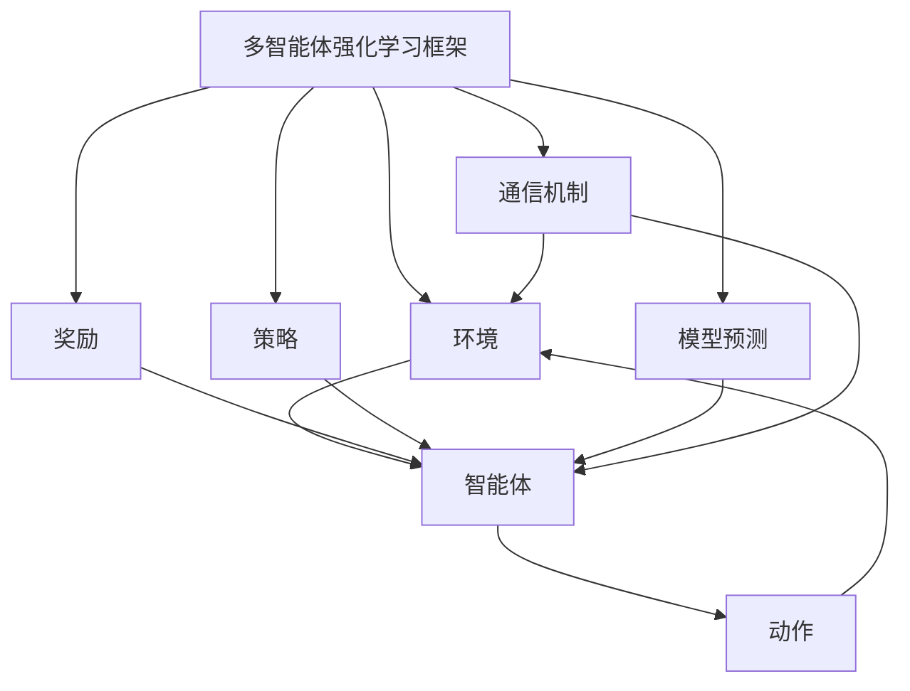

                 

# 文章标题：多智能体强化学习（Multi-Agent Reinforcement Learning）

> 关键词：多智能体强化学习、MADP、Q学习、策略梯度方法、深度强化学习、模型预测控制、社交网络、智能交通、供应链管理

> 摘要：本文旨在深入探讨多智能体强化学习（Multi-Agent Reinforcement Learning，简称MARL）这一前沿研究领域。文章首先介绍了多智能体强化学习的基础概念、发展历程和应用场景，然后详细解析了多智能体强化学习的核心算法，包括多智能体Q学习、多智能体策略梯度方法和多智能体深度强化学习。此外，文章还介绍了多智能体模型预测控制以及多智能体强化学习在复杂环境中的应用案例。最后，本文提供了多智能体强化学习项目实践的指南和资源推荐，以帮助读者更好地理解和应用这一技术。

### 第一部分：多智能体强化学习基础

#### 第1章：多智能体强化学习概述

多智能体强化学习（MARL）是强化学习在多智能体系统中的扩展，旨在研究多个智能体在动态环境中如何通过自主学习、协调和决策来实现共同的目标。与单智能体强化学习相比，MARL更加复杂，因为它涉及到多个智能体的交互和策略学习。

### 1.1 多智能体系统的基本概念

#### 1.1.1 多智能体系统的定义与特征

多智能体系统（Multi-Agent System，MAS）是由多个具有独立自主性的智能体组成的系统。这些智能体可以相互协作或竞争，以实现共同的目标或个体目标。

#### 1.1.2 多智能体系统与单智能体系统的区别

单智能体系统（如个人电脑上的游戏）只有一个决策者，而多智能体系统有多个决策者。这使得多智能体系统更加复杂，需要考虑智能体之间的交互和策略协调。

### 1.2 多智能体强化学习的发展历程

#### 1.2.1 强化学习基础

强化学习（Reinforcement Learning，RL）是机器学习的一个分支，通过智能体与环境交互，学习一种策略来最大化累积奖励。单智能体强化学习已经成为人工智能领域的重要技术，如深度Q网络（DQN）和策略梯度方法等。

#### 1.2.2 多智能体强化学习的兴起

随着单智能体强化学习的成功，研究者开始探索如何将强化学习应用于多智能体系统。多智能体强化学习在游戏、自动驾驶、物流和调度等领域展现出巨大的潜力。

### 1.3 多智能体强化学习的应用场景

#### 1.3.1 游戏和娱乐

在多人游戏中，智能体可以通过MARL学习协作策略，提高游戏体验。

#### 1.3.2 自动驾驶

在自动驾驶系统中，多智能体强化学习可以优化车辆间的协作和决策，提高行驶安全和效率。

#### 1.3.3 物流和调度

在物流和调度领域，多智能体强化学习可以优化路径规划和资源分配，提高运输效率和降低成本。

### 1.4 本书结构安排

本文将分为三个部分：第一部分介绍多智能体强化学习的基础知识；第二部分详细解析核心算法；第三部分探讨应用案例和实践指南。

### 图1：多智能体强化学习框架



### 第2章：多智能体强化学习框架

多智能体强化学习框架涉及多个关键组成部分：环境、智能体、动作、奖励、策略、模型预测和通信机制。以下将逐一介绍这些组成部分及其在MARL中的作用。

### 2.1 多智能体强化学习的基本模型

#### 2.1.1 多智能体马尔可夫决策过程（MADP）

多智能体马尔可夫决策过程（Multi-Agent Markov Decision Process，MADP）是多智能体强化学习的基础模型。MADP描述了智能体在不确定环境中如何通过决策序列最大化累积奖励的过程。

#### 2.1.2 环境和智能体的建模

在MADP中，环境被建模为一个具有状态空间S、动作空间A和奖励函数R的动态系统。每个智能体被建模为一个具有策略π、状态空间S和动作空间A的决策者。智能体在环境中执行动作，环境根据当前状态和智能体的动作产生新的状态和奖励。

### 2.2 多智能体强化学习中的协调与协作

#### 2.2.1 协调机制

在多智能体系统中，协调机制至关重要。协调机制可以通过通信、协商和协调算法来实现，以确保智能体之间的协作和共同目标的最大化。

#### 2.2.2 协作策略

协作策略是指智能体在执行动作时，如何根据环境状态和其他智能体的行为来调整自己的策略。有效的协作策略可以使得智能体之间相互支持，提高整体系统性能。

### 2.3 多智能体强化学习的挑战

#### 2.3.1 通信与信息共享

多智能体系统中的通信与信息共享是一个重要挑战。智能体之间可能存在通信障碍或信息延迟，这需要设计高效的通信协议和信息共享机制。

#### 2.3.2 计算复杂度

随着智能体数量和状态空间的增加，多智能体强化学习的计算复杂度会显著增加。这需要设计高效的算法和优化策略，以提高计算效率和性能。

#### 2.3.3 安全性

在多智能体系统中，安全性是一个关键问题。智能体之间的交互可能会导致不良后果，如冲突、碰撞或系统崩溃。设计安全的多智能体强化学习算法需要考虑这些潜在风险。

### 第3章：多智能体Q学习

多智能体Q学习（Multi-Agent Q-Learning，MAQ-Learning）是多智能体强化学习的一个重要算法，它基于单智能体Q学习的思想，扩展到多智能体系统。以下将详细介绍多智能体Q学习的原理、算法和改进。

### 3.1 多智能体Q学习基本概念

#### 3.1.1 多智能体Q学习原理

多智能体Q学习通过在每个智能体上维护一个Q值表，记录智能体在不同状态和动作组合下的预期奖励。智能体根据这些Q值来选择动作，以最大化累积奖励。

#### 3.1.2 多智能体Q学习的优势

多智能体Q学习具有以下优势：

- **适应性**：智能体可以根据环境变化调整策略，提高适应能力。
- **分布式计算**：多智能体Q学习可以分布式地训练多个智能体，提高计算效率。
- **灵活性**：智能体可以在不同的环境和任务中应用。

### 3.2 多智能体Q学习算法

#### 3.2.1 Q-learning算法

Q-learning算法是一个值迭代算法，通过在每次迭代中更新Q值表，逐步收敛到最优策略。以下是多智能体Q-learning算法的伪代码：

```mermaid
// 多智能体Q学习算法伪代码
Initialize Q(s, a)
for each episode do
    s_t <- 状态
    while not terminal(s_t) do
        a_t <- 选择动作a_t based on策略π
        s_{t+1} <- 环境响应动作a_t
        r_t <- 奖励
        Q(s_t, a_t) <- Q(s_t, a_t) + α[r_t + γmax(Q(s_{t+1}, a_{t+1})) - Q(s_t, a_t)]
        s_t <- s_{t+1}
    end while
end for
```

#### 3.2.2 多智能体Q-learning算法的改进

为了提高多智能体Q学习的性能，研究者提出了一系列改进方法，如经验回放、优先经验回放、分布式Q-learning等。

1. **经验回放**：通过将智能体的经验存储在一个经验池中，随机抽取经验进行学习，以避免策略偏差。
2. **优先经验回放**：根据经验的未预测奖励（即目标Q值与实际奖励之差）来调整经验回放的优先级，使得未预测奖励较高的经验更有可能被回放。
3. **分布式Q-learning**：通过分布式计算来训练多个智能体的Q值表，从而提高学习效率。

### 3.3 多智能体Q学习算法的应用案例

多智能体Q学习在多个领域取得了显著的成果，以下是几个应用案例：

- **多人游戏**：智能体通过多智能体Q学习学习协作策略，提高游戏胜率。
- **自动驾驶**：智能体通过多智能体Q学习优化车辆间的协作和决策，提高行驶安全和效率。
- **物流和调度**：智能体通过多智能体Q学习优化路径规划和资源分配，提高运输效率和降低成本。

### 第4章：多智能体策略梯度方法

多智能体策略梯度方法（Multi-Agent Policy Gradient，MAPG）是多智能体强化学习的另一种重要算法。与多智能体Q学习不同，策略梯度方法直接学习智能体的策略参数，而不是Q值表。以下将详细介绍多智能体策略梯度方法的基本概念、算法和改进。

### 4.1 多智能体策略梯度方法基本概念

#### 4.1.1 策略梯度方法

策略梯度方法是一种直接优化智能体策略的算法。它通过计算策略的梯度来更新策略参数，以最大化累积奖励。策略梯度方法的优点是计算复杂度相对较低，适合大规模多智能体系统。

#### 4.1.2 多智能体策略梯度方法

多智能体策略梯度方法扩展了策略梯度方法到多智能体系统，考虑智能体之间的交互和策略协调。多智能体策略梯度方法可以通过分布式计算来训练多个智能体的策略参数，提高学习效率。

### 4.2 多智能体策略梯度方法算法

#### 4.2.1 REINFORCE算法

REINFORCE算法是一种基于梯度的策略优化算法，通过计算策略的梯度来更新策略参数。以下是多智能体REINFORCE算法的伪代码：

```mermaid
// 多智能体REINFORCE算法伪代码
Initialize π(θ), Q(s, a)
for each episode do
    s_t <- 初始状态
    while not terminal(s_t) do
        a_t <- π(θ)(s_t)
        s_{t+1} <- 环境响应动作a_t
        r_t <- 奖励
        Δθ = ∂L(θ) / ∂θ
        θ <- θ + η*Δθ
        s_t <- s_{t+1}
    end while
end for
```

#### 4.2.2 Monte Carlo算法

Monte Carlo算法是一种基于梯度的策略优化算法，通过模拟多个轨迹来估计策略的梯度。以下是多智能体Monte Carlo算法的伪代码：

```mermaid
// 多智能体Monte Carlo算法伪代码
Initialize π(θ), Q(s, a)
for each episode do
    s_t <- 初始状态
    trajectory <- []
    while not terminal(s_t) do
        a_t <- π(θ)(s_t)
        s_{t+1} <- 环境响应动作a_t
        r_t <- 奖励
        trajectory.append((s_t, a_t, r_t))
        s_t <- s_{t+1}
    end while
    G <- 0
    for (s_t, a_t, r_t) in trajectory do
        G <- G + r_t
        Δθ = ∂L(θ) / ∂θ
        θ <- θ + η*Δθ
    end for
end for
```

#### 4.2.3 actor-critic算法

actor-critic算法结合了策略优化和价值估计两部分，通过actor和critic两个模型来更新策略参数。以下是多智能体actor-critic算法的伪代码：

```mermaid
// 多智能体actor-critic算法伪代码
Initialize π(θ), Q(s, a), V(s; φ)
for each episode do
    s_t <- 初始状态
    while not terminal(s_t) do
        a_t <- π(θ)(s_t)
        s_{t+1} <- 环境响应动作a_t
        r_t <- 奖励
        V(s_{t+1}; φ) <- V(s_{t+1}; φ) + α[V(s_t; φ) - V(s_{t+1}; φ)]
        π(θ)(s_t, a_t) <- π(θ)(s_t, a_t) + β[π(θ)(s_{t+1}, a_{t+1}) - π(θ)(s_t, a_t)]
        s_t <- s_{t+1}
    end while
end for
```

### 4.3 多智能体策略梯度方法的应用案例

多智能体策略梯度方法在多个领域取得了显著的成果，以下是几个应用案例：

- **多人游戏**：智能体通过多智能体策略梯度方法学习协作策略，提高游戏胜率。
- **自动驾驶**：智能体通过多智能体策略梯度方法优化车辆间的协作和决策，提高行驶安全和效率。
- **物流和调度**：智能体通过多智能体策略梯度方法优化路径规划和资源分配，提高运输效率和降低成本。

### 第5章：多智能体深度强化学习

多智能体深度强化学习（Multi-Agent Deep Reinforcement Learning，MADRL）结合了深度学习和强化学习的优势，通过神经网络来学习智能体的策略和价值函数。以下将详细介绍多智能体深度强化学习的基本概念、算法和应用。

### 5.1 多智能体深度强化学习基本概念

#### 5.1.1 深度强化学习

深度强化学习（Deep Reinforcement Learning，DRL）是强化学习的一种形式，通过深度神经网络来学习值函数或策略。DRL在处理复杂环境和高维状态空间方面具有优势。

#### 5.1.2 多智能体深度强化学习

多智能体深度强化学习（MADRL）扩展了DRL到多智能体系统，旨在解决多个智能体在动态环境中的协作和竞争问题。MADRL通过深度神经网络来学习多智能体的策略和价值函数，以最大化累积奖励。

### 5.2 多智能体深度强化学习算法

#### 5.2.1 DQN算法

DQN（Deep Q-Network）是一种基于深度神经网络的Q学习算法。DQN通过深度神经网络来近似Q值函数，以预测在给定状态和动作下的预期奖励。以下是多智能体DQN算法的伪代码：

```mermaid
// 多智能体DQN算法伪代码
Initialize Q(s, a)
for each episode do
    s_t <- 状态
    while not terminal(s_t) do
        a_t <- 选择动作a_t based on策略π
        s_{t+1} <- 环境响应动作a_t
        r_t <- 奖励
        Q(s_t, a_t) <- Q(s_t, a_t) + α[r_t + γmax(Q(s_{t+1}, a_{t+1})) - Q(s_t, a_t)]
        s_t <- s_{t+1}
    end while
end for
```

#### 5.2.2 A3C算法

A3C（Asynchronous Advantage Actor-Critic）是一种基于策略梯度的深度强化学习算法。A3C通过异步方式训练多个智能体，并在每个智能体上使用actor-critic方法来优化策略参数。以下是多智能体A3C算法的伪代码：

```mermaid
// 多智能体A3C算法伪代码
Initialize π(θ), Q(s, a), V(s; φ)
for each episode do
    s_t <- 初始状态
    while not terminal(s_t) do
        a_t <- π(θ)(s_t)
        s_{t+1} <- 环境响应动作a_t
        r_t <- 奖励
        G <- 0
        for s' in trajectory do
            G <- G + r_t
            V(s'; φ) <- V(s'; φ) + α[V(s; φ) - V(s'; φ)]
            π(θ)(s', a') <- π(θ)(s', a') + β[π(θ)(s', a') - π(θ)(s', a')]
        end for
        s_t <- s_{t+1}
    end while
end for
```

#### 5.2.3 DPG算法

DPG（Deep Proximal Policy Optimization）是一种基于策略梯度的深度强化学习算法。DPG通过深度神经网络来学习策略和价值函数，并在每个迭代中使用策略梯

