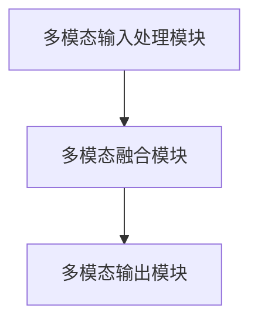

                 

# 文章标题: 多模态大模型：技术原理与实战 GPT-4多模态大模型核心技术介绍

## 关键词

多模态大模型，GPT-4，技术原理，实战应用，多模态数据融合，微调与迁移学习

## 摘要

本文详细介绍了多模态大模型的技术原理与实战应用，重点解析了GPT-4的多模态大模型核心技术。通过逻辑清晰、结构紧凑的论述，文章涵盖了从基础概念到高级技术的全方位内容，包括多模态数据的预处理、融合技术、训练策略以及微调与迁移学习等。同时，通过实际项目案例，展示了如何搭建和训练一个多模态大模型，为读者提供了实用的技术指南和应用实例。

----------------------------------------------------------------

# 《多模态大模型：技术原理与实战 GPT-4多模态大模型核心技术介绍》

## 第一部分: 多模态大模型基础

### 第1章: 多模态大模型概述

#### 1.1 多模态大模型的定义与特点

多模态大模型是指能够同时处理和融合多种类型数据（如文本、图像、音频、视频等）的深度学习模型。与传统的单模态模型相比，多模态大模型具有以下几个显著特点：

1. **数据的多样性**：能够处理多种类型的数据，提高模型对复杂场景的适应能力。
2. **丰富的信息获取**：通过融合不同模态的数据，可以获得更全面和准确的信息。
3. **跨模态交互**：能够实现不同模态之间的交互，提高模型的解释性和鲁棒性。
4. **高效性**：通过集成多种模态的数据，可以在一定程度上减少对大量单模态数据的依赖。

#### 1.1.1 多模态大模型的基本概念

多模态大模型通常由以下几个核心部分组成：

1. **输入处理模块**：负责处理不同类型的数据，如文本、图像、音频和视频，并将其转换为模型可以处理的特征表示。
2. **融合模块**：将来自不同输入处理模块的特征进行融合，生成一个统一的多模态特征表示。
3. **输出模块**：将融合后的特征表示用于特定任务，如分类、生成或问答。

#### 1.1.2 多模态大模型的核心特点

多模态大模型的核心特点包括：

1. **并行处理**：能够同时处理多种模态的数据，提高处理效率。
2. **跨模态交互**：通过跨模态交互模块，实现不同模态之间的信息传递和融合。
3. **数据增强**：通过数据增强技术，提高模型的泛化能力。
4. **自适应学习**：能够根据不同任务的需求，自适应地调整模型结构和参数。

#### 1.1.3 多模态大模型与传统模型的对比

多模态大模型与传统单模态模型相比，具有以下几个方面的优势：

1. **信息丰富度**：多模态大模型能够同时处理多种类型的数据，获得更全面的信息。
2. **鲁棒性**：通过跨模态交互，提高模型对数据噪声和不完整性的鲁棒性。
3. **适应能力**：能够适应更多样化的任务场景，提高模型的泛化能力。

### 第2章: 多模态大模型的架构

#### 2.1 多模态大模型的基础架构

多模态大模型的基础架构可以分为三个主要模块：多模态输入处理模块、多模态融合模块和多模态输出模块。以下是一个简单的 Mermaid 流程图，用于描述这三个模块之间的关系：



#### 2.2 多模态输入处理模块

多模态输入处理模块是整个多模态大模型的基础，负责将不同类型的数据进行处理，以便于后续的融合和输出。以下是对各个子模块的详细描述：

1. **图像预处理**：图像预处理包括图像的缩放、裁剪、归一化和增强等操作，以确保图像质量的最优化。
2. **视频预处理**：视频预处理包括视频帧的提取、帧间插值、视频速率的调整等操作，以便于后续的处理。
3. **音频预处理**：音频预处理包括音频的去噪、增强、速率调整和音高变化等操作，以提高音频的质量和可理解度。
4. **文本预处理**：文本预处理包括文本的分词、词干提取、停用词过滤等操作，以便于后续的语义分析。

#### 2.3 多模态融合模块

多模态融合模块是核心部分，负责将来自不同输入处理模块的数据进行融合，生成一个统一的数据表示。以下是对几种常见的融合策略的介绍：

1. **并行融合**：将不同模态的数据分别进行处理，然后同时输入到融合模型中。这种策略能够充分利用各模态的数据特性，但可能导致计算复杂度增加。
2. **串行融合**：将不同模态的数据依次进行处理，前一模态的结果作为后一模态的输入。这种策略相对简单，但可能无法充分利用各模态之间的关联性。
3. **混合融合**：结合并行融合和串行融合的优点，根据不同模态的特点进行自适应的融合。这种策略通常需要更多的设计和调整，但能够获得更好的融合效果。

#### 2.4 多模态输出模块

多模态输出模块负责将融合后的数据表示转化为用户期望的输出，如文本、图像、音频等。以下是对各个子模块的详细描述：

1. **文本生成**：使用生成式模型（如GPT-3）或判别式模型（如BERT）生成文本。文本生成模块能够根据输入的多模态数据生成相关的文本描述。
2. **图像生成**：使用生成对抗网络（GAN）或变分自编码器（VAE）生成图像。图像生成模块能够根据输入的多模态数据生成新的图像。
3. **音频生成**：使用循环神经网络（RNN）或变换器（Transformer）生成音频。音频生成模块能够根据输入的多模态数据生成新的音频。
4. **多模态集成**：将生成的文本、图像和音频进行集成，生成一个完整的多模态输出。多模态集成模块能够根据用户的需求，将不同模态的数据进行组合，生成一个综合的输出。

通过以上对多模态大模型架构的介绍，我们可以看到多模态大模型的复杂性和多样性。在实际应用中，根据具体任务的需求，可以选择合适的架构和策略来构建和优化多模态大模型。

### 第3章: 多模态大模型核心技术

#### 3.1 多模态数据的预处理

多模态数据的预处理是构建多模态大模型的基础步骤，它直接影响模型的表现和性能。本节将详细讨论图像、视频、音频和文本等不同类型数据的预处理方法。

##### 3.1.1 图像预处理

图像预处理通常包括以下步骤：

1. **缩放**：将图像调整到统一的尺寸，以便于后续处理。常见的缩放方法有等比缩放和填充。
2. **裁剪**：将图像裁剪到特定的区域，去除不必要的背景。
3. **归一化**：将图像的像素值归一化到相同的范围，如$[0, 1]$或$[-1, 1]$。
4. **增强**：通过调整对比度、亮度等参数，提高图像的质量。

以下是一个简单的图像预处理伪代码：

```python
def preprocess_image(image):
    # 缩放图像
    scaled_image = cv2.resize(image, (224, 224))
    
    # 归一化图像
    normalized_image = scaled_image / 255.0
    
    # 数据增强
    enhanced_image = random Enhancement(normalized_image)
    
    return enhanced_image
```

##### 3.1.2 视频预处理

视频预处理主要包括以下步骤：

1. **帧提取**：从视频中提取连续的帧，以便于后续处理。
2. **帧间插值**：对视频帧进行插值，以填充缺失的帧或调整帧率。
3. **帧率调整**：将视频帧率调整到所需的值，如$30fps$。

以下是一个简单的视频预处理伪代码：

```python
def preprocess_video(video_path):
    # 提取视频帧
    frames = extract_frames(video_path)
    
    # 帧间插值
    interpolated_frames = interpolate_frames(frames)
    
    # 帧率调整
    adjusted_frames = adjust_frame_rate(interpolated_frames, target_fps=30)
    
    return adjusted_frames
```

##### 3.1.3 音频预处理

音频预处理通常包括以下步骤：

1. **去噪**：通过滤波或降噪算法，去除音频中的噪声。
2. **增强**：通过调整音频的对比度和音量，提高音频的清晰度。
3. **速率调整**：调整音频的播放速度，如加快或减慢。

以下是一个简单的音频预处理伪代码：

```python
def preprocess_audio(audio_path):
    # 去噪
    denoised_audio = denoise_audio(audio_path)
    
    # 增强
    enhanced_audio = enhance_audio(denoised_audio)
    
    # 速率调整
    adjusted_audio = adjust_audio_rate(enhanced_audio, target_rate=22050)
    
    return adjusted_audio
```

##### 3.1.4 文本预处理

文本预处理主要包括以下步骤：

1. **分词**：将文本分割成单词或子词。
2. **词干提取**：将单词缩减为词干，以减少词汇量。
3. **停用词过滤**：去除常见的停用词，如“的”、“了”等。

以下是一个简单的文本预处理伪代码：

```python
def preprocess_text(text):
    # 分词
    tokens = tokenize(text)
    
    # 词干提取
    stemmed_tokens = stem_tokens(tokens)
    
    # 停用词过滤
    filtered_tokens = filter_stopwords(stemmed_tokens)
    
    return filtered_tokens
```

通过以上预处理步骤，我们可以将不同类型的数据转换为适合模型处理的形式。预处理的质量直接影响模型的表现，因此在实际应用中需要根据具体任务的需求进行仔细设计和优化。

#### 3.2 多模态数据融合技术

多模态数据融合技术是多模态大模型中的核心环节，它负责将来自不同模态的数据进行有效整合，以生成一个统一的特征表示。本节将讨论并行融合、串行融合和混合融合等不同融合策略，并详细介绍每种策略的优缺点以及如何选择合适的融合策略。

##### 3.2.1 并行融合

并行融合是指同时处理并融合来自不同模态的数据。在并行融合中，每个模态的数据分别经过预处理后，直接输入到模型中，模型同时处理这些数据，并生成一个统一的特征表示。

**优点**：

1. **充分利用各模态的数据特性**：由于每个模态的数据都经过独立的处理，因此可以充分利用不同模态的数据特性。
2. **计算效率高**：并行融合可以在短时间内处理多个模态的数据，提高计算效率。

**缺点**：

1. **计算复杂度高**：并行融合可能导致模型的计算复杂度显著增加，特别是在处理大量数据时。
2. **模型解释性差**：由于不同模态的数据同时输入到模型中，模型的决策过程可能不够透明，降低模型的解释性。

以下是一个简单的并行融合伪代码：

```python
def parallel_fusion(text_embedding, image_embedding, audio_embedding):
    # 并行融合
    fused_embedding = Concatenate()([text_embedding, image_embedding, audio_embedding])
    
    # 全连接层
    fused_embedding = Dense(1024, activation='relu')(fused_embedding)
    
    return fused_embedding
```

##### 3.2.2 串行融合

串行融合是指依次处理并融合来自不同模态的数据。在串行融合中，每个模态的数据分别经过预处理后，依次输入到模型中，模型的输出作为下一模态的输入。

**优点**：

1. **简单易懂**：串行融合的流程相对简单，易于理解和实现。
2. **模型解释性好**：由于不同模态的数据依次输入到模型中，因此模型的决策过程更加透明。

**缺点**：

1. **信息传递受限**：串行融合可能导致信息传递的延迟，降低模型的整体性能。
2. **计算效率低**：由于需要依次处理每个模态的数据，因此计算效率相对较低。

以下是一个简单的串行融合伪代码：

```python
def serial_fusion(text_embedding, image_embedding, audio_embedding):
    # 串行融合
    fused_embedding = text_embedding
    
    # 将图像嵌入添加到融合特征中
    fused_embedding = Concatenate()([fused_embedding, image_embedding])
    
    # 将音频嵌入添加到融合特征中
    fused_embedding = Concatenate()([fused_embedding, audio_embedding])
    
    # 全连接层
    fused_embedding = Dense(1024, activation='relu')(fused_embedding)
    
    return fused_embedding
```

##### 3.2.3 混合融合

混合融合是指结合并行融合和串行融合的优点，根据不同模态的特点进行自适应的融合。在混合融合中，模型首先并行处理来自不同模态的数据，然后通过特定层或机制进行串行融合。

**优点**：

1. **充分利用各模态的数据特性**：混合融合能够充分利用并行融合和串行融合的优点，提高模型的性能。
2. **自适应调整**：混合融合可以根据不同模态的数据特点进行自适应调整，提高融合效果。

**缺点**：

1. **实现复杂**：混合融合的实现相对复杂，需要设计合适的融合层或机制。
2. **计算复杂度高**：混合融合可能导致模型的计算复杂度增加。

以下是一个简单的混合融合伪代码：

```python
def mixed_fusion(text_embedding, image_embedding, audio_embedding):
    # 并行融合
    parallel_fused_embedding = parallel_fusion(text_embedding, image_embedding, audio_embedding)
    
    # 串行融合
    serial_fused_embedding = serial_fusion(parallel_fused_embedding, audio_embedding)
    
    # 全连接层
    fused_embedding = Dense(1024, activation='relu')(serial_fused_embedding)
    
    return fused_embedding
```

##### 3.2.4 融合策略的评估与选择

在选择融合策略时，我们需要考虑以下因素：

1. **数据特性**：根据不同模态的数据特性，选择合适的融合策略。例如，对于信息传递要求较高的任务，可以考虑使用串行融合。
2. **计算资源**：根据可用的计算资源，选择计算复杂度较低的融合策略。例如，对于资源受限的场景，可以考虑使用并行融合。
3. **模型性能**：通过实验比较不同融合策略的性能，选择最优的融合策略。

以下是一个简单的评估与选择过程：

```python
# 评估并行融合策略
parallel_performance = evaluate_performance(parallel_fusion)

# 评估串行融合策略
serial_performance = evaluate_performance(serial_fusion)

# 评估混合融合策略
mixed_performance = evaluate_performance(mixed_fusion)

# 选择最优融合策略
best_strategy = select_best_strategy([parallel_performance, serial_performance, mixed_performance])
```

通过以上讨论，我们可以看到不同融合策略的特点和适用场景。在实际应用中，根据具体任务的需求和数据特性，可以选择合适的融合策略，以提高多模态大模型的表现和性能。

#### 3.3 多模态大模型的训练

多模态大模型的训练是构建高效多模态模型的关键步骤。在这一部分，我们将详细讨论多模态大模型训练的各个方面，包括数据增强、模型优化和训练策略。

##### 3.3.1 数据增强

数据增强是多模态大模型训练中的重要技术，通过增加训练数据的多样性，可以显著提高模型的泛化能力和鲁棒性。以下是一些常见的数据增强技术：

1. **图像增强**：
   - **随机裁剪**：从图像中随机裁剪一个区域，生成新的图像。
   - **旋转**：将图像随机旋转一定角度。
   - **翻转**：水平或垂直翻转图像。
   - **颜色调整**：调整图像的亮度、对比度和饱和度。

2. **视频增强**：
   - **时间扩展**：通过重复帧或插值帧来增加视频长度。
   - **空间扩展**：通过缩放、旋转或裁剪视频帧来增加视频的多样性。

3. **音频增强**：
   - **噪声添加**：在音频信号中添加噪声，提高模型对噪声的鲁棒性。
   - **速率调整**：改变音频播放速度，生成新的音频样本。
   - **音高调整**：改变音频的音高。

4. **文本增强**：
   - **同义词替换**：将文本中的单词替换为同义词，增加文本的多样性。
   - **语法变换**：改变文本的语法结构，生成新的句子。

以下是一个简单的数据增强伪代码示例：

```python
def augment_data(image, video, audio, text):
    # 图像增强
    image = random_crop(image)
    image = random_rotate(image)
    image = color_adjustment(image)

    # 视频增强
    video = time_extend(video)
    video = spatial_extend(video)

    # 音频增强
    audio = add_noise(audio)
    audio = rate_adjustment(audio)
    audio = pitch_adjustment(audio)

    # 文本增强
    text = synonym_replacement(text)
    text = grammar_transformation(text)

    return image, video, audio, text
```

##### 3.3.2 模型优化

在多模态大模型训练过程中，模型优化是一个关键步骤，通过调整模型参数和优化算法，可以显著提高模型的性能。以下是一些常见的模型优化技术：

1. **学习率调整**：学习率的选择对模型训练过程有重要影响。常用的调整方法包括固定学习率、学习率衰减和自适应学习率调整。

2. **正则化**：正则化技术可以防止模型过拟合。常用的正则化方法有L1正则化、L2正则化和Dropout。

3. **优化算法**：不同的优化算法对模型训练的影响很大。常用的优化算法有随机梯度下降（SGD）、Adam和RMSprop。

4. **批量大小**：批量大小会影响模型的训练速度和收敛性。选择合适的批量大小可以提高模型的性能。

以下是一个简单的模型优化伪代码示例：

```python
# 设置优化器和损失函数
optimizer = Adam(learning_rate=0.001)
loss_function = categorical_crossentropy

# 模型编译
model.compile(optimizer=optimizer, loss=loss_function, metrics=['accuracy'])

# 训练模型
model.fit([augmented_images, augmented_videos, augmented_audio, augmented_text], labels, batch_size=32, epochs=10)
```

##### 3.3.3 训练策略

训练策略是多模态大模型训练过程中的重要组成部分，合理的训练策略可以提高模型的训练效率和最终性能。以下是一些常见的训练策略：

1. **分层训练**：首先训练一个基础模型，然后逐步加入更多的模态数据进行训练。这种方法可以帮助模型逐步适应多模态数据。

2. **迭代训练**：通过迭代训练，逐步调整模型的参数和结构，以提高模型的性能。

3. **交叉验证**：使用交叉验证技术，对模型进行多次训练和验证，以评估模型的泛化能力。

4. **动态调整**：根据训练过程中的表现，动态调整训练参数和策略，以提高模型的表现。

以下是一个简单的训练策略伪代码示例：

```python
# 初始化训练参数
initial_lr = 0.001
batch_size = 32
num_epochs = 10

# 设置学习率衰减策略
learning_rate_scheduler = LearningRateScheduler(lambda epoch: initial_lr / (1 + decay_rate * epoch))

# 训练模型
model.fit([images, videos, audio, text], labels, batch_size=batch_size, epochs=num_epochs, callbacks=[learning_rate_scheduler])
```

通过以上对数据增强、模型优化和训练策略的详细讨论，我们可以看到多模态大模型训练的复杂性和多样性。在实际应用中，根据具体任务的需求和数据特性，可以选择合适的训练策略和技术，以构建高效的多模态大模型。

#### 3.4 多模态大模型的微调与迁移学习

在多模态大模型的训练过程中，微调和迁移学习是两种常用的技术，能够有效地提高模型的性能和泛化能力。微调（Fine-tuning）和迁移学习（Transfer Learning）是两种不同的技术，各有其特点和适用场景。

##### 3.4.1 微调技术

微调技术是指利用预训练模型（如GPT-4）的参数，在特定任务上继续进行训练。微调的优点在于：

1. **快速训练**：预训练模型已经学习到了大量的通用特征，因此可以通过少量的标注数据快速适应新任务。
2. **提高性能**：预训练模型通常具有较好的泛化能力，微调后可以显著提高新任务的性能。
3. **减少数据需求**：通过微调，模型可以更好地利用有限的标注数据，减少对大量数据的依赖。

微调技术的基本流程包括以下几个步骤：

1. **数据准备**：准备用于微调的标注数据集，这些数据集应涵盖新任务的不同场景。
2. **模型初始化**：初始化预训练模型，并加载预训练的参数。
3. **微调过程**：在预训练模型的基础上，使用标注数据进行微调，调整模型参数。

以下是一个简单的微调伪代码示例：

```python
# 加载预训练模型
pretrained_model = load_pretrained_model('gpt4')

# 初始化微调模型
fine_tuned_model = copy_model(pretrained_model)

# 微调模型
fine_tuned_model.fit(training_data, labels, batch_size=32, epochs=5)
```

##### 3.4.2 迁移学习

迁移学习是指将预训练模型（如GPT-4）应用于不同的任务，而不是直接从头开始训练。迁移学习的优点在于：

1. **知识复用**：通过迁移学习，可以将预训练模型的知识转移到新任务中，提高模型的性能。
2. **减少训练时间**：迁移学习可以减少对新任务数据的训练时间，提高训练效率。
3. **提高泛化能力**：迁移学习可以帮助模型更好地适应新任务，提高泛化能力。

迁移学习的基本流程包括以下几个步骤：

1. **数据准备**：准备用于新任务的数据集，这些数据集应涵盖新任务的不同场景。
2. **模型初始化**：初始化预训练模型，并加载预训练的参数。
3. **迁移学习过程**：在预训练模型的基础上，添加新的分类层或特征提取层，以适应新任务。

以下是一个简单的迁移学习伪代码示例：

```python
# 加载预训练模型
pretrained_model = load_pretrained_model('gpt4')

# 初始化迁移学习模型
transfer_learning_model = build_transfer_learning_model(pretrained_model)

# 迁移学习模型
transfer_learning_model.fit(training_data, labels, batch_size=32, epochs=5)
```

##### 3.4.3 微调与迁移学习在多模态大模型中的应用

在实际应用中，微调和迁移学习可以有效地提高多模态大模型的性能。以下是一些应用实例：

1. **智能问答系统**：通过微调预训练的GPT-4模型，使其能够更好地理解多模态输入，并提供准确、自然的回答。
2. **多模态推荐系统**：通过迁移学习，将预训练的GPT-4模型应用于多模态推荐任务，提高推荐系统的准确性和用户满意度。
3. **多模态内容审核**：通过微调和迁移学习，使模型能够更好地识别和审核多模态内容，提高审核的准确性和效率。

总之，微调和迁移学习是多模态大模型训练中的重要技术，通过合理应用这些技术，可以显著提高模型的性能和泛化能力。

#### 3.5 多模态问答系统

多模态问答系统是一种能够处理多种类型输入（如文本、图像和音频）并生成回答的系统。GPT-4的多模态处理能力使其成为构建高效多模态问答系统的理想选择。以下是一个简单的多模态问答系统的设计和实现。

##### 3.5.1 系统设计

多模态问答系统的设计主要包括以下几个模块：

1. **文本输入模块**：接收用户输入的文本问题，并使用BERT模型进行处理。
2. **图像输入模块**：接收用户输入的图像，并使用CNN模型提取特征。
3. **音频输入模块**：接收用户输入的音频，并使用RNN或Transformer模型提取特征。
4. **多模态融合模块**：将文本、图像和音频的特征进行融合，生成一个统一的数据表示。
5. **问答模块**：使用融合后的数据生成回答，并使用GPT-4模型进行处理。

以下是一个简单的多模态问答系统的设计流程：

1. **输入接收**：接收用户输入的文本、图像和音频。
2. **预处理**：对文本、图像和音频进行预处理，生成特征向量。
3. **融合**：使用注意力机制将多模态特征进行融合。
4. **问答**：使用GPT-4模型生成回答。

##### 3.5.2 实现细节

在实际实现中，我们需要关注以下几个关键点：

1. **模型选择**：选择合适的预训练模型，如BERT、VGG16和GPT-4。
2. **融合策略**：采用并行融合、串行融合或混合融合策略。
3. **问答策略**：使用生成式模型或判别式模型生成回答。
4. **优化与调整**：根据实验结果调整模型参数，以提高问答系统的性能。

以下是一个简单的多模态问答系统的实现代码：

```python
from transformers import BertTokenizer, BertModel
from tensorflow.keras.applications import VGG16
import tensorflow as tf

# 初始化预训练模型
tokenizer = BertTokenizer.from_pretrained('bert-base-uncased')
bert_model = BertModel.from_pretrained('bert-base-uncased')
cnn_model = VGG16(include_top=False, weights='imagenet')

# 定义融合层
def fusion

