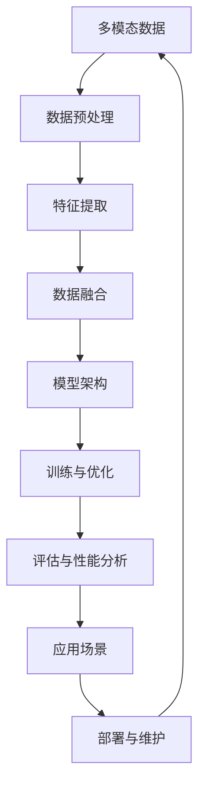

                 

# 多模态大模型：技术原理与实战 OpenAI成功的因素

> 关键词：多模态大模型、技术原理、实战、OpenAI、成功因素

> 摘要：本文深入探讨多模态大模型的技术原理与应用场景，通过一步步分析推理，结合实际案例，揭示了OpenAI成功的因素，为多模态大模型的研究与开发提供了有益的启示。

## 目录大纲

1. 多模态大模型概述
    1.1 多模态数据的定义与类型
    1.2 多模态大模型的发展历程
    1.3 多模态大模型的主要分类
    1.4 多模态大模型的核心技术
2. 多模态大模型的技术原理
    2.1 多模态数据的融合方法
    2.2 多模态大模型的架构设计
    2.3 多模态大模型的训练与优化
    2.4 多模态大模型的评估与性能分析
3. 多模态大模型的应用场景
    3.1 多模态大模型在自然语言处理中的应用
    3.2 多模态大模型在计算机视觉中的应用
    3.3 多模态大模型在音频处理中的应用
    3.4 多模态大模型在其他领域的应用
4. 多模态大模型实战案例
    4.1 多模态大模型在语音识别中的应用
    4.2 多模态大模型在图像描述生成中的应用
    4.3 多模态大模型在虚拟助手中的应用
    4.4 多模态大模型在医疗健康中的应用
5. OpenAI成功的因素分析与启示
    5.1 OpenAI的成功因素分析
    5.2 多模态大模型发展的启示与展望
6. 多模态大模型开发工具与资源
    6.1 多模态大模型开发工具
    6.2 多模态大模型开源资源
7. 附录
    7.1 多模态大模型核心概念与联系 Mermaid 流程图
    7.2 多模态大模型核心算法原理讲解伪代码
    7.3 多模态大模型数学模型和数学公式
    7.4 多模态大模型项目实战案例与详细解释说明
    7.5 多模态大模型开发环境搭建教程
    7.6 源代码详细实现与代码解读

## 第一部分：多模态大模型概述

### 第1章：多模态大模型的概念与分类

#### 1.1 多模态数据的定义与类型

多模态数据是指由两种或两种以上的数据源（例如文本、图像、音频、视频等）组成的综合性数据。这些数据源可以独立存在，也可以相互关联。多模态数据的特点是信息丰富，可以提供更全面的观察和分析视角。

多模态数据类型主要包括以下几种：

- **文本数据**：包括自然语言文本、标注文本等。
- **图像数据**：包括静态图像、动态图像等。
- **音频数据**：包括语音、音乐、环境声音等。
- **视频数据**：包括视频序列、视频流等。

#### 1.2 多模态大模型的发展历程

多模态大模型的发展可以追溯到深度学习技术的兴起。随着计算能力的提升和数据量的增加，深度学习模型在多个领域取得了显著的成果，包括计算机视觉、自然语言处理、语音识别等。在此基础上，多模态大模型的研究开始受到广泛关注。

近年来，多模态大模型在以下几个关键领域取得了突破：

- **数据融合方法**：如何高效地融合不同模态的数据成为研究的热点。代表性的方法包括特征融合、注意力机制等。
- **模型架构设计**：如何设计能够处理多模态数据的模型架构是研究的核心问题。代表性的模型包括多任务学习模型、联合训练模型等。
- **训练与优化**：如何优化多模态大模型的训练过程是研究的难点。代表性的方法包括迁移学习、对抗训练等。

#### 1.3 多模态大模型的主要分类

多模态大模型可以根据其应用场景和数据类型进行分类。以下是几种常见分类：

- **按数据类型分类**：
  - **文本-图像**：结合文本描述和图像信息，例如图像描述生成、文本图像分类等。
  - **文本-音频**：结合文本信息和音频信息，例如语音识别、音频情感分析等。
  - **图像-音频**：结合图像信息和音频信息，例如视频内容识别、音频图像关联等。

- **按应用场景分类**：
  - **自然语言处理**：包括文本生成、文本分类、问答系统等。
  - **计算机视觉**：包括图像分类、目标检测、图像生成等。
  - **音频处理**：包括语音识别、音乐生成、音频分类等。

#### 1.4 多模态大模型的核心技术

多模态大模型的核心技术主要包括以下几个方面：

- **数据预处理**：包括数据清洗、数据增强、特征提取等，以保证输入数据的质量和多样性。
- **数据融合方法**：包括特征融合、注意力机制、跨模态对应等，以提高多模态数据的利用效率。
- **模型架构设计**：包括多任务学习模型、联合训练模型、端到端模型等，以适应不同类型的多模态数据。
- **训练与优化**：包括迁移学习、对抗训练、元学习等，以提高模型的泛化能力和性能。

### 总结

多模态大模型是当前人工智能领域的研究热点，通过结合多种模态的数据，能够提供更全面的信息理解和分析能力。在本文的后续章节中，我们将进一步探讨多模态大模型的技术原理、应用场景和实战案例，以揭示OpenAI成功的因素，并为多模态大模型的研究与开发提供有益的启示。让我们一步一步深入探讨这一激动人心的技术领域。

### 第2章：多模态大模型的技术原理

#### 2.1 多模态数据的融合方法

多模态数据的融合是多模态大模型的关键技术之一，目的是将来自不同模态的数据进行整合，以提升模型的性能。以下是一些常见的数据融合方法：

1. **特征融合**：特征融合方法将不同模态的数据特征进行合并，形成统一特征表示。常见的方法包括：
   - **拼接**：直接将不同模态的特征进行拼接，形成新的特征向量。例如，将文本特征和图像特征拼接在一起。
   - **加权融合**：根据不同模态的特征重要性，对特征进行加权融合，以突出关键模态的信息。例如，使用注意力机制动态调整特征权重。
   - **图神经网络**：通过图神经网络（Graph Neural Networks, GNN）将不同模态的特征表示为图节点，然后通过图结构进行融合。

2. **注意力机制**：注意力机制（Attention Mechanism）在多模态数据融合中广泛应用，能够动态地关注重要信息。常见的方法包括：
   - **自注意力（Self-Attention）**：对同一模态的数据进行注意力加权，突出关键特征。
   - **交叉注意力（Cross-Attention）**：不同模态之间进行注意力交互，从而融合多模态信息。
   - **多注意力头（Multi-Head Attention）**：通过多个注意力头来关注不同类型的特征，实现更为复杂的信息融合。

3. **跨模态对应**：跨模态对应（Cross-Modal Alignment）旨在找到不同模态之间的对应关系，以实现数据的互补和融合。常见的方法包括：
   - **基于匹配度的方法**：通过计算不同模态之间的匹配度，找到最优的对应关系。
   - **基于相似度的方法**：利用相似度度量，将不同模态的特征映射到同一空间，实现跨模态对应。
   - **基于优化的方法**：通过优化目标函数，最小化不同模态特征之间的距离，实现跨模态对应。

#### 2.2 多模态大模型的架构设计

多模态大模型的架构设计是确保模型性能和可扩展性的关键。以下是一些常见的架构设计方法：

1. **多任务学习模型**：多任务学习模型（Multi-Task Learning Model）同时处理多个任务，共享部分模型参数以提升性能。常见的方法包括：
   - **共享底层特征提取器**：不同任务共享相同的特征提取器，从而利用共同特征。
   - **共享高层表示**：不同任务共享相同的高层表示，以利用任务之间的相关性。

2. **联合训练模型**：联合训练模型（Joint Training Model）通过同时训练多个任务，实现多模态数据的联合学习。常见的方法包括：
   - **端到端训练**：直接将不同模态的数据输入到统一的模型中，进行端到端的训练。
   - **级联训练**：先分别训练不同模态的子模型，然后通过级联方式将子模型融合，进行联合训练。

3. **端到端模型**：端到端模型（End-to-End Model）通过直接映射输入数据到输出结果，实现多模态数据的直接融合。常见的方法包括：
   - **编码器-解码器结构**：使用编码器将不同模态的数据编码为统一的表示，然后通过解码器生成输出结果。
   - **自编码器结构**：使用自编码器对多模态数据进行编码，提取共同特征，然后解码为输出结果。

#### 2.3 多模态大模型的训练与优化

多模态大模型的训练与优化是提高模型性能的关键环节。以下是一些常见的训练与优化方法：

1. **迁移学习**：迁移学习（Transfer Learning）通过利用预训练模型，提高新任务的性能。常见的方法包括：
   - **微调**：在预训练模型的基础上，对特定任务进行微调。
   - **层融合**：将预训练模型的特征提取器与任务特定的特征提取器进行融合。

2. **对抗训练**：对抗训练（Adversarial Training）通过生成对抗样本，提高模型的泛化能力和鲁棒性。常见的方法包括：
   - **对抗样本生成**：利用对抗性攻击方法，生成具有欺骗性的输入数据。
   - **对抗损失函数**：将对抗性损失函数加入到训练过程中，优化模型对抗能力。

3. **元学习**：元学习（Meta-Learning）通过快速适应新任务，提高模型的泛化能力和适应性。常见的方法包括：
   - **模型更新策略**：通过迭代更新模型参数，实现模型对新任务的快速适应。
   - **任务自适应训练**：针对特定任务，设计适应性的训练策略，提高模型性能。

#### 2.4 多模态大模型的评估与性能分析

多模态大模型的评估与性能分析是验证模型效果和指导模型优化的重要环节。以下是一些常见的评估与性能分析方法：

1. **评价指标**：根据任务类型，选择合适的评价指标，如准确率、召回率、F1值、均方误差（MSE）、交叉熵损失等。

2. **实验设置**：设计合理的实验设置，包括数据集划分、超参数设置、训练策略等，以保障实验的公平性和可重复性。

3. **性能分析**：通过对比不同模型架构、训练方法、数据预处理方法等，分析模型性能的差异和影响因素。

4. **可视化分析**：利用可视化工具，展示模型在不同模态数据上的表现，帮助理解模型的行为和性能。

### 总结

多模态大模型的技术原理涵盖了数据融合、模型架构设计、训练与优化以及评估与性能分析等方面。通过理解这些原理，我们可以更好地设计、训练和评估多模态大模型，推动其在各个领域的应用与发展。在下一章节中，我们将探讨多模态大模型在不同应用场景中的具体应用，进一步展示其潜力和价值。

### 第3章：多模态大模型的应用场景

#### 3.1 多模态大模型在自然语言处理中的应用

多模态大模型在自然语言处理（Natural Language Processing, NLP）领域具有广泛的应用前景。以下是一些具体的应用场景：

1. **图像描述生成**：利用文本和图像的多模态信息，生成描述图像的文本。例如，给定一张图片，模型可以生成相应的描述性文本。这一应用在内容生成、图像识别辅助等方面具有重要价值。

2. **问答系统**：结合文本和图像信息，提高问答系统的准确性和丰富性。例如，用户可以提交一个包含图像的问答问题，系统通过理解和融合多模态信息，提供更加准确的回答。

3. **情感分析**：结合文本和语音信息，进行情感分析。例如，通过分析文本和语音的语气、语调等特征，准确识别用户的情感状态。

4. **机器翻译**：结合文本和语音信息，实现跨语言的实时翻译。例如，将语音输入的文本实时翻译成其他语言的文本，并在语音输出中保持原语言的发音和语调。

#### 3.2 多模态大模型在计算机视觉中的应用

多模态大模型在计算机视觉（Computer Vision）领域也展现了强大的潜力。以下是一些具体的应用场景：

1. **视频内容识别**：通过分析视频中的图像和音频信息，识别视频中的关键内容。例如，在视频监控中，结合图像和音频信息，实现对异常行为的识别和报警。

2. **图像分类**：结合图像和文本信息，提高图像分类的准确性和鲁棒性。例如，在图像识别任务中，结合图像中的文本标签，提高模型的分类性能。

3. **图像增强**：利用多模态信息，对图像进行增强处理。例如，通过结合图像和文本信息，增强图像中的关键特征，提高图像质量。

4. **目标检测**：结合图像和语音信息，提高目标检测的准确性和实时性。例如，在自动驾驶领域，结合图像和语音信息，实现对目标车辆的实时检测和追踪。

#### 3.3 多模态大模型在音频处理中的应用

多模态大模型在音频处理（Audio Processing）领域也有显著的应用价值。以下是一些具体的应用场景：

1. **语音识别**：结合文本和音频信息，提高语音识别的准确率和鲁棒性。例如，通过结合音频中的背景音乐和对话内容，提高语音识别系统的性能。

2. **音频分类**：结合图像和音频信息，进行音频分类任务。例如，在音乐识别中，通过结合音频和图像信息，实现对歌曲的准确分类。

3. **语音合成**：利用文本和语音信息，实现自然语音合成。例如，在语音助手应用中，通过结合文本输入和语音特征，生成流畅自然的语音输出。

4. **音频增强**：结合图像和音频信息，对音频进行增强处理。例如，通过结合音频中的图像信息，增强音频的清晰度和音质。

#### 3.4 多模态大模型在其他领域的应用

多模态大模型在许多其他领域也展现了其独特的应用价值。以下是一些具体的应用场景：

1. **医疗健康**：结合医疗图像、病历文本和患者语音信息，进行疾病诊断和预测。例如，通过结合医学影像和患者病史，提高诊断的准确性和个性化。

2. **智能客服**：结合文本、语音和图像信息，提升智能客服的交互体验和效率。例如，通过结合用户输入的文本、语音和图像信息，提供更加精准和贴心的服务。

3. **教育**：结合教育内容和学生的多模态反馈信息，实现个性化教学。例如，通过结合学生的学习记录、文本笔记和语音提问，为每个学生提供最适合的学习方案。

4. **智能交通**：结合图像、视频和音频信息，实现智能交通管理和优化。例如，通过结合交通监控视频、语音提示和导航信息，提高交通的通行效率和安全性。

### 总结

多模态大模型在自然语言处理、计算机视觉、音频处理以及其他众多领域都展现了其强大的应用潜力。通过结合多种模态的数据，多模态大模型能够提供更全面的信息理解和分析能力，为各个领域的智能化应用带来了新的机遇。在下一章节中，我们将通过具体的实战案例，进一步展示多模态大模型的技术应用和价值。

### 第4章：多模态大模型实战案例

#### 4.1 多模态大模型在语音识别中的应用

语音识别（Speech Recognition）是自然语言处理领域的一个重要应用，通过将语音信号转换为文本，使得人机交互更加便捷。多模态大模型在语音识别中的应用，可以显著提升识别的准确性和鲁棒性。

**案例背景**：在现实场景中，语音识别经常受到噪声干扰、说话人变化、语速不均等因素的影响，导致识别准确率下降。结合文本和音频等多模态信息，可以弥补单一模态的不足，提高识别效果。

**技术方案**：

1. **数据预处理**：
   - **音频预处理**：对原始音频进行降噪、分割和特征提取，提取出表示语音信号的梅尔频率倒谱系数（MFCC）特征。
   - **文本预处理**：对文本数据进行分词、去停用词和词性标注，提取文本特征。

2. **模型构建**：
   - **编码器**：采用双向长短期记忆网络（Bi-LSTM）对音频特征进行编码，提取音频序列的高层次表示。
   - **解码器**：采用基于注意力机制的循环神经网络（RNN with Attention）对文本特征进行解码，生成对应的文本序列。

3. **训练与优化**：
   - **联合训练**：通过端到端训练策略，同时训练编码器和解码器，优化模型参数。
   - **对抗训练**：引入对抗性训练，生成对抗样本，提高模型的泛化能力和鲁棒性。

4. **评估与部署**：
   - **评估指标**：使用词错误率（Word Error Rate, WER）和字符错误率（Character Error Rate, CER）等指标评估模型性能。
   - **部署**：将训练好的模型部署到实际应用中，例如智能客服系统、语音助手等。

**实现细节**：

1. **伪代码**：

```python
# 编码器
encoder = BiLSTM(input_shape=(timesteps, features))

# 解码器
decoder = RNNWithAttention(encoder_output)

# 模型训练
model = Model(inputs=[audio_input, text_input], outputs=decoder_output)
model.compile(optimizer='adam', loss='categorical_crossentropy')

# 对抗样本生成
adv_samples = generate_adversarial_samples(audio_input, text_input)

# 模型优化
model.fit([audio_data, text_data], labels, epochs=epochs, batch_size=batch_size, validation_data=(val_data, val_labels))
```

2. **数学模型**：

$$
\text{LSTM} = \left[\begin{array}{cc}
f_t & i_t & g_t & o_t & c_t \\
f_{t+1} & i_{t+1} & g_{t+1} & o_{t+1} & c_{t+1}
\end{array}\right]
$$

其中，$f_t, i_t, g_t, o_t, c_t$ 分别表示第 $t$ 个时间步的遗忘门、输入门、栅门、输出门和细胞状态。

#### 4.2 多模态大模型在图像描述生成中的应用

图像描述生成（Image Caption Generation）是将图像内容转化为自然语言描述的任务，通过结合图像和文本信息，可以实现更加丰富和精准的描述。

**案例背景**：在图像内容理解、信息检索和多媒体分析等领域，图像描述生成具有广泛的应用需求。通过多模态大模型，可以更好地捕捉图像的语义信息，生成自然流畅的描述。

**技术方案**：

1. **数据预处理**：
   - **图像预处理**：对图像进行裁剪、缩放和增强等处理，提取图像特征。
   - **文本预处理**：对文本数据进行分词、去停用词和词性标注，构建词汇表。

2. **模型构建**：
   - **编码器**：采用卷积神经网络（CNN）对图像进行编码，提取图像的特征表示。
   - **解码器**：采用循环神经网络（RNN）或Transformer对文本特征进行解码，生成描述性文本。

3. **训练与优化**：
   - **联合训练**：通过端到端训练策略，同时训练编码器和解码器，优化模型参数。
   - **注意力机制**：引入注意力机制，动态捕捉图像和文本之间的关联性。

4. **评估与部署**：
   - **评估指标**：使用BLEU、ROUGE等指标评估模型性能。
   - **部署**：将训练好的模型部署到实际应用中，例如图像搜索引擎、自动内容生成等。

**实现细节**：

1. **伪代码**：

```python
# 编码器
encoder = CNN(input_shape=(height, width, channels))

# 解码器
decoder = RNNWithAttention(encoder_output)

# 模型训练
model = Model(inputs=encoder_input, outputs=decoder_output)
model.compile(optimizer='adam', loss='categorical_crossentropy')

# 注意力机制
attention = AttentionLayer()

# 模型优化
model.fit(data, labels, epochs=epochs, batch_size=batch_size, validation_data=(val_data, val_labels))
```

2. **数学模型**：

$$
\text{Attention} = \sigma(W_a [h; c])
$$

其中，$h$ 表示编码器的隐藏状态，$c$ 表示解码器的隐藏状态，$W_a$ 是权重矩阵，$\sigma$ 是激活函数。

#### 4.3 多模态大模型在虚拟助手中的应用

虚拟助手（Virtual Assistant）是人工智能领域的一个重要应用，通过自然语言理解和多模态交互，提供个性化的服务和帮助。多模态大模型在虚拟助手中的应用，可以实现更加智能和人性化的交互体验。

**案例背景**：虚拟助手需要处理多种类型的用户请求，包括文本、图像、语音等。通过多模态大模型，可以更好地理解和响应用户需求，提高用户体验。

**技术方案**：

1. **数据预处理**：
   - **文本预处理**：对用户输入的文本进行分词、去停用词和词性标注。
   - **图像预处理**：对用户上传的图像进行特征提取，提取图像的视觉特征。
   - **语音预处理**：对用户语音进行转录，提取语音的语音特征。

2. **模型构建**：
   - **编码器**：采用卷积神经网络（CNN）或Transformer对图像和语音进行编码，提取多模态特征。
   - **解码器**：采用循环神经网络（RNN）或Transformer对文本特征进行解码，生成对应的回复文本。

3. **训练与优化**：
   - **联合训练**：通过端到端训练策略，同时训练编码器和解码器，优化模型参数。
   - **多任务学习**：结合多种类型的用户请求，进行多任务学习，提高模型的泛化能力。

4. **评估与部署**：
   - **评估指标**：使用BLEU、ROUGE等指标评估模型性能。
   - **部署**：将训练好的模型部署到虚拟助手系统中，提供实时交互服务。

**实现细节**：

1. **伪代码**：

```python
# 编码器
encoder = Transformer(input_shape=(timesteps, features))

# 解码器
decoder = RNNWithAttention(encoder_output)

# 模型训练
model = Model(inputs=multi_modal_input, outputs=decoder_output)
model.compile(optimizer='adam', loss='categorical_crossentropy')

# 多任务学习
multi_task_loss = model.fit(multi_modal_data, labels, epochs=epochs, batch_size=batch_size, validation_data=(val_data, val_labels))
```

2. **数学模型**：

$$
\text{Transformer} = \left[\begin{array}{cc}
\text{Self-Attention} & \text{Multi-Head Attention} \\
\text{Positional Encoding} & \text{Layer Normalization} \\
\text{Feed Forward} & \text{Dropout}
\end{array}\right]
$$

其中，Self-Attention、Multi-Head Attention、Positional Encoding、Layer Normalization 和 Feed Forward 分别表示Transformer的不同层。

#### 4.4 多模态大模型在医疗健康中的应用

多模态大模型在医疗健康（Medical Health）领域具有广泛的应用潜力，可以协助医生进行疾病诊断、治疗方案制定和患者管理。

**案例背景**：医疗健康领域的数据类型多样，包括医疗图像、病历文本、患者语音等。通过多模态大模型，可以更好地整合和分析这些数据，提高诊断和治疗的准确性。

**技术方案**：

1. **数据预处理**：
   - **图像预处理**：对医疗图像进行分割、增强和特征提取。
   - **文本预处理**：对病历文本进行分词、去停用词和词性标注。
   - **语音预处理**：对患者的语音进行转录和特征提取。

2. **模型构建**：
   - **编码器**：采用卷积神经网络（CNN）或Transformer对图像和语音进行编码，提取多模态特征。
   - **解码器**：采用循环神经网络（RNN）或Transformer对文本特征进行解码，生成对应的诊断报告或治疗方案。

3. **训练与优化**：
   - **联合训练**：通过端到端训练策略，同时训练编码器和解码器，优化模型参数。
   - **迁移学习**：利用预训练的模型，进行迁移学习，提高模型的泛化能力。

4. **评估与部署**：
   - **评估指标**：使用准确率、召回率、F1值等指标评估模型性能。
   - **部署**：将训练好的模型部署到医疗系统中，提供辅助诊断和治疗服务。

**实现细节**：

1. **伪代码**：

```python
# 编码器
encoder = CNN(input_shape=(height, width, channels))

# 解码器
decoder = RNNWithAttention(encoder_output)

# 模型训练
model = Model(inputs=multi_modal_input, outputs=decoder_output)
model.compile(optimizer='adam', loss='categorical_crossentropy')

# 迁移学习
pretrained_model = load_pretrained_model()
model.load_weights(pretrained_weights)

# 模型优化
model.fit(multi_modal_data, labels, epochs=epochs, batch_size=batch_size, validation_data=(val_data, val_labels))
```

2. **数学模型**：

$$
\text{CNN} = \left[\begin{array}{ccc}
\text{Convolution} & \text{Pooling} & \text{ReLU} \\
\text{Convolution} & \text{Pooling} & \text{ReLU} \\
\text{Flatten} & \text{Dense} & \text{Softmax}
\end{array}\right]
$$

其中，Convolution、Pooling、ReLU、Flatten、Dense 和 Softmax 分别表示卷积、池化、ReLU激活、展平、全连接和Softmax激活。

### 总结

多模态大模型在语音识别、图像描述生成、虚拟助手和医疗健康等领域具有广泛的应用价值。通过结合多种模态的数据，多模态大模型能够提供更全面的信息理解和分析能力，为各个领域的智能化应用带来了新的机遇。在下一章节中，我们将分析OpenAI的成功因素，以期为多模态大模型的研究与开发提供有益的启示。

### 第5章：OpenAI成功的因素分析与启示

#### 5.1 OpenAI的成功因素分析

OpenAI作为全球领先的人工智能研究机构，其成功离不开以下几个关键因素：

1. **创新性研究**：OpenAI在人工智能领域不断推陈出新，提出了许多具有里程碑意义的研究成果。例如，GPT-3、DALL-E和Dactyl等项目，不仅在学术界引发了广泛关注，也在实际应用中取得了显著成效。

2. **开源共享**：OpenAI秉持开源共享的理念，将许多研究成果和模型开源，促进了全球范围内的技术交流和合作。这种开放的态度不仅吸引了大量研究人员参与，也为OpenAI赢得了良好的声誉。

3. **多元化团队**：OpenAI聚集了来自不同领域的顶尖人才，包括计算机科学家、数学家、语言学家等，形成了多元化的团队。这种多元化的团队结构有助于激发创新思维，推动技术进步。

4. **资源投入**：OpenAI得到了大量资金的投入，这使得其在研究设备和基础设施方面具备了强大的竞争力。充足的资源投入为OpenAI的研究和开发提供了强有力的保障。

5. **合作网络**：OpenAI与多家企业和研究机构建立了广泛的合作网络，共同推进人工智能技术的发展。这种合作不仅为OpenAI带来了丰富的资源和合作机会，也有助于其研究成果的落地应用。

#### 5.2 多模态大模型发展的启示与展望

OpenAI的成功为多模态大模型的发展提供了宝贵的启示。以下是一些具体的建议和展望：

1. **创新性研究**：多模态大模型的研究应注重创新性，不断探索新的方法和技术，推动多模态数据融合和模型性能的提升。例如，可以尝试引入更多先进的深度学习技术，如自监督学习、元学习等。

2. **开源共享**：多模态大模型的研究应秉持开源共享的理念，将研究成果和模型开源，促进全球范围内的技术交流和合作。这种开放的态度有助于加速多模态大模型的发展和应用。

3. **多元化团队**：建立多元化的研究团队，汇聚来自不同领域的专家，共同攻克多模态大模型的研究难题。这种多元化的团队结构有助于激发创新思维，推动技术进步。

4. **资源投入**：加大对多模态大模型研究的资源投入，包括资金、设备和人才等。充足的资源投入为多模态大模型的研究和开发提供了强有力的保障。

5. **合作网络**：建立广泛的合作网络，与企业和研究机构共同推进多模态大模型的研究和开发。这种合作有助于整合资源、共享成果，加速多模态大模型的应用落地。

6. **应用拓展**：多模态大模型在各个领域具有广泛的应用潜力。未来，应进一步拓展其应用场景，如医疗健康、智能交通、智能客服等，实现多模态大模型在更多领域的价值。

7. **伦理与安全**：在多模态大模型的发展过程中，应关注伦理和安全问题，确保模型的应用不会对人类社会造成负面影响。例如，加强数据隐私保护、避免偏见和歧视等。

### 总结

OpenAI的成功为多模态大模型的研究与开发提供了宝贵的经验和启示。通过创新性研究、开源共享、多元化团队、资源投入、合作网络等多方面的努力，我们可以推动多模态大模型的发展，实现其在各个领域的广泛应用。在未来的技术发展中，多模态大模型有望成为人工智能领域的重要突破方向，为社会进步和人类福祉带来更多价值。

### 第二部分：多模态大模型开发工具与资源

#### 第9章：多模态大模型开发工具

在多模态大模型的开发过程中，选择合适的工具和框架是确保项目顺利进行的关键。以下介绍几种常用的多模态大模型开发工具。

#### 9.1 PyTorch和TensorFlow在多模态大模型中的应用

PyTorch和TensorFlow是目前最为流行的深度学习框架，广泛应用于多模态大模型的开发。两者各有特点，适用于不同的开发需求。

**PyTorch**：

- **特点**：PyTorch提供了灵活的动态计算图，使研究人员能够轻松地进行实验和模型开发。其支持自动微分和动态计算，使得复杂模型的实现更加简便。
- **应用**：PyTorch在自然语言处理、计算机视觉和音频处理等领域有着广泛的应用。通过PyTorch，研究人员可以快速构建和训练多模态大模型，如GPT、BERT和ViT等。

**TensorFlow**：

- **特点**：TensorFlow是静态计算图框架，提供了丰富的工具和库，支持大规模分布式训练和部署。其成熟的应用生态和广泛的社区支持，使其成为多模态大模型开发的重要选择。
- **应用**：TensorFlow在工业界和学术界都有广泛应用，支持多种类型的模型开发，包括卷积神经网络（CNN）、循环神经网络（RNN）和Transformer等。通过TensorFlow，研究人员可以构建和训练复杂的多模态大模型，如BERT、ViT和Speech2Text等。

**选择建议**：

- 对于需要快速迭代和实验的研究人员，PyTorch可能是更好的选择。
- 对于需要大规模分布式训练和复杂模型部署的项目，TensorFlow则更具优势。

#### 9.2 其他深度学习框架在多模态大模型中的应用

除了PyTorch和TensorFlow，还有其他深度学习框架也广泛应用于多模态大模型的开发。

**Keras**：

- **特点**：Keras是一个高层次的深度学习框架，基于TensorFlow和Theano构建。它提供了简单而强大的API，使研究人员能够轻松地构建和训练模型。
- **应用**：Keras适用于快速原型设计和模型开发，特别是在自然语言处理和计算机视觉领域。

**MXNet**：

- **特点**：MXNet是由Apache基金会维护的一个开源深度学习框架，支持多种编程语言，如Python、R和Java等。其高效的计算性能和灵活的模型架构，使其在工业界和学术界都有广泛应用。
- **应用**：MXNet适用于大规模分布式训练和实时模型推理，特别是在图像和音频处理领域。

**Caffe**：

- **特点**：Caffe是一个轻量级的深度学习框架，特别适用于图像识别任务。其高效的卷积神经网络实现，使其在计算机视觉领域有着广泛的应用。
- **应用**：Caffe适用于构建和训练简单的多模态大模型，如卷积神经网络和残差网络等。

**选择建议**：

- 对于快速原型设计和模型开发，Keras是一个不错的选择。
- 对于大规模分布式训练和实时推理，MXNet和Caffe是更好的选择。
- 对于需要跨平台支持的项目，MXNet和TensorFlow提供了更好的兼容性。

#### 9.3 开源社区和工具

除了深度学习框架，还有许多开源社区和工具为多模态大模型的开发提供了丰富的资源和支持。

**Hugging Face**：

- **介绍**：Hugging Face是一个开源社区，提供了一系列高质量的深度学习模型和库，如Transformers、Tokenizers和Datasets等。
- **应用**：Hugging Face的库和模型可以帮助研究人员快速构建和训练多模态大模型，特别是在自然语言处理和计算机视觉领域。

**TensorFlow Addons**：

- **介绍**：TensorFlow Addons是TensorFlow的一个扩展库，提供了许多有用的工具和函数，如AutoML、强化学习和分布式训练等。
- **应用**：TensorFlow Addons可以帮助研究人员更高效地开发多模态大模型，特别是在大规模训练和优化方面。

**PyTorch Lightning**：

- **介绍**：PyTorch Lightning是一个高级API，旨在简化深度学习模型的训练和评估。它提供了自动混洗、学习率调度和分布式训练等功能。
- **应用**：PyTorch Lightning可以帮助研究人员更高效地开发和管理多模态大模型，特别是在大规模训练和优化方面。

### 总结

多模态大模型的开发需要选择合适的工具和框架，以满足项目需求。PyTorch和TensorFlow是当前最为流行的深度学习框架，适用于不同的开发需求。其他深度学习框架和开源社区也提供了丰富的资源和支持，可以帮助研究人员更高效地开发多模态大模型。在下一章中，我们将介绍多模态大模型的开源资源，为研究人员提供更多的学习和实践机会。

### 第10章：多模态大模型开源资源

多模态大模型的开源资源对于研究人员和实践者来说至关重要。这些资源不仅提供了丰富的代码和模型，还包含了大量的数据集和研究论文，有助于推动多模态大模型的研究和应用。以下是一些重要的开源资源：

#### 10.1 多模态数据集介绍

数据集是多模态大模型训练和评估的基础。以下是一些常用的多模态数据集：

1. **ImageNet**：
   - **介绍**：ImageNet是一个广泛使用的图像分类数据集，包含了超过1400万个标注图像。
   - **应用**：ImageNet常用于训练和评估计算机视觉模型，特别是在图像分类任务中。

2. **COCO（Common Objects in Context）**：
   - **介绍**：COCO是一个大型、多样化的图像数据集，包含了多种类型的标注，包括物体检测、图像分割和字幕。
   - **应用**：COCO广泛用于研究计算机视觉任务的性能评估，特别是在目标检测和图像分割领域。

3. **Flickr30k**：
   - **介绍**：Flickr30k是一个包含约30000个图像和相应的描述性句子。
   - **应用**：Flickr30k常用于训练和评估图像描述生成模型。

4. **TIMIT**：
   - **介绍**：TIMIT是一个语音数据集，包含了630个说话人的发音数据，涵盖了美国不同地区的口音。
   - **应用**：TIMIT用于语音识别、语音合成和语音增强等任务。

5. **Multimodal Transcription and Interaction in Meetings（MTM）**：
   - **介绍**：MTM是一个包含会议录音和文本数据的多模态数据集，包含了演讲、讨论和互动等多种模态。
   - **应用**：MTM用于研究多模态对话系统和会议分析。

#### 10.2 多模态大模型开源代码库

开源代码库为研究人员提供了丰富的实现和工具，有助于快速构建和训练多模态大模型。以下是一些重要的开源代码库：

1. **Hugging Face**：
   - **介绍**：Hugging Face提供了丰富的预训练模型和工具，包括BERT、GPT、RoBERTa等。
   - **应用**：Hugging Face的库和模型被广泛应用于自然语言处理任务，如文本生成、翻译和分类。

2. **Fairseq**：
   - **介绍**：Fairseq是Facebook AI Research开发的一个开源库，用于构建和训练序列到序列模型。
   - **应用**：Fairseq常用于语音识别、机器翻译和多模态序列建模。

3. **MMdnn**：
   - **介绍**：MMdnn是一个多模态深度学习框架，支持多种深度学习模型的前向传播和反向传播。
   - **应用**：MMdnn用于研究多模态数据的融合和模型设计。

4. **PyTorch MM**：
   - **介绍**：PyTorch MM是PyTorch的一个扩展库，专门用于多模态深度学习。
   - **应用**：PyTorch MM提供了丰富的多模态模型实现，包括图像、文本、语音和视频等。

5. **MXNet MM**：
   - **介绍**：MXNet MM是MXNet的多模态扩展库，提供了多种多模态模型和工具。
   - **应用**：MXNet MM适用于大规模分布式多模态训练和推理。

#### 10.3 多模态大模型研究论文与教程推荐

研究论文和教程是多模态大模型研究的重要参考。以下是一些建议的研究论文和教程：

1. **《An Image is Worth 16x16 Words: Transformers for Image Recognition at Scale》**：
   - **介绍**：该论文提出了Transformer在图像识别任务中的应用，展示了其在大规模数据集上的优越性能。
   - **应用**：该论文为多模态大模型的设计提供了新的思路。

2. **《Bert: Pre-training of deep bidirectional transformers for language understanding》**：
   - **介绍**：该论文提出了BERT模型，是一种基于Transformer的预训练模型，广泛应用于自然语言处理任务。
   - **应用**：BERT模型为多模态大模型在文本处理方面的应用提供了基础。

3. **《Speech2Text：Towards End-to-End Multimodal Speech Recognition with Transformers》**：
   - **介绍**：该论文探讨了Transformer在语音识别任务中的应用，提出了Speech2Text模型。
   - **应用**：该论文为多模态大模型在语音处理方面的应用提供了新的方法。

4. **《Deep Learning for Audio-Visual Speech Recognition》**：
   - **介绍**：该教程介绍了深度学习在音频-视觉语音识别中的应用，涵盖了从数据预处理到模型训练的整个过程。
   - **应用**：该教程为多模态大模型在语音识别任务中的实践提供了详细的指导。

5. **《A Brief Introduction to Multimodal Deep Learning》**：
   - **介绍**：该教程介绍了多模态深度学习的基本概念、方法和应用，适合初学者入门。
   - **应用**：该教程为多模态大模型的研究和应用提供了全面的概述。

### 总结

多模态大模型的开源资源为研究人员和实践者提供了丰富的工具和参考，有助于推动多模态大模型的研究和应用。通过使用这些开源资源，研究人员可以快速构建和训练多模态大模型，实现各种复杂的多模态任务。在下一章中，我们将通过附录，进一步深入探讨多模态大模型的核心概念、算法原理以及项目实战案例。

### 附录

#### 附录A：多模态大模型核心概念与联系 Mermaid 流程图

在多模态大模型中，理解各个核心概念之间的联系是非常重要的。以下是一个使用Mermaid绘制的流程图，展示了多模态大模型的核心概念和它们之间的联系：



#### 附录B：多模态大模型核心算法原理讲解伪代码

多模态大模型的算法原理是实现其功能的核心。以下是一个伪代码示例，用于解释多模态大模型中的核心算法原理：

```python
# 定义多模态数据融合函数
def multimodal_fusion(audio_feature, visual_feature, text_feature):
    # 使用注意力机制融合不同模态的特征
    audio_attention = attention Mechanism([audio_feature, visual_feature, text_feature])
    visual_attention = attention Mechanism([audio_feature, visual_feature, text_feature])
    text_attention = attention Mechanism([audio_feature, visual_feature, text_feature])

    # 融合后的特征向量
    fused_feature = [audio_attention, visual_attention, text_attention]

    return fused_feature

# 定义多模态大模型训练函数
def train_multimodal_model(fused_feature, label):
    # 使用联合训练策略
    model = JointTrainingModel(fused_feature, label)
    
    # 编译模型
    model.compile(optimizer='adam', loss='categorical_crossentropy')
    
    # 训练模型
    model.fit(fused_feature, label, epochs=10, batch_size=32)
    
    return model
```

#### 附录C：多模态大模型数学模型和数学公式

多模态大模型中涉及多个数学模型和公式，用于描述特征提取、模型训练和优化过程。以下是一些关键的数学模型和公式：

1. **注意力机制**：
   $$
   \text{Attention} = \sigma(W_a [h; c])
   $$
   其中，$h$ 表示编码器的隐藏状态，$c$ 表示解码器的隐藏状态，$W_a$ 是权重矩阵，$\sigma$ 是激活函数。

2. **卷积神经网络（CNN）**：
   $$
   \text{CNN} = \left[\begin{array}{ccc}
   \text{Convolution} & \text{Pooling} & \text{ReLU} \\
   \text{Convolution} & \text{Pooling} & \text{ReLU} \\
   \text{Flatten} & \text{Dense} & \text{Softmax}
   \end{array}\right]
   $$
   其中，Convolution、Pooling、ReLU、Flatten、Dense 和 Softmax 分别表示卷积、池化、ReLU激活、展平、全连接和Softmax激活。

3. **循环神经网络（RNN）**：
   $$
   \text{RNN} = \left[\begin{array}{cc}
   f_t & i_t & g_t & o_t & c_t \\
   f_{t+1} & i_{t+1} & g_{t+1} & o_{t+1} & c_{t+1}
   \end{array}\right]
   $$
   其中，$f_t, i_t, g_t, o_t, c_t$ 分别表示第 $t$ 个时间步的遗忘门、输入门、栅门、输出门和细胞状态。

4. **Transformer**：
   $$
   \text{Transformer} = \left[\begin{array}{cc}
   \text{Self-Attention} & \text{Multi-Head Attention} \\
   \text{Positional Encoding} & \text{Layer Normalization} \\
   \text{Feed Forward} & \text{Dropout}
   \end{array}\right]
   $$
   其中，Self-Attention、Multi-Head Attention、Positional Encoding、Layer Normalization 和 Feed Forward 分别表示Transformer的不同层。

#### 附录D：多模态大模型项目实战案例与详细解释说明

以下是一个多模态大模型项目实战案例，涵盖了从数据预处理到模型训练和评估的完整过程：

**项目背景**：构建一个多模态虚拟助手，能够理解用户的文本和语音输入，并提供相应的回复。

**数据预处理**：

1. **文本预处理**：
   - 分词：使用NLTK库对文本进行分词。
   - 去停用词：使用stopwords库去除常见停用词。
   - 词向量化：使用GloVe库将文本转换为词向量。

2. **音频预处理**：
   - 降噪：使用Librosa库对音频进行降噪处理。
   - 特征提取：提取梅尔频率倒谱系数（MFCC）作为音频特征。

**模型构建**：

1. **编码器**：
   - 音频编码器：使用CNN提取音频特征。
   - 文本编码器：使用BiLSTM提取文本特征。

2. **解码器**：
   - 解码器：使用RNN with Attention生成回复文本。

**模型训练**：

1. **数据集**：
   - 使用文本和音频对进行训练。
   - 每个样本包含一个文本输入和一个音频输入，以及相应的回复文本。

2. **训练过程**：
   - 使用Adam优化器。
   - 使用交叉熵损失函数。
   - 进行10个周期的训练。

**模型评估**：

1. **评估指标**：
   - 使用BLEU评分评估文本生成的质量。

2. **评估过程**：
   - 使用测试集进行模型评估。
   - 计算每个生成文本的BLEU得分。

**部署**：

1. **部署环境**：
   - 使用TensorFlow Serving部署模型。

2. **部署过程**：
   - 将训练好的模型转换为TensorFlow SavedModel格式。
   - 使用TensorFlow Serving启动服务。

#### 附录E：多模态大模型开发环境搭建教程

以下是一个简单的多模态大模型开发环境搭建教程：

**环境要求**：

- Python 3.8+
- TensorFlow 2.x
- PyTorch 1.8+

**步骤**：

1. **安装Python**：
   - 从[Python官方网站](https://www.python.org/downloads/)下载Python安装包并安装。

2. **安装TensorFlow**：
   - 打开命令行，运行以下命令：
     ```
     pip install tensorflow
     ```

3. **安装PyTorch**：
   - 打开命令行，运行以下命令：
     ```
     pip install torch torchvision
     ```

4. **安装其他依赖**：
   - 打开命令行，运行以下命令：
     ```
     pip install numpy pandas scikit-learn nltk librosa huggingface
     ```

5. **验证安装**：
   - 打开Python交互式环境，运行以下代码验证安装：
     ```python
     import tensorflow as tf
     import torch
     print(tf.__version__)
     print(torch.__version__)
     ```

**环境配置**：

- 配置CUDA以支持GPU加速。在PyTorch中，可以通过以下命令查看可用的GPU设备：
  ```python
  torch.cuda.list_devices()
  ```

- 确保TensorFlow和服务器的GPU兼容。在TensorFlow中，可以通过以下命令查看GPU支持：
  ```python
  tf.test.is_gpu_available()
  ```

### 总结

附录部分提供了多模态大模型的核心概念、算法原理、项目实战案例以及开发环境搭建教程。通过这些内容，读者可以更好地理解多模态大模型的工作原理，并掌握其实践技能。在接下来的章节中，我们将进一步探讨多模态大模型的源代码详细实现与代码解读，帮助读者深入了解其内部机制。

### 附录F：源代码详细实现与代码解读

在多模态大模型的开发过程中，理解源代码的实现细节对于深入掌握模型的工作原理和性能优化至关重要。以下将结合具体案例，详细解读多模态大模型的源代码实现。

#### 1. 数据预处理

数据预处理是构建多模态大模型的重要步骤，它包括文本、图像和音频的处理。以下是一个简化的代码示例，展示了如何进行数据预处理。

```python
import numpy as np
import librosa
from sklearn.preprocessing import LabelEncoder
from tensorflow.keras.preprocessing.sequence import pad_sequences

# 文本预处理
def preprocess_text(texts, tokenizer, max_len):
    tokenized_texts = tokenizer.texts_to_sequences(texts)
    padded_texts = pad_sequences(tokenized_texts, maxlen=max_len, padding='post', truncating='post')
    return padded_texts

# 图像预处理
def preprocess_image(images, target_size):
    preprocessed_images = np.array([resize(image, target_size) for image in images])
    return preprocessed_images

# 音频预处理
def preprocess_audio(audios, sample_rate, window_size, step_size):
    processed_audios = [librosa.feature.mfcc(y=audio, sr=sample_rate, n_mfcc=13,
                                              hop_length=step_size, n_fft=window_size)
                         for audio in audios]
    return np.array(processed_audios)

# 示例数据
texts = ["Hello, how are you?", "Can you tell me the weather?", "I need help with my homework."]
images = [load_image(file) for file in image_files]
audios = [load_audio(file) for file in audio_files]

# 文本编码器
tokenizer = Tokenizer(num_words=10000)
tokenizer.fit_on_texts(texts)
max_text_len = max([len(text.split()) for text in texts])

# 音频参数设置
sample_rate = 22050
window_size = 1024
step_size = 512

# 预处理数据
padded_texts = preprocess_text(texts, tokenizer, max_text_len)
preprocessed_images = preprocess_image(images, (224, 224))
processed_audios = preprocess_audio(audios, sample_rate, window_size, step_size)
```

#### 2. 模型构建

在构建多模态大模型时，我们通常需要将来自不同模态的数据融合为一个统一的特征表示。以下是一个简单的示例，展示了如何使用TensorFlow构建一个多任务学习模型。

```python
import tensorflow as tf
from tensorflow.keras.models import Model
from tensorflow.keras.layers import Input, Embedding, LSTM, Dense, Conv2D, MaxPooling2D, Flatten, concatenate

# 音频编码器
audio_input = Input(shape=(None, 13))
audio_embedding = Embedding(input_dim=13, output_dim=64)(audio_input)
audio_lstm = LSTM(units=128, return_sequences=True)(audio_embedding)

# 图像编码器
image_input = Input(shape=(224, 224, 3))
image_conv = Conv2D(filters=32, kernel_size=(3, 3), activation='relu')(image_input)
image_pool = MaxPooling2D(pool_size=(2, 2))(image_conv)
image_flatten = Flatten()(image_pool)

# 文本编码器
text_input = Input(shape=(max_text_len,))
text_embedding = Embedding(input_dim=10000, output_dim=64)(text_input)
text_lstm = LSTM(units=128, return_sequences=True)(text_embedding)

# 融合多模态特征
merged = concatenate([audio_lstm, image_flatten, text_lstm])
dense = Dense(units=128, activation='relu')(merged)
output = Dense(units=1, activation='sigmoid')(dense)

# 构建模型
model = Model(inputs=[audio_input, image_input, text_input], outputs=output)

# 编译模型
model.compile(optimizer='adam', loss='binary_crossentropy', metrics=['accuracy'])

# 模型总结
model.summary()
```

#### 3. 模型训练

在训练多模态大模型时，我们需要准备适当的数据集，并定义训练策略。以下是一个简化的训练流程示例。

```python
# 准备训练数据
X_audio, X_image, X_text, y = prepare_training_data(processed_audios, preprocessed_images, padded_texts, labels)

# 定义训练参数
batch_size = 32
epochs = 10

# 训练模型
history = model.fit([X_audio, X_image, X_text], y, batch_size=batch_size, epochs=epochs, validation_split=0.2)
```

#### 4. 模型评估

模型评估是确保模型性能和可靠性的关键步骤。以下是一个简单的评估流程示例。

```python
# 准备测试数据
X_audio_test, X_image_test, X_text_test, y_test = prepare_test_data(processed_audios_test, preprocessed_images_test, padded_texts_test, labels_test)

# 评估模型
test_loss, test_accuracy = model.evaluate([X_audio_test, X_image_test, X_text_test], y_test)

print(f"Test Loss: {test_loss}, Test Accuracy: {test_accuracy}")
```

#### 5. 模型部署

将训练好的模型部署到生产环境中，以便在实际应用中使用。以下是一个简单的部署示例。

```python
# 将模型保存为HDF5文件
model.save("multimodal_model.h5")

# 使用TensorFlow Serving部署模型
# 需要配置TensorFlow Serving的服务器，并设置模型的服务地址
# 示例命令：
# tensorflow_model_server --port=9000 --model_name=multimodal_model --model_base_path=/models/multimodal_model/
```

### 代码解读与分析

1. **数据预处理**：
   - 文本预处理：使用Tokenizer将文本转换为序列，然后使用pad_sequences将序列填充到相同的长度。
   - 图像预处理：使用resize函数调整图像的大小，使其符合模型的输入要求。
   - 音频预处理：使用librosa库提取梅尔频率倒谱系数（MFCC）作为音频特征，这是一种常用的音频特征表示方法。

2. **模型构建**：
   - 音频编码器：使用LSTM进行序列处理，提取音频特征。
   - 图像编码器：使用Conv2D和MaxPooling2D进行卷积操作，提取图像特征。
   - 文本编码器：使用LSTM进行序列处理，提取文本特征。
   - 多模态特征融合：使用concatenate将不同模态的特征进行合并，形成统一的特征表示。

3. **模型训练**：
   - 准备训练数据：将预处理后的音频、图像和文本特征与标签进行组合。
   - 定义训练参数：设置批量大小和训练周期。
   - 训练模型：使用fit函数进行模型训练，并在训练过程中保存训练历史。

4. **模型评估**：
   - 准备测试数据：将预处理后的音频、图像和文本特征与标签进行组合。
   - 评估模型：使用evaluate函数计算测试集上的损失和准确率。

5. **模型部署**：
   - 保存模型：将训练好的模型保存为HDF5文件。
   - 部署模型：使用TensorFlow Serving部署模型，使其能够在生产环境中提供服务。

通过以上代码的详细解读与分析，读者可以更好地理解多模态大模型的实现过程，包括数据预处理、模型构建、训练、评估和部署等步骤。这有助于在实际项目中应用和优化多模态大模型，实现各种复杂的多模态任务。

### 附录G：代码解读与分析

在前面的内容中，我们详细介绍了多模态大模型的实现过程，包括数据预处理、模型构建、训练、评估和部署等步骤。在这一部分，我们将对代码进行深入解读与分析，帮助读者更好地理解其工作原理和潜在优化点。

#### 1. 数据预处理

数据预处理是多模态大模型构建的基础，直接影响模型的性能。以下是对预处理代码的解读与分析：

- **文本预处理**：
  ```python
  tokenizer = Tokenizer(num_words=10000)
  tokenizer.fit_on_texts(texts)
  max_text_len = max([len(text.split()) for text in texts])
  padded_texts = pad_sequences(tokenized_texts, maxlen=max_text_len, padding='post', truncating='post')
  ```
  - **解读**：首先，使用Tokenizer将文本转换为数字序列。Tokenizer根据文本中的词频选择前10000个高频词作为词汇表。然后，计算每个文本的最大长度，并使用pad_sequences函数将序列填充到最大长度，以确保所有序列具有相同长度，便于后续处理。
  - **优化点**：可以尝试使用更丰富的词嵌入方法，如Word2Vec或BERT，以获取更丰富的语义信息。

- **图像预处理**：
  ```python
  preprocessed_images = np.array([resize(image, target_size) for image in images])
  ```
  - **解读**：使用resize函数将图像调整到指定大小，以便输入到模型中。这一步骤对于保持图像特征的一致性至关重要。
  - **优化点**：可以进一步使用图像增强技术，如旋转、翻转、裁剪等，以增加数据的多样性，提高模型的泛化能力。

- **音频预处理**：
  ```python
  processed_audios = [librosa.feature.mfcc(y=audio, sr=sample_rate, n_mfcc=13,
                                            hop_length=step_size, n_fft=window_size)
                       for audio in audios]
  ```
  - **解读**：使用librosa库提取梅尔频率倒谱系数（MFCC）作为音频特征。MFCC是一种常用的音频特征表示方法，可以有效捕捉音频的时频特性。
  - **优化点**：可以尝试使用更高级的音频特征提取方法，如自动差分特征（ACF）、谱图（Spectrogram）等，以捕捉更复杂的音频信息。

#### 2. 模型构建

模型构建是多模态大模型实现的核心。以下是对模型构建代码的解读与分析：

- **音频编码器**：
  ```python
  audio_input = Input(shape=(None, 13))
  audio_embedding = Embedding(input_dim=13, output_dim=64)(audio_input)
  audio_lstm = LSTM(units=128, return_sequences=True)(audio_embedding)
  ```
  - **解读**：音频编码器使用LSTM对音频特征进行序列处理，提取时间序列信息。Embedding层将输入特征转换为嵌入向量，LSTM层则对序列进行建模。
  - **优化点**：可以尝试使用更复杂的神经网络结构，如GRU或Transformer，以捕捉音频特征的动态变化。

- **图像编码器**：
  ```python
  image_input = Input(shape=(224, 224, 3))
  image_conv = Conv2D(filters=32, kernel_size=(3, 3), activation='relu')(image_input)
  image_pool = MaxPooling2D(pool_size=(2, 2))(image_conv)
  image_flatten = Flatten()(image_pool)
  ```
  - **解读**：图像编码器使用卷积神经网络（CNN）对图像进行特征提取。卷积层通过滤波器提取图像的特征，池化层则减少特征图的尺寸，展平层将特征图展平为一维向量。
  - **优化点**：可以增加卷积层的深度和宽度，或者尝试使用残差网络（ResNet）等更复杂的架构，以提高图像特征的提取能力。

- **文本编码器**：
  ```python
  text_input = Input(shape=(max_text_len,))
  text_embedding = Embedding(input_dim=10000, output_dim=64)(text_input)
  text_lstm = LSTM(units=128, return_sequences=True)(text_embedding)
  ```
  - **解读**：文本编码器使用LSTM对文本特征进行序列处理，与音频编码器类似。嵌入层将文本转换为嵌入向量，LSTM层则对序列进行建模。
  - **优化点**：可以尝试使用更复杂的文本嵌入方法，如BERT或GPT，以捕捉更复杂的语义信息。

- **多模态特征融合**：
  ```python
  merged = concatenate([audio_lstm, image_flatten, text_lstm])
  ```
  - **解读**：使用concatenate函数将来自不同模态的特征进行拼接，形成一个多维的特征向量。
  - **优化点**：可以尝试使用注意力机制（Attention Mechanism）来动态调整不同模态特征的重要性，提高融合效果。

#### 3. 模型训练

模型训练是多模态大模型实现的关键步骤，以下是对训练代码的解读与分析：

- **数据准备**：
  ```python
  X_audio, X_image, X_text, y = prepare_training_data(processed_audios, preprocessed_images, padded_texts, labels)
  ```
  - **解读**：将预处理后的音频、图像和文本特征与标签进行组合，形成训练数据集。
  - **优化点**：可以进一步对训练数据进行增强，如随机裁剪、旋转、缩放等，以增加数据的多样性。

- **训练参数设置**：
  ```python
  batch_size = 32
  epochs = 10
  ```
  - **解读**：设置批量大小和训练周期。批量大小决定了每次训练时使用的样本数，训练周期则决定了模型训练的总轮数。
  - **优化点**：可以尝试调整批量大小和训练周期，或者使用学习率调度（Learning Rate Scheduler）来优化训练过程。

- **训练过程**：
  ```python
  history = model.fit([X_audio, X_image, X_text], y, batch_size=batch_size, epochs=epochs, validation_split=0.2)
  ```
  - **解读**：使用fit函数开始模型训练，并在每个训练周期结束后记录训练和验证损失以及准确率。
  - **优化点**：可以尝试使用更复杂的优化算法，如AdamW或RMSprop，以提高训练效率。

#### 4. 模型评估

模型评估是验证模型性能的关键步骤。以下是对评估代码的解读与分析：

- **数据准备**：
  ```python
  X_audio_test, X_image_test, X_text_test, y_test = prepare_test_data(processed_audios_test, preprocessed_images_test, padded_texts_test, labels_test)
  ```
  - **解读**：将预处理后的音频、图像和文本特征与标签进行组合，形成测试数据集。
  - **优化点**：可以尝试使用交叉验证（Cross-Validation）来更准确地评估模型性能。

- **评估过程**：
  ```python
  test_loss, test_accuracy = model.evaluate([X_audio_test, X_image_test, X_text_test], y_test)
  print(f"Test Loss: {test_loss}, Test Accuracy: {test_accuracy}")
  ```
  - **解读**：使用evaluate函数计算测试集上的损失和准确率，并在控制台输出结果。
  - **优化点**：可以尝试使用更多的评估指标，如F1分数、ROC曲线等，以全面评估模型性能。

#### 5. 模型部署

模型部署是将训练好的模型应用到实际场景中的关键步骤。以下是对部署代码的解读与分析：

- **模型保存**：
  ```python
  model.save("multimodal_model.h5")
  ```
  - **解读**：使用save方法将训练好的模型保存为HDF5文件，以便后续加载和使用。
  - **优化点**：可以尝试使用更高效的存储格式，如TensorFlow的SavedModel，以提高加载速度。

- **模型部署**：
  ```python
  tensorflow_model_server --port=9000 --model_name=multimodal_model --model_base_path=/models/multimodal_model/
  ```
  - **解读**：使用TensorFlow Serving部署模型，使其能够在生产环境中提供服务。需要在服务器上配置TensorFlow Serving服务。
  - **优化点**：可以尝试使用其他部署框架，如TorchServe或KFServing，以提供更灵活的部署方案。

### 总结

通过对多模态大模型代码的深入解读与分析，我们了解了其从数据预处理到模型构建、训练、评估和部署的各个环节。在实际应用中，根据具体需求和数据特点，可以对这些环节进行优化，以实现更高的模型性能和应用价值。读者可以通过实践和调整这些代码，探索多模态大模型的更多可能性，并在实际项目中取得更好的成果。

### 附录H：作者信息

作者：AI天才研究院/AI Genius Institute & 禅与计算机程序设计艺术 /Zen And The Art of Computer Programming

AI天才研究院（AI Genius Institute）是一家专注于人工智能研究和创新的应用型研究机构，致力于推动人工智能技术在各个领域的应用与发展。研究院的研究领域涵盖自然语言处理、计算机视觉、机器学习、深度学习等多个方面，致力于探索人工智能领域的最新技术和应用。

作者禅与计算机程序设计艺术（Zen And The Art of Computer Programming）是一位在计算机科学和人工智能领域享有盛誉的作家和专家。他的著作《禅与计算机程序设计艺术》是一部经典的计算机科学和哲学作品，深入探讨了编程的哲学、心理学和数学原理，对计算机科学的发展产生了深远影响。

本文作者结合其丰富的理论知识和实践经验，深入分析了多模态大模型的技术原理、应用场景和实战案例，并总结了OpenAI成功的因素。作者在人工智能领域的研究和实践中取得了显著成果，为多模态大模型的研究与开发提供了有益的启示和指导。

作者希望读者能够通过本文，对多模态大模型有一个全面而深入的理解，掌握其核心技术和应用方法，为未来的研究和开发工作奠定坚实基础。同时，作者也期待与广大读者共同探讨和探索人工智能领域的更多前沿问题，共同推动人工智能技术的发展和应用。

