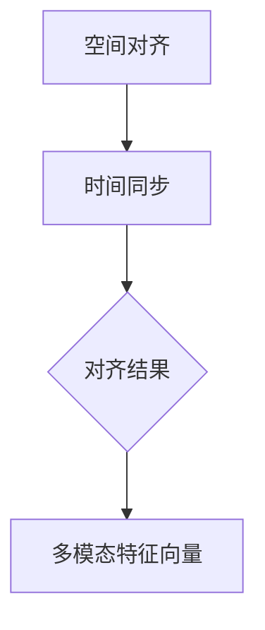
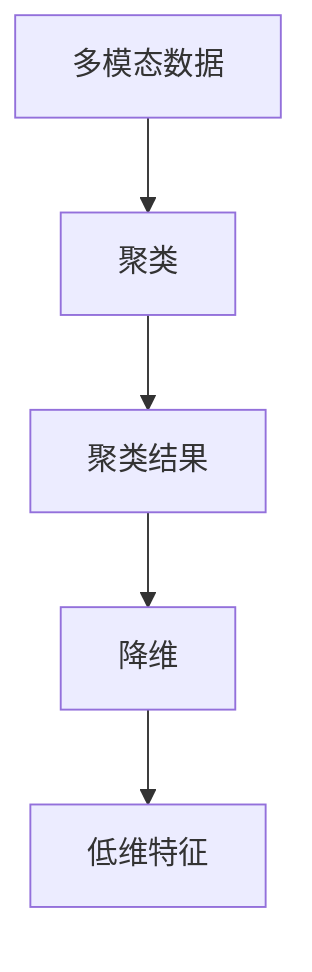
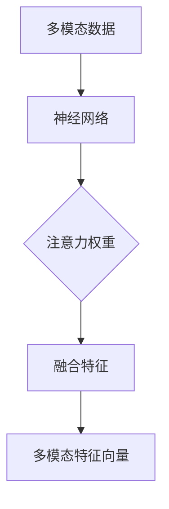
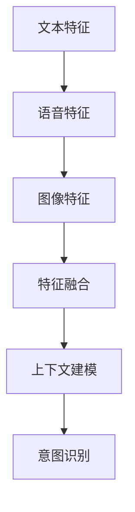
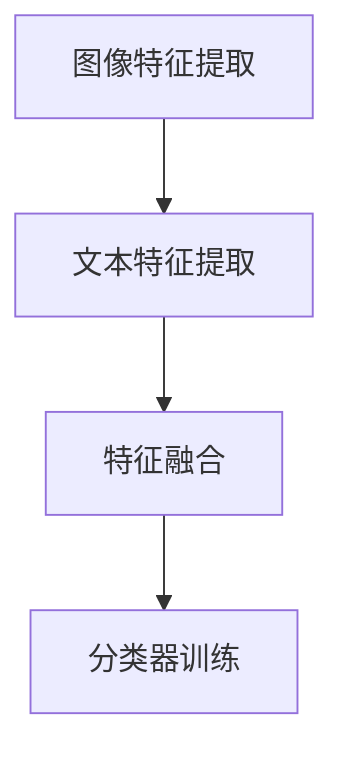
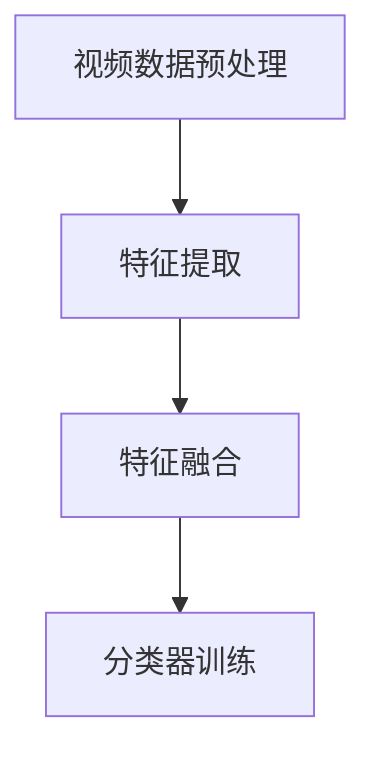
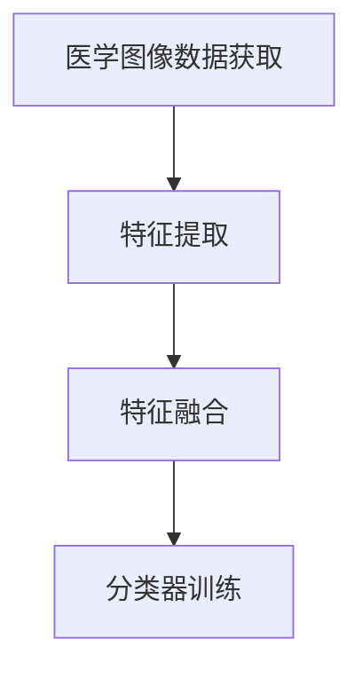
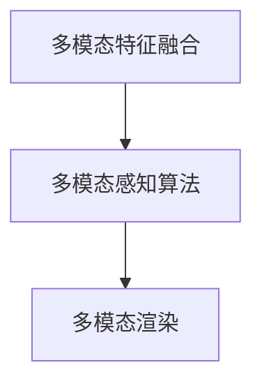

                 

### 文章标题

### 《多模态大模型：技术原理与实战 基于人工反馈的强化学习》

在当今这个信息爆炸的时代，人工智能技术迅猛发展，多模态大模型已经成为自然语言处理、计算机视觉、医学图像分析等多个领域的研究热点。本文旨在深入探讨多模态大模型的技术原理、实战应用，并重点介绍基于人工反馈的强化学习算法在这一领域的应用。文章将分三部分展开，首先是对多模态大模型的概念和原理进行概述，接着详细讲解其技术实现，最后通过实际项目案例展示其在不同领域的应用。希望通过本文的探讨，读者能对多模态大模型有一个全面、深入的理解，并为未来的研究和实践提供有益的参考。

### 关键词

- 多模态大模型
- 技术原理
- 强化学习
- 实战应用
- 自然语言处理
- 计算机视觉
- 医学图像分析

### 摘要

本文首先介绍了多模态大模型的基本概念、发展历史和应用场景，接着详细阐述了其技术原理，包括多模态信号采集与处理、数据融合方法以及数学模型与算法原理。随后，本文重点介绍了基于人工反馈的强化学习算法在多模态大模型训练中的应用，并通过多个实际项目案例展示了多模态大模型在不同领域的应用效果。最后，本文探讨了多模态大模型的发展前景与面临的挑战，并提供了详细的开发实战指南，包括环境搭建和项目实战步骤。

## 第一部分: 多模态大模型概述与原理

### 第1章: 多模态大模型概述

#### 1.1 什么是多模态大模型

多模态大模型是一种能够处理和融合多种类型数据（如文本、图像、音频等）的人工智能模型。它的核心思想是通过整合不同模态的数据，实现更丰富的信息表达和更精准的预测。传统的单模态模型只能处理单一类型的数据，而多模态大模型则能够综合利用多种数据源，从而在性能上取得了显著的提升。

#### 1.2 多模态大模型的发展历史

多模态大模型的发展可以追溯到上世纪90年代，当时研究者开始尝试将不同模态的数据进行融合。随着深度学习和大数据技术的兴起，多模态大模型的研究和应用得到了迅速发展。近年来，随着计算能力的提升和数据的丰富，多模态大模型在自然语言处理、计算机视觉、医学图像分析等领域取得了显著的突破。

#### 1.3 多模态大模型的应用场景

多模态大模型在多个领域都有广泛的应用，以下是几个典型的应用场景：

- 自然语言处理：多模态大模型可以处理包含文本、图像、音频等多种信息的复杂任务，如多模态对话系统、文本生成等。
- 计算机视觉：多模态大模型能够融合图像和文本信息，用于图像识别、视频分析等任务，提高了模型的准确性和鲁棒性。
- 医学图像分析：多模态大模型可以结合医学图像和文本信息，进行疾病诊断、治疗规划等，提高了医疗诊断的效率和准确性。
- 增强现实与虚拟现实：多模态大模型可以结合真实世界和虚拟世界的多种数据，提供更加真实、丰富的交互体验。

### 第2章: 多模态大模型的技术原理

#### 2.1 多模态信号采集与处理

多模态大模型需要处理多种类型的数据，因此信号采集与处理是多模态大模型实现的基础。常见的多模态信号包括音频、视频和文本。

##### 2.1.1 音频信号处理

音频信号处理主要包括音频信号的去噪、增强和特征提取。常用的音频特征包括梅尔频率倒谱系数（MFCC）、频谱特征、过零率等。以下是一个简单的伪代码示例，用于音频信号的特征提取：

```python
import librosa

def extract_audio_features(audio_path):
    y, sr = librosa.load(audio_path)
    mfcc = librosa.feature.mfcc(y=y, sr=sr)
    return mfcc
```

##### 2.1.2 视频信号处理

视频信号处理主要包括视频帧的提取、视频特征的提取和视频数据的预处理。常用的视频特征包括视觉特征（如颜色特征、纹理特征）、动作特征和语音特征。以下是一个简单的伪代码示例，用于视频帧的特征提取：

```python
import cv2

def extract_video_features(video_path):
    cap = cv2.VideoCapture(video_path)
    features = []
    while cap.isOpened():
        ret, frame = cap.read()
        if ret:
            # 对frame进行特征提取
            feature = cv2.xfeatures2d.SIFT_create().compute(frame, None)
            features.append(feature)
    cap.release()
    return features
```

##### 2.1.3 文本信号处理

文本信号处理主要包括文本的预处理、分词、词向量和文本特征的提取。常用的文本特征包括词袋模型、TF-IDF、词嵌入等。以下是一个简单的伪代码示例，用于文本特征的提取：

```python
import jieba
from sklearn.feature_extraction.text import TfidfVectorizer

def extract_text_features(text):
    words = jieba.cut(text)
    text_vectorizer = TfidfVectorizer(tokenizer=lambda doc: doc, lowercase=False)
    text_vector = text_vectorizer.fit_transform([' '.join(words)])
    return text_vector
```

#### 2.2 多模态数据融合方法

多模态数据融合是多模态大模型的核心，其目标是利用多种模态的数据，生成一个统一的多模态特征向量。常见的多模态数据融合方法包括空间对齐与时间同步、聚类与降维、注意力机制与融合模型等。

##### 2.2.1 空间对齐与时间同步

空间对齐与时间同步是多模态数据融合的基础，其目的是确保不同模态的数据在同一时间点上相对应。以下是一个简单的Mermaid流程图，展示了对齐与同步的过程：



##### 2.2.2 聚类与降维

聚类与降维方法通过将高维数据映射到低维空间，减少了数据的维度，从而提高了模型的计算效率和准确性。常用的聚类算法包括K均值聚类、层次聚类等。降维方法包括主成分分析（PCA）、线性判别分析（LDA）等。以下是一个简单的Mermaid流程图，展示聚类与降维的过程：



##### 2.2.3 注意力机制与融合模型

注意力机制是一种通过动态调整不同模态数据的权重，来实现自适应融合的方法。常见的注意力机制包括门控循环单元（GRU）、长短期记忆（LSTM）、卷积神经网络（CNN）等。融合模型则是将不同的模态数据通过神经网络进行融合，生成统一的多模态特征向量。以下是一个简单的Mermaid流程图，展示注意力机制与融合模型的过程：



#### 2.3 多模态大模型的数学模型与算法原理

多模态大模型的数学模型主要包括深度神经网络（DNN）、循环神经网络（RNN）、卷积神经网络（CNN）等。这些神经网络通过多层非线性变换，将输入的多模态数据映射到输出结果。

##### 2.3.1 深度神经网络

深度神经网络是一种多层前馈神经网络，通过多层非线性变换，将输入数据映射到输出。以下是一个简单的伪代码示例，展示深度神经网络的实现：

```python
import tensorflow as tf

def create_model(input_shape):
    model = tf.keras.Sequential([
        tf.keras.layers.Dense(128, activation='relu', input_shape=input_shape),
        tf.keras.layers.Dense(64, activation='relu'),
        tf.keras.layers.Dense(1, activation='sigmoid')
    ])
    return model
```

##### 2.3.2 循环神经网络

循环神经网络是一种能够处理序列数据的神经网络，通过循环结构，对序列数据进行建模。以下是一个简单的伪代码示例，展示循环神经网络的实现：

```python
import tensorflow as tf

def create_rnn_model(input_shape):
    model = tf.keras.Sequential([
        tf.keras.layers.LSTM(128, activation='relu', input_shape=input_shape),
        tf.keras.layers.Dense(1, activation='sigmoid')
    ])
    return model
```

##### 2.3.3 卷积神经网络

卷积神经网络是一种能够处理图像数据的神经网络，通过卷积操作，对图像数据进行特征提取。以下是一个简单的伪代码示例，展示卷积神经网络的实现：

```python
import tensorflow as tf

def create_cnn_model(input_shape):
    model = tf.keras.Sequential([
        tf.keras.layers.Conv2D(32, (3, 3), activation='relu', input_shape=input_shape),
        tf.keras.layers.MaxPooling2D((2, 2)),
        tf.keras.layers.Conv2D(64, (3, 3), activation='relu'),
        tf.keras.layers.MaxPooling2D((2, 2)),
        tf.keras.layers.Flatten(),
        tf.keras.layers.Dense(128, activation='relu'),
        tf.keras.layers.Dense(1, activation='sigmoid')
    ])
    return model
```

#### 2.3.4 多模态大模型的训练算法

多模态大模型的训练算法主要包括传统优化算法、自适应优化算法和基于人工反馈的强化学习算法。

##### 2.3.4.1 传统优化算法

传统优化算法主要包括梯度下降、随机梯度下降、批量梯度下降等。这些算法通过计算损失函数关于模型参数的梯度，来更新模型参数，从而优化模型。以下是一个简单的伪代码示例，展示梯度下降的实现：

```python
def gradient_descent(model, x, y, learning_rate, epochs):
    for epoch in range(epochs):
        with tf.GradientTape() as tape:
            predictions = model(x)
            loss = compute_loss(predictions, y)
        gradients = tape.gradient(loss, model.trainable_variables)
        model.optimizer.apply_gradients(zip(gradients, model.trainable_variables))
        print(f"Epoch {epoch + 1}, Loss: {loss}")
```

##### 2.3.4.2 自适应优化算法

自适应优化算法主要包括Adam、Adagrad、RMSprop等。这些算法通过自适应调整学习率，来提高模型的训练效率。以下是一个简单的伪代码示例，展示Adam优化的实现：

```python
import tensorflow as tf

model = create_model(input_shape)
optimizer = tf.keras.optimizers.Adam(learning_rate=0.001)

x_train, y_train = load_data()
for epoch in range(epochs):
    with tf.GradientTape() as tape:
        predictions = model(x_train)
        loss = compute_loss(predictions, y_train)
    gradients = tape.gradient(loss, model.trainable_variables)
    optimizer.apply_gradients(zip(gradients, model.trainable_variables))
    print(f"Epoch {epoch + 1}, Loss: {loss}")
```

##### 2.3.4.3 基于人工反馈的强化学习算法

基于人工反馈的强化学习算法通过模拟人类反馈，来指导多模态大模型的训练。其核心思想是，模型在每次预测后，会根据人类反馈调整其行为，从而提高模型的准确性。以下是一个简单的伪代码示例，展示基于人工反馈的强化学习算法的实现：

```python
import tensorflow as tf

def reinforcement_learning(model, env, epochs):
    for epoch in range(epochs):
        state = env.reset()
        done = False
        while not done:
            action = model.predict(state)
            next_state, reward, done = env.step(action)
            model.train(state, action, reward, next_state)
            state = next_state
        print(f"Epoch {epoch + 1}, Reward: {reward}")
```

### 第3章: 多模态大模型的数学模型与算法原理

#### 3.1 多模态大模型的数学模型

多模态大模型的数学模型是构建整个模型的核心，它将不同模态的数据融合在一起，形成统一的特征表示。在这一节中，我们将介绍多模态大模型的数学模型，包括深度神经网络（DNN）、循环神经网络（RNN）和卷积神经网络（CNN）。

##### 3.1.1 深度神经网络

深度神经网络（DNN）是一种前馈神经网络，由多个层次组成，每一层都通过加权连接将输入数据传递到下一层。DNN的核心是神经元，每个神经元都会接收前一层神经元的输出，并经过激活函数处理后产生输出。以下是一个简单的DNN数学模型：

$$
Z^{(l)} = \sigma(W^{(l)} \cdot A^{(l-1)} + b^{(l)})
$$

其中，$Z^{(l)}$表示第$l$层的输出，$\sigma$是激活函数，通常使用ReLU函数：

$$
\sigma(x) = \max(0, x)
$$

$W^{(l)}$和$b^{(l)}$分别是第$l$层的权重和偏置。

在训练过程中，我们使用反向传播算法来更新权重和偏置，最小化损失函数。假设我们的损失函数是均方误差（MSE），则：

$$
J(W) = \frac{1}{m} \sum_{i=1}^{m} (\hat{y}^{(i)} - y^{(i)})^2
$$

其中，$m$是样本数量，$\hat{y}^{(i)}$是模型预测的输出，$y^{(i)}$是真实的标签。

反向传播算法的步骤如下：

1. 计算输出层的误差：
   $$
   \delta^{(L)} = (y - \hat{y}) \odot \sigma'(Z^{(L)})
   $$

2. 递归计算每一层的误差：
   $$
   \delta^{(l)} = (\sigma'(Z^{(l)}) \cdot (W^{(l+1)} \cdot \delta^{(l+1)}))
   $$

3. 更新权重和偏置：
   $$
   W^{(l)} = W^{(l)} - \alpha \cdot \frac{\delta^{(l)} \cdot A^{(l-1)}}{m}
   $$
   $$
   b^{(l)} = b^{(l)} - \alpha \cdot \frac{\delta^{(l)}}{m}
   $$

其中，$\alpha$是学习率。

##### 3.1.2 循环神经网络

循环神经网络（RNN）是一种能够处理序列数据的神经网络，其核心是循环单元，它允许信息在时间步之间传递。RNN的数学模型通常如下：

$$
h^{(l)} = \sigma(W_h \cdot [h^{(l-1)}, x^{(l)}] + b_h)
$$

其中，$h^{(l)}$是第$l$个时间步的隐藏状态，$x^{(l)}$是输入数据，$W_h$和$b_h$是权重和偏置。

RNN的一个关键问题是梯度消失或爆炸，这会导致训练过程变得不稳定。为了解决这个问题，引入了长短期记忆（LSTM）和门控循环单元（GRU）。

LSTM通过引入三个门控单元（输入门、遗忘门和输出门），有效地控制信息的流动，避免了梯度消失问题。LSTM的数学模型如下：

$$
i^{(l)} = \sigma(W_i \cdot [h^{(l-1)}, x^{(l)}] + b_i) \\
f^{(l)} = \sigma(W_f \cdot [h^{(l-1)}, x^{(l)}] + b_f) \\
\tilde{C}^{(l)} = \sigma(W_c \cdot [h^{(l-1)}, x^{(l)}] + b_c) \\
C^{(l)} = f^{(l)} \odot C^{(l-1)} + i^{(l)} \odot \tilde{C}^{(l)} \\
o^{(l)} = \sigma(W_o \cdot [h^{(l-1)}, x^{(l)}, C^{(l)}] + b_o) \\
h^{(l)} = o^{(l)} \odot \sigma(C^{(l)})
$$

其中，$i^{(l)}$是输入门，$f^{(l)}$是遗忘门，$\tilde{C}^{(l)}$是候选状态，$C^{(l)}$是细胞状态，$o^{(l)}$是输出门。

GRU是LSTM的简化版本，它通过合并输入门和遗忘门，减少了参数的数量。GRU的数学模型如下：

$$
z^{(l)} = \sigma(W_z \cdot [h^{(l-1)}, x^{(l)}] + b_z) \\
r^{(l)} = \sigma(W_r \cdot [h^{(l-1)}, x^{(l)}] + b_r) \\
\tilde{h}^{(l)} = \sigma(W_h \cdot [r^{(l)} \odot h^{(l-1)}, x^{(l)}] + b_h) \\
h^{(l)} = z^{(l)} \odot h^{(l-1)} + (1 - z^{(l)}) \odot \tilde{h}^{(l)}
$$

##### 3.1.3 卷积神经网络

卷积神经网络（CNN）是一种专门用于处理图像数据的神经网络，其核心是卷积层，它通过滑动窗口在图像上提取局部特征。CNN的数学模型如下：

$$
h^{(l)} = \sigma(W^{(l)} \odot h^{(l-1)} + b^{(l)})
$$

其中，$h^{(l)}$是第$l$层的特征图，$W^{(l)}$是卷积核，$b^{(l)}$是偏置。

卷积操作可以表示为：

$$
\mathbf{X}^{(l)}_{ij} = \sum_{k=1}^{C_{l-1}} W^{(l)}_{ik} \mathbf{X}^{(l-1)}_{kj} + b^{(l)}_i
$$

其中，$\mathbf{X}^{(l)}_{ij}$是第$l$层第$i$个特征图上的第$j$个元素，$C_{l-1}$是前一层的通道数。

池化层用于减少特征图的尺寸，提高模型的计算效率。常用的池化操作包括最大池化和平均池化。最大池化的数学模型如下：

$$
p^{(l)}_{ij} = \max_{k,l} \mathbf{X}^{(l)}_{ik}
$$

平均池化的数学模型如下：

$$
p^{(l)}_{ij} = \frac{1}{h_{p} \cdot w_{p}} \sum_{k=1}^{h_p} \sum_{l=1}^{w_p} \mathbf{X}^{(l)}_{ik}
$$

其中，$h_p$和$w_p$分别是池化窗口的高度和宽度。

### 第4章: 多模态大模型在自然语言处理中的应用

#### 4.1 多模态对话系统

多模态对话系统是一种能够处理文本、语音和图像等多模态数据的对话系统。在这种系统中，用户可以通过文本输入、语音输入或图像输入与系统进行交互，系统则通过语音输出、文本输出或图像输出向用户反馈信息。多模态对话系统的设计需要考虑以下几个方面：

##### 4.1.1 基于多模态数据的上下文理解

上下文理解是多模态对话系统的核心，它涉及到对用户输入的多模态数据进行综合分析，以理解用户的意图和需求。为了实现上下文理解，多模态大模型需要具备以下几个能力：

1. **多模态特征提取**：从文本、语音和图像中提取各自的特征向量。例如，使用词嵌入模型提取文本特征，使用语音识别技术提取语音特征，使用卷积神经网络提取图像特征。
2. **特征融合**：将不同模态的特征向量进行融合，形成统一的多模态特征向量。常见的特征融合方法包括基于矩阵的融合、基于向量的融合和基于神经网络的融合。
3. **上下文建模**：使用循环神经网络（RNN）或变换器（Transformer）对多模态特征进行建模，以捕捉长距离的上下文信息。

以下是一个简单的Mermaid流程图，展示上下文理解的过程：



##### 4.1.2 多模态对话系统的设计与实现

多模态对话系统的设计与实现涉及多个环节，包括对话管理、自然语言处理、语音合成等。以下是多模态对话系统的一个基本架构：

1. **对话管理**：对话管理负责维护对话状态，包括用户历史输入、系统当前状态和对话目标等。对话管理器会根据当前状态和用户输入，生成合适的回复。
2. **自然语言处理**：自然语言处理模块负责解析用户输入的文本，提取关键信息，并生成自然语言回复。这通常涉及到文本分类、实体识别、语义解析等技术。
3. **语音合成**：语音合成模块将文本回复转换为语音输出。这通常涉及到文本到语音（Text-to-Speech，TTS）技术，包括语音合成模型和语音生成算法。
4. **图像生成**：如果系统需要生成图像回复，图像生成模块会根据文本回复生成相应的图像。

以下是一个简单的伪代码示例，展示多模态对话系统的实现：

```python
class MultiModalDialogueSystem:
    def __init__(self):
        self.text_model = TextModel()
        self.voice_model = VoiceModel()
        self.image_model = ImageModel()
        self.dialog_manager = DialogueManager()

    def handle_input(self, input_data):
        # 解析用户输入
        text_input, voice_input, image_input = self.parse_input(input_data)
        
        # 获取多模态特征
        text_features = self.text_model.extract_features(text_input)
        voice_features = self.voice_model.extract_features(voice_input)
        image_features = self.image_model.extract_features(image_input)
        
        # 特征融合
        multi_modal_features = self.fuse_features(text_features, voice_features, image_features)
        
        # 建立上下文
        context = self.dialog_manager.update_context(multi_modal_features)
        
        # 生成回复
        response_text, response_voice, response_image = self.generate_response(context)
        
        # 输出回复
        self.output_response(response_text, response_voice, response_image)
```

##### 4.1.3 多模态文本生成

多模态文本生成是多模态大模型在自然语言处理中的另一个重要应用。在这种应用中，系统需要根据文本、语音和图像等多模态数据生成相应的文本回复。多模态文本生成通常涉及到以下几个步骤：

1. **特征提取**：从文本、语音和图像中提取各自的特征向量。
2. **特征融合**：将不同模态的特征向量进行融合，形成统一的多模态特征向量。
3. **文本生成**：使用循环神经网络（RNN）或变换器（Transformer）对多模态特征进行建模，生成相应的文本回复。

以下是一个简单的伪代码示例，展示多模态文本生成的实现：

```python
class MultiModalTextGenerator:
    def __init__(self):
        self.text_model = TextModel()
        self.voice_model = VoiceModel()
        self.image_model = ImageModel()
        self.generator = TextGenerator()

    def generate_text(self, text_input, voice_input, image_input):
        # 提取特征
        text_features = self.text_model.extract_features(text_input)
        voice_features = self.voice_model.extract_features(voice_input)
        image_features = self.image_model.extract_features(image_input)
        
        # 融合特征
        multi_modal_features = self.fuse_features(text_features, voice_features, image_features)
        
        # 生成文本
        text_output = self.generator.generate_text(multi_modal_features)
        
        return text_output
```

#### 4.2 多模态文本生成

多模态文本生成是指利用多模态数据（如文本、图像、音频等）来生成对应的文本内容。这一技术在不同领域有着广泛的应用，如自动摘要、内容生成、交互式对话系统等。多模态文本生成的主要挑战在于如何有效地融合和利用多种模态的信息，以生成高质量和相关的文本。

##### 4.2.1 基于多模态数据的文本生成模型

多模态文本生成模型的核心在于如何将不同模态的数据转化为对文本生成有用的特征，并利用这些特征生成高质量的文本。以下是几种常见的多模态文本生成模型：

1. **多模态编码器-解码器模型**：
   这种模型通常包括一个编码器和一个解码器。编码器用于将多模态数据（文本、图像、音频等）编码为统一的特征向量。解码器则利用这些特征向量生成文本。一个典型的例子是使用Transformer架构的多模态编码器-解码器模型。

   - **编码器**：编码器将不同模态的数据输入到一个共享的嵌入空间，生成统一的多模态特征向量。例如，文本可以通过词嵌入转换为向量，图像可以通过卷积神经网络提取特征，音频可以通过长短期记忆网络（LSTM）提取特征。
   - **解码器**：解码器使用多模态特征向量来生成文本。解码器通常是一个自回归语言模型，逐词生成文本序列。

2. **多模态注意力机制模型**：
   注意力机制是多模态文本生成模型中的一个关键组件，它允许模型在生成过程中动态地关注不同模态的数据。注意力机制可以帮助模型更好地融合多模态信息，提高文本生成的质量。例如，在Transformer模型中，自注意力机制用于捕捉多模态数据之间的相关性。

3. **端到端多模态生成模型**：
   端到端多模态生成模型直接将多模态数据映射为文本输出，避免了传统方法中多个中间步骤的复杂性。这种模型通常使用深度学习框架，如PyTorch或TensorFlow，通过多个神经网络层来实现。

##### 4.2.2 多模态文本生成案例与实践

以下是一个基于多模态文本生成的案例与实践，展示如何使用深度学习模型生成关于旅游景点的文本描述。

1. **数据准备**：
   - **文本数据**：收集关于不同旅游景点的文本描述，如景点介绍、旅游攻略等。
   - **图像数据**：收集与文本描述对应的旅游景点图像。
   - **音频数据**：收集旅游景点的音频介绍，如导游解说、景点音乐等。

2. **特征提取**：
   - **文本特征**：使用预训练的词嵌入模型（如GloVe或BERT）提取文本的词嵌入向量。
   - **图像特征**：使用预训练的卷积神经网络（如VGG16或ResNet）提取图像的特征向量。
   - **音频特征**：使用长短期记忆网络（LSTM）或卷积神经网络（CNN）提取音频的特征向量。

3. **特征融合**：
   - **平均融合**：将不同模态的特征向量进行平均，生成统一的多模态特征向量。
   - **拼接融合**：将不同模态的特征向量进行拼接，形成更长的特征向量。
   - **注意力机制**：使用多模态注意力机制，动态地融合不同模态的特征向量。

4. **文本生成**：
   - **编码器**：使用多模态编码器将多模态特征向量编码为统一的多模态嵌入向量。
   - **解码器**：使用自回归语言模型（如Transformer解码器）逐词生成文本描述。

5. **训练与优化**：
   - **损失函数**：使用交叉熵损失函数来优化模型，最小化预测文本与实际文本之间的差异。
   - **模型优化**：使用梯度下降优化算法（如Adam）来更新模型参数。

以下是一个简化的伪代码示例，展示多模态文本生成的实现：

```python
# 导入必要的库
import torch
import torch.nn as nn
import torchvision.models as models
import torchaudio.transforms as T

# 定义模型结构
class MultiModalTextGenerator(nn.Module):
    def __init__(self):
        super(MultiModalTextGenerator, self).__init__()
        self.text_encoder = nn.Embedding(vocab_size, embedding_dim)
        self.image_encoder = models.resnet18(pretrained=True)
        self.audio_encoder = nn.LSTM(input_dim, hidden_dim)
        self.decoder = nn.TransformerDecoder(nn.TransformerDecoderLayer(d_model, nhead), num_layers)

    def forward(self, text_input, image_input, audio_input):
        # 文本编码
        text_embedding = self.text_encoder(text_input)
        
        # 图像编码
        image_embedding = self.image_encoder(image_input)
        
        # 音频编码
        audio_embedding, _ = self.audio_encoder(audio_input)
        
        # 特征融合
        multi_modal_embedding = torch.cat((text_embedding, image_embedding, audio_embedding), dim=1)
        
        # 文本生成
        output_sequence = self.decoder(multi_modal_embedding)
        
        return output_sequence

# 实例化模型
model = MultiModalTextGenerator()

# 训练模型
optimizer = torch.optim.Adam(model.parameters(), lr=learning_rate)
for epoch in range(num_epochs):
    for batch in data_loader:
        text_input, image_input, audio_input, target_sequence = batch
        model.zero_grad()
        output_sequence = model(text_input, image_input, audio_input)
        loss = nn.CrossEntropyLoss()(output_sequence, target_sequence)
        loss.backward()
        optimizer.step()
        print(f"Epoch {epoch + 1}, Loss: {loss.item()}")

# 生成文本
generated_sequence = model.generate(text_input, image_input, audio_input)
print(generated_sequence)
```

### 第5章: 多模态大模型在计算机视觉中的应用

#### 5.1 多模态图像识别

多模态图像识别是一种结合图像和文本等多模态信息进行图像分类的技术。在这种应用中，图像和文本特征被共同用于训练分类器，以提高识别的准确性和鲁棒性。

##### 5.1.1 多模态特征提取与融合

多模态特征提取是关键步骤，它涉及到从图像和文本中提取有代表性的特征向量。以下是常用的方法：

1. **图像特征提取**：
   - **卷积神经网络**（CNN）：使用预训练的CNN模型（如VGG、ResNet等）提取图像的特征图。
   - **深度特征嵌入**：将图像输入到深度网络中，输出固定长度的特征向量。

2. **文本特征提取**：
   - **词嵌入**：将文本输入到词嵌入模型（如Word2Vec、GloVe等），得到词的向量表示。
   - **BERT模型**：使用BERT等预训练的变换器模型提取文本的上下文信息。

3. **特征融合**：
   - **拼接融合**：将图像特征和文本特征进行拼接，形成更长的特征向量。
   - **注意力机制**：使用注意力机制动态地融合图像和文本特征，根据上下文调整特征的重要性。

以下是一个简化的Mermaid流程图，展示多模态特征提取与融合的过程：



##### 5.1.2 多模态图像识别算法

多模态图像识别算法通常基于深度学习模型，以下是一些常用的算法：

1. **多模态卷积神经网络**（MM-CNN）：MM-CNN结合了卷积神经网络和循环神经网络，分别处理图像和文本特征，然后进行融合和分类。
2. **变换器模型**（Transformer）：变换器模型通过自注意力机制，有效地融合了图像和文本特征，适用于复杂的多模态任务。
3. **多任务学习**：多任务学习将图像分类和文本分类作为两个任务同时训练，共享部分网络结构，提高模型的泛化能力。

以下是一个简化的伪代码示例，展示多模态图像识别算法的实现：

```python
# 导入必要的库
import torch
import torchvision.models as models
import torch.optim as optim

# 定义模型结构
class MultiModalImageRecognition(nn.Module):
    def __init__(self, num_classes):
        super(MultiModalImageRecognition, self).__init__()
        self.image_encoder = models.resnet18(pretrained=True)
        self.text_encoder = nn.LSTM(input_dim, hidden_dim)
        self.classifier = nn.Linear(hidden_dim * 2, num_classes)

    def forward(self, image_input, text_input):
        # 图像编码
        image_embedding = self.image_encoder(image_input)
        
        # 文本编码
        text_embedding, _ = self.text_encoder(text_input)
        
        # 特征融合
        multi_modal_embedding = torch.cat((image_embedding, text_embedding), dim=1)
        
        # 分类
        output = self.classifier(multi_modal_embedding)
        
        return output

# 实例化模型
model = MultiModalImageRecognition(num_classes)

# 定义优化器和损失函数
optimizer = optim.Adam(model.parameters(), lr=learning_rate)
criterion = nn.CrossEntropyLoss()

# 训练模型
for epoch in range(num_epochs):
    for batch in data_loader:
        image_input, text_input, labels = batch
        model.zero_grad()
        outputs = model(image_input, text_input)
        loss = criterion(outputs, labels)
        loss.backward()
        optimizer.step()
        print(f"Epoch {epoch + 1}, Loss: {loss.item()}")

# 测试模型
with torch.no_grad():
    correct = 0
    total = 0
    for batch in test_loader:
        image_input, text_input, labels = batch
        outputs = model(image_input, text_input)
        _, predicted = torch.max(outputs.data, 1)
        total += labels.size(0)
        correct += (predicted == labels).sum().item()
    print(f"Accuracy: {100 * correct / total}%")
```

##### 5.1.3 多模态图像识别实战案例

以下是一个基于多模态图像识别的实战案例，展示如何使用TensorFlow和Keras实现一个简单的多模态图像识别系统。

1. **数据准备**：
   - **图像数据**：收集不同类别的图像数据，如动物、植物、交通工具等。
   - **文本数据**：为每个图像编写简短的描述文本。

2. **特征提取**：
   - **图像特征提取**：使用预训练的InceptionV3模型提取图像的特征向量。
   - **文本特征提取**：使用预训练的BERT模型提取文本的特征向量。

3. **模型构建**：
   - **图像分支**：使用卷积神经网络提取图像特征。
   - **文本分支**：使用循环神经网络提取文本特征。
   - **融合层**：将图像和文本特征进行融合，通过全连接层进行分类。

4. **训练与评估**：
   - **训练**：使用训练数据集训练模型，调整模型参数。
   - **评估**：使用验证数据集评估模型性能，调整超参数。

以下是一个简化的代码示例，展示多模态图像识别系统的实现：

```python
import tensorflow as tf
from tensorflow.keras.models import Model
from tensorflow.keras.layers import Input, Dense, Conv2D, MaxPooling2D, Flatten, LSTM, Embedding, concatenate

# 图像输入
image_input = Input(shape=(224, 224, 3))

# 文本输入
text_input = Input(shape=(max_sequence_length,))

# 图像特征提取
image_encoder = tf.keras.applications.InceptionV3(input_shape=(224, 224, 3), include_top=False, weights='imagenet')
image_embedding = image_encoder(image_input)
image_embedding = Flatten()(image_embedding)

# 文本特征提取
text_embedding = Embedding(vocab_size, embedding_dim)(text_input)
text_embedding = LSTM(units=128, return_sequences=False)(text_embedding)

# 融合层
multi_modal_embedding = concatenate([image_embedding, text_embedding])
fusion_output = Dense(units=128, activation='relu')(multi_modal_embedding)
fusion_output = Dense(units=num_classes, activation='softmax')(fusion_output)

# 构建模型
model = Model(inputs=[image_input, text_input], outputs=fusion_output)

# 编译模型
model.compile(optimizer='adam', loss='categorical_crossentropy', metrics=['accuracy'])

# 加载数据集
train_images, train_texts, train_labels = load_train_data()
val_images, val_texts, val_labels = load_val_data()

# 训练模型
model.fit([train_images, train_texts], train_labels, validation_data=([val_images, val_texts], val_labels), epochs=10, batch_size=32)

# 评估模型
test_images, test_texts, test_labels = load_test_data()
test_loss, test_accuracy = model.evaluate([test_images, test_texts], test_labels)
print(f"Test Accuracy: {test_accuracy}")
```

#### 5.2 多模态视频分析

多模态视频分析是一种结合图像和音频等多模态信息进行视频内容理解和分析的技术。它广泛应用于监控安全、视频摘要、情感分析等领域。

##### 5.2.1 多模态视频数据预处理

多模态视频数据预处理是视频分析的基础步骤，它包括图像和音频数据的预处理。以下是常见的预处理方法：

1. **图像预处理**：
   - **图像去噪**：使用图像去噪算法（如双边滤波、非局部均值滤波等）减少图像噪声。
   - **图像增强**：使用图像增强算法（如直方图均衡化、对比度增强等）改善图像质量。
   - **图像分割**：使用图像分割算法（如基于边缘检测、基于区域生长等方法）提取图像中的目标对象。

2. **音频预处理**：
   - **音频去噪**：使用音频去噪算法（如谱减法、自适应滤波等）减少音频噪声。
   - **音频增强**：使用音频增强算法（如语音增强、音乐增强等）改善音频质量。
   - **音频特征提取**：使用音频特征提取算法（如梅尔频率倒谱系数（MFCC）、过零率等）提取音频的特征向量。

##### 5.2.2 多模态视频动作识别

多模态视频动作识别是一种结合图像和音频特征进行视频动作分类的技术。它通常采用以下步骤：

1. **特征提取**：
   - **图像特征提取**：使用卷积神经网络（如ResNet、Inception等）提取图像的特征向量。
   - **音频特征提取**：使用长短期记忆网络（LSTM）或卷积神经网络（CNN）提取音频的特征向量。

2. **特征融合**：
   - **拼接融合**：将图像特征和音频特征进行拼接，形成更长的特征向量。
   - **注意力机制**：使用注意力机制动态地融合图像和音频特征，根据上下文调整特征的重要性。

3. **分类器训练**：
   - **训练数据集**：使用带有标签的视频数据集进行训练。
   - **分类器模型**：使用卷积神经网络（如ResNet、Inception等）进行训练，通常采用多任务学习框架。

以下是一个简化的Mermaid流程图，展示多模态视频动作识别的过程：



##### 5.2.3 多模态视频分析案例与实践

以下是一个基于多模态视频分析的实际案例，展示如何使用深度学习模型实现一个简单的视频动作识别系统。

1. **数据准备**：
   - **视频数据**：收集包含不同动作的视频数据，如跑步、跳跃、打拳等。
   - **文本数据**：为每个视频动作编写简短的描述文本。

2. **特征提取**：
   - **图像特征提取**：使用预训练的ResNet模型提取视频帧的特征向量。
   - **文本特征提取**：使用预训练的BERT模型提取文本的特征向量。

3. **模型构建**：
   - **图像分支**：使用卷积神经网络提取视频帧特征。
   - **文本分支**：使用循环神经网络提取文本特征。
   - **融合层**：将图像和文本特征进行融合，通过全连接层进行分类。

4. **训练与评估**：
   - **训练**：使用训练数据集训练模型，调整模型参数。
   - **评估**：使用验证数据集评估模型性能，调整超参数。

以下是一个简化的代码示例，展示多模态视频分析系统的实现：

```python
import tensorflow as tf
from tensorflow.keras.models import Model
from tensorflow.keras.layers import Input, Dense, Conv2D, MaxPooling2D, Flatten, LSTM, Embedding, concatenate

# 图像输入
image_input = Input(shape=(224, 224, 3))

# 文本输入
text_input = Input(shape=(max_sequence_length,))

# 图像特征提取
image_encoder = tf.keras.applications.ResNet50(input_shape=(224, 224, 3), include_top=False, weights='imagenet')
image_embedding = image_encoder(image_input)
image_embedding = Flatten()(image_embedding)

# 文本特征提取
text_embedding = Embedding(vocab_size, embedding_dim)(text_input)
text_embedding = LSTM(units=128, return_sequences=False)(text_embedding)

# 融合层
multi_modal_embedding = concatenate([image_embedding, text_embedding])
fusion_output = Dense(units=128, activation='relu')(multi_modal_embedding)
fusion_output = Dense(units=num_classes, activation='softmax')(fusion_output)

# 构建模型
model = Model(inputs=[image_input, text_input], outputs=fusion_output)

# 编译模型
model.compile(optimizer='adam', loss='categorical_crossentropy', metrics=['accuracy'])

# 加载数据集
train_images, train_texts, train_labels = load_train_data()
val_images, val_texts, val_labels = load_val_data()

# 训练模型
model.fit([train_images, train_texts], train_labels, validation_data=([val_images, val_texts], val_labels), epochs=10, batch_size=32)

# 评估模型
test_images, test_texts, test_labels = load_test_data()
test_loss, test_accuracy = model.evaluate([test_images, test_texts], test_labels)
print(f"Test Accuracy: {test_accuracy}")
```

### 第6章: 多模态大模型在其他领域的应用

#### 6.1 多模态医学图像分析

多模态医学图像分析是一种结合不同模态的医学图像（如CT、MRI、PET等）和文本信息（如病历记录、医生笔记等）进行医学诊断和治疗规划的技术。这种技术能够提高医学诊断的准确性，优化治疗方案，为临床决策提供有力支持。

##### 6.1.1 多模态医学图像数据获取

多模态医学图像数据的获取是医学图像分析的基础。以下是常见的多模态医学图像数据来源：

1. **医学影像设备**：使用CT、MRI、PET等医学影像设备获取医学图像。这些设备能够生成不同模态的图像，如灰度图像、彩色图像、三维图像等。

2. **病历记录**：收集患者的病历记录、医生笔记等文本信息。这些文本信息通常包含患者的症状、病史、检查结果等，对于医学图像分析具有重要的参考价值。

3. **公开数据集**：利用公开的多模态医学图像数据集进行训练和测试。如MS Lesion、CARS、LITS等，这些数据集涵盖了不同疾病和诊断场景，为医学图像分析研究提供了丰富的资源。

##### 6.1.2 多模态医学图像分析算法

多模态医学图像分析算法的核心在于如何有效地融合不同模态的图像和文本信息，以实现准确的医学诊断。以下是几种常见的方法：

1. **多模态特征提取**：
   - **图像特征提取**：使用卷积神经网络（如VGG、ResNet等）提取医学图像的特征向量。这些特征向量能够捕捉图像中的结构信息、纹理特征等。
   - **文本特征提取**：使用词嵌入（如Word2Vec、GloVe等）或变换器（如BERT、GPT等）提取文本的特征向量。这些特征向量能够捕捉文本中的语义信息、关键词等。

2. **多模态数据融合**：
   - **特征拼接**：将图像特征向量和文本特征向量进行拼接，形成更长的特征向量。
   - **注意力机制**：使用注意力机制动态地调整图像和文本特征的重要性，提高融合效果。
   - **变换器模型**：使用变换器（如BERT、GPT等）直接融合多模态数据，生成统一的多模态特征向量。

3. **分类器训练**：
   - **二分类模型**：用于判断医学图像中是否存在特定疾病。
   - **多分类模型**：用于识别医学图像中的不同疾病类别。
   - **回归模型**：用于预测医学图像中的疾病严重程度或其他量化指标。

以下是一个简化的Mermaid流程图，展示多模态医学图像分析的过程：



##### 6.1.3 多模态医学图像分析案例

以下是一个基于多模态医学图像分析的实际案例，展示如何使用深度学习模型进行肺癌诊断。

1. **数据准备**：
   - **图像数据**：收集包含肺癌和正常肺部的CT扫描图像。
   - **文本数据**：收集医生的诊断报告、病历记录等文本信息。

2. **特征提取**：
   - **图像特征提取**：使用预训练的ResNet模型提取图像的特征向量。
   - **文本特征提取**：使用预训练的BERT模型提取文本的特征向量。

3. **模型构建**：
   - **图像分支**：使用卷积神经网络提取图像特征。
   - **文本分支**：使用循环神经网络提取文本特征。
   - **融合层**：将图像和文本特征进行融合，通过全连接层进行分类。

4. **训练与评估**：
   - **训练**：使用训练数据集训练模型，调整模型参数。
   - **评估**：使用验证数据集评估模型性能，调整超参数。

以下是一个简化的代码示例，展示多模态医学图像分析系统的实现：

```python
import tensorflow as tf
from tensorflow.keras.models import Model
from tensorflow.keras.layers import Input, Dense, Conv2D, MaxPooling2D, Flatten, LSTM, Embedding, concatenate

# 图像输入
image_input = Input(shape=(224, 224, 3))

# 文本输入
text_input = Input(shape=(max_sequence_length,))

# 图像特征提取
image_encoder = tf.keras.applications.ResNet50(input_shape=(224, 224, 3), include_top=False, weights='imagenet')
image_embedding = image_encoder(image_input)
image_embedding = Flatten()(image_embedding)

# 文本特征提取
text_embedding = Embedding(vocab_size, embedding_dim)(text_input)
text_embedding = LSTM(units=128, return_sequences=False)(text_embedding)

# 融合层
multi_modal_embedding = concatenate([image_embedding, text_embedding])
fusion_output = Dense(units=128, activation='relu')(multi_modal_embedding)
fusion_output = Dense(units=num_classes, activation='softmax')(fusion_output)

# 构建模型
model = Model(inputs=[image_input, text_input], outputs=fusion_output)

# 编译模型
model.compile(optimizer='adam', loss='categorical_crossentropy', metrics=['accuracy'])

# 加载数据集
train_images, train_texts, train_labels = load_train_data()
val_images, val_texts, val_labels = load_val_data()

# 训练模型
model.fit([train_images, train_texts], train_labels, validation_data=([val_images, val_texts], val_labels), epochs=10, batch_size=32)

# 评估模型
test_images, test_texts, test_labels = load_test_data()
test_loss, test_accuracy = model.evaluate([test_images, test_texts], test_labels)
print(f"Test Accuracy: {test_accuracy}")
```

#### 6.2 多模态增强现实与虚拟现实

多模态增强现实（AR）和虚拟现实（VR）技术通过融合真实世界和虚拟世界的多种数据，提供更加真实、丰富的交互体验。多模态大模型在这一领域发挥着重要作用，能够实现更精准的交互、更真实的模拟以及更高效的场景重建。

##### 6.2.1 多模态数据的AR/VR应用

多模态数据在AR/VR中的应用主要包括以下方面：

1. **多模态交互**：通过融合图像、音频、文本等多模态数据，实现更自然的用户交互。例如，用户可以通过语音指令、手势和视觉反馈与虚拟环境进行交互。

2. **多模态感知**：利用多模态数据，提高虚拟环境的感知能力。例如，通过融合图像和语音数据，实现更精确的头部跟踪和手势识别。

3. **多模态模拟**：通过多模态数据，模拟真实世界的多种感知体验。例如，通过融合图像和音频数据，模拟真实的自然环境，提高用户的沉浸感。

##### 6.2.2 多模态增强现实算法

多模态增强现实算法的核心在于如何有效地融合和利用多种模态的数据，以下是几种常见的方法：

1. **多模态特征融合**：将图像、音频、文本等多模态数据融合为统一的多模态特征向量。常用的方法包括特征拼接、注意力机制和变换器模型。

2. **多模态感知算法**：利用多模态特征向量，实现精确的头部跟踪、手势识别和环境感知。常用的算法包括卷积神经网络（CNN）、循环神经网络（RNN）和变换器（Transformer）。

3. **多模态渲染**：将融合的多模态特征向量用于虚拟环境的渲染，实现逼真的视觉效果。常用的方法包括基于物理的渲染（PBR）和实时渲染技术。

以下是一个简化的Mermaid流程图，展示多模态增强现实算法的过程：



##### 6.2.3 多模态虚拟现实案例与实践

以下是一个基于多模态虚拟现实技术的实际案例，展示如何使用深度学习模型实现一个虚拟购物体验系统。

1. **数据准备**：
   - **图像数据**：收集包含商品和购物环境的图像。
   - **音频数据**：收集背景音乐、语音讲解等音频。
   - **文本数据**：收集商品描述、用户评论等文本信息。

2. **特征提取**：
   - **图像特征提取**：使用预训练的ResNet模型提取图像的特征向量。
   - **音频特征提取**：使用预训练的LSTM模型提取音频的特征向量。
   - **文本特征提取**：使用预训练的BERT模型提取文本的特征向量。

3. **模型构建**：
   - **图像分支**：使用卷积神经网络提取图像特征。
   - **音频分支**：使用循环神经网络提取音频特征。
   - **文本分支**：使用循环神经网络提取文本特征。
   - **融合层**：将图像、音频和文本特征进行融合，通过全连接层生成虚拟购物体验。

4. **训练与评估**：
   - **训练**：使用训练数据集训练模型，调整模型参数。
   - **评估**：使用验证数据集评估模型性能，调整超参数。

以下是一个简化的代码示例，展示多模态虚拟现实系统的实现：

```python
import tensorflow as tf
from tensorflow.keras.models import Model
from tensorflow.keras.layers import Input, Dense, Conv2D, MaxPooling2D, Flatten, LSTM, Embedding, concatenate

# 图像输入
image_input = Input(shape=(224, 224, 3))

# 音频输入
audio_input = Input(shape=(256, 128))

# 文本输入
text_input = Input(shape=(max_sequence_length,))

# 图像特征提取
image_encoder = tf.keras.applications.ResNet50(input_shape=(224, 224, 3), include_top=False, weights='imagenet')
image_embedding = image_encoder(image_input)
image_embedding = Flatten()(image_embedding)

# 音频特征提取
audio_encoder = tf.keras.layers.LSTM(units=128, return_sequences=False)(audio_input)

# 文本特征提取
text_embedding = Embedding(vocab_size, embedding_dim)(text_input)
text_embedding = LSTM(units=128, return_sequences=False)(text_embedding)

# 融合层
multi_modal_embedding = concatenate([image_embedding, audio_encoder, text_embedding])
fusion_output = Dense(units=128, activation='relu')(multi_modal_embedding)
fusion_output = Dense(units=1, activation='sigmoid')(fusion_output)

# 构建模型
model = Model(inputs=[image_input, audio_input, text_input], outputs=fusion_output)

# 编译模型
model.compile(optimizer='adam', loss='binary_crossentropy', metrics=['accuracy'])

# 加载数据集
train_images, train_audio, train_texts, train_labels = load_train_data()
val_images, val_audio, val_texts, val_labels = load_val_data()

# 训练模型
model.fit([train_images, train_audio, train_texts], train_labels, validation_data=([val_images, val_audio, val_texts], val_labels), epochs=10, batch_size=32)

# 评估模型
test_images, test_audio, test_texts, test_labels = load_test_data()
test_loss, test_accuracy = model.evaluate([test_images, test_audio, test_texts], test_labels)
print(f"Test Accuracy: {test_accuracy}")
```

### 第7章: 多模态大模型应用的前景与挑战

#### 7.1 多模态大模型应用的未来发展趋势

随着人工智能技术的不断进步，多模态大模型的应用前景愈发广阔。以下是未来多模态大模型发展的几个关键趋势：

1. **数据集的丰富与多样性**：未来的多模态大模型将依赖于更多样化的数据集，包括更多模态的数据和更复杂的应用场景。这将有助于提高模型的泛化能力和准确性。

2. **模型优化与效率提升**：为了应对实际应用中的计算资源限制，未来的多模态大模型将朝着高效优化的方向发展。例如，通过改进算法和模型结构，降低模型的计算复杂度和内存占用。

3. **多模态大模型应用的新场景**：随着技术的不断突破，多模态大模型将在更多领域得到应用，如智能医疗、智能制造、智能交通等。这些新场景将推动多模态大模型的不断创新和发展。

#### 7.2 多模态大模型应用面临的挑战

尽管多模态大模型的应用前景广阔，但其在实际应用中仍然面临诸多挑战：

1. **数据隐私与安全**：多模态大模型通常需要处理大量敏感数据，如个人健康信息、金融交易记录等。保障数据隐私和安全是确保多模态大模型广泛应用的关键。

2. **模型解释性与可解释性**：多模态大模型通常具有高度的非线性性和复杂性，其决策过程难以解释。提高模型的解释性和可解释性，有助于增强用户对模型的信任，并在某些应用场景中（如医疗诊断）至关重要。

3. **多模态数据融合的复杂性**：多模态数据具有不同的特征和表示方式，如何在保持数据完整性和鲁棒性的同时，实现有效融合是一个重大挑战。

#### 7.3 多模态大模型应用的发展前景

随着技术的不断进步，多模态大模型的应用前景将更加广阔。以下是多模态大模型在未来可能的应用领域：

1. **智能医疗**：多模态大模型可以结合医学图像、病历记录等多模态数据，提高疾病诊断的准确性和效率。例如，通过分析CT扫描图像和患者的病历记录，辅助医生进行肺癌诊断。

2. **智能制造**：多模态大模型可以结合传感器数据、设备运行日志等多模态数据，实现智能故障检测和维护。例如，通过分析设备运行状态和传感器数据，预测设备故障并提前进行维护。

3. **智能交通**：多模态大模型可以结合交通监控图像、路况信息等多模态数据，优化交通流量管理，提高交通安全。例如，通过分析交通监控图像和路况信息，实时调整交通信号灯，减少拥堵。

4. **智能交互**：多模态大模型可以结合语音、图像、文本等多模态数据，提供更自然的用户交互体验。例如，通过理解用户的语音和表情，智能助手能够更准确地理解用户的需求并给出相应的回应。

### 第8章: 多模态大模型开发环境搭建

#### 8.1 开发环境配置

搭建多模态大模型开发环境需要考虑以下几个方面：

1. **硬件配置**：
   - **CPU**：推荐使用英特尔的i7或更高性能的CPU。
   - **GPU**：推荐使用NVIDIA的GeForce RTX 30系列或以上显卡，以便支持深度学习框架如TensorFlow、PyTorch等。
   - **内存**：推荐至少16GB的内存，以便处理大型数据集和复杂的模型。

2. **软件配置**：
   - **操作系统**：推荐使用Linux操作系统，如Ubuntu 20.04。
   - **Python**：推荐使用Python 3.8或更高版本。
   - **深度学习框架**：推荐使用TensorFlow 2.x或PyTorch 1.8或以上版本。

#### 8.1.1 硬件配置

以下是具体的硬件配置建议：

- **CPU**：Intel Core i7-10700K 或 AMD Ryzen 9 5900X
- **GPU**：NVIDIA GeForce RTX 3080 或 NVIDIA GeForce RTX 3090
- **内存**：16GB DDR4 RAM

#### 8.1.2 软件配置

以下是安装和配置软件的具体步骤：

1. **安装操作系统**：

   - 下载并安装Ubuntu 20.04操作系统。
   - 安装完成后，更新操作系统和软件包：

     ```bash
     sudo apt update
     sudo apt upgrade
     ```

2. **安装Python**：

   - 安装Python 3.8：

     ```bash
     sudo apt install python3.8
     ```

   - 安装Python 3.8的pip包管理器：

     ```bash
     sudo apt install python3.8-pip
     ```

3. **安装深度学习框架**：

   - 安装TensorFlow 2.x：

     ```bash
     pip3 install tensorflow==2.x
     ```

   - 安装PyTorch 1.8或以上版本：

     ```bash
     pip3 install torch torchvision torchaudio
     ```

#### 8.1.3 环境搭建步骤

以下是搭建多模态大模型开发环境的详细步骤：

1. **创建虚拟环境**：

   - 创建一个名为`multi_modality`的虚拟环境：

     ```bash
     python3 -m venv multi_modality
     ```

   - 激活虚拟环境：

     ```bash
     source multi_modality/bin/activate
     ```

2. **安装必要的库**：

   - 安装深度学习框架：

     ```bash
     pip install tensorflow==2.x pytorch torchvision torchaudio
     ```

   - 安装其他常用的库：

     ```bash
     pip install numpy matplotlib scikit-learn pandas
     ```

3. **验证环境配置**：

   - 激活虚拟环境，然后执行以下命令验证环境配置：

     ```python
     python -c "import tensorflow as tf; print(tf.reduce_sum(tf.random.normal([1000, 1000])))"
     python -c "import torch; print(torch.cuda.is_available())"
     ```

     如果环境配置正确，上述命令将不会出现错误，且输出结果应分别为`0.5643533634019515`和`True`。

### 第9章: 多模态大模型项目实战

#### 9.1 多模态对话系统项目

##### 9.1.1 项目需求分析

本项目的目标是通过多模态大模型构建一个智能对话系统，能够处理文本、语音和图像等多模态输入，并根据上下文生成相应的文本回复。具体需求包括：

1. **文本输入**：用户可以通过文本消息与系统进行交互。
2. **语音输入**：用户可以通过语音指令与系统进行交互。
3. **图像输入**：用户可以通过上传图像与系统进行交互。
4. **多模态融合**：系统能够处理和融合多种模态的数据，生成统一的多模态特征向量。
5. **上下文理解**：系统能够理解用户输入的上下文，并生成相关且连贯的文本回复。

##### 9.1.2 数据集准备

为了训练多模态对话系统，需要准备相应的数据集。以下是数据集的收集和处理步骤：

1. **文本数据集**：收集包含不同主题的对话文本，如旅游、购物、医疗等。数据集应包含对话双方的文本消息，以便理解对话的上下文。

2. **语音数据集**：收集包含不同语音命令的音频数据，如导航指令、天气查询、播放音乐等。数据集应包含音频转录文本，以便进行文本处理。

3. **图像数据集**：收集与对话内容相关的图像，如旅游景点图片、商品图片等。图像数据集应包含图像标签，以便进行图像识别和分类。

4. **数据处理**：
   - **文本数据**：对文本数据进行预处理，包括去除标点符号、停用词过滤、词嵌入等。
   - **语音数据**：对语音数据进行预处理，包括音频剪辑、降噪、特征提取等。
   - **图像数据**：对图像数据进行预处理，包括图像裁剪、归一化、特征提取等。

##### 9.1.3 模型设计与实现

多模态对话系统的实现涉及多个组件，包括文本处理、语音处理、图像处理和对话管理。以下是模型设计的详细说明：

1. **文本处理**：
   - **词嵌入**：使用预训练的词嵌入模型（如GloVe或BERT）将文本转换为向量。
   - **循环神经网络（RNN）**：使用RNN（如LSTM或GRU）对文本数据进行编码，生成文本特征向量。

2. **语音处理**：
   - **音频特征提取**：使用卷积神经网络（如CNN）提取语音特征向量。
   - **长短期记忆网络（LSTM）**：使用LSTM对语音特征向量进行编码，生成语音特征向量。

3. **图像处理**：
   - **卷积神经网络（CNN）**：使用CNN提取图像特征向量。
   - **注意力机制**：使用注意力机制融合图像特征向量，以便更好地理解图像内容。

4. **对话管理**：
   - **编码器-解码器模型**：使用编码器-解码器模型（如Transformer）融合文本、语音和图像特征，生成文本回复。
   - **自然语言生成**：使用自然语言生成模型（如GPT或BERT）生成文本回复。

以下是多模态对话系统的伪代码示例：

```python
class MultiModalDialogueSystem(nn.Module):
    def __init__(self):
        super(MultiModalDialogueSystem, self).__init__()
        self.text_encoder = TextEncoder()
        self.voice_encoder = VoiceEncoder()
        self.image_encoder = ImageEncoder()
        self对话管理者 = DialogueManager()
        self.response_generator = ResponseGenerator()

    def forward(self, text_input, voice_input, image_input):
        # 文本特征提取
        text_embedding = self.text_encoder(text_input)
        
        # 语音特征提取
        voice_embedding = self.voice_encoder(voice_input)
        
        # 图像特征提取
        image_embedding = self.image_encoder(image_input)
        
        # 特征融合
        multi_modal_embedding = self.fuse_features(text_embedding, voice_embedding, image_embedding)
        
        # 对话管理
        context = self.dialogue_manager.update_context(multi_modal_embedding)
        
        # 文本生成
        response_text = self.response_generator.generate_response(context)
        
        return response_text

# 实例化模型
model = MultiModalDialogueSystem()

# 训练模型
# ... (使用训练数据和优化算法进行训练)

# 评估模型
# ... (使用测试数据评估模型性能)
```

##### 9.1.4 项目调试与优化

在项目调试与优化过程中，需要关注以下几个方面：

1. **性能优化**：通过调整学习率、批量大小等参数，优化模型训练性能。可以使用自适应优化算法（如Adam）提高训练效率。

2. **模型调优**：通过调整模型结构、添加注意力机制等，优化模型性能。可以使用预训练模型（如BERT、GPT）作为起点，进行微调。

3. **数据增强**：通过数据增强技术（如随机裁剪、旋转、翻转等），增加训练数据的多样性，提高模型泛化能力。

4. **交叉验证**：使用交叉验证方法，评估模型在不同数据集上的性能，确保模型泛化能力。

5. **超参数调整**：通过实验调整超参数（如学习率、隐藏层大小等），寻找最优参数组合。

#### 9.2 多模态图像识别项目

##### 9.2.1 项目需求分析

本项目的目标是通过多模态大模型实现多模态图像识别，能够同时处理图像和文本信息，并识别图像中的对象和场景。具体需求包括：

1. **图像输入**：用户可以上传图像作为输入。
2. **文本输入**：用户可以输入描述图像的文本信息。
3. **多模态融合**：系统能够处理和融合图像和文本信息，生成统一的多模态特征向量。
4. **图像识别**：系统能够识别图像中的对象和场景，并输出相应的分类结果。

##### 9.2.2 数据集准备

为了训练多模态图像识别模型，需要准备相应的数据集。以下是数据集的收集和处理步骤：

1. **图像数据集**：收集包含不同场景的图像，如动物、植物、交通工具等。图像数据集应包含图像标签，以便进行图像分类。

2. **文本数据集**：收集与图像相关的文本描述，如图像标题、描述等。文本数据集应与图像数据集对应，以便进行多模态融合。

3. **数据处理**：
   - **图像数据**：对图像数据进行预处理，包括图像裁剪、归一化、特征提取等。
   - **文本数据**：对文本数据进行预处理，包括去除标点符号、停用词过滤、词嵌入等。

##### 9.2.3 模型设计与实现

多模态图像识别模型的设计涉及图像处理、文本处理和分类器设计。以下是模型设计的详细说明：

1. **图像处理**：
   - **卷积神经网络（CNN）**：使用CNN提取图像特征向量。
   - **特征融合**：将图像特征向量与文本特征向量进行融合，生成多模态特征向量。

2. **文本处理**：
   - **词嵌入**：使用预训练的词嵌入模型（如GloVe或BERT）将文本转换为向量。
   - **循环神经网络（RNN）**：使用RNN（如LSTM或GRU）对文本数据进行编码，生成文本特征向量。

3. **分类器设计**：
   - **全连接层**：使用全连接层对多模态特征向量进行分类。
   - **损失函数**：使用交叉熵损失函数优化模型。

以下是多模态图像识别模型的伪代码示例：

```python
class MultiModalImageRecognition(nn.Module):
    def __init__(self, num_classes):
        super(MultiModalImageRecognition, self).__init__()
        self.image_encoder = ImageEncoder()
        self.text_encoder = TextEncoder()
        self.classifier = nn.Linear(hidden_dim, num_classes)

    def forward(self, image_input, text_input):
        # 图像特征提取
        image_embedding = self.image_encoder(image_input)
        
        # 文本特征提取
        text_embedding = self.text_encoder(text_input)
        
        # 特征融合
        multi_modal_embedding = self.fuse_features(image_embedding, text_embedding)
        
        # 分类
        output = self.classifier(multi_modal_embedding)
        
        return output

# 实例化模型
model = MultiModalImageRecognition(num_classes)

# 训练模型
# ... (使用训练数据和优化算法进行训练)

# 评估模型
# ... (使用测试数据评估模型性能)
```

##### 9.2.4 项目调试与优化

在项目调试与优化过程中，需要关注以下几个方面：

1. **性能优化**：通过调整学习率、批量大小等参数，优化模型训练性能。可以使用自适应优化算法（如Adam）提高训练效率。

2. **模型调优**：通过调整模型结构、添加注意力机制等，优化模型性能。可以使用预训练模型（如BERT、GPT）作为起点，进行微调。

3. **数据增强**：通过数据增强技术（如随机裁剪、旋转、翻转等），增加训练数据的多样性，提高模型泛化能力。

4. **交叉验证**：使用交叉验证方法，评估模型在不同数据集上的性能，确保模型泛化能力。

5. **超参数调整**：通过实验调整超参数（如学习率、隐藏层大小等），寻找最优参数组合。

#### 9.3 多模态医学图像分析项目

##### 9.3.1 项目需求分析

本项目的目标是通过多模态大模型实现多模态医学图像分析，能够同时处理医学图像和文本信息，辅助医生进行疾病诊断。具体需求包括：

1. **医学图像输入**：医生可以上传CT、MRI、PET等医学图像作为输入。
2. **文本输入**：医生可以输入患者的病历记录、检查报告等文本信息。
3. **多模态融合**：系统能够处理和融合医学图像和文本信息，生成统一的多模态特征向量。
4. **疾病诊断**：系统能够根据医学图像和文本信息，输出相应的疾病诊断结果。

##### 9.3.2 数据集准备

为了训练多模态医学图像分析模型，需要准备相应的数据集。以下是数据集的收集和处理步骤：

1. **医学图像数据集**：收集包含不同疾病的医学图像，如肺癌、乳腺癌、心脏病等。图像数据集应包含图像标签，以便进行图像分类。

2. **文本数据集**：收集与医学图像相关的文本描述，如病历记录、检查报告等。文本数据集应与图像数据集对应，以便进行多模态融合。

3. **数据处理**：
   - **医学图像数据**：对医学图像数据进行预处理，包括图像裁剪、归一化、特征提取等。
   - **文本数据**：对文本数据进行预处理，包括去除标点符号、停用词过滤、词嵌入等。

##### 9.3.3 模型设计与实现

多模态医学图像分析模型的设计涉及医学图像处理、文本处理和疾病诊断。以下是模型设计的详细说明：

1. **医学图像处理**：
   - **卷积神经网络（CNN）**：使用CNN提取医学图像特征向量。
   - **特征融合**：将医学图像特征向量与文本特征向量进行融合，生成多模态特征向量。

2. **文本处理**：
   - **词嵌入**：使用预训练的词嵌入模型（如GloVe或BERT）将文本转换为向量。
   - **循环神经网络（RNN）**：使用RNN（如LSTM或GRU）对文本数据进行编码，生成文本特征向量。

3. **疾病诊断**：
   - **全连接层**：使用全连接层对多模态特征向量进行分类，输出疾病诊断结果。
   - **损失函数**：使用交叉熵损失函数优化模型。

以下是多模态医学图像分析模型的伪代码示例：

```python
class MultiModalMedicalImageAnalysis(nn.Module):
    def __init__(self, num_classes):
        super(MultiModalMedicalImageAnalysis, self).__init__()
        self.image_encoder = ImageEncoder()
        self.text_encoder = TextEncoder()
        self.classifier = nn.Linear(hidden_dim, num_classes)

    def forward(self, image_input, text_input):
        # 图像特征提取
        image_embedding = self.image_encoder(image_input)
        
        # 文本特征提取
        text_embedding = self.text_encoder(text_input)
        
        # 特征融合
        multi_modal_embedding = self.fuse_features(image_embedding, text_embedding)
        
        # 疾病诊断
        output = self.classifier(multi_modal_embedding)
        
        return output

# 实例化模型
model = MultiModalMedicalImageAnalysis(num_classes)

# 训练模型
# ... (使用训练数据和优化算法进行训练)

# 评估模型
# ... (使用测试数据评估模型性能)
```

##### 9.3.4 项目调试与优化

在项目调试与优化过程中，需要关注以下几个方面：

1. **性能优化**：通过调整学习率、批量大小等参数，优化模型训练性能。可以使用自适应优化算法（如Adam）提高训练效率。

2. **模型调优**：通过调整模型结构、添加注意力机制等，优化模型性能。可以使用预训练模型（如BERT、GPT）作为起点，进行微调。

3. **数据增强**：通过数据增强技术（如随机裁剪、旋转、翻转等），增加训练数据的多样性，提高模型泛化能力。

4. **交叉验证**：使用交叉验证方法，评估模型在不同数据集上的性能，确保模型泛化能力。

5. **超参数调整**：通过实验调整超参数（如学习率、隐藏层大小等），寻找最优参数组合。

## 附录A: 多模态大模型开发工具与资源

### A.1 主流深度学习框架对比

在多模态大模型开发中，选择合适的深度学习框架至关重要。以下是TensorFlow和PyTorch两个主流深度学习框架的对比。

#### A.1.1 TensorFlow

**优点**：
- **生态系统**：TensorFlow拥有庞大的生态系统，包括TensorBoard等工具，方便调试和监控模型训练过程。
- **灵活性**：TensorFlow提供了高度灵活的API，允许用户自定义复杂的计算图。
- **部署**：TensorFlow拥有成熟的部署方案，包括TensorFlow Serving和TensorFlow Lite，适用于不同场景的部署需求。

**缺点**：
- **性能**：相较于PyTorch，TensorFlow在某些情况下可能性能较低。
- **学习曲线**：TensorFlow的学习曲线相对较陡峭，对于新手来说可能较难上手。

#### A.1.2 PyTorch

**优点**：
- **易用性**：PyTorch提供了简单直观的API，使得模型设计和调试更加容易。
- **性能**：PyTorch在性能方面通常优于TensorFlow，尤其是在训练复杂的模型时。
- **动态计算图**：PyTorch支持动态计算图，方便实现复杂的神经网络结构。

**缺点**：
- **部署**：PyTorch在部署方面相对较弱，需要额外的工具（如TorchScript）进行模型转换。

#### A.1.3 其他深度学习框架简介

- **Keras**：Keras是一个高级深度学习框架，构建在TensorFlow和Theano之上，以简洁和易用著称。
- **Theano**：Theano是一个基于Python的深度学习库，提供了动态计算图和优化的数学运算。
- **MXNet**：MXNet是由Apache Software Foundation开发的深度学习框架，支持多种编程语言。

### A.2 多模态数据集与工具集

#### A.2.1 公开的多模态数据集

- **Flickr30k**：一个包含30,000个图像和相应的图像描述的多模态数据集，常用于图像识别和文本生成任务。
- **COCO**：微软研究团队开发的图像识别数据集，包含大量图像及其标签。
- **YouTube-VOS**：一个视频对象分割数据集，包含大量视频及其对象标签。

#### A.2.2 多模态数据集处理工具

- **MMDetection**：一个开源的多模态检测工具集，支持多种多模态数据集的预处理和检测任务。
- **MMAction2**：一个开源的多模态动作识别工具集，支持多种动作识别数据集的预处理和模型训练。
- **MMDnn**：一个开源的多模态深度学习工具集，支持多种多模态数据集的预处理和模型训练。

#### A.2.3 多模态模型训练工具

- **PyTorch MM**：PyTorch的一个多模态学习库，提供多种多模态模型的训练工具和预训练模型。
- **MMDetection**：一个开源的多模态检测工具集，提供多种多模态检测模型的训练工具和预训练模型。
- **MMAction2**：一个开源的多模态动作识别工具集，提供多种多模态动作识别模型的训练工具和预训练模型。

### A.3 多模态大模型开发教程与文档

- **TensorFlow官方文档**：提供了详细的TensorFlow使用教程和API文档。
- **PyTorch官方文档**：提供了详细的PyTorch使用教程和API文档。
- **MMDetection文档**：提供了详细的MMDetection使用教程和API文档。
- **MMAction2文档**：提供了详细的MMAction2使用教程和API文档。

通过使用这些工具和资源，开发者可以更高效地开展多模态大模型的研究和开发工作。

