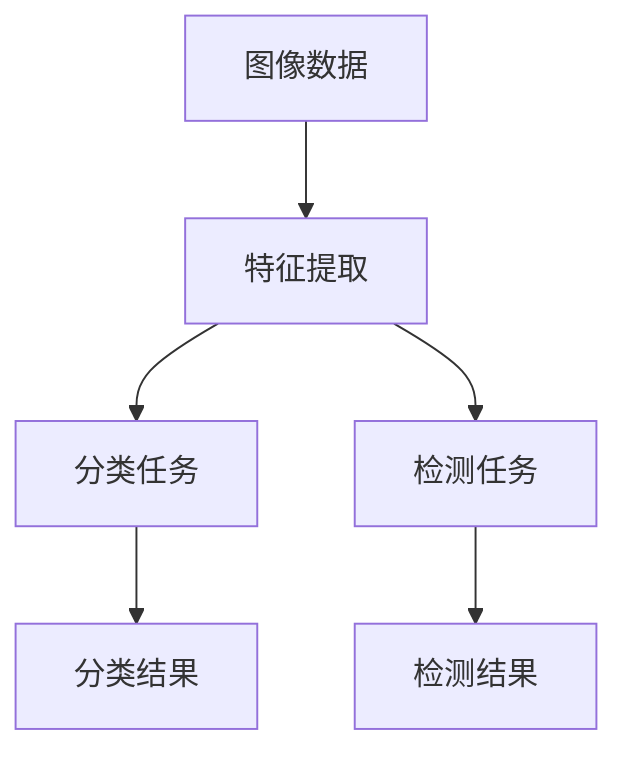

                 

# 文章标题：多模态大模型：技术原理与实战

> 关键词：多模态大模型，技术原理，应用场景，计算机视觉，自然语言处理，音频处理，视频处理

> 摘要：本文从技术原理与实战的角度，深入探讨多模态大模型的概念、架构、应用场景以及未来发展。通过详细的分析与讲解，旨在为读者提供全面的多模态大模型知识体系，并启发对多模态大模型在实际应用中的创新思考。

## 引言

多模态大模型是当前人工智能领域的一个热点研究方向，它融合了多种数据类型，如图像、文本、音频和视频，通过深度学习算法对多模态数据进行建模与分析。相较于单一模态的数据处理，多模态大模型在信息理解、智能交互和场景识别等方面具有显著的优势。随着计算资源和算法的不断发展，多模态大模型的应用场景日益广泛，其在计算机视觉、自然语言处理、音频处理和视频处理等领域展现出巨大的潜力。

本文将分七个部分详细探讨多模态大模型的技术原理与实战应用。首先，我们将概述多模态大模型的基础知识，包括概念、背景和技术架构；接着，深入分析多模态数据的处理与融合方法，并讲解多模态大模型的核心算法；随后，针对计算机视觉、自然语言处理、音频处理和视频处理等应用领域，介绍多模态大模型的实际应用案例；最后，探讨多模态大模型的未来发展趋势与挑战。

通过本文的阅读，读者将能够全面了解多模态大模型的技术原理和实战应用，掌握多模态数据处理与分析的关键技术，并激发对多模态大模型未来应用的深入思考。

## 第一部分：多模态大模型概述

### 第1章：多模态大模型基础

在讨论多模态大模型之前，我们需要理解几个核心概念：多模态数据、多模态大模型以及其背景与核心技术的简要介绍。

### 1.1 多模态大模型的概念与背景

#### 1.1.1 多模态数据的定义与类型

多模态数据是指由两种或两种以上不同模态（如视觉、听觉、文本等）组成的数据集合。这些模态可以是静态的，也可以是动态的，如文本、图像、音频、视频等。例如，一个视频包含了视觉和音频两个模态，而一个语音合成系统则涉及到音频和文本两个模态。

不同类型的多模态数据包括：

- **视觉数据**：图像和视频，通常通过摄像头或屏幕捕获。
- **文本数据**：书籍、文章、社交媒体帖子等，主要通过键盘或语音输入获取。
- **音频数据**：语音、音乐、环境音等，通常通过麦克风或音响设备捕捉。
- **空间数据**：地理信息、传感器数据等，通常通过GPS或其他传感器获取。

#### 1.1.2 多模态大模型的产生与发展

多模态大模型的概念起源于深度学习与大数据技术的蓬勃发展。早期的人工智能系统主要依赖于单一模态的数据，如传统的计算机视觉系统仅使用图像数据。然而，单一模态的数据往往无法充分捕捉现实世界的复杂性和多样性，这限制了人工智能系统的性能和应用范围。

随着深度学习算法的进步和计算资源的增加，研究人员开始探索如何利用多种模态的数据来提升人工智能系统的性能。多模态大模型因此应运而生。早期的多模态大模型主要是在特定领域（如医学影像）进行应用，随着技术的成熟，多模态大模型逐渐扩展到计算机视觉、自然语言处理、音频处理等多个领域。

#### 1.1.3 多模态大模型的核心技术

多模态大模型的核心技术包括多模态数据预处理、多任务学习与模型融合、以及跨模态注意力机制等。

- **多模态数据预处理**：包括图像、文本、音频和视频的预处理，如数据增强、去噪、归一化等，以提高数据质量和模型性能。
- **多任务学习与模型融合**：多任务学习使模型能够在处理一个任务的同时，学习其他相关的任务。模型融合方法将不同模态的特征进行整合，以生成更丰富的表示。
- **跨模态注意力机制**：通过引入注意力机制，模型能够关注到不同模态之间的关联性，提高对复杂信息的理解和处理能力。

### 1.2 多模态大模型的架构与组件

多模态大模型的架构通常包括以下几个关键组件：

- **数据输入模块**：负责接收和处理不同模态的数据，如图像、文本、音频和视频。
- **特征提取模块**：利用深度学习算法（如卷积神经网络、循环神经网络等）提取各模态的特征。
- **特征融合模块**：将不同模态的特征进行融合，形成统一的特征表示。
- **任务输出模块**：根据具体任务（如分类、检测、生成等）生成相应的输出结果。

### 1.3 多模态大模型的应用场景

多模态大模型在多个应用场景中展现出强大的能力，以下是其中几个主要的应用场景：

- **图像与文本融合**：用于图像识别、图像内容理解等。
- **音频与文本融合**：用于语音识别、语音合成、对话系统等。
- **视频与文本融合**：用于视频分类、视频内容理解等。
- **多模态交互应用**：用于智能交互、虚拟现实等。

### 1.3.1 图像与文本融合

图像与文本融合是多模态大模型的一个重要应用场景。通过融合图像和文本数据，模型可以更好地理解和识别图像内容。例如，在图像分类任务中，融合文本标签可以显著提高分类的准确率。

### 1.3.2 音频与文本融合

音频与文本融合在语音识别、对话系统等领域具有广泛应用。通过融合音频和文本数据，模型可以更准确地识别和理解语音内容，提升语音识别的准确率和自然度。

### 1.3.3 视频与文本融合

视频与文本融合在视频分类、视频内容理解等领域具有显著优势。通过融合视频和文本数据，模型可以更准确地识别视频内容，并理解视频中的事件和情节。

### 1.3.4 多模态交互应用

多模态交互应用是未来智能交互的重要发展方向。通过融合多种模态的数据，模型可以实现更加自然、丰富的交互体验，如虚拟现实、增强现实等。

### 1.4 小结

本章对多模态大模型进行了概述，介绍了多模态数据、多模态大模型的背景与核心技术，以及多模态大模型的应用场景。下一章，我们将深入探讨多模态数据的处理与融合方法，帮助读者更好地理解多模态大模型的技术原理。

## 第二部分：多模态大模型技术原理

### 第2章：多模态数据的处理与融合

在多模态大模型中，处理与融合多模态数据是至关重要的步骤。这一章节将详细介绍多模态数据的预处理技术、多模态数据的融合方法，以及跨模态注意力机制，帮助读者理解多模态大模型的技术原理。

### 2.1 多模态数据预处理

多模态数据预处理是确保模型性能和稳定性的关键步骤。不同模态的数据具有不同的特征和属性，因此需要针对不同模态的数据进行特定的预处理。

#### 2.1.1 图像预处理技术

图像预处理包括图像的尺寸调整、去噪、增强、归一化等步骤。以下是几种常见的图像预处理技术：

1. **尺寸调整**：将图像调整到统一的尺寸，以便模型处理。
    ```mermaid
    graph TD
    A[原始图像] --> B[调整尺寸]
    B --> C[预处理完成]
    ```

2. **去噪**：使用滤波器或神经网络去除图像中的噪声。
    ```mermaid
    graph TD
    A[原始图像] --> B[去噪]
    B --> C[预处理完成]
    ```

3. **增强**：提高图像的对比度和清晰度，使其更易于模型识别。
    ```mermaid
    graph TD
    A[原始图像] --> B[增强]
    B --> C[预处理完成]
    ```

4. **归一化**：将图像的像素值缩放到相同的范围，如[0, 1]。
    ```mermaid
    graph TD
    A[原始图像] --> B[归一化]
    B --> C[预处理完成]
    ```

#### 2.1.2 文本预处理技术

文本预处理包括分词、词干提取、词性标注、停用词去除等步骤。以下是几种常见的文本预处理技术：

1. **分词**：将文本分割成单个词汇或词组。
    ```mermaid
    graph TD
    A[原始文本] --> B[分词]
    B --> C[预处理完成]
    ```

2. **词干提取**：将不同形式的词汇转化为其基本形式，如"running"转化为"run"。
    ```mermaid
    graph TD
    A[词汇] --> B[词干提取]
    B --> C[预处理完成]
    ```

3. **词性标注**：为每个词汇标注其词性（如名词、动词、形容词等）。
    ```mermaid
    graph TD
    A[词汇] --> B[词性标注]
    B --> C[预处理完成]
    ```

4. **停用词去除**：去除常见无意义的词汇，如"的"、"和"、"在"等。
    ```mermaid
    graph TD
    A[词汇] --> B[去除停用词]
    B --> C[预处理完成]
    ```

#### 2.1.3 音频预处理技术

音频预处理包括降噪、增强、分段、标注等步骤。以下是几种常见的音频预处理技术：

1. **降噪**：去除音频中的背景噪声，如交通噪声、人声干扰等。
    ```mermaid
    graph TD
    A[原始音频] --> B[降噪]
    B --> C[预处理完成]
    ```

2. **增强**：增强音频中的重要信息，如人声、音乐等。
    ```mermaid
    graph TD
    A[原始音频] --> B[增强]
    B --> C[预处理完成]
    ```

3. **分段**：将音频分割成多个有意义的片段，如句子、单词等。
    ```mermaid
    graph TD
    A[原始音频] --> B[分段]
    B --> C[预处理完成]
    ```

4. **标注**：为音频片段标注其对应的文本内容，如对话、演讲等。
    ```mermaid
    graph TD
    A[音频片段] --> B[标注]
    B --> C[预处理完成]
    ```

#### 2.1.4 视频预处理技术

视频预处理包括视频的尺寸调整、帧率调整、帧增强、标签标注等步骤。以下是几种常见的视频预处理技术：

1. **尺寸调整**：将视频调整到统一的尺寸，以便模型处理。
    ```mermaid
    graph TD
    A[原始视频] --> B[调整尺寸]
    B --> C[预处理完成]
    ```

2. **帧率调整**：将视频的帧率调整到统一的速率，如30fps。
    ```mermaid
    graph TD
    A[原始视频] --> B[帧率调整]
    B --> C[预处理完成]
    ```

3. **帧增强**：增强视频帧的对比度和清晰度，使其更易于模型识别。
    ```mermaid
    graph TD
    A[原始视频帧] --> B[帧增强]
    B --> C[预处理完成]
    ```

4. **标签标注**：为视频帧或视频片段标注其对应的类别或事件，如动作、物体等。
    ```mermaid
    graph TD
    A[视频帧/片段] --> B[标注]
    B --> C[预处理完成]
    ```

### 2.2 多模态数据的融合方法

多模态数据的融合是将不同模态的数据进行整合，以生成更丰富和全面的特征表示。以下介绍几种常见的方法：

#### 2.2.1 多任务学习

多任务学习是一种将多个任务同时训练的机器学习技术。在多任务学习中，模型学习同时解决多个任务，并通过共享底层特征来提高任务之间的关联性。例如，在图像分类和物体检测任务中，模型可以同时学习图像的分类标签和物体的位置信息。



#### 2.2.2 模型融合方法

模型融合方法是将多个独立的模型进行集成，以生成更准确的预测结果。模型融合可以通过加权投票、集成学习、深度神经网络等方法实现。以下是一个简单的模型融合方法的伪代码：

```python
def model_fusion(predictions):
    # predictions: 一个包含多个模型预测结果的列表
    fused_prediction = sum(predictions) / len(predictions)
    return fused_prediction
```

#### 2.2.3 跨模态注意力机制

跨模态注意力机制是一种通过学习不同模态之间的关联性来提高模型性能的技术。在跨模态注意力机制中，模型学习关注不同模态的重要信息，并通过加权融合这些信息。以下是一个简单的跨模态注意力机制的伪代码：

```python
def attention Mechanism(modal1, modal2):
    # modal1, modal2: 两个不同模态的数据
    attention_weights = calculate_attention_weights(modal1, modal2)
    fused_representation = sum(attention_weights * modal1) + sum(attention_weights * modal2)
    return fused_representation
```

### 2.3 多模态大模型的核心算法原理

多模态大模型的核心算法是基于深度学习的，包括卷积神经网络（CNN）、循环神经网络（RNN）和转换器架构（Transformer）等。以下分别介绍这些算法的原理：

#### 2.3.1 卷积神经网络（CNN）

卷积神经网络是一种用于图像处理和计算机视觉的深度学习算法。它通过卷积操作提取图像的特征，并通过池化操作降低特征的空间维度。以下是一个简单的卷积神经网络的伪代码：

```python
def convolutional_neural_network(inputs):
    # inputs: 输入图像
    conv1 = conv2d(inputs, filters, stride, padding)
    pool1 = max_pooling(conv1)
    ...
    output = fully_connected(pool1, num_classes)
    return output
```

#### 2.3.2 循环神经网络（RNN）

循环神经网络是一种用于序列数据处理和时间序列预测的深度学习算法。它通过循环连接实现序列中不同时间步之间的信息传递。以下是一个简单的循环神经网络的伪代码：

```python
def recurrent_neural_network(inputs, hidden_state):
    # inputs: 输入序列
    # hidden_state: 上一个时间步的隐藏状态
    hidden_state = tanh(Weights * inputs + Biases + hidden_state)
    output = softmax(Weights * hidden_state + Biases)
    return output, hidden_state
```

#### 2.3.3 转换器架构（Transformer）

转换器架构是一种用于序列到序列学习的深度学习算法。它通过自注意力机制实现序列中不同位置之间的关联性，并通过多头注意力机制提高模型的表示能力。以下是一个简单的转换器架构的伪代码：

```python
def transformer(inputs):
    # inputs: 输入序列
    output = multi_head_attention(inputs)
    output = feed_forward_network(output)
    return output
```

### 2.4 小结

本章详细介绍了多模态数据的预处理技术、多模态数据的融合方法，以及多模态大模型的核心算法原理。通过本章的学习，读者可以理解多模态数据的处理与融合方法，并掌握多模态大模型的技术原理。下一章，我们将探讨多模态大模型在计算机视觉中的应用，帮助读者进一步了解多模态大模型的实际应用。

## 第3章：多模态大模型在计算机视觉中的应用

### 3.1 图像识别与分类

图像识别与分类是计算机视觉领域的基本任务，多模态大模型在这一领域中的应用极大地提升了图像识别的准确率和鲁棒性。

#### 3.1.1 基于卷积神经网络的图像识别

卷积神经网络（CNN）是一种广泛应用于图像识别的深度学习算法。CNN通过卷积操作提取图像的特征，并通过池化操作降低特征的空间维度。以下是一个简单的卷积神经网络用于图像识别的伪代码：

```python
def cnn_image_recognition(inputs):
    # inputs: 输入图像
    conv1 = conv2d(inputs, filters, stride, padding)
    pool1 = max_pooling(conv1)
    ...
    flatten = flatten(poolN)
    output = fully_connected(flatten, num_classes)
    return output
```

在实际应用中，基于卷积神经网络的图像识别方法通常结合数据增强、正则化等技术来提高模型的性能。

#### 3.1.2 基于多模态数据的图像识别

多模态大模型通过融合图像和文本、音频、视频等多模态数据，可以更准确地识别图像内容。例如，在图像分类任务中，结合图像和文本标签，可以显著提高分类的准确率。以下是一个简单的基于多模态数据的图像识别模型的伪代码：

```python
def multimodal_image_recognition(image, text, audio, video):
    # image, text, audio, video: 图像、文本、音频、视频数据
    image_features = cnn_image_recognition(image)
    text_features = rnn_text_embedding(text)
    audio_features = cnn_audio_embedding(audio)
    video_features = cnn_video_embedding(video)
    
    fused_features = multimodal Fusion(image_features, text_features, audio_features, video_features)
    output = fully_connected(fused_features, num_classes)
    return output
```

#### 3.1.3 图像识别的挑战与优化

图像识别任务面临许多挑战，如光照变化、视角变化、遮挡等。为了提高图像识别的性能，研究人员提出了多种优化方法，如迁移学习、数据增强、强化学习等。以下是一个简单的图像识别优化方法的伪代码：

```python
def image_recognition_optimization(inputs, labels, validation_data):
    # inputs, labels: 训练数据
    # validation_data: 验证数据
    model = cnn_image_recognition()
    model.train(inputs, labels)
    
    # 数据增强
    augmented_inputs, augmented_labels = data_augmentation(inputs, labels)
    model.train(augmented_inputs, augmented_labels)
    
    # 迁移学习
    pretrained_model = load_pretrained_model()
    model.transfer(pretrained_model)
    
    # 强化学习
    agent = Reinforcement_Learning-Agent()
    agent.train(model, validation_data)
    return model
```

### 3.2 目标检测与追踪

目标检测与追踪是计算机视觉领域的另一个重要任务，多模态大模型在这一领域中的应用显著提升了目标检测的准确率和鲁棒性。

#### 3.2.1 基于深度学习的目标检测

基于深度学习的目标检测算法包括单阶段检测器和多阶段检测器。单阶段检测器（如SSD、YOLO）在一次前向传播过程中同时完成特征提取和目标检测，而多阶段检测器（如Faster R-CNN、RetinaNet）则通过多个阶段逐步提取和检测目标。以下是一个简单的基于深度学习的目标检测模型的伪代码：

```python
def deep_learning_object_detection(inputs):
    # inputs: 输入图像
    features = cnn_image_features(inputs)
    detection = single_stage_detection(features) # 单阶段检测
    # 或
    rois = region_of_interest(features)
    detection = multi_stage_detection(rois) # 多阶段检测
    return detection
```

#### 3.2.2 基于多模态数据的对象追踪

基于多模态数据的对象追踪可以通过融合图像和文本、音频、视频等多模态数据来实现。以下是一个简单的基于多模态数据的对象追踪模型的伪代码：

```python
def multimodal_object_tracking(image, text, audio, video):
    # image, text, audio, video: 图像、文本、音频、视频数据
    image_features = cnn_image_recognition(image)
    text_features = rnn_text_embedding(text)
    audio_features = cnn_audio_embedding(audio)
    video_features = cnn_video_embedding(video)
    
    fused_features = multimodal Fusion(image_features, text_features, audio_features, video_features)
    tracking_model = object_detection(fused_features)
    return tracking_model
```

#### 3.2.3 目标检测与追踪的优化方法

目标检测与追踪任务面临许多挑战，如目标遮挡、目标消失、目标快速移动等。为了提高目标检测与追踪的性能，研究人员提出了多种优化方法，如在线学习、多模型预测、跟踪算法优化等。以下是一个简单的目标检测与追踪优化方法的伪代码：

```python
def object_detection_tracking_optimization(inputs, labels, tracking_data):
    # inputs, labels: 训练数据
    # tracking_data: 跟踪数据
    detection_model = deep_learning_object_detection()
    tracking_model = multimodal_object_tracking()
    
    detection_model.train(inputs, labels)
    tracking_model.train(tracking_data)
    
    # 在线学习
    online_learning_model = Online_Learning_Model()
    online_learning_model.train(detection_model, tracking_model)
    
    # 多模型预测
    multi_model_prediction_model = Multi_Model_Prediction_Model()
    multi_model_prediction_model.train(online_learning_model)
    
    return multi_model_prediction_model
```

### 3.3 小结

本章详细介绍了多模态大模型在计算机视觉中的应用，包括图像识别与分类、目标检测与追踪等任务。通过本章的学习，读者可以了解多模态大模型在计算机视觉中的技术原理和实际应用，掌握多模态数据处理的优化方法。下一章，我们将探讨多模态大模型在自然语言处理中的应用，帮助读者进一步了解多模态大模型的广泛应用。

## 第4章：多模态大模型在自然语言处理中的应用

### 4.1 文本生成与摘要

文本生成与摘要是多模态大模型在自然语言处理中的重要应用，它们分别涉及文本的生成和提取。以下分别介绍这两种任务的实现方法。

#### 4.1.1 基于生成对抗网络的文本生成

生成对抗网络（GAN）是一种强大的文本生成模型，它通过生成器（Generator）和判别器（Discriminator）的对抗训练生成高质量的文本。以下是一个简单的基于生成对抗网络的文本生成模型的伪代码：

```python
def gat
```
```
def gan_text_generation():
    # 初始化生成器和判别器
    generator = TextGenerator()
    discriminator = TextDiscriminator()

    # 训练生成器和判别器
    for epoch in range(num_epochs):
        for text in training_data:
            # 生成文本
            generated_text = generator.sample(text)

            # 训练判别器
            real_score = discriminator.score(text)
            fake_score = discriminator.score(generated_text)

            # 训练生成器
            generator_loss = generator.train(generated_text)
            discriminator_loss = discriminator.train(text, generated_text)

        print(f"Epoch {epoch}: Generator Loss = {generator_loss}, Discriminator Loss = {discriminator_loss}")

    return generator
```

在实际应用中，GAN可以通过数据增强、多样化生成文本等方法提升生成文本的质量。

#### 4.1.2 基于多模态数据的文本摘要

多模态数据的文本摘要通过融合图像、音频、视频等多模态数据，生成与文本内容相对应的摘要。以下是一个简单的基于多模态数据的文本摘要模型的伪代码：

```python
def multimodal_text_summary(text, image, audio, video):
    # text, image, audio, video: 文本、图像、音频、视频数据
    text_features = rnn_text_embedding(text)
    image_features = cnn_image_recognition(image)
    audio_features = cnn_audio_embedding(audio)
    video_features = cnn_video_embedding(video)

    fused_features = multimodal_fusion(text_features, image_features, audio_features, video_features)
    summary = text_generator.generate_summary(fused_features)
    return summary
```

在实际应用中，多模态数据的文本摘要可以通过注意力机制、多任务学习等方法提升摘要的质量。

### 4.1.3 文本生成与摘要的优化方法

文本生成与摘要任务面临许多挑战，如生成文本的多样性和摘要的准确性。以下介绍几种常见的优化方法：

1. **多样性增强**：通过引入噪声、随机性等策略，增强生成文本的多样性。以下是一个简单的多样性增强的伪代码：

```python
def diverse_text_generation(generator, noise_level):
    # generator: 文本生成器
    # noise_level: 噪声水平
    noise = random_noise(noise_level)
    generated_text = generator.sample(noise)
    return generated_text
```

2. **摘要质量提升**：通过融合多种模态的数据、引入上下文信息等策略，提升摘要的质量。以下是一个简单的摘要质量提升的伪代码：

```python
def improve_summary_quality(generator, context):
    # generator: 文本生成器
    # context: 上下文信息
    fused_context = multimodal_fusion(context)
    summary = generator.generate_summary(fused_context)
    return summary
```

### 4.2 对话系统与问答

对话系统与问答是多模态大模型在自然语言处理中的另一个重要应用，它们旨在实现人与机器的自然交互。以下分别介绍这两种任务的实现方法。

#### 4.2.1 基于循环神经网络的对

基于循环神经网络（RNN）的对话系统通过学习历史对话内容，生成合理的回答。以下是一个简单的基于循环神经网络的对模型的伪代码：

```python
def rnn_dialog_system(input_sentence, history):
    # input_sentence: 输入句子
    # history: 历史对话内容
    hidden_state = initialize_state()
    for sentence in input_sentence:
        hidden_state = rnn_forward(sentence, hidden_state)
    response = generate_response(hidden_state)
    return response
```

在实际应用中，基于循环神经网络的对可以结合注意力机制、预训练语言模型等方法提升性能。

#### 4.2.2 基于多模态数据的对话系统

基于多模态数据的对话系统通过融合图像、音频、视频等多模态数据，实现更加自然和丰富的对话体验。以下是一个简单的基于多模态数据的对话系统模型的伪代码：

```python
def multimodal_dialog_system(input_sentence, image, audio, video, history):
    # input_sentence, image, audio, video, history: 输入句子、图像、音频、视频、历史对话内容
    text_features = rnn_text_embedding(input_sentence)
    image_features = cnn_image_recognition(image)
    audio_features = cnn_audio_embedding(audio)
    video_features = cnn_video_embedding(video)

    fused_features = multimodal_fusion(text_features, image_features, audio_features, video_features)
    hidden_state = initialize_state()
    for feature in fused_features:
        hidden_state = rnn_forward(feature, hidden_state)
    response = generate_response(hidden_state)
    return response
```

在实际应用中，基于多模态数据的对话系统可以通过上下文信息、多任务学习等方法提升对话系统的性能。

### 4.2.3 对话系统的优化方法

对话系统面临许多挑战，如回答的准确性、流畅性、多样性等。以下介绍几种常见的优化方法：

1. **上下文信息增强**：通过引入上下文信息，提升回答的准确性。以下是一个简单的上下文信息增强的伪代码：

```python
def context_aware_dialog_system(input_sentence, context, history):
    # input_sentence, context, history: 输入句子、上下文信息、历史对话内容
    context_features = rnn_context_embedding(context)
    fused_features = multimodal_fusion(context_features, history)
    hidden_state = initialize_state()
    for feature in fused_features:
        hidden_state = rnn_forward(feature, hidden_state)
    response = generate_response(hidden_state)
    return response
```

2. **多样性提升**：通过引入多样性策略，提升回答的多样性。以下是一个简单的多样性提升的伪代码：

```python
def diverse_response_generation(generator, diversity_level):
    # generator: 文本生成器
    # diversity_level: 多样性水平
    responses = generator.sample(input_sentence, diversity_level)
    return responses
```

### 4.3 小结

本章详细介绍了多模态大模型在自然语言处理中的应用，包括文本生成与摘要、对话系统与问答等任务。通过本章的学习，读者可以了解多模态大模型在自然语言处理中的技术原理和实际应用，掌握文本生成与摘要、对话系统与问答的优化方法。下一章，我们将探讨多模态大模型在音频处理中的应用，帮助读者进一步了解多模态大模型的广泛应用。

## 第5章：多模态大模型在音频处理中的应用

### 5.1 声纹识别与说话人识别

声纹识别与说话人识别是多模态大模型在音频处理中的重要应用，它们分别用于识别个体的声纹和说话人。以下分别介绍这两种任务的实现方法。

#### 5.1.1 基于深度学习的声纹识别

基于深度学习的声纹识别通过学习个体的声纹特征，实现声纹的识别。以下是一个简单的基于深度学习的声纹识别模型的伪代码：

```python
def deep_learningVoiceprint_Recognition(audio_data, reference_templates):
    # audio_data: 输入音频数据
    # reference_templates: 参考声纹模板
    features = audio_feature_extraction(audio_data)
    similarity_scores = []
    for template in reference_templates:
        similarity = calculate_similarity(features, template)
        similarity_scores.append(similarity)
    best_score = max(similarity_scores)
    return best_score
```

在实际应用中，基于深度学习的声纹识别可以通过数据增强、特征融合等技术提高识别的准确性。

#### 5.1.2 基于多模态数据的说话人识别

基于多模态数据的说话人识别通过融合音频、文本、图像等多模态数据，实现说话人的识别。以下是一个简单的基于多模态数据的说话人识别模型的伪代码：

```python
def multimodal_Speaker_Recognition(audio_data, text_data, image_data):
    # audio_data, text_data, image_data: 输入音频、文本、图像数据
    audio_features = audio_feature_extraction(audio_data)
    text_features = text_embedding(text_data)
    image_features = image_feature_extraction(image_data)
    fused_features = multimodal_fusion(audio_features, text_features, image_features)
    speaker_ID = predict_speaker_ID(fused_features)
    return speaker_ID
```

在实际应用中，基于多模态数据的说话人识别可以通过多任务学习、注意力机制等技术提高识别的准确性。

### 5.1.3 声纹识别与说话人识别的优化方法

声纹识别与说话人识别任务面临许多挑战，如噪声干扰、说话人变化等。以下介绍几种常见的优化方法：

1. **特征增强**：通过引入去噪、增强等技术，提高音频特征的准确性。以下是一个简单的特征增强的伪代码：

```python
def feature_enhancement(audio_data):
    # audio_data: 输入音频数据
    enhanced_audio = noise_removal(audio_data)
    enhanced_audio = audio_enhancement(enhanced_audio)
    return enhanced_audio
```

2. **模型融合**：通过融合不同类型的特征，提高识别的准确性。以下是一个简单的模型融合的伪代码：

```python
def model_fusion(audio_features, text_features, image_features):
    # audio_features, text_features, image_features: 输入音频、文本、图像特征
    fused_features = multimodal_fusion(audio_features, text_features, image_features)
    return fused_features
```

### 5.2 语音识别与合成

语音识别与合成是多模态大模型在音频处理中的另一个重要应用，它们分别用于将语音转换为文本和生成语音。以下分别介绍这两种任务的实现方法。

#### 5.2.1 基于深度学习的语音识别

基于深度学习的语音识别通过学习语音信号和文本之间的映射关系，实现语音到文本的转换。以下是一个简单的基于深度学习的语音识别模型的伪代码：

```python
def deep_learning_Speech_Recognition(audio_data, vocabulary):
    # audio_data: 输入音频数据
    # vocabulary: 词汇表
    features = audio_feature_extraction(audio_data)
    sequence = decode_sequence(features, vocabulary)
    return sequence
```

在实际应用中，基于深度学习的语音识别可以通过数据增强、模型融合等技术提高识别的准确性。

#### 5.2.2 基于多模态数据的语音合成

基于多模态数据的语音合成通过融合音频、文本、图像等多模态数据，生成自然流畅的语音。以下是一个简单的基于多模态数据的语音合成模型的伪代码：

```python
def multimodal_Speech_Synthesis(text_data, image_data):
    # text_data, image_data: 输入文本、图像数据
    text_features = text_embedding(text_data)
    image_features = image_feature_extraction(image_data)
    fused_features = multimodal_fusion(text_features, image_features)
    audio_data = generate_audio(fused_features)
    return audio_data
```

在实际应用中，基于多模态数据的语音合成可以通过注意力机制、多任务学习等技术提高合成的质量。

### 5.2.3 语音识别与合成的优化方法

语音识别与合成任务面临许多挑战，如语音噪声、语音变化等。以下介绍几种常见的优化方法：

1. **语音增强**：通过引入去噪、增强等技术，提高语音信号的准确性。以下是一个简单的语音增强的伪代码：

```python
def speech_enhancement(audio_data):
    # audio_data: 输入音频数据
    enhanced_audio = noise_removal(audio_data)
    enhanced_audio = audio_enhancement(enhanced_audio)
    return enhanced_audio
```

2. **模型融合**：通过融合不同类型的特征，提高识别和合成的准确性。以下是一个简单的模型融合的伪代码：

```python
def model_fusion(audio_features, text_features, image_features):
    # audio_features, text_features, image_features: 输入音频、文本、图像特征
    fused_features = multimodal_fusion(audio_features, text_features, image_features)
    return fused_features
```

### 5.3 小结

本章详细介绍了多模态大模型在音频处理中的应用，包括声纹识别与说话人识别、语音识别与合成等任务。通过本章的学习，读者可以了解多模态大模型在音频处理中的技术原理和实际应用，掌握声纹识别与说话人识别、语音识别与合成的优化方法。下一章，我们将探讨多模态大模型在视频处理中的应用，帮助读者进一步了解多模态大模型的广泛应用。

## 第6章：多模态大模型在视频处理中的应用

### 6.1 视频分类与内容分析

视频分类与内容分析是多模态大模型在视频处理中的关键应用，它们用于对视频内容进行分类和分析，以提取有价值的信息。

#### 6.1.1 基于深度学习的视频分类

基于深度学习的视频分类通过学习视频特征，实现视频的分类。以下是一个简单的基于深度学习的视频分类模型的伪代码：

```python
def deep_learning_Video_Classification(video_data):
    # video_data: 输入视频数据
    video_features = video_feature_extraction(video_data)
    video_representation = video_representation_learning(video_features)
    video_class = predict_video_class(video_representation)
    return video_class
```

在实际应用中，基于深度学习的视频分类可以通过数据增强、特征融合等技术提高分类的准确性。

#### 6.1.2 基于多模态数据的视频内容分析

基于多模态数据的视频内容分析通过融合视频、音频、文本等多模态数据，实现对视频内容的深入分析。以下是一个简单的基于多模态数据的视频内容分析模型的伪代码：

```python
def multimodal_Video_Content_Analysis(video_data, audio_data, text_data):
    # video_data, audio_data, text_data: 输入视频、音频、文本数据
    video_features = video_feature_extraction(video_data)
    audio_features = audio_feature_extraction(audio_data)
    text_features = text_embedding(text_data)
    fused_features = multimodal_fusion(video_features, audio_features, text_features)
    video_content = analyze_video_content(fused_features)
    return video_content
```

在实际应用中，基于多模态数据的视频内容分析可以通过多任务学习、注意力机制等技术提高分析的质量。

#### 6.1.3 视频分类与内容分析的优化方法

视频分类与内容分析任务面临许多挑战，如视频内容的多样性、场景的复杂性等。以下介绍几种常见的优化方法：

1. **特征增强**：通过引入去噪、增强等技术，提高视频特征的准确性。以下是一个简单的特征增强的伪代码：

```python
def feature_enhancement(video_data):
    # video_data: 输入视频数据
    enhanced_video = noise_removal(video_data)
    enhanced_video = video_enhancement(enhanced_video)
    return enhanced_video
```

2. **模型融合**：通过融合不同类型的特征，提高分类和内容分析的准确性。以下是一个简单的模型融合的伪代码：

```python
def model_fusion(video_features, audio_features, text_features):
    # video_features, audio_features, text_features: 输入视频、音频、文本特征
    fused_features = multimodal_fusion(video_features, audio_features, text_features)
    return fused_features
```

### 6.2 视频增强与超分辨率

视频增强与超分辨率是多模态大模型在视频处理中的另一个重要应用，它们用于提升视频的质量和清晰度。

#### 6.2.1 基于深度学习的视频增强

基于深度学习的视频增强通过学习视频特征的映射关系，实现视频的增强。以下是一个简单的基于深度学习的视频增强模型的伪代码：

```python
def deep_learning_Video_Enhancement(video_data):
    # video_data: 输入视频数据
    video_features = video_feature_extraction(video_data)
    enhanced_video_representation = video_representation_learning(video_features)
    enhanced_video = generate_video(enhanced_video_representation)
    return enhanced_video
```

在实际应用中，基于深度学习的视频增强可以通过数据增强、特征融合等技术提高增强的效果。

#### 6.2.2 基于多模态数据的多帧超分辨率重建

基于多模态数据的多帧超分辨率重建通过融合视频、音频、文本等多模态数据，实现视频的高分辨率重建。以下是一个简单的基于多模态数据的多帧超分辨率重建模型的伪代码：

```python
def multimodal_Super_Resolution_Reconstruction(video_data, audio_data, text_data):
    # video_data, audio_data, text_data: 输入视频、音频、文本数据
    video_features = video_feature_extraction(video_data)
    audio_features = audio_feature_extraction(audio_data)
    text_features = text_embedding(text_data)
    fused_features = multimodal_fusion(video_features, audio_features, text_features)
    super_resolved_video = super_resolution_reconstruction(fused_features)
    return super_resolved_video
```

在实际应用中，基于多模态数据的多帧超分辨率重建可以通过多任务学习、注意力机制等技术提高重建的质量。

#### 6.2.3 视频增强与超分辨率的优化方法

视频增强与超分辨率任务面临许多挑战，如视频内容的多样性、场景的复杂性等。以下介绍几种常见的优化方法：

1. **特征增强**：通过引入去噪、增强等技术，提高视频特征的准确性。以下是一个简单的特征增强的伪代码：

```python
def feature_enhancement(video_data):
    # video_data: 输入视频数据
    enhanced_video = noise_removal(video_data)
    enhanced_video = video_enhancement(enhanced_video)
    return enhanced_video
```

2. **模型融合**：通过融合不同类型的特征，提高增强和重建的准确性。以下是一个简单的模型融合的伪代码：

```python
def model_fusion(video_features, audio_features, text_features):
    # video_features, audio_features, text_features: 输入视频、音频、文本特征
    fused_features = multimodal_fusion(video_features, audio_features, text_features)
    return fused_features
```

### 6.3 小结

本章详细介绍了多模态大模型在视频处理中的应用，包括视频分类与内容分析、视频增强与超分辨率等任务。通过本章的学习，读者可以了解多模态大模型在视频处理中的技术原理和实际应用，掌握视频分类与内容分析、视频增强与超分辨率的优化方法。下一章，我们将探讨多模态大模型的未来发展趋势与挑战。

## 第7章：多模态大模型的未来发展趋势与挑战

### 7.1 多模态大模型的未来发展趋势

随着技术的不断进步和多模态数据的广泛应用，多模态大模型在未来的发展趋势将体现在以下几个方面：

#### 7.1.1 数据增强与多任务学习

数据增强是多模态大模型的重要技术之一，它通过引入噪声、变换等方式增加训练数据的多样性，从而提高模型的泛化能力。未来，数据增强技术将进一步优化，如自适应数据增强、生成对抗网络（GAN）等，以应对更复杂和多变的真实场景。

多任务学习是一种将多个相关任务同时训练的机器学习技术。在多模态大模型中，多任务学习可以同时处理图像、文本、音频等多种数据类型，从而提高模型的综合性能。未来，多任务学习将在多模态大模型中得到更广泛的应用，如多模态情感分析、多模态对话系统等。

#### 7.1.2 跨模态对话与交互式应用

跨模态对话是指模型能够同时处理多种模态的数据，实现更自然的交互。例如，用户可以通过语音、文本、图像等多种方式与系统进行交互。未来，跨模态对话将逐渐取代传统的单一模态交互，成为人机交互的重要方向。

交互式应用是未来多模态大模型的重要发展方向，如虚拟现实（VR）、增强现实（AR）、智能助理等。这些应用通过融合多种模态的数据，提供更丰富和沉浸式的用户体验。

#### 7.1.3 多模态数据的实时处理与优化

实时处理是多模态大模型在实际应用中的重要需求，如自动驾驶、实时语音识别等。未来，多模态大模型将更加注重实时处理能力，通过优化算法、硬件加速等技术，实现高效的实时数据处理。

此外，多模态数据的优化也是未来发展的一个重要方向。例如，通过压缩算法、分布式计算等技术，降低多模态数据的存储和传输成本，提高数据处理效率。

### 7.2 多模态大模型的挑战与应对策略

尽管多模态大模型在许多领域展现了巨大的潜力，但其发展仍然面临一些挑战：

#### 7.2.1 数据隐私与安全性

多模态大模型通常需要处理大量敏感数据，如个人图像、语音、文本等。这些数据可能涉及个人隐私和商业秘密，因此在数据收集、存储、传输和处理过程中需要确保数据的安全性和隐私性。未来，需要开发更安全的数据处理和传输技术，如加密、差分隐私等。

#### 7.2.2 计算资源消耗与能耗

多模态大模型通常需要大量的计算资源，如GPU、TPU等。这些资源的消耗可能导致高昂的成本和能源消耗。未来，需要开发更高效的算法和优化方法，如模型压缩、量化、分布式计算等，以降低计算资源消耗和能耗。

#### 7.2.3 模型解释性与可解释性

多模态大模型通常被认为是“黑盒子”，其内部工作机制难以理解和解释。这可能导致模型在决策过程中出现不合理或不可解释的情况，影响模型的可信度和应用范围。未来，需要开发可解释的多模态大模型，使其决策过程更加透明和可理解。

### 7.3 小结

本章详细探讨了多模态大模型的未来发展趋势和面临的挑战。未来，多模态大模型将在数据增强、多任务学习、跨模态对话等方面得到广泛应用，同时需要解决数据隐私、计算资源消耗、模型解释性等挑战。通过技术创新和优化，多模态大模型将在人工智能领域发挥更加重要的作用。

## 附录

### 附录A：多模态大模型开发工具与资源

多模态大模型的开发涉及多种技术工具和资源，以下是一些常用的开发工具和资源：

#### A.1 主流深度学习框架对比

- **TensorFlow**：由Google开发，支持多种深度学习模型，适用于多模态数据处理和模型训练。
- **PyTorch**：由Facebook开发，具有动态计算图，易于实现和调试。
- **Keras**：基于TensorFlow和Theano，提供简洁的API，适合快速原型设计。
- **MXNet**：由Apache Software Foundation开发，支持多种编程语言，适用于大规模分布式训练。

#### A.2 多模态数据处理工具

- **OpenCV**：开源计算机视觉库，提供图像处理、特征提取等功能。
- **SpeechRecognition**：Python语音识别库，支持多种语音识别引擎。
- **TextBlob**：Python文本处理库，提供文本分类、词性标注等功能。
- **MediaPipe**：由Google开发，支持多模态数据融合和处理。

#### A.3 多模态大模型开源项目

- **Multimodal GAN**：一个用于多模态图像生成的开源项目。
- **ConvLab-2**：一个用于多模态对话系统的开源项目。
- **Multimodal Transformer**：一个基于Transformer架构的多模态数据处理开源项目。
- **MediaPipe Multispeak**：一个用于实时多模态数据处理和交互的开源项目。

通过这些工具和资源，研究人员和开发者可以方便地构建和优化多模态大模型，推动人工智能技术的发展。

