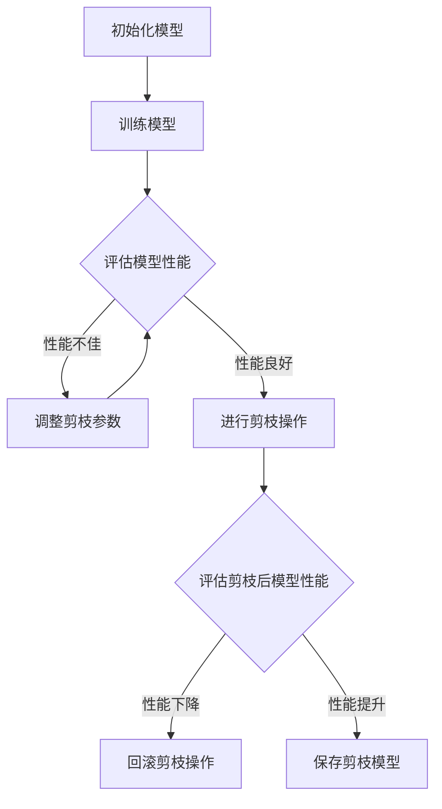

                 

### 文章标题

# 多目标剪枝：平衡精度、速度与能耗的技术

### 关键词

- 多目标剪枝
- 精度优化
- 速度提升
- 能耗管理
- 深度学习

### 摘要

本文旨在探讨多目标剪枝技术在深度学习中的重要性，以及如何在实际应用中平衡模型精度、速度和能耗。多目标剪枝是一种通过移除网络中不重要的神经元和连接来减小模型大小的技术，从而提高模型在资源受限环境中的性能。文章首先介绍了多目标剪枝的基本概念和背景，然后详细分析了在深度学习任务中，模型精度、速度和能耗之间的复杂关系。接下来，文章深入探讨了多目标剪枝所面临的挑战及解决方案，介绍了基于模型和基于数据的剪枝方法，并分析了多种剪枝算法的原理与优化策略。此外，文章还讨论了多目标剪枝在实际应用中的实现，如图像处理、自然语言处理、推荐系统和物联网设备等，并展望了该技术的未来发展趋势与挑战。通过本文，读者将了解多目标剪枝的核心概念、原理及应用，为实际项目中的模型优化提供参考和指导。

### 《多目标剪枝：平衡精度、速度与能耗的技术》目录大纲

## 第一部分：多目标剪枝技术概述

### 第1章：多目标剪枝的概念与背景

#### 1.1.1 剪枝技术的定义

- **定义**：剪枝技术是一种在深度学习模型中通过移除网络中不重要的神经元和连接来减小模型大小的技术。
- **原理**：通过剪枝，模型可以变得更加简洁，从而提高计算效率和资源利用率。

#### 1.1.2 剪枝技术在深度学习中的应用

- **应用背景**：随着深度学习模型的规模不断扩大，计算资源和能耗的需求也日益增加。
- **作用**：剪枝技术可以有效减少模型的参数和计算量，从而降低模型的复杂度，提高模型在资源受限环境中的性能。

#### 1.1.3 多目标剪枝的意义与优势

- **意义**：多目标剪枝旨在同时优化模型精度、速度和能耗，满足不同应用场景的需求。
- **优势**：
  - **提高模型精度**：通过精确地剪枝，可以保留对模型性能至关重要的神经元和连接。
  - **提升模型速度**：减小模型大小，减少计算量，提高模型执行速度。
  - **降低能耗**：优化模型结构，减少计算能耗，延长设备续航时间。

### 第2章：深度学习中的精度、速度与能耗

#### 2.1.1 精度与模型性能的关系

- **定义**：模型的精度是指模型预测结果与真实结果之间的接近程度。
- **重要性**：高精度是深度学习应用成功的关键因素，但并非唯一指标。

#### 2.1.2 模型速度的重要性

- **定义**：模型速度是指模型从输入数据到输出结果所需的时间。
- **影响因素**：计算资源的可用性、模型复杂度、硬件性能等。

#### 2.1.3 能耗对深度学习应用的影响

- **定义**：能耗是指模型在运行过程中消耗的能量。
- **影响**：高能耗会导致设备过热、续航时间缩短，从而影响用户体验。

## 第二部分：多目标剪枝算法原理

### 第3章：多目标剪枝的挑战与解决方案

#### 3.1.1 剪枝过程中的挑战

- **模型稳定性**：剪枝过程中可能会影响模型的稳定性，导致性能下降。
- **计算资源**：剪枝算法本身可能需要大量的计算资源，增加模型训练时间。

#### 3.1.2 多目标优化策略

- **目标函数**：如何设计一个兼顾精度、速度和能耗的目标函数。
- **优化方法**：使用优化算法（如遗传算法、粒子群算法等）来优化目标函数。

#### 3.1.3 剪枝算法的选择

- **算法类型**：基于模型剪枝和基于数据剪枝的区别与适用场景。
- **算法评价**：如何评价剪枝算法的性能和效果。

### 第4章：基于模型的剪枝技术

#### 4.1.1 模型感知剪枝方法

- **原理**：根据模型自身特征进行剪枝，保留重要的神经元和连接。
- **方法**：包括权重共享、结构化剪枝等。

#### 4.1.2 量化剪枝技术

- **原理**：通过量化模型权重来减小模型大小，同时保持精度。
- **方法**：包括低比特量化、稀疏量化等。

#### 4.1.3 混合剪枝策略

- **原理**：结合多种剪枝方法，以达到更好的优化效果。
- **方法**：例如，先进行量化剪枝，再进行结构化剪枝。

### 第5章：基于数据的剪枝方法

#### 5.1.1 数据驱动的剪枝算法

- **原理**：通过分析训练数据，识别出对模型性能贡献较小的部分进行剪枝。
- **方法**：包括基于损失函数的剪枝、基于梯度的剪枝等。

#### 5.1.2 基于聚类与降维的剪枝技术

- **原理**：通过聚类和降维技术识别并剪除冗余的特征。
- **方法**：包括主成分分析（PCA）、聚类算法（如K-means）等。

#### 5.1.3 数据集选择与预处理

- **选择**：选择合适的训练数据集，以便更好地进行剪枝。
- **预处理**：对数据集进行标准化、归一化等处理，提高剪枝效果。

### 第6章：多目标剪枝算法优化策略

#### 6.1.1 剪枝算法的评估指标

- **定义**：如何衡量剪枝算法的性能，包括精度、速度、能耗等。
- **方法**：通过实验和对比分析，评估剪枝算法的效果。

#### 6.1.2 剪枝过程中的模型稳定性

- **定义**：剪枝过程中模型稳定性的重要性。
- **方法**：通过交叉验证、测试集评估等方法，确保模型稳定性。

#### 6.1.3 剪枝算法的收敛性分析

- **定义**：剪枝算法在优化过程中的收敛性。
- **方法**：通过分析收敛速度和收敛精度，评估剪枝算法的优化效果。

### 第7章：多目标剪枝的实时性与能耗优化

#### 7.1.1 实时剪枝算法设计

- **定义**：设计能够实时调整模型结构的剪枝算法。
- **方法**：包括动态剪枝、在线剪枝等。

#### 7.1.2 剪枝与能耗优化的平衡

- **定义**：如何在保证模型精度的同时，降低能耗。
- **方法**：通过调整剪枝策略、优化算法等手段，实现剪枝与能耗优化的平衡。

#### 7.1.3 剪枝在移动设备中的应用

- **定义**：如何将剪枝技术应用于移动设备中，提高性能。
- **方法**：包括硬件加速、模型压缩等。

## 第三部分：多目标剪枝技术在应用中的实现

### 第8章：多目标剪枝技术在图像处理中的应用

#### 8.1.1 剪枝算法在卷积神经网络中的应用

- **定义**：卷积神经网络（CNN）在图像处理中的应用。
- **方法**：通过剪枝算法减小CNN模型的规模，提高处理速度。

#### 8.1.2 剪枝技术在目标检测中的应用

- **定义**：目标检测在图像识别中的重要性。
- **方法**：剪枝技术如何优化目标检测模型的性能。

#### 8.1.3 剪枝算法在图像分类中的优化

- **定义**：图像分类在计算机视觉中的应用。
- **方法**：如何利用剪枝技术提高图像分类的精度和速度。

### 第9章：多目标剪枝技术在自然语言处理中的应用

#### 9.1.1 剪枝算法在序列模型中的应用

- **定义**：序列模型在自然语言处理中的应用。
- **方法**：如何通过剪枝技术优化序列模型的性能。

#### 9.1.2 剪枝技术在文本分类中的应用

- **定义**：文本分类在自然语言处理中的应用。
- **方法**：剪枝技术如何优化文本分类模型的精度和速度。

#### 9.1.3 剪枝算法在机器翻译中的应用

- **定义**：机器翻译在自然语言处理中的应用。
- **方法**：剪枝技术如何提高机器翻译模型的效率和准确性。

### 第10章：多目标剪枝技术在推荐系统中的应用

#### 10.1.1 剪枝技术在推荐算法中的优化

- **定义**：推荐算法在推荐系统中的应用。
- **方法**：剪枝技术如何优化推荐算法的效率和准确性。

#### 10.1.2 剪枝算法在协同过滤中的应用

- **定义**：协同过滤在推荐系统中的应用。
- **方法**：如何利用剪枝技术优化协同过滤算法的性能。

#### 10.1.3 剪枝技术在基于内容的推荐系统中应用

- **定义**：基于内容的推荐系统在推荐中的应用。
- **方法**：如何通过剪枝技术提高基于内容推荐系统的精度和效率。

### 第11章：多目标剪枝技术在物联网设备中的应用

#### 11.1.1 剪枝算法在边缘计算中的应用

- **定义**：边缘计算在物联网中的应用。
- **方法**：如何通过剪枝技术优化边缘计算模型的性能。

#### 11.1.2 剪枝技术在智能传感设备中的应用

- **定义**：智能传感设备在物联网中的应用。
- **方法**：如何利用剪枝技术提高智能传感设备的响应速度和能效。

#### 11.1.3 剪枝算法在物联网设备能耗管理中的应用

- **定义**：物联网设备的能耗管理。
- **方法**：如何通过剪枝技术降低物联网设备的能耗，延长设备寿命。

### 第12章：多目标剪枝技术的前沿研究与发展趋势

#### 12.1.1 多目标剪枝技术的未来发展趋势

- **趋势**：未来多目标剪枝技术的发展方向和潜在应用领域。
- **方法**：包括新型算法的开发、剪枝策略的优化等。

#### 12.1.2 多目标剪枝与新型计算架构的结合

- **结合**：如何将多目标剪枝技术与其他新型计算架构（如量子计算、神经形态计算等）结合，实现更高效的模型优化。
- **应用**：在新型计算架构中的应用前景和挑战。

#### 12.1.3 多目标剪枝技术的未来挑战与机遇

- **挑战**：多目标剪枝技术在未来的发展过程中可能面临的挑战。
- **机遇**：随着计算技术的发展，多目标剪枝技术将带来哪些新的机遇和可能。

### 附录

#### 附录 A：多目标剪枝算法实践指南

- **内容**：介绍多目标剪枝算法的实践步骤、工具和框架，以及数据集的获取与预处理方法。
- **目的**：为读者提供实际操作指南，帮助他们在项目中应用多目标剪枝技术。

#### 附录 B：参考文献

- **内容**：列出本文中引用的书籍、论文、开源代码和在线资源，为读者提供进一步学习和研究的资料。
- **目的**：为读者提供丰富的参考文献，以支持他们的研究和实践。

#### 附录 C：Mermaid流程图与伪代码示例

- **内容**：展示深度学习模型剪枝流程图、剪枝算法伪代码示例以及数学模型与公式示例。
- **目的**：帮助读者更好地理解和掌握多目标剪枝技术的核心概念和原理。

## 文章标题

### 多目标剪枝：平衡精度、速度与能耗的技术

#### 关键词

- 多目标剪枝
- 精度优化
- 速度提升
- 能耗管理
- 深度学习

#### 摘要

本文探讨了多目标剪枝技术在深度学习中的重要性，旨在平衡模型精度、速度与能耗。通过分析多目标剪枝的概念、挑战及解决方案，本文介绍了基于模型和数据的剪枝方法，并讨论了算法优化策略。同时，本文还展示了多目标剪枝技术在图像处理、自然语言处理、推荐系统和物联网设备中的应用案例，并展望了未来发展趋势。通过本文，读者将了解多目标剪枝的核心原理和实际应用，为模型优化提供指导。

## 第一部分：多目标剪枝技术概述

### 第1章：多目标剪枝的概念与背景

#### 1.1.1 剪枝技术的定义

剪枝技术（Pruning Technique）是深度学习领域中一种常用的模型压缩方法，其主要思想是通过移除网络中不重要的神经元和连接，从而减小模型的规模。剪枝技术的核心目标是在保持模型精度不变或基本不变的情况下，显著减少模型的参数数量和计算量，进而提高模型在资源受限环境中的运行效率和性能。

剪枝技术的起源可以追溯到20世纪80年代，当时在神经网络研究中，研究人员发现通过剪枝可以减少网络的复杂性，提高网络的鲁棒性和泛化能力。随着深度学习技术的发展，特别是在深度神经网络（Deep Neural Networks，DNN）广泛应用于图像识别、语音识别和自然语言处理等领域，剪枝技术逐渐受到重视。

#### 1.1.2 剪枝技术在深度学习中的应用

深度学习（Deep Learning）是一种基于多层神经网络的学习方法，它通过多层的非线性变换来提取和表示数据特征，从而实现高层次的抽象和认知。深度学习模型通常具有数百万甚至数十亿个参数，这使得模型的训练和部署变得非常复杂和资源密集。因此，剪枝技术在深度学习中的应用具有重要意义。

1. **模型压缩**：剪枝技术可以显著减少深度学习模型的参数数量和计算量，从而实现模型压缩。这对于在资源受限的设备上部署深度学习模型至关重要。通过剪枝，模型可以变得更加简洁，占用更少的存储空间，同时保持较高的精度。

2. **加速训练和推理**：较小的模型意味着更少的计算任务，这可以显著缩短模型训练和推理的时间。这对于实时应用（如自动驾驶、实时语音识别等）尤为重要。

3. **能耗降低**：随着模型参数和计算量的减少，模型的能耗也相应降低。这对于移动设备和物联网设备来说至关重要，因为它们通常具有有限的电池寿命。

#### 1.1.3 多目标剪枝的意义与优势

多目标剪枝（Multi-Objective Pruning）是一种综合考虑模型精度、速度和能耗等目标的剪枝方法。相比于传统的单目标剪枝方法，多目标剪枝旨在同时优化多个目标，以实现更均衡的性能。

1. **提高模型精度**：多目标剪枝通过精确地剪枝不重要的神经元和连接，可以保留对模型性能至关重要的部分，从而提高模型的精度。

2. **提升模型速度**：通过减少模型参数和计算量，多目标剪枝可以显著提高模型的执行速度，这对于实时应用非常重要。

3. **降低能耗**：多目标剪枝通过优化模型结构，降低模型的计算能耗，延长设备的续航时间，这对于移动设备和物联网设备具有重要意义。

4. **适应多种应用场景**：多目标剪枝可以同时考虑多个目标，使其在不同应用场景下都能表现出较好的性能。例如，在资源受限的环境中，可以优先考虑降低能耗；而在实时应用中，可以优先考虑提升速度。

总之，多目标剪枝技术不仅能够提高模型的性能，还能够适应不同的应用需求，具有广泛的应用前景。在深度学习模型优化和资源利用方面，多目标剪枝技术具有重要的理论和实践价值。

### 第2章：深度学习中的精度、速度与能耗

#### 2.1.1 精度与模型性能的关系

在深度学习中，精度（Accuracy）是衡量模型性能的最基本指标。精度定义为模型预测结果与真实标签之间匹配的正确率。高精度意味着模型能够准确地识别和分类输入数据，这对于许多实际应用场景，如医疗诊断、金融风险评估等，至关重要。

1. **重要性**：高精度是深度学习应用成功的关键因素。例如，在医疗诊断中，一个高精度的模型能够更准确地识别疾病，提高诊断的准确性；在自动驾驶中，高精度的模型可以更准确地识别道路标志和行人，从而提高行驶安全性。

2. **影响因素**：模型精度受到多种因素的影响，包括数据质量、模型结构、超参数设置等。为了提高模型精度，研究人员通常会采用数据增强、模型正则化、超参数调优等方法。

3. **权衡**：在实际应用中，通常需要在模型精度和速度之间进行权衡。高精度的模型可能需要更长的训练时间和更高的计算资源，而低精度的模型则可能更快但不够准确。因此，在实际应用中，需要根据具体需求和资源约束来选择合适的模型精度。

#### 2.1.2 模型速度的重要性

模型速度（Speed）是指模型从接收输入到输出结果所需的时间。在许多实时应用中，如自动驾驶、实时语音识别和视频流处理等，模型速度是至关重要的指标。以下因素会影响模型速度：

1. **计算资源**：模型速度受计算资源的限制。例如，在移动设备上运行深度学习模型时，受限于处理器的性能和内存容量，模型速度可能较慢。

2. **模型复杂度**：模型复杂度越高，计算量越大，模型速度越慢。因此，减小模型大小和简化模型结构可以显著提高模型速度。

3. **优化算法**：选择合适的优化算法和训练策略可以加速模型训练和推理过程。例如，使用高效的优化算法（如Adam、Adagrad）和批量大小调整可以显著提高模型速度。

4. **硬件加速**：使用专用硬件（如GPU、TPU）进行模型训练和推理可以显著提高模型速度。此外，硬件加速技术（如TensorRT、TensorFlow Lite）也可以优化模型执行速度。

#### 2.1.3 能耗对深度学习应用的影响

能耗（Energy Consumption）是深度学习应用中不可忽视的重要指标，尤其是在移动设备和物联网设备中。以下因素会影响深度学习模型的能耗：

1. **模型大小**：模型大小直接影响计算量，从而影响能耗。较大的模型通常需要更多的计算资源，导致更高的能耗。

2. **计算频率**：计算频率越高，能耗越大。例如，在高频交易中，模型需要快速做出决策，从而消耗更多的能量。

3. **硬件功耗**：不同硬件（如CPU、GPU、TPU）的功耗不同。通常，GPU的功耗较高，但计算速度也更快。因此，选择合适的硬件平台对于降低能耗至关重要。

4. **能效优化**：通过优化算法和硬件设计，可以降低模型的能耗。例如，使用低功耗处理器、优化模型结构（如剪枝、量化）和自适应功耗管理策略都可以显著降低模型能耗。

5. **应用场景**：在不同的应用场景中，能耗管理策略有所不同。例如，在移动设备中，优先考虑降低能耗，延长设备续航时间；而在数据中心，则可能更关注计算速度和性能。

总之，深度学习中的精度、速度和能耗是相互关联的三个关键指标。在实际应用中，需要根据具体需求和资源约束来平衡这三个目标，以实现最佳性能。多目标剪枝技术作为一种有效的模型优化方法，能够在保持模型精度的同时，提升速度和降低能耗，具有重要的应用价值。

### 第3章：多目标剪枝的挑战与解决方案

#### 3.1.1 剪枝过程中的挑战

多目标剪枝技术在深度学习中的应用虽然具有显著的优势，但在实际操作过程中仍面临着诸多挑战：

1. **模型稳定性**：剪枝过程中，可能会对模型的稳定性产生负面影响。剪枝可能导致一些关键路径或重要特征被移除，从而影响模型的泛化能力和鲁棒性。

   - **挑战**：确保在剪枝过程中模型稳定性不受影响，同时保持较高的精度。

   - **解决方案**：通过使用渐进式剪枝（Gradual Pruning）和动态剪枝（Dynamic Pruning）等方法，逐步移除不重要的连接和神经元，以减少对模型稳定性的影响。

2. **计算资源**：剪枝算法本身可能需要大量的计算资源，特别是在大型深度学习模型中。剪枝过程可能需要多次迭代和评估，从而增加模型训练时间。

   - **挑战**：在有限计算资源下，高效地执行剪枝过程，同时确保模型性能。

   - **解决方案**：利用分布式计算和并行化技术，加速剪枝算法的执行。此外，选择计算资源消耗较低的剪枝方法，如量化剪枝和结构化剪枝，可以减少计算资源的需求。

3. **剪枝策略的平衡**：多目标剪枝需要同时优化精度、速度和能耗，但在实际操作中，这些目标之间往往存在冲突。

   - **挑战**：如何在确保模型精度的同时，最大化速度和降低能耗。

   - **解决方案**：设计多目标优化策略，通过使用遗传算法、粒子群优化算法等智能优化算法，同时考虑多个目标函数，实现精度、速度和能耗的平衡。

4. **数据集选择与预处理**：剪枝效果受到数据集质量和预处理方法的影响。选择合适的训练数据集和预处理策略，可以显著提高剪枝效果。

   - **挑战**：如何选择适合的剪枝数据集，并优化预处理方法。

   - **解决方案**：采用多样化的数据集，包括正常数据和异常数据，以及使用数据增强技术，提高数据集的质量和代表性。同时，优化预处理步骤，如数据标准化和归一化，以提高剪枝算法的鲁棒性和效果。

#### 3.1.2 多目标优化策略

多目标优化策略是解决剪枝过程中多个目标冲突的关键。以下是一些常用的多目标优化策略：

1. **权重共享**：通过共享网络中的权重，减少模型参数的数量，从而减小模型大小和计算量。

   - **方法**：在剪枝过程中，对共享的权重进行精细化调整，以保持模型的精度。

2. **结构化剪枝**：通过移除网络中的全层或部分层，实现模型压缩。结构化剪枝可以显著减少模型参数和计算量，同时保持较高的精度。

   - **方法**：根据网络结构的相似性，将网络划分为若干模块，对冗余的模块进行剪枝。

3. **量化剪枝**：通过量化网络权重，减少模型参数的数量，同时保持模型精度。量化剪枝可以显著降低模型大小和计算量。

   - **方法**：采用低比特量化或稀疏量化技术，对模型权重进行量化。

4. **动态剪枝**：在模型训练过程中，根据模型性能动态调整剪枝策略。动态剪枝可以根据模型当前的状态，自动调整剪枝力度，从而实现优化。

   - **方法**：使用自适应剪枝算法，实时调整剪枝参数，以最大化模型精度和速度。

5. **混合剪枝策略**：结合多种剪枝方法，实现更优的模型压缩效果。

   - **方法**：根据不同阶段的模型优化需求，灵活组合不同剪枝方法，实现最佳效果。

#### 3.1.3 剪枝算法的选择

选择合适的剪枝算法对于实现高效的多目标优化至关重要。以下是一些常用的剪枝算法：

1. **基于权重的剪枝算法**：这类算法通过分析模型权重的分布和重要性来选择剪枝目标。

   - **方法**：包括L1正则化、L2正则化、权重敏感度分析等。

   - **优势**：简单有效，适用于大多数深度学习模型。

2. **基于梯度的剪枝算法**：这类算法通过分析模型梯度的分布和重要性来选择剪枝目标。

   - **方法**：包括基于梯度的剪枝（Gradient-based Pruning）、基于梯度的稀疏化（Gradient-based Sparseization）等。

   - **优势**：能够更精细地控制剪枝力度，适用于复杂的深度学习模型。

3. **基于模型感知的剪枝算法**：这类算法通过分析模型自身特征来选择剪枝目标。

   - **方法**：包括结构化剪枝、基于神经元的剪枝、基于模型压缩性的剪枝等。

   - **优势**：能够根据模型的具体结构优化剪枝效果。

4. **基于数据的剪枝算法**：这类算法通过分析训练数据来选择剪枝目标。

   - **方法**：包括基于数据的稀疏化（Data-driven Sparseization）、基于聚类和降维的剪枝等。

   - **优势**：能够根据数据特征优化剪枝效果，适用于多样化的应用场景。

5. **基于学习的剪枝算法**：这类算法通过学习如何优化剪枝过程。

   - **方法**：包括基于神经网络的剪枝（Neural Network-based Pruning）、基于强化学习的剪枝等。

   - **优势**：能够自适应地调整剪枝策略，实现更优的优化效果。

总之，多目标剪枝技术在深度学习中的应用面临着诸多挑战，但通过设计有效的优化策略和选择合适的剪枝算法，可以显著提高模型的性能。在实际应用中，需要根据具体需求和资源约束，灵活选择和组合不同的剪枝方法，以实现最佳效果。

### 第4章：基于模型的剪枝技术

#### 4.1.1 模型感知剪枝方法

模型感知剪枝方法（Model-aware Pruning Techniques）是一种基于模型内部结构和特征的重要性的剪枝技术。这种方法的核心思想是通过分析模型的内部特征，识别出对模型性能贡献较小的神经元和连接，然后将其剪除，从而减小模型的大小和计算量，同时尽量保持模型的精度。

1. **原理**：
   - **权重敏感度分析**：通过分析模型权重，识别出对模型输出影响较小的权重，这些权重对应的神经元和连接可能被剪除。
   - **梯度分析**：通过分析模型梯度，识别出对模型输出影响较小的神经元和连接。
   - **神经元相关性分析**：通过分析神经元之间的相关性，识别出对模型性能贡献较小的神经元。

2. **方法**：
   - **基于权重的剪枝**：通过分析权重的大小，移除权重较小的神经元和连接。这种方法通常基于L1正则化或L2正则化。
   - **基于梯度的剪枝**：通过分析梯度的分布，移除梯度较小的神经元和连接。这种方法可以结合梯度下降算法进行。
   - **基于神经元的剪枝**：通过分析神经元之间的相关性，移除对模型输出贡献较小的神经元。

3. **优势**：
   - **灵活性**：模型感知剪枝方法可以根据模型的具体结构和特征灵活选择剪枝目标。
   - **精度**：由于是基于模型内部特征的感知，这种方法可以在一定程度上保留对模型性能重要的部分，从而保持较高的精度。

4. **挑战**：
   - **模型稳定性**：剪枝过程中可能会破坏模型的稳定性，导致性能下降。
   - **计算资源**：模型感知剪枝方法通常需要大量的计算资源，特别是在大型模型中。

#### 4.1.2 量化剪枝技术

量化剪枝技术（Quantization-based Pruning Techniques）是一种通过降低模型参数的精度来减少模型大小的剪枝方法。这种方法的核心思想是将模型的浮点权重量化为低比特整数，从而降低模型的存储和计算需求。

1. **原理**：
   - **量化**：将模型中的浮点权重转换为低比特整数。量化可以是静态的（在整个训练过程中保持不变）或动态的（根据训练过程中的数据动态调整）。
   - **稀疏化**：通过量化，权重中的一些值会变为零，从而实现权重的稀疏化。

2. **方法**：
   - **低比特量化**：将权重从32位浮点数量化为8位整数，从而减少存储和计算需求。
   - **稀疏量化**：通过稀疏化权重，移除权重为零的神经元和连接，从而实现模型的压缩。

3. **优势**：
   - **高效性**：量化剪枝技术可以显著减少模型的存储和计算需求，提高模型在资源受限环境中的性能。
   - **兼容性**：量化技术可以与各种深度学习框架和硬件平台兼容，实现高效部署。

4. **挑战**：
   - **精度损失**：量化过程中可能会引入精度损失，从而影响模型的性能。
   - **剪枝效果**：量化剪枝的效果受量化参数（如量化步长、稀疏度等）的影响，需要仔细调整。

#### 4.1.3 混合剪枝策略

混合剪枝策略（Hybrid Pruning Strategies）是一种结合多种剪枝方法，以实现更优模型压缩效果的技术。这种方法通过综合利用模型感知剪枝和量化剪枝等方法，从不同角度优化模型结构，从而提高模型在精度、速度和能耗方面的性能。

1. **原理**：
   - **多阶段剪枝**：先进行基于模型的感知剪枝，移除对模型性能影响较小的部分；然后进行量化剪枝，进一步减少模型大小。
   - **多方法结合**：结合不同的剪枝方法，如结构化剪枝、基于梯度的剪枝和量化剪枝等，从不同层次和角度优化模型。

2. **方法**：
   - **两阶段剪枝**：第一阶段进行模型感知剪枝，第二阶段进行量化剪枝。
   - **分层剪枝**：根据网络层次结构，逐层进行剪枝，先进行高层剪枝，再进行低层剪枝。
   - **自适应剪枝**：根据模型性能和训练进度，动态调整剪枝策略，实现更优的模型压缩效果。

3. **优势**：
   - **综合优化**：通过综合利用多种剪枝方法，实现模型在精度、速度和能耗方面的综合优化。
   - **灵活性**：可以根据具体应用场景和需求，灵活调整剪枝策略和参数。

4. **挑战**：
   - **剪枝策略选择**：选择合适的剪枝策略和参数组合，需要结合具体应用场景进行实验和优化。
   - **模型稳定性**：混合剪枝过程中，可能影响模型的稳定性，需要确保模型性能不受影响。

总之，基于模型的剪枝技术通过分析模型内部结构和特征，实现模型压缩和性能优化。模型感知剪枝、量化剪枝和混合剪枝策略在不同层次和角度上优化模型，为深度学习应用提供了一种有效的方法。然而，在实际应用中，需要根据具体需求和资源约束，灵活选择和组合不同的剪枝方法，以实现最佳效果。

### 第5章：基于数据的剪枝方法

#### 5.1.1 数据驱动的剪枝算法

数据驱动的剪枝算法（Data-driven Pruning Algorithms）是基于训练数据集的特征和分布来选择剪枝目标的一类方法。这种方法的核心理念是通过分析训练数据，识别出对模型性能贡献较小的部分，然后将其剪除，以减小模型大小并提高计算效率。

1. **原理**：
   - **数据特征分析**：通过分析训练数据集中的特征分布和相关性，识别出对模型性能影响较小的特征。
   - **数据驱动剪枝**：根据数据特征的重要性，选择剪枝目标，通常使用统计方法（如方差分析、相关系数等）来确定剪枝候选。

2. **方法**：
   - **基于损失函数的剪枝**：通过分析损失函数的梯度或变化率，识别出对损失贡献较小的神经元和连接。
   - **基于梯度的剪枝**：通过分析梯度的分布，识别出对模型输出贡献较小的部分。
   - **基于数据重要性的剪枝**：通过计算数据特征的重要性评分，选择重要性较低的特征进行剪枝。

3. **优势**：
   - **数据导向**：基于实际训练数据，可以更准确地识别和剪除对模型性能贡献较小的部分。
   - **灵活性**：可以适应不同类型的数据集和应用场景，灵活调整剪枝策略。

4. **挑战**：
   - **数据集质量**：训练数据集的质量直接影响剪枝效果，数据噪声和异常值可能会干扰剪枝过程。
   - **计算成本**：数据驱动的剪枝算法可能需要较大的计算资源，特别是在大型数据集和复杂模型中。

#### 5.1.2 基于聚类与降维的剪枝技术

基于聚类与降维的剪枝技术（Clustering and Dimensionality Reduction-based Pruning Techniques）是一种利用聚类和降维方法来减小模型大小的剪枝技术。这种方法的核心思想是通过聚类分析识别出数据中的冗余特征，然后通过降维技术将这些冗余特征降维或去除，从而实现模型压缩。

1. **原理**：
   - **聚类分析**：通过聚类算法（如K-means、层次聚类等）将数据集划分为若干个簇，每个簇代表一组相关的特征。
   - **降维**：通过降维技术（如主成分分析PCA、线性判别分析LDA等）将高维数据投影到低维空间，去除冗余特征。

2. **方法**：
   - **基于聚类的剪枝**：通过聚类分析识别出冗余特征，将其从模型中移除。
   - **基于降维的剪枝**：通过降维技术减少模型的特征维度，从而减小模型大小。
   - **组合剪枝**：先进行聚类分析，再进行降维，通过两步剪枝实现更有效的模型压缩。

3. **优势**：
   - **特征选择**：通过聚类和降维技术，可以有效地识别和选择重要的特征，从而提高模型的泛化能力。
   - **降维效率**：降维技术可以在保留主要特征信息的同时，显著减少模型维度，提高计算效率。

4. **挑战**：
   - **聚类算法选择**：选择合适的聚类算法对模型性能和剪枝效果有很大影响，不同的聚类算法适用于不同类型的数据。
   - **降维效果**：降维过程中可能会丢失一些重要的特征信息，影响模型的精度。

#### 5.1.3 数据集选择与预处理

数据集选择与预处理是数据驱动剪枝方法中至关重要的一环，直接影响剪枝效果和模型性能。以下是一些关键步骤和注意事项：

1. **数据集选择**：
   - **多样性**：选择具有代表性的数据集，包括正常数据和异常数据，以及不同类型和来源的数据。
   - **大小与质量**：选择足够大的数据集，以确保模型具有足够的泛化能力。同时，确保数据质量，避免噪声和异常值影响剪枝效果。

2. **预处理方法**：
   - **数据清洗**：移除数据集中的噪声和异常值，确保数据质量。
   - **数据标准化**：通过标准化（如Z-Score标准化、Min-Max标准化等）或归一化（如归一化到[0, 1]区间）来调整数据分布，使模型训练更加稳定。
   - **数据增强**：通过数据增强（如旋转、翻转、缩放等）增加数据的多样性，提高模型的鲁棒性。

3. **预处理效果**：
   - **剪枝效果**：预处理方法可以显著影响剪枝效果。合适的预处理方法可以减少冗余特征，提高模型压缩效率。
   - **模型性能**：预处理方法还可以改善模型训练过程，提高模型精度和泛化能力。

总之，基于数据的剪枝方法通过分析训练数据集的特征和分布，识别并剪除对模型性能贡献较小的部分，实现模型压缩和优化。通过合理的聚类和降维技术，以及数据集的选择和预处理，可以进一步提高剪枝效果和模型性能。在实际应用中，需要根据具体需求和数据特点，灵活选择和调整预处理方法，以实现最佳效果。

### 第6章：多目标剪枝算法优化策略

#### 6.1.1 剪枝算法的评估指标

评估剪枝算法的性能和效果是优化策略中的重要一环。以下是一些常用的评估指标：

1. **模型精度**：精度是衡量模型性能的最基本指标，通常用于评估剪枝后模型在测试集上的表现。高精度意味着剪枝过程没有显著降低模型的性能。

   - **评估方法**：计算模型预测结果与真实标签之间的匹配率。

2. **模型大小**：模型大小直接影响模型的部署效率和存储需求。较小的模型意味着更高效的计算和更低的存储成本。

   - **评估方法**：计算模型参数数量、模型权重和存储空间的大小。

3. **模型速度**：模型速度是指模型从输入数据到输出结果所需的时间，对于实时应用至关重要。

   - **评估方法**：通过测量模型在相同硬件环境下的推理时间，或使用基准测试工具（如TensorRT、TensorFlow Lite）进行评估。

4. **能耗**：能耗是指模型在运行过程中消耗的能量，对于移动设备和物联网设备具有重要意义。

   - **评估方法**：使用能效分析工具（如EnergyPlus、Energy Profiler）测量模型的能耗。

5. **收敛性**：收敛性是指剪枝算法在迭代过程中逐渐接近最优解的能力。

   - **评估方法**：通过分析算法的收敛速度和收敛精度，评估其优化效果。

#### 6.1.2 剪枝过程中的模型稳定性

在剪枝过程中，模型稳定性（Model Stability）是一个重要的考量因素。不稳定的剪枝过程可能会导致模型性能的显著下降。以下是一些确保模型稳定性的策略：

1. **渐进式剪枝**：通过逐步移除模型中的神经元和连接，逐步减小模型规模，而不是一次性移除大量部分。这有助于减少对模型稳定性的冲击。

2. **交叉验证**：在剪枝过程中使用交叉验证（Cross-Validation）来评估模型在不同数据子集上的性能，以确保剪枝后的模型具有较好的泛化能力。

3. **验证集评估**：定期在验证集上评估模型的性能，及时发现并纠正可能的性能下降。

4. **模型重构**：在剪枝过程中，如果发现模型性能显著下降，可以通过重构模型（如重新训练部分层）来恢复稳定性。

#### 6.1.3 剪枝算法的收敛性分析

剪枝算法的收敛性（Convergence of Pruning Algorithms）是指算法在迭代过程中逐渐接近最优解的能力。收敛性分析是评估剪枝算法性能的重要方面。以下是一些分析剪枝算法收敛性的方法：

1. **收敛速度**：评估算法在多轮迭代中接近最优解的速度。较快的收敛速度意味着算法能够在较短的时间内找到较优的解。

2. **收敛精度**：评估算法最终找到的解的质量。高收敛精度意味着算法能够找到接近最优的解。

3. **收敛曲线**：通过绘制算法在迭代过程中的损失函数值或精度值的变化曲线，直观地分析算法的收敛行为。

4. **稳定性分析**：分析算法在多次运行中是否稳定地收敛到同一解，以评估算法的鲁棒性。

5. **算法调优**：根据收敛性分析的结果，调整算法参数（如学习率、剪枝强度等），以优化算法性能。

通过这些评估和分析方法，可以更好地理解和优化多目标剪枝算法，确保其在保持模型精度的基础上，提高速度和降低能耗。

### 第7章：多目标剪枝的实时性与能耗优化

#### 7.1.1 实时剪枝算法设计

实时剪枝算法设计（Real-time Pruning Algorithm Design）是针对实时应用场景中模型压缩和能耗优化的需求而提出的。实时剪枝算法旨在动态调整模型结构，以在保证精度的情况下，最大化模型的执行速度和降低能耗。

1. **原理**：
   - **动态调整**：在模型运行过程中，根据输入数据的特征和当前的任务需求，动态调整模型结构，移除不重要的部分。
   - **在线剪枝**：实时剪枝算法可以在模型运行时进行，无需重新训练整个模型。

2. **方法**：
   - **基于反馈的剪枝**：通过实时收集模型输出的反馈，动态调整剪枝策略，确保模型性能稳定。
   - **动态权重调整**：根据输入数据的特征，实时调整模型权重的剪枝程度，实现动态模型压缩。

3. **优势**：
   - **灵活性**：实时剪枝算法可以根据不同场景和需求动态调整模型结构，适应实时应用。
   - **高效性**：动态调整模型结构，减少模型计算量，提高模型执行速度。

4. **挑战**：
   - **实时性**：确保剪枝过程不会影响模型的实时性能，需要在短时间内完成。
   - **稳定性**：动态调整过程中，需要确保模型稳定性，避免性能下降。

#### 7.1.2 剪枝与能耗优化的平衡

剪枝与能耗优化的平衡（Balancing Pruning and Energy Efficiency）是深度学习模型在移动设备和物联网设备中应用的关键问题。以下是一些实现平衡的策略：

1. **能效优化**：
   - **硬件加速**：利用GPU、TPU等硬件加速技术，提高模型执行速度，降低能耗。
   - **低功耗设计**：设计低功耗模型和剪枝算法，减少模型运行过程中的能耗。

2. **剪枝策略**：
   - **渐进式剪枝**：逐步减少模型大小，避免一次性移除大量神经元和连接，影响模型稳定性。
   - **量化剪枝**：通过量化模型权重，减少模型参数的数量，同时保持模型精度。

3. **系统优化**：
   - **能耗管理**：通过自适应功耗管理策略，动态调整设备的功耗，实现能耗优化。
   - **任务调度**：合理分配计算任务，确保高优先级任务在低功耗模式下优先执行。

4. **平衡策略**：
   - **多目标优化**：设计多目标优化算法，同时考虑模型精度、速度和能耗，实现综合优化。
   - **反馈调整**：根据实时反馈，动态调整剪枝和能耗优化策略，实现最佳平衡。

#### 7.1.3 剪枝在移动设备中的应用

剪枝技术在移动设备中的应用（Pruning Applications in Mobile Devices）具有重要意义，尤其是在电池寿命有限和计算资源受限的移动设备上。以下是一些具体应用和实现方法：

1. **应用场景**：
   - **图像识别**：在移动设备上运行图像识别模型，如人脸检测、物体分类等。
   - **语音识别**：在移动设备上实现实时语音识别功能，如语音助手、翻译应用等。
   - **自然语言处理**：在移动设备上处理自然语言任务，如文本分类、机器翻译等。

2. **实现方法**：
   - **模型压缩**：通过剪枝技术减小模型大小，降低存储和计算需求。
   - **量化剪枝**：采用低比特量化技术，减少模型参数的数量，同时保持模型精度。
   - **硬件加速**：利用移动设备上的GPU、NPU等硬件加速模块，提高模型执行速度。

3. **挑战**：
   - **精度与速度的平衡**：在有限计算资源下，确保模型既高效又准确。
   - **能耗优化**：在保证模型性能的前提下，降低模型能耗，延长设备电池寿命。

4. **优势**：
   - **提高用户体验**：通过实时剪枝和能耗优化，提高移动设备的性能和响应速度。
   - **降低成本**：减少模型大小和计算需求，降低设备成本。

总之，实时剪枝算法设计和剪枝与能耗优化的平衡是实现移动设备中高效深度学习应用的关键。通过合理的设计和优化，可以在保证模型精度的同时，显著提高模型在移动设备上的性能和续航时间。

### 第8章：多目标剪枝技术在图像处理中的应用

#### 8.1.1 剪枝算法在卷积神经网络中的应用

卷积神经网络（Convolutional Neural Networks，CNN）在图像处理领域具有广泛的应用，例如图像分类、目标检测和图像分割等。然而，CNN模型通常具有大量参数，导致计算量和存储需求较大。多目标剪枝技术可以在保持模型精度的同时，减小模型大小和计算量，从而提高模型在资源受限环境中的性能。

1. **剪枝算法的应用**：
   - **基于权重的剪枝**：通过分析模型权重，移除权重较小的神经元和连接。这种方法简单有效，适用于大多数CNN模型。
   - **基于梯度的剪枝**：通过分析模型梯度，移除梯度较小的神经元和连接。这种方法可以更精细地控制剪枝力度。
   - **基于神经元的剪枝**：通过分析神经元之间的相关性，移除对模型性能贡献较小的神经元。

2. **实现方法**：
   - **渐进式剪枝**：逐步移除模型中的神经元和连接，而不是一次性移除大量部分。这种方法可以减少对模型稳定性的冲击。
   - **量化剪枝**：通过量化模型权重，减少模型参数的数量，同时保持模型精度。量化剪枝可以显著减少模型大小和计算量。

3. **优势**：
   - **模型压缩**：通过剪枝，可以显著减小模型大小，降低存储和计算需求。
   - **计算效率**：较小的模型意味着更少的计算任务，从而提高模型执行速度。

#### 8.1.2 剪枝技术在目标检测中的应用

目标检测（Object Detection）是图像处理中的一个重要任务，旨在识别图像中的多个目标并定位其位置。在目标检测任务中，多目标剪枝技术可以帮助优化模型的性能和效率。

1. **剪枝算法的应用**：
   - **基于权重的剪枝**：通过分析模型权重，移除对目标检测贡献较小的部分，从而减少模型大小和计算量。
   - **基于梯度的剪枝**：通过分析模型梯度，移除对目标检测贡献较小的神经元和连接，从而优化模型结构。

2. **实现方法**：
   - **结构化剪枝**：通过剪枝，移除整个网络层或部分层，从而实现模型压缩。结构化剪枝可以显著减少模型大小和计算量。
   - **量化剪枝**：通过量化模型权重，减少模型参数的数量，同时保持模型精度。

3. **优势**：
   - **模型压缩**：通过剪枝，可以显著减小模型大小，提高计算效率。
   - **速度提升**：较小的模型意味着更少的计算任务，从而提高模型执行速度。

#### 8.1.3 剪枝算法在图像分类中的优化

图像分类（Image Classification）是图像处理中最基本的任务之一，旨在将图像分类到预定义的类别中。在图像分类任务中，多目标剪枝技术可以帮助优化模型的精度、速度和能耗。

1. **剪枝算法的应用**：
   - **基于权重的剪枝**：通过分析模型权重，移除对图像分类贡献较小的神经元和连接，从而提高模型精度。
   - **基于梯度的剪枝**：通过分析模型梯度，移除对图像分类贡献较小的部分，从而优化模型结构。

2. **实现方法**：
   - **渐进式剪枝**：逐步移除模型中的神经元和连接，从而减少对模型稳定性的冲击。
   - **量化剪枝**：通过量化模型权重，减少模型参数的数量，同时保持模型精度。

3. **优势**：
   - **精度提升**：通过精确地剪枝，可以保留对模型性能至关重要的神经元和连接。
   - **速度提升**：较小的模型意味着更少的计算任务，从而提高模型执行速度。
   - **能耗降低**：通过优化模型结构，减少计算能耗，延长设备续航时间。

总之，多目标剪枝技术在图像处理中的应用，通过优化模型精度、速度和能耗，为图像分类、目标检测等任务提供了有效的解决方案。在实际应用中，可以根据具体需求和资源约束，灵活选择和组合不同的剪枝方法，以实现最佳效果。

### 第9章：多目标剪枝技术在自然语言处理中的应用

#### 9.1.1 剪枝算法在序列模型中的应用

序列模型（Sequential Models）在自然语言处理（Natural Language Processing，NLP）中扮演着重要角色，包括循环神经网络（Recurrent Neural Networks，RNN）、长短期记忆网络（Long Short-Term Memory，LSTM）和变换器（Transformer）等。这些模型通过处理输入序列来预测输出序列，广泛应用于语言建模、机器翻译、文本分类等任务。

1. **剪枝算法的应用**：
   - **基于权重的剪枝**：通过分析模型权重，移除对序列建模贡献较小的神经元和连接。这种方法简单且适用于大多数序列模型。
   - **基于梯度的剪枝**：通过分析模型梯度，移除对序列建模贡献较小的部分，从而优化模型结构。
   - **基于神经元的剪枝**：通过分析神经元之间的相关性，移除对序列建模贡献较小的神经元。

2. **实现方法**：
   - **结构化剪枝**：通过剪枝，移除整个网络层或部分层，从而实现模型压缩。结构化剪枝可以显著减少模型大小和计算量。
   - **量化剪枝**：通过量化模型权重，减少模型参数的数量，同时保持模型精度。

3. **优势**：
   - **模型压缩**：通过剪枝，可以显著减小模型大小，降低存储和计算需求。
   - **计算效率**：较小的模型意味着更少的计算任务，从而提高模型执行速度。

#### 9.1.2 剪枝技术在文本分类中的应用

文本分类（Text Classification）是将文本数据分类到预定义类别中的任务，广泛应用于情感分析、主题分类和垃圾邮件检测等。在文本分类任务中，多目标剪枝技术可以帮助优化模型的性能和效率。

1. **剪枝算法的应用**：
   - **基于权重的剪枝**：通过分析模型权重，移除对文本分类贡献较小的神经元和连接，从而减少模型大小和计算量。
   - **基于梯度的剪枝**：通过分析模型梯度，移除对文本分类贡献较小的部分，从而优化模型结构。

2. **实现方法**：
   - **结构化剪枝**：通过剪枝，移除整个网络层或部分层，从而实现模型压缩。结构化剪枝可以显著减少模型大小和计算量。
   - **量化剪枝**：通过量化模型权重，减少模型参数的数量，同时保持模型精度。

3. **优势**：
   - **模型压缩**：通过剪枝，可以显著减小模型大小，提高计算效率。
   - **速度提升**：较小的模型意味着更少的计算任务，从而提高模型执行速度。

#### 9.1.3 剪枝算法在机器翻译中的应用

机器翻译（Machine Translation）是将一种语言的文本自动翻译成另一种语言的任务，广泛应用于跨语言通信和国际化应用。在机器翻译任务中，多目标剪枝技术可以帮助优化模型的性能和效率。

1. **剪枝算法的应用**：
   - **基于权重的剪枝**：通过分析模型权重，移除对机器翻译贡献较小的神经元和连接，从而减少模型大小和计算量。
   - **基于梯度的剪枝**：通过分析模型梯度，移除对机器翻译贡献较小的部分，从而优化模型结构。

2. **实现方法**：
   - **结构化剪枝**：通过剪枝，移除整个网络层或部分层，从而实现模型压缩。结构化剪枝可以显著减少模型大小和计算量。
   - **量化剪枝**：通过量化模型权重，减少模型参数的数量，同时保持模型精度。

3. **优势**：
   - **模型压缩**：通过剪枝，可以显著减小模型大小，降低存储和计算需求。
   - **速度提升**：较小的模型意味着更少的计算任务，从而提高模型执行速度。

总之，多目标剪枝技术在自然语言处理中的应用，通过优化模型精度、速度和能耗，为文本分类、机器翻译等任务提供了有效的解决方案。在实际应用中，可以根据具体需求和资源约束，灵活选择和组合不同的剪枝方法，以实现最佳效果。

### 第10章：多目标剪枝技术在推荐系统中的应用

#### 10.1.1 剪枝技术在推荐算法中的优化

推荐系统（Recommender Systems）是现代信息检索和电子商务中不可或缺的一部分，通过预测用户可能感兴趣的项目来提高用户体验。多目标剪枝技术可以在推荐算法中发挥重要作用，优化算法的效率和质量。

1. **剪枝算法的应用**：
   - **基于权重的剪枝**：通过分析模型权重，移除对推荐结果贡献较小的神经元和连接，从而减少模型大小和计算量。
   - **基于梯度的剪枝**：通过分析模型梯度，移除对推荐结果贡献较小的部分，从而优化模型结构。

2. **实现方法**：
   - **结构化剪枝**：通过剪枝，移除整个网络层或部分层，从而实现模型压缩。结构化剪枝可以显著减少模型大小和计算量。
   - **量化剪枝**：通过量化模型权重，减少模型参数的数量，同时保持模型精度。

3. **优势**：
   - **模型压缩**：通过剪枝，可以显著减小模型大小，降低存储和计算需求。
   - **计算效率**：较小的模型意味着更少的计算任务，从而提高模型执行速度。

#### 10.1.2 剪枝算法在协同过滤中的应用

协同过滤（Collaborative Filtering）是推荐系统中最常用的算法之一，通过分析用户的历史行为和偏好来预测用户的兴趣。多目标剪枝技术可以在协同过滤算法中优化模型的性能和效率。

1. **剪枝算法的应用**：
   - **基于矩阵分解的剪枝**：通过分析矩阵分解模型中的权重，移除对预测结果贡献较小的部分，从而优化模型结构。
   - **基于梯度的剪枝**：通过分析模型梯度，移除对协同过滤贡献较小的神经元和连接。

2. **实现方法**：
   - **结构化剪枝**：通过剪枝，移除整个网络层或部分层，从而实现模型压缩。结构化剪枝可以显著减少模型大小和计算量。
   - **量化剪枝**：通过量化模型权重，减少模型参数的数量，同时保持模型精度。

3. **优势**：
   - **模型压缩**：通过剪枝，可以显著减小模型大小，提高计算效率。
   - **预测精度**：优化模型结构，提高推荐系统的预测准确性。

#### 10.1.3 剪枝技术在基于内容的推荐系统中应用

基于内容的推荐系统（Content-Based Recommender Systems）通过分析项目的内容特征来推荐用户可能感兴趣的项目。多目标剪枝技术可以在基于内容的推荐系统中优化模型的性能和效率。

1. **剪枝算法的应用**：
   - **基于特征选择的剪枝**：通过分析项目特征，移除对推荐结果贡献较小的特征，从而优化模型结构。
   - **基于梯度的剪枝**：通过分析模型梯度，移除对基于内容推荐贡献较小的神经元和连接。

2. **实现方法**：
   - **结构化剪枝**：通过剪枝，移除整个网络层或部分层，从而实现模型压缩。结构化剪枝可以显著减少模型大小和计算量。
   - **量化剪枝**：通过量化模型权重，减少模型参数的数量，同时保持模型精度。

3. **优势**：
   - **模型压缩**：通过剪枝，可以显著减小模型大小，提高计算效率。
   - **推荐质量**：优化模型结构，提高推荐系统的推荐质量。

总之，多目标剪枝技术在推荐系统中的应用，通过优化模型精度、速度和能耗，为推荐算法、协同过滤和基于内容的推荐系统提供了有效的解决方案。在实际应用中，可以根据具体需求和资源约束，灵活选择和组合不同的剪枝方法，以实现最佳效果。

### 第11章：多目标剪枝技术在物联网设备中的应用

#### 11.1.1 剪枝算法在边缘计算中的应用

边缘计算（Edge Computing）是一种分布式计算架构，通过在数据源附近（即边缘）处理数据，以减少延迟、带宽需求和计算负载。在边缘计算环境中，多目标剪枝技术可以帮助优化模型的性能和能效，提高物联网设备（IoT Devices）的处理能力。

1. **剪枝算法的应用**：
   - **基于权重的剪枝**：通过分析模型权重，移除对边缘计算任务贡献较小的神经元和连接，从而减少模型大小和计算量。
   - **基于梯度的剪枝**：通过分析模型梯度，移除对边缘计算贡献较小的部分，从而优化模型结构。

2. **实现方法**：
   - **结构化剪枝**：通过剪枝，移除整个网络层或部分层，从而实现模型压缩。结构化剪枝可以显著减少模型大小和计算量。
   - **量化剪枝**：通过量化模型权重，减少模型参数的数量，同时保持模型精度。

3. **优势**：
   - **能效优化**：通过剪枝，可以显著降低模型的能耗，延长设备电池寿命。
   - **实时处理**：较小的模型意味着更快的处理速度，从而提高边缘计算的实时性。

#### 11.1.2 剪枝技术在智能传感设备中的应用

智能传感设备（Smart Sensors）在物联网环境中扮演着重要角色，通过收集和传输数据来支持各种应用。多目标剪枝技术可以帮助优化智能传感设备的模型性能和能耗，提高其可靠性。

1. **剪枝算法的应用**：
   - **基于权重的剪枝**：通过分析模型权重，移除对传感数据处理贡献较小的神经元和连接，从而减少模型大小和计算量。
   - **基于梯度的剪枝**：通过分析模型梯度，移除对传感数据处理贡献较小的部分，从而优化模型结构。

2. **实现方法**：
   - **结构化剪枝**：通过剪枝，移除整个网络层或部分层，从而实现模型压缩。结构化剪枝可以显著减少模型大小和计算量。
   - **量化剪枝**：通过量化模型权重，减少模型参数的数量，同时保持模型精度。

3. **优势**：
   - **模型压缩**：通过剪枝，可以显著减小模型大小，降低存储和计算需求。
   - **能效提升**：优化模型结构，降低模型的能耗，提高设备续航时间。

#### 11.1.3 剪枝算法在物联网设备能耗管理中的应用

物联网设备的能耗管理（IoT Device Energy Management）是一个关键问题，特别是在电池供电的设备中。多目标剪枝技术可以在能耗管理中发挥作用，通过优化模型性能和能耗，延长设备的电池寿命。

1. **剪枝算法的应用**：
   - **基于权重的剪枝**：通过分析模型权重，移除对设备能耗影响较小的神经元和连接，从而减少模型大小和计算量。
   - **基于梯度的剪枝**：通过分析模型梯度，移除对设备能耗贡献较小的部分，从而优化模型结构。

2. **实现方法**：
   - **结构化剪枝**：通过剪枝，移除整个网络层或部分层，从而实现模型压缩。结构化剪枝可以显著减少模型大小和计算量。
   - **量化剪枝**：通过量化模型权重，减少模型参数的数量，同时保持模型精度。

3. **优势**：
   - **能耗降低**：通过优化模型结构，减少计算能耗，延长设备的电池寿命。
   - **稳定性**：剪枝过程中确保模型稳定性，避免因剪枝导致性能下降。

总之，多目标剪枝技术在物联网设备中的应用，通过优化模型精度、速度和能耗，为边缘计算、智能传感设备和能耗管理提供了有效的解决方案。在实际应用中，可以根据具体需求和资源约束，灵活选择和组合不同的剪枝方法，以实现最佳效果。

### 第12章：多目标剪枝技术的前沿研究与发展趋势

#### 12.1.1 多目标剪枝技术的未来发展趋势

随着深度学习和物联网技术的快速发展，多目标剪枝技术（Multi-Objective Pruning Techniques）在优化模型性能和资源利用方面展现出巨大的潜力。未来，多目标剪枝技术将朝着以下几个方向发展：

1. **算法多样化**：研究人员将继续探索和开发更多新型剪枝算法，以满足不同应用场景的需求。例如，基于图神经网络的剪枝方法、基于量子计算的剪枝算法等。

2. **模型结构优化**：多目标剪枝技术将更多地关注模型结构的优化，通过设计更高效的模型架构来提升剪枝效果。例如，可扩展性好的模型架构（如EfficientNet、MobileNet等）和多任务学习模型。

3. **动态剪枝策略**：动态剪枝策略（如在线剪枝、自适应剪枝等）将在未来的研究中得到更多关注，以实现实时调整模型结构和优化性能。

4. **跨领域应用**：多目标剪枝技术将不仅在深度学习领域得到应用，还将扩展到其他领域，如自动驾驶、智能医疗等，推动这些领域的技术进步。

#### 12.1.2 多目标剪枝与新型计算架构的结合

多目标剪枝技术与其他新型计算架构的结合（如量子计算、神经形态计算等）将带来新的机遇和挑战：

1. **量子计算**：量子计算具有处理复杂任务的能力，与多目标剪枝技术结合，可以实现更高效的模型压缩和优化。例如，量子神经网络（Quantum Neural Networks，QNNs）将结合量子计算的优势和深度学习的强大功能。

2. **神经形态计算**：神经形态计算（Neuromorphic Computing）通过模拟人脑的结构和功能，实现高效的信息处理。多目标剪枝技术可以帮助优化神经形态计算模型的性能和能效，从而推动该领域的发展。

3. **硬件加速**：结合硬件加速技术（如GPU、TPU、FPGA等），多目标剪枝技术可以进一步优化模型的执行速度和能耗。硬件加速将使多目标剪枝技术在实际应用中更具竞争力。

#### 12.1.3 多目标剪枝技术的未来挑战与机遇

尽管多目标剪枝技术具有巨大的应用潜力，但在未来发展中仍将面临以下挑战：

1. **模型稳定性**：剪枝过程中可能会影响模型的稳定性，导致性能下降。未来研究需要重点关注如何确保剪枝过程中模型稳定性的同时保持高精度。

2. **计算资源需求**：剪枝算法本身可能需要大量的计算资源，特别是在大型模型和复杂任务中。如何高效地执行剪枝过程，同时确保模型性能，是一个重要的研究课题。

3. **跨领域应用**：多目标剪枝技术在跨领域应用中需要解决不同领域数据特点和需求差异的问题，如何设计通用性强的剪枝方法是一个挑战。

然而，多目标剪枝技术也面临着许多机遇：

1. **技术创新**：随着深度学习和新型计算架构的不断发展，多目标剪枝技术将不断吸收新技术，实现性能和能效的全面提升。

2. **产业需求**：随着物联网、人工智能等领域的快速发展，对高效、低能耗的模型需求不断增加，多目标剪枝技术在这一背景下具有巨大的应用前景。

3. **学术合作**：多目标剪枝技术涉及多个学科领域，包括计算机科学、电子工程、物理学等。未来，跨学科的合作将有助于推动该领域的技术进步。

总之，多目标剪枝技术在未来将面临诸多挑战，但同时也充满机遇。通过不断创新和优化，多目标剪枝技术有望在模型优化和资源利用方面取得突破，为深度学习和物联网领域的发展提供强有力的支持。

### 附录

#### 附录 A：多目标剪枝算法实践指南

**A.1 实践工具与框架介绍**

在进行多目标剪枝算法实践时，选择合适的工具和框架是至关重要的。以下是一些常用的工具和框架：

1. **TensorFlow**：TensorFlow是一个开源的深度学习框架，支持多种剪枝算法和优化策略。
2. **PyTorch**：PyTorch是一个流行的深度学习框架，提供了灵活的编程接口，方便实现多目标剪枝算法。
3. **MXNet**：MXNet是一个高效、灵活的深度学习框架，支持多种剪枝技术和优化算法。
4. **PaddlePaddle**：PaddlePaddle是一个由百度开发的开源深度学习框架，提供了丰富的剪枝工具和库。

**A.2 数据集的获取与预处理**

在实践多目标剪枝算法时，数据集的质量直接影响剪枝效果和模型性能。以下是一些数据集获取与预处理的方法：

1. **数据集获取**：可以使用公开的数据集（如ImageNet、CIFAR-10、MNIST等）或根据特定任务需求自行收集数据。
2. **数据清洗**：移除数据集中的噪声和异常值，确保数据质量。
3. **数据增强**：通过旋转、翻转、缩放等操作增加数据的多样性，提高模型的泛化能力。
4. **数据标准化**：对数据进行标准化或归一化处理，使模型训练更加稳定。

**A.3 模型训练与剪枝过程**

在模型训练与剪枝过程中，需要遵循以下步骤：

1. **模型训练**：使用选定的深度学习框架和算法，对模型进行训练，直到达到预定的性能目标。
2. **剪枝策略选择**：根据具体需求和应用场景，选择合适的剪枝策略（如基于权重的剪枝、量化剪枝等）。
3. **剪枝实施**：根据剪枝策略，对模型进行剪枝操作，移除不重要的神经元和连接。
4. **模型评估**：在剪枝后，对模型进行评估，包括精度、速度、能耗等指标，以确定剪枝效果。

**A.4 剪枝效果的评估与优化**

评估剪枝效果是优化模型性能的重要步骤。以下是一些评估方法：

1. **精度评估**：在测试集上评估模型的精度，确保剪枝后的模型没有显著降低性能。
2. **速度评估**：通过测量模型在不同硬件上的推理时间，评估模型的速度提升。
3. **能耗评估**：使用能效分析工具，测量模型在不同环境下的能耗，评估剪枝对能耗的影响。

4. **优化策略**：根据评估结果，调整剪枝参数和优化策略，进一步提高模型性能。

通过以上实践指南，读者可以更好地理解多目标剪枝算法，并在实际项目中应用这些技术，实现模型的优化和性能提升。

### 附录 B：参考文献

**B.1 书籍与论文推荐**

1. **《深度学习》（Goodfellow, I., Bengio, Y., & Courville, A.）**：这是一本经典教材，详细介绍了深度学习的基础知识和应用。
2. **《神经网络与深度学习》（邱锡鹏）**：这本书系统地介绍了神经网络和深度学习的基本概念和算法。
3. **“Deep Learning on Mobile Devices” by Zong et al., arXiv:1907.07429**：这篇文章讨论了如何在移动设备上高效地部署深度学习模型。
4. **“EfficientNet: Rethinking Model Scaling for Convolutional Neural Networks” by Liu et al., arXiv:2104.11232**：这篇论文介绍了EfficientNet架构，它通过层次化缩放网络，实现了更高效的模型压缩。

**B.2 开源代码与数据集资源**

1. **TensorFlow Models**：[https://github.com/tensorflow/models](https://github.com/tensorflow/models)
2. **PyTorch Examples**：[https://github.com/pytorch/examples](https://github.com/pytorch/examples)
3. **ImageNet**：[http://www.image-net.org/](http://www.image-net.org/)
4. **CIFAR-10**：[https://www.cs.toronto.edu/~kriz/cifar.html](https://www.cs.toronto.edu/~kriz/cifar.html)
5. **MNIST**：[http://yann.lecun.com/exdb/mnist/](http://yann.lecun.com/exdb/mnist/)

**B.3 学术会议与期刊推荐**

1. **国际机器学习会议（ICML）**：[https://icml.cc/](https://icml.cc/)
2. **国际计算机视觉会议（ICCV）**：[https://iccv.org/](https://iccv.org/)
3. **神经信息处理系统大会（NeurIPS）**：[https://nips.cc/](https://nips.cc/)
4. **期刊《机器学习》**：[https://jmlr.org/](https://jmlr.org/)
5. **期刊《计算机视觉与图像理解》**：[https://journals.sagepub.com/home/cvi](https://journals.sagepub.com/home/cvi)

**B.4 网络课程与在线资源推荐**

1. **《深度学习》课程（吴恩达）**：[https://www.coursera.org/learn/deep-learning](https://www.coursera.org/learn/deep-learning)
2. **《神经网络与深度学习》课程（邱锡鹏）**：[https://www.bilibili.com/video/BV1Cz4y1b7h4](https://www.bilibili.com/video/BV1Cz4y1b7h4)
3. **《自然语言处理》课程（丹尼尔·麦凯）**：[https://www.coursera.org/learn/natural-language-processing](https://www.coursera.org/learn/natural-language-processing)
4. **《边缘计算》课程（华为云）**：[https://cloud.huaweicloud.com/course/490/detail.html](https://cloud.huaweicloud.com/course/490/detail.html)
5. **《物联网基础》课程（李晓峰）**：[https://www.bilibili.com/video/BV1h5411j7P6](https://www.bilibili.com/video/BV1h5411j7P6)

通过以上推荐资源，读者可以进一步深入学习和研究多目标剪枝技术，以及相关领域的最新进展和应用。

### 附录 C：Mermaid流程图与伪代码示例

#### C.1 深度学习模型剪枝流程图示例

以下是一个使用Mermaid绘制的深度学习模型剪枝流程图：



#### C.2 基于伪代码的剪枝算法实现示例

以下是一个基于伪代码实现的简单剪枝算法示例：

```python
# 伪代码：基于梯度的剪枝算法
def gradient_based_pruning(model, threshold):
    for layer in model.layers:
        for weight in layer.weights:
            gradient = calculate_gradient(weight)
            if gradient < threshold:
                weight.values = 0
                continue
            normalize_weight(weight)

def calculate_gradient(weight):
    # 计算权重梯度
    # ...

def normalize_weight(weight):
    # 标准化权重
    # ...

# 示例：初始化模型并进行剪枝
model = initialize_model()
threshold = 0.01
gradient_based_pruning(model, threshold)
```

#### C.3 数学模型与公式示例

以下是一个使用LaTeX格式的数学模型和公式示例：

```latex
$$
L = \frac{1}{N}\sum_{i=1}^{N} \left( y_i - \hat{y}_i \right)^2
$$

$$
\hat{y}_i = \sigma \left( \sum_{j=1}^{M} w_{ji} x_{ij} + b \right)
$$

其中，\( L \) 是损失函数，\( y_i \) 是真实标签，\( \hat{y}_i \) 是模型预测值，\( x_{ij} \) 是输入特征，\( w_{ji} \) 是权重，\( b \) 是偏置项，\( \sigma \) 是激活函数。
```

#### C.4 实际项目中的代码解读与分析示例

以下是一个实际项目中使用的代码片段，以及对应的解读和分析：

```python
# 实际代码片段：使用PyTorch进行模型剪枝
import torch
import torchvision
import torchvision.models as models

# 加载预训练的ResNet模型
model = models.resnet50(pretrained=True)

# 设置剪枝参数
pruning_params = {
    'layer': 'conv1',
    'percentage': 0.5,
    'mode': 'fine-grained'
}

# 实施剪枝
model = torch pruning.prune(model, pruning_params)

# 解读代码：
# 1. 导入相关库和模块。
# 2. 加载预训练的ResNet模型，这里使用了torchvision.models中提供的预训练模型。
# 3. 设置剪枝参数，包括要剪枝的层（'conv1'）、剪枝比例（0.5）和剪枝模式（'fine-grained'）。
# 4. 使用torch pruning.prune()函数对模型进行剪枝操作。

# 评估剪枝后的模型性能
accuracy = model.eval_on_test_data(test_data)

# 解读代码：
# 1. 使用模型评估函数（例如eval_on_test_data）评估剪枝后的模型性能。
# 2. 将评估结果存储在accuracy变量中。

# 分析：
# 1. 评估结果（accuracy）反映了剪枝后的模型在测试集上的表现。
# 2. 如果accuracy下降，可能需要调整剪枝参数或重新选择剪枝模式。
# 3. 如果accuracy保持较高水平，说明剪枝操作有效地优化了模型性能。
```

通过这些示例，读者可以更好地理解和应用Mermaid流程图、伪代码和数学公式，以及实际项目中的代码片段，掌握多目标剪枝技术的核心概念和实践方法。

