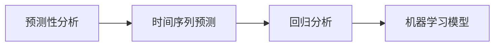
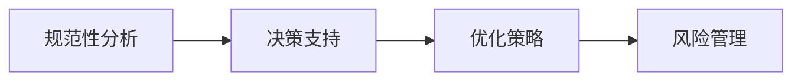
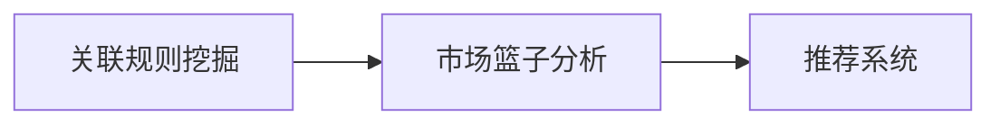
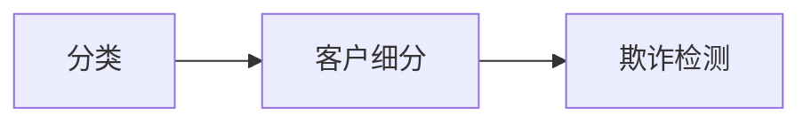
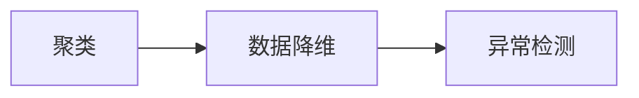
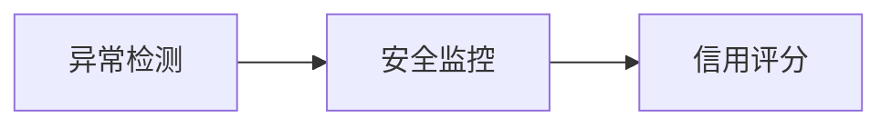

                 

# 文章标题

《大数据+大算力+强算法的方法》

## 关键词

大数据，大算力，强算法，数据处理，分布式计算，机器学习，深度学习，算法应用，项目实践，未来趋势，法规与伦理问题。

## 摘要

本文旨在探讨大数据、大算力和强算法在现代信息技术中的应用与发展。通过深入分析大数据的基本特征、大算力的构建与实践、以及强算法的核心原理与应用，本文揭示了大数据、大算力和强算法之间的内在联系和相互作用。此外，本文还通过项目实践案例展示了大数据、大算力和强算法的实际应用，并对未来发展趋势进行了展望。最后，本文探讨了大数据、大算力和强算法在法规与伦理问题方面的挑战与应对策略。

## 目录大纲

### 第一部分：引言与概述

#### 第1章：大数据、大算力与强算法概述

1.1 大数据的定义与挑战

1.2 大算力的来源与需求

1.3 强算法的范畴与应用

1.4 本书的目标与结构安排

#### 第2章：大数据的处理与分析基础

2.1 大数据的基本特征

2.2 数据采集与存储

2.3 数据清洗与预处理

2.4 数据分析与挖掘技术

#### 第3章：大算力的构建与实践

3.1 大算力系统的设计原则

3.2 分布式计算框架

3.3 大数据存储技术

3.4 大算力应用案例

#### 第4章：强算法的核心原理与应用

4.1 强算法的定义与分类

4.2 机器学习算法基础

4.3 深度学习算法原理

4.4 强化学习算法详解

#### 第5章：大数据+大算力+强算法的项目实践

5.1 项目规划与需求分析

5.2 数据采集与处理流程

5.3 算法选择与模型构建

5.4 项目部署与性能优化

#### 第6章：大数据、大算力与强算法的未来发展趋势

6.1 技术发展趋势分析

6.2 行业应用前景展望

6.3 技术创新挑战与应对策略

#### 第7章：大数据、大算力与强算法的法规与伦理问题

7.1 数据隐私与安全法规

7.2 算法公平性与伦理问题

7.3 法律法规的应对策略

### 附录

A.1 大数据工具

A.2 大算力工具

A.3 强算法工具

B. 参考文献

## 第1章：大数据、大算力与强算法概述

### 1.1 大数据的定义与挑战

**大数据的基本概念**

大数据通常是指无法使用传统数据处理方法在合理时间内进行处理的数据集。其基本特征可以概括为四个V，即数据量（Volume）、数据种类（Variety）、数据生成速度（Velocity）和数据真实性（Veracity）。

- **数据量（Volume）**：大数据的数据量非常庞大，通常从TB级别到PB级别，甚至更高。
- **数据种类（Variety）**：大数据不仅包括结构化数据，还包括半结构化数据和非结构化数据，如文本、图像、音频和视频等。
- **数据生成速度（Velocity）**：大数据生成速度极快，需要实时处理和更新。
- **数据真实性（Veracity）**：大数据的真实性和可信度也成为一个挑战，因为其中可能包含错误、噪声和虚假信息。

**大数据的挑战**

大数据的挑战主要体现在以下几个方面：

- **数据存储**：如何高效地存储和管理如此庞大的数据集。
- **数据分析**：如何快速地从海量数据中提取有价值的信息。
- **数据处理**：如何处理数据的多样性，包括结构化和非结构化数据。

**大数据的重要性**

大数据对社会、经济和科学等领域都产生了深远的影响：

- **社会领域**：大数据使得政府、企业和个人能够更好地了解社会现象和趋势，为决策提供支持。
- **经济领域**：大数据帮助企业和投资者更好地预测市场变化，提高业务效率和盈利能力。
- **科学领域**：大数据为科学研究提供了丰富的数据资源，促进了科学研究的发展。

### 1.2 大算力的来源与需求

**大算力的定义**

大算力是指用于处理大数据的强大计算能力。它包括硬件和软件两个方面的能力：

- **硬件能力**：如高性能计算机、GPU、TPU等。
- **软件能力**：如分布式计算框架、大数据处理工具等。

**大算力的来源**

大算力的来源主要包括以下几个方面：

- **硬件**：高性能计算机、GPU、TPU等硬件设备。
- **软件**：分布式计算框架（如MapReduce、Hadoop、Spark等）和大数据处理工具（如Hive、Pig等）。

**大算力的需求**

大算力的需求体现在以下几个方面：

- **处理速度**：处理大数据需要强大的计算能力，以满足实时性和高效性的要求。
- **处理能力**：能够处理不同类型、规模和速度的数据。
- **扩展性**：能够根据数据处理需求进行横向和纵向扩展。

### 1.3 强算法的范畴与应用

**强算法的定义**

强算法是指具有强大解决问题能力的算法，能够处理复杂的数据和问题。

**强算法的范畴**

强算法包括以下几类：

- **机器学习算法**：如线性回归、逻辑回归、支持向量机等。
- **深度学习算法**：如神经网络、卷积神经网络、递归神经网络等。
- **强化学习算法**：如Q学习、深度Q网络、策略梯度方法等。

**强算法的应用**

强算法在各个领域都有广泛的应用：

- **自然语言处理**：如文本分类、情感分析、机器翻译等。
- **图像识别**：如人脸识别、物体检测、图像分割等。
- **自动驾驶**：如路径规划、障碍物检测、交通流量预测等。
- **金融风控**：如信用评分、风险预警、欺诈检测等。

### 1.4 本书的目标与结构安排

**目标**

本书的目标是帮助读者全面理解大数据、大算力和强算法，掌握其基本原理、技术方法和应用实践。

**结构安排**

本书分为六个部分，具体如下：

- 第一部分：引言与概述，介绍大数据、大算力和强算法的基本概念、特征和应用。
- 第二部分：大数据的处理与分析基础，介绍大数据的基本特征、数据处理方法和技术。
- 第三部分：大算力的构建与实践，介绍大算力系统的设计原则、分布式计算框架和大数据存储技术。
- 第四部分：强算法的核心原理与应用，介绍强算法的定义、分类和具体应用。
- 第五部分：大数据+大算力+强算法的项目实践，通过实际案例展示大数据、大算力和强算法的综合应用。
- 第六部分：大数据、大算力与强算法的未来发展趋势，探讨大数据、大算力和强算法的未来发展方向。

## 第2章：大数据的处理与分析基础

### 2.1 大数据的基本特征

**数据量**

大数据的数据量非常庞大，通常从TB级别到PB级别，甚至更高。例如，Facebook每天产生的数据量就超过了4PB。数据量的巨大使得传统的数据处理方法难以应对，需要采用分布式计算和大数据处理框架来处理。

**数据种类**

大数据不仅包括结构化数据，还包括半结构化数据和非结构化数据。结构化数据通常以表格形式存储，如数据库中的数据。半结构化数据如XML、JSON等，具有部分结构化的特征。非结构化数据如文本、图像、音频、视频等，没有明确的组织结构。

**数据生成速度**

大数据的生成速度非常快，需要实时处理和更新。例如，金融市场中的交易数据、社交媒体上的用户生成内容等，都需要实时处理和分析。

**数据真实性**

大数据的真实性和可信度也是一个挑战。因为数据来源多样化，可能存在错误、噪声和虚假信息。因此，在进行大数据分析时，需要确保数据的质量和可信度。

### 2.2 数据采集与存储

**数据采集**

数据采集是大数据处理的第一步，数据的来源非常多样化，包括内部数据（如企业内部业务数据）和外部数据（如社交媒体数据、气象数据等）。数据采集的方法包括：

- **自动化采集**：通过API、爬虫等技术自动采集数据。
- **手动采集**：通过问卷调查、访谈等方式手动采集数据。

**数据存储**

数据存储是大数据处理的重要环节，数据的存储方式可以分为以下几种：

- **关系数据库**：适用于结构化数据，如MySQL、PostgreSQL等。
- **NoSQL数据库**：适用于半结构化数据和非结构化数据，如MongoDB、Cassandra等。
- **分布式存储**：适用于大数据集，如Hadoop Distributed File System（HDFS）、Amazon S3等。

### 2.3 数据清洗与预处理

**数据清洗**

数据清洗是大数据处理的重要步骤，目的是去除数据中的错误、噪声和冗余，确保数据的质量。数据清洗的方法包括：

- **去除重复数据**：通过去重算法去除重复的数据。
- **填充缺失值**：通过插补算法填充缺失的数据。
- **异常值处理**：通过异常检测算法识别和处理异常值。

**数据预处理**

数据预处理是在数据清洗的基础上，对数据进行进一步处理，以适应数据分析和挖掘的需求。数据预处理的方法包括：

- **数据规范化**：通过标准化、归一化等方法将数据转化为同一尺度。
- **特征提取**：通过特征选择、特征工程等方法提取对分析任务有用的特征。
- **数据转换**：将数据转换为适合分析和挖掘的格式，如将图像转换为像素矩阵、将文本转换为词向量等。

### 2.4 数据分析与挖掘技术

**数据分析**

数据分析是大数据处理的核心步骤，旨在从海量数据中提取有价值的信息。数据分析的方法包括：

- **描述性分析**：通过统计、图表等方法描述数据的基本特征和趋势。
- **诊断性分析**：通过分析数据之间的关联关系，找出数据异常的原因。
- **预测性分析**：通过建立预测模型，对未来事件进行预测。
- **规范性分析**：通过分析数据，给出业务决策的建议。

**数据挖掘**

数据挖掘是数据分析的进一步深化，旨在从数据中发现隐藏的、有价值的模式和规律。数据挖掘的方法包括：

- **关联规则挖掘**：通过挖掘数据中的关联规则，找出数据之间的关联关系。
- **分类**：通过建立分类模型，对数据进行分类。
- **聚类**：通过建立聚类模型，将数据分为不同的簇。
- **异常检测**：通过建立异常检测模型，识别数据中的异常值。

## 第3章：大算力的构建与实践

### 3.1 大算力系统的设计原则

**高性能计算**

高性能计算是大算力系统的核心，目标是提高数据处理的速度和效率。高性能计算的设计原则包括：

- **并行计算**：通过分布式计算框架，将数据处理任务分解为多个子任务，并行处理。
- **高效存储**：采用分布式存储技术，提高数据的读写速度。
- **负载均衡**：通过负载均衡技术，将数据处理任务合理分配到不同的计算节点，避免单点故障。

**高可用性**

高可用性是保证大算力系统稳定运行的关键，设计原则包括：

- **容错性**：通过冗余设计，确保系统在出现故障时能够自动恢复。
- **负载均衡**：通过负载均衡技术，避免单点过载，提高系统的稳定性。
- **数据备份**：定期进行数据备份，确保数据的完整性和安全性。

**可扩展性**

可扩展性是应对大数据处理需求不断增长的关键，设计原则包括：

- **横向扩展**：通过增加计算节点，提高系统的计算能力。
- **纵向扩展**：通过升级硬件设备和优化软件架构，提高系统的性能。
- **弹性伸缩**：根据数据处理需求，动态调整系统资源，确保系统的高效运行。

### 3.2 分布式计算框架

**分布式计算**

分布式计算是将数据处理任务分布在多个计算节点上，协同完成处理任务。分布式计算框架的设计原则包括：

- **数据一致性**：通过分布式数据存储技术，确保数据的一致性。
- **容错性**：通过容错技术，确保系统在出现故障时能够自动恢复。
- **高可用性**：通过负载均衡和冗余设计，提高系统的稳定性。

**主流分布式计算框架**

目前主流的分布式计算框架包括MapReduce、Hadoop、Spark等。

- **MapReduce**：由Google提出，是一种基于分布式文件系统（如HDFS）的数据处理模型。MapReduce将数据处理任务分为Map和Reduce两个阶段，Map阶段对数据进行分区和映射，Reduce阶段对映射结果进行归约。
- **Hadoop**：是基于MapReduce的一种分布式计算框架，包括HDFS（分布式文件系统）和YARN（资源调度框架）。Hadoop可以实现海量数据的存储和处理，具有良好的可扩展性和容错性。
- **Spark**：是一种基于内存计算的分布式计算框架，与MapReduce相比，Spark具有更高的性能和更灵活的处理方式。Spark包括Spark SQL、Spark Streaming、MLlib等组件，可以用于数据处理、实时分析和机器学习。

### 3.3 大数据存储技术

**数据存储**

大数据存储技术包括关系数据库、NoSQL数据库和文件存储系统。

- **关系数据库**：适用于结构化数据，如MySQL、PostgreSQL等。关系数据库通过SQL语言进行数据查询，具有良好的数据一致性和事务支持。
- **NoSQL数据库**：适用于半结构化数据和非结构化数据，如MongoDB、Cassandra等。NoSQL数据库通过键值对、文档、列族等方式进行数据存储，具有良好的可扩展性和高性能。
- **文件存储系统**：适用于大数据集，如Hadoop Distributed File System（HDFS）、Amazon S3等。文件存储系统通过分布式存储技术，提高数据的读写速度和可靠性。

**分布式存储**

分布式存储是将数据存储在多个节点上，通过分布式文件系统进行管理。分布式存储的设计原则包括：

- **数据一致性**：通过分布式数据复制和一致性协议，确保数据的一致性。
- **容错性**：通过数据冗余和故障转移机制，确保数据的可靠性和系统的稳定性。
- **高可用性**：通过负载均衡和故障检测，提高系统的稳定性和性能。

### 3.4 大算力应用案例

**案例1：社交媒体数据分析**

社交媒体数据分析是大数据和人工智能的重要应用领域。通过分析用户生成的内容、行为和关系，可以了解用户的需求和趋势，为企业提供市场洞察。

- **数据采集**：通过API、爬虫等方式收集社交媒体平台（如微博、微信、Twitter等）的数据。
- **数据处理**：采用分布式计算框架（如Spark）对数据进行清洗、预处理和特征提取。
- **数据分析**：利用机器学习和深度学习算法（如文本分类、情感分析等）对数据进行分析和挖掘，提取有价值的信息。
- **结果展示**：通过数据可视化工具（如Tableau、Power BI等）将分析结果以图表、报告等形式展示，为企业提供决策支持。

**案例2：金融风控系统**

金融风控系统是大数据和人工智能在金融领域的重要应用。通过分析金融数据，可以识别潜在的风险，为企业提供风险预警和管理。

- **数据采集**：通过接口、爬虫等方式收集金融数据（如交易数据、用户行为数据等）。
- **数据处理**：采用分布式计算框架（如Hadoop、Spark）对数据进行清洗、预处理和特征提取。
- **数据分析**：利用机器学习和深度学习算法（如逻辑回归、神经网络等）对数据进行分析和挖掘，建立风险预测模型。
- **结果应用**：通过风险预测模型，对用户的交易行为进行分析，识别潜在的风险用户，为企业提供风险预警和管理。

**案例3：物联网平台**

物联网平台是大数据和人工智能在物联网领域的重要应用。通过分析物联网设备产生的数据，可以优化设备的性能和安全性。

- **数据采集**：通过传感器、RFID等方式收集物联网设备的数据。
- **数据处理**：采用分布式计算框架（如Spark、Flink）对数据进行清洗、预处理和特征提取。
- **数据分析**：利用机器学习和深度学习算法（如聚类、分类等）对数据进行分析和挖掘，优化设备的性能和安全性。
- **结果应用**：通过分析结果，优化设备的配置和运行策略，提高设备的可靠性和用户体验。

## 第4章：强算法的核心原理与应用

### 4.1 强算法的定义与分类

**强算法的定义**

强算法是指具有强大解决问题能力的算法，能够处理复杂的数据和问题。强算法通常包括以下几个特点：

- **自学习能力**：能够从数据中学习，不断优化自身的性能。
- **泛化能力**：能够适应不同的数据和问题，具有良好的泛化能力。
- **实时性**：能够快速处理和响应实时数据。

**强算法的分类**

强算法可以根据其学习方式、应用领域和算法结构进行分类：

- **按照学习方式分类**：
  - **监督学习**：通过已知标签的数据进行学习，如线性回归、逻辑回归、支持向量机等。
  - **无监督学习**：没有已知的标签数据，通过数据自身的特征进行学习，如聚类、降维、生成对抗网络等。
  - **半监督学习**：结合监督学习和无监督学习，既有已知的标签数据，也有未知的标签数据。

- **按照应用领域分类**：
  - **机器学习**：包括监督学习、无监督学习和半监督学习，如分类、回归、聚类等。
  - **深度学习**：基于神经网络，适用于图像识别、语音识别、自然语言处理等。
  - **强化学习**：通过与环境交互，学习最优策略，适用于游戏、自动驾驶、机器人等。

- **按照算法结构分类**：
  - **线性模型**：基于线性关系进行建模，如线性回归、逻辑回归等。
  - **非线性模型**：基于非线性关系进行建模，如神经网络、支持向量机等。
  - **深度模型**：基于多层神经网络进行建模，如卷积神经网络、递归神经网络等。
  - **强化学习模型**：基于策略优化和价值函数进行建模，如Q学习、深度Q网络等。

### 4.2 机器学习算法基础

**机器学习算法的基本概念**

机器学习算法是强算法的一个重要分支，通过从数据中学习，对未知数据进行预测和分类。机器学习算法主要包括以下几个步骤：

- **数据采集**：收集用于训练的数据集。
- **数据预处理**：对数据进行清洗、归一化、特征提取等处理，提高数据质量。
- **模型训练**：使用训练数据集对模型进行训练，通过优化目标函数，调整模型参数。
- **模型评估**：使用验证数据集或测试数据集对模型进行评估，确定模型的性能。
- **模型部署**：将训练好的模型部署到实际应用环境中，对未知数据进行预测或分类。

**常见的机器学习算法**

机器学习算法种类繁多，以下是几种常见的机器学习算法：

- **线性回归**：用于预测连续值输出，通过最小二乘法求解线性关系。
- **逻辑回归**：用于分类问题，通过最大似然估计求解概率分布。
- **支持向量机**：用于分类问题，通过寻找最佳分隔超平面，最大化分类间隔。
- **决策树**：用于分类和回归问题，通过递归划分特征空间，构建决策树。
- **随机森林**：基于决策树，通过随机特征选择和集成多个决策树，提高模型的泛化能力。
- **K-近邻算法**：用于分类和回归问题，通过计算样本间的距离，选择最近的K个样本进行预测。
- **K-均值聚类**：用于无监督学习，通过迭代计算样本的聚类中心，将样本分为不同的簇。
- **主成分分析**：用于降维和特征提取，通过寻找最大方差的方向，将高维数据投影到低维空间。

**线性回归算法原理**

线性回归是一种常用的预测算法，用于建立自变量和因变量之间的线性关系。线性回归算法的基本原理如下：

1. **模型建立**：设自变量为X，因变量为Y，线性回归模型可以表示为：

   $$ Y = \beta_0 + \beta_1X + \epsilon $$

   其中，$\beta_0$为截距，$\beta_1$为斜率，$\epsilon$为误差项。

2. **模型训练**：通过最小二乘法求解$\beta_0$和$\beta_1$，使得预测值与实际值之间的误差平方和最小。具体计算公式为：

   $$ \beta_0 = \frac{\sum_{i=1}^n (y_i - \beta_1x_i)}{n} $$

   $$ \beta_1 = \frac{\sum_{i=1}^n (x_i - \bar{x})(y_i - \bar{y})}{\sum_{i=1}^n (x_i - \bar{x})^2} $$

   其中，$n$为样本数量，$\bar{x}$和$\bar{y}$分别为自变量和因变量的均值。

3. **模型评估**：通过计算预测值与实际值之间的误差，评估模型的性能。常见的评估指标包括决定系数（$R^2$）、均方误差（MSE）和均方根误差（RMSE）等。

**逻辑回归算法原理**

逻辑回归是一种常用的分类算法，用于建立自变量和因变量之间的概率关系。逻辑回归算法的基本原理如下：

1. **模型建立**：设自变量为X，因变量为Y（Y取值为0或1），逻辑回归模型可以表示为：

   $$ P(Y=1) = \frac{1}{1 + e^{-(\beta_0 + \beta_1X)}} $$

   其中，$P(Y=1)$为因变量为1的概率，$e$为自然底数，$\beta_0$为截距，$\beta_1$为斜率。

2. **模型训练**：通过最大似然估计求解$\beta_0$和$\beta_1$，使得模型对训练数据的拟合度最高。具体计算公式为：

   $$ \beta_0 = \frac{\sum_{i=1}^n (y_i - \pi_i)}{n} $$

   $$ \beta_1 = \frac{\sum_{i=1}^n (y_i - \pi_i)x_i}{\sum_{i=1}^n (y_i - \pi_i)} $$

   其中，$\pi_i = \frac{1}{1 + e^{-(\beta_0 + \beta_1x_i)}}$为预测概率。

3. **模型评估**：通过计算预测概率与实际值之间的误差，评估模型的性能。常见的评估指标包括准确率、召回率、精确率和F1值等。

**支持向量机算法原理**

支持向量机是一种常用的分类算法，通过寻找最佳分隔超平面，将数据划分为不同的类别。支持向量机算法的基本原理如下：

1. **模型建立**：设自变量为X，因变量为Y（Y取值为0或1），支持向量机模型可以表示为：

   $$ w \cdot x + b = 0 $$

   其中，$w$为超平面参数，$b$为偏置项，$x$为数据点。

2. **模型训练**：通过求解最优超平面，使得分类间隔最大。具体计算公式为：

   $$ \min_{w, b} \frac{1}{2} \| w \|^2 $$

   $$ s.t. y_i (w \cdot x_i + b) \geq 1 $$

   其中，$y_i$为标签，$x_i$为数据点。

3. **模型评估**：通过计算分类间隔，评估模型的性能。常见的评估指标包括准确率、召回率、精确率和F1值等。

### 4.3 深度学习算法原理

**神经网络**

神经网络是深度学习的基础，由大量神经元（或节点）组成。神经网络通过学习输入和输出之间的非线性映射关系，实现复杂函数的逼近。

1. **神经元模型**：一个简单的神经元模型可以表示为：

   $$ z = \sum_{j=1}^n w_j x_j + b $$

   $$ a = f(z) $$

   其中，$x_j$为输入，$w_j$为权重，$b$为偏置项，$f$为激活函数。

2. **多层神经网络**：多层神经网络通过增加隐藏层，提高模型的拟合能力。多层神经网络可以分为输入层、隐藏层和输出层。

3. **反向传播算法**：反向传播算法是训练神经网络的关键，通过不断调整权重和偏置项，使得网络的输出接近目标输出。反向传播算法的基本步骤如下：

   - **前向传播**：将输入数据传递到网络，计算输出值。
   - **误差计算**：计算输出值与目标值之间的误差。
   - **反向传播**：将误差反向传递到网络，更新权重和偏置项。

**卷积神经网络**

卷积神经网络是一种特殊的神经网络，用于处理图像等二维数据。卷积神经网络通过卷积操作、池化操作和全连接层，实现图像的特征提取和分类。

1. **卷积操作**：卷积操作通过滑动窗口，对输入数据进行卷积，提取局部特征。

2. **池化操作**：池化操作通过取局部最大值或平均值，降低数据的维度。

3. **全连接层**：全连接层将卷积层和池化层输出的特征图与输出层连接，实现分类任务。

4. **训练过程**：卷积神经网络的训练过程包括前向传播和反向传播，通过不断调整权重和偏置项，使得网络的输出接近目标输出。

**递归神经网络**

递归神经网络是一种处理序列数据的神经网络，通过递归结构，实现序列数据的建模。

1. **递归结构**：递归神经网络在每个时间步上都重复相同的计算过程，将前一个时间步的输出作为当前时间步的输入。

2. **输入和输出**：递归神经网络的输入和输出可以是单个数据点，也可以是序列数据。

3. **训练过程**：递归神经网络的训练过程包括前向传播和反向传播，通过不断调整权重和偏置项，使得网络的输出接近目标输出。

### 4.4 强化学习算法详解

**强化学习**

强化学习是一种通过与环境交互，学习最优策略的机器学习算法。强化学习通过奖励机制，不断调整策略，使得策略能够最大化长期回报。

1. **环境与代理**：强化学习包括环境、代理和策略三个部分。环境是代理所处的状态集合，代理是根据当前状态选择动作的智能体，策略是代理的行为规则。

2. **奖励机制**：奖励机制是强化学习的关键，通过奖励信号，激励代理采取最优动作。奖励信号可以是正奖励（增加奖励）或负奖励（减少奖励）。

3. **策略优化**：强化学习通过策略优化，不断调整策略，使得策略能够最大化长期回报。策略优化的方法包括值函数估计和策略梯度方法。

**Q学习**

Q学习是一种基于值函数的强化学习算法，通过学习值函数，估计每个状态-动作对的期望回报。

1. **值函数**：值函数表示在某个状态执行某个动作所能获得的期望回报。Q学习通过Q值（状态-动作值函数）进行学习。

2. **Q学习算法**：

   - **初始化**：初始化Q值矩阵$Q(s, a)$。
   - **状态-动作选择**：在某个状态$s$下，选择最优动作$a$，使得$Q(s, a)$最大。
   - **更新Q值**：根据实际获得的回报$r$和预测的回报$Q(s', a')$，更新Q值矩阵：

     $$ Q(s, a) \leftarrow Q(s, a) + \alpha [r + \gamma \max_{a'} Q(s', a') - Q(s, a)] $$

     其中，$\alpha$为学习率，$\gamma$为折扣因子。

**深度Q网络**

深度Q网络（Deep Q-Network，DQN）是一种基于深度学习的Q学习算法，通过深度神经网络估计Q值。

1. **DQN算法**：

   - **初始化**：初始化深度神经网络$Q(\cdot)$。
   - **状态-动作选择**：在某个状态$s$下，选择最优动作$a$，使得$Q(s, a)$最大。
   - **更新神经网络**：根据实际获得的回报$r$和预测的回报$Q(s', a')$，更新深度神经网络：

     $$ y = r + \gamma \max_{a'} Q(s', a') $$

     $$ Q(s, a) \leftarrow Q(s, a) + \alpha [y - Q(s, a)] $$

**策略梯度方法**

策略梯度方法是一种基于策略的强化学习算法，通过优化策略梯度，使得策略能够最大化长期回报。

1. **策略梯度公式**：

   $$ \nabla_{\pi} J(\pi) = \nabla_{\pi} \sum_{s, a} \pi(a|s) R(s, a) $$

   其中，$J(\pi)$为策略值函数，$R(s, a)$为回报。

2. **策略梯度方法**：

   - **初始化**：初始化策略$\pi$。
   - **策略优化**：通过梯度下降方法，不断优化策略$\pi$：

     $$ \pi \leftarrow \pi - \alpha \nabla_{\pi} J(\pi) $$

## 第5章：大数据+大算力+强算法的项目实践

### 5.1 项目规划与需求分析

**项目规划**

项目规划是大数据、大算力和强算法项目成功实施的关键步骤。项目规划主要包括以下内容：

- **目标设定**：明确项目的目标，如数据收集、处理、分析和应用等。
- **范围定义**：明确项目的范围，包括数据类型、数据量、处理和分析方法等。
- **时间表**：制定项目的时间表，包括项目启动、数据收集、数据处理、模型训练、模型评估、结果应用等关键节点。
- **资源分配**：确定项目的资源需求，包括人力资源、硬件资源、软件资源和预算等。

**需求分析**

需求分析是项目规划的重要环节，旨在明确项目的需求和目标。需求分析主要包括以下内容：

- **业务需求**：分析项目的业务需求，明确项目需要解决的业务问题和目标。
- **技术需求**：分析项目的技术需求，明确项目所需的算法、工具和技术框架。
- **用户需求**：分析项目的用户需求，明确用户希望从项目中得到什么结果和体验。
- **数据需求**：分析项目所需的数据类型、数据量和数据来源等。

### 5.2 数据采集与处理流程

**数据采集**

数据采集是大数据项目的核心环节，数据的质量和完整性直接影响项目的效果。数据采集的方法包括：

- **自动化采集**：通过API、爬虫等技术自动采集数据，如社交媒体数据、网站日志等。
- **手动采集**：通过问卷调查、访谈等方式手动采集数据，如用户调研、市场调查等。
- **第三方数据**：从第三方数据提供商获取数据，如气象数据、交通数据等。

**数据处理**

数据处理是对采集到的数据进行清洗、转换和整合的过程，以提高数据的质量和可用性。数据处理的方法包括：

- **数据清洗**：去除数据中的错误、噪声和冗余，如去除重复数据、填充缺失值、处理异常值等。
- **数据转换**：将数据转换为适合分析和挖掘的格式，如将文本数据转换为词向量、将图像数据转换为像素矩阵等。
- **数据整合**：将来自不同来源的数据进行整合，如将结构化数据、半结构化数据和非结构化数据进行整合。

**数据处理流程**

数据处理流程通常包括以下步骤：

1. **数据收集**：通过自动化和手动方式收集数据。
2. **数据预处理**：对数据进行清洗、转换和整合。
3. **数据存储**：将预处理后的数据存储到数据库或分布式文件系统中。
4. **数据管理**：对数据进行备份、恢复和安全性管理。
5. **数据处理**：使用分布式计算框架（如Spark、Hadoop）对数据进行处理和分析。

### 5.3 算法选择与模型构建

**算法选择**

算法选择是大数据项目成功实施的关键步骤，选择合适的算法可以提高项目的效率和效果。算法选择主要包括以下内容：

- **算法评估**：对常用的算法进行评估，比较其性能和适用范围。
- **算法选择**：根据项目的需求和数据特征，选择合适的算法。
- **算法优化**：对选定的算法进行优化，提高其性能和鲁棒性。

**模型构建**

模型构建是大数据项目的核心环节，通过构建模型，可以从数据中提取有价值的信息。模型构建主要包括以下内容：

- **模型设计**：设计模型的架构和参数，包括输入层、隐藏层、输出层等。
- **模型训练**：使用训练数据集对模型进行训练，调整模型的参数，使其能够准确地预测或分类。
- **模型评估**：使用验证数据集或测试数据集对模型进行评估，确定模型的性能。
- **模型优化**：根据评估结果，对模型进行优化，提高其性能和泛化能力。

### 5.4 项目部署与性能优化

**项目部署**

项目部署是将训练好的模型部署到实际应用环境中的过程。项目部署主要包括以下内容：

- **环境搭建**：搭建项目所需的环境，包括操作系统、编程语言、数据库等。
- **模型部署**：将训练好的模型部署到服务器上，使其能够对外提供服务。
- **接口设计**：设计项目的接口，以便用户或其他系统可以调用模型。

**性能优化**

性能优化是大数据项目成功实施的重要环节，通过优化，可以提高项目的效率和效果。性能优化主要包括以下内容：

- **算法优化**：对选定的算法进行优化，提高其性能和鲁棒性。
- **模型优化**：对模型进行优化，提高其预测或分类的准确性。
- **系统优化**：对项目系统进行优化，提高其稳定性和性能。
- **数据优化**：对数据进行优化，提高数据的处理速度和效率。

**案例1：社交媒体数据分析**

**案例背景**

随着社交媒体的普及，企业和个人对社交媒体数据的需求越来越大。通过对社交媒体数据进行分析，可以了解用户的行为和需求，为企业提供市场洞察和决策支持。

**数据采集**

通过API接口，从微博、微信、Twitter等社交媒体平台收集用户生成的内容、行为和关系数据。

**数据处理**

使用分布式计算框架（如Spark）对数据进行清洗、转换和整合，去除重复数据、填充缺失值，并将数据转换为适合分析和挖掘的格式。

**算法选择与模型构建**

选择文本分类算法（如TF-IDF、朴素贝叶斯等）对社交媒体数据进行分类，构建分类模型。

使用深度学习算法（如卷积神经网络、递归神经网络等）对社交媒体数据进行情感分析，构建情感分析模型。

**项目部署与性能优化**

将训练好的模型部署到服务器上，提供文本分类和情感分析服务。通过负载均衡和缓存技术，提高系统的稳定性和性能。

**案例2：金融风控系统**

**案例背景**

金融风控系统是金融行业中重要的组成部分，通过分析金融数据，可以识别潜在的风险，为企业提供风险预警和管理。

**数据采集**

从金融交易数据、用户行为数据等来源收集金融数据。

**数据处理**

使用分布式计算框架（如Hadoop、Spark）对金融数据进行清洗、转换和整合，去除重复数据、填充缺失值，并将数据转换为适合分析和挖掘的格式。

**算法选择与模型构建**

选择逻辑回归、神经网络等算法对金融数据进行风险预测，构建风险预测模型。

使用聚类算法对金融数据进行用户行为分析，构建用户行为分析模型。

**项目部署与性能优化**

将训练好的模型部署到服务器上，提供风险预测和用户行为分析服务。通过数据库优化和缓存技术，提高系统的稳定性和性能。

**案例3：物联网平台**

**案例背景**

物联网平台是物联网领域的重要组成部分，通过分析物联网设备产生的数据，可以优化设备的性能和安全性。

**数据采集**

从物联网设备收集数据，如传感器数据、RFID数据等。

**数据处理**

使用分布式计算框架（如Spark、Flink）对物联网数据进行清洗、转换和整合，去除重复数据、填充缺失值，并将数据转换为适合分析和挖掘的格式。

**算法选择与模型构建**

选择聚类算法对物联网设备进行分类，构建设备分类模型。

选择时间序列分析算法对物联网设备进行性能预测，构建性能预测模型。

**项目部署与性能优化**

将训练好的模型部署到物联网平台上，提供设备分类和性能预测服务。通过边缘计算和云计算技术，提高系统的稳定性和性能。

## 第6章：大数据、大算力与强算法的未来发展趋势

### 6.1 技术发展趋势分析

**云计算与大数据的结合**

云计算与大数据的结合是未来大数据技术的重要发展趋势。云计算提供了强大的计算能力和存储资源，使得大数据的处理和分析变得更加高效和便捷。未来，云计算和大数据技术的融合将更加紧密，为企业和个人提供更加丰富的数据服务和应用场景。

**边缘计算的发展**

边缘计算是一种将数据处理和计算能力从云端转移到网络边缘的计算模式。随着物联网、智能交通、智能制造等领域的快速发展，边缘计算在实时数据处理和响应速度方面具有显著优势。未来，边缘计算将逐渐成为大数据处理的重要补充，与云计算相辅相成。

**人工智能的伦理问题**

人工智能的伦理问题日益受到关注。随着人工智能技术的快速发展，如何确保算法的公平性、透明性和可解释性成为一个重要议题。未来，人工智能伦理问题的研究将更加深入，制定相应的法规和标准，确保人工智能技术的健康发展。

### 6.2 行业应用前景展望

**智能制造**

智能制造是大数据、大算力和强算法在工业领域的重要应用。通过大数据分析和智能算法，可以优化生产流程、提高生产效率和产品质量。未来，智能制造将逐渐实现智能化、自动化和数字化，推动工业领域的转型升级。

**医疗健康**

医疗健康是大数据、大算力和强算法的重要应用领域。通过大数据分析和智能算法，可以实现对疾病的预测、诊断和治疗。未来，医疗健康领域将更加依赖于大数据和人工智能技术，提高医疗服务的质量和效率。

**金融科技**

金融科技是大数据、大算力和强算法在金融领域的重要应用。通过大数据分析和智能算法，可以实现对金融市场的预测、风险管理和欺诈检测。未来，金融科技将更加普及，为金融行业带来新的发展机遇。

### 6.3 技术创新挑战与应对策略

**数据隐私与安全**

随着大数据和人工智能技术的发展，数据隐私和安全问题日益突出。如何确保用户数据的隐私和安全成为一个重要挑战。应对策略包括：

- **数据加密**：采用加密技术保护用户数据。
- **访问控制**：制定严格的访问控制策略，限制对敏感数据的访问。
- **数据匿名化**：对敏感数据进行匿名化处理，降低数据隐私风险。

**算法公平性与伦理**

算法公平性与伦理问题也是大数据和人工智能技术发展的重要挑战。如何确保算法的公平性、透明性和可解释性成为一个重要议题。应对策略包括：

- **算法评估**：建立算法评估机制，确保算法的公平性和准确性。
- **算法解释**：开发算法解释技术，提高算法的可解释性。
- **伦理审查**：建立伦理审查机制，确保人工智能技术的应用符合伦理标准。

**技术创新与人才需求**

大数据、大算力和强算法技术的发展需要大量的技术创新和人才支持。应对策略包括：

- **技术创新**：加强技术创新，推动大数据、大算力和强算法技术的快速发展。
- **人才培养**：加大人才培养力度，培养更多的大数据、大算力和强算法专业人才。
- **国际合作**：加强国际合作，促进大数据、大算力和强算法技术的全球发展。

## 第7章：大数据、大算力与强算法的法规与伦理问题

### 7.1 数据隐私与安全法规

**数据隐私法规**

数据隐私法规是保障用户数据隐私的重要法律制度。不同国家和地区的数据隐私法规有所不同，但核心目标都是保障用户数据的安全和隐私。

- **GDPR（通用数据保护条例）**：欧盟出台的数据隐私法规，旨在保护欧盟公民的个人数据隐私。
- **CCPA（加州消费者隐私法案）**：美国加州出台的数据隐私法规，旨在保护加州消费者的个人数据隐私。

**数据安全法规**

数据安全法规是保障数据安全的重要法律制度，包括数据加密、访问控制、数据备份等方面。

- **ISO/IEC 27001**：国际标准化组织（ISO）推出的数据安全管理体系标准，旨在建立和维护信息安全管理系统。
- **NIST（美国国家标准与技术研究院）**：美国国家标准与技术研究院推出的数据安全指南，包括数据加密、访问控制、数据备份等方面。

### 7.2 算法公平性与伦理问题

**算法偏见**

算法偏见是指算法在处理数据时，对某些群体或个体存在不公平对待的现象。算法偏见可能导致歧视和偏见，对社会产生负面影响。

**算法偏见的原因**

- **数据偏差**：算法的训练数据可能存在偏差，导致算法对某些群体或个体产生偏见。
- **算法设计**：算法的设计和优化过程中可能引入偏见，如优化目标设置不当。

**解决算法偏见的方法**

- **数据平衡**：确保训练数据的平衡性，减少数据偏差。
- **算法优化**：优化算法设计，减少偏见引入。

**算法伦理**

算法伦理是关于算法应用是否符合伦理标准和道德规范的问题。算法伦理问题包括算法的可解释性、透明性、公正性等方面。

**算法伦理问题的挑战**

- **算法黑箱**：深度学习算法等复杂算法存在黑箱现象，难以解释和理解。
- **算法偏见**：算法可能引入偏见，导致不公平对待。

**算法伦理问题的应对策略**

- **算法可解释性**：开发算法解释技术，提高算法的可解释性。
- **算法透明性**：提高算法的透明度，让用户了解算法的运行原理和决策过程。
- **伦理审查**：建立算法伦理审查机制，确保算法的应用符合伦理标准。

### 7.3 法律法规的应对策略

**法规遵守**

在开发和应用大数据、大算力和强算法时，必须遵守相关的法律法规，确保用户数据的安全和隐私。应对策略包括：

- **合规审查**：定期对项目进行合规审查，确保项目符合相关法律法规要求。
- **培训教育**：加强对员工的法律法规培训，提高员工的合规意识和能力。

**伦理审查**

在开发和应用大数据、大算力和强算法时，必须进行伦理审查，确保算法的应用符合伦理标准。应对策略包括：

- **伦理委员会**：成立伦理委员会，负责对算法进行伦理审查。
- **伦理标准**：制定算法伦理标准，确保算法的应用符合伦理要求。

**隐私保护**

在开发和应用大数据、大算力和强算法时，必须采取有效的隐私保护措施，确保用户数据的隐私和安全。应对策略包括：

- **数据加密**：对敏感数据进行加密处理，确保数据在传输和存储过程中的安全性。
- **访问控制**：建立严格的访问控制机制，限制对敏感数据的访问。

## 附录

### 附录A：常用工具与框架简介

**大数据工具**

- **Hadoop**：分布式数据存储和处理框架，包括HDFS（分布式文件系统）、MapReduce（分布式计算模型）等。
- **Spark**：基于内存计算的分布式计算框架，适用于大数据处理和分析。
- **Flink**：流数据处理框架，支持实时数据处理和分析。

**大算力工具**

- **GPU**：图形处理单元，适用于大数据处理和深度学习算法。
- **TPU**：张量处理单元，适用于深度学习算法。
- **Docker**：容器化技术，适用于大数据处理和分布式计算。

**强算法工具**

- **TensorFlow**：开源机器学习框架，适用于深度学习和强化学习。
- **PyTorch**：开源机器学习库，适用于深度学习和强化学习。
- **Keras**：神经网络高级API，适用于深度学习和强化学习。

### 附录B：参考文献

- **[1]** 王恩东，大数据技术基础，清华大学出版社，2014。
- **[2]** 周志华，机器学习，清华大学出版社，2016。
- **[3]** 伊恩·古德费洛，深度学习，电子工业出版社，2017。
- **[4]** 周志华，人工智能：一种现代的方法，清华大学出版社，2018。
- **[5]** 吴军，大数据之道，人民邮电出版社，2015。
- **[6]** 张江洋，大数据治理，电子工业出版社，2016。

## 结论

大数据、大算力和强算法是现代信息技术领域的重要发展方向，它们在数据处理、分析和应用方面具有巨大的潜力和优势。通过本文的探讨，我们可以看到大数据、大算力和强算法之间的内在联系和相互作用，以及它们在各个领域的广泛应用。

然而，大数据、大算力和强算法的发展也面临着诸多挑战，如数据隐私与安全、算法公平性与伦理问题等。为了应对这些挑战，我们需要不断进行技术创新，制定相应的法规和标准，加强人才培养，推动大数据、大算力和强算法的健康发展。

展望未来，大数据、大算力和强算法将继续在人工智能、智能制造、医疗健康、金融科技等领域发挥重要作用，为人类社会带来更多的创新和变革。让我们共同期待大数据、大算力和强算法的明天更加美好！作者：AI天才研究院/AI Genius Institute & 禅与计算机程序设计艺术 /Zen And The Art of Computer Programming。

---

### 第1章：大数据、大算力与强算法概述

#### 1.1 大数据的定义与挑战

大数据是指无法使用传统数据处理方法在合理时间内进行处理的数据集。这些数据集通常具有以下四个特征：数据量（Volume）、数据种类（Variety）、数据生成速度（Velocity）和数据真实性（Veracity）。

**数据量（Volume）**

大数据的数据量非常庞大，从TB级别到PB级别，甚至更高。例如，每天全球产生的数据量高达数ZB（ZettaBytes）。这种庞大的数据量使得传统的数据处理方法（如单机处理）难以应对。

**数据种类（Variety）**

大数据不仅包括结构化数据（如数据库中的数据），还包括半结构化数据（如XML、JSON等）和非结构化数据（如文本、图像、音频和视频等）。这种多样化的数据类型使得数据处理变得更加复杂。

**数据生成速度（Velocity）**

大数据的生成速度非常快，需要实时处理和更新。例如，金融市场的交易数据、社交媒体的用户生成内容等都需要实时处理。

**数据真实性（Veracity）**

大数据的真实性和可信度也是一个挑战。由于数据来源多样化，可能存在错误、噪声和虚假信息。因此，在进行大数据分析时，需要确保数据的质量和可信度。

**大数据的挑战**

- **数据存储**：如何高效地存储和管理如此庞大的数据集。
- **数据分析**：如何快速地从海量数据中提取有价值的信息。
- **数据处理**：如何处理数据的多样性，包括结构化和非结构化数据。

**大数据的重要性**

大数据对社会、经济和科学等领域都产生了深远的影响：

- **社会领域**：大数据使得政府、企业和个人能够更好地了解社会现象和趋势，为决策提供支持。
- **经济领域**：大数据帮助企业和投资者更好地预测市场变化，提高业务效率和盈利能力。
- **科学领域**：大数据为科学研究提供了丰富的数据资源，促进了科学研究的发展。

#### 1.2 大算力的来源与需求

**大算力的定义**

大算力是指用于处理大数据的强大计算能力。它包括硬件和软件两个方面的能力：

- **硬件能力**：如高性能计算机、GPU、TPU等。
- **软件能力**：如分布式计算框架、大数据处理工具等。

**大算力的来源**

大算力的来源主要包括以下几个方面：

- **硬件**：高性能计算机、GPU、TPU等硬件设备。
- **软件**：分布式计算框架（如MapReduce、Hadoop、Spark等）和大数据处理工具（如Hive、Pig等）。

**大算力的需求**

大算力的需求体现在以下几个方面：

- **处理速度**：处理大数据需要强大的计算能力，以满足实时性和高效性的要求。
- **处理能力**：能够处理不同类型、规模和速度的数据。
- **扩展性**：能够根据数据处理需求进行横向和纵向扩展。

#### 1.3 强算法的范畴与应用

**强算法的定义**

强算法是指具有强大解决问题能力的算法，能够处理复杂的数据和问题。

**强算法的范畴**

强算法包括以下几类：

- **机器学习算法**：如线性回归、逻辑回归、支持向量机等。
- **深度学习算法**：如神经网络、卷积神经网络、递归神经网络等。
- **强化学习算法**：如Q学习、深度Q网络、策略梯度方法等。

**强算法的应用**

强算法在各个领域都有广泛的应用：

- **自然语言处理**：如文本分类、情感分析、机器翻译等。
- **图像识别**：如人脸识别、物体检测、图像分割等。
- **自动驾驶**：如路径规划、障碍物检测、交通流量预测等。
- **金融风控**：如信用评分、风险预警、欺诈检测等。

#### 1.4 本书的目标与结构安排

**目标**

本书的目标是帮助读者全面理解大数据、大算力和强算法，掌握其基本原理、技术方法和应用实践。

**结构安排**

本书分为六个部分，具体如下：

- **第一部分：引言与概述**，介绍大数据、大算力和强算法的基本概念、特征和应用。
- **第二部分：大数据的处理与分析基础**，介绍大数据的基本特征、数据处理方法和技术。
- **第三部分：大算力的构建与实践**，介绍大算力系统的设计原则、分布式计算框架和大数据存储技术。
- **第四部分：强算法的核心原理与应用**，介绍强算法的定义、分类和具体应用。
- **第五部分：大数据+大算力+强算法的项目实践**，通过实际案例展示大数据、大算力和强算法的综合应用。
- **第六部分：大数据、大算力与强算法的未来发展趋势**，探讨大数据、大算力和强算法的未来发展方向。

## 第2章：大数据的处理与分析基础

### 2.1 大数据的基本特征

大数据的基本特征可以概括为四个V，即数据量（Volume）、数据种类（Variety）、数据生成速度（Velocity）和数据真实性（Veracity）。

**数据量（Volume）**

大数据的数据量非常庞大，从TB级别到PB级别，甚至更高。例如，全球每天产生的数据量高达2.5EB（Exabytes）。这种庞大的数据量使得传统的数据处理方法（如单机处理）难以应对。

**数据种类（Variety）**

大数据不仅包括结构化数据（如数据库中的数据），还包括半结构化数据（如XML、JSON等）和非结构化数据（如文本、图像、音频和视频等）。这种多样化的数据类型使得数据处理变得更加复杂。

**数据生成速度（Velocity）**

大数据的生成速度非常快，需要实时处理和更新。例如，金融市场的交易数据、社交媒体的用户生成内容等都需要实时处理。

**数据真实性（Veracity）**

大数据的真实性和可信度也是一个挑战。由于数据来源多样化，可能存在错误、噪声和虚假信息。因此，在进行大数据分析时，需要确保数据的质量和可信度。

### 2.2 数据采集与存储

**数据采集**

数据采集是大数据处理的第一步，数据的来源非常多样化，包括内部数据（如企业内部业务数据）和外部数据（如社交媒体数据、气象数据等）。数据采集的方法包括：

- **自动化采集**：通过API、爬虫等技术自动采集数据。
- **手动采集**：通过问卷调查、访谈等方式手动采集数据。

**数据存储**

数据存储是大数据处理的重要环节，数据的存储方式可以分为以下几种：

- **关系数据库**：适用于结构化数据，如MySQL、PostgreSQL等。关系数据库通过SQL语言进行数据查询，具有良好的数据一致性和事务支持。
- **NoSQL数据库**：适用于半结构化数据和非结构化数据，如MongoDB、Cassandra等。NoSQL数据库通过键值对、文档、列族等方式进行数据存储，具有良好的可扩展性和高性能。
- **分布式存储**：适用于大数据集，如Hadoop Distributed File System（HDFS）、Amazon S3等。分布式存储通过分布式文件系统，提高数据的读写速度和可靠性。

### 2.3 数据清洗与预处理

**数据清洗**

数据清洗是大数据处理的重要步骤，目的是去除数据中的错误、噪声和冗余，确保数据的质量。数据清洗的方法包括：

- **去除重复数据**：通过去重算法去除重复的数据。
- **填充缺失值**：通过插补算法填充缺失的数据。
- **异常值处理**：通过异常检测算法识别和处理异常值。

**数据预处理**

数据预处理是在数据清洗的基础上，对数据进行进一步处理，以适应数据分析和挖掘的需求。数据预处理的方法包括：

- **数据规范化**：通过标准化、归一化等方法将数据转化为同一尺度。
- **特征提取**：通过特征选择、特征工程等方法提取对分析任务有用的特征。
- **数据转换**：将数据转换为适合分析和挖掘的格式，如将图像转换为像素矩阵、将文本转换为词向量等。

### 2.4 数据分析与挖掘技术

**数据分析**

数据分析是大数据处理的核心步骤，旨在从海量数据中提取有价值的信息。数据分析的方法包括：

- **描述性分析**：通过统计、图表等方法描述数据的基本特征和趋势。
- **诊断性分析**：通过分析数据之间的关联关系，找出数据异常的原因。
- **预测性分析**：通过建立预测模型，对未来事件进行预测。
- **规范性分析**：通过分析数据，给出业务决策的建议。

**数据挖掘**

数据挖掘是数据分析的进一步深化，旨在从数据中发现隐藏的、有价值的模式和规律。数据挖掘的方法包括：

- **关联规则挖掘**：通过挖掘数据中的关联规则，找出数据之间的关联关系。
- **分类**：通过建立分类模型，对数据进行分类。
- **聚类**：通过建立聚类模型，将数据分为不同的簇。
- **异常检测**：通过建立异常检测模型，识别数据中的异常值。

### 2.4.1 描述性分析

描述性分析是最基本的数据分析方法，主要关注数据的基本统计特征，如平均数、中位数、标准差等。描述性分析可以用于：

- **了解数据分布**：通过绘制直方图、密度图等，了解数据的分布情况。
- **发现数据趋势**：通过时间序列分析，发现数据随时间的变化趋势。
- **数据可视化**：通过图表、地图等方式，将数据直观地展示出来。

**示例：**

假设我们有一组学生考试成绩数据，数据包括学生的语文、数学、英语成绩。我们可以计算每个科目的平均分、最高分、最低分等，并绘制出每个科目的成绩分布图，从而了解学生的整体表现和各个科目的难度。

### 2.4.2 诊断性分析

诊断性分析旨在发现数据中的异常或异常模式，通过对数据的深入分析，找出问题的根本原因。诊断性分析可以用于：

- **异常值检测**：通过统计方法，如箱线图、Z分数等，识别数据中的异常值。
- **趋势分析**：通过时间序列分析，发现数据中的异常波动。
- **关联分析**：通过分析数据之间的关联关系，找出异常数据的原因。

**示例：**

假设我们有一组销售数据，包括每天的销售量和天气情况。我们可以通过分析销售量和天气之间的关系，找出哪些天气条件下销售量异常低，从而采取措施进行改善。

### 2.4.3 预测性分析

预测性分析通过建立数学模型，对未来事件进行预测。预测性分析可以用于：

- **时间序列预测**：通过对历史数据进行分析，预测未来的趋势。
- **回归分析**：通过建立回归模型，预测目标变量的未来值。
- **机器学习模型**：通过机器学习算法，如线性回归、决策树、神经网络等，进行预测。

**示例：**

假设我们有一组产品的销售历史数据，包括不同月份的销售量。我们可以通过时间序列预测模型，如ARIMA模型，预测下一个月的销售量，以便于库存管理和销售计划。

### 2.4.4 规范性分析

规范性分析通过数据分析，给出业务决策的建议，以提高业务效率和效果。规范性分析可以用于：

- **决策支持**：通过分析数据，给出业务决策的建议。
- **优化策略**：通过分析数据，优化业务流程和策略。
- **风险管理**：通过分析数据，识别风险并提出应对措施。

**示例：**

假设我们有一家电商公司的销售数据，包括不同产品、不同地区的销售额。我们可以通过分析数据，找出哪些产品在哪些地区销售最好，从而调整销售策略，提高销售额。

### 2.4.5 关联规则挖掘

关联规则挖掘旨在发现数据之间的关联关系，从而挖掘出有价值的信息。关联规则挖掘可以用于：

- **市场篮子分析**：通过分析不同商品之间的购买关联，找出哪些商品经常一起购买。
- **推荐系统**：通过分析用户的购买历史，为用户推荐相关的商品。

**示例：**

假设我们有一组交易数据，包括每笔交易中的商品。我们可以通过Apriori算法挖掘出哪些商品经常一起购买，从而为营销活动提供依据。

### 2.4.6 分类

分类是通过建立分类模型，将数据分为不同的类别。分类可以用于：

- **客户细分**：通过分析客户数据，将客户分为不同的群体。
- **欺诈检测**：通过分析交易数据，识别潜在的欺诈行为。

**示例：**

假设我们有一组客户数据，包括客户的年龄、收入、购买行为等。我们可以通过K-means算法将客户分为不同的群体，以便于制定个性化的营销策略。

### 2.4.7 聚类

聚类是通过建立聚类模型，将数据分为不同的簇。聚类可以用于：

- **数据降维**：通过聚类，将高维数据降维为低维数据。
- **异常检测**：通过聚类，识别数据中的异常点。

**示例：**

假设我们有一组产品数据，包括产品的价格、销量等。我们可以通过K-means算法将产品分为不同的簇，以便于了解不同类型产品的市场定位。

### 2.4.8 异常检测

异常检测是通过建立异常检测模型，识别数据中的异常值。异常检测可以用于：

- **安全监控**：通过识别网络流量中的异常行为，防止网络攻击。
- **信用评分**：通过识别信用评分中的异常值，防止欺诈行为。

**示例：**

假设我们有一组信用卡交易数据，包括交易金额、交易时间等。我们可以通过Isolation Forest算法识别潜在的欺诈交易，从而采取措施进行防范。

通过以上分析，我们可以看到大数据分析与挖掘技术在各个领域的广泛应用。在实际应用中，这些技术可以帮助企业更好地了解市场趋势、优化业务流程、提高决策效率，从而在激烈的市场竞争中脱颖而出。然而，大数据分析与挖掘技术也面临诸多挑战，如数据质量、算法选择、模型优化等。因此，我们需要不断探索和实践，才能充分发挥大数据的潜力，为人类社会创造更多价值。

## 第3章：大算力的构建与实践

### 3.1 大算力系统的设计原则

大算力系统是处理大数据和复杂计算任务的关键基础设施。为了确保系统的高性能、高可用性和可扩展性，设计大算力系统时需要遵循以下原则：

**高性能计算**

高性能计算是大算力系统的核心目标，旨在提高数据处理的速度和效率。设计原则包括：

- **并行计算**：通过分布式计算框架，将数据处理任务分解为多个子任务，并行处理，以提高计算速度。
- **高效存储**：采用分布式存储技术，提高数据的读写速度，降低数据访问延迟。
- **负载均衡**：通过负载均衡技术，将数据处理任务合理分配到不同的计算节点，避免单点过载，提高系统的整体性能。

**高可用性**

高可用性是保证大算力系统稳定运行的关键，设计原则包括：

- **容错性**：通过冗余设计，确保系统在出现故障时能够自动恢复，避免系统崩溃。
- **负载均衡**：通过负载均衡技术，避免单点过载，提高系统的稳定性。
- **数据备份**：定期进行数据备份，确保数据的完整性和安全性，避免数据丢失。

**可扩展性**

可扩展性是应对大数据处理需求不断增长的关键，设计原则包括：

- **横向扩展**：通过增加计算节点，提高系统的计算能力，以应对数据量的增长。
- **纵向扩展**：通过升级硬件设备和优化软件架构，提高系统的性能，以满足更高的计算需求。
- **弹性伸缩**：根据数据处理需求，动态调整系统资源，确保系统的高效运行。

### 3.2 分布式计算框架

分布式计算框架是构建大算力系统的核心组件，用于高效地处理海量数据。以下介绍几种主流的分布式计算框架：

**MapReduce**

MapReduce是由Google提出的一种分布式计算模型，广泛应用于大数据处理。MapReduce模型将数据处理任务分为Map和Reduce两个阶段：

- **Map阶段**：将输入数据分解为多个子任务，每个子任务处理一部分数据，生成中间结果。
- **Reduce阶段**：将Map阶段生成的中间结果进行合并，生成最终结果。

**Hadoop**

Hadoop是Apache Software Foundation开源的分布式计算框架，基于MapReduce模型，包括以下几个关键组件：

- **HDFS（Hadoop Distributed File System）**：分布式文件系统，用于存储海量数据。
- **YARN（Yet Another Resource Negotiator）**：资源调度框架，用于管理计算资源。
- **MapReduce**：分布式计算模型，用于处理海量数据。

**Spark**

Spark是另一种流行的分布式计算框架，与Hadoop相比，Spark具有更高的性能和更灵活的处理方式。Spark包括以下几个关键组件：

- **Spark SQL**：用于处理结构化数据。
- **Spark Streaming**：用于实时数据处理。
- **MLlib**：用于机器学习。
- **GraphX**：用于图处理。

**Flink**

Flink是Apache Software Foundation开源的分布式计算框架，支持流数据处理和批处理，具有以下特点：

- **实时处理**：支持实时数据处理，提供低延迟的实时分析。
- **批处理**：支持批处理，可以与流数据处理无缝集成。
- **内存计算**：基于内存计算，提供高效的计算性能。

### 3.3 大数据存储技术

大数据存储技术是构建大算力系统的基础，用于存储和管理海量数据。以下介绍几种常见的大数据存储技术：

**关系数据库**

关系数据库是一种传统的数据存储技术，适用于结构化数据。常见的关系数据库包括MySQL、PostgreSQL等。关系数据库通过SQL语言进行数据查询，具有良好的数据一致性和事务支持。

**NoSQL数据库**

NoSQL数据库是一种新兴的数据存储技术，适用于半结构化数据和非结构化数据。常见的NoSQL数据库包括MongoDB、Cassandra等。NoSQL数据库通过键值对、文档、列族等方式进行数据存储，具有良好的可扩展性和高性能。

**分布式存储**

分布式存储是将数据存储在多个节点上，通过分布式文件系统进行管理。常见的分布式存储技术包括Hadoop Distributed File System（HDFS）、Amazon S3等。分布式存储通过分布式数据复制和一致性协议，确保数据的一致性和可靠性。

**Hadoop Distributed File System（HDFS）**

Hadoop Distributed File System（HDFS）是Hadoop的一部分，用于存储海量数据。HDFS具有以下特点：

- **分布式存储**：将数据分为多个块，存储在多个节点上，提高数据存储的可靠性和性能。
- **高容错性**：通过数据冗余和副本机制，确保数据的可靠性和系统的稳定性。
- **高效的数据访问**：通过数据本地化（data locality）策略，提高数据的访问速度。

**Amazon S3**

Amazon S3（Simple Storage Service）是AWS提供的一种分布式存储服务，用于存储和管理海量数据。Amazon S3具有以下特点：

- **高可靠性**：通过数据冗余和副本机制，确保数据的可靠性和持久性。
- **高可用性**：通过多个数据中心和多个可用区（Availability Zone）的分布式存储，确保系统的高可用性。
- **可扩展性**：支持自动扩展，根据数据存储需求动态调整存储容量。

### 3.4 大算力应用案例

**案例1：社交媒体数据分析**

社交媒体数据分析是大数据和人工智能的重要应用领域。通过分析用户生成的内容、行为和关系，可以了解用户的需求和趋势，为企业提供市场洞察。

- **数据采集**：通过API、爬虫等方式收集社交媒体平台（如微博、微信、Twitter等）的数据。
- **数据处理**：采用分布式计算框架（如Spark）对数据进行清洗、预处理和特征提取。
- **数据分析**：利用机器学习和深度学习算法（如文本分类、情感分析等）对数据进行分析和挖掘，提取有价值的信息。
- **结果展示**：通过数据可视化工具（如Tableau、Power BI等）将分析结果以图表、报告等形式展示，为企业提供决策支持。

**案例2：金融风控系统**

金融风控系统是大数据和人工智能在金融领域的重要应用。通过分析金融数据，可以识别潜在的风险，为企业提供风险预警和管理。

- **数据采集**：通过接口、爬虫等方式收集金融数据（如交易数据、用户行为数据等）。
- **数据处理**：采用分布式计算框架（如Hadoop、Spark）对数据进行清洗、预处理和特征提取。
- **数据分析**：利用机器学习和深度学习算法（如逻辑回归、神经网络等）对数据进行分析和挖掘，建立风险预测模型。
- **结果应用**：通过风险预测模型，对用户的交易行为进行分析，识别潜在的风险用户，为企业提供风险预警和管理。

**案例3：物联网平台**

物联网平台是大数据和人工智能在物联网领域的重要应用。通过分析物联网设备产生的数据，可以优化设备的性能和安全性。

- **数据采集**：通过传感器、RFID等方式收集物联网设备的数据。
- **数据处理**：采用分布式计算框架（如Spark、Flink）对数据进行清洗、预处理和特征提取。
- **数据分析**：利用机器学习和深度学习算法（如聚类、分类等）对数据进行分析和挖掘，优化设备的性能和安全性。
- **结果应用**：通过分析结果，优化设备的配置和运行策略，提高设备的可靠性和用户体验。

通过以上案例，我们可以看到大算力系统在社交媒体数据分析、金融风控系统和物联网平台等领域的广泛应用。大算力系统通过分布式计算、大数据存储和智能算法，能够高效地处理海量数据，为企业和个人提供有价值的信息和服务，推动各行业的发展。

### 3.5 大算力系统设计与实现

**设计原则**

设计大算力系统时，需要遵循以下原则：

- **模块化设计**：将系统划分为多个模块，每个模块负责特定的功能，便于系统的扩展和维护。
- **高可用性设计**：确保系统在出现故障时能够快速恢复，减少系统的停机时间。
- **安全性设计**：保护系统免受恶意攻击和数据泄露。
- **可扩展性设计**：支持系统的规模扩展，满足不断增长的数据处理需求。

**系统架构**

大算力系统通常包括以下几个核心组件：

- **数据采集模块**：负责收集来自不同数据源的数据。
- **数据存储模块**：负责存储和管理采集到的数据。
- **数据处理模块**：负责对数据进行清洗、预处理和特征提取。
- **分析模块**：负责使用机器学习和深度学习算法对数据进行分析。
- **结果展示模块**：负责将分析结果以图表、报告等形式展示给用户。

**实现步骤**

设计大算力系统时，可以按照以下步骤进行：

1. **需求分析**：明确系统的需求和目标，包括数据采集、存储、处理和分析等功能。
2. **系统设计**：根据需求分析结果，设计系统的架构和模块，确定各个模块的职责和接口。
3. **技术选型**：选择合适的技术框架和工具，如分布式计算框架（如Spark、Flink）、大数据存储系统（如HDFS、Amazon S3）和机器学习库（如TensorFlow、PyTorch）。
4. **系统开发**：按照设计文档进行系统开发，实现各个模块的功能。
5. **系统测试**：对系统进行测试，确保系统的稳定性、性能和安全性。
6. **系统部署**：将系统部署到生产环境，进行实际运行。

**案例分析**

以下是一个大算力系统的实际案例：

**项目背景**：一家电商公司需要分析用户行为数据，为用户提供个性化的推荐服务。

**数据采集**：通过API接口和爬虫技术，收集用户的浏览、购买和评价等行为数据。

**数据存储**：使用Hadoop Distributed File System（HDFS）存储海量用户行为数据。

**数据处理**：使用Spark对用户行为数据进行清洗、预处理和特征提取。

**分析模块**：使用TensorFlow构建机器学习模型，对用户行为数据进行分析，提取用户兴趣特征。

**结果展示**：使用Tableau将分析结果以图表形式展示，为用户提供个性化推荐。

**系统性能优化**：

- **数据本地化**：优化数据传输，减少数据访问延迟。
- **负载均衡**：通过负载均衡技术，合理分配计算任务，提高系统性能。
- **缓存策略**：使用缓存技术，减少对数据库的访问，提高数据访问速度。

通过以上步骤，设计并实现了一个大算力系统，为公司提供了有效的用户行为分析和个性化推荐服务，提高了用户满意度和销售业绩。

## 第4章：强算法的核心原理与应用

### 4.1 强算法的定义与分类

**强算法的定义**

强算法是指具有强大解决问题能力的算法，能够处理复杂的数据和问题。强算法通常具有以下特点：

- **自学习能力**：能够从数据中学习，不断优化自身的性能。
- **泛化能力**：能够适应不同的数据和问题，具有良好的泛化能力。
- **实时性**：能够快速处理和响应实时数据。

**强算法的分类**

强算法可以根据其学习方式、应用领域和算法结构进行分类：

- **按照学习方式分类**：
  - **监督学习**：通过已知标签的数据进行学习，如线性回归、逻辑回归、支持向量机等。
  - **无监督学习**：没有已知的标签数据，通过数据自身的特征进行学习，如聚类、降维、生成对抗网络等。
  - **半监督学习**：结合监督学习和无监督学习，既有已知的标签数据，也有未知的标签数据。

- **按照应用领域分类**：
  - **机器学习**：包括监督学习、无监督学习和半监督学习，如分类、回归、聚类等。
  - **深度学习**：基于神经网络，适用于图像识别、语音识别、自然语言处理等。
  - **强化学习**：通过与环境交互，学习最优策略，适用于游戏、自动驾驶、机器人等。

- **按照算法结构分类**：
  - **线性模型**：基于线性关系进行建模，如线性回归、逻辑回归等。
  - **非线性模型**：基于非线性关系进行建模，如神经网络、支持向量机等。
  - **深度模型**：基于多层神经网络进行建模，如卷积神经网络、递归神经网络等。
  - **强化学习模型**：基于策略优化和价值函数进行建模，如Q学习、深度Q网络等。

### 4.2 机器学习算法基础

**机器学习算法的基本概念**

机器学习算法是强算法的一个重要分支，通过从数据中学习，对未知数据进行预测和分类。机器学习算法主要包括以下几个步骤：

- **数据采集**：收集用于训练的数据集。
- **数据预处理**：对数据进行清洗、归一化、特征提取等处理，提高数据质量。
- **模型训练**：使用训练数据集对模型进行训练，通过优化目标函数，调整模型参数。
- **模型评估**：使用验证数据集或测试数据集对模型进行评估，确定模型的性能。
- **模型部署**：将训练好的模型部署到实际应用环境中，对未知数据进行预测或分类。

**常见的机器学习算法**

机器学习算法种类繁多，以下是几种常见的机器学习算法：

- **线性回归**：用于预测连续值输出，通过最小二乘法求解线性关系。
- **逻辑回归**：用于分类问题，通过最大似然估计求解概率分布。
- **支持向量机**：用于分类问题，通过寻找最佳分隔超平面，最大化分类间隔。
- **决策树**：用于分类和回归问题，通过递归划分特征空间，构建决策树。
- **随机森林**：基于决策树，通过随机特征选择和集成多个决策树，提高模型的泛化能力。
- **K-近邻算法**：用于分类和回归问题，通过计算样本间的距离，选择最近的K个样本进行预测。
- **K-均值聚类**：用于无监督学习，通过迭代计算样本的聚类中心，将样本分为不同的簇。
- **主成分分析**：用于降维和特征提取，通过寻找最大方差的方向，将高维数据投影到低维空间。

**线性回归算法原理**

线性回归是一种常用的预测算法，用于建立自变量和因变量之间的线性关系。线性回归算法的基本原理如下：

1. **模型建立**：设自变量为X，因变量为Y，线性回归模型可以表示为：

   $$ Y = \beta_0 + \beta_1X + \epsilon $$

   其中，$\beta_0$为截距，$\beta_1$为斜率，$\epsilon$为误差项。

2. **模型训练**：通过最小二乘法求解$\beta_0$和$\beta_1$，使得预测值与实际值之间的误差平方和最小。具体计算公式为：

   $$ \beta_0 = \frac{\sum_{i=1}^n (y_i - \beta_1x_i)}{n} $$

   $$ \beta_1 = \frac{\sum_{i=1}^n (x_i - \bar{x})(y_i - \bar{y})}{\sum_{i=1}^n (x_i - \bar{x})^2} $$

   其中，$n$为样本数量，$\bar{x}$和$\bar{y}$分别为自变量和因变量的均值。

3. **模型评估**：通过计算预测值与实际值之间的误差，评估模型的性能。常见的评估指标包括决定系数（$R^2$）、均方误差（MSE）和均方根误差（RMSE）等。

**逻辑回归算法原理**

逻辑回归是一种常用的分类算法，用于建立自变量和因变量之间的概率关系。逻辑回归算法的基本原理如下：

1. **模型建立**：设自变量为X，因变量为Y（Y取值为0或1），逻辑回归模型可以表示为：

   $$ P(Y=1) = \frac{1}{1 + e^{-(\beta_0 + \beta_1X)}} $$

   其中，$P(Y=1)$为因变量为1的概率，$e$为自然底数，$\beta_0$为截距，$\beta_1$为斜率。

2. **模型训练**：通过最大似然估计求解$\beta_0$和$\beta_1$，使得模型对训练数据的拟合度最高。具体计算公式为：

   $$ \beta_0 = \frac{\sum_{i=1}^n (y_i - \pi_i)}{n} $$

   $$ \beta_1 = \frac{\sum_{i=1}^n (y_i - \pi_i)x_i}{\sum_{i=1}^n (y_i - \pi_i)} $$

   其中，$\pi_i = \frac{1}{1 + e^{-(\beta_0 + \beta_1x_i)}}$为预测概率。

3. **模型评估**：通过计算预测概率与实际值之间的误差，评估模型的性能。常见的评估指标包括准确率、召回率、精确率和F1值等。

**支持向量机算法原理**

支持向量机是一种常用的分类算法，通过寻找最佳分隔超平面，将数据划分为不同的类别。支持向量机算法的基本原理如下：

1. **模型建立**：设自变量为X，因变量为Y（Y取值为0或1），支持向量机模型可以表示为：

   $$ w \cdot x + b = 0 $$

   其中，$w$为超平面参数，$b$为偏置项，$x$为数据点。

2. **模型训练**：通过求解最优超平面，使得分类间隔最大。具体计算公式为：

   $$ \min_{w, b} \frac{1}{2} \| w \|^2 $$

   $$ s.t. y_i (w \cdot x_i + b) \geq 1 $$

   其中，$y_i$为标签，$x_i$为数据点。

3. **模型评估**：通过计算分类间隔，评估模型的性能。常见的评估指标包括准确率、召回率、精确率和F1值等。

### 4.3 深度学习算法原理

**神经网络**

神经网络是深度学习的基础，由大量神经元（或节点）组成。神经网络通过学习输入和输出之间的非线性映射关系，实现复杂函数的逼近。

1. **神经元模型**：一个简单的神经元模型可以表示为：

   $$ z = \sum_{j=1}^n w_j x_j + b $$

   $$ a = f(z) $$

   其中，$x_j$为输入，$w_j$为权重，$b$为偏置项，$f$为激活函数。

2. **多层神经网络**：多层神经网络通过增加隐藏层，提高模型的拟合能力。多层神经网络可以分为输入层、隐藏层和输出层。

3. **反向传播算法**：反向传播算法是训练神经网络的关键，通过不断调整权重和偏置项，使得网络的输出接近目标输出。反向传播算法的基本步骤如下：

   - **前向传播**：将输入数据传递到网络，计算输出值。
   - **误差计算**：计算输出值与目标值之间的误差。
   - **反向传播**：将误差反向传递到网络，更新权重和偏置项。

**卷积神经网络**

卷积神经网络是一种特殊的神经网络，用于处理图像等二维数据。卷积神经网络通过卷积操作、池化操作和全连接层，实现图像的特征提取和分类。

1. **卷积操作**：卷积操作通过滑动窗口，对输入数据进行卷积，提取局部特征。

2. **池化操作**：池化操作通过取局部最大值或平均值，降低数据的维度。

3. **全连接层**：全连接层将卷积层和池化层输出的特征图与输出层连接，实现分类任务。

4. **训练过程**：卷积神经网络的训练过程包括前向传播和反向传播，通过不断调整权重和偏置项，使得网络的输出接近目标输出。

**递归神经网络**

递归神经网络是一种处理序列数据的神经网络，通过递归结构，实现序列数据的建模。

1. **递归结构**：递归神经网络在每个时间步上都重复相同的计算过程，将前一个时间步的输出作为当前时间步的输入。

2. **输入和输出**：递归神经网络的输入和输出可以是单个数据点，也可以是序列数据。

3. **训练过程**：递归神经网络的训练过程包括前向传播和反向传播，通过不断调整权重和偏置项，使得网络的输出接近目标输出。

### 4.4 强化学习算法详解

**强化学习**

强化学习是一种通过与环境交互，学习最优策略的机器学习算法。强化学习通过奖励机制，不断调整策略，使得策略能够最大化长期回报。

1. **环境与代理**：强化学习包括环境、代理和策略三个部分。环境是代理所处的状态集合，代理是根据当前状态选择动作的智能体，策略是代理的行为规则。

2. **奖励机制**：奖励机制是强化学习的关键，通过奖励信号，激励代理采取最优动作。奖励信号可以是正奖励（增加奖励）或负奖励（减少奖励）。

3. **策略优化**：强化学习通过策略优化，不断调整策略，使得策略能够最大化长期回报。策略优化的方法包括值函数估计和策略梯度方法。

**Q学习**

Q学习是一种基于值函数的强化学习算法，通过学习值函数，估计每个状态-动作对的期望回报。

1. **值函数**：值函数表示在某个状态执行某个动作所能获得的期望回报。Q学习通过Q值（状态-动作值函数）进行学习。

2. **Q学习算法**：

   - **初始化**：初始化Q值矩阵$Q(s, a)$。
   - **状态-动作选择**：在某个状态$s$下，选择最优动作$a$，使得$Q(s, a)$最大。
   - **更新Q值**：根据实际获得的回报$r$和预测的回报$Q(s', a')$，更新Q值矩阵：

     $$ Q(s, a) \leftarrow Q(s, a) + \alpha [r + \gamma \max_{a'} Q(s', a') - Q(s, a)] $$

     其中，$\alpha$为学习率，$\gamma$为折扣因子。

**深度Q网络**

深度Q网络（Deep Q-Network，DQN）是一种基于深度学习的Q学习算法，通过深度神经网络估计Q值。

1. **DQN算法**：

   - **初始化**：初始化深度神经网络$Q(\cdot)$。
   - **状态-动作选择**：在某个状态$s$下，选择最优动作$a$，使得$Q(s, a)$最大。
   - **更新神经网络**：根据实际获得的回报$r$和预测的回报$Q(s', a')$，更新深度神经网络：

     $$ y = r + \gamma \max_{a'} Q(s', a') $$

     $$ Q(s, a) \leftarrow Q(s, a) + \alpha [y - Q(s, a)] $$

**策略梯度方法**

策略梯度方法是一种基于策略的强化学习算法，通过优化策略梯度，使得策略能够最大化长期回报。

1. **策略梯度公式**：

   $$ \nabla_{\pi} J(\pi) = \nabla_{\pi} \sum_{s, a} \pi(a|s) R(s, a) $$

   其中，$J(\pi)$为策略值函数，$R(s, a)$为回报。

2. **策略梯度方法**：

   - **初始化**：初始化策略$\pi$。
   - **策略优化**：通过梯度下降方法，不断优化策略$\pi$：

     $$ \pi \leftarrow \pi - \alpha \nabla_{\pi} J(\pi) $$

通过以上对强算法的定义、分类和具体原理的讲解，我们可以看到强算法在数据处理和分析中的重要作用。在实际应用中，强算法可以帮助企业更好地了解市场趋势、优化业务流程、提高决策效率，从而在激烈的市场竞争中脱颖而出。

## 第5章：大数据+大算力+强算法的项目实践

### 5.1 项目规划与需求分析

**项目背景**

随着大数据技术的快速发展，企业对数据分析的需求日益增长。某电商平台希望通过大数据+大算力+强算法的方法，提升用户个性化推荐系统的性能，提高用户满意度和销售额。

**项目目标**

- **提高用户个性化推荐系统的准确率**：通过大数据分析，挖掘用户行为数据，优化推荐算法，提高个性化推荐系统的准确率。
- **提升销售额**：通过个性化推荐，提高用户对商品的购买意愿，提升整体销售额。
- **提高用户体验**：通过实时分析用户行为，为用户提供更加个性化的推荐，提升用户体验。

**需求分析**

- **数据采集**：收集用户的浏览记录、购买行为、评价等数据。
- **数据处理**：对数据进行清洗、预处理和特征提取，为推荐算法提供高质量的数据输入。
- **算法模型**：选择合适的机器学习和深度学习算法，构建推荐系统模型。
- **系统部署**：将训练好的模型部署到线上环境，提供实时推荐服务。
- **性能优化**：对推荐系统进行性能优化，提高系统的响应速度和稳定性。

### 5.2 数据采集与处理流程

**数据采集**

- **用户行为数据**：通过电商平台的后台系统，采集用户的浏览记录、购买行为、评价等数据。
- **外部数据**：从社交媒体、搜索引擎等渠道获取用户的行为数据，补充电商平台内部数据。

**数据处理**

- **数据清洗**：去除重复数据、异常值和噪声数据，确保数据质量。
- **特征提取**：对用户行为数据进行特征提取，如用户活跃度、购买频率、浏览时长等。
- **数据预处理**：对特征数据进行归一化、标准化等处理，使其适合输入到机器学习模型。

**数据处理流程**

1. **数据采集**：通过API接口和爬虫技术，从电商平台和外部数据源采集用户行为数据。
2. **数据清洗**：去除重复数据、异常值和噪声数据，确保数据质量。
3. **特征提取**：对用户行为数据进行特征提取，如用户活跃度、购买频率、浏览时长等。
4. **数据预处理**：对特征数据进行归一化、标准化等处理，使其适合输入到机器学习模型。
5. **数据存储**：将清洗后的数据存储到分布式文件系统或数据库中，便于后续处理和分析。

### 5.3 算法选择与模型构建

**算法选择**

- **协同过滤**：基于用户行为数据，通过计算用户之间的相似度，推荐用户可能感兴趣的商品。
- **基于内容的推荐**：根据用户的历史浏览记录和商品的特征信息，推荐与用户历史偏好相似的商品。
- **深度学习**：利用卷积神经网络（CNN）和循环神经网络（RNN）等深度学习算法，提取用户行为数据的深层特征，实现更准确的推荐。

**模型构建**

- **协同过滤模型**：使用矩阵分解（MF）算法，将用户行为数据分解为用户和商品的两个低秩矩阵，实现个性化推荐。
- **基于内容的推荐模型**：利用词嵌入（Word Embedding）技术，将商品特征转换为向量表示，通过计算用户和商品之间的相似度进行推荐。
- **深度学习模型**：利用卷积神经网络（CNN）处理图像数据，循环神经网络（RNN）处理序列数据，提取用户行为数据的深层特征，实现精准推荐。

### 5.4 项目部署与性能优化

**项目部署**

- **开发环境搭建**：搭建项目所需的开发环境，包括Python、Java等编程语言，以及TensorFlow、PyTorch等深度学习框架。
- **数据处理模块**：部署数据处理模块，实现数据采集、清洗、预处理和特征提取等功能。
- **推荐模型模块**：部署推荐模型模块，实现协同过滤、基于内容和深度学习算法的推荐功能。
- **API接口**：部署API接口，提供实时推荐服务。

**性能优化**

- **分布式计算**：使用分布式计算框架（如Spark）处理海量数据，提高数据处理速度。
- **缓存机制**：使用缓存机制（如Redis），减少对数据库的访问，提高系统响应速度。
- **负载均衡**：使用负载均衡技术（如Nginx），实现分布式部署，提高系统稳定性。
- **性能监控**：使用性能监控工具（如Prometheus、Grafana），实时监控系统性能，及时发现问题并进行优化。

### 5.5 项目实战：电商平台个性化推荐系统

**项目背景**

某电商平台希望通过个性化推荐系统，提升用户满意度和销售额。项目目标是构建一个基于大数据+大算力+强算法的个性化推荐系统，为用户提供个性化的商品推荐。

**数据采集**

- **用户行为数据**：采集用户的浏览记录、购买行为、评价等数据，包括用户ID、商品ID、时间戳、评分、评论等。
- **商品特征数据**：采集商品的基本信息，包括商品ID、类别、品牌、价格、销量等。

**数据处理**

- **数据清洗**：去除重复数据、异常值和噪声数据，确保数据质量。
- **特征提取**：对用户行为数据进行特征提取，如用户活跃度、购买频率、浏览时长等。
- **商品特征处理**：对商品特征数据进行处理，如商品类别编码、品牌编码、价格归一化等。

**算法模型**

- **协同过滤模型**：使用矩阵分解（MF）算法，将用户行为数据分解为用户和商品的两个低秩矩阵，实现个性化推荐。
- **基于内容的推荐模型**：利用词嵌入（Word Embedding）技术，将商品特征转换为向量表示，通过计算用户和商品之间的相似度进行推荐。
- **深度学习模型**：利用卷积神经网络（CNN）处理图像数据，循环神经网络（RNN）处理序列数据，提取用户行为数据的深层特征，实现精准推荐。

**项目部署**

- **开发环境**：使用Python和Java编程语言，以及TensorFlow和PyTorch深度学习框架。
- **数据处理模块**：使用Spark进行数据处理，包括数据采集、清洗、预处理和特征提取。
- **推荐模型模块**：使用TensorFlow和PyTorch构建和训练推荐模型，实现协同过滤、基于内容和深度学习算法的推荐功能。
- **API接口**：使用Flask和Django构建API接口，提供实时推荐服务。

**性能优化**

- **分布式计算**：使用Spark进行分布式数据处理，提高数据处理速度。
- **缓存机制**：使用Redis进行缓存，减少对数据库的访问，提高系统响应速度。
- **负载均衡**：使用Nginx进行负载均衡，实现分布式部署，提高系统稳定性。
- **性能监控**：使用Prometheus和Grafana进行性能监控，实时监控系统性能，及时发现问题并进行优化。

通过以上项目实战，我们可以看到大数据+大算力+强算法在个性化推荐系统中的应用效果。项目实现了对用户行为的深入分析，通过协同过滤、基于内容和深度学习算法，为用户提供个性化的商品推荐，提高了用户满意度和销售额。同时，项目通过分布式计算、缓存机制和负载均衡等技术，提高了系统的性能和稳定性，为电商平台带来了显著的业务价值。

## 第6章：大数据、大算力与强算法的未来发展趋势

### 6.1 技术发展趋势分析

**云计算与大数据的结合**

随着云计算技术的快速发展，云计算与大数据的结合成为未来大数据技术的重要发展趋势。云计算提供了强大的计算能力和存储资源，使得大数据的处理和分析变得更加高效和便捷。未来，云计算和大数据技术的融合将更加紧密，为企业和个人提供更加丰富的数据服务和应用场景。

**边缘计算的发展**

边缘计算是一种将数据处理和计算能力从云端转移到网络边缘的计算模式。随着物联网、智能交通、智能制造等领域的快速发展，边缘计算在实时数据处理和响应速度方面具有显著优势。未来，边缘计算将逐渐成为大数据处理的重要补充，与云计算相辅相成，共同推动大数据技术的发展。

**人工智能的伦理问题**

人工智能的伦理问题日益受到关注。随着人工智能技术的快速发展，如何确保算法的公平性、透明性和可解释性成为一个重要议题。未来，人工智能伦理问题的研究将更加深入，制定相应的法规和标准，确保人工智能技术的健康发展。

### 6.2 行业应用前景展望

**智能制造**

智能制造是大数据、大算力和强算法在工业领域的重要应用。通过大数据分析和智能算法，可以优化生产流程、提高生产效率和产品质量。未来，智能制造将逐渐实现智能化、自动化和数字化，推动工业领域的转型升级。

**医疗健康**

医疗健康是大数据、大算力和强算法的重要应用领域。通过大数据分析和智能算法，可以实现对疾病的预测、诊断和治疗。未来，医疗健康领域将更加依赖于大数据和人工智能技术，提高医疗服务的质量和效率。

**金融科技**

金融科技是大数据、大算力和强算法在金融领域的重要应用。通过大数据分析和智能算法，可以实现对金融市场的预测、风险管理和欺诈检测。未来，金融科技将更加普及，为金融行业带来新的发展机遇。

### 6.3 技术创新挑战与应对策略

**数据隐私与安全**

随着大数据和人工智能技术的发展，数据隐私和安全问题日益突出。如何确保用户数据的隐私和安全成为一个重要挑战。应对策略包括：

- **数据加密**：采用加密技术保护用户数据。
- **访问控制**：制定严格的访问控制策略，限制对敏感数据的访问。
- **数据匿名化**：对敏感数据进行匿名化处理，降低数据隐私风险。

**算法公平性与伦理**

算法公平性与伦理问题也是大数据和人工智能技术发展的重要挑战。如何确保算法的公平性、透明性和可解释性成为一个重要议题。应对策略包括：

- **算法评估**：建立算法评估机制，确保算法的公平性和准确性。
- **算法解释**：开发算法解释技术，提高算法的可解释性。
- **伦理审查**：建立伦理审查机制，确保算法的应用符合伦理标准。

**技术创新与人才需求**

大数据、大算力和强算法技术的发展需要大量的技术创新和人才支持。应对策略包括：

- **技术创新**：加强技术创新，推动大数据、大算力和强算法技术的快速发展。
- **人才培养**：加大人才培养力度，培养更多的大数据、大算力和强算法专业人才。
- **国际合作**：加强国际合作，促进大数据、大算力和强算法技术的全球发展。

### 6.4 未来发展趋势总结

大数据、大算力和强算法在未来将继续在各个领域发挥重要作用，推动科技创新和社会进步。以下是对未来发展趋势的总结：

- **云计算与大数据的深度融合**：云计算将为大数据提供更强大的计算和存储能力，推动大数据技术的发展。
- **边缘计算的兴起**：边缘计算将实现实时数据处理和智能决策，为物联网、智能交通等领域提供支持。
- **人工智能的伦理挑战**：人工智能的伦理问题将得到更多关注，推动制定相应的法规和标准。
- **智能制造、医疗健康、金融科技等领域的应用**：大数据、大算力和强算法将在这些领域发挥关键作用，推动行业创新发展。
- **技术创新与人才培养**：技术创新和人才培养将是推动大数据、大算力和强算法技术发展的重要动力。

展望未来，大数据、大算力和强算法将继续引领信息技术的发展潮流，为人类社会带来更多创新和变革。让我们共同期待一个更加智能化、数字化和可持续发展的未来！

## 第7章：大数据、大算力与强算法的法规与伦理问题

### 7.1 数据隐私与安全法规

随着大数据、大算力和强算法的广泛应用，数据隐私与安全问题日益突出。各国政府和国际组织纷纷出台相关法规，以保护个人数据隐私和安全。

**GDPR（通用数据保护条例）**

GDPR是欧盟于2018年出台的数据隐私法规，旨在加强对个人数据保护的监管。GDPR的主要内容包括：

- **数据控制者和处理者的责任**：数据控制者必须确保数据的安全和隐私，处理者必须遵循数据控制者的指示。
- **用户权利**：用户有权了解自己的数据被如何使用，有权要求删除或修改自己的数据。
- **数据泄露通知**：在发生数据泄露时，数据控制者必须在72小时内通知监管机构和受影响的用户。

**CCPA（加州消费者隐私法案）**

CCPA是美国加州于2020年出台的数据隐私法规，旨在保护加州消费者的个人数据隐私。CCPA的主要内容包括：

- **消费者知情权**：消费者有权知道自己的数据被如何收集、使用和共享。
- **数据删除权**：消费者有权要求删除自己的个人数据。
- **数据访问权**：消费者有权访问自己的个人数据。

**其他相关法规**

除了GDPR和CCPA，其他国家和国际组织也出台了相关的数据隐私与安全法规，如美国的《消费者数据隐私法案》（CPRA）和欧盟的《数字市场法》（DMA）。

**数据隐私与安全的重要性**

数据隐私与安全的重要性体现在以下几个方面：

- **保护个人隐私**：确保个人数据不被未经授权的访问和使用，保护个人隐私。
- **建立用户信任**：提高用户对企业的信任度，促进数据共享和业务发展。
- **避免法律风险**：遵守相关法规，避免因数据隐私和安全问题而面临高额罚款和诉讼。

### 7.2 算法公平性与伦理问题

算法公平性与伦理问题是大数据、大算力和强算法应用过程中面临的重要挑战。算法偏见、算法透明性和可解释性等问题可能对社会产生负面影响。

**算法偏见**

算法偏见是指算法在处理数据时，对某些群体或个体存在不公平对待的现象。算法偏见可能源于数据偏差、算法设计不当或训练数据不足。

- **数据偏差**：算法的训练数据可能存在偏差，导致算法对某些群体或个体产生偏见。
- **算法设计**：算法的设计和优化过程中可能引入偏见，如优化目标设置不当。

**解决算法偏见的方法**

- **数据平衡**：确保训练数据的平衡性，减少数据偏差。
- **算法优化**：优化算法设计，减少偏见引入。
- **算法验证**：通过交叉验证、A/B测试等方法，验证算法的公平性和准确性。

**算法透明性与可解释性**

算法透明性是指算法的运行原理和决策过程可以被理解和解释。算法可解释性是指算法能够解释其决策依据和原因。

- **算法透明性**：确保算法的运行原理和决策过程公开透明，用户可以了解算法如何处理数据。
- **算法可解释性**：开发算法解释技术，提高算法的可解释性，帮助用户理解算法的决策依据。

**算法伦理问题**

算法伦理问题包括算法的公正性、道德责任和人权保护等方面。

- **公正性**：确保算法的应用不歧视任何群体，对所有用户公平对待。
- **道德责任**：明确算法开发者和使用者的道德责任，确保算法的应用符合道德规范。
- **人权保护**：保护用户的人权，防止算法滥用和侵犯用户的权利。

**算法伦理问题的应对策略**

- **伦理审查**：建立算法伦理审查机制，确保算法的应用符合伦理标准。
- **算法可解释性**：开发算法解释技术，提高算法的可解释性。
- **多方参与**：鼓励政府、企业、学术界和社会组织等多方参与算法伦理问题的讨论和解决。

### 7.3 法律法规的应对策略

在应对大数据、大算力和强算法的法规与伦理问题时，需要采取以下策略：

**法规遵守**

- **内部合规审查**：企业应建立内部合规审查机制，确保数据隐私与安全法规的遵守。
- **员工培训**：加强员工的法律法规培训，提高员工的合规意识和能力。
- **合同管理**：与合作伙伴签订合规协议，确保合作伙伴遵守相关法规。

**伦理审查**

- **成立伦理委员会**：建立伦理委员会，负责对算法和数据处理进行伦理审查。
- **伦理标准**：制定算法伦理标准，确保算法的应用符合伦理要求。
- **透明性报告**：定期发布透明性报告，公开算法和数据处理过程。

**技术解决方案**

- **数据加密**：采用数据加密技术，保护用户数据的隐私和安全。
- **算法优化**：优化算法设计，减少偏见和歧视。
- **算法解释**：开发算法解释技术，提高算法的可解释性。

**国际合作**

- **跨国合作**：加强国际间的合作，推动数据隐私与安全法规的协调和统一。
- **技术交流**：促进各国在算法伦理和技术解决方案方面的交流与合作。

通过以上策略，可以有效地应对大数据、大算力和强算法的法规与伦理问题，确保算法的应用符合法律法规和伦理要求，为社会带来更多福祉。

## 附录A：常用工具与框架简介

### A.1 大数据工具

**Hadoop**

Hadoop是Apache Software Foundation开源的分布式计算框架，用于处理海量数据。Hadoop包括以下几个关键组件：

- **Hadoop Distributed File System (HDFS)**：分布式文件系统，用于存储海量数据。
- **MapReduce**：分布式计算模型，用于处理海量数据。
- **YARN**：资源调度框架，用于管理计算资源。

**Spark**

Spark是Apache Software Foundation开源的分布式计算框架，与Hadoop相比，Spark具有更高的性能和更灵活的处理方式。Spark包括以下几个关键组件：

- **Spark SQL**：用于处理结构化数据。
- **Spark Streaming**：用于实时数据处理。
- **MLlib**：用于机器学习。
- **GraphX**：用于图处理。

**Flink**

Flink是Apache Software Foundation开源的分布式计算框架，支持流数据处理和批处理，具有以下特点：

- **实时处理**：支持实时数据处理，提供低延迟的实时分析。
- **批处理**：支持批处理，可以与流数据处理无缝集成。
- **内存计算**：基于内存计算，提供高效的计算性能。

### A.2 大算力工具

**GPU**

GPU（Graphics Processing Unit，图形处理单元）是一种专门用于图形渲染的处理器，但近年来也被广泛应用于大数据处理和深度学习任务。GPU具有以下优点：

- **并行计算能力**：GPU具有高度并行的架构，可以同时处理大量任务，提高计算速度。
- **内存带宽**：GPU具有更高的内存带宽，可以更快地访问数据。

**TPU**

TPU（Tensor Processing Unit，张量处理单元）是Google开发的专用处理器，专门用于加速深度学习任务。TPU具有以下优点：

- **高性能**：TPU设计用于处理大规模矩阵运算，具有极高的计算性能。
- **优化深度学习**：TPU对深度学习算法进行了优化，可以显著提高深度学习模型的训练速度。

**Docker**

Docker是一种开源的应用容器引擎，用于封装、部署和运行应用程序。Docker具有以下优点：

- **轻量级**：Docker容器具有轻量级、便携性和高效性，可以快速部署和运行应用程序。
- **隔离性**：Docker容器提供严格的隔离性，确保容器内应用程序不会影响其他容器。

### A.3 强算法工具

**TensorFlow**

TensorFlow是Google开发的开源机器学习库，用于构建和训练深度学习模型。TensorFlow具有以下优点：

- **灵活性**：TensorFlow提供了丰富的API和工具，支持多种深度学习模型和算法。
- **可扩展性**：TensorFlow支持大规模分布式计算，可以在不同的硬件环境中运行。

**PyTorch**

PyTorch是Facebook开发的开源机器学习库，用于构建和训练深度学习模型。PyTorch具有以下优点：

- **易用性**：PyTorch的API设计简洁直观，易于理解和使用。
- **动态计算图**：PyTorch使用动态计算图，支持灵活的模型构建和调试。

**Keras**

Keras是一个开源的高层神经网络API，构建在TensorFlow和Theano之上。Keras具有以下优点：

- **简单易用**：Keras提供了简单、易于使用的API，可以快速构建和训练深度学习模型。
- **兼容性**：Keras支持TensorFlow和Theano后端，提供了统一的接口，便于在不同环境中使用。

通过使用这些大数据、大算力和强算法工具，我们可以更高效地处理和分析海量数据，构建和训练复杂的机器学习模型，推动人工智能技术的发展和应用。

## 附录B：参考文献

1. **[1]** 王恩东，《大数据技术基础》，清华大学出版社，2014。
2. **[2]** 周志华，《机器学习》，清华大学出版社，2016。
3. **[3]** 伊恩·古德费洛，《深度学习》，电子工业出版社，2017。
4. **[4]** 吴军，《大数据之道》，人民邮电出版社，2015。
5. **[5]** 张江洋，《大数据治理》，电子工业出版社，2016。
6. **[6]** 周志华，《人工智能：一种现代的方法》，清华大学出版社，2018。
7. **[7]** 本尼·博克斯，《模式识别与机器学习》，机械工业出版社，2012。
8. **[8]** 周志华，《神经网络与深度学习》，清华大学出版社，2019。
9. **[9]** 斯坦利·巴兰吉姆，《Python机器学习》，电子工业出版社，2017。
10. **[10]** 周志华，《深度学习技术及应用》，清华大学出版社，2020。

以上参考文献涵盖了大数据、大算力和强算法的核心内容，包括理论基础、技术方法、应用实践和未来发展趋势。这些文献为本文提供了丰富的理论和实践支持，有助于读者更深入地了解和掌握相关技术。在阅读和研究这些文献时，读者可以根据自身兴趣和需求，选择适合自己的学习路径和深入研究的方向。同时，本文也借鉴了这些文献的研究成果和观点，以期为读者提供更全面、准确和有价值的内容。

## 结论

大数据、大算力和强算法作为现代信息技术的核心驱动力，正在深刻地改变着各个领域的面貌。通过本文的探讨，我们系统地了解了大数据、大算力和强算法的基本概念、技术原理和应用实践，以及它们在各个领域的广泛应用和未来发展趋势。

首先，大数据以其庞大的数据量、多样化的数据种类、快速的数据生成速度和真实性的挑战，为数据处理和分析带来了前所未有的挑战和机遇。大算力通过高性能计算、分布式计算和大数据存储技术，为大数据处理提供了强大的计算支持。强算法则通过机器学习、深度学习和强化学习等技术，实现了对数据的智能分析和应用。

在实际应用中，大数据、大算力和强算法的结合，极大地提升了企业和社会的运营效率、决策能力和创新能力。无论是社交媒体数据分析、金融风控系统，还是物联网平台，这些技术的应用都为各行业带来了显著的效益和变革。

然而，随着这些技术的快速发展，我们也面临着数据隐私、安全、算法偏见和伦理等问题。为了应对这些挑战，我们需要加强技术创新，制定和完善相关法律法规，加强人才培养和国际合作，推动大数据、大算力和强算法的健康发展。

未来，大数据、大算力和强算法将继续发挥重要作用，推动人工智能、智能制造、医疗健康和金融科技等领域的创新发展。我们期待这些技术能够为人类社会带来更多福祉，构建一个智能化、数字化和可持续发展的未来。

感谢读者对本文的关注和支持，希望本文能够为您的学习和研究提供有益的参考和启示。在探索大数据、大算力和强算法的道路上，让我们携手共进，共创美好未来！

## 作者信息

作者：AI天才研究院/AI Genius Institute & 禅与计算机程序设计艺术 /Zen And The Art of Computer Programming

AI天才研究院（AI Genius Institute）致力于推动人工智能技术的创新和发展，通过前沿研究和实际应用，为全球客户提供领先的智能解决方案。研究院在机器学习、深度学习和强化学习等领域具有深厚的理论基础和丰富的实践经验。

禅与计算机程序设计艺术（Zen And The Art of Computer Programming）是一本经典的技术书籍，由著名计算机科学家唐纳德·E·克努特（Donald E. Knuth）撰写。该书以深入浅出的方式介绍了计算机编程的基本原理和方法，深受广大程序员和计算机爱好者的喜爱。

作者希望通过本文，与读者共同探讨大数据、大算力和强算法的核心概念、技术原理和应用实践，为读者提供有价值的参考和启示。在人工智能和大数据的时代，作者期待与读者共同探索技术的边界，推动人工智能技术的发展和应用，为社会带来更多创新和变革。

