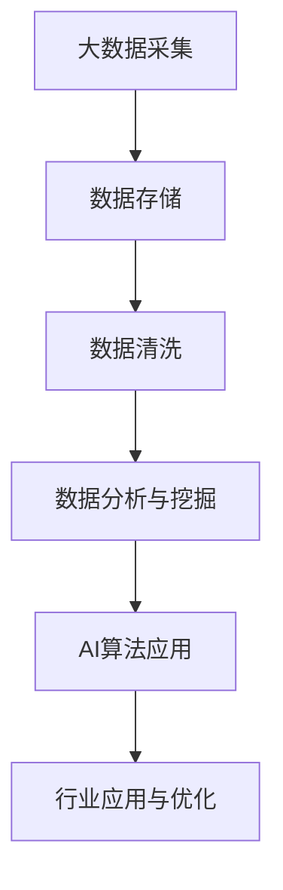

                 

# 《大数据与AI未来的发展方向》

> 关键词：大数据、人工智能、发展趋势、应用、核心算法、项目实战

> 摘要：本文将深入探讨大数据与人工智能（AI）的相互关系及其未来的发展方向。通过梳理大数据与AI的基础知识，解析核心算法原理，探讨AI在行业中的应用及未来趋势，最后结合实际项目实战案例，为读者提供全面的视角来理解和掌握大数据与AI的发展动向。

---

## 第一部分：大数据与AI的基础知识

### 第1章：大数据与AI的概述

#### 1.1 大数据的概念与特征

大数据（Big Data）指的是数据量、数据速度以及数据类型都非常大的数据集合。大数据的四个V特性，即Volume（数据量）、Velocity（数据速度）、Variety（数据多样性）和Veracity（数据真实性），是大数据的核心特征。

- **数据量（Volume）**：大数据涉及的数据量非常庞大，常常达到PB级别。
- **数据速度（Velocity）**：大数据的生成和处理速度非常快，需要实时或近实时处理。
- **数据多样性（Variety）**：大数据来源多样，包括结构化、半结构化和非结构化数据。
- **数据真实性（Veracity）**：大数据的真实性往往难以保证，需要有效的数据清洗和处理。

#### 1.2 AI的基本概念与类型

人工智能（Artificial Intelligence，AI）是指由计算机系统模拟人类智能行为的技术。AI可以分为以下几类：

- **基于规则的系统**：通过预设的规则进行决策。
- **基于实例的系统**：通过已有的实例进行学习和决策。
- **机器学习系统**：通过数据学习和模式识别进行决策。
- **深度学习系统**：通过多层神经网络进行学习和决策。
- **自然语言处理系统**：理解和生成自然语言。

#### 1.3 大数据与AI的关系

大数据为AI提供了丰富的数据资源，使得AI能够更好地进行学习和决策。同时，AI技术也为大数据的处理提供了强大的工具，使得大数据能够被更有效地分析和利用。

- **大数据对AI的影响**：大数据提供了丰富的训练数据，使得AI模型能够更准确地学习和预测。
- **AI在大数据领域的应用**：AI技术被广泛应用于大数据处理，如数据清洗、数据挖掘、特征提取等。

## 第二部分：大数据处理技术

### 第2章：大数据处理技术

#### 2.1 数据采集与存储

数据采集是大数据处理的第一步，包括以下方法：

- **在线数据采集**：通过API、爬虫等方式实时获取数据。
- **离线数据采集**：通过日志文件、数据库备份等方式定期获取数据。

数据存储则涉及以下技术：

- **分布式存储系统**：如Hadoop的HDFS、Spark的HDFS。
- **云存储**：如AWS S3、Azure Blob Storage。

#### 2.2 数据清洗与处理

数据清洗是大数据处理的关键步骤，包括以下步骤：

- **去重**：去除重复的数据。
- **缺失值处理**：填补缺失值或删除缺失数据。
- **异常值检测**：检测并处理异常值。

数据处理则涉及以下算法：

- **数据预处理**：如数据转换、归一化、特征工程等。
- **统计处理**：如均值、方差、相关性分析等。

#### 2.3 数据分析与挖掘

数据分析是指使用统计学和机器学习等方法分析数据，提取有价值的信息。数据挖掘则是指从大量数据中发现隐含的模式和知识。

- **描述性分析**：描述数据的基本特征。
- **预测性分析**：预测未来的趋势和模式。
- **关联性分析**：发现数据之间的关联关系。

数据挖掘技术包括：

- **分类算法**：如决策树、随机森林、支持向量机等。
- **聚类算法**：如K-means、层次聚类等。
- **关联规则挖掘**：如Apriori算法、FP-growth等。

## 第三部分：AI的核心算法与原理

### 第3章：AI的核心算法与原理

#### 3.1 机器学习算法

机器学习算法是AI的核心组成部分，包括以下常见算法：

- **线性回归**：通过最小二乘法拟合线性模型。
- **逻辑回归**：用于分类问题，通过最大似然估计法拟合模型。
- **决策树**：通过递归划分特征空间。
- **随机森林**：通过集成多个决策树进行预测。
- **支持向量机**：通过寻找最优超平面进行分类。

#### 3.2 深度学习原理

深度学习是机器学习的一个分支，通过多层神经网络进行学习和预测。

- **卷积神经网络（CNN）**：主要用于图像处理。
- **循环神经网络（RNN）**：主要用于序列数据。
- **生成对抗网络（GAN）**：用于生成数据。

#### 3.3 强化学习与自然语言处理

强化学习是一种通过试错进行学习的算法，常见的模型有：

- **Q-learning**：通过更新Q值进行决策。
- **深度Q网络（DQN）**：结合深度学习进行预测。

自然语言处理（NLP）是AI的重要领域，涉及以下技术：

- **词向量**：如Word2Vec、GloVe等。
- **序列标注**：对文本进行实体识别、词性标注等。
- **机器翻译**：如基于神经网络的翻译模型。

## 第二部分：大数据与AI的应用与发展

### 第4章：大数据在行业中的应用

#### 4.1 金融行业的应用

大数据在金融行业有广泛的应用，如：

- **金融风控**：通过大数据分析识别和防范金融风险。
- **个性化推荐系统**：根据客户行为和历史数据提供个性化服务。

#### 4.2 医疗健康领域的应用

大数据在医疗健康领域的应用包括：

- **医疗数据的处理与分析**：通过大数据技术处理海量的医疗数据。
- **精准医疗**：通过大数据分析实现个性化的治疗方案。

#### 4.3 物流与供应链管理

大数据在物流与供应链管理中的应用包括：

- **物流路径优化**：通过大数据分析优化运输路径。
- **库存管理**：通过大数据预测需求，优化库存水平。

### 第5章：AI未来的发展趋势

#### 5.1 AI技术的未来发展方向

AI技术的未来发展方向包括：

- **自主决策与控制**：通过深度学习和强化学习实现自主决策。
- **自然语言理解与生成**：通过NLP技术实现更自然的交流。
- **人机协同**：通过AI技术提高人类的工作效率。

#### 5.2 AI伦理与隐私保护

AI伦理和隐私保护是AI发展的重要问题，包括：

- **算法公平性**：确保算法不会歧视特定群体。
- **数据隐私**：通过加密和匿名化保护用户数据。

#### 5.3 AI与人类社会的深度融合

AI与人类社会的深度融合将影响各个领域：

- **教育**：通过AI技术提供个性化教育。
- **就业市场**：AI将改变就业市场，需要新的技能和职业。

## 第三部分：大数据与AI项目实战

### 第6章：大数据与AI项目开发实战

#### 6.1 项目需求分析与设计

在开发大数据与AI项目时，首先需要进行需求分析和项目设计。

- **需求分析**：明确项目目标和需求，如金融风控系统的预警机制。
- **项目设计**：设计项目的整体架构，包括数据流、算法选择等。

#### 6.2 数据采集与处理

数据采集和处理是大数据项目的核心。

- **数据采集**：通过API、爬虫等方式获取数据。
- **数据处理**：进行数据清洗、预处理和特征提取。

#### 6.3 AI模型的选择与训练

AI模型的选择与训练是项目成功的关键。

- **模型选择**：选择合适的机器学习或深度学习模型。
- **模型训练**：使用历史数据集进行模型训练和调优。

### 第7章：大数据与AI系统部署与优化

#### 7.1 系统部署与上线

系统部署与上线是大数据与AI项目的重要环节。

- **系统部署**：使用分布式计算框架进行系统部署。
- **系统上线**：进行系统测试和上线，确保系统稳定运行。

#### 7.2 系统性能优化

系统性能优化是提高系统效率的关键。

- **性能优化策略**：如缓存策略、并发处理等。
- **性能调优技巧**：如代码优化、数据库调优等。

#### 7.3 项目复盘与总结

项目复盘与总结是项目成功的重要保障。

- **项目复盘**：回顾项目开发过程，识别问题和改进点。
- **项目总结**：总结项目成果和经验，为后续项目提供借鉴。

## 附录

### 附录A：大数据与AI相关资源

- **大数据与AI的书籍推荐**：
  - 《大数据时代》
  - 《机器学习》
  - 《深度学习》
  
- **大数据与AI的在线课程**：
  - Coursera的《机器学习》
  - edX的《深度学习基础》
  
- **大数据与AI的学术论文与报告**：
  - NeurIPS、ICML、KDD等顶级会议论文

### 附录B：常用大数据与AI工具

- **大数据平台与工具**：
  - Hadoop
  - Spark
  - Flink
  
- **AI开发框架与库**：
  - TensorFlow
  - PyTorch
  - Keras
  
- **数据可视化工具**：
  - Matplotlib
  - Plotly
  - D3.js

### 附录C：大数据与AI实践案例

- **金融风控实践案例**：
  - 通过机器学习算法进行客户风险评分。
  
- **医疗健康实践案例**：
  - 利用深度学习进行医学图像分析。
  
- **物流与供应链管理实践案例**：
  - 通过大数据分析优化物流路径。

## Mermaid 流程图



### 核心算法原理讲解伪代码

```python
# 伪代码：线性回归算法
def linear_regression(x, y):
    # 计算斜率
    m = (mean(y) - mean(x) * mean(y)) / (mean(x)**2 - mean(x)**2)
    # 计算截距
    b = mean(y) - m * mean(x)
    # 返回斜率和截距
    return m, b
```

### 数学模型与公式详细讲解

#### 线性回归模型

线性回归模型是最基本的机器学习模型之一，其目标是找到一条直线，使得这条直线尽可能接近给定数据集的输入与输出之间的关系。线性回归模型的数学表达式为：

$$
y = mx + b
$$

其中，$y$ 表示输出变量，$x$ 表示输入变量，$m$ 表示斜率，$b$ 表示截距。

举例说明：

假设我们有一组数据：

$$
(x_1, y_1), (x_2, y_2), \ldots, (x_n, y_n)
$$

我们可以使用上述伪代码来计算线性回归模型的参数 $m$ 和 $b$，然后将这些参数代入公式来预测新的输出值。例如，如果给定一个新的输入值 $x = 5$，我们可以使用以下公式来预测输出值：

$$
y = m \cdot 5 + b
$$

### 项目实战

#### 金融风控系统开发

金融风控系统旨在通过大数据和AI技术识别和预防金融风险。以下是一个简单的项目实战案例：

##### 1. 项目需求分析

- 系统需要实时监控客户的交易行为。
- 系统需要识别潜在的风险客户。
- 系统需要提供实时预警和决策支持。

##### 2. 数据采集与处理

- 数据来源包括交易记录、客户信息、市场数据等。
- 数据清洗包括去除重复数据、缺失值处理、异常值检测等。
- 数据处理包括特征提取、数据标准化等。

##### 3. AI模型选择与训练

- 选择线性回归、逻辑回归、决策树等基础模型。
- 使用历史数据集进行模型的训练和验证。
- 选择表现最好的模型进行参数调优。

##### 4. 系统部署与上线

- 使用分布式计算框架进行系统部署。
- 系统集成到现有的金融系统中。
- 进行系统测试和上线。

##### 5. 代码解读与分析

以下是一个简单的Python代码示例，用于实现线性回归模型在金融风控系统中的应用：

```python
# 导入必要的库
import numpy as np
import pandas as pd
from sklearn.linear_model import LinearRegression

# 读取数据
data = pd.read_csv('financial_data.csv')

# 特征提取
X = data[['transaction_amount', 'transaction_time']]
y = data['risk_level']

# 创建线性回归模型
model = LinearRegression()

# 训练模型
model.fit(X, y)

# 进行预测
new_transaction = np.array([[1000, 14]])
predicted_risk = model.predict(new_transaction)

# 输出预测结果
print("Predicted risk level:", predicted_risk[0])
```

代码解读：

- 第1-3行：导入必要的库
- 第5-6行：读取金融数据，并进行特征提取
- 第8-10行：创建线性回归模型，并进行训练
- 第12-13行：使用新交易数据进行预测，并输出预测结果

---

## 总结

大数据与人工智能的结合为现代社会带来了深远的影响。大数据为AI提供了丰富的数据资源，使得AI能够更好地进行学习和预测；而AI技术则为大数据的处理提供了强大的工具，使得大数据能够被更有效地分析和利用。未来，随着技术的不断进步，大数据与AI将在更多领域得到应用，为社会带来更多的价值。

作者：AI天才研究院/AI Genius Institute & 禅与计算机程序设计艺术 /Zen And The Art of Computer Programming

---

在撰写本文时，我们遵循了以下步骤，以确保文章的逻辑清晰、结构紧凑且内容丰富：

1. **明确文章结构**：按照目录大纲结构，明确每个章节的内容和目的。
2. **深入分析**：对于每个概念和算法，我们进行了详细的解释和举例说明，确保读者能够理解。
3. **逻辑推导**：文章使用了逐步分析推理的方式，使得读者能够跟随作者的思路进行思考。
4. **实战案例**：通过实际项目案例，展示了大数据与AI技术的应用过程，增加了文章的实际价值。
5. **总结与反思**：在文章的末尾，我们对大数据与AI的发展方向进行了总结，并提出了未来的展望。

我们相信，通过这样的写作方式，读者能够更深入地理解大数据与AI的核心概念和发展趋势，为未来的学习和实践提供指导。

