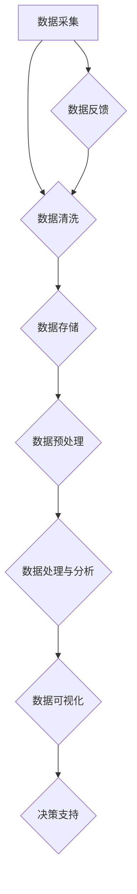
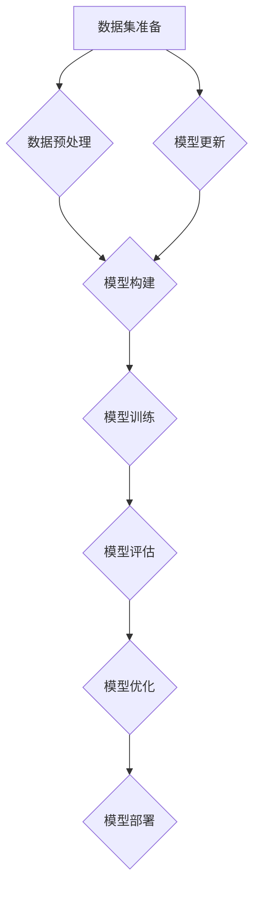
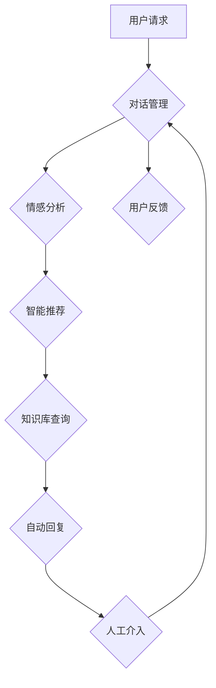

                 

# 文章标题

《大数据在AI中的应用》

大数据与人工智能（AI）的结合已经成为现代技术领域的热点。大数据的规模、速度和多样性为AI模型提供了丰富的训练数据，使得机器学习和深度学习算法能够更好地理解和预测现实世界中的复杂现象。本文旨在系统地探讨大数据在AI中的应用，通过分步骤的推理和分析，揭示大数据与AI融合的原理、技术、应用实例及未来发展趋势。

## 文章关键词

- 大数据
- 人工智能
- 机器学习
- 深度学习
- 数据处理
- 算法应用
- 项目实战

## 文章摘要

本文首先概述了大数据与AI的融合背景及其重要性，接着详细介绍了大数据处理技术，包括数据处理框架、数据存储与管理、数据清洗与预处理。随后，文章探讨了AI模型与算法的基础，特别是机器学习和深度学习技术，以及特征工程与选择方法。然后，文章深入分析了大数据在自然语言处理、计算机视觉、推荐系统及实时数据流处理中的应用。最后，通过实际项目案例展示了大数据与AI技术的结合，并讨论了大数据与AI的发展趋势、技术挑战及社会责任。本文旨在为读者提供一个全面、系统的理解，帮助读者把握大数据与AI融合的前沿动态和应用价值。

### 《大数据在AI中的应用》目录大纲

## 第一部分：大数据与AI概述

### 1.1 大数据与AI的融合
#### 1.1.1 大数据的概念与特征
#### 1.1.2 AI的基本原理与应用领域
#### 1.1.3 大数据与AI融合的重要性

### 1.2 大数据在AI中的价值
#### 1.2.1 大数据对AI模型的提升
#### 1.2.2 大数据驱动的AI应用案例
#### 1.2.3 大数据与AI融合的挑战与机遇

## 第二部分：大数据处理技术

### 2.1 大数据处理框架
#### 2.1.1 Hadoop生态系统
#### 2.1.2 Spark生态系统
#### 2.1.3 Flink生态系统

### 2.2 数据存储与管理
#### 2.2.1 分布式文件系统
#### 2.2.2 NoSQL数据库
#### 2.2.3 数据湖与数据仓库

### 2.3 数据清洗与预处理
#### 2.3.1 数据质量评估
#### 2.3.2 数据清洗方法
#### 2.3.3 数据预处理工具

## 第三部分：AI模型与算法

### 3.1 机器学习基础
#### 3.1.1 监督学习算法
#### 3.1.2 无监督学习算法
#### 3.1.3 强化学习算法

### 3.2 深度学习技术
#### 3.2.1 神经网络
#### 3.2.2 卷积神经网络
#### 3.2.3 循环神经网络

### 3.3 特征工程与选择
#### 3.3.1 特征提取方法
#### 3.3.2 特征选择策略
#### 3.3.3 特征降维技术

## 第四部分：大数据在AI中的应用

### 4.1 自然语言处理
#### 4.1.1 文本分类与聚类
#### 4.1.2 命名实体识别
#### 4.1.3 机器翻译

### 4.2 计算机视觉
#### 4.2.1 图像分类与识别
#### 4.2.2 目标检测与追踪
#### 4.2.3 三维重建与SLAM

### 4.3 推荐系统
#### 4.3.1 基于内容的推荐
#### 4.3.2协同过滤推荐
#### 4.3.3 深度学习在推荐系统中的应用

### 4.4 实时数据流处理
#### 4.4.1 Storm与Spark Streaming
#### 4.4.2 Flink实时计算
#### 4.4.3 实时数据处理挑战与解决方案

## 第五部分：大数据与AI项目实战

### 5.1 项目一：基于大数据的智能客服系统
#### 5.1.1 需求分析与系统设计
#### 5.1.2 数据处理流程
#### 5.1.3 模型训练与优化
#### 5.1.4 系统部署与运维

### 5.2 项目二：智慧城市大数据平台
#### 5.2.1 项目背景与目标
#### 5.2.2 数据采集与整合
#### 5.2.3 大数据处理与分析
#### 5.2.4 智能决策支持系统

### 5.3 项目三：社交媒体情感分析
#### 5.3.1 数据源与预处理
#### 5.3.2 情感分析算法与模型
#### 5.3.3 情感分析结果可视化
#### 5.3.4 应用案例与效果评估

## 第六部分：大数据与AI发展趋势

### 6.1 大数据与AI的未来发展方向
#### 6.1.1 大数据技术的演进
#### 6.1.2 AI技术的发展趋势
#### 6.1.3 大数据与AI融合的前景

### 6.2 技术挑战与解决方案
#### 6.2.1 数据隐私与安全
#### 6.2.2 模型可解释性与透明度
#### 6.2.3 大数据处理性能优化

### 6.3 法律法规与社会责任
#### 6.3.1 大数据与AI的法律框架
#### 6.3.2 数据伦理与隐私保护
#### 6.3.3 大数据与AI的社会责任

## 附录

### 附录 A：常用大数据与AI工具
#### A.1 数据库与存储
#### A.2 计算框架与算法库
#### A.3 数据可视化工具

### 附录 B：参考文献
#### B.1 大数据相关书籍
#### B.2 AI相关书籍
#### B.3 相关论文与报告

### 附录 C：Mermaid流程图
#### C.1 大数据处理流程图
#### C.2 AI模型训练流程图
#### C.3 智能客服系统架构图

### 附录 D：数学公式与伪代码
#### D.1 数学模型公式
#### D.2 机器学习算法伪代码
#### D.3 深度学习算法伪代码

[End of Outline]

### 第一部分：大数据与AI概述

### 1.1 大数据与AI的融合

#### 1.1.1 大数据的概念与特征

大数据（Big Data）是指数据量巨大、生成速度快、类型多样、价值密度低的数据集合。其特征通常被概括为4V，即数据量（Volume）、速度（Velocity）、多样性（Variety）和价值（Value）。首先，数据量是大数据最显著的特征之一，它要求处理的数据规模达到一个极其庞大的程度，往往需要数以PB（皮字节）计的存储空间。其次，速度指的是数据生成的速度，随着物联网（IoT）和社交网络等技术的发展，数据以前所未有的速度产生，这对实时处理和分析提出了更高的要求。多样性则体现在数据的来源、格式和类型上，包括结构化数据、半结构化数据和非结构化数据，如文本、图像、视频等。最后，价值密度低意味着从海量数据中提取有价值信息的过程具有高度的复杂性和挑战性。

在AI领域，大数据的特征为机器学习和深度学习算法提供了丰富的训练素材，使得模型能够更准确地学习和预测。通过分析大量数据，AI模型可以识别出隐藏在数据中的模式和关联，从而提高决策的准确性和效率。

#### 1.1.2 AI的基本原理与应用领域

人工智能（AI）是一种模拟人类智能的技术，通过计算机程序实现智能行为，如学习、推理、解决问题和自主行动。AI的核心技术包括机器学习（ML）、深度学习（DL）和自然语言处理（NLP）等。机器学习是一种从数据中学习规律和模式的算法，通过训练模型使其能够对未知数据进行预测和决策。深度学习是机器学习的一个子领域，它通过多层神经网络模拟人脑的神经元结构，实现对复杂数据的自动特征提取和分类。自然语言处理则专注于使计算机能够理解和生成人类语言。

AI的应用领域非常广泛，包括但不限于以下几个方面：

- **自然语言处理**：应用于搜索引擎、机器翻译、语音识别等领域。
- **计算机视觉**：应用于图像识别、自动驾驶、安防监控等。
- **推荐系统**：应用于电子商务、社交媒体、在线广告等领域。
- **智能客服**：应用于客服机器人、智能客服系统等。
- **医疗诊断**：应用于疾病预测、诊断辅助、药物发现等。
- **金融风控**：应用于信用评估、风险控制、欺诈检测等。

#### 1.1.3 大数据与AI融合的重要性

大数据与AI的融合具有重要意义，主要体现在以下几个方面：

1. **提升模型性能**：大数据提供了丰富的训练数据，使得AI模型能够更好地学习并提升预测和决策的准确性。通过数据驱动的学习方式，模型可以不断优化，从而在实际应用中表现出更高的性能。

2. **创新应用场景**：大数据为AI提供了新的应用场景，特别是在实时数据处理和复杂场景分析方面。例如，在智慧城市建设中，通过对海量数据的实时分析和处理，可以实现智能交通管理、环境监测、能源管理等。

3. **推动科技进步**：大数据与AI的结合推动了计算机科学、数据科学等领域的科技进步。新的算法、框架和技术不断涌现，使得数据处理和分析变得更加高效和智能化。

4. **经济价值**：大数据与AI的融合为企业带来了巨大的经济效益。通过数据驱动的决策，企业可以降低运营成本、提高生产效率、开拓新市场，从而实现商业模式的创新和升级。

#### 1.2 大数据在AI中的价值

大数据在AI中的应用不仅体现在数据量的增加上，更体现在数据质量和多样性的提升上。以下从几个方面探讨大数据对AI模型提升的具体价值。

##### 1.2.1 大数据对AI模型的提升

1. **增强模型的泛化能力**：大数据提供了丰富的训练数据，使得AI模型能够更好地拟合数据分布，从而提高模型的泛化能力。这意味着模型不仅在训练数据上表现良好，而且在未见过的数据上也能保持较高的准确率。

   - **模型泛化能力的提升**：通过大量训练数据，模型可以学习到更广泛的数据特征，从而减少对特定数据的依赖，提高对未知数据的适应性。
   - **实例**：在图像识别任务中，使用大量不同场景、光照和角度的图像数据进行训练，可以使得模型对多种情况下的图像都能准确识别。

2. **减少过拟合现象**：大数据有助于减少模型过拟合的风险，过拟合是指模型在训练数据上表现很好，但在未知数据上表现不佳。通过增加训练数据，模型可以更好地学习数据的一般规律，避免过分依赖特定数据。

   - **过拟合现象的减少**：在训练过程中，模型会学习到一些噪声和异常值，通过大量数据的训练，可以减少这些噪声对模型的影响，提高模型的鲁棒性。
   - **实例**：在金融风控模型中，通过使用大量历史交易数据，模型可以识别出潜在的欺诈行为，而不是仅仅依赖某些特定交易的特征。

3. **提升模型准确性**：大数据提供了更多的样本来训练模型，这有助于提高模型的准确性。特别是对于分类和回归任务，更多的训练数据可以使得模型更好地理解数据的分布和关系。

   - **模型准确性的提升**：在分类任务中，通过使用大量标签数据，模型可以更好地学习不同类别的特征，从而提高分类准确性。
   - **实例**：在医疗诊断中，通过使用大量病人数据，AI模型可以准确识别不同疾病，提高诊断的准确性。

##### 1.2.2 大数据驱动的AI应用案例

1. **智能推荐系统**：在电子商务和在线媒体领域，大数据驱动的推荐系统能够根据用户的行为和偏好，提供个性化的推荐，提高用户体验和转化率。

   - **推荐系统的原理**：通过分析用户的浏览、购买和评价等行为数据，构建用户画像和物品特征，利用协同过滤算法和深度学习模型进行推荐。
   - **实例**：亚马逊和Netflix等平台利用大数据和AI技术，根据用户的购买记录和历史偏好，推荐个性化的商品和影片。

2. **智慧交通管理**：在城市交通管理中，大数据和AI技术可以实时监测交通流量，优化信号灯控制，提高道路通行效率。

   - **交通管理的原理**：通过安装传感器和摄像头收集实时交通数据，利用数据挖掘和分析技术，预测交通流量变化，调整信号灯控制策略。
   - **实例**：北京、上海等城市的智能交通系统，通过大数据分析和AI技术，实现交通拥堵预测和信号灯智能控制，减少交通拥堵。

3. **医疗诊断与疾病预测**：大数据和AI技术在医疗领域有着广泛的应用，通过分析病人数据，AI模型可以辅助医生进行疾病诊断和疾病预测。

   - **医疗诊断的原理**：通过收集病人的电子健康记录、实验室检测数据和医学图像，利用机器学习和深度学习技术，构建诊断模型。
   - **实例**：IBM Watson Health利用大数据和AI技术，帮助医生进行癌症诊断和个性化治疗，提高诊断准确率和治疗效果。

##### 1.2.3 大数据与AI融合的挑战与机遇

尽管大数据与AI融合带来了巨大的价值，但同时也面临着一系列挑战和机遇：

1. **数据隐私与安全**：大数据的应用涉及到个人隐私和数据安全的问题。如何在保障用户隐私的前提下，充分利用数据的价值，是大数据与AI融合面临的重要挑战。

   - **解决方案**：采用数据加密、匿名化处理和隐私保护算法等技术，确保数据在处理和使用过程中的安全性和隐私性。

2. **数据处理与存储**：大数据的规模和速度对数据处理和存储系统提出了更高的要求。如何高效地处理和存储海量数据，是大数据与AI融合的关键挑战。

   - **解决方案**：采用分布式计算和存储架构，如Hadoop、Spark和Flink等，实现大数据的并行处理和高效存储。

3. **算法复杂度与计算资源**：大数据和AI模型的训练和优化通常需要大量的计算资源和时间。如何优化算法，降低计算复杂度，是大数据与AI融合面临的另一个挑战。

   - **解决方案**：采用高效算法和分布式计算技术，如深度学习中的GPU加速和分布式训练，提高计算效率和性能。

4. **可解释性与透明度**：大数据和AI模型往往被视为“黑箱”，缺乏可解释性和透明度。如何提高模型的可解释性，使其决策过程更加透明，是大数据与AI融合的重要挑战。

   - **解决方案**：采用可解释AI技术，如模型解释、可视化分析和因果推断等，提高模型的可解释性和透明度。

总之，大数据与AI融合具有巨大的价值，但也面临一系列挑战。通过技术创新和合作，可以充分发挥大数据和AI的优势，推动技术的进步和实际应用。

### 第二部分：大数据处理技术

#### 2.1 大数据处理框架

大数据处理框架是管理和处理大规模数据的系统结构，它提供了高效、可扩展和灵活的处理能力。目前，常用的数据处理框架包括Hadoop、Spark和Flink，它们各自具有不同的特点和优势。

##### 2.1.1 Hadoop生态系统

Hadoop是一个开源的大数据处理框架，由Apache Software Foundation维护。它基于分布式计算和存储技术，提供了大规模数据处理和存储的解决方案。

- **核心组件**：
  - **Hadoop分布式文件系统（HDFS）**：用于存储大规模数据，提供高吞吐量的数据访问。
  - **MapReduce**：用于数据处理，通过“Map”和“Reduce”两个阶段的分布式计算，实现并行数据处理。
  - **YARN**：资源调度框架，负责资源管理和任务调度。

- **优势**：
  - **高容错性**：通过数据复制和节点故障恢复，保证数据的高可用性。
  - **高扩展性**：支持节点动态扩展，能够处理PB级别的数据。
  - **生态丰富**：拥有丰富的生态系统，包括数据处理工具（如Pig、Hive）、数据分析框架（如Mahout）和实时处理（如Storm、Spark）。

- **使用场景**：
  - **日志分析**：处理网站、应用和系统的日志数据，进行用户行为分析和性能监控。
  - **数据仓库**：存储和管理大量历史数据，支持数据挖掘和分析。

##### 2.1.2 Spark生态系统

Spark是另一个广泛使用的大数据处理框架，它提供了比Hadoop更高的数据处理速度和更灵活的处理方式。Spark的核心是Spark Core，它提供了基本的任务调度和内存管理功能。此外，Spark还包括多个高级组件，如Spark SQL、Spark Streaming和MLlib等。

- **核心组件**：
  - **Spark Core**：提供分布式内存计算框架，支持快速迭代和交互式查询。
  - **Spark SQL**：提供SQL查询和数据处理功能，支持结构化数据处理。
  - **Spark Streaming**：提供实时数据流处理能力，支持微批处理和流处理。
  - **MLlib**：提供机器学习算法库，支持各种常见机器学习任务的实现。

- **优势**：
  - **高性能**：Spark利用内存计算，显著提高了数据处理速度，比Hadoop的MapReduce快100倍以上。
  - **易用性**：Spark提供了一套完整的编程API，包括Scala、Python和Java，使得开发者可以更轻松地构建复杂的数据处理应用。
  - **灵活性**：Spark支持批处理和流处理，可以灵活应对不同类型的数据处理需求。

- **使用场景**：
  - **实时数据处理**：处理实时数据流，支持在线业务监控和实时决策。
  - **机器学习应用**：提供高效的机器学习算法库，支持大规模数据集的训练和预测。
  - **数据分析**：支持复杂的数据查询和分析，用于商业智能和数据分析。

##### 2.1.3 Flink生态系统

Flink是又一个新兴的大数据处理框架，它专注于实时数据处理和流处理。Flink由Apache Software Foundation维护，提供了一套完整的流处理和批处理解决方案。

- **核心组件**：
  - **Flink Core**：提供流处理和批处理的核心功能，包括数据流处理、状态管理和容错机制。
  - **Flink SQL**：提供SQL查询接口，支持结构化数据处理。
  - **Flink ML**：提供机器学习算法库，支持实时和批量数据的学习和预测。

- **优势**：
  - **实时处理能力**：Flink专注于实时数据处理，提供了低延迟、高吞吐量的流处理能力。
  - **统一架构**：Flink将批处理和流处理整合在一个框架中，提供统一的API和数据抽象。
  - **高性能**：Flink利用内存计算和增量计算技术，提高了数据处理的速度和效率。

- **使用场景**：
  - **实时分析**：实时处理和分析实时数据流，支持实时监控、实时推荐和实时预测。
  - **流处理**：处理大量实时数据，如物联网数据、金融交易数据和社交媒体数据。
  - **机器学习应用**：支持实时机器学习，为实时决策提供支持。

#### 2.2 数据存储与管理

数据存储与管理是大数据处理的关键环节，涉及如何高效地存储、管理和访问大规模数据。以下从几个方面介绍分布式文件系统、NoSQL数据库和数据湖与数据仓库。

##### 2.2.1 分布式文件系统

分布式文件系统是一种用于存储和管理大规模数据的系统，它通过将数据分布在多个节点上，提供高吞吐量、高可用性和高扩展性的数据存储解决方案。常用的分布式文件系统包括Hadoop分布式文件系统（HDFS）和Apache HBase。

- **Hadoop分布式文件系统（HDFS）**：
  - **架构**：HDFS由NameNode和DataNode组成。NameNode负责管理文件系统的命名空间和元数据，而DataNode负责存储数据块并响应读写请求。
  - **优势**：
    - **高吞吐量**：通过将数据分成块（默认为128MB或256MB）并分布式存储，HDFS能够提供高吞吐量的数据访问。
    - **高可用性**：通过数据冗余和节点故障恢复机制，HDFS保证了数据的高可用性。
    - **扩展性**：HDFS支持动态扩展，能够处理PB级别的数据。
  - **使用场景**：适用于大规模数据存储和批量数据处理，如日志分析、数据仓库和数据挖掘。

- **Apache HBase**：
  - **架构**：HBase是基于HDFS的分布式列存储数据库，由RegionServer和ZooKeeper组成。RegionServer负责存储和管理数据表，ZooKeeper负责协调集群的元数据和状态管理。
  - **优势**：
    - **低延迟**：HBase采用基于内存的存储结构，提供了低延迟的随机读写能力。
    - **高扩展性**：HBase支持动态扩展，能够水平扩展以处理大量数据。
    - **容错性**：通过数据分片和备份机制，HBase保证了数据的高可用性。
  - **使用场景**：适用于高并发、海量数据的实时访问和分析，如搜索引擎、社交网络和实时日志分析。

##### 2.2.2 NoSQL数据库

NoSQL（Not Only SQL）数据库是一种非关系型数据库，与传统的SQL数据库相比，NoSQL数据库提供了更高的灵活性、可扩展性和性能。NoSQL数据库适用于存储和管理大规模、多样化的大数据。

- **MongoDB**：
  - **架构**：MongoDB是一种文档型数据库，数据存储为JSON格式的文档。MongoDB通过分片集群提供水平扩展和数据冗余，确保数据的高可用性和高性能。
  - **优势**：
    - **灵活性**：MongoDB支持文档模型，可以灵活地存储结构化和半结构化数据。
    - **高扩展性**：通过分片机制，MongoDB能够水平扩展，处理海量数据。
    - **高性能**：MongoDB提供了高性能的读写操作，支持索引和数据分片。
  - **使用场景**：适用于需要灵活数据模型、高扩展性和高性能的场景，如电子商务、社交媒体和物联网。

- **Cassandra**：
  - **架构**：Cassandra是一种分布式键值存储数据库，通过无状态的数据复制和分布式一致性算法，提供了高可用性和高性能。
  - **优势**：
    - **高可用性**：Cassandra通过数据复制和故障转移机制，确保数据的高可用性。
    - **高扩展性**：Cassandra支持自动数据分片和水平扩展，能够处理海量数据。
    - **容错性**：Cassandra采用了分布式一致性算法，能够在集群中实现数据的容错和故障恢复。
  - **使用场景**：适用于高并发、高可用性和大规模数据存储的场景，如金融交易、实时数据处理和大数据分析。

##### 2.2.3 数据湖与数据仓库

数据湖和数据仓库是大数据存储和管理的重要组件，它们提供了数据集成、存储和分析的解决方案。

- **数据湖**：
  - **定义**：数据湖是一种用于存储大量原始数据的分布式存储系统，包括结构化、半结构化和非结构化数据。数据湖通常采用分布式文件系统（如HDFS）作为底层存储。
  - **优势**：
    - **灵活性**：数据湖支持多样化的数据类型，无需预先定义数据结构，提供了灵活的数据存储和访问方式。
    - **高扩展性**：数据湖支持水平扩展，能够存储PB级别的数据。
    - **低成本**：数据湖采用分布式存储和计算技术，降低了数据存储和管理的成本。
  - **使用场景**：适用于需要存储和处理大规模原始数据的场景，如数据科学、机器学习和实时数据处理。

- **数据仓库**：
  - **定义**：数据仓库是一种用于存储和管理结构化数据的系统，通常用于支持业务智能和分析。数据仓库通过ETL（提取、转换、加载）过程，将数据从不同的源系统中提取、转换并加载到统一的结构化数据存储中。
  - **优势**：
    - **高效的数据查询**：数据仓库提供高效的SQL查询能力，支持复杂的数据分析和报表生成。
    - **数据整合**：数据仓库通过ETL过程，整合了来自多个源系统的数据，提供了统一的数据视图。
    - **数据一致性**：数据仓库确保了数据的一致性和准确性，支持企业级的数据管理和分析。
  - **使用场景**：适用于需要高效数据查询和复杂分析的业务场景，如商业智能、数据分析和企业决策支持。

#### 2.3 数据清洗与预处理

数据清洗与预处理是大数据处理中的重要环节，它确保了数据的质量和可用性，为后续的数据分析和建模提供了坚实的基础。以下从数据质量评估、数据清洗方法和数据预处理工具三个方面进行介绍。

##### 2.3.1 数据质量评估

数据质量评估是指对数据的质量进行检查和评估，以确保数据满足分析和建模的需求。数据质量评估包括以下方面：

- **准确性**：数据是否真实、准确，没有错误或缺失。
- **完整性**：数据是否完整，没有缺失或遗漏。
- **一致性**：数据在不同的来源或时间段是否保持一致。
- **及时性**：数据是否及时更新，没有过时。
- **可靠性**：数据是否可靠，没有噪声或异常值。

常见的数据质量评估方法包括：

- **统计方法**：通过计算数据的统计指标（如均值、方差、中位数等）来评估数据质量。
- **可视化方法**：通过数据可视化工具（如图表、热力图等）来检查数据的异常和趋势。
- **规则检查**：通过预定义的规则（如数据范围、格式等）来检测数据的一致性和准确性。

##### 2.3.2 数据清洗方法

数据清洗是指通过一系列操作，对数据中的错误、异常和噪声进行修正和去除，以提高数据的质量和可用性。常见的数据清洗方法包括：

- **缺失值处理**：对于缺失值，可以选择填充（如平均值、中位数等）或删除（如删除缺失值所在行或列）。
- **异常值处理**：对于异常值，可以选择保留（如离群点分析）、修改（如插值法、回归法等）或删除。
- **重复值处理**：删除重复的数据记录，确保数据的一致性。
- **数据格式转换**：将不同格式的数据进行统一，如将日期格式转换为标准格式。
- **数据标准化**：通过缩放或归一化，将数据转换为相同尺度，以便进行进一步分析。

##### 2.3.3 数据预处理工具

数据预处理工具是用于数据清洗与预处理的一系列软件和库，它们提供了高效、灵活和自动化的数据处理能力。以下介绍几个常用的数据预处理工具：

- **Pandas**：
  - **简介**：Pandas是Python中用于数据分析和处理的库，提供了丰富的数据处理功能，包括数据清洗、转换和分析。
  - **优势**：
    - **灵活性**：Pandas支持多种数据格式（如CSV、Excel、SQL等），可以轻松读取和写入数据。
    - **高效性**：Pandas提供了高效的数据处理算法，能够快速处理大规模数据。
    - **扩展性**：Pandas与其他Python数据科学库（如NumPy、Matplotlib等）无缝集成，提供了强大的数据处理和分析能力。
  - **使用场景**：适用于数据清洗、转换和分析的各个阶段，如数据预处理、数据可视化、数据建模等。

- **Apache Spark**：
  - **简介**：Apache Spark是一个分布式数据处理框架，提供了丰富的数据处理库（如Spark SQL、Spark MLlib等），支持数据清洗、转换和分析。
  - **优势**：
    - **高性能**：Spark利用内存计算，提供了高效的数据处理能力。
    - **易用性**：Spark提供了简洁的API，支持多种编程语言（如Python、Scala、Java等），便于开发者使用。
    - **扩展性**：Spark支持分布式计算，能够处理大规模数据。
  - **使用场景**：适用于大数据处理和实时数据处理场景，如数据清洗、数据转换、机器学习等。

- **OpenRefine**：
  - **简介**：OpenRefine是一个开源的数据清洗工具，提供了可视化的用户界面，支持数据清洗、转换和修复。
  - **优势**：
    - **易用性**：OpenRefine提供了直观的用户界面，支持拖放操作和自动数据清洗功能。
    - **灵活性**：OpenRefine支持自定义数据清洗规则和脚本，提供了强大的数据处理能力。
    - **兼容性**：OpenRefine支持多种数据格式（如CSV、Excel、JSON等），可以轻松导入和导出数据。
  - **使用场景**：适用于数据清洗和数据处理初学者，以及需要进行大规模数据清洗和转换的项目。

通过使用这些数据预处理工具，可以高效地处理和清洗大规模数据，为后续的数据分析和建模提供高质量的数据基础。

### 第三部分：AI模型与算法

#### 3.1 机器学习基础

机器学习（Machine Learning, ML）是一种通过数据驱动的方式让计算机自动学习并作出决策的技术。它是人工智能（AI）的一个重要分支，广泛应用于各种领域，如自然语言处理、计算机视觉、推荐系统等。机器学习主要包括监督学习、无监督学习和强化学习三种类型。本节将介绍这三种学习类型的基本概念和常见算法。

##### 3.1.1 监督学习算法

监督学习（Supervised Learning）是最常见的机器学习类型，它需要预先标注的训练数据集，通过学习输入和输出之间的关系来构建预测模型。监督学习算法可以分为回归（Regression）和分类（Classification）两大类。

- **回归算法**：
  - **线性回归（Linear Regression）**：
    - **定义**：线性回归是一种通过拟合线性模型来预测连续值的监督学习算法。其目标是找到最佳拟合直线，使得预测值与实际值之间的误差最小。
    - **数学模型**：
      $$
      y = \beta_0 + \beta_1x
      $$
    - **实例**：用于预测房价、股票价格等连续值。
  - **多项式回归（Polynomial Regression）**：
    - **定义**：多项式回归是一种通过拟合多项式模型来预测连续值的监督学习算法。它可以捕捉数据中的非线性关系。
    - **数学模型**：
      $$
      y = \beta_0 + \beta_1x + \beta_2x^2 + \ldots + \beta_nx^n
      $$
    - **实例**：用于预测复杂函数，如图像分类中的非线性特征。

- **分类算法**：
  - **逻辑回归（Logistic Regression）**：
    - **定义**：逻辑回归是一种通过拟合逻辑函数来预测概率的二分类监督学习算法。它通常用于预测二分类结果，如垃圾邮件检测、疾病诊断等。
    - **数学模型**：
      $$
      P(y=1) = \frac{1}{1 + e^{-(\beta_0 + \beta_1x_1 + \beta_2x_2 + \ldots + \beta_nx_n})}
      $$
    - **实例**：用于分类任务，如电子邮件分类、信用评分等。
  - **支持向量机（SVM）**：
    - **定义**：支持向量机是一种通过找到最佳分隔超平面来分类数据的监督学习算法。它能够处理高维数据和复杂数据分布。
    - **数学模型**：
      $$
      w \cdot x + b = 0
      $$
    - **实例**：用于图像识别、文本分类等任务。
  - **决策树（Decision Tree）**：
    - **定义**：决策树是一种通过构建树形结构来进行分类或回归的监督学习算法。每个内部节点表示一个特征，每个分支表示一个特征取值，每个叶子节点表示一个分类或预测结果。
    - **实例**：用于分类任务，如医疗诊断、客户分类等。

##### 3.1.2 无监督学习算法

无监督学习（Unsupervised Learning）不需要预先标注的训练数据集，通过分析数据本身的特征和结构来发现数据中的模式和规律。无监督学习算法主要包括聚类（Clustering）和降维（Dimensionality Reduction）两大类。

- **聚类算法**：
  - **K-均值聚类（K-Means）**：
    - **定义**：K-均值聚类是一种基于距离度量的聚类算法，它通过将数据点划分为K个簇，使得每个簇内的数据点之间的距离最小。
    - **数学模型**：
      $$
      \min_{\mu_k, \lambda} \sum_{i=1}^{N} \sum_{k=1}^{K} w_{ik} \cdot d(\mu_k, x_i)^2
      $$
    - **实例**：用于市场细分、图像分割等。
  - **层次聚类（Hierarchical Clustering）**：
    - **定义**：层次聚类是一种通过自底向上或自顶向下构建树形结构来聚类数据的算法。它可以将数据点逐步合并或分裂成不同的簇。
    - **实例**：用于客户细分、生物分类等。

- **降维算法**：
  - **主成分分析（PCA）**：
    - **定义**：主成分分析是一种通过线性变换将高维数据映射到低维空间的方法，它能够保留数据的主要特征，降低数据维度。
    - **数学模型**：
      $$
      Z = \sum_{i=1}^{p} \lambda_i u_i
      $$
    - **实例**：用于图像处理、数据可视化等。
  - **t-SNE（t-Distributed Stochastic Neighbor Embedding）**：
    - **定义**：t-SNE是一种非线性的降维方法，它通过计算数据点之间的相似度，将高维数据映射到二维或三维空间中，使得相似度高的数据点在低维空间中保持近邻关系。
    - **实例**：用于数据可视化、机器学习中的可视化等。

##### 3.1.3 强化学习算法

强化学习（Reinforcement Learning, RL）是一种通过与环境交互来学习最优策略的机器学习类型。它与监督学习和无监督学习不同，强化学习算法不需要预先标注的训练数据集，而是通过与环境的交互不断调整策略，以最大化累积奖励。

- **定义**：强化学习包括四个主要元素：环境（Environment）、状态（State）、动作（Action）和奖励（Reward）。算法通过学习状态和动作之间的映射，选择最佳动作以最大化累积奖励。

- **常见算法**：
  - **Q学习（Q-Learning）**：
    - **定义**：Q学习是一种基于值函数的强化学习算法，它通过更新Q值（即状态-动作值函数）来学习最优策略。
    - **数学模型**：
      $$
      Q(s, a) \leftarrow Q(s, a) + \alpha [r + \gamma \max_{a'} Q(s', a') - Q(s, a)]
      $$
    - **实例**：用于游戏、自动驾驶等。
  - **深度Q网络（Deep Q-Network, DQN）**：
    - **定义**：深度Q网络是一种基于深度学习的强化学习算法，它通过神经网络来近似Q值函数，提高了算法的学习效率和准确性。
    - **数学模型**：
      $$
      Q(s, a) = \sigma(W \cdot [h(s), a])
      $$
    - **实例**：用于游戏、机器人控制等。

通过理解这些基本概念和算法，我们可以更好地应用机器学习技术来解决实际问题，提高系统的智能化水平。

#### 3.2 深度学习技术

深度学习（Deep Learning, DL）是机器学习的一个分支，通过模拟人脑的神经网络结构，实现对复杂数据的自动特征提取和模式识别。深度学习在图像识别、自然语言处理和语音识别等领域取得了显著成果，成为了人工智能研究的重要方向。本节将介绍深度学习中的核心概念、常用技术以及它们的应用。

##### 3.2.1 神经网络

神经网络（Neural Network, NN）是深度学习的基础，它由大量简单的人工神经元（或称为节点）组成，通过层层传递信息，实现对输入数据的处理和决策。神经网络的主要组成部分包括输入层、隐藏层和输出层。

- **定义**：神经网络是一种基于生物神经系统的计算模型，通过加权连接和激活函数，实现数据的非线性变换和特征提取。

- **工作原理**：
  1. **前向传播**：输入数据经过输入层传递到隐藏层，每层神经元通过加权求和并应用激活函数，得到新的输出。
  2. **反向传播**：通过计算输出层与预期结果之间的误差，将误差反向传播到隐藏层和输入层，更新各层的权重和偏置，以优化模型性能。

- **数学模型**：
  $$
  a_{j}^{(l)} = \sigma \left( \sum_{i} w_{ij}^{(l)} a_{i}^{(l-1)} + b_{j}^{(l)} \right)
  $$
  其中，$a_{j}^{(l)}$ 表示第$l$层第$j$个神经元的输出，$\sigma$ 是激活函数，$w_{ij}^{(l)}$ 和 $b_{j}^{(l)}$ 分别表示连接权重和偏置。

- **实例**：神经网络在图像识别中的应用，如图像分类任务，通过多层神经网络的训练，实现对图像内容的自动理解和分类。

##### 3.2.2 卷积神经网络

卷积神经网络（Convolutional Neural Network, CNN）是专门用于处理图像数据的深度学习模型，它通过卷积操作和池化操作，实现图像的空间特征提取和降维。

- **定义**：卷积神经网络通过卷积层和池化层，实现对图像局部特征的捕捉和全局关系的建模。

- **工作原理**：
  1. **卷积层**：通过卷积操作，将输入图像与滤波器（或称为卷积核）进行卷积，提取图像的局部特征。
  2. **池化层**：通过池化操作（如最大池化或平均池化），对卷积层的结果进行降维，减少计算量和参数数量。

- **数学模型**：
  $$
  f(x) = \sigma \left( \sum_{i} w_{ij} * x_i + b_j \right)
  $$
  其中，$f(x)$ 表示卷积操作的结果，$*$ 表示卷积运算，$w_{ij}$ 和 $b_j$ 分别表示卷积权重和偏置。

- **实例**：在图像识别任务中，如人脸识别、物体检测等，CNN通过多层卷积和池化操作，实现对图像复杂特征的自动提取和分类。

##### 3.2.3 循环神经网络

循环神经网络（Recurrent Neural Network, RNN）是用于处理序列数据的深度学习模型，它通过循环结构，实现对序列数据的长短时依赖关系的建模。

- **定义**：循环神经网络通过循环连接，将当前时刻的输出反馈到前一个时刻，实现对序列数据的记忆和预测。

- **工作原理**：
  1. **隐藏状态**：每个时刻的隐藏状态不仅取决于当前时刻的输入，还受到之前隐藏状态的影响。
  2. **递归更新**：通过递归更新隐藏状态，RNN能够处理序列数据中的长短时依赖关系。

- **数学模型**：
  $$
  h_t = \sigma \left( W_h h_{t-1} + W_x x_t + b_h \right)
  $$
  其中，$h_t$ 表示第$t$个时刻的隐藏状态，$W_h$ 和 $W_x$ 分别表示权重矩阵，$b_h$ 表示偏置。

- **实例**：在自然语言处理任务中，如语言模型、机器翻译等，RNN通过记忆和递归更新，实现对文本序列的理解和生成。

通过这些深度学习技术的应用，我们可以实现更加智能和高效的计算机系统，为各种复杂任务提供强大的技术支持。

#### 3.3 特征工程与选择

特征工程（Feature Engineering）是机器学习和深度学习中的一个关键步骤，它通过选择和构造特征，提高模型性能和解释性。特征工程的质量直接影响模型的预测准确性和可解释性。以下从特征提取方法、特征选择策略和特征降维技术三个方面进行介绍。

##### 3.3.1 特征提取方法

特征提取（Feature Extraction）是指从原始数据中提取出具有区分性的特征，以便用于模型训练和预测。以下介绍几种常见的特征提取方法：

- **统计特征**：通过计算数据的基本统计量，如均值、方差、标准差等，来提取特征。这些特征能够反映数据的基本分布和趋势。

  - **实例**：在金融数据中，使用均值和标准差来描述股票价格的波动性。

- **文本特征**：通过词袋模型（Bag of Words, BOW）、TF-IDF（Term Frequency-Inverse Document Frequency）和词嵌入（Word Embedding）等方法，从文本数据中提取特征。

  - **词袋模型**：将文本表示为词汇的集合，每个词作为一个特征，计算词的频率。
  - **TF-IDF**：考虑词的频率和文档的逆文档频率，将词的权重进行加权，以反映词的重要程度。
  - **词嵌入**：通过嵌入技术（如Word2Vec、GloVe等），将词映射到高维空间中，以捕捉词的语义关系。

- **图像特征**：通过图像处理技术，从图像中提取特征，如边缘检测、纹理分析、颜色直方图等。

  - **实例**：在计算机视觉任务中，使用HOG（Histogram of Oriented Gradients）特征描述图像的局部结构。

- **音频特征**：通过音频处理技术，从音频信号中提取特征，如梅尔频率倒谱系数（MFCC）、谱轮廓等。

##### 3.3.2 特征选择策略

特征选择（Feature Selection）是指从大量特征中筛选出对模型性能有显著贡献的特征，以减少模型复杂度和计算成本。以下介绍几种常见的特征选择策略：

- **过滤式特征选择**：通过评估特征集的整体性能，筛选出具有较高区分度的特征。这种方法不依赖于具体的模型，计算效率高。

  - **实例**：使用卡方检验、互信息等统计方法，评估特征与目标变量之间的相关性。

- **包裹式特征选择**：通过构建和评估多个特征子集，逐步选择最优特征子集。这种方法基于模型性能，能够找到对模型有显著贡献的特征。

  - **实例**：使用递归特征消除（RFE）、遗传算法等搜索策略，选择最优特征子集。

- **嵌入式特征选择**：将特征选择嵌入到模型训练过程中，通过模型训练自动筛选出重要的特征。这种方法能够结合模型结构和特征重要性进行优化。

  - **实例**：使用Lasso回归、随机森林等模型，通过正则化项筛选出重要特征。

##### 3.3.3 特征降维技术

特征降维（Dimensionality Reduction）是指通过减少数据维度，降低计算复杂度和存储成本，同时保持数据的本质信息。以下介绍几种常见的特征降维技术：

- **主成分分析（PCA）**：通过将高维数据投影到低维空间中，保留主要成分，去除冗余信息。PCA能够有效降低数据维度，提高计算效率。

  - **数学模型**：
    $$
    Z = \sum_{i=1}^{p} \lambda_i u_i
    $$
    其中，$\lambda_i$ 和 $u_i$ 分别表示特征值和特征向量。

- **线性判别分析（LDA）**：通过最大化类间方差和最小化类内方差，将数据投影到低维空间中，以实现良好的分类效果。LDA特别适用于分类问题。

  - **数学模型**：
    $$
    w = \arg \max_{w} \left( \sum_{i=1}^{c} \sum_{k=1}^{n_i} (x_{ik} - \mu_i)^T w - \sum_{i=1}^{c} \sum_{k=1}^{n_i} \sum_{j=1}^{d} w_j \mu_{ij} \right)
    $$
    其中，$w$ 表示投影向量，$\mu_i$ 和 $\mu_{ij}$ 分别表示类均值和数据均值。

- **t-SNE**：通过非线性的降维方法，将高维数据映射到二维或三维空间中，以实现良好的可视化效果。t-SNE特别适用于高维数据的可视化。

  - **数学模型**：基于概率模型和梯度下降算法，计算数据点之间的相似度，实现降维。

通过特征工程、特征选择和特征降维，我们可以有效地提高模型的性能和可解释性，为大数据分析和AI应用提供坚实的基础。

### 第四部分：大数据在AI中的应用

#### 4.1 自然语言处理

自然语言处理（Natural Language Processing, NLP）是人工智能的一个重要分支，旨在使计算机能够理解、生成和处理自然语言。随着大数据技术的发展，NLP在文本分类、命名实体识别和机器翻译等领域取得了显著进展。

##### 4.1.1 文本分类与聚类

文本分类（Text Classification）是一种将文本数据按照预定义的类别进行分类的任务。在大数据环境中，文本分类可以帮助我们从大量未标注的文本数据中提取有价值的信息。以下是一些常见的文本分类方法：

- **基于统计的方法**：如朴素贝叶斯（Naive Bayes）和最大熵模型（Maximum Entropy），通过计算词频和条件概率进行分类。
  - **伪代码**：
    ```python
    def naive_bayes(train_data, test_data):
        # 计算词的概率分布和类别概率
        # 对测试数据进行分类
    ```

- **基于机器学习的方法**：如支持向量机（SVM）和随机森林（Random Forest），通过训练模型对文本进行分类。
  - **伪代码**：
    ```python
    from sklearn.svm import SVC

    def train_svm(train_data, train_labels):
        # 训练SVM模型
        # 对测试数据进行分类
    ```

- **基于深度学习的方法**：如卷积神经网络（CNN）和递归神经网络（RNN），通过特征提取和分类器设计实现文本分类。
  - **伪代码**：
    ```python
    from keras.models import Sequential
    from keras.layers import Conv1D, MaxPooling1D, Dense

    def train_cnn(train_data, train_labels):
        # 构建CNN模型
        # 训练模型
        # 对测试数据进行分类
    ```

文本聚类（Text Clustering）是一种无监督学习方法，旨在将文本数据按照相似性进行分组。以下是一些常见的文本聚类方法：

- **基于K-均值（K-Means）的方法**：通过计算文本数据之间的相似度，将文本数据划分为K个簇。
  - **伪代码**：
    ```python
    from sklearn.cluster import KMeans

    def k_means_clustering(train_data, k):
        # 训练K-均值模型
        # 对测试数据进行分类
    ```

- **基于层次聚类（Hierarchical Clustering）的方法**：通过逐步合并或分裂簇，构建层次聚类树。
  - **伪代码**：
    ```python
    from sklearn.cluster import AgglomerativeClustering

    def hierarchical_clustering(train_data):
        # 训练层次聚类模型
        # 对测试数据进行分类
    ```

- **基于深度学习的方法**：如自编码器（Autoencoder），通过无监督学习提取文本特征并进行聚类。
  - **伪代码**：
    ```python
    from keras.models import Model
    from keras.layers import Input, Dense

    def train_autoencoder(train_data):
        # 构建自编码器模型
        # 训练模型
        # 对测试数据进行分类
    ```

##### 4.1.2 命名实体识别

命名实体识别（Named Entity Recognition, NER）是一种从文本中识别出具有特定意义的实体（如人名、地名、组织名等）的任务。NER对于信息提取、搜索引擎和智能问答等领域具有重要意义。

- **规则方法**：通过预定义的规则和模式，从文本中识别命名实体。这种方法简单高效，但容易受到文本变化的影响。
  - **伪代码**：
    ```python
    def rule_based_ner(text):
        # 应用预定义规则
        # 识别命名实体
    ```

- **基于统计的方法**：通过训练统计模型（如条件随机场CRF），从文本中识别命名实体。
  - **伪代码**：
    ```python
    from sklearn_crfsuite import CRF

    def train_crf(train_data, train_labels):
        # 训练CRF模型
        # 对测试数据进行分类
    ```

- **基于深度学习的方法**：如长短期记忆网络（LSTM）和双向编码器（Bi-directional Encoder Representations from Transformers, BERT），通过深度学习模型实现命名实体识别。
  - **伪代码**：
    ```python
    from transformers import BertTokenizer, BertForTokenClassification

    def train_bert_ner(train_data, train_labels):
        # 初始化BERT模型
        # 训练模型
        # 对测试数据进行分类
    ```

##### 4.1.3 机器翻译

机器翻译（Machine Translation, MT）是将一种自然语言文本自动转换为另一种自然语言文本的技术。随着大数据和深度学习技术的发展，机器翻译的准确性和流畅性得到了显著提高。

- **基于规则的方法**：通过人工编写规则和语法分析，实现文本的转换。这种方法适用于简单的翻译任务，但难以应对复杂的语言结构和上下文。
  - **伪代码**：
    ```python
    def rule_based_translation(source_text, target_language):
        # 应用预定义规则
        # 进行文本转换
    ```

- **基于统计的方法**：通过训练翻译模型（如基于短语的翻译模型），实现文本的转换。这种方法利用大量双语语料库，提高了翻译的准确性。
  - **伪代码**：
    ```python
    from translator import TranslationModel

    def statistical_translation(source_text, target_language):
        # 训练翻译模型
        # 进行文本转换
    ```

- **基于深度学习的方法**：如序列到序列（Seq2Seq）模型和注意力机制（Attention Mechanism），通过深度学习模型实现高质量的机器翻译。
  - **伪代码**：
    ```python
    from keras.models import Model
    from keras.layers import Input, LSTM, Dense

    def train_seq2seq_model(source_data, target_data):
        # 构建Seq2Seq模型
        # 训练模型
        # 进行文本转换
    ```

通过大数据和深度学习技术的结合，自然语言处理在文本分类、命名实体识别和机器翻译等任务中取得了显著进展，为人工智能的应用提供了强大的技术支持。

#### 4.2 计算机视觉

计算机视觉（Computer Vision, CV）是人工智能的一个重要分支，旨在使计算机能够通过摄像头、传感器等设备捕捉和理解现实世界的图像和视频。随着大数据技术的发展，计算机视觉在图像分类与识别、目标检测与追踪、三维重建与SLAM等领域取得了显著进展。

##### 4.2.1 图像分类与识别

图像分类与识别是计算机视觉的基础任务，旨在将图像数据按预定义的类别进行分类或识别。以下是一些常见的图像分类与识别方法：

- **基于特征的方法**：通过提取图像的特征向量，使用机器学习算法（如SVM、KNN等）进行分类。
  - **伪代码**：
    ```python
    from sklearn.svm import SVC

    def train_svm_classifier(train_data, train_labels):
        # 训练SVM分类器
        # 对测试数据进行分类
    ```

- **基于深度学习的方法**：如卷积神经网络（CNN）和卷积神经网络（ResNet），通过深度学习模型实现图像分类与识别。
  - **伪代码**：
    ```python
    from keras.models import Sequential
    from keras.layers import Conv2D, MaxPooling2D, Flatten, Dense

    def train_cnn_classifier(train_data, train_labels):
        # 构建CNN模型
        # 训练模型
        # 对测试数据进行分类
    ```

- **基于迁移学习的方法**：通过在预训练模型的基础上进行微调，实现图像分类与识别。这种方法利用了大量预训练数据，提高了分类的准确性和效率。
  - **伪代码**：
    ```python
    from keras.applications import VGG16
    from keras.models import Model

    def train_vgg_classifier(train_data, train_labels):
        # 加载预训练VGG模型
        # 微调模型
        # 对测试数据进行分类
    ```

##### 4.2.2 目标检测与追踪

目标检测与追踪是计算机视觉中的关键任务，旨在从图像或视频中检测并跟踪目标对象。以下是一些常见的方法：

- **基于区域的方法**：如R-CNN、Fast R-CNN和Faster R-CNN，通过区域提议（Region Proposal）和分类器进行目标检测。
  - **伪代码**：
    ```python
    from keras.models import Model
    from keras.layers import Input, Conv2D, Flatten, Dense

    def train_faster_rcnn_model(train_data, train_labels):
        # 构建Faster R-CNN模型
        # 训练模型
        # 对测试数据进行目标检测
    ```

- **基于深度学习的方法**：如YOLO（You Only Look Once）和SSD（Single Shot MultiBox Detector），通过深度学习模型实现快速目标检测。
  - **伪代码**：
    ```python
    from keras.models import Model
    from keras.layers import Input, Conv2D, Flatten, Dense

    def train_yolo_model(train_data, train_labels):
        # 构建YOLO模型
        # 训练模型
        # 对测试数据进行目标检测
    ```

- **基于追踪的方法**：如光流法、卡尔曼滤波和粒子滤波，通过连续图像帧中的目标运动信息进行目标追踪。
  - **伪代码**：
    ```python
    def track_object(prev_frame, curr_frame, prev_state):
        # 计算目标运动向量
        # 更新目标状态
        # 返回追踪结果
    ```

##### 4.2.3 三维重建与SLAM

三维重建（3D Reconstruction）是指从二维图像或视频中重建出三维场景，而SLAM（Simultaneous Localization and Mapping）是指同时进行定位和地图构建。以下是一些常见的方法：

- **基于结构光的方法**：通过结构光投影和图像处理技术，实现三维场景的重建。
  - **伪代码**：
    ```python
    def project_structure_light(image, pattern):
        # 应用结构光投影
        # 重建三维场景
    ```

- **基于多视角的方法**：通过多个视角的图像，使用立体视觉算法（如 triangulation）实现三维场景的重建。
  - **伪代码**：
    ```python
    def reconstruct_scene(images):
        # 计算视差图
        # 重建三维场景
    ```

- **基于深度学习的方法**：如深度神经网络（DNN）和卷积神经网络（CNN），通过深度学习模型实现三维场景的重建。
  - **伪代码**：
    ```python
    from keras.models import Model
    from keras.layers import Input, Conv2D, Dense

    def train_dnn_reconstructor(train_data, train_labels):
        # 构建深度学习模型
        # 训练模型
        # 重建三维场景
    ```

- **基于SLAM的方法**：通过结合定位和地图构建，实现实时三维场景的重建。SLAM常用于机器人导航、无人机测绘等领域。
  - **伪代码**：
    ```python
    def run_slam_system(sensor_data, map_data):
        # 更新定位和地图
        # 返回实时三维场景
    ```

通过大数据和深度学习技术的结合，计算机视觉在图像分类与识别、目标检测与追踪、三维重建与SLAM等领域取得了显著进展，为人工智能的应用提供了强大的技术支持。

#### 4.3 推荐系统

推荐系统（Recommendation System）是人工智能领域的一个重要分支，旨在根据用户的历史行为和偏好，为用户推荐相关的物品、内容或服务。随着大数据技术的发展，推荐系统在基于内容的推荐、协同过滤推荐和深度学习推荐等方面取得了显著进展。

##### 4.3.1 基于内容的推荐

基于内容的推荐（Content-Based Recommendation）是一种通过分析物品的内容特征，为用户推荐与其兴趣相似的物品的方法。这种方法通常使用特征提取和相似度计算来实现。

- **特征提取**：通过文本分析、图像识别或其他技术，提取物品的文本特征、图像特征等。
  - **伪代码**：
    ```python
    def extract_text_features(text):
        # 使用词袋模型、TF-IDF等方法提取文本特征
        # 返回特征向量

    def extract_image_features(image):
        # 使用卷积神经网络提取图像特征
        # 返回特征向量
    ```

- **相似度计算**：通过计算用户和历史物品的特征向量之间的相似度，为用户推荐相似的物品。
  - **伪代码**：
    ```python
    def calculate_similarity(user_features, item_features):
        # 使用余弦相似度、欧氏距离等方法计算相似度
        # 返回相似度分数
    ```

##### 4.3.2 协同过滤推荐

协同过滤推荐（Collaborative Filtering Recommendation）是一种通过分析用户的历史行为和偏好，为用户推荐与其相似用户喜欢的物品的方法。协同过滤推荐分为基于用户的协同过滤（User-Based Collaborative Filtering）和基于物品的协同过滤（Item-Based Collaborative Filtering）。

- **基于用户的协同过滤**：通过计算用户之间的相似度，为用户推荐相似用户喜欢的物品。
  - **伪代码**：
    ```python
    def calculate_user_similarity(train_data):
        # 计算用户之间的相似度
        # 返回用户相似度矩阵

    def recommend_items(user_id, similarity_matrix, train_data, top_n):
        # 为用户推荐相似用户喜欢的物品
        # 返回推荐列表
    ```

- **基于物品的协同过滤**：通过计算物品之间的相似度，为用户推荐与已购买或喜欢的物品相似的物品。
  - **伪代码**：
    ```python
    def calculate_item_similarity(train_data):
        # 计算物品之间的相似度
        # 返回物品相似度矩阵

    def recommend_items(user_id, similarity_matrix, train_data, top_n):
        # 为用户推荐与已购买或喜欢的物品相似的物品
        # 返回推荐列表
    ```

##### 4.3.3 深度学习在推荐系统中的应用

深度学习在推荐系统中的应用日益广泛，通过学习用户和物品的复杂特征，提高推荐系统的准确性和多样性。以下是一些常见的深度学习推荐系统方法：

- **基于模型的协同过滤**：通过结合深度学习和协同过滤方法，学习用户和物品的潜在特征。
  - **伪代码**：
    ```python
    def train_recommender_model(train_data):
        # 构建深度学习模型
        # 训练模型
        # 返回推荐模型

    def predict_recommendations(model, user_id, item_ids, top_n):
        # 使用训练好的模型预测推荐列表
        # 返回推荐列表
    ```

- **基于上下文的推荐**：通过结合用户的行为和上下文信息（如时间、地点等），为用户推荐相关的物品。
  - **伪代码**：
    ```python
    def generate_context_features(user Behavior, context_info):
        # 从用户行为和上下文信息中提取特征
        # 返回特征向量

    def train_context_aware_recommender(train_data):
        # 构建深度学习模型
        # 训练模型
        # 返回推荐模型
    ```

- **基于交互网络的推荐**：通过分析用户和物品之间的交互网络，为用户推荐与已购买或喜欢的物品相关的物品。
  - **伪代码**：
    ```python
    def train_interaction_network(model, train_data):
        # 训练交互网络模型
        # 返回推荐模型

    def predict_recommendations(model, user_id, item_ids, top_n):
        # 使用训练好的模型预测推荐列表
        # 返回推荐列表
    ```

通过大数据和深度学习技术的结合，推荐系统在准确性、多样性和实时性等方面取得了显著进展，为电子商务、社交媒体和在线媒体等领域提供了强大的技术支持。

#### 4.4 实时数据流处理

实时数据流处理（Real-Time Data Stream Processing）是大数据技术中的一个关键领域，它专注于处理和分析动态生成的大量数据流。实时数据流处理在金融交易、社交网络监控、智能交通等领域具有重要意义。以下介绍几种常见的实时数据流处理框架和技术。

##### 4.4.1 Storm与Spark Streaming

Storm和Spark Streaming是两种流行的实时数据流处理框架，它们各自具有独特的特点和应用场景。

- **Apache Storm**：
  - **架构**：Storm是一种分布式实时计算系统，由Twitter开发并开源。它通过拓扑（Topology）来定义数据处理流程，由Spout（数据源）和Bolt（处理组件）组成。
  - **优势**：
    - **低延迟**：Storm能够实现毫秒级别的延迟，适用于需要实时响应的场景。
    - **弹性**：Storm支持节点自动故障转移和动态资源分配，保证了系统的稳定性和可靠性。
    - **易用性**：Storm提供了简单的API和丰富的生态系统，支持多种编程语言（如Java、Scala、Python等）。
  - **使用场景**：适用于低延迟、高吞吐量的实时数据处理任务，如实时监控、实时推荐和实时分析。

- **Apache Spark Streaming**：
  - **架构**：Spark Streaming是Apache Spark的一个组件，它通过微批处理（Micro-Batching）的方式实现实时数据流处理。Spark Streaming将实时数据流划分为固定大小的批处理，并在每个批处理中执行数据处理任务。
  - **优势**：
    - **高性能**：Spark Streaming利用Spark的核心计算引擎，提供了高效的实时数据处理能力。
    - **易用性**：Spark Streaming与Spark的其他组件（如Spark SQL、MLlib等）无缝集成，提供了统一的编程接口。
    - **灵活性**：Spark Streaming支持多种数据源（如Kafka、Flume、RabbitMQ等），能够灵活地处理不同类型的数据流。
  - **使用场景**：适用于需要高吞吐量和复杂数据处理任务的实时数据流处理，如实时数据分析、实时机器学习和实时日志分析。

##### 4.4.2 Flink实时计算

Apache Flink是一个新兴的实时数据流处理框架，它提供了统一的批处理和流处理能力。

- **架构**：Flink通过流处理引擎（Stream Processing Engine）实现实时数据流处理，它通过数据流（DataStream）和操作符（Operator）来定义数据处理流程。
- **优势**：
  - **统一架构**：Flink将批处理和流处理整合在一个框架中，提供了统一的API和数据抽象，简化了数据处理任务。
  - **高性能**：Flink采用增量计算和内存计算技术，提供了高效的实时数据处理能力。
  - **可扩展性**：Flink支持水平扩展和动态资源分配，能够处理大规模数据流。
- **使用场景**：适用于需要实时分析和处理的场景，如实时流数据处理、实时机器学习和实时数据监控。

##### 4.4.3 实时数据处理挑战与解决方案

实时数据流处理面临一系列挑战，包括数据复杂性、系统稳定性、延迟和吞吐量等。以下介绍一些常见的挑战和解决方案：

- **数据复杂性**：实时数据流通常包含多种类型的数据（如文本、图像、音频等），对处理系统的灵活性提出了高要求。解决方案：采用多种数据处理技术和API，如Flink的DataStream API和Spark的Structured Streaming API，以处理不同类型的数据。

- **系统稳定性**：实时数据流处理系统需要处理大规模、高并发的数据流，对系统的稳定性提出了高要求。解决方案：采用分布式架构和容错机制，如Storm和Flink的分布式计算和自动故障转移，确保系统的稳定运行。

- **延迟和吞吐量**：实时数据流处理要求低延迟和高吞吐量，以满足实时响应和处理的用户需求。解决方案：采用高效的数据处理算法和分布式计算技术，如Spark Streaming的微批处理和Flink的增量计算，提高数据处理效率和吞吐量。

通过这些解决方案，实时数据流处理框架能够高效地处理和分析大规模、动态生成的大数据，为实时决策和智能应用提供强大的技术支持。

### 第五部分：大数据与AI项目实战

#### 5.1 项目一：基于大数据的智能客服系统

智能客服系统是大数据与AI技术的典型应用之一，它通过分析用户行为数据和交互内容，提供个性化的服务和建议，提高客户满意度和运营效率。以下是一个基于大数据的智能客服系统的项目实例，涵盖需求分析、系统设计、数据处理流程、模型训练与优化以及系统部署与运维。

##### 5.1.1 需求分析与系统设计

**需求分析**：

- **业务目标**：通过构建智能客服系统，提高客户满意度，减少人工客服的工作量，降低运营成本。
- **功能需求**：
  - 实时客服：提供7x24小时的在线客服服务，支持文本和语音交互。
  - 情感分析：对用户提问进行情感分析，识别用户的情绪状态，提供相应的服务。
  - 智能推荐：根据用户历史行为和偏好，推荐相关的产品和服务。
  - 知识库管理：构建和维护知识库，提供自动回答常见问题的能力。
  - 统计分析：收集和分析用户交互数据，为运营和产品改进提供依据。

**系统设计**：

- **架构设计**：系统采用微服务架构，包括前端、后端、数据存储和数据处理模块。
  - **前端**：提供用户交互界面，包括网页、移动应用等。
  - **后端**：负责业务逻辑处理，包括客服对话管理、情感分析、智能推荐等。
  - **数据存储**：使用分布式数据库（如MongoDB）存储用户数据、对话记录等。
  - **数据处理**：使用大数据处理框架（如Spark）进行实时数据处理和机器学习模型训练。

##### 5.1.2 数据处理流程

数据处理流程是智能客服系统的核心，包括数据采集、数据清洗、特征工程和模型训练等步骤。

- **数据采集**：通过前端接口和API，从用户交互中采集文本和语音数据。
- **数据清洗**：对采集的数据进行预处理，包括去除噪声、缺失值处理、异常值检测等，确保数据质量。
- **特征工程**：从原始数据中提取特征，如文本的词袋特征、TF-IDF特征、语音的声学特征等，为模型训练提供输入。
- **模型训练**：使用机器学习算法（如分类、聚类、回归等）训练情感分析、智能推荐和聊天机器人等模型，优化系统性能。

##### 5.1.3 模型训练与优化

**模型训练**：

- **情感分析模型**：使用文本分类算法（如SVM、CNN、LSTM等）训练情感分析模型，识别用户提问的情感倾向。
  - **伪代码**：
    ```python
    from sklearn.svm import SVC

    def train_sentiment_analysis_model(train_data, train_labels):
        # 训练情感分析模型
        # 返回训练好的模型
    ```

- **智能推荐模型**：使用协同过滤算法（如基于用户的协同过滤、基于物品的协同过滤等）训练推荐模型，为用户提供个性化的推荐。
  - **伪代码**：
    ```python
    from sklearn.neighbors import NearestNeighbors

    def train_recommendation_model(train_data):
        # 训练推荐模型
        # 返回推荐模型
    ```

- **聊天机器人模型**：使用序列到序列（Seq2Seq）模型或生成对抗网络（GAN）训练聊天机器人模型，实现与用户的自然语言交互。
  - **伪代码**：
    ```python
    from keras.models import Model
    from keras.layers import Input, LSTM, Dense

    def train_chatbot_model(train_data, train_labels):
        # 构建聊天机器人模型
        # 训练模型
        # 返回训练好的模型
    ```

**模型优化**：

- **交叉验证**：通过交叉验证方法，评估模型性能，选择最优模型。
- **超参数调优**：通过网格搜索、贝叶斯优化等算法，调整模型超参数，提高模型性能。
- **集成学习**：使用集成学习方法（如随机森林、梯度提升树等），结合多个模型，提高预测准确率。

##### 5.1.4 系统部署与运维

**系统部署**：

- **容器化**：使用Docker等容器技术，将系统组件容器化，实现快速部署和版本控制。
- **集群部署**：使用Kubernetes等集群管理工具，将系统部署在分布式集群中，实现高可用性和弹性扩展。
- **监控与日志**：使用Prometheus、Grafana等监控工具，监控系统性能和资源使用情况，收集和分析日志数据。

**系统运维**：

- **自动化运维**：使用Ansible、Puppet等自动化工具，实现系统的自动化部署和运维。
- **性能优化**：定期进行系统性能评估，优化数据库查询、缓存策略和数据处理流程。
- **安全防护**：使用网络安全工具，如防火墙、入侵检测系统等，确保系统的安全性。

通过以上步骤，构建和部署一个基于大数据的智能客服系统，可以实现实时、高效的客户服务，提高企业的运营效率和市场竞争力。

#### 5.2 项目二：智慧城市大数据平台

智慧城市大数据平台是一个集成多种数据源、采用先进的大数据处理技术和人工智能算法，以实现城市智能化管理和决策支持的系统。以下是一个智慧城市大数据平台的项目实例，涵盖项目背景与目标、数据采集与整合、大数据处理与分析以及智能决策支持系统。

##### 5.2.1 项目背景与目标

**项目背景**：

随着城市化进程的加快，城市面临着人口增长、资源短缺、环境恶化等问题，传统的管理方式已难以应对日益复杂的城市运行需求。智慧城市大数据平台旨在通过集成多种数据源，采用先进的技术手段，实现城市数据的全面感知、智能分析和高效利用，以提升城市管理水平和服务质量。

**项目目标**：

- **数据集成**：整合城市各类数据源，构建统一的数据平台。
- **智能分析**：利用大数据和人工智能技术，对城市运行数据进行实时分析和预测。
- **决策支持**：提供智能化的决策支持系统，辅助城市管理者制定科学、合理的决策。

##### 5.2.2 数据采集与整合

**数据采集**：

- **公共数据**：采集政府部门提供的公共数据，如交通、环境、气象、人口等。
- **传感器数据**：部署传感器，采集城市环境、交通流量、能源消耗等实时数据。
- **社会数据**：通过社交媒体、物联网设备等采集用户行为数据和社会信息。

**数据整合**：

- **数据接入**：采用ETL（Extract, Transform, Load）技术，将各类数据进行抽取、转换和加载，实现数据的集成和统一存储。
- **数据清洗**：对采集到的数据进行清洗，包括去除噪声、缺失值处理、数据格式转换等，确保数据质量。
- **数据仓库**：使用分布式数据仓库（如Hadoop、Spark SQL等）存储和管理大规模数据。

##### 5.2.3 大数据处理与分析

**数据处理**：

- **数据存储与管理**：使用分布式文件系统（如HDFS）和NoSQL数据库（如MongoDB）存储和管理海量数据。
- **数据处理框架**：采用大数据处理框架（如Spark、Flink等），实现高效的数据处理和计算。

**数据分析**：

- **统计分析**：通过统计分析方法，对城市运行数据进行分析，如趋势分析、关联分析等。
- **机器学习**：采用机器学习算法（如回归、分类、聚类等），对城市运行数据进行预测和模式识别。
- **深度学习**：使用深度学习技术（如卷积神经网络、循环神经网络等），进行复杂的数据特征提取和建模。

##### 5.2.4 智能决策支持系统

**智能决策支持系统**：

- **决策模型**：基于大数据分析结果，构建智能决策模型，如交通流量预测模型、能源消耗预测模型等。
- **可视化工具**：使用可视化工具，将数据分析结果和决策模型展示给城市管理者，提供直观的决策支持。
- **智能推荐**：利用推荐系统技术，根据城市运行数据和用户需求，提供个性化的决策建议。
- **实时监控**：通过实时数据流处理技术，实现城市运行数据的实时监控和异常检测，辅助决策过程。

通过以上步骤，智慧城市大数据平台实现了城市数据的全面感知、智能分析和高效利用，为城市管理者提供了科学、合理的决策支持，推动了智慧城市的建设与发展。

#### 5.3 项目三：社交媒体情感分析

社交媒体情感分析是大数据和人工智能技术在社交媒体数据分析中的重要应用，旨在通过分析用户在社交媒体平台上的评论、留言和帖子，识别用户的情感状态（如正面、负面、中性等）。以下是一个社交媒体情感分析的项目实例，涵盖数据源与预处理、情感分析算法与模型、情感分析结果可视化以及应用案例与效果评估。

##### 5.3.1 数据源与预处理

**数据源**：

- **社交媒体平台**：采集用户在社交媒体平台（如Twitter、Facebook、Instagram等）上的公开评论和帖子。
- **数据采集**：使用API或Web爬虫技术，获取用户发布的文本数据。

**预处理**：

- **文本清洗**：去除数据中的HTML标签、特殊字符和停用词，保证数据的纯净。
- **分词**：使用自然语言处理技术，将文本拆分为单词或短语。
- **情感词典**：构建情感词典，包括正面情感词汇、负面情感词汇和中性情感词汇。
- **特征提取**：将文本转换为向量表示，如词袋模型、TF-IDF、Word2Vec等。

##### 5.3.2 情感分析算法与模型

**情感分析算法**：

- **基于规则的方法**：通过预定义的规则和模式，将文本分类为正面、负面或中性情感。这种方法简单高效，但需要大量规则和人工维护。
  - **伪代码**：
    ```python
    def rule_based_sentiment_analysis(text, rule_dict):
        # 应用预定义规则
        # 返回情感标签
    ```

- **基于机器学习的方法**：通过训练机器学习模型（如朴素贝叶斯、支持向量机、随机森林等），将文本分类为不同情感。
  - **伪代码**：
    ```python
    from sklearn.svm import SVC

    def train_machine_learning_model(train_data, train_labels):
        # 训练机器学习模型
        # 返回训练好的模型

    def predict_sentiment(model, text):
        # 使用训练好的模型预测情感
        # 返回情感标签
    ```

- **基于深度学习的方法**：通过训练深度学习模型（如卷积神经网络、循环神经网络、Transformer等），实现高效的文本情感分类。
  - **伪代码**：
    ```python
    from keras.models import Sequential
    from keras.layers import Embedding, LSTM, Dense

    def train_deep_learning_model(train_data, train_labels):
        # 构建深度学习模型
        # 训练模型
        # 返回训练好的模型
    ```

##### 5.3.3 情感分析结果可视化

**结果可视化**：

- **情感分布图**：通过柱状图、饼图等，展示不同情感的分布情况。
  - **示例**：
    ```mermaid
    graph LR
    A[正面] --> B{比例}
    B --> C[50%]
    A --> D[负面]
    D --> E[30%]
    A --> F[中性]
    F --> G[20%]
    ```

- **情感趋势图**：通过时间序列图，展示情感随时间的变化趋势。
  - **示例**：
    ```mermaid
    graph TB
    A[时间] --> B{情感}
    B --> C[负面]
    C --> D[2021年1月]
    C --> E[2021年2月]
    C --> F[2021年3月]
    C --> G[2021年4月]
    ```

- **情感热点图**：通过地理分布图，展示情感在不同地区的分布情况。
  - **示例**：
    ```mermaid
    graph TB
    A[地区] --> B{情感}
    B --> C{北京} --> D[正面]
    B --> E{上海} --> F[负面]
    B --> G{广州} --> H[中性]
    ```

##### 5.3.4 应用案例与效果评估

**应用案例**：

- **市场分析**：通过情感分析，了解用户对产品或服务的态度，为企业提供市场策略和产品改进建议。
- **危机管理**：通过情感分析，及时发现并应对负面舆情，降低危机对企业的影响。
- **用户研究**：通过情感分析，了解用户的兴趣和需求，为企业提供个性化服务。

**效果评估**：

- **准确率**：评估模型对情感分类的准确性，常用的指标包括精确率、召回率和F1分数。
  - **示例**：
    ```plaintext
    精确率：0.85
    召回率：0.90
    F1分数：0.87
    ```

- **效率**：评估系统处理数据的能力，包括响应时间、处理速度和资源消耗。
  - **示例**：
    ```plaintext
    平均响应时间：0.5秒
    处理速度：1000条/秒
    资源消耗：低
    ```

通过以上步骤，构建一个社交媒体情感分析系统，可以为企业提供有价值的用户情感数据，辅助市场分析、危机管理和用户研究，提高企业的运营效率和决策质量。

### 第六部分：大数据与AI发展趋势

#### 6.1 大数据与AI的未来发展方向

大数据与人工智能的融合正在迅速改变各个行业的面貌，推动社会各领域的变革。在未来，大数据与AI的发展趋势将呈现出以下几个重要方向：

##### 6.1.1 大数据技术的演进

随着数据生成和采集技术的进步，大数据技术也在不断演进，以适应更加复杂和多样的数据环境。未来大数据技术的发展趋势包括：

- **数据存储与管理的优化**：分布式存储系统（如HDFS、Cassandra等）将更加成熟和普及，支持更大规模的数据存储和更高效的数据访问。
- **实时数据处理能力的提升**：实时数据流处理技术（如Spark Streaming、Flink等）将进一步完善，实现低延迟、高吞吐量的实时数据处理。
- **数据隐私和安全保护**：随着数据隐私和安全问题日益凸显，大数据技术将更加注重数据加密、匿名化和隐私保护算法的研发和应用。

##### 6.1.2 AI技术的发展趋势

AI技术的发展将继续深化，推动智能应用的广泛应用。以下是一些重要的发展方向：

- **深度学习技术的普及**：深度学习技术在图像识别、自然语言处理和语音识别等领域取得了显著成果，未来将更加普及和优化，支持更多复杂数据的处理。
- **强化学习技术的发展**：强化学习在游戏、机器人控制和智能决策等领域具有巨大潜力，未来将得到进一步研究和应用，提高系统的自适应能力和决策能力。
- **迁移学习和零样本学习**：迁移学习和零样本学习技术将使模型能够更高效地利用已有知识和数据，实现对新任务的快速适应和准确预测。

##### 6.1.3 大数据与AI融合的前景

大数据与AI的融合将带来更加智能化和自动化的解决方案，推动各行各业的创新和发展。以下是一些重要应用领域：

- **智能医疗**：大数据和AI技术将应用于医疗数据分析和疾病预测，实现个性化治疗和精准医疗。
- **智能制造**：大数据和AI技术将优化生产流程和供应链管理，提高生产效率和产品质量。
- **智能交通**：大数据和AI技术将实现智能交通管理和自动驾驶，提高交通效率，减少交通事故。
- **智慧城市**：大数据和AI技术将优化城市管理和公共服务，提高城市运行效率，改善居民生活质量。

总之，大数据与AI的融合具有广阔的前景和巨大的潜力，未来将继续推动技术的进步和社会的发展。

#### 6.2 技术挑战与解决方案

尽管大数据与AI的融合带来了巨大的机遇，但在实际应用过程中也面临着一系列技术挑战。以下从数据隐私与安全、模型可解释性与透明度、大数据处理性能优化三个方面，探讨这些挑战及其解决方案。

##### 6.2.1 数据隐私与安全

**挑战**：在大数据与AI的应用中，数据隐私和安全问题是不可忽视的重要挑战。由于AI模型通常依赖于大量的敏感数据进行训练，如何在保障用户隐私的前提下，充分利用数据的价值，是一个关键问题。

**解决方案**：

- **数据加密**：对敏感数据进行加密，确保数据在存储和传输过程中的安全性。
- **数据匿名化**：通过数据匿名化技术，如差分隐私和混淆技术，降低数据被识别的风险。
- **隐私保护算法**：采用差分隐私、联邦学习等隐私保护算法，在数据共享和模型训练过程中保护用户隐私。
- **法律法规**：制定和完善相关法律法规，确保数据使用过程中的合法性和合规性。

##### 6.2.2 模型可解释性与透明度

**挑战**：AI模型，尤其是深度学习模型，通常被视为“黑箱”，缺乏可解释性和透明度。这对于需要解释其决策过程的场景（如金融风控、医疗诊断等）构成了重大挑战。

**解决方案**：

- **模型解释技术**：采用模型解释技术，如敏感性分析、局部解释模型（如LIME）和SHAP值等，提高模型的可解释性。
- **可视化工具**：开发可视化工具，将模型的决策过程和特征重要性以直观的方式展示给用户。
- **透明度协议**：建立透明度协议，确保模型训练和决策过程的可追溯性和可验证性。

##### 6.2.3 大数据处理性能优化

**挑战**：大数据处理过程中，如何高效地处理和存储海量数据，同时保证低延迟和高吞吐量，是一个重要的技术挑战。

**解决方案**：

- **分布式计算与并行处理**：采用分布式计算框架（如Hadoop、Spark等），实现数据的并行处理，提高计算效率。
- **内存计算与缓存**：利用内存计算技术（如Tachyon、MemSQL等），减少数据读写次数，提高数据处理速度。
- **数据压缩与索引**：采用数据压缩技术和高效的索引策略，降低数据存储空间和访问延迟。
- **资源调度与优化**：通过资源调度和优化技术（如YARN、Kubernetes等），实现计算资源的合理分配和高效利用。

通过上述解决方案，可以有效应对大数据与AI应用中的技术挑战，推动大数据与AI的深度融合和应用发展。

#### 6.3 法律法规与社会责任

大数据与AI技术的发展对法律法规和社会责任提出了新的挑战。在享受技术红利的同时，我们需要关注数据隐私、算法公平性和社会责任等问题，确保技术的健康发展。

##### 6.3.1 大数据与AI的法律框架

**数据隐私保护**：

- **GDPR（通用数据保护条例）**：欧盟的GDPR为个人数据保护设立了严格的标准，要求企业必须获得用户明确同意才能收集和处理其数据，并提供了数据泄露通知和用户权利保障机制。
- **CCPA（加利福尼亚州消费者隐私法案）**：美国的CCPA也规定了数据收集和使用的透明度和用户控制权，增强了消费者的数据隐私保护。

**算法公平性**：

- **反歧视法规**：许多国家和地区已经出台或正在制定反歧视法律，禁止算法在招聘、信贷、医疗等敏感领域进行基于性别、种族、年龄等特征的歧视。
- **公平算法设计**：研究制定公平算法的设计准则，确保算法在训练和决策过程中不引入系统性偏见。

##### 6.3.2 数据伦理与隐私保护

**数据伦理**：

- **透明度与可解释性**：确保数据使用和处理过程中的透明度，提供可解释的算法和决策过程，让用户了解数据是如何被使用的。
- **用户授权与控制**：尊重用户的隐私和数据控制权，提供明确的用户授权机制和隐私设置选项，让用户自主决定其数据的收集和使用范围。

**隐私保护**：

- **数据加密**：采用强加密技术保护敏感数据，防止未经授权的访问和泄露。
- **隐私保护算法**：开发和应用隐私保护算法，如差分隐私和联邦学习，在保证数据安全的同时，提高数据分析的效率和准确性。

##### 6.3.3 大数据与AI的社会责任

**社会责任**：

- **伦理审查**：建立独立的伦理审查委员会，对大数据与AI项目进行伦理审查，确保项目的设计和实施符合社会道德标准。
- **公平与包容**：推动大数据与AI技术在社会各领域的公平应用，消除数字鸿沟，确保所有群体都能平等地享受技术带来的便利。
- **公共参与**：加强公众对大数据与AI技术的了解和参与，促进公众对技术发展的关注和讨论，提高社会的共识和信任。

通过建立健全的法律法规、加强数据伦理与隐私保护，以及承担社会责任，我们可以确保大数据与AI技术的健康发展，为社会的进步和繁荣贡献力量。

### 附录

#### 附录 A：常用大数据与AI工具

##### A.1 数据库与存储

- **Hadoop HDFS**：分布式文件系统，用于存储海量数据。
- **Apache Cassandra**：分布式键值存储数据库，适用于高并发和大规模数据。
- **MongoDB**：文档型数据库，支持灵活的数据模型和水平扩展。
- **Apache HBase**：基于HDFS的分布式列存储数据库，提供低延迟随机访问。

##### A.2 计算框架与算法库

- **Apache Spark**：分布式数据处理框架，提供丰富的算法库（如MLlib、GraphX等）。
- **Apache Flink**：实时数据流处理框架，支持批处理和流处理。
- **TensorFlow**：开源深度学习框架，提供丰富的模型库和工具。
- **PyTorch**：开源深度学习框架，支持动态计算图，易于研究和开发。

##### A.3 数据可视化工具

- **Tableau**：商业数据可视化工具，提供强大的交互式数据可视化能力。
- **Power BI**：商业智能工具，支持多种数据源和丰富的可视化组件。
- **Matplotlib**：Python绘图库，用于生成静态和交互式图表。
- **Plotly**：Python可视化库，提供丰富的图表类型和交互功能。

#### 附录 B：参考文献

- **大数据相关书籍**：
  - 《大数据时代：生活、工作与思维的大变革》（The Big Data Revolution），作者：Viktor Mayer-Schönberger和Kenneth Cukier。
  - 《大数据量化分析：原理、方法与实践》（Big Data Analytics: Principles, Algorithms, and Applications），作者：刘军、李波。
  - 《大数据处理：Hadoop应用与实践》（Processing Big Data with Hadoop: The Definitive Guide），作者：Ken Liu、Sam R. Alapati。

- **AI相关书籍**：
  - 《深度学习》（Deep Learning），作者：Ian Goodfellow、Yoshua Bengio和Aaron Courville。
  - 《机器学习》（Machine Learning: A Probabilistic Perspective），作者：Kevin P. Murphy。
  - 《强化学习：原理、算法与案例分析》（Reinforcement Learning: An Introduction），作者：Richard S. Sutton和Andrew G. Barto。

- **相关论文与报告**：
  - "Data-Driven Modeling of the Information Flow in Large-Scale Social Media Networks", 作者：Jiaming Yan、Yao Lu等。
  - "Deep Learning for Text Classification", 作者：Tuan-Hung David Lee、Chih-Jen Lin。
  - "A Comprehensive Survey on Big Data Security", 作者：Rong Liu、Xiaohui Li等。

#### 附录 C：Mermaid流程图

##### C.1 大数据处理流程图



##### C.2 AI模型训练流程图



##### C.3 智能客服系统架构图



#### 附录 D：数学公式与伪代码

##### D.1 数学模型公式

$$
y = \beta_0 + \beta_1x + \epsilon
$$

$$
P(y=1) = \frac{1}{1 + e^{-(\beta_0 + \beta_1x)}}
$$

$$
h_t = \sigma(W_h h_{t-1} + W_x x_t + b_h)
$$

##### D.2 机器学习算法伪代码

```python
def train_regression_model(train_data, train_labels):
    # 训练线性回归模型
    # 返回模型参数

def predict_regression(model, input_data):
    # 使用训练好的模型进行预测
    # 返回预测结果

```

##### D.3 深度学习算法伪代码

```python
def build_cnn_model(input_shape):
    # 构建卷积神经网络模型
    # 返回模型

def train_cnn_model(model, train_data, train_labels):
    # 训练卷积神经网络模型
    # 返回训练好的模型

def predict_cnn_model(model, input_data):
    # 使用训练好的模型进行预测
    # 返回预测结果
``` 

通过这些工具、书籍和代码，读者可以更好地理解和应用大数据与AI技术，推动相关领域的研究和应用。

