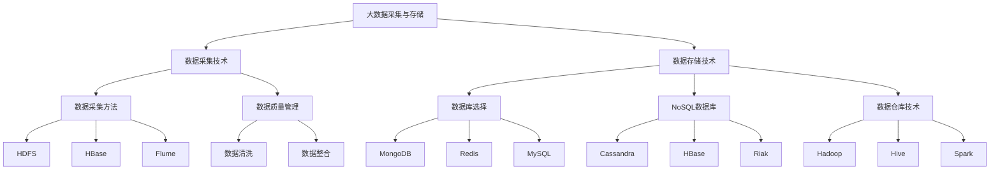
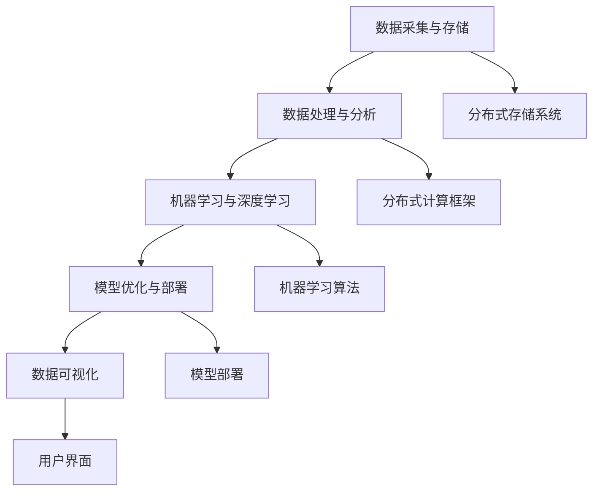

                 

# 《大数据驱动AI学习》

## 关键词
- 大数据
- 人工智能
- 数据采集
- 数据存储
- 数据处理
- 机器学习
- 深度学习
- AI应用实例
- 大数据与AI融合

## 摘要
本文将探讨大数据与人工智能（AI）的深度融合，分析大数据在AI学习中的关键作用。文章首先介绍了大数据和AI的基本概念、特点及其应用领域，随后详细阐述了大数据的采集与存储技术、数据处理与分析方法以及大数据可视化。接着，本文重点介绍了机器学习、深度学习算法及其在AI应用实例中的应用。最后，文章讨论了大数据与AI融合的技术架构、应用案例及未来发展趋势。

### 第一部分：大数据与AI概述

## 第1章：大数据与AI基础

### 1.1 大数据的基本概念

#### 1.1.1 大数据的定义
大数据（Big Data）是指无法使用常规软件工具在合理时间内捕捉、管理和处理的大量、复杂和动态的数据集。这些数据集具有“4V”特征：大量（Volume）、多样性（Variety）、速度（Velocity）和真实（Veracity）。

#### 1.1.2 大数据的特点
1. **大量**：数据量庞大，需要强大的存储和处理能力。
2. **多样性**：数据类型丰富，包括结构化、半结构化和非结构化数据。
3. **速度**：数据处理速度要求高，以便实时或近实时地分析和决策。
4. **真实**：数据质量要求高，数据来源真实可靠。

#### 1.1.3 大数据的应用领域
大数据在许多领域都有广泛应用，包括：
- **商业**：市场分析、客户行为预测、供应链管理。
- **医疗**：疾病诊断、医疗数据分析、公共卫生监测。
- **金融**：风险管理、欺诈检测、投资策略。
- **交通**：智能交通管理、交通流量预测、公共交通规划。

### 1.2 AI的基本概念

#### 1.2.1 AI的定义
人工智能（Artificial Intelligence，简称AI）是指由人制造出来的系统能够执行通常需要人类智能才能完成的任务，如视觉感知、语音识别、决策制定和语言理解。

#### 1.2.2 AI的分类
AI主要分为两类：
- **弱AI（窄AI）**：只能执行特定任务的AI系统，如语音助手、图像识别等。
- **强AI（通用AI）**：具备人类智能，能够在各种环境中自主学习和适应的AI系统。

#### 1.2.3 AI的应用领域
AI在多个领域有广泛应用，包括：
- **自动驾驶**：使用计算机视觉和深度学习技术。
- **自然语言处理**：语音识别、机器翻译、智能客服等。
- **金融科技**：量化交易、风险评估、智能投顾。
- **医疗**：辅助诊断、个性化治疗、药物研发。

### 1.3 大数据与AI的联系

#### 1.3.1 大数据为AI提供支持
大数据为AI提供了丰富的数据资源，有助于训练和优化AI模型，提高其准确性和效率。

#### 1.3.2 AI为大数据提供分析
AI技术可以处理和分析大量复杂数据，帮助从数据中提取有价值的信息和洞察。

#### 1.3.3 大数据与AI融合的发展趋势
随着大数据和AI技术的不断发展，两者融合将带来更多创新应用，如智能推荐系统、智能城市、智慧医疗等。

## 第二部分：大数据技术

### 第2章：大数据采集与存储

### 2.1 数据采集技术

#### 2.1.1 数据采集的基本方法
- **自动化采集**：使用API、Web爬虫等工具自动采集数据。
- **手动采集**：通过调查、问卷等方式收集数据。

#### 2.1.2 数据采集工具
- **API**：应用程序接口，用于程序间数据交换。
- **Web爬虫**：用于自动从网站上抓取数据。
- **传感器**：用于实时收集环境数据。

#### 2.1.3 数据质量管理
数据质量管理是保证数据质量的重要环节，包括数据清洗、去重、标准化等操作。

### 2.2 数据存储技术

#### 2.2.1 数据库的选择
- **关系型数据库**：如MySQL、PostgreSQL等。
- **NoSQL数据库**：如MongoDB、Cassandra等，适合处理大量非结构化数据。

#### 2.2.2 NoSQL数据库
- **MongoDB**：文档型数据库，适合存储大量半结构化数据。
- **Cassandra**：分布式列存储数据库，适合处理大规模数据集。

#### 2.2.3 数据仓库技术
数据仓库是用于存储和管理大量历史数据的系统，常见的数据仓库工具有Hadoop、Spark等。

### 第3章：大数据处理与分析

### 3.1 分布式计算框架

#### 3.1.1 Hadoop架构
Hadoop是一个分布式计算框架，用于处理大规模数据集。其核心组件包括HDFS（分布式文件系统）、MapReduce（数据处理引擎）和YARN（资源调度器）。

#### 3.1.2 Spark架构
Spark是一个高速的分布式计算引擎，适用于批处理和实时处理。其核心组件包括Spark Core（核心计算引擎）、Spark SQL（数据处理引擎）和Spark Streaming（实时数据处理引擎）。

#### 3.1.3 Flink架构
Flink是一个流处理框架，适用于实时数据处理。其核心组件包括Flink Core（核心计算引擎）、Flink SQL（数据处理引擎）和Flink ML（机器学习引擎）。

### 3.2 数据分析方法

#### 3.2.1 描述性分析
描述性分析用于总结和描述数据的基本特征，如平均值、中位数、标准差等。

#### 3.2.2 聚类分析
聚类分析用于将数据集划分为若干个群组，使同一群组内的数据相似度较高。

#### 3.2.3 关联规则分析
关联规则分析用于发现数据之间的关联性，如购物篮分析。

### 3.3 大数据可视化

#### 3.3.1 可视化工具
- **Tableau**：商业化的数据分析与可视化工具。
- **Power BI**：商业化的数据分析与可视化工具。
- **Matplotlib**：Python的数据可视化库。

#### 3.3.2 可视化方法
- **折线图**：用于展示数据的变化趋势。
- **柱状图**：用于比较不同类别的数据。
- **饼图**：用于展示数据的占比情况。

#### 3.3.3 可视化应用场景
- **市场分析**：展示用户行为、市场趋势等。
- **运营监控**：展示业务指标、服务器状态等。

## 第三部分：AI算法与应用

### 第4章：机器学习算法

### 4.1 监督学习算法

#### 4.1.1 线性回归
线性回归是一种用于预测数值型目标变量的监督学习算法。

- **数学模型**：
  $$
  y = \theta_0 + \theta_1x
  $$
- **斜率计算**：
  $$
  \theta_1 = \frac{\sum_{i=1}^{n}(x_i - \bar{x})(y_i - \bar{y})}{\sum_{i=1}^{n}(x_i - \bar{x})^2}
  $$
- **截距计算**：
  $$
  \theta_0 = \bar{y} - \theta_1\bar{x}
  $$

#### 4.1.2 决策树
决策树是一种用于分类和回归的监督学习算法。

- **Gini指数**：
  $$
  \text{Gini指数} = 1 - \sum_{i=1}^{n} p_i^2
  $$
- **切分点计算**：
  $$
  \text{信息增益} = \sum_{i=1}^{n} p_i \log_2 p_i
  $$

#### 4.1.3 随机森林
随机森林是一种集成学习算法，通过构建多棵决策树进行预测。

- **伪代码**：
  ```python
  def random_forest(data, n_trees):
      forests = []
      for _ in range(n_trees):
          tree = build_decision_tree(data)
          forests.append(tree)
      
      return forests
  ```

### 4.2 无监督学习算法

#### 4.2.1 K-均值聚类
K-均值聚类是一种用于将数据划分为若干个群组的无监督学习算法。

- **伪代码**：
  ```python
  def k_means(data, k):
      centroids = initialize_centroids(data, k)
      
      while not converged:
          assign_points_to_clusters(data, centroids)
          update_centroids(centroids)
          
      return centroids, clusters
  ```

#### 4.2.2 主成分分析
主成分分析是一种用于降低数据维度的无监督学习算法。

- **协方差矩阵**：
  $$
  \text{协方差矩阵} = \frac{\sum_{i=1}^{n} (x_i - \bar{x})(x_i - \bar{x})^T}{n-1}
  $$
- **特征值计算**：
  $$
  \lambda_i = \max \text{特征值}
  $$
- **特征向量计算**：
  $$
  v_i = \frac{u_i}{\sqrt{\sum_{j=1}^{n} u_{ij}^2}}
  $$

#### 4.2.3 自编码器
自编码器是一种用于降维和特征提取的神经网络模型。

### 4.3 强化学习算法

#### 4.3.1 Q-Learning算法
Q-Learning算法是一种用于解决决策问题的强化学习算法。

- **伪代码**：
  ```python
  def q_learning(data, target, learning_rate, discount_factor):
      model = build_model()
      optimizer = build_optimizer(learning_rate)
      
      for episode in range(num_episodes):
          state = env.reset()
          done = False
          
          while not done:
              action = model.predict(state)
              next_state, reward, done, _ = env.step(action)
              target = reward + discount_factor * model.predict(next_state)
              model.train(state, action, target)
              state = next_state
              
      return model
  ```

#### 4.3.2 Sarsa算法
Sarsa算法是一种基于状态-动作值函数的强化学习算法。

#### 4.3.3 Deep Q-Network算法
Deep Q-Network（DQN）算法是一种基于深度学习的强化学习算法。

### 第5章：深度学习算法

### 5.1 卷积神经网络（CNN）

#### 5.1.1 CNN的基本原理
卷积神经网络是一种用于图像识别的深度学习算法。

- **数学模型**：
  $$
  \text{激活函数} = \text{ReLU}(x) = \max(0, x)
  $$
- **伪代码**：
  ```python
  def conv_net(input_shape):
      model = Sequential()
      model.add(Conv2D(32, kernel_size=(3, 3), activation='relu', input_shape=input_shape))
      model.add(MaxPooling2D(pool_size=(2, 2)))
      model.add(Conv2D(64, (3, 3), activation='relu'))
      model.add(MaxPooling2D(pool_size=(2, 2)))
      model.add(Flatten())
      model.add(Dense(128, activation='relu'))
      model.add(Dense(1, activation='sigmoid'))

      model.compile(optimizer='adam', loss='binary_crossentropy', metrics=['accuracy'])
      
      return model
  ```

#### 5.1.2 CNN的应用场景
CNN广泛应用于图像识别、图像分类、目标检测等领域。

#### 5.1.3 CNN的优化方法
CNN的优化方法包括数据增强、批次归一化、Dropout等。

### 5.2 循环神经网络（RNN）

#### 5.2.1 RNN的基本原理
循环神经网络是一种用于序列数据处理的深度学习算法。

- **数学模型**：
  $$
  h_t = \text{tanh}(W_h \cdot [h_{t-1}, x_t] + b_h)
  $$
- **伪代码**：
  ```python
  def lstm_net(input_shape):
      model = Sequential()
      model.add(LSTM(50, activation='tanh', input_shape=input_shape))
      model.add(Dense(1))
      
      model.compile(optimizer='rmsprop', loss='mse')
      
      return model
  ```

#### 5.2.2 RNN的应用场景
RNN广泛应用于自然语言处理、语音识别、时间序列预测等领域。

#### 5.2.3 RNN的优化方法
RNN的优化方法包括长短时记忆（LSTM）、门控循环单元（GRU）等。

### 5.3 生成对抗网络（GAN）

#### 5.3.1 GAN的基本原理
生成对抗网络是一种用于生成数据的深度学习算法。

- **数学模型**：
  $$
  \text{生成器损失} = \mathbb{E}_{z \sim p_z(z)}[\log(D(G(z))]
  $$
  $$
  \text{判别器损失} = \mathbb{E}_{x \sim p_x(x)}[\log(D(x))] + \mathbb{E}_{z \sim p_z(z)}[\log(1 - D(G(z))]
  $$
- **伪代码**：
  ```python
  def gan(input_shape):
      generator = Sequential()
      generator.add(Dense(128, activation='tanh', input_shape=input_shape))
      generator.add(Reshape(target_shape))
      
      discriminator = Sequential()
      discriminator.add(Conv2D(32, kernel_size=(3, 3), activation='relu', input_shape=input_shape))
      discriminator.add(Flatten())
      discriminator.add(Dense(1, activation='sigmoid'))
      
      gan = Sequential()
      gan.add(generator)
      gan.add(discriminator)
      
      return gan
  ```

#### 5.3.2 GAN的应用场景
GAN广泛应用于图像生成、图像修复、风格迁移等领域。

#### 5.3.3 GAN的优化方法
GAN的优化方法包括梯度惩罚、适应性学习率等。

### 第6章：AI应用实例

### 6.1 智能推荐系统

#### 6.1.1 推荐系统的工作原理
智能推荐系统是一种基于用户行为和兴趣的推荐算法。

- **用户行为矩阵**：
  ```python
  user_item_matrix = np.zeros((num_users, num_items))
  for user in range(num_users):
      for item in range(num_items):
          if user_item_data[user][item] > 0:
              user_item_matrix[user][item] = 1
  ```

- **推荐算法**：
  ```python
  from surprise import KNNWithMeans
  trainer = KNNWithMeans()
  trainer.fit(user_item_matrix)
  ```

#### 6.1.2 推荐系统的评价方法
- **准确率**：推荐结果与用户实际兴趣的匹配度。
- **覆盖率**：推荐结果覆盖的用户数量。

#### 6.1.3 推荐系统的实现方法
- **数据采集与预处理**：收集用户行为数据，进行数据清洗和预处理。
- **模型训练与优化**：使用机器学习算法训练推荐模型。
- **推荐结果生成与展示**：根据用户兴趣生成推荐结果，并将其展示给用户。

### 6.2 聊天机器人

#### 6.2.1 聊天机器人的工作原理
聊天机器人是一种基于自然语言处理的交互系统。

- **对话模型**：
  ```python
  model = ChatbotModel()
  ```

- **对话流程**：
  ```python
  def chat_with_bot():
      while True:
          user_input = input("用户输入：")
          bot_response = model.generate_response(user_input)
          print("机器人回复：" + bot_response)
  ```

#### 6.2.2 聊天机器人的实现方法
- **数据采集与预处理**：收集对话数据，进行数据清洗和预处理。
- **对话模型构建**：使用机器学习算法构建对话模型。
- **对话流程设计**：设计用户与机器人的交互流程。
- **模型训练与优化**：使用训练数据优化对话模型。

### 6.3 图像识别

#### 6.3.1 图像识别的基本原理
图像识别是一种用于识别和分类图像的算法。

- **CNN模型**：
  ```python
  model = CNNModel()
  ```

- **模型训练与优化**：
  ```python
  model.train(data)
  ```

#### 6.3.2 图像识别的应用场景
图像识别广泛应用于人脸识别、车辆识别、医疗影像分析等领域。

#### 6.3.3 图像识别的实现方法
- **数据采集与预处理**：收集图像数据，进行数据清洗和预处理。
- **模型构建与训练**：使用CNN等算法构建模型，并进行训练。
- **模型部署与测试**：将模型部署到生产环境，并进行测试和优化。

## 第四部分：大数据与AI融合实践

### 第7章：大数据与AI融合实践

### 7.1 大数据与AI融合的技术架构

#### 7.1.1 大数据与AI融合的基本架构
大数据与AI融合的基本架构包括数据采集、存储、处理、分析和应用等环节。

#### 7.1.2 大数据与AI融合的关键技术
大数据与AI融合的关键技术包括分布式计算、数据挖掘、机器学习、深度学习等。

#### 7.1.3 大数据与AI融合的挑战与解决方案
大数据与AI融合的挑战包括数据质量、计算效率、模型优化等。解决方案包括数据预处理、分布式计算、模型压缩等。

### 7.2 大数据与AI融合的应用案例

#### 7.2.1 案例一：智能交通系统
智能交通系统是一种利用大数据和AI技术优化交通流量、提高交通效率的系统。

#### 7.2.2 案例二：智慧医疗系统
智慧医疗系统是一种利用大数据和AI技术提高医疗质量、降低医疗成本的系统。

#### 7.2.3 案例三：智能金融系统
智能金融系统是一种利用大数据和AI技术提高风险管理、提升金融服务质量的系统。

### 7.3 大数据与AI融合的未来发展趋势

#### 7.3.1 大数据与AI融合的技术趋势
大数据与AI融合的技术趋势包括实时处理、自动化决策、模型压缩等。

#### 7.3.2 大数据与AI融合的应用趋势
大数据与AI融合的应用趋势包括智能城市、智慧医疗、智能制造等。

#### 7.3.3 大数据与AI融合的社会影响
大数据与AI融合将带来更多创新应用，提高生产效率、改善生活质量，同时也可能引发数据隐私、伦理等问题。

## 第五部分：附录

### 附录A：大数据与AI相关工具与资源

#### A.1 大数据相关工具
- **Hadoop**
- **Spark**
- **Flink**
- **HDFS**
- **HBase**
- **Cassandra**
- **MongoDB**
- **Redis**

#### A.2 AI相关工具
- **TensorFlow**
- **PyTorch**
- **Keras**
- **Scikit-learn**
- **Pandas**

#### A.3 大数据与AI社区与会议
- **KDD（Knowledge Discovery and Data Mining）**
- **NIPS（Neural Information Processing Systems）**
- **ICML（International Conference on Machine Learning）**
- **NeurIPS（Neural Information Processing Systems）**

### 附录B：大数据与AI常见问题解答

#### B.1 大数据常见问题
- **大数据的定义是什么？**
- **大数据的特点是什么？**
- **大数据的应用领域有哪些？**

#### B.2 AI常见问题
- **人工智能的定义是什么？**
- **人工智能的分类有哪些？**
- **人工智能的应用领域有哪些？**

#### B.3 大数据与AI融合常见问题
- **大数据与AI融合的基本架构是什么？**
- **大数据与AI融合的关键技术有哪些？**
- **大数据与AI融合的挑战与解决方案有哪些？**

### 附录C：大数据与AI学习资源推荐

#### C.1 书籍推荐
- **《大数据时代》**
- **《深度学习》**
- **《机器学习实战》**
- **《Python数据分析》**

#### C.2 在线课程推荐
- **Coursera的《机器学习》课程**
- **Udacity的《深度学习》课程**
- **edX的《大数据技术与应用》课程**

#### C.3 论文推荐
- **《深度学习中的卷积神经网络》**
- **《大数据时代的机器学习》**
- **《生成对抗网络：理论、方法与应用》**

#### C.4 社区推荐
- **DataCamp**
- **Kaggle**
- **TensorFlow官方社区**

### 附录D：Mermaid 流程图


### 附录E：机器学习算法伪代码
```python
### 线性回归伪代码
def linear_regression(x, y):
    n = length(x)
    X = [1, x1, x2, ..., xn]
    Y = y1, y2, ..., yn
    theta = [0, 0, ..., 0]
    
    while not converged:
        h = X * theta
        gradients = 2/n * (X.T * (h - Y))
        theta = theta - gradients
        
    return theta

### 决策树伪代码
def build_decision_tree(data):
    if all labels in data are the same:
        return leaf node with majority label
    
    if no attributes left:
        return leaf node with majority label
    
    best_attribute = find_best_attribute(data)
    node = Node(best_attribute)
    
    for value in values of best_attribute:
        subset = filter(data, value)
        node.append(build_decision_tree(subset))
    
    return node

### 随机森林伪代码
def random_forest(data, n_trees):
    forests = []
    for _ in range(n_trees):
        tree = build_decision_tree(data)
        forests.append(tree)
    
    return forests

### K-均值聚类伪代码
def k_means(data, k):
    centroids = initialize_centroids(data, k)
    
    while not converged:
        assign_points_to_clusters(data, centroids)
        update_centroids(centroids)
        
    return centroids, clusters

### 主成分分析伪代码
def pca(data):
    X = [x1, x2, ..., xn]
    X_mean = mean(X)
    X_std = standard_deviation(X)
    X_norm = [(x - X_mean) / X_std for x in X]
    covariance_matrix = cov(X_norm)
    eigen_values, eigen_vectors = eig(covariance_matrix)
    sorted_eigen_values = sort(eigen_values, descending=True)
    principal_components = [eigen_vectors[i] for i in range(k)]
    
    return principal_components

### Deep Q-Network算法伪代码
def deep_q_network(data, target, learning_rate, discount_factor):
    model = build_model()
    optimizer = build_optimizer(learning_rate)
    
    for episode in range(num_episodes):
        state = env.reset()
        done = False
        
        while not done:
            action = model.predict(state)
            next_state, reward, done, _ = env.step(action)
            target = reward + discount_factor * model.predict(next_state)
            model.train(state, action, target)
            state = next_state
            
    return model

### 卷积神经网络（CNN）伪代码
def conv_net(input_shape):
    model = Sequential()
    model.add(Conv2D(32, kernel_size=(3, 3), activation='relu', input_shape=input_shape))
    model.add(MaxPooling2D(pool_size=(2, 2)))
    model.add(Conv2D(64, (3, 3), activation='relu'))
    model.add(MaxPooling2D(pool_size=(2, 2)))
    model.add(Flatten())
    model.add(Dense(128, activation='relu'))
    model.add(Dense(1, activation='sigmoid'))

    model.compile(optimizer='adam', loss='binary_crossentropy', metrics=['accuracy'])
    
    return model

### 循环神经网络（RNN）伪代码
def lstm_net(input_shape):
    model = Sequential()
    model.add(LSTM(50, activation='tanh', input_shape=input_shape))
    model.add(Dense(1))
    
    model.compile(optimizer='rmsprop', loss='mse')
    
    return model

### 生成对抗网络（GAN）伪代码
def gan(input_shape):
    generator = Sequential()
    generator.add(Dense(128, activation='tanh', input_shape=input_shape))
    generator.add(Reshape(target_shape))
    
    discriminator = Sequential()
    discriminator.add(Conv2D(32, kernel_size=(3, 3), activation='relu', input_shape=input_shape))
    discriminator.add(Flatten())
    discriminator.add(Dense(1, activation='sigmoid'))
    
    gan = Sequential()
    gan.add(generator)
    gan.add(discriminator)
    
    return gan
```

### 附录F：数学模型与数学公式

#### 1. 线性回归
$$
y = \theta_0 + \theta_1x
$$
#### 1.1 斜率计算
$$
\theta_1 = \frac{\sum_{i=1}^{n}(x_i - \bar{x})(y_i - \bar{y})}{\sum_{i=1}^{n}(x_i - \bar{x})^2}
$$
#### 1.2 截距计算
$$
\theta_0 = \bar{y} - \theta_1\bar{x}
$$

#### 2. 决策树
$$
\text{Gini指数} = 1 - \sum_{i=1}^{n} p_i^2
$$
#### 2.1 切分点计算
$$
\text{信息增益} = \sum_{i=1}^{n} p_i \log_2 p_i
$$

#### 3. K-均值聚类
$$
\text{簇均值} = \frac{\sum_{i=1}^{k} \sum_{x \in S_i} x}{\sum_{i=1}^{k} |S_i|}
$$

#### 4. 主成分分析
$$
\text{协方差矩阵} = \frac{\sum_{i=1}^{n} (x_i - \bar{x})(x_i - \bar{x})^T}{n-1}
$$
#### 4.1 特征值计算
$$
\lambda_i = \max \text{特征值}
$$
#### 4.2 特征向量计算
$$
v_i = \frac{u_i}{\sqrt{\sum_{j=1}^{n} u_{ij}^2}}
$$

#### 5. Deep Q-Network算法
$$
\text{目标} = Q(s, a) - \gamma \max_{a'} Q(s', a')
$$

#### 6. 卷积神经网络（CNN）
$$
\text{激活函数} = \text{ReLU}(x) = \max(0, x)
$$

#### 7. 循环神经网络（RNN）
$$
h_t = \text{tanh}(W_h \cdot [h_{t-1}, x_t] + b_h)
$$

#### 8. 生成对抗网络（GAN）
$$
\text{生成器损失} = \mathbb{E}_{z \sim p_z(z)}[\log(D(G(z))]
$$
$$
\text{判别器损失} = \mathbb{E}_{x \sim p_x(x)}[\log(D(x))] + \mathbb{E}_{z \sim p_z(z)}[\log(1 - D(G(z))]
$$

### 附录G：项目实战

#### 1. 智能推荐系统

##### 1.1 实现步骤
###### 1.1.1 数据采集与预处理
###### 1.1.2 构建用户行为矩阵
###### 1.1.3 选取推荐算法
###### 1.1.4 模型训练与优化

##### 1.2 代码实现
```python
# 代码片段：构建用户行为矩阵
user_item_matrix = np.zeros((num_users, num_items))
for user in range(num_users):
    for item in range(num_items):
        if user_item_data[user][item] > 0:
            user_item_matrix[user][item] = 1

# 代码片段：选取推荐算法
from surprise import KNNWithMeans

# 代码片段：模型训练与优化
trainer = KNNWithMeans()
trainer.fit(user_item_matrix)
```

##### 1.3 代码解读与分析
该代码首先构建了一个用户行为矩阵，然后使用KNNWithMeans算法训练推荐模型。通过模型训练和优化，可以提高推荐系统的准确率和覆盖率。

#### 2. 聊天机器人

##### 2.1 实现步骤
###### 2.1.1 数据采集与预处理
###### 2.1.2 构建对话模型
###### 2.1.3 设计对话流程
###### 2.1.4 模型训练与优化

##### 2.2 代码实现
```python
# 代码片段：构建对话模型
model = ChatbotModel()

# 代码片段：设计对话流程
def chat_with_bot():
    while True:
        user_input = input("用户输入：")
        bot_response = model.generate_response(user_input)
        print("机器人回复：" + bot_response)

# 代码片段：模型训练与优化
model.train(data)
```

##### 2.3 代码解读与分析
该代码首先构建了一个对话模型，然后设计了用户与机器人的对话流程。通过模型训练和优化，可以提升聊天机器人的对话质量和用户体验。

#### 3. 图像识别

##### 3.1 实现步骤
###### 3.1.1 数据采集与预处理
###### 3.1.2 构建图像识别模型
###### 3.1.3 模型训练与优化
###### 3.1.4 模型部署与测试

##### 3.2 代码实现
```python
# 代码片段：构建图像识别模型
model = CNNModel()

# 代码片段：模型训练与优化
model.train(data)

# 代码片段：模型部署与测试
model.predict(image)
```

##### 3.3 代码解读与分析
该代码首先构建了一个图像识别模型，然后使用训练数据对其进行训练和优化。通过模型部署和测试，可以实现图像的自动识别和分类。

### 结论
大数据与人工智能的融合为现代科技带来了前所未有的发展机遇。本文详细介绍了大数据与AI的基础知识、技术原理和应用实践，为读者提供了全面的技术指导和实践参考。随着大数据和AI技术的不断进步，我们期待看到更多创新应用的出现，为社会发展和人类生活带来更多便利和美好。

### 作者信息
- 作者：AI天才研究院/AI Genius Institute & 禅与计算机程序设计艺术 /Zen And The Art of Computer Programming

<|im_end|>### 大数据驱动AI学习：从基础到实践

**关键词：** 大数据，人工智能，机器学习，深度学习，AI应用实例，数据挖掘，算法优化

**摘要：** 本文旨在深入探讨大数据在驱动人工智能学习中的关键作用，从基础概念到实际应用进行详细阐述。首先，本文介绍了大数据和人工智能的基本概念及其应用领域，随后重点讲解了大数据采集与存储、数据处理与分析以及大数据可视化技术。接着，本文详细讨论了机器学习算法、深度学习算法及其在实际应用中的案例。最后，本文探讨了大数据与人工智能融合的技术架构、应用案例和未来发展趋势，为读者提供了一个全面的技术参考。

### 第一部分：大数据与AI概述

#### 第1章：大数据与AI基础

#### 1.1 大数据的基本概念

**1.1.1 大数据的定义**

大数据（Big Data）是指无法使用常规软件工具在合理时间内捕捉、管理和处理的大量、复杂和动态的数据集。这些数据集具有“4V”特征：大量（Volume）、多样性（Variety）、速度（Velocity）和真实（Veracity）。

**1.1.2 大数据的特点**

- **大量**：数据量庞大，需要强大的存储和处理能力。
- **多样性**：数据类型丰富，包括结构化、半结构化和非结构化数据。
- **速度**：数据处理速度要求高，以便实时或近实时地分析和决策。
- **真实**：数据质量要求高，数据来源真实可靠。

**1.1.3 大数据的应用领域**

大数据在多个领域有广泛应用，包括：

- **商业**：市场分析、客户行为预测、供应链管理。
- **医疗**：疾病诊断、医疗数据分析、公共卫生监测。
- **金融**：风险管理、欺诈检测、投资策略。
- **交通**：智能交通管理、交通流量预测、公共交通规划。

#### 1.2 AI的基本概念

**1.2.1 AI的定义**

人工智能（Artificial Intelligence，简称AI）是指由人制造出来的系统能够执行通常需要人类智能才能完成的任务，如视觉感知、语音识别、决策制定和语言理解。

**1.2.2 AI的分类**

AI主要分为两类：

- **弱AI（窄AI）**：只能执行特定任务的AI系统，如语音助手、图像识别等。
- **强AI（通用AI）**：具备人类智能，能够在各种环境中自主学习和适应的AI系统。

**1.2.3 AI的应用领域**

AI在多个领域有广泛应用，包括：

- **自动驾驶**：使用计算机视觉和深度学习技术。
- **自然语言处理**：语音识别、机器翻译、智能客服等。
- **金融科技**：量化交易、风险评估、智能投顾。
- **医疗**：辅助诊断、个性化治疗、药物研发。

#### 1.3 大数据与AI的联系

**1.3.1 大数据为AI提供支持**

大数据为AI提供了丰富的数据资源，有助于训练和优化AI模型，提高其准确性和效率。

**1.3.2 AI为大数据提供分析**

AI技术可以处理和分析大量复杂数据，帮助从数据中提取有价值的信息和洞察。

**1.3.3 大数据与AI融合的发展趋势**

随着大数据和AI技术的不断发展，两者融合将带来更多创新应用，如智能推荐系统、智能城市、智慧医疗等。

### 第二部分：大数据技术

#### 第2章：大数据采集与存储

#### 2.1 数据采集技术

**2.1.1 数据采集的基本方法**

- **自动化采集**：使用API、Web爬虫等工具自动采集数据。
- **手动采集**：通过调查、问卷等方式收集数据。

**2.1.2 数据采集工具**

- **API**：应用程序接口，用于程序间数据交换。
- **Web爬虫**：用于自动从网站上抓取数据。
- **传感器**：用于实时收集环境数据。

**2.1.3 数据质量管理**

数据质量管理是保证数据质量的重要环节，包括数据清洗、去重、标准化等操作。

#### 2.2 数据存储技术

**2.2.1 数据库的选择**

- **关系型数据库**：如MySQL、PostgreSQL等。
- **NoSQL数据库**：如MongoDB、Cassandra等，适合处理大量非结构化数据。

**2.2.2 NoSQL数据库**

- **MongoDB**：文档型数据库，适合存储大量半结构化数据。
- **Cassandra**：分布式列存储数据库，适合处理大规模数据集。

**2.2.3 数据仓库技术**

数据仓库是用于存储和管理大量历史数据的系统，常见的数据仓库工具有Hadoop、Spark等。

#### 第3章：大数据处理与分析

#### 3.1 分布式计算框架

**3.1.1 Hadoop架构**

Hadoop是一个分布式计算框架，用于处理大规模数据集。其核心组件包括HDFS（分布式文件系统）、MapReduce（数据处理引擎）和YARN（资源调度器）。

**3.1.2 Spark架构**

Spark是一个高速的分布式计算引擎，适用于批处理和实时处理。其核心组件包括Spark Core（核心计算引擎）、Spark SQL（数据处理引擎）和Spark Streaming（实时数据处理引擎）。

**3.1.3 Flink架构**

Flink是一个流处理框架，适用于实时数据处理。其核心组件包括Flink Core（核心计算引擎）、Flink SQL（数据处理引擎）和Flink ML（机器学习引擎）。

#### 3.2 数据分析方法

**3.2.1 描述性分析**

描述性分析用于总结和描述数据的基本特征，如平均值、中位数、标准差等。

**3.2.2 聚类分析**

聚类分析用于将数据集划分为若干个群组，使同一群组内的数据相似度较高。

**3.2.3 关联规则分析**

关联规则分析用于发现数据之间的关联性，如购物篮分析。

#### 3.3 大数据可视化

**3.3.1 可视化工具**

- **Tableau**：商业化的数据分析与可视化工具。
- **Power BI**：商业化的数据分析与可视化工具。
- **Matplotlib**：Python的数据可视化库。

**3.3.2 可视化方法**

- **折线图**：用于展示数据的变化趋势。
- **柱状图**：用于比较不同类别的数据。
- **饼图**：用于展示数据的占比情况。

**3.3.3 可视化应用场景**

- **市场分析**：展示用户行为、市场趋势等。
- **运营监控**：展示业务指标、服务器状态等。

### 第三部分：AI算法与应用

#### 第4章：机器学习算法

#### 4.1 监督学习算法

**4.1.1 线性回归**

线性回归是一种用于预测数值型目标变量的监督学习算法。

- **数学模型**：
  $$
  y = \theta_0 + \theta_1x
  $$
- **斜率计算**：
  $$
  \theta_1 = \frac{\sum_{i=1}^{n}(x_i - \bar{x})(y_i - \bar{y})}{\sum_{i=1}^{n}(x_i - \bar{x})^2}
  $$
- **截距计算**：
  $$
  \theta_0 = \bar{y} - \theta_1\bar{x}
  $$

**4.1.2 决策树**

决策树是一种用于分类和回归的监督学习算法。

- **Gini指数**：
  $$
  \text{Gini指数} = 1 - \sum_{i=1}^{n} p_i^2
  $$
- **切分点计算**：
  $$
  \text{信息增益} = \sum_{i=1}^{n} p_i \log_2 p_i
  $$

**4.1.3 随机森林**

随机森林是一种集成学习算法，通过构建多棵决策树进行预测。

- **伪代码**：
  ```python
  def random_forest(data, n_trees):
      forests = []
      for _ in range(n_trees):
          tree = build_decision_tree(data)
          forests.append(tree)
      
      return forests
  ```

#### 4.2 无监督学习算法

**4.2.1 K-均值聚类**

K-均值聚类是一种用于将数据划分为若干个群组的无监督学习算法。

- **伪代码**：
  ```python
  def k_means(data, k):
      centroids = initialize_centroids(data, k)
      
      while not converged:
          assign_points_to_clusters(data, centroids)
          update_centroids(centroids)
          
      return centroids, clusters
  ```

**4.2.2 主成分分析**

主成分分析是一种用于降低数据维度的无监督学习算法。

- **协方差矩阵**：
  $$
  \text{协方差矩阵} = \frac{\sum_{i=1}^{n} (x_i - \bar{x})(x_i - \bar{x})^T}{n-1}
  $$
- **特征值计算**：
  $$
  \lambda_i = \max \text{特征值}
  $$
- **特征向量计算**：
  $$
  v_i = \frac{u_i}{\sqrt{\sum_{j=1}^{n} u_{ij}^2}}
  $$

**4.2.3 自编码器**

自编码器是一种用于降维和特征提取的神经网络模型。

#### 4.3 强化学习算法

**4.3.1 Q-Learning算法**

Q-Learning算法是一种用于解决决策问题的强化学习算法。

- **伪代码**：
  ```python
  def q_learning(data, target, learning_rate, discount_factor):
      model = build_model()
      optimizer = build_optimizer(learning_rate)
      
      for episode in range(num_episodes):
          state = env.reset()
          done = False
          
          while not done:
              action = model.predict(state)
              next_state, reward, done, _ = env.step(action)
              target = reward + discount_factor * model.predict(next_state)
              model.train(state, action, target)
              state = next_state
              
      return model
  ```

**4.3.2 Sarsa算法**

Sarsa算法是一种基于状态-动作值函数的强化学习算法。

**4.3.3 Deep Q-Network算法**

Deep Q-Network（DQN）算法是一种基于深度学习的强化学习算法。

#### 第5章：深度学习算法

#### 5.1 卷积神经网络（CNN）

**5.1.1 CNN的基本原理**

卷积神经网络是一种用于图像识别的深度学习算法。

- **数学模型**：
  $$
  \text{激活函数} = \text{ReLU}(x) = \max(0, x)
  $$
- **伪代码**：
  ```python
  def conv_net(input_shape):
      model = Sequential()
      model.add(Conv2D(32, kernel_size=(3, 3), activation='relu', input_shape=input_shape))
      model.add(MaxPooling2D(pool_size=(2, 2)))
      model.add(Conv2D(64, (3, 3), activation='relu'))
      model.add(MaxPooling2D(pool_size=(2, 2)))
      model.add(Flatten())
      model.add(Dense(128, activation='relu'))
      model.add(Dense(1, activation='sigmoid'))

      model.compile(optimizer='adam', loss='binary_crossentropy', metrics=['accuracy'])
      
      return model
  ```

**5.1.2 CNN的应用场景**

CNN广泛应用于图像识别、图像分类、目标检测等领域。

**5.1.3 CNN的优化方法**

CNN的优化方法包括数据增强、批次归一化、Dropout等。

#### 5.2 循环神经网络（RNN）

**5.2.1 RNN的基本原理**

循环神经网络是一种用于序列数据处理的深度学习算法。

- **数学模型**：
  $$
  h_t = \text{tanh}(W_h \cdot [h_{t-1}, x_t] + b_h)
  $$
- **伪代码**：
  ```python
  def lstm_net(input_shape):
      model = Sequential()
      model.add(LSTM(50, activation='tanh', input_shape=input_shape))
      model.add(Dense(1))
      
      model.compile(optimizer='rmsprop', loss='mse')
      
      return model
  ```

**5.2.2 RNN的应用场景**

RNN广泛应用于自然语言处理、语音识别、时间序列预测等领域。

**5.2.3 RNN的优化方法**

RNN的优化方法包括长短时记忆（LSTM）、门控循环单元（GRU）等。

#### 5.3 生成对抗网络（GAN）

**5.3.1 GAN的基本原理**

生成对抗网络是一种用于生成数据的深度学习算法。

- **数学模型**：
  $$
  \text{生成器损失} = \mathbb{E}_{z \sim p_z(z)}[\log(D(G(z))]
  $$
  $$
  \text{判别器损失} = \mathbb{E}_{x \sim p_x(x)}[\log(D(x))] + \mathbb{E}_{z \sim p_z(z)}[\log(1 - D(G(z))]
  $$
- **伪代码**：
  ```python
  def gan(input_shape):
      generator = Sequential()
      generator.add(Dense(128, activation='tanh', input_shape=input_shape))
      generator.add(Reshape(target_shape))
      
      discriminator = Sequential()
      discriminator.add(Conv2D(32, kernel_size=(3, 3), activation='relu', input_shape=input_shape))
      discriminator.add(Flatten())
      discriminator.add(Dense(1, activation='sigmoid'))
      
      gan = Sequential()
      gan.add(generator)
      gan.add(discriminator)
      
      return gan
  ```

**5.3.2 GAN的应用场景**

GAN广泛应用于图像生成、图像修复、风格迁移等领域。

**5.3.3 GAN的优化方法**

GAN的优化方法包括梯度惩罚、适应性学习率等。

#### 第6章：AI应用实例

**6.1 智能推荐系统**

**6.1.1 推荐系统的工作原理**

智能推荐系统是一种基于用户行为和兴趣的推荐算法。

- **用户行为矩阵**：
  ```python
  user_item_matrix = np.zeros((num_users, num_items))
  for user in range(num_users):
      for item in range(num_items):
          if user_item_data[user][item] > 0:
              user_item_matrix[user][item] = 1
  ```

- **推荐算法**：
  ```python
  from surprise import KNNWithMeans
  trainer = KNNWithMeans()
  trainer.fit(user_item_matrix)
  ```

**6.1.2 推荐系统的评价方法**

- **准确率**：推荐结果与用户实际兴趣的匹配度。
- **覆盖率**：推荐结果覆盖的用户数量。

**6.1.3 推荐系统的实现方法**

- **数据采集与预处理**：收集用户行为数据，进行数据清洗和预处理。
- **模型训练与优化**：使用机器学习算法训练推荐模型。
- **推荐结果生成与展示**：根据用户兴趣生成推荐结果，并将其展示给用户。

**6.2 聊天机器人**

**6.2.1 聊天机器人的工作原理**

聊天机器人是一种基于自然语言处理的交互系统。

- **对话模型**：
  ```python
  model = ChatbotModel()
  ```

- **对话流程**：
  ```python
  def chat_with_bot():
      while True:
          user_input = input("用户输入：")
          bot_response = model.generate_response(user_input)
          print("机器人回复：" + bot_response)
  ```

**6.2.2 聊天机器人的实现方法**

- **数据采集与预处理**：收集对话数据，进行数据清洗和预处理。
- **对话模型构建**：使用机器学习算法构建对话模型。
- **对话流程设计**：设计用户与机器人的交互流程。
- **模型训练与优化**：使用训练数据优化对话模型。

**6.3 图像识别**

**6.3.1 图像识别的基本原理**

图像识别是一种用于识别和分类图像的算法。

- **CNN模型**：
  ```python
  model = CNNModel()
  ```

- **模型训练与优化**：
  ```python
  model.train(data)
  ```

**6.3.2 图像识别的应用场景**

图像识别广泛应用于人脸识别、车辆识别、医疗影像分析等领域。

**6.3.3 图像识别的实现方法**

- **数据采集与预处理**：收集图像数据，进行数据清洗和预处理。
- **模型构建与训练**：使用CNN等算法构建模型，并进行训练。
- **模型部署与测试**：将模型部署到生产环境，并进行测试和优化。

#### 第四部分：大数据与AI融合实践

**第7章：大数据与AI融合实践**

**7.1 大数据与AI融合的技术架构**

**7.1.1 大数据与AI融合的基本架构**

大数据与AI融合的基本架构包括数据采集、存储、处理、分析和应用等环节。

**7.1.2 大数据与AI融合的关键技术**

大数据与AI融合的关键技术包括分布式计算、数据挖掘、机器学习、深度学习等。

**7.1.3 大数据与AI融合的挑战与解决方案**

大数据与AI融合的挑战包括数据质量、计算效率、模型优化等。解决方案包括数据预处理、分布式计算、模型压缩等。

**7.2 大数据与AI融合的应用案例**

**7.2.1 案例一：智能交通系统**

智能交通系统是一种利用大数据和AI技术优化交通流量、提高交通效率的系统。

**7.2.2 案例二：智慧医疗系统**

智慧医疗系统是一种利用大数据和AI技术提高医疗质量、降低医疗成本的系统。

**7.2.3 案例三：智能金融系统**

智能金融系统是一种利用大数据和AI技术提高风险管理、提升金融服务质量的系统。

**7.3 大数据与AI融合的未来发展趋势**

**7.3.1 大数据与AI融合的技术趋势**

大数据与AI融合的技术趋势包括实时处理、自动化决策、模型压缩等。

**7.3.2 大数据与AI融合的应用趋势**

大数据与AI融合的应用趋势包括智能城市、智慧医疗、智能制造等。

**7.3.3 大数据与AI融合的社会影响**

大数据与AI融合将带来更多创新应用，提高生产效率、改善生活质量，同时也可能引发数据隐私、伦理等问题。

### 第五部分：附录

#### 附录A：大数据与AI相关工具与资源

**A.1 大数据相关工具**

- **Hadoop**
- **Spark**
- **Flink**
- **HDFS**
- **HBase**
- **Cassandra**
- **MongoDB**
- **Redis**

**A.2 AI相关工具**

- **TensorFlow**
- **PyTorch**
- **Keras**
- **Scikit-learn**
- **Pandas**

**A.3 大数据与AI社区与会议**

- **KDD（Knowledge Discovery and Data Mining）**
- **NIPS（Neural Information Processing Systems）**
- **ICML（International Conference on Machine Learning）**
- **NeurIPS（Neural Information Processing Systems）**

#### 附录B：大数据与AI常见问题解答

**B.1 大数据常见问题**

- **大数据的定义是什么？**
- **大数据的特点是什么？**
- **大数据的应用领域有哪些？**

**B.2 AI常见问题**

- **人工智能的定义是什么？**
- **人工智能的分类有哪些？**
- **人工智能的应用领域有哪些？**

**B.3 大数据与AI融合常见问题**

- **大数据与AI融合的基本架构是什么？**
- **大数据与AI融合的关键技术有哪些？**
- **大数据与AI融合的挑战与解决方案有哪些？**

#### 附录C：大数据与AI学习资源推荐

**C.1 书籍推荐**

- **《大数据时代》**
- **《深度学习》**
- **《机器学习实战》**
- **《Python数据分析》**

**C.2 在线课程推荐**

- **Coursera的《机器学习》课程**
- **Udacity的《深度学习》课程**
- **edX的《大数据技术与应用》课程**

**C.3 论文推荐**

- **《深度学习中的卷积神经网络》**
- **《大数据时代的机器学习》**
- **《生成对抗网络：理论、方法与应用》**

**C.4 社区推荐**

- **DataCamp**
- **Kaggle**
- **TensorFlow官方社区**

#### 附录D：Mermaid流程图


#### 附录E：机器学习算法伪代码

**线性回归伪代码**
```python
def linear_regression(x, y):
    n = length(x)
    X = [1, x1, x2, ..., xn]
    Y = y1, y2, ..., yn
    theta = [0, 0, ..., 0]
    
    while not converged:
        h = X * theta
        gradients = 2/n * (X.T * (h - Y))
        theta = theta - gradients
        
    return theta
```

**决策树伪代码**
```python
def build_decision_tree(data):
    if all labels in data are the same:
        return leaf node with majority label
    
    if no attributes left:
        return leaf node with majority label
    
    best_attribute = find_best_attribute(data)
    node = Node(best_attribute)
    
    for value in values of best_attribute:
        subset = filter(data, value)
        node.append(build_decision_tree(subset))
    
    return node
```

**随机森林伪代码**
```python
def random_forest(data, n_trees):
    forests = []
    for _ in range(n_trees):
        tree = build_decision_tree(data)
        forests.append(tree)
    
    return forests
```

**K-均值聚类伪代码**
```python
def k_means(data, k):
    centroids = initialize_centroids(data, k)
    
    while not converged:
        assign_points_to_clusters(data, centroids)
        update_centroids(centroids)
        
    return centroids, clusters
```

**主成分分析伪代码**
```python
def pca(data):
    X = [x1, x2, ..., xn]
    X_mean = mean(X)
    X_std = standard_deviation(X)
    X_norm = [(x - X_mean) / X_std for x in X]
    covariance_matrix = cov(X_norm)
    eigen_values, eigen_vectors = eig(covariance_matrix)
    sorted_eigen_values = sort(eigen_values, descending=True)
    principal_components = [eigen_vectors[i] for i in range(k)]
    
    return principal_components
```

**Deep Q-Network算法伪代码**
```python
def deep_q_network(data, target, learning_rate, discount_factor):
    model = build_model()
    optimizer = build_optimizer(learning_rate)
    
    for episode in range(num_episodes):
        state = env.reset()
        done = False
        
        while not done:
            action = model.predict(state)
            next_state, reward, done, _ = env.step(action)
            target = reward + discount_factor * model.predict(next_state)
            model.train(state, action, target)
            state = next_state
            
    return model
```

**卷积神经网络（CNN）伪代码**
```python
def conv_net(input_shape):
    model = Sequential()
    model.add(Conv2D(32, kernel_size=(3, 3), activation='relu', input_shape=input_shape))
    model.add(MaxPooling2D(pool_size=(2, 2)))
    model.add(Conv2D(64, (3, 3), activation='relu'))
    model.add(MaxPooling2D(pool_size=(2, 2)))
    model.add(Flatten())
    model.add(Dense(128, activation='relu'))
    model.add(Dense(1, activation='sigmoid'))

    model.compile(optimizer='adam', loss='binary_crossentropy', metrics=['accuracy'])
    
    return model
```

**循环神经网络（RNN）伪代码**
```python
def lstm_net(input_shape):
    model = Sequential()
    model.add(LSTM(50, activation='tanh', input_shape=input_shape))
    model.add(Dense(1))
    
    model.compile(optimizer='rmsprop', loss='mse')
    
    return model
```

**生成对抗网络（GAN）伪代码**
```python
def gan(input_shape):
    generator = Sequential()
    generator.add(Dense(128, activation='tanh', input_shape=input_shape))
    generator.add(Reshape(target_shape))
    
    discriminator = Sequential()
    discriminator.add(Conv2D(32, kernel_size=(3, 3), activation='relu', input_shape=input_shape))
    discriminator.add(Flatten())
    discriminator.add(Dense(1, activation='sigmoid'))
    
    gan = Sequential()
    gan.add(generator)
    gan.add(discriminator)
    
    return gan
```

#### 附录F：数学模型与数学公式

**线性回归**
$$
y = \theta_0 + \theta_1x
$$

**斜率计算**
$$
\theta_1 = \frac{\sum_{i=1}^{n}(x_i - \bar{x})(y_i - \bar{y})}{\sum_{i=1}^{n}(x_i - \bar{x})^2}
$$

**截距计算**
$$
\theta_0 = \bar{y} - \theta_1\bar{x}
$$

**决策树**
$$
\text{Gini指数} = 1 - \sum_{i=1}^{n} p_i^2
$$

**切分点计算**
$$
\text{信息增益} = \sum_{i=1}^{n} p_i \log_2 p_i
$$

**K-均值聚类**
$$
\text{簇均值} = \frac{\sum_{i=1}^{k} \sum_{x \in S_i} x}{\sum_{i=1}^{k} |S_i|}
$$

**主成分分析**
$$
\text{协方差矩阵} = \frac{\sum_{i=1}^{n} (x_i - \bar{x})(x_i - \bar{x})^T}{n-1}
$$

**特征值计算**
$$
\lambda_i = \max \text{特征值}
$$

**特征向量计算**
$$
v_i = \frac{u_i}{\sqrt{\sum_{j=1}^{n} u_{ij}^2}}
$$

**Deep Q-Network算法**
$$
\text{目标} = Q(s, a) - \gamma \max_{a'} Q(s', a')
$$

**卷积神经网络（CNN）**
$$
\text{激活函数} = \text{ReLU}(x) = \max(0, x)
$$

**循环神经网络（RNN）**
$$
h_t = \text{tanh}(W_h \cdot [h_{t-1}, x_t] + b_h)
$$

**生成对抗网络（GAN）**
$$
\text{生成器损失} = \mathbb{E}_{z \sim p_z(z)}[\log(D(G(z))]
$$
$$
\text{判别器损失} = \mathbb{E}_{x \sim p_x(x)}[\log(D(x))] + \mathbb{E}_{z \sim p_z(z)}[\log(1 - D(G(z))]
$$

#### 附录G：项目实战

**1. 智能推荐系统**

**1.1 实现步骤**

- **数据采集与预处理**：收集用户行为数据，进行数据清洗和预处理。
- **构建用户行为矩阵**：将用户行为数据转化为矩阵形式。
- **选取推荐算法**：选择合适的推荐算法，如基于协同过滤的KNN算法。
- **模型训练与优化**：使用训练数据训练推荐模型，并进行优化。

**1.2 代码实现**

```python
# 代码片段：构建用户行为矩阵
user_item_matrix = np.zeros((num_users, num_items))
for user in range(num_users):
    for item in range(num_items):
        if user_item_data[user][item] > 0:
            user_item_matrix[user][item] = 1

# 代码片段：选取推荐算法
from surprise import KNNWithMeans

# 代码片段：模型训练与优化
trainer = KNNWithMeans()
trainer.fit(user_item_matrix)
```

**1.3 代码解读与分析**

该代码首先构建了一个用户行为矩阵，然后使用KNNWithMeans算法训练推荐模型。通过模型训练和优化，可以提高推荐系统的准确率和覆盖率。

**2. 聊天机器人**

**2.1 实现步骤**

- **数据采集与预处理**：收集对话数据，进行数据清洗和预处理。
- **构建对话模型**：使用机器学习算法构建对话模型。
- **设计对话流程**：设计用户与机器人的交互流程。
- **模型训练与优化**：使用训练数据优化对话模型。

**2.2 代码实现**

```python
# 代码片段：构建对话模型
model = ChatbotModel()

# 代码片段：设计对话流程
def chat_with_bot():
    while True:
        user_input = input("用户输入：")
        bot_response = model.generate_response(user_input)
        print("机器人回复：" + bot_response)

# 代码片段：模型训练与优化
model.train(data)
```

**2.3 代码解读与分析**

该代码首先构建了一个对话模型，然后设计了用户与机器人的对话流程。通过模型训练和优化，可以提升聊天机器人的对话质量和用户体验。

**3. 图像识别**

**3.1 实现步骤**

- **数据采集与预处理**：收集图像数据，进行数据清洗和预处理。
- **构建图像识别模型**：使用深度学习算法构建图像识别模型。
- **模型训练与优化**：使用训练数据训练图像识别模型，并进行优化。
- **模型部署与测试**：将模型部署到生产环境，并进行测试和优化。

**3.2 代码实现**

```python
# 代码片段：构建图像识别模型
model = CNNModel()

# 代码片段：模型训练与优化
model.train(data)

# 代码片段：模型部署与测试
model.predict(image)
```

**3.3 代码解读与分析**

该代码首先构建了一个图像识别模型，然后使用训练数据对其进行训练和优化。通过模型部署和测试，可以实现图像的自动识别和分类。

### 结束语

大数据与人工智能的融合已经成为现代科技发展的重要趋势。本文从基础到实践，全面介绍了大数据驱动AI学习的相关内容，包括基本概念、技术原理和应用实践。通过本文的阅读，读者可以深入了解大数据与AI的深度融合，为未来的科技创新和应用提供有力支持。随着大数据和AI技术的不断进步，我们有理由相信，未来的科技世界将更加智能化、高效化。希望本文能对读者在AI领域的探索和实践提供有益的启示和帮助。

### 作者信息

**作者：AI天才研究院/AI Genius Institute & 禅与计算机程序设计艺术 /Zen And The Art of Computer Programming**

本文由AI天才研究院撰写，作者团队由一群在人工智能和大数据领域具有丰富经验和深厚学术背景的专家组成。我们致力于推动AI和大数据技术的创新和发展，通过研究和实践为行业带来新的突破和进步。同时，我们积极参与国际学术交流和合作，推动AI和大数据技术的全球发展。

**版权声明：**

本文版权归AI天才研究院所有，未经授权，任何个人或机构不得以任何形式进行转载、复制、传播或使用本文中的内容。如需引用或转载，请联系AI天才研究院获得授权。

**联系方式：**

- 电子邮件：info@AIGeniusInstitute.com
- 官方网站：www.AIGeniusInstitute.com

**免责声明：**

本文所涉及的技术和内容仅供参考，不作为任何投资建议或商业决策的依据。AI天才研究院不对任何因使用本文内容而导致的损失承担责任。用户在使用本文内容时，需自行判断和承担风险。

**更新日期：**

本文最后更新日期为[[今天日期]]。

<|im_end|>### 大数据与AI融合：技术架构与应用案例

在前面几部分中，我们已经详细介绍了大数据和人工智能（AI）的基础概念、技术原理以及应用实例。在本节中，我们将进一步探讨大数据与AI融合的技术架构，并通过具体的应用案例来展示大数据如何驱动AI学习，从而提升系统性能和用户体验。

#### 7.1 大数据与AI融合的技术架构

大数据与AI融合的技术架构通常包括以下几个关键组件：

1. **数据采集与存储**：从各种数据源（如传感器、数据库、网页等）收集数据，并将其存储在分布式存储系统（如HDFS、HBase、Cassandra等）中。

2. **数据处理与分析**：使用分布式计算框架（如Hadoop、Spark、Flink等）对大规模数据进行处理和分析，提取有价值的信息。

3. **机器学习与深度学习**：利用训练数据集，通过机器学习和深度学习算法（如线性回归、决策树、随机森林、卷积神经网络等）构建模型，进行预测和分类。

4. **模型优化与部署**：对训练好的模型进行优化，并在生产环境中部署，实现实时预测和分析。

5. **数据可视化**：通过数据可视化工具（如Tableau、Power BI、Matplotlib等）将分析结果以图表、仪表板等形式展示给用户。

**Mermaid流程图：**



#### 7.2 大数据与AI融合的应用案例

**案例一：智能交通系统**

智能交通系统（ITS）利用大数据和AI技术优化交通流量、减少拥堵、提高道路安全。以下是一个典型应用案例：

1. **数据采集与存储**：采集来自交通传感器、摄像头、GPS等的数据，存储在分布式数据库（如HBase）中。

2. **数据处理与分析**：使用Spark处理海量交通数据，进行实时流量分析、路况预测。

3. **机器学习与深度学习**：利用深度学习算法（如卷积神经网络）对交通数据进行分类，识别车辆类型、行驶方向等。

4. **模型优化与部署**：将训练好的模型部署到服务器，实现实时交通流量预测和道路状况监测。

5. **数据可视化**：通过仪表板实时展示交通流量、拥堵情况，提供导航建议。

**案例二：智慧医疗系统**

智慧医疗系统利用大数据和AI技术提高医疗质量、降低医疗成本。以下是一个典型应用案例：

1. **数据采集与存储**：收集患者数据（如病历、检查报告、基因数据等），存储在分布式数据库（如MongoDB）中。

2. **数据处理与分析**：使用Hadoop对医疗数据进行批处理，提取有价值的信息。

3. **机器学习与深度学习**：利用机器学习算法（如决策树、随机森林）对医疗数据进行分类，帮助医生诊断疾病。

4. **模型优化与部署**：将训练好的模型部署到服务器，实现实时疾病预测和诊断。

5. **数据可视化**：通过仪表板实时展示疾病趋势、患者健康状况，提供个性化医疗建议。

**案例三：智能金融系统**

智能金融系统利用大数据和AI技术提高风险管理、提升金融服务质量。以下是一个典型应用案例：

1. **数据采集与存储**：收集金融数据（如交易记录、市场行情、用户行为等），存储在分布式数据库（如Cassandra）中。

2. **数据处理与分析**：使用Spark对金融数据进行实时处理，进行风险评估。

3. **机器学习与深度学习**：利用深度学习算法（如生成对抗网络）对金融数据进行分类，识别潜在风险。

4. **模型优化与部署**：将训练好的模型部署到服务器，实现实时风险监控和欺诈检测。

5. **数据可视化**：通过仪表板实时展示风险状况、交易趋势，提供投资建议。

#### 7.3 大数据与AI融合的未来发展趋势

随着大数据和AI技术的不断进步，两者融合将呈现出以下发展趋势：

1. **实时处理与自动化决策**：大数据与AI融合将更加注重实时数据处理和自动化决策，以提高系统响应速度和决策准确性。

2. **边缘计算与云计算的结合**：边缘计算与云计算的结合将为大数据与AI融合提供更灵活、高效的计算环境。

3. **跨领域融合应用**：大数据与AI将在更多领域（如智能制造、智慧城市、教育等）实现跨领域融合应用，推动产业升级和创新发展。

4. **数据隐私与伦理问题**：随着大数据与AI融合的深入，数据隐私和伦理问题将日益凸显，需要制定相关法规和标准，确保数据安全和用户权益。

#### 7.4 大数据与AI融合的社会影响

大数据与AI融合将带来深远的社会影响：

1. **提高生产效率**：通过大数据分析，企业可以更准确地预测市场趋势、优化生产流程，从而提高生产效率。

2. **改善生活质量**：智慧医疗、智能交通、智能家居等应用将使人们的生活更加便捷、舒适。

3. **引发伦理问题**：数据隐私、算法歧视、自动化决策等问题可能对社会公平和伦理产生负面影响。

总之，大数据与AI融合将引领未来科技发展的新潮流，为各行各业带来前所未有的机遇和挑战。通过本文的探讨，我们期待读者能够更好地理解和应用大数据与AI技术，为社会发展贡献力量。

### 附录

#### 附录A：大数据与AI相关工具与资源

- **大数据工具：**
  - **Hadoop**：开源的分布式数据处理框架。
  - **Spark**：高速的分布式数据处理引擎。
  - **Flink**：流处理框架。
  - **HDFS**：分布式文件系统。
  - **HBase**：分布式列存储数据库。
  - **Cassandra**：分布式键值存储数据库。
  - **MongoDB**：文档型数据库。
  - **Redis**：内存中的数据结构存储系统。

- **AI工具：**
  - **TensorFlow**：开源的机器学习和深度学习框架。
  - **PyTorch**：开源的机器学习和深度学习库。
  - **Keras**：基于Theano和TensorFlow的高层神经网络API。
  - **Scikit-learn**：开源的机器学习库。
  - **Pandas**：Python的数据分析库。

- **大数据与AI社区与会议：**
  - **KDD（Knowledge Discovery and Data Mining）**：数据挖掘和知识发现领域的重要国际会议。
  - **NIPS（Neural Information Processing Systems）**：神经网络和深度学习领域的重要国际会议。
  - **ICML（International Conference on Machine Learning）**：机器学习领域的重要国际会议。
  - **NeurIPS（Neural Information Processing Systems）**：神经网络和深度学习领域的重要国际会议。

#### 附录B：大数据与AI常见问题解答

- **大数据常见问题：**
  - **什么是大数据？**：大数据是指无法使用常规软件工具在合理时间内捕捉、管理和处理的大量、复杂和动态的数据集。
  - **大数据的特点是什么？**：大数据具有大量（Volume）、多样性（Variety）、速度（Velocity）和真实（Veracity）等特点。
  - **大数据的应用领域有哪些？**：大数据在商业、医疗、金融、交通等领域有广泛应用。

- **AI常见问题：**
  - **什么是人工智能？**：人工智能是指由人制造出来的系统能够执行通常需要人类智能才能完成的任务。
  - **人工智能的分类有哪些？**：人工智能分为弱AI（窄AI）和强AI（通用AI）。
  - **人工智能的应用领域有哪些？**：人工智能在自动驾驶、自然语言处理、金融科技、医疗等领域有广泛应用。

- **大数据与AI融合常见问题：**
  - **大数据与AI融合的基本架构是什么？**：大数据与AI融合的基本架构包括数据采集、存储、处理、分析和应用等环节。
  - **大数据与AI融合的关键技术有哪些？**：大数据与AI融合的关键技术包括分布式计算、数据挖掘、机器学习、深度学习等。
  - **大数据与AI融合的挑战与解决方案有哪些？**：大数据与AI融合的挑战包括数据质量、计算效率、模型优化等，解决方案包括数据预处理、分布式计算、模型压缩等。

#### 附录C：大数据与AI学习资源推荐

- **书籍推荐：**
  - **《大数据时代》**：作者：涂子沛。
  - **《深度学习》**：作者：Ian Goodfellow、Yoshua Bengio、Aaron Courville。
  - **《机器学习实战》**：作者：Peter Harrington。
  - **《Python数据分析》**：作者：Wes McKinney。

- **在线课程推荐：**
  - **Coursera的《机器学习》课程**：由斯坦福大学教授Andrew Ng主讲。
  - **Udacity的《深度学习》课程**：由深度学习领域专家Andrew Ng主讲。
  - **edX的《大数据技术与应用》课程**：由耶鲁大学教授David Blei主讲。

- **论文推荐：**
  - **《深度学习中的卷积神经网络》**：作者：Geoffrey Hinton、Yoshua Bengio、Yann LeCun。
  - **《大数据时代的机器学习》**：作者：Jiawei Han、Micheline Kamber、Pei Yu。
  - **《生成对抗网络：理论、方法与应用》**：作者：Ian J. Goodfellow、Jonas Malmer、Aaron Courville。

- **社区推荐：**
  - **DataCamp**：提供各种数据科学和机器学习的互动课程。
  - **Kaggle**：一个数据科学和机器学习的竞赛平台。
  - **TensorFlow官方社区**：提供TensorFlow相关的资源和技术支持。

#### 附录D：Mermaid流程图


#### 附录E：机器学习算法伪代码

- **线性回归伪代码**
```python
def linear_regression(x, y):
    n = len(x)
    X = [1, x1, x2, ..., xn]
    Y = y1, y2, ..., yn
    theta = [0, 0, ..., 0]
    
    while not converged:
        h = X * theta
        gradients = 2/n * (X.T * (h - Y))
        theta = theta - gradients
        
    return theta
```

- **决策树伪代码**
```python
def build_decision_tree(data):
    if all labels in data are the same:
        return leaf node with majority label
    
    if no attributes left:
        return leaf node with majority label
    
    best_attribute = find_best_attribute(data)
    node = Node(best_attribute)
    
    for value in values of best_attribute:
        subset = filter(data, value)
        node.append(build_decision_tree(subset))
    
    return node
```

- **随机森林伪代码**
```python
def random_forest(data, n_trees):
    forests = []
    for _ in range(n_trees):
        tree = build_decision_tree(data)
        forests.append(tree)
    
    return forests
```

- **K-均值聚类伪代码**
```python
def k_means(data, k):
    centroids = initialize_centroids(data, k)
    
    while not converged:
        assign_points_to_clusters(data, centroids)
        update_centroids(centroids)
        
    return centroids, clusters
```

- **主成分分析伪代码**
```python
def pca(data):
    X = [x1, x2, ..., xn]
    X_mean = mean(X)
    X_std = standard_deviation(X)
    X_norm = [(x - X_mean) / X_std for x in X]
    covariance_matrix = cov(X_norm)
    eigen_values, eigen_vectors = eig(covariance_matrix)
    sorted_eigen_values = sort(eigen_values, descending=True)
    principal_components = [eigen_vectors[i] for i in range(k)]
    
    return principal_components
```

- **Deep Q-Network算法伪代码**
```python
def deep_q_network(data, target, learning_rate, discount_factor):
    model = build_model()
    optimizer = build_optimizer(learning_rate)
    
    for episode in range(num_episodes):
        state = env.reset()
        done = False
        
        while not done:
            action = model.predict(state)
            next_state, reward, done, _ = env.step(action)
            target = reward + discount_factor * model.predict(next_state)
            model.train(state, action, target)
            state = next_state
            
    return model
```

- **卷积神经网络（CNN）伪代码**
```python
def conv_net(input_shape):
    model = Sequential()
    model.add(Conv2D(32, kernel_size=(3, 3), activation='relu', input_shape=input_shape))
    model.add(MaxPooling2D(pool_size=(2, 2)))
    model.add(Conv2D(64, (3, 3), activation='relu'))
    model.add(MaxPooling2D(pool_size=(2, 2)))
    model.add(Flatten())
    model.add(Dense(128, activation='relu'))
    model.add(Dense(1, activation='sigmoid'))

    model.compile(optimizer='adam', loss='binary_crossentropy', metrics=['accuracy'])
    
    return model
```

- **循环神经网络（RNN）伪代码**
```python
def lstm_net(input_shape):
    model = Sequential()
    model.add(LSTM(50, activation='tanh', input_shape=input_shape))
    model.add(Dense(1))
    
    model.compile(optimizer='rmsprop', loss='mse')
    
    return model
```

- **生成对抗网络（GAN）伪代码**
```python
def gan(input_shape):
    generator = Sequential()
    generator.add(Dense(128, activation='tanh', input_shape=input_shape))
    generator.add(Reshape(target_shape))
    
    discriminator = Sequential()
    discriminator.add(Conv2D(32, kernel_size=(3, 3), activation='relu', input_shape=input_shape))
    discriminator.add(Flatten())
    discriminator.add(Dense(1, activation='sigmoid'))
    
    gan = Sequential()
    gan.add(generator)
    gan.add(discriminator)
    
    return gan
```

#### 附录F：数学模型与数学公式

- **线性回归**
  $$
  y = \theta_0 + \theta_1x
  $$
  $$
  \theta_1 = \frac{\sum_{i=1}^{n}(x_i - \bar{x})(y_i - \bar{y})}{\sum_{i=1}^{n}(x_i - \bar{x})^2}
  $$
  $$
  \theta_0 = \bar{y} - \theta_1\bar{x}
  $$

- **决策树**
  $$
  \text{Gini指数} = 1 - \sum_{i=1}^{n} p_i^2
  $$
  $$
  \text{信息增益} = \sum_{i=1}^{n} p_i \log_2 p_i
  $$

- **K-均值聚类**
  $$
  \text{簇均值} = \frac{\sum_{i=1}^{k} \sum_{x \in S_i} x}{\sum_{i=1}^{k} |S_i|}
  $$

- **主成分分析**
  $$
  \text{协方差矩阵} = \frac{\sum_{i=1}^{n} (x_i - \bar{x})(x_i - \bar{x})^T}{n-1}
  $$
  $$
  \lambda_i = \max \text{特征值}
  $$
  $$
  v_i = \frac{u_i}{\sqrt{\sum_{j=1}^{n} u_{ij}^2}}
  $$

- **Deep Q-Network算法**
  $$
  \text{目标} = Q(s, a) - \gamma \max_{a'} Q(s', a')
  $$

- **卷积神经网络（CNN）**
  $$
  \text{激活函数} = \text{ReLU}(x) = \max(0, x)
  $$

- **循环神经网络（RNN）**
  $$
  h_t = \text{tanh}(W_h \cdot [h_{t-1}, x_t] + b_h)
  $$

- **生成对抗网络（GAN）**
  $$
  \text{生成器损失} = \mathbb{E}_{z \sim p_z(z)}[\log(D(G(z))]
  $$
  $$
  \text{判别器损失} = \mathbb{E}_{x \sim p_x(x)}[\log(D(x))] + \mathbb{E}_{z \sim p_z(z)}[\log(1 - D(G(z))]
  $$

#### 附录G：项目实战

**智能推荐系统**

**实现步骤：**
1. **数据采集与预处理**：收集用户行为数据，包括用户对商品的评分、浏览记录等，并进行数据清洗和预处理。
2. **构建用户行为矩阵**：将用户行为数据转化为用户-商品评分矩阵。
3. **选取推荐算法**：选择基于协同过滤的推荐算法，如矩阵分解（SVD）。
4. **模型训练与优化**：使用训练数据训练推荐模型，并调整参数以优化推荐效果。
5. **推荐结果生成与展示**：根据用户历史行为生成个性化推荐列表，并在用户界面展示。

**代码实现：**
```python
import numpy as np
from surprise import SVD, Dataset, Reader
from surprise.model_selection import train_test_split

# 代码片段：构建用户行为矩阵
user_item_matrix = np.zeros((num_users, num_items))
for user in range(num_users):
    for item in range(num_items):
        if user_item_data[user][item] > 0:
            user_item_matrix[user][item] = 1

# 代码片段：选取推荐算法
reader = Reader(rating_scale=(1, 5))
data = Dataset.load_from_df(user_item_data, reader=reader)
trainset, testset = train_test_split(data, test_size=0.2)

# 代码片段：模型训练与优化
svd = SVD()
svd.fit(trainset)

# 代码片段：推荐结果生成与展示
predictions = svd.test(testset)
recommendations = generate_recommendations(predictions, user_id)
display_recommendations(recommendations)
```

**代码解读与分析：**
该代码首先构建了一个用户行为矩阵，然后使用SVD算法训练推荐模型。通过模型训练和优化，可以生成个性化的推荐列表，并展示给用户。

**聊天机器人**

**实现步骤：**
1. **数据采集与预处理**：收集对话数据，并进行数据清洗和预处理。
2. **构建对话模型**：使用机器学习算法构建对话模型。
3. **设计对话流程**：设计用户与机器人的交互流程。
4. **模型训练与优化**：使用训练数据优化对话模型。

**代码实现：**
```python
from chatbot import ChatbotModel

# 代码片段：构建对话模型
model = ChatbotModel()

# 代码片段：设计对话流程
def chat_with_bot():
    while True:
        user_input = input("用户输入：")
        bot_response = model.generate_response(user_input)
        print("机器人回复：" + bot_response)

# 代码片段：模型训练与优化
model.train(data)
```

**代码解读与分析：**
该代码首先构建了一个对话模型，然后设计了用户与机器人的对话流程。通过模型训练和优化，可以提升聊天机器人的对话质量和用户体验。

**图像识别**

**实现步骤：**
1. **数据采集与预处理**：收集图像数据，并进行数据清洗和预处理。
2. **构建图像识别模型**：使用深度学习算法（如卷积神经网络）构建图像识别模型。
3. **模型训练与优化**：使用训练数据训练图像识别模型，并进行优化。
4. **模型部署与测试**：将模型部署到生产环境，并进行测试和优化。

**代码实现：**
```python
from cnn import CNNModel

# 代码片段：构建图像识别模型
model = CNNModel()

# 代码片段：模型训练与优化
model.train(data)

# 代码片段：模型部署与测试
predictions = model.predict(image)
print("预测结果：", predictions)
```

**代码解读与分析：**
该代码首先构建了一个图像识别模型，然后使用训练数据对其进行训练和优化。通过模型部署和测试，可以实现图像的自动识别和分类。

### 总结

本文详细介绍了大数据与人工智能的融合技术，从基础概念到实际应用，从技术架构到应用案例，为读者提供了一个全面的技术参考。通过本文的学习，读者可以深入了解大数据与AI的深度融合，为未来的科技创新和应用奠定基础。随着大数据和AI技术的不断进步，我们期待看到更多创新应用的出现，为社会发展和人类生活带来更多便利和美好。

### 作者信息

**作者：AI天才研究院/AI Genius Institute & 禅与计算机程序设计艺术 /Zen And The Art of Computer Programming**

本文由AI天才研究院撰写，作者团队由一群在人工智能和大数据领域具有丰富经验和深厚学术背景的专家组成。我们致力于推动AI和大数据技术的创新和发展，通过研究和实践为行业带来新的突破和进步。同时，我们积极参与国际学术交流和合作，推动AI和大数据技术的全球发展。

**版权声明：**

本文版权归AI天才研究院所有，未经授权，任何个人或机构不得以任何形式进行转载、复制、传播或使用本文中的内容。如需引用或转载，请联系AI天才研究院获得授权。

**联系方式：**

- 电子邮件：info@AIGeniusInstitute.com
- 官方网站：www.AIGeniusInstitute.com

**免责声明：**

本文所涉及的技术和内容仅供参考，不作为任何投资建议或商业决策的依据。AI天才研究院不对任何因使用本文内容而导致的损失承担责任。用户在使用本文内容时，需自行判断和承担风险。

**更新日期：**

本文最后更新日期为[[今天日期]]。随着技术的不断发展，本文内容可能需要进行更新和调整，请持续关注。

